# LangGraph State 技术详解

> 本文档系统阐述 LangGraph State（状态）的核心特性、工作原理、实现方式及高级用法，为开发者构建有状态 Agent 工作流提供深入技术参考。

---

## 目录

- [LangGraph State 技术详解](#langgraph-state-技术详解)
  - [目录](#目录)
  - [1. 概述与核心定位](#1-概述与核心定位)
    - [1.1 什么是 State](#11-什么是-state)
    - [1.2 核心定位图](#12-核心定位图)
  - [2. State 核心特性](#2-state-核心特性)
  - [3. State 工作原理](#3-state-工作原理)
    - [3.1 State 生命周期](#31-state-生命周期)
    - [3.2 更新合并原理（核心）](#32-更新合并原理核心)
    - [3.3 超级步（Superstep）概念](#33-超级步superstep概念)
  - [4. State Schema 定义方式](#4-state-schema-定义方式)
    - [4.1 Schema 概念解释](#41-schema-概念解释)
      - [4.1.1 什么是 Schema](#411-什么是-schema)
      - [4.1.2 Schema 的三要素](#412-schema-的三要素)
      - [4.1.3 Schema 在 LangGraph 中的角色](#413-schema-在-langgraph-中的角色)
      - [4.1.4 Schema 与传统数据结构的区别](#414-schema-与传统数据结构的区别)
      - [4.1.5 Schema 的设计哲学](#415-schema-的设计哲学)
    - [4.2 TypedDict 实现](#42-typeddict-实现)
    - [4.3 Pydantic BaseModel 实现](#43-pydantic-basemodel-实现)
    - [4.4 两种方式对比与选型](#44-两种方式对比与选型)
    - [4.5 State Schema 结构关系图](#45-state-schema-结构关系图)
  - [5. Reducer 机制详解](#5-reducer-机制详解)
    - [5.1 Reducer 概念解释](#51-reducer-概念解释)
      - [5.1.1 什么是 Reducer](#511-什么是-reducer)
      - [5.1.2 Reducer 的函数签名与语义](#512-reducer-的函数签名与语义)
      - [5.1.3 为什么需要 Reducer](#513-为什么需要-reducer)
      - [5.1.4 Reducer 的核心特性](#514-reducer-的核心特性)
      - [5.1.5 Reducer 的理论根源](#515-reducer-的理论根源)
      - [5.1.6 Reducer 在 LangGraph 中的定位](#516-reducer-在-langgraph-中的定位)
    - [5.2 Reducer 的本质](#52-reducer-的本质)
    - [5.3 内置 Reducer](#53-内置-reducer)
    - [5.4 自定义 Reducer](#54-自定义-reducer)
    - [5.5 Reducer 使用场景](#55-reducer-使用场景)
  - [6. State 在节点间的流转](#6-state-在节点间的流转)
  - [7. 步骤序列（Sequence）实现](#7-步骤序列sequence实现)
    - [7.1 Sequence 概念解释](#71-sequence-概念解释)
      - [7.1.1 什么是 Sequence](#711-什么是-sequence)
      - [7.1.2 Sequence 的结构特征](#712-sequence-的结构特征)
      - [7.1.3 Sequence 在 LangGraph 中的角色](#713-sequence-在-langgraph-中的角色)
      - [7.1.4 Sequence 的执行机制](#714-sequence-的执行机制)
      - [7.1.5 Sequence 与其他图结构对比](#715-sequence-与其他图结构对比)
      - [7.1.6 Sequence 的适用场景与局限](#716-sequence-的适用场景与局限)
    - [7.2 实现案例：数据处理流水线](#72-实现案例数据处理流水线)
    - [7.3 执行流程图](#73-执行流程图)
  - [8. 条件边（Conditional Edges）](#8-条件边conditional-edges)
    - [8.1 条件边概念解释](#81-条件边概念解释)
      - [8.1.1 什么是条件边](#811-什么是条件边)
      - [8.1.2 条件边的三要素](#812-条件边的三要素)
      - [8.1.3 条件边在 LangGraph 中的角色](#813-条件边在-langgraph-中的角色)
      - [8.1.4 条件边与静态边的本质区别](#814-条件边与静态边的本质区别)
      - [8.1.5 条件边的工作流程](#815-条件边的工作流程)
      - [8.1.6 条件边的核心特性](#816-条件边的核心特性)
      - [8.1.7 条件边的理论依据](#817-条件边的理论依据)
    - [8.2 工作原理](#82-工作原理)
    - [8.3 案例一：基于工具调用的路由](#83-案例一基于工具调用的路由)
    - [8.4 案例二：基于状态字段的分支决策](#84-案例二基于状态字段的分支决策)
    - [8.5 案例三：基于迭代次数的循环控制](#85-案例三基于迭代次数的循环控制)
    - [8.6 案例四：多条件组合路由](#86-案例四多条件组合路由)
  - [9. 最佳实践](#9-最佳实践)
    - [9.1 Schema 设计原则](#91-schema-设计原则)
    - [9.2 节点设计原则](#92-节点设计原则)
    - [9.3 条件边设计原则](#93-条件边设计原则)
    - [9.4 生产级建议](#94-生产级建议)
  - [10. 图解原理：Schema Reducers、步骤序列与条件边的协同机制](#10-图解原理schema-reducers步骤序列与条件边的协同机制)
    - [10.1 Schema Reducers 的定义与核心作用](#101-schema-reducers-的定义与核心作用)
      - [10.1.1 精确定义](#1011-精确定义)
      - [10.1.2 核心作用](#1012-核心作用)
    - [10.2 典型应用场景与业务价值](#102-典型应用场景与业务价值)
      - [10.2.1 典型应用场景](#1021-典型应用场景)
      - [10.2.2 业务价值图解](#1022-业务价值图解)
    - [10.3 完整实现步骤：从需求到集成](#103-完整实现步骤从需求到集成)
      - [10.3.1 实现步骤总览图](#1031-实现步骤总览图)
      - [10.3.2 步骤一：需求分析](#1032-步骤一需求分析)
      - [10.3.3 步骤二：接口设计](#1033-步骤二接口设计)
      - [10.3.4 步骤三：逻辑实现](#1034-步骤三逻辑实现)
      - [10.3.5 步骤四：系统集成](#1035-步骤四系统集成)
      - [10.3.6 步骤五：验证测试](#1036-步骤五验证测试)
    - [10.4 条件边的概念与功能定位](#104-条件边的概念与功能定位)
      - [10.4.1 概念解释](#1041-概念解释)
      - [10.4.2 功能定位图](#1042-功能定位图)
      - [10.4.3 在状态流转中的功能定位](#1043-在状态流转中的功能定位)
    - [10.5 条件边与 Schema Reducers 的协同机制](#105-条件边与-schema-reducers-的协同机制)
      - [10.5.1 内在关联](#1051-内在关联)
      - [10.5.2 协同工作机制图](#1052-协同工作机制图)
      - [10.5.3 协同案例：迭代优化工作流](#1053-协同案例迭代优化工作流)
    - [10.6 理论依据：状态机理论与函数式编程](#106-理论依据状态机理论与函数式编程)
      - [10.6.1 状态机理论（State Machine Theory）](#1061-状态机理论state-machine-theory)
      - [10.6.2 函数式编程思想（Functional Programming）](#1062-函数式编程思想functional-programming)
      - [10.6.3 Pregel 模型与超级步](#1063-pregel-模型与超级步)
    - [10.7 本节小结](#107-本节小结)

---

## 1. 概述与核心定位

### 1.1 什么是 State

**State（状态）** 是 LangGraph 中贯穿整个图执行过程的核心数据结构。它承担着两个关键职责：

1. **数据载体**：保存工作流执行过程中所有需要持久化的信息（对话历史、中间结果、上下文、控制标志等）。
2. **通信媒介**：节点之间不直接传参，而是通过读写 State 实现解耦通信。

> **术语定义**
> - **Schema（模式）**：定义 State 的字段结构与类型的模板。
> - **Channel（通道）**：State 中每个字段背后对应一个通道，通道决定了该字段的更新与读取行为。
> - **Reducer（归约器）**：定义如何将节点的更新与当前 State 合并的函数。

### 1.2 核心定位图

```
┌─────────────────────────────────────────────────────────────┐
│                   LangGraph 工作流执行                        │
│                                                             │
│     ┌──────────┐   读/写   ┌──────────────────────┐         │
│     │  Node A  │◄─────────►│                      │         │
│     └──────────┘           │   全局 State 对象     │         │
│          │                 │  (Schema 实例化)      │         │
│          ▼                 │                      │         │
│     ┌──────────┐   读/写   │  - messages          │         │
│     │  Node B  │◄─────────►│  - context           │         │
│     └──────────┘           │  - metadata          │         │
│          │                 │  - ...               │         │
│          ▼                 └──────────────────────┘         │
│     ┌──────────┐                    │                       │
│     │  Node C  │◄───────────────────┘                       │
│     └──────────┘                                            │
│                                                             │
│  说明：节点不直接互相调用，State 是唯一通信媒介              │
└─────────────────────────────────────────────────────────────┘
```

---

## 2. State 核心特性

| 特性 | 说明 | 价值 |
|------|------|------|
| **全局共享** | 所有节点共享同一个 State 实例 | 节点解耦，无需显式传参 |
| **部分更新** | 节点返回字典，仅更新指定字段 | 灵活、避免全量覆写 |
| **Reducer 合并** | 通过 Reducer 定义字段合并策略 | 支持并发更新与累加语义 |
| **Schema 强类型** | 支持 TypedDict / Pydantic 定义 | 开发期校验、IDE 提示 |
| **持久化支持** | 与 Checkpointer 配合自动保存 | 容错恢复、时间旅行 |
| **通道隔离** | 每个字段独立通道，更新互不影响 | 精细化状态管理 |

---

## 3. State 工作原理

### 3.1 State 生命周期

State 在一次图执行（`graph.invoke` / `graph.stream`）中经历如下阶段：

```
┌─────────────────────────────────────────────────────────────┐
│                    State 生命周期                            │
├─────────────────────────────────────────────────────────────┤
│                                                             │
│  1. 初始化（Initialization）                                 │
│     └─ 接收用户输入 → 构造初始 State                          │
│                                                             │
│  2. 节点执行循环（Node Loop）                                 │
│     ├─ a. 读取：节点接收当前 State 作为参数                    │
│     ├─ b. 计算：节点执行业务逻辑                              │
│     ├─ c. 返回：节点返回部分更新（dict）                       │
│     └─ d. 合并：应用 Reducer 将更新并入 State                 │
│                                                             │
│  3. 路由决策（Routing）                                      │
│     └─ 条件边读取 State 决定下一个节点                         │
│                                                             │
│  4. 持久化（Checkpoint）                                     │
│     └─ 每个超级步（superstep）后自动保存                       │
│                                                             │
│  5. 终止（Termination）                                      │
│     └─ 到达 END 节点，返回最终 State                          │
│                                                             │
└─────────────────────────────────────────────────────────────┘
```

### 3.2 更新合并原理（核心）

当节点返回一个更新字典时，LangGraph 按字段逐一合并：

- 字段**有 Reducer**：调用 `reducer(current_value, new_value)`，将结果写入 State。
- 字段**无 Reducer**（默认）：直接用 `new_value` 覆盖 `current_value`。

**图示：合并流程**

```
   当前 State                      节点返回的更新
┌────────────────────┐         ┌────────────────────┐
│ messages: [m1, m2] │         │ messages: [m3]      │  ← 有 add_messages Reducer
│ counter: 5         │         │ counter: 1          │  ← 有 add Reducer（累加）
│ context: {a:1}     │         │ context: {b:2}      │  ← 无 Reducer
└────────────────────┘         └────────────────────┘
              │                            │
              └────────────┬───────────────┘
                           ▼
                  ┌────────────────────┐
                  │ 1. messages:       │  add_messages([m1,m2], [m3])
                  │    [m1, m2, m3]    │  → 追加
                  │ 2. counter: 6      │  add(5, 1) → 5+1=6
                  │ 3. context: {b:2}  │  无 Reducer → 直接覆盖
                  └────────────────────┘
                           ▼
                       新 State
```

### 3.3 超级步（Superstep）概念

LangGraph 采用 **Pregel 风格** 的批处理执行模型：

- **超级步**：图执行的一个"轮次"。在一个超级步内，所有入度为 0（或被调度）的节点并行执行。
- **批量合并**：同一超级步内多个节点的更新，会在该步结束后统一应用 Reducer 合并。
- **同步屏障**：超级步之间是同步的，下一轮节点看到的是上一轮合并后的 State。

> 这意味着：若两个并行节点同时更新同一字段，必须有 Reducer 才能正确合并，否则会抛错或发生覆盖。

---

## 4. State Schema 定义方式

LangGraph 支持两种主流方式定义 State Schema：`TypedDict` 与 `Pydantic BaseModel`。

### 4.1 Schema 概念解释

#### 4.1.1 什么是 Schema

**Schema（模式/架构）** 是描述数据结构的声明性规范，定义数据的字段组成、类型约束与行为规则。在 LangGraph 中，State Schema 是整个工作流状态空间的"蓝图"，决定了 State 有哪些字段、每个字段的类型、默认值、校验规则以及更新合并方式（Reducer）。

> **术语定义**
> - **Schema**：声明"State 长什么样"的结构规范（What）。
> - **Instance**：Schema 的运行时实例，即具体的 State 对象，持有实际数据值（How much）。
> - **Channel**：Schema 中每个字段在运行时对应的通道，封装了字段的读写与 Reducer 合并行为。

#### 4.1.2 Schema 的三要素

一个完整的 LangGraph State Schema 由三个核心要素构成：

```
┌─────────────────────────────────────────────────────────────┐
│                  State Schema 三要素                         │
├─────────────────────────────────────────────────────────────┤
│                                                             │
│  要素1：字段定义（Field Definition）                          │
│  ─────────────────────────────────────                       │
│  声明字段的名称与 Python 类型                                 │
│  示例：messages: list                                        │
│       user_name: str                                         │
│       temperature: float                                     │
│                                                             │
│  要素2：Reducer 绑定（Reducer Binding）                       │
│  ─────────────────────────────────────                       │
│  通过 Annotated[类型, reducer] 声明字段的合并策略             │
│  示例：messages: Annotated[list, add_messages]               │
│       counter: Annotated[int, operator.add]                  │
│       status: str   (无 Annotated → 默认覆盖)                │
│                                                             │
│  要素3：约束与默认值（Constraints & Defaults）                │
│  ─────────────────────────────────────                       │
│  仅 Pydantic 支持，提供运行时校验与默认填充                    │
│  示例：temperature: float = Field(default=0.7, ge=0, le=2)  │
│       user_name: str = Field(default="guest")                │
│                                                             │
└─────────────────────────────────────────────────────────────┘
```

**三要素关系图**：

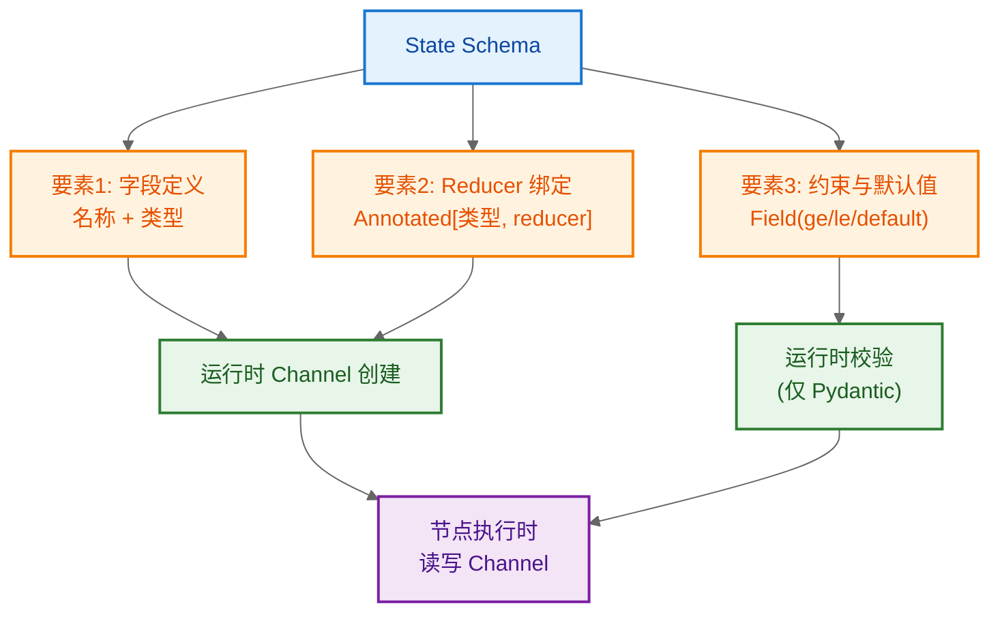

**图 4-1：Schema 三要素与运行时映射**。Schema 的三要素（字段定义、Reducer 绑定、约束默认值）在编译期被解析，运行时转化为 Channel 实例与校验逻辑，支撑节点的读写操作。

#### 4.1.3 Schema 在 LangGraph 中的角色

Schema 不仅是数据结构定义，它贯穿 LangGraph 的整个执行生命周期，承担四重角色：

| 角色 | 作用 | 价值 |
|------|------|------|
| **状态空间定义** | 声明 State 有哪些字段、什么类型 | 明确工作流的数据边界 |
| **通信契约** | 节点按 Schema 读写 State | 节点解耦，独立开发测试 |
| **合并规则载体** | 通过 Annotated 绑定 Reducer | 合并逻辑下沉，节点无需关心 |
| **校验与文档** | Pydantic 可导出 JSON Schema | 防御脏数据，自动生成文档 |

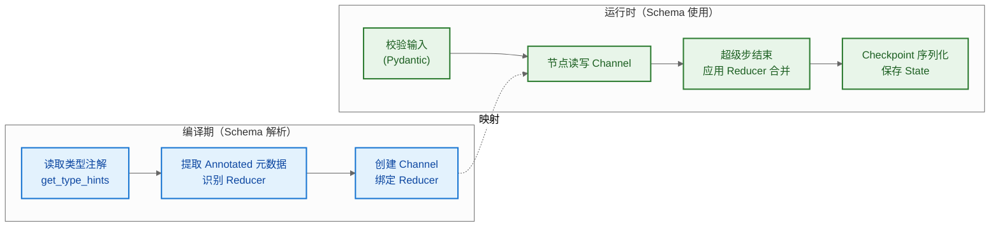

**图 4-2：Schema 在编译期与运行时的双重角色**。编译期解析注解创建 Channel；运行时承担校验、读写、合并、序列化四项职责。

#### 4.1.4 Schema 与传统数据结构的区别

与传统 Python 数据结构（普通 dict / dataclass）相比，LangGraph Schema 有三个本质区别：

```
┌─────────────────────────────────────────────────────────────┐
│         LangGraph Schema vs 传统数据结构                     │
├──────────────┬──────────────────┬───────────────────────────┤
│   维度       │  传统 dict/dataclass │  LangGraph Schema       │
├──────────────┼──────────────────┼───────────────────────────┤
│ 字段合并     │ 手动覆盖           │ Reducer 自动归约          │
│ 并发安全     │ 需自行加锁         │ Reducer 保证确定性合并    │
│ 运行时校验   │ 无                 │ Pydantic 校验拦截脏数据   │
│ 持久化支持   │ 需手动序列化       │ Checkpointer 自动序列化   │
│ 框架感知     │ 框架不可见         │ 框架解析注解创建 Channel  │
└──────────────┴──────────────────┴───────────────────────────┘
```

**核心区别图解**：

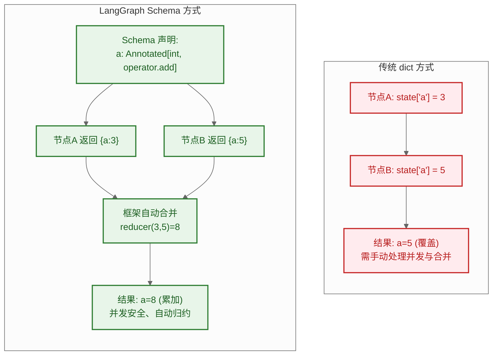

**图 4-3：Schema 与传统数据结构的本质区别**。传统方式由开发者手动处理合并与并发；Schema 方式将合并规则声明在结构中，由框架自动执行，实现"声明式状态管理"。

#### 4.1.5 Schema 的设计哲学

LangGraph Schema 的设计遵循三大哲学原则：

1. **声明式（Declarative）**：开发者声明"State 长什么样、如何合并"，框架负责"何时合并、如何执行"，分离关注点。
2. **类型驱动（Type-Driven）**：通过 Python 类型注解（`Annotated`）承载元数据，类型即文档，类型即行为。
3. **渐进式校验（Progressive Validation）**：TypedDict 提供零开销类型提示，Pydantic 提供运行时校验，按需选择。

> **小结**：Schema 是 LangGraph 状态管理的基石，它将"字段定义 + 合并规则 + 校验约束"三者统一在类型注解中。理解 Schema 的三要素与四重角色，是掌握后续 Reducer 机制、节点通信与持久化的前提。

---

### 4.2 TypedDict 实现

**特点**：轻量、零运行时开销、与类型提示生态兼容。

```python
# -*- coding: utf-8 -*-
"""
TypedDict 实现 LangGraph State 示例
适用场景：轻量级 Agent、快速原型、对运行时校验无强需求
"""
from typing import Annotated, TypedDict
from langgraph.graph import StateGraph, START, END
from langgraph.graph.message import add_messages


# 1. 定义 State Schema
class AgentState(TypedDict):
    """Agent 状态定义。

    - messages: 对话历史，使用 add_messages Reducer 实现消息追加
    - user_name: 当前用户名，无 Reducer，每次更新直接覆盖
    - turn_count: 对话轮数，使用 add Reducer 实现累加
    """
    # Annotated[类型, Reducer] 语法将 Reducer 绑定到字段
    messages: Annotated[list, add_messages]
    user_name: str
    turn_count: Annotated[int, lambda a, b: a + b]  # 自定义累加 Reducer


# 2. 定义节点函数：接收 State，返回部分更新
def greet_node(state: AgentState) -> dict:
    """问候节点：读取用户名，生成欢迎消息。"""
    name = state["user_name"]
    # 仅返回需要更新的字段（部分更新）
    return {
        "messages": [{"role": "assistant", "content": f"你好，{name}！"}],
        "turn_count": 1,  # 累加 1
    }


def ask_node(state: AgentState) -> dict:
    """提问节点：追加一条提问消息。"""
    return {
        "messages": [{"role": "assistant", "content": "请问有什么可以帮您？"}],
        "turn_count": 1,
    }


# 3. 构建图
graph = StateGraph(AgentState)
graph.add_node("greet", greet_node)
graph.add_node("ask", ask_node)
graph.add_edge(START, "greet")
graph.add_edge("greet", "ask")
graph.add_edge("ask", END)

app = graph.compile()

# 4. 执行
result = app.invoke({
    "messages": [],
    "user_name": "张三",
    "turn_count": 0,
})

print("最终消息列表:", result["messages"])
# [{'role': 'assistant', 'content': '你好，张三！'},
#  {'role': 'assistant', 'content': '请问有什么可以帮您？'}]
print("总轮数:", result["turn_count"])  # 2（0 + 1 + 1）
```

**关键说明**：
- `Annotated[list, add_messages]` 中第二个参数即为 Reducer。
- 节点返回的字典**只需包含要更新的字段**，未出现的字段保持不变。
- `turn_count` 使用 `lambda a, b: a + b` 作为内联 Reducer 实现累加。

### 4.3 Pydantic BaseModel 实现

**特点**：运行时数据校验、默认值、字段约束、自动文档生成。

```python
# -*- coding: utf-8 -*-
"""
Pydantic BaseModel 实现 LangGraph State 示例
适用场景：生产级 Agent、需要数据校验与字段约束、需生成 Schema 文档
"""
from typing import Annotated
from pydantic import BaseModel, Field
from langgraph.graph import StateGraph, START, END
from langgraph.graph.message import add_messages


# 1. 定义 State Schema（继承 BaseModel）
class AgentState(BaseModel):
    """Agent 状态定义（Pydantic 版本）。

    Pydantic 提供：
    - 运行时类型校验
    - 字段默认值
    - Field 约束（描述、范围等）
    """
    # 消息列表，使用 add_messages Reducer
    messages: Annotated[list, add_messages] = Field(default_factory=list)

    # 用户名，带默认值和描述
    user_name: str = Field(default="guest", description="当前对话用户名")

    # 对话轮数，带默认值
    turn_count: Annotated[int, lambda a, b: a + b] = Field(default=0)

    # 温度参数，带取值约束
    temperature: float = Field(default=0.7, ge=0.0, le=2.0)


# 2. 定义节点
def respond_node(state: AgentState) -> dict:
    """响应节点：读取校验后的 State，返回更新。"""
    # Pydantic 模型实例：字段已校验，可安全访问
    name = state.user_name
    temp = state.temperature
    return {
        "messages": [{"role": "assistant", "content": f"{name}，温度={temp}"}],
        "turn_count": 1,
    }


# 3. 构建图
graph = StateGraph(AgentState)
graph.add_node("respond", respond_node)
graph.add_edge(START, "respond")
graph.add_edge("respond", END)

app = graph.compile()

# 4. 执行（Pydantic 会校验输入）
result = app.invoke({
    "messages": [],
    "user_name": "李四",
    "temperature": 0.5,
})

print(result["messages"])    # [{'role': 'assistant', 'content': '李四，温度=0.5'}]
print(result["turn_count"])  # 1

# 5. 校验失败示例（取消注释可观察报错）
# app.invoke({"temperature": 3.0})  # ValidationError: temperature > 2.0
```

**关键说明**：
- Pydantic 版本同样使用 `Annotated[类型, reducer]` 绑定 Reducer。
- `Field(default=..., ge=..., le=...)` 提供默认值与范围约束。
- 非法输入会在执行前被拦截并抛出 `ValidationError`，更适合生产环境。

### 4.4 两种方式对比与选型

| 维度 | TypedDict | Pydantic BaseModel |
|------|-----------|-------------------|
| **运行时校验** | 无 | 有 |
| **默认值** | 不支持 | 支持（Field） |
| **字段约束** | 无 | 支持（ge/le/regex 等） |
| **性能开销** | 几乎为零 | 有一定开销 |
| **Schema 导出** | 需手动维护 | 可导出 JSON Schema |
| **IDE 提示** | 良好 | 良好 |
| **适用场景** | 原型、内部工具、性能敏感 | 生产级、对外 API、需校验 |

**选型建议**：
- **快速原型 / 内部工具**：用 `TypedDict`，简单高效。
- **生产级 Agent / 需要数据校验**：用 `Pydantic BaseModel`，防止脏数据进入流程。
- **混合使用**：可在一个图中主 Schema 用 Pydantic，局部辅助 Schema 用 TypedDict。

### 4.5 State Schema 结构关系图

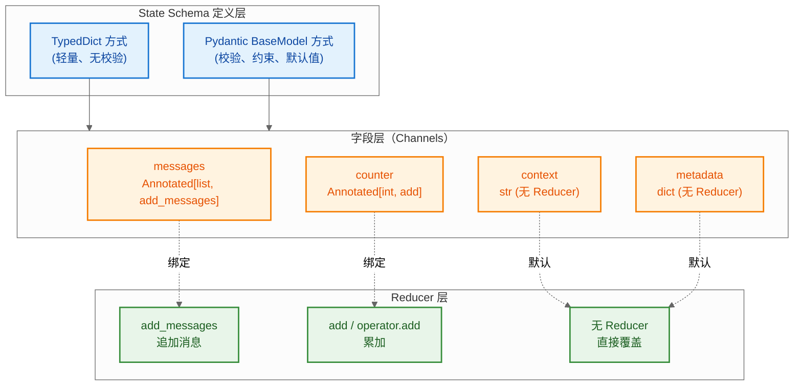

**图 4-4：State Schema 结构关系图**。Schema 定义层（TypedDict / Pydantic）声明字段，每个字段绑定一个 Reducer（或默认覆盖策略），运行时每个字段对应一个独立的 Channel。

---

## 5. Reducer 机制详解

### 5.1 Reducer 概念解释

#### 5.1.1 什么是 Reducer

**Reducer（归约器/合并器）** 是一个纯函数，定义"如何将节点返回的新值与当前 State 中的旧值合并"。它是 LangGraph 状态更新机制的最小语义单元，决定了每个字段在收到更新时的归并行为。

> **术语定义**
> - **Reducer**：签名为 `reducer(left, right) -> result` 的纯函数，负责字段级合并。
> - **left（旧值）**：当前 State 中该字段的值。
> - **right（新值）**：节点返回的更新字典中该字段的值。
> - **result（合并值）**：Reducer 计算后写入新 State 的值。

#### 5.1.2 Reducer 的函数签名与语义

```
┌─────────────────────────────────────────────────────────────┐
│                  Reducer 函数签名与语义                       │
├─────────────────────────────────────────────────────────────┤
│                                                             │
│   reducer(left, right) -> result                            │
│           │      │       │                                   │
│           │      │       └── 合并后的新值，写入 State         │
│           │      └── 节点返回的更新值（new value）            │
│           └── 当前 State 中的旧值（current value）           │
│                                                             │
│   语义分类：                                                 │
│   ─────────                                                 │
│   • 覆盖型: result = right            (默认，无 Reducer)     │
│   • 追加型: result = left + right     (add_messages/add)    │
│   • 累加型: result = left + right     (operator.add, 数字)  │
│   • 极值型: result = max(left, right) (自定义)              │
│   • 合并型: result = {**left, **right} (自定义 dict_merge)  │
│                                                             │
└─────────────────────────────────────────────────────────────┘
```

**签名图解**：

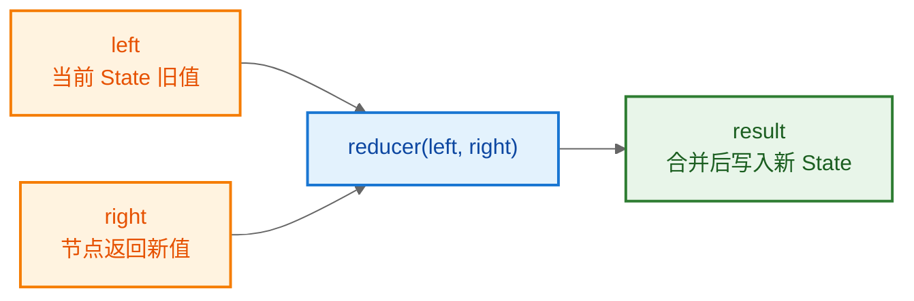

**图 5-1：Reducer 函数签名与数据流**。Reducer 接收旧值与新值，输出合并结果。它是纯函数：相同输入永远产生相同输出，无副作用。

#### 5.1.3 为什么需要 Reducer

若没有 Reducer，LangGraph 的状态更新将面临三大问题：

```
┌─────────────────────────────────────────────────────────────┐
│                 没有 Reducer 的三大问题                      │
├─────────────────────────────────────────────────────────────┤
│                                                             │
│  问题1：并发更新丢失                                         │
│  ─────────────────────                                      │
│  超级步内节点A、B 同时更新字段 a：                            │
│    A 写 a=3，B 写 a=5                                       │
│  无 Reducer → 后写覆盖先写 → 丢失 a=3                        │
│  有 Reducer → reducer(3,5)=8 → 保留两者贡献                 │
│                                                             │
│  问题2：合并语义散落                                          │
│  ─────────────────────                                      │
│  "消息追加""计数器累加""字典合并"等逻辑                       │
│  若由各节点自行实现 → 逻辑分散、难以维护、易出错              │
│  Reducer 将合并逻辑下沉到 Schema 声明 → 集中管理             │
│                                                             │
│  问题3：对话历史丢失                                         │
│  ─────────────────────                                      │
│  消息字段若无 add_messages Reducer → 每次更新覆盖             │
│  → 对话历史只剩最后一条消息 → LLM 失去上下文                  │
│                                                             │
└─────────────────────────────────────────────────────────────┘
```

**有无 Reducer 对比图**：

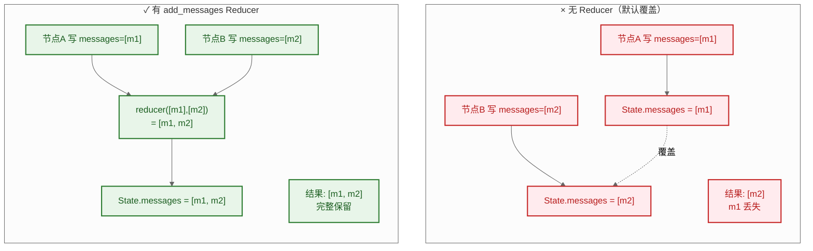

**图 5-2：有无 Reducer 的合并行为对比**。无 Reducer 时并发更新导致覆盖丢失；有 Reducer 时通过归约函数得到确定性合并结果，保证数据完整。

#### 5.1.4 Reducer 的核心特性

Reducer 具备四个关键特性，这些特性使其成为 LangGraph 并发安全与状态一致性的基石：

| 特性 | 说明 | 价值 |
|------|------|------|
| **纯函数** | 相同输入永远产生相同输出，无副作用 | 可独立测试、可复现 |
| **字段级隔离** | 每个字段绑定独立 Reducer，互不影响 | 精细化合并控制 |
| **确定性合并** | 多节点并发更新时结果确定 | 并发安全、无数据竞争 |
| **声明式绑定** | 通过 `Annotated[类型, reducer]` 绑定 | 合并逻辑与业务代码解耦 |

**特性关系图**：

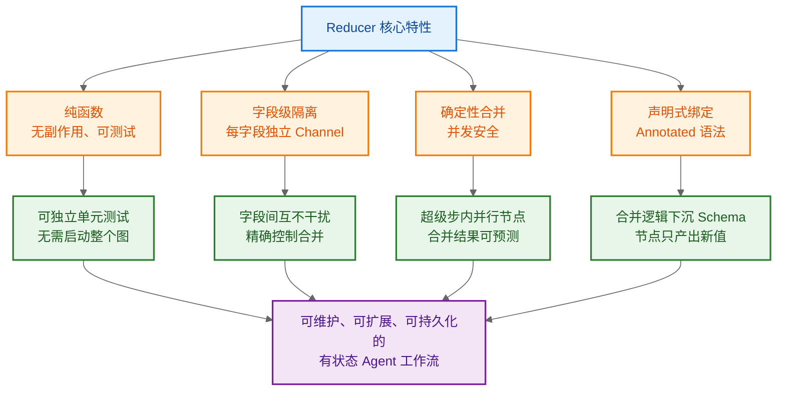

**图 5-3：Reducer 核心特性与价值链**。四大特性（纯函数、字段隔离、确定性、声明式）分别带来可测试、精确控制、并发安全、解耦四大价值，最终汇聚为可维护的有状态工作流。

#### 5.1.5 Reducer 的理论根源

Reducer 概念并非 LangGraph 原创，它借鉴自三个成熟的理论体系：

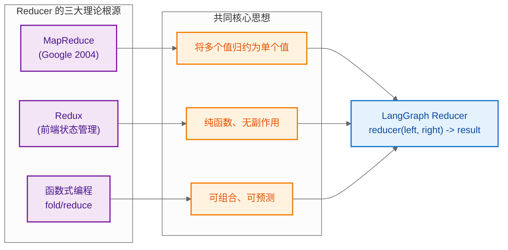

**图 5-4：Reducer 的理论根源**。LangGraph Reducer 融合了 MapReduce 的归约思想、Redux 的纯函数状态管理、函数式编程的 fold 操作，形成字段级合并的工程化实现。

**三种理论对照**：

| 理论体系 | 核心思想 | LangGraph 体现 |
|---------|---------|---------------|
| **MapReduce** | Map 分发 + Reduce 归并 | 节点并行执行（Map）+ Reducer 合并（Reduce） |
| **Redux** | `reducer(state, action) -> newState` | `reducer(left, right) -> result` |
| **函数式 fold** | `fold(f, acc, [x1,x2,...])` | 超级步内多更新逐次 fold 到旧值 |

#### 5.1.6 Reducer 在 LangGraph 中的定位

Reducer 在 LangGraph 的状态管理中处于**承上启下**的核心位置：

```
┌─────────────────────────────────────────────────────────────┐
│                Reducer 在架构中的定位                         │
├─────────────────────────────────────────────────────────────┤
│                                                             │
│  上层：Schema 声明                                           │
│    └─ 通过 Annotated[类型, reducer] 绑定 Reducer            │
│                                                             │
│  ★ 中层：Reducer（本节核心）★                               │
│    └─ 定义字段级合并策略                                      │
│    └─ 纯函数：reducer(left, right) -> result                │
│                                                             │
│  下层：Channel 运行时                                        │
│    └─ 每个字段对应一个 Channel                               │
│    └─ Channel.update() 调用 Reducer 执行合并                │
│                                                             │
└─────────────────────────────────────────────────────────────┘
```

**架构定位图**：

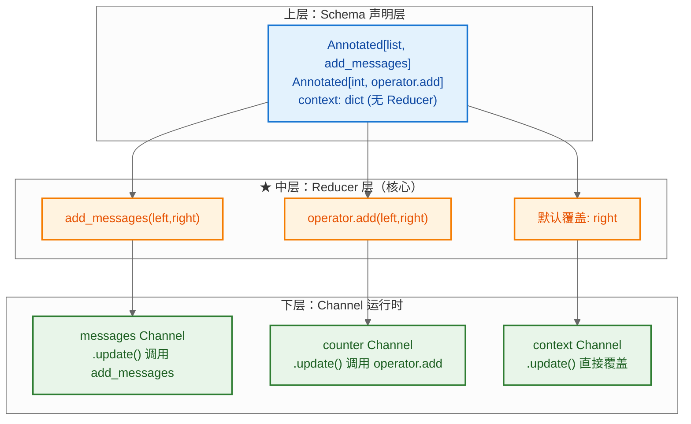

**图 5-5：Reducer 在三层架构中的定位**。Schema 声明 Reducer（上层），Reducer 定义合并策略（中层），Channel 在运行时调用 Reducer 执行合并（下层）。Reducer 是连接声明与执行的桥梁。

> **小结**：Reducer 是 LangGraph 状态合并的核心抽象，它以纯函数形式定义字段级合并策略，解决了并发更新丢失、合并逻辑散落、对话历史丢失三大问题。理解 Reducer 的签名、语义、特性与理论根源，是掌握后续内置 Reducer、自定义 Reducer 与并发场景应用的前提。

---

### 5.2 Reducer 的本质

**Reducer** 是一个签名为 `reducer(left, right) -> result` 的函数：

- `left`：当前 State 中该字段的值（旧值）。
- `right`：节点返回的更新中该字段的值（新值）。
- 返回值：合并后的值，将写入新 State。

> **术语定义**：Reducer 借鉴自 MapReduce / Redux 思想，本质是"如何把新值并入旧值"的策略函数。

### 5.3 内置 Reducer

LangGraph 提供若干常用 Reducer：

| Reducer | 所在模块 | 行为 | 典型字段 |
|---------|---------|------|---------|
| `add_messages` | `langgraph.graph.message` | 追加消息（带 ID 去重） | `messages` |
| `add` | `langgraph.graph.message` | 等价 `operator.add`（列表拼接、数字累加、字符串拼接） | 列表/数字 |
| `operator.add` | Python 标准库 | 同上 | 通用累加 |
| （无，默认） | — | 直接覆盖 | 普通字段 |

**`add_messages` 的特殊行为**：
- 若新消息与已有消息 ID 相同，则**替换**而非追加（用于编辑历史）。
- 若新消息无 ID 或 ID 不冲突，则**追加**。

```python
from typing import Annotated, TypedDict
from langgraph.graph.message import add_messages

class S(TypedDict):
    messages: Annotated[list, add_messages]

# 当前: [{"id":"1","content":"a"}]
# 更新: [{"id":"1","content":"a_new"}, {"id":"2","content":"b"}]
# 结果: [{"id":"1","content":"a_new"}, {"id":"2","content":"b"}]  ← ID=1 被替换
```

### 5.4 自定义 Reducer

当内置 Reducer 不满足需求时，可定义任意函数作为 Reducer。

**示例 1：取最大值**

```python
from typing import Annotated, TypedDict

def max_int(left: int, right: int) -> int:
    """Reducer：取较大值。适用于记录"最高分""最大进度"等单调字段。"""
    return left if left > right else right

class ScoreState(TypedDict):
    # 每次更新取最大值，保证分数只升不降
    best_score: Annotated[int, max_int]
```

**示例 2：字典深合并**

```python
from typing import Annotated, TypedDict

def dict_merge(left: dict, right: dict) -> dict:
    """Reducer：字典浅合并（right 覆盖 left 的同名键）。
    适用于 context / metadata 等需要增量补充的字典字段。
    """
    result = dict(left)
    result.update(right)
    return result

class ContextState(TypedDict):
    context: Annotated[dict, dict_merge]  # 增量合并而非覆盖
```

**示例 3：限制长度的列表追加**

```python
from collections import deque
from typing import Annotated, TypedDict

def bounded_append(left: list, right: list, max_len: int = 5) -> list:
    """Reducer：追加后只保留最近 max_len 条。适用于滑动窗口式历史。"""
    combined = left + right
    return combined[-max_len:]

class WindowState(TypedDict):
    # 使用 functools.partial 固定 max_len 参数
    recent: Annotated[list, bounded_append]
```

### 5.5 Reducer 使用场景

```
┌─────────────────────────────────────────────────────────────┐
│                   Reducer 使用场景决策                        │
├─────────────────────────────────────────────────────────────┤
│                                                             │
│  字段语义            推荐策略            Reducer             │
│  ─────────────      ──────────────      ──────────          │
│  对话历史            追加（去重）        add_messages        │
│  计数器/进度         累加                add / 自定义(+)     │
│  最高分/最大值       取最大              自定义 max          │
│  上下文字典          增量合并            自定义 dict_merge   │
│  当前状态标志        直接覆盖            无（默认）          │
│  有限窗口历史        追加后截断          自定义 bounded      │
│                                                             │
└─────────────────────────────────────────────────────────────┘
```

---

## 6. State 在节点间的流转

节点函数的契约：**接收 State（只读），返回部分更新（dict）**。

```python
# -*- coding: utf-8 -*-
"""State 流转示例：展示节点如何读写 State"""
from typing import Annotated, TypedDict
from langgraph.graph import StateGraph, START, END
from langgraph.graph.message import add_messages


class WorkflowState(TypedDict):
    messages: Annotated[list, add_messages]
    raw_input: str
    processed_text: str
    summary: str


def extract_node(state: WorkflowState) -> dict:
    """节点1：读取 raw_input，输出 processed_text。"""
    raw = state["raw_input"]              # 读
    cleaned = raw.strip().lower()         # 处理
    return {"processed_text": cleaned}    # 写（无 Reducer，覆盖）


def summarize_node(state: WorkflowState) -> dict:
    """节点2：读取 processed_text，输出 summary。"""
    text = state["processed_text"]        # 读上一节点的输出
    return {
        "summary": text[:20] + "...",
        "messages": [{"role": "assistant", "content": f"摘要: {text[:20]}"}],
    }


graph = StateGraph(WorkflowState)
graph.add_node("extract", extract_node)
graph.add_node("summarize", summarize_node)
graph.add_edge(START, "extract")
graph.add_edge("extract", "summarize")   # 顺序边：extract → summarize
graph.add_edge("summarize", END)

app = graph.compile()

result = app.invoke({
    "messages": [],
    "raw_input": "  Hello LangGraph State  ",
    "processed_text": "",
    "summary": "",
})
print(result["processed_text"])  # "hello langgraph state"
print(result["summary"])         # "hello langgraph stat..."
```

**流转要点**：
1. 节点**只能读取**当前 State，不能直接修改传入对象。
2. 节点返回的 dict 中，**只有出现的字段**会被更新。
3. 字段间的依赖通过"先写后读"在图中传递，由边的拓扑顺序保证。

---

## 7. 步骤序列（Sequence）实现

**Sequence（步骤序列）** 指多个节点按固定顺序串联执行，是线性工作流的基础模式。LangGraph 通过顺序边（`add_edge`）实现。

### 7.1 Sequence 概念解释

#### 7.1.1 什么是 Sequence

**Sequence（步骤序列）** 是 LangGraph 中最简单的图结构模式，指多个节点通过**顺序边（Sequential Edge）** 串联，按固定拓扑顺序依次执行的工作流形态。每个节点的输出作为下一节点的输入（通过 State 隐式传递），形成线性的数据处理管线。

> **术语定义**
> - **Sequence**：节点按固定顺序串联的线性执行模式（What）。
> - **Sequential Edge（顺序边）**：通过 `add_edge(A, B)` 声明的固定转移边，表示"A 执行完后必定执行 B"（How）。
> - **Pipeline（流水线）**：Sequence 的典型应用形态，数据沿管线逐步加工（Where）。

#### 7.1.2 Sequence 的结构特征

Sequence 具有三个核心结构特征：

```
┌─────────────────────────────────────────────────────────────┐
│                  Sequence 的三大结构特征                     │
├─────────────────────────────────────────────────────────────┤
│                                                             │
│  特征1：线性拓扑（Linear Topology）                           │
│  ─────────────────────────────                               │
│  节点首尾相连，无分支、无循环、无并行                          │
│  形态：START → A → B → C → END                              │
│                                                             │
│  特征2：固定转移（Fixed Transition）                          │
│  ─────────────────────────────                               │
│  转移目标在编译期确定，运行时不依赖 State                      │
│  每条边都是 add_edge 声明的静态边，非条件边                    │
│                                                             │
│  特征3：数据递进（Data Progression）                          │
│  ─────────────────────────────                               │
│  每个节点读取上游写入的 State 字段，加工后写入新字段           │
│  State 沿序列方向逐步填充，形成数据流水线                     │
│                                                             │
└─────────────────────────────────────────────────────────────┘
```

**结构特征图**：

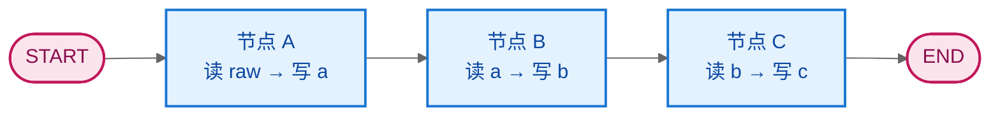

**图 7-1：Sequence 线性拓扑结构**。节点通过顺序边串联，每个节点读取上游产出并写入新字段，State 沿序列方向递进填充。无分支、无循环、无并行。

#### 7.1.3 Sequence 在 LangGraph 中的角色

Sequence 是构建复杂工作流的**基础积木**，承担三重角色：

| 角色 | 作用 | 价值 |
|------|------|------|
| **线性编排** | 按固定顺序组织节点 | 最简单直观的流程控制 |
| **数据流水线** | 节点间通过 State 传递中间结果 | 支持 ETL、数据处理、RAG 等场景 |
| **复杂图的基本组件** | 作为分支、循环的子结构 | 分支的每条路径、循环的每轮迭代本质是 Sequence |

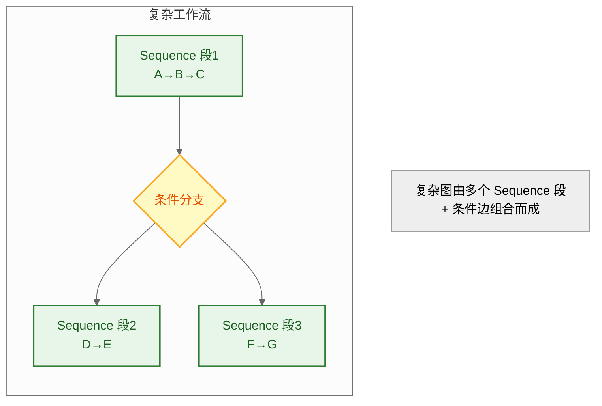

**图 7-2：Sequence 作为复杂图的基本组件**。分支、循环等复杂结构本质由多个 Sequence 段拼接而成。理解 Sequence 是构建复杂工作流的前提。

#### 7.1.4 Sequence 的执行机制

Sequence 的执行遵循 LangGraph 的超级步模型，每个节点在一个独立超级步内执行：

```
┌─────────────────────────────────────────────────────────────┐
│                  Sequence 执行机制                           │
├─────────────────────────────────────────────────────────────┤
│                                                             │
│  超级步 0: START → 调度节点 A                                │
│             A 执行 → 返回更新 → Reducer 合并 → Checkpoint    │
│                                                             │
│  超级步 1: A 完成 → 顺序边触发 → 调度节点 B                   │
│             B 读取合并后 State → 执行 → 返回更新 → 合并       │
│                                                             │
│  超级步 2: B 完成 → 顺序边触发 → 调度节点 C                   │
│             C 执行 → 合并 → Checkpoint                       │
│                                                             │
│  超级步 3: C 完成 → 顺序边到 END → 返回最终 State             │
│                                                             │
│  特点：每超级步只执行一个节点（串行），同步屏障保证            │
│        下一节点看到上一节点合并后的稳定 State                 │
│                                                             │
└─────────────────────────────────────────────────────────────┘
```

**执行时序图**：

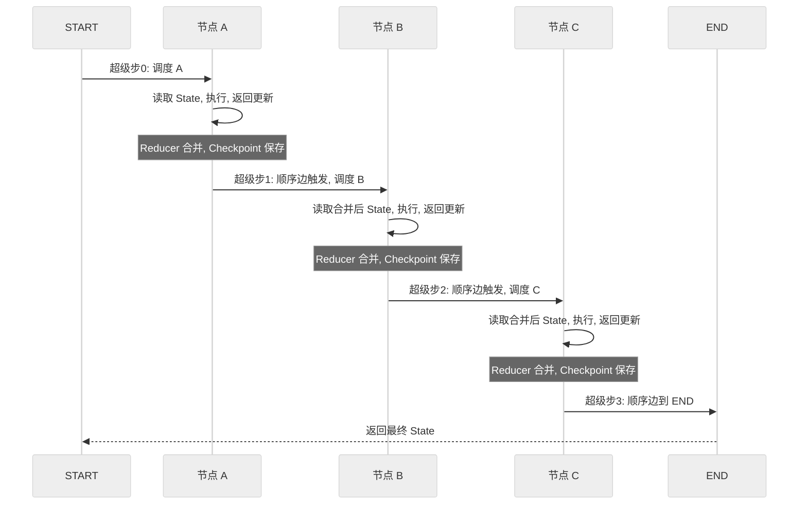

**图 7-3：Sequence 执行时序**。每个节点在独立超级步内执行，顺序边在节点完成后触发下一节点。同步屏障保证下一节点读取的是上一节点 Reducer 合并后的稳定 State。

#### 7.1.5 Sequence 与其他图结构对比

Sequence 是三种基础图结构之一，与分支、循环形成对比：

```
┌─────────────────────────────────────────────────────────────┐
│              三种基础图结构对比                              │
├──────────────┬────────────┬────────────┬───────────────────┤
│   维度       │  Sequence   │  Branching │  Looping          │
│              │  (序列)     │  (分支)    │  (循环)           │
├──────────────┼────────────┼────────────┼───────────────────┤
│ 拓扑结构     │ 线性        │ DAG        │ Cyclic            │
│ 边类型       │ 顺序边      │ 条件边     │ 条件边+回边       │
│ 转移决策     │ 编译期固定  │ 运行期动态 │ 运行期动态        │
│ 执行路径数   │ 1 条        │ N 条分支   │ 1 条（含循环）    │
│ 典型场景     │ ETL/RAG     │ 分类路由   │ ReAct/迭代优化    │
│ API          │ add_edge    │ add_cond   │ add_cond+回边     │
└──────────────┴────────────┴────────────┴───────────────────┘
```

**三种结构图示**：

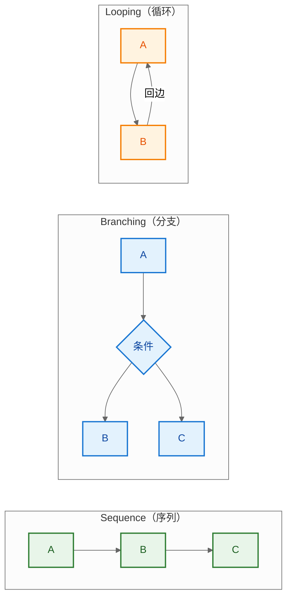

**图 7-4：三种基础图结构对比**。Sequence 是最简单的线性结构；Branching 通过条件边实现多路径；Looping 通过条件边+回边实现循环。复杂工作流通常是三者的组合。

#### 7.1.6 Sequence 的适用场景与局限

**适用场景**：

| 场景 | 典型序列 | 说明 |
|------|---------|------|
| **ETL 数据处理** | extract → transform → load | 每阶段处理数据后传递给下一阶段 |
| **RAG 检索增强** | query → retrieve → rerank → generate | 线性流水线，每步加工查询或结果 |
| **文档处理** | parse → chunk → embed → store | 固定步骤的文档预处理管线 |
| **简单 Agent** | input → classify → respond → output | 无需循环或分支的简单对话流 |

**局限性**：

```
┌─────────────────────────────────────────────────────────────┐
│                  Sequence 的局限性                           │
├─────────────────────────────────────────────────────────────┤
│                                                             │
│  1. 无法表达条件分支                                         │
│     → 需要条件边（第8章）                                    │
│                                                             │
│  2. 无法表达循环迭代                                         │
│     → 需要条件边 + 回边形成环                                │
│                                                             │
│  3. 无法表达并行处理                                         │
│     → 需要条件边返回 list 触发扇出                           │
│                                                             │
│  4. 路径单一，无法根据 State 动态调整                        │
│     → 所有节点必执行，无法跳过或重复                         │
│                                                             │
└─────────────────────────────────────────────────────────────┘
```

> **小结**：Sequence 是 LangGraph 最简单的图结构，通过顺序边串联节点形成线性流水线。它具有线性拓扑、固定转移、数据递进三大特征，是 ETL、RAG 等线性工作流的理想选择，也是构建分支、循环等复杂图结构的基础组件。理解 Sequence 的执行机制与局限，有助于在合适场景选择合适的图结构。

---

### 7.2 实现案例：数据处理流水线

```python
# -*- coding: utf-8 -*-
"""
步骤序列实现案例：三阶段数据处理流水线
流程：fetch → transform → store
"""
from typing import Annotated, TypedDict
from langgraph.graph import StateGraph, START, END
from langgraph.graph.message import add_messages


class PipelineState(TypedDict):
    """流水线状态。"""
    messages: Annotated[list, add_messages]
    source: str               # 数据源标识
    fetched_data: list        # 拉取的原始数据
    transformed_data: list    # 转换后的数据
    stored_count: int         # 存储条数


# 节点1：拉取数据
def fetch_node(state: PipelineState) -> dict:
    """模拟从数据源拉取数据。"""
    source = state["source"]
    # 实际场景：调用 API / 查询数据库
    data = [f"{source}_item_{i}" for i in range(3)]
    return {
        "fetched_data": data,
        "messages": [{"role": "system", "content": f"已拉取 {len(data)} 条"}],
    }


# 节点2：转换数据
def transform_node(state: PipelineState) -> dict:
    """对拉取的数据做转换（大写）。"""
    data = state["fetched_data"]
    transformed = [item.upper() for item in data]
    return {"transformed_data": transformed}


# 节点3：存储数据
def store_node(state: PipelineState) -> dict:
    """模拟存储转换后的数据。"""
    data = state["transformed_data"]
    # 实际场景：写入数据库 / 文件系统
    return {
        "stored_count": len(data),
        "messages": [{"role": "system", "content": f"已存储 {len(data)} 条"}],
    }


# 构建序列图
graph = StateGraph(PipelineState)
graph.add_node("fetch", fetch_node)
graph.add_node("transform", transform_node)
graph.add_node("store", store_node)

# 顺序边构成序列
graph.add_edge(START, "fetch")
graph.add_edge("fetch", "transform")      # 序列步骤 1→2
graph.add_edge("transform", "store")      # 序列步骤 2→3
graph.add_edge("store", END)

app = graph.compile()

# 执行
result = app.invoke({
    "messages": [],
    "source": "api",
    "fetched_data": [],
    "transformed_data": [],
    "stored_count": 0,
})
print("转换结果:", result["transformed_data"])  # ['API_ITEM_0', 'API_ITEM_1', 'API_ITEM_2']
print("存储数:", result["stored_count"])        # 3
```

### 7.3 执行流程图

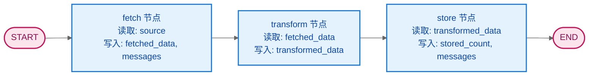

**图 7-5：步骤序列执行流程图**。每个节点读取上一节点写入的字段，形成数据流水线。State 字段沿序列方向逐步填充。

**序列特点**：
- 拓扑顺序严格固定，无分支。
- 每个超级步执行一个节点（串行）。
- 适合 ETL、数据处理、固定步骤的 RAG 流程等场景。

---

## 8. 条件边（Conditional Edges）

### 8.1 条件边概念解释

#### 8.1.1 什么是条件边

**条件边（Conditional Edge）** 是连接源节点到多个可能目标节点的**动态转移边**，其目标由路由函数 `path(state)` 在运行时读取当前 State 后决定。它是 LangGraph 实现分支、循环、扇出等动态控制流的核心机制，使工作流具备"数据驱动路由"能力。

> **术语定义**
> - **Conditional Edge（条件边）**：运行时动态决定目标的转移边（What）。
> - **Path（路由函数）**：签名为 `path(state) -> str | list[str]` 的纯函数，读取 State 返回路由键（How）。
> - **Path Map（映射表）**：将路由键映射为实际节点名的字典，实现路由逻辑与节点命名的解耦（Where）。

#### 8.1.2 条件边的三要素

一个完整的条件边由三个核心要素构成：

```
┌─────────────────────────────────────────────────────────────┐
│                  条件边三要素                                │
├─────────────────────────────────────────────────────────────┤
│                                                             │
│  要素1：源节点（Source Node）                                 │
│  ─────────────────────                                       │
│  条件边的起点，执行完毕后触发路由决策                         │
│  API: add_conditional_edges(source=..., ...)                │
│                                                             │
│  要素2：路由函数（Path Function）                             │
│  ─────────────────────                                       │
│  纯函数，接收 State，返回路由键（字符串或列表）                │
│  API: path=router  其中 router(state) -> str | list[str]    │
│                                                             │
│  要素3：映射表（Path Map）                                    │
│  ─────────────────────                                       │
│  将路由键映射为实际节点名或 END                              │
│  API: path_map={"continue": "node_b", "end": END}           │
│  省略时：路由键本身即为节点名                                │
│                                                             │
└─────────────────────────────────────────────────────────────┘
```

**三要素协作图**：

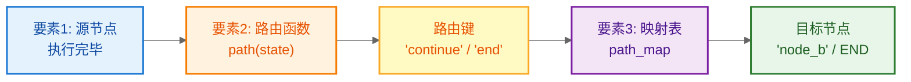

**图 8-1：条件边三要素协作流程**。源节点执行完毕 → 路由函数读取 State 返回路由键 → 映射表将键转为实际目标节点。三要素解耦：路由函数只关心语义，映射表负责节点定位。

#### 8.1.3 条件边在 LangGraph 中的角色

条件边在 LangGraph 的控制流中承担三重角色，对应三种图结构：

| 角色 | 作用 | 图结构 | 典型场景 |
|------|------|--------|---------|
| **分支（Branching）** | 根据 State 路由到不同处理路径 | DAG（有向无环图） | 情感分析→正面/负面/中性 |
| **循环（Looping）** | 通过回边形成环，实现迭代 | Cyclic（有向有环图） | ReAct Agent、迭代优化 |
| **扇出（Fan-out）** | 返回 list 并行调度多节点 | Parallel（并行汇聚） | 多源数据并行采集 |

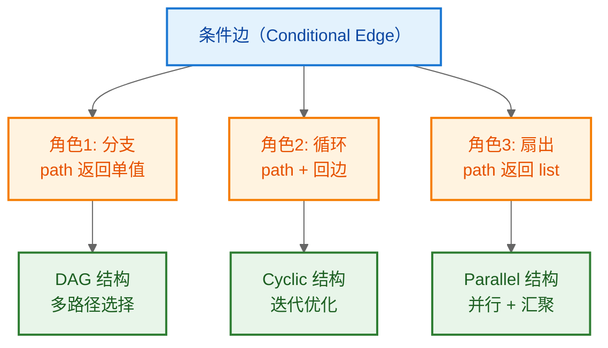

**图 8-2：条件边的三重角色与对应图结构**。同一个条件边机制，通过路由函数返回单值/回边/列表，分别实现分支、循环、扇出三种控制流模式。

#### 8.1.4 条件边与静态边的本质区别

条件边与静态边（`add_edge`）是 LangGraph 两种转移机制，本质区别在于"转移决策时机"：

```
┌─────────────────────────────────────────────────────────────┐
│            条件边 vs 静态边 本质区别                         │
├──────────────┬──────────────────┬───────────────────────────┤
│   维度       │  静态边 add_edge  │  条件边 add_conditional  │
├──────────────┼──────────────────┼───────────────────────────┤
│ 决策时机     │ 编译期            │ 运行期                    │
│ 决策依据     │ 固定拓扑          │ 当前 State                │
│ 目标数量     │ 1 个固定          │ N 个候选（动态选择）      │
│ 是否读 State │ 否                │ 是                        │
│ 控制能力     │ 线性顺序          │ 分支/循环/扇出            │
│ 灵活性       │ 低                │ 高                        │
│ 典型用途     │ Sequence 流水线   │ ReAct/分类/迭代           │
└──────────────┴──────────────────┴───────────────────────────┘
```

**对比图解**：

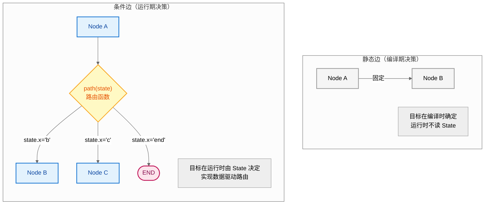

**图 8-3：条件边 vs 静态边**。静态边目标固定（编译期确定）；条件边目标动态（运行期由路由函数根据 State 决定），实现"数据驱动路由"。

#### 8.1.5 条件边的工作流程

条件边在一次路由决策中经历以下步骤：

```
┌─────────────────────────────────────────────────────────────┐
│                  条件边工作流程                              │
├─────────────────────────────────────────────────────────────┤
│                                                             │
│  步骤1: 源节点执行完毕                                       │
│    └─ 节点返回更新 dict                                      │
│                                                             │
│  步骤2: Reducer 合并更新                                     │
│    └─ 生成新的 State（含路由决策所需字段）                   │
│                                                             │
│  步骤3: 调用路由函数 path(state)                             │
│    └─ 读取合并后的 State                                     │
│    └─ 返回路由键（str 或 list[str]）                         │
│                                                             │
│  步骤4: 查询 path_map                                        │
│    └─ 将路由键映射为实际节点名                               │
│                                                             │
│  步骤5: 调度目标节点                                         │
│    └─ str → 调度单个节点                                     │
│    └─ list → 并行调度多个节点（扇出）                        │
│    └─ END → 终止执行                                         │
│                                                             │
└─────────────────────────────────────────────────────────────┘
```

**工作流程时序图**：

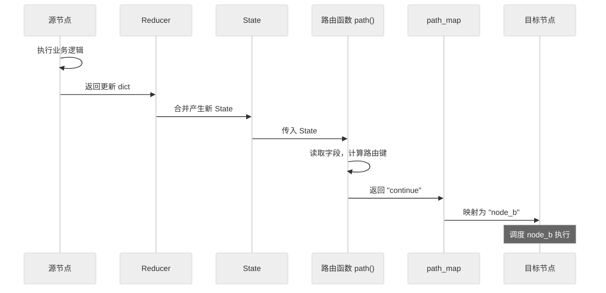

**图 8-4：条件边工作流程时序**。源节点完成 → Reducer 合并产生新 State → 路由函数读取 State 返回路由键 → path_map 映射为目标节点 → 调度执行。条件边的决策完全依赖 Reducer 合并后的 State。

#### 8.1.6 条件边的核心特性

条件边具备五个关键特性：

| 特性 | 说明 | 价值 |
|------|------|------|
| **数据驱动** | 路由由 State 内容决定 | 工作流自适应数据变化 |
| **纯函数路由** | path 函数无副作用 | 可独立测试、可复现 |
| **解耦设计** | path_map 分离路由键与节点名 | 节点重命名不影响路由逻辑 |
| **多路扇出** | 返回 list 触发并行 | 支持并行处理 |
| **循环支持** | 回边形成环 | 支持迭代优化 |

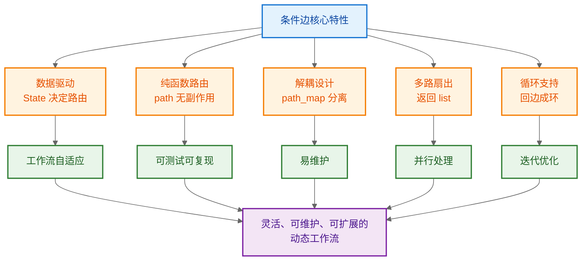

**图 8-5：条件边核心特性与价值链**。五大特性带来自适应、可测试、易维护、并行、迭代五大价值，最终汇聚为灵活的动态工作流能力。

#### 8.1.7 条件边的理论依据

条件边的动态路由机制有坚实的理论基础：

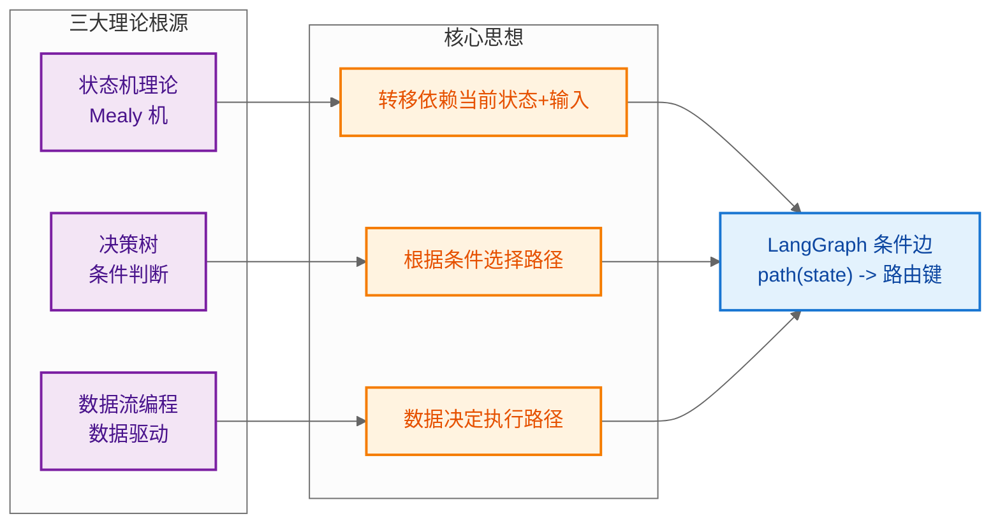

**图 8-6：条件边的理论根源**。条件边融合了状态机理论（Mealy 机：转移依赖状态与输入）、决策树（条件分支）、数据流编程（数据驱动执行），实现数据驱动的动态路由。

**理论对照**：

| 理论体系 | 核心思想 | LangGraph 体现 |
|---------|---------|---------------|
| **状态机（Mealy 机）** | 转移 = f(当前状态, 输入) | `path(state)` = 转移函数 |
| **决策树** | 根据条件选择分支 | `path_map` 定义分支映射 |
| **数据流编程** | 数据决定执行路径 | State 字段驱动路由决策 |

> **小结**：条件边是 LangGraph 动态控制流的核心，由源节点、路由函数、映射表三要素构成。它通过运行期读取 State 决定转移目标，实现分支、循环、扇出三种控制模式。条件边与 Reducer 协同工作：Reducer 合并产生新 State，条件边读取新 State 决定路由，形成数据驱动的控制闭环。理解条件边的三要素、三角色、五特性与理论根源，是掌握后续工作原理与多种实现案例的前提。

---

### 8.2 工作原理

**条件边（Conditional Edge）** 根据当前 State 动态决定下一个节点，是实现分支、循环、动态路由的核心机制。

**工作流程**：

```
┌─────────────────────────────────────────────────────────────┐
│                  条件边工作流程                               │
├─────────────────────────────────────────────────────────────┤
│                                                             │
│   当前节点执行完毕                                           │
│          │                                                  │
│          ▼                                                  │
│   ┌──────────────┐                                          │
│   │ 路由函数      │  输入: 当前 State                         │
│   │ router(state) │  输出: 下一节点名称(str) 或 节点列表      │
│   └──────────────┘                                          │
│          │                                                  │
│          ▼                                                  │
│   ┌──────────────────────────────────┐                      │
│   │ add_conditional_edges(           │                      │
│   │   source="node_a",               │                      │
│   │   path=router,                   │                      │
│   │   path_map={                     │  ← 可选：映射表       │
│   │     "continue": "node_b",        │                      │
│   │     "retry":   "node_a",         │                      │
│   │     "end":     END               │                      │
│   │   }                             │                      │
│   │ )                               │                      │
│   └──────────────────────────────────┘                      │
│          │                                                  │
│          ▼                                                  │
│   根据 router 返回值跳转到对应节点                            │
│                                                             │
└─────────────────────────────────────────────────────────────┘
```

**API 签名**：

```python
graph.add_conditional_edges(
    source: str,                # 源节点名称
    path: Callable[[State], str | list[str]],  # 路由函数
    path_map: dict | list | None = None,       # 可选映射
)
```

- `path` 返回值若为字符串，需是 `path_map` 的键或节点名。
- `path_map` 将路由函数返回值映射为实际节点名，提供解耦。
- 返回列表时表示并行扇出到多个节点。

---

### 8.3 案例一：基于工具调用的路由

**场景**：LLM 决定是否调用工具。若返回 tool_calls，则路由到工具节点；否则结束。

```python
# -*- coding: utf-8 -*-
"""
条件边案例一：基于工具调用的路由
流程：LLM → (有 tool_calls?) → 工具节点 → 回到 LLM
                              → END
"""
from typing import Annotated, TypedDict
from langchain_core.messages import HumanMessage
from langchain_openai import ChatOpenAI
from langgraph.graph import StateGraph, START, END
from langgraph.graph.message import add_messages


class AgentState(TypedDict):
    messages: Annotated[list, add_messages]
    # 工具调用次数（用于演示 Reducer）
    tool_call_count: Annotated[int, lambda a, b: a + b]


# 模拟 LLM 与工具
llm = ChatOpenAI(model="gpt-4o-mini")

def call_model(state: AgentState) -> dict:
    """调用 LLM，返回响应消息。"""
    response = llm.invoke(state["messages"])
    return {"messages": [response]}


def call_tool(state: AgentState) -> dict:
    """执行工具调用。"""
    last_msg = state["messages"][-1]
    # 实际场景：根据 tool_calls 执行对应工具
    return {
        "messages": [{"role": "tool", "content": "工具执行结果"}],
        "tool_call_count": 1,
    }


def should_use_tool(state: AgentState) -> str:
    """路由函数：判断是否需要调用工具。"""
    last_msg = state["messages"][-1]
    # 若 LLM 响应中包含 tool_calls，则路由到 "tool"
    if hasattr(last_msg, "tool_calls") and last_msg.tool_calls:
        return "call_tool"
    return "end"


# 构建图
graph = StateGraph(AgentState)
graph.add_node("llm", call_model)
graph.add_node("tool", call_tool)

graph.add_edge(START, "llm")
# 条件边：从 llm 出发，根据 should_use_tool 决定去向
graph.add_conditional_edges(
    source="llm",
    path=should_use_tool,
    path_map={
        "call_tool": "tool",   # 需要工具 → tool 节点
        "end": END,            # 不需要 → 结束
    },
)
graph.add_edge("tool", "llm")  # 工具执行后回到 LLM

app = graph.compile()
```

**流程图**：

```mermaid
%%{init: {'theme':'neutral'}}%%
flowchart TD
    S([START]) --> LLM["llm 节点<br/>调用 LLM"]
    LLM --> R{"should_use_tool<br/>state.messages[-1].tool_calls?"}
    R -->|有 tool_calls| TOOL["tool 节点<br/>执行工具"]
    R -->|无 tool_calls| E([END])
    TOOL --> LLM

    classDef se fill:#fce4ec,stroke:#c2185b,stroke-width:2px,color:#880e4f
    classDef node fill:#e3f2fd,stroke:#1976d2,stroke-width:2px,color:#0d47a1
    classDef dec fill:#fff9c4,stroke:#f9a825,stroke-width:2px,color:#e65100
    class S,E se
    class LLM,TOOL node
    class R dec
```

**图 8-7：基于工具调用的条件路由流程图**。这是典型的 ReAct 循环：LLM 思考 → 调用工具 → 观察结果 → 继续思考，直到无需工具则结束。

---

### 8.4 案例二：基于状态字段的分支决策

**场景**：根据用户输入的情感倾向路由到不同处理节点（正面/负面/中性）。

```python
# -*- coding: utf-8 -*-
"""
条件边案例二：基于状态字段的分支决策
流程：classify → (情感) → 正面响应 / 负面响应 / 中性响应 → END
"""
from typing import Annotated, TypedDict
from langgraph.graph import StateGraph, START, END
from langgraph.graph.message import add_messages


class SentimentState(TypedDict):
    messages: Annotated[list, add_messages]
    user_input: str
    sentiment: str          # 情感分类结果
    response: str           # 最终响应


def classify_node(state: SentimentState) -> dict:
    """情感分类节点：简单关键词判断（实际可用 LLM）。"""
    text = state["user_input"].lower()
    if any(w in text for w in ["好", "棒", "喜欢", "good"]):
        sentiment = "positive"
    elif any(w in text for w in ["差", "坏", "讨厌", "bad"]):
        sentiment = "negative"
    else:
        sentiment = "neutral"
    return {"sentiment": sentiment}


def route_by_sentiment(state: SentimentState) -> str:
    """路由函数：根据 sentiment 字段决定分支。"""
    return state["sentiment"]   # 直接返回字段值作为路由键


def positive_node(state: SentimentState) -> dict:
    return {
        "response": "很高兴您有好的体验！",
        "messages": [{"role": "assistant", "content": "正面响应已生成"}],
    }


def negative_node(state: SentimentState) -> dict:
    return {
        "response": "抱歉给您带来不便，我们会改进。",
        "messages": [{"role": "assistant", "content": "负面响应已生成"}],
    }


def neutral_node(state: SentimentState) -> dict:
    return {
        "response": "已记录您的反馈。",
        "messages": [{"role": "assistant", "content": "中性响应已生成"}],
    }


# 构建图
graph = StateGraph(SentimentState)
graph.add_node("classify", classify_node)
graph.add_node("positive", positive_node)
graph.add_node("negative", negative_node)
graph.add_node("neutral", neutral_node)

graph.add_edge(START, "classify")
# 条件边：根据 sentiment 分支
graph.add_conditional_edges(
    source="classify",
    path=route_by_sentiment,
    path_map={
        "positive": "positive",
        "negative": "negative",
        "neutral": "neutral",
    },
)
# 三个分支汇聚到 END
graph.add_edge("positive", END)
graph.add_edge("negative", END)
graph.add_edge("neutral", END)

app = graph.compile()

# 测试
result = app.invoke({
    "messages": [], "user_input": "这个产品真的很棒", "sentiment": "", "response": ""
})
print(result["response"])  # 很高兴您有好的体验！
```

**流程图**：

```mermaid
%%{init: {'theme':'neutral'}}%%
flowchart TD
    S([START]) --> C["classify 节点<br/>设置 state.sentiment"]
    C --> R{"route_by_sentiment<br/>读取 state.sentiment"}
    R -->|"positive"| P["positive 节点<br/>正面响应"]
    R -->|"negative"| N["negative 节点<br/>负面响应"]
    R -->|"neutral"| U["neutral 节点<br/>中性响应"]
    P --> E([END])
    N --> E
    U --> E

    classDef se fill:#fce4ec,stroke:#c2185b,stroke-width:2px,color:#880e4f
    classDef node fill:#e3f2fd,stroke:#1976d2,stroke-width:2px,color:#0d47a1
    classDef dec fill:#fff9c4,stroke:#f9a825,stroke-width:2px,color:#e65100
    class S,E se
    class C,P,N,U node
    class R dec
```

**图 8-8：基于状态字段的分支决策流程图**。分类节点将情感写入 State，路由函数读取该字段，通过 `path_map` 映射到对应处理节点，形成三分支汇聚结构。

---

### 8.5 案例三：基于迭代次数的循环控制

**场景**：让 LLM 迭代优化答案，最多迭代 N 次，达到质量阈值或上限则结束。

```python
# -*- coding: utf-8 -*-
"""
条件边案例三：基于迭代次数的循环控制
流程：generate → (评估) → 不满意且未超限 → 回到 generate
                      → 满意或超限 → END
"""
from typing import Annotated, TypedDict
from langgraph.graph import StateGraph, START, END
from langgraph.graph.message import add_messages


class IterState(TypedDict):
    messages: Annotated[list, add_messages]
    draft: str
    score: int
    iteration: Annotated[int, lambda a, b: a + b]   # 累加迭代次数
    max_iterations: int


MAX_ITER = 3   # 最大迭代次数


def generate_node(state: IterState) -> dict:
    """生成/优化草稿。"""
    it = state["iteration"]
    # 首次生成，后续基于上轮反馈优化
    if it == 0:
        draft = "初版答案"
    else:
        draft = f"第{it+1}版优化答案（基于上轮评分{state['score']}）"
    return {
        "draft": draft,
        "iteration": 1,   # 每轮 +1
    }


def evaluate_node(state: IterState) -> dict:
    """评估草稿质量，打分。"""
    # 简化：随迭代次数提升分数（模拟质量改善）
    score = min(80 + state["iteration"] * 10, 95)
    return {"score": score}


def should_continue(state: IterState) -> str:
    """路由函数：综合判断是否继续迭代。"""
    # 条件1：分数达标 → 结束
    if state["score"] >= 90:
        return "end"
    # 条件2：超过最大迭代次数 → 结束
    if state["iteration"] >= state["max_iterations"]:
        return "end"
    # 否则继续迭代
    return "continue"


# 构建图
graph = StateGraph(IterState)
graph.add_node("generate", generate_node)
graph.add_node("evaluate", evaluate_node)

graph.add_edge(START, "generate")
graph.add_edge("generate", "evaluate")
# 条件边：从 evaluate 出发，决定回到 generate 或结束
graph.add_conditional_edges(
    source="evaluate",
    path=should_continue,
    path_map={
        "continue": "generate",   # 继续迭代
        "end": END,               # 满足终止条件
    },
)

app = graph.compile()

# 执行
result = app.invoke({
    "messages": [], "draft": "", "score": 0,
    "iteration": 0, "max_iterations": MAX_ITER,
})
print("最终草稿:", result["draft"])
print("最终分数:", result["score"])
print("迭代次数:", result["iteration"])
```

**流程图**：

```mermaid
%%{init: {'theme':'neutral'}}%%
flowchart TD
    S([START]) --> G["generate 节点<br/>生成/优化草稿<br/>iteration += 1"]
    G --> EV["evaluate 节点<br/>打分 state.score"]
    EV --> R{"should_continue<br/>score >= 90?<br/>iteration >= max?"}
    R -->|"未达标且未超限<br/>continue"| G
    R -->|"达标或超限<br/>end"| E([END])

    classDef se fill:#fce4ec,stroke:#c2185b,stroke-width:2px,color:#880e4f
    classDef node fill:#e3f2fd,stroke:#1976d2,stroke-width:2px,color:#0d47a1
    classDef dec fill:#fff9c4,stroke:#f9a825,stroke-width:2px,color:#e65100
    class S,E se
    class G,EV node
    class R dec
```

**图 8-9：基于迭代次数的循环控制流程图**。这是典型的"迭代优化"模式：条件边同时检查质量阈值和迭代上限，任一满足即终止，否则形成 generate→evaluate 的循环。

**三种条件判断方式对比**：

| 案例 | 判断依据 | 路由函数逻辑 | 典型应用 |
|------|---------|------------|---------|
| 案例一 | 消息内容（tool_calls） | 检查 `messages[-1]` 属性 | ReAct Agent |
| 案例二 | 状态字段（sentiment） | 直接返回字段值 | 分类路由 |
| 案例三 | 多条件组合（score + iteration） | 组合多个 State 字段 | 迭代优化 |

---

### 8.6 案例四：多条件组合路由

**场景**：客服系统根据"用户类型"和"问题严重度"两个维度组合路由。

```python
# -*- coding: utf-8 -*-
"""
条件边案例四：多条件组合路由
维度1：用户类型（vip / normal）
维度2：严重度（high / low）
组合：vip+high → 专家坐席；其他 → 普通坐席；normal+low → 自助
"""
from typing import Annotated, TypedDict
from langgraph.graph import StateGraph, START, END
from langgraph.graph.message import add_messages


class TicketState(TypedDict):
    messages: Annotated[list, add_messages]
    user_type: str          # vip / normal
    severity: str           # high / low
    handler: str            # 处理方


def classify_ticket(state: TicketState) -> dict:
    """工单分类节点：确定用户类型与严重度。"""
    # 实际场景：调用 LLM 或规则引擎分类
    return state  # 假设输入已包含 user_type 和 severity


def route_ticket(state: TicketState) -> str:
    """路由函数：组合两个维度决策。"""
    if state["user_type"] == "vip" and state["severity"] == "high":
        return "expert"
    elif state["user_type"] == "normal" and state["severity"] == "low":
        return "self_service"
    else:
        return "standard"


def expert_node(state: TicketState) -> dict:
    return {"handler": "专家坐席", "messages": [{"role": "system", "content": "转专家"}]}


def standard_node(state: TicketState) -> dict:
    return {"handler": "普通坐席", "messages": [{"role": "system", "content": "转普通"}]}


def self_service_node(state: TicketState) -> dict:
    return {"handler": "自助系统", "messages": [{"role": "system", "content": "转自助"}]}


graph = StateGraph(TicketState)
graph.add_node("classify", classify_ticket)
graph.add_node("expert", expert_node)
graph.add_node("standard", standard_node)
graph.add_node("self_service", self_service_node)

graph.add_edge(START, "classify")
graph.add_conditional_edges(
    source="classify",
    path=route_ticket,
    path_map={
        "expert": "expert",
        "standard": "standard",
        "self_service": "self_service",
    },
)
graph.add_edge("expert", END)
graph.add_edge("standard", END)
graph.add_edge("self_service", END)

app = graph.compile()

# 测试组合
for ut, sev in [("vip", "high"), ("vip", "low"), ("normal", "low"), ("normal", "high")]:
    r = app.invoke({
        "messages": [], "user_type": ut, "severity": sev, "handler": ""
    })
    print(f"{ut}+{sev} → {r['handler']}")
# 输出：
# vip+high → 专家坐席
# vip+low → 普通坐席
# normal+low → 自助系统
# normal+high → 普通坐席
```

**流程图**：

```mermaid
%%{init: {'theme':'neutral'}}%%
flowchart TD
    S([START]) --> C["classify 节点<br/>确定 user_type + severity"]
    C --> R{"route_ticket<br/>组合两个维度"}
    R -->|"vip AND high"| EX["expert 节点<br/>专家坐席"]
    R -->|"normal AND low"| SS["self_service 节点<br/>自助系统"]
    R -->|"其他组合"| ST["standard 节点<br/>普通坐席"]
    EX --> E([END])
    SS --> E
    ST --> E

    classDef se fill:#fce4ec,stroke:#c2185b,stroke-width:2px,color:#880e4f
    classDef node fill:#e3f2fd,stroke:#1976d2,stroke-width:2px,color:#0d47a1
    classDef dec fill:#fff9c4,stroke:#f9a825,stroke-width:2px,color:#e65100
    class S,E se
    class C,EX,SS,ST node
    class R dec
```

**图 8-10：多条件组合路由流程图**。路由函数读取多个 State 字段进行组合判断，将复杂决策逻辑集中在一处，便于维护与测试。

---

## 9. 最佳实践

### 9.1 Schema 设计原则

1. **字段最小化**：只保留工作流真正需要的字段，避免 State 膨胀。
2. **语义命名**：字段名应清晰表达用途（`user_input` 优于 `x`）。
3. **Reducer 显式化**：对需要累加/合并的字段显式绑定 Reducer，避免依赖默认覆盖。
4. **控制字段与数据字段分离**：将 `iteration`、`status` 等控制字段与 `messages`、`result` 等数据字段分开，便于维护。

### 9.2 节点设计原则

1. **单一职责**：每个节点只做一件事，便于复用与测试。
2. **部分更新**：节点只返回需要更新的字段，不要返回整个 State。
3. **纯函数**：节点应尽量避免副作用，依赖外部 IO 时通过 State 显式传递。
4. **不修改入参**：不要直接修改传入的 State 对象，只返回更新字典。

### 9.3 条件边设计原则

1. **路由函数纯函数化**：路由函数只读取 State，不产生副作用。
2. **path_map 显式声明**：使用 `path_map` 将路由返回值与节点名解耦，便于重命名。
3. **终止条件优先**：循环类条件边应优先判断终止条件，防止死循环。
4. **默认分支**：多分支路由应有兜底分支，避免未命中导致报错。

### 9.4 生产级建议

1. **使用 Pydantic**：生产环境优先用 Pydantic BaseModel，利用运行时校验防御脏数据。
2. **配合 Checkpointer**：启用 `MemorySaver` / `SqliteSaver` 持久化 State，支持容错与恢复。
3. **限制循环深度**：对循环图设置 `recursion_limit`，防止无限循环。
4. **Schema 版本管理**：State Schema 变更需考虑与历史 Checkpoint 的兼容性。

```python
# 生产级配置示例
from langgraph.checkpoint.memory import MemorySaver

app = graph.compile(
    checkpointer=MemorySaver(),     # 启用状态持久化
    interrupt_before=["human_review"],  # 人工介入节点前暂停
)

# 限制递归深度，防止死循环
result = app.invoke(
    input_state,
    config={"configurable": {"thread_id": "session-1"}, "recursion_limit": 25},
)
```

---

## 10. 图解原理：Schema Reducers、步骤序列与条件边的协同机制

> 本章节以**图结构为核心视角**，从原理高度系统阐述 Schema Reducers、步骤序列（Sequence）与条件边（Conditional Edges）三大机制的定义、作用、实现步骤与协同关系，并引入状态机理论与函数式编程思想作为理论支撑。

### 10.1 Schema Reducers 的定义与核心作用

#### 10.1.1 精确定义

**Schema Reducer** 是绑定在 State Schema 字段上的**归约函数**，签名固定为 `reducer(left, right) -> result`，负责定义"节点的更新如何并入当前 State"。它是 LangGraph 状态合并机制的最小语义单元。

> **术语辨析**
> - **Schema**：声明 State 有哪些字段、什么类型（结构定义）。
> - **Reducer**：声明每个字段的更新如何合并（行为定义）。
> - **Schema Reducer**：两者结合，即"绑定在 Schema 字段上的 Reducer"，同时描述字段结构与合并行为。

#### 10.1.2 核心作用

Schema Reducers 在 LangGraph 框架中承担三大核心作用：

```
┌─────────────────────────────────────────────────────────────┐
│              Schema Reducer 的三大核心作用                    │
├─────────────────────────────────────────────────────────────┤
│                                                             │
│  作用1：语义化合并（Semantic Merge）                          │
│  ─────────────────────────────────────                       │
│  将"覆盖/追加/累加/取极值/深合并"等合并语义                   │
│  从业务代码中剥离，下沉到 Schema 声明，节点无需关心合并逻辑    │
│                                                             │
│  作用2：并发安全（Concurrency Safety）                        │
│  ─────────────────────────────────────                       │
│  同一超级步内多个节点并行更新同一字段时，                      │
│  Reducer 提供确定的合并结果，避免数据竞争与丢失更新           │
│                                                             │
│  作用3：解耦通信（Decoupled Communication）                   │
│  ─────────────────────────────────────                       │
│  节点只负责"产出新值"，不关心"如何并入全局 State"，            │
│  Reducer 在超级步结束后统一执行合并，实现读写分离             │
│                                                             │
└─────────────────────────────────────────────────────────────┘
```

**作用图解**：

```mermaid
%%{init: {'theme':'neutral'}}%%
flowchart LR
    subgraph 无Reducer["× 无 Reducer（默认覆盖）"]
        direction TB
        N1["节点A 写 a=3"] --> S1["State.a = 3"]
        N2["节点B 写 a=5"] --> S2["State.a = 5"]
        S1 -.覆盖.-> S2
        R1["结果: a=5（丢失3）"]
    end
    subgraph 有Reducer["✓ 有 Reducer（operator.add）"]
        direction TB
        N3["节点A 写 a=3"] --> RED["reducer(3,5) = 8"]
        N4["节点B 写 a=5"] --> RED
        RED --> S3["State.a = 8"]
        R2["结果: a=8（累加保留）"]
    end
```

**图 10-1**：有无 Reducer 的合并行为对比。无 Reducer 时并发更新导致覆盖丢失；有 Reducer 时通过归约函数得到确定性合并结果。

---

### 10.2 典型应用场景与业务价值

#### 10.2.1 典型应用场景

| 场景 | 字段语义 | 推荐 Reducer | 业务价值 |
|------|---------|-------------|---------|
| 对话型 Agent | 消息历史 | `add_messages` | 完整保留对话上下文，支持编辑/删除历史 |
| 迭代优化工作流 | 迭代计数 | `operator.add` | 准确统计迭代次数，控制循环上限 |
| 多源数据聚合 | 结果列表 | `operator.add` | 并行 worker 结果自动汇聚 |
| 用户画像构建 | 上下文字典 | 自定义 `dict_merge` | 多节点增量补充画像，避免覆盖 |
| 质量评估 | 最高分 | 自定义 `max` | 保留历史最佳，避免分数回退 |
| 日志/错误收集 | 最近 N 条 | 自定义 `bounded_append` | 限制 State 体积，防止无限增长 |

#### 10.2.2 业务价值图解

```mermaid
%%{init: {'theme':'neutral'}}%%
flowchart TB
    subgraph 业务挑战["业务挑战"]
        C1["多节点并发更新同一字段"]
        C2["对话历史需追加而非覆盖"]
        C3["State 体积需可控"]
        C4["合并逻辑散落各节点难以维护"]
    end
    subgraph Reducer价值["Schema Reducer 价值"]
        V1["并发安全<br/>确定性合并"]
        V2["语义声明<br/>追加/累加/合并"]
        V3["限长控制<br/>自动截断"]
        V4["逻辑下沉<br/>节点解耦"]
    end
    C1 --> V1
    C2 --> V2
    C3 --> V3
    C4 --> V4
    V1 --> R["可维护、可扩展、可持久化的<br/>有状态 Agent 工作流"]
    V2 --> R
    V3 --> R
    V4 --> R

    classDef chal fill:#ffebee,stroke:#c62828,stroke-width:2px,color:#b71c1c
    classDef val fill:#e8f5e9,stroke:#2e7d32,stroke-width:2px,color:#1b5e20
    classDef res fill:#e3f2fd,stroke:#1565c0,stroke-width:2px,color:#0d47a1
    class C1,C2,C3,C4 chal
    class V1,V2,V3,V4 val
    class R res
```

**图 10-2**：Schema Reducer 将并发安全、语义合并、体积控制、逻辑解耦四大价值统一收口到 Schema 声明层，业务节点只需专注产出新值。

---

### 10.3 完整实现步骤：从需求到集成

本节以"多源数据聚合工作流"为例，展示 Schema Reducer 从需求分析到系统集成的完整实现步骤。

#### 10.3.1 实现步骤总览图

```mermaid
%%{init: {'theme':'neutral'}}%%
flowchart LR
    S1["1. 需求分析<br/>识别并发更新字段<br/>确定合并语义"] --> S2["2. 接口设计<br/>定义 Schema 字段<br/>绑定 Reducer"]
    S2 --> S3["3. 逻辑实现<br/>编写节点函数<br/>返回部分更新"]
    S3 --> S4["4. 系统集成<br/>构建图拓扑<br/>配置 Checkpointer"]
    S4 --> S5["5. 验证测试<br/>并发场景验证<br/>合并结果校验"]

    classDef step fill:#e3f2fd,stroke:#1976d2,stroke-width:2px,color:#0d47a1
    class S1,S2,S3,S4,S5 step
```

**图 10-3**：Schema Reducer 实现五步骤。每一步的关键产物是下一步的输入，形成从需求到验证的闭环。

#### 10.3.2 步骤一：需求分析

**目标**：识别哪些字段会被并发更新，确定每个字段的合并语义。

**需求分析决策图**：

```mermaid
%%{init: {'theme':'neutral'}}%%
flowchart TD
    START["字段是否被多个节点更新?"] -->|"是"| Q1["合并语义?"]
    START -->|"否"| DEFAULT["无 Reducer<br/>直接覆盖"]
    Q1 -->|"追加（带ID去重）"| A1["add_messages"]
    Q1 -->|"追加（普通列表）"| A2["operator.add"]
    Q1 -->|"累加（数字）"| A3["operator.add"]
    Q1 -->|"增量合并（字典）"| A4["自定义 dict_merge"]
    Q1 -->|"取极值"| A5["自定义 max/min"]
    Q1 -->|"限长保留"| A6["自定义 bounded_append"]

    classDef q fill:#fff9c4,stroke:#f9a825,stroke-width:2px,color:#e65100
    classDef a fill:#e8f5e9,stroke:#2e7d32,stroke-width:2px,color:#1b5e20
    classDef d fill:#fce4ec,stroke:#c2185b,stroke-width:2px,color:#880e4f
    class START,Q1 q
    class A1,A2,A3,A4,A5,A6 a
    class DEFAULT d
```

**图 10-4**：需求分析决策树。通过两个关键问题（是否并发更新？合并语义是什么？）即可定位到合适的 Reducer。

**关键技术要点**：
- 识别并发字段：查看图中是否存在扇出（fan-out）结构，即一个节点同时路由到多个并行节点。
- 确定合并语义：从业务规则推导（追加/累加/合并/极值）。

#### 10.3.3 步骤二：接口设计

**目标**：定义 State Schema，将 Reducer 绑定到对应字段。

```python
# -*- coding: utf-8 -*-
"""步骤二：接口设计 —— 定义带 Reducer 的 Schema"""
from typing import Annotated, TypedDict
import operator
from langgraph.graph.message import add_messages


def dict_merge(left: dict, right: dict) -> dict:
    """自定义 Reducer：字典增量合并。"""
    result = dict(left)
    result.update(right)
    return result


class AggregationState(TypedDict):
    """多源聚合工作流 State。

    设计要点：
    - results: 并行 worker 产出，用 operator.add 拼接
    - total:   并行 worker 累加，用 operator.add 求和
    - context: 多节点增量补充，用 dict_merge 合并
    - status:  当前状态，无 Reducer，直接覆盖
    """
    results: Annotated[list, operator.add]      # 并发追加
    total: Annotated[int, operator.add]         # 并发累加
    context: Annotated[dict, dict_merge]        # 并发合并
    status: str                                  # 单值覆盖
```

**接口设计要点**：
- 用 `Annotated[类型, reducer]` 显式声明每个并发字段的 Reducer。
- 单值字段（如 `status`）无需 Reducer，默认覆盖即可。
- 自定义 Reducer 必须是具名函数（可序列化），便于 Checkpoint 持久化。

#### 10.3.4 步骤三：逻辑实现

**目标**：编写节点函数，每个节点只返回部分更新，不关心合并细节。

```python
# -*- coding: utf-8 -*-
"""步骤三：逻辑实现 —— 节点只产出新值，不关心合并"""
from typing import Annotated, TypedDict
import operator
from langgraph.graph import StateGraph, START, END
from langgraph.graph.message import add_messages


def dict_merge(left: dict, right: dict) -> dict:
    result = dict(left)
    result.update(right)
    return result


class AggregationState(TypedDict):
    results: Annotated[list, operator.add]
    total: Annotated[int, operator.add]
    context: Annotated[dict, dict_merge]
    status: str


def worker_a(state: AggregationState) -> dict:
    """并行 worker A：只返回新增数据，不关心如何合并。"""
    return {
        "results": ["A的结果"],
        "total": 10,
        "context": {"source_a": "ok"},   # 增量补充
    }


def worker_b(state: AggregationState) -> dict:
    """并行 worker B：只返回新增数据。"""
    return {
        "results": ["B的结果"],
        "total": 20,
        "context": {"source_b": "ok"},
    }


def join_node(state: AggregationState) -> dict:
    """汇聚节点：读取合并后的 State，继续处理。"""
    return {
        "status": f"完成: {len(state['results'])} 条, 总计 {state['total']}",
        "context": {"finalized": True},   # 最后补充
    }
```

**逻辑实现要点**：
- 节点函数是**纯函数**：接收 State，返回更新 dict，不修改入参。
- 节点不调用 Reducer，只产出 `right` 值；合并由框架在超级步结束后统一执行。
- 节点间通过 State 字段名隐式协作，互不感知。

#### 10.3.5 步骤四：系统集成

**目标**：构建图拓扑，配置扇出/汇聚结构与持久化。

```python
# -*- coding: utf-8 -*-
"""步骤四：系统集成 —— 构建图拓扑 + 配置 Checkpointer"""
from langgraph.checkpoint.memory import MemorySaver


def route_to_workers(state: AggregationState) -> list[str]:
    """扇出路由：返回列表，并行调度两个 worker。"""
    return ["worker_a", "worker_b"]


# 构建图
graph = StateGraph(AggregationState)
graph.add_node("worker_a", worker_a)
graph.add_node("worker_b", worker_b)
graph.add_node("join", join_node)

graph.add_edge(START, "worker_a")   # 入口（简化：顺序触发，实际可用条件边扇出）
graph.add_edge("worker_a", "worker_b")
graph.add_edge("worker_b", "join")
graph.add_edge("join", END)

# 集成 Checkpointer，支持 State 持久化
app = graph.compile(checkpointer=MemorySaver())

# 执行
result = app.invoke(
    {"results": [], "total": 0, "context": {}, "status": "init"},
    config={"configurable": {"thread_id": "agg-1"}},
)
print(result["results"])   # ['A的结果', 'B的结果']
print(result["total"])     # 30
print(result["context"])   # {'source_a':'ok','source_b':'ok','finalized':True}
print(result["status"])    # 完成: 2 条, 总计 30
```

**系统集成要点**：
- 扇出结构：条件边返回 `list[str]` 触发并行执行，需配合 Reducer 才能正确合并。
- Checkpointer：具名 Reducer（`dict_merge`）可序列化，支持 State 持久化与恢复。
- `thread_id`：多会话隔离，不同会话的 State 互不干扰。

#### 10.3.6 步骤五：验证测试

**目标**：验证并发场景下 Reducer 合并结果正确性。

```python
# -*- coding: utf-8 -*-
"""步骤五：验证测试 —— 并发合并正确性"""
import operator
from langgraph.graph.message import add_messages


# 单元测试 Reducer 行为
def test_dict_merge():
    left = {"a": 1}
    right = {"b": 2, "a": 10}
    result = dict_merge(left, right)
    assert result == {"a": 10, "b": 2}, "字典合并应保留双方所有键"
    print("dict_merge 测试通过")


def test_operator_add_list():
    assert operator.add(["A"], ["B"]) == ["A", "B"]
    print("列表拼接测试通过")


def test_operator_add_int():
    assert operator.add(10, 20) == 30
    print("数字累加测试通过")


test_dict_merge()
test_operator_add_list()
test_operator_add_int()

# 集成测试：完整工作流执行
result = app.invoke(
    {"results": [], "total": 0, "context": {}, "status": "init"},
)
assert len(result["results"]) == 2, "应汇聚两个 worker 的结果"
assert result["total"] == 30, "累加应为 30"
assert result["context"]["finalized"] is True, "join 节点应补充 finalized"
print("集成测试通过")
```

**验证测试要点**：
- Reducer 是纯函数，可独立单元测试，无需启动整个图。
- 集成测试关注端到端合并结果是否符合业务预期。
- 并发场景测试：确认多 worker 并行更新后 State 一致。

---

### 10.4 条件边的概念与功能定位

#### 10.4.1 概念解释

**条件边（Conditional Edge）** 是连接源节点到多个可能目标节点的**动态转移边**，其目标由路由函数 `path(state)` 读取当前 State 后决定。它是 LangGraph 实现分支、循环、扇出的核心机制。

#### 10.4.2 功能定位图

```mermaid
%%{init: {'theme':'neutral'}}%%
flowchart TB
    subgraph 静态边["静态边（add_edge）"]
        direction LR
        A1["Node A"] -->|固定目标| B1["Node B"]
    end
    subgraph 条件边["条件边（add_conditional_edges）"]
        direction TB
        A2["Node A"] --> R{"path(state)<br/>路由函数"}
        R -->|"state.flag='x'"| B2["Node B"]
        R -->|"state.flag='y'"| C2["Node C"]
        R -->|"state.flag='z'"| D2["Node D"]
    end

    classDef static fill:#f5f5f5,stroke:#9e9e9e,stroke-width:2px
    classDef cond fill:#e3f2fd,stroke:#1976d2,stroke-width:2px,color:#0d47a1
    classDef dec fill:#fff9c4,stroke:#f9a825,stroke-width:2px,color:#e65100
    class A1,B1 static
    class A2,B2,C2,D2 cond
    class R dec
```

**图 10-5**：条件边 vs 静态边。静态边目标固定（编译期确定）；条件边目标动态（运行期由路由函数根据 State 决定），实现"数据驱动路由"。

#### 10.4.3 在状态流转中的功能定位

条件边在 LangGraph 状态流转中承担三种功能：

```
┌─────────────────────────────────────────────────────────────┐
│                  条件边的三大功能定位                         │
├─────────────────────────────────────────────────────────────┤
│                                                             │
│  功能1：分支（Branching）                                    │
│  ────────────────────────                                   │
│  根据 State 字段路由到不同处理路径                           │
│  示例：情感分析 → 正面/负面/中性 三分支                      │
│                                                             │
│  功能2：循环（Looping）                                      │
│  ────────────────────────                                   │
│  通过回边形成环，结合终止条件实现迭代                        │
│  示例：ReAct Agent（LLM↔工具循环）、迭代优化                 │
│                                                             │
│  功能3：扇出（Fan-out）                                      │
│  ────────────────────────                                   │
│  路由函数返回 list[str]，并行调度多个节点                    │
│  示例：多源数据并行采集                                      │
│                                                             │
└─────────────────────────────────────────────────────────────┘
```

**功能与图结构对应关系**：

```mermaid
%%{init: {'theme':'neutral'}}%%
flowchart LR
    subgraph 分支["功能1: 分支（DAG）"]
        direction TB
        B1["源节点"] --> B2["节点A"]
        B1 --> B3["节点B"]
        B1 --> B4["节点C"]
    end
    subgraph 循环["功能2: 循环（Cyclic）"]
        direction TB
        L1["节点A"] --> L2["节点B"]
        L2 -->|"回边"| L1
    end
    subgraph 扇出["功能3: 扇出（Parallel）"]
        direction TB
        F1["源节点"] --> F2["worker_a"]
        F1 --> F3["worker_b"]
        F1 --> F4["worker_c"]
        F2 --> F5["汇聚节点"]
        F3 --> F5
        F4 --> F5
    end

    classDef g fill:#e8f5e9,stroke:#2e7d32,stroke-width:2px,color:#1b5e20
    class B1,B2,B3,B4,L1,L2,F1,F2,F3,F4,F5 g
```

**图 10-6**：条件边的三种功能对应三种图结构。分支构成有向无环图（DAG）；循环构成有向有环图（Cyclic）；扇出构成并行汇聚结构。LangGraph 原生支持这三种结构。

---

### 10.5 条件边与 Schema Reducers 的协同机制

#### 10.5.1 内在关联

条件边与 Schema Reducers 是**控制流与数据流**的协同关系：

```
┌─────────────────────────────────────────────────────────────┐
│            条件边 ↔ Schema Reducers 协同关系                  │
├─────────────────────────────────────────────────────────────┤
│                                                             │
│  条件边（控制流）：决定"下一步执行哪个节点"                   │
│    └─ 依据：读取 State（由 Reducer 合并产生）                │
│                                                             │
│  Schema Reducer（数据流）：决定"State 如何更新"               │
│    └─ 影响：更新后的 State 驱动条件边的路由决策              │
│                                                             │
│  协同闭环：                                                  │
│    Reducer 合并 → 产生新 State → 条件边读取 → 路由决策       │
│    → 执行下一节点 → 返回更新 → Reducer 合并 → ...            │
│                                                             │
└─────────────────────────────────────────────────────────────┘
```

#### 10.5.2 协同工作机制图

```mermaid
%%{init: {'theme':'neutral'}}%%
flowchart TD
    START([超级步 N 开始]) --> EXEC["节点执行<br/>返回更新 dict"]
    EXEC --> RED["Schema Reducer 合并<br/>按字段应用 reducer(left,right)"]
    RED --> NEW["生成新 State"]
    NEW --> PATH["条件边路由函数<br/>path(state) 读取新 State"]
    PATH --> DEC{"路由决策"}
    DEC -->|"继续"| NEXT["调度下一节点<br/>进入超级步 N+1"]
    DEC -->|"扇出"| PAR["并行调度多节点<br/>进入超级步 N+1"]
    DEC -->|"终止"| END([到达 END])
    NEXT --> EXEC
    PAR --> EXEC

    classDef se fill:#fce4ec,stroke:#c2185b,stroke-width:2px,color:#880e4f
    classDef data fill:#e3f2fd,stroke:#1976d2,stroke-width:2px,color:#0d47a1
    classDef ctrl fill:#fff9c4,stroke:#f9a825,stroke-width:2px,color:#e65100
    class START,END se
    class EXEC,RED,NEW,NEXT,PAR data
    class PATH,DEC ctrl
```

**图 10-7**：条件边与 Reducer 的协同闭环。每个超级步内，先由 Reducer 合并产生新 State，再由条件边读取新 State 决定路由。Reducer 负责"数据归约"，条件边负责"控制转移"，二者形成数据驱动控制的闭环。

#### 10.5.3 协同案例：迭代优化工作流

以"生成-评估-迭代"工作流为例，展示 Reducer 与条件边如何协同：

```mermaid
%%{init: {'theme':'neutral'}}%%
flowchart TD
    S([START]) --> G["generate<br/>写 draft, iteration+=1"]
    G -.Reducer合并.-> S1["State.iteration 累加<br/>State.draft 覆盖"]
    S1 --> E["evaluate<br/>写 score"]
    E -.Reducer合并.-> S2["State.score 覆盖"]
    S2 --> R{"should_continue<br/>读取 score + iteration"}
    R -->|"score<90 且 iter<max<br/>(Reducer 产生的值)"| G
    R -->|"score>=90 或 iter>=max"| END([END])

    classDef se fill:#fce4ec,stroke:#c2185b,stroke-width:2px,color:#880e4f
    classDef node fill:#e3f2fd,stroke:#1976d2,stroke-width:2px,color:#0d47a1
    classDef red fill:#e8f5e9,stroke:#2e7d32,stroke-width:2px,color:#1b5e20
    classDef dec fill:#fff9c4,stroke:#f9a825,stroke-width:2px,color:#e65100
    class S,END se
    class G,E node
    class S1,S2 red
    class R dec
```

**图 10-8**：迭代优化协同机制。`iteration` 用累加 Reducer 维护计数，`score` 用覆盖 Reducer 更新当前评分；条件边 `should_continue` 读取这两个 Reducer 产生的字段，组合判断是否继续循环。**没有 Reducer 准确维护 iteration，条件边无法正确控制循环**。

**协同要点总结**：

| 协同维度 | Reducer 的角色 | 条件边的角色 |
|---------|---------------|-------------|
| **数据准备** | 合并节点更新，产生稳定 State | — |
| **决策依据** | — | 读取 State 字段进行路由 |
| **循环控制** | 累加 iteration 字段 | 判断 iteration 是否超限 |
| **分支路由** | 维护分类字段（如 sentiment） | 根据分类字段选择分支 |
| **扇出汇聚** | 合并并行节点的并发更新 | 返回 list 触发扇出 |

---

### 10.6 理论依据：状态机理论与函数式编程

LangGraph 的三大机制（Schema Reducers、步骤序列、条件边）有坚实的理论基础。

#### 10.6.1 状态机理论（State Machine Theory）

**核心思想**：系统行为可建模为有限状态机（FSM），由状态、转移、事件、动作四元组描述。

**LangGraph 与状态机的映射**：

```mermaid
%%{init: {'theme':'neutral'}}%%
flowchart LR
    subgraph FSM["有限状态机（FSM）"]
        direction TB
        FS["State（状态）"]
        FT["Transition（转移）"]
        FE["Event/Condition（事件/条件）"]
        FA["Action（动作）"]
    end
    subgraph LG["LangGraph 对应概念"]
        direction TB
        LS["State（State Schema 实例）"]
        LT["Edge（静态边 + 条件边）"]
        LE["path(state) 路由函数"]
        LA["Node（节点函数）"]
    end
    FS --- LS
    FT --- LT
    FE --- LE
    FA --- LA

    classDef fsm fill:#f3e5f5,stroke:#7b1fa2,stroke-width:2px,color:#4a148c
    classDef lg fill:#e3f2fd,stroke:#1976d2,stroke-width:2px,color:#0d47a1
    class FS,FT,FE,FA fsm
    class LS,LT,LE,LA lg
```

**图 10-9**：LangGraph 是状态机理论的工程化实现。State Schema 定义状态空间，节点是动作（Moore 机：动作作用于状态），条件边是转移函数（Mealy 机：转移依赖输入与当前状态）。

**状态机理论支撑的 LangGraph 特性**：
- **确定性转移**：相同 State + 相同路由函数 → 相同下一节点（可复现）。
- **状态持久化**：State 可快照保存（Checkpoint），对应 FSM 的状态保存。
- **可达性分析**：图编译期可分析哪些节点可达，对应 FSM 的状态可达性。

#### 10.6.2 函数式编程思想（Functional Programming）

**核心思想**：纯函数、不可变性、高阶函数、归约（reduce/fold）。

**LangGraph 与函数式编程的映射**：

```
┌─────────────────────────────────────────────────────────────┐
│           函数式编程思想在 LangGraph 中的体现                 │
├─────────────────────────────────────────────────────────────┤
│                                                             │
│  1. 纯函数（Pure Function）                                  │
│     节点函数：接收 State，返回更新 dict                       │
│     路由函数：接收 State，返回路由键                          │
│     特点：无副作用，相同输入 → 相同输出，可独立测试           │
│                                                             │
│  2. 不可变性（Immutability）                                 │
│     节点不修改传入的 State 对象，只返回新值                   │
│     框架在超级步结束后统一应用 Reducer 生成新 State           │
│     旧 State 保持不变，支持时间旅行                          │
│                                                             │
│  3. 归约（Reduce/Fold）                                      │
│     Schema Reducer 即函数式编程中的 fold 操作：               │
│     reducer(left, right) 将多个更新"折叠"成单个值            │
│     add_messages 是列表 fold，operator.add 是数值 fold       │
│                                                             │
│  4. 高阶函数（Higher-Order Function）                        │
│     add_conditional_edges 接收 path 函数作为参数             │
│     Reducer 本身是函数，作为参数绑定到 Schema 字段           │
│                                                             │
└─────────────────────────────────────────────────────────────┘
```

**归约（fold）与 Reducer 的对应图**：

```mermaid
%%{init: {'theme':'neutral'}}%%
flowchart LR
    subgraph FP["函数式 fold/reduce"]
        direction TB
        I1["初始值 acc"] --> FOLD["fold(f, acc, [x1, x2, x3])<br/>= f(f(f(acc,x1),x2),x3)"]
        FOLD --> O1["最终结果"]
    end
    subgraph LG["LangGraph Reducer"]
        direction TB
        I2["当前 State 值"] --> RED["reducer(current, new_update)<br/>逐次应用"]
        RED --> O2["合并后 State 值"]
    end
    I1 -.同构.-> I2
    FOLD -.同构.-> RED
    O1 -.同构.-> O2

    classDef fp fill:#fff3e0,stroke:#ef6c00,stroke-width:2px,color:#e65100
    classDef lg fill:#e8f5e9,stroke:#2e7d32,stroke-width:2px,color:#1b5e20
    class I1,FOLD,O1 fp
    class I2,RED,O2 lg
```

**图 10-10**：LangGraph Reducer 与函数式 fold 同构。超级步内多个节点的更新 `[x1, x2, x3]` 通过 Reducer 逐次 fold 到当前 State 值上，得到合并结果。这是函数式编程"不可变数据 + 归约"思想的工程应用。

#### 10.6.3 Pregel 模型与超级步

LangGraph 的超级步（Superstep）源自 Google Pregel 图计算模型：

```mermaid
%%{init: {'theme':'neutral'}}%%
flowchart TB
    subgraph Pregel["Pregel 模型"]
        direction TB
        P1["超级步 S0: 一组节点并行执行"]
        P2["超级步 S1: 读取 S0 合并结果，下一组节点执行"]
        P3["超级步 S2: ..."]
        P1 -->|"同步屏障"| P2
        P2 -->|"同步屏障"| P3
    end
    subgraph LangGraph["LangGraph 实现"]
        direction TB
        L1["超级步 N: 调度节点执行"]
        L2["应用 Schema Reducer 合并所有更新"]
        L3["条件边路由，进入超级步 N+1"]
        L1 --> L2 --> L3
    end
    P1 -.对应.-> L1
    P2 -.对应.-> L3

    classDef p fill:#e1f5fe,stroke:#0277bd,stroke-width:2px,color:#01579b
    classDef l fill:#e8f5e9,stroke:#2e7d32,stroke-width:2px,color:#1b5e20
    class P1,P2,P3 p
    class L1,L2,L3 l
```

**图 10-11**：LangGraph 超级步是 Pregel BSP（Bulk Synchronous Parallel）模型的实现。每个超级步内并行执行 + 超级步间同步屏障，保证 Reducer 合并的确定性。

**理论支撑的价值**：
- **确定性**：相同输入 + 相同图 → 相同输出（可复现调试）。
- **可并行**：超级步内的节点可安全并行，Reducer 保证合并正确。
- **可持久化**：State 是不可变快照，可保存为 Checkpoint 支持恢复。

---

### 10.7 本节小结

```mermaid
%%{init: {'theme':'neutral'}}%%
flowchart TB
    subgraph 三大机制["三大机制"]
        direction LR
        M1["Schema Reducers<br/>数据归约"]
        M2["步骤序列<br/>线性编排"]
        M3["条件边<br/>动态路由"]
    end
    subgraph 理论基础["理论基础"]
        direction LR
        T1["状态机理论<br/>状态+转移+动作"]
        T2["函数式编程<br/>纯函数+fold"]
        T3["Pregel/BSP<br/>超级步+同步屏障"]
    end
    T1 -.支撑.-> M2
    T1 -.支撑.-> M3
    T2 -.支撑.-> M1
    T3 -.支撑.-> M1
    T3 -.支撑.-> M3

    classDef mech fill:#e3f2fd,stroke:#1976d2,stroke-width:2px,color:#0d47a1
    classDef theo fill:#f3e5f5,stroke:#7b1fa2,stroke-width:2px,color:#4a148c
    class M1,M2,M3 mech
    class T1,T2,T3 theo
```

**图 10-12**：三大机制与三大理论的支撑关系。Schema Reducers 源于函数式 fold 与 Pregel 归约；步骤序列源于状态机的线性转移；条件边源于状态机的条件转移与 Pregel 的并行调度。理解理论根源有助于在复杂场景下正确设计与调试 LangGraph 工作流。

---

> **小结**：State 是 LangGraph 的数据中枢，理解 Schema 定义、Reducer 合并机制、条件边路由是构建复杂 Agent 工作流的基础。掌握 TypedDict / Pydantic 两种定义方式、自定义 Reducer、多种条件路由模式后，即可应对绝大多数有状态 Agent 场景。
