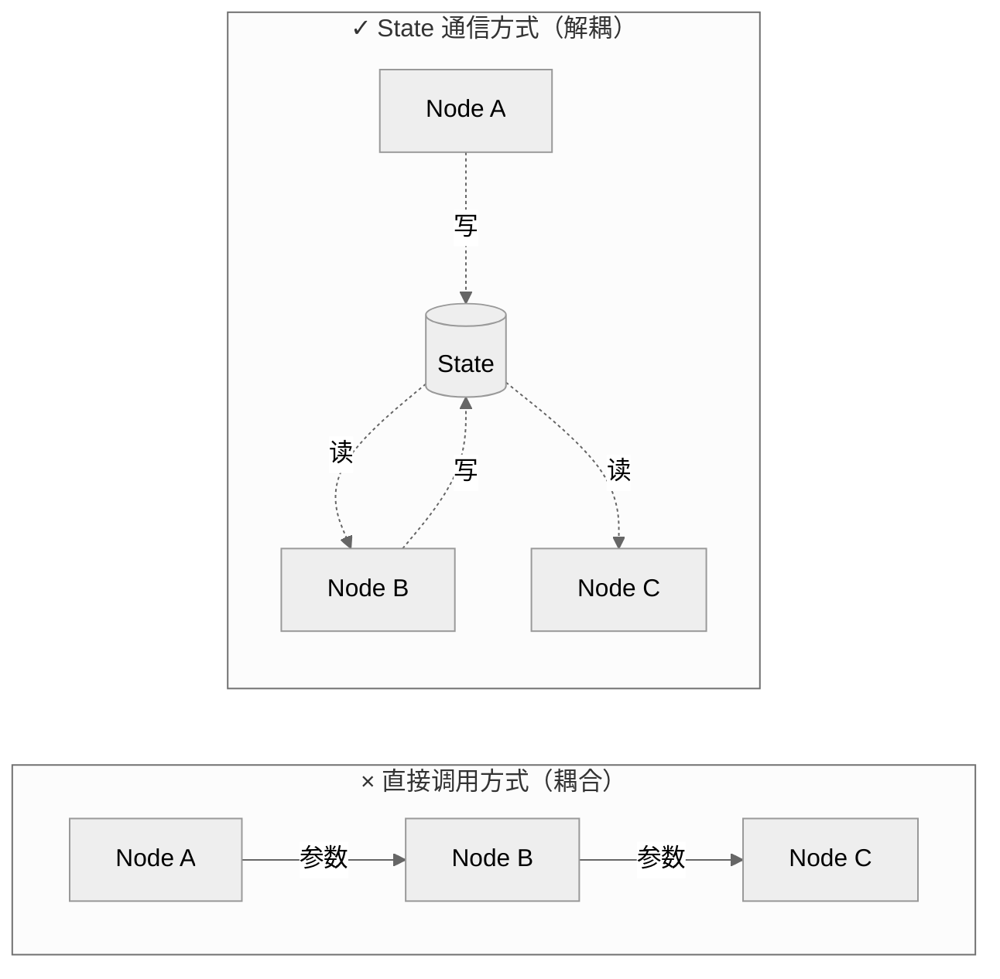
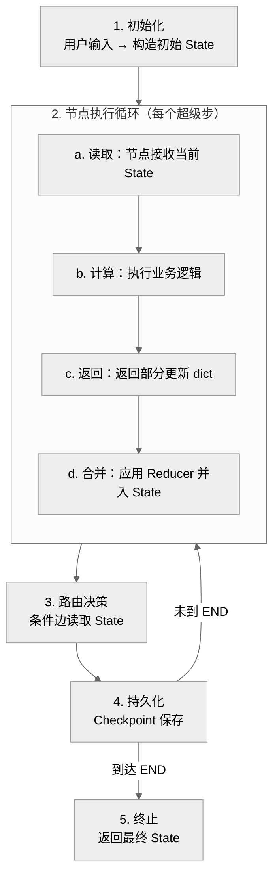
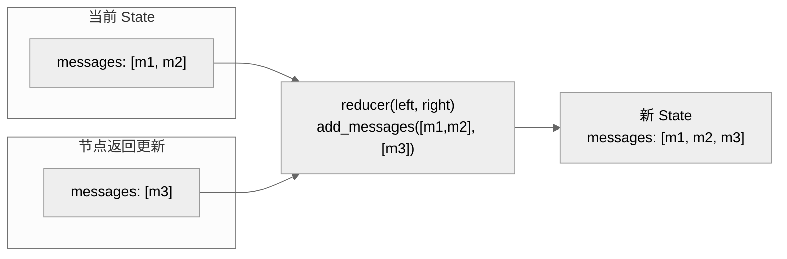
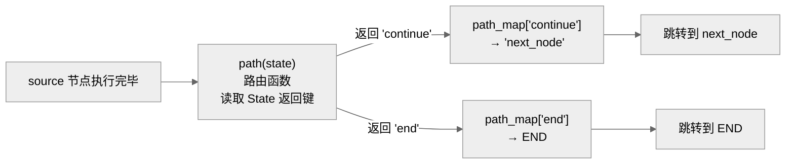
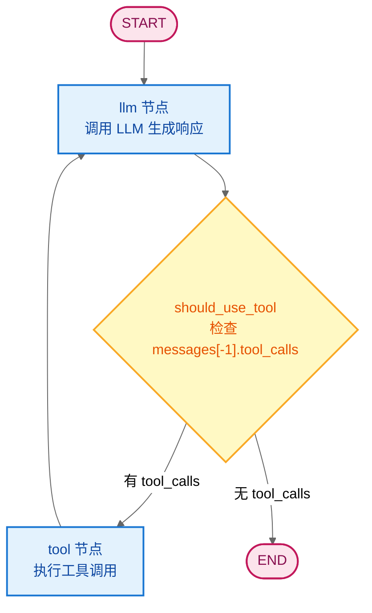
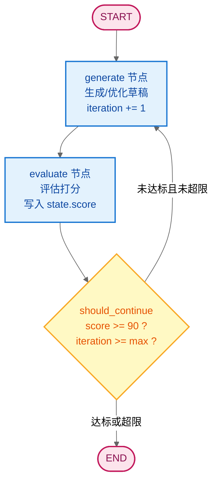
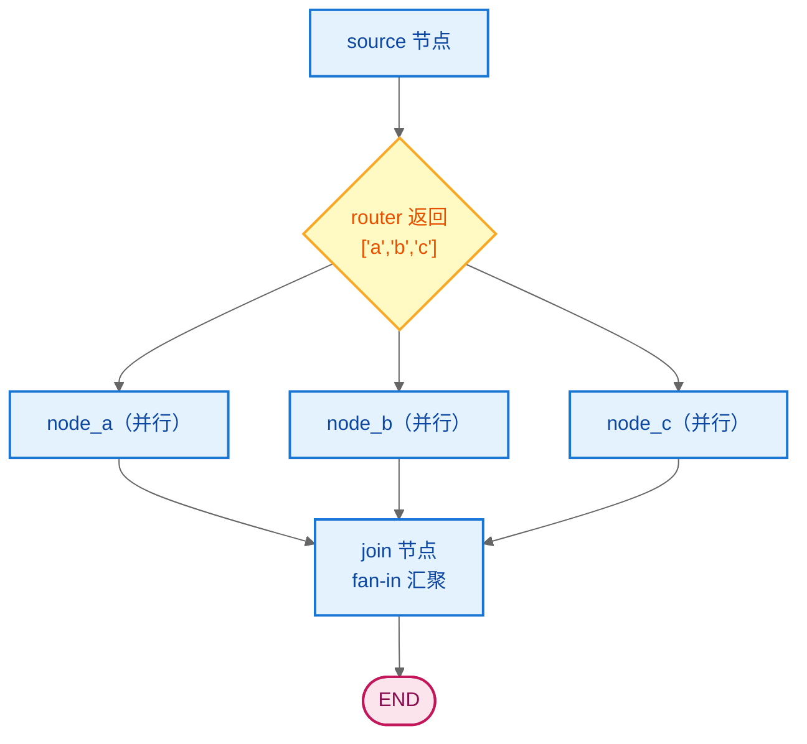

# LangGraph State 面试题集详解

> 面试核心目标：系统化评估候选人对 LangGraph State（状态）的概念理解、原理掌握、工程实践与高级应用能力。
> 本文档覆盖 **五大模块**，共 **15 道面试题**，难度涵盖初级、中级、高级三个层次，每题包含问题描述、参考答案、代码案例与原理分析。

---

## 目录

- [一、基础概念（3题）](#一基础概念3题)
- [二、Schema 定义与实现（3题）](#二schema-定义与实现3题)
- [三、Reducer 机制（3题）](#三reducer-机制3题)
- [四、条件边与路由（3题）](#四条件边与路由3题)
- [五、高级应用与最佳实践（3题）](#五高级应用与最佳实践3题)
- [六、面试官使用指南](#六面试官使用指南)

---

## 一、基础概念（3题）

### Q1：什么是 LangGraph 的 State？它在工作流中承担什么角色？

**难度级别**：初级
**考察维度**：概念理解

**问题描述**：
请阐述 LangGraph State 的定义，并说明它在图工作流中承担的角色。为什么 LangGraph 选择"节点间通过 State 通信"而非"节点直接互相调用"？

**参考答案**：

```
定义：
  State 是 LangGraph 中贯穿整个图执行过程的核心数据结构，
  保存工作流所有需要持久化的信息（对话历史、中间结果、上下文、控制标志）。

两大角色：
  1. 数据载体：保存执行过程中的所有状态信息
  2. 通信媒介：节点之间不直接传参，而是通过读写 State 通信
```

**角色图示**：



**原理分析**：

1. **解耦**：节点只依赖 State Schema，不依赖其他节点的实现，便于独立开发与替换。
2. **可测试**：测试节点时只需构造 State 输入，无需启动整个图。
3. **可持久化**：State 可整体保存到 Checkpoint，支持容错恢复与时间旅行。
4. **支持并发**：同一超级步内多个节点可并行读写 State（通过 Reducer 合并），直接调用难以并行。

**评分标准**：
- 3分：能说出 State 是数据结构
- 4分：能说明通信媒介角色与解耦价值
- 5分：能解释为何选择 State 通信模式及其与并发、持久化的关系

---

### Q2：State 在一次图执行中经历哪些阶段？请描述其生命周期。

**难度级别**：初级
**考察维度**：原理掌握

**问题描述**：
请描述 State 在一次 `graph.invoke` 调用中的完整生命周期，包括初始化、节点循环、合并、持久化与终止。

**参考答案**：

```
State 生命周期五阶段：
  1. 初始化：用户输入 → 构造初始 State
  2. 节点循环：读取→计算→返回更新→合并（应用 Reducer）
  3. 路由决策：条件边读取 State 决定下一节点
  4. 持久化：每个超级步后 Checkpoint 自动保存
  5. 终止：到达 END，返回最终 State
```

**生命周期流程图**：



**原理分析**：

- **超级步（Superstep）**：Pregel 风格的执行单元，一个超级步内可并行执行多个节点。
- **同步屏障**：超级步之间同步，下一轮节点看到的是上一轮合并后的 State。
- **合并时机**：节点的返回值不会立即生效，而是在该超级步结束后统一应用 Reducer 合并，保证并发安全。

**评分标准**：
- 3分：能说出初始化和执行
- 4分：能完整描述五个阶段
- 5分：能解释超级步与合并时机对并发的影响

---

### Q3：什么是超级步（Superstep）？它如何影响 State 的并发更新？

**难度级别**：初级
**考察维度**：原理掌握

**问题描述**：
请解释 LangGraph 中"超级步（Superstep）"的概念，并说明它如何影响多个节点对同一 State 字段的并发更新。

**参考答案**：

```
超级步定义：
  Pregel 风格的执行单元。一个超级步内，所有被调度的节点并行执行；
  超级步之间通过同步屏障分隔。

对并发更新的影响：
  - 同一超级步内多个节点同时更新同一字段 → 必须有 Reducer 才能正确合并
  - 无 Reducer 的字段被并发更新 → 抛错或覆盖（行为未定义）
  - 不同字段的并发更新互不影响（通道隔离）
```

**并发更新原理图**：

```
   超级步 N                          超级步 N+1
┌──────────────────────┐         ┌──────────────────────┐
│  ┌─────┐   ┌─────┐   │         │                      │
│  │Node1│   │Node2│   │  同步    │  合并后的 State       │
│  │写a=3│   │写a=5│   │ 屏障 →   │  a = reducer(3,5)    │
│  │写b=1│   │写c=2│   │         │  b = 1, c = 2        │
│  └─────┘   └─────┘   │         │  下一批节点读取此State │
└──────────────────────┘         └──────────────────────┘
```

**代码案例**：

```python
# -*- coding: utf-8 -*-
"""超级步并发更新演示：两个节点累加同一字段"""
from typing import Annotated, TypedDict
from langgraph.graph import StateGraph, START, END
import operator


class FanOutState(TypedDict):
    # counter 使用 operator.add 作为 Reducer，支持并发累加
    counter: Annotated[int, operator.add]
    log: Annotated[list, operator.add]   # 列表也用 add 拼接


def node_a(state: FanOutState) -> dict:
    # 节点 A：累加 10，追加日志
    return {"counter": 10, "log": ["A执行"]}


def node_b(state: FanOutState) -> dict:
    # 节点 B：累加 20，追加日志
    return {"counter": 20, "log": ["B执行"]}


graph = StateGraph(FanOutState)
graph.add_node("node_a", node_a)
graph.add_node("node_b", node_b)
graph.add_edge(START, "node_a")
graph.add_edge("node_a", "node_b")   # 顺序执行（简化演示）
graph.add_edge("node_b", END)

app = graph.compile()
result = app.invoke({"counter": 0, "log": []})
print(result["counter"])  # 30（10+20，Reducer 累加）
print(result["log"])      # ['A执行', 'B执行']
```

**案例说明**：
- `counter` 和 `log` 都绑定了 `operator.add` Reducer，因此即使两个节点并发更新也能正确合并。
- 若 `counter` 无 Reducer，并发更新会导致覆盖或报错。

**原理分析**：
- 每个字段背后是一个独立 **Channel**，通道间互不影响。
- Reducer 是并发安全的关键：它定义了"多个更新如何归约成一个值"。
- 超级步的同步屏障保证：下一轮节点看到的是上一轮所有更新合并后的稳定 State。

**评分标准**：
- 3分：能说出超级步是执行单元
- 4分：能说明并发更新需要 Reducer
- 5分：能解释同步屏障与 Channel 隔离机制

---

## 二、Schema 定义与实现（3题）

### Q4：LangGraph 支持哪些方式定义 State Schema？请对比 TypedDict 与 Pydantic 的优劣。

**难度级别**：中级
**考察维度**：实现方式

**问题描述**：
请列举 LangGraph 支持的 State Schema 定义方式，并从运行时校验、默认值、性能、适用场景等维度对比 TypedDict 与 Pydantic BaseModel。

**参考答案**：

```
两种主流方式：
  1. TypedDict        —— 轻量、零运行时开销
  2. Pydantic BaseModel —— 运行时校验、字段约束、默认值
```

**对比表**：

| 维度 | TypedDict | Pydantic BaseModel |
|------|-----------|-------------------|
| 运行时校验 | 无 | 有（自动抛 ValidationError） |
| 默认值 | 不支持 | 支持（Field(default=...)） |
| 字段约束 | 无 | 支持（ge/le/regex 等） |
| 性能开销 | 几乎为零 | 有一定开销 |
| Schema 导出 | 需手动维护 | 可导出 JSON Schema |
| 适用场景 | 原型、内部工具 | 生产级、对外 API |

**代码案例**：

```python
# -*- coding: utf-8 -*-
"""TypedDict 与 Pydantic 对比示例"""
from typing import Annotated, TypedDict
from pydantic import BaseModel, Field
from langgraph.graph.message import add_messages


# ===== 方式一：TypedDict =====
class TypedState(TypedDict):
    messages: Annotated[list, add_messages]
    user_name: str          # 无默认值，调用时必须提供
    turn_count: Annotated[int, lambda a, b: a + b]


# ===== 方式二：Pydantic BaseModel =====
class PydanticState(BaseModel):
    messages: Annotated[list, add_messages] = Field(default_factory=list)
    user_name: str = Field(default="guest", description="当前用户名")
    temperature: float = Field(default=0.7, ge=0.0, le=2.0)  # 范围约束
    turn_count: Annotated[int, lambda a, b: a + b] = Field(default=0)


# TypedDict：缺少字段不会报错（运行时），但可能引发 KeyError
# ts: TypedState = {"messages": []}   # 缺 user_name，运行时访问 state["user_name"] 报错

# Pydantic：缺少必填字段或越界会立即抛错
# PydanticState(temperature=3.0)  # ValidationError: temperature > 2.0
```

**案例说明**：
- TypedDict 是"声明式"类型提示，Python 运行时不强制校验，依赖开发者自觉。
- Pydantic 在构造时自动校验，`temperature=3.0` 会被拦截，防止脏数据进入工作流。

**原理分析**：
- TypedDict 本质是 `dict` 的类型别名，运行时就是普通字典，无任何校验逻辑。
- Pydantic BaseModel 在 `__init__` 中执行校验器，字段约束通过 `Field` 元数据声明，校验失败抛 `ValidationError`。
- 两者都通过 `Annotated[类型, reducer]` 绑定 Reducer，Reducer 机制与 Schema 方式无关。

**选型建议**：
- 原型 / 内部工具 / 性能敏感 → TypedDict
- 生产级 / 对外 API / 需校验 → Pydantic

**评分标准**：
- 3分：能列出两种方式
- 4分：能对比 3 个以上维度
- 5分：能给出选型建议并解释原理差异

---

### Q5：如何用 TypedDict 实现 State？请写出完整可运行示例并说明 Reducer 绑定语法。

**难度级别**：中级
**考察维度**：实现方式

**问题描述**：
请使用 TypedDict 定义一个包含消息列表、用户名、对话轮数的 State，编写两个节点串联执行，并说明 `Annotated[类型, reducer]` 语法的含义。

**参考答案**：

```python
# -*- coding: utf-8 -*-
"""TypedDict 实现 State 完整示例"""
from typing import Annotated, TypedDict
from langgraph.graph import StateGraph, START, END
from langgraph.graph.message import add_messages


# 1. 定义 State Schema
class AgentState(TypedDict):
    """Agent 状态定义。

    Annotated[类型, Reducer] 语法：
      - 第一个参数：字段的 Python 类型
      - 第二个参数：Reducer 函数，定义如何合并该字段的更新
    """
    # messages：使用 add_messages Reducer，实现消息追加（带 ID 去重）
    messages: Annotated[list, add_messages]
    # user_name：无 Reducer，每次更新直接覆盖
    user_name: str
    # turn_count：自定义 lambda 作为 Reducer，实现累加
    turn_count: Annotated[int, lambda a, b: a + b]


# 2. 定义节点：接收 State，返回部分更新
def greet_node(state: AgentState) -> dict:
    """问候节点。"""
    name = state["user_name"]   # 读取 State
    return {
        "messages": [{"role": "assistant", "content": f"你好，{name}！"}],
        "turn_count": 1,         # 累加 1
    }


def ask_node(state: AgentState) -> dict:
    """提问节点。"""
    return {
        "messages": [{"role": "assistant", "content": "有什么可以帮您？"}],
        "turn_count": 1,
    }


# 3. 构建图
graph = StateGraph(AgentState)
graph.add_node("greet", greet_node)
graph.add_node("ask", ask_node)
graph.add_edge(START, "greet")
graph.add_edge("greet", "ask")
graph.add_edge("ask", END)

app = graph.compile()

# 4. 执行
result = app.invoke({
    "messages": [], "user_name": "张三", "turn_count": 0,
})
print(result["messages"])
# [{'role': 'assistant', 'content': '你好，张三！'},
#  {'role': 'assistant', 'content': '有什么可以帮您？'}]
print(result["turn_count"])  # 2（0+1+1）
```

**`Annotated[类型, reducer]` 语法说明**：

```
   Annotated[list, add_messages]
            │       │
            │       └── Reducer 函数：合并策略
            └── 字段的 Python 类型：list / str / int / dict ...
```

- LangGraph 在编译图时扫描 Schema 的类型注解，提取 `Annotated` 的第二个参数作为该字段的 Reducer。
- 若字段未使用 `Annotated`（如 `user_name: str`），则该字段无 Reducer，更新时直接覆盖。

**原理分析**：

1. **编译期扫描**：`StateGraph(AgentState)` 构造时，LangGraph 通过 `typing.get_type_hints` 读取 `AgentState` 的注解，识别每个字段的类型与 Reducer。
2. **通道创建**：为每个字段创建一个 Channel，Reducer 决定 Channel 的 `update` 方法行为。
3. **运行时合并**：节点返回更新后，对应 Channel 调用 `reducer(current, new)` 计算新值。

**评分标准**：
- 3分：能写出基本结构
- 4分：能正确使用 Annotated 绑定 Reducer
- 5分：能解释编译期扫描与通道创建原理

---

### Q6：如何用 Pydantic BaseModel 实现 State？相比 TypedDict 它带来哪些额外能力？

**难度级别**：中级
**考察维度**：实现方式

**问题描述**：
请使用 Pydantic BaseModel 定义一个带字段约束的 State（如温度范围、默认值），并演示运行时校验如何拦截非法输入。

**参考答案**：

```python
# -*- coding: utf-8 -*-
"""Pydantic BaseModel 实现 State 示例"""
from typing import Annotated
from pydantic import BaseModel, Field, ValidationError
from langgraph.graph import StateGraph, START, END
from langgraph.graph.message import add_messages


class AgentState(BaseModel):
    """Agent 状态（Pydantic 版本）。

    Pydantic 额外能力：
    1. 默认值：Field(default=...)
    2. 字段约束：ge/le/regex/min_length 等
    3. 运行时校验：构造时自动校验，非法值抛 ValidationError
    4. 描述信息：Field(description=...) 便于生成文档
    """
    messages: Annotated[list, add_messages] = Field(default_factory=list)
    user_name: str = Field(default="guest", description="当前用户名")
    temperature: float = Field(default=0.7, ge=0.0, le=2.0)  # 0~2 之间
    turn_count: Annotated[int, lambda a, b: a + b] = Field(default=0)


def respond_node(state: AgentState) -> dict:
    """响应节点：字段已校验，可安全使用。"""
    return {
        "messages": [{"role": "assistant",
                      "content": f"{state.user_name}，温度={state.temperature}"}],
        "turn_count": 1,
    }


graph = StateGraph(AgentState)
graph.add_node("respond", respond_node)
graph.add_edge(START, "respond")
graph.add_edge("respond", END)
app = graph.compile()

# 合法输入
r = app.invoke({"user_name": "李四", "temperature": 0.5})
print(r["messages"])  # [{'role': 'assistant', 'content': '李四，温度=0.5'}]

# 非法输入：温度超界，Pydantic 拦截
try:
    app.invoke({"temperature": 3.0})
except ValidationError as e:
    print("校验失败:", e)
    # temperature: Input should be less than or equal to 2.0
```

**额外能力对比**：

```
┌─────────────────────────────────────────────────────────────┐
│              Pydantic 相比 TypedDict 的额外能力              │
├─────────────────────────────────────────────────────────────┤
│  1. 默认值：Field(default=...)，缺失字段自动填充             │
│  2. 字段约束：ge/le/regex/min_length/max_length 等          │
│  3. 运行时校验：构造时校验，提前拦截脏数据                   │
│  4. Schema 导出：model_json_schema() 生成 OpenAPI 兼容      │
└─────────────────────────────────────────────────────────────┘
```

**原理分析**：
- Pydantic 在 `BaseModel.__init__` 中调用校验器，对每个字段执行类型转换与约束检查。
- LangGraph 在 `invoke` 入口处构造 Pydantic 实例，校验失败立即抛错，**不进入节点执行**。
- Reducer 仍通过 `Annotated` 绑定，与 Pydantic 校验逻辑正交（校验在合并前）。

**评分标准**：
- 3分：能写出 Pydantic State
- 4分：能演示 Field 约束与默认值
- 5分：能解释校验时机与 Reducer 的关系

---

## 三、Reducer 机制（3题）

### Q7：什么是 Reducer？它的函数签名是什么？为什么需要 Reducer？

**难度级别**：中级
**考察维度**：原理掌握

**问题描述**：
请解释 Reducer 的概念、函数签名，以及它在 LangGraph 中的作用。如果没有 Reducer，会引发什么问题？

**参考答案**：

```
Reducer 定义：
  Reducer 是定义"如何将节点的更新与当前 State 合并"的函数。

函数签名：
  reducer(left, right) -> result
    left:  当前 State 中该字段的值（旧值）
    right: 节点返回的更新中该字段的值（新值）
    result: 合并后的值，写入新 State

为什么需要 Reducer：
  1. 并发更新：同一超级步内多个节点同时更新同一字段，需 Reducer 合并
  2. 累加语义：消息列表需追加而非覆盖，计数器需累加而非替换
  3. 自定义合并：取最大值、字典深合并、滑动窗口等自定义逻辑

没有 Reducer 的后果：
  - 默认行为：直接覆盖（right 替换 left）
  - 并发场景：覆盖或抛错，丢失更新
  - 消息历史：每次更新覆盖，对话历史丢失
```

**Reducer 工作原理图**：



**代码案例**：

```python
# -*- coding: utf-8 -*-
"""有/无 Reducer 的行为对比"""
from typing import Annotated, TypedDict
from langgraph.graph import StateGraph, START, END
from langgraph.graph.message import add_messages


class StateWithReducer(TypedDict):
    messages: Annotated[list, add_messages]   # 有 Reducer：追加


class StateWithoutReducer(TypedDict):
    messages: list                             # 无 Reducer：覆盖


def add_msg_a(state) -> dict:
    return {"messages": [{"role": "user", "content": "消息A"}]}


def add_msg_b(state) -> dict:
    return {"messages": [{"role": "user", "content": "消息B"}]}


# 有 Reducer 版本
g1 = StateGraph(StateWithReducer)
g1.add_node("a", add_msg_a)
g1.add_node("b", add_msg_b)
g1.add_edge(START, "a")
g1.add_edge("a", "b")
g1.add_edge("b", END)
app1 = g1.compile()
r1 = app1.invoke({"messages": []})
print("有 Reducer:", [m["content"] for m in r1["messages"]])
# ['消息A', '消息B']  ← 追加

# 无 Reducer 版本
g2 = StateGraph(StateWithoutReducer)
g2.add_node("a", add_msg_a)
g2.add_node("b", add_msg_b)
g2.add_edge(START, "a")
g2.add_edge("a", "b")
g2.add_edge("b", END)
app2 = g2.compile()
r2 = app2.invoke({"messages": []})
print("无 Reducer:", [m["content"] for m in r2["messages"]])
# ['消息B']  ← 覆盖，消息A丢失
```

**案例说明**：
- 有 `add_messages` Reducer：两个节点的消息都被保留（追加）。
- 无 Reducer：第二个节点的更新覆盖了第一个节点的消息，历史丢失。

**原理分析**：
- Reducer 是 Channel 更新行为的核心：Channel 在收到更新时调用 `reducer(current, new)`。
- 默认 Channel（无 Reducer）的更新逻辑等价于 `reducer = lambda left, right: right`，即直接覆盖。
- `add_messages` 内部处理 ID 去重：相同 ID 的消息替换而非追加，支持编辑历史。

**评分标准**：
- 3分：能说出 Reducer 是合并函数
- 4分：能写出 (left, right) -> result 签名
- 5分：能解释无 Reducer 的并发问题与 add_messages 的去重机制

---

### Q8：LangGraph 内置哪些 Reducer？`add_messages` 有什么特殊行为？

**难度级别**：中级
**考察维度**：实现方式

**问题描述**：
请列举 LangGraph 常用的内置 Reducer，并详细说明 `add_messages` 的特殊行为（特别是 ID 去重机制）。

**参考答案**：

```
常用内置 Reducer：

| Reducer        | 行为                          | 适用字段       |
|----------------|-------------------------------|----------------|
| add_messages   | 追加消息（带 ID 去重/替换）    | messages       |
| add            | 等价 operator.add             | 列表/数字/字符串|
| operator.add   | 列表拼接、数字累加、字符串拼接 | 通用累加       |
| （无，默认）   | 直接覆盖                      | 普通字段       |

add_messages 特殊行为：
  1. 追加：新消息无 ID 或 ID 不冲突 → 追加到列表末尾
  2. 替换：新消息 ID 与已有消息 ID 相同 → 替换该消息（用于编辑历史）
  3. 删除：消息内容为 RemoveMessage → 从列表中移除对应 ID
```

**`add_messages` 行为图示**：

```
  场景1：追加（ID 不同）
    当前: [{"id":"1","content":"A"}]
    更新: [{"id":"2","content":"B"}]
    结果: [{"id":"1","content":"A"}, {"id":"2","content":"B"}]

  场景2：替换（ID 相同）
    当前: [{"id":"1","content":"A"}]
    更新: [{"id":"1","content":"A_修改"}]
    结果: [{"id":"1","content":"A_修改"}]   ← 原消息被替换

  场景3：删除（RemoveMessage）
    当前: [{"id":"1","content":"A"}, {"id":"2","content":"B"}]
    更新: [RemoveMessage(id="1")]
    结果: [{"id":"2","content":"B"}]        ← ID=1 被移除
```

**代码案例**：

```python
# -*- coding: utf-8 -*-
"""add_messages 三种行为演示"""
from typing import Annotated, TypedDict
from langchain_core.messages import AIMessage, HumanMessage, RemoveMessage
from langgraph.graph.message import add_messages


class ChatState(TypedDict):
    messages: Annotated[list, add_messages]


# 场景1：追加
current = [HumanMessage(content="你好", id="1")]
update = [AIMessage(content="您好", id="2")]
result1 = add_messages(current, update)
print("追加:", [m.content for m in result1])  # ['你好', '您好']

# 场景2：替换（相同 ID）
update_replace = [AIMessage(content="你好啊", id="1")]   # 同 ID=1
result2 = add_messages(current, update_replace)
print("替换:", [(m.content, m.id) for m in result2])  # [('你好啊', '1')]

# 场景3：删除
current2 = [HumanMessage(content="A", id="1"),
            HumanMessage(content="B", id="2")]
update_remove = [RemoveMessage(id="1")]
result3 = add_messages(current2, update_remove)
print("删除:", [(m.content, m.id) for m in result3])  # [('B', '2')]
```

**案例说明**：
- 场景1：ID 不同，新消息追加到末尾。
- 场景2：ID 相同，原消息被新消息替换，实现"编辑历史"。
- 场景3：`RemoveMessage(id="1")` 触发删除，用于清理过期消息或压缩上下文。

**原理分析**：
- `add_messages` 内部维护 ID 索引，合并时按 ID 判断是追加、替换还是删除。
- 这一设计支持 LangGraph 的**消息编辑**与**上下文压缩**高级特性：用户可修改历史消息，或删除早期消息以节省 Token。
- 普通 `operator.add` 只做列表拼接，不具备 ID 感知能力，因此消息字段应优先用 `add_messages`。

**评分标准**：
- 3分：能列出 add_messages 和 add
- 4分：能说明追加与替换行为
- 5分：能解释 RemoveMessage 删除机制及其应用价值

---

### Q9：如何实现自定义 Reducer？请给出至少两个实际场景的自定义 Reducer 实现。

**难度级别**：高级
**考察维度**：工程实践

**问题描述**：
请说明自定义 Reducer 的实现方式，并针对"取最大值"和"字典深合并"两个场景分别实现自定义 Reducer，说明其应用价值。

**参考答案**：

```
自定义 Reducer 实现方式：
  定义一个签名为 reducer(left, right) -> result 的普通函数，
  通过 Annotated[类型, reducer_function] 绑定到 State 字段。

两个场景：
  1. 取最大值：max_int(left, right) → max(left, right)
     应用：记录最高分、最大进度等单调递增字段
  2. 字典深合并：dict_merge(left, right) → {**left, **right}
     应用：context/metadata 等需要增量补充的字典字段
```

**代码案例**：

```python
# -*- coding: utf-8 -*-
"""自定义 Reducer 两种场景实现"""
from typing import Annotated, TypedDict
from langgraph.graph import StateGraph, START, END
from langgraph.graph.message import add_messages


# ===== 场景1：取最大值 Reducer =====
def max_int(left: int, right: int) -> int:
    """取较大值。适用于分数、进度等只升不降的字段。"""
    return left if left > right else right


class ScoreState(TypedDict):
    messages: Annotated[list, add_messages]
    best_score: Annotated[int, max_int]    # 只记录最高分
    current_score: int                      # 当前分数（覆盖）


def attempt_node(state: ScoreState) -> dict:
    """模拟一次尝试，随机得分。"""
    import random
    score = random.randint(60, 100)
    return {
        "current_score": score,    # 当前分数（覆盖）
        "best_score": score,       # best_score 取最大值
        "messages": [{"role": "system", "content": f"本次得分 {score}"}],
    }


def should_retry(state: ScoreState) -> str:
    """分数未达 90 则重试。"""
    if state["best_score"] >= 90:
        return "end"
    return "retry"


g = StateGraph(ScoreState)
g.add_node("attempt", attempt_node)
g.add_edge(START, "attempt")
g.add_conditional_edges("attempt", should_retry,
                        {"retry": "attempt", "end": END})
app = g.compile()

r = app.invoke({"messages": [], "best_score": 0, "current_score": 0})
print("最高分:", r["best_score"])      # 多次尝试中的最大值
print("当前分:", r["current_score"])   # 最后一次的分数


# ===== 场景2：字典深合并 Reducer =====
def dict_merge(left: dict, right: dict) -> dict:
    """字典浅合并（right 覆盖 left 同名键）。
    适用于 context / metadata 等增量补充字段。
    """
    result = dict(left)
    result.update(right)
    return result


class ContextState(TypedDict):
    messages: Annotated[list, add_messages]
    context: Annotated[dict, dict_merge]   # 增量合并而非覆盖


def enrich_node_a(state: ContextState) -> dict:
    """节点A：补充用户信息。"""
    return {"context": {"user_id": "u123", "name": "张三"}}


def enrich_node_b(state: ContextState) -> dict:
    """节点B：补充偏好信息（不覆盖 user_id）。"""
    return {"context": {"preference": "zh", "timezone": "UTC+8"}}


g2 = StateGraph(ContextState)
g2.add_node("a", enrich_node_a)
g2.add_node("b", enrich_node_b)
g2.add_edge(START, "a")
g2.add_edge("a", "b")
g2.add_edge("b", END)
app2 = g2.compile()

r2 = app2.invoke({"messages": [], "context": {}})
print(r2["context"])
# {'user_id': 'u123', 'name': '张三', 'preference': 'zh', 'timezone': 'UTC+8'}
# 若无 dict_merge Reducer，b 的 context 会覆盖 a 的，user_id 丢失
```

**案例说明**：

1. **取最大值**：`best_score` 用 `max_int` Reducer，多次尝试后保留最高分；`current_score` 无 Reducer，记录最后一次分数。
2. **字典深合并**：`context` 用 `dict_merge` Reducer，节点 A 和 B 的补充信息合并保留；若无此 Reducer，B 的 context 会覆盖 A 的，`user_id` 丢失。

**原理分析**：
- 自定义 Reducer 本质是普通 Python 函数，LangGraph 在 Channel 更新时调用它。
- Reducer 必须是**可序列化**的（若需持久化 Checkpoint），避免使用闭包捕获不可序列化的对象。
- `lambda` 也可作为 Reducer（如 `lambda a, b: a + b`），但持久化时可能需 `functools.partial` 或具名函数。

**应用价值**：
- 取最大值：避免"分数回退"，适合记录单调字段的极值。
- 字典深合并：支持多节点增量补充同一上下文，避免覆盖丢失。

**评分标准**：
- 3分：能写出 Reducer 函数签名
- 4分：能正确实现并绑定两种场景
- 5分：能说明序列化要求与应用价值

---

## 四、条件边与路由（3题）

### Q10：什么是条件边？它的 API 签名是什么？请说明路由函数与 path_map 的关系。

**难度级别**：中级
**考察维度**：原理掌握

**问题描述**：
请解释 LangGraph 条件边（Conditional Edge）的概念、API 签名，并说明路由函数（path）与 path_map 的关系和协作机制。

**参考答案**：

```
条件边定义：
  根据当前 State 动态决定下一个节点的边，是实现分支、循环、
  动态路由的核心机制。

API 签名：
  graph.add_conditional_edges(
      source: str,                              # 源节点名称
      path: Callable[[State], str | list[str]], # 路由函数
      path_map: dict | list | None = None,      # 可选映射表
  )

路由函数与 path_map 的关系：
  - path 函数读取 State，返回一个"路由键"（字符串或列表）
  - path_map 将"路由键"映射为实际的节点名
  - 若不提供 path_map，路由键本身即为节点名

解耦价值：
  path_map 让路由函数返回语义化键（如 "continue"/"end"），
  而非节点名，便于重命名节点而不修改路由逻辑。
```

**条件边协作机制图**：



**代码案例**：

```python
# -*- coding: utf-8 -*-
"""条件边与 path_map 协作示例"""
from typing import Annotated, TypedDict
from langgraph.graph import StateGraph, START, END
from langgraph.graph.message import add_messages


class State(TypedDict):
    messages: Annotated[list, add_messages]
    status: str   # 控制字段


def process_node(state: State) -> dict:
    """处理节点。"""
    return {"messages": [{"role": "assistant", "content": "已处理"}]}


def route(state: State) -> str:
    """路由函数：返回语义化键，而非节点名。"""
    if state["status"] == "ok":
        return "continue"   # 语义键
    return "abort"          # 语义键


def next_node(state: State) -> dict:
    return {"messages": [{"role": "assistant", "content": "继续"}]}


def abort_node(state: State) -> dict:
    return {"messages": [{"role": "assistant", "content": "中止"}]}


g = StateGraph(State)
g.add_node("process", process_node)
g.add_node("next", next_node)
g.add_node("abort", abort_node)
g.add_edge(START, "process")

# path_map：语义键 → 节点名（解耦）
g.add_conditional_edges(
    source="process",
    path=route,
    path_map={
        "continue": "next",   # 语义键映射到节点
        "abort": "abort",
    },
)
g.add_edge("next", END)
g.add_edge("abort", END)

app = g.compile()
# 测试 continue 分支
r = app.invoke({"messages": [], "status": "ok"})
print([m["content"] for m in r["messages"]])  # ['已处理', '继续']
```

**案例说明**：
- `route` 返回 `"continue"` 或 `"abort"`（语义键），不直接返回节点名。
- `path_map` 将语义键映射到实际节点 `"next"` / `"abort"`。
- 若未来将 `next` 重命名为 `proceed`，只需改 `path_map`，无需改路由函数。

**原理分析**：
- LangGraph 在编译时将 `path_map` 编码为图的转移表。
- 运行时，`source` 节点执行后调用 `path(state)`，根据返回值查 `path_map` 得到目标节点。
- 返回 `list[str]` 时表示扇出到多个并行节点（同一超级步）。

**评分标准**：
- 3分：能说出条件边用于动态路由
- 4分：能写出 API 签名并用 path_map
- 5分：能解释 path_map 的解耦价值与扇出机制

---

### Q11：请用条件边实现一个 ReAct 风格的 Agent（LLM + 工具循环）。

**难度级别**：高级
**考察维度**：工程实践

**问题描述**：
请使用条件边实现一个 ReAct 风格的 Agent：LLM 决定是否调用工具，调用工具后回到 LLM 继续推理，直到无需工具则结束。要求给出完整代码与流程图。

**参考答案**：

**流程图**：



**代码案例**：

```python
# -*- coding: utf-8 -*-
"""
ReAct Agent 完整实现：
  LLM → (有 tool_calls?) → tool → 回到 LLM
                       → END
"""
from typing import Annotated, TypedDict
from langchain_core.tools import tool
from langchain_openai import ChatOpenAI
from langgraph.graph import StateGraph, START, END
from langgraph.graph.message import add_messages


# 1. 定义 State
class AgentState(TypedDict):
    messages: Annotated[list, add_messages]   # 消息追加
    tool_call_count: Annotated[int, lambda a, b: a + b]  # 工具调用计数


# 2. 定义工具
@tool
def search(query: str) -> str:
    """搜索工具。"""
    # 实际场景：调用搜索 API
    return f"搜索结果: {query} 的相关信息"


# 3. 绑定工具的 LLM
llm = ChatOpenAI(model="gpt-4o-mini")
llm_with_tools = llm.bind_tools([search])


# 4. 定义节点
def call_llm(state: AgentState) -> dict:
    """LLM 节点：调用模型生成响应。"""
    response = llm_with_tools.invoke(state["messages"])
    return {"messages": [response]}


def call_tool(state: AgentState) -> dict:
    """工具节点：执行 LLM 请求的工具调用。"""
    last_msg = state["messages"][-1]
    tool_results = []
    for tc in last_msg.tool_calls:
        # 根据 tool_calls 执行对应工具
        if tc["name"] == "search":
            result = search.invoke(tc["args"])
            tool_results.append({
                "role": "tool",
                "tool_call_id": tc["id"],
                "content": result,
            })
    return {
        "messages": tool_results,
        "tool_call_count": 1,   # 每次工具调用 +1
    }


# 5. 路由函数：判断是否需要工具
def should_use_tool(state: AgentState) -> str:
    """检查最后一条消息是否包含 tool_calls。"""
    last_msg = state["messages"][-1]
    if hasattr(last_msg, "tool_calls") and last_msg.tool_calls:
        return "call_tool"
    return "end"


# 6. 构建图
graph = StateGraph(AgentState)
graph.add_node("llm", call_llm)
graph.add_node("tool", call_tool)

graph.add_edge(START, "llm")
# 条件边：LLM 后根据是否需要工具路由
graph.add_conditional_edges(
    source="llm",
    path=should_use_tool,
    path_map={
        "call_tool": "tool",
        "end": END,
    },
)
# 工具执行后回到 LLM，形成循环
graph.add_edge("tool", "llm")

app = graph.compile()

# 7. 执行（需配置 OpenAI API Key）
# result = app.invoke({
#     "messages": [{"role": "user", "content": "搜索 LangGraph 的最新动态"}],
#     "tool_call_count": 0,
# })
# print(result["messages"])
```

**案例说明**：
- `should_use_tool` 检查 `messages[-1].tool_calls`，有则路由到工具节点，无则结束。
- 工具节点执行后将结果（`role: "tool"`）追加到消息列表，回到 LLM 让其基于工具结果继续推理。
- `tool_call_count` 用累加 Reducer 统计工具调用次数，可用于监控与限流。

**原理分析**：
- 这是经典的 **ReAct（Reasoning + Acting）** 模式：LLM 推理 → 行动（工具）→ 观察（结果）→ 继续推理。
- 条件边 + 回边（tool→llm）构成循环图，LangGraph 原生支持循环（不同于 DAG 框架）。
- `add_messages` Reducer 保证对话历史完整累积，LLM 每轮都能看到全部历史。
- 需设置 `recursion_limit` 防止无限循环（默认 25）。

**评分标准**：
- 3分：能实现基本循环结构
- 4分：能正确解析 tool_calls 并执行
- 5分：能解释 ReAct 模式与循环图原理，提到 recursion_limit

---

### Q12：请用条件边实现一个迭代优化工作流，控制最多迭代 N 次且达到质量阈值即停止。

**难度级别**：高级
**考察维度**：综合应用

**问题描述**：
请设计一个迭代优化工作流：生成草稿 → 评估打分 → 若分数达标或超过最大迭代次数则停止，否则继续优化。要求用条件边实现循环控制，并说明终止条件的设计原则。

**参考答案**：

**流程图**：



**代码案例**：

```python
# -*- coding: utf-8 -*-
"""迭代优化工作流：生成 → 评估 → 循环"""
from typing import Annotated, TypedDict
from langgraph.graph import StateGraph, START, END
from langgraph.graph.message import add_messages

MAX_ITER = 3              # 最大迭代次数
SCORE_THRESHOLD = 90      # 质量阈值


class IterState(TypedDict):
    messages: Annotated[list, add_messages]
    draft: str
    score: int
    iteration: Annotated[int, lambda a, b: a + b]   # 累加
    max_iterations: int


def generate_node(state: IterState) -> dict:
    """生成/优化草稿。"""
    it = state["iteration"]
    if it == 0:
        draft = "初版答案"
    else:
        # 基于上轮评分优化（实际场景调用 LLM）
        draft = f"第{it+1}版优化（基于上轮评分{state['score']}）"
    return {
        "draft": draft,
        "iteration": 1,    # 累加
    }


def evaluate_node(state: IterState) -> dict:
    """评估草稿质量。"""
    # 简化：随迭代次数提升分数（模拟质量改善）
    score = min(80 + state["iteration"] * 8, 95)
    return {"score": score}


def should_continue(state: IterState) -> str:
    """路由函数：综合两个终止条件。"""
    # 条件1：质量达标 → 结束
    if state["score"] >= SCORE_THRESHOLD:
        return "end"
    # 条件2：超过最大迭代次数 → 结束
    if state["iteration"] >= state["max_iterations"]:
        return "end"
    # 否则继续迭代
    return "continue"


# 构建图
graph = StateGraph(IterState)
graph.add_node("generate", generate_node)
graph.add_node("evaluate", evaluate_node)

graph.add_edge(START, "generate")
graph.add_edge("generate", "evaluate")
# 条件边：评估后决定继续或结束
graph.add_conditional_edges(
    source="evaluate",
    path=should_continue,
    path_map={
        "continue": "generate",   # 回到 generate 形成循环
        "end": END,
    },
)

app = graph.compile()

# 执行
result = app.invoke({
    "messages": [], "draft": "", "score": 0,
    "iteration": 0, "max_iterations": MAX_ITER,
})
print("最终草稿:", result["draft"])
print("最终分数:", result["score"])
print("迭代次数:", result["iteration"])
```

**案例说明**：
- `should_continue` 同时检查两个终止条件：分数达标（`score >= 90`）或迭代超限（`iteration >= max`）。
- `iteration` 用累加 Reducer，每轮 `generate` 自动 +1。
- 任一终止条件满足即跳到 END，否则回到 `generate` 形成循环。

**终止条件设计原则**：

```
┌─────────────────────────────────────────────────────────────┐
│               循环图终止条件设计原则                          │
├─────────────────────────────────────────────────────────────┤
│  1. 必须有可达的终止条件                                     │
│     - 质量阈值（score >= 90）                                │
│     - 迭代上限（iteration >= max）                           │
│                                                             │
│  2. 终止条件优先判断                                         │
│     should_continue 中先检查终止条件，再决定继续             │
│                                                             │
│  3. 设置 recursion_limit 兜底                                │
│     防止逻辑错误导致死循环                                   │
│     app.invoke(..., config={"recursion_limit": 25})         │
│                                                             │
│  4. 迭代上限字段化                                           │
│     max_iterations 作为 State 字段，可动态调整               │
└─────────────────────────────────────────────────────────────┘
```

**原理分析**：
- 循环图通过"条件边 + 回边"实现：`evaluate → (条件) → generate` 形成环。
- LangGraph 用 `recursion_limit`（默认 25）限制超级步数量，超限抛 `RecursionError`，是死循环的最后防线。
- `iteration` 累加 Reducer 保证计数准确，即使并行节点也能正确累计。
- 终止条件组合"质量 + 次数"是工程最佳实践：质量保证效果，次数保证成本上限。

**评分标准**：
- 3分：能实现基本循环
- 4分：能正确组合两个终止条件
- 5分：能阐述终止条件设计原则与 recursion_limit 兜底

---

## 五、高级应用与最佳实践（3题）

### Q13：如何在生产环境中持久化 State？请说明 Checkpointer 的作用与使用方式。

**难度级别**：高级
**考察维度**：工程实践

**问题描述**：
请说明 LangGraph Checkpointer 的作用，演示如何使用 MemorySaver 持久化 State，并解释 thread_id 在多会话管理中的作用。

**参考答案**：

```
Checkpointer 作用：
  1. 自动保存：每个超级步后自动保存当前 State
  2. 容错恢复：进程崩溃后可从最近 Checkpoint 恢复
  3. 时间旅行：回溯到任意历史状态重新执行
  4. 多会话隔离：通过 thread_id 区分不同会话

常用 Checkpointer：
  - MemorySaver:   内存存储，开发调试用，进程退出即丢失
  - SqliteSaver:   SQLite 持久化，轻量生产可用
  - PostgresSaver: PostgreSQL，生产级高可用

thread_id 作用：
  每个 thread_id 对应一个独立的会话状态序列，
  不同 thread_id 的 State 互不干扰，实现多用户/多会话隔离。
```

**代码案例**：

```python
# -*- coding: utf-8 -*-
"""Checkpointer 持久化示例"""
from typing import Annotated, TypedDict
from langgraph.graph import StateGraph, START, END
from langgraph.graph.message import add_messages
from langgraph.checkpoint.memory import MemorySaver


class ChatState(TypedDict):
    messages: Annotated[list, add_messages]
    user_id: str


def chat_node(state: ChatState) -> dict:
    """模拟 LLM 响应。"""
    return {"messages": [{"role": "assistant", "content": "收到"}]}


# 构建图（带 Checkpointer）
graph = StateGraph(ChatState)
graph.add_node("chat", chat_node)
graph.add_edge(START, "chat")
graph.add_edge("chat", END)

# MemorySaver（内存，开发用）
checkpointer = MemorySaver()
app = graph.compile(checkpointer=checkpointer)

# ===== 多会话隔离演示 =====
config_user1 = {"configurable": {"thread_id": "user-1-session"}}
config_user2 = {"configurable": {"thread_id": "user-2-session"}}

# 用户1 对话
app.invoke({"messages": [{"role": "user", "content": "我是用户1"}],
            "user_id": "u1"}, config=config_user1)
# 用户2 对话（独立会话）
app.invoke({"messages": [{"role": "user", "content": "我是用户2"}],
            "user_id": "u2"}, config=config_user2)

# 用户1 继续对话（恢复其历史状态）
state1 = app.get_state(config_user1)
print("用户1历史:", state1.values["messages"])
# 包含 "我是用户1" 的历史，不包含用户2的内容

# 时间旅行：查看用户1的所有 Checkpoint
history = list(app.get_state_history(config_user1))
print(f"用户1共有 {len(history)} 个 Checkpoint")
# 可回溯到任意 Checkpoint 重新执行
```

**案例说明**：
- `MemorySaver` 在内存中保存所有 Checkpoint，适合开发调试。
- `thread_id` 区分不同会话：用户1和用户2的 State 完全隔离。
- `get_state(config)` 读取指定会话的当前 State。
- `get_state_history(config)` 返回该会话的所有历史 Checkpoint，支持时间旅行。

**原理分析**：

```
┌─────────────────────────────────────────────────────────────┐
│                  Checkpointer 工作原理                       │
├─────────────────────────────────────────────────────────────┤
│  超级步 1: 节点执行 → State 更新 → 保存 Checkpoint_1         │
│  超级步 2: 节点执行 → State 更新 → 保存 Checkpoint_2         │
│  超级步 3: 节点执行 → State 更新 → 保存 Checkpoint_3         │
│                                                             │
│  存储：checkpoints 表                                        │
│  ┌────────────┬───────────┬─────────────┐                   │
│  │ thread_id  │ step      │ state_data  │                   │
│  ├────────────┼───────────┼─────────────┤                   │
│  │ sess1      │ 1         │ {messages...}│                   │
│  │ sess1      │ 2         │ {messages...}│                   │
│  │ sess1      │ 3         │ {messages...}│                   │
│  └────────────┴───────────┴─────────────┘                   │
│                                                             │
│  恢复：app.invoke(None, config={thread_id:"sess1"})          │
│        → 从最新 Checkpoint 恢复，继续执行                    │
└─────────────────────────────────────────────────────────────┘
```

- Checkpointer 在每个超级步结束后序列化 State 并写入存储。
- `thread_id` 作为会话标识，相同 `thread_id` 的调用共享同一状态序列。
- `get_state_history` 按 step 倒序返回，可定位到任意历史点重新执行（时间旅行）。
- 持久化要求 State 与 Reducer **可序列化**（JSON 兼容），避免使用 lambda（改用具名函数或 functools.partial）。

**评分标准**：
- 3分：能说出 Checkpointer 用于持久化
- 4分：能演示 thread_id 多会话隔离
- 5分：能解释时间旅行与序列化要求

---

### Q14：如何在条件边中实现扇出（fan-out）到多个并行节点？需要注意什么？

**难度级别**：高级
**考察维度**：高级应用

**问题描述**：
请说明如何让条件边的路由函数返回多个目标节点（扇出），使它们在同一超级步并行执行。并说明扇出场景下 State 更新的注意事项。

**参考答案**：

```
扇出实现：
  路由函数返回字符串列表（而非单个字符串），LangGraph 会将
  列表中的所有节点调度到同一超级步并行执行。

  def router(state) -> list[str]:
      return ["node_a", "node_b", "node_c"]   # 并行执行三个节点

注意事项：
  1. 并行节点若更新同一字段，必须有 Reducer 才能正确合并
  2. 无 Reducer 的字段被并发更新会抛错或覆盖
  3. 扇出后通常需要 fan-in（汇聚）到单个节点继续
```

**扇出原理图**：



**代码案例**：

```python
# -*- coding: utf-8 -*-
"""扇出（fan-out）并行执行示例"""
from typing import Annotated, TypedDict
import operator
from langgraph.graph import StateGraph, START, END
from langgraph.graph.message import add_messages


class ParallelState(TypedDict):
    messages: Annotated[list, add_messages]
    # 并行节点都更新 results，必须用 Reducer 合并
    results: Annotated[list, operator.add]   # 列表拼接
    # 并行节点都更新 total，必须用 Reducer 累加
    total: Annotated[int, operator.add]      # 数字累加


def dispatch_node(state: ParallelState) -> dict:
    """调度节点：准备并行处理。"""
    return {"messages": [{"role": "system", "content": "开始并行处理"}]}


def route_to_parallel(state: ParallelState) -> list[str]:
    """扇出路由：返回列表，并行执行三个 worker。"""
    return ["worker_a", "worker_b", "worker_c"]


def worker_a(state: ParallelState) -> dict:
    """并行 worker A。"""
    return {"results": ["A的结果"], "total": 10}


def worker_b(state: ParallelState) -> dict:
    """并行 worker B。"""
    return {"results": ["B的结果"], "total": 20}


def worker_c(state: ParallelState) -> dict:
    """并行 worker C。"""
    return {"results": ["C的结果"], "total": 30}


def join_node(state: ParallelState) -> dict:
    """汇聚节点：汇总并行结果。"""
    return {
        "messages": [{"role": "system",
                      "content": f"汇聚完成: {state['results']}, 总计 {state['total']}"}],
    }


# 构建图
g = StateGraph(ParallelState)
g.add_node("dispatch", dispatch_node)
g.add_node("worker_a", worker_a)
g.add_node("worker_b", worker_b)
g.add_node("worker_c", worker_c)
g.add_node("join", join_node)

g.add_edge(START, "dispatch")
# 扇出：路由函数返回列表
g.add_conditional_edges("dispatch", route_to_parallel)
# 三个 worker 都汇聚到 join（fan-in）
g.add_edge("worker_a", "join")
g.add_edge("worker_b", "join")
g.add_edge("worker_c", "join")
g.add_edge("join", END)

app = g.compile()

result = app.invoke({
    "messages": [], "results": [], "total": 0,
})
print("结果列表:", result["results"])  # ['A的结果', 'B的结果', 'C的结果']
print("总计:", result["total"])        # 60（10+20+30）
```

**案例说明**：
- `route_to_parallel` 返回 `["worker_a", "worker_b", "worker_c"]`，三个 worker 在同一超级步并行执行。
- `results` 用 `operator.add` Reducer 拼接三个 worker 的结果列表。
- `total` 用 `operator.add` Reducer 累加三个 worker 的数值（10+20+30=60）。
- 三个 worker 都通过 `add_edge` 指向 `join`，实现 fan-in 汇聚。

**注意事项**：

```
┌─────────────────────────────────────────────────────────────┐
│                  扇出场景注意事项                            │
├─────────────────────────────────────────────────────────────┤
│  1. 同一字段并发更新必须有 Reducer                           │
│     - 无 Reducer → 抛 InvalidUpdateError                    │
│     - Reducer 不合适（如覆盖式）→ 丢失更新                   │
│                                                             │
│  2. 选择合适的 Reducer                                       │
│     - 列表拼接: operator.add 或 add_messages                 │
│     - 数字累加: operator.add                                 │
│     - 取最大值: 自定义 max                                   │
│     - 字典合并: 自定义 dict_merge                            │
│                                                             │
│  3. fan-in 汇聚                                              │
│     - 多个并行节点通过 add_edge 指向同一节点                 │
│     - LangGraph 等待所有并行节点完成后再执行汇聚节点         │
│                                                             │
│  4. 顺序保证                                                 │
│     - 并行节点间无顺序保证                                   │
│     - Reducer 必须满足交换律和结合律，否则结果不确定         │
└─────────────────────────────────────────────────────────────┘
```

**原理分析**：
- LangGraph 采用 Pregel 模型：同一超级步内的节点并行执行，超级步间同步。
- 路由函数返回列表时，LangGraph 将所有目标节点加入当前超级步的调度队列。
- 超级步结束时，对所有节点的更新统一应用 Reducer 合并。
- `operator.add` 满足交换律和结合律，因此并行节点的合并顺序不影响结果；自定义 Reducer 需自行保证这一点。

**评分标准**：
- 3分：能返回列表实现扇出
- 4分：能正确使用 Reducer 处理并发更新
- 5分：能解释 fan-in 汇聚与 Reducer 交换律要求

---

### Q15：在生产级 LangGraph 应用中，State Schema 设计有哪些最佳实践？请从字段设计、Reducer 选择、校验、持久化等维度综合说明。

**难度级别**：高级
**考察维度**：综合应用

**问题描述**：
请结合实际项目经验，总结 LangGraph State Schema 设计的最佳实践，覆盖字段设计、Reducer 选择、数据校验、持久化兼容、性能优化等多个维度。

**参考答案**：

**最佳实践总览图**：

```
┌─────────────────────────────────────────────────────────────┐
│            State Schema 设计最佳实践                         │
├─────────────────────────────────────────────────────────────┤
│  1. 字段设计                                                 │
│     ✓ 最小化：只保留工作流需要的字段                         │
│     ✓ 语义命名：user_input 而非 x                           │
│     ✓ 控制字段与数据字段分离                                 │
│       (iteration/status vs messages/result)                │
│                                                             │
│  2. Reducer 选择                                             │
│     ✓ 消息历史 → add_messages（带 ID 去重）                  │
│     ✓ 计数器 → operator.add（累加）                          │
│     ✓ 上下文字典 → 自定义 dict_merge（增量合并）             │
│     ✓ 单调极值 → 自定义 max（取最大）                        │
│     ✓ 当前状态 → 无 Reducer（覆盖）                          │
│                                                             │
│  3. 数据校验                                                 │
│     ✓ 生产环境用 Pydantic BaseModel                          │
│     ✓ Field 约束（ge/le/regex）防御脏数据                    │
│     ✓ 默认值保证缺失字段不报错                               │
│                                                             │
│  4. 持久化兼容                                               │
│     ✓ Reducer 用具名函数或 functools.partial（可序列化）     │
│     ✓ 避免 lambda（Checkpointer 难以序列化）                 │
│     ✓ State 字段用 JSON 兼容类型（避免自定义对象）           │
│                                                             │
│  5. 性能优化                                                 │
│     ✓ 大对象懒加载（如文档全文不存 State，存引用）           │
│     ✓ 消息列表定期压缩（RemoveMessage 清理早期消息）         │
│     ✓ 控制 State 体积（影响 Checkpoint 读写性能）            │
│                                                             │
│  6. 循环安全                                                 │
│     ✓ 设置 recursion_limit（默认25，按需调整）               │
│     ✓ 循环图必须有可达终止条件                               │
│     ✓ 迭代上限作为 State 字段，可动态调整                    │
└─────────────────────────────────────────────────────────────┘
```

**代码案例：综合最佳实践示例**：

```python
# -*- coding: utf-8 -*-
"""生产级 State Schema 综合示例"""
import functools
import operator
from typing import Annotated
from pydantic import BaseModel, Field
from langgraph.graph import StateGraph, START, END
from langgraph.graph.message import add_messages


# ===== 自定义 Reducer（具名函数，可序列化）=====
def dict_merge(left: dict, right: dict) -> dict:
    """字典合并 Reducer：right 覆盖 left 同名键。"""
    result = dict(left)
    result.update(right)
    return result


def bounded_append(left: list, right: list, max_len: int = 10) -> list:
    """限长追加 Reducer：只保留最近 max_len 条。"""
    combined = left + right
    return combined[-max_len:]


# functools.partial 固定参数，便于序列化
bounded_append_10 = functools.partial(bounded_append, max_len=10)


# ===== Pydantic State Schema =====
class ProductionState(BaseModel):
    """生产级 Agent State。

    设计要点：
    1. messages 用 add_messages 追加（带 ID 去重）
    2. context 用 dict_merge 增量合并
    3. recent_errors 用限长 Reducer（只保留最近10条）
    4. iteration 用 operator.add 累加
    5. status 无 Reducer（当前状态覆盖）
    6. 所有字段有默认值，缺失不报错
    7. temperature 有范围约束
    """
    messages: Annotated[list, add_messages] = Field(default_factory=list)
    context: Annotated[dict, dict_merge] = Field(default_factory=dict)
    recent_errors: Annotated[list, bounded_append_10] = Field(default_factory=list)
    iteration: Annotated[int, operator.add] = Field(default=0)
    status: str = Field(default="init")
    temperature: float = Field(default=0.7, ge=0.0, le=2.0)
    max_iterations: int = Field(default=10, ge=1, le=100)


# 节点示例
def process_node(state: ProductionState) -> dict:
    """处理节点：演示多字段更新。"""
    return {
        "messages": [{"role": "assistant", "content": "处理完成"}],
        "context": {"last_step": "process"},      # 增量合并
        "iteration": 1,                            # 累加
        "status": "processed",                     # 覆盖
    }


def error_node(state: ProductionState) -> dict:
    """错误节点：演示限长错误日志。"""
    return {
        "recent_errors": ["处理超时"],   # 自动保留最近10条
        "status": "error",
    }


g = StateGraph(ProductionState)
g.add_node("process", process_node)
g.add_node("error", error_node)
g.add_edge(START, "process")
g.add_edge("process", "error")
g.add_edge("error", END)

app = g.compile()
r = app.invoke({})   # 所有字段有默认值，空输入也可
print(r["status"])          # error
print(r["iteration"])       # 1
print(r["recent_errors"])   # ['处理超时']
```

**案例说明**：

1. **字段设计**：控制字段（`iteration`、`status`）与数据字段（`messages`、`context`）分离。
2. **Reducer 选择**：`messages` 追加、`context` 增量合并、`recent_errors` 限长、`iteration` 累加、`status` 覆盖。
3. **数据校验**：Pydantic `Field(ge=0.0, le=2.0)` 约束温度范围，`ge=1, le=100` 约束迭代上限。
4. **持久化兼容**：`dict_merge` 与 `bounded_append` 为具名函数，`bounded_append_10` 用 `functools.partial` 固定参数，均可在 Checkpoint 序列化。
5. **默认值**：所有字段有默认值，`app.invoke({})` 空输入也能执行。
6. **性能优化**：`recent_errors` 限长避免错误日志无限增长。

**原理分析**：

```
┌─────────────────────────────────────────────────────────────┐
│          最佳实践背后的设计原理                               │
├─────────────────────────────────────────────────────────────┤
│                                                             │
│  1. 字段最小化 → 控制 State 体积                             │
│     - State 在每个超级步被序列化到 Checkpoint                │
│     - 字段越多，序列化/反序列化开销越大                      │
│                                                             │
│  2. 控制字段与数据字段分离 → 关注点分离                      │
│     - 控制字段影响路由决策（status/iteration）              │
│     - 数据字段承载业务内容（messages/context）              │
│     - 分离便于独立演进与测试                                 │
│                                                             │
│  3. Reducer 可序列化 → 支持 Checkpoint 持久化               │
│     - lambda 在不同进程间无法反序列化                        │
│     - 具名函数 + functools.partial 可被 pickle 持久化       │
│                                                             │
│  4. 限长 Reducer → 防止 State 膨胀                          │
│     - 消息列表/错误日志无限增长会导致 Token 超限             │
│     - bounded_append 自动截断，保持 State 紧凑              │
│                                                             │
│  5. Pydantic 校验 → 前置防御                                │
│     - 脏数据进入工作流后 debugging 成本极高                  │
│     - 在 invoke 入口校验，fail fast 降低排障成本             │
│                                                             │
└─────────────────────────────────────────────────────────────┘
```

**综合建议**：
- **原型阶段**：TypedDict + 内置 Reducer，快速验证流程。
- **生产阶段**：Pydantic + 具名 Reducer + Checkpointer + recursion_limit，保证健壮性。
- **演进阶段**：字段变更需考虑与历史 Checkpoint 的兼容性（Schema 版本管理）。

**评分标准**：
- 3分：能说出 3 条以上最佳实践
- 4分：能覆盖字段、Reducer、校验、持久化四个维度
- 5分：能解释每条实践背后的原理，并给出生产/原型阶段建议

---

## 六、面试官使用指南

### 6.1 题目难度与维度分布

| 模块 | 题号 | 难度 | 核心考察点 |
|------|------|------|-----------|
| 基础概念 | Q1-Q3 | 初级 | State 定义、生命周期、超级步 |
| Schema 实现 | Q4-Q6 | 中级 | TypedDict / Pydantic、Annotated 语法 |
| Reducer 机制 | Q7-Q9 | 中级~高级 | Reducer 原理、内置与自定义 |
| 条件边路由 | Q10-Q12 | 中级~高级 | path_map、ReAct、迭代控制 |
| 高级应用 | Q13-Q15 | 高级 | 持久化、扇出、综合最佳实践 |

### 6.2 面试建议

1. **初级岗位**：重点考察 Q1-Q5、Q7、Q10，确认基本概念与实现能力。
2. **中级岗位**：增加 Q6、Q8、Q9、Q11，考察 Reducer 与条件边的工程实践。
3. **高级岗位**：重点考察 Q12-Q15，关注生产级设计、扇出、持久化与最佳实践。

### 6.3 评分标准通用原则

- **3分（及格）**：能说出基本概念或写出基本代码。
- **4分（良好）**：能完整实现并解释原理。
- **5分（优秀）**：能阐述设计原则、权衡取舍与生产级考量。

---

> **小结**：本面试题集覆盖 LangGraph State 的概念、实现、Reducer、条件边与高级应用五大模块。核心考察候选人是否理解 State 作为通信媒介的设计哲学，能否正确使用 Reducer 处理并发更新，能否用条件边构建循环与分支，以及是否具备生产级 Schema 设计能力。

