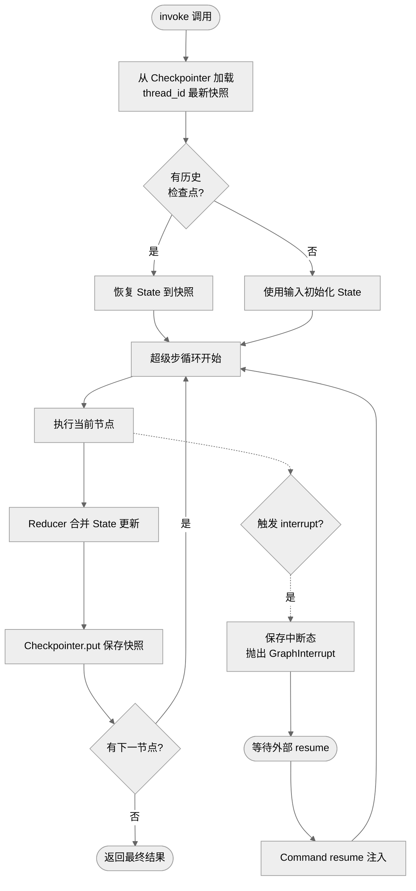
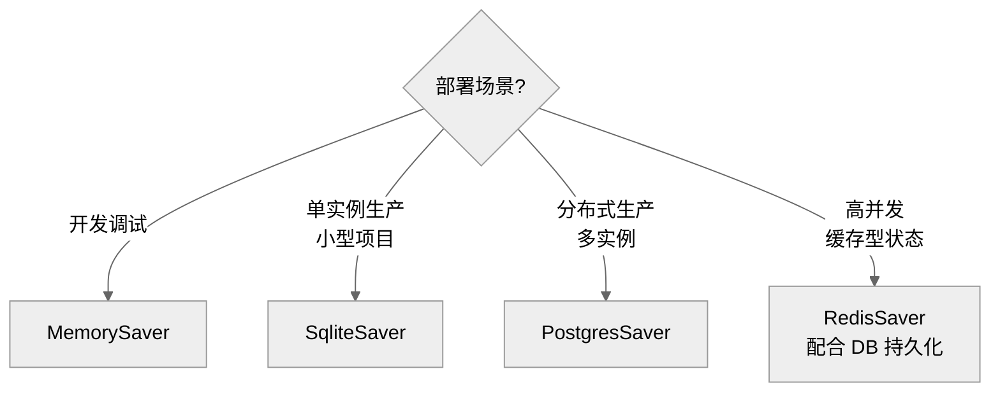
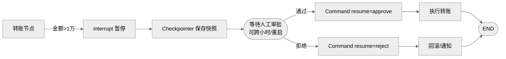

# LangGraph 持久化机制面试题集

> 面试目标：评估候选人对 LangGraph 持久化机制（Checkpoint / Store）的概念理解、原理掌握、工程实践与场景设计能力。
> 本文档共 **8 道题**，覆盖基础概念、原理分析、实践应用、场景设计四类，难度由浅入深。

---

## 目录

- [一、基础概念（2题）](#一基础概念2题)
- [二、原理分析（2题）](#二原理分析2题)
- [三、实践应用（2题）](#三实践应用2题)
- [四、场景设计（2题）](#四场景设计2题)
- [五、评分总览](#五评分总览)

---

## 一、基础概念（2题）

### Q1：什么是 LangGraph 的 Checkpoint？它解决了哪些核心问题？

**难度**：初级　**考察点**：概念理解

**问题描述**：
请阐述 LangGraph Checkpoint 的定义、触发时机、保存内容，以及它解决了 Agent 应用中的哪些核心问题。

**参考答案**：

- **定义**：Checkpoint 是 LangGraph 在图执行过程中对全局 State 做的快照备份，是实现持久化、中断恢复、历史回溯的底层基础。
- **触发时机**：每个节点执行成功后自动保存；中断（interrupt）触发时也会保存。
- **保存内容**：完整 State 数据、节点执行历史、元数据（执行时间、版本号、step 编号等）。
- **解决的核心问题**：
  1. **多轮对话记忆**：跨 invoke 调用保留上下文
  2. **容错恢复**：进程重启后从断点续跑
  3. **Human-in-the-Loop**：暂停等待人工审批后继续
  4. **时间旅行**：回退到任意历史状态调试

**评分标准**：定义 1 分 / 触发时机 1 分 / 保存内容 1 分 / 解决问题 2 分（满分 5）。

---

### Q2：thread_id、checkpoint_ns、checkpoint_id 三个标识各自的作用与区别？

**难度**：初级　**考察点**：核心概念辨析

**问题描述**：
在使用 `graph.invoke(input, config)` 时，config 中常包含 `thread_id`；此外还有 `checkpoint_ns`、`checkpoint_id`。请说明三者的作用、粒度与典型使用场景。

**参考答案**：

| 标识 | 作用 | 粒度 | 典型场景 |
|------|------|------|----------|
| `thread_id` | 会话唯一标识 | 最粗（会话级） | 区分不同用户/任务的状态，**最常用隔离维度** |
| `checkpoint_ns` | 命名空间 | 中等（子图级） | 子图、多分支的状态隔离，普通场景默认即可 |
| `checkpoint_id` | 检查点唯一 ID | 最细（快照级） | 精确回溯到某个历史版本 |

```python
# 项目示例：客服系统中按用户隔离会话
config = {"configurable": {"thread_id": f"user_{user_id}_session_{session_id}"}}
graph.invoke({"messages": [HumanMessage("我的订单号是 12345")]}, config)
# 同一 thread_id 的下次调用会自动加载历史状态
graph.invoke({"messages": [HumanMessage("查一下物流")]}, config)
```

**评分标准**：三者作用各 1 分 / 粒度对比 1 分 / 示例 1 分（满分 5）。

---

## 二、原理分析（2题）

### Q3：请描述 Checkpointer 在一次 `graph.invoke` 调用中的工作流程。

**难度**：中级　**考察点**：原理掌握

**问题描述**：
请结合流程图，描述 LangGraph Checkpointer 在一次图执行中的完整工作流程，包括初始化、节点执行、快照保存、恢复等环节。

**参考答案**：



**关键原理**：
1. **加载阶段**：根据 `thread_id` 调用 `aget_tuple` 获取最新检查点，恢复 State。
2. **保存阶段**：每个超级步完成后调用 `put` 写入新快照，并调用 `put_writes` 记录中间写入。
3. **中断恢复**：interrupt 抛出 `GraphInterrupt` 前先保存，外部 `Command(resume=...)` 注入后从检查点重放。
4. **接口抽象**：所有 Checkpointer 实现 `BaseCheckpointSaver` 接口（`get/put/list/put_writes/delete_thread`），业务代码与存储介质解耦。

**评分标准**：流程图正确 2 分 / 加载阶段 1 分 / 保存阶段 1 分 / 中断恢复 1 分（满分 5）。

---

### Q4：Checkpointer 与 Store 的区别是什么？什么场景该用哪个？

**难度**：中级　**考察点**：架构理解

**问题描述**：
LangGraph 提供两套持久化系统：Checkpointers 和 Stores。请对比二者在持久化对象、作用域、访问方式、典型场景上的区别。

**参考答案**：

| 维度 | Checkpointer | Store |
|------|--------------|-------|
| **持久化对象** | Graph State 快照 | 应用自定义 KV 数据 |
| **作用域** | 单个 thread（线程内） | 跨 thread（线程间） |
| **记忆类型** | 短期、线程内记忆 | 长期、跨线程记忆 |
| **访问方式** | 配置中传 `thread_id` 自动管理 | 节点内或应用代码显式读写 |
| **典型用途** | 对话连续性、HITL、时间旅行、容错 | 用户偏好、长期事实、共享知识 |
| **底层接口** | `BaseCheckpointSaver` | `BaseStore` |

**项目示例**：
```python
# 客服系统：Checkpointer 管单轮会话，Store 管长期用户画像
from langgraph.checkpoint.postgres import PostgresSaver
from langgraph.store.postgres import PostgresStore

checkpointer = PostgresSaver(conn)
store = PostgresStore.from_conn_string(DB_URI)

graph = builder.compile(checkpointer=checkpointer, store=store)

# 节点内读写长期记忆
def agent_node(state, *, store):
    user_mem = store.get(namespace=("user", user_id), key="profile")
    return {"messages": [...]}

# 跨会话调用：不同 thread_id 共享同一用户画像
graph.invoke(input1, {"configurable": {"thread_id": "sess-1"}})
graph.invoke(input2, {"configurable": {"thread_id": "sess-2"}})  # 仍能读到 profile
```

**评分标准**：6 项对比各 0.5 分 / 场景判断 1 分 / 项目示例 1 分（满分 5）。

---

## 三、实践应用（2题）

### Q5：LangGraph 提供哪些 CheckpointSaver 实现？生产环境如何选型？

**难度**：中级　**考察点**：技术选型

**问题描述**：
请列举 LangGraph 提供的常见 CheckpointSaver 实现，对比它们的优缺点，并说明开发、单实例生产、分布式生产、高并发缓存四种场景下分别应选哪个。

**参考答案**：

| 存储后端 | 依赖包 | 优点 | 缺点 |
|----------|--------|------|------|
| `MemorySaver` / `InMemorySaver` | 内置 | 零依赖、读写极快 | 重启丢失、仅单进程 |
| `SqliteSaver` | `langgraph-checkpoint-sqlite` | 轻量、文件存储、重启不丢 | 并发能力弱 |
| `PostgresSaver` | `langgraph-checkpoint-postgres` | 高可用、支持并发、事务安全、JSONB 原生 | 需额外部署数据库 |
| `RedisSaver` | `langgraph-checkpoint-redis` | 读写速度极快 | 数据持久化弱于数据库 |

**选型决策**：



**项目示例**：
```python
# 生产环境：PostgreSQL + 自动建库
import psycopg
from langgraph.checkpoint.postgres import PostgresSaver

conn = psycopg.connect(DB_URI, autocommit=True)
checkpointer = PostgresSaver(conn)
checkpointer.setup()  # 自动建表：checkpoints / checkpoint_writes / checkpoint_blobs / checkpoint_migrations
graph = builder.compile(checkpointer=checkpointer)
```

**评分标准**：4 个实现列举 1 分 / 优缺点 1.5 分 / 选型决策 1.5 分 / 示例 1 分（满分 5）。

---

### Q6：请实现一个支持多轮记忆的客服 Agent，并说明如何查看与回退历史状态。

**难度**：中级　**考察点**：工程实践

**问题描述**：
基于 LangGraph 实现一个客服 Agent，要求：① 跨轮次保留对话记忆；② 能查询某次会话的全部历史检查点；③ 能回退到指定的历史状态继续执行。请给出关键代码。

**参考答案**：

```python
from langgraph.checkpoint.sqlite import SqliteSaver
from langgraph.graph import StateGraph, MessagesState, START, END

# 1. 配置 SQLite 持久化
checkpointer = SqliteSaver.from_conn_string("./data/customer_service.db")
builder = StateGraph(MessagesState)

def agent_node(state):
    reply = llm.invoke(state["messages"])
    return {"messages": [reply]}

builder.add_node("agent", agent_node)
builder.add_edge(START, "agent")
builder.add_edge("agent", END)
graph = builder.compile(checkpointer=checkpointer)

# 2. 多轮对话（同一 thread_id 共享状态）
config = {"configurable": {"thread_id": "customer_001_session_A"}}
graph.invoke({"messages": [("user", "我叫张三，订单 12345")]}, config)
graph.invoke({"messages": [("user", "查一下我的物流")]}, config)  # 自动加载历史

# 3. 查询历史检查点
history = list(graph.get_state_history(config))
for cp in history:
    print(cp.config["configurable"]["checkpoint_id"], cp.metadata.get("step"))

# 4. 回退到指定检查点继续执行
target = history[2]  # 回退到第 3 个检查点
graph.invoke(None, target.config)  # 从该快照续跑
```

**关键点**：
1. **`thread_id` 复用**：相同 thread_id 自动加载历史 State，无需手动拼接 messages。
2. **`get_state_history`**：返回按时间倒序的检查点列表。
3. **回退执行**：传入历史 checkpoint 的 config 即可从该点续跑，原后续快照不被删除。

**评分标准**：持久化配置 1 分 / 多轮调用 1 分 / 历史查询 1 分 / 回退执行 1 分 / 关键点说明 1 分（满分 5）。

---

## 四、场景设计（2题）

### Q7：设计一个"高风险操作人工审批"场景，说明如何用 Checkpoint + interrupt 实现。

**难度**：高级　**考察点**：HITL 场景设计

**问题描述**：
某金融 Agent 在执行"转账"操作前需要人工审批。请设计完整方案，包括：① 何时触发中断；② 如何保存状态；③ 审批通过/拒绝后如何恢复；④ 进程重启后如何继续。给出关键代码与流程图。

**参考答案**：



```python
from langgraph.types import interrupt, Command

def transfer_node(state):
    if state["amount"] > 10000:
        # 触发中断，Checkpointer 自动保存当前状态
        decision = interrupt({
            "action": "transfer",
            "to": state["payee"],
            "amount": state["amount"]
        })
        if decision == "reject":
            return {"status": "cancelled"}
    # 通过则执行转账
    return {"status": "done", "tx_id": do_transfer(state)}

# 外部恢复（可跨进程重启）
config = {"configurable": {"thread_id": "tx_20260727_001"}}
# 审批通过
graph.invoke(Command(resume="approve"), config)
# 审批拒绝
# graph.invoke(Command(resume="reject"), config)
```

**关键设计点**：
1. **`interrupt()`** 抛出 `GraphInterrupt` 前自动落盘 Checkpoint，状态不丢。
2. **`thread_id` 绑定业务单号**：便于审计与精确恢复。
3. **进程重启恢复**：服务重启后只要 Checkpointer 连同一数据库，调用 `graph.invoke(None, config)` 或 `Command(resume=...)` 即可从断点续跑。
4. **必须配持久化 Checkpointer**：`MemorySaver` 重启即失忆，生产禁用。

**评分标准**：中断触发 1 分 / 状态保存 1 分 / 恢复机制 1 分 / 重启恢复 1 分 / 流程图与代码 1 分（满分 5）。

---

### Q8：生产环境长时间运行后 Checkpoint 表无限膨胀，如何排查与解决？

**难度**：高级　**考察点**：问题排查与运维

**问题描述**：
某 LangGraph 应用上线 3 个月后，PostgreSQL 中 `checkpoints` 表达到 50GB，查询变慢、磁盘告警。请分析原因并给出完整解决方案。

**参考答案**：

**原因分析**：
1. 每个超级步都生成一条 Checkpoint 记录，长对话（如 100 轮）会产生大量快照。
2. `checkpoint_blobs` 表存储序列化的 State 大对象（如完整 messages 列表），随对话增长膨胀。
3. 默认无清理策略，历史检查点永久保留。

**解决方案**：

| 方案 | 实现 | 适用场景 |
|------|------|----------|
| **定期清理** | 定时任务删除 N 天前的检查点 | 通用方案 |
| **`delete_thread`** | 会话结束后删除整个 thread | 一次性任务 |
| **`prune` 方法** | 调用 `checkpointer.prune()` 智能剪枝 | 保留关键快照 |
| **保留策略** | 仅保留首尾 + 每 K 步一个 | 长会话场景 |
| **State 瘦身** | 用 Reducer 摘要替代全量 messages | 高频长对话 |

```python
# 项目示例：定时清理 7 天前的检查点
from datetime import datetime, timedelta

def prune_old_checkpoints(checkpointer, days=7):
    cutoff = datetime.utcnow() - timedelta(days=days)
    # 列出所有 thread
    for thread in checkpointer.alist(None):
        # 删除超过保留期的检查点
        for cp in checkpointer.alist(thread.config, filter={"before": cutoff}):
            checkpointer.adelete_for_runs(thread.config, [cp.metadata["run_id"]])

# 配合 State 摘要瘦身
class State(TypedDict):
    messages: Annotated[list, add_messages]  # 全量
    summary: str  # 摘要，超过 N 条触发摘要压缩
```

**预防措施**：
1. 上线前评估单会话 Checkpoint 体积，设置 `recursion_limit` 限制步数。
2. 监控 `checkpoints` / `checkpoint_blobs` 表大小，设告警阈值。
3. 高频长对话场景优先采用"摘要 + 仅保留最近 N 轮"策略。
4. `PostgresSaver.setup()` 创建的表已带索引，但需定期 `VACUUM ANALYZE`。

**评分标准**：原因分析 1 分 / 至少 3 种方案 2 分 / 代码示例 1 分 / 预防措施 1 分（满分 5）。

---

## 五、评分总览

| 题号 | 类型 | 难度 | 考察重点 | 满分 |
|------|------|------|----------|------|
| Q1 | 基础概念 | 初级 | Checkpoint 定义与作用 | 5 |
| Q2 | 基础概念 | 初级 | 三大标识辨析 | 5 |
| Q3 | 原理分析 | 中级 | Checkpointer 工作流程 | 5 |
| Q4 | 原理分析 | 中级 | Checkpointer vs Store | 5 |
| Q5 | 实践应用 | 中级 | 存储后端选型 | 5 |
| Q6 | 实践应用 | 中级 | 多轮记忆与状态回退 | 5 |
| Q7 | 场景设计 | 高级 | HITL 审批方案 | 5 |
| Q8 | 场景设计 | 高级 | Checkpoint 膨胀治理 | 5 |

**面试官建议**：
- **初级岗位**：重点考察 Q1、Q2、Q5，要求概念清晰、能选型。
- **中级岗位**：增加 Q3、Q4、Q6，要求理解原理并能落地。
- **高级岗位**：重点考察 Q7、Q8，要求能设计完整方案并处理生产问题。
