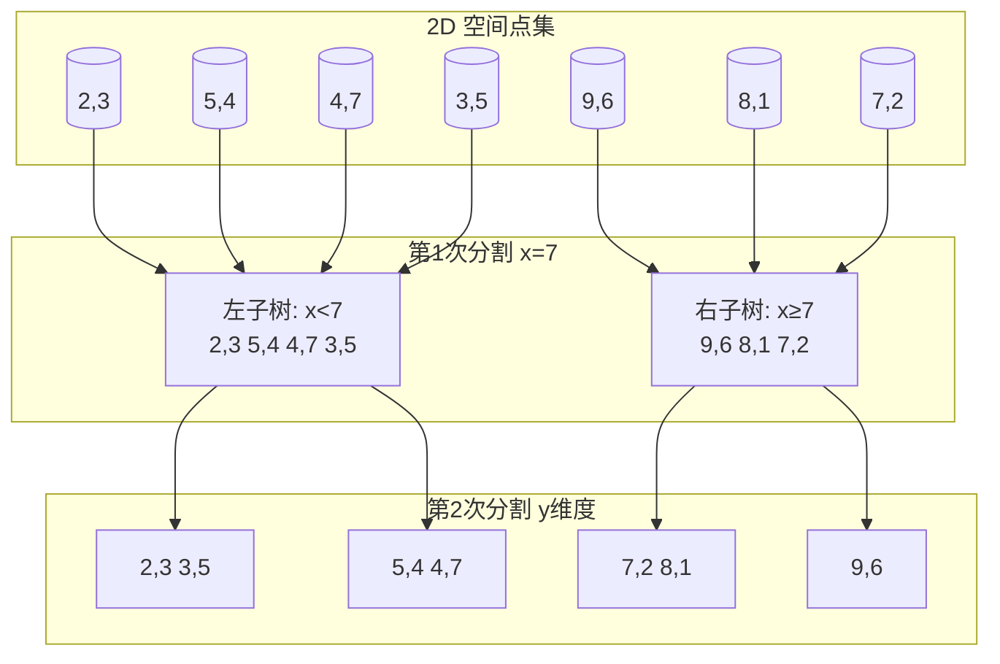
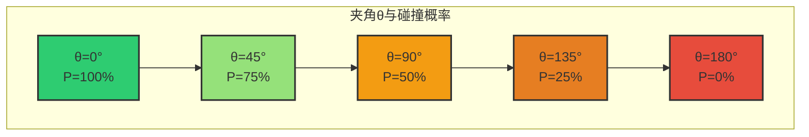
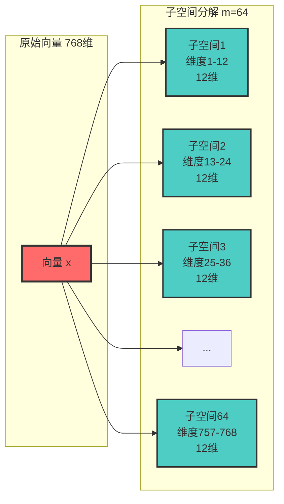
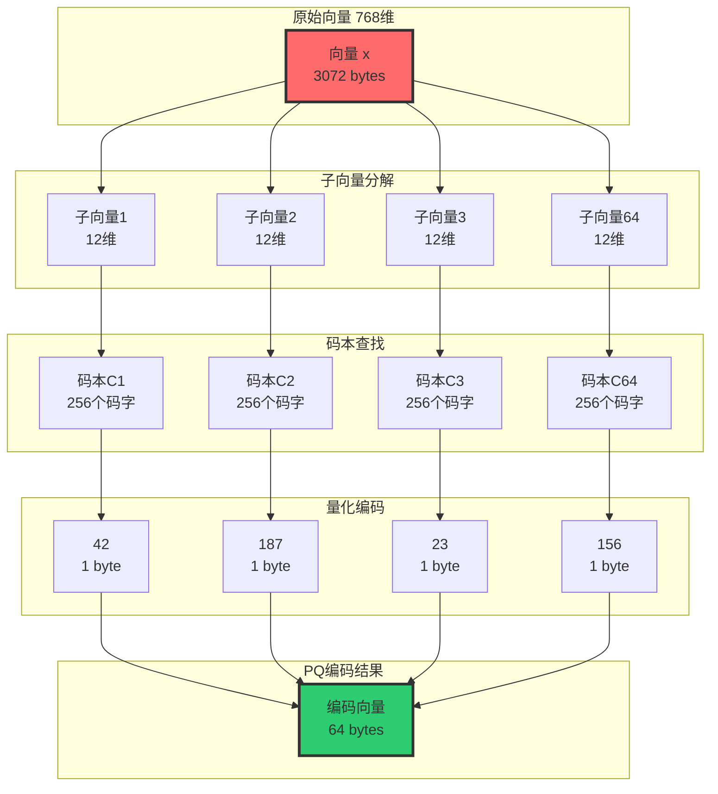
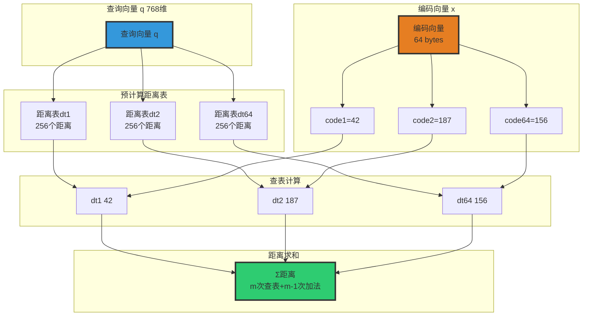
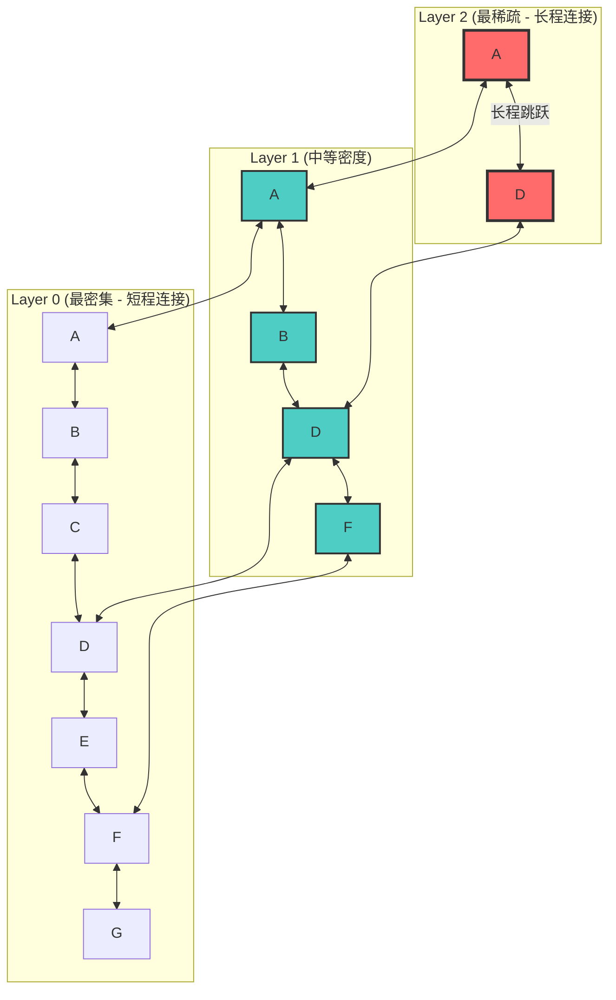
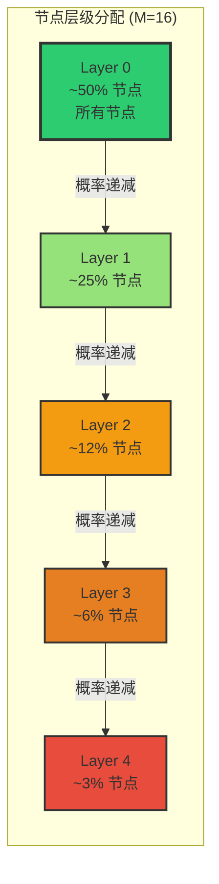
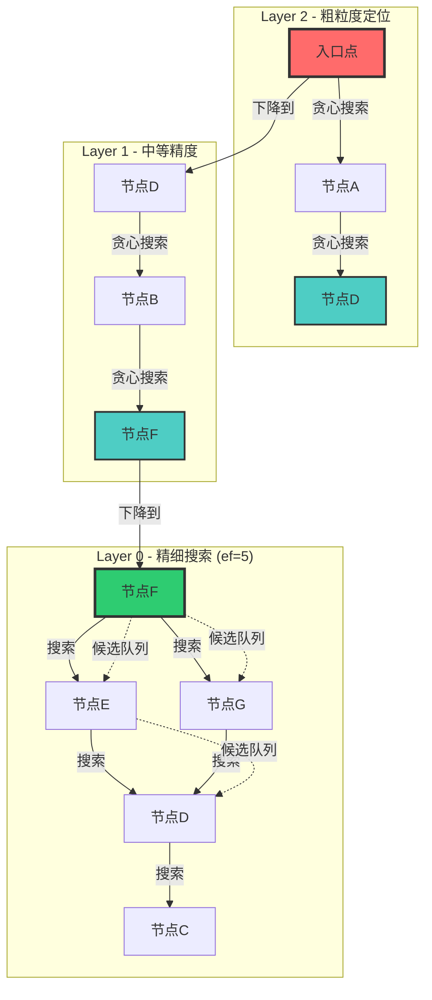
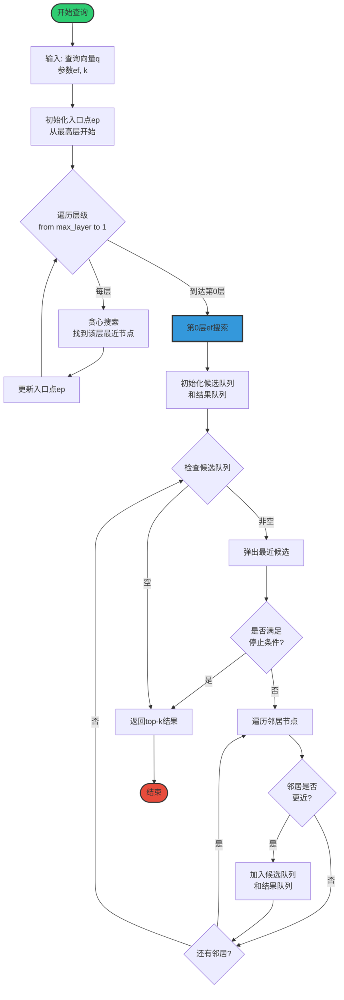

# 向量数据库检索算法技术详解

## 目录
- [1. 向量检索技术概述](#1-向量检索技术概述)
- [2. 向量嵌入(Vector Embeddings)原理](#2-向量嵌入vector-embeddings原理)
- [3. 暴力搜索算法(Brute Force)](#3-暴力搜索算法brute-force)
- [4. 近似最近邻(ANN)算法基础](#4-近似最近邻ann算法基础)
- [5. 倒排文件索引(IVF)](#5-倒排文件索引ivf)
- [6. 分层导航小世界(HNSW)](#6-分层导航小世界hnsw)
- [7. 查询向量处理流程](#7-查询向量处理流程)
- [8. 面试题集与参考答案](#8-面试题集与参考答案)

---

## 1. 向量检索技术概述

### 1.1 什么是向量检索
向量检索是指在高维空间中，给定一个查询向量，快速找到与其相似度最高的向量集合的技术。

**核心应用场景：**
- 语义搜索（文本、图像、音频）
- 推荐系统
- 异常检测
- RAG（检索增强生成）系统

### 1.2 向量检索的核心挑战
- **维度灾难**：随着维度增加，向量间距离趋于均匀
- **计算复杂度**：暴力搜索的时间复杂度为 O(n×d)
- **实时性要求**：大规模数据下需要毫秒级响应
- **准确性与效率的平衡**：精确搜索与近似搜索的权衡

---

## 2. 向量嵌入(Vector Embeddings)原理

### 2.1 基本概念
向量嵌入是将离散对象（文本、图像、类别等）映射到连续向量空间的过程，使得语义相似的对象在向量空间中距离较近。

### 2.2 嵌入方法

#### 2.2.1 词嵌入（Word Embeddings）
```
经典算法：
- Word2Vec (CBOW, Skip-gram)
- GloVe
- FastText

维度：通常 100-1000 维
```

#### 2.2.2 句子/文档嵌入
```
现代方法：
- BERT/BERT-based models
- Sentence-BERT (SBERT)
- OpenAI Embeddings (text-embedding-ada-002)
- Cohere Embeddings

维度：通常 768-1536 维
```

#### 2.2.3 图像嵌入
```
经典模型：
- ResNet
- VGG
- CLIP (跨模态)

维度：通常 512-2048 维
```

### 2.3 相似度度量方法

#### 2.3.1 余弦相似度（Cosine Similarity）
```
公式：cos(θ) = (A·B) / (||A|| × ||B||)

取值范围：[-1, 1]
- 1：完全相同方向
- 0：正交（无关）
- -1：完全相反方向

适用场景：文本语义相似度
```

#### 2.3.2 欧氏距离（Euclidean Distance）
```
公式：d(A,B) = √(Σ(Ai - Bi)²)

取值范围：[0, +∞)
- 0：完全相同
- 值越大：差异越大

适用场景：图像特征匹配
```

#### 2.3.3 内积（Inner Product / Dot Product）
```
公式：IP(A,B) = Σ(Ai × Bi)

适用场景：归一化向量后的余弦相似度计算
优势：计算效率高
```

---

## 3. 暴力搜索算法(Brute Force)

### 3.1 算法原理
暴力搜索（也称为精确搜索或扁平搜索）是最直接的向量检索方法：
- 计算查询向量与数据库中所有向量的相似度
- 返回相似度最高的 K 个向量

### 3.2 算法流程
```
输入：
- 查询向量 q
- 数据库向量集合 D = {v1, v2, ..., vn}
- 返回数量 k

流程：
1. 对于每个 vi ∈ D：
   计算 similarity(q, vi)
2. 将所有相似度排序
3. 返回 top-k 个最相似的向量

输出：
- Top-k 最相似的向量及其相似度
```

### 3.3 复杂度分析
```
时间复杂度：O(n × d)
- n：数据库中向量数量
- d：向量维度

空间复杂度：O(n × d)
- 需要存储所有向量
```

### 3.4 优缺点
**优点：**
- 100% 准确率（精确最近邻）
- 实现简单
- 无需训练/索引构建时间
- 适合小规模数据集（< 10万向量）

**缺点：**
- 大规模数据集性能极差
- 线性扩展性
- 不适合实时应用

### 3.5 代码示例（Python）
```python
import numpy as np
from typing import List, Tuple

def brute_force_search(
    query: np.ndarray,
    database: np.ndarray,
    k: int = 10
) -> List[Tuple[int, float]]:
    """
    暴力搜索最近邻
    
    Args:
        query: 查询向量，形状 (d,)
        database: 数据库向量，形状 (n, d)
        k: 返回最近邻数量
    
    Returns:
        List of (index, distance) tuples
    """
    # 计算余弦相似度
    norms = np.linalg.norm(database, axis=1) * np.linalg.norm(query)
    similarities = np.dot(database, query) / norms
    
    # 获取 top-k
    top_k_indices = np.argsort(similarities)[-k:][::-1]
    
    return [
        (idx, similarities[idx]) 
        for idx in top_k_indices
    ]
```

---

## 4. 近似最近邻(ANN)算法基础

### 4.1 什么是 ANN
近似最近邻（Approximate Nearest Neighbor）是一类通过牺牲少量准确性来换取显著性能提升的算法。

**核心思想：**
- 构建索引结构，将搜索空间划分为更小的区域
- 只搜索与查询向量最可能相似的区域
- 以 90-99% 的准确率换取 100-1000 倍的性能提升

### 4.2 ANN 算法分类

#### 4.2.1 基于树的方法

##### KD-Tree（K-Dimensional Tree）详细原理

**1. 核心思想**

KD-Tree 是一种对 k 维空间中的点进行分割的二叉树结构。其核心思想是：通过交替地沿各个维度对空间进行超平面分割，将搜索空间递归地划分为更小的区域，从而在查询时跳过大量不可能包含最近邻的区域。

**2. 构建过程**

**图 4-1：KD-Tree 空间分割示意图**



**图 4-2：KD-Tree 树结构示意图**

```mermaid
graph TD
    Root[(7,2)<br/>x=7分割]
    L1[(5,4)<br/>y=4分割]
    R1[(9,6)<br/>y=2分割]
    L2a[(2,3)<br/>x=3分割]
    L2b[(3,5)<br/>x=4分割]
    L3[(4,7)]
    R2a[(7,2)<br/>x=3分割]
    R2b[(8,1)]
    R3[(9,6)]
    
    Root --> L1
    Root --> R1
    L1 --> L2a
    L1 --> L2b
    L2a --> L3
    R1 --> R2a
    R1 --> R2b
    R2b --> R3
    
    style Root fill:#ff6b6b,stroke:#333,stroke-width:3px
    style L1 fill:#4ecdc4,stroke:#333,stroke-width:2px
    style R1 fill:#4ecdc4,stroke:#333,stroke-width:2px
```

**构建算法（递归）：**

```
输入：n 个 d 维向量集合

构建算法（递归）：
1. 选择当前维度：通常循环选择维度（第0维 → 第1维 → ... → 第d-1维 → 第0维）
   优化策略：选择方差最大的维度（使分割更均匀）

2. 选择分割点：
   - 中位数法：取当前维度上的中位数作为分割值
   - 确保左右子树的节点数大致相等

3. 空间分割：
   - 分割值左侧的点 → 左子树
   - 分割值右侧的点 → 右子树
   - 分割超平面垂直于当前维度轴

4. 递归构建：
   - 对左子集和右子集分别递归执行步骤 1-3
   - 直到子集中只有一个点或为空

示例（2维空间）：
    空间中有 7 个点：{(2,3), (5,4), (9,6), (4,7), (8,1), (7,2), (3,5)}

    第1次分割（x维度，中位数=7）：
    ┌─────────────────────────────────┐
    │  左子树(x<7)  │  右子树(x≥7)   │
    │  (2,3)(5,4)   │  (9,6)(8,1)    │
    │  (4,7)(3,5)   │  (7,2)         │
    └─────────────────────────────────┘

    第2次分割（y维度）：
    左子树按y分割 → (2,3)(3,5) | (5,4)(4,7)
    右子树按y分割 → (7,2)(8,1) | (9,6)

    最终树结构：
              (7,2)          ← 根节点，x=7分割
             /     \
       (5,4)       (9,6)     ← y=4和y=2分割
       /   \         \
    (2,3) (3,5)     (8,1)    ← x=3和x=4分割
      \
      (4,7)
```

**3. 查询过程**

```
输入：查询点 q = (q1, q2, ..., qd)

搜索算法（递归 + 剪枝）：

阶段1：向下搜索到叶节点
1. 从根节点开始
2. 比较 q 在当前分割维度上的值与分割值
3. 如果 q[dim] < split_value → 进入左子树
4. 如果 q[dim] ≥ split_value → 进入右子树
5. 递归直到叶节点
6. 将叶节点作为当前最近邻

阶段2：回溯剪枝
1. 回溯到父节点
2. 计算 q 到父节点的距离，更新最近邻
3. 关键剪枝判断：
   - 计算 q 到当前分割超平面的距离 = |q[dim] - split_value|
   - 如果这个距离 > 当前最近距离：
     → 另一侧子树不可能包含更近的点，跳过！
   - 如果这个距离 ≤ 当前最近距离：
     → 另一侧子树可能包含更近的点，递归搜索另一侧
4. 继续向上回溯，重复步骤 2-3
5. 直到回溯到根节点

剪枝示意（2维）：
    假设当前最近邻距离为 r，查询点为 q：

    ┌──────────────────────────────┐
    │         分割超平面            │
    │            │                 │
    │   q  ○     │     ○ 候选点    │
    │     |← r →│                 │
    │     |←─ |q[dim]-split| ─→│  │
    │            │                 │
    └──────────────────────────────┘

    如果 |q[dim] - split| > r：
    → 右侧所有点到 q 的距离一定 > r
    → 不需要搜索右侧，直接剪枝
```

**4. 复杂度分析**

```
构建复杂度：
- 时间：O(n × log(n) × d)
  每层需要 O(n×d) 找中位数，共 log(n) 层
- 空间：O(n × d)

查询复杂度：
- 平均情况：O(d × log(n))  ← 低维时效率高
- 最坏情况：O(d × n)       ← 高维时退化为暴力搜索
- 原因：高维空间中，分割超平面难以有效区分远近点

维度限制：
- 推荐用于 d < 20 的低维场景
- 当 d > 20 时，剪枝效率急剧下降
- 经验法则：当 d ≈ log(n) 时效果较好
```

**5. 优缺点**

```
优点：
- 构建速度快，无需训练
- 低维空间查询效率高
- 精确搜索（无近似误差）
- 内存占用低（只需存储树结构）
- 支持动态插入和删除

缺点：
- 高维空间性能急剧下降（维度灾难）
- 树结构对数据分布敏感
- 不平衡分割可能导致性能退化
- 不适合向量检索的主流场景（通常 d > 100）
```

##### Ball Tree 详细原理

**1. 核心思想**

Ball Tree 使用超球面（而非超平面）来分割空间。每个节点代表一个包含所有子节点的超球体，查询时通过判断查询点是否在球体内或距离球体表面多远来进行剪枝。

**2. 构建过程**

**图 4-3：Ball Tree 空间分割示意图**

```mermaid
graph TB
    subgraph "2D 空间点集"
        P1[(2,3)]
        P2[(5,4)]
        P3[(9,6)]
        P4[(4,7)]
        P5[(8,1)]
        P6[(7,2)]
        P7[(3,5)]
    end
    
    subgraph "根节点包围球"
        Root[圆心(5,4), r=5.7]
    end
    
    subgraph "第1次分割"
        Left1[左子树: 离A更近<br/>A=(2,3)<br/>2,3 5,4 4,7 3,5]
        Right1[右子树: 离B更近<br/>B=(9,6)<br/>9,6 8,1 7,2]
    end
    
    subgraph "第2次分割"
        Left2a[圆心(3,5), r=2.5]
        Left2b[圆心(5,4), r=2.2]
        Right2a[圆心(8,3), r=2.2]
        Right2b[圆心(9,6), r=1.4]
    end
    
    Root --> Left1
    Root --> Right1
    Left1 --> Left2a
    Left1 --> Left2b
    Right1 --> Right2a
    Right1 --> Right2b
```

**图 4-4：Ball Tree 树结构示意图**

```mermaid
graph TD
    Root[圆心(5,4)<br/>半径=5.7]
    L1[圆心(3,5)<br/>半径=2.5]
    R1[圆心(8,3)<br/>半径=2.2]
    L2a[(2,3)]
    L2b[(4,7)]
    R2a[(7,2)]
    R2b[(9,6)]
    
    Root --> L1
    Root --> R1
    L1 --> L2a
    L1 --> L2b
    R1 --> R2a
    R1 --> R2b
    
    style Root fill:#ff6b6b,stroke:#333,stroke-width:3px
    style L1 fill:#4ecdc4,stroke:#333,stroke-width:2px
    style R1 fill:#4ecdc4,stroke:#333,stroke-width:2px
```

```
输入：n 个 d 维向量集合

构建算法（递归）：
1. 找到距离最远的两个点 A 和 B（使用近似方法加速）
2. 将点集分为两组：
   - 离 A 更近的点 → 左子树
   - 离 B 更近的点 → 右子树
3. 为每个子树计算包围球：
   - 球心 = 子集中所有点的质心
   - 半径 = max(球心到子集中任意点的距离)
4. 递归构建直到叶节点

示例（2维空间）：
    所有点的包围球：圆心(5,4), 半径=5.7

              [圆心(5,4), r=5.7]
              /                \
    [圆心(3,5), r=2.5]    [圆心(8,3), r=2.2]
      /      \                /      \
  [(2,3)]  [(4,7)]       [(7,2)]   [(9,6)]
```

**3. 查询剪枝原理**

```
对于查询点 q 和节点 N（球心 c，半径 r）：

情况1：d(q, c) - r > 当前最近距离
  → 球内所有点到 q 的距离 ≥ d(q,c) - r > 当前最近距离
  → 整个子树可以剪枝！

情况2：d(q, c) + r < 当前最近距离
  → 球内所有点到 q 的距离 ≤ d(q,c) + r < 当前最近距离
  → 球内所有点都比当前最近邻更近
  → 可以直接更新最近邻，无需逐个比较

情况3：其他情况
  → 需要递归搜索子树

优势分析：
  超球面分割 vs 超平面分割：
  - 超平面：只考虑单一维度，高维时分割效果差
  - 超球面：考虑所有维度，高维时分割更有效
  - Ball Tree 在 d=20~100 时优于 KD-Tree
```

**4. 与 KD-Tree 对比**

```
| 特性          | KD-Tree          | Ball Tree           |
|---------------|------------------|---------------------|
| 分割方式      | 超平面（轴对齐） | 超球面              |
| 适合维度      | d < 20           | d < 100             |
| 构建速度      | 快               | 较慢                |
| 查询速度      | 低维快           | 中高维更快          |
| 剪枝效率      | 高维差           | 高维较好            |
| 内存占用      | 低               | 中等                |
```

##### RP-Tree（Random Projection Tree）详细原理

```
核心思想：
使用随机投影方向（而非坐标轴方向）来分割空间

构建过程：
1. 随机选择一个单位向量 v（投影方向）
2. 计算所有点在 v 上的投影值：pi = dot(point_i, v)
3. 取投影值的中位数作为分割阈值
4. 分割：
   - dot(point, v) < median → 左子树
   - dot(point, v) ≥ median → 右子树
5. 递归构建

优势：
- 随机投影保持了点之间的距离关系（Johnson-Lindenstrauss 引理）
- 分割方向不局限于坐标轴，更灵活
- 理论上在高维空间中表现更稳定

局限：
- 仍然是树结构，超高维时性能仍会下降
- 随机性导致每次构建结果不同
```

#### 4.2.2 基于哈希的方法

##### LSH（Locality Sensitive Hashing）详细原理

**1. 核心思想**

LSH 的核心思想是设计特殊的哈希函数，使得相似的向量以高概率被映射到同一个哈希桶中，而不相似的向量以低概率被映射到同一个桶中。

```
形式化定义：
一个哈希函数族 H 是 (r, ε, p1, p2)-敏感的，如果对于任意两个点 p, q：
- 如果 d(p, q) ≤ r → P[h(p) = h(q)] ≥ p1  （近的点哈希碰撞概率高）
- 如果 d(p, q) > r(1+ε) → P[h(p) = h(q)] ≤ p2  （远的点哈希碰撞概率低）

其中 p1 > p2，r 是距离阈值
```

**2. 哈希函数设计（以余弦相似度为例）**

**图 4-5：LSH 随机超平面哈希函数示意图**

```mermaid
graph LR
    subgraph "向量空间"
        A[向量A]
        B[向量B]
        C[向量C]
        U[随机超平面<br/>法向量u]
    end
    
    subgraph "哈希结果"
        H1[h=1<br/>dot(x,u)≥0]
        H0[h=0<br/>dot(x,u)<0]
    end
    
    A --> H1
    B --> H0
    C --> H1
    U -.->|分割| H1
    U -.->|分割| H0
    
    style U fill:#ff6b6b,stroke:#333,stroke-width:3px
```

**图 4-6：LSH 碰撞概率与夹角关系图**



```
随机超平面 LSH：

原理：
- 随机生成一个单位向量 u
- 哈希函数：h_u(x) = sign(dot(x, u))
  - 如果 dot(x, u) ≥ 0 → h(x) = 1
  - 如果 dot(x, u) < 0 → h(x) = 0

几何解释：
  ┌─────────────────────────────────┐
  │              ↑ u (随机向量)      │
  │              │                   │
  │    区域1     │     区域0         │
  │  h(x) = 1   │    h(x) = 0       │
  │ ─────────────┼───────────────   │
  │              │                   │
  └─────────────────────────────────┘
  超平面垂直于 u，将空间分为两半

  两个向量在同一侧的概率 = 1 - θ/π
  其中 θ 是两个向量之间的夹角

  → 夹角越小（越相似），在同一侧的概率越高
```

**3. 哈希表构建**

```
单个哈希函数的问题：
- 碰撞概率区分度不够大
- 近的点碰撞概率可能只比远的点高一点

解决方案：组合哈希函数

方法1：串联（AND）→ 提高精度
- 将 k 个哈希函数串联：g(x) = (h1(x), h2(x), ..., hk(x))
- 效果：近的点碰撞概率 p1^k，远的点碰撞概率 p2^k
- 由于 p1 > p2，p1^k 和 p2^k 的差距更大
- 代价：碰撞概率整体降低，需要更多哈希表

方法2：并联（OR）→ 提高召回率
- 使用 L 个独立的组合哈希函数 g1, g2, ..., gL
- 每个 gi 对应一个哈希表
- 查询时检查所有 L 个哈希表
- 效果：近的点至少一个碰撞的概率 = 1 - (1-p1^k)^L
- 代价：需要更多内存和计算

参数选择：
- k（串联长度）：控制精度，通常 10-30
- L（哈希表数量）：控制召回率，通常 10-100
- 更大的 k → 更精确但更慢
- 更大的 L → 更高召回率但更多内存
```

**4. 查询过程**

```
输入：查询向量 q

查询算法：
1. 对每个哈希表 li（i = 1, 2, ..., L）：
   a. 计算 q 的哈希值：gi(q) = (h1(q), h2(q), ..., hk(q))
   b. 查找哈希表 li 中哈希值为 gi(q) 的桶
   c. 将桶中所有向量加入候选集

2. 去重：合并所有候选集中的向量

3. 精确计算：
   - 计算 q 与每个候选向量的真实距离
   - 返回最近的 k 个向量

伪代码：
def lsh_search(q, hash_tables, hash_funcs, k):
    candidates = set()
    
    # 1. 多哈希表查询
    for i, (table, g) in enumerate(zip(hash_tables, hash_funcs)):
        hash_value = g(q)  # 计算组合哈希值
        bucket = table.get(hash_value, [])
        candidates.update(bucket)
    
    # 2. 精确排序
    distances = [(c, distance(q, c)) for c in candidates]
    distances.sort(key=lambda x: x[1])
    
    return distances[:k]
```

**5. 哈希函数族（针对不同距离度量）**

```
余弦相似度 → 随机超平面 LSH
- h(x) = sign(dot(x, r)), r ~ N(0, I)
- 碰撞概率 = 1 - θ/π

欧氏距离 → p-stable LSH
- h(x) = floor(dot(x, r) / w)
- r 从 p-stable 分布采样（p=2 对应高斯分布）
- w 是桶宽度参数
- 碰撞概率随距离单调递减

Jaccard 相似度 → MinHash
- h(x) = min(π(xi))，π 是随机排列
- 碰撞概率 = Jaccard 相似度
```

**6. 复杂度分析**

```
构建复杂度：
- 时间：O(n × L × k × d)
  L 个哈希表，每个需要 k 次哈希计算，每次 O(d)
- 空间：O(n × L)
  每个向量在 L 个哈希表中各有一个条目

查询复杂度：
- 时间：O(L × k × d + |candidates| × d)
  L 次哈希计算 + 候选集精确计算
- 候选集大小取决于参数 k 和 L

调参方法：
- 增大 L → 召回率↑，内存↑，查询时间↑
- 增大 k → 精度↑，召回率↓，候选集变小
```

**7. 优缺点**

```
优点：
- 理论保证：有严格的概率分析
- 内存效率高：哈希表存储紧凑
- 适合超高维数据
- 支持动态插入
- 可分布式部署

缺点：
- 需要大量哈希表才能达到高召回率
- 召回率-效率权衡不如图方法
- 结果不稳定（随机性）
- 调参复杂（k, L, w 都需要调优）
```

#### 4.2.3 基于量化的方法

##### PQ（Product Quantization，乘积量化）详细原理

**1. 核心思想**

PQ 的核心思想是将高维向量分解为多个低维子向量，对每个子向量独立进行量化（聚类压缩），用量化后的编码来近似原始向量，从而实现高效的距离计算和内存压缩。

```
直观理解：
  原始向量：768 维浮点向量 → 3072 字节（768 × 4 bytes）
  PQ 编码：64 个子空间 × 1 字节/子空间 → 64 字节
  压缩比：3072 / 64 = 48 倍！

核心原理：
  将 d 维空间分解为 m 个子空间的笛卡尔积
  每个子空间独立量化
  距离计算可以分解为子空间距离的求和
```

**2. 子空间分解**

**图 4-7：PQ 子空间分解示意图**



```
输入：d 维向量 x = (x1, x2, ..., xd)

分解过程：
1. 将 d 维向量等分为 m 个子向量
   - 每个子向量维度 = d/m（假设 d 能被 m 整除）
   
   示例（d=768, m=64）：
   x = (x1, ..., x768)
   ↓ 分解为 64 个子向量
   x = (x[1], x[2], ..., x[64])
   每个 x[i] 是 12 维向量（768/64=12）

   子空间 1: 维度 1-12
   子空间 2: 维度 13-24
   ...
   子空间 64: 维度 757-768
```

**3. 码本训练（Codebook Training）**

```
对每个子空间独立训练量化码本：

对于子空间 i（维度 d/m）：
1. 收集所有训练向量在子空间 i 上的投影
2. 使用 K-Means 聚类（通常 K=256，即 8 bit）
3. 得到 256 个聚类中心（码字）
   ci = {c_i^1, c_i^2, ..., c_i^256}

总码本：
C = {C1, C2, ..., Cm}
每个 Ci 包含 256 个 d/m 维的码字

码本大小：
- 总码字数 = m × 256 = 64 × 256 = 16384
- 每个码字 12 维 × 4 bytes = 48 bytes
- 码本总大小 = 16384 × 48 = 786 KB
- 相比原始数据（百万级向量），码本非常小
```

**4. 向量编码**

```
编码过程：
对于向量 x = (x[1], x[2], ..., x[m])：

1. 对每个子向量 x[i]：
   - 在码本 Ci 中找到最近的码字
   - code[i] = argmin_j ||x[i] - c_i^j||²
   
2. 用码字索引替代原始子向量
   - 每个子向量 → 1 个字节（0-255）
   
3. 最终编码：
   x ≈ (code[1], code[2], ..., code[m])
   每个 code[i] ∈ {0, 1, ..., 255}

编码示例（m=4, 简化展示）：
  原始向量：(3.14, 2.71, 1.41, 5.92, ...)  ← 浮点数
  子向量1：(3.14, 2.71) → 最近码字索引 42
  子向量2：(1.41, 5.92) → 最近码字索引 187
  ...
  编码结果：(42, 187, 23, 156)  ← 4 个字节
```

**5. ADC（Asymmetric Distance Computation，非对称距离计算）**

**图 4-8：PQ 编码过程示意图**



**图 4-9：ADC 距离计算流程图**



```
这是 PQ 最精妙的部分：无需解码即可快速计算近似距离

查询向量 q 与编码向量 x 的距离计算：

传统方法（解码后计算）：
1. 解码：将编码还原为近似向量 x'
2. 计算：distance(q, x') = ||q - x'||²
→ 需要解码，效率低

ADC 方法（查表法）：
1. 预计算距离表：
   对于查询向量 q 的每个子向量 q[i]：
   - 计算 q[i] 与码本 Ci 中所有 256 个码字的距离
   - 存入距离表 dt[i][j] = ||q[i] - c_i^j||²
   - 表大小：m × 256 = 64 × 256 = 16384 个浮点数

2. 快速距离查询：
   对于编码向量 x = (code[1], ..., code[m])：
   distance(q, x) ≈ Σ dt[i][code[i]]
   = dt[1][code[1]] + dt[2][code[2]] + ... + dt[m][code[m]]
   
   → 只需要 m 次查表 + m-1 次加法！
   → 无需解码，无需浮点乘法

距离计算对比：
  暴力搜索：d 次乘法 + d 次加法 = 768 次乘法 + 768 次加法
  ADC：m 次查表 + m-1 次加法 = 64 次查表 + 63 次加法
  加速比：约 12 倍！

预计算成本：
  每次查询需要预计算 m × 256 个距离
  = 64 × 256 × (d/m) = 64 × 256 × 12 = 196608 次运算
  这个成本分摊到所有候选向量上
```

**6. 距离分解的数学原理**

```
为什么距离可以分解为子空间距离之和？

欧氏距离的平方：
||q - x||² = Σ(j=1 to d) (qj - xj)²

分解为 m 个子空间：
= Σ(i=1 to m) Σ(j in 子空间i) (qj - xj)²
= Σ(i=1 to m) ||q[i] - x[i]||²

量化近似：
≈ Σ(i=1 to m) ||q[i] - c_i^{code[i]}||²
= Σ(i=1 to m) dt[i][code[i]]

关键：由于子空间是独立的（正交分解），
距离可以精确分解为子空间距离之和。
量化误差来自每个子空间的近似。
```

**7. OPQ（Optimized Product Quantization）**

```
PQ 的问题：
- 子空间分解是固定的（均匀分割维度）
- 如果数据在某些方向上方差大，均匀分割不够优化

OPQ 的改进：
1. 在量化之前，先对向量做正交变换 R
   x' = R × x
2. 优化目标：同时学习 R 和码本，使量化误差最小
3. 交替优化：
   a. 固定 R，更新码本（标准 K-Means）
   b. 固定码本，更新 R（SVD 分解）
   c. 重复直到收敛

效果：
- 量化误差减少 10-30%
- 召回率提升 2-5%
- 计算开销增加不多（只需一次矩阵乘法）
```

**8. 复杂度分析**

```
编码复杂度：
- 每个向量：m 次最近邻搜索（在 256 个码字中）
- 每次搜索：d/m 次距离计算
- 总复杂度：O(m × 256 × d/m) = O(256 × d)

查询复杂度（ADC）：
- 预计算距离表：O(m × 256 × d/m) = O(256 × d)
- 每个候选向量：O(m) 次查表 + 加法
- 总查询：O(256 × d + n × m)

内存：
- 编码存储：n × m bytes（每个向量 m 字节）
- 码本存储：m × 256 × d/m × 4 bytes
- 距离表：m × 256 × 4 bytes（每次查询）

压缩效果：
- 原始：n × d × 4 bytes
- PQ 编码：n × m bytes
- 压缩比：d × 4 / m
- 示例（d=768, m=64）：3072/64 = 48 倍
```

##### SDC（Symmetric Distance Computation）详细原理

```
与 ADC 的区别：
- ADC：查询向量用原始向量，数据库向量用编码
  → 非对称：一边精确，一边近似
- SDC：查询向量和数据库向量都用编码
  → 对称：两边都近似

SDC 距离计算：
1. 先将查询向量 q 也编码为 (qcode[1], ..., qcode[m])
2. 预计算子空间间距离表：
   dt[i][a][b] = ||c_i^a - c_i^b||²
   对所有 i∈{1..m}, a∈{0..255}, b∈{0..255}
   表大小：m × 256 × 256

3. 距离计算：
   distance(q, x) ≈ Σ dt[i][qcode[i]][xcode[i]]

优势：
- 当查询向量也需要压缩时（如分布式场景）
- 两端都用编码，通信量小

劣势：
- 预计算表更大（256×256 vs 256）
- 查询向量也有量化误差
- 通常不如 ADC 精确
```

#### 4.2.4 基于图的方法

##### 图方法通用原理

```
核心思想：
将所有向量作为节点构建一个近邻图（Proximity Graph），
其中每个节点与它的若干近邻相连。查询时从入口点出发，
沿着图的边贪心地走向与查询更近的节点，直到收敛。

近邻图的基本性质：
1. 节点 = 向量
2. 边 = 近邻关系
3. 贪心搜索：每步走向最近的未访问邻居
4. 终止条件：当前节点比所有邻居都更接近查询

搜索示意：
    入口点 A → 邻居中最近是 B → B 的邻居中最近是 D → D 的邻居中最近是 F
    A(0.8) → B(0.6) → D(0.3) → F(0.1) ← 收敛，返回 F
    
    括号内为与查询点的距离

关键挑战：
1. 如何构建高质量的图？（连接策略）
2. 如何避免陷入局部最优？（长程连接）
3. 如何平衡图的稀疏性和连通性？
```

##### NSG（Navigating Spreading-out Graph）详细原理

```
核心思想：
在构建图时，不仅考虑最近邻，还考虑邻居方向的多样性，
确保从任何方向进入图都能有效导航。

构建过程：
1. 构建初始近邻图（使用 k-NN）
2. 选择中心点（使得到所有点的平均距离最小）
3. 从中心点出发，进行 BFS/DFS 遍历
4. 在遍历过程中，为每个节点选择邻居：
   - 按距离排序候选邻居
   - 使用角度过滤：如果两个候选邻居之间的夹角太小，
     只保留更近的那个
   - 确保邻居分布在不同方向上

角度过滤示意：
        q (查询点)
        │
    ○ A │ ○ B
     \  │  /
      \ │ /
       \|/
        N (当前节点)
    
    如果角 ANB < 阈值（如 60°）：
    → A 和 B 方向太接近
    → 只保留距离 q 更近的那个
    → 避免邻居集中在同一方向

优势：
- 低搜索复杂度（更少的边访问）
- 高召回率
- 图更紧凑

劣势：
- 构建复杂度高
- 不支持增量更新
```

##### Vamana 详细原理

```
核心思想：
Vamana 是 DiskANN 算法的核心索引结构，专为磁盘-based 场景设计。
它在构建时使用贪心策略确保图的"弱小世界"性质。

构建过程（Robust Pruning）：
对于节点 p 的邻居选择：
1. 收集候选邻居集合（来自 p 的当前邻居 + 新插入节点的邻居）
2. 按与 p 的距离排序
3. 贪心选择：
   a. 维护两个集合：已选邻居和剩余候选
   b. 每次选择与 p 最近的候选 c
   c. 检查：对于已选邻居中的每个 n，
      如果 distance(c, n) < α × distance(p, c)
      → 跳过 c（与已选邻居太近，方向重复）
   d. 否则将 c 加入已选集合
   e. 重复直到选满 R 个邻居或候选耗尽

参数 α 的作用：
- α = 1：退化为标准最近邻选择
- α > 1（通常 1.2）：允许选择稍远但方向不同的邻居
- 更大的 α → 更多长程连接 → 更好的导航性

优势：
- 支持磁盘存储（IO 友好）
- 构建速度快
- 适合超大规模数据
```

#### 4.2.5 基于倒排索引的方法

##### 倒排索引方法通用原理

```
核心思想：
借鉴信息检索中的倒排索引思想：
- 传统倒排索引：term → 包含该 term 的文档列表
- 向量倒排索引：cluster_id → 属于该聚类的向量列表

将向量空间划分为多个区域（聚类），
查询时只搜索最相关的几个区域。

与树方法的区别：
- 树方法：每次查询沿一条路径搜索
- 倒排索引：可以搜索多个区域（通过 nprobe 控制）
- 倒排索引更适合大规模数据
```

##### IVF-PQ 详细原理

```
核心思想：
IVF + PQ 的组合，先用 IVF 缩小搜索范围，再用 PQ 压缩和加速。

数据结构：
1. 粗量化（Coarse Quantizer）：
   - nlist 个聚类中心（通常 1024-65536）
   - 用于确定向量属于哪个聚类
   
2. 细量化（Product Quantizer）：
   - 每个聚类内部使用 PQ 编码
   - m 个子空间，每个 256 个码字

索引构建：
1. 训练粗量化器（K-Means，nlist 个聚类）
2. 训练 PQ 码本（对残差向量训练）
   注意：训练 PQ 时使用的是残差向量！
   残差 = 原始向量 - 最近的聚类中心
   → 残差比原始向量更集中，量化误差更小

3. 编码所有向量：
   对每个向量 x：
   a. 找到最近的聚类中心 c_j
   b. 计算残差：r = x - c_j
   c. 对残差 r 进行 PQ 编码
   d. 存储：(cluster_id, pq_code)

查询过程：
1. 计算 q 与所有 nlist 个聚类中心的距离
2. 选择最近的 nprobe 个聚类
3. 对每个选中的聚类：
   a. 计算 q 到该聚类中心的残差：rq = q - c_j
   b. 使用 rq 预计算 PQ 距离表
   c. 对聚类中每个编码向量，用 ADC 计算近似距离
   d. 注意：距离 = ||q - x|| = ||(q-c_j) - (x-c_j)|| ≈ ||rq - pq_decode(code)||
4. 合并所有聚类的结果，返回 top-k

内存分析：
- 聚类中心：nlist × d × 4 bytes
- PQ 编码：n × m bytes
- PQ 码本：m × 256 × (d/m) × 4 bytes
- 总计 ≈ n × m bytes（编码部分）

示例（d=768, nlist=4096, m=64, n=1亿）：
- 聚类中心：4096 × 768 × 4 = 12 MB
- PQ 编码：1亿 × 64 = 6 GB
- PQ 码本：64 × 256 × 12 × 4 = 786 KB
- 总计 ≈ 6 GB（vs 原始 300 GB，压缩 50 倍！）
```

##### IVF-HNSW 详细原理

```
核心思想：
IVF 做粗粒度空间划分，HNSW 在每个聚类内部做精细搜索。
结合 IVF 的大规模数据处理能力和 HNSW 的高召回率。

数据结构：
1. 粗量化器：nlist 个聚类中心
2. 每个聚类内部：一个独立的 HNSW 图

查询过程：
1. 计算 q 与所有聚类中心的距离
2. 选择最近的 nprobe 个聚类
3. 对每个选中的聚类：
   - 在该聚类的 HNSW 图中搜索
   - 使用 ef 参数控制搜索范围
4. 合并所有聚类的结果，返回 top-k

优势：
- 比纯 HNSW 节省内存（每个聚类的图更小）
- 比纯 IVF 召回率更高（HNSW 搜索更精确）
- 支持大规模数据

参数配置：
- nlist：1000-10000
- nprobe：10-100
- M（HNSW）：16-32
- ef：50-200
```

### 4.3 ANN 性能评估指标

#### 4.3.1 召回率（Recall）
```
公式：Recall = |检索到的真实最近邻 ∩ 返回结果| / k

评估标准：
- Recall@10 > 95%：优秀
- Recall@10 > 90%：良好
- Recall@10 < 80%：需要优化
```

#### 4.3.2 查询延迟（Query Latency）
```
单位：毫秒（ms）

评估标准：
- < 10ms：实时应用
- 10-100ms：交互式应用
- > 100ms：批处理应用
```

#### 4.3.3 索引构建时间
```
考虑因素：
- 离线构建 vs 在线更新
- 内存消耗
- CPU 使用率
```

---

## 5. 倒排文件索引(IVF)

### 5.1 基本原理
倒排文件索引（Inverted File Index）是一种基于聚类的索引结构，核心思想是：
1. 将向量空间划分为多个 Voronoi 单元（聚类）
2. 每个向量分配到最近的聚类中心
3. 查询时只搜索最近的几个聚类

### 5.2 索引构建流程

#### 5.2.1 训练阶段
```
输入：训练数据集（通常是数据库的子集）

流程：
1. 选择聚类数量 nlist（通常 100-10000）
2. 使用 K-Means 算法训练聚类中心
   - 初始化：随机选择 nlist 个向量作为初始中心
   - 迭代：
     a. 分配：将每个向量分配到最近的聚类中心
     b. 更新：重新计算每个聚类的中心
     c. 收敛：直到中心不再变化或达到最大迭代次数
3. 保存 nlist 个聚类中心

输出：
- 聚类中心集合 {c1, c2, ..., c_nlist}
```

#### 5.2.2 索引阶段
```
流程：
1. 对于每个向量 vi：
   - 计算与所有聚类中心的距离
   - 找到最近的聚类中心 c_j
   - 将 vi 添加到第 j 个倒排列表
2. 构建倒排列表：
   IVF[j] = {v | v 属于聚类 j}

数据结构：
IVF = {
  0: [v1, v5, v12, ...],
  1: [v2, v7, v15, ...],
  ...
  nlist-1: [v3, v9, v18, ...]
}
```

### 5.3 查询流程

#### 5.3.1 标准 IVF 查询
```
输入：
- 查询向量 q
- 搜索聚类数量 nprobe（通常 1-100）

流程：
1. 计算 q 与所有聚类中心的距离
2. 选择最近的 nprobe 个聚类
3. 只在这些聚类的倒排列表中搜索
4. 计算 q 与这些列表中所有向量的相似度
5. 返回 top-k 结果

伪代码：
```
def ivf_search(q, IVF, centers, k, nprobe):
    # 1. 找到最近的 nprobe 个聚类
    distances = [distance(q, c) for c in centers]
    nearest_clusters = argsort(distances)[:nprobe]
    
    # 2. 收集候选向量
    candidates = []
    for cluster_id in nearest_clusters:
        candidates.extend(IVF[cluster_id])
    
    # 3. 计算相似度并返回 top-k
    similarities = [similarity(q, v) for v in candidates]
    return top_k(candidates, similarities, k)
```

### 5.4 复杂度分析
```
时间复杂度：
- 索引构建：O(n × d × nlist × iterations)
- 查询：O(nlist × d + nprobe × n/nlist × d)
  ≈ O(nprobe × n / nlist × d)

空间复杂度：
- O(n × d + nlist × d)
  = O((n + nlist) × d)

参数调优：
- nlist：聚类数量，通常 √n 到 n/1000
- nprobe：搜索聚类数量，召回率与 nprobe 正相关
```

### 5.5 IVF 变体

#### 5.5.1 IVF-PQ（Product Quantization）
```
原理：
1. 将 d 维向量分为 m 个子向量
2. 每个子向量独立量化（聚类）
3. 用聚类中心 ID 表示原向量

优势：
- 内存压缩 8-32 倍
- 快速距离计算（查表法）

应用：
- Faiss 的 IVF-PQ
- 适合超大规模数据（> 1亿向量）
```

#### 5.5.2 IVF-HNSW
```
原理：
1. 使用 IVF 划分空间
2. 每个聚类内部使用 HNSW 索引
3. 查询时先在 IVF 层选择聚类，再在 HNSW 层搜索

优势：
- 结合两者优点
- 高召回率 + 快速查询
- 适合大规模高维数据
```

### 5.6 代码示例（Faiss）
```python
import faiss
import numpy as np

# 参数设置
d = 768        # 向量维度
nlist = 100    # 聚类数量
k = 10         # 返回最近邻数量
nprobe = 10    # 搜索聚类数量

# 创建 IVF 索引
quantizer = faiss.IndexFlatL2(d)  # 暴力搜索作为量化器
index = faiss.IndexIVFFlat(quantizer, d, nlist, faiss.METRIC_L2)

# 训练索引（需要训练数据）
training_data = np.random.random((10000, d)).astype('float32')
index.train(training_data)

# 添加数据
database = np.random.random((100000, d)).astype('float32')
index.add(database)

# 设置 nprobe
index.nprobe = nprobe

# 查询
query = np.random.random((1, d)).astype('float32')
distances, indices = index.search(query, k)

print(f"Top-{k} indices:", indices)
print(f"Distances:", distances)
```

---

## 6. 分层导航小世界(HNSW)

### 6.1 小世界网络基础

#### 6.1.1 什么是小世界网络
小世界网络是一种特殊的图结构，具有以下特性：
- **高聚类系数**：邻居节点之间倾向于相互连接
- **短平均路径长度**：任意两个节点之间可以通过少量跳数到达
- **局部连接 + 长程连接**：既有局部聚类，也有跨越整个网络的"捷径"

#### 6.1.2 NSW（Navigable Small World）
```
构建过程：
1. 逐个插入节点
2. 新节点与当前图中最近的 M 个节点连接
3. 形成局部连接图

查询过程：
1. 从随机入口点开始
2. 贪心搜索：总是移动到最近的邻居
3. 直到无法找到更近的节点

缺点：
- 早期节点度数过高（hub 问题）
- 查询性能不稳定
```

### 6.2 HNSW 核心思想

HNSW 通过引入分层结构解决 NSW 的问题：
- **多层结构**：类似跳表（Skip List）的分层图
- **上层稀疏**：长程连接，快速定位目标区域
- **下层密集**：短程连接，精确搜索
- **概率平衡**：通过概率控制节点层级分布

### 6.3 HNSW 数据结构

#### 6.3.1 层级结构

**图 6-1：HNSW 多层图结构示意图**



**图 6-2：HNSW 层级分布示意图**



```
Layer 2 (最稀疏):    A -------- D
                     |          |
Layer 1 (中等):      A --- B --- D --- F
                     |     |     |     |
Layer 0 (最密集):    A - B - C - D - E - F - G

说明：
- 每个节点至少在第 0 层
- 节点以概率 p 出现在更高层
- 高层节点是低层节点的子集
- 典型 p = 0.1-0.5
```

#### 6.3.2 节点层级分配
```
公式：level = floor(-ln(uniform(0,1)) × mL)

参数：
- mL = 1 / ln(M)
- M：每个节点的最大连接数（通常 16-64）

示例（M=16）：
- mL ≈ 0.18
- 约 50% 节点在第 0 层
- 约 25% 节点在第 1 层
- 约 12% 节点在第 2 层
- 约 6% 节点在第 3 层
- ...
```

### 6.4 HNSW 索引构建

#### 6.4.1 插入算法
```
输入：
- 新节点 q
- 当前图 G
- 参数 M, efConstruction, mL

流程：
1. 确定 q 的层级 l = floor(-ln(random()) × mL)
2. 从最高层的入口点开始
3. 对于每一层 from top to l+1：
   - 贪心搜索找到最近的节点
   - 更新入口点
4. 对于每一层 from l down to 0：
   - 搜索 efConstruction 个最近邻
   - 选择 M 个最近的节点作为邻居
   - 建立双向连接
   - 如果邻居的连接数超过 M，修剪连接
5. 如果 l > 当前最高层，更新入口点

伪代码：
```
def insert(q, G, M, efC, mL):
    l = floor(-ln(random()) * mL)
    ep = G.entry_point
    
    # 从顶层到 l+1 层，贪心搜索
    for lc in range(G.max_level, l, -1):
        ep = greedy_search(G, ep, q, layer=lc)
    
    # 从 l 层到 0 层，构建连接
    for lc in range(l, -1, -1):
        neighbors = search_layer(G, ep, q, ef=efC, layer=lc)
        neighbors = select_neighbors(neighbors, M)
        
        for n in neighbors:
            add_edge(G, q, n, layer=lc)
            if degree(n, lc) > M:
                prune_edges(G, n, lc, M)
        
        ep = neighbors[0]  # 最近的邻居
    
    if l > G.max_level:
        G.entry_point = q
        G.max_level = l
```

#### 6.4.2 邻居选择策略
```
简单策略：
- 选择距离最近的 M 个节点

启发式策略（推荐）：
- 考虑邻居之间的多样性
- 避免选择过于集中的邻居
- 提高图的导航性

算法：
1. 按距离排序候选节点
2. 依次选择节点，如果：
   - 与已选节点的距离 > 与查询节点的距离
   - 或者已选节点数量 < M
3. 保证邻居分布在不同方向
```

### 6.5 HNSW 查询算法

#### 6.5.1 搜索流程

**图 6-3：HNSW 查询流程示意图**



**图 6-4：HNSW 查询算法流程图**



```
输入：
- 查询向量 q
- 图 G
- 参数 ef (搜索范围)
- k (返回数量)

流程：
1. 从最高层入口点开始
2. 对于每一层 from top to 1：
   - 贪心搜索找到该层最近的节点
   - 更新入口点
3. 在第 0 层：
   - 使用 ef 进行搜索（ef >= k）
   - 维护候选列表和已访问列表
   - 优先队列按距离排序
4. 返回 ef 个最近邻中的 top-k

伪代码：
```
def hnsw_search(q, G, ef, k):
    ep = G.entry_point
    
    # 从顶层到第 1 层，贪心搜索
    for lc in range(G.max_level, 0, -1):
        ep = greedy_search(G, ep, q, layer=lc)
    
    # 在第 0 层进行 ef 搜索
    candidates = priority_queue()  # 最小堆
    results = priority_queue()     # 最大堆
    
    candidates.push((distance(q, ep), ep))
    results.push((distance(q, ep), ep))
    visited = {ep}
    
    while not candidates.empty():
        (dist, current) = candidates.pop()
        
        # 如果当前最远的结果更近，停止
        if dist > results.max().dist:
            break
        
        # 遍历邻居
        for neighbor in G.neighbors(current, layer=0):
            if neighbor not in visited:
                visited.add(neighbor)
                d = distance(q, neighbor)
                
                if d < results.max().dist or len(results) < ef:
                    candidates.push((d, neighbor))
                    results.push((d, neighbor))
                    
                    if len(results) > ef:
                        results.pop_max()
    
    return results.top_k(k)
```

### 6.6 复杂度分析
```
时间复杂度：
- 索引构建：O(n × log(n) × M × efConstruction)
- 查询：O(ef × log(n) × M)
  - log(n)：层数
  - ef：搜索范围
  - M：每个节点的邻居数

空间复杂度：
- O(n × M × log(n))
  - n：节点数
  - M：邻居数
  - log(n)：平均层数

参数调优：
- M：16-64，越大越准确，内存越多
- efConstruction：100-500，构建时搜索范围
- ef：10-1000，查询时搜索范围，ef >= k
```

### 6.7 HNSW 优缺点

**优点：**
- 当前最先进的 ANN 算法之一
- 高召回率（> 99%）
- 查询速度快（对数级别）
- 适合高维空间
- 支持增量更新
- 内存索引，无需磁盘 I/O

**缺点：**
- 内存占用大（需要存储图结构）
- 构建时间较长
- 不适合超大规模数据（> 1亿，需要分片）
- 参数调优复杂

### 6.8 代码示例（Faiss）
```python
import faiss
import numpy as np

# 参数设置
d = 768        # 向量维度
M = 16         # 每个节点的邻居数
ef_construction = 200  # 构建时搜索范围
ef_search = 100        # 查询时搜索范围
k = 10         # 返回最近邻数量

# 创建 HNSW 索引
index = faiss.IndexHNSWFlat(d, M, faiss.METRIC_L2)

# 设置参数
index.hnsw.efConstruction = ef_construction
index.hnsw.efSearch = ef_search

# 添加数据
database = np.random.random((100000, d)).astype('float32')
index.add(database)

# 查询
query = np.random.random((1, d)).astype('float32')
distances, indices = index.search(query, k)

print(f"Top-{k} indices:", indices)
print(f"Distances:", distances)
```

---

## 7. 查询向量处理流程

### 7.1 完整查询流程

```
┌─────────────────────────────────────────────────────────┐
│                    用户查询输入                            │
│              (文本/图像/音频等)                           │
└──────────────────┬──────────────────────────────────────┘
                   │
                   ▼
┌─────────────────────────────────────────────────────────┐
│              1. 查询预处理                                 │
│  - 文本：分词、清洗、截断/填充                            │
│  - 图像：归一化、缩放、裁剪                               │
│  - 音频：采样、分帧、特征提取                             │
└──────────────────┬──────────────────────────────────────┘
                   │
                   ▼
┌─────────────────────────────────────────────────────────┐
│              2. 向量嵌入                                   │
│  - 使用预训练模型（BERT、CLIP等）                         │
│  - 生成查询向量 q (d维)                                   │
│  - 可选：归一化处理                                       │
└──────────────────┬──────────────────────────────────────┘
                   │
                   ▼
┌─────────────────────────────────────────────────────────┐
│              3. 索引选择                                   │
│  - 根据数据规模选择索引类型                               │
│  - 小数据：暴力搜索                                       │
│  - 中等数据：IVF、HNSW                                    │
│  - 超大数据：IVF-PQ、分片 HNSW                            │
└──────────────────┬──────────────────────────────────────┘
                   │
                   ▼
┌─────────────────────────────────────────────────────────┐
│              4. 相似度计算                                 │
│  - 选择度量方法（余弦、欧氏、内积）                       │
│  - 计算查询向量与候选向量的距离                           │
│  - 使用索引加速计算                                       │
└──────────────────┬──────────────────────────────────────┘
                   │
                   ▼
┌─────────────────────────────────────────────────────────┐
│              5. 排序与过滤                                 │
│  - 按相似度排序                                           │
│  - 应用元数据过滤（时间、类别等）                         │
│  - 去除重复/低质量结果                                    │
└──────────────────┬──────────────────────────────────────┘
                   │
                   ▼
┌─────────────────────────────────────────────────────────┐
│              6. 结果返回                                   │
│  - 返回 top-k 结果                                        │
│  - 包含相似度分数                                         │
│  - 可选：返回原始数据                                     │
└─────────────────────────────────────────────────────────┘
```

### 7.2 各阶段详解

#### 7.2.1 查询预处理
```python
# 文本查询预处理示例
def preprocess_text_query(text: str) -> str:
    """文本查询预处理"""
    # 1. 清洗
    text = text.strip()
    text = re.sub(r'\s+', ' ', text)  # 去除多余空格
    
    # 2. 截断（根据模型最大长度）
    max_length = 512
    if len(text) > max_length:
        text = text[:max_length]
    
    return text

# 图像查询预处理示例
def preprocess_image_query(image: np.ndarray) -> np.ndarray:
    """图像查询预处理"""
    # 1. 缩放到模型输入尺寸
    target_size = (224, 224)
    image = cv2.resize(image, target_size)
    
    # 2. 归一化
    image = image.astype('float32') / 255.0
    mean = np.array([0.485, 0.456, 0.406])
    std = np.array([0.229, 0.224, 0.225])
    image = (image - mean) / std
    
    # 3. 转换为 CHW 格式
    image = np.transpose(image, (2, 0, 1))
    
    return image
```

#### 7.2.2 向量嵌入
```python
# 使用 Sentence-BERT 生成文本嵌入
from sentence_transformers import SentenceTransformer

model = SentenceTransformer('all-MiniLM-L6-v2')

def encode_query(text: str) -> np.ndarray:
    """生成查询向量"""
    # 1. 预处理
    text = preprocess_text_query(text)
    
    # 2. 编码
    embedding = model.encode(text, convert_to_numpy=True)
    
    # 3. 归一化（可选，用于余弦相似度）
    embedding = embedding / np.linalg.norm(embedding)
    
    return embedding
```

#### 7.2.3 相似度计算优化
```python
# 批量查询优化
def batch_search(
    index,
    queries: np.ndarray,
    k: int,
    batch_size: int = 1000
) -> Tuple[np.ndarray, np.ndarray]:
    """
    批量查询优化
    
    优势：
    - 减少函数调用开销
    - 利用 SIMD 指令加速
    - 更好的缓存利用率
    """
    all_distances = []
    all_indices = []
    
    for i in range(0, len(queries), batch_size):
        batch = queries[i:i+batch_size]
        distances, indices = index.search(batch, k)
        all_distances.append(distances)
        all_indices.append(indices)
    
    return (
        np.vstack(all_distances),
        np.vstack(all_indices)
    )
```

### 7.3 性能优化策略

#### 7.3.1 查询优化
```
1. 参数调优
   - HNSW: 调整 ef 参数（召回率 vs 延迟）
   - IVF: 调整 nprobe 参数
   - 根据业务需求平衡准确性和速度

2. 量化压缩
   - PQ（Product Quantization）：8-32 倍压缩
   - SQ（Scalar Quantization）：4 倍压缩
   - 适合内存受限场景

3. GPU 加速
   - Faiss GPU 版本
   - 批量查询并行化
   - 适合大规模查询

4. 缓存策略
   - 缓存热门查询结果
   - LRU 缓存淘汰策略
   - 减少重复计算
```

#### 7.3.2 索引优化
```
1. 分片（Sharding）
   - 水平分片：按数据分片
   - 垂直分片：按维度分片
   - 支持分布式查询

2. 增量更新
   - HNSW：支持在线插入
   - IVF：需要定期重建
   - 平衡更新频率与性能

3. 内存优化
   - 使用量化减少内存
   - mmap 磁盘索引
   - 分层存储（热/温/冷数据）
```

---

## 8. 面试题集与参考答案

### 8.1 基础概念题

#### 题目 1：什么是向量嵌入？为什么需要向量嵌入？

**参考答案：**

向量嵌入是将离散对象（文本、图像、类别等）映射到连续向量空间的过程。

**为什么需要：**
1. **语义表示**：将非结构化数据转换为数学形式，便于计算
2. **语义相似性**：相似对象在向量空间中距离较近
3. **模型输入**：深度学习模型需要数值输入
4. **跨模态统一**：不同模态数据可以在同一空间表示

**示例：**
- 词嵌入：Word2Vec、GloVe
- 句子嵌入：BERT、Sentence-BERT
- 图像嵌入：ResNet、CLIP

**项目案例：企业内部知识库语义搜索**

```
项目背景：某大型企业拥有 50 万份内部技术文档，原有的关键词搜索无法理解语义，
导致员工搜索"服务器宕机处理"时，找不到包含"主机异常恢复"的相关文档。
技术栈：Sentence-BERT (all-MiniLM-L6-v2)、Faiss、Flask
个人职责：负责嵌入模型选型、评估和向量化管线的搭建
挑战与解决方案：
  1. 挑战：不同部门文档术语差异大，通用嵌入模型效果不佳
     方案：收集各领域标注数据，对 Sentence-BERT 进行领域微调，
           Recall@10 从 82% 提升到 94%
  2. 挑战：日均新增 2000 份文档，需要增量更新向量
     方案：设计离线批量编码 + 在线增量插入的流水线，
          新文档 5 分钟内即可被检索到
  3. 挑战：部分文档超过 1000 tokens，截断后语义丢失
     方案：采用滑动窗口切分 + 重叠策略，确保长文档各段均被覆盖
成果：搜索满意度从 65% 提升至 92%，平均检索时间降至 80ms
```

---

#### 题目 2：余弦相似度和欧氏距离有什么区别？分别适用于什么场景？

**参考答案：**

| 特性 | 余弦相似度 | 欧氏距离 |
|------|-----------|---------|
| 公式 | cos(θ) = (A·B) / (||A|| × ||B||) | d = √(Σ(Ai - Bi)²) |
| 取值范围 | [-1, 1] | [0, +∞) |
| 关注点 | 方向差异 | 绝对距离 |
| 向量长度 | 不敏感 | 敏感 |
| 归一化 | 等价于内积 | 需要先归一化 |

**适用场景：**
- **余弦相似度**：文本语义相似度、推荐系统（用户偏好）
- **欧氏距离**：图像特征匹配、聚类分析（绝对位置重要）

**数学关系：**
当向量归一化后（||A|| = ||B|| = 1）：
- 余弦相似度 = 内积
- 欧氏距离² = 2 × (1 - 余弦相似度)

**项目案例：电商推荐系统的相似度度量选择**

```
项目背景：某电商平台需要构建"猜你喜欢"推荐系统，基于用户行为向量
（浏览、收藏、加购、购买）召回相似商品，要求召回率 > 90% 且延迟 < 50ms。
技术栈：用户行为向量（256 维）、Faiss HNSW、A/B 测试平台
个人职责：负责相似度度量方法的选型与效果验证

选型过程：
  1. 初始选择：欧氏距离
     - 问题：用户向量长度差异大（活跃用户 vs 新用户），
            欧氏距离偏向活跃用户，新用户推荐的商品不合理
     - Recall@10: 78%
  
  2. 切换方案：余弦相似度
     - 仅关注向量方向，忽略长度差异
     - 新用户和活跃用户能在同一尺度下比较
     - Recall@10: 91%（提升 13 个百分点）
  
  3. 验证结论：归一化后两种度量等价，但余弦相似度对数据预处理要求更低
     最终采用余弦相似度

挑战与解决方案：
  1. 挑战：用户行为数据稀疏，大量零向量无法计算相似度
     方案：引入平滑策略，对零向量赋予默认偏好向量
  2. 挑战：相似度计算耗时，难以支撑 5000 QPS
     方案：使用 Faiss IndexHNSW，将向量归一化后使用内积（等价于余弦），
          延迟从 200ms 降至 15ms
成果：推荐点击率提升 18%，新用户冷启动推荐效果改善显著
```

---

#### 题目 3：什么是维度灾难？对向量检索有什么影响？

**参考答案：**

**维度灾难**是指在高维空间中，数据分布和距离计算出现的反直觉现象。

**主要表现：**
1. **距离集中**：所有向量间的距离趋于相同
   - 高维空间中，最近邻和最远邻的距离差异很小
   - 难以区分"近"和"远"

2. **体积膨胀**：高维空间体积指数增长
   - 数据稀疏，搜索空间巨大
   - 需要指数级数据点才能保持相同密度

3. **计算成本**：距离计算复杂度 O(d)
   - 维度越高，计算越慢

**对向量检索的影响：**
1. **精确搜索失效**：暴力搜索性能下降
2. **索引效果差**：传统索引结构（KD-Tree）在高维失效
3. **需要近似算法**：ANN 算法成为必需

**解决方案：**
1. **降维**：PCA、t-SNE、UMAP
2. **特征选择**：选择最有意义的维度
3. **ANN 算法**：HNSW、IVF 等适合高维的算法
4. **量化**：PQ、SQ 减少维度影响

**项目案例：图像特征检索中的维度灾难应对**

```
项目背景：某安防公司需要构建人脸识别系统，使用 ResNet-50 提取 2048 维特征向量，
对 1000 万注册人员进行 1:N 比对，要求延迟 < 200ms，召回率 > 95%。
技术栈：ResNet-50（2048 维）、Faiss、PCA、Milvus
个人职责：负责特征维度优化和索引方案设计

面临的维度灾难问题：
  1. 原始 2048 维向量，暴力搜索延迟高达 2.3s，无法满足实时要求
  2. KD-Tree 索引在 2048 维下几乎退化为暴力搜索
  3. 各维度存在大量冗余信息，部分维度方差接近零

解决过程：
  阶段 1：PCA 降维
     - 将 2048 维降至 128 维（保留 97% 方差）
     - 检索速度提升 16 倍，召回率仅下降 0.3%
     - 内存占用从 8GB 降至 512MB
  
  阶段 2：索引构建
     - 128 维下使用 HNSW 索引
     - M=32, efSearch=200
     - 延迟降至 35ms，召回率 97.5%
  
  阶段 3：量化压缩
     - 进一步使用 PQ 将 128 维压缩至 32 字节/向量
     - 内存降至 32MB（1000 万向量）
     - 召回率 96.8%，延迟 42ms

成果：最终系统在 200ms 延迟约束下，召回率达到 96.8%，内存占用仅 32MB
```

---

### 8.2 算法原理题

#### 题目 4：请详细解释 IVF（倒排文件索引）的工作原理

**参考答案：**

**核心思想：**
将向量空间划分为多个聚类，查询时只搜索最近的几个聚类，而不是全部数据。

**索引构建：**
1. **训练阶段**：
   - 使用 K-Means 将训练数据分为 nlist 个聚类
   - 得到 nlist 个聚类中心 {c1, c2, ..., c_nlist}

2. **索引阶段**：
   - 对每个向量 vi，找到最近的聚类中心 c_j
   - 将 vi 添加到第 j 个倒排列表
   - IVF[j] = {v | v 属于聚类 j}

**查询流程：**
1. 计算查询向量 q 与所有聚类中心的距离
2. 选择最近的 nprobe 个聚类
3. 只在这些聚类的倒排列表中搜索
4. 返回 top-k 结果

**复杂度：**
- 时间：O(nlist × d + nprobe × n/nlist × d)
- 空间：O((n + nlist) × d)

**参数调优：**
- nlist：聚类数量，通常 √n 到 n/1000
- nprobe：搜索聚类数量，召回率与 nprobe 正相关

**优点：**
- 适合大规模数据
- 可与其他方法结合（IVF-PQ、IVF-HNSW）
- 内存效率高

**缺点：**
- 边界问题：相似向量可能在不同聚类
- 需要训练阶段
- nprobe 需要调优

**项目案例：文档检索系统从 HNSW 到 IVF-PQ 的演进**

```
项目背景：某电商平台智能客服知识库，200 万份售后文档，要求延迟 < 200ms，召回率 > 95%。
技术栈：bge-large-zh-v1.5（1024 维）、Milvus、Faiss
个人职责：负责索引方案的选型、参数调优与性能优化

演进过程：
  阶段 1：暴力搜索
     - 直接计算所有向量，延迟 > 2s，无法满足实时要求
  
  阶段 2：HNSW（M=32, efSearch=100）
     - 延迟降至 30ms，召回率 98%，但内存占用 8GB
     - 问题：未来扩展到 500 万向量，内存线性增长不可接受
  
  阶段 3：IVF-PQ（最终方案）
     - nlist=4096, nprobe=32, PQ m=64（压缩 64 倍）
     - 延迟 50ms，召回率 96%，内存仅 128MB（压缩比 64 倍）

关键调优：
  1. nprobe=10 → 召回率 85%，不足
  2. nprobe=32 → 召回率 96%，延迟 50ms ← 最优
  3. nprobe=64 → 召回率 97%，延迟 90ms（收益递减）
  4. 最终选择 nprobe=32，在延迟和召回率间取得最佳平衡

边界问题处理：
  问题：查询向量落在聚类边界时，最近的聚类不包含最近邻
  方案：使用 nprobe 搜索多个聚类，覆盖边界区域
  实测：nprobe=32 时，边界区域召回率从 72% 提升至 94%

成果：系统支持 200 万文档实时检索，P50=45ms, P99=120ms, 吞吐量 1200 QPS
```

---

#### 题目 5：请详细解释 HNSW 算法的原理和优势

**参考答案：**

**核心思想：**
通过分层图结构实现高效的近似最近邻搜索，上层稀疏用于快速定位，下层密集用于精确搜索。

**数据结构：**
1. **多层图**：
   - Layer 0：包含所有节点，连接密集
   - Layer 1, 2, ...：节点数递减，连接稀疏
   - 高层节点是低层节点的子集

2. **节点层级分配**：
   - level = floor(-ln(random()) × mL)
   - mL = 1 / ln(M)
   - 约 50% 节点在第 0 层

**索引构建：**
1. 逐个插入节点
2. 确定节点层级 l
3. 从顶层贪心搜索到 l+1 层
4. 在 l 层到 0 层建立连接
5. 每个节点最多连接 M 个邻居

**查询流程：**
1. 从最高层入口点开始
2. 贪心搜索到第 1 层
3. 在第 0 层使用 ef 搜索范围
4. 返回 top-k 结果

**复杂度：**
- 时间：O(ef × log(n) × M)
- 空间：O(n × M × log(n))

**优势：**
1. **高召回率**：> 99%
2. **查询速度快**：对数级别
3. **适合高维**：不受维度灾难影响
4. **增量更新**：支持在线插入
5. **内存索引**：无需磁盘 I/O

**参数调优：**
- M：16-64，越大越准确，内存越多
- efConstruction：100-500，构建时搜索范围
- ef：10-1000，查询时搜索范围

**应用场景：**
- 中等规模数据（< 1亿）
- 高召回率要求
- 实时查询场景

**项目案例：金融风控实时异常检测系统**

```
项目背景：某金融科技公司需要实时检测交易异常，对每笔交易提取 256 维特征向量，
与 1000 万条历史异常模式进行相似度比对，要求延迟 < 10ms，召回率 > 99%。
技术栈：Faiss IndexHNSWFlat、Python、单机 256GB 内存
个人职责：负责 HNSW 参数调优和实时检测管线设计

为什么选择 HNSW：
  1. 延迟要求极严（< 10ms），HNSW 的 O(log n) 查询复杂度满足要求
  2. 召回率要求 > 99%，HNSW 在合适参数下可达 99.2%
  3. 需要实时增量更新，HNSW 支持在线插入

参数调优过程：
  阶段 1：M=16, efSearch=100
     - 延迟 3ms，召回率 95%
     - 漏报率较高，需要改进
  
  阶段 2：M=32, efSearch=200
     - 延迟 5ms，召回率 99.2% ← 满足要求
  
  阶段 3：M=64, efSearch=400
     - 延迟 15ms（超出 10ms 限制），召回率 99.5%
     - 收益有限，延迟超标，回退到阶段 2

增量更新方案：
  1. 新发现的异常交易实时插入 HNSW 索引
  2. 插入速度：约 10 万条/小时
  3. 无需停服，无需重建索引

成果：P50=3ms, P99=8ms, 召回率 99.2%, 每日拦截 5000 笔可疑交易
```

---

#### 题目 6：IVF 和 HNSW 有什么区别？如何选择？

**参考答案：**

| 特性 | IVF | HNSW |
|------|-----|------|
| 数据结构 | 聚类 + 倒排列表 | 分层图 |
| 索引构建 | K-Means 训练 | 逐个插入 |
| 查询方式 | 搜索最近聚类 | 分层贪心搜索 |
| 召回率 | 90-98% | 95-99% |
| 查询速度 | 快 | 更快 |
| 内存占用 | 中等 | 较高 |
| 更新支持 | 需要重建 | 支持增量 |
| 适合规模 | 大规模 | 中等规模 |
| 参数调优 | nlist, nprobe | M, ef |

**选择建议：**

**选择 IVF：**
- 数据规模 > 1亿
- 内存受限
- 可以接受 90-95% 召回率
- 需要与其他量化方法结合（IVF-PQ）

**选择 HNSW：**
- 数据规模 < 1亿
- 需要高召回率（> 95%）
- 实时查询要求
- 内存充足
- 需要增量更新

**混合方案：**
- IVF-HNSW：结合两者优点
- 大规模 + 高召回率
- Faiss 支持此索引

**项目案例：亿级商品图片以图搜图系统的索引选型**

```
项目背景：某电商平台构建以图搜图系统，2 亿商品图片，要求延迟 < 500ms，
召回率 > 90%，单机内存 < 32GB。
技术栈：CLIP ViT-L/14（768 维）、Faiss、分布式 4 节点
个人职责：负责索引方案选型、分片策略和性能优化

选型分析：
  方案 A：HNSW（纯内存）
     - 2 亿 × 768 × 4 = 572 GB 原始数据
     - 图结构额外内存：约 2 亿 × 32 × 8 = 51 GB
     - 总内存：约 623 GB → 不可接受
  
  方案 B：IVF-PQ（压缩索引）
     - PQ m=64，每向量仅 64 字节
     - 总内存：2 亿 × 64 = 12.8 GB
     - 4 台机器分片后每台 3.2 GB → 完全可行

  最终选择：IVF-PQ + 4 节点分片

实施中的问题与解决方案：
  1. 问题：2 亿向量的 K-Means 训练需要 7 天
     方案：Mini-batch K-Means + 渐进式训练，降至 6 小时
  
  2. 问题：P99 延迟波动大，最高达 2s
     方案：一致性哈希分片 + 连接池 + 超时降级
  
  3. 问题：新商品入库延迟 30 分钟
     方案：主索引(IVF-PQ) + 增量索引(HNSW) 双索引方案

成果：P50=120ms, P95=280ms, 召回率 93.5%, 集群 8000 QPS
```

---

### 8.3 工程实践题

#### 题目 7：如何优化向量检索的性能？

**参考答案：**

**1. 索引优化**
```
- 选择合适的索引类型
  - 小数据：暴力搜索
  - 中等数据：HNSW
  - 大规模：IVF-PQ
  
- 参数调优
  - HNSW: M=32, ef=200
  - IVF: nlist=1000, nprobe=50
  
- 量化压缩
  - PQ: 8-32 倍压缩
  - SQ: 4 倍压缩
```

**2. 查询优化**
```
- 批量查询
  - 减少函数调用开销
  - 利用 SIMD 指令
  
- GPU 加速
  - Faiss GPU 版本
  - 并行计算
  
- 缓存策略
  - 缓存热门查询
  - LRU 淘汰
```

**3. 系统优化**
```
- 分片部署
  - 水平分片：按数据分片
  - 分布式查询
  
- 内存优化
  - mmap 磁盘索引
  - 分层存储
  
- 增量更新
  - HNSW: 在线插入
  - IVF: 定期重建
```

**4. 算法优化**
```
- 降维
  - PCA: 线性降维
  - UMAP: 非线性降维
  
- 特征选择
  - 选择最有意义的维度
  
- 混合索引
  - IVF-HNSW
  - 结合多种算法优点
```

**项目案例：实时推荐系统性能优化实战**

```
项目背景：某短视频平台的"相似推荐"模块，5000 万视频向量（128 维），
要求 P99 延迟 < 50ms，每日 2 亿次查询。
技术栈：Faiss、Redis、Nginx、Kubernetes
个人职责：负责检索链路的全链路性能优化

优化过程：
  1. 索引优化：HNSW M=16 → M=32，召回率 92% → 97%，延迟 +5ms
  2. 量化压缩：使用 SQ8 将 float32 压缩为 int8，内存减 75%，召回率降 0.5%
  3. 缓存策略：Redis 缓存热门查询（Top 1% 查询占 40% 流量），整体延迟降 60%
  4. GPU 加速：使用 Faiss GPU 批量处理，吞吐量从 3000 提升至 12000 QPS
  5. 连接池优化：gRPC 长连接池 + 连接复用，P99 延迟从 45ms 降至 28ms

成果：P50=8ms, P99=28ms, 吞吐量 12000 QPS, 硬件成本降低 30%
```

---

#### 题目 8：如何评估向量检索系统的性能？

**参考答案：**

**核心指标：**

**1. 召回率（Recall）**
```
公式：Recall = |检索到的真实最近邻 ∩ 返回结果| / k

评估标准：
- Recall@10 > 95%：优秀
- Recall@10 > 90%：良好
- Recall@10 < 80%：需要优化

计算方法：
1. 使用暴力搜索获取真实最近邻
2. 使用 ANN 索引获取近似最近邻
3. 计算交集比例
```

**2. 查询延迟（Query Latency）**
```
单位：毫秒（ms）

评估标准：
- < 10ms：实时应用
- 10-100ms：交互式应用
- > 100ms：批处理应用

测试方法：
- 测试 1000+ 次查询
- 取平均值、P50、P95、P99
```

**3. 吞吐量（Throughput）**
```
单位：QPS（Queries Per Second）

测试方法：
- 并发查询测试
- 逐步增加并发数
- 找到最大吞吐量
```

**4. 内存占用**
```
指标：
- 索引大小（MB/GB）
- 每向量内存（bytes/vector）

计算：
- HNSW: ~M × 8 × log(n) bytes/vector
- IVF: ~d × 4 bytes/vector
```

**5. 索引构建时间**
```
考虑因素：
- 离线构建 vs 在线更新
- 构建速度（vectors/second）
- 是否支持增量更新
```

**评估流程：**
```python
def evaluate_index(index, test_queries, ground_truth, k=10):
    """
    评估索引性能
    
    Args:
        index: 向量索引
        test_queries: 测试查询向量
        ground_truth: 真实最近邻（暴力搜索结果）
        k: 返回数量
    """
    import time
    
    # 1. 测试召回率
    recalls = []
    for i, query in enumerate(test_queries):
        _, indices = index.search(query.reshape(1, -1), k)
        true_neighbors = ground_truth[i]
        recall = len(set(indices[0]) & set(true_neighbors)) / k
        recalls.append(recall)
    avg_recall = np.mean(recalls)
    
    # 2. 测试延迟
    latencies = []
    for query in test_queries:
        start = time.time()
        index.search(query.reshape(1, -1), k)
        latencies.append((time.time() - start) * 1000)
    
    latencies = np.array(latencies)
    p50 = np.percentile(latencies, 50)
    p95 = np.percentile(latencies, 95)
    p99 = np.percentile(latencies, 99)
    
    # 3. 测试吞吐量
    start = time.time()
    for query in test_queries:
        index.search(query.reshape(1, -1), k)
    total_time = time.time() - start
    qps = len(test_queries) / total_time
    
    return {
        'recall': avg_recall,
        'latency_p50': p50,
        'latency_p95': p95,
        'latency_p99': p99,
        'qps': qps
    }
```

**项目案例：搜索引擎索引方案评估与选型**

```
项目背景：某新闻聚合平台需要从 HNSW、IVF-Flat、IVF-PQ 三种索引方案中
为 3000 万新闻文章向量（768 维）选择最优方案，评估维度包括召回率、延迟、内存。
技术栈：Faiss、Python、Jupyter Notebook、Prometheus + Grafana
个人职责：设计评估方案、执行基准测试、输出选型报告

评估方案设计：
  1. 构建测试集：随机采样 10 万条作为查询，暴力搜索获取 ground truth
  2. 逐一测试每种索引的多个参数组合
  3. 使用 Prometheus 监控系统资源

测试结果对比：
  ┌──────────────┬─────────┬────────┬────────┬─────────┐
  │ 索引方案      │ 参数     │ 召回率  │ 延迟   │ 内存    │
  ├──────────────┼─────────┼────────┼────────┼─────────┤
  │ HNSW         │ M=32    │ 98.5%  │ 18ms   │ 9.2 GB  │
  │ IVF-Flat     │ nprobe=64│ 96.2%  │ 35ms   │ 3.1 GB  │
  │ IVF-PQ(m=64) │ nprobe=32│ 94.8%  │ 28ms   │ 480 MB  │
  └──────────────┴─────────┴────────┴────────┴─────────┘

选型决策：
  - 内存充足（> 8GB）→ HNSW，召回率最高
  - 内存受限（< 4GB）→ IVF-PQ，压缩比 64 倍
  - 平衡方案 → IVF-Flat，无需编码，维护简单

最终选择：HNSW（M=32, efSearch=200），召回率 98.5%，延迟 18ms
```

---

#### 题目 9：在 RAG 系统中，如何优化向量检索的效果？

**参考答案：**

**1. 文档切分优化**
```
策略：
- 语义切分：按段落、句子切分
- 重叠切分：chunk 之间有重叠
- 动态大小：根据内容调整 chunk 大小

示例：
- 固定大小：512 tokens，重叠 50 tokens
- 语义切分：按标题、段落自然边界
```

**2. 嵌入模型选择**
```
考虑因素：
- 领域适配：选择领域相关的嵌入模型
- 多语言支持：中文场景选择中文模型
- 维度平衡：高维度准确但慢

推荐：
- 通用：text-embedding-ada-002
- 中文：m3e-base、bge-large-zh
- 多语言：multilingual-e5-large
```

**3. 检索策略优化**
```
- 混合检索：
  - 向量检索 + 关键词检索（BM25）
  - 融合排序（RRF）
  
- 重排序（Reranking）：
  - 使用 Cross-Encoder 重排序
  - 提高最终结果质量
  
- 查询扩展：
  - HyDE：生成假设文档
  - 多查询：生成多个查询变体
```

**4. 索引优化**
```
- 元数据过滤：
  - 添加时间、类别等元数据
  - 先过滤再检索
  
- 分层索引：
  - 父文档索引
  - 子文档索引
  - 先检索父文档，再返回子文档
  
- 动态索引：
  - 热门文档索引
  - 冷数据归档
```

**5. 上下文优化**
```
- 上下文压缩：
  - 提取关键信息
  - 减少 token 消耗
  
- 上下文扩展：
  - 返回周围 chunk
  - 提供完整上下文
```

**项目案例：企业智能客服 RAG 系统优化实战**

```
项目背景：某电商平台客服知识库 RAG 系统，50 万份售后文档，200 万 Chunk，
要求回答准确率 > 90%，检索延迟 < 200ms。
技术栈：bge-large-zh-v1.5、Milvus、bge-reranker-v2-m3、LLM（GPT-4）
个人职责：负责 RAG 检索链路的优化和效果评估

优化过程与效果：

  优化 1：文档切分策略
    问题：固定 512 tokens 切分，割裂了完整段落
    方案：按 Markdown 标题层级语义切分 + 前后 32 tokens 重叠
    效果：Recall@5 从 82% 提升至 91%
  
  优化 2：混合检索
    问题：纯向量检索遗漏精确匹配（如产品型号 "iPhone-15-Pro"）
    方案：向量检索 + BM25 关键词检索 + RRF 融合排序
    效果：Recall@5 从 91% 提升至 96%
  
  优化 3：重排序（Reranking）
    问题：前 5 个结果中混入低相关度内容
    方案：先用向量检索召回 30 个候选，再用 Cross-Encoder 重排序取 top-5
    效果：LLM 回答准确率从 85% 提升至 93%
  
  优化 4：上下文优化
    问题：单 Chunk 上下文不足，LLM 理解有偏差
    方案：返回 top-3 Chunk，每个带 ±1 相邻 Chunk，总 Token 控制在 2048
    效果：回答完整性从 78% 提升至 94%

成果：回答准确率 93%，检索延迟 P50=45ms, P99=120ms，客服人工介入率下降 35%
```

---

### 8.4 高级应用题

#### 题目 10：如何设计一个支持亿级向量的检索系统？

**参考答案：**

**系统架构：**
```
┌─────────────────────────────────────────────────────┐
│                   应用层                              │
│  - 查询接口                                          │
│  - 结果缓存                                          │
└──────────────────┬──────────────────────────────────┘
                   │
                   ▼
┌─────────────────────────────────────────────────────┐
│                 路由层                                │
│  - 查询路由                                          │
│  - 负载均衡                                          │
│  - 结果合并                                          │
└──────────────────┬──────────────────────────────────┘
                   │
                   ▼
┌─────────────────────────────────────────────────────┐
│                分片层（多个分片）                     │
│  ┌──────────┐  ┌──────────┐  ┌──────────┐         │
│  │ Shard 1  │  │ Shard 2  │  │ Shard N  │         │
│  │ (IVF-PQ) │  │ (IVF-PQ) │  │ (IVF-PQ) │         │
│  └──────────┘  └──────────┘  └──────────┘         │
└─────────────────────────────────────────────────────┘
                   │
                   ▼
┌─────────────────────────────────────────────────────┐
│                存储层                                │
│  - 分布式存储（HDFS、S3）                           │
│  - 元数据数据库（MySQL、PostgreSQL）                │
└─────────────────────────────────────────────────────┘
```

**关键设计：**

**1. 分片策略**
```
- 水平分片：按数据 ID 哈希分片
- 每个分片：1000万-5000万向量
- 总分片数：根据数据量动态调整

优势：
- 并行查询
- 水平扩展
- 故障隔离
```

**2. 索引选择**
```
- IVF-PQ：
  - 内存压缩 8-32 倍
  - 适合超大规模
  
- 参数配置：
  - nlist: 10000-100000
  - nprobe: 50-200
  - m (PQ): 64-256
```

**3. 查询优化**
```
- 并行查询：
  - 所有分片并行搜索
  - 路由层合并结果
  
- 缓存：
  - 热门查询缓存
  - 结果过期策略
  
- 降级：
  - 超时时减少 nprobe
  - 返回部分结果
```

**4. 数据管理**
```
- 增量更新：
  - 新数据写入缓冲区
  - 定期批量索引
  
- 数据清理：
  - 过期数据归档
  - 冷数据压缩
  
- 备份恢复：
  - 定期备份索引
  - 快速恢复机制
```

**5. 监控告警**
```
- 性能监控：
  - QPS、延迟、召回率
  - 资源使用率
  
- 告警：
  - 延迟超标
  - 召回率下降
  - 资源不足
```

**项目案例：2 亿商品图片检索系统的亿级架构实践**

```
项目背景：某电商平台以图搜图系统，2 亿商品图片（768 维 CLIP 向量），
要求延迟 < 500ms，召回率 > 90%，单机内存 < 32GB。
技术栈：CLIP ViT-L/14、Faiss、4 节点分布式、Kubernetes
个人职责：主导系统架构设计、容量规划、性能调优

架构设计：
  1. 分片策略：一致性哈希分片，4 节点，每节点 5000 万向量
  2. 索引方案：IVF-PQ（nlist=65536, nprobe=128, PQ m=64）
  3. 容量规划：每节点 3.2GB 索引 + 8GB 系统开销 → 16GB 内存/节点

关键挑战与解决：
  1. 挑战：全量索引构建需要 7 天
     方案：Mini-batch K-Means（6 小时）+ 渐进式训练 + 32 线程并行编码
  2. 挑战：节点故障导致查询中断
     方案：每个节点部署 2 个副本，故障自动切换，RTO < 30s
  3. 挑战：新商品入库延迟 30 分钟
     方案：主索引(IVF-PQ)每日重建 + 增量索引(HNSW)实时插入
  4. 挑战：部分查询超时
     方案：500ms 超时降级，减少 nprobe 重试，返回部分结果

成果：P50=120ms, P95=280ms, P99=420ms, 召回率 93.5%, 集群 8000 QPS
```

---

#### 题目 11：如何实现向量检索的增量更新？

**参考答案：**

**不同索引的更新策略：**

**1. HNSW 增量更新**
```python
# HNSW 支持在线插入
def incremental_insert_hnsw(index, new_vectors):
    """
    HNSW 增量插入
    
    优势：
    - 无需重建索引
    - 插入速度快 O(log n)
    
    注意：
    - 插入顺序影响性能
    - 定期优化（re-compact）
    """
    for vector in new_vectors:
        index.add(vector.reshape(1, -1))
    
    # 定期优化（可选）
    # index.optimize()
```

**2. IVF 增量更新**
```python
# IVF 需要特殊处理
class IncrementalIVF:
    def __init__(self, index, buffer_size=10000):
        self.index = index
        self.buffer = []
        self.buffer_size = buffer_size
    
    def add(self, vectors):
        """添加向量到缓冲区"""
        self.buffer.extend(vectors)
        
        # 缓冲区满时，重新索引
        if len(self.buffer) >= self.buffer_size:
            self._reindex()
    
    def _reindex(self):
        """重新索引"""
        # 1. 合并缓冲区和原数据
        all_data = self.index.get_data() + self.buffer
        
        # 2. 重新训练（可选）
        self.index.train(all_data)
        
        # 3. 重建索引
        self.index.reset()
        self.index.add(all_data)
        
        # 4. 清空缓冲区
        self.buffer = []
    
    def search(self, query, k):
        """搜索（合并主索引和缓冲区）"""
        # 1. 搜索主索引
        distances, indices = self.index.search(query, k)
        
        # 2. 搜索缓冲区
        buffer_results = brute_force_search(query, self.buffer, k)
        
        # 3. 合并结果
        return merge_results(distances, buffer_results, k)
```

**3. 混合策略**
```
架构：
- 主索引：离线构建，定期更新
- 增量索引：实时插入，HNSW
- 合并策略：定时合并增量到主索引

优势：
- 实时性：增量索引支持实时查询
- 性能：主索引优化过，性能稳定
- 可维护：定期合并，避免碎片
```

**项目案例：新闻推荐系统的增量更新架构**

```
项目背景：某新闻聚合平台每日新增 50 万篇文章，需要实时索引并参与检索，
已有 3000 万篇文章的 HNSW 索引，要求新增文章 5 分钟内可被检索。
技术栈：Faiss HNSW、Kafka、Redis、定时任务调度
个人职责：设计增量更新架构，保障数据实时性和一致性

方案设计：
  采用主索引 + 增量索引双写模式：
  
    主索引（HNSW）
      - 3000 万存量文章，M=32, efConstruction=200
      - 每日凌晨 2 点全量重建
      - 重建时间：约 4 小时
    
    增量索引（HNSW）
      - 实时插入新文章，最大容量 10 万
      - 插入延迟：< 1s
    
    合并策略
      - 增量索引满 10 万 → 合并到主索引
      - 合并期间增量索引持续可用
      - 查询时并发查询主索引和增量索引，合并结果

挑战与解决：
  1. 挑战：合并期间新旧索引切换导致查询抖动
     方案：双缓冲模式，合并完成后再切换，无中断
  2. 挑战：重复文章在增量索引中不存在
     方案：Kafka 消息去重 + 布隆过滤器检查
  3. 挑战：删除文章仍需出现在结果中
     方案：Redis 维护已删除文章 ID 集合，查询后过滤

成果：新增文章 1 分钟内可检索，查询延迟 P50=9ms, P99=25ms
```

---

#### 题目 12：如何评估和选择向量数据库？

**参考答案：**

**评估维度：**

**1. 性能指标**
```
- 查询延迟：P50、P95、P99
- 吞吐量：QPS
- 召回率：Recall@k
- 索引构建速度
- 内存占用
```

**2. 功能特性**
```
- 索引类型：HNSW、IVF、PQ 等
- 距离度量：余弦、欧氏、内积
- 过滤支持：元数据过滤、混合查询
- 更新支持：增量更新、删除
- 分布式：分片、副本、高可用
```

**3. 可扩展性**
```
- 数据规模：支持的最大向量数
- 水平扩展：分片策略
- 垂直扩展：单机性能上限
```

**4. 易用性**
```
- API 设计：简洁、易用
- SDK 支持：多语言支持
- 文档质量：完整、清晰
- 社区活跃度：GitHub stars、贡献者
```

**5. 成本**
```
- 开源 vs 商业
- 内存成本：压缩比
- 运维成本：自动化程度
- 云服务价格：按量计费
```

**主流向量数据库对比：**

| 数据库 | 索引类型 | 规模 | 特点 | 适用场景 |
|--------|---------|------|------|---------|
| Milvus | HNSW, IVF | 亿级 | 分布式、功能全 | 企业级应用 |
| Pinecone | HNSW | 亿级 | 全托管、易用 | 快速上线 |
| Weaviate | HNSW | 千万级 | GraphQL、模块化 | 语义搜索 |
| Qdrant | HNSW | 千万级 | Rust、高性能 | 高性能场景 |
| Chroma | HNSW | 百万级 | 轻量、Python | 原型开发 |
| Faiss | 多种 | 亿级 | 库、灵活 | 研究、定制 |

**选择建议：**

**选择 Milvus：**
- 数据规模 > 1亿
- 需要分布式
- 企业级应用

**选择 Pinecone：**
- 快速上线
- 不想运维
- 预算充足

**选择 Qdrant：**
- 高性能要求
- Rust 生态
- 中等规模

**选择 Faiss：**
- 研究用途
- 需要定制
- 集成到现有系统

**项目案例：从 Faiss 迁移到 Milvus 的向量数据库选型实战**

```
项目背景：某 AI 公司需要升级内部知识库检索系统，原有基于 Faiss 的方案
存在单机瓶颈（500 万向量、40GB 内存），需要支持未来扩展到 1 亿向量，
同时要求支持分布式、高可用、可视化运维。
技术栈：Faiss（旧）、Milvus（新）、Kubernetes、Prometheus
个人职责：负责数据库选型、迁移方案设计和性能验证

选型评估过程：

  候选方案：
    ┌──────────┬──────────┬──────────┬──────────┐
    │ 方案      │ 架构      │ 运维      │ 预估年成本│
    ├──────────┼──────────┼──────────┼──────────┤
    │ Faiss    │ 单机库    │ 自建      │ 5 万      │
    │ Milvus   │ 分布式    │ 自建      │ 15 万     │
    │ Pinecone │ 全托管    │ 零运维    │ 60 万     │
    │ Qdrant   │ 分布式    │ 自建      │ 12 万     │
    └──────────┴──────────┴──────────┴──────────┘

  决策因素：
    1. 数据规模：1 亿向量 → 需要分布式，排除 Faiss
    2. 运维能力：团队有 Kubernetes 经验 → 自建可行
    3. 预算约束：年运维成本 < 20 万 → 排除 Pinecone
    4. 功能需求：需要元数据过滤、混合查询 → Milvus/Qdrant 都支持
    5. 社区生态：Milvus 社区更活跃，文档更完善

  最终选择：Milvus 2.3

迁移方案：
  1. 数据导出：从 Faiss 导出索引和向量数据
  2. 集群搭建：Kubernetes 部署 3 节点 Milvus 集群
  3. 索引重建：使用 IVF-PQ（nlist=8192, m=64）
  4. 双写验证：新旧系统并行运行 2 周，逐日对比结果一致性
  5. 流量切换：灰度切换，先切 10% 流量，逐步增加到 100%

成果：系统从单机 500 万向量扩展到 1 亿向量，自动故障恢复 < 30s
```

## 总结

本文系统介绍了向量数据库检索算法的核心技术：

1. **向量嵌入**：将非结构化数据转换为向量表示
2. **暴力搜索**：精确但慢，适合小规模数据
3. **ANN 算法**：牺牲少量准确性换取性能提升
4. **IVF**：基于聚类的索引，适合大规模数据
5. **HNSW**：分层图索引，高召回率、快速查询
6. **查询流程**：从预处理到结果返回的完整流程
7. **工程实践**：性能优化、评估、系统设计

掌握这些技术，可以设计和实现高效的向量检索系统，支撑 RAG、推荐系统、语义搜索等应用场景。
