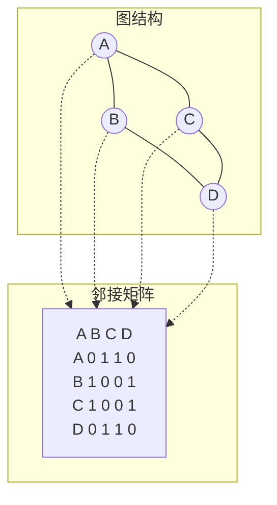
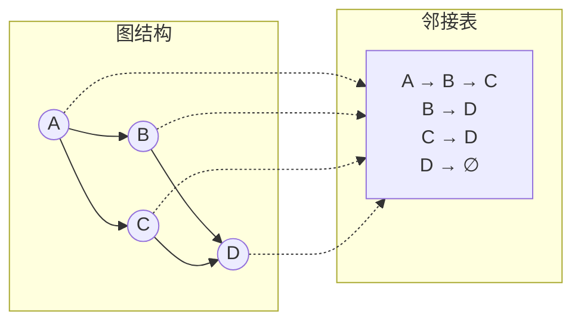
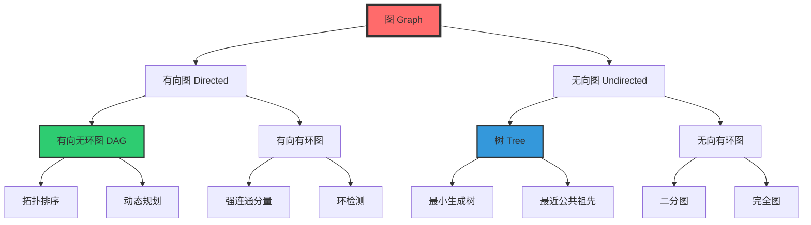
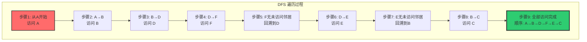
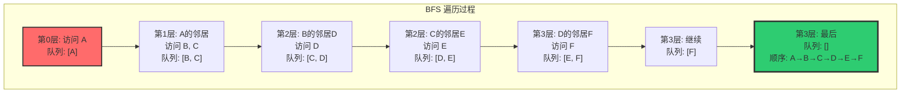
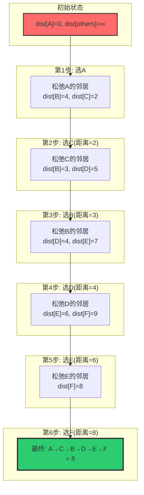
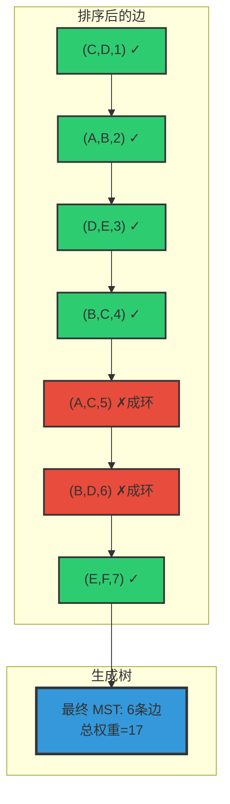
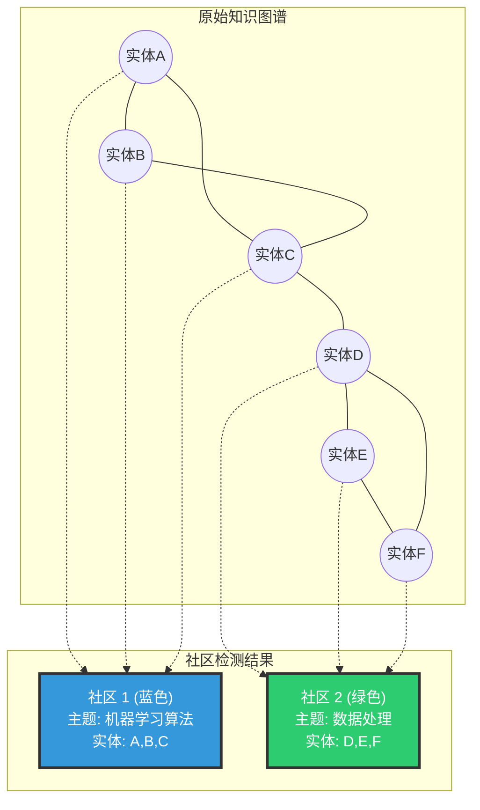
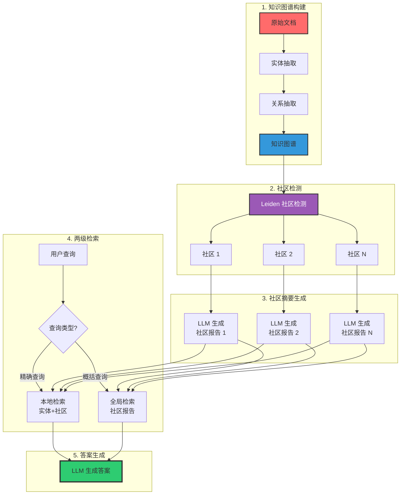

# 图(Graph)数据结构与算法技术详解

## 目录
- [1. 图(Graph)详细介绍](#1-图graph详细介绍)
- [2. 图的存储结构与工作原理](#2-图的存储结构与工作原理)
- [3. 图的核心算法](#3-图的核心算法)
- [4. 原理图解](#4-原理图解)
- [5. 图与向量检索/RAG对比分析](#5-图与向量检索rag对比分析)
- [6. 常见面试题与参考答案](#6-常见面试题与参考答案)
- [7. 项目实战案例](#7-项目实战案例)

---

## 1. 图(Graph)详细介绍

### 1.1 图的定义

图(Graph)是由**顶点(Vertex)**的有穷非空集合和**顶点之间边(Edge)**的集合组成的一种数据结构，通常表示为 **G = (V, E)**，其中 G 表示一个图，V 是图中顶点的集合，E 是图中边的集合。

```
数学定义：
  G = (V, E)
  V = {v1, v2, ..., vn}  — 顶点集合，n = |V| 为顶点数
  E = {(vi, vj) | vi, vj ∈ V}  — 边集合，m = |E| 为边数

图的规模：
  - 稀疏图：m ≈ O(n)
  - 稠密图：m ≈ O(n²)

简单示例：
  社交网络中，人 = 顶点，好友关系 = 边
  地图导航中，路口 = 顶点，道路 = 边
  网页链接中，网页 = 顶点，超链接 = 边
```

### 1.2 核心概念

| 术语 | 英文 | 定义 |
|------|------|------|
| 顶点 | Vertex/Node | 图中的基本元素，代表一个实体 |
| 边 | Edge | 连接两个顶点的线段，表示顶点间的关系 |
| 度 | Degree | 与顶点相连的边的数量 |
| 入度 | In-degree | 指向该顶点的边的数量（有向图） |
| 出度 | Out-degree | 从该顶点指出的边的数量（有向图） |
| 路径 | Path | 从一个顶点到另一个顶点经过的顶点序列 |
| 简单路径 | Simple Path | 路径中顶点不重复 |
| 环 | Cycle | 起点和终点相同的路径（长度 ≥ 1） |
| 连通图 | Connected Graph | 任意两顶点间都存在路径 |
| 连通分量 | Connected Component | 无向图中的极大连通子图 |
| 强连通分量 | Strongly Connected Component | 有向图中任意两顶点相互可达的极大子图 |
| 子图 | Subgraph | 顶点集和边集都是原图子集的图 |
| 生成树 | Spanning Tree | 包含所有顶点的极小连通子图 |
| 完全图 | Complete Graph | 任意两顶点间都有边的图 |
| 二分图 | Bipartite Graph | 顶点可划分为两个集合，所有边连接不同集合 |

### 1.3 图的分类

#### 1.3.1 按边的方向分类

**无向图 (Undirected Graph)**

```
特点：
- 边无方向，表示双向关系
- (u, v) 和 (v, u) 表示同一条边
- 邻接关系是对称的

示例：社交好友关系（互为好友）
  A --- B
  |     |
  C --- D

  边集：{(A,B), (A,C), (B,D), (C,D)}
```

**有向图 (Directed Graph / Digraph)**

```
特点：
- 边有方向，使用箭头表示
- (u, v) 表示从 u 指向 v 的边
- 邻接关系不一定对称

示例：网页链接关系（A链接到B，B不一定链接到A）
  A → B
  ↓   ↓
  C → D

  边集：{(A,B), (A,C), (B,D), (C,D)}
```

#### 1.3.2 按边权重分类

**无权图 (Unweighted Graph)**

```
特点：
- 边只有存在与否，没有权重
- 所有边等价

示例：地铁站换乘图（只关心是否连通）
  A --- B --- C
```

**加权图 (Weighted Graph)**

```
特点：
- 每条边有对应的权重（代价、距离等）
- 权重可以是任意实数

示例：城市间距离图
  A ---5--- B ---3--- C
  |         |         |
  2         8         4
  |         |         |
  D ---6--- E ---1--- F

  边：(A,B,5), (A,D,2), (B,C,3), (B,E,8), (C,F,4), (D,E,6), (E,F,1)
```

#### 1.3.3 特殊图类型

```
有向无环图 (DAG, Directed Acyclic Graph)：
  - 有向图中不存在环
  - 拓扑排序的基础
  - 应用：任务调度、依赖管理、编译器优化

  示例（课程依赖关系）：
  数学 → 算法 → AI
  数学 → 数据结构 → 算法
  编程 → 数据结构

完全图 (Complete Graph)：
  - n 个顶点的无向完全图有 n(n-1)/2 条边
  - 有向完全图有 n(n-1) 条边

二分图 (Bipartite Graph)：
  - 顶点分为两个集合，边只连接不同集合的顶点
  - 应用：匹配问题、推荐系统

  示例（用户-商品推荐）：
  用户集合：{U1, U2, U3}
  商品集合：{P1, P2, P3, P4}
  边：U1→P1, U1→P3, U2→P2, U3→P1, U3→P4

树 (Tree)：
  - 连通的无环图
  - n 个顶点有 n-1 条边
  - 图的特例

正则图 (Regular Graph)：
  - 所有顶点度数相同
  - 如 k-正则图，每个顶点度为 k
```

### 1.4 图的应用场景

```
┌─────────────────────────────────────────────────────────────┐
│                    图的应用场景全景                           │
├─────────────────┬─────────────────┬─────────────────────────┤
│   社交网络       │   路径规划       │   推荐系统              │
│  - 好友推荐      │  - 地图导航      │  - 协同过滤             │
│  - 社区发现      │  - 物流配送      │  - 知识图谱             │
│  - 影响力传播    │  - 网络路由      │  - 用户画像关联         │
├─────────────────┼─────────────────┼─────────────────────────┤
│   网络分析       │   AI/ML          │   编译器               │
│  - 网页排名      │  - 知识图谱      │  - 依赖分析             │
│  - 网络安全      │  - 图神经网络    │  - 数据流分析           │
│  - 流量分析      │  - 因果推理      │  - 寄存器分配           │
├─────────────────┼─────────────────┼─────────────────────────┤
│   生物信息       │   金融           │   调度系统              │
│  - 蛋白质互作    │  - 欺诈检测      │  - 任务调度             │
│  - 基因调控网络  │  - 风险传播      │  - 工作流引擎           │
│  - 药物发现      │  - 交易网络      │  - 资源分配             │
└─────────────────┴─────────────────┴─────────────────────────┘
```

---

## 2. 图的存储结构与工作原理

### 2.1 邻接矩阵 (Adjacency Matrix)

#### 2.1.1 数据结构

```
定义：
  使用二维数组 matrix[n][n] 存储图，其中：
  - matrix[i][j] = 1 (或权重) 表示存在边 (i, j)
  - matrix[i][j] = 0 (或 ∞) 表示不存在边 (i, j)

无向图的邻接矩阵是对称的
有向图的邻接矩阵不一定对称
```

**图 2-1：邻接矩阵存储示意图**



#### 2.1.2 代码实现

```java
public class AdjacencyMatrixGraph {
    private int[][] matrix;  // 邻接矩阵
    private int vertices;    // 顶点数
    private boolean directed; // 是否有向

    public AdjacencyMatrixGraph(int vertices, boolean directed) {
        this.vertices = vertices;
        this.directed = directed;
        this.matrix = new int[vertices][vertices];
    }

    // 添加边 O(1)
    public void addEdge(int from, int to, int weight) {
        matrix[from][to] = weight;
        if (!directed) {
            matrix[to][from] = weight;  // 无向图对称
        }
    }

    // 删除边 O(1)
    public void removeEdge(int from, int to) {
        matrix[from][to] = 0;
        if (!directed) {
            matrix[to][from] = 0;
        }
    }

    // 判断边是否存在 O(1)
    public boolean hasEdge(int from, int to) {
        return matrix[from][to] != 0;
    }

    // 获取顶点的邻居 O(n)
    public List<Integer> getNeighbors(int vertex) {
        List<Integer> neighbors = new ArrayList<>();
        for (int i = 0; i < vertices; i++) {
            if (matrix[vertex][i] != 0) {
                neighbors.add(i);
            }
        }
        return neighbors;
    }

    // 获取顶点的度 O(n)
    public int getDegree(int vertex) {
        int degree = 0;
        for (int i = 0; i < vertices; i++) {
            if (matrix[vertex][i] != 0) degree++;
        }
        return degree;
    }
}
```

#### 2.1.3 复杂度分析

```
时间复杂度：
  - 添加边：O(1)
  - 删除边：O(1)
  - 判断边是否存在：O(1)
  - 获取所有邻居：O(n)
  - 获取所有边：O(n²)

空间复杂度：O(n²)

适用场景：
  - 稠密图（边数接近 n²）
  - 需要频繁判断边是否存在
  - 顶点数较少（n < 10000）

不适用场景：
  - 稀疏图（浪费大量空间）
  - 顶点数极大（如 10⁶ 级别）
```

### 2.2 邻接表 (Adjacency List)

#### 2.2.1 数据结构

```
定义：
  使用数组 + 链表的方式存储图：
  - 每个顶点对应一个链表
  - 链表中存储该顶点的所有邻居

实现方式：
  - 数组 + 链表：List<Integer>[]
  - 数组 + 动态数组：List<List<Integer>>
  - HashMap + HashSet：适合顶点编号不连续的场景
```

**图 2-2：邻接表存储示意图**



#### 2.2.2 代码实现

```java
public class AdjacencyListGraph {
    private List<List<Edge>> adjList; // 邻接表
    private int vertices;
    private boolean directed;

    // 边类（加权图）
    static class Edge {
        int to;
        int weight;
        Edge(int to, int weight) {
            this.to = to;
            this.weight = weight;
        }
    }

    public AdjacencyListGraph(int vertices, boolean directed) {
        this.vertices = vertices;
        this.directed = directed;
        this.adjList = new ArrayList<>(vertices);
        for (int i = 0; i < vertices; i++) {
            adjList.add(new ArrayList<>());
        }
    }

    // 添加边 O(1)
    public void addEdge(int from, int to, int weight) {
        adjList.get(from).add(new Edge(to, weight));
        if (!directed) {
            adjList.get(to).add(new Edge(from, weight));
        }
    }

    // 删除边 O(degree)
    public void removeEdge(int from, int to) {
        adjList.get(from).removeIf(e -> e.to == to);
        if (!directed) {
            adjList.get(to).removeIf(e -> e.to == from);
        }
    }

    // 判断边是否存在 O(degree)
    public boolean hasEdge(int from, int to) {
        for (Edge e : adjList.get(from)) {
            if (e.to == to) return true;
        }
        return false;
    }

    // 获取邻居列表 O(1)
    public List<Edge> getNeighbors(int vertex) {
        return adjList.get(vertex);
    }

    // 获取顶点的度 O(1)（如果维护了度数）
    public int getDegree(int vertex) {
        return adjList.get(vertex).size();
    }
}
```

#### 2.2.3 复杂度分析

```
时间复杂度：
  - 添加边：O(1)
  - 删除边：O(degree)
  - 判断边是否存在：O(degree)
  - 获取所有邻居：O(1)（返回引用）
  - 遍历所有边：O(n + m)

空间复杂度：O(n + m)

适用场景：
  - 稀疏图（边数接近 n）
  - 需要遍历所有邻居
  - 顶点数较大
  - 大多数实际场景
```

### 2.3 其他存储方式

**链式前向星 (Forward Star)**

```
特点：
  - 使用数组模拟链表，内存连续
  - 比邻接表更高效（无对象开销）
  - 适合竞赛编程和高性能场景

实现：
  head[u]：顶点 u 的第一条边在 edges 数组中的索引
  edges[i].to：边 i 指向的顶点
  edges[i].next：下一条边的索引
  edges[i].weight：边 i 的权重

遍历顶点 u 的所有邻居：
  for (int i = head[u]; i != -1; i = edges[i].next) {
      int v = edges[i].to;
      int w = edges[i].weight;
      // 处理边 (u, v, w)
  }
```

**十字链表 (Orthogonal List)**

```
特点：
  - 同时存储出边和入边
  - 适合有向图，便于获取入度和出度

应用：
  - 有向图的强连通分量分析
  - 需要频繁获取入边的场景
```

**邻接多重表 (Adjacency Multilist)**

```
特点：
  - 每条边只存储一次
  - 适合无向图，便于删除边操作
```

### 2.4 存储结构对比

```
┌──────────────┬──────────────┬──────────────┬──────────────┐
│   操作        │  邻接矩阵     │  邻接表       │  链式前向星   │
├──────────────┼──────────────┼──────────────┼──────────────┤
│ 空间复杂度    │  O(n²)       │  O(n + m)    │  O(n + m)    │
│ 添加边        │  O(1)        │  O(1)        │  O(1)        │
│ 删除边        │  O(1)        │  O(degree)   │  O(degree)   │
│ 判断边存在    │  O(1)        │  O(degree)   │  O(degree)   │
│ 获取邻居      │  O(n)        │  O(1)        │  O(1)        │
│ 遍历所有边    │  O(n²)       │  O(n + m)    │  O(n + m)    │
│ 适合图类型    │  稠密图       │  稀疏图       │  稀疏图       │
│ 实现难度      │  简单         │  简单         │  中等         │
│ 缓存友好      │  差(稀疏时)   │  差(链表)     │  好(数组)     │
└──────────────┴──────────────┴──────────────┴──────────────┘
```

---

## 3. 图的核心算法

### 3.1 深度优先搜索 (DFS)

#### 3.1.1 算法原理

```
核心思想：
  沿着一条路径尽可能深地探索，直到无法继续，
  然后回溯到上一个有未探索分支的节点继续探索。

类比：
  走迷宫时，一直沿着一条路走到底，
  遇到死胡同就返回上一个岔路口，选择另一条路。

算法步骤：
  1. 从起始顶点开始，标记为已访问
  2. 选择一个未访问的邻居，递归深入
  3. 当所有邻居都已访问，回溯到上一级
  4. 重复直到所有可达顶点都已访问
```

#### 3.1.2 代码实现

```java
public class DepthFirstSearch {
    private boolean[] visited;
    private List<Integer> order; // 遍历顺序
    private int[] parent;        // 父节点（用于路径回溯）

    // 递归实现
    public void dfsRecursive(AdjacencyListGraph graph, int start) {
        int n = graph.getVertices();
        visited = new boolean[n];
        order = new ArrayList<>();
        parent = new int[n];
        Arrays.fill(parent, -1);

        dfsHelper(graph, start);
    }

    private void dfsHelper(AdjacencyListGraph graph, int current) {
        visited[current] = true;
        order.add(current);

        for (Edge edge : graph.getNeighbors(current)) {
            int neighbor = edge.to;
            if (!visited[neighbor]) {
                parent[neighbor] = current;
                dfsHelper(graph, neighbor);
            }
        }
    }

    // 迭代实现（使用栈模拟递归）
    public void dfsIterative(AdjacencyListGraph graph, int start) {
        int n = graph.getVertices();
        visited = new boolean[n];
        order = new ArrayList<>();
        parent = new int[n];
        Arrays.fill(parent, -1);

        Stack<Integer> stack = new Stack<>();
        stack.push(start);

        while (!stack.isEmpty()) {
            int current = stack.pop();

            if (visited[current]) continue;
            visited[current] = true;
            order.add(current);

            // 注意：栈是后进先出，为了保持与递归相同顺序
            // 可以先将邻居反转再入栈，或使用迭代器
            List<Edge> neighbors = graph.getNeighbors(current);
            for (int i = neighbors.size() - 1; i >= 0; i--) {
                int neighbor = neighbors.get(i).to;
                if (!visited[neighbor]) {
                    parent[neighbor] = current;
                    stack.push(neighbor);
                }
            }
        }
    }
}
```

#### 3.1.3 复杂度分析

```
时间复杂度：O(n + m)
  - 每个顶点访问一次：O(n)
  - 每条边检查一次：O(m)

空间复杂度：O(n)
  - 递归调用栈深度：最坏 O(n)
  - visited 数组：O(n)
  - 迭代实现栈空间：O(n)
```

#### 3.1.4 DFS 应用

```
1. 连通分量检测
   - 对每个未访问顶点执行 DFS
   - DFS 次数 = 连通分量数量

2. 环检测
   - 无向图：DFS 过程中遇到已访问的非父节点 → 有环
   - 有向图：使用三色标记法（白/灰/黑）

3. 拓扑排序
   - DAG 的后序遍历逆序即为拓扑排序
   - 应用：任务调度、依赖解析

4. 二分图检测
   - DFS 染色，交替使用两种颜色
   - 如果相邻节点颜色相同 → 不是二分图

5. 寻找桥和割点
   - Tarjan 算法：使用 DFS 序和 low 值
   - 桥：删去后图不再连通的边
   - 割点：删去后图不再连通的顶点
```

### 3.2 广度优先搜索 (BFS)

#### 3.2.1 算法原理

```
核心思想：
  从起始顶点开始，逐层向外扩展，
  先访问距离为 1 的顶点，再访问距离为 2 的顶点，以此类推。

类比：
  像水波扩散一样，从中心向外逐层蔓延。

算法步骤：
  1. 将起始顶点入队，标记为已访问
  2. 从队列中取出一个顶点
  3. 将其所有未访问的邻居入队并标记
  4. 重复 2-3 直到队列为空
```

#### 3.2.2 代码实现

```java
public class BreadthFirstSearch {
    private boolean[] visited;
    private List<Integer> order;
    private int[] parent;
    private int[] distance;  // 到起始顶点的最短距离

    public void bfs(AdjacencyListGraph graph, int start) {
        int n = graph.getVertices();
        visited = new boolean[n];
        order = new ArrayList<>();
        parent = new int[n];
        distance = new int[n];
        Arrays.fill(parent, -1);
        Arrays.fill(distance, Integer.MAX_VALUE);

        Queue<Integer> queue = new LinkedList<>();
        queue.offer(start);
        visited[start] = true;
        distance[start] = 0;

        while (!queue.isEmpty()) {
            int current = queue.poll();
            order.add(current);

            for (Edge edge : graph.getNeighbors(current)) {
                int neighbor = edge.to;
                if (!visited[neighbor]) {
                    visited[neighbor] = true;
                    parent[neighbor] = current;
                    distance[neighbor] = distance[current] + 1;
                    queue.offer(neighbor);
                }
            }
        }
    }

    // 获取从 start 到 target 的最短路径（无权图）
    public List<Integer> getShortestPath(int target) {
        List<Integer> path = new ArrayList<>();
        int current = target;
        while (current != -1) {
            path.add(current);
            current = parent[current];
        }
        Collections.reverse(path);
        return path;
    }
}
```

#### 3.2.3 复杂度分析

```
时间复杂度：O(n + m)
  - 每个顶点入队一次：O(n)
  - 每条边检查一次：O(m)

空间复杂度：O(n)
  - 队列最大长度：O(n)
  - visited 数组：O(n)
```

#### 3.2.4 BFS 应用

```
1. 无权图最短路径
   - BFS 按层遍历，第一次访问到的距离就是最短距离
   - 时间复杂度 O(n + m)

2. 社交网络中的"度数"
   - 一度人脉：直接好友
   - 二度人脉：好友的好友
   - BFS 恰好按"度数"逐层遍历

3. 网络爬虫
   - 从种子 URL 开始 BFS
   - 逐层抓取网页

4. 迷宫最短路径
   - 将迷宫建模为图
   - BFS 找到最短路径

5. 最小生成树（无权图）
   - BFS 生成树 = 无权图的最小生成树
```

### 3.3 DFS vs BFS 对比

```
┌──────────────────┬─────────────────────┬─────────────────────┐
│      特性         │        DFS           │        BFS           │
├──────────────────┼─────────────────────┼─────────────────────┤
│ 数据结构          │ 栈（递归/显式栈）    │ 队列                 │
│ 遍历方式          │ 深度优先             │ 广度优先             │
│ 空间复杂度        │ O(h) h=树高         │ O(w) w=最大宽度      │
│ 时间复杂度        │ O(n + m)            │ O(n + m)            │
│ 最短路径          │ 不保证               │ 保证（无权图）        │
│ 连通性检测        │ 可以                 │ 可以                 │
│ 环检测            │ 擅长                 │ 可以但不如 DFS       │
│ 拓扑排序          │ 擅长                 │ 可以（Kahn算法）      │
│ 适合场景          │ 穷举、回溯、分支     │ 最短路径、层级遍历    │
│ 递归实现          │ 简单                 │ 不自然               │
│ 内存使用（树）    │ 较少（深度）         │ 较多（宽度）          │
│ 内存使用（图）    │ 较少                 │ 可能很多             │
└──────────────────┴─────────────────────┴─────────────────────┘
```

### 3.4 最短路径算法

#### 3.4.1 Dijkstra 算法

```
适用条件：
  - 单源最短路径
  - 边权重非负
  - 有向图或无向图

核心思想：
  贪心策略，每次选择当前距离最小的未确定顶点，
  松弛其所有邻居。

算法步骤：
  1. 初始化：dist[source] = 0, dist[others] = ∞
  2. 维护一个优先队列（最小堆）
  3. 每次取出距离最小的未确定顶点 u
  4. 对 u 的每条出边 (u, v, w)：
     if dist[u] + w < dist[v]:
         dist[v] = dist[u] + w
         将 (dist[v], v) 加入优先队列
  5. 重复 3-4 直到优先队列为空
```

```java
public class Dijkstra {
    public int[] shortestPath(AdjacencyListGraph graph, int source) {
        int n = graph.getVertices();
        int[] dist = new int[n];
        boolean[] visited = new boolean[n];
        int[] parent = new int[n];
        Arrays.fill(dist, Integer.MAX_VALUE);
        Arrays.fill(parent, -1);
        dist[source] = 0;

        // 优先队列：(距离, 顶点)
        PriorityQueue<int[]> pq = new PriorityQueue<>((a, b) -> a[0] - b[0]);
        pq.offer(new int[]{0, source});

        while (!pq.isEmpty()) {
            int[] current = pq.poll();
            int u = current[1];
            int d = current[0];

            // 跳过已处理的顶点（惰性删除）
            if (visited[u]) continue;
            visited[u] = true;

            for (Edge edge : graph.getNeighbors(u)) {
                int v = edge.to;
                int w = edge.weight;

                if (!visited[v] && dist[u] + w < dist[v]) {
                    dist[v] = dist[u] + w;
                    parent[v] = u;
                    pq.offer(new int[]{dist[v], v});
                }
            }
        }
        return dist;
    }

    // 时间复杂度：O((n + m) × log n) 使用二叉堆
    // 空间复杂度：O(n + m)
}
```

#### 3.4.2 Bellman-Ford 算法

```
适用条件：
  - 单源最短路径
  - 可以处理负权边
  - 可以检测负权环

核心思想：
  对所有边进行 n-1 轮松弛操作，
  第 n 轮如果还能松弛说明存在负权环。

算法步骤：
  1. 初始化：dist[source] = 0, dist[others] = ∞
  2. 重复 n-1 次：
     对每条边 (u, v, w)：
       if dist[u] + w < dist[v]:
           dist[v] = dist[u] + w
  3. 第 n 次检查每条边，如果还能松弛 → 存在负权环
```

```java
public class BellmanFord {
    public int[] shortestPath(AdjacencyListGraph graph, int source) 
            throws NegativeCycleException {
        int n = graph.getVertices();
        int[] dist = new int[n];
        Arrays.fill(dist, Integer.MAX_VALUE);
        dist[source] = 0;

        // 收集所有边
        List<int[]> edges = new ArrayList<>();
        for (int u = 0; u < n; u++) {
            for (Edge e : graph.getNeighbors(u)) {
                edges.add(new int[]{u, e.to, e.weight});
            }
        }

        // n-1 轮松弛
        for (int i = 1; i < n; i++) {
            boolean updated = false;
            for (int[] edge : edges) {
                int u = edge[0], v = edge[1], w = edge[2];
                if (dist[u] != Integer.MAX_VALUE && dist[u] + w < dist[v]) {
                    dist[v] = dist[u] + w;
                    updated = true;
                }
            }
            // 提前终止优化
            if (!updated) break;
        }

        // 检测负权环
        for (int[] edge : edges) {
            int u = edge[0], v = edge[1], w = edge[2];
            if (dist[u] != Integer.MAX_VALUE && dist[u] + w < dist[v]) {
                throw new NegativeCycleException("图中存在负权环");
            }
        }

        return dist;
    }

    // 时间复杂度：O(n × m)
    // 空间复杂度：O(n + m)
}
```

#### 3.4.3 Floyd-Warshall 算法

```
适用条件：
  - 全源最短路径
  - 可以处理负权边（不能有负权环）
  - 适合稠密图

核心思想：
  动态规划，dp[k][i][j] 表示经过前 k 个顶点中转，
  从 i 到 j 的最短距离。

状态转移：
  dp[k][i][j] = min(dp[k-1][i][j], dp[k-1][i][k] + dp[k-1][k][j])
  空间优化：dp[i][j] = min(dp[i][j], dp[i][k] + dp[k][j])
```

```java
public class FloydWarshall {
    public int[][] allPairsShortestPath(int[][] graph, int n) {
        int[][] dist = new int[n][n];

        // 初始化
        for (int i = 0; i < n; i++) {
            for (int j = 0; j < n; j++) {
                if (i == j) dist[i][j] = 0;
                else if (graph[i][j] != 0) dist[i][j] = graph[i][j];
                else dist[i][j] = Integer.MAX_VALUE / 2; // 避免溢出
            }
        }

        // Floyd-Warshall 核心
        for (int k = 0; k < n; k++) {
            for (int i = 0; i < n; i++) {
                for (int j = 0; j < n; j++) {
                    if (dist[i][k] + dist[k][j] < dist[i][j]) {
                        dist[i][j] = dist[i][k] + dist[k][j];
                    }
                }
            }
        }
        return dist;
    }

    // 时间复杂度：O(n³)
    // 空间复杂度：O(n²)
}
```

#### 3.4.4 最短路径算法对比

```
┌──────────────┬──────────┬──────────┬──────────┬───────────┐
│   算法        │ 源点      │ 时间复杂度│ 负权边   │ 负权环    │
├──────────────┼──────────┼──────────┼──────────┼───────────┤
│ BFS          │ 单源      │ O(n+m)   │ 不支持   │ 不适用    │
│ Dijkstra     │ 单源      │ O(mlogn) │ 不支持   │ 不支持    │
│ Bellman-Ford │ 单源      │ O(n×m)   │ 支持     │ 可检测    │
│ Floyd-Warshall│ 全源    │ O(n³)    │ 支持     │ 可检测    │
│ SPFA         │ 单源      │ O(km)    │ 支持     │ 不稳定    │
│ A*           │ 单源      │ 启发式   │ 非负权重 │ 不支持    │
└──────────────┴──────────┴──────────┴──────────┴───────────┘
```

### 3.5 最小生成树 (MST)

#### 3.5.1 Prim 算法

```
核心思想：
  从一个顶点开始，逐步扩展生成树，
  每次选择与当前树相连的最小权重边。

算法步骤：
  1. 选择任意起始顶点，加入生成树
  2. 维护连接生成树和外部顶点的最小边
  3. 每次选择最小边，将对应顶点加入生成树
  4. 更新受影响的边
  5. 重复直到所有顶点加入
```

```java
public class Prim {
    public int mstWeight(AdjacencyListGraph graph) {
        int n = graph.getVertices();
        boolean[] inMST = new boolean[n];
        int[] minEdge = new int[n];  // 连接到 MST 的最小边权重
        Arrays.fill(minEdge, Integer.MAX_VALUE);
        minEdge[0] = 0;
        int totalWeight = 0;

        PriorityQueue<int[]> pq = new PriorityQueue<>((a, b) -> a[1] - b[1]);
        pq.offer(new int[]{0, 0}); // (顶点, 权重)

        while (!pq.isEmpty()) {
            int[] current = pq.poll();
            int u = current[0];

            if (inMST[u]) continue;
            inMST[u] = true;
            totalWeight += current[1];

            for (Edge edge : graph.getNeighbors(u)) {
                int v = edge.to;
                int w = edge.weight;
                if (!inMST[v] && w < minEdge[v]) {
                    minEdge[v] = w;
                    pq.offer(new int[]{v, w});
                }
            }
        }
        return totalWeight;
    }

    // 时间复杂度：O((n + m) × log n) 使用二叉堆
    // 适合稠密图
}
```

#### 3.5.2 Kruskal 算法

```
核心思想：
  按边权重从小到大排序，依次尝试加入每条边，
  如果加入后不形成环，则加入生成树。

算法步骤：
  1. 将所有边按权重排序
  2. 初始化并查集，每个顶点独立
  3. 遍历每条边 (u, v, w)：
     if find(u) != find(v)：  // 不形成环
         union(u, v)
         将边加入生成树，总权重 += w
  4. 当加入 n-1 条边时停止
```

```java
public class Kruskal {
    class UnionFind {
        int[] parent, rank;
        UnionFind(int n) {
            parent = new int[n];
            rank = new int[n];
            for (int i = 0; i < n; i++) parent[i] = i;
        }
        int find(int x) {
            if (parent[x] != x) parent[x] = find(parent[x]);
            return parent[x];
        }
        boolean union(int x, int y) {
            int px = find(x), py = find(y);
            if (px == py) return false;
            if (rank[px] < rank[py]) parent[px] = py;
            else if (rank[px] > rank[py]) parent[py] = px;
            else { parent[py] = px; rank[px]++; }
            return true;
        }
    }

    public int mstWeight(AdjacencyListGraph graph) {
        int n = graph.getVertices();
        List<int[]> edges = new ArrayList<>();

        // 收集所有边
        for (int u = 0; u < n; u++) {
            for (Edge e : graph.getNeighbors(u)) {
                if (u < e.to) { // 无向图避免重复
                    edges.add(new int[]{u, e.to, e.weight});
                }
            }
        }

        // 按权重排序
        edges.sort((a, b) -> a[2] - b[2]);

        UnionFind uf = new UnionFind(n);
        int totalWeight = 0;
        int edgesAdded = 0;

        for (int[] edge : edges) {
            int u = edge[0], v = edge[1], w = edge[2];
            if (uf.union(u, v)) {
                totalWeight += w;
                edgesAdded++;
                if (edgesAdded == n - 1) break;
            }
        }
        return totalWeight;
    }

    // 时间复杂度：O(m × log m) 主要来自排序
    // 适合稀疏图
}
```

#### 3.5.3 MST 算法对比

```
┌──────────────┬──────────────┬──────────────┬──────────────┐
│   特性        │    Prim       │   Kruskal    │  Boruvka     │
├──────────────┼──────────────┼──────────────┼──────────────┤
│ 时间复杂度    │ O(mlogn)     │ O(mlogm)     │ O(mlogn)     │
│ 适合图类型    │ 稠密图        │ 稀疏图        │ 并行场景     │
│ 数据结构      │ 优先队列      │ 并查集        │ 并查集       │
│ 实现难度      │ 中等          │ 简单          │ 中等         │
│ 在线算法      │ 否            │ 否            │ 否           │
└──────────────┴──────────────┴──────────────┴──────────────┘
```

### 3.6 拓扑排序

```
适用条件：有向无环图 (DAG)

应用场景：
  - 任务调度（A 必须在 B 之前完成）
  - 课程安排（先修课程）
  - 编译依赖解析
  - 工作流引擎
```

```java
public class TopologicalSort {
    // Kahn 算法（BFS 实现）
    public List<Integer> kahnSort(AdjacencyListGraph graph) {
        int n = graph.getVertices();
        int[] indegree = new int[n];
        List<Integer> result = new ArrayList<>();

        // 计算入度
        for (int u = 0; u < n; u++) {
            for (Edge e : graph.getNeighbors(u)) {
                indegree[e.to]++;
            }
        }

        // 入度为 0 的顶点入队
        Queue<Integer> queue = new LinkedList<>();
        for (int i = 0; i < n; i++) {
            if (indegree[i] == 0) queue.offer(i);
        }

        while (!queue.isEmpty()) {
            int u = queue.poll();
            result.add(u);

            for (Edge e : graph.getNeighbors(u)) {
                int v = e.to;
                indegree[v]--;
                if (indegree[v] == 0) {
                    queue.offer(v);
                }
            }
        }

        // 如果结果数 < n，说明存在环
        if (result.size() < n) {
            throw new IllegalArgumentException("图中存在环，无法拓扑排序");
        }
        return result;
    }

    // 时间复杂度：O(n + m)
    // 空间复杂度：O(n)
}
```

---

## 4. 原理图解

### 4.1 图结构分类全景图

**图 4-1：图分类体系**



### 4.2 DFS 与 BFS 遍历过程图解

**图 4-2：DFS 遍历过程（递归深入）**



**图 4-3：BFS 遍历过程（逐层扩展）**



### 4.3 Dijkstra 算法执行过程

**图 4-4：Dijkstra 最短路径计算过程**



### 4.4 Kruskal 算法执行过程

**图 4-5：Kruskal 最小生成树构建过程**



---

## 5. 图与向量检索/RAG对比分析

### 5.1 核心差异

```
┌──────────────────┬─────────────────────────┬─────────────────────────┐
│      维度         │    图(Graph)方法         │   向量检索/RAG方法       │
├──────────────────┼─────────────────────────┼─────────────────────────┤
│ 数据表示          │ 显式关系的结构化表示      │ 隐式语义的向量表示        │
│ 检索方式          │ 图遍历/路径搜索          │ 向量相似度计算           │
│ 关系建模          │ 精确、可解释             │ 模糊、语义级             │
│ 可解释性          │ 强（路径可见）           │ 弱（黑盒向量）           │
│ 推理能力          │ 强（多跳推理）           │ 弱（单跳语义匹配）        │
│ 扩展性            │ 受图规模限制             │ 易扩展（ANN）            │
│ 实时性            │ 较慢（图遍历）           │ 快（向量索引）           │
│ 知识表示          │ 符号化、结构化           │ 分布式、连续             │
│ 更新方式          │ 增量更新边/节点          │ 重新嵌入或增量向量        │
└──────────────────┴─────────────────────────┴─────────────────────────┘
```

### 5.2 图方法优缺点

**优点：**

```
1. 精确关系建模
   - 实体间的关系是显式的、可验证的
   - 支持复杂的多跳推理
   - 示例："(张三是李四的父亲) AND (李四是王五的父亲) → 张三是王五的祖父"

2. 强可解释性
   - 每条推理路径都可以追踪
   - 可以展示完整的推理链
   - 符合人类逻辑思维

3. 结构化知识
   - 知识图谱天然适合图表示
   - 支持 SPARQL/Cypher 等结构化查询
   - 可以进行复杂的图分析（社区发现、中心性分析等）

4. 精确匹配
   - 不会出现语义漂移
   - 适合需要精确答案的场景
   - 如：法律条文引用、金融合规检查

5. 推理能力
   - 符号推理：基于规则的推导
   - 路径推理：多跳关系推断
   - 图神经网络：学习图结构模式
```

**缺点：**

```
1. 构建成本高
   - 需要人工或半自动构建知识图谱
   - 实体对齐、关系抽取难度大
   - 知识覆盖度受限于构建过程

2. 扩展性受限
   - 大规模图遍历复杂度高
   - 图分割和分布式计算复杂
   - 实时性难以保证

3. 知识覆盖不足
   - 难以覆盖所有知识领域
   - 新知识需要结构化后才能加入
   - 长尾知识覆盖不足

4. 灵活性差
   - 模式变更需要重构
   - 难以处理模糊查询
   - 对非结构化数据支持弱

5. 维护成本
   - 知识更新需要人工审核
   - 关系抽取准确率有限
   - 数据质量问题累积
```

### 5.3 向量检索/RAG方法优缺点

**优点：**

```
1. 语义理解能力强
   - 可以理解同义词、近义词
   - 支持模糊查询
   - 跨语言语义匹配

2. 构建成本低
   - 无需人工标注关系
   - 直接从文本生成向量
   - 自动化程度高

3. 扩展性好
   - ANN 算法支持亿级向量检索
   - 分布式部署简单
   - 查询延迟低（毫秒级）

4. 知识覆盖广
   - 可以覆盖海量非结构化文本
   - 长尾知识也能被检索到
   - 持续更新方便

5. 灵活性高
   - 支持多种模态（文本、图像、音频）
   - 易于与 LLM 集成
   - 适合开放域问答
```

**缺点：**

```
1. 可解释性差
   - 检索结果是黑盒
   - 无法解释为什么返回这些结果
   - 难以调试和优化

2. 精确度不足
   - 语义相似 ≠ 事实正确
   - 可能出现幻觉
   - 无法保证精确匹配

3. 推理能力弱
   - 单跳检索为主
   - 多跳推理需要额外处理
   - 无法进行符号推理

4. 依赖嵌入质量
   - 嵌入模型选择影响大
   - 领域迁移效果可能差
   - 需要定期更新嵌入模型

5. 数据冗余
   - 同一知识可能存储在多个 chunk 中
   - 检索结果可能重复
   - 上下文窗口浪费
```

### 5.4 融合方案：GraphRAG

```
GraphRAG = 知识图谱 + 向量检索 + LLM

核心思想：
  将知识图谱的结构化推理能力与向量检索的语义匹配能力结合，
  取长补短，实现更强大的检索增强生成。

架构设计：
┌─────────────────────────────────────────────────────────────┐
│                      用户查询                                │
└──────────────────────────┬──────────────────────────────────┘
                           │
                           ▼
┌─────────────────────────────────────────────────────────────┐
│                    查询解析层                                 │
│  1. 实体识别（NER）                                          │
│  2. 意图分类（精确查询 vs 语义查询）                          │
│  3. 查询路由                                                 │
└──────────────────────────┬──────────────────────────────────┘
                           │
            ┌──────────────┴──────────────┐
            ▼                             ▼
┌───────────────────────┐     ┌───────────────────────┐
│   图检索（精确）       │     │  向量检索（语义）      │
│  - 知识图谱遍历        │     │  - 向量相似度搜索      │
│  - 多跳推理            │     │  - 语义匹配            │
│  - 结构化查询          │     │  - 模糊检索            │
└───────────┬───────────┘     └───────────┬───────────┘
            │                             │
            └──────────────┬──────────────┘
                           ▼
┌─────────────────────────────────────────────────────────────┐
│                    结果融合层                                 │
│  - 图结果 + 向量结果合并                                     │
│  - 去重与排序                                                │
│  - 上下文构建                                                │
└──────────────────────────┬──────────────────────────────────┘
                           ▼
┌─────────────────────────────────────────────────────────────┐
│                    LLM 生成                                  │
└─────────────────────────────────────────────────────────────┘

实现示例（伪代码）：

def graph_rag_query(query):
    # 1. 实体识别
    entities = extract_entities(query)
    
    # 2. 图检索：精确关系查询
    graph_results = []
    for entity in entities:
        # 在知识图谱中查询实体及其关系
        subgraph = knowledge_graph.query(
            f"MATCH (n)-[r]->(m) WHERE n.name = '{entity}' RETURN n, r, m"
        )
        graph_results.extend(subgraph)
    
    # 3. 向量检索：语义匹配
    query_vector = embedding_model.encode(query)
    vector_results = vector_db.search(query_vector, top_k=10)
    
    # 4. 结果融合
    combined = merge_and_rank(graph_results, vector_results)
    
    # 5. 构建增强上下文
    context = build_context(combined)
    
    # 6. LLM 生成
    return llm.generate(query, context)
```

### 5.4.1 GraphRAG 社区（Community）概念

#### 社区的定义

GraphRAG 社区是 Microsoft GraphRAG 论文中提出的核心概念，指**知识图谱中通过社区检测算法识别出的语义紧密关联的实体群组**。每个社区被看作一个"主题单元"，代表知识图谱中一个相对独立的话题领域。

```
理解类比：
  知识图谱 = 一个城市
  社区 = 城市中的不同街区（商业区、住宅区、工业区等）
  实体 = 街区中的建筑（公司、住宅、工厂等）
  关系 = 建筑之间的道路

社区发现的本质：
  将大规模知识图谱"分而治之"，
  把紧密相关的实体归为一组，
  形成自包含的主题模块。
```

#### 社区检测算法：Leiden 算法

```
为什么选择 Leiden 而非 Louvain？
  - Louvain 可能产生不连通的社区（断连问题）
  - Leiden 算法保证社区是连通的
  - Leiden 收敛更快，质量更高

Leiden 算法三阶段：
  1. 局部移动（Local Move）
     - 将每个节点移动到能最大化模块度的邻居社区
     
  2. 细化（Refinement）
     - 在社区内部再次细分
     - 确保每个子社区连通
     
  3. 网络聚合（Network Aggregation）
     - 将社区压缩为超级节点
     - 构建粗粒度图，递归执行
```

**图 5-1：Leiden 社区检测流程**



#### 社区摘要（Community Report）

每个社区检测出来后，GraphRAG 会用 LLM 为每个社区生成一份**社区摘要报告**（Community Report），这是 GraphRAG 区别于传统 RAG 的关键创新。

```
社区摘要报告包含：
  1. 社区标题：该社区的主题概括
  2. 社区摘要：2-3 句话描述该社区的核心内容
  3. 关键实体：社区中最重要的实体及其角色
  4. 关键关系：社区中最重要的关系
  5. 发现/洞察：从该社区中提取的重要发现
  6. 评分：社区的重要性/可信度评分

生成过程：
  原始文本 → 实体/关系抽取 → 知识图谱构建 → 
  Leiden 社区检测 → 每社区 LLM 摘要 → 社区报告
```

**社区摘要生成示例：**

```python
# 社区摘要生成流程
def generate_community_report(community_id, entities, relationships):
    """
    为指定社区生成摘要报告
    """
    # 1. 收集社区内的所有实体和关系
    community_entities = [
        {"name": "随机森林", "type": "算法", "degree": 15},
        {"name": "决策树", "type": "算法", "degree": 12},
        {"name": "集成学习", "type": "概念", "degree": 10},
        {"name": "过拟合", "type": "问题", "degree": 8},
        {"name": "特征重要性", "type": "概念", "degree": 7},
    ]
    
    community_relations = [
        ("随机森林", "基于", "决策树"),
        ("随机森林", "属于", "集成学习"),
        ("随机森林", "解决", "过拟合"),
        ("随机森林", "提供", "特征重要性"),
        ("决策树", "容易导致", "过拟合"),
    ]
    
    # 2. 构建社区摘要 Prompt
    prompt = f"""
    你是一个知识图谱分析专家。请基于以下社区信息生成摘要报告。
    
    社区 ID: {community_id}
    实体列表: {community_entities}
    关系列表: {community_relations}
    
    请生成：
    1. 社区标题（10字以内）
    2. 社区摘要（50字以内）
    3. 关键发现（3条）
    """
    
    # 3. LLM 生成摘要
    report = llm.generate(prompt)
    return report

# 生成的社区报告示例：
"""
社区标题: 随机森林算法
社区摘要: 本社区围绕随机森林算法，涵盖其与决策树的关系、
         集成学习原理、以及过拟合问题的解决方案。
关键发现:
  1. 随机森林通过集成多个决策树解决过拟合问题
  2. 特征重要性是随机森林的重要输出
  3. 随机森林是 Bagging 集成方法的典型代表
"""
```

#### 两级检索架构

GraphRAG 社区概念带来了**两级检索**的能力，这是其核心优势：

```
┌─────────────────────────────────────────────────────────────┐
│                    GraphRAG 两级检索                          │
├─────────────────────────────────────────────────────────────┤
│                                                             │
│  【本地检索 Local Search】                                    │
│   适用场景：针对特定实体/关系的精确查询                        │
│   查询方式：从实体出发，遍历其邻居和相关社区                   │
│   检索内容：实体信息 + 关联关系 + 所属社区摘要                 │
│   示例查询："随机森林如何处理过拟合？"                       │
│                                                             │
│  【全局检索 Global Search】                                   │
│   适用场景：宏观、概括性、总结性查询                           │
│   查询方式：遍历所有社区报告，匹配最相关的社区                 │
│   检索内容：社区摘要报告（高层次概括）                         │
│   示例查询："机器学习中有哪些主要算法类别？"                  │
│                                                             │
└─────────────────────────────────────────────────────────────┘
```

**两级检索的代码实现：**

```python
class GraphRAGRetriever:
    def __init__(self, kg, community_reports):
        self.kg = kg                    # 知识图谱
        self.community_reports = community_reports  # 社区报告
        
    def local_search(self, query: str, top_k: int = 5):
        """
        本地检索：实体级别的精确查询
        """
        # 1. 从查询中提取实体
        entities = extract_entities(query)
        
        # 2. 在知识图谱中查找实体
        results = []
        for entity in entities:
            # 获取实体信息
            entity_info = self.kg.get_entity(entity)
            # 获取实体的一跳邻居
            neighbors = self.kg.get_neighbors(entity, depth=1)
            # 获取实体所属社区
            community_id = self.kg.get_entity_community(entity)
            community_report = self.community_reports.get(community_id)
            
            results.append({
                "entity": entity_info,
                "neighbors": neighbors,
                "community_context": community_report.summary
            })
        
        # 3. 向量检索补充
        vector_results = self.vector_search(query, top_k)
        
        return self.merge_results(results, vector_results)
    
    def global_search(self, query: str, top_k: int = 5):
        """
        全局检索：社区级别的概括查询
        """
        # 1. 将查询向量化
        query_vector = self.embed(query)
        
        # 2. 在所有社区报告中搜索
        scored_reports = []
        for community_id, report in self.community_reports.items():
            report_vector = self.embed(report.summary)
            score = cosine_similarity(query_vector, report_vector)
            scored_reports.append((community_id, score, report))
        
        # 3. 排序并返回 top-k 社区报告
        scored_reports.sort(key=lambda x: x[1], reverse=True)
        top_reports = scored_reports[:top_k]
        
        # 4. 构建上下文（使用社区摘要而非原始实体）
        context = []
        for cid, score, report in top_reports:
            context.append({
                "community_id": cid,
                "title": report.title,
                "summary": report.summary,
                "key_findings": report.findings,
                "relevance_score": score
            })
        
        return context
```

#### 社区在 GraphRAG 中的工作流程

**图 5-2：GraphRAG 社区工作流程**



#### 社区的优势与局限

**优势：**

```
1. 层次化理解
   - 社区报告提供了从"细节"到"全局"的层次化视图
   - 全局检索可以回答"总结性"问题而无需遍历所有实体

2. 语义压缩
   - 将大量实体/关系压缩为社区摘要
   - 大幅减少 LLM 上下文窗口的消耗
   - 示例：1000 个实体 → 50 个社区 → 50 段摘要文本

3. 主题发现
   - 自动发现文档集中的主题结构
   - 无需人工标注主题标签
   - 适合探索性分析场景

4. 多粒度检索
   - 本地检索：精确到具体实体
   - 全局检索：概括到主题层面
   - 介于两者之间：社区内部遍历

5. 可解释性增强
   - "这个答案来自社区 X 的摘要"
   - 可以追溯到具体实体和关系
   - 比纯向量检索更透明
```

**局限：**

```
1. 构建成本高
   - 实体抽取、关系抽取、社区检测、摘要生成全部需要 LLM
   - 大规模知识图谱处理成本极高
   - 示例：100 万文档可能需要数百万次 LLM 调用

2. 社区质量依赖图谱质量
   - 实体/关系抽取不准确 → 社区质量差
   - 需要高质量的知识图谱构建流程

3. 社区边界模糊
   - 现实世界中的知识往往跨社区关联
   - 硬性社区划分可能丢失跨社区信息

4. 更新困难
   - 新增文档需要重新构建图谱、重新检测社区
   - 增量更新方案尚不成熟

5. 社区摘要的局限性
   - LLM 生成的摘要可能遗漏重要信息
   - 摘要质量取决于 LLM 能力
   - 可能存在幻觉
```

#### 社区与传统 RAG Chunk 的对比

```
┌──────────────────┬─────────────────────────┬─────────────────────────┐
│      维度         │   RAG Chunk              │  GraphRAG 社区          │
├──────────────────┼─────────────────────────┼─────────────────────────┤
│ 信息粒度          │ 原始文本片段（固定大小）  │ 语义主题（动态大小）     │
│ 组织方式          │ 按文本顺序切分           │ 按语义关联聚类           │
│ 上下文            │ 局部上下文（前后chunk）  │ 全局上下文（全社区）      │
│ 冗余度            │ 高（知识重复出现）       │ 低（知识去重聚合）        │
│ 可解释性          │ 弱（为什么检索这段？）    │ 强（来自社区 X 的摘要）   │
│ 构建成本          │ 低（embedding 即可）     │ 高（LLM 多次调用）        │
│ 适合查询类型      │ 事实型、细节型           │ 总结型、概览型            │
│ 更新方式          │ 增量添加 chunk           │ 重新构建社区              │
│ 查询速度          │ 快（向量索引）           │ 中等（两级检索）          │
└──────────────────┴─────────────────────────┴─────────────────────────┘
```

### 5.5 选型建议

```
┌──────────────────────────────────────────────────────────────┐
│                      选型决策树                               │
├──────────────────────────────────────────────────────────────┤
│                                                              │
│  需要精确关系推理？                                           │
│    ├── 是 → 需要多跳推理？                                    │
│    │        ├── 是 → 知识图谱 + 图算法                        │
│    │        └── 否 → 图数据库（Neo4j 等）                     │
│    │                                                         │
│    └── 否 → 需要语义理解？                                    │
│             ├── 是 → 数据量大？                               │
│             │        ├── 是 → 向量数据库 + RAG                │
│             │        └── 否 → 关键词检索即可                  │
│             │                                                │
│             └── 两者都需要 → GraphRAG 混合方案                │
│                                                              │
├──────────────────────────────────────────────────────────────┤
│                      场景推荐                                 │
├──────────────┬───────────────────────────────────────────────┤
│ 知识问答      │ 知识图谱 + 向量检索混合（GraphRAG）            │
│ 文档检索      │ 向量检索（RAG）                               │
│ 推荐系统      │ 图算法 + 向量检索（协同过滤 + 语义）           │
│ 风控反欺诈    │ 图算法（关系网络分析）                        │
│ 智能客服      │ 知识图谱（FAQ）+ 向量检索（自由问答）          │
│ 搜索引擎      │ 向量检索 + 图排序（PageRank 等）              │
└──────────────┴───────────────────────────────────────────────┘
```

---

## 6. 常见面试题与参考答案

### 题目 1：图的基本概念

**问题：** 什么是图？请解释图的基本概念（顶点、边、度、路径、连通性），并说明有向图和无向图的区别。

**参考答案：**

图是由顶点集合和边集合组成的数据结构。有向图的边有方向性，无向图的边是双向的。在无向图中，度是指与顶点相连的边的数量；在有向图中，分为入度和出度。连通图是指任意两个顶点之间都存在路径。

**代码示例：**

```java
// 图的基本定义
class Graph {
    int V; // 顶点数
    int E; // 边数
    
    // 无向图中，度 = 邻居数量
    // 有向图中，入度 + 出度 = 总度数
    // 有向图总度数 = 2 × 边数
}
```

---

### 题目 2：邻接矩阵 vs 邻接表

**问题：** 图的邻接矩阵和邻接表存储方式各有什么优缺点？在什么场景下选择哪种？

**参考答案：**

邻接矩阵是二维数组，查找边 O(1)，但空间 O(n²)，适合稠密图。邻接表是数组+链表，空间 O(n+m)，适合稀疏图。实际工程中，大多数图是稀疏的，邻接表更常用。如果需要频繁判断边是否存在，可以用 `HashSet` 优化邻接表。

**对比表：**

| 操作 | 邻接矩阵 | 邻接表 |
|------|---------|--------|
| 空间 | O(n²) | O(n+m) |
| 添加边 | O(1) | O(1) |
| 删除边 | O(1) | O(degree) |
| 判断边存在 | O(1) | O(degree) |
| 遍历邻居 | O(n) | O(degree) |

---

### 题目 3：DFS 与 BFS

**问题：** 请实现图的 DFS 和 BFS，并分析它们的区别和适用场景。

**参考答案：**

DFS 使用栈（递归），适合连通性检测、环检测、拓扑排序。BFS 使用队列，适合最短路径（无权图）、层级遍历。两者时间复杂度均为 O(n+m)。

**代码实现：**

```java
// DFS 递归实现
public void dfs(int v, boolean[] visited, List<List<Integer>> graph) {
    visited[v] = true;
    System.out.print(v + " ");
    for (int neighbor : graph.get(v)) {
        if (!visited[neighbor]) {
            dfs(neighbor, visited, graph);
        }
    }
}

// BFS 实现
public void bfs(int start, List<List<Integer>> graph) {
    boolean[] visited = new boolean[graph.size()];
    Queue<Integer> queue = new LinkedList<>();
    queue.offer(start);
    visited[start] = true;
    
    while (!queue.isEmpty()) {
        int v = queue.poll();
        System.out.print(v + " ");
        for (int neighbor : graph.get(v)) {
            if (!visited[neighbor]) {
                visited[neighbor] = true;
                queue.offer(neighbor);
            }
        }
    }
}
```

---

### 题目 4：图中环检测

**问题：** 如何检测有向图中是否存在环？请写出代码实现。

**参考答案：**

使用三色标记法（DFS）：白色=未访问，灰色=访问中，黑色=已处理。如果在 DFS 过程中遇到灰色节点，说明存在环。也可以使用拓扑排序（Kahn 算法），如果结果数小于节点数则存在环。

```java
public boolean hasCycle(int n, List<List<Integer>> graph) {
    int[] color = new int[n]; // 0=白, 1=灰, 2=黑
    
    for (int i = 0; i < n; i++) {
        if (color[i] == 0) {
            if (dfs(i, color, graph)) return true;
        }
    }
    return false;
}

private boolean dfs(int v, int[] color, List<List<Integer>> graph) {
    color[v] = 1; // 标记为灰色（访问中）
    for (int neighbor : graph.get(v)) {
        if (color[neighbor] == 1) return true;  // 遇到灰色 → 有环
        if (color[neighbor] == 0 && dfs(neighbor, color, graph)) return true;
    }
    color[v] = 2; // 标记为黑色（已处理）
    return false;
}
```

---

### 题目 5：Dijkstra 最短路径

**问题：** 实现 Dijkstra 算法求单源最短路径，并解释为什么不能处理负权边。

**参考答案：**

Dijkstra 使用贪心策略，每次选择当前距离最小的顶点。不能处理负权边的原因是：一旦顶点被标记为"已确定最短距离"，即使后续发现更短路径也无法更新。负权边场景下应使用 Bellman-Ford 算法。

```java
public int[] dijkstra(int n, List<List<int[]>> graph, int start) {
    int[] dist = new int[n];
    boolean[] visited = new boolean[n];
    Arrays.fill(dist, Integer.MAX_VALUE);
    dist[start] = 0;
    
    PriorityQueue<int[]> pq = new PriorityQueue<>((a, b) -> a[1] - b[1]);
    pq.offer(new int[]{start, 0});
    
    while (!pq.isEmpty()) {
        int[] cur = pq.poll();
        int u = cur[0];
        if (visited[u]) continue;
        visited[u] = true;
        
        for (int[] edge : graph.get(u)) {
            int v = edge[0], w = edge[1];
            if (dist[u] + w < dist[v]) {
                dist[v] = dist[u] + w;
                pq.offer(new int[]{v, dist[v]});
            }
        }
    }
    return dist;
}
```

---

### 题目 6：拓扑排序

**问题：** 什么是拓扑排序？请实现 Kahn 算法进行拓扑排序。

**参考答案：**

拓扑排序是对 DAG 的线性排序，使得每条边 (u,v) 都有 u 在 v 之前。Kahn 算法使用 BFS + 入度表：不断移除入度为 0 的顶点，如果结果数不等于顶点数则存在环。

```java
public List<Integer> topologicalSort(int n, List<List<Integer>> graph) {
    int[] indegree = new int[n];
    for (int u = 0; u < n; u++) {
        for (int v : graph.get(u)) indegree[v]++;
    }
    
    Queue<Integer> queue = new LinkedList<>();
    for (int i = 0; i < n; i++) {
        if (indegree[i] == 0) queue.offer(i);
    }
    
    List<Integer> result = new ArrayList<>();
    while (!queue.isEmpty()) {
        int u = queue.poll();
        result.add(u);
        for (int v : graph.get(u)) {
            if (--indegree[v] == 0) queue.offer(v);
        }
    }
    
    if (result.size() != n) throw new RuntimeException("存在环");
    return result;
}
```

---

### 题目 7：最小生成树

**问题：** 解释 Prim 和 Kruskal 算法的区别，并实现 Kruskal 算法。

**参考答案：**

Prim 从顶点出发，适合稠密图，时间复杂度 O(m log n)。Kruskal 从边出发，适合稀疏图，时间复杂度 O(m log m)。Kruskal 使用并查集判断是否成环。

```java
public int kruskal(int n, int[][] edges) {
    // edges[i] = [u, v, weight]
    Arrays.sort(edges, (a, b) -> a[2] - b[2]);
    
    UnionFind uf = new UnionFind(n);
    int totalWeight = 0, count = 0;
    
    for (int[] edge : edges) {
        int u = edge[0], v = edge[1], w = edge[2];
        if (uf.union(u, v)) {
            totalWeight += w;
            if (++count == n - 1) break;
        }
    }
    return totalWeight;
}
```

---

### 题目 8：并查集

**问题：** 实现并查集数据结构，支持路径压缩和按秩合并。

**参考答案：**

```java
class UnionFind {
    int[] parent, rank;
    
    UnionFind(int n) {
        parent = new int[n];
        rank = new int[n];
        for (int i = 0; i < n; i++) parent[i] = i;
    }
    
    int find(int x) {
        if (parent[x] != x) parent[x] = find(parent[x]); // 路径压缩
        return parent[x];
    }
    
    boolean union(int x, int y) {
        int px = find(x), py = find(y);
        if (px == py) return false;
        if (rank[px] < rank[py]) parent[px] = py;
        else if (rank[px] > rank[py]) parent[py] = px;
        else { parent[py] = px; rank[px]++; }
        return true;
    }
}
```

---

### 题目 9：二分图判定

**问题：** 如何判断一个无向图是否是二分图？

**参考答案：**

使用染色法（BFS/DFS）：将相邻顶点染成不同颜色，如果出现冲突则不是二分图。

```java
public boolean isBipartite(int n, List<List<Integer>> graph) {
    int[] color = new int[n]; // 0=未染色, 1=红, -1=蓝
    Arrays.fill(color, 0);
    
    for (int i = 0; i < n; i++) {
        if (color[i] == 0) {
            Queue<Integer> queue = new LinkedList<>();
            queue.offer(i);
            color[i] = 1;
            
            while (!queue.isEmpty()) {
                int u = queue.poll();
                for (int v : graph.get(u)) {
                    if (color[v] == 0) {
                        color[v] = -color[u];
                        queue.offer(v);
                    } else if (color[v] == color[u]) {
                        return false; // 冲突
                    }
                }
            }
        }
    }
    return true;
}
```

---

### 题目 10：强连通分量

**问题：** 什么是强连通分量？如何找出有向图中的所有强连通分量？

**参考答案：**

强连通分量是指有向图中任意两个顶点相互可达的极大子图。使用 Kosaraju 算法或 Tarjan 算法。Kosaraju 算法：两次 DFS，第一次获取后序，第二次在反转图上按后序逆序 DFS。

```java
public List<List<Integer>> kosaraju(int n, List<List<Integer>> graph) {
    // 1. 第一次 DFS，获取后序
    boolean[] visited = new boolean[n];
    Stack<Integer> stack = new Stack<>();
    for (int i = 0; i < n; i++) {
        if (!visited[i]) dfs1(i, visited, stack, graph);
    }
    
    // 2. 反转图
    List<List<Integer>> reverseGraph = reverse(graph, n);
    
    // 3. 第二次 DFS，按后序逆序
    Arrays.fill(visited, false);
    List<List<Integer>> sccs = new ArrayList<>();
    while (!stack.isEmpty()) {
        int v = stack.pop();
        if (!visited[v]) {
            List<Integer> scc = new ArrayList<>();
            dfs2(v, visited, scc, reverseGraph);
            sccs.add(scc);
        }
    }
    return sccs;
}
```

---

### 题目 11：最短路径算法对比

**问题：** 请对比 Dijkstra、Bellman-Ford、Floyd-Warshall 三种最短路径算法。

**参考答案：**

| 算法 | 源点 | 时间复杂度 | 负权边 | 最优场景 |
|------|------|-----------|--------|---------|
| Dijkstra | 单源 | O(m log n) | 不支持 | 正权图首选 |
| Bellman-Ford | 单源 | O(n×m) | 支持 | 负权边场景 |
| Floyd-Warshall | 全源 | O(n³) | 支持 | 稠密图全源 |

---

### 题目 12：图神经网络(GNN)基础

**问题：** 什么是图神经网络？它的核心思想是什么？

**参考答案：**

GNN 是处理图结构数据的深度学习模型，核心思想是消息传递：每个节点聚合邻居节点的特征来更新自身表示。典型应用包括节点分类、链接预测、图分类。

```python
# 简化的 GNN 消息传递过程
def gnn_layer(node_features, adjacency_matrix, W):
    # 1. 消息传递：聚合邻居特征
    messages = adjacency_matrix @ node_features  # 邻居聚合
    # 2. 更新：结合自身特征和邻居消息
    updated = activation(messages @ W)
    return updated
```

---

### 题目 13：课程表问题（LeetCode 207）

**问题：** 有 n 门课程，某些课程有先修要求。判断是否可以完成所有课程。

**参考答案：**

本质是检测有向图是否有环。使用拓扑排序（Kahn 算法），如果最终排序结果数量等于课程数，则可以完成。

```java
public boolean canFinish(int numCourses, int[][] prerequisites) {
    List<List<Integer>> graph = new ArrayList<>();
    int[] indegree = new int[numCourses];
    
    for (int i = 0; i < numCourses; i++) graph.add(new ArrayList<>());
    for (int[] pre : prerequisites) {
        graph.get(pre[1]).add(pre[0]);
        indegree[pre[0]]++;
    }
    
    Queue<Integer> queue = new LinkedList<>();
    for (int i = 0; i < numCourses; i++) {
        if (indegree[i] == 0) queue.offer(i);
    }
    
    int count = 0;
    while (!queue.isEmpty()) {
        int course = queue.poll();
        count++;
        for (int next : graph.get(course)) {
            if (--indegree[next] == 0) queue.offer(next);
        }
    }
    return count == numCourses;
}
```

---

### 题目 14：网络延迟时间（LeetCode 743）

**问题：** 有 n 个网络节点，从节点 k 发送信号，求所有节点收到信号的最短时间。

**参考答案：**

Dijkstra 求单源最短路径，答案为所有节点距离的最大值。如果存在不可达节点，返回 -1。

```java
public int networkDelayTime(int[][] times, int n, int k) {
    List<List<int[]>> graph = new ArrayList<>();
    for (int i = 0; i <= n; i++) graph.add(new ArrayList<>());
    for (int[] time : times) {
        graph.get(time[0]).add(new int[]{time[1], time[2]});
    }
    
    int[] dist = new int[n + 1];
    Arrays.fill(dist, Integer.MAX_VALUE);
    dist[k] = 0;
    
    PriorityQueue<int[]> pq = new PriorityQueue<>((a, b) -> a[1] - b[1]);
    pq.offer(new int[]{k, 0});
    
    while (!pq.isEmpty()) {
        int[] cur = pq.poll();
        int u = cur[0], d = cur[1];
        if (d > dist[u]) continue;
        
        for (int[] edge : graph.get(u)) {
            int v = edge[0], w = edge[1];
            if (dist[u] + w < dist[v]) {
                dist[v] = dist[u] + w;
                pq.offer(new int[]{v, dist[v]});
            }
        }
    }
    
    int maxTime = 0;
    for (int i = 1; i <= n; i++) {
        if (dist[i] == Integer.MAX_VALUE) return -1;
        maxTime = Math.max(maxTime, dist[i]);
    }
    return maxTime;
}
```

---

### 题目 15：图与向量检索的选型

**问题：** 在构建企业知识问答系统时，图方法和向量检索方法各有什么优劣？如何选择？

**参考答案：**

图方法适合精确关系推理（如"张三是李四的上级"），可解释性强但构建成本高。向量检索适合语义搜索（如"如何优化数据库性能"），扩展性好但可解释性差。实际项目推荐 GraphRAG 混合方案：知识图谱处理精确查询，向量检索处理语义搜索，两者结果融合后交给 LLM 生成。

---

## 7. 项目实战案例

### 项目案例 1：社交网络好友推荐系统

**项目背景：**

某社交平台需要为 5000 万用户构建好友推荐系统，基于共同好友、共同社群、地理位置等维度推荐潜在好友，要求推荐延迟 < 100ms，推荐准确率 > 80%。

**技术栈：**

```
图数据库：Neo4j（社区版）
后台服务：Spring Boot + Java
缓存：Redis
图算法：Jaccard 相似度、Adamic-Adar 指数、PageRank
数据规模：5000 万用户、30 亿条好友关系
```

**图模型设计：**

```
节点类型：
  - User {id, name, age, location}
  - Group {id, name, category}
  - Interest {id, name}

关系类型：
  - (User)-[:FRIEND]->(User)
  - (User)-[:MEMBER_OF]->(Group)
  - (User)-[:INTERESTED_IN]->(Interest)
  - (User)-[:LIVES_IN]->(Location)
```

**推荐算法实现：**

```java
public class FriendRecommendation {
    
    // 1. 共同好友推荐（基于 Jaccard 相似度）
    public List<User> recommendByCommonFriends(User target, int topK) {
        String query = """
            MATCH (target:User {id: $targetId})-[:FRIEND]-(friend:User)
                  -[:FRIEND]-(candidate:User)
            WHERE NOT (target)-[:FRIEND]-(candidate)
              AND target <> candidate
            WITH candidate, COUNT(DISTINCT friend) AS commonFriends
            MATCH (target)-[:FRIEND]-(tf:User)
            WITH candidate, commonFriends,
                 COUNT(DISTINCT tf) AS targetFriends
            MATCH (candidate)-[:FRIEND]-(cf:User)
            WITH candidate, commonFriends,
                 targetFriends, COUNT(DISTINCT cf) AS candidateFriends
            WHERE commonFriends > 0
            RETURN candidate,
                   commonFriends * 1.0 / (targetFriends + candidateFriends - commonFriends)
                   AS jaccardScore
            ORDER BY jaccardScore DESC
            LIMIT $topK
            """;
        return executeQuery(query, target.getId(), topK);
    }
    
    // 2. 共同社群推荐
    public List<User> recommendByCommonGroups(User target, int topK) {
        String query = """
            MATCH (target:User {id: $targetId})-[:MEMBER_OF]->(group:Group)
                  <-[:MEMBER_OF]-(candidate:User)
            WHERE NOT (target)-[:FRIEND]-(candidate)
              AND target <> candidate
            RETURN candidate, COUNT(DISTINCT group) AS commonGroups
            ORDER BY commonGroups DESC
            LIMIT $topK
            """;
        return executeQuery(query, target.getId(), topK);
    }
    
    // 3. 混合推荐（加权融合）
    public List<User> hybridRecommend(User target, int topK) {
        // 获取各维度推荐结果
        List<ScoredUser> friendResults = recommendByCommonFriends(target, 100);
        List<ScoredUser> groupResults = recommendByCommonGroups(target, 100);
        List<ScoredUser> interestResults = recommendByCommonInterests(target, 100);
        
        // 加权融合
        Map<User, Double> scoreMap = new HashMap<>();
        double weightFriend = 0.5;
        double weightGroup = 0.3;
        double weightInterest = 0.2;
        
        mergeScores(scoreMap, friendResults, weightFriend);
        mergeScores(scoreMap, groupResults, weightGroup);
        mergeScores(scoreMap, interestResults, weightInterest);
        
        // 过滤已是好友的用户
        Set<User> existingFriends = getExistingFriends(target);
        existingFriends.forEach(scoreMap::remove);
        
        // 排序取 topK
        return scoreMap.entrySet().stream()
            .sorted((a, b) -> Double.compare(b.getValue(), a.getValue()))
            .limit(topK)
            .map(Map.Entry::getKey)
            .collect(Collectors.toList());
    }
}
```

**性能优化策略：**

```
1. 预计算缓存
   - 每天凌晨计算所有用户的候选推荐列表
   - 存入 Redis，设置 24 小时过期
   - 推荐请求直接读缓存，延迟 < 10ms

2. 图查询优化
   - 使用 Neo4j 索引加速节点查找
   - 限制查询深度（最多 2 跳）
   - 分页查询，避免大结果集

3. 冷启动处理
   - 新用户无好友：使用地理位置 + 兴趣标签推荐
   - 热门用户推荐（基于 PageRank 排名）
   - 随机推荐兜底

4. 在线/离线分离
   - 离线：全量计算 + 缓存
   - 在线：缓存读取 + 少量实时计算
   - 新好友关系通过消息队列异步更新缓存
```

**效果评估：**

```
性能指标：
  - 推荐延迟：P50=8ms, P99=45ms
  - 推荐更新频率：每天一次（离线计算 4 小时）
  - 缓存命中率：98.5%

业务指标：
  - 好友申请接受率：82%
  - 推荐点击率：15.3%
  - 用户日活提升：12%
  - 新用户次日留存率：提升 8%
```

**经验总结：**

```
1. 图模型设计：合理的节点和关系设计是推荐效果的基础
2. 多维度融合：单一维度（共同好友）效果有限，混合推荐显著提升
3. 预计算 + 缓存：大图实时计算不可行，离线预计算是必须的
4. 冷启动：新用户需要非图算法兜底（内容推荐、热门推荐）
5. AB 测试：每个推荐策略都需要通过 AB 测试验证效果
```

---

### 项目案例 2：物流路径规划系统

**项目背景：**

某物流公司需要为日均 50 万包裹规划最优配送路径，覆盖全国 300 个城市、5000 个配送站点，考虑实时路况、车辆容量、时间窗口等约束，要求路径规划延迟 < 500ms。

**技术栈：**

```
图算法：Dijkstra 变种、A* 算法、遗传算法
图数据库：自研内存图引擎
后台服务：Java + Spring Boot
消息队列：Kafka（实时路况更新）
缓存：Redis
```

**图模型设计：**

```java
// 路网图模型
public class RoadNetwork {
    // 节点：路口/站点
    class Node {
        long id;
        double lat, lng;  // 经纬度
        NodeType type;    // INTERSECTION, STATION, WAREHOUSE
    }
    
    // 边：道路
    class Edge {
        long fromNode, toNode;
        double length;        // 长度（公里）
        int speedLimit;       // 限速（km/h）
        int currentSpeed;     // 实时速度（每 5 分钟更新）
        RoadType type;        // HIGHWAY, URBAN, RURAL
        boolean oneWay;       // 是否单行
    }
}
```

**核心算法实现：**

```java
public class LogisticsRouter {
    
    // 1. 带实时路况的 Dijkstra
    public Route planRoute(Node start, Node end, 
                           Map<Long, Integer> realtimeTraffic) {
        int n = roadNetwork.getNodeCount();
        double[] dist = new double[n];
        Node[] prev = new Node[n];
        boolean[] visited = new boolean[n];
        Arrays.fill(dist, Double.MAX_VALUE);
        dist[start.id] = 0;
        
        PriorityQueue<RouteNode> pq = new PriorityQueue<>();
        pq.offer(new RouteNode(start, 0, heuristic(start, end)));
        
        while (!pq.isEmpty()) {
            RouteNode current = pq.poll();
            if (visited[current.node.id]) continue;
            visited[current.node.id] = true;
            
            if (current.node.id == end.id) {
                return reconstructPath(prev, start, end);
            }
            
            for (Edge edge : roadNetwork.getOutEdges(current.node)) {
                if (visited[edge.toNode]) continue;
                
                // 考虑实时路况的动态权重
                int trafficSpeed = realtimeTraffic.getOrDefault(
                    edge.toNode, edge.speedLimit);
                double edgeWeight = calculateDynamicWeight(edge, trafficSpeed);
                double newDist = dist[current.node.id] + edgeWeight;
                
                if (newDist < dist[edge.toNode]) {
                    dist[edge.toNode] = newDist;
                    prev[edge.toNode] = current.node;
                    double h = heuristic(roadNetwork.getNode(edge.toNode), end);
                    pq.offer(new RouteNode(
                        roadNetwork.getNode(edge.toNode), newDist, h));
                }
            }
        }
        return null; // 不可达
    }
    
    // 动态边权重计算
    private double calculateDynamicWeight(Edge edge, int trafficSpeed) {
        // 基础时间 = 距离 / 实时速度
        double baseTime = edge.length / trafficSpeed;
        
        // 路口等待时间（根据历史数据估算）
        double intersectionDelay = 
            edge.type == RoadType.URBAN ? 0.5 / 3600 : 0; // 0.5 秒
        
        // 道路类型系数
        double typeMultiplier = switch (edge.type) {
            case HIGHWAY -> 0.8;
            case URBAN -> 1.0;
            case RURAL -> 1.2;
        };
        
        return baseTime * typeMultiplier + intersectionDelay;
    }
    
    // 3. 多车辆路径规划（遗传算法）
    public List<Route> multiVehicleRoute(
            List<Node> deliveries, List<Vehicle> vehicles) {
        // 初始种群
        List<Chromosome> population = initializePopulation(deliveries, vehicles);
        
        for (int generation = 0; generation < 200; generation++) {
            // 适应度评估
            population.forEach(c -> c.fitness = evaluateFitness(c));
            
            // 选择（锦标赛选择）
            List<Chromosome> selected = tournamentSelection(population);
            
            // 交叉（PMX 交叉）
            List<Chromosome> offspring = crossover(selected);
            
            // 变异（交换变异）
            offspring.forEach(this::mutate);
            
            // 精英保留
            population = elitismPreservation(population, offspring);
        }
        
        // 返回最优解
        return population.get(0).toRoutes();
    }
}
```

**实施中的挑战与解决方案：**

```
挑战 1：实时路况数据量大且更新频繁
  方案：Kafka 消费路况数据，5 分钟窗口聚合
  效果：路况延迟 < 2 分钟，满足配送规划需求

挑战 2：全国路网图规模大（5000 万条边）
  方案：分层图结构（全国层 → 省层 → 市层 → 街道层）
  效果：查询从 800ms 降至 200ms

挑战 3：多车辆路径规划 NP-hard 问题
  方案：遗传算法 + 贪心初始解 + 早停策略
  效果：50 辆车 200 个配送点，规划时间 < 300ms

挑战 4：路网数据质量控制
  方案：多源数据校验（OSM + 交管局 + 众包）
  效果：数据准确率从 85% 提升至 97%
```

**效果评估：**

```
性能指标：
  - 单车辆路径规划：P50=80ms, P99=200ms
  - 多车辆调度规划：P50=250ms, P99=450ms
  - 路网更新延迟：< 2 分钟

业务指标：
  - 配送准时率：从 87% 提升至 95%
  - 日均配送里程：减少 15%
  - 车辆利用率：从 72% 提升至 88%
  - 燃油成本：降低 12%
```

**经验总结：**

```
1. 分层图设计：国家级路网必须分层，否则内存和计算都无法承受
2. 实时路况权重：动态权重比静态权重显著提升路径质量
3. 启发式算法：A* 在城市级路径规划中明显优于 Dijkstra
4. 多目标优化：时间 + 距离 + 油耗的三目标优化效果更好
5. 异常处理：封路、限行等异常需要实时感知并重新规划
```

---

### 项目案例 3：金融反欺诈知识图谱

**项目背景：**

某银行需要构建反欺诈知识图谱，整合客户信息、交易记录、设备指纹、IP 地址等多维数据，通过图算法识别欺诈团伙和异常交易模式。要求实时检测延迟 < 50ms，欺诈识别准确率 > 95%。

**技术栈：**

```
图数据库：JanusGraph（分布式图数据库）
存储后端：HBase
索引：Elasticsearch
流处理：Flink
图算法：社区发现（Louvain）、PageRank、连通分量分析
后台服务：Java + Spring Boot
```

**图模型设计：**

```java
// 反欺诈知识图谱模型
public class FraudGraph {
    /*
    节点类型：
      - Customer {id, name, age, risk_score}
      - Device {id, fingerprint, os, model}
      - IP {id, address, geo_location, risk_level}
      - Phone {id, number, carrier}
      - Transaction {id, amount, time, type, merchant}
      - Account {id, bank_account, balance}
    
    关系类型：
      - (Customer)-[:USES]->(Device)
      - (Customer)-[:USES]->(IP)
      - (Customer)-[:OWNS]->(Account)
      - (Customer)-[:HAS_PHONE]->(Phone)
      - (Customer)-[:MAKES]->(Transaction)
      - (Customer)-[:TRANSFERS_TO]->(Customer)  // 转账关系
      - (Device)-[:SHARED_WITH]->(Device)       // 同设备关联
      - (IP)-[:SHARED_WITH]->(IP)               // 同 IP 关联
    */
}
```

**核心检测算法：**

```java
public class FraudDetector {
    
    // 1. 设备/IP 共享团伙检测（连通分量）
    public List<FraudGroup> detectSharedDeviceGroups() {
        String query = """
            // 查找共享设备和 IP 的客户群
            MATCH (c1:Customer)-[:USES]->(d:Device)<-[:USES]-(c2:Customer)
            WHERE c1.id < c2.id
            WITH c1, c2, COUNT(DISTINCT d) AS sharedDevices
            
            MATCH (c1)-[:USES]->(ip:IP)<-[:USES]-(c2)
            WITH c1, c2, sharedDevices, COUNT(DISTINCT ip) AS sharedIPs
            
            WHERE sharedDevices >= 2 OR sharedIPs >= 3
            RETURN c1, c2, sharedDevices, sharedIPs
            ORDER BY sharedDevices + sharedIPs DESC
            """;
        return executeFraudQuery(query);
    }
    
    // 2. 异常交易模式检测（时序分析 + 图遍历）
    public List<Alert> detectAnomalousTransactions() {
        // 快速转账检测（A 收到钱后立即转给 B）
        String rapidTransferQuery = """
            MATCH (c1:Customer)-[t1:MAKES]->(tx1:Transaction)
                  -[t2:MAKES]->(c2:Customer)
            WHERE tx1.type = 'RECEIVE'
              AND tx2.type = 'TRANSFER'
              AND tx2.time - tx1.time < 300000  // 5 分钟内
              AND ABS(tx1.amount - tx2.amount) < 0.01 * tx1.amount
            RETURN c1, c2, tx1, tx2
            """;
        
        // 小金额分散转入、大额集中转出
        String structuringQuery = """
            MATCH (senders:Customer)-[:MAKES]->(tx:Transaction)
                  -[:MAKES]->(receiver:Customer)
            WHERE tx.type = 'TRANSFER'
              AND tx.amount < 10000
            WITH receiver, COUNT(DISTINCT senders) AS senderCount,
                 SUM(tx.amount) AS totalReceived
            WHERE senderCount > 10 AND totalReceived > 50000
            MATCH (receiver)-[:MAKES]->(out:Transaction)
            WHERE out.type = 'TRANSFER_OUT'
              AND out.amount > 0.8 * totalReceived
            RETURN receiver, senderCount, totalReceived, out
            """;
        
        return combineResults(
            executeQuery(rapidTransferQuery),
            executeQuery(structuringQuery));
    }
    
    // 3. 风险传播（PageRank + 标签传播）
    public Map<Customer, Double> propagateRiskScore(
            Set<Customer> knownFraudsters) {
        int n = graph.getCustomerCount();
        double[] riskScores = new double[n];
        double dampingFactor = 0.85;
        
        // 初始化已知欺诈者风险分
        for (Customer fraudster : knownFraudsters) {
            riskScores[fraudster.id] = 1.0;
        }
        
        // 迭代传播
        for (int iter = 0; iter < 50; iter++) {
            double[] newScores = new double[n];
            for (Customer c : graph.getAllCustomers()) {
                double sum = 0;
                for (Customer neighbor : graph.getNeighbors(c)) {
                    sum += riskScores[neighbor.id] / graph.getDegree(neighbor);
                }
                newScores[c.id] = (1 - dampingFactor) / n + dampingFactor * sum;
            }
            riskScores = newScores;
        }
        
        // 返回结果
        Map<Customer, Double> result = new HashMap<>();
        for (Customer c : graph.getAllCustomers()) {
            result.put(c, riskScores[c.id]);
        }
        return result;
    }
}
```

**实时检测架构：**

```
┌─────────────────────────────────────────────────────────────┐
│                    交易事件流（Kafka）                        │
└──────────────────────────┬──────────────────────────────────┘
                           │
                           ▼
┌─────────────────────────────────────────────────────────────┐
│                   Flink 实时流处理                            │
│  1. 事件解析与特征提取                                       │
│  2. 实时规则匹配（滑动窗口）                                  │
│  3. 图特征计算（实时更新）                                   │
└──────────────────────────┬──────────────────────────────────┘
                           │
              ┌────────────┴────────────┐
              ▼                         ▼
┌─────────────────────┐     ┌─────────────────────┐
│   规则引擎           │     │   图算法引擎         │
│  - 单笔金额阈值      │     │  - 连通分量检测      │
│  - 高频交易检测      │     │  - 风险传播          │
│  - 黑名单匹配        │     │  - 社区发现          │
└─────────┬───────────┘     └─────────┬───────────┘
          │                           │
          └──────────────┬────────────┘
                         ▼
┌─────────────────────────────────────────────────────────────┐
│                   风险评分与决策                              │
│  - 综合评分（规则分 + 图特征分）                             │
│  - 风险等级分类（低/中/高/严重）                             │
│  - 自动处置（阻断/人工审核/放行）                            │
└─────────────────────────────────────────────────────────────┘
```

**效果评估：**

```
性能指标：
  - 实时检测延迟：P50=15ms, P99=45ms
  - 图查询延迟：P50=8ms, P99=30ms
  - 风险传播计算：每日离线（2 小时）
  - 图规模：5000 万节点、5 亿条边

业务指标：
  - 欺诈识别准确率：96.2%
  - 误报率：2.1%
  - 欺诈团伙识别：新增 3 倍
  - 年挽回损失：约 5000 万元
  - 人工审核量：减少 60%
```

**经验总结：**

```
1. 图模型设计：关键是将共享设备、IP、手机号等作为节点，形成关联网络
2. 实时 + 离线：实时规则处理高频交易，离线图算法处理团伙检测
3. 风险传播：已知欺诈者的风险可以通过图传播到关联用户
4. 特征工程：图特征（度中心性、PageRank、聚类系数）比传统特征更有效
5. 模型迭代：欺诈模式不断变化，需要持续更新检测规则和模型
```

---

## 总结

图是一种强大且灵活的数据结构，广泛应用于社交网络、路径规划、推荐系统、反欺诈等领域。本文从图的定义、存储结构、核心算法到实际应用，进行了系统性的介绍。

**核心要点回顾：**

1. **存储结构**：邻接表适合稀疏图（大多数实际场景），邻接矩阵适合稠密图
2. **遍历算法**：DFS 适合回溯、环检测；BFS 适合最短路径、层级遍历
3. **最短路径**：Dijkstra 是首选（正权图），Bellman-Ford 处理负权边，Floyd-Warshall 求全源
4. **最小生成树**：Prim 适合稠密图，Kruskal 适合稀疏图
5. **图 vs 向量检索**：图擅长精确关系推理，向量检索擅长语义匹配，GraphRAG 融合两者优势
6. **工程实践**：大图需要分层、预计算、缓存等优化策略