# 多Agent系统四大架构基石详解

> **核心观点**：角色边界、消息协议、共享记忆、治理规则是多Agent系统的四大架构基石。它们共同构成了Agent系统稳定运行的基础框架，缺一不可。角色边界解决"谁做什么"的问题，消息协议解决"如何交流"的问题，共享记忆解决"如何共享知识"的问题，治理规则解决"如何协作"的问题。

---

## 目录

- [多Agent系统四大架构基石详解](#多agent系统四大架构基石详解)
  - [目录](#目录)
  - [概述：四大基石的关系模型](#概述四大基石的关系模型)
  - [一、角色边界（Role Boundary）](#一角色边界role-boundary)
    - [1.1 定义与核心价值](#11-定义与核心价值)
    - [1.2 角色边界设计原则](#12-角色边界设计原则)
      - [1.2.1 单一职责原则（Single Responsibility Principle）](#121-单一职责原则single-responsibility-principle)
      - [1.2.2 互补性原则（Complementarity Principle）](#122-互补性原则complementarity-principle)
      - [1.2.3 边界清晰原则（Clear Boundary Principle）](#123-边界清晰原则clear-boundary-principle)
    - [1.3 角色边界划分方法](#13-角色边界划分方法)
      - [1.3.1 领域驱动划分法（Domain-Driven Design）](#131-领域驱动划分法domain-driven-design)
      - [1.3.2 能力矩阵划分法（Capability Matrix）](#132-能力矩阵划分法capability-matrix)
    - [1.4 角色定义标准模板](#14-角色定义标准模板)
    - [1.5 典型角色边界设计案例](#15-典型角色边界设计案例)
      - [案例1：软件开发团队角色边界](#案例1软件开发团队角色边界)
      - [案例2：智能客服系统角色边界](#案例2智能客服系统角色边界)
    - [1.6 角色边界治理机制](#16-角色边界治理机制)
      - [1.6.1 边界检测与告警](#161-边界检测与告警)
      - [1.6.2 边界演进管理](#162-边界演进管理)
  - [二、消息协议（Message Protocol）](#二消息协议message-protocol)
    - [2.1 定义与核心价值](#21-定义与核心价值)
    - [2.2 消息协议设计原则](#22-消息协议设计原则)
      - [2.2.1 简洁性原则（Simplicity）](#221-简洁性原则simplicity)
      - [2.2.2 完整性原则（Completeness）](#222-完整性原则completeness)
      - [2.2.3 扩展性原则（Extensibility）](#223-扩展性原则extensibility)
    - [2.3 标准消息格式规范](#23-标准消息格式规范)
      - [2.3.1 基础消息结构](#231-基础消息结构)
      - [2.3.2 特殊消息类型](#232-特殊消息类型)
    - [2.4 消息类型与通信模式](#24-消息类型与通信模式)
      - [2.4.1 同步通信模式](#241-同步通信模式)
      - [2.4.2 异步通信模式](#242-异步通信模式)
      - [2.4.3 发布-订阅模式](#243-发布-订阅模式)
    - [2.5 消息协议实现方式](#25-消息协议实现方式)
      - [2.5.1 基于队列的实现](#251-基于队列的实现)
      - [2.5.2 基于共享状态的实现（黑板模式）](#252-基于共享状态的实现黑板模式)
    - [2.6 消息协议治理与演进](#26-消息协议治理与演进)
      - [2.6.1 协议版本管理](#261-协议版本管理)
      - [2.6.2 消息验证中间件](#262-消息验证中间件)
  - [三、共享记忆（Shared Memory）](#三共享记忆shared-memory)
    - [3.1 定义与核心价值](#31-定义与核心价值)
    - [3.2 共享记忆架构设计](#32-共享记忆架构设计)
      - [3.2.1 分层记忆架构](#321-分层记忆架构)
      - [3.2.2 共享状态管理](#322-共享状态管理)
    - [3.3 知识沉淀与演化机制](#33-知识沉淀与演化机制)
      - [3.3.1 知识提取与抽象](#331-知识提取与抽象)
      - [3.3.2 知识演化机制](#332-知识演化机制)
    - [3.4 存储方案选型](#34-存储方案选型)
      - [3.4.1 存储方案对比](#341-存储方案对比)
    - [3.5 共享记忆治理策略](#35-共享记忆治理策略)
      - [3.5.1 访问控制与权限管理](#351-访问控制与权限管理)
      - [3.5.2 一致性保证机制](#352-一致性保证机制)
  - [四、治理规则（Governance Rules）](#四治理规则governance-rules)
    - [4.1 定义与核心价值](#41-定义与核心价值)
    - [4.2 决策机制设计](#42-决策机制设计)
      - [4.2.1 决策类型分类](#421-决策类型分类)
      - [4.2.2 群体决策机制](#422-群体决策机制)
      - [4.2.3 决策层级与升级机制](#423-决策层级与升级机制)
    - [4.3 冲突解决策略](#43-冲突解决策略)
      - [4.3.1 冲突类型与识别](#431-冲突类型与识别)
      - [4.3.2 冲突解决策略库](#432-冲突解决策略库)
    - [4.4 行为规范制定](#44-行为规范制定)
      - [4.4.1 行为规范框架](#441-行为规范框架)
      - [4.4.2 问责与审计机制](#442-问责与审计机制)
    - [4.5 治理规则实施与演进](#45-治理规则实施与演进)
      - [4.5.1 规则生命周期管理](#451-规则生命周期管理)
  - [五、四大基石协同案例](#五四大基石协同案例)
    - [5.1 案例背景：软件开发多Agent系统](#51-案例背景软件开发多agent系统)
    - [5.2 完整架构设计](#52-完整架构设计)
    - [5.3 运行流程分析](#53-运行流程分析)
    - [5.4 效果评估与优化建议](#54-效果评估与优化建议)
  - [六、最佳实践与避坑指南](#六最佳实践与避坑指南)
    - [角色边界最佳实践](#角色边界最佳实践)
    - [消息协议最佳实践](#消息协议最佳实践)
    - [共享记忆最佳实践](#共享记忆最佳实践)
    - [治理规则最佳实践](#治理规则最佳实践)
    - [常见问题与避坑](#常见问题与避坑)
  - [七、总结与展望](#七总结与展望)
    - [核心要点回顾](#核心要点回顾)
    - [实施路径建议](#实施路径建议)
    - [未来演进方向](#未来演进方向)

---

## 概述：四大基石的关系模型

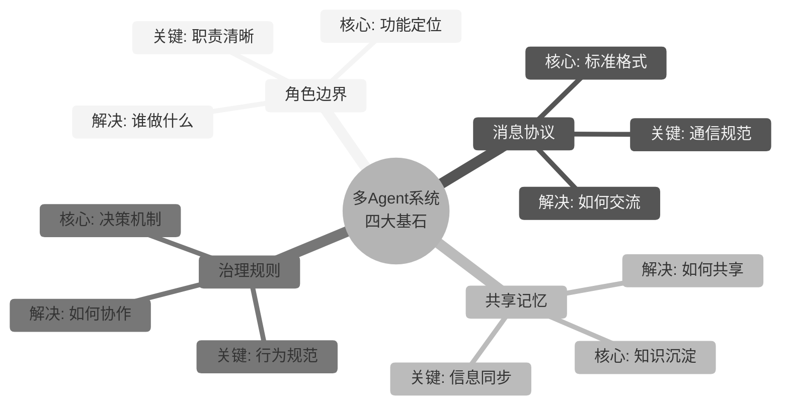

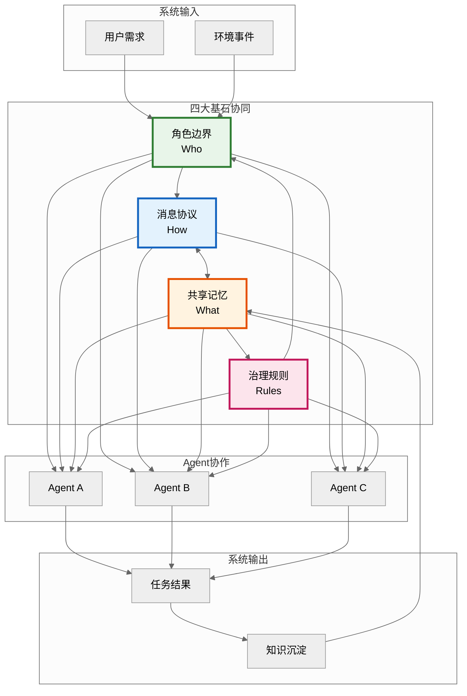

**四大基石对比总览**：

| 维度 | 角色边界 | 消息协议 | 共享记忆 | 治理规则 |
|------|---------|---------|---------|---------|
| **核心问题** | 谁做什么？ | 如何交流？ | 如何共享？ | 如何协作？ |
| **解决目标** | 职责清晰化 | 通信标准化 | 知识复用化 | 决策规范化 |
| **核心要素** | 角色定义、能力边界 | 消息格式、通信模式 | 存储方案、同步机制 | 决策流程、冲突策略 |
| **设计原则** | 单一职责、互补性 | 简洁性、扩展性 | 一致性、时效性 | 公平性、效率性 |
| **典型挑战** | 角色重叠、边界模糊 | 协议演进、版本兼容 | 数据一致性、隐私保护 | 决策效率、冲突升级 |
| **衡量指标** | 职责清晰度、边界稳定性 | 协议覆盖率、解析效率 | 一致性比率、命中率 | 决策效率、冲突解决率 |

---

## 一、角色边界（Role Boundary）

### 1.1 定义与核心价值

**定义**：角色边界是指多Agent系统中每个Agent所承担的功能定位、职责范围及能力边界的明确定义与划分。它界定了每个Agent"能做什么"、"不能做什么"以及"应该做什么"。

**核心价值**：
- **职责清晰化**：避免角色重叠和职责混乱
- **能力专业化**：每个Agent专注于特定领域，提升专业能力
- **协作效率化**：明确的边界减少协作中的摩擦和冲突
- **系统可扩展**：清晰的角色边界便于添加新角色或替换现有角色

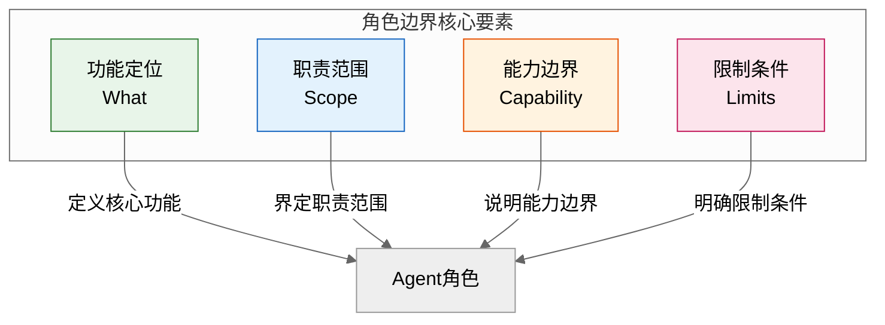

### 1.2 角色边界设计原则

#### 1.2.1 单一职责原则（Single Responsibility Principle）

每个Agent应专注于单一核心职责，避免"大而全"的角色设计。

```python
# ❌ 不好的设计：Agent承担过多职责
class SuperAgent:
    """全能Agent：违反单一职责原则"""
    
    def analyze_requirements(self):
        pass  # 需求分析
    
    def design_system(self):
        pass  # 系统设计
    
    def write_code(self):
        pass  # 代码编写
    
    def test_code(self):
        pass  # 测试验证
    
    def deploy_system(self):
        pass  # 部署上线


# ✅ 好的设计：每个Agent单一职责
class RequirementAnalyzerAgent:
    """需求分析Agent：专注于需求理解和分析"""
    
    def analyze(self, user_input: str) -> dict:
        """分析用户需求，输出需求规格"""
        pass
    
    def clarify(self, ambiguity: str) -> list:
        """识别需求中的模糊点，生成澄清问题"""
        pass


class SystemDesignerAgent:
    """系统设计Agent：专注于架构设计"""
    
    def design_architecture(self, requirements: dict) -> dict:
        """基于需求设计系统架构"""
        pass
    
    def define_interfaces(self, architecture: dict) -> list:
        """定义系统接口规范"""
        pass


class CodeGeneratorAgent:
    """代码生成Agent：专注于代码编写"""
    
    def generate_code(self, design: dict) -> str:
        """基于设计生成代码"""
        pass
    
    def optimize_code(self, code: str) -> str:
        """优化代码性能和可读性"""
        pass
```

#### 1.2.2 互补性原则（Complementarity Principle）

多个Agent的能力应该形成互补，而非重叠或冲突。

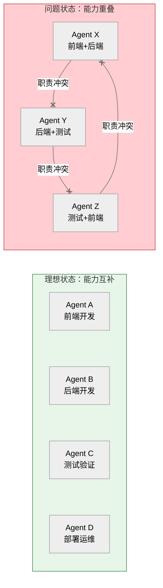

#### 1.2.3 边界清晰原则（Clear Boundary Principle）

Agent的能力边界必须明确定义，包括"能做什么"和"不能做什么"。

```python
from typing import List, Dict, Optional, Set
from dataclasses import dataclass, field
from enum import Enum

class CapabilityLevel(Enum):
    """能力等级"""
    EXPERT = "expert"        # 专家级：可独立完成复杂任务
    PROFICIENT = "proficient" # 熟练级：可完成标准任务
    BASIC = "basic"          # 基础级：可完成简单任务
    NONE = "none"            # 无能力：完全无法处理

@dataclass
class RoleBoundary:
    """角色边界定义"""
    role_name: str
    description: str
    
    # 能做什么（正向边界）
    capabilities: Dict[str, CapabilityLevel] = field(default_factory=dict)
    responsibilities: List[str] = field(default_factory=list)
    
    # 不能做什么（负向边界）
    limitations: List[str] = field(default_factory=list)
    forbidden_actions: List[str] = field(default_factory=list)
    
    # 边界条件
    boundary_conditions: Dict[str, str] = field(default_factory=dict)
    
    def can_handle(self, task_type: str, complexity: str = "standard") -> bool:
        """判断是否能处理特定任务"""
        level = self.capabilities.get(task_type, CapabilityLevel.NONE)
        
        if level == CapabilityLevel.NONE:
            return False
        
        if complexity == "complex" and level != CapabilityLevel.EXPERT:
            return False
        
        return True
    
    def is_within_boundary(self, action: str) -> bool:
        """判断行为是否在边界内"""
        if action in self.forbidden_actions:
            return False
        return True
    
    def get_handover_triggers(self) -> List[str]:
        """获取需要移交任务的触发条件"""
        return self.boundary_conditions.get("handover_triggers", [])


# 示例：定义数据分析Agent的角色边界
data_analyst_boundary = RoleBoundary(
    role_name="data_analyst",
    description="专注于数据分析、统计建模和报告生成",
    
    # 能做什么
    capabilities={
        "data_cleaning": CapabilityLevel.EXPERT,
        "statistical_analysis": CapabilityLevel.EXPERT,
        "visualization": CapabilityLevel.PROFICIENT,
        "machine_learning": CapabilityLevel.BASIC,
        "database_admin": CapabilityLevel.NONE,  # 明确不具备的能力
    },
    
    responsibilities=[
        "数据质量检查和清洗",
        "统计分析和假设检验",
        "分析报告和可视化图表生成",
        "数据洞察提炼和业务建议",
    ],
    
    # 不能做什么
    limitations=[
        "不负责数据采集和ETL开发",
        "不负责生产环境数据库管理",
        "不负责复杂机器学习模型部署",
    ],
    
    forbidden_actions=[
        "修改生产数据库结构",
        "删除原始数据",
        "绕过权限访问敏感数据",
    ],
    
    # 边界条件
    boundary_conditions={
        "handover_triggers": [
            "发现数据质量问题超出处理能力",
            "分析需求涉及生产系统修改",
            "需要训练部署机器学习模型",
        ],
        "escalation_conditions": [
            "数据隐私风险",
            "分析结果与业务预期严重不符",
        ]
    }
)
```

### 1.3 角色边界划分方法

#### 1.3.1 领域驱动划分法（Domain-Driven Design）

按业务领域划分Agent角色，每个Agent负责一个限界上下文（Bounded Context）。

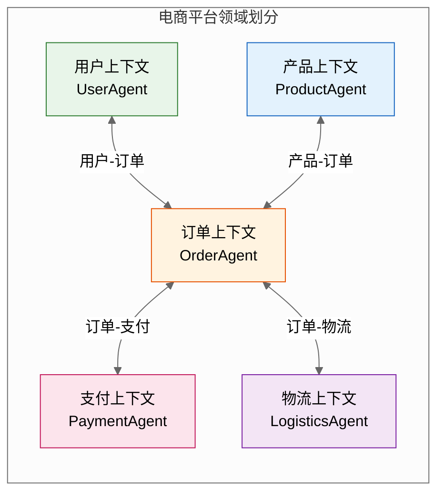

```python
class DomainDrivenRolePartition:
    """基于领域驱动的角色划分"""
    
    def __init__(self):
        self.bounded_contexts: Dict[str, BoundedContext] = {}
        self.context_map: Dict[str, List[str]] = {}  # 上下文映射关系
    
    def define_bounded_context(self, 
                                context_name: str,
                                responsibilities: List[str],
                                capabilities: Dict[str, CapabilityLevel]):
        """定义限界上下文"""
        context = BoundedContext(
            name=context_name,
            responsibilities=responsibilities,
            capabilities=capabilities
        )
        self.bounded_contexts[context_name] = context
        
        # 创建对应的Agent角色
        return self.create_agent_for_context(context)
    
    def define_context_relationship(self, 
                                     context_a: str, 
                                     context_b: str,
                                     relationship_type: str):
        """定义上下文之间的关系"""
        key = f"{context_a}-{context_b}"
        self.context_map[key] = relationship_type
    
    def create_agent_for_context(self, context: BoundedContext) -> 'Agent':
        """为上下文创建Agent"""
        agent = DomainAgent(
            agent_id=f"{context.name}_agent",
            bounded_context=context
        )
        return agent


@dataclass
class BoundedContext:
    """限界上下文"""
    name: str
    responsibilities: List[str]
    capabilities: Dict[str, CapabilityLevel]
    entities: List[str] = field(default_factory=list)
    value_objects: List[str] = field(default_factory=list)
    domain_events: List[str] = field(default_factory=list)
    invariants: List[str] = field(default_factory=list)  # 业务规则


# 示例：定义订单上下文
order_context = BoundedContext(
    name="order",
    responsibilities=[
        "订单创建和管理",
        "订单状态跟踪",
        "订单查询和统计",
    ],
    capabilities={
        "order_creation": CapabilityLevel.EXPERT,
        "order_tracking": CapabilityLevel.EXPERT,
        "order_statistics": CapabilityLevel.PROFICIENT,
        "payment_processing": CapabilityLevel.NONE,  # 支付由支付上下文处理
    },
    entities=["Order", "OrderItem"],
    value_objects=["OrderId", "OrderStatus", "ShippingAddress"],
    domain_events=["OrderCreated", "OrderPaid", "OrderShipped", "OrderCompleted"],
    invariants=[
        "订单金额必须大于0",
        "订单状态变更必须遵循状态机",
        "已支付订单不可删除",
    ]
)
```

#### 1.3.2 能力矩阵划分法（Capability Matrix）

通过能力矩阵分析，识别能力缺口和重叠，优化角色划分。

```python
class CapabilityMatrixPartition:
    """基于能力矩阵的角色划分"""
    
    def __init__(self):
        self.capability_matrix: Dict[str, Dict[str, CapabilityLevel]] = {}
        self.agents: Dict[str, RoleBoundary] = {}
    
    def register_agent_capabilities(self, 
                                     agent_id: str, 
                                     capabilities: Dict[str, CapabilityLevel]):
        """注册Agent能力"""
        self.agents[agent_id] = RoleBoundary(
            role_name=agent_id,
            capabilities=capabilities
        )
        
        for cap, level in capabilities.items():
            if cap not in self.capability_matrix:
                self.capability_matrix[cap] = {}
            self.capability_matrix[cap][agent_id] = level
    
    def analyze_gaps(self) -> Dict[str, List[str]]:
        """分析能力缺口"""
        gaps = {
            "no_coverage": [],      # 无人覆盖的能力
            "weak_coverage": [],    # 覆盖较弱的能力
            "over_coverage": [],    # 过度覆盖的能力
        }
        
        for cap, agents in self.capability_matrix.items():
            levels = list(agents.values())
            
            if all(l == CapabilityLevel.NONE for l in levels):
                gaps["no_coverage"].append(cap)
            elif max(levels) == CapabilityLevel.BASIC:
                gaps["weak_coverage"].append(cap)
            elif sum(1 for l in levels if l in [CapabilityLevel.EXPERT, CapabilityLevel.PROFICIENT]) > 2:
                gaps["over_coverage"].append(cap)
        
        return gaps
    
    def optimize_partition(self) -> List[str]:
        """优化角色划分"""
        gaps = self.analyze_gaps()
        recommendations = []
        
        # 处理能力缺口
        if gaps["no_coverage"]:
            recommendations.append(
                f"建议新增Agent覆盖能力: {', '.join(gaps['no_coverage'])}"
            )
        
        # 处理能力重叠
        if gaps["over_coverage"]:
            recommendations.append(
                f"建议合并或调整Agent以减少能力重叠: {', '.join(gaps['over_coverage'])}"
            )
        
        # 处理能力薄弱
        if gaps["weak_coverage"]:
            recommendations.append(
                f"建议增强现有Agent能力或引入专家Agent: {', '.join(gaps['weak_coverage'])}"
            )
        
        return recommendations
    
    def get_capability_report(self) -> str:
        """生成能力矩阵报告"""
        report = "# 能力矩阵分析报告\n\n"
        
        report += "## 能力覆盖矩阵\n\n"
        report += "| 能力 | " + " | ".join(self.agents.keys()) + " |\n"
        report += "|" + "---|" * (len(self.agents) + 1) + "\n"
        
        for cap in self.capability_matrix:
            row = [cap]
            for agent_id in self.agents:
                level = self.capability_matrix[cap].get(agent_id, CapabilityLevel.NONE)
                row.append(level.value)
            report += "| " + " | ".join(row) + " |\n"
        
        gaps = self.analyze_gaps()
        report += "\n## 分析结果\n\n"
        report += f"- 无覆盖能力: {len(gaps['no_coverage'])}个\n"
        report += f"- 弱覆盖能力: {len(gaps['weak_coverage'])}个\n"
        report += f"- 过度覆盖能力: {len(gaps['over_coverage'])}个\n"
        
        return report


# 示例：能力矩阵分析
partition = CapabilityMatrixPartition()

partition.register_agent_capabilities("frontend_agent", {
    "ui_design": CapabilityLevel.EXPERT,
    "frontend_dev": CapabilityLevel.EXPERT,
    "api_integration": CapabilityLevel.PROFICIENT,
    "testing": CapabilityLevel.BASIC,
})

partition.register_agent_capabilities("backend_agent", {
    "backend_dev": CapabilityLevel.EXPERT,
    "database_design": CapabilityLevel.EXPERT,
    "api_integration": CapabilityLevel.EXPERT,
    "testing": CapabilityLevel.BASIC,
})

partition.register_agent_capabilities("test_agent", {
    "testing": CapabilityLevel.EXPERT,
    "test_automation": CapabilityLevel.EXPERT,
    "performance_testing": CapabilityLevel.PROFICIENT,
})

print(partition.get_capability_report())
```

### 1.4 角色定义标准模板

```python
@dataclass
class RoleDefinitionTemplate:
    """角色定义标准模板"""
    
    # ========== 基础信息 ==========
    role_id: str                          # 唯一标识
    role_name: str                        # 角色名称
    role_type: str                        # 角色 type: worker/manager/coordinator
    version: str = "1.0"                  # 版本号
    description: str = ""                 # 角色描述
    
    # ========== 能力定义 ==========
    core_capabilities: Dict[str, CapabilityLevel] = field(default_factory=dict)
    secondary_capabilities: Dict[str, CapabilityLevel] = field(default_factory=dict)
    
    # ========== 职责定义 ==========
    primary_responsibilities: List[str] = field(default_factory=list)
    secondary_responsibilities: List[str] = field(default_factory=list)
    
    # ========== 边界定义 ==========
    limitations: List[str] = field(default_factory=list)
    forbidden_actions: List[str] = field(default_factory=list)
    
    # ========== 交互定义 ==========
    upstream_roles: List[str] = field(default_factory=list)    # 上游依赖角色
    downstream_roles: List[str] = field(default_factory=list)  # 下游服务角色
    collaboration_roles: List[str] = field(default_factory=list)  # 协作角色
    
    # ========== 质量标准 ==========
    quality_metrics: Dict[str, float] = field(default_factory=dict)
    sla_requirements: Dict[str, str] = field(default_factory=dict)
    
    # ========== 治理规则 ==========
    decision_authority: List[str] = field(default_factory=list)  # 决策权限
    escalation_rules: List[str] = field(default_factory=list)    # 升级规则
    handover_conditions: List[str] = field(default_factory=list)  # 移交条件
    
    def to_dict(self) -> dict:
        """转换为字典"""
        return {
            "role_id": self.role_id,
            "role_name": self.role_name,
            "role_type": self.role_type,
            "version": self.version,
            "description": self.description,
            "core_capabilities": {k: v.value for k, v in self.core_capabilities.items()},
            "secondary_capabilities": {k: v.value for k, v in self.secondary_capabilities.items()},
            "primary_responsibilities": self.primary_responsibilities,
            "secondary_responsibilities": self.secondary_responsibilities,
            "limitations": self.limitations,
            "forbidden_actions": self.forbidden_actions,
            "upstream_roles": self.upstream_roles,
            "downstream_roles": self.downstream_roles,
            "collaboration_roles": self.collaboration_roles,
            "quality_metrics": self.quality_metrics,
            "sla_requirements": self.sla_requirements,
            "decision_authority": self.decision_authority,
            "escalation_rules": self.escalation_rules,
            "handover_conditions": self.handover_conditions,
        }
    
    def validate(self) -> List[str]:
        """验证角色定义的完整性"""
        errors = []
        
        if not self.role_id:
            errors.append("角色ID不能为空")
        
        if not self.core_capabilities:
            errors.append("必须定义至少一个核心能力")
        
        if not self.primary_responsibilities:
            errors.append("必须定义至少一个主要职责")
        
        if self.limitations and not self.forbidden_actions:
            errors.append("如果有限制条件，建议定义禁止行为")
        
        return errors


# 示例：使用模板定义数据分析Agent
data_analyst_role = RoleDefinitionTemplate(
    role_id="DA001",
    role_name="DataAnalyst",
    role_type="worker",
    version="2.0",
    description="专注于数据分析、统计建模和报告生成的专业Agent",
    
    core_capabilities={
        "data_cleaning": CapabilityLevel.EXPERT,
        "statistical_analysis": CapabilityLevel.EXPERT,
        "data_visualization": CapabilityLevel.PROFICIENT,
    },
    
    secondary_capabilities={
        "machine_learning": CapabilityLevel.BASIC,
        "report_writing": CapabilityLevel.PROFICIENT,
    },
    
    primary_responsibilities=[
        "执行数据质量检查和清洗",
        "进行统计分析和假设检验",
        "生成分析报告和可视化图表",
    ],
    
    secondary_responsibilities=[
        "提供数据洞察和业务建议",
        "支持数据需求评审",
    ],
    
    limitations=[
        "不负责数据采集和ETL开发",
        "不负责生产环境数据库管理",
    ],
    
    forbidden_actions=[
        "修改生产数据库",
        "删除原始数据",
    ],
    
    upstream_roles=["DataEngineer", "BusinessAnalyst"],
    downstream_roles=["ReportGenerator", "DecisionMaker"],
    collaboration_roles=["DataScientist"],
    
    quality_metrics={
        "analysis_accuracy": 0.95,
        "report_completion_rate": 0.98,
    },
    
    sla_requirements={
        "standard_analysis": "24小时",
        "urgent_analysis": "4小时",
    },
    
    decision_authority=[
        "分析方法选择",
        "可视化方案设计",
    ],
    
    escalation_rules=[
        "数据质量问题 -> DataEngineer",
        "业务需求不明确 -> BusinessAnalyst",
    ],
    
    handover_conditions=[
        "发现复杂机器学习需求",
        "涉及生产系统修改",
    ]
)
```

### 1.5 典型角色边界设计案例

#### 案例1：软件开发团队角色边界

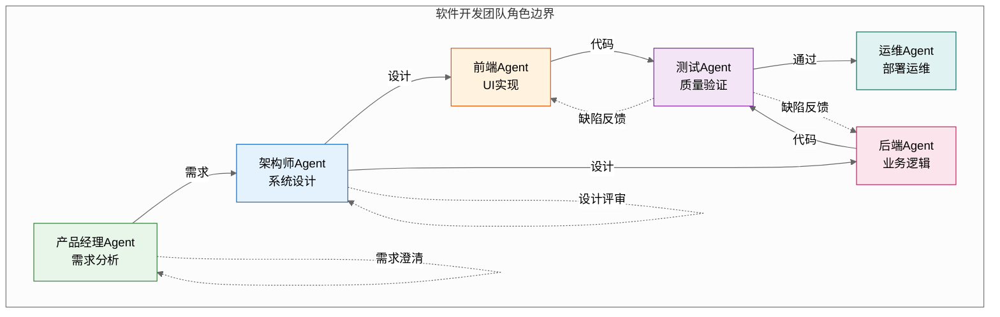

```python
# 软件开发团队角色边界定义
software_team_roles = {
    "product_manager": RoleDefinitionTemplate(
        role_id="PM001",
        role_name="ProductManager",
        role_type="manager",
        description="负责需求分析、产品规划和项目协调",
        
        core_capabilities={
            "requirement_analysis": CapabilityLevel.EXPERT,
            "product_planning": CapabilityLevel.EXPERT,
            "stakeholder_communication": CapabilityLevel.EXPERT,
        },
        
        primary_responsibilities=[
            "分析和整理用户需求",
            "制定产品规划和路线图",
            "协调各方资源推进项目",
        ],
        
        limitations=[
            "不参与技术架构设计",
            "不直接编写代码",
        ],
        
        forbidden_actions=[
            "擅自修改技术方案",
            "绕过评审直接发布",
        ],
        
        upstream_roles=["Stakeholder", "User"],
        downstream_roles=["Architect", "Developer"],
    ),
    
    "architect": RoleDefinitionTemplate(
        role_id="AR001",
        role_name="Architect",
        role_type="coordinator",
        description="负责系统架构设计和技术选型",
        
        core_capabilities={
            "architecture_design": CapabilityLevel.EXPERT,
            "technology_selection": CapabilityLevel.EXPERT,
            "technical_review": CapabilityLevel.EXPERT,
        },
        
        primary_responsibilities=[
            "设计系统整体架构",
            "进行技术选型和评估",
            "评审技术方案",
        ],
        
        limitations=[
            "不直接参与代码编写",
            "不负责项目管理",
        ],
        
        upstream_roles=["ProductManager"],
        downstream_roles=["FrontendDev", "BackendDev"],
    ),
    
    "frontend_dev": RoleDefinitionTemplate(
        role_id="FE001",
        role_name="FrontendDeveloper",
        role_type="worker",
        description="负责前端界面开发和用户体验优化",
        
        core_capabilities={
            "ui_development": CapabilityLevel.EXPERT,
            "css_styling": CapabilityLevel.EXPERT,
            "javascript_typescript": CapabilityLevel.EXPERT,
        },
        
        primary_responsibilities=[
            "实现用户界面",
            "优化前端性能",
            "确保跨浏览器兼容",
        ],
        
        limitations=[
            "不负责后端业务逻辑",
            "不参与数据库设计",
        ],
        
        upstream_roles=["Architect", "ProductManager"],
        downstream_roles=["QA"],
    ),
}
```

#### 案例2：智能客服系统角色边界

```python
# 智能客服系统角色边界定义
customer_service_roles = {
    "intent_classifier": RoleDefinitionTemplate(
        role_id="IC001",
        role_name="IntentClassifier",
        role_type="worker",
        description="负责用户意图识别和分类",
        
        core_capabilities={
            "intent_recognition": CapabilityLevel.EXPERT,
            "entity_extraction": CapabilityLevel.EXPERT,
            "sentiment_analysis": CapabilityLevel.PROFICIENT,
        },
        
        primary_responsibilities=[
            "识别用户查询意图",
            "提取关键实体信息",
            "判断用户情绪状态",
        ],
        
        limitations=[
            "不直接回答用户问题",
            "不执行业务操作",
        ],
        
        upstream_roles=["User"],
        downstream_roles=["ResponseGenerator", "BusinessAgent"],
    ),
    
    "knowledge_retriever": RoleDefinitionTemplate(
        role_id="KR001",
        role_name="KnowledgeRetriever",
        role_type="worker",
        description="负责知识库检索和相关信息获取",
        
        core_capabilities={
            "semantic_search": CapabilityLevel.EXPERT,
            "knowledge_graph_query": CapabilityLevel.EXPERT,
            "document_ranking": CapabilityLevel.PROFICIENT,
        },
        
        primary_responsibilities=[
            "检索知识库获取相关信息",
            "对检索结果进行排序",
            "融合多源知识",
        ],
        
        limitations=[
            "不生成最终回答",
            "不修改知识库内容",
        ],
        
        upstream_roles=["IntentClassifier"],
        downstream_roles=["ResponseGenerator"],
    ),
    
    "response_generator": RoleDefinitionTemplate(
        role_id="RG001",
        role_name="ResponseGenerator",
        role_type="worker",
        description="负责生成最终回复内容",
        
        core_capabilities={
            "text_generation": CapabilityLevel.EXPERT,
            "template_rendering": CapabilityLevel.EXPERT,
            "style_adaptation": CapabilityLevel.PROFICIENT,
        },
        
        primary_responsibilities=[
            "基于知识生成回复",
            "调整回复风格和语气",
            "确保回复连贯性",
        ],
        
        limitations=[
            "不执行业务操作",
            "不访问外部系统",
        ],
        
        upstream_roles=["KnowledgeRetriever", "BusinessAgent"],
        downstream_roles=["User"],
    ),
    
    "business_agent": RoleDefinitionTemplate(
        role_id="BA001",
        role_name="BusinessAgent",
        role_type="worker",
        description="负责业务系统操作和流程执行",
        
        core_capabilities={
            "order_query": CapabilityLevel.EXPERT,
            "refund_processing": CapabilityLevel.EXPERT,
            "account_management": CapabilityLevel.PROFICIENT,
        },
        
        primary_responsibilities=[
            "查询订单状态",
            "处理退款申请",
            "管理用户账户",
        ],
        
        limitations=[
            "不生成回复内容",
            "不访问知识库",
        ],
        
        forbidden_actions=[
            "修改订单金额",
            "删除用户数据",
        ],
        
        upstream_roles=["IntentClassifier"],
        downstream_roles=["ResponseGenerator"],
    ),
}
```

### 1.6 角色边界治理机制

#### 1.6.1 边界检测与告警

```python
class RoleBoundaryMonitor:
    """角色边界监控器"""
    
    def __init__(self, roles: Dict[str, RoleDefinitionTemplate]):
        self.roles = roles
        self.boundary_violations: List[dict] = []
        self.overlap_warnings: List[dict] = []
    
    def check_action_boundary(self, 
                               agent_id: str, 
                               action: str) -> dict:
        """检查行为是否在角色边界内"""
        role = self.roles.get(agent_id)
        
        if not role:
            return {
                "valid": False,
                "reason": f"角色 {agent_id} 未定义"
            }
        
        # 检查是否在禁止行为列表中
        if action in role.forbidden_actions:
            self.boundary_violations.append({
                "agent_id": agent_id,
                "action": action,
                "violation_type": "forbidden_action",
                "timestamp": datetime.now()
            })
            return {
                "valid": False,
                "reason": f"行为 '{action}' 在角色 {agent_id} 的禁止列表中"
            }
        
        # 检查是否超出限制条件
        for limitation in role.limitations:
            if limitation in action:
                self.boundary_violations.append({
                    "agent_id": agent_id,
                    "action": action,
                    "violation_type": "limitation_exceeded",
                    "timestamp": datetime.now()
                })
                return {
                    "valid": False,
                    "reason": f"行为 '{action}' 超出角色 {agent_id} 的能力限制"
                }
        
        return {"valid": True, "reason": "行为在角色边界内"}
    
    def detect_role_overlap(self) -> List[dict]:
        """检测角色能力重叠"""
        overlaps = []
        role_ids = list(self.roles.keys())
        
        for i, role_a in enumerate(role_ids):
            for role_b in role_ids[i+1:]:
                caps_a = set(self.roles[role_a].core_capabilities.keys())
                caps_b = set(self.roles[role_b].core_capabilities.keys())
                
                overlap = caps_a & caps_b
                
                if overlap:
                    overlaps.append({
                        "role_a": role_a,
                        "role_b": role_b,
                        "overlapped_capabilities": list(overlap),
                        "severity": "high" if len(overlap) > 2 else "medium"
                    })
                    self.overlap_warnings.append({
                        "roles": (role_a, role_b),
                        "overlap": list(overlap),
                        "timestamp": datetime.now()
                    })
        
        return overlaps
    
    def generate_boundary_report(self) -> str:
        """生成边界监控报告"""
        report = "# 角色边界监控报告\n\n"
        
        report += "## 边界违规统计\n\n"
        report += f"- 总违规次数: {len(self.boundary_violations)}\n"
        report += f"- 禁止行为违规: {sum(1 for v in self.boundary_violations if v['violation_type'] == 'forbidden_action')}\n"
        report += f"- 能力限制违规: {sum(1 for v in self.boundary_violations if v['violation_type'] == 'limitation_exceeded')}\n"
        
        report += "\n## 能力重叠警告\n\n"
        overlaps = self.detect_role_overlap()
        for overlap in overlaps:
            report += f"- {overlap['role_a']} 与 {overlap['role_b']}: {overlap['overlapped_capabilities']} ({overlap['severity']})\n"
        
        return report
```

#### 1.6.2 边界演进管理

```python
class RoleBoundaryEvolution:
    """角色边界演进管理"""
    
    def __init__(self):
        self.evolution_history: List[dict] = []
        self.pending_changes: List[dict] = []
    
    def propose_boundary_change(self, 
                                 role_id: str,
                                 change_type: str,  # add_capability/remove_capability/add_limitation
                                 content: str,
                                 reason: str) -> dict:
        """提议边界变更"""
        proposal = {
            "proposal_id": f"BC-{datetime.now().strftime('%Y%m%d%H%M%S')}",
            "role_id": role_id,
            "change_type": change_type,
            "content": content,
            "reason": reason,
            "status": "pending",
            "created_at": datetime.now(),
            "votes": {},
        }
        self.pending_changes.append(proposal)
        return proposal
    
    def vote_on_change(self, 
                        proposal_id: str, 
                        voter_id: str, 
                        approve: bool,
                        comment: str = ""):
        """对变更提案进行投票"""
        for proposal in self.pending_changes:
            if proposal["proposal_id"] == proposal_id:
                proposal["votes"][voter_id] = {
                    "approve": approve,
                    "comment": comment,
                    "timestamp": datetime.now()
                }
                
                # 检查是否达到通过条件
                total_votes = len(proposal["votes"])
                approve_votes = sum(1 for v in proposal["votes"].values() if v["approve"])
                
                if total_votes >= 3 and approve_votes / total_votes >= 0.7:
                    proposal["status"] = "approved"
                    self._apply_change(proposal)
                
                break
    
    def _apply_change(self, proposal: dict):
        """应用边界变更"""
        self.evolution_history.append({
            **proposal,
            "applied_at": datetime.now()
        })
        
        # 实际应用到角色定义中
        # (需要访问角色定义并进行修改)
    
    def get_evolution_timeline(self) -> str:
        """获取边界演进时间线"""
        timeline = "# 角色边界演进时间线\n\n"
        
        for change in self.evolution_history:
            timeline += f"- [{change['applied_at'].strftime('%Y-%m-%d')}] "
            timeline += f"{change['role_id']}: {change['change_type']} - {change['content']}\n"
            timeline += f"  原因: {change['reason']}\n\n"
        
        return timeline
```

---

## 二、消息协议（Message Protocol）

### 2.1 定义与核心价值

**定义**：消息协议是多Agent系统中Agent之间进行信息交互的标准规范，包括消息格式、通信方式、数据交换规则等内容。它定义了Agent之间"如何说话"、"说什么内容"以及"如何理解"。

**核心价值**：
- **通信标准化**：统一的消息格式降低理解成本
- **互操作性**：不同Agent能够无障碍交流
- **可扩展性**：支持新类型的消息和通信模式
- **可追溯性**：完整的消息记录便于审计和调试

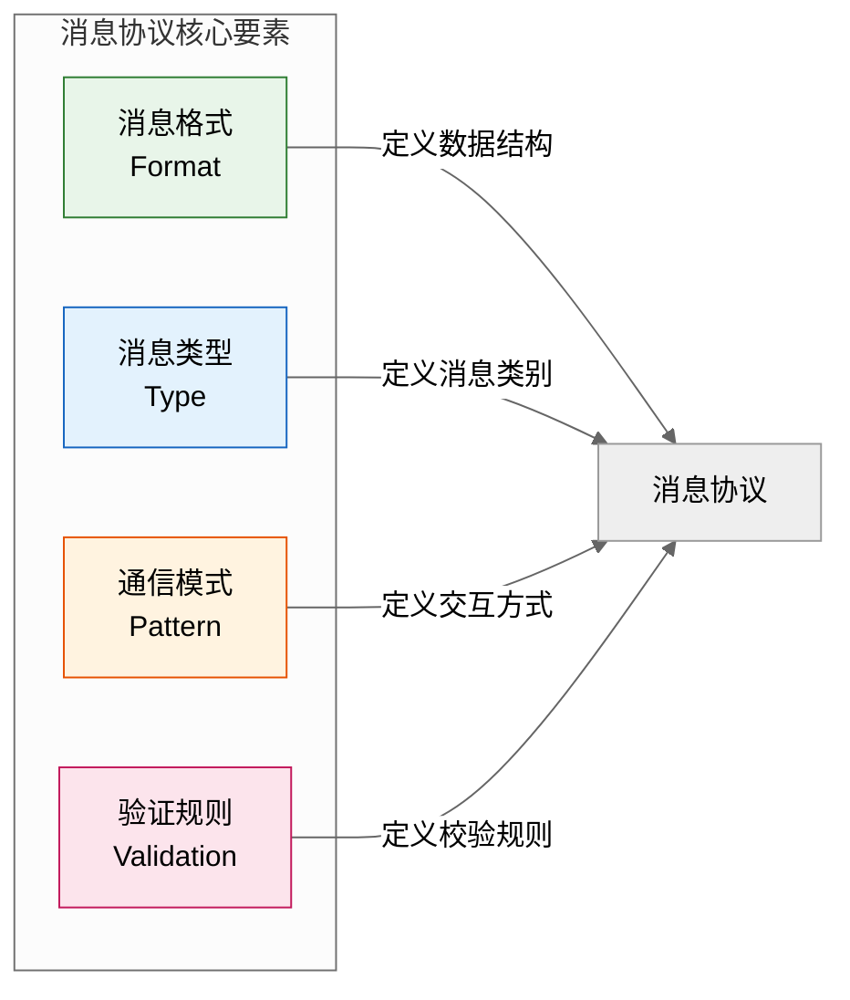

### 2.2 消息协议设计原则

#### 2.2.1 简洁性原则（Simplicity）

消息格式应简洁明了，避免过度复杂的结构。

```python
# ❌ 不好的设计：消息格式过于复杂
class BadMessage:
    def __init__(self):
        self.header = {
            "meta": {
                "version": {...},
                "encoding": {...},
                "compression": {...}
            },
            "routing": {
                "source": {...},
                "destination": {...},
                "intermediates": [...]
            },
            "security": {
                "encryption": {...},
                "signature": {...}
            }
        }
        self.body = {...}
        self.footer = {...}
        self.envelope = {...}


# ✅ 好的设计：消息格式简洁清晰
from dataclasses import dataclass
from typing import Any, Optional
from datetime import datetime
import uuid

@dataclass
class AgentMessage:
    """标准Agent消息格式"""
    # 必填字段
    sender: str           # 发送者ID
    receiver: str         # 接收者ID
    message_type: str     # 消息类型
    content: Any          # 消息内容
    
    # 可选字段
    message_id: str = None
    timestamp: datetime = None
    correlation_id: Optional[str] = None  # 关联ID（用于请求-响应匹配）
    priority: int = 0
    ttl: Optional[int] = None  # 消息有效期（秒）
    
    def __post_init__(self):
        if self.message_id is None:
            self.message_id = str(uuid.uuid4())
        if self.timestamp is None:
            self.timestamp = datetime.now()
```

#### 2.2.2 完整性原则（Completeness）

消息应包含接收者理解和处理所需的全部信息。

```python
@dataclass
class CompleteMessage:
    """完整消息示例"""
    # 基础信息
    message_id: str
    sender: str
    receiver: str
    message_type: str
    content: Any
    
    # 上下文信息
    context: dict = None          # 上下文信息
    session_id: Optional[str] = None  # 会话ID
    task_id: Optional[str] = None     # 任务ID
    
    # 元数据
    timestamp: datetime = None
    version: str = "1.0"
    encoding: str = "utf-8"
    
    # 路由信息
    reply_to: Optional[str] = None    # 回复地址
    correlation_id: Optional[str] = None  # 关联ID
    
    # 可靠性
    priority: int = 0
    ttl: Optional[int] = None
    requires_ack: bool = False
    
    # 安全性
    signature: Optional[str] = None
    encryption: Optional[str] = None
```

#### 2.2.3 扩展性原则（Extensibility）

协议应支持平滑扩展，避免破坏性变更。

```python
class ExtensibleMessage:
    """可扩展消息格式"""
    
    def __init__(self, 
                 sender: str,
                 receiver: str,
                 message_type: str,
                 content: dict,
                 **kwargs):  # 支持额外字段
        self.sender = sender
        self.receiver = receiver
        self.message_type = message_type
        self.content = content
        
        # 扩展字段
        for key, value in kwargs.items():
            setattr(self, key, value)
    
    def to_dict(self) -> dict:
        """转换为字典（包含所有字段）"""
        return self.__dict__.copy()
    
    @classmethod
    def from_dict(cls, data: dict) -> 'ExtensibleMessage':
        """从字典创建（支持任意字段）"""
        return cls(**data)


# 示例：使用扩展字段
extended_msg = ExtensibleMessage(
    sender="agent_a",
    receiver="agent_b",
    message_type="task_request",
    content={"task": "analyze_data"},
    # 扩展字段
    priority=5,
    deadline="2024-12-31",
    custom_field="custom_value"
)
```

### 2.3 标准消息格式规范

#### 2.3.1 基础消息结构

```python
from enum import Enum
from typing import List, Dict, Any, Optional
from dataclasses import dataclass, field, asdict
from datetime import datetime
import json
import uuid

class MessageType(Enum):
    """消息类型枚举"""
    # 控制类消息
    REQUEST = "request"           # 请求消息
    RESPONSE = "response"         # 响应消息
    NOTIFICATION = "notification" # 通知消息
    ACK = "ack"                   # 确认消息
    ERROR = "error"               # 错误消息
    
    # 协作类消息
    TASK_ASSIGNMENT = "task_assignment"     # 任务分配
    TASK_UPDATE = "task_update"             # 任务更新
    TASK_COMPLETION = "task_completion"     # 任务完成
    
    # 知识类消息
    KNOWLEDGE_QUERY = "knowledge_query"     # 知识查询
    KNOWLEDGE_UPDATE = "knowledge_update"   # 知识更新
    KNOWLEDGE_SYNC = "knowledge_sync"       # 知识同步
    
    # 协调类消息
    COORDINATION_REQUEST = "coordination_request"  # 协调请求
    CONFLICT_NOTIFICATION = "conflict_notification" # 冲突通知
    DECISION_RESULT = "decision_result"             # 决策结果


class MessagePriority(Enum):
    """消息优先级"""
    LOW = 0
    NORMAL = 1
    HIGH = 2
    URGENT = 3


@dataclass
class MessageHeader:
    """消息头"""
    message_id: str
    message_type: MessageType
    sender: str
    receiver: str
    timestamp: datetime
    version: str = "1.0"
    
    # 可选字段
    correlation_id: Optional[str] = None
    reply_to: Optional[str] = None
    priority: MessagePriority = MessagePriority.NORMAL
    ttl: Optional[int] = None
    
    def __post_init__(self):
        if isinstance(self.message_id, str) and not self.message_id:
            self.message_id = str(uuid.uuid4())
        if isinstance(self.timestamp, str):
            self.timestamp = datetime.fromisoformat(self.timestamp)


@dataclass
class MessageBody:
    """消息体"""
    content: Any
    content_type: str = "application/json"
    encoding: str = "utf-8"
    
    # 上下文信息
    context: Dict[str, Any] = field(default_factory=dict)
    metadata: Dict[str, Any] = field(default_factory=dict)


@dataclass
class MessageFooter:
    """消息尾"""
    signature: Optional[str] = None
    checksum: Optional[str] = None
    attachments: List[str] = field(default_factory=list)


@dataclass
class StandardMessage:
    """标准消息格式"""
    header: MessageHeader
    body: MessageBody
    footer: Optional[MessageFooter] = None
    
    def to_json(self) -> str:
        """转换为JSON字符串"""
        def convert(obj):
            if isinstance(obj, datetime):
                return obj.isoformat()
            elif isinstance(obj, Enum):
                return obj.value
            elif hasattr(obj, '__dict__'):
                return {k: convert(v) for k, v in obj.__dict__.items()}
            return obj
        
        return json.dumps(convert(self), ensure_ascii=False)
    
    @classmethod
    def from_json(cls, json_str: str) -> 'StandardMessage':
        """从JSON字符串创建"""
        data = json.loads(json_str)
        
        header = MessageHeader(
            message_id=data['header']['message_id'],
            message_type=MessageType(data['header']['message_type']),
            sender=data['header']['sender'],
            receiver=data['header']['receiver'],
            timestamp=datetime.fromisoformat(data['header']['timestamp']),
            version=data['header'].get('version', '1.0'),
            correlation_id=data['header'].get('correlation_id'),
            reply_to=data['header'].get('reply_to'),
            priority=MessagePriority(data['header'].get('priority', 1)),
            ttl=data['header'].get('ttl')
        )
        
        body = MessageBody(
            content=data['body']['content'],
            content_type=data['body'].get('content_type', 'application/json'),
            encoding=data['body'].get('encoding', 'utf-8'),
            context=data['body'].get('context', {}),
            metadata=data['body'].get('metadata', {})
        )
        
        footer = None
        if 'footer' in data and data['footer']:
            footer = MessageFooter(
                signature=data['footer'].get('signature'),
                checksum=data['footer'].get('checksum'),
                attachments=data['footer'].get('attachments', [])
            )
        
        return cls(header=header, body=body, footer=footer)


# 示例：创建标准消息
message = StandardMessage(
    header=MessageHeader(
        message_id=str(uuid.uuid4()),
        message_type=MessageType.TASK_ASSIGNMENT,
        sender="coordinator_agent",
        receiver="data_analyst_agent",
        timestamp=datetime.now(),
        priority=MessagePriority.HIGH,
        correlation_id="task-001"
    ),
    body=MessageBody(
        content={
            "task_type": "data_analysis",
            "dataset_id": "ds-12345",
            "analysis_type": "statistical",
            "parameters": {
                "confidence_level": 0.95,
                "test_method": "t-test"
            }
        },
        context={
            "project_id": "proj-001",
            "requester": "user_001"
        },
        metadata={
            "deadline": "2024-12-31T18:00:00",
            "estimated_duration": "2 hours"
        }
    ),
    footer=MessageFooter(
        checksum="abc123def456"
    )
)

print(message.to_json())
```

#### 2.3.2 特殊消息类型

```python
# 请求消息
@dataclass
class RequestMessage(StandardMessage):
    """请求消息"""
    
    def __post_init__(self):
        self.header.message_type = MessageType.REQUEST
        self.header.requires_response = True
        self.header.timeout = 30  # 默认30秒超时


# 响应消息
@dataclass
class ResponseMessage(StandardMessage):
    """响应消息"""
    status: str = "success"  # success / failure / partial
    error: Optional[dict] = None
    
    def __post_init__(self):
        self.header.message_type = MessageType.RESPONSE


# 错误消息
@dataclass
class ErrorMessage(StandardMessage):
    """错误消息"""
    error_code: str = ""
    error_message: str = ""
    error_details: Optional[dict] = None
    retry_suggested: bool = False
    
    def __post_init__(self):
        self.header.message_type = MessageType.ERROR


# 心跳消息
@dataclass
class HeartbeatMessage(StandardMessage):
    """心跳消息"""
    agent_status: str = "active"  # active / busy / idle
    load: float = 0.0
    pending_tasks: int = 0
    
    def __post_init__(self):
        self.header.message_type = MessageType.NOTIFICATION
        self.header.priority = MessagePriority.LOW
```

### 2.4 消息类型与通信模式

#### 2.4.1 同步通信模式

```python
import asyncio
from typing import Dict, Optional, Callable
from concurrent.futures import TimeoutError as AsyncTimeoutError

class SynchronousMessaging:
    """同步消息通信"""
    
    def __init__(self):
        self.pending_requests: Dict[str, asyncio.Future] = {}
        self.message_handlers: Dict[str, Callable] = {}
    
    async def send_request(self, 
                           receiver: str,
                           content: dict,
                           timeout: float = 30.0) -> dict:
        """发送同步请求并等待响应"""
        message_id = str(uuid.uuid4())
        
        # 创建Future等待响应
        future = asyncio.Future()
        self.pending_requests[message_id] = future
        
        # 发送请求消息
        request = RequestMessage(
            header=MessageHeader(
                message_id=message_id,
                message_type=MessageType.REQUEST,
                sender=self.agent_id,
                receiver=receiver,
                timestamp=datetime.now(),
                correlation_id=message_id
            ),
            body=MessageBody(content=content)
        )
        
        await self._send_message(request)
        
        # 等待响应（带超时）
        try:
            response = await asyncio.wait_for(future, timeout=timeout)
            return response
        except AsyncTimeoutError:
            self.pending_requests.pop(message_id, None)
            raise TimeoutError(f"Request {message_id} timed out")
    
    def handle_response(self, message: ResponseMessage):
        """处理响应消息"""
        correlation_id = message.header.correlation_id
        
        if correlation_id in self.pending_requests:
            future = self.pending_requests.pop(correlation_id)
            future.set_result(message.body.content)
    
    async def _send_message(self, message):
        """发送消息（实现细节）"""
        pass
```

#### 2.4.2 异步通信模式

```python
class AsynchronousMessaging:
    """异步消息通信"""
    
    def __init__(self):
        self.message_queue: asyncio.Queue = asyncio.Queue()
        self.handlers: Dict[str, List[Callable]] = {}
        self.is_running = False
    
    async def send_message(self, 
                           receiver: str,
                           message_type: MessageType,
                           content: dict) -> str:
        """发送异步消息（不等待响应）"""
        message = StandardMessage(
            header=MessageHeader(
                message_id=str(uuid.uuid4()),
                message_type=message_type,
                sender=self.agent_id,
                receiver=receiver,
                timestamp=datetime.now()
            ),
            body=MessageBody(content=content)
        )
        
        await self._send_message(message)
        return message.header.message_id
    
    async def send_and_forget(self, 
                               receiver: str,
                               content: dict):
        """发送即忘模式"""
        await self.send_message(receiver, MessageType.NOTIFICATION, content)
    
    def register_handler(self, 
                          message_type: str, 
                          handler: Callable):
        """注册消息处理器"""
        if message_type not in self.handlers:
            self.handlers[message_type] = []
        self.handlers[message_type].append(handler)
    
    async def start_listening(self):
        """开始监听消息"""
        self.is_running = True
        
        while self.is_running:
            try:
                message = await asyncio.wait_for(
                    self.message_queue.get(),
                    timeout=1.0
                )
                
                # 调用对应的处理器
                msg_type = message.header.message_type.value
                handlers = self.handlers.get(msg_type, [])
                
                for handler in handlers:
                    try:
                        await handler(message)
                    except Exception as e:
                        print(f"Handler error: {e}")
                
            except asyncio.TimeoutError:
                continue
    
    def stop_listening(self):
        """停止监听"""
        self.is_running = False
```

#### 2.4.3 发布-订阅模式

```python
class PublishSubscribeMessaging:
    """发布-订阅消息模式"""
    
    def __init__(self):
        self.topics: Dict[str, List[str]] = {}  # topic -> subscribers
        self.subscriptions: Dict[str, asyncio.Queue] = {}  # agent_id -> queue
    
    def create_topic(self, topic: str):
        """创建主题"""
        if topic not in self.topics:
            self.topics[topic] = []
    
    def subscribe(self, agent_id: str, topic: str):
        """订阅主题"""
        if topic not in self.topics:
            self.create_topic(topic)
        
        if agent_id not in self.topics[topic]:
            self.topics[topic].append(agent_id)
        
        if agent_id not in self.subscriptions:
            self.subscriptions[agent_id] = asyncio.Queue()
    
    def unsubscribe(self, agent_id: str, topic: str):
        """取消订阅"""
        if topic in self.topics and agent_id in self.topics[topic]:
            self.topics[topic].remove(agent_id)
    
    async def publish(self, 
                      topic: str,
                      content: dict,
                      publisher: str):
        """发布消息到主题"""
        if topic not in self.topics:
            return
        
        message = StandardMessage(
            header=MessageHeader(
                message_id=str(uuid.uuid4()),
                message_type=MessageType.NOTIFICATION,
                sender=publisher,
                receiver=topic,  # 接收者是主题名
                timestamp=datetime.now()
            ),
            body=MessageBody(
                content=content,
                metadata={"topic": topic}
            )
        )
        
        # 发送给所有订阅者
        for subscriber_id in self.topics[topic]:
            if subscriber_id in self.subscriptions:
                await self.subscriptions[subscriber_id].put(message)
    
    async def receive(self, agent_id: str, timeout: float = 1.0) -> Optional[StandardMessage]:
        """接收订阅的消息"""
        if agent_id not in self.subscriptions:
            return None
        
        try:
            message = await asyncio.wait_for(
                self.subscriptions[agent_id].get(),
                timeout=timeout
            )
            return message
        except asyncio.TimeoutError:
            return None
```

### 2.5 消息协议实现方式

#### 2.5.1 基于队列的实现

```python
import asyncio
from typing import Dict, List
from dataclasses import dataclass, field
from datetime import datetime
import json

@dataclass
class MessageQueue:
    """消息队列"""
    name: str
    messages: asyncio.Queue = field(default_factory=asyncio.Queue)
    max_size: int = 10000
    
    async def put(self, message: StandardMessage):
        """入队"""
        if self.messages.qsize() >= self.max_size:
            raise OverflowError(f"Queue {self.name} is full")
        await self.messages.put(message)
    
    async def get(self, timeout: float = None) -> Optional[StandardMessage]:
        """出队"""
        try:
            if timeout:
                message = await asyncio.wait_for(
                    self.messages.get(),
                    timeout=timeout
                )
            else:
                message = await self.messages.get()
            return message
        except asyncio.TimeoutError:
            return None
    
    def size(self) -> int:
        """队列大小"""
        return self.messages.qsize()


class QueueBasedMessaging:
    """基于队列的消息系统"""
    
    def __init__(self):
        self.agent_queues: Dict[str, MessageQueue] = {}
        self.topic_queues: Dict[str, MessageQueue] = {}
        self.dead_letter_queue: MessageQueue = MessageQueue("dead_letter")
    
    def register_agent(self, agent_id: str):
        """注册Agent的消息队列"""
        if agent_id not in self.agent_queues:
            self.agent_queues[agent_id] = MessageQueue(f"agent_{agent_id}")
    
    def create_topic(self, topic: str):
        """创建主题队列"""
        if topic not in self.topic_queues:
            self.topic_queues[topic] = MessageQueue(f"topic_{topic}")
    
    async def send_to_agent(self, 
                            message: StandardMessage):
        """发送消息到特定Agent"""
        receiver = message.header.receiver
        
        if receiver not in self.agent_queues:
            # 发送到死信队列
            await self.dead_letter_queue.put(message)
            return
        
        await self.agent_queues[receiver].put(message)
    
    async def publish_to_topic(self, 
                                topic: str,
                                message: StandardMessage):
        """发布消息到主题"""
        if topic not in self.topic_queues:
            self.create_topic(topic)
        
        await self.topic_queues[topic].put(message)
    
    async def receive_from_agent_queue(self, 
                                         agent_id: str,
                                         timeout: float = 1.0) -> Optional[StandardMessage]:
        """从Agent队列接收消息"""
        if agent_id not in self.agent_queues:
            return None
        
        return await self.agent_queues[agent_id].get(timeout)
    
    async def receive_from_topic(self, 
                                   topic: str,
                                   timeout: float = 1.0) -> Optional[StandardMessage]:
        """从主题队列接收消息"""
        if topic not in self.topic_queues:
            return None
        
        return await self.topic_queues[topic].get(timeout)
    
    def get_queue_stats(self) -> dict:
        """获取队列统计"""
        return {
            "agent_queues": {
                agent_id: queue.size()
                for agent_id, queue in self.agent_queues.items()
            },
            "topic_queues": {
                topic: queue.size()
                for topic, queue in self.topic_queues.items()
            },
            "dead_letter_size": self.dead_letter_queue.size()
        }
```

#### 2.5.2 基于共享状态的实现（黑板模式）

```python
class BlackboardMessaging:
    """基于黑板的通信"""
    
    def __init__(self):
        self.blackboard: Dict[str, Any] = {}
        self.watchers: Dict[str, List[Callable]] = {}
        self.lock = asyncio.Lock()
    
    async def write(self, key: str, value: Any, writer: str):
        """写入黑板"""
        async with self.lock:
            self.blackboard[key] = {
                "value": value,
                "writer": writer,
                "timestamp": datetime.now()
            }
            
            # 通知观察者
            if key in self.watchers:
                for watcher in self.watchers[key]:
                    await watcher(key, value)
    
    async def read(self, key: str) -> Optional[Any]:
        """读取黑板"""
        async with self.lock:
            entry = self.blackboard.get(key)
            return entry["value"] if entry else None
    
    async def delete(self, key: str):
        """删除黑板条目"""
        async with self.lock:
            self.blackboard.pop(key, None)
    
    def watch(self, key: str, callback: Callable):
        """监听黑板变化"""
        if key not in self.watchers:
            self.watchers[key] = []
        self.watchers[key].append(callback)
    
    def unwatch(self, key: str, callback: Callable):
        """取消监听"""
        if key in self.watchers:
            self.watchers[key] = [
                cb for cb in self.watchers[key] if cb != callback
            ]
    
    async def query(self, pattern: str) -> Dict[str, Any]:
        """查询匹配的条目"""
        import re
        regex = re.compile(pattern)
        
        async with self.lock:
            return {
                k: v for k, v in self.blackboard.items()
                if regex.search(k)
            }
```

### 2.6 消息协议治理与演进

#### 2.6.1 协议版本管理

```python
class ProtocolVersionManager:
    """协议版本管理器"""
    
    def __init__(self):
        self.versions: Dict[str, List[dict]] = {}
        self.current_version: Dict[str, str] = {}
    
    def register_version(self, 
                         protocol_name: str,
                         version: str,
                         schema: dict,
                         changelog: str,
                         breaking_changes: bool = False):
        """注册协议版本"""
        if protocol_name not in self.versions:
            self.versions[protocol_name] = []
        
        self.versions[protocol_name].append({
            "version": version,
            "schema": schema,
            "changelog": changelog,
            "breaking_changes": breaking_changes,
            "registered_at": datetime.now()
        })
    
    def get_current_version(self, protocol_name: str) -> str:
        """获取当前版本"""
        return self.current_version.get(protocol_name, "1.0")
    
    def get_schema(self, 
                   protocol_name: str,
                   version: str = None) -> dict:
        """获取协议Schema"""
        version = version or self.get_current_version(protocol_name)
        
        for v in self.versions.get(protocol_name, []):
            if v["version"] == version:
                return v["schema"]
        
        return {}
    
    def check_compatibility(self, 
                             protocol_name: str,
                             version1: str,
                             version2: str) -> bool:
        """检查版本兼容性"""
        # 简化实现：只检查是否是破坏性变更
        for v in self.versions.get(protocol_name, []):
            if v["version"] == version2 and v["breaking_changes"]:
                return False
        return True
    
    def migrate_message(self, 
                         message: dict,
                         from_version: str,
                         to_version: str) -> dict:
        """消息版本迁移"""
        # 实现版本迁移逻辑
        # （根据具体协议定义）
        return message
```

#### 2.6.2 消息验证中间件

```python
class MessageValidator:
    """消息验证器"""
    
    def __init__(self):
        self.schemas: Dict[str, dict] = {}
    
    def register_schema(self, message_type: str, schema: dict):
        """注册消息Schema"""
        self.schemas[message_type] = schema
    
    def validate(self, message: StandardMessage) -> tuple:
        """验证消息"""
        msg_type = message.header.message_type.value
        
        if msg_type not in self.schemas:
            return True, []
        
        schema = self.schemas[msg_type]
        errors = self._validate_against_schema(
            message.body.content, 
            schema
        )
        
        return len(errors) == 0, errors
    
    def _validate_against_schema(self, 
                                   data: dict,
                                   schema: dict) -> List[str]:
        """根据Schema验证数据"""
        errors = []
        
        # 检查必填字段
        required = schema.get("required", [])
        for field in required:
            if field not in data:
                errors.append(f"Missing required field: {field}")
        
        # 检查字段类型
        properties = schema.get("properties", {})
        for field, value in data.items():
            if field in properties:
                expected_type = properties[field].get("type")
                if expected_type and not isinstance(value, eval(expected_type)):
                    errors.append(
                        f"Field {field} has wrong type. Expected {expected_type}"
                    )
        
        return errors


class MessageMiddleware:
    """消息中间件"""
    
    def __init__(self):
        self.validator = MessageValidator()
        self.pre_handlers: List[Callable] = []
        self.post_handlers: List[Callable] = []
    
    async def process_outgoing(self, 
                                 message: StandardMessage) -> StandardMessage:
        """处理出站消息"""
        for handler in self.pre_handlers:
            message = await handler(message)
        
        return message
    
    async def process_incoming(self, 
                                 message: StandardMessage) -> StandardMessage:
        """处理入站消息"""
        # 验证消息
        is_valid, errors = self.validator.validate(message)
        
        if not is_valid:
            raise ValueError(f"Invalid message: {errors}")
        
        for handler in self.post_handlers:
            message = await handler(message)
        
        return message
    
    def add_pre_handler(self, handler: Callable):
        """添加出站处理器"""
        self.pre_handlers.append(handler)
    
    def add_post_handler(self, handler: Callable):
        """添加入站处理器"""
        self.post_handlers.append(handler)
```

---

## 三、共享记忆（Shared Memory）

### 3.1 定义与核心价值

**定义**：共享记忆是多Agent系统中用于存储、管理和同步Agent间共享信息与知识的机制。它解决了"如何让多个Agent共享信息"、"如何保证信息一致性"以及"如何沉淀知识"等问题。

**核心价值**：
- **信息同步**：多个Agent可以访问和更新共享信息
- **知识沉淀**：将Agent的经验和知识持久化存储
- **协作基础**：为Agent协作提供信息支撑
- **一致性保证**：确保共享信息的准确性和时效性

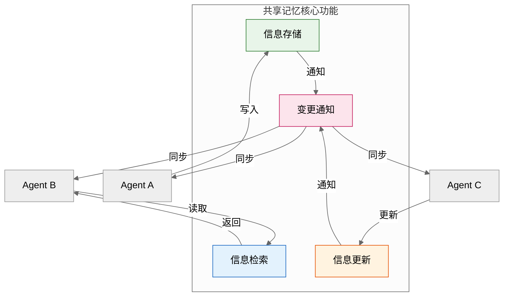

### 3.2 共享记忆架构设计

#### 3.2.1 分层记忆架构

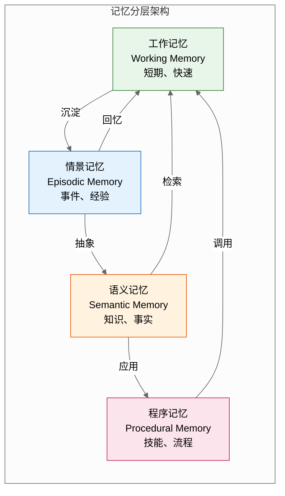

```python
from typing import Dict, List, Any, Optional
from dataclasses import dataclass, field
from datetime import datetime, timedelta
from enum import Enum
import json

class MemoryType(Enum):
    """记忆类型"""
    WORKING = "working"       # 工作记忆：短期、当前任务相关
    EPISODIC = "episodic"     # 情景记忆：事件、经验
    SEMANTIC = "semantic"     # 语义记忆：知识、事实
    PROCEDURAL = "procedural" # 程序记忆：技能、流程


@dataclass
class MemoryEntry:
    """记忆条目"""
    entry_id: str
    memory_type: MemoryType
    content: Any
    metadata: dict = field(default_factory=dict)
    created_at: datetime = field(default_factory=datetime.now)
    updated_at: datetime = field(default_factory=datetime.now)
    expires_at: Optional[datetime] = None
    access_count: int = 0
    importance: float = 0.5  # 重要性评分 0-1
    
    def is_expired(self) -> bool:
        """检查是否过期"""
        if self.expires_at is None:
            return False
        return datetime.now() > self.expires_at
    
    def access(self):
        """访问记忆"""
        self.access_count += 1
        self.updated_at = datetime.now()


class LayeredMemorySystem:
    """分层记忆系统"""
    
    def __init__(self):
        self.working_memory: Dict[str, MemoryEntry] = {}
        self.episodic_memory: List[MemoryEntry] = []
        self.semantic_memory: Dict[str, MemoryEntry] = {}
        self.procedural_memory: Dict[str, MemoryEntry] = {}
        
        self.lock = asyncio.Lock()
    
    async def store(self, 
                    content: Any,
                    memory_type: MemoryType,
                    metadata: dict = None,
                    ttl: int = None) -> str:
        """存储记忆"""
        entry_id = str(uuid.uuid4())
        
        expires_at = None
        if ttl:
            expires_at = datetime.now() + timedelta(seconds=ttl)
        
        entry = MemoryEntry(
            entry_id=entry_id,
            memory_type=memory_type,
            content=content,
            metadata=metadata or {},
            expires_at=expires_at
        )
        
        async with self.lock:
            if memory_type == MemoryType.WORKING:
                self.working_memory[entry_id] = entry
            elif memory_type == MemoryType.EPISODIC:
                self.episodic_memory.append(entry)
            elif memory_type == MemoryType.SEMANTIC:
                key = metadata.get("key", entry_id)
                self.semantic_memory[key] = entry
            elif memory_type == MemoryType.PROCEDURAL:
                key = metadata.get("skill_name", entry_id)
                self.procedural_memory[key] = entry
        
        return entry_id
    
    async def retrieve(self, 
                        entry_id: str,
                        memory_type: MemoryType) -> Optional[MemoryEntry]:
        """检索记忆"""
        async with self.lock:
            entry = None
            
            if memory_type == MemoryType.WORKING:
                entry = self.working_memory.get(entry_id)
            elif memory_type == MemoryType.SEMANTIC:
                entry = self.semantic_memory.get(entry_id)
            elif memory_type == MemoryType.PROCEDURAL:
                entry = self.procedural_memory.get(entry_id)
            
            if entry and not entry.is_expired():
                entry.access()
                return entry
        
        return None
    
    async def search(self, 
                      query: str,
                      memory_types: List[MemoryType] = None) -> List[MemoryEntry]:
        """搜索记忆"""
        results = []
        memory_types = memory_types or list(MemoryType)
        
        async with self.lock:
            for mem_type in memory_types:
                if mem_type == MemoryType.WORKING:
                    entries = list(self.working_memory.values())
                elif mem_type == MemoryType.EPISODIC:
                    entries = self.episodic_memory
                elif mem_type == MemoryType.SEMANTIC:
                    entries = list(self.semantic_memory.values())
                elif mem_type == MemoryType.PROCEDURAL:
                    entries = list(self.procedural_memory.values())
                else:
                    continue
                
                for entry in entries:
                    if not entry.is_expired():
                        # 简化的搜索匹配
                        if query in str(entry.content) or query in str(entry.metadata):
                            results.append(entry)
        
        return results
    
    async def consolidate(self):
        """记忆巩固：将工作记忆转为情景记忆"""
        async with self.lock:
            entries_to_consolidate = []
            
            for entry_id, entry in list(self.working_memory.items()):
                if entry.importance > 0.7 or entry.access_count > 3:
                    entries_to_consolidate.append(entry)
                    del self.working_memory[entry_id]
            
            for entry in entries_to_consolidate:
                entry.memory_type = MemoryType.EPISODIC
                self.episodic_memory.append(entry)
    
    async def cleanup_expired(self):
        """清理过期记忆"""
        async with self.lock:
            # 清理工作记忆
            self.working_memory = {
                k: v for k, v in self.working_memory.items()
                if not v.is_expired()
            }
            
            # 清理情景记忆
            self.episodic_memory = [
                e for e in self.episodic_memory
                if not e.is_expired()
            ]
```

#### 3.2.2 共享状态管理

```python
class SharedStateManager:
    """共享状态管理器"""
    
    def __init__(self):
        self.state: Dict[str, Any] = {}
        self.state_metadata: Dict[str, dict] = {}
        self.watchers: Dict[str, List[Callable]] = {}
        self.lock = asyncio.Lock()
    
    async def set_state(self, 
                         key: str,
                         value: Any,
                         writer: str,
                         ttl: int = None):
        """设置共享状态"""
        async with self.lock:
            old_value = self.state.get(key)
            
            self.state[key] = value
            self.state_metadata[key] = {
                "writer": writer,
                "timestamp": datetime.now(),
                "ttl": ttl,
                "version": self.state_metadata.get(key, {}).get("version", 0) + 1
            }
            
            # 通知观察者
            if key in self.watchers:
                for watcher in self.watchers[key]:
                    await watcher(key, old_value, value)
    
    async def get_state(self, key: str) -> Optional[Any]:
        """获取共享状态"""
        async with self.lock:
            metadata = self.state_metadata.get(key)
            
            # 检查是否过期
            if metadata and metadata.get("ttl"):
                elapsed = (datetime.now() - metadata["timestamp"]).total_seconds()
                if elapsed > metadata["ttl"]:
                    self.state.pop(key, None)
                    self.state_metadata.pop(key, None)
                    return None
            
            return self.state.get(key)
    
    async def delete_state(self, key: str):
        """删除共享状态"""
        async with self.lock:
            old_value = self.state.pop(key, None)
            self.state_metadata.pop(key, None)
            
            # 通知观察者
            if key in self.watchers and old_value is not None:
                for watcher in self.watchers[key]:
                    await watcher(key, old_value, None)
    
    def watch_state(self, key: str, callback: Callable):
        """监听状态变化"""
        if key not in self.watchers:
            self.watchers[key] = []
        self.watchers[key].append(callback)
    
    def unwatch_state(self, key: str, callback: Callable):
        """取消监听"""
        if key in self.watchers:
            self.watchers[key] = [
                cb for cb in self.watchers[key] if cb != callback
            ]
    
    async def get_state_snapshot(self) -> dict:
        """获取状态快照"""
        async with self.lock:
            return {
                "state": self.state.copy(),
                "metadata": self.state_metadata.copy()
            }
```

### 3.3 知识沉淀与演化机制

#### 3.3.1 知识提取与抽象

```python
class KnowledgeExtractor:
    """知识提取器"""
    
    def __init__(self, memory_system: LayeredMemorySystem):
        self.memory = memory_system
    
    async def extract_patterns(self, 
                                min_occurrences: int = 3) -> List[dict]:
        """从情景记忆中提取模式"""
        episodic_entries = self.memory.episodic_memory
        
        # 统计相似事件的出现频率
        pattern_counts: Dict[str, int] = {}
        pattern_examples: Dict[str, List] = {}
        
        for entry in episodic_entries:
            # 简化的模式提取：基于事件类型
            event_type = entry.metadata.get("event_type", "unknown")
            pattern_key = f"pattern:{event_type}"
            
            pattern_counts[pattern_key] = pattern_counts.get(pattern_key, 0) + 1
            
            if pattern_key not in pattern_examples:
                pattern_examples[pattern_key] = []
            pattern_examples[pattern_key].append(entry.content)
        
        # 提取高频模式作为知识
        extracted_knowledge = []
        
        for pattern, count in pattern_counts.items():
            if count >= min_occurrences:
                knowledge = {
                    "pattern": pattern,
                    "frequency": count,
                    "examples": pattern_examples[pattern][:5],  # 最多5个示例
                    "confidence": min(count / len(episodic_entries), 1.0)
                }
                extracted_knowledge.append(knowledge)
        
        return extracted_knowledge
    
    async def generalize_rule(self, 
                               examples: List[dict]) -> dict:
        """从示例中归纳规则"""
        if not examples:
            return {}
        
        # 找出所有示例共有的属性
        common_keys = set(examples[0].keys())
        for example in examples[1:]:
            common_keys &= set(example.keys())
        
        # 提取共有属性的共同值或值范围
        rule = {}
        for key in common_keys:
            values = [e[key] for e in examples if key in e]
            
            if all(v == values[0] for v in values):
                # 所有值相同
                rule[key] = {"type": "fixed", "value": values[0]}
            elif all(isinstance(v, (int, float)) for v in values):
                # 数值范围
                rule[key] = {
                    "type": "range",
                    "min": min(values),
                    "max": max(values)
                }
            else:
                # 枚举值
                rule[key] = {
                    "type": "enum",
                    "values": list(set(str(v) for v in values))
                }
        
        return rule
    
    async def store_as_semantic_knowledge(self, 
                                            knowledge: dict,
                                            category: str):
        """将知识存储为语义记忆"""
        await self.memory.store(
            content=knowledge,
            memory_type=MemoryType.SEMANTIC,
            metadata={
                "category": category,
                "source": "extraction",
                "confidence": knowledge.get("confidence", 0.5)
            }
        )
```

#### 3.3.2 知识演化机制

```python
class KnowledgeEvolutionManager:
    """知识演化管理器"""
    
    def __init__(self, memory_system: LayeredMemorySystem):
        self.memory = memory_system
        self.knowledge_versions: Dict[str, List[dict]] = {}
    
    async def update_knowledge(self, 
                                key: str,
                                new_content: Any,
                                reason: str) -> str:
        """更新知识"""
        # 获取当前版本
        current = await self.memory.retrieve(key, MemoryType.SEMANTIC)
        
        # 保存历史版本
        if key not in self.knowledge_versions:
            self.knowledge_versions[key] = []
        
        if current:
            self.knowledge_versions[key].append({
                "content": current.content,
                "metadata": current.metadata,
                "timestamp": datetime.now()
            })
        
        # 存储新版本
        entry_id = await self.memory.store(
            content=new_content,
            memory_type=MemoryType.SEMANTIC,
            metadata={
                "key": key,
                "version": len(self.knowledge_versions.get(key, [])) + 1,
                "update_reason": reason,
                "previous_version": current.content if current else None
            }
        )
        
        return entry_id
    
    async def merge_knowledge(self, 
                               key_a: str,
                               key_b: str,
                               merge_strategy: str = "union") -> str:
        """合并知识"""
        entry_a = await self.memory.retrieve(key_a, MemoryType.SEMANTIC)
        entry_b = await self.memory.retrieve(key_b, MemoryType.SEMANTIC)
        
        if not entry_a or not entry_b:
            raise ValueError("One or both knowledge entries not found")
        
        # 合并内容
        if merge_strategy == "union":
            merged = {**entry_a.content, **entry_b.content}
        elif merge_strategy == "intersect":
            merged = {
                k: v for k, v in entry_a.content.items()
                if k in entry_b.content and entry_b.content[k] == v
            }
        else:
            merged = entry_a.content
        
        # 存储合并后的知识
        new_key = f"{key_a}_{key_b}_merged"
        await self.memory.store(
            content=merged,
            memory_type=MemoryType.SEMANTIC,
            metadata={
                "key": new_key,
                "source_keys": [key_a, key_b],
                "merge_strategy": merge_strategy
            }
        )
        
        return new_key
    
    async def prune_outdated_knowledge(self, 
                                         max_age_days: int = 30):
        """清理过时知识"""
        cutoff = datetime.now() - timedelta(days=max_age_days)
        
        to_remove = []
        for key, entry in self.memory.semantic_memory.items():
            if entry.updated_at < cutoff and entry.importance < 0.3:
                to_remove.append(key)
        
        for key in to_remove:
            del self.memory.semantic_memory[key]
        
        return len(to_remove)
    
    def get_knowledge_lineage(self, key: str) -> List[dict]:
        """获取知识演化谱系"""
        versions = self.knowledge_versions.get(key, [])
        
        lineage = []
        for i, version in enumerate(versions):
            lineage.append({
                "version": i + 1,
                "content": version["content"],
                "timestamp": version["timestamp"],
                "metadata": version.get("metadata", {})
            })
        
        return lineage
```

### 3.4 存储方案选型

#### 3.4.1 存储方案对比

| 存储类型 | 特点 | 适用场景 | 代表产品 |
|---------|------|---------|---------|
| **内存存储** | 快速、易失 | 工作记忆、临时状态 | Redis, Memcached |
| **关系数据库** | 结构化、强一致 | 语义记忆、结构化知识 | PostgreSQL, MySQL |
| **向量数据库** | 语义检索、相似搜索 | 情景记忆、语义检索 | Milvus, Pinecone |
| **图数据库** | 关系存储、路径查询 | 知识图谱、关系网络 | Neo4j, Nebula |
| **对象存储** | 大文件、低成本 | 文档、模型、附件 | MinIO, S3 |

```python
class StorageAdapter(ABC):
    """存储适配器基类"""
    
    @abstractmethod
    async def store(self, key: str, value: Any) -> bool:
        """存储"""
        pass
    
    @abstractmethod
    async def retrieve(self, key: str) -> Optional[Any]:
        """检索"""
        pass
    
    @abstractmethod
    async def delete(self, key: str) -> bool:
        """删除"""
        pass
    
    @abstractmethod
    async def search(self, query: Any) -> List[Any]:
        """搜索"""
        pass


class InMemoryStorage(StorageAdapter):
    """内存存储适配器"""
    
    def __init__(self):
        self.data: Dict[str, Any] = {}
    
    async def store(self, key: str, value: Any) -> bool:
        self.data[key] = value
        return True
    
    async def retrieve(self, key: str) -> Optional[Any]:
        return self.data.get(key)
    
    async def delete(self, key: str) -> bool:
        self.data.pop(key, None)
        return True
    
    async def search(self, query: Any) -> List[Any]:
        # 简化的搜索实现
        results = []
        for key, value in self.data.items():
            if query in str(key) or query in str(value):
                results.append(value)
        return results


class VectorStorage(StorageAdapter):
    """向量存储适配器"""
    
    def __init__(self, embedding_model: str = "text-embedding-ada-002"):
        self.embeddings: Dict[str, List[float]] = {}
        self.documents: Dict[str, str] = {}
        self.embedding_model = embedding_model
    
    async def store(self, key: str, value: str) -> bool:
        """存储文档及其向量"""
        # 生成嵌入向量（伪代码）
        embedding = await self._get_embedding(value)
        
        self.documents[key] = value
        self.embeddings[key] = embedding
        return True
    
    async def retrieve(self, key: str) -> Optional[str]:
        return self.documents.get(key)
    
    async def delete(self, key: str) -> bool:
        self.documents.pop(key, None)
        self.embeddings.pop(key, None)
        return True
    
    async def search(self, query: str, top_k: int = 5) -> List[dict]:
        """语义搜索"""
        query_embedding = await self._get_embedding(query)
        
        # 计算相似度
        similarities = []
        for key, embedding in self.embeddings.items():
            similarity = self._cosine_similarity(query_embedding, embedding)
            similarities.append({
                "key": key,
                "content": self.documents[key],
                "score": similarity
            })
        
        # 排序并返回top_k
        similarities.sort(key=lambda x: x["score"], reverse=True)
        return similarities[:top_k]
    
    async def _get_embedding(self, text: str) -> List[float]:
        """获取文本嵌入向量"""
        # 实际实现调用embedding API
        # 这里返回伪数据
        import hashlib
        hash_obj = hashlib.md5(text.encode())
        return [float(b) / 255.0 for b in hash_obj.digest()]
    
    def _cosine_similarity(self, a: List[float], b: List[float]) -> float:
        """计算余弦相似度"""
        import math
        dot_product = sum(x * y for x, y in zip(a, b))
        norm_a = math.sqrt(sum(x ** 2 for x in a))
        norm_b = math.sqrt(sum(y ** 2 for y in b))
        return dot_product / (norm_a * norm_b) if norm_a and norm_b else 0.0
```

### 3.5 共享记忆治理策略

#### 3.5.1 访问控制与权限管理

```python
class MemoryAccessController:
    """记忆访问控制器"""
    
    def __init__(self):
        self.permissions: Dict[str, Dict[str, List[str]]] = {}
        # permissions[agent_id][memory_key] = ["read", "write", "delete"]
    
    def grant_permission(self, 
                          agent_id: str,
                          memory_key: str,
                          permissions: List[str]):
        """授予权限"""
        if agent_id not in self.permissions:
            self.permissions[agent_id] = {}
        
        self.permissions[agent_id][memory_key] = permissions
    
    def revoke_permission(self, 
                           agent_id: str,
                           memory_key: str):
        """撤销权限"""
        if agent_id in self.permissions:
            self.permissions[agent_id].pop(memory_key, None)
    
    def check_permission(self, 
                          agent_id: str,
                          memory_key: str,
                          action: str) -> bool:
        """检查权限"""
        if agent_id not in self.permissions:
            return False
        
        if memory_key not in self.permissions[agent_id]:
            return False
        
        return action in self.permissions[agent_id][memory_key]
    
    def check_access(self, 
                      agent_id: str,
                      memory_key: str,
                      action: str) -> tuple:
        """检查访问权限并返回详细信息"""
        has_permission = self.check_permission(agent_id, memory_key, action)
        
        return has_permission, {
            "agent_id": agent_id,
            "memory_key": memory_key,
            "action": action,
            "allowed": has_permission,
            "timestamp": datetime.now()
        }
```

#### 3.5.2 一致性保证机制

```python
class ConsistencyManager:
    """一致性管理器"""
    
    def __init__(self):
        self.versions: Dict[str, int] = {}
        self.locks: Dict[str, asyncio.Lock] = {}
    
    async def acquire_lock(self, key: str, agent_id: str) -> bool:
        """获取锁"""
        if key not in self.locks:
            self.locks[key] = asyncio.Lock()
        
        await self.locks[key].acquire()
        return True
    
    def release_lock(self, key: str, agent_id: str):
        """释放锁"""
        if key in self.locks and self.locks[key].locked():
            self.locks[key].release()
    
    def get_version(self, key: str) -> int:
        """获取版本号"""
        return self.versions.get(key, 0)
    
    def increment_version(self, key: str) -> int:
        """增加版本号"""
        self.versions[key] = self.versions.get(key, 0) + 1
        return self.versions[key]
    
    async def compare_and_swap(self, 
                                 key: str,
                                 expected_version: int,
                                 new_value: Any,
                                 storage: StorageAdapter) -> bool:
        """CAS操作"""
        async with self.locks.get(key, asyncio.Lock()):
            current_version = self.get_version(key)
            
            if current_version != expected_version:
                return False
            
            await storage.store(key, new_value)
            self.increment_version(key)
            return True


class ConflictResolver:
    """冲突解决器"""
    
    @staticmethod
    def resolve_write_conflict(local_value: Any, 
                                 remote_value: Any,
                                 strategy: str = "last_write_wins") -> Any:
        """解决写入冲突"""
        if strategy == "last_write_wins":
            return remote_value
        elif strategy == "first_write_wins":
            return local_value
        elif strategy == "merge":
            if isinstance(local_value, dict) and isinstance(remote_value, dict):
                return {**local_value, **remote_value}
            return remote_value
        else:
            return remote_value
```

---

## 四、治理规则（Governance Rules）

### 4.1 定义与核心价值

**定义**：治理规则是多Agent系统中规范Agent协作行为的规则集合，包括决策机制、冲突解决策略、行为规范等内容。它定义了"如何做决策"、"如何解决冲突"以及"如何规范行为"。

**核心价值**：
- **行为规范化**：明确Agent的行为边界和准则
- **决策高效化**：建立清晰的决策流程和权限
- **冲突有序化**：提供可预测的冲突解决路径
- **系统稳定性**：通过规则约束保证系统稳定运行

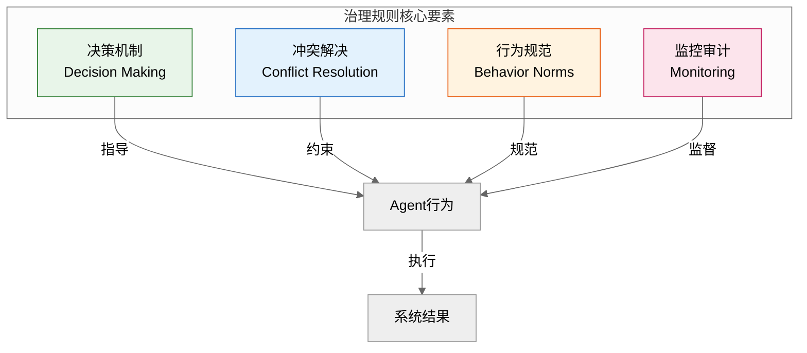

### 4.2 决策机制设计

#### 4.2.1 决策类型分类

```python
from enum import Enum

class DecisionType(Enum):
    """决策类型"""
    # 按决策范围
    INDIVIDUAL = "individual"     # 个体决策：Agent独立决策
    GROUP = "group"               # 群体决策：多Agent共同决策
    SYSTEM = "system"             # 系统决策：全局决策
    
    # 按决策时效
    STRATEGIC = "strategic"       # 战略决策：长期、重要
    TACTICAL = "tactical"         # 战术决策：中期、执行
    OPERATIONAL = "operational"   # 运营决策：短期、日常
    
    # 按决策结构
    HIERARCHICAL = "hierarchical" # 层级决策
    DEMOCRATIC = "democratic"     # 民主决策
    CONSENSUS = "consensus"       # 共识决策


class DecisionAuthority(Enum):
    """决策权限"""
    NONE = 0           # 无决策权
    PROPOSAL = 1       # 提议权
    CONSULTATION = 2   # 咨询权
    VOTING = 3         # 表决权
    DECISION = 4       # 决策权
    VETO = 5           # 否决权


@dataclass
class DecisionRule:
    """决策规则"""
    rule_id: str
    decision_type: DecisionType
    authority_matrix: Dict[str, DecisionAuthority]  # agent_id -> authority
    quorum: int           # 最低参与人数
    threshold: float      # 通过阈值（如0.5表示50%）
    timeout: int          # 决策超时时间（秒）
    escalation_path: List[str]  # 升级路径
```

#### 4.2.2 群体决策机制

```python
class GroupDecisionMaker:
    """群体决策机制"""
    
    def __init__(self):
        self.pending_decisions: Dict[str, dict] = {}
        self.decision_history: List[dict] = []
    
    async def initiate_decision(self, 
                                  decision_id: str,
                                  proposal: dict,
                                  decision_rule: DecisionRule,
                                  participants: List[str]) -> str:
        """发起决策"""
        decision = {
            "decision_id": decision_id,
            "proposal": proposal,
            "rule": decision_rule,
            "participants": participants,
            "votes": {},
            "status": "pending",
            "created_at": datetime.now(),
            "deadline": datetime.now() + timedelta(seconds=decision_rule.timeout)
        }
        
        self.pending_decisions[decision_id] = decision
        
        # 通知参与者
        await self._notify_participants(decision)
        
        return decision_id
    
    async def cast_vote(self, 
                         decision_id: str,
                         agent_id: str,
                         vote: str,  # "yes", "no", "abstain"
                         reason: str = None) -> bool:
        """投票"""
        if decision_id not in self.pending_decisions:
            return False
        
        decision = self.pending_decisions[decision_id]
        
        if agent_id not in decision["participants"]:
            return False
        
        if datetime.now() > decision["deadline"]:
            return False
        
        decision["votes"][agent_id] = {
            "vote": vote,
            "reason": reason,
            "timestamp": datetime.now()
        }
        
        # 检查是否达到决策条件
        await self._check_decision(decision_id)
        
        return True
    
    async def _check_decision(self, decision_id: str):
        """检查决策是否达成"""
        decision = self.pending_decisions[decision_id]
        rule = decision["rule"]
        
        total_participants = len(decision["participants"])
        total_votes = len(decision["votes"])
        
        # 检查是否达到法定人数
        if total_votes < rule.quorum:
            return
        
        # 计算投票结果
        yes_votes = sum(1 for v in decision["votes"].values() if v["vote"] == "yes")
        no_votes = sum(1 for v in decision["votes"].values() if v["vote"] == "no")
        
        # 检查是否达到阈值
        if yes_votes / total_participants >= rule.threshold:
            decision["status"] = "approved"
            decision["result"] = "approved"
            await self._finalize_decision(decision_id)
        elif no_votes / total_participants > (1 - rule.threshold):
            decision["status"] = "rejected"
            decision["result"] = "rejected"
            await self._finalize_decision(decision_id)
    
    async def _finalize_decision(self, decision_id: str):
        """完成决策"""
        decision = self.pending_decisions.pop(decision_id)
        decision["finalized_at"] = datetime.now()
        self.decision_history.append(decision)
        
        # 通知结果
        await self._notify_decision_result(decision)
    
    async def _notify_participants(self, decision: dict):
        """通知参与者（实现细节）"""
        pass
    
    async def _notify_decision_result(self, decision: dict):
        """通知决策结果（实现细节）"""
        pass
    
    def get_decision_statistics(self) -> dict:
        """获取决策统计"""
        if not self.decision_history:
            return {}
        
        total = len(self.decision_history)
        approved = sum(1 for d in self.decision_history if d.get("result") == "approved")
        
        return {
            "total_decisions": total,
            "approved": approved,
            "rejected": total - approved,
            "approval_rate": approved / total if total > 0 else 0
        }
```

#### 4.2.3 决策层级与升级机制

```python
class DecisionHierarchy:
    """决策层级体系"""
    
    def __init__(self):
        self.levels: List[dict] = []
        self.current_level: Dict[str, int] = {}  # issue_id -> level
    
    def add_level(self, 
                  level: int,
                  name: str,
                  agents: List[str],
                  decision_rule: DecisionRule):
        """添加决策层级"""
        self.levels.append({
            "level": level,
            "name": name,
            "agents": agents,
            "rule": decision_rule
        })
    
    async def escalate(self, 
                        issue_id: str,
                        current_level: int,
                        reason: str) -> dict:
        """升级决策"""
        next_level = current_level + 1
        
        if next_level > len(self.levels):
            return {
                "success": False,
                "reason": "No higher level available"
            }
        
        level_config = self.levels[next_level - 1]
        
        self.current_level[issue_id] = next_level
        
        return {
            "success": True,
            "new_level": next_level,
            "agents": level_config["agents"],
            "rule": level_config["rule"]
        }
    
    async def delegate(self, 
                        issue_id: str,
                        from_agent: str,
                        to_agent: str,
                        authority_level: DecisionAuthority) -> bool:
        """委托决策权"""
        # 检查委托权限
        if authority_level not in [DecisionAuthority.DECISION, DecisionAuthority.VOTING]:
            return False
        
        # 执行委托（实际实现需要更新决策规则）
        return True


# 示例：定义决策层级体系
hierarchy = DecisionHierarchy()

# Level 1: 操作层决策
hierarchy.add_level(
    level=1,
    name="Operational",
    agents=["worker_agent_1", "worker_agent_2"],
    decision_rule=DecisionRule(
        rule_id="op_rule",
        decision_type=DecisionType.OPERATIONAL,
        authority_matrix={
            "worker_agent_1": DecisionAuthority.DECISION,
            "worker_agent_2": DecisionAuthority.VOTING
        },
        quorum=2,
        threshold=0.5,
        timeout=60
    )
)

# Level 2: 战术层决策
hierarchy.add_level(
    level=2,
    name="Tactical",
    agents=["manager_agent"],
    decision_rule=DecisionRule(
        rule_id="tac_rule",
        decision_type=DecisionType.TACTICAL,
        authority_matrix={
            "manager_agent": DecisionAuthority.DECISION,
            "worker_agent_1": DecisionAuthority.CONSULTATION,
            "worker_agent_2": DecisionAuthority.CONSULTATION
        },
        quorum=1,
        threshold=0.6,
        timeout=300
    )
)

# Level 3: 战略层决策
hierarchy.add_level(
    level=3,
    name="Strategic",
    agents=["coordinator_agent"],
    decision_rule=DecisionRule(
        rule_id="str_rule",
        decision_type=DecisionType.STRATEGIC,
        authority_matrix={
            "coordinator_agent": DecisionAuthority.DECISION,
            "manager_agent": DecisionAuthority.VOTING
        },
        quorum=2,
        threshold=0.7,
        timeout=600
    )
)
```

### 4.3 冲突解决策略

#### 4.3.1 冲突类型与识别

```python
class ConflictType(Enum):
    """冲突类型"""
    RESOURCE = "resource"           # 资源冲突
    GOAL = "goal"                   # 目标冲突
    KNOWLEDGE = "knowledge"         # 知识冲突
    PRIORITY = "priority"           # 优先级冲突
    TIMING = "timing"               # 时序冲突
    AUTHORITY = "authority"         # 权限冲突


class ConflictSeverity(Enum):
    """冲突严重程度"""
    LOW = "low"           # 低：可容忍、不影响核心任务
    MEDIUM = "medium"     # 中：需要关注、可能影响效率
    HIGH = "high"         # 高：需要立即处理、影响核心任务
    CRITICAL = "critical" # 严重：系统级影响、需要人工介入


@dataclass
class Conflict:
    """冲突定义"""
    conflict_id: str
    conflict_type: ConflictType
    severity: ConflictSeverity
    parties: List[str]          # 冲突涉及方
    description: str
    context: dict
    created_at: datetime
    status: str = "open"        # open, resolved, escalated
    resolution: Optional[dict] = None
```

#### 4.3.2 冲突解决策略库

```python
class ConflictResolutionStrategy(ABC):
    """冲突解决策略基类"""
    
    @abstractmethod
    async def resolve(self, conflict: Conflict) -> dict:
        """解决冲突"""
        pass


class NegotiationStrategy(ConflictResolutionStrategy):
    """协商策略"""
    
    async def resolve(self, conflict: Conflict) -> dict:
        """通过协商解决冲突"""
        # 发起协商
        negotiation = AlternatingOffersNegotiation()
        
        party_a, party_b = conflict.parties[0], conflict.parties[1]
        negotiation.initiate(party_a, party_b, conflict.context.get("terms", []))
        
        # 协商过程（简化版）
        max_rounds = 10
        for round_num in range(max_rounds):
            # 各方提交提议
            offer_a = await self._generate_offer(party_a, conflict, round_num)
            negotiation.submit_offer(party_a, offer_a)
            
            # 对方评估并响应
            response = await self._evaluate_offer(party_b, offer_a, conflict)
            
            if response["accept"]:
                negotiation.respond_to_offer(party_b, True)
                break
            else:
                counter_offer = response.get("counter_offer")
                if counter_offer:
                    negotiation.submit_offer(party_b, counter_offer)
        
        return {
            "resolution": "negotiation",
            "agreement": negotiation.agreement,
            "rounds": negotiation.current_round
        }
    
    async def _generate_offer(self, party: str, conflict: Conflict, round_num: int) -> dict:
        """生成提议"""
        # 简化实现
        return {"party": party, "terms": "placeholder"}
    
    async def _evaluate_offer(self, party: str, offer: dict, conflict: Conflict) -> dict:
        """评估提议"""
        # 简化实现
        return {"accept": round_num > 3}  # 简单逻辑


class VotingStrategy(ConflictResolutionStrategy):
    """投票策略"""
    
    async def resolve(self, conflict: Conflict) -> dict:
        """通过投票解决冲突"""
        votes = {}
        
        for party in conflict.parties:
            # 每方投票
            vote = await self._get_vote(party, conflict)
            votes[party] = vote
        
        # 统计结果
        yes_votes = sum(1 for v in votes.values() if v == "yes")
        total_votes = len(votes)
        
        result = "approved" if yes_votes > total_votes / 2 else "rejected"
        
        return {
            "resolution": "voting",
            "result": result,
            "votes": votes,
            "yes_count": yes_votes,
            "total_count": total_votes
        }
    
    async def _get_vote(self, party: str, conflict: Conflict) -> str:
        """获取投票"""
        # 简化实现
        return "yes"


class ArbitrationStrategy(ConflictResolutionStrategy):
    """仲裁策略"""
    
    def __init__(self, arbitrator_id: str):
        self.arbitrator_id = arbitrator_id
    
    async def resolve(self, conflict: Conflict) -> dict:
        """通过仲裁解决冲突"""
        # 收集各方观点
        perspectives = {}
        for party in conflict.parties:
            perspectives[party] = await self._collect_perspective(party, conflict)
        
        # 仲裁者做出决定
        decision = await self._make_arbitration_decision(
            conflict, perspectives
        )
        
        return {
            "resolution": "arbitration",
            "arbitrator": self.arbitrator_id,
            "decision": decision,
            "perspectives": perspectives
        }
    
    async def _collect_perspective(self, party: str, conflict: Conflict) -> dict:
        """收集观点"""
        return {"party": party, "perspective": "placeholder"}
    
    async def _make_arbitration_decision(self, conflict: Conflict, perspectives: dict) -> dict:
        """做出仲裁决定"""
        # 简化实现
        return {"decision": "compromise", "terms": {}}


class EscalationStrategy(ConflictResolutionStrategy):
    """升级策略"""
    
    async def resolve(self, conflict: Conflict) -> dict:
        """升级冲突到更高层级"""
        return {
            "resolution": "escalated",
            "message": "Conflict escalated to higher authority",
            "requires_human": conflict.severity == ConflictSeverity.CRITICAL
        }


class ConflictResolutionManager:
    """冲突解决管理器"""
    
    def __init__(self):
        self.strategies: Dict[ConflictType, ConflictResolutionStrategy] = {}
        self.conflicts: Dict[str, Conflict] = {}
        self.resolution_history: List[dict] = []
    
    def register_strategy(self, 
                           conflict_type: ConflictType,
                           strategy: ConflictResolutionStrategy):
        """注册解决策略"""
        self.strategies[conflict_type] = strategy
    
    async def report_conflict(self, conflict: Conflict) -> str:
        """报告冲突"""
        self.conflicts[conflict.conflict_id] = conflict
        return conflict.conflict_id
    
    async def resolve_conflict(self, conflict_id: str) -> dict:
        """解决冲突"""
        conflict = self.conflicts.get(conflict_id)
        
        if not conflict:
            return {"success": False, "reason": "Conflict not found"}
        
        # 选择解决策略
        strategy = self.strategies.get(conflict.conflict_type)
        
        if not strategy:
            strategy = EscalationStrategy()
        
        # 执行解决
        resolution = await strategy.resolve(conflict)
        
        # 记录结果
        conflict.status = "resolved"
        conflict.resolution = resolution
        self.resolution_history.append({
            "conflict_id": conflict_id,
            "resolution": resolution,
            "timestamp": datetime.now()
        })
        
        return {
            "success": True,
            "conflict_id": conflict_id,
            "resolution": resolution
        }
    
    def get_conflict_statistics(self) -> dict:
        """获取冲突统计"""
        total = len(self.resolution_history)
        by_type = {}
        by_severity = {}
        
        for record in self.resolution_history:
            conflict = self.conflicts.get(record["conflict_id"])
            if conflict:
                by_type[conflict.conflict_type.value] = by_type.get(conflict.conflict_type.value, 0) + 1
                by_severity[conflict.severity.value] = by_severity.get(conflict.severity.value, 0) + 1
        
        return {
            "total_conflicts": total,
            "by_type": by_type,
            "by_severity": by_severity
        }
```

### 4.4 行为规范制定

#### 4.4.1 行为规范框架

```python
@dataclass
class BehaviorNorm:
    """行为规范"""
    norm_id: str
    name: str
    description: str
    scope: List[str]           # 适用范围（Agent类型或ID列表）
    rules: List[dict]          # 规则列表
    enforcement: str           # 执行方式: strict/moderate/loose
    violations: List[dict] = field(default_factory=list)
    
    def check_compliance(self, action: dict) -> tuple:
        """检查行为是否合规"""
        for rule in self.rules:
            if not self._check_rule(action, rule):
                return False, rule
        
        return True, None
    
    def _check_rule(self, action: dict, rule: dict) -> bool:
        """检查单条规则"""
        rule_type = rule.get("type")
        
        if rule_type == "allowed":
            return action.get("type") in rule.get("actions", [])
        elif rule_type == "prohibited":
            return action.get("type") not in rule.get("actions", [])
        elif rule_type == "conditional":
            condition = rule.get("condition")
            return self._evaluate_condition(action, condition)
        
        return True
    
    def _evaluate_condition(self, action: dict, condition: dict) -> bool:
        """评估条件"""
        # 简化实现
        return True
    
    def record_violation(self, agent_id: str, action: dict, rule: dict):
        """记录违规"""
        self.violations.append({
            "agent_id": agent_id,
            "action": action,
            "rule": rule,
            "timestamp": datetime.now()
        })


class BehaviorNormManager:
    """行为规范管理器"""
    
    def __init__(self):
        self.norms: Dict[str, BehaviorNorm] = {}
        self.compliance_records: List[dict] = []
    
    def register_norm(self, norm: BehaviorNorm):
        """注册行为规范"""
        self.norms[norm.norm_id] = norm
    
    async def check_action(self, agent_id: str, action: dict) -> dict:
        """检查行为合规性"""
        results = []
        
        for norm_id, norm in self.norms.items():
            if agent_id in norm.scope or "*" in norm.scope:
                is_compliant, violated_rule = norm.check_compliance(action)
                
                if not is_compliant:
                    norm.record_violation(agent_id, action, violated_rule)
                
                results.append({
                    "norm_id": norm_id,
                    "is_compliant": is_compliant,
                    "violated_rule": violated_rule
                })
        
        # 记录合规检查
        self.compliance_records.append({
            "agent_id": agent_id,
            "action": action,
            "results": results,
            "timestamp": datetime.now()
        })
        
        all_compliant = all(r["is_compliant"] for r in results)
        
        return {
            "agent_id": agent_id,
            "action": action,
            "all_compliant": all_compliant,
            "results": results
        }
    
    def get_compliance_report(self, agent_id: str = None) -> dict:
        """获取合规报告"""
        records = self.compliance_records
        
        if agent_id:
            records = [r for r in records if r["agent_id"] == agent_id]
        
        total_checks = len(records)
        violations = sum(
            1 for r in records 
            if not r["all_compliant"]
        )
        
        return {
            "total_checks": total_checks,
            "violations": violations,
            "compliance_rate": (total_checks - violations) / total_checks if total_checks > 0 else 1.0
        }


# 示例：定义数据访问行为规范
data_access_norm = BehaviorNorm(
    norm_id="DA001",
    name="Data Access Norm",
    description="规范Agent对数据的访问行为",
    scope=["*"],  # 适用于所有Agent
    rules=[
        {
            "type": "prohibited",
            "actions": ["delete_data", "modify_schema"],
            "reason": "禁止直接删除数据或修改schema"
        },
        {
            "type": "conditional",
            "condition": {"requires_permission": "data_write"},
            "actions": ["write_data", "update_data"],
            "reason": "写入数据需要相应权限"
        },
        {
            "type": "allowed",
            "actions": ["read_data", "query_data"],
            "reason": "允许读取和查询数据"
        }
    ],
    enforcement="strict"
)
```

#### 4.4.2 问责与审计机制

```python
@dataclass
class AuditRecord:
    """审计记录"""
    record_id: str
    agent_id: str
    action: dict
    context: dict
    result: dict
    timestamp: datetime
    is_compliant: bool
    violations: List[dict] = field(default_factory=list)


class AuditSystem:
    """审计系统"""
    
    def __init__(self):
        self.records: List[AuditRecord] = []
        self.audit_policies: Dict[str, dict] = {}
    
    async def record_action(self, 
                             agent_id: str,
                             action: dict,
                             context: dict,
                             result: dict,
                             is_compliant: bool,
                             violations: List[dict] = None):
        """记录行为"""
        record = AuditRecord(
            record_id=str(uuid.uuid4()),
            agent_id=agent_id,
            action=action,
            context=context,
            result=result,
            timestamp=datetime.now(),
            is_compliant=is_compliant,
            violations=violations or []
        )
        
        self.records.append(record)
        
        # 检查是否需要告警
        if not is_compliant:
            await self._check_alert_conditions(record)
    
    async def _check_alert_conditions(self, record: AuditRecord):
        """检查告警条件"""
        # 统计近期违规次数
        recent_violations = [
            r for r in self.records
            if not r.is_compliant 
            and r.agent_id == record.agent_id
            and (datetime.now() - r.timestamp).total_seconds() < 3600  # 最近1小时
        ]
        
        if len(recent_violations) > 5:  # 1小时内超过5次违规
            await self._send_alert(record.agent_id, "frequent_violations")
    
    async def _send_alert(self, agent_id: str, alert_type: str):
        """发送告警"""
        print(f"ALERT: Agent {agent_id} - {alert_type}")
    
    def query_records(self, 
                       agent_id: str = None,
                       start_time: datetime = None,
                       end_time: datetime = None,
                       is_compliant: bool = None) -> List[AuditRecord]:
        """查询审计记录"""
        results = self.records
        
        if agent_id:
            results = [r for r in results if r.agent_id == agent_id]
        
        if start_time:
            results = [r for r in results if r.timestamp >= start_time]
        
        if end_time:
            results = [r for r in results if r.timestamp <= end_time]
        
        if is_compliant is not None:
            results = [r for r in results if r.is_compliant == is_compliant]
        
        return results
    
    def generate_audit_report(self, 
                               start_time: datetime,
                               end_time: datetime) -> dict:
        """生成审计报告"""
        records = self.query_records(start_time=start_time, end_time=end_time)
        
        total_actions = len(records)
        compliant_actions = sum(1 for r in records if r.is_compliant)
        
        # 按Agent统计
        by_agent = {}
        for record in records:
            if record.agent_id not in by_agent:
                by_agent[record.agent_id] = {"total": 0, "violations": 0}
            
            by_agent[record.agent_id]["total"] += 1
            if not record.is_compliant:
                by_agent[record.agent_id]["violations"] += 1
        
        return {
            "period": {
                "start": start_time,
                "end": end_time
            },
            "total_actions": total_actions,
            "compliant_actions": compliant_actions,
            "compliance_rate": compliant_actions / total_actions if total_actions > 0 else 1.0,
            "by_agent": by_agent
        }
```

### 4.5 治理规则实施与演进

#### 4.5.1 规则生命周期管理

```python
class RuleLifecycleManager:
    """规则生命周期管理器"""
    
    def __init__(self):
        self.rules: Dict[str, dict] = {}
        self.versions: Dict[str, List[dict]] = {}
    
    async def propose_rule(self, 
                            rule: BehaviorNorm,
                            proposer: str,
                            reason: str) -> str:
        """提议新规则"""
        proposal_id = f"RULE-{datetime.now().strftime('%Y%m%d%H%M%S')}"
        
        self.rules[proposal_id] = {
            "rule": rule,
            "proposer": proposer,
            "reason": reason,
            "status": "proposed",
            "created_at": datetime.now(),
            "votes": {}
        }
        
        return proposal_id
    
    async def vote_on_rule(self, 
                            proposal_id: str,
                            voter: str,
                            approve: bool,
                            comment: str = ""):
        """对规则提案投票"""
        if proposal_id not in self.rules:
            return False
        
        self.rules[proposal_id]["votes"][voter] = {
            "approve": approve,
            "comment": comment,
            "timestamp": datetime.now()
        }
        
        # 检查是否通过
        votes = self.rules[proposal_id]["votes"]
        approve_count = sum(1 for v in votes.values() if v["approve"])
        
        if len(votes) >= 3 and approve_count / len(votes) >= 0.7:
            await self._activate_rule(proposal_id)
        
        return True
    
    async def _activate_rule(self, proposal_id: str):
        """激活规则"""
        proposal = self.rules[proposal_id]
        proposal["status"] = "active"
        proposal["activated_at"] = datetime.now()
        
        rule = proposal["rule"]
        
        if rule.norm_id not in self.versions:
            self.versions[rule.norm_id] = []
        
        self.versions[rule.norm_id].append({
            "version": len(self.versions[rule.norm_id]) + 1,
            "rule": rule,
            "proposal_id": proposal_id,
            "activated_at": datetime.now()
        })
    
    async def retire_rule(self, 
                           rule_id: str,
                           reason: str):
        """退役规则"""
        if rule_id in self.rules:
            self.rules[rule_id]["status"] = "retired"
            self.rules[rule_id]["retired_at"] = datetime.now()
            self.rules[rule_id]["retire_reason"] = reason
    
    def get_rule_history(self, rule_id: str) -> List[dict]:
        """获取规则历史"""
        return self.versions.get(rule_id, [])
```

---

## 五、四大基石协同案例

### 5.1 案例背景：软件开发多Agent系统

本案例展示一个软件开发多Agent系统如何基于四大基石进行架构设计。

### 5.2 完整架构设计

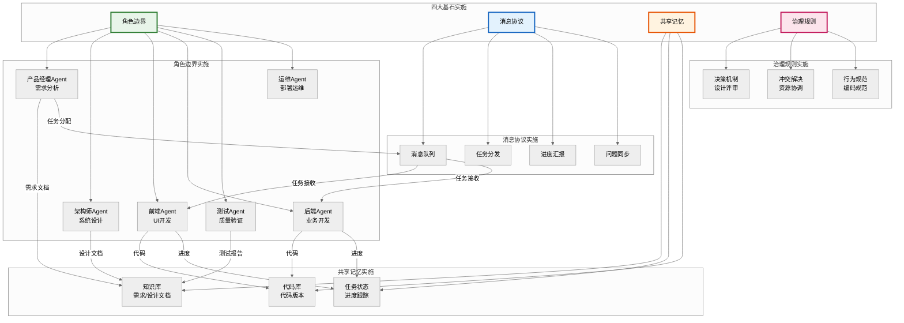

### 5.3 运行流程分析

```python
class SoftwareDevelopmentMAS:
    """软件开发多Agent系统"""
    
    def __init__(self):
        # 初始化四大基石
        self._init_role_boundaries()
        self._init_message_protocol()
        self._init_shared_memory()
        self._init_governance_rules()
    
    def _init_role_boundaries(self):
        """初始化角色边界"""
        self.roles = {
            "product_manager": RoleDefinitionTemplate(
                role_id="PM001",
                role_name="ProductManager",
                role_type="manager",
                core_capabilities={
                    "requirement_analysis": CapabilityLevel.EXPERT,
                    "product_planning": CapabilityLevel.EXPERT,
                },
                primary_responsibilities=[
                    "分析和整理用户需求",
                    "定义产品功能和优先级",
                ],
                limitations=[
                    "不参与技术架构设计",
                    "不直接编写代码",
                ]
            ),
            
            "architect": RoleDefinitionTemplate(
                role_id="AR001",
                role_name="Architect",
                role_type="coordinator",
                core_capabilities={
                    "architecture_design": CapabilityLevel.EXPERT,
                    "technology_selection": CapabilityLevel.EXPERT,
                },
                primary_responsibilities=[
                    "设计系统整体架构",
                    "制定技术规范和标准",
                ],
                limitations=[
                    "不直接编写业务代码",
                ]
            ),
            
            "frontend_dev": RoleDefinitionTemplate(
                role_id="FE001",
                role_name="FrontendDeveloper",
                role_type="worker",
                core_capabilities={
                    "ui_development": CapabilityLevel.EXPERT,
                    "css_styling": CapabilityLevel.EXPERT,
                },
                primary_responsibilities=[
                    "实现用户界面",
                    "优化前端性能",
                ],
                limitations=[
                    "不负责后端业务逻辑",
                ]
            ),
            
            "backend_dev": RoleDefinitionTemplate(
                role_id="BE001",
                role_name="BackendDeveloper",
                role_type="worker",
                core_capabilities={
                    "backend_development": CapabilityLevel.EXPERT,
                    "database_design": CapabilityLevel.EXPERT,
                },
                primary_responsibilities=[
                    "实现后端业务逻辑",
                    "设计和优化数据库",
                ],
                limitations=[
                    "不负责前端界面开发",
                ]
            ),
            
            "qa": RoleDefinitionTemplate(
                role_id="QA001",
                role_name="QA",
                role_type="worker",
                core_capabilities={
                    "test_design": CapabilityLevel.EXPERT,
                    "test_automation": CapabilityLevel.EXPERT,
                },
                primary_responsibilities=[
                    "设计和执行测试用例",
                    "报告和跟踪缺陷",
                ],
                limitations=[
                    "不编写产品代码",
                ]
            ),
        }
    
    def _init_message_protocol(self):
        """初始化消息协议"""
        self.message_system = QueueBasedMessaging()
        
        # 注册Agent
        for role_id in self.roles:
            self.message_system.register_agent(role_id)
    
    def _init_shared_memory(self):
        """初始化共享记忆"""
        self.memory_system = LayeredMemorySystem()
        
        # 初始化共享存储
        self.knowledge_base = SharedStateManager()
        self.task_status = SharedStateManager()
        self.code_repository = SharedStateManager()
    
    def _init_governance_rules(self):
        """初始化治理规则"""
        self.decision_maker = GroupDecisionMaker()
        self.conflict_resolver = ConflictResolutionManager()
        self.norm_manager = BehaviorNormManager()
        
        # 注册冲突解决策略
        self.conflict_resolver.register_strategy(
            ConflictType.RESOURCE,
            NegotiationStrategy()
        )
        self.conflict_resolver.register_strategy(
            ConflictType.PRIORITY,
            VotingStrategy()
        )
    
    async def execute_project(self, project_goal: str) -> dict:
        """执行项目"""
        # 1. 产品经理分析需求
        requirements = await self._analyze_requirements(project_goal)
        
        # 2. 架构师设计系统
        design = await self._design_system(requirements)
        
        # 3. 开发团队实现
        implementation = await self._implement_features(design)
        
        # 4. QA测试验证
        test_results = await self._test_implementation(implementation)
        
        # 5. 部署上线
        deployment = await self._deploy_system(test_results)
        
        return {
            "project_goal": project_goal,
            "requirements": requirements,
            "design": design,
            "implementation": implementation,
            "test_results": test_results,
            "deployment": deployment
        }
    
    async def _analyze_requirements(self, goal: str) -> dict:
        """分析需求"""
        # 产品经理Agent执行
        pm_role = self.roles["product_manager"]
        
        # 存储到共享记忆
        await self.memory_system.store(
            content={"goal": goal, "requirements": {}},
            memory_type=MemoryType.WORKING,
            metadata={"phase": "requirement_analysis"}
        )
        
        return {"status": "completed", "requirements": {}}
    
    async def _design_system(self, requirements: dict) -> dict:
        """设计系统"""
        # 架构师Agent执行
        ar_role = self.roles["architect"]
        
        return {"status": "completed", "design": {}}
    
    async def _implement_features(self, design: dict) -> dict:
        """实现功能"""
        # 前端和后端Agent协作执行
        fe_role = self.roles["frontend_dev"]
        be_role = self.roles["backend_dev"]
        
        return {"status": "completed", "implementation": {}}
    
    async def _test_implementation(self, implementation: dict) -> dict:
        """测试实现"""
        qa_role = self.roles["qa"]
        
        return {"status": "completed", "test_results": {}}
    
    async def _deploy_system(self, test_results: dict) -> dict:
        """部署系统"""
        return {"status": "completed", "deployment": {}}
```

### 5.4 效果评估与优化建议

```python
class SystemEvaluator:
    """系统评估器"""
    
    def __init__(self, mas: SoftwareDevelopmentMAS):
        self.mas = mas
    
    def evaluate_role_boundaries(self) -> dict:
        """评估角色边界效果"""
        monitor = RoleBoundaryMonitor(self.mas.roles)
        overlaps = monitor.detect_role_overlap()
        
        return {
            "role_count": len(self.mas.roles),
            "overlap_count": len(overlaps),
            "overlap_details": overlaps,
            "assessment": "good" if len(overlaps) == 0 else "needs_improvement"
        }
    
    def evaluate_message_protocol(self) -> dict:
        """评估消息协议效果"""
        stats = self.mas.message_system.get_queue_stats()
        
        return {
            "total_queues": len(stats["agent_queues"]) + len(stats["topic_queues"]),
            "dead_letter_count": stats["dead_letter_size"],
            "assessment": "good" if stats["dead_letter_size"] == 0 else "needs_improvement"
        }
    
    def evaluate_shared_memory(self) -> dict:
        """评估共享记忆效果"""
        # 统计记忆使用情况
        working_size = len(self.mas.memory_system.working_memory)
        semantic_size = len(self.mas.memory_system.semantic_memory)
        
        return {
            "working_memory_size": working_size,
            "semantic_memory_size": semantic_size,
            "assessment": "good"
        }
    
    def evaluate_governance_rules(self) -> dict:
        """评估治理规则效果"""
        decision_stats = self.mas.decision_maker.get_decision_statistics()
        conflict_stats = self.mas.conflict_resolver.get_conflict_statistics()
        compliance_report = self.mas.norm_manager.get_compliance_report()
        
        return {
            "decision_stats": decision_stats,
            "conflict_stats": conflict_stats,
            "compliance_rate": compliance_report["compliance_rate"],
            "assessment": "good" if compliance_report["compliance_rate"] > 0.9 else "needs_improvement"
        }
    
    def generate_overall_report(self) -> dict:
        """生成整体评估报告"""
        return {
            "role_boundaries": self.evaluate_role_boundaries(),
            "message_protocol": self.evaluate_message_protocol(),
            "shared_memory": self.evaluate_shared_memory(),
            "governance_rules": self.evaluate_governance_rules(),
            "overall_assessment": self._calculate_overall_assessment(),
            "optimization_suggestions": self._generate_suggestions()
        }
    
    def _calculate_overall_assessment(self) -> str:
        """计算整体评估"""
        evaluations = [
            self.evaluate_role_boundaries()["assessment"],
            self.evaluate_message_protocol()["assessment"],
            self.evaluate_shared_memory()["assessment"],
            self.evaluate_governance_rules()["assessment"]
        ]
        
        good_count = sum(1 for e in evaluations if e == "good")
        
        if good_count == 4:
            return "excellent"
        elif good_count >= 3:
            return "good"
        elif good_count >= 2:
            return "acceptable"
        else:
            return "needs_improvement"
    
    def _generate_suggestions(self) -> List[str]:
        """生成优化建议"""
        suggestions = []
        
        # 角色边界建议
        role_eval = self.evaluate_role_boundaries()
        if role_eval["overlap_count"] > 0:
            suggestions.append("建议优化角色边界，减少能力重叠")
        
        # 消息协议建议
        msg_eval = self.evaluate_message_protocol()
        if msg_eval["dead_letter_count"] > 0:
            suggestions.append("建议检查消息路由配置，减少死信消息")
        
        # 治理规则建议
        gov_eval = self.evaluate_governance_rules()
        if gov_eval["compliance_rate"] < 0.9:
            suggestions.append("建议加强行为规范培训和执行力度")
        
        return suggestions
```

---

## 六、最佳实践与避坑指南

### 角色边界最佳实践

| 实践 | 说明 |
|------|------|
| ✅ 单一职责 | 每个Agent专注于单一核心能力 |
| ✅ 明确边界 | 定义"能做什么"和"不能做什么" |
| ✅ 能力互补 | Agent能力形成互补而非重叠 |
| ✅ 动态调整 | 根据系统演进调整角色边界 |

### 消息协议最佳实践

| 实践 | 说明 |
|------|------|
| ✅ 简洁清晰 | 消息格式简洁但不失完整性 |
| ✅ 版本管理 | 支持协议平滑演进和兼容 |
| ✅ 验证机制 | 确保消息格式正确和内容合法 |
| ✅ 可追溯性 | 保留消息记录便于审计调试 |

### 共享记忆最佳实践

| 实践 | 说明 |
|------|------|
| ✅ 分层存储 | 根据信息特性选择合适的存储层 |
| ✅ 一致性保证 | 使用锁和版本控制保证一致性 |
| ✅ 访问控制 | 实施细粒度的访问权限管理 |
| ✅ 定期清理 | 清理过期和无效的记忆条目 |

### 治理规则最佳实践

| 实践 | 说明 |
|------|------|
| ✅ 决策分层 | 不同层级使用不同的决策机制 |
| ✅ 冲突预案 | 预定义常见冲突的解决方案 |
| ✅ 审计追踪 | 完整记录决策和行为便于追溯 |
| ✅ 持续演进 | 根据实践反馈优化治理规则 |

### 常见问题与避坑

| 问题 | 原因 | 解决方案 |
|------|------|---------|
| 角色边界模糊 | 初期定义不清晰，缺乏持续维护 | 使用标准模板定义，定期审查更新 |
| 消息格式膨胀 | 随意添加字段，缺乏版本管理 | 建立消息Schema注册机制 |
| 共享记忆污染 | 缺乏清理机制，数据无限增长 | 设置TTL，定期清理过期数据 |
| 治理规则僵化 | 规则制定后不再更新 | 建立规则演进机制，定期评审优化 |

---

## 七、总结与展望

### 核心要点回顾

1. **角色边界**：明确"谁做什么"，遵循单一职责和互补性原则
2. **消息协议**：规范"如何交流"，确保简洁、完整、可扩展
3. **共享记忆**：解决"如何共享"，实现信息同步和知识沉淀
4. **治理规则**：约束"如何协作"，建立决策机制和冲突解决策略

### 实施路径建议

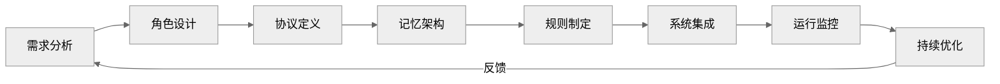

### 未来演进方向

- **自适应角色边界**：Agent根据负载和任务动态调整能力边界
- **智能消息路由**：基于语义的消息路由和内容理解
- **知识图谱集成**：构建更强大的语义记忆和推理能力
- **AI辅助治理**：利用AI技术辅助决策和冲突解决

---

> **结语**：角色边界、消息协议、共享记忆、治理规则四大基石构成了多Agent系统的稳固基础。它们相互依存、缺一不可，共同支撑着复杂多Agent系统的稳定运行和持续演进。在实际项目中，应根据具体场景灵活应用和持续优化，方能发挥最大价值。