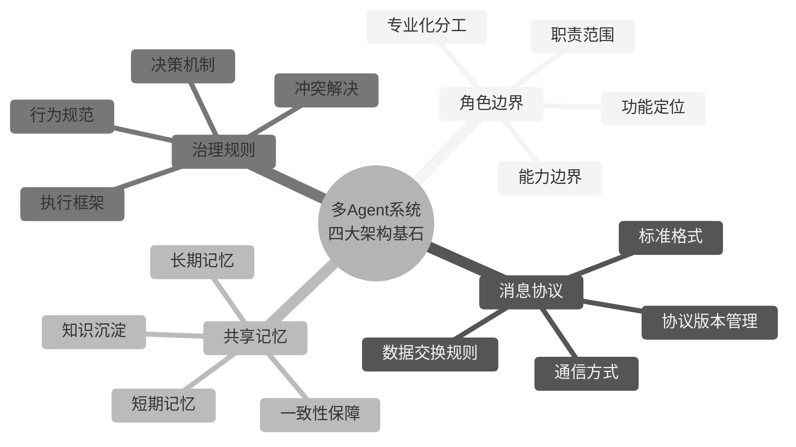
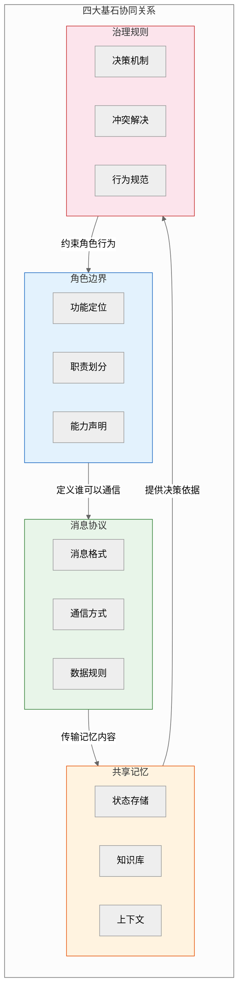
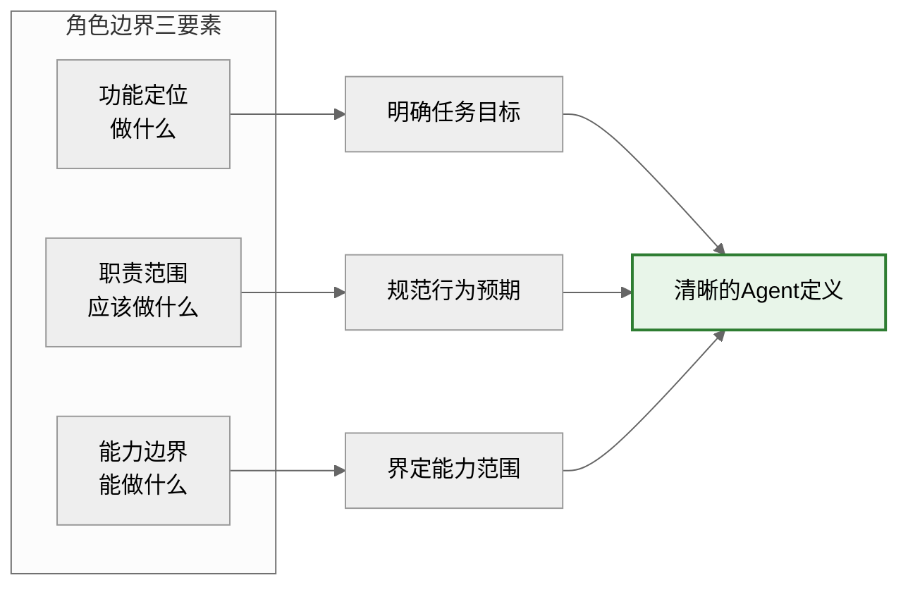
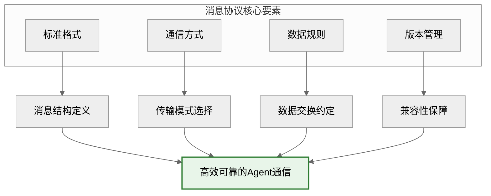
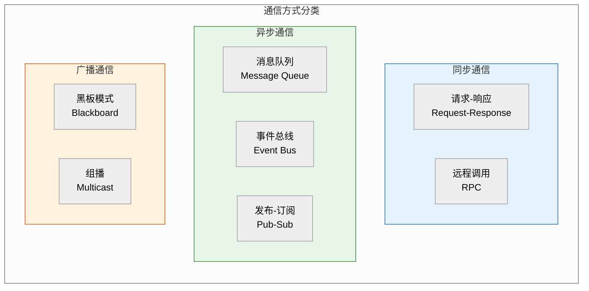
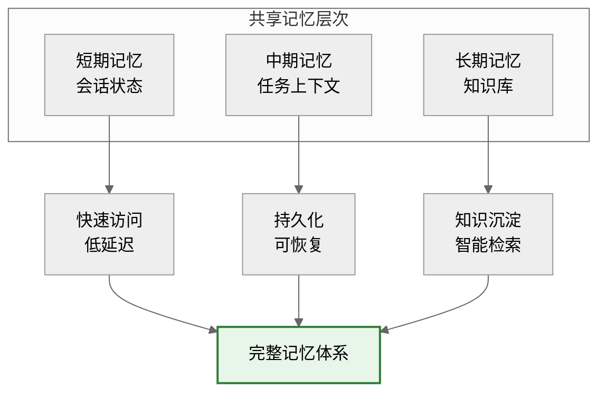

# 多Agent系统四大架构基石详解

> **核心理念**：角色边界、消息协议、共享记忆、治理规则构成多Agent系统的四大架构基石。它们如同建筑的"梁柱结构"，共同支撑起整个系统的稳定性、可扩展性和协作效率。本文档系统阐述四大基石的设计原则、实现方式与最佳实践，为多Agent系统的设计与实现提供理论指导和架构参考。

---

## 目录

- [架构基石总览](#架构基石总览)
- [一、角色边界](#一角色边界)
  - [1.1 定义与核心价值](#11-定义与核心价值)
  - [1.2 角色边界设计原则](#12-角色边界设计原则)
  - [1.3 角色定义框架](#13-角色定义框架)
  - [1.4 能力边界管理](#14-能力边界管理)
  - [1.5 典型角色模式](#15-典型角色模式)
  - [1.6 案例分析](#16-案例分析)
- [二、消息协议](#二消息协议)
  - [2.1 定义与核心价值](#21-定义与核心价值)
  - [2.2 消息标准格式设计](#22-消息标准格式设计)
  - [2.3 通信方式分类](#23-通信方式分类)
  - [2.4 数据交换规则](#24-数据交换规则)
  - [2.5 协议版本管理与兼容性](#25-协议版本管理与兼容性)
  - [2.6 案例分析](#26-案例分析)
- [三、共享记忆](#三共享记忆)
  - [3.1 定义与核心价值](#31-定义与核心价值)
  - [3.2 共享记忆层次架构](#32-共享记忆层次架构)
  - [3.3 短期记忆与会话状态管理](#33-短期记忆与会话状态管理)
  - [3.4 长期记忆与知识沉淀](#34-长期记忆与知识沉淀)
  - [3.5 记忆同步与一致性保障](#35-记忆同步与一致性保障)
  - [3.6 案例分析](#36-案例分析)
- [四、治理规则](#四治理规则)
  - [4.1 定义与核心价值](#41-定义与核心价值)
  - [4.2 决策机制设计](#42-决策机制设计)
  - [4.3 冲突解决策略](#43-冲突解决策略)
  - [4.4 行为规范制定](#44-行为规范制定)
  - [4.5 治理规则执行框架](#45-治理规则执行框架)
  - [4.6 案例分析](#46-案例分析)
- [五、四大基石协同架构](#五四大基石协同架构)
- [六、最佳实践与反模式](#六最佳实践与反模式)
- [七、总结与展望](#七总结与展望)

---

## 架构基石总览





### 四大基石对比总览

| 对比维度 | 角色边界 | 消息协议 | 共享记忆 | 治理规则 |
|---------|---------|---------|---------|---------|
| **核心问题** | 谁做什么？ | 如何交流？ | 记住什么？ | 如何协作？ |
| **解决目标** | 明确分工 | 标准通信 | 知识共享 | 有序协作 |
| **关键产出** | 角色定义文档 | 消息规范 | 记忆系统 | 治理框架 |
| **质量指标** | 职责清晰度 | 协议覆盖率 | 记忆一致性 | 治理有效性 |
| **核心挑战** | 边界模糊 | 协议演进 | 一致性维护 | 规则执行 |
| **典型技术** | 角色建模、能力描述 | 消息格式、通信模式 | 存储、同步机制 | 决策算法、冲突解决 |

---

## 一、角色边界

### 1.1 定义与核心价值

**定义**：角色边界（Role Boundary）是指明确定义每个Agent在系统中的功能定位、职责范围和能力边界的架构要素。它规定了每个Agent"能做什么"、"应该做什么"以及"不能做什么"，是实现专业化分工和高效协作的基础。

**核心价值**：

| 价值维度 | 描述 | 收益 |
|---------|------|------|
| **职责清晰** | 每个Agent有明确的职责范围 | 避免职责重叠和任务遗漏 |
| **能力透明** | 明确声明Agent的能力边界 | 实现精准任务分配 |
| **协作高效** | 基于角色的专业化分工 | 提升整体系统效率 |
| **易于维护** | 角色独立性降低耦合度 | 支持独立演化和替换 |
| **可扩展性** | 角色模板化支持快速扩展 | 新增角色无需重构整体 |



### 1.2 角色边界设计原则

#### 原则一：单一职责原则（SRP）

每个Agent应该只有一个变化的理由，即只负责一类任务。

```python
# ❌ 违反单一职责原则：一个Agent承担多种不相关职责
class MultiPurposeAgent:
    """违反SRP：混合了数据分析、代码生成、邮件发送多种职责"""
    
    def analyze_data(self, data): ...
    def generate_code(self, spec): ...
    def send_email(self, content): ...

# ✅ 遵循单一职责原则：每个Agent专注单一职责
class DataAnalystAgent:
    """数据分析Agent：专注数据分析职责"""
    
    def analyze_data(self, data): ...
    def generate_report(self, analysis): ...

class CodeGeneratorAgent:
    """代码生成Agent：专注代码生成职责"""
    
    def generate_code(self, spec): ...
    def review_code(self, code): ...

class NotificationAgent:
    """通知Agent：专注消息通知职责"""
    
    def send_email(self, content): ...
    def send_notification(self, message): ...
```

#### 原则二：接口隔离原则（ISP）

Agent不应该依赖它不需要的接口，能力边界应该最小化。

```python
from abc import ABC, abstractmethod
from typing import Protocol

# ✅ 接口隔离：定义最小化的能力接口
class DataReader(Protocol):
    """数据读取能力接口"""
    def read_data(self, source: str) -> dict: ...

class DataWriter(Protocol):
    """数据写入能力接口"""
    def write_data(self, data: dict, destination: str) -> bool: ...

class DataAnalyzer(Protocol):
    """数据分析能力接口"""
    def analyze(self, data: dict) -> dict: ...

# Agent按需实现接口
class DataAnalystAgent(DataReader, DataAnalyzer):
    """数据分析Agent：只实现需要的能力接口"""
    
    def read_data(self, source: str) -> dict:
        """读取数据"""
        ...
    
    def analyze(self, data: dict) -> dict:
        """分析数据"""
        ...

class DataStorageAgent(DataReader, DataWriter):
    """数据存储Agent：只实现读写能力"""
    
    def read_data(self, source: str) -> dict:
        """读取数据"""
        ...
    
    def write_data(self, data: dict, destination: str) -> bool:
        """写入数据"""
        ...
```

#### 原则三：依赖倒置原则（DIP）

高层模块不应该依赖低层模块，二者都应该依赖抽象。

```python
from abc import ABC, abstractmethod

# 抽象层：定义角色接口
class ICodeReviewer(ABC):
    """代码审查者接口"""
    
    @abstractmethod
    def review_code(self, code: str) -> dict:
        """审查代码"""
        pass

class ICodeGenerator(ABC):
    """代码生成者接口"""
    
    @abstractmethod
    def generate_code(self, spec: str) -> str:
        """生成代码"""
        pass

# 具体实现：依赖抽象
class SoftwareDevelopmentTeam:
    """软件开发团队：依赖抽象接口而非具体实现"""
    
    def __init__(self, generator: ICodeGenerator, reviewer: ICodeReviewer):
        self.generator = generator
        self.reviewer = reviewer
    
    def develop_feature(self, spec: str) -> dict:
        """开发功能"""
        # 生成代码
        code = self.generator.generate_code(spec)
        
        # 审查代码
        review = self.reviewer.review_code(code)
        
        return {
            "code": code,
            "review": review,
            "approved": review.get("approved", False)
        }
```

#### 原则四：边界明确原则

角色之间的边界应该清晰、无歧义、可验证。

```python
from dataclasses import dataclass
from typing import Set, List, Optional
from enum import Enum

class Capability(Enum):
    """能力枚举"""
    DATA_READ = "data_read"
    DATA_WRITE = "data_write"
    DATA_ANALYZE = "data_analyze"
    CODE_GENERATE = "code_generate"
    CODE_REVIEW = "code_review"
    TEST_EXECUTE = "test_execute"
    REPORT_GENERATE = "report_generate"

@dataclass
class RoleBoundary:
    """角色边界定义"""
    role_id: str
    role_name: str
    description: str
    capabilities: Set[Capability]  # 能力边界
    responsibilities: List[str]    # 职责列表
    constraints: List[str]         # 约束条件
    dependencies: Set[str]         # 依赖的其他角色
    
    def can_perform(self, capability: Capability) -> bool:
        """检查是否具备某项能力"""
        return capability in self.capabilities
    
    def is_responsible_for(self, task_type: str) -> bool:
        """检查是否对某类任务负责"""
        return task_type in self.responsibilities
    
    def validate_boundary(self) -> List[str]:
        """验证边界定义的完整性和一致性"""
        issues = []
        
        # 检查能力与职责的一致性
        for resp in self.responsibilities:
            required_caps = self._get_required_capabilities(resp)
            missing = required_caps - self.capabilities
            if missing:
                issues.append(f"职责 '{resp}' 缺少能力: {missing}")
        
        return issues
    
    def _get_required_capabilities(self, responsibility: str) -> Set[Capability]:
        """获取职责所需的能力"""
        # 职责到能力的映射
        mapping = {
            "data_analysis": {Capability.DATA_READ, Capability.DATA_ANALYZE},
            "code_development": {Capability.CODE_GENERATE, Capability.CODE_REVIEW},
            "testing": {Capability.TEST_EXECUTE},
            "reporting": {Capability.REPORT_GENERATE, Capability.DATA_READ},
        }
        return mapping.get(responsibility, set())


# 使用示例：定义数据分析角色
data_analyst_boundary = RoleBoundary(
    role_id="data_analyst_001",
    role_name="Data Analyst",
    description="负责数据分析和报告生成的Agent",
    capabilities={
        Capability.DATA_READ,
        Capability.DATA_ANALYZE,
        Capability.REPORT_GENERATE
    },
    responsibilities=["data_analysis", "reporting"],
    constraints=["不能修改原始数据", "分析结果需标注置信度"],
    dependencies={"data_provider"}
)

# 验证边界
issues = data_analyst_boundary.validate_boundary()
```

### 1.3 角色定义框架

#### 角色定义模板

```yaml
# 角色定义模板
role_definition:
  # 基础信息
  id: "unique_role_id"
  name: "Human Readable Name"
  version: "1.0.0"
  description: "角色的详细描述"
  
  # 功能定位
  purpose:
    primary_goal: "主要目标"
    value_proposition: "价值主张"
    stakeholders: ["受益方列表"]
  
  # 职责范围
  responsibilities:
    - name: "职责名称"
      description: "职责描述"
      priority: "high|medium|low"
      triggers: ["触发条件"]
      outputs: ["输出产物"]
  
  # 能力边界
  capabilities:
    required:
      - capability_id: "cap_001"
        name: "能力名称"
        proficiency: "expert|intermediate|basic"
    optional:
      - capability_id: "cap_002"
        name: "可选能力"
  
  # 约束条件
  constraints:
    hard_limits:
      - "不可逾越的硬性约束"
    soft_limits:
      - "可协商的软性约束"
    performance_sla:
      response_time: "< 2s"
      accuracy: "> 95%"
  
  # 依赖关系
  dependencies:
    upstream_roles: ["前置依赖角色"]
    downstream_roles: ["后继依赖角色"]
    shared_resources: ["共享资源"]
  
  # 元数据
  metadata:
    author: "定义者"
    created_at: "2024-01-01"
    last_updated: "2024-01-01"
    tags: ["标签"]
```

#### 角色注册表设计

```python
from typing import Dict, List, Optional
from dataclasses import dataclass, field
import json

@dataclass
class RoleDefinition:
    """角色定义数据结构"""
    id: str
    name: str
    version: str
    description: str
    purpose: Dict
    responsibilities: List[Dict]
    capabilities: Dict
    constraints: Dict
    dependencies: Dict
    metadata: Dict = field(default_factory=dict)

class RoleRegistry:
    """角色注册表：管理所有角色定义"""
    
    def __init__(self):
        self.roles: Dict[str, RoleDefinition] = {}
        self.capability_index: Dict[str, List[str]] = {}  # 能力到角色的索引
        self.responsibility_index: Dict[str, List[str]] = {}  # 职责到角色的索引
    
    def register_role(self, role: RoleDefinition) -> bool:
        """注册角色"""
        if role.id in self.roles:
            return False  # 角色已存在
        
        self.roles[role.id] = role
        
        # 更新能力索引
        for cap in role.capabilities.get("required", []):
            cap_id = cap.get("capability_id", "")
            if cap_id not in self.capability_index:
                self.capability_index[cap_id] = []
            self.capability_index[cap_id].append(role.id)
        
        # 更新职责索引
        for resp in role.responsibilities:
            resp_name = resp.get("name", "")
            if resp_name not in self.responsibility_index:
                self.responsibility_index[resp_name] = []
            self.responsibility_index[resp_name].append(role.id)
        
        return True
    
    def find_role_by_capability(self, capability_id: str) -> List[RoleDefinition]:
        """根据能力查找角色"""
        role_ids = self.capability_index.get(capability_id, [])
        return [self.roles[rid] for rid in role_ids if rid in self.roles]
    
    def find_role_by_responsibility(self, responsibility: str) -> List[RoleDefinition]:
        """根据职责查找角色"""
        role_ids = self.responsibility_index.get(responsibility, [])
        return [self.roles[rid] for rid in role_ids if rid in self.roles]
    
    def get_role(self, role_id: str) -> Optional[RoleDefinition]:
        """获取角色定义"""
        return self.roles.get(role_id)
    
    def list_roles(self) -> List[RoleDefinition]:
        """列出所有角色"""
        return list(self.roles.values())
    
    def validate_role_dependencies(self, role_id: str) -> Dict:
        """验证角色依赖关系"""
        role = self.roles.get(role_id)
        if not role:
            return {"valid": False, "error": "Role not found"}
        
        issues = []
        
        # 检查上游依赖
        for dep_role_id in role.dependencies.get("upstream_roles", []):
            if dep_role_id not in self.roles:
                issues.append(f"Missing upstream dependency: {dep_role_id}")
        
        # 检查能力完整性
        for resp in role.responsibilities:
            required_caps = self._infer_required_capabilities(resp)
            declared_caps = {c["capability_id"] for c in role.capabilities.get("required", [])}
            missing = required_caps - declared_caps
            if missing:
                issues.append(f"Responsibility '{resp['name']}' missing capabilities: {missing}")
        
        return {
            "valid": len(issues) == 0,
            "issues": issues
        }
    
    def export_roles(self, format: str = "json") -> str:
        """导出角色定义"""
        roles_data = {
            rid: {
                "id": r.id,
                "name": r.name,
                "version": r.version,
                "description": r.description,
                "purpose": r.purpose,
                "responsibilities": r.responsibilities,
                "capabilities": r.capabilities,
                "constraints": r.constraints,
                "dependencies": r.dependencies,
                "metadata": r.metadata
            }
            for rid, r in self.roles.items()
        }
        
        if format == "json":
            return json.dumps(roles_data, indent=2)
        else:
            raise ValueError(f"Unsupported format: {format}")
    
    def _infer_required_capabilities(self, responsibility: Dict) -> set:
        """推断职责所需能力"""
        # 简化的映射关系
        mapping = {
            "data_analysis": {"data_read", "data_analyze"},
            "code_development": {"code_generate", "code_review"},
            "testing": {"test_execute"},
            "reporting": {"report_generate", "data_read"},
        }
        return mapping.get(responsibility.get("name", ""), set())


# 使用示例
registry = RoleRegistry()

# 注册数据分析角色
data_analyst = RoleDefinition(
    id="data_analyst",
    name="Data Analyst",
    version="1.0.0",
    description="负责数据分析与报告生成",
    purpose={
        "primary_goal": "提供数据洞察",
        "value_proposition": "将数据转化为决策依据"
    },
    responsibilities=[
        {"name": "data_analysis", "description": "分析数据", "priority": "high"},
        {"name": "reporting", "description": "生成报告", "priority": "medium"}
    ],
    capabilities={
        "required": [
            {"capability_id": "data_read", "name": "数据读取", "proficiency": "expert"},
            {"capability_id": "data_analyze", "name": "数据分析", "proficiency": "expert"}
        ]
    },
    constraints={
        "hard_limits": ["不能修改原始数据"],
        "performance_sla": {"response_time": "< 5s"}
    },
    dependencies={
        "upstream_roles": ["data_provider"],
        "shared_resources": ["data_warehouse"]
    }
)

registry.register_role(data_analyst)
```

### 1.4 能力边界管理

#### 能力声明机制

```python
from dataclasses import dataclass
from typing import Dict, List, Optional
from enum import Enum
import time

class ProficiencyLevel(Enum):
    """能力熟练度等级"""
    EXPERT = "expert"      # 专家级：可独立处理复杂场景
    INTERMEDIATE = "intermediate"  # 中级：可处理常规场景
    BASIC = "basic"        # 基础级：可处理简单场景
    LEARNING = "learning"  # 学习级：需要指导

@dataclass
class CapabilityDeclaration:
    """能力声明"""
    capability_id: str
    name: str
    description: str
    proficiency: ProficiencyLevel
    constraints: Dict  # 能力约束
    performance_metrics: Dict  # 性能指标
    last_validated: float  # 最后验证时间
    
    def can_handle(self, task_complexity: str) -> bool:
        """判断是否能处理指定复杂度的任务"""
        complexity_mapping = {
            "simple": [ProficiencyLevel.BASIC, ProficiencyLevel.INTERMEDIATE, ProficiencyLevel.EXPERT],
            "moderate": [ProficiencyLevel.INTERMEDIATE, ProficiencyLevel.EXPERT],
            "complex": [ProficiencyLevel.EXPERT]
        }
        return self.proficiency in complexity_mapping.get(task_complexity, [])

@dataclass
class CapabilityBoundary:
    """能力边界"""
    agent_id: str
    declared_capabilities: Dict[str, CapabilityDeclaration]
    soft_limits: Dict[str, any]  # 软限制（可协商）
    hard_limits: Dict[str, any]  # 硬限制（不可逾越）
    
    def check_capability(self, capability_id: str, task_requirements: Dict) -> Dict:
        """检查能力是否满足任务要求"""
        if capability_id not in self.declared_capabilities:
            return {
                "satisfied": False,
                "reason": f"Capability '{capability_id}' not declared"
            }
        
        cap = self.declared_capabilities[capability_id]
        
        # 检查熟练度
        task_complexity = task_requirements.get("complexity", "moderate")
        if not cap.can_handle(task_complexity):
            return {
                "satisfied": False,
                "reason": f"Proficiency '{cap.proficiency.value}' insufficient for '{task_complexity}' task"
            }
        
        # 检查硬限制
        for limit_name, limit_value in self.hard_limits.items():
            if task_requirements.get(limit_name) and task_requirements[limit_name] > limit_value:
                return {
                    "satisfied": False,
                    "reason": f"Task exceeds hard limit: {limit_name}"
                }
        
        return {
            "satisfied": True,
            "capability": cap,
            "warnings": self._check_soft_limits(task_requirements)
        }
    
    def _check_soft_limits(self, task_requirements: Dict) -> List[str]:
        """检查软限制"""
        warnings = []
        for limit_name, limit_value in self.soft_limits.items():
            if task_requirements.get(limit_name) and task_requirements[limit_name] > limit_value:
                warnings.append(f"Task approaches soft limit: {limit_name}")
        return warnings

class CapabilityManager:
    """能力管理器"""
    
    def __init__(self):
        self.agent_capabilities: Dict[str, CapabilityBoundary] = {}
    
    def register_agent_capabilities(self, agent_id: str, boundary: CapabilityBoundary):
        """注册Agent能力边界"""
        self.agent_capabilities[agent_id] = boundary
    
    def find_capable_agents(self, capability_id: str, 
                            task_requirements: Dict) -> List[Dict]:
        """查找具备指定能力的Agent"""
        capable_agents = []
        
        for agent_id, boundary in self.agent_capabilities.items():
            check_result = boundary.check_capability(capability_id, task_requirements)
            if check_result["satisfied"]:
                capable_agents.append({
                    "agent_id": agent_id,
                    "capability": check_result["capability"],
                    "warnings": check_result.get("warnings", [])
                })
        
        # 按熟练度排序
        proficiency_order = {
            ProficiencyLevel.EXPERT: 3,
            ProficiencyLevel.INTERMEDIATE: 2,
            ProficiencyLevel.BASIC: 1,
            ProficiencyLevel.LEARNING: 0
        }
        capable_agents.sort(
            key=lambda x: proficiency_order.get(x["capability"].proficiency, 0),
            reverse=True
        )
        
        return capable_agents
    
    def validate_capability_declarations(self) -> Dict[str, List[str]]:
        """验证所有Agent的能力声明"""
        validation_results = {}
        
        for agent_id, boundary in self.agent_capabilities.items():
            issues = []
            
            # 检查能力声明的时效性
            current_time = time.time()
            for cap_id, cap_decl in boundary.declared_capabilities.items():
                if current_time - cap_decl.last_validated > 86400 * 30:  # 30天
                    issues.append(f"Capability '{cap_id}' not validated recently")
            
            # 检查能力之间的依赖关系
            # ...（省略具体实现）
            
            if issues:
                validation_results[agent_id] = issues
        
        return validation_results
```

### 1.5 典型角色模式

#### 模式一：专家型角色

专注于单一领域的深度专业化角色。

```python
@dataclass
class ExpertRole:
    """专家型角色模板"""
    role_name: str
    expertise_domain: str  # 专业领域
    skill_depth: str  # 技能深度：deep/moderate/shallow
    tools: List[str]  # 专业工具
    knowledge_areas: List[str]  # 知识领域
    
    def get_role_definition(self) -> RoleDefinition:
        """生成角色定义"""
        return RoleDefinition(
            id=f"expert_{self.role_name.lower().replace(' ', '_')}",
            name=self.role_name,
            version="1.0.0",
            description=f"{self.expertise_domain}领域的专家Agent",
            purpose={
                "primary_goal": f"提供{self.expertise_domain}领域的专业服务",
                "value_proposition": "深度专业知识支持"
            },
            responsibilities=[
                {"name": f"{self.expertise_domain}_analysis", "priority": "high"},
                {"name": f"{self.expertise_domain}_consultation", "priority": "high"}
            ],
            capabilities={
                "required": [
                    {"capability_id": skill.lower().replace(' ', '_'), "proficiency": "expert"}
                    for skill in self.knowledge_areas
                ]
            },
            constraints={
                "hard_limits": [f"仅处理{self.expertise_domain}领域问题"]
            },
            dependencies={}
        )

# 示例：代码安全专家
security_expert = ExpertRole(
    role_name="Code Security Expert",
    expertise_domain="代码安全",
    skill_depth="deep",
    tools=["static_analysis", "vulnerability_scanner"],
    knowledge_areas=["代码审计", "漏洞检测", "安全编码规范"]
)
```

#### 模式二：协调型角色

负责多Agent协作的组织和协调。

```python
@dataclass
class CoordinatorRole:
    """协调型角色模板"""
    role_name: str
    coordination_scope: str  # 协调范围
    managed_roles: List[str]  # 管理的角色
    decision_authority: str  # 决策权限
    
    def get_role_definition(self) -> RoleDefinition:
        return RoleDefinition(
            id=f"coordinator_{self.role_name.lower().replace(' ', '_')}",
            name=self.role_name,
            version="1.0.0",
            description=f"负责{self.coordination_scope}的协调Agent",
            purpose={
                "primary_goal": "协调多Agent协作",
                "value_proposition": "提升协作效率"
            },
            responsibilities=[
                {"name": "task_allocation", "priority": "high"},
                {"name": "conflict_resolution", "priority": "high"},
                {"name": "progress_monitoring", "priority": "medium"}
            ],
            capabilities={
                "required": [
                    {"capability_id": "task_decomposition", "proficiency": "expert"},
                    {"capability_id": "resource_allocation", "proficiency": "intermediate"},
                    {"capability_id": "decision_making", "proficiency": "expert"}
                ]
            },
            constraints={
                "hard_limits": ["不直接执行具体任务"],
                "soft_limits": [f"协调范围限制在{self.coordination_scope}"]
            },
            dependencies={
                "managed_roles": self.managed_roles
            }
        )
```

#### 模式三：执行型角色

专注于具体任务的执行。

```python
@dataclass
class ExecutorRole:
    """执行型角色模板"""
    role_name: str
    task_types: List[str]  # 可执行的任务类型
    execution_modes: List[str]  # 执行模式
    
    def get_role_definition(self) -> RoleDefinition:
        return RoleDefinition(
            id=f"executor_{self.role_name.lower().replace(' ', '_')}",
            name=self.role_name,
            version="1.0.0",
            description=f"负责执行{', '.join(self.task_types)}任务的Agent",
            purpose={
                "primary_goal": "高效执行分配的任务",
                "value_proposition": "保证任务完成质量"
            },
            responsibilities=[
                {"name": task_type, "priority": "high"}
                for task_type in self.task_types
            ],
            capabilities={
                "required": [
                    {"capability_id": f"execute_{tt}", "proficiency": "intermediate"}
                    for tt in self.task_types
                ]
            },
            constraints={
                "hard_limits": ["按指令执行", "不自主修改任务目标"]
            },
            dependencies={}
        )
```

### 1.6 案例分析

#### 案例：软件开发团队的Agent角色边界设计

```python
class SoftwareDevelopmentTeamRoles:
    """软件开发团队角色边界设计"""
    
    @staticmethod
    def create_product_manager() -> RoleDefinition:
        """产品经理Agent"""
        return RoleDefinition(
            id="product_manager",
            name="Product Manager",
            version="1.0.0",
            description="负责需求分析、产品规划的Agent",
            purpose={
                "primary_goal": "明确产品需求",
                "value_proposition": "将业务需求转化为技术规格"
            },
            responsibilities=[
                {"name": "requirement_analysis", "description": "分析业务需求", "priority": "high"},
                {"name": "feature_planning", "description": "功能规划", "priority": "high"},
                {"name": "priority_setting", "description": "优先级设定", "priority": "medium"}
            ],
            capabilities={
                "required": [
                    {"capability_id": "requirement_analysis", "proficiency": "expert"},
                    {"capability_id": "stakeholder_communication", "proficiency": "intermediate"}
                ]
            },
            constraints={
                "hard_limits": ["不参与代码实现", "不直接修改架构设计"],
                "soft_limits": ["需求变更需经过评审"]
            },
            dependencies={
                "downstream_roles": ["architect", "developer"]
            }
        )
    
    @staticmethod
    def create_architect() -> RoleDefinition:
        """架构师Agent"""
        return RoleDefinition(
            id="architect",
            name="System Architect",
            version="1.0.0",
            description="负责系统架构设计的Agent",
            purpose={
                "primary_goal": "设计系统架构",
                "value_proposition": "确保系统可扩展性和稳定性"
            },
            responsibilities=[
                {"name": "architecture_design", "description": "架构设计", "priority": "high"},
                {"name": "technology_selection", "description": "技术选型", "priority": "high"},
                {"name": "design_review", "description": "设计评审", "priority": "medium"}
            ],
            capabilities={
                "required": [
                    {"capability_id": "architecture_design", "proficiency": "expert"},
                    {"capability_id": "technology_evaluation", "proficiency": "expert"},
                    {"capability_id": "performance_optimization", "proficiency": "intermediate"}
                ]
            },
            constraints={
                "hard_limits": ["不直接编写业务代码"],
                "soft_limits": ["架构变更需团队共识"]
            },
            dependencies={
                "upstream_roles": ["product_manager"],
                "downstream_roles": ["developer", "tester"]
            }
        )
    
    @staticmethod
    def create_developer() -> RoleDefinition:
        """开发工程师Agent"""
        return RoleDefinition(
            id="developer",
            name="Software Developer",
            version="1.0.0",
            description="负责代码实现的Agent",
            purpose={
                "primary_goal": "实现功能代码",
                "value_proposition": "高质量代码交付"
            },
            responsibilities=[
                {"name": "code_implementation", "description": "代码实现", "priority": "high"},
                {"name": "code_review", "description": "代码审查", "priority": "high"},
                {"name": "bug_fixing", "description": "缺陷修复", "priority": "high"}
            ],
            capabilities={
                "required": [
                    {"capability_id": "code_generation", "proficiency": "expert"},
                    {"capability_id": "code_review", "proficiency": "intermediate"},
                    {"capability_id": "unit_testing", "proficiency": "intermediate"}
                ]
            },
            constraints={
                "hard_limits": ["遵循架构设计", "通过代码审查才能合并"],
                "soft_limits": ["优先处理高优先级任务"]
            },
            dependencies={
                "upstream_roles": ["architect", "product_manager"]
            }
        )
    
    @staticmethod
    def create_tester() -> RoleDefinition:
        """测试工程师Agent"""
        return RoleDefinition(
            id="tester",
            name="Quality Assurance",
            version="1.0.0",
            description="负责质量保障的Agent",
            purpose={
                "primary_goal": "确保软件质量",
                "value_proposition": "发现和预防缺陷"
            },
            responsibilities=[
                {"name": "test_design", "description": "测试设计", "priority": "high"},
                {"name": "test_execution", "description": "测试执行", "priority": "high"},
                {"name": "bug_reporting", "description": "缺陷报告", "priority": "high"}
            ],
            capabilities={
                "required": [
                    {"capability_id": "test_case_design", "proficiency": "expert"},
                    {"capability_id": "test_automation", "proficiency": "intermediate"},
                    {"capability_id": "defect_tracking", "proficiency": "intermediate"}
                ]
            },
            constraints={
                "hard_limits": ["不修改代码", "独立于开发团队"],
                "soft_limits": ["测试覆盖率目标 > 80%"]
            },
            dependencies={
                "upstream_roles": ["developer"]
            }
        )

# 注册团队角色
team_registry = RoleRegistry()
team_registry.register_role(SoftwareDevelopmentTeamRoles.create_product_manager())
team_registry.register_role(SoftwareDevelopmentTeamRoles.create_architect())
team_registry.register_role(SoftwareDevelopmentTeamRoles.create_developer())
team_registry.register_role(SoftwareDevelopmentTeamRoles.create_tester())

# 验证角色依赖
for role_id in ["product_manager", "architect", "developer", "tester"]:
    validation = team_registry.validate_role_dependencies(role_id)
    print(f"{role_id}: {validation}")
```

---

## 二、消息协议

### 2.1 定义与核心价值

**定义**：消息协议（Message Protocol）是指定义Agent之间信息交互的标准格式、通信方式和数据交换规则的架构要素。它规定了消息的结构、字段含义、传输方式、错误处理等内容，是实现Agent间有效通信的基础。

**核心价值**：

| 价值维度 | 描述 | 收益 |
|---------|------|------|
| **标准化通信** | 统一消息格式和交互流程 | 降低通信复杂度 |
| **互操作性** | 不同Agent可以无缝对接 | 支持异构系统集成 |
| **可扩展性** | 协议支持版本演进 | 适应需求变化 |
| **可追溯性** | 消息可记录和审计 | 支持调试和监控 |
| **健壮性** | 明确的错误处理机制 | 提升系统稳定性 |



### 2.2 消息标准格式设计

#### 基础消息结构

```python
from dataclasses import dataclass, field
from typing import Any, Optional, Dict, List
from datetime import datetime
from enum import Enum
import uuid
import json

class MessageType(Enum):
    """消息类型枚举"""
    REQUEST = "request"       # 请求消息
    RESPONSE = "response"     # 响应消息
    NOTIFICATION = "notification"  # 通知消息
    ERROR = "error"           # 错误消息
    HEARTBEAT = "heartbeat"   # 心跳消息
    ACK = "ack"               # 确认消息

class MessagePriority(Enum):
    """消息优先级"""
    CRITICAL = 1   # 最高优先级
    HIGH = 2
    NORMAL = 3
    LOW = 4
    BACKGROUND = 5

@dataclass
class AgentMessage:
    """Agent间标准消息结构"""
    
    # === 必需字段 ===
    message_id: str                    # 消息唯一标识
    message_type: MessageType          # 消息类型
    sender_id: str                     # 发送者ID
    receiver_id: str                   # 接收者ID
    timestamp: datetime                # 时间戳
    content: Any                       # 消息内容
    
    # === 可选字段 ===
    correlation_id: Optional[str] = None  # 关联ID（用于请求-响应匹配）
    priority: MessagePriority = MessagePriority.NORMAL  # 优先级
    ttl: Optional[int] = None           # 生存时间（秒）
    metadata: Dict = field(default_factory=dict)  # 元数据
    headers: Dict = field(default_factory=dict)    # 头部信息
    
    @classmethod
    def create_request(cls, sender_id: str, receiver_id: str, 
                       content: Any, **kwargs) -> 'AgentMessage':
        """创建请求消息"""
        return cls(
            message_id=str(uuid.uuid4()),
            message_type=MessageType.REQUEST,
            sender_id=sender_id,
            receiver_id=receiver_id,
            timestamp=datetime.now(),
            content=content,
            **kwargs
        )
    
    @classmethod
    def create_response(cls, request: 'AgentMessage', 
                        content: Any, **kwargs) -> 'AgentMessage':
        """创建响应消息"""
        return cls(
            message_id=str(uuid.uuid4()),
            message_type=MessageType.RESPONSE,
            sender_id=request.receiver_id,
            receiver_id=request.sender_id,
            timestamp=datetime.now(),
            content=content,
            correlation_id=request.message_id,
            **kwargs
        )
    
    @classmethod
    def create_notification(cls, sender_id: str, receiver_id: str,
                            content: Any, **kwargs) -> 'AgentMessage':
        """创建通知消息"""
        return cls(
            message_id=str(uuid.uuid4()),
            message_type=MessageType.NOTIFICATION,
            sender_id=sender_id,
            receiver_id=receiver_id,
            timestamp=datetime.now(),
            content=content,
            **kwargs
        )
    
    @classmethod
    def create_error(cls, original_message: 'AgentMessage',
                     error_code: str, error_message: str, **kwargs) -> 'AgentMessage':
        """创建错误消息"""
        return cls(
            message_id=str(uuid.uuid4()),
            message_type=MessageType.ERROR,
            sender_id=original_message.receiver_id,
            receiver_id=original_message.sender_id,
            timestamp=datetime.now(),
            content={
                "error_code": error_code,
                "error_message": error_message,
                "original_message_id": original_message.message_id
            },
            correlation_id=original_message.message_id,
            **kwargs
        )
    
    def to_dict(self) -> Dict:
        """转换为字典"""
        return {
            "message_id": self.message_id,
            "message_type": self.message_type.value,
            "sender_id": self.sender_id,
            "receiver_id": self.receiver_id,
            "timestamp": self.timestamp.isoformat(),
            "content": self.content,
            "correlation_id": self.correlation_id,
            "priority": self.priority.value,
            "ttl": self.ttl,
            "metadata": self.metadata,
            "headers": self.headers
        }
    
    def to_json(self) -> str:
        """转换为JSON字符串"""
        return json.dumps(self.to_dict(), ensure_ascii=False)
    
    @classmethod
    def from_dict(cls, data: Dict) -> 'AgentMessage':
        """从字典创建"""
        return cls(
            message_id=data["message_id"],
            message_type=MessageType(data["message_type"]),
            sender_id=data["sender_id"],
            receiver_id=data["receiver_id"],
            timestamp=datetime.fromisoformat(data["timestamp"]),
            content=data["content"],
            correlation_id=data.get("correlation_id"),
            priority=MessagePriority(data.get("priority", 3)),
            ttl=data.get("ttl"),
            metadata=data.get("metadata", {}),
            headers=data.get("headers", {})
        )
    
    def is_expired(self) -> bool:
        """检查消息是否过期"""
        if self.ttl is None:
            return False
        elapsed = (datetime.now() - self.timestamp).total_seconds()
        return elapsed > self.ttl
```

#### 任务消息格式

```python
@dataclass
class TaskPayload:
    """任务消息载荷"""
    task_id: str                      # 任务ID
    task_type: str                    # 任务类型
    task_name: str                    # 任务名称
    description: str                  # 任务描述
    parameters: Dict                  # 任务参数
    context: Dict = field(default_factory=dict)  # 上下文信息
    constraints: Dict = field(default_factory=dict)  # 约束条件
    expected_output: Optional[Dict] = None  # 预期输出格式
    
    def to_dict(self) -> Dict:
        return {
            "task_id": self.task_id,
            "task_type": self.task_type,
            "task_name": self.task_name,
            "description": self.description,
            "parameters": self.parameters,
            "context": self.context,
            "constraints": self.constraints,
            "expected_output": self.expected_output
        }

@dataclass
class TaskResult:
    """任务结果载荷"""
    task_id: str                      # 关联的任务ID
    status: str                       # 状态: success/failed/partial
    output: Any                       # 输出结果
    metrics: Dict = field(default_factory=dict)  # 执行指标
    warnings: List[str] = field(default_factory=list)  # 警告信息
    error: Optional[Dict] = None      # 错误信息
    
    def to_dict(self) -> Dict:
        return {
            "task_id": self.task_id,
            "status": self.status,
            "output": self.output,
            "metrics": self.metrics,
            "warnings": self.warnings,
            "error": self.error
        }
```

#### 查询消息格式

```python
@dataclass
class QueryPayload:
    """查询消息载荷"""
    query_id: str                     # 查询ID
    query_type: str                   # 查询类型: status/data/capability
    query_target: str                 # 查询目标
    query_params: Dict                # 查询参数
    filters: Dict = field(default_factory=dict)  # 过滤条件
    pagination: Optional[Dict] = None  # 分页参数
    
    def to_dict(self) -> Dict:
        return {
            "query_id": self.query_id,
            "query_type": self.query_type,
            "query_target": self.query_target,
            "query_params": self.query_params,
            "filters": self.filters,
            "pagination": self.pagination
        }

@dataclass
class QueryResult:
    """查询结果载荷"""
    query_id: str                     # 关联的查询ID
    result_type: str                  # 结果类型
    data: Any                         # 查询数据
    total_count: Optional[int] = None  # 总数
    metadata: Dict = field(default_factory=dict)  # 元数据
    
    def to_dict(self) -> Dict:
        return {
            "query_id": self.query_id,
            "result_type": self.result_type,
            "data": self.data,
            "total_count": self.total_count,
            "metadata": self.metadata
        }
```

### 2.3 通信方式分类

#### 通信方式对比



| 通信方式 | 适用场景 | 特点 | 实现复杂度 |
|---------|---------|------|-----------|
| **请求-响应** | 简单查询、任务执行 | 同步、直接、可靠 | 低 |
| **消息队列** | 异步任务、解耦通信 | 异步、可靠、可持久化 | 中 |
| **事件总线** | 状态变化通知、事件驱动 | 松耦合、多对多 | 中 |
| **黑板模式** | 知识共享、协作求解 | 共享状态、间接通信 | 中 |
| **发布-订阅** | 大规模系统、实时通知 | 极松耦合、可扩展 | 高 |

#### 请求-响应模式实现

```python
import asyncio
from typing import Dict, Callable, Optional
from dataclasses import dataclass
import time

@dataclass
class PendingRequest:
    """待响应的请求"""
    message: AgentMessage
    future: asyncio.Future
    sent_time: float

class RequestResponseChannel:
    """请求-响应通道"""
    
    def __init__(self):
        self.pending_requests: Dict[str, PendingRequest] = {}
        self.response_handlers: Dict[str, Callable] = {}
        self.default_timeout = 30.0
    
    async def send_request(self, request: AgentMessage, 
                           timeout: float = None) -> AgentMessage:
        """发送请求并等待响应"""
        timeout = timeout or self.default_timeout
        
        # 创建Future用于等待响应
        future = asyncio.get_event_loop().create_future()
        
        # 注册待响应请求
        self.pending_requests[request.message_id] = PendingRequest(
            message=request,
            future=future,
            sent_time=time.time()
        )
        
        # 实际发送消息（由具体传输层实现）
        await self._send_message(request)
        
        try:
            # 等待响应
            response = await asyncio.wait_for(future, timeout)
            return response
        except asyncio.TimeoutError:
            # 超时处理
            del self.pending_requests[request.message_id]
            raise TimeoutError(f"Request {request.message_id} timed out")
    
    async def handle_response(self, response: AgentMessage):
        """处理响应消息"""
        correlation_id = response.correlation_id
        
        if correlation_id in self.pending_requests:
            pending = self.pending_requests[correlation_id]
            
            # 设置响应结果
            pending.future.set_result(response)
            
            # 清理
            del self.pending_requests[correlation_id]
    
    async def _send_message(self, message: AgentMessage):
        """发送消息（由子类实现具体传输）"""
        raise NotImplementedError


class AsyncRequestResponseChannel(RequestResponseChannel):
    """异步请求-响应通道"""
    
    def __init__(self, transport_layer):
        super().__init__()
        self.transport = transport_layer
    
    async def _send_message(self, message: AgentMessage):
        """通过传输层发送消息"""
        await self.transport.send(message.to_json())
    
    async def listen_for_responses(self):
        """监听响应"""
        while True:
            message_json = await self.transport.receive()
            message = AgentMessage.from_dict(json.loads(message_json))
            
            if message.message_type == MessageType.RESPONSE:
                await self.handle_response(message)
```

#### 消息队列模式实现

```python
import asyncio
from collections import defaultdict
from typing import List, Callable

class MessageQueue:
    """消息队列"""
    
    def __init__(self):
        self.queues: Dict[str, asyncio.Queue] = defaultdict(asyncio.Queue)
        self.subscribers: Dict[str, List[Callable]] = defaultdict(list)
    
    async def publish(self, queue_name: str, message: AgentMessage):
        """发布消息到队列"""
        await self.queues[queue_name].put(message)
        
        # 通知订阅者
        for handler in self.subscribers.get(queue_name, []):
            await handler(message)
    
    async def consume(self, queue_name: str, 
                      timeout: float = None) -> Optional[AgentMessage]:
        """从队列消费消息"""
        queue = self.queues[queue_name]
        
        try:
            if timeout:
                message = await asyncio.wait_for(queue.get(), timeout)
            else:
                message = await queue.get()
            return message
        except asyncio.TimeoutError:
            return None
    
    def subscribe(self, queue_name: str, handler: Callable):
        """订阅队列"""
        self.subscribers[queue_name].append(handler)
    
    def unsubscribe(self, queue_name: str, handler: Callable):
        """取消订阅"""
        if queue_name in self.subscribers:
            self.subscribers[queue_name].remove(handler)
    
    def get_queue_size(self, queue_name: str) -> int:
        """获取队列大小"""
        return self.queues[queue_name].qsize()


class AsyncMessageBroker:
    """异步消息代理"""
    
    def __init__(self):
        self.message_queue = MessageQueue()
        self.agent_queues: Dict[str, str] = {}  # agent_id -> queue_name
    
    def register_agent(self, agent_id: str, queue_name: str = None):
        """注册Agent"""
        queue_name = queue_name or f"queue_{agent_id}"
        self.agent_queues[agent_id] = queue_name
    
    async def send_to_agent(self, agent_id: str, message: AgentMessage):
        """发送消息给指定Agent"""
        if agent_id not in self.agent_queues:
            raise ValueError(f"Agent {agent_id} not registered")
        
        queue_name = self.agent_queues[agent_id]
        await self.message_queue.publish(queue_name, message)
    
    async def receive_from_agent(self, agent_id: str, 
                                   timeout: float = None) -> Optional[AgentMessage]:
        """接收Agent的消息"""
        if agent_id not in self.agent_queues:
            raise ValueError(f"Agent {agent_id} not registered")
        
        queue_name = self.agent_queues[agent_id]
        return await self.message_queue.consume(queue_name, timeout)
```

#### 事件总线模式实现

```python
from dataclasses import dataclass
from typing import Set

@dataclass
class Event:
    """事件"""
    event_id: str
    event_type: str
    source: str
    data: Dict
    timestamp: datetime
    
    def to_dict(self) -> Dict:
        return {
            "event_id": self.event_id,
            "event_type": self.event_type,
            "source": self.source,
            "data": self.data,
            "timestamp": self.timestamp.isoformat()
        }

class EventBus:
    """事件总线"""
    
    def __init__(self):
        self.subscriptions: Dict[str, Set[str]] = defaultdict(set)  # event_type -> agent_ids
        self.handlers: Dict[str, Dict[str, Callable]] = defaultdict(dict)  # event_type -> {agent_id: handler}
        self.event_history: List[Event] = []
    
    def subscribe(self, agent_id: str, event_type: str, 
                  handler: Callable):
        """订阅事件"""
        self.subscriptions[event_type].add(agent_id)
        self.handlers[event_type][agent_id] = handler
    
    def unsubscribe(self, agent_id: str, event_type: str = None):
        """取消订阅"""
        if event_type:
            self.subscriptions[event_type].discard(agent_id)
            self.handlers[event_type].pop(agent_id, None)
        else:
            # 取消所有订阅
            for evt_type in self.subscriptions:
                self.subscriptions[evt_type].discard(agent_id)
                self.handlers[evt_type].pop(agent_id, None)
    
    async def publish(self, event: Event):
        """发布事件"""
        # 记录事件历史
        self.event_history.append(event)
        
        # 通知所有订阅者
        subscribers = self.subscriptions.get(event.event_type, set())
        
        for agent_id in subscribers:
            handler = self.handlers[event.event_type].get(agent_id)
            if handler:
                await handler(event)
    
    def get_event_history(self, event_type: str = None, 
                          limit: int = 100) -> List[Event]:
        """获取事件历史"""
        if event_type:
            events = [e for e in self.event_history if e.event_type == event_type]
        else:
            events = self.event_history
        
        return events[-limit:]
    
    def get_subscription_info(self) -> Dict:
        """获取订阅信息"""
        return {
            event_type: list(agents)
            for event_type, agents in self.subscriptions.items()
        }
```

### 2.4 数据交换规则

#### 数据序列化规范

```python
from abc import ABC, abstractmethod
import pickle
import json
import msgpack  # 需要安装 msgpack

class DataSerializer(ABC):
    """数据序列化器基类"""
    
    @abstractmethod
    def serialize(self, data: Any) -> bytes:
        """序列化"""
        pass
    
    @abstractmethod
    def deserialize(self, data: bytes) -> Any:
        """反序列化"""
        pass

class JsonSerializer(DataSerializer):
    """JSON序列化器"""
    
    def serialize(self, data: Any) -> bytes:
        return json.dumps(data, ensure_ascii=False, default=str).encode('utf-8')
    
    def deserialize(self, data: bytes) -> Any:
        return json.loads(data.decode('utf-8'))

class MessagePackSerializer(DataSerializer):
    """MessagePack序列化器"""
    
    def serialize(self, data: Any) -> bytes:
        return msgpack.packb(data, use_bin_type=True)
    
    def deserialize(self, data: bytes) -> Any:
        return msgpack.unpackb(data, raw=False)

class PickleSerializer(DataSerializer):
    """Pickle序列化器"""
    
    def serialize(self, data: Any) -> bytes:
        return pickle.dumps(data)
    
    def deserialize(self, data: bytes) -> Any:
        return pickle.loads(data)
```

#### 数据验证规则

```python
from dataclasses import dataclass
from typing import Any, Dict, List
import jsonschema

@dataclass
class ValidationRule:
    """数据验证规则"""
    field_name: str
    field_type: str
    required: bool
    constraints: Dict
    
    def validate(self, value: Any) -> List[str]:
        """验证字段值"""
        errors = []
        
        # 检查必需性
        if self.required and value is None:
            errors.append(f"Field '{self.field_name}' is required")
            return errors
        
        if value is None:
            return errors
        
        # 检查类型
        type_mapping = {
            "string": str,
            "integer": int,
            "float": (int, float),
            "boolean": bool,
            "array": list,
            "object": dict
        }
        expected_type = type_mapping.get(self.field_type)
        if expected_type and not isinstance(value, expected_type):
            errors.append(f"Field '{self.field_name}' expected type {self.field_type}, got {type(value).__name__}")
        
        # 检查约束
        if self.field_type == "string":
            min_len = self.constraints.get("min_length")
            max_len = self.constraints.get("max_length")
            pattern = self.constraints.get("pattern")
            
            if min_len and len(value) < min_len:
                errors.append(f"Field '{self.field_name}' length < {min_len}")
            if max_len and len(value) > max_len:
                errors.append(f"Field '{self.field_name}' length > {max_len}")
            # pattern检查（省略实现）
        
        elif self.field_type in ["integer", "float"]:
            min_val = self.constraints.get("minimum")
            max_val = self.constraints.get("maximum")
            
            if min_val is not None and value < min_val:
                errors.append(f"Field '{self.field_name}' value < {min_val}")
            if max_val is not None and value > max_val:
                errors.append(f"Field '{self.field_name}' value > {max_val}")
        
        return errors

class DataValidator:
    """数据验证器"""
    
    def __init__(self):
        self.rules: Dict[str, List[ValidationRule]] = {}
    
    def register_schema(self, schema_name: str, rules: List[ValidationRule]):
        """注册验证规则"""
        self.rules[schema_name] = rules
    
    def validate(self, schema_name: str, data: Dict) -> Dict:
        """验证数据"""
        if schema_name not in self.rules:
            raise ValueError(f"Schema '{schema_name}' not found")
        
        all_errors = []
        
        for rule in self.rules[schema_name]:
            value = data.get(rule.field_name)
            errors = rule.validate(value)
            all_errors.extend(errors)
        
        return {
            "valid": len(all_errors) == 0,
            "errors": all_errors
        }
    
    def validate_json_schema(self, schema: Dict, data: Dict) -> Dict:
        """使用JSON Schema验证"""
        try:
            jsonschema.validate(data, schema)
            return {"valid": True, "errors": []}
        except jsonschema.ValidationError as e:
            return {"valid": False, "errors": [str(e)]}
```

### 2.5 协议版本管理与兼容性

#### 版本管理策略

```python
from dataclasses import dataclass
from typing import Dict, Optional
import re

@dataclass
class ProtocolVersion:
    """协议版本"""
    major: int
    minor: int
    patch: int
    
    @classmethod
    def parse(cls, version_str: str) -> 'ProtocolVersion':
        """解析版本字符串"""
        match = re.match(r'(\d+)\.(\d+)\.(\d+)', version_str)
        if not match:
            raise ValueError(f"Invalid version format: {version_str}")
        return cls(int(match.group(1)), int(match.group(2)), int(match.group(3)))
    
    def __str__(self) -> str:
        return f"{self.major}.{self.minor}.{self.patch}"
    
    def is_compatible_with(self, other: 'ProtocolVersion') -> bool:
        """检查版本兼容性（主版本号相同）"""
        return self.major == other.major
    
    def is_newer_than(self, other: 'ProtocolVersion') -> bool:
        """检查是否是更新的版本"""
        return (self.major, self.minor, self.patch) > (other.major, other.minor, other.patch)

@dataclass
class ProtocolDefinition:
    """协议定义"""
    protocol_name: str
    version: ProtocolVersion
    message_schemas: Dict[str, Dict]  # 消息类型 -> JSON Schema
    deprecation_info: Optional[Dict] = None
    
    def is_deprecated(self) -> bool:
        """检查是否已废弃"""
        return self.deprecation_info is not None

class ProtocolRegistry:
    """协议注册表"""
    
    def __init__(self):
        self.protocols: Dict[str, Dict[str, ProtocolDefinition]] = {}  # name -> {version -> definition}
        self.active_versions: Dict[str, str] = {}  # name -> active_version
    
    def register_protocol(self, definition: ProtocolDefinition):
        """注册协议"""
        name = definition.protocol_name
        version_str = str(definition.version)
        
        if name not in self.protocols:
            self.protocols[name] = {}
        
        self.protocols[name][version_str] = definition
    
    def get_protocol(self, name: str, version: str = None) -> Optional[ProtocolDefinition]:
        """获取协议定义"""
        if name not in self.protocols:
            return None
        
        if version:
            return self.protocols[name].get(version)
        
        # 返回最新版本
        versions = sorted(
            self.protocols[name].keys(),
            key=lambda v: ProtocolVersion.parse(v),
            reverse=True
        )
        return self.protocols[name][versions[0]] if versions else None
    
    def check_compatibility(self, name: str, version1: str, version2: str) -> Dict:
        """检查版本兼容性"""
        v1 = ProtocolVersion.parse(version1)
        v2 = ProtocolVersion.parse(version2)
        
        return {
            "compatible": v1.is_compatible_with(v2),
            "version1_is_newer": v1.is_newer_than(v2),
            "version2_is_newer": v2.is_newer_than(v1)
        }
    
    def get_supported_versions(self, name: str) -> List[str]:
        """获取支持的版本列表"""
        if name not in self.protocols:
            return []
        return list(self.protocols[name].keys())
    
    def deprecate_version(self, name: str, version: str, 
                          reason: str, successor: str = None):
        """废弃版本"""
        if name in self.protocols and version in self.protocols[name]:
            self.protocols[name][version].deprecation_info = {
                "reason": reason,
                "successor": successor,
                "deprecated_at": datetime.now().isoformat()
            }
```

### 2.6 案例分析

#### 案例：多Agent协作系统的消息协议设计

```python
class CollaborativeMessageProtocol:
    """协作消息协议"""
    
    PROTOCOL_NAME = "collaborative_v1"
    
    @staticmethod
    def get_protocol_definition() -> ProtocolDefinition:
        """获取协议定义"""
        return ProtocolDefinition(
            protocol_name=CollaborativeMessageProtocol.PROTOCOL_NAME,
            version=ProtocolVersion(1, 0, 0),
            message_schemas={
                "task_request": {
                    "type": "object",
                    "properties": {
                        "task_id": {"type": "string"},
                        "task_type": {"type": "string"},
                        "parameters": {"type": "object"},
                        "deadline": {"type": "string", "format": "date-time"}
                    },
                    "required": ["task_id", "task_type"]
                },
                "task_result": {
                    "type": "object",
                    "properties": {
                        "task_id": {"type": "string"},
                        "status": {"type": "string", "enum": ["success", "failed", "partial"]},
                        "output": {"type": "object"},
                        "metrics": {"type": "object"}
                    },
                    "required": ["task_id", "status"]
                },
                "status_update": {
                    "type": "object",
                    "properties": {
                        "agent_id": {"type": "string"},
                        "status": {"type": "string"},
                        "progress": {"type": "number", "minimum": 0, "maximum": 1},
                        "message": {"type": "string"}
                    },
                    "required": ["agent_id", "status"]
                }
            }
        )

# 初始化协议注册表
protocol_registry = ProtocolRegistry()
protocol_registry.register_protocol(CollaborativeMessageProtocol.get_protocol_definition())

# 使用示例
class CollaborativeAgent:
    """协作Agent"""
    
    def __init__(self, agent_id: str, message_broker: AsyncMessageBroker):
        self.agent_id = agent_id
        self.broker = message_broker
        self.validator = DataValidator()
        
        # 注册验证规则
        self.validator.register_schema(
            "task_request",
            [
                ValidationRule("task_id", "string", True, {}),
                ValidationRule("task_type", "string", True, {"min_length": 1}),
                ValidationRule("parameters", "object", False, {})
            ]
        )
    
    async def send_task_request(self, target_agent: str, task: TaskPayload):
        """发送任务请求"""
        # 构造消息
        message = AgentMessage.create_request(
            sender_id=self.agent_id,
            receiver_id=target_agent,
            content=task.to_dict(),
            priority=MessagePriority.HIGH
        )
        
        # 添加协议信息
        message.headers["protocol"] = CollaborativeMessageProtocol.PROTOCOL_NAME
        message.headers["protocol_version"] = "1.0.0"
        
        # 发送
        await self.broker.send_to_agent(target_agent, message)
        
        return message.message_id
    
    async def process_incoming_message(self, message: AgentMessage):
        """处理接收的消息"""
        # 验证协议版本
        protocol_version = message.headers.get("protocol_version", "1.0.0")
        compatibility = protocol_registry.check_compatibility(
            CollaborativeMessageProtocol.PROTOCOL_NAME,
            protocol_version,
            "1.0.0"
        )
        
        if not compatibility["compatible"]:
            # 协议不兼容
            error_msg = AgentMessage.create_error(
                message,
                "PROTOCOL_INCOMPATIBLE",
                f"Protocol version {protocol_version} not compatible"
            )
            await self.broker.send_to_agent(message.sender_id, error_msg)
            return
        
        # 根据消息类型处理
        if message.message_type == MessageType.REQUEST:
            await self._handle_task_request(message)
        elif message.message_type == MessageType.RESPONSE:
            await self._handle_task_result(message)
        elif message.message_type == MessageType.NOTIFICATION:
            await self._handle_notification(message)
    
    async def _handle_task_request(self, message: AgentMessage):
        """处理任务请求"""
        # 验证数据
        validation = self.validator.validate("task_request", message.content)
        
        if not validation["valid"]:
            error_msg = AgentMessage.create_error(
                message,
                "VALIDATION_FAILED",
                str(validation["errors"])
            )
            await self.broker.send_to_agent(message.sender_id, error_msg)
            return
        
        # 处理任务（省略具体实现）
        result = await self._execute_task(message.content)
        
        # 发送响应
        response = AgentMessage.create_response(
            message,
            result.to_dict()
        )
        await self.broker.send_to_agent(message.sender_id, response)
    
    async def _execute_task(self, task_data: Dict) -> TaskResult:
        """执行任务"""
        # 实现具体任务执行逻辑
        return TaskResult(
            task_id=task_data["task_id"],
            status="success",
            output={"result": "Task completed"}
        )
    
    async def _handle_task_result(self, message: AgentMessage):
        """处理任务结果"""
        # 实现结果处理逻辑
        pass
    
    async def _handle_notification(self, message: AgentMessage):
        """处理通知"""
        # 实现通知处理逻辑
        pass
```

---

## 三、共享记忆

### 3.1 定义与核心价值

**定义**：共享记忆（Shared Memory）是指Agent之间共享的信息存储和访问机制，它允许多个Agent读取、写入和更新共同的信息，实现知识的沉淀、传递和复用。

**核心价值**：

| 价值维度 | 描述 | 收益 |
|---------|------|------|
| **知识沉淀** | 将Agent的经验和知识持久化存储 | 支持经验复用和学习积累 |
| **状态共享** | 实现Agent间状态的实时共享 | 避免重复计算和信息不对称 |
| **上下文传递** | 维护任务执行的上下文信息 | 支持任务接续和协作 |
| **一致性保障** | 确保多Agent看到一致的视图 | 避免决策冲突 |
| **可追溯性** | 记录历史操作和状态变更 | 支持审计和调试 |



### 3.2 共享记忆层次架构

```python
from abc import ABC, abstractmethod
from dataclasses import dataclass, field
from typing import Any, Dict, List, Optional
from datetime import datetime
import json

@dataclass
class MemoryItem:
    """记忆项"""
    item_id: str
    content: Any
    created_at: datetime
    updated_at: datetime
    owner_id: str  # 创建者Agent ID
    access_level: str  # public/private/restricted
    tags: List[str] = field(default_factory=list)
    metadata: Dict = field(default_factory=dict)
    
    def to_dict(self) -> Dict:
        return {
            "item_id": self.item_id,
            "content": self.content,
            "created_at": self.created_at.isoformat(),
            "updated_at": self.updated_at.isoformat(),
            "owner_id": self.owner_id,
            "access_level": self.access_level,
            "tags": self.tags,
            "metadata": self.metadata
        }

class MemoryLayer(ABC):
    """记忆层基类"""
    
    @abstractmethod
    async def store(self, item: MemoryItem) -> bool:
        """存储记忆项"""
        pass
    
    @abstractmethod
    async def retrieve(self, item_id: str) -> Optional[MemoryItem]:
        """检索记忆项"""
        pass
    
    @abstractmethod
    async def search(self, query: Dict, limit: int = 10) -> List[MemoryItem]:
        """搜索记忆项"""
        pass
    
    @abstractmethod
    async def delete(self, item_id: str) -> bool:
        """删除记忆项"""
        pass

class SharedMemorySystem:
    """共享记忆系统"""
    
    def __init__(self):
        self.short_term_memory: MemoryLayer = ShortTermMemory()
        self.mid_term_memory: MemoryLayer = MidTermMemory()
        self.long_term_memory: MemoryLayer = LongTermMemory()
    
    async def store(self, item: MemoryItem, layer: str = "auto") -> bool:
        """存储记忆"""
        if layer == "auto":
            # 自动选择存储层
            layer = self._determine_layer(item)
        
        if layer == "short_term":
            return await self.short_term_memory.store(item)
        elif layer == "mid_term":
            return await self.mid_term_memory.store(item)
        elif layer == "long_term":
            return await self.long_term_memory.store(item)
        
        return False
    
    def _determine_layer(self, item: MemoryItem) -> str:
        """确定记忆应该存储在哪一层"""
        # 根据记忆特征自动分类
        if item.metadata.get("ttl") and item.metadata["ttl"] < 3600:
            return "short_term"
        elif item.metadata.get("persistent", False):
            return "long_term"
        else:
            return "mid_term"
```

### 3.3 短期记忆与会话状态管理

```python
import asyncio
from collections import defaultdict
from typing import Dict, Optional
import time

@dataclass
class SessionState:
    """会话状态"""
    session_id: str
    agent_id: str
    state_data: Dict
    created_at: datetime
    last_accessed: datetime
    ttl_seconds: Optional[int] = None
    
    def is_expired(self) -> bool:
        """检查是否过期"""
        if self.ttl_seconds is None:
            return False
        elapsed = (datetime.now() - self.last_accessed).total_seconds()
        return elapsed > self.ttl_seconds

class ShortTermMemory(MemoryLayer):
    """短期记忆：存储会话状态和临时信息"""
    
    def __init__(self):
        self.sessions: Dict[str, SessionState] = {}
        self.lock = asyncio.Lock()
    
    async def store(self, item: MemoryItem) -> bool:
        """存储会话状态"""
        async with self.lock:
            session_id = item.item_id
            self.sessions[session_id] = SessionState(
                session_id=session_id,
                agent_id=item.owner_id,
                state_data=item.content,
                created_at=item.created_at,
                last_accessed=datetime.now(),
                ttl_seconds=item.metadata.get("ttl")
            )
            return True
    
    async def retrieve(self, item_id: str) -> Optional[MemoryItem]:
        """检索会话状态"""
        async with self.lock:
            if item_id not in self.sessions:
                return None
            
            session = self.sessions[item_id]
            
            if session.is_expired():
                del self.sessions[item_id]
                return None
            
            # 更新访问时间
            session.last_accessed = datetime.now()
            
            return MemoryItem(
                item_id=item_id,
                content=session.state_data,
                created_at=session.created_at,
                updated_at=session.last_accessed,
                owner_id=session.agent_id
            )
    
    async def search(self, query: Dict, limit: int = 10) -> List[MemoryItem]:
        """搜索会话"""
        results = []
        
        for session_id, session in self.sessions.items():
            if session.is_expired():
                continue
            
            # 简单匹配逻辑
            if query.get("agent_id") and session.agent_id != query["agent_id"]:
                continue
            
            results.append(MemoryItem(
                item_id=session_id,
                content=session.state_data,
                created_at=session.created_at,
                updated_at=session.last_accessed,
                owner_id=session.agent_id
            ))
            
            if len(results) >= limit:
                break
        
        return results
    
    async def delete(self, item_id: str) -> bool:
        """删除会话"""
        async with self.lock:
            if item_id in self.sessions:
                del self.sessions[item_id]
                return True
            return False
    
    async def cleanup_expired(self):
        """清理过期会话"""
        async with self.lock:
            expired = [
                sid for sid, session in self.sessions.items()
                if session.is_expired()
            ]
            for sid in expired:
                del self.sessions[sid]
    
    def get_stats(self) -> Dict:
        """获取统计信息"""
        return {
            "total_sessions": len(self.sessions),
            "active_sessions": len([
                s for s in self.sessions.values() if not s.is_expired()
            ])
        }
```

### 3.4 长期记忆与知识沉淀

```python
from typing import List, Tuple
import hashlib

@dataclass
class KnowledgeEntry:
    """知识条目"""
    entry_id: str
    knowledge_type: str  # fact/rule/procedure/experience
    content: str
    source: str  # 来源Agent
    confidence: float  # 置信度 0-1
    created_at: datetime
    last_verified: Optional[datetime] = None
    usage_count: int = 0
    tags: List[str] = field(default_factory=list)
    
    def to_dict(self) -> Dict:
        return {
            "entry_id": self.entry_id,
            "knowledge_type": self.knowledge_type,
            "content": self.content,
            "source": self.source,
            "confidence": self.confidence,
            "created_at": self.created_at.isoformat(),
            "last_verified": self.last_verified.isoformat() if self.last_verified else None,
            "usage_count": self.usage_count,
            "tags": self.tags
        }

class KnowledgeBase:
    """知识库：长期记忆存储"""
    
    def __init__(self, vector_store=None):
        self.entries: Dict[str, KnowledgeEntry] = {}
        self.type_index: Dict[str, List[str]] = defaultdict(list)  # type -> entry_ids
        self.tag_index: Dict[str, List[str]] = defaultdict(list)  # tag -> entry_ids
        self.vector_store = vector_store  # 向量存储（用于语义检索）
    
    async def add_knowledge(self, entry: KnowledgeEntry) -> str:
        """添加知识"""
        if not entry.entry_id:
            entry.entry_id = self._generate_id(entry.content)
        
        # 存储
        self.entries[entry.entry_id] = entry
        
        # 更新索引
        self.type_index[entry.knowledge_type].append(entry.entry_id)
        for tag in entry.tags:
            self.tag_index[tag].append(entry.entry_id)
        
        # 向量化存储（如果有向量存储）
        if self.vector_store:
            await self.vector_store.upsert(
                entry.entry_id,
                entry.content,
                metadata={"type": entry.knowledge_type, "source": entry.source}
            )
        
        return entry.entry_id
    
    async def query_knowledge(self, query: str, 
                               knowledge_type: str = None,
                               tags: List[str] = None,
                               min_confidence: float = 0.5,
                               limit: int = 10) -> List[KnowledgeEntry]:
        """查询知识"""
        candidates = []
        
        # 根据类型筛选
        if knowledge_type:
            candidate_ids = set(self.type_index.get(knowledge_type, []))
        else:
            candidate_ids = set(self.entries.keys())
        
        # 根据标签筛选
        if tags:
            tag_matches = set()
            for tag in tags:
                tag_matches.update(self.tag_index.get(tag, []))
            candidate_ids = candidate_ids.intersection(tag_matches)
        
        # 收集候选
        for entry_id in candidate_ids:
            entry = self.entries.get(entry_id)
            if entry and entry.confidence >= min_confidence:
                candidates.append(entry)
        
        # 如果有向量存储，使用语义检索排序
        if self.vector_store and query:
            semantic_results = await self.vector_store.search(query, limit * 2)
            semantic_ids = {r["id"] for r in semantic_results}
            
            # 按语义相似度排序
            candidates.sort(
                key=lambda e: (e.entry_id in semantic_ids, e.confidence),
                reverse=True
            )
        else:
            # 按置信度和使用次数排序
            candidates.sort(
                key=lambda e: (e.confidence, e.usage_count),
                reverse=True
            )
        
        # 更新使用计数
        for entry in candidates[:limit]:
            entry.usage_count += 1
        
        return candidates[:limit]
    
    async def update_knowledge(self, entry_id: str, 
                                updates: Dict) -> bool:
        """更新知识"""
        if entry_id not in self.entries:
            return False
        
        entry = self.entries[entry_id]
        
        # 更新字段
        if "content" in updates:
            entry.content = updates["content"]
        if "confidence" in updates:
            entry.confidence = updates["confidence"]
        if "tags" in updates:
            # 更新标签索引
            old_tags = set(entry.tags)
            new_tags = set(updates["tags"])
            
            for removed_tag in old_tags - new_tags:
                self.tag_index[removed_tag].remove(entry_id)
            for added_tag in new_tags - old_tags:
                self.tag_index[added_tag].append(entry_id)
            
            entry.tags = updates["tags"]
        
        entry.last_verified = datetime.now()
        
        # 更新向量存储
        if self.vector_store:
            await self.vector_store.upsert(
                entry_id,
                entry.content,
                metadata={"type": entry.knowledge_type, "source": entry.source}
            )
        
        return True
    
    async def delete_knowledge(self, entry_id: str) -> bool:
        """删除知识"""
        if entry_id not in self.entries:
            return False
        
        entry = self.entries[entry_id]
        
        # 清理索引
        self.type_index[entry.knowledge_type].remove(entry_id)
        for tag in entry.tags:
            self.tag_index[tag].remove(entry_id)
        
        # 删除条目
        del self.entries[entry_id]
        
        # 从向量存储删除
        if self.vector_store:
            await self.vector_store.delete(entry_id)
        
        return True
    
    def _generate_id(self, content: str) -> str:
        """生成唯一ID"""
        return hashlib.md5(content.encode()).hexdigest()[:16]
    
    def get_stats(self) -> Dict:
        """获取统计信息"""
        return {
            "total_entries": len(self.entries),
            "entries_by_type": {
                ktype: len(entries) for ktype, entries in self.type_index.items()
            },
            "total_tags": len(self.tag_index),
            "avg_confidence": sum(e.confidence for e in self.entries.values()) / len(self.entries) if self.entries else 0,
            "avg_usage": sum(e.usage_count for e in self.entries.values()) / len(self.entries) if self.entries else 0
        }

class LongTermMemory(MemoryLayer):
    """长期记忆"""
    
    def __init__(self, knowledge_base: KnowledgeBase):
        self.kb = knowledge_base
    
    async def store(self, item: MemoryItem) -> bool:
        """存储到长期记忆"""
        entry = KnowledgeEntry(
            entry_id=item.item_id,
            knowledge_type=item.metadata.get("knowledge_type", "fact"),
            content=json.dumps(item.content) if isinstance(item.content, dict) else str(item.content),
            source=item.owner_id,
            confidence=item.metadata.get("confidence", 0.8),
            created_at=item.created_at,
            tags=item.tags
        )
        
        await self.kb.add_knowledge(entry)
        return True
    
    async def retrieve(self, item_id: str) -> Optional[MemoryItem]:
        """从长期记忆检索"""
        if item_id in self.kb.entries:
            entry = self.kb.entries[item_id]
            return MemoryItem(
                item_id=entry.entry_id,
                content=json.loads(entry.content) if entry.content.startswith("{") else entry.content,
                created_at=entry.created_at,
                updated_at=entry.last_verified or entry.created_at,
                owner_id=entry.source,
                tags=entry.tags,
                metadata={"confidence": entry.confidence, "usage_count": entry.usage_count}
            )
        return None
    
    async def search(self, query: Dict, limit: int = 10) -> List[MemoryItem]:
        """搜索长期记忆"""
        query_text = query.get("query", "")
        knowledge_type = query.get("knowledge_type")
        tags = query.get("tags", [])
        
        entries = await self.kb.query_knowledge(
            query=query_text,
            knowledge_type=knowledge_type,
            tags=tags,
            limit=limit
        )
        
        return [
            MemoryItem(
                item_id=e.entry_id,
                content=json.loads(e.content) if e.content.startswith("{") else e.content,
                created_at=e.created_at,
                updated_at=e.last_verified or e.created_at,
                owner_id=e.source,
                tags=e.tags,
                metadata={"confidence": e.confidence, "usage_count": e.usage_count}
            )
            for e in entries
        ]
    
    async def delete(self, item_id: str) -> bool:
        """从长期记忆删除"""
        return await self.kb.delete_knowledge(item_id)
```

### 3.5 记忆同步与一致性保障

```python
from enum import Enum
from typing import Set

class ConsistencyLevel(Enum):
    """一致性级别"""
    STRONG = "strong"        # 强一致性：所有副本同步更新
    EVENTUAL = "eventual"    # 最终一致性：异步同步
    QUORUM = "quorum"        # 法定人数一致性：多数副本确认

@dataclass
class SyncStatus:
    """同步状态"""
    item_id: str
    version: int
    synced_agents: Set[str]
    pending_agents: Set[str]
    last_sync: datetime

class MemorySynchronizer:
    """记忆同步器"""
    
    def __init__(self, consistency_level: ConsistencyLevel = ConsistencyLevel.EVENTUAL):
        self.consistency_level = consistency_level
        self.sync_status: Dict[str, SyncStatus] = {}
        self.pending_updates: Dict[str, List[Dict]] = defaultdict(list)
    
    async def sync_write(self, item: MemoryItem, 
                         target_agents: List[str]) -> bool:
        """同步写入"""
        if self.consistency_level == ConsistencyLevel.STRONG:
            # 强一致性：等待所有Agent确认
            return await self._strong_sync_write(item, target_agents)
        elif self.consistency_level == ConsistencyLevel.QUORUM:
            # 法定人数一致性：等待多数确认
            return await self._quorum_sync_write(item, target_agents)
        else:
            # 最终一致性：异步同步
            return await self._eventual_sync_write(item, target_agents)
    
    async def _strong_sync_write(self, item: MemoryItem, 
                                   target_agents: List[str]) -> bool:
        """强一致性写入"""
        # 向所有目标Agent发送写入请求
        success_count = 0
        
        for agent_id in target_agents:
            # 模拟发送写入请求（实际中通过网络发送）
            success = await self._send_write_request(agent_id, item)
            if success:
                success_count += 1
        
        # 所有Agent都必须成功
        if success_count == len(target_agents):
            self.sync_status[item.item_id] = SyncStatus(
                item_id=item.item_id,
                version=1,
                synced_agents=set(target_agents),
                pending_agents=set(),
                last_sync=datetime.now()
            )
            return True
        else:
            # 部分失败，回滚
            return False
    
    async def _quorum_sync_write(self, item: MemoryItem, 
                                   target_agents: List[str]) -> bool:
        """法定人数一致性写入"""
        quorum = len(target_agents) // 2 + 1
        success_count = 0
        
        for agent_id in target_agents:
            success = await self._send_write_request(agent_id, item)
            if success:
                success_count += 1
            
            # 达到法定人数即可返回成功
            if success_count >= quorum:
                self.sync_status[item.item_id] = SyncStatus(
                    item_id=item.item_id,
                    version=1,
                    synced_agents=set(target_agents[:success_count]),
                    pending_agents=set(target_agents[success_count:]),
                    last_sync=datetime.now()
                )
                return True
        
        return False
    
    async def _eventual_sync_write(self, item: MemoryItem, 
                                     target_agents: List[str]) -> bool:
        """最终一致性写入"""
        # 异步发送更新
        for agent_id in target_agents:
            self.pending_updates[agent_id].append({
                "item": item.to_dict(),
                "timestamp": datetime.now().isoformat()
            })
        
        self.sync_status[item.item_id] = SyncStatus(
            item_id=item.item_id,
            version=1,
            synced_agents=set(),
            pending_agents=set(target_agents),
            last_sync=datetime.now()
        )
        
        return True
    
    async def _send_write_request(self, agent_id: str, 
                                    item: MemoryItem) -> bool:
        """发送写入请求"""
        # 实际实现中通过网络发送
        # 这里简化为模拟成功
        await asyncio.sleep(0.01)  # 模拟网络延迟
        return True
    
    async def process_pending_updates(self, agent_id: str):
        """处理待同步的更新"""
        if agent_id not in self.pending_updates:
            return
        
        updates = self.pending_updates[agent_id]
        
        for update in updates:
            item_dict = update["item"]
            # 实际发送到Agent
            # ...
        
        # 清理已处理的更新
        self.pending_updates[agent_id] = []
    
    def get_sync_status(self, item_id: str) -> Optional[SyncStatus]:
        """获取同步状态"""
        return self.sync_status.get(item_id)
```

### 3.6 案例分析

#### 案例：协作项目的共享记忆系统

```python
class ProjectMemorySystem:
    """项目共享记忆系统"""
    
    def __init__(self, project_id: str):
        self.project_id = project_id
        
        # 初始化各层记忆
        self.session_memory = ShortTermMemory()
        self.knowledge_base = KnowledgeBase()
        self.long_term_memory = LongTermMemory(self.knowledge_base)
        
        # 同步器
        self.synchronizer = MemorySynchronizer(ConsistencyLevel.EVENTUAL)
        
        # 项目上下文
        self.project_context: Dict = {}
    
    async def initialize_project_context(self, context: Dict):
        """初始化项目上下文"""
        self.project_context = context
        
        # 存储到长期记忆
        context_item = MemoryItem(
            item_id=f"project_context_{self.project_id}",
            content=context,
            created_at=datetime.now(),
            updated_at=datetime.now(),
            owner_id="system",
            tags=["project", "context"],
            metadata={"knowledge_type": "fact", "persistent": True}
        )
        
        await self.long_term_memory.store(context_item)
    
    async def store_agent_state(self, agent_id: str, state: Dict,
                                  ttl_seconds: int = 3600):
        """存储Agent状态"""
        state_item = MemoryItem(
            item_id=f"state_{agent_id}_{datetime.now().timestamp()}",
            content=state,
            created_at=datetime.now(),
            updated_at=datetime.now(),
            owner_id=agent_id,
            metadata={"ttl": ttl_seconds}
        )
        
        await self.session_memory.store(state_item)
    
    async def get_agent_state(self, agent_id: str) -> Optional[Dict]:
        """获取Agent状态"""
        results = await self.session_memory.search({"agent_id": agent_id}, limit=1)
        
        if results:
            return results[0].content
        return None
    
    async def record_knowledge(self, knowledge_type: str, content: str,
                                source_agent: str, confidence: float = 0.8,
                                tags: List[str] = None):
        """记录知识"""
        knowledge_item = MemoryItem(
            item_id="",  # 自动生成
            content=content,
            created_at=datetime.now(),
            updated_at=datetime.now(),
            owner_id=source_agent,
            tags=tags or [],
            metadata={
                "knowledge_type": knowledge_type,
                "confidence": confidence,
                "persistent": True
            }
        )
        
        await self.long_term_memory.store(knowledge_item)
    
    async def query_relevant_knowledge(self, query: str, 
                                         knowledge_type: str = None,
                                         limit: int = 5) -> List[Dict]:
        """查询相关知识"""
        results = await self.long_term_memory.search({
            "query": query,
            "knowledge_type": knowledge_type
        }, limit=limit)
        
        return [
            {
