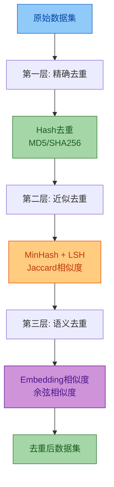
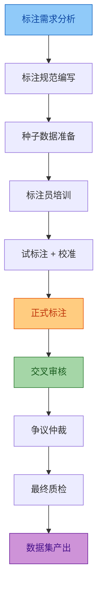
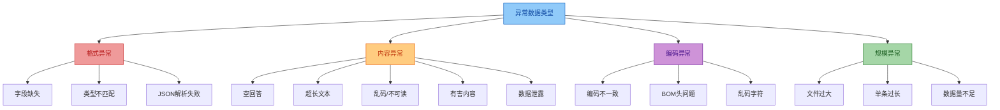
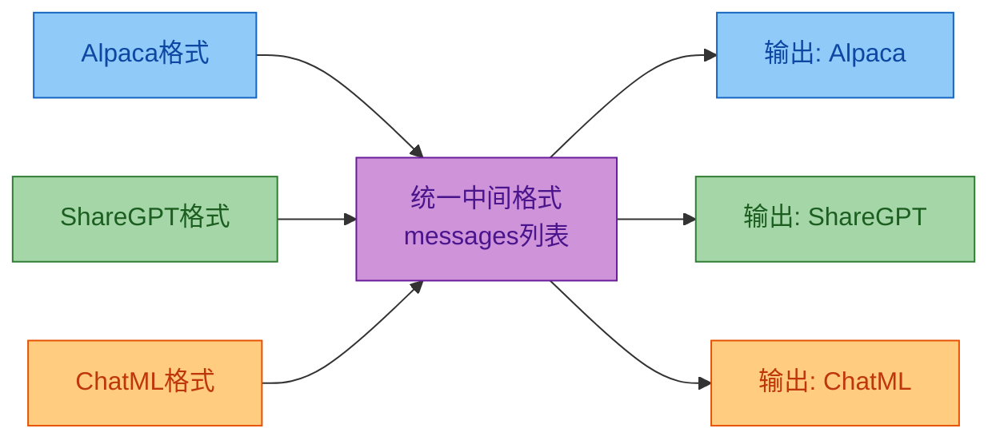
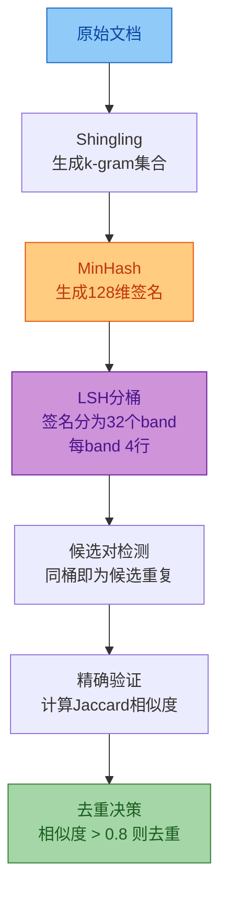
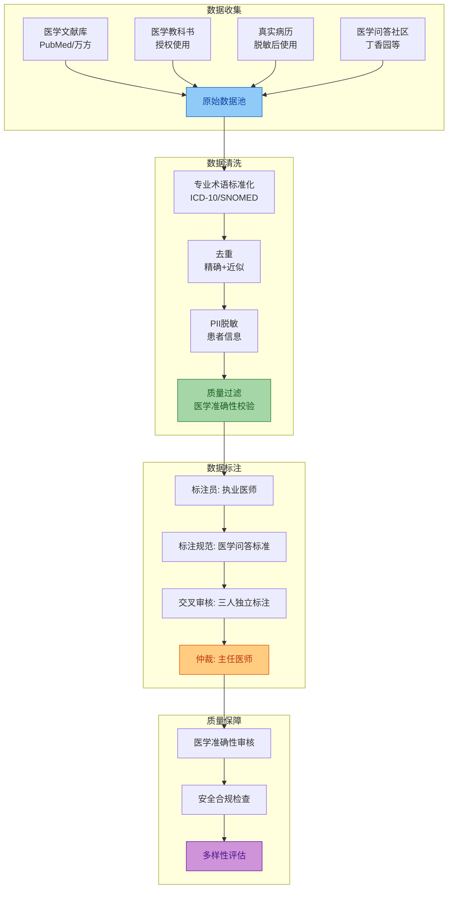
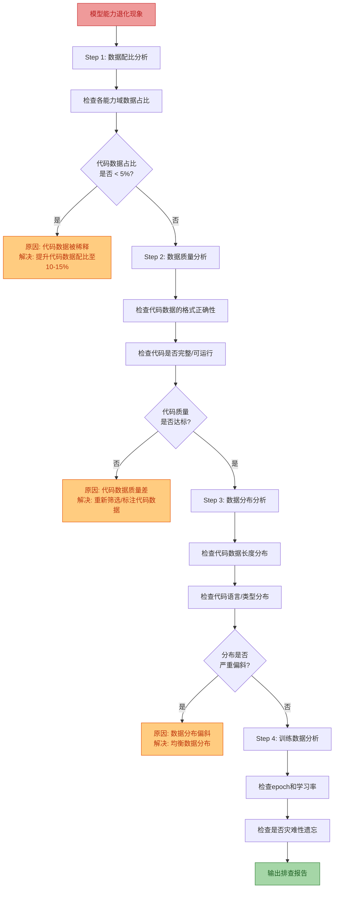
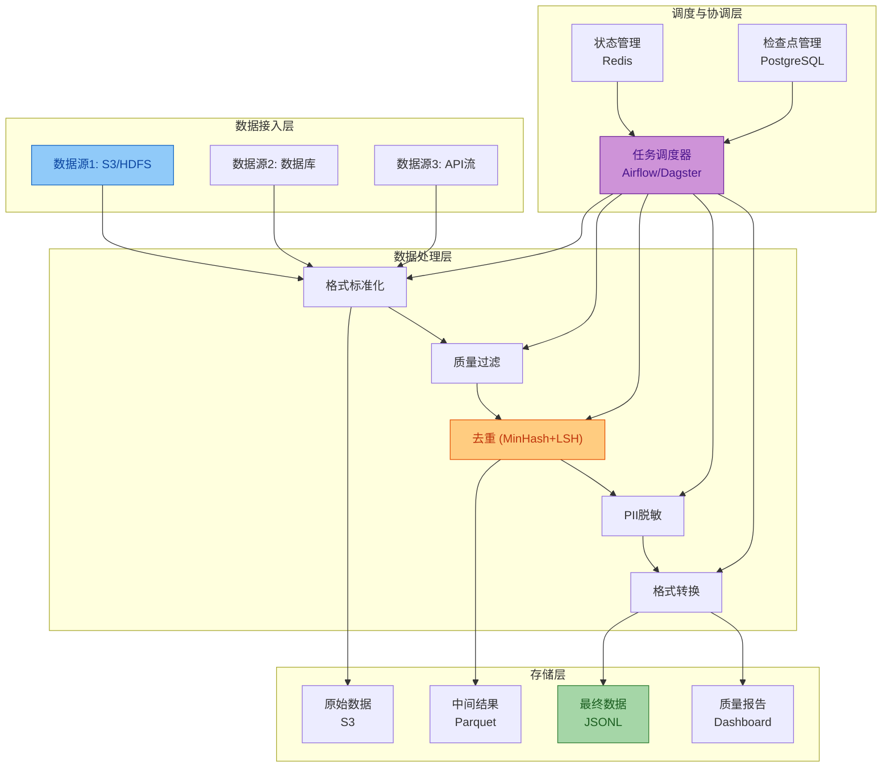

# 微调数据处理方法技术文档与面试题集详解

> 本文档系统阐述大模型微调数据处理的**全链路方法论**，覆盖数据收集、清洗、标注、格式转换、质量评估、异常处理六大核心环节，并配备 7 道分级面试题及真实案例。
> 适用对象：AI 工程师、数据工程师、算法工程师及面试官。

---

## 目录

- [一、微调数据处理概述](#一微调数据处理概述)
- [二、数据收集策略](#二数据收集策略)
  - [2.1 数据来源分类](#21-数据来源分类)
  - [2.2 数据采集方法](#22-数据采集方法)
  - [2.3 数据配比策略](#23-数据配比策略)
- [三、数据清洗流程](#三数据清洗流程)
  - [3.1 格式标准化](#31-格式标准化)
  - [3.2 质量过滤](#32-质量过滤)
  - [3.3 去重策略](#33-去重策略)
  - [3.4 敏感信息处理](#34-敏感信息处理)
- [四、数据标注规范](#四数据标注规范)
  - [4.1 标注流程设计](#41-标注流程设计)
  - [4.2 标注质量控制](#42-标注质量控制)
  - [4.3 标注工具与平台](#43-标注工具与平台)
- [五、数据格式转换方法](#五数据格式转换方法)
  - [5.1 常见微调数据格式](#51-常见微调数据格式)
  - [5.2 格式转换实现](#52-格式转换实现)
  - [5.3 多轮对话处理](#53-多轮对话处理)
- [六、数据质量评估指标](#六数据质量评估指标)
  - [6.1 评估维度](#61-评估维度)
  - [6.2 自动化评估方法](#62-自动化评估方法)
  - [6.3 人工评估](#63-人工评估)
- [七、异常数据处理方案](#七异常数据处理方案)
  - [7.1 异常类型识别](#71-异常类型识别)
  - [7.2 异常处理策略](#72-异常处理策略)
  - [7.3 容错与恢复机制](#73-容错与恢复机制)
- [八、常见问题解决方案](#八常见问题解决方案)
- [九、面试题集详解（7题）](#九面试题集详解7题)
  - [Q1：微调数据预处理全流程与影响](#q1微调数据预处理全流程与影响)
  - [Q2：微调数据格式对比与转换](#q2微调数据格式对比与转换)
  - [Q3：高效数据去重的算法与工程实现](#q3高效数据去重的算法与工程实现)
  - [Q4：数据质量评估体系设计](#q4数据质量评估体系设计)
  - [Q5：医疗领域微调数据集构建方案](#q5医疗领域微调数据集构建方案)
  - [Q6：模型能力退化的数据层面排查](#q6模型能力退化的数据层面排查)
  - [Q7：TB级数据处理Pipeline架构设计](#q7tb级数据处理pipeline架构设计)
- [十、考点速查表](#十考点速查表)
- [十一、总结](#十一总结)

---

## 一、微调数据处理概述

微调（Fine-Tuning）是让预训练基座模型获得特定领域能力或指令遵循能力的核心环节。而微调数据的质量，直接决定了模型能力的上限——业界常说 **"Garbage In, Garbage Out"**。

微调数据处理的完整链路如下图所示：


| 阶段 | 核心目标 | 关键产出 | 成本占比 |
|------|---------|---------|---------|
| 数据收集 | 获取多样化、领域相关的原始数据 | 原始数据集 | 15% |
| 数据清洗 | 去除噪声、去重、脱敏 | 干净数据集 | 30% |
| 数据标注 | 人工/半自动生成高质量指令对 | 标注数据集 | 35% |
| 格式转换 | 统一为模型训练所需格式 | 训练就绪数据 | 5% |
| 质量评估 | 多维度量化数据质量 | 质量报告 | 10% |
| 异常处理 | 处理边缘case和异常数据 | 最终数据集 | 5% |

---

## 二、数据收集策略

### 2.1 数据来源分类

微调数据的来源直接影响模型的领域覆盖面和能力边界。常见数据来源分为四大类：

| 来源类型 | 典型渠道 | 数据质量 | 获取成本 | 适用场景 |
|---------|---------|---------|---------|---------|
| 人工标注 | 专业标注团队、众包平台 | 最高 | 最高 | 高价值指令、专业领域 |
| 开源数据集 | HuggingFace、Alpaca、ShareGPT | 中高 | 低 | 通用能力、快速启动 |
| 自生成数据 | 强模型蒸馏、Self-Instruct | 中 | 中 | 大规模扩充、多样化 |
| 业务沉淀 | 真实用户对话、客服记录 | 中高 | 中 | 领域适配、场景优化 |

**各类来源的详细说明**：

**人工标注**：雇佣领域专家或经过培训的标注员，根据预定义的标注规范编写指令-回答对。质量最高但成本也最高，通常用于高价值、高难度的指令数据。

**开源数据集**：利用社区已公开的高质量数据集快速启动微调。常见开源数据集包括：

| 数据集名称 | 数据量 | 特点 | 适用模型 |
|-----------|-------|------|---------|
| Alpaca | 52K | Stanford发布，指令多样性强 | 通用LLaMA微调 |
| ShareGPT | 90K+ | 真实多轮对话，质量高 | 对话模型 |
| FLAN Collection | 1.8M | Google发布，任务覆盖广 | 指令微调 |
| OpenAssistant | 161K | 多语言，多轮对话 | 对话助手 |
| BELLE | 3.5M | 中文指令，规模大 | 中文模型 |

**自生成数据**：利用 GPT-4、Claude 等强模型通过 Self-Instruct 或 Evol-Instruct 方法自动生成训练数据。核心思路是：用少量种子指令让强模型生成更多指令-回答对，再经过质量过滤后用于微调。

**业务沉淀**：从真实业务场景中收集用户与系统的交互数据，经过脱敏和质量筛选后作为微调数据。这是领域适配最有效的数据来源。

### 2.2 数据采集方法

```python
from abc import ABC, abstractmethod
from typing import Iterator, Dict, Any
import json
import csv

class DataCollector(ABC):
    """数据采集器抽象基类"""

    @abstractmethod
    def collect(self) -> Iterator[Dict[str, Any]]:
        """采集数据，返回迭代器以支持流式处理"""
        ...


class FileCollector(DataCollector):
    """文件数据采集器：支持JSON/JSONL/CSV"""

    def __init__(self, file_path: str, encoding: str = "utf-8"):
        self.file_path = file_path
        self.encoding = encoding

    def collect(self) -> Iterator[Dict[str, Any]]:
        if self.file_path.endswith(".jsonl"):
            yield from self._read_jsonl()
        elif self.file_path.endswith(".json"):
            yield from self._read_json()
        elif self.file_path.endswith(".csv"):
            yield from self._read_csv()
        else:
            raise ValueError(f"不支持的文件格式: {self.file_path}")

    def _read_jsonl(self) -> Iterator[Dict[str, Any]]:
        with open(self.file_path, "r", encoding=self.encoding) as f:
            for line_num, line in enumerate(f, 1):
                line = line.strip()
                if not line:
                    continue
                try:
                    yield json.loads(line)
                except json.JSONDecodeError as e:
                    print(f"第 {line_num} 行解析失败: {e}")

    def _read_json(self) -> Iterator[Dict[str, Any]]:
        with open(self.file_path, "r", encoding=self.encoding) as f:
            data = json.load(f)
            if isinstance(data, list):
                yield from data
            else:
                yield data

    def _read_csv(self) -> Iterator[Dict[str, Any]]:
        with open(self.file_path, "r", encoding=self.encoding, newline="") as f:
            reader = csv.DictReader(f)
            yield from reader


class HFDatasetCollector(DataCollector):
    """HuggingFace数据集采集器"""

    def __init__(self, dataset_name: str, split: str = "train"):
        self.dataset_name = dataset_name
        self.split = split

    def collect(self) -> Iterator[Dict[str, Any]]:
        from datasets import load_dataset
        ds = load_dataset(self.dataset_name, split=self.split)
        for item in ds:
            yield dict(item)
```

### 2.3 数据配比策略

数据配比决定了模型在不同能力维度上的表现倾向。以下是典型的配比方案：

```yaml
# 通用对话模型配比方案
数据配比:
  通用对话: 40%       # 日常对话能力
  指令遵循: 25%       # 指令理解和执行
  代码生成: 10%       # 编程能力
  数学推理: 10%       # 逻辑推理
  知识问答: 10%       # 事实性知识
  安全对齐: 5%        # 安全拒绝能力

# 配比调整原则:
#   - 领域数据占比 > 50% 时，模型领域能力显著提升
#   - 通用数据占比 < 20% 时，模型通用能力可能下降
#   - 安全数据占比 < 3% 时，模型安全对齐不足
#   - 配比需通过实验验证，不同模型对配比敏感度不同
```

---

## 三、数据清洗流程

### 3.1 格式标准化

格式标准化是数据清洗的第一步，目标是统一编码、清洗HTML、提取正文，使所有数据具有一致的结构。

```python
import re
from bs4 import BeautifulSoup
from unicodedata import normalize

class FormatNormalizer:
    """数据格式标准化器"""

    @staticmethod
    def normalize_text(text: str) -> str:
        """文本格式标准化"""
        if not text or not isinstance(text, str):
            return ""

        # 1. Unicode标准化 (NFKC: 兼容性分解+组合)
        text = normalize("NFKC", text)

        # 2. 清洗HTML标签
        text = BeautifulSoup(text, "html.parser").get_text()

        # 3. 统一换行符
        text = text.replace("\r\n", "\n").replace("\r", "\n")

        # 4. 压缩多余空行 (最多保留一个空行)
        text = re.sub(r"\n{3,}", "\n\n", text)

        # 5. 去除行首行尾空白
        text = "\n".join(line.strip() for line in text.split("\n"))

        # 6. 压缩连续空格 (保留代码块中的缩进)
        text = re.sub(r"[^\S\n]+", " ", text)

        return text.strip()

    @staticmethod
    def normalize_record(record: dict) -> dict:
        """整条记录标准化"""
        normalized = {}
        for key, value in record.items():
            if isinstance(value, str):
                normalized[key] = FormatNormalizer.normalize_text(value)
            elif isinstance(value, list):
                normalized[key] = [
                    FormatNormalizer.normalize_text(v) if isinstance(v, str) else v
                    for v in value
                ]
            elif isinstance(value, dict):
                # 处理嵌套字典 (如 conversations 字段)
                normalized[key] = {
                    k: FormatNormalizer.normalize_text(v) if isinstance(v, str) else v
                    for k, v in value.items()
                }
            else:
                normalized[key] = value
        return normalized
```

### 3.2 质量过滤

质量过滤通过规则和模型双重机制，去除低质量文本。

```python
class QualityFilter:
    """数据质量过滤器"""

    def __init__(self, min_length: int = 10, max_length: int = 100000,
                 repetition_threshold: float = 0.3,
                 language: str = "zh", language_threshold: float = 0.7):
        self.min_length = min_length
        self.max_length = max_length
        self.repetition_threshold = repetition_threshold
        self.language = language
        self.language_threshold = language_threshold

    def filter(self, text: str) -> tuple[bool, str]:
        """
        过滤低质量文本
        返回: (是否通过, 过滤原因)
        """
        # 1. 长度过滤
        if len(text) < self.min_length:
            return False, "文本过短"
        if len(text) > self.max_length:
            return False, "文本过长"

        # 2. 重复度检测 (n-gram重复率)
        rep_ratio = self._repetition_ratio(text)
        if rep_ratio > self.repetition_threshold:
            return False, f"重复率过高: {rep_ratio:.2%}"

        # 3. 语言检测
        if not self._check_language(text):
            return False, "语言不匹配"

        # 4. 特殊字符比例检测
        special_ratio = self._special_char_ratio(text)
        if special_ratio > 0.5:
            return False, f"特殊字符比例过高: {special_ratio:.2%}"

        # 5. 困惑度过滤 (可选，需要加载小模型)
        # perplexity = self._compute_perplexity(text)
        # if perplexity > threshold:
        #     return False, "困惑度过高"

        return True, "通过"

    def _repetition_ratio(self, text: str) -> float:
        """计算文本的n-gram重复率"""
        words = list(text)
        if len(words) < 10:
            return 0.0

        # 使用10-gram检测重复
        ngrams = [tuple(words[i:i+10]) for i in range(len(words) - 9)]
        if not ngrams:
            return 0.0

        unique_ratio = len(set(ngrams)) / len(ngrams)
        return 1.0 - unique_ratio

    def _check_language(self, text: str) -> bool:
        """语言检测"""
        try:
            from langdetect import detect, DetectorFactory
            DetectorFactory.seed = 0
            detected = detect(text)
            if self.language == "zh":
                return detected in ("zh-cn", "zh-tw", "ko")
            return detected == self.language
        except Exception:
            return True  # 检测失败时放行

    def _special_char_ratio(self, text: str) -> float:
        """计算特殊字符占比"""
        if not text:
            return 0.0
        special_count = sum(1 for c in text if not c.isalnum() and c not in " \n\t，。！？、；：""''（）【】《》—…·")
        return special_count / len(text)
```

### 3.3 去重策略

去重是数据清洗中最关键的环节。重复数据会导致模型过拟合，浪费训练资源，并使模型倾向于生成重复内容。



| 去重层级 | 方法 | 时间复杂度 | 适用规模 | 去重效果 |
|---------|------|-----------|---------|---------|
| 精确去重 | Hash (MD5/SHA256) | O(n) | 任意规模 | 完全相同的文档 |
| 近似去重 | MinHash + LSH | O(n * k) | 百万~亿级 | 高相似度文档 (>80%) |
| 语义去重 | Embedding + 余弦相似度 | O(n^2) 或 O(n log n) | 万~百万级 | 语义相同但表述不同 |

**MinHash + LSH 去重实现**：

```python
from datasketch import MinHash, MinHashLSH
from typing import List, Tuple

class Deduplicator:
    """三级去重器"""

    def __init__(self, similarity_threshold: float = 0.8,
                 num_perm: int = 128):
        self.similarity_threshold = similarity_threshold
        self.num_perm = num_perm

    def exact_dedup(self, documents: List[str]) -> Tuple[List[str], int]:
        """第一层: 精确去重 (Hash去重)"""
        import hashlib
        seen = set()
        unique_docs = []
        removed = 0

        for doc in documents:
            doc_hash = hashlib.md5(doc.encode("utf-8")).hexdigest()
            if doc_hash in seen:
                removed += 1
                continue
            seen.add(doc_hash)
            unique_docs.append(doc)

        return unique_docs, removed

    def fuzzy_dedup(self, documents: List[str]) -> Tuple[List[str], int]:
        """第二层: 近似去重 (MinHash + LSH)"""
        # 创建LSH索引
        lsh = MinHashLSH(
            threshold=self.similarity_threshold,
            num_perm=self.num_perm
        )

        unique_docs = []
        removed = 0

        for i, doc in enumerate(documents):
            # 生成MinHash签名
            m = MinHash(num_perm=self.num_perm)
            # 使用3-gram作为shingle
            shingles = self._get_shingles(doc, k=3)
            for s in shingles:
                m.update(s.encode("utf-8"))

            # 查询相似文档
            result = lsh.query(m)
            if result:
                removed += 1
                continue

            # 插入LSH索引
            lsh.insert(i, m)
            unique_docs.append(doc)

        return unique_docs, removed

    def _get_shingles(self, text: str, k: int = 3) -> List[str]:
        """生成k-shingle集合"""
        text = text.replace(" ", "").replace("\n", "")
        if len(text) < k:
            return [text]
        return [text[i:i+k] for i in range(len(text) - k + 1)]

    def full_dedup(self, documents: List[str]) -> Tuple[List[str], dict]:
        """完整三级去重"""
        stats = {}

        # 第一层: 精确去重
        docs, removed = self.exact_dedup(documents)
        stats["exact_dedup_removed"] = removed
        print(f"精确去重: 移除 {removed} 条, 剩余 {len(docs)} 条")

        # 第二层: 近似去重
        docs, removed = self.fuzzy_dedup(docs)
        stats["fuzzy_dedup_removed"] = removed
        print(f"近似去重: 移除 {removed} 条, 剩余 {len(docs)} 条")

        stats["final_count"] = len(docs)
        return docs, stats
```

### 3.4 敏感信息处理

微调数据中可能包含个人身份信息（PII），必须在训练前进行检测和脱敏。

```python
import re
from dataclasses import dataclass

@dataclass
class PIIPattern:
    """PII检测模式定义"""
    name: str
    pattern: str
    replacement: str
    description: str


class PIIScrubber:
    """PII敏感信息检测与脱敏器"""

    PATTERNS = [
        PIIPattern(
            name="phone",
            pattern=r"1[3-9]\d{9}",
            replacement="[PHONE]",
            description="手机号码"
        ),
        PIIPattern(
            name="id_card",
            pattern=r"\d{17}[\dXx]",
            replacement="[ID_CARD]",
            description="身份证号"
        ),
        PIIPattern(
            name="bank_card",
            pattern=r"\d{16,19}",
            replacement="[BANK_CARD]",
            description="银行卡号"
        ),
        PIIPattern(
            name="email",
            pattern=r"[\w.-]+@[\w.-]+\.\w+",
            replacement="[EMAIL]",
            description="电子邮箱"
        ),
        PIIPattern(
            name="ip_address",
            pattern=r"\b(?:\d{1,3}\.){3}\d{1,3}\b",
            replacement="[IP_ADDR]",
            description="IP地址"
        ),
        PIIPattern(
            name="url",
            pattern=r"https?://[^\s<]+",
            replacement="[URL]",
            description="URL链接"
        ),
    ]

    def scrub(self, text: str) -> tuple[str, dict]:
        """
        检测并脱敏PII信息
        返回: (脱敏后文本, 检测统计)
        """
        stats = {}
        scrubbed = text

        for pattern in self.PATTERNS:
            matches = re.findall(pattern.pattern, scrubbed)
            if matches:
                count = len(matches)
                stats[pattern.name] = count
                scrubbed = re.sub(
                    pattern.pattern,
                    pattern.replacement,
                    scrubbed
                )

        return scrubbed, stats

    def scrub_record(self, record: dict) -> tuple[dict, dict]:
        """对整条记录进行PII脱敏"""
        all_stats = {}
        scrubbed_record = {}

        for key, value in record.items():
            if isinstance(value, str):
                clean_value, stats = self.scrub(value)
                scrubbed_record[key] = clean_value
                for k, v in stats.items():
                    all_stats[k] = all_stats.get(k, 0) + v
            else:
                scrubbed_record[key] = value

        return scrubbed_record, all_stats
```

---

## 四、数据标注规范

### 4.1 标注流程设计



**标注规范的核心要素**：

| 要素 | 说明 | 示例 |
|------|------|------|
| 任务定义 | 明确标注任务的目标和边界 | "为用户问题编写专业、准确的回答" |
| 质量标准 | 定义何为"好"的标注 | 准确性、完整性、格式规范、语气恰当 |
| 格式要求 | 统一输出格式 | JSON格式，包含instruction/input/output字段 |
| 边界case | 明确模糊情况的处理方式 | "如果问题涉及医疗诊断，回答应建议就医" |
| 反面示例 | 列举常见错误 | 过于简短、答非所问、格式错误 |
| 评估标准 | 量化质量评估方法 | 准确率 > 95%, 格式合规率 > 99% |

### 4.2 标注质量控制

质量控制贯穿标注全流程，采用"三重质检"机制：

```python
from enum import Enum
from typing import List, Optional

class QualityLevel(Enum):
    """标注质量等级"""
    EXCELLENT = "A"   # 优秀: 无需修改
    GOOD = "B"        # 良好: 轻微问题，不影响使用
    ACCEPTABLE = "C"  # 可接受: 存在问题，需修订后使用
    REJECT = "D"      # 拒绝: 质量不达标，需重做


class AnnotationQC:
    """标注质量控制器"""

    def __init__(self, sample_rate: float = 0.1,
                 agreement_threshold: float = 0.8):
        self.sample_rate = sample_rate
        self.agreement_threshold = agreement_threshold

    def cross_check(self, annotations: List[dict]) -> dict:
        """
        交叉审核: 多个标注员标注同一条数据，
        计算一致性
        """
        if len(annotations) < 2:
            return {"agreement": 1.0, "level": QualityLevel.EXCELLENT}

        # 计算两两一致性
        agreements = []
        for i in range(len(annotations)):
            for j in range(i + 1, len(annotations)):
                sim = self._text_similarity(
                    annotations[i].get("output", ""),
                    annotations[j].get("output", "")
                )
                agreements.append(sim)

        avg_agreement = sum(agreements) / len(agreements)

        if avg_agreement >= 0.9:
            level = QualityLevel.EXCELLENT
        elif avg_agreement >= self.agreement_threshold:
            level = QualityLevel.GOOD
        elif avg_agreement >= 0.6:
            level = QualityLevel.ACCEPTABLE
        else:
            level = QualityLevel.REJECT

        return {"agreement": avg_agreement, "level": level}

    def _text_similarity(self, text1: str, text2: str) -> float:
        """计算文本相似度 (基于编辑距离)"""
        if not text1 or not text2:
            return 0.0

        # 简化实现: 使用字符级Jaccard相似度
        set1 = set(text1)
        set2 = set(text2)
        intersection = set1 & set2
        union = set1 | set2
        return len(intersection) / len(union) if union else 0.0

    def spot_check(self, dataset: List[dict],
                   check_rules: List[callable]) -> dict:
        """
        抽检: 按规则抽样检查标注质量
        """
        import random
        sample_size = max(1, int(len(dataset) * self.sample_rate))
        samples = random.sample(dataset, min(sample_size, len(dataset)))

        issues = []
        for idx, sample in enumerate(samples):
            for rule in check_rules:
                result = rule(sample)
                if not result["passed"]:
                    issues.append({
                        "sample_index": idx,
                        "rule": result["rule_name"],
                        "issue": result["message"]
                    })

        pass_rate = 1 - len(issues) / max(1, len(samples))
        return {
            "sample_size": len(samples),
            "issues_count": len(issues),
            "pass_rate": pass_rate,
            "issues": issues
        }
```

### 4.3 标注工具与平台

| 工具/平台 | 类型 | 特点 | 适用场景 |
|----------|------|------|---------|
| Label Studio | 开源 | 高度可定制，支持多种标注类型 | 通用数据标注 |
| Doccano | 开源 | 轻量级，支持文本分类/序列标注 | NLP任务标注 |
| Argilla | 开源 | 支持主动学习，与HF集成 | 大规模NLP标注 |
| Scale AI | 商业 | 全托管，支持RLHF标注 | 企业级大规模标注 |
| Surge AI | 商业 | 高质量标注员网络 | 高价值数据标注 |

---

## 五、数据格式转换方法

### 5.1 常见微调数据格式

微调数据有三种主流格式，各有其适用场景：

**Alpaca 格式**（单轮指令）：

```json
{
    "instruction": "请解释什么是递归",
    "input": "",
    "output": "递归是一种编程技巧，函数在执行过程中调用自身..."
}
```

**ShareGPT 格式**（多轮对话）：

```json
{
    "conversations": [
        {"role": "user", "content": "什么是快速排序？"},
        {"role": "assistant", "content": "快速排序是一种分治算法..."},
        {"role": "user", "content": "用Python实现一下"},
        {"role": "assistant", "content": "```python\ndef quicksort(arr):..."}
    ]
}
```

**ChatML 格式**（带系统提示）：

```json
{
    "messages": [
        {"role": "system", "content": "你是一个专业的编程助手"},
        {"role": "user", "content": "解释什么是闭包"},
        {"role": "assistant", "content": "闭包是指有权访问另一个函数作用域中变量的函数..."}
    ]
}
```

| 格式 | 对话轮次 | 系统提示 | 适用模型 | 特点 |
|------|---------|---------|---------|------|
| Alpaca | 单轮 | 不支持 | LLaMA, Alpaca | 简单直观，适合指令学习 |
| ShareGPT | 多轮 | 不直接支持 | Vicuna, ChatGLM | 适合多轮对话场景 |
| ChatML | 多轮 | 支持 | Qwen, ChatML兼容模型 | 灵活强大，支持系统人设 |

### 5.2 格式转换实现

```python
from typing import List, Dict, Any
from abc import ABC, abstractmethod

class BaseFormat(ABC):
    """数据格式基类"""

    @abstractmethod
    def validate(self, record: dict) -> bool:
        """验证数据是否符合格式"""
        ...

    @abstractmethod
    def to_unified(self, record: dict) -> dict:
        """转换为统一中间格式"""
        ...

    @abstractmethod
    def from_unified(self, unified: dict) -> dict:
        """从统一中间格式转换"""
        ...


class AlpacaFormat(BaseFormat):
    """Alpaca格式"""

    def validate(self, record: dict) -> bool:
        return "instruction" in record and "output" in record

    def to_unified(self, record: dict) -> dict:
        """Alpaca -> 统一格式"""
        instruction = record.get("instruction", "")
        input_text = record.get("input", "")
        output = record.get("output", "")

        # 合并instruction和input
        if input_text:
            user_content = f"{instruction}\n\n{input_text}"
        else:
            user_content = instruction

        return {
            "messages": [
                {"role": "user", "content": user_content},
                {"role": "assistant", "content": output}
            ]
        }

    def from_unified(self, unified: dict) -> dict:
        """统一格式 -> Alpaca"""
        messages = unified.get("messages", [])
        user_msg = ""
        assistant_msg = ""

        for msg in messages:
            if msg["role"] == "user":
                user_msg = msg["content"]
            elif msg["role"] == "assistant":
                assistant_msg = msg["content"]

        # 尝试拆分为instruction和input
        if "\n\n" in user_msg:
            parts = user_msg.split("\n\n", 1)
            instruction, input_text = parts[0], parts[1]
        else:
            instruction, input_text = user_msg, ""

        return {
            "instruction": instruction,
            "input": input_text,
            "output": assistant_msg
        }


class ShareGPTFormat(BaseFormat):
    """ShareGPT格式"""

    def validate(self, record: dict) -> bool:
        return "conversations" in record and isinstance(
            record["conversations"], list
        )

    def to_unified(self, record: dict) -> dict:
        """ShareGPT -> 统一格式"""
        messages = []
        for conv in record.get("conversations", []):
            messages.append({
                "role": conv["role"],
                "content": conv["content"]
            })
        return {"messages": messages}

    def from_unified(self, unified: dict) -> dict:
        """统一格式 -> ShareGPT"""
        conversations = []
        for msg in unified.get("messages", []):
            conversations.append({
                "role": msg["role"],
                "content": msg["content"]
            })
        return {"conversations": conversations}


class ChatMLFormat(BaseFormat):
    """ChatML格式"""

    def validate(self, record: dict) -> bool:
        return "messages" in record and isinstance(
            record["messages"], list
        )

    def to_unified(self, record: dict) -> dict:
        """ChatML -> 统一格式 (已经是统一格式)"""
        return {"messages": record.get("messages", [])}

    def from_unified(self, unified: dict) -> dict:
        """统一格式 -> ChatML"""
        return {"messages": unified.get("messages", [])}


class FormatConverter:
    """格式转换器"""

    FORMATS = {
        "alpaca": AlpacaFormat(),
        "sharegpt": ShareGPTFormat(),
        "chatml": ChatMLFormat(),
    }

    @classmethod
    def convert(cls, record: dict,
                source_format: str,
                target_format: str) -> dict:
        """
        格式转换
        Args:
            record: 原始数据记录
            source_format: 源格式 (alpaca/sharegpt/chatml)
            target_format: 目标格式
        """
        source = cls.FORMATS.get(source_format)
        target = cls.FORMATS.get(target_format)

        if not source:
            raise ValueError(f"不支持的源格式: {source_format}")
        if not target:
            raise ValueError(f"不支持的目标格式: {target_format}")

        # 验证源数据格式
        if not source.validate(record):
            raise ValueError(
                f"数据不符合 {source_format} 格式要求"
            )

        # 源格式 -> 统一格式 -> 目标格式
        unified = source.to_unified(record)
        result = target.from_unified(unified)

        return result

    @classmethod
    def convert_batch(cls, records: List[dict],
                      source_format: str,
                      target_format: str) -> List[dict]:
        """批量格式转换"""
        results = []
        for i, record in enumerate(records):
            try:
                converted = cls.convert(
                    record, source_format, target_format
                )
                results.append(converted)
            except ValueError as e:
                print(f"第 {i} 条记录转换失败: {e}")
        return results
```

### 5.3 多轮对话处理

多轮对话数据在格式转换时需要特别注意上下文截断、轮次对齐和loss计算策略。

```python
class MultiTurnProcessor:
    """多轮对话数据处理器"""

    def __init__(self, max_turns: int = 10,
                 max_length: int = 4096,
                 strategy: str = "sliding_window"):
        self.max_turns = max_turns
        self.max_length = max_length
        self.strategy = strategy

    def process(self, messages: List[dict]) -> List[dict]:
        """
        处理多轮对话，生成训练样本
        策略: 每个assistant回复都作为一个训练目标
        """
        if self.strategy == "sliding_window":
            return self._sliding_window(messages)
        elif self.strategy == "full_context":
            return self._full_context(messages)
        else:
            raise ValueError(f"未知策略: {self.strategy}")

    def _sliding_window(self, messages: List[dict]) -> List[dict]:
        """
        滑动窗口策略: 为每轮assistant回复生成一个训练样本
        样本包含该回复之前的所有上下文
        """
        samples = []
        context = []

        for msg in messages:
            if msg["role"] == "system":
                context.append(msg)
                continue

            if msg["role"] == "assistant":
                # 当前assistant回复作为训练目标
                sample = {
                    "messages": context[:] + [msg]
                }
                samples.append(sample)

            context.append(msg)

            # 控制上下文长度
            if len(context) > self.max_turns * 2:
                # 移除最早的非system消息
                system_msgs = [m for m in context if m["role"] == "system"]
                other_msgs = [m for m in context if m["role"] != "system"]
                context = system_msgs + other_msgs[-(self.max_turns * 2 - 1):]

        return samples

    def _full_context(self, messages: List[dict]) -> List[dict]:
        """
        完整上下文策略: 整个对话作为一个训练样本
        适用于短对话场景
        """
        total_length = sum(len(m["content"]) for m in messages)
        if total_length > self.max_length:
            # 截断最早的对话轮次 (保留system消息)
            system = [m for m in messages if m["role"] == "system"]
            conversation = [m for m in messages if m["role"] != "system"]

            while conversation and total_length > self.max_length:
                removed = conversation.pop(0)
                total_length -= len(removed["content"])

            messages = system + conversation

        return [{"messages": messages}]

    def render_to_text(self, messages: List[dict],
                       template: str = "chatml") -> str:
        """
        将消息列表渲染为训练用文本
        """
        templates = {
            "chatml": {
                "system": "<|im_start|>system\n{content}<|im_end|>\n",
                "user": "<|im_start|>user\n{content}<|im_end|>\n",
                "assistant": "<|im_start|>assistant\n{content}<|im_end|>\n",
            },
            "llama2": {
                "system": "<s>[INST] <<SYS>>\n{content}\n<</SYS>>\n\n",
                "user": "{content} [/INST] ",
                "assistant": "{content} </s>",
            }
        }

        tmpl = templates.get(template, templates["chatml"])
        parts = []
        for msg in messages:
            role = msg["role"]
            content = msg["content"]
            parts.append(tmpl[role].format(content=content))

        return "".join(parts)
```

---

## 六、数据质量评估指标

### 6.1 评估维度

数据质量评估需要从多个维度综合考量：

```mermaid
flowchart TB
    ROOT["数据质量评估体系"]

    ROOT --> D1["准确性 Accuracy"]
    ROOT --> D2["多样性 Diversity"]
    ROOT --> D3["一致性 Consistency"]
    ROOT --> D4["覆盖度 Coverage"]
    ROOT --> D5["难度分布 Difficulty"]
    ROOT --> D6["安全性 Safety"]

    D1 --> D1a["事实正确率"]
    D1 --> D1b["逻辑合理性"]
    D1 --> D1c["格式合规率"]

    D2 --> D2a["指令多样性"]
    D2 --> D2b["回答风格多样性"]
    D2 --> D2c["主题覆盖多样性"]

    D3 --> D3a["格式一致性"]
    D3 --> D3b["语气一致性"]
    D3 --> D3c["长度分布一致性"]

    D4 --> D4a["任务类型覆盖"]
    D4 --> D4b["领域知识覆盖"]
    D4 --> D4c["语言覆盖"]

    D5 --> D5a["简单/中等/困难比例"]
    D5 --> D5b["推理深度分布"]

    D6 --> D6a["有害内容过滤率"]
    D6 --> D6b["PII脱敏率"]

    style ROOT fill:#90caf9,stroke:#1565c0,color:#0d47a1
    style D1 fill:#a5d6a7,stroke:#2e7d32,color:#1b5e20
    style D2 fill:#ffcc80,stroke:#e65100,color:#bf360c
    style D3 fill:#ce93d8,stroke:#6a1b9a,color:#4a148c
    style D4 fill:#90caf9,stroke:#1565c0,color:#0d47a1
    style D5 fill:#ffcc80,stroke:#e65100,color:#bf360c
    style D6 fill:#ef9a9a,stroke:#c62828,color:#b71c1c
```



**各维度指标详细定义**：

| 维度 | 指标名称 | 计算方法 | 目标值 | 权重 |
|------|---------|---------|-------|------|
| 准确性 | 事实正确率 | 正确样本数 / 抽检样本数 | >= 95% | 25% |
| 准确性 | 格式合规率 | 格式正确样本数 / 总样本数 | >= 99% | 10% |
| 多样性 | 指令去重率 | 唯一指令数 / 总指令数 | >= 90% | 15% |
| 多样性 | 主题覆盖数 | 覆盖的主题类别数 | >= 20 | 10% |
| 一致性 | 格式一致率 | 符合格式规范的样本比例 | >= 98% | 10% |
| 覆盖度 | 任务类型覆盖 | 覆盖的任务类型数 / 预定义类型数 | >= 80% | 10% |
| 安全性 | 有害内容过滤率 | 过滤后的安全样本比例 | 100% | 15% |
| 安全性 | PII脱敏率 | 已脱敏PII样本 / 含PII样本 | 100% | 5% |

### 6.2 自动化评估方法

```python
from collections import Counter
from dataclasses import dataclass, field
from typing import List

@dataclass
class QualityReport:
    """数据质量评估报告"""
    total_samples: int = 0
    accuracy_score: float = 0.0
    diversity_score: float = 0.0
    consistency_score: float = 0.0
    coverage_score: float = 0.0
    safety_score: float = 0.0
    overall_score: float = 0.0
    issues: List[str] = field(default_factory=list)

    def __str__(self):
        return (
            f"=== 数据质量评估报告 ===\n"
            f"总样本数: {self.total_samples}\n"
            f"准确性: {self.accuracy_score:.1%}\n"
            f"多样性: {self.diversity_score:.1%}\n"
            f"一致性: {self.consistency_score:.1%}\n"
            f"覆盖度: {self.coverage_score:.1%}\n"
            f"安全性: {self.safety_score:.1%}\n"
            f"综合评分: {self.overall_score:.1%}\n"
            f"问题清单: {len(self.issues)} 条\n"
        )


class DataQualityEvaluator:
    """数据质量评估器"""

    WEIGHTS = {
        "accuracy": 0.25,
        "diversity": 0.25,
        "consistency": 0.20,
        "coverage": 0.15,
        "safety": 0.15,
    }

    def evaluate(self, dataset: List[dict]) -> QualityReport:
        """执行全面质量评估"""
        report = QualityReport(total_samples=len(dataset))

        # 各维度评估
        report.accuracy_score = self._eval_accuracy(dataset)
        report.diversity_score = self._eval_diversity(dataset)
        report.consistency_score = self._eval_consistency(dataset)
        report.coverage_score = self._eval_coverage(dataset)
        report.safety_score = self._eval_safety(dataset)

        # 综合评分
        report.overall_score = (
            report.accuracy_score * self.WEIGHTS["accuracy"] +
            report.diversity_score * self.WEIGHTS["diversity"] +
            report.consistency_score * self.WEIGHTS["consistency"] +
            report.coverage_score * self.WEIGHTS["coverage"] +
            report.safety_score * self.WEIGHTS["safety"]
        )

        # 收集问题
        if report.accuracy_score < 0.95:
            report.issues.append("准确性低于目标值 95%")
        if report.diversity_score < 0.90:
            report.issues.append("多样性不足，建议扩充指令类型")
        if report.safety_score < 1.0:
            report.issues.append("存在安全风险，需加强过滤")

        return report

    def _eval_accuracy(self, dataset: List[dict]) -> float:
        """评估准确性: 格式合规率 + 内容非空率"""
        valid = 0
        for record in dataset:
            # 检查必要字段
            has_output = bool(
                record.get("output") or
                record.get("assistant") or
                any(m.get("role") == "assistant" and m.get("content")
                    for m in record.get("messages", []))
            )
            if has_output:
                valid += 1
        return valid / max(1, len(dataset))

    def _eval_diversity(self, dataset: List[dict]) -> float:
        """评估多样性: 指令去重率"""
        instructions = set()
        total = 0
        for record in dataset:
            # 提取指令文本
            inst = (record.get("instruction") or
                    record.get("input") or "")
            if not inst:
                for m in record.get("messages", []):
                    if m.get("role") == "user":
                        inst = m.get("content", "")
                        break
            if inst:
                instructions.add(inst.strip().lower())
                total += 1
        return len(instructions) / max(1, total)

    def _eval_consistency(self, dataset: List[dict]) -> float:
        """评估一致性: 长度分布合理性"""
        lengths = []
        for record in dataset:
            output = (record.get("output") or "")
            if not output:
                for m in record.get("messages", []):
                    if m.get("role") == "assistant":
                        output = m.get("content", "")
                        break
            lengths.append(len(output))

        if not lengths:
            return 0.0

        # 计算变异系数 (CV = std/mean)
        mean_len = sum(lengths) / len(lengths)
        if mean_len == 0:
            return 0.0

        variance = sum((l - mean_len) ** 2 for l in lengths) / len(lengths)
        std_len = variance ** 0.5
        cv = std_len / mean_len

        # CV < 1.0 为良好
        return max(0, 1.0 - cv)

    def _eval_coverage(self, dataset: List[dict]) -> float:
        """评估覆盖度: 任务类型覆盖"""
        # 简化实现: 基于关键词的任务类型分类
        task_keywords = {
            "问答": ["什么", "为什么", "如何", "解释"],
            "代码": ["代码", "实现", "编程", "函数", "python"],
            "翻译": ["翻译", "translate"],
            "摘要": ["摘要", "总结", "概括"],
            "创作": ["写", "创作", "生成", "编故事"],
            "推理": ["推理", "分析", "推导", "证明"],
            "对话": ["你好", "聊天", "闲聊"],
        }

        covered_types = set()
        for record in dataset:
            text = ""
            for m in record.get("messages", []):
                if m.get("role") == "user":
                    text = m.get("content", "")
                    break
            if not text:
                text = record.get("instruction", "")

            for task_type, keywords in task_keywords.items():
                if any(kw in text for kw in keywords):
                    covered_types.add(task_type)
                    break

        return len(covered_types) / len(task_keywords)

    def _eval_safety(self, dataset: List[dict]) -> float:
        """评估安全性: PII和有害内容检测"""
        scrubber = PIIScrubber()
        safe_count = 0

        for record in dataset:
            text = ""
            for m in record.get("messages", []):
                text += m.get("content", "") + " "
            if not text:
                text = record.get("output", "") or ""

            _, stats = scrubber.scrub(text)
            if not stats:  # 未检测到PII
                safe_count += 1

        return safe_count / max(1, len(dataset))
```

### 6.3 人工评估

人工评估是自动化评估的补充，主要关注自动化难以量化的维度：

| 评估维度 | 评估方法 | 评分标准 | 样本量 |
|---------|---------|---------|-------|
| 回答质量 | 专家盲评 | 1-5分评分 | 随机抽取 200-500 条 |
| 指令清晰度 | 标注员判断 | 清晰/模糊/不可理解 | 随机抽取 200 条 |
| 多样性感知 | 人工浏览分类 | 主观多样性评分 1-5 | 全量浏览摘要 |
| 安全性审核 | 安全专家审核 | 合规/不合规/严重违规 | 随机抽取 500 条 |

---

## 七、异常数据处理方案

### 7.1 异常类型识别



### 7.2 异常处理策略

```python
from enum import Enum
from typing import Any, Optional

class ErrorSeverity(Enum):
    """异常严重等级"""
    INFO = "info"        # 信息: 可忽略
    WARNING = "warning"  # 警告: 需关注
    ERROR = "error"      # 错误: 需修复
    FATAL = "fatal"      # 致命: 阻断处理


class ExceptionHandler:
    """异常数据处理器"""

    def __init__(self, max_length: int = 100000,
                 min_length: int = 5,
                 log_file: str = "exception_log.jsonl"):
        self.max_length = max_length
        self.min_length = min_length
        self.log_file = log_file
        self.stats = {
            "total": 0,
            "fixed": 0,
            "skipped": 0,
            "errors": []
        }

    def handle(self, record: dict) -> Optional[dict]:
        """处理单条记录的异常"""
        self.stats["total"] += 1

        try:
            # 1. 格式异常处理
            record = self._handle_format_error(record)
            if record is None:
                return None

            # 2. 内容异常处理
            record = self._handle_content_error(record)
            if record is None:
                return None

            # 3. 编码异常处理
            record = self._handle_encoding_error(record)
            if record is None:
                return None

            return record

        except Exception as e:
            self._log_error("fatal", str(e), record)
            self.stats["skipped"] += 1
            return None

    def _handle_format_error(self, record: dict) -> Optional[dict]:
        """处理格式异常"""
        # 字段缺失
        if not record:
            self._log_error("error", "空记录", record)
            self.stats["skipped"] += 1
            return None

        # JSON解析后的类型检查
        for key, value in record.items():
            if value is None:
                record[key] = ""
                self._log_error("warning",
                    f"字段 {key} 为None, 已替换为空字符串", record)
                self.stats["fixed"] += 1

            elif isinstance(value, str) and not value.strip():
                self._log_error("info",
                    f"字段 {key} 为空", record)

        return record

    def _handle_content_error(self, record: dict) -> Optional[dict]:
        """处理内容异常"""
        # 提取文本内容
        text = self._extract_text(record)

        # 空回答
        if not text or len(text.strip()) < self.min_length:
            self._log_error("error",
                f"回答过短 (< {self.min_length} 字符)", record)
            self.stats["skipped"] += 1
            return None

        # 超长文本截断
        if len(text) > self.max_length:
            self._log_error("warning",
                f"文本超长 ({len(text)} > {self.max_length}), 已截断", record)
            text = text[:self.max_length]
            self._set_text(record, text)
            self.stats["fixed"] += 1

        # 乱码检测
        if self._is_garbled(text):
            self._log_error("error", "检测到乱码", record)
            self.stats["skipped"] += 1
            return None

        return record

    def _handle_encoding_error(self, record: dict) -> Optional[dict]:
        """处理编码异常"""
        for key, value in record.items():
            if isinstance(value, str):
                # 去除BOM
                if value.startswith("\ufeff"):
                    record[key] = value.lstrip("\ufeff")
                    self.stats["fixed"] += 1

                # 替换替换字符
                if "\ufffd" in value:
                    record[key] = value.replace("\ufffd", "")
                    self._log_error("warning",
                        f"字段 {key} 包含替换字符, 已清除", record)
                    self.stats["fixed"] += 1

        return record

    def _extract_text(self, record: dict) -> str:
        """从记录中提取文本内容"""
        if "output" in record:
            return record["output"]
        if "messages" in record:
            return " ".join(
                m.get("content", "") for m in record["messages"]
            )
        if "conversations" in record:
            return " ".join(
                c.get("content", "") for c in record["conversations"]
            )
        return ""

    def _set_text(self, record: dict, text: str):
        """设置记录的文本内容"""
        if "output" in record:
            record["output"] = text
        elif "messages" in record and record["messages"]:
            for m in reversed(record["messages"]):
                if m.get("role") == "assistant":
                    m["content"] = text
                    break

    def _is_garbled(self, text: str) -> bool:
        """检测是否为乱码"""
        if not text:
            return False
        # 不可打印字符比例过高
        printable = sum(1 for c in text if c.isprintable() or c in "\n\t")
        return printable / len(text) < 0.7

    def _log_error(self, severity: str, message: str, record: dict):
        """记录错误日志"""
        import json
        log_entry = {
            "severity": severity,
            "message": message,
            "record_preview": str(record)[:200]
        }
        self.stats["errors"].append(log_entry)

    def get_stats(self) -> dict:
        """获取处理统计"""
        return self.stats
```

### 7.3 容错与恢复机制

| 机制 | 说明 | 实现方式 |
|------|------|---------|
| 断点续传 | 处理中断后可从上次位置恢复 | 记录已处理偏移量到检查点文件 |
| 批量回滚 | 某批次处理失败时回滚到上一成功状态 | 事务式批处理 + 版本快照 |
| 错误隔离 | 单条数据异常不影响整体处理 | try-except 包裹每条记录处理 |
| 自动重试 | 临时性错误自动重试 | 指数退避重试策略 (最多3次) |
| 降级处理 | 无法修复时降级处理而非丢弃 | 截断/替换/标记后保留 |

---

## 八、常见问题解决方案

| 问题 | 原因分析 | 解决方案 |
|------|---------|---------|
| 数据量不足 (< 1K) | 领域数据稀缺 | Self-Instruct扩充 + 数据增强 (回译/改写) + LoRA微调降低数据需求 |
| 重复率过高 (> 20%) | 数据来源重叠、爬取重复 | 三级去重 (精确+MinHash+语义) + 数据来源标记 |
| 模型过拟合 | 数据量少/重复多/epoch过多 | 增加数据量 + 降低epoch (2-3) + 正则化 + 早停 |
| 灾难性遗忘 | 微调数据领域过窄 | 混合通用数据 (10-20%) + 降低学习率 + LoRA |
| 格式不一致 | 多来源数据混合 | 统一中间格式 + 自动格式转换器 |
| 安全性不足 | 有害内容未过滤 | 多层安全过滤 (规则+模型) + 安全对齐数据 |
| 多语言混用 | 语言检测不准确 | 强化语言检测 + 分语言处理 + 语言标签 |
| 长度分布不均 | 少量超长/超短数据 | 长度分桶 + 截断/过滤 + 分桶采样 |

---

## 九、面试题集详解（7题）

### Q1：微调数据预处理全流程与影响

**难度级别**：初级
**考察维度**：基础概念、流程理解
**题型**：基础概念题

**问题描述**：
什么是微调数据预处理？请描述完整的微调数据处理流程，并说明各环节对模型性能的潜在影响。

**参考答案**：

微调数据预处理是指在对大模型进行微调训练之前，对原始数据进行一系列加工和处理，使其满足模型训练的质量、格式和安全性要求的完整流程。

**完整处理流程**包含六个核心环节：

1. **数据收集**：从多渠道获取原始数据。数据来源的多样性直接影响模型能力的覆盖面。来源单一会导致模型能力偏科，如仅用代码数据微调会导致日常对话能力下降。

2. **数据清洗**：去除噪声、去重、脱敏。清洗不彻底会导致模型学到噪声模式，如重复数据使模型倾向于生成重复内容；PII泄露会导致合规风险。

3. **数据标注**：生成高质量的指令-回答对。标注质量直接决定模型的输出质量，低质量标注会让模型学到错误的回答模式。

4. **格式转换**：统一为模型训练所需格式。格式错误会导致训练失败或模型行为异常。

5. **质量评估**：多维度量化数据质量。缺乏评估就无法发现数据问题，可能导致"用脏数据训练出坏模型"而不自知。

6. **异常处理**：处理边缘case。未处理的异常数据可能导致训练崩溃或模型行为不稳定。

**案例说明**：

> **项目背景**：某电商团队构建客服Agent微调数据集，初始使用 5 万条原始客服对话直接微调。
>
> **问题**：微调后模型存在三个问题：(1) 经常重复用户的话；(2) 回答中偶尔出现用户手机号；(3) 部分回答答非所问。
>
> **排查与解决**：
> - 问题(1) 原因是数据中 30% 为重复对话，去重后降至 5% 以内，重复现象消失
> - 问题(2) 原因是未做PII脱敏，增加正则脱敏后不再泄露手机号
> - 问题(3) 原因是部分对话上下文断裂（只有半截对话），增加格式校验后过滤掉无效数据
>
> **最终效果**：经过完整预处理流程，数据从 5 万条精简为 3.2 万条高质量数据，模型客服场景准确率从 68% 提升至 89%。

**评分标准**：
- 3分：能说出基本流程（收集-清洗-标注-转换）
- 4分：能说明各环节的作用和重要性
- 5分：能结合案例说明各环节对模型性能的具体影响

---

### Q2：微调数据格式对比与转换

**难度级别**：初级
**考察维度**：数据格式知识、转换实践
**题型**：基础概念题

**问题描述**：
常见的微调数据格式有哪些？请对比Alpaca、ShareGPT和ChatML三种格式的特点，并说明在多来源数据混合训练时如何统一格式。

**参考答案**：

三种主流微调数据格式的对比如下：

| 维度 | Alpaca | ShareGPT | ChatML |
|------|--------|----------|--------|
| 数据结构 | instruction/input/output | conversations列表 | messages列表 |
| 对话轮次 | 仅单轮 | 支持多轮 | 支持多轮 |
| 系统提示 | 不支持 | 不直接支持 | 支持system角色 |
| 字段命名 | role不参与 | role + content | role + content |
| 适用模型 | LLaMA/Alpaca | Vicuna/ChatGLM | Qwen/Baichuan |
| 复杂度 | 简单 | 中等 | 中等 |

**多来源数据统一策略**：

核心思路是设计一个**统一中间格式**，所有源格式先转为中间格式，再从中间格式转为目标格式：



统一中间格式采用 ChatML 的 messages 结构，因为它最灵活（支持system角色和多轮对话）。

**转换时的关键注意点**：
1. Alpaca的instruction+input需要合并为user消息
2. ShareGPT的conversations直接映射为messages
3. Alpaca转ShareGPT时，单轮对话需包装为conversations列表
4. 无system消息的数据需补充默认系统提示

**案例说明**：

> **项目背景**：某团队同时使用 Alpaca (52K)、ShareGPT (90K) 和自标注数据 (10K，ChatML格式) 混合训练 LLaMA 模型。
>
> **挑战**：三种格式混合导致训练脚本需要支持多种解析逻辑，维护成本高且容易出错。
>
> **解决方案**：实现 FormatConverter 工具，将所有数据统一转换为 Alpaca 格式（因为 LLaMA 训练框架原生支持 Alpaca）。对于 ShareGPT 多轮对话，采用滑动窗口策略拆分为多个单轮训练样本。
>
> **最终效果**：统一格式后训练脚本简化 60%，数据加载速度提升 40%（减少了格式判断逻辑），训练稳定性显著提高。

**评分标准**：
- 3分：能说出三种格式的基本结构
- 4分：能说明各格式的适用场景和转换方法
- 5分：能设计统一中间格式方案并结合案例说明工程实践

---

### Q3：高效数据去重的算法与工程实现

**难度级别**：中级
**考察维度**：算法原理、工程实现
**题型**：技术细节题

**问题描述**：
如何实现高效的微调数据去重？请详细说明MinHash+LSH算法的原理，并给出百万级数据的工程实现方案。

**参考答案**：

数据去重采用三级策略：精确去重、近似去重、语义去重。其中 MinHash+LSH 是近似去重的核心算法。

**MinHash 原理**：

MinHash 是一种估计 Jaccard 相似度的技术。对于集合 A 和 B，Jaccard 相似度 = |A ∩ B| / |A ∪ B|。MinHash 的核心思想是：对集合进行多次哈希，每次取最小哈希值作为签名，两个集合签名相同的概率等于它们的 Jaccard 相似度。

**LSH (Locality-Sensitive Hashing) 原理**：

LSH 将相似的 MinHash 签名映射到同一个桶中，从而避免两两比较。通过将签名分成多个_band_，只要有一个_band_完全相同，就将两条数据视为候选重复对。



**工程实现要点**：

1. **参数选择**：num_perm=128, threshold=0.8, 这意味着 32 个 band 每个 4 行。假阳性率约 1%，假阴性率约 20%。
2. **内存优化**：使用 datasketch 库的 MinHashLSH，支持磁盘索引。
3. **并行化**：按 band 分组并行处理，每个 band 独立建桶。
4. **流式处理**：支持逐条输入，避免一次性加载全部数据。

**案例说明**：

> **项目背景**：某团队收集了 200 万条指令数据用于微调，数据来自 5 个不同渠道（开源数据集 + 自生成 + 爬取 + 人工标注 + 业务沉淀）。
>
> **问题**：数据存在大量跨渠道重复，初步估计重复率约 30-40%，直接训练导致模型重复生成。
>
> **实施方案**：
> - 第一层精确去重：使用 MD5 Hash，2 分钟完成，移除 25 万条完全重复
> - 第二层近似去重：使用 MinHash+LSH (num_perm=128, threshold=0.85)，15 分钟完成，移除 35 万条近似重复
> - 第三层语义去重：对剩余 140 万条数据计算 Embedding，使用余弦相似度 > 0.92 去重，移除 15 万条语义重复
>
> **最终效果**：数据从 200 万条精简为 125 万条，去重率 37.5%。模型重复生成问题完全消除，训练时间减少 30%（因为数据量减少），模型在多样性指标上提升 15%。

**评分标准**：
- 3分：能说明去重的基本概念和精确去重方法
- 4分：能解释 MinHash+LSH 的原理和参数选择
- 5分：能设计完整的三级去重方案并给出工程实现和性能数据

---

### Q4：数据质量评估体系设计

**难度级别**：中级
**考察维度**：评估方法论、指标设计
**题型**：技术细节题

**问题描述**：
如何设计一套多维度的微调数据质量评估指标体系？请从准确性、多样性、一致性、覆盖度、安全性等维度给出具体指标和实现方法，并说明如何设置质量门禁。

**参考答案**：

质量评估体系采用"五维度 + 加权评分 + 门禁拦截"的设计：

**五维度指标体系**：

| 维度 | 权重 | 核心指标 | 目标值 | 评估方法 |
|------|------|---------|-------|---------|
| 准确性 | 25% | 事实正确率 | >= 95% | 抽样人工校验 |
| 准确性 | 10% | 格式合规率 | >= 99% | 自动化Schema校验 |
| 多样性 | 15% | 指令去重率 | >= 90% | Hash去重率 |
| 多样性 | 10% | 主题覆盖数 | >= 20类 | 关键词分类统计 |
| 一致性 | 10% | 格式一致率 | >= 98% | 模板匹配 |
| 一致性 | 10% | 长度分布CV | < 1.0 | 统计分析 |
| 覆盖度 | 10% | 任务类型覆盖 | >= 80% | 任务分类器 |
| 安全性 | 15% | PII脱敏率 | 100% | 正则+NER检测 |
| 安全性 | 5% | 有害内容过滤 | 100% | 安全分类模型 |

**质量门禁设计**：

```python
class QualityGate:
    """数据质量门禁"""

    GATE_RULES = {
        # 规则名: (指标, 阈值, 动作)
        "accuracy_gate": ("accuracy_score", 0.95, "block"),
        "diversity_gate": ("diversity_score", 0.90, "warn"),
        "safety_gate": ("safety_score", 1.00, "block"),
        "overall_gate": ("overall_score", 0.85, "block"),
    }

    def check(self, report: QualityReport) -> dict:
        """执行门禁检查"""
        results = {}
        for rule_name, (metric, threshold, action) in self.GATE_RULES.items():
            value = getattr(report, metric, 0)
            passed = value >= threshold
            results[rule_name] = {
                "metric": metric,
                "value": value,
                "threshold": threshold,
                "passed": passed,
                "action": action if not passed else "pass"
            }

        # 如果任何 block 规则未通过，则阻断
        blocked = any(
            not r["passed"] and r["action"] == "block"
            for r in results.values()
        )

        return {
            "passed": not blocked,
            "blocked": blocked,
            "details": results
        }
```

**案例说明**：

> **项目背景**：某 AI 团队建立数据质量门禁系统，要求所有微调数据在进入训练前必须通过自动化质量检查。
>
> **实施过程**：
> - 阶段一：建立五维度指标体系，使用历史数据校准阈值
> - 阶段二：实现自动化评估脚本，集成到 CI/CD 流程
> - 阶段三：设置三级门禁（block/warn/pass），block 级问题阻断训练
>
> **关键发现**：在一次数据更新中，门禁系统检测到 PII 脱敏率从 100% 降至 92%（新数据源未做脱敏），自动阻断了训练。事后排查发现新数据源确实包含用户手机号，门禁系统避免了 PII 泄露到模型中。
>
> **最终效果**：门禁系统上线后，数据质量事故减少 80%，训练失败率从 15% 降至 2%。

**评分标准**：
- 3分：能列出基本的质量维度
- 4分：能设计具体指标和评估方法
- 5分：能设计质量门禁机制并结合案例说明实际价值

---

### Q5：医疗领域微调数据集构建方案

**难度级别**：中级
**考察维度**：领域知识、方案设计
**题型**：实际应用场景题

**问题描述**：
某团队需要构建一个医疗领域的微调数据集，用于训练医疗问答模型。请设计完整的数据处理方案，包括数据收集、清洗、标注、格式转换和质量保障的全流程。

**参考答案**：

医疗领域微调数据处理有其特殊性：**专业性要求极高、安全合规要求严格、数据稀缺且敏感**。

**完整方案设计**：



**关键环节详解**：

1. **数据收集**：混合使用专业文献 (40%)、教科书 (20%)、脱敏病历 (25%)、问答社区 (15%)。配比确保既有理论知识又有实践案例。

2. **数据清洗**：除常规清洗外，增加医学专业处理——术语标准化（统一使用ICD-10编码）、药物名称规范（使用通用名而非商品名）。

3. **数据标注**：标注员必须是执业医师，每条数据由3名医师独立标注，不一致时由主任医师仲裁。标注规范明确要求：不提供诊断建议、不推荐具体用药剂量、建议患者就医。

4. **格式转换**：统一使用ChatML格式，system消息设为"你是一个医疗信息助手，不能替代医生诊断"。

5. **质量保障**：三级质检——自动化检查 (格式/PII/长度) + 医学专家抽检 (准确性) + 安全审核 (合规性)。

**案例说明**：

> **项目背景**：某医疗AI公司构建医疗问答模型，目标是辅助患者理解医学知识，不替代医生诊断。
>
> **数据规模**：最终产出 5 万条高质量医疗问答数据，覆盖 12 个科室、200+ 常见疾病。
>
> **关键挑战与解决**：
> - 挑战1: 数据稀缺 -- 解决: 通过Self-Instruct用GPT-4基于医学文献生成问答，经医师审核后使用
> - 挑战2: 标注成本高 -- 解决: 采用"AI预标注 + 医师审核"模式，效率提升3倍
> - 挑战3: 安全合规 -- 解决: 增加安全对齐数据 (500条"拒绝诊断"样本)，确保模型不越界
>
> **最终效果**：模型在医疗问答准确率达到 87%，安全合规率 100% (不提供诊断建议)，通过医疗器械软件备案。

**评分标准**：
- 3分：能设计基本的数据处理流程
- 4分：能针对医疗领域的特殊性设计专业方案
- 5分：方案完整且包含安全合规考量，能结合案例说明实施效果

---

### Q6：模型能力退化的数据层面排查

**难度级别**：高级
**考察维度**：问题排查、系统分析
**题型**：问题排查题

**问题描述**：
某团队微调后发现模型在特定任务上表现下降——通用对话能力正常，但代码生成能力明显退化。如何从数据层面系统性排查问题？请给出完整的排查流程和可能的原因分析。

**参考答案**：

模型能力退化排查需要从数据配比、数据质量、数据分布三个层面系统分析。

**系统性排查流程**：



**详细排查步骤**：

| 步骤 | 排查内容 | 排查方法 | 可能原因 |
|------|---------|---------|---------|
| 1 | 数据配比 | 统计各类型数据占比 | 代码数据占比过低导致能力稀释 |
| 2 | 数据质量 | 抽检代码数据格式和正确性 | 代码格式错误/代码不完整/代码不可运行 |
| 3 | 数据分布 | 分析代码长度/语言/难度分布 | 仅含Python，缺少其他语言；仅含简单代码 |
| 4 | 数据污染 | 检查代码数据是否混入非代码内容 | 标注错误，对话数据被误标为代码数据 |
| 5 | 灾难性遗忘 | 对比微调前后基座模型能力 | 微调数据过窄导致通用能力被覆盖 |
| 6 | 训练超参 | 检查epoch/学习率/数据混合策略 | epoch过多/学习率过大/未混合通用数据 |

**案例说明**：

> **项目背景**：某团队使用 10 万条数据微调 LLaMA-2-7B，其中代码数据 8000 条 (8%)。微调后发现代码生成能力从基座模型的 45% (HumanEval) 降至 32%。
>
> **排查过程**：
> - Step 1 配比分析：代码数据 8%，占比正常 (目标 10-15%)，略偏低但不应导致大幅退化
> - Step 2 质量分析：抽检 200 条代码数据，发现 35% 的代码存在缩进错误或代码不完整
> - Step 3 分布分析：代码数据中 Python 占 80%，Java/C++/JS 各仅占 5%，分布严重偏斜
> - Step 4 污染检测：发现约 5% 的"代码数据"实际上是关于编程的对话，不是真正的代码生成任务
> - Step 5 遗忘检测：对比发现基座模型在 Python HumanEval 上为 45%，微调后 32%，且通用对话能力正常，排除了灾难性遗忘
>
> **根因结论**：代码数据质量差 (35%有缺陷) + 分布偏斜 + 数据污染，三者叠加导致代码能力退化。
>
> **解决方案**：
> 1. 重新筛选代码数据：通过自动化语法检查过滤不完整代码，保留 5000 条高质量数据
> 2. 补充多语言代码：增加 Java/C++/JS 各 1500 条，使分布更均衡
> 3. 清理污染数据：移除被误标的对话数据
> 4. 重新微调后，HumanEval 从 32% 恢复至 48%，超过基座模型
>
> **经验总结**：数据质量比数据量更重要，8000条低质量代码数据不如5000条高质量数据。

**评分标准**：
- 3分：能列出基本的排查方向（配比/质量）
- 4分：能给出系统性的排查流程和多维度分析
- 5分：能结合案例给出完整的排查过程、根因分析和解决方案

---

### Q7：TB级数据处理Pipeline架构设计

**难度级别**：高级
**考察维度**：架构设计、性能优化、容错机制
**题型**：综合应用题

**问题描述**：
如何设计一个支持TB级数据处理的自动化微调数据Pipeline？请从架构设计、性能优化和容错机制三个方面详细阐述，并说明关键技术选型。

**参考答案**：

TB级数据处理Pipeline需要解决三大核心挑战：**数据规模 (TB级)、处理速度 (小时级完成)、可靠性 (零数据丢失)**。

**整体架构设计**：



**性能优化策略**：

| 优化维度 | 策略 | 预期效果 |
|---------|------|---------|
| 流式处理 | 逐行读取，避免全量加载 | 内存占用从 TB 降至 MB |
| 并行计算 | 多进程/多节点并行处理各阶段 | 吞吐量线性扩展 |
| 列式存储 | 中间结果使用 Parquet 格式 | I/O 减少 60-80% |
| 增量处理 | 仅处理新增/变更数据 | 日常处理量减少 90% |
| 内存映射 | 大文件使用 mmap 读取 | 避免数据拷贝 |
| 批量写入 | 攒批后一次性写入 | I/O 次数减少 10x |

**关键技术选型**：

| 组件 | 推荐方案 | 备选方案 | 选择理由 |
|------|---------|---------|---------|
| 任务调度 | Apache Airflow | Dagster, Prefect | 生态成熟，社区活跃 |
| 分布式计算 | Ray / Spark | Dask, MPI | Ray对Python生态友好 |
| 数据存储 | S3 + Parquet | HDFS + ORC | S3成本低，Parquet压缩好 |
| 状态管理 | Redis | etcd | 低延迟，支持pub/sub |
| 检查点 | PostgreSQL | MySQL | JSON支持好，事务可靠 |
| 监控告警 | Prometheus + Grafana | ELK | 指标采集+可视化一体化 |

**容错机制设计**：

```python
class ResilientPipeline:
    """容错Pipeline框架"""

    def __init__(self, checkpoint_dir: str = "checkpoints"):
        self.checkpoint_dir = checkpoint_dir
        self.max_retries = 3
        self.retry_delay = [1, 5, 30]  # 指数退避

    def run_stage(self, stage_name: str,
                  input_data, process_fn) -> Any:
        """运行单个处理阶段 (含容错)"""
        import time
        import pickle
        import os

        checkpoint_path = os.path.join(
            self.checkpoint_dir, f"{stage_name}.ckpt"
        )

        # 检查是否有检查点
        if os.path.exists(checkpoint_path):
            with open(checkpoint_path, "rb") as f:
                checkpoint = pickle.load(f)
            print(f"[{stage_name}] 从检查点恢复, "
                  f"已处理 {checkpoint['processed']} 条")
            results = checkpoint["results"]
            start_idx = checkpoint["processed"]
        else:
            results = []
            start_idx = 0

        # 带重试的处理
        for attempt in range(self.max_retries):
            try:
                for i, item in enumerate(input_data[start_idx:], start_idx):
                    result = process_fn(item)
                    results.append(result)

                    # 定期保存检查点 (每1000条)
                    if (i + 1) % 1000 == 0:
                        self._save_checkpoint(
                            checkpoint_path,
                            results, i + 1
                        )

                # 处理完成，删除检查点
                if os.path.exists(checkpoint_path):
                    os.remove(checkpoint_path)

                return results

            except Exception as e:
                if attempt < self.max_retries - 1:
                    wait = self.retry_delay[attempt]
                    print(f"[{stage_name}] 第 {attempt+1} 次失败: {e}, "
                          f"{wait}秒后重试...")
                    # 保存检查点
                    self._save_checkpoint(
                        checkpoint_path, results, i
                    )
                    time.sleep(wait)
                else:
                    raise RuntimeError(
                        f"[{stage_name}] 达到最大重试次数 "
                        f"({self.max_retries}), 处理失败"
                    )

    def _save_checkpoint(self, path, results, processed):
        """保存检查点"""
        import pickle
        import os

        os.makedirs(os.path.dirname(path), exist_ok=True)
        with open(path, "wb") as f:
            pickle.dump({
                "results": results,
                "processed": processed,
                "timestamp": time.time()
            }, f)
```

**案例说明**：

> **项目背景**：某大模型团队需要处理 5TB 的预训练+微调混合数据，要求在 24 小时内完成全流程处理。
>
> **架构方案**：
> - 数据接入：S3 存储原始数据，按 1GB 分块
> - 数据处理：Ray 集群 (16节点，每节点 64核 256GB)，各阶段并行
> - 去重阶段：MinHash+LSH 分片到 16 个节点并行计算
> - 调度：Airflow 管理DAG，失败自动重试
> - 存储：中间结果用 Parquet (压缩比 5:1)，最终用 JSONL
>
> **性能数据**：
> - 格式标准化：3小时 (吞吐 1.7 TB/h)
> - 质量过滤：2小时
> - MinHash去重：8小时 (最耗时阶段)
> - PII脱敏：4小时
> - 格式转换：2小时
> - 总计：19小时，满足24小时SLA
>
> **容错验证**：在去重阶段人为kill掉一个节点，Pipeline在30秒内检测到失败，从检查点恢复处理，最终结果无数据丢失。
>
> **最终效果**：5TB原始数据处理为 800GB 高质量训练数据 (压缩率 84%)，处理速度比单机方案快 15 倍。

**评分标准**：
- 3分：能设计基本的Pipeline架构和流程
- 4分：能说明性能优化策略和关键技术选型
- 5分：能设计完整的容错机制并结合案例给出性能数据和可靠性验证

---

## 十、考点速查表

| 题号 | 难度 | 题型 | 核心考点 | 关键知识点 |
|------|------|------|---------|-----------|
| Q1 | 初级 | 基础概念 | 预处理全流程 | 六环节流程、各环节影响、GIGO原则 |
| Q2 | 初级 | 基础概念 | 格式对比与转换 | Alpaca/ShareGPT/ChatML、统一中间格式 |
| Q3 | 中级 | 技术细节 | 去重算法与工程 | MinHash+LSH原理、三级去重、参数选择 |
| Q4 | 中级 | 技术细节 | 质量评估体系 | 五维度指标、加权评分、质量门禁 |
| Q5 | 中级 | 应用场景 | 领域数据集构建 | 医疗数据处理、标注规范、安全合规 |
| Q6 | 高级 | 问题排查 | 能力退化排查 | 配比/质量/分布分析、根因定位 |
| Q7 | 高级 | 综合应用 | 大规模Pipeline | 架构设计、性能优化、容错机制 |

---

## 十一、总结

微调数据处理是大模型训练链路中**投入产出比最高**的环节——优秀的数据处理可以让中等模型超越大模型的表现，而糟糕的数据会让大模型表现不如小模型。

**核心要点回顾**：

1. **数据质量 > 数据数量**：5000条高质量数据的效果优于50000条低质量数据，这是业界反复验证的结论。

2. **去重是最关键的清洗环节**：重复数据不仅浪费训练资源，还会导致模型过拟合和重复生成。三级去重（精确+近似+语义）是最佳实践。

3. **格式统一是工程化的基础**：多来源数据必须统一到中间格式再转换，避免为每种格式编写独立逻辑。

4. **质量评估必须量化**：靠感觉判断数据质量是不可靠的，必须建立五维度量化指标体系和自动化门禁。

5. **异常处理决定系统可靠性**：TB级数据处理中，异常是常态而非例外。断点续传、错误隔离、自动重试是必备能力。

6. **安全合规不可妥协**：PII脱敏和有害内容过滤是法律要求，不是可选项。任何包含用户数据的数据集都必须经过脱敏处理。

**最佳实践建议**：

| 实践 | 说明 |
|------|------|
| 先小规模验证 | 用100-500条数据跑通全流程，再扩大规模 |
| 自动化优先 | 清洗、评估、门禁全部自动化，减少人工干预 |
| 持续迭代 | 数据处理不是一次性工作，需要持续监控和优化 |
| 文档化 | 标注规范、处理流程、质量标准全部文档化 |
| 版本管理 | 数据集版本化管理，支持回溯和对比 |
