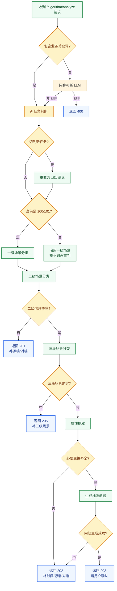
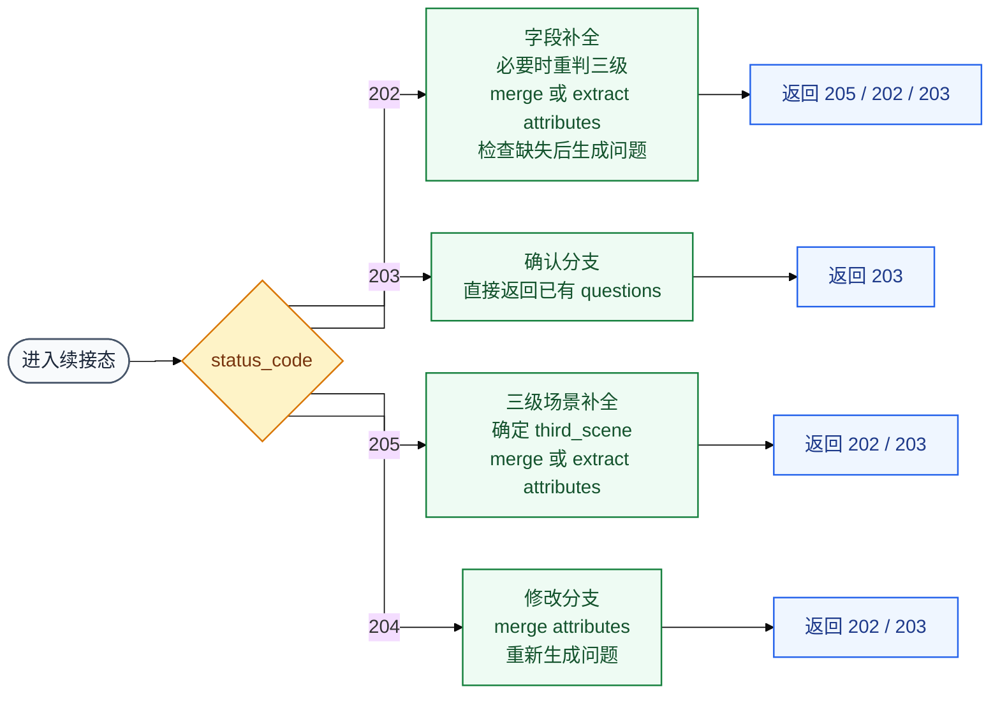
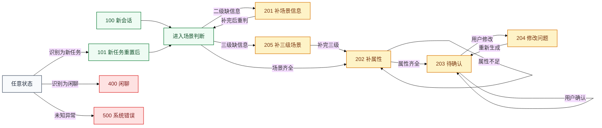

# chatBI

面向 NGFA 流量分析场景的对话式项目。当前仓库保留的是一套可直接运行的 Python/Streamlit/Flask 链路，核心目标是完成场景识别、信息补全、字段抽取和问题改写。

## 当前运行链

- `./start.sh restart`
  - 启动 `main.py`：算法服务，提供 `/algorithm/analyze`
  - 启动 `backend_server.py`：任务编排服务，提供 `/task/process`
  - 启动 `web.py`：Streamlit 前端
- `python process_excel_questions.py`
  - 用 Excel 回归当前能力
  - 输入文件：`ngfa数据查询sql汇总关键词.xlsx`
  - 输出文件：`chatbi_result_full.xlsx`
  - 运行前需要先执行 `./start.sh restart`

## 主要文件

- `start.sh`：统一启动/停止/重启脚本
- `main.py`：算法主服务，负责闲聊判断、新任务判断、一级/二级/三级场景分类、属性提取和模板填充
- `backend_server.py`：接收前端请求，构建上下文，转发给算法服务
- `web.py`：Streamlit 聊天页面
- `process_excel_questions.py`：Excel 批量回归脚本
- `hanlp_service.py`：可选的历史 NLP 服务，默认启动链不依赖它

## 核心目录

- `service/`
  - `primary_scene_classification.py`：一级场景分类
  - `scene_classification_service.py`：二级场景分类
  - `third_scene_classification_service.py`：三级场景分类
  - `attribute_extraction_service.py`：字段抽取
  - `fill_template_pipeline_service.py`：模板填充与问题改写
- `core/session_manager/`
  - `context_builder.py`：对话上下文整理
- `data_source/`
  - `data_source.py`、`send_request.py`：服务间请求封装
- `models/`
  - `llm_clients.py`：大模型统一接入层
- `prompts/`
  - `state_prompt.py`：当前在用的聊天/新任务提示词
  - `scene_prompt.toml`：二级场景提示词模板
- `utils/`
  - `logger.py`：日志
  - `json_utils.py`：JSON 安全解析
  - `test_supplement.py`：Excel 测试补充值

## 关键配置

- `common_config.ini`
  - 服务地址
  - 大模型地址和密钥
  - 通用状态码和场景映射
- `defaults.toml`
  - 模板填充默认值
  - Excel 测试补充值

## 流程总览

当前链路不是单一算法服务直接回答，而是按下面这条路径串起来：

1. `web.py` 负责维护前端会话状态，向后端发送 `session_id`、`status_code`、历史消息和当前场景信息。
2. `backend_server.py` 负责按 `session_id` 恢复服务端状态，并在历史不全时决定是继续续接还是保守降级。
3. `main.py` 负责闲聊判断、新任务判断、一级/二级/三级场景判断、属性提取、缺失检查和标准问题生成。
4. `fill_template_pipeline_service.py` 在场景和属性齐全后生成标准问题，并做问题改写。

## 流程图

建议按这个顺序看：

1. 先看“端到端总览”
2. 再看“算法主线”
3. 最后看“多轮续接分支”和“状态码流转”

### 端到端总览

```mermaid
%%{init: {'theme': 'base', 'themeVariables': { 'fontSize': '18px', 'fontFamily': 'Trebuchet MS, PingFang SC, sans-serif' }, 'flowchart': { 'curve': 'stepBefore' }}}%%
flowchart LR
    U([用户输入]) --> FE[web.py<br/>维护 messages 和 conversation_state]
    FE --> REQ[请求体<br/>session_id / status_code / scenes / history]
    REQ --> BE[backend_server.py<br/>恢复状态]
    BE --> SAFE{上下文足够安全续接?}
    SAFE -->|是| ALG[main.py<br/>闲聊判断 / 新任务判断 / 场景判断 / 属性提取 / 问题生成]
    SAFE -->|否| RESET[降级为 100<br/>重新开始]
    RESET --> ALG
    ALG --> RESP[结构化响应<br/>status_code / scenes / attributes / questions]
    RESP --> STORE[backend_server.py<br/>按 session_id 更新状态]
    STORE --> UI[web.py<br/>拆分 display 和 payload]
    UI --> NEXT([等待下一轮输入])

    classDef frontend fill:#FFF7ED,stroke:#C2410C,color:#7C2D12,stroke-width:1.5px;
    classDef backend fill:#EFF6FF,stroke:#2563EB,color:#1E3A8A,stroke-width:1.5px;
    classDef algo fill:#EEFBF3,stroke:#15803D,color:#14532D,stroke-width:1.5px;
    classDef state fill:#F8FAFC,stroke:#475569,color:#1E293B,stroke-width:1.5px;

    class FE,UI frontend;
    class REQ,BE,SAFE,RESET,STORE backend;
    class ALG,RESP algo;
    class U,NEXT state;
```



### 算法主线



### 多轮续接分支



### 状态码流转



## 模块职责

- `web.py`
  - 负责生成前端唯一 `session_id`
  - 维护 `messages` 和 `conversation_state`
  - 将结构化状态和展示文案分离
- `backend_server.py`
  - 负责按 `session_id` 维护服务端状态
  - 负责状态恢复优先级控制
  - 在历史不全时做保守降级
- `main.py`
  - 负责闲聊判断和新任务判断
  - 负责一级、二级、三级场景分类
  - 负责属性提取、补充、检查和问题生成
- `attribute_extraction_service.py`
  - 负责抽取源端、对端、时间、粒度、流向、数据类型等属性
  - 负责缺失属性检测和多轮属性合并
- `fill_template_pipeline_service.py`
  - 负责根据属性拼装标准问题
  - 负责最终问题改写

## 多轮状态设计

- `100/101`：新会话或新任务，重新做一级场景判断
- `201`：二级场景还缺信息，通常补源端/对端
- `205`：三级场景不够明确，需要用户补充粒度
- `202`：场景已确定，但属性不全，需要继续补时间/源端/对端等
- `203`：问题已生成，等待用户确认
- `204`：用户在上一条问题基础上修改条件
- `400`：闲聊
- `500`：异常或未知状态

当前多轮状态恢复采用：

1. 请求显式字段
2. 服务端 `session_id` 对应状态
3. 历史 assistant 消息中的结构化 payload
4. 默认值

如果当前请求是续接态，但关键上下文不完整，后端会主动降级回 `100`，避免错误续接到旧任务。

## 使用方式

1. 根据实际环境更新 `common_config.ini` 和 `defaults.toml`
2. 启动项目：

```bash
./start.sh restart
```

3. 使用网页入口：
   - 启动后访问 Streamlit 页面
4. 使用 Excel 回归：

```bash
python process_excel_questions.py
```

## 目录结构

```text
chatBI/
├── backend_server.py
├── main.py
├── web.py
├── process_excel_questions.py
├── start.sh
├── common_config.ini
├── defaults.toml
├── prompts/
├── service/
├── models/
├── data_source/
├── core/
└── utils/
```

## 说明

- 当前仓库已经移除了旧的 Docker、Maven、PyArmor 打包链和未接入的历史脚本。
- `README.md` 以现在这套可运行结构为准，不再描述已经删除的状态机、算法适配器和旧测试脚本。

包含关键词: 自己手动创建的

是否是一级场景 是根据大模型返回的的是100或者101 
第一次问 是100 
101 是大模型判断的 qwen-72b


属性提取 规则+大模型  最开始的属性是从产品提的问题中提取的
提取成9个属性
二级场景 是根据源端目的端判断的 