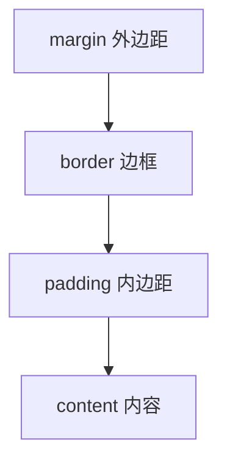
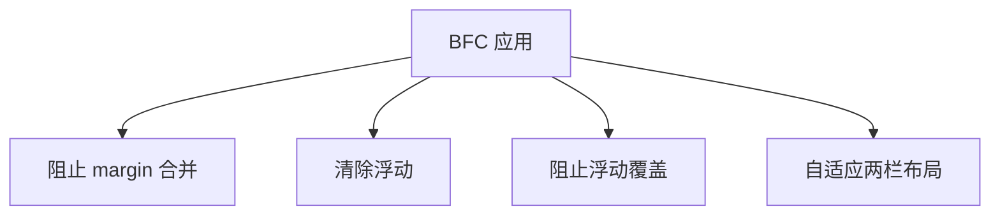
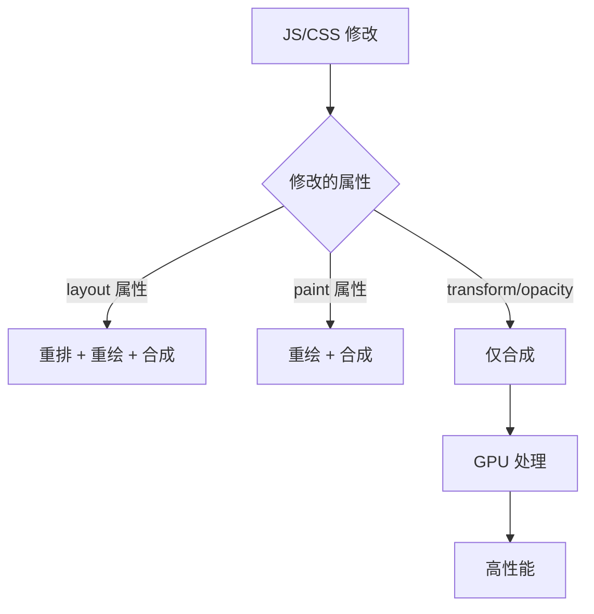

# CSS 高频面试题与详细回答

> 文档定位：系统梳理 CSS 在面试中的高频问题，涵盖盒模型、选择器、布局、定位、Flex/Grid、动画、响应式、BFC、层叠上下文等核心考点。
>
> 适用人群：前端工程师，尤其是需要深入理解 CSS 布局原理、解决浏览器兼容性问题的开发者。
>
> 阅读建议：先掌握盒模型与选择器（一至二章），再学习布局与定位（三至五章），最后攻克动画与响应式（六至八章）。重点关注「盒模型」「BFC」「Flex/Grid」「定位」「层叠上下文」五大核心模块。

---

## 目录

- [CSS 高频面试题与详细回答](#css-高频面试题与详细回答)
  - [目录](#目录)
  - [一、盒模型](#一盒模型)
    - [Q1. 什么是 CSS 盒模型？](#q1-什么是-css-盒模型)
    - [Q2. 标准盒模型 vs IE 盒模型？](#q2-标准盒模型-vs-ie-盒模型)
    - [Q3. box-sizing 的作用？](#q3-box-sizing-的作用)
      - [全局最佳实践](#全局最佳实践)
    - [Q4. margin 合并（重叠）问题？（塌陷问题）](#q4-margin-合并重叠问题塌陷问题)
      - [合并规则](#合并规则)
      - [解决 margin 合并](#解决-margin-合并)
  - [二、选择器与优先级](#二选择器与优先级)
    - [Q5. CSS 选择器有哪些？](#q5-css-选择器有哪些)
    - [Q6. CSS 优先级如何计算？](#q6-css-优先级如何计算)
      - [优先级权重](#优先级权重)
      - [计算规则](#计算规则)
    - [Q7. !important 的作用与缺点？](#q7-important-的作用与缺点)
      - [作用](#作用)
      - [缺点](#缺点)
      - [替代方案](#替代方案)
  - [三、布局](#三布局)
    - [Q8. 常见的 CSS 布局方式？](#q8-常见的-css-布局方式)
    - [Q9. Flex 布局常用属性？](#q9-flex-布局常用属性)
      - [容器属性](#容器属性)
      - [子元素属性](#子元素属性)
      - [flex 简写](#flex-简写)
    - [Q10. Grid 布局常用属性？](#q10-grid-布局常用属性)
      - [容器属性](#容器属性-1)
      - [子元素属性](#子元素属性-1)
    - [Q11. 如何实现水平垂直居中？](#q11-如何实现水平垂直居中)
      - [方法1：Flexbox（推荐）](#方法1flexbox推荐)
      - [方法2：Grid（更简洁）](#方法2grid更简洁)
      - [方法3：绝对定位 + transform](#方法3绝对定位--transform)
      - [方法4：绝对定位 + margin auto（需定宽高）](#方法4绝对定位--margin-auto需定宽高)
      - [方法5：table-cell](#方法5table-cell)
  - [四、定位与 BFC](#四定位与-bfc)
    - [Q12. position 有哪些值？](#q12-position-有哪些值)
    - [Q13. 什么是 BFC？如何触发？](#q13-什么是-bfc如何触发)
      - [BFC 定义](#bfc-定义)
      - [触发条件](#触发条件)
    - [Q14. BFC 的应用场景？](#q14-bfc-的应用场景)
      - [1. 阻止 margin 合并](#1-阻止-margin-合并)
      - [2. 清除浮动](#2-清除浮动)
      - [3. 阻止元素被浮动覆盖](#3-阻止元素被浮动覆盖)
  - [五、层叠与定位](#五层叠与定位)
    - [Q15. 层叠上下文与 z-index？](#q15-层叠上下文与-z-index)
      - [层叠上下文](#层叠上下文)
      - [层叠顺序（从下到上）](#层叠顺序从下到上)
      - [z-index 注意事项](#z-index-注意事项)
    - [Q16. absolute 相对于谁定位？](#q16-absolute-相对于谁定位)
  - [六、动画与过渡](#六动画与过渡)
    - [Q17. transition 和 animation 区别？](#q17-transition-和-animation-区别)
      - [transition](#transition)
      - [animation](#animation)
    - [Q18. CSS 动画性能优化？](#q18-css-动画性能优化)
      - [推荐动画属性](#推荐动画属性)
    - [Q19. transform 为什么不会触发重排？](#q19-transform-为什么不会触发重排)
  - [七、响应式与适配](#七响应式与适配)
    - [Q20. 响应式布局方案？](#q20-响应式布局方案)
    - [Q21. rem 和 em 的区别？](#q21-rem-和-em-的区别)
      - [rem 适配方案](#rem-适配方案)
    - [Q22. 媒体查询怎么用？](#q22-媒体查询怎么用)
  - [八、高级特性](#八高级特性)
    - [Q23. CSS 变量（自定义属性）？](#q23-css-变量自定义属性)
      - [JS 操作 CSS 变量](#js-操作-css-变量)
    - [Q24. CSS 伪类和伪元素区别？](#q24-css-伪类和伪元素区别)
    - [Q25. 如何清除浮动？](#q25-如何清除浮动)
      - [方法1：clearfix（推荐）](#方法1clearfix推荐)
      - [方法2：overflow](#方法2overflow)
      - [方法3：额外标签](#方法3额外标签)
  - [九、综合实战题](#九综合实战题)
    - [Q26. 如何实现一个三角形？](#q26-如何实现一个三角形)
    - [Q27. 如何实现 0.5px 的线？](#q27-如何实现-05px-的线)
      - [方法1：transform scale（推荐）](#方法1transform-scale推荐)
      - [方法2：box-shadow](#方法2box-shadow)
      - [方法3：linear-gradient](#方法3linear-gradient)
      - [方法4：border-image](#方法4border-image)
  - [十、速答与踩坑总结](#十速答与踩坑总结)
    - [10.1 速答卡片](#101-速答卡片)
    - [10.2 实战踩坑 10 例](#102-实战踩坑-10-例)
    - [10.3 复习优先级表](#103-复习优先级表)

---

## 一、盒模型

### Q1. 什么是 CSS 盒模型？

```
CSS 将每个元素表示为一个矩形盒子，由内到外四层：
  content → padding → border → margin
```



| 层级 | 说明 | CSS 属性 |
|------|------|---------|
| **content** | 内容区，显示文本/图像 | `width` / `height` |
| **padding** | 内容与边框之间的距离 | `padding` |
| **border** | 边框 | `border` |
| **margin** | 元素与其他元素的距离 | `margin` |

---

### Q2. 标准盒模型 vs IE 盒模型？

| 维度 | content-box（标准） | border-box（IE） |
|------|-------------------|-----------------|
| **width 包含** | 仅 content | content + padding + border |
| **总宽公式** | width + padding + border + margin | width + margin |
| **改 padding/border** | 总宽变化 | 总宽不变，content 缩小 |
| **默认** | ✅ 浏览器默认 | ❌ 需显式设置 |
| **推荐** | 精确控制内容 | 布局首选 |

```css
/* 标准盒模型：width = 100px 仅 content */
box {
  box-sizing: content-box;
  width: 100px;
  padding: 10px;
  border: 5px solid #000;
}
/* 实际宽度 = 100 + 20 + 10 = 130px */

/* IE 盒模型：width = 100px 包含 padding + border */
box {
  box-sizing: border-box;
  width: 100px;
  padding: 10px;
  border: 5px solid #000;
}
/* 实际宽度 = 100px，content = 70px */
```

---

### Q3. box-sizing 的作用？

```css
/* 标准盒模型 */
box-sizing: content-box;

/* IE 盒模型（推荐） */
box-sizing: border-box;

/* 继承父元素 */
box-sizing: inherit;
```

#### 全局最佳实践

```css
*, *::before, *::after {
  box-sizing: border-box;
}
```

> **为什么推荐 border-box？** 设置 width 后所见即所得，padding/border 不会撑大元素，布局更直观。

---

### Q4. margin 合并（重叠）问题？（塌陷问题）

#### 合并规则

```
相邻块级元素的垂直 margin 会合并，取较大值
  - 上下 margin 合并
  - 父子 margin 合并（父无 border/padding 时）
  - 空元素自身 margin 合并
水平 margin 不合并
```

```css
/* 示例：上下 margin 合并 */
.box1 { margin-bottom: 20px; }
.box2 { margin-top: 30px; }
/* 实际间距 = 30px（不是 50px） */
```

#### 解决 margin 合并

| 方法 | 说明 |
|------|------|
| **触发 BFC** | overflow: hidden / display: flow-root |
| **用 padding 代替** | 避免 margin 合并 |
| **只设一方 margin** | 统一用 margin-bottom |
| **flex/grid 布局** | 子元素 margin 不合并 |

---

## 二、选择器与优先级

### Q5. CSS 选择器有哪些？

| 类型 | 示例 | 说明 |
|------|------|------|
| **元素选择器** | `div` | 标签名 |
| **类选择器** | `.class` | class 属性 |
| **ID 选择器** | `#id` | id 属性 |
| **通配符** | `*` | 所有元素 |
| **后代选择器** | `div p` | div 内所有 p |
| **子代选择器** | `div > p` | div 的直接子 p |
| **相邻兄弟** | `div + p` | div 后面紧跟的 p |
| **通用兄弟** | `div ~ p` | div 后面所有 p |
| **属性选择器** | `[type="text"]` | 属性匹配 |
| **伪类** | `:hover` | 状态 |
| **伪元素** | `::before` | 虚拟元素 |

---

### Q6. CSS 优先级如何计算？

#### 优先级权重

| 选择器 | 权重 |
|--------|------|
| **!important** | 最高 |
| **行内样式** | 1000 |
| **ID 选择器** | 100 |
| **类/伪类/属性** | 10 |
| **元素/伪元素** | 1 |
| **通配符 `*`** | 0 |

#### 计算规则

```
1. 比较 !important，有则最高
2. 比较行内样式
3. 比较 ID 数量
4. 比较类/伪类/属性数量
5. 比较元素/伪元素数量
6. 相同则后定义的覆盖先定义的
```

```css
/* 优先级计算 */
#header .nav li.active { }
/* ID:1, 类:2, 元素:1 → 0,1,2,1 */

div#main .content p { }
/* ID:1, 类:1, 元素:2 → 0,1,1,2 */
/* 第一个胜出（类数量 2 > 1） */
```

---

### Q7. !important 的作用与缺点？

#### 作用

```
!important 优先级最高，覆盖所有其他规则
```

```css
.box { color: red !important; }  /* 最高优先级 */
```

#### 缺点

```
1. 破坏优先级体系，难以调试
2. 不可覆盖（除非用更具体的 !important）
3. 降低可维护性
```

#### 替代方案

```
1. 提高选择器特异性（加 ID 或类）
2. 调整样式顺序（后定义的覆盖先定义的）
3. 使用行内样式
```

---

## 三、布局

### Q8. 常见的 CSS 布局方式？

| 布局 | 说明 | 适用场景 |
|------|------|---------|
| **普通流** | 默认布局（块级/行内） | 简单文档流 |
| **浮动** | float: left/right | 图文混排（已不推荐） |
| **定位** | position | 绝对定位元素 |
| **Flexbox** | 一维弹性布局 | 一维布局（行/列） |
| **Grid** | 二维网格布局 | 二维布局（行+列） |
| **多列** | column-count | 报纸式多列 |

---

### Q9. Flex 布局常用属性？

#### 容器属性

| 属性 | 值 | 说明 |
|------|-----|------|
| **display** | flex | 启用 Flex |
| **flex-direction** | row / column | 主轴方向 |
| **justify-content** | flex-start/center/space-between | 主轴对齐 |
| **align-items** | stretch/center/flex-start | 交叉轴对齐 |
| **flex-wrap** | nowrap/wrap | 是否换行 |
| **gap** | 10px | 子元素间距 |

#### 子元素属性

| 属性 | 说明 |
|------|------|
| **flex-grow** | 放大比例 |
| **flex-shrink** | 缩小比例 |
| **flex-basis** | 初始大小 |
| **flex** | 简写（grow shrink basis） |
| **align-self** | 单独对齐 |

```css
.container {
  display: flex;
  justify-content: center;      /* 水平居中 */
  align-items: center;          /* 垂直居中 */
  gap: 10px;                    /* 间距 */
}

.item {
  flex: 1;  /* 等分剩余空间 */
}
```

#### flex 简写

```css
flex: 1;           /* 1 1 0% */
flex: auto;        /* 1 1 auto */
flex: none;        /* 0 0 auto */
flex: 0 0 200px;   /* 固定 200px */
```

---

### Q10. Grid 布局常用属性？

#### 容器属性

| 属性 | 说明 |
|------|------|
| **display** | grid |
| **grid-template-columns** | 列定义 |
| **grid-template-rows** | 行定义 |
| **gap** | 间距 |
| **justify-items** | 单元格水平对齐 |
| **align-items** | 单元格垂直对齐 |

```css
.container {
  display: grid;
  grid-template-columns: 200px 1fr 1fr;  /* 3列 */
  grid-template-rows: auto 1fr;          /* 2行 */
  gap: 10px;
}
```

#### 子元素属性

| 属性 | 说明 |
|------|------|
| **grid-column** | 列起始/结束 |
| **grid-row** | 行起始/结束 |
| **grid-area** | 区域 |

```css
.header { grid-column: 1 / -1; }  /* 跨所有列 */
.sidebar { grid-row: 1 / 3; }     /* 跨2行 */
```

---

### Q11. 如何实现水平垂直居中？

#### 方法1：Flexbox（推荐）

```css
.parent {
  display: flex;
  justify-content: center;  /* 水平 */
  align-items: center;      /* 垂直 */
}
```

#### 方法2：Grid（更简洁）

```css
.parent {
  display: grid;
  place-items: center;  /* 水平 + 垂直居中 */
}
```

#### 方法3：绝对定位 + transform

```css
.child {
  position: absolute;
  top: 50%;
  left: 50%;
  transform: translate(-50%, -50%);
}
```

#### 方法4：绝对定位 + margin auto（需定宽高）

```css
.child {
  position: absolute;
  top: 0; left: 0; right: 0; bottom: 0;
  margin: auto;
  width: 200px;
  height: 200px;
}
```

#### 方法5：table-cell

```css
.parent {
  display: table-cell;
  vertical-align: middle;
  text-align: center;
}
```

| 方法 | 需定宽高 | 兼容性 | 推荐度 |
|------|---------|-------|--------|
| Flex | ❌ | IE11+ | ⭐⭐⭐⭐⭐ |
| Grid | ❌ | IE10+ | ⭐⭐⭐⭐⭐ |
| transform | ❌ | IE9+ | ⭐⭐⭐⭐ |
| margin auto | ✅ | 全兼容 | ⭐⭐⭐ |
| table-cell | ❌ | 全兼容 | ⭐⭐ |

---

## 四、定位与 BFC

### Q12. position 有哪些值？

| 值 | 说明 | 是否脱离文档流 | 参考对象 |
|----|------|-------------|---------|
| **static** | 默认，正常流 | ❌ | - |
| **relative** | 相对定位 | ❌ | 自身原位置 |
| **absolute** | 绝对定位 | ✅ | 最近的非 static 祖先 |
| **fixed** | 固定定位 | ✅ | 视口 |
| **sticky** | 粘性定位 | ❌ | 滚动容器 |

```css
/* relative：相对自身偏移，不脱离文档流 */
.relative { position: relative; top: 10px; left: 10px; }

/* absolute：脱离文档流，相对最近定位祖先 */
.absolute { position: absolute; top: 0; right: 0; }

/* fixed：固定在视口 */
.fixed { position: fixed; bottom: 0; left: 0; }

/* sticky：滚动到阈值时固定 */
.sticky { position: sticky; top: 0; }
```

---

### Q13. 什么是 BFC？如何触发？

#### BFC 定义

```
BFC（Block Formatting Context）块级格式化上下文
是一个独立的渲染区域，内部元素的布局不影响外部
```

#### 触发条件

| 条件 | 示例 |
|------|------|
| **overflow 非 visible** | `overflow: hidden/auto/scroll` |
| **float 非 none** | `float: left/right` |
| **position 绝对/固定** | `position: absolute/fixed` |
| **display** | `inline-block/flex/grid/flow-root` |
| **根元素** | `html` |

---

### Q14. BFC 的应用场景？

#### 1. 阻止 margin 合并

```css
.parent { overflow: hidden; }  /* 触发 BFC */
.child { margin-top: 20px; }   /* 不与父元素合并 */
```

#### 2. 清除浮动

```css
.parent { overflow: hidden; }  /* 触发 BFC，包含浮动子元素 */
```

#### 3. 阻止元素被浮动覆盖

```css
.sidebar { float: left; width: 200px; }
.content { overflow: hidden; }  /* BFC，不被 sidebar 覆盖 */
```



---

## 五、层叠与定位

### Q15. 层叠上下文与 z-index？

#### 层叠上下文

```
层叠上下文是一个三维概念（z 轴）
创建层叠上下文的条件：
  - position 非 static 且 z-index 非 auto
  - opacity < 1
  - transform 非 none
  - filter 非 none
  - will-change
  - isolation: isolate
```

#### 层叠顺序（从下到上）

```
1. 背景和边框（层叠上下文的）
2. 负 z-index
3. 块级盒子（正常流）
4. 浮动盒子
5. 行内盒子
6. z-index: auto / 0
7. 正 z-index
```

#### z-index 注意事项

```
1. z-index 只对定位元素（非 static）生效
2. 层叠上下文内的 z-index 只在内部比较
3. 父元素 z-index 低，子元素 z-index 再高也无法超过父级的兄弟
```

---

### Q16. absolute 相对于谁定位？

```
absolute 相对于最近的「非 static 定位」的祖先元素
如果没有，则相对于初始包含块（视口）
```

```css
.grandparent { position: relative; }
.parent { /* 默认 static */ }
.child { position: absolute; top: 0; }
/* child 相对 grandparent 定位（parent 是 static，跳过） */
```

---

## 六、动画与过渡

### Q17. transition 和 animation 区别？

| 维度 | transition | animation |
|------|-----------|-----------|
| **触发** | 需要事件触发（hover等） | 自动播放 |
| **关键帧** | 只有起止状态 | 多关键帧 @keyframes |
| **循环** | ❌ | ✅ infinite |
| **方向** | ❌ | ✅ alternate |
| **暂停** | ❌ | ✅ animation-play-state |

#### transition

```css
.box {
  transition: all 0.3s ease;
}
.box:hover {
  transform: scale(1.2);
}
```

#### animation

```css
@keyframes fadeIn {
  from { opacity: 0; }
  to { opacity: 1; }
}

.box {
  animation: fadeIn 1s ease infinite alternate;
}
```

---

### Q18. CSS 动画性能优化？

| 优化 | 说明 |
|------|------|
| **用 transform/opacity** | 只触发合成，不触发重排重绘 |
| **开启 GPU 加速** | will-change: transform |
| **避免动画属性** | width/height/top/left 会触发重排 |
| **contain 属性** | 隔离渲染，减少重绘范围 |
| **减少动画元素** | 过多动画元素导致卡顿 |

#### 推荐动画属性

```css
/* ✅ 高性能属性（只触发合成） */
transform: translate/scale/rotate
opacity

/* ❌ 低性能属性（触发重排/重绘） */
width/height/top/left/margin/padding
color/background/border
```

---

### Q19. transform 为什么不会触发重排？

```
transform 在合成层（compositor）处理，不影响布局
浏览器将 transform 元素提升为独立的合成层
在 GPU 上进行变换，不触发 layout（重排）和 paint（重绘）
```



---

## 七、响应式与适配

### Q20. 响应式布局方案？

| 方案 | 说明 |
|------|------|
| **媒体查询** | 不同断点应用不同样式 |
| **百分比布局** | 相对父元素 |
| **rem/vw** | 相对根元素/视口 |
| **Flexbox** | 弹性布局 |
| **Grid** | 网格布局 |
| **图片响应式** | srcset/picture |

---

### Q21. rem 和 em 的区别？

| 单位 | 基准 | 说明 |
|------|------|------|
| **em** | 父元素 font-size | 相对父元素，会叠加 |
| **rem** | 根元素 html font-size | 相对根元素，不叠加 |
| **vw/vh** | 视口宽/高 | 相对视口 |
| **%** | 父元素 | 相对父元素 |

```css
html { font-size: 16px; }

.box { font-size: 2em; }   /* 32px（相对父元素） */
.box { font-size: 2rem; }  /* 32px（相对 html） */
```

#### rem 适配方案

```js
// 动态设置根元素 font-size
function setRem() {
  const screenWidth = document.documentElement.clientWidth
  document.documentElement.style.fontSize = screenWidth / 10 + 'px'
}
// 设计稿 750px，1rem = 75px
```

---

### Q22. 媒体查询怎么用？

```css
/* 基础样式（移动端优先） */
.container { width: 100%; }

/* 平板 */
@media (min-width: 768px) {
  .container { width: 750px; }
}

/* 桌面 */
@media (min-width: 1200px) {
  .container { width: 1170px; }
}

/* 横屏 */
@media (orientation: landscape) {
  /* 横屏样式 */
}

/* 高分辨率屏 */
@media (-webkit-min-device-pixel-ratio: 2) {
  /* 高清屏样式 */
}
```

---

## 八、高级特性

### Q23. CSS 变量（自定义属性）？

```css
/* 定义变量 */
:root {
  --primary-color: #3498db;
  --spacing: 16px;
  --font-size: 14px;
}

/* 使用变量 */
.button {
  background-color: var(--primary-color);
  padding: var(--spacing);
  font-size: var(--font-size);
}

/* 带默认值 */
.box {
  color: var(--text-color, #333);
}
```

#### JS 操作 CSS 变量

```js
// 获取
const color = getComputedStyle(document.documentElement)
  .getPropertyValue('--primary-color')

// 设置
document.documentElement.style
  .setProperty('--primary-color', '#e74c3c')
```

---

### Q24. CSS 伪类和伪元素区别？

| 维度 | 伪类 | 伪元素 |
|------|------|--------|
| **语法** | 单冒号 `:hover` | 双冒号 `::before` |
| **作用** | 选中特定状态的元素 | 创建虚拟元素 |
| **数量** | 可叠加多个 | 同一元素最多 2 个（before/after） |
| **示例** | :hover/:active/:focus | ::before/::after/::first-line |

```css
/* 伪类：元素状态 */
a:hover { color: red; }
input:focus { border-color: blue; }

/* 伪元素：虚拟元素 */
.box::before {
  content: '前缀';
  color: gray;
}
.box::after {
  content: '后缀';
}
```

---

### Q25. 如何清除浮动？

#### 方法1：clearfix（推荐）

```css
.clearfix::after {
  content: '';
  display: block;
  clear: both;
}
```

#### 方法2：overflow

```css
.parent {
  overflow: hidden;  /* 触发 BFC */
}
```

#### 方法3：额外标签

```css
.clear { clear: both; }
```

```html
<div style="float: left"></div>
<div class="clear"></div>
```

| 方法 | 优点 | 缺点 |
|------|------|------|
| clearfix | 语义化好，无副作用 | 需加类 |
| overflow | 简单 | 可能裁剪内容 |
| 额外标签 | 简单 | 增加无意义 DOM |

---

## 九、综合实战题

### Q26. 如何实现一个三角形？

```css
/* 原理：border 透明，只留一边 */
.triangle {
  width: 0;
  height: 0;
  border-left: 50px solid transparent;
  border-right: 50px solid transparent;
  border-bottom: 80px solid #3498db;
}
```

```
     /\
    /  \
   /    \
  /______\
```

```css
/* 朝上的三角形 */
.triangle-up {
  border-left: 50px solid transparent;
  border-right: 50px solid transparent;
  border-bottom: 80px solid #3498db;
}

/* 朝右的三角形 */
.triangle-right {
  border-top: 50px solid transparent;
  border-bottom: 50px solid transparent;
  border-left: 80px solid #3498db;
}
```

---

### Q27. 如何实现 0.5px 的线？

#### 方法1：transform scale（推荐）

```css
.line {
  height: 1px;
  background: #000;
  transform: scaleY(0.5);
  transform-origin: 0 0;
}
```

#### 方法2：box-shadow

```css
.line {
  height: 1px;
  box-shadow: 0 0.5px 0 #000;
}
```

#### 方法3：linear-gradient

```css
.line {
  height: 1px;
  background: linear-gradient(to bottom, transparent 50%, #000 50%);
}
```

#### 方法4：border-image

```css
.line {
  border-bottom: 1px solid transparent;
  border-image: linear-gradient(to bottom, transparent 50%, #000 50%) 1;
}
```

---

## 十、速答与踩坑总结

### 10.1 速答卡片

**Q：CSS 盒模型有哪两种？**
A：content-box（标准，width 仅 content）和 border-box（IE，width 包含 padding+border）。

**Q：为什么推荐 border-box？**
A：所见即所得，padding/border 不撑大元素，布局更直观。

**Q：BFC 是什么？如何触发？**
A：块级格式化上下文，独立渲染区域；触发：overflow 非 visible、float、position absolute/fixed、flex/grid、display: flow-root。

**Q：BFC 的作用？**
A：阻止 margin 合并、清除浮动、阻止元素被浮动覆盖、自适应两栏布局。

**Q：CSS 优先级？**
A：!important > 行内 > ID > 类/伪类/属性 > 元素/伪元素。

**Q：如何水平垂直居中？**
A：Flexbox（justify-content + align-items）、Grid（place-items: center）、绝对定位+transform。

**Q：position 有哪些值？**
A：static、relative、absolute、fixed、sticky。

**Q：absolute 相对谁定位？**
A：最近的非 static 祖先，没有则相对视口。

**Q：transition 和 animation 区别？**
A：transition 需事件触发、只有起止；animation 自动播放、多关键帧、可循环。

**Q：为什么用 transform 做动画？**
A：只触发合成层，不重排不重绘，GPU 加速，性能好。

**Q：rem 和 em 区别？**
A：em 相对父元素 font-size（叠加），rem 相对根元素 html font-size（不叠加）。

**Q：z-index 什么时候生效？**
A：只对非 static 定位元素生效，且只在同一层叠上下文内比较。

**Q：如何清除浮动？**
A：clearfix（::after + clear:both）、overflow: hidden、额外标签 clear:both。

---

### 10.2 实战踩坑 10 例

| # | 场景 | 现象 | 根因 | 解决 |
|---|------|------|------|------|
| 1 | 布局溢出 | 元素超出容器 | 用了 content-box，padding 撑大 | 改 border-box |
| 2 | margin 合并 | 间距不符合预期 | 垂直 margin 取大值 | 触发 BFC 或用 padding |
| 3 | z-index 失效 | 层级不对 | 元素没定位或不在同层叠上下文 | 加 position 或隔离上下文 |
| 4 | 浮动塌陷 | 父容器高度为 0 | 子元素浮动脱离文档流 | 清除浮动（clearfix） |
| 5 | 动画卡顿 | 页面掉帧 | 用了 width/top 等属性 | 改用 transform/opacity |
| 6 | iOS 1px 线粗 | 边框显示 2px | DPR=2，1px 实际 2px | transform: scaleY(0.5) |
| 7 | sticky 不生效 | 滚动不固定 | 父元素 overflow 非 visible | 调整父元素 overflow |
| 8 | 行内元素间距 | 多余空格 | HTML 换行产生空白 | font-size:0 或去掉换行 |
| 9 | img 底部空白 | 图片下方有间隙 | img 是行内元素，基线对齐 | vertical-align: top 或 display:block |
| 10 | 文字省略不生效 | 省略号不显示 | 缺少 overflow:hidden | 加 overflow:hidden + white-space:nowrap |

---

### 10.3 复习优先级表

| 优先级 | 主题 | 考察概率 | 建议复习时间 |
|--------|------|---------|-------------|
| **P0** | 盒模型 | 95% | 15min |
| **P0** | BFC | 90% | 30min |
| **P0** | Flex 布局 | 95% | 30min |
| **P0** | 水平垂直居中 | 90% | 30min |
| **P0** | 优先级 | 85% | 30min |
| **P1** | position 定位 | 85% | 30min |
| **P1** | Grid 布局 | 75% | 30min |
| **P1** | 层叠上下文 | 75% | 30min |
| **P1** | 清除浮动 | 80% | 15min |
| **P2** | 动画性能 | 70% | 30min |
| **P2** | 响应式/rem | 70% | 30min |
| **P2** | CSS 变量 | 60% | 15min |
| **P3** | 伪类 vs 伪元素 | 60% | 15min |
| **P3** | 三角形/0.5px | 55% | 30min |

```mermaid
flowchart LR
    P0[盒模型] --> P0a[BFC]
    P0a --> P0b[Flex布局]
    P0b --> P0c[水平垂直居中]
    P0c --> P0d[优先级]
    P0d --> P1a[position定位]
    P1a --> P1b[Grid布局]
    P1b --> P1c[层叠上下文]
    P1c --> P1d[清除浮动]
    P1d --> P2a[动画性能]
    P2a --> P2b[响应式/rem]
    P2b --> P2c[CSS变量]
    P2c --> P3a[伪类vs伪元素]
    P3a --> P3b[三角形/0.5px]

    style P0 fill:#f8d7da,stroke-width:3px
    style P0a fill:#f8d7da,stroke-width:3px
    style P0b fill:#f8d7da,stroke-width:3px
    style P0c fill:#f8d7da,stroke-width:3px
    style P0d fill:#f8d7da,stroke-width:3px
```


