- [1、Flex 布局是什么？](#1flex-布局是什么)
- [2、基本概念](#2基本概念)
- [3、容器的属性](#3容器的属性)
  - [3.1 flex-direction属性](#31-flex-direction属性)
  - [3.2 flex-wrap属性](#32-flex-wrap属性)
      - [3.2.1 nowrap（默认）：不换行。](#321-nowrap默认不换行)
      - [3.2.2 wrap 换行，第一行在上方。](#322-wrap-换行第一行在上方)
      - [3.2.3 wrap-reverse：不换行。](#323-wrap-reverse不换行)
  - [3.3 flex-flow](#33-flex-flow)
  - [3.4 justify-content属性](#34-justify-content属性)
      - [特殊场景说明](#特殊场景说明)
  - [3.5 align-items属性](#35-align-items属性)
  - [3.6 align-content属性](#36-align-content属性)
- [4、项目的属性](#4项目的属性)
  - [4.1 order属性](#41-order属性)
  - [4.2 flex-grow属性](#42-flex-grow属性)
  - [4.3 flex-shrink属性](#43-flex-shrink属性)
  - [4.4 flex-basis属性](#44-flex-basis属性)
  - [4.5 flex属性](#45-flex属性)
  - [4.6 align-self属性](#46-align-self属性)
      - [与align-items区别](#与align-items区别)
- [5、骰子的布局](#5骰子的布局)
- [6、圣杯布局](#6圣杯布局)


### 1、Flex 布局是什么？

Flex 是 Flexible Box 的缩写，意为"弹性布局"，用来为盒状模型提供最大的灵活性。

任何一个容器都可以指定为 Flex 布局。

```
.box{
  display: flex;
}
```

行内元素也可以使用 Flex 布局。

```
.box{
  display: inline-flex;
}
```

注意，设为 Flex 布局以后，子元素的float、clear和vertical-align属性将失效。

### 2、基本概念

采用 Flex 布局的元素，称为 Flex 容器（flex container），简称"容器"。它的所有子元素自动成为容器成员，称为 Flex 项目（flex item），简称"项目"。

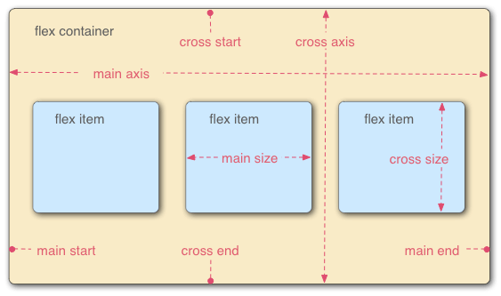

容器默认存在两根轴：水平的主轴（main axis）和垂直的交叉轴（cross axis）。主轴的开始位置（与边框的交叉点）叫做<span style="color: red">main start</span>，结束位置叫做<span style="color: red">main end</span>；交叉轴的开始位置叫做<span style="color: red">cross start</span>，结束位置叫做<span style="color: red">cross end</span>。

项目默认沿主轴排列。单个项目占据的主轴空间叫做 <span style="color: red">main size</span>，占据的交叉轴空间叫做 <span style="color: red">cross size</span>。

### 3、容器的属性

以下6个属性设置在容器上。

- flex-direction
- flex-wrap
- flex-flow
- justify-content
- align-items
- align-content

#### 3.1 flex-direction属性


<span style="color: red">flex-direction</span> 属性决定主轴的方向（即项目的排列方向）。

```
.box {
  flex-direction: row | row-reverse | column | column-reverse;
}
```
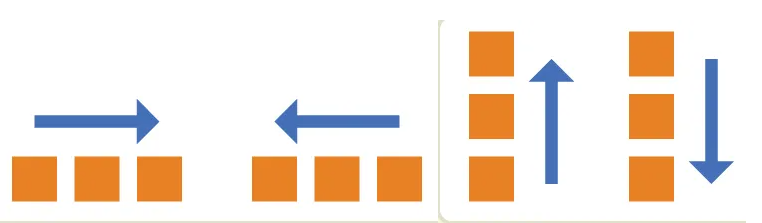

它可能有4个值。
- row（默认值）：主轴为水平方向，起点在左端。
- row-reverse：主轴为水平方向，起点在右端。
- column：主轴为垂直方向，起点在上沿。
- column-reverse：主轴为垂直方向，起点在下沿。

如果设置<span style="color: red">flex-direction：column </span> 那么<span style="color: red"> justify-content </span>还是会在水平方向起作用
#### 3.2 flex-wrap属性
默认情况下，项目都排在一条线（又称"轴线"）上。<span style="color: red"> flex-wrap</span> 属性定义，如果一条轴线排不下，如何换行。


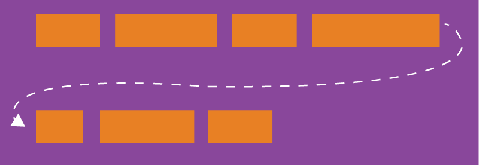


```
.box{
  flex-wrap: nowrap | wrap | wrap-reverse;
}
```

###### 3.2.1 nowrap（默认）：不换行。
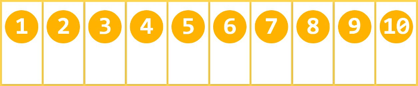
###### 3.2.2 wrap 换行，第一行在上方。
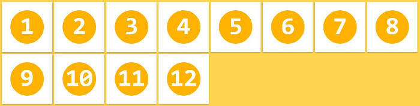
###### 3.2.3 wrap-reverse：不换行。
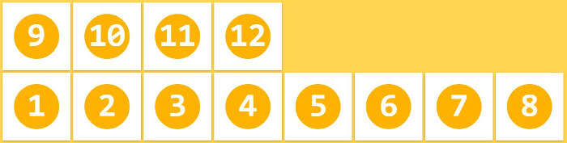

#### 3.3 flex-flow

<span style="color: red">flex-flow</span>属性是<span style="color: red">flex-direction</span>属性和<span style="color: red">flex-wrap</span>属性的简写形式，默认值为<span style="color: red">row nowrap</span>。

```
.box {
  flex-flow: <flex-direction> || <flex-wrap>;
}
```

#### 3.4 justify-content属性

<span style="color: red">justify-content</span> 属性定义了项目在主轴上的对齐方式。

```
.box {
  justify-content: end|start| left|right flex-start | flex-end | center | space-between | space-around | space-evenly;
}
```

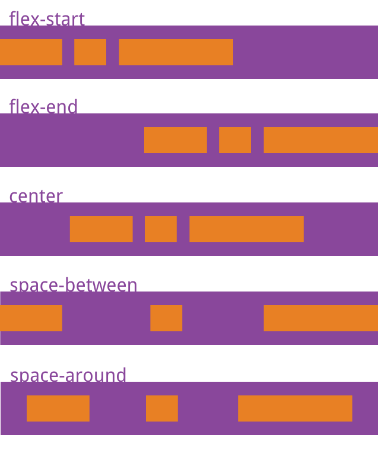

它可能取5个值，具体对齐方式与轴的方向有关。下面假设主轴为从左到右。


- flex-start（默认值）：左对齐
- flex-end：右对齐
- center： 居中
- space-between：两端对齐，项目之间的间隔都相等。
- space-around：每个项目两侧的间隔相等。所以，<span style="color: red">项目之间的间隔比项目与边框的间隔大一倍。</span>
- space-evenly： 项目均匀分布，项目之间的间隔以及项目与容器边缘的间隔都<span style="color: red">完全相等。</span>
- start: 类似于`flex-start`，但它是CSS Box Alignment Module中的通用对齐值。在常规的从左到右（LTR）的水平布局中，效果与`flex-start`相同。但在不同的书写模式（如从右到左或垂直布局）下，它会根据当前书写模式的起点对齐。
- end: 类似于`flex-end`，但它是通用对齐值。在LTR水平布局中，效果与`flex-end`相同。
- left: 项目向容器的左边缘对齐（物理方向）。如果主轴方向是水平的，并且是LTR，则与`flex-start`相同；如果是RTL，则与`flex-end`相同。注意：如果主轴方向是垂直的，则`left`可能没有效果或表现不同。
- right: 项目向容器的右边缘对齐（物理方向）。在LTR水平布局中，效果与`flex-end`相同；在RTL水平布局中，效果与`flex-start`相同。


###### 特殊场景说明
1、主轴方向变化时（flex-direction）所有取值行为自动适应主轴方向（如 column 时，flex-start 会顶部对齐）

#### 3.5 align-items属性

<span style="color: red">align-items</span>属性定义项目在交叉轴上如何对齐。

```
.box {
  align-items: flex-start | flex-end | center | baseline | stretch;
}
```
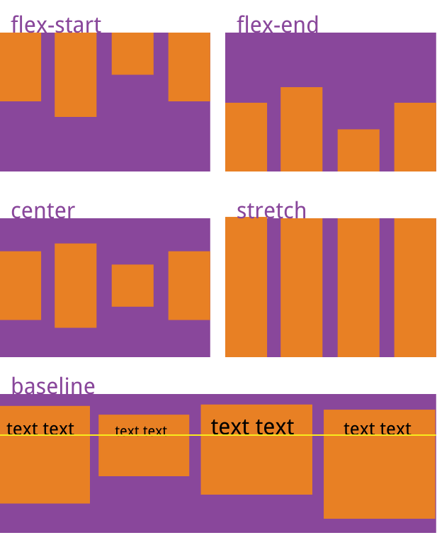

- flex-start：交叉轴的起点对齐。
- flex-end：交叉轴的终点对齐。
- center：交叉轴的中点对齐
- baseline: 项目的第一行文字的基线对齐。
- stretch（默认值）：如果项目未设置高度或设为auto，将占满整个容器的高度。
  
#### 3.6 align-content属性

<span style="color: red">align-content</span>属性定义了多根轴线的对齐方式。如果项目只有一根轴线，该属性不起作用。

```
.box {
  align-content: flex-start | flex-end | center | space-between | space-around | stretch|space-evenly;
}
```
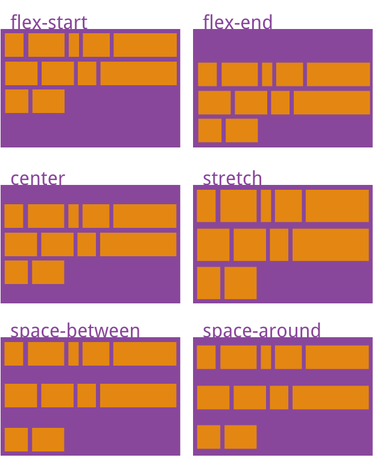

- normal（默认值, 在Flexbox规范中，align-content的默认值是normal, 对于Flex容器，normal被定义为等同于stretch。）。
- flex-start：与交叉轴的起点对齐。
- flex-end：与交叉轴的终点对齐。
- center：与交叉轴的中点对齐。
- space-between：与交叉轴两端对齐，轴线之间的间隔平均分布。
- space-around：每根轴线两侧的间隔都相等。所以，<span style="color: red">轴线之间的间隔比轴线与边框的间隔大一倍。</span>
- stretch：轴线占满整个交叉轴。
- space-evenly：所有间隔完全相等：行间间隔与边缘间隔均相等

**flex-start 和 flex-end 与书写方向无关**
 - flex-start = 交叉轴起点（row 时是顶部，column 时是左侧）。
 - flex-end = 交叉轴终点（row 时是底部，column 时是右侧）。
 - 受 direction 或 writing-mode 影响（但通常按默认方向理解）。
### 4、项目的属性

#### 4.1 order属性

<span style="color: red">order</span>属性定义项目的排列顺序。数值越小，排列越靠前，默认为0。

```
.item {
  order: <integer>;
}
```

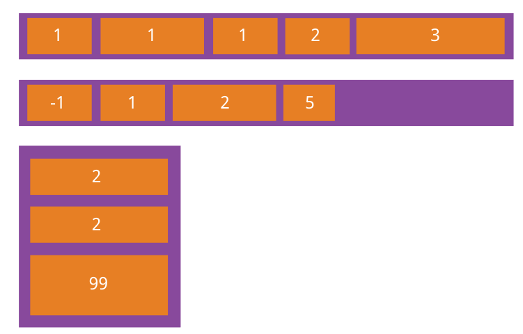

#### 4.2 flex-grow属性

<span style="color: red">flex-grow</span>属性定义项目的放大比例，默认为0，即如果存在剩余空间，也不放大(因为有剩余空间)。

```
.item {
  flex-grow: <number>; /* default 0 */
}
```
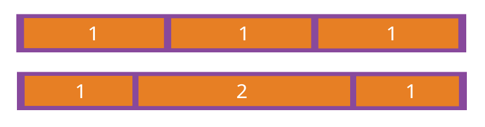


如果所有项目的<span style="color: red">flex-grow</span>属性都为1，则它们将等分剩余空间（如果有的话）。如果一个项目的<span style="color: red">flex-grow</span>属性为2，其他项目都为1，则前者占据的剩余空间将比其他项多一倍。


#### 4.3 flex-shrink属性

flex-shrink属性定义了项目的缩小比例，默认为1，即如果空间不足，该项目将缩小。是因为项目的宽度超过容器了，有一个超出空间，所以就要进行缩小。
```
.item {
  flex-shrink: <number>; /* default 1 */
}
```
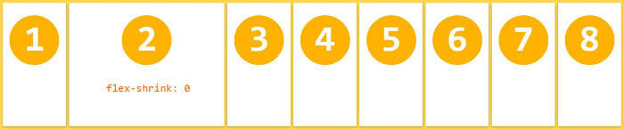

如果所有项目的<span style="color: red">flex-shrink</span>属性都为1，当空间不足时，都将等比例缩小。如果一个项目的<span style="color: red">flex-shrink</span>属性为0，那么表示不缩小。

负值对该属性无效。


实例：
```  <style>
    .container {
      display: flex;
      width: 450px;
      border: 2px solid #333;
      margin-bottom: 20px;
      background-color: #f0f0f0;
      background-color: yellow;
    }
    .item {
      box-sizing: border-box;
      /* padding: 20px; */
      text-align: center;
      color: white;
      font-weight: bold;
      /* flex-basis属性定义了项目占据主轴空间（main size）大小。 */
      flex-basis: 200px;
      height: 100px;
    }
    .item1 { 
      flex-shrink: 0;
      background-color: #3498db; 
    }
    .item2 {
      flex-shrink:1;
       background-color: #2ecc71; 
      }
    .item3 { 
      flex-shrink:2;
      background-color: #e74c3c;
     }
  </style>
  ```
  ```
 <div class="container">
    <div class="item item1">1 (flex-shrink:0)</div>
    <div class="item item2">2 (flex-shrink:1)</div>
    <div class="item item3">3 (flex-shrink:2)</div>
  </div>
```
效果图如下：
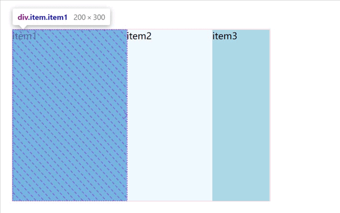

**计算过程**

1）计算超出空间中多少用来压缩。

```
要压缩的空间
 = 总超出空间 * ( 所有项目的flex-shrink之和 >= 1 ? 1 : 所有项目的flex-shrink之和 ) 。
 = (200 * 3 - 450)px * ( 3 >= 1 ? 1 : 3)
 = 150px
 ```

 2）计算每个项目缩小多少空间。

 ```
 项目1压缩的空间
 = 150px * ( 0 / 3 )
 = 0

项目2压缩的空间
 = 150px * ( 1 / 3 )
 = 50px

项目3压缩的空间
 = 150px * ( 2 / 3 )
 = 100px
 ```

 所以最终：项目1宽为200px、项目2宽为150px、项目3宽为100px。

**设置项目1、2、3的 flex-shrink 分别为 0.1、0.2、0.3：**

```
要压缩的空间
 = 总超出空间 * ( 所有项目的flex-shrink之和 >= 1 ? 1 : 所有项目的flex-shrink之和 ) 。
 = 150px * ( 0.6 >= 1 ? 1 : 0.6)
 = 90px
 ```

 2）计算每个项目缩小多少空间。

```
项目1压缩的空间
 = 90px * ( 0.1 / 0.6 )
 = 15px

项目2压缩的空间
 = 90px * ( 0.2 / 0.6 )
 = 30px

项目3压缩的空间
 = 90px * ( 0.3 / 0.6 )
 = 45px
AI生成项目

```
所以最终：项目1宽为185x、项目2宽为170px、项目3宽为155px。

运行效果如下：
效果图如下：
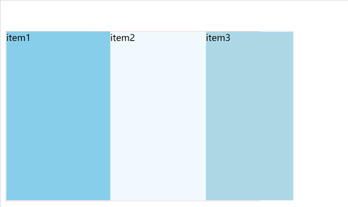

#### 4.4 flex-basis属性

<span style="color: red">flex-basis</span>属性定义了在分配多余空间之前，项目占据的主轴空间<span style="color: red">（main size）</span>。浏览器根据这个属性，计算主轴是否有多余空间。它的默认值为auto，即项目的本来大小。

```
.item {
  flex-basis: <length> | auto | content; /* default auto */
}
```
- auto: 默认值。表示flex项目根据其内容的尺寸来设置大小。如果设置了width/height，则使用width/height的值；否则，根据内容自动调整。
- content：表示flex项目根据其内容的尺寸来设置大小（类似于auto，但更明确地表示基于内容）。注意：这个值在实际使用中可能不如auto兼容性好，且规范中建议使用auto代替。
- 长度值（length）: 可以是具体的像素值（如200px）、百分比（如50%）、或者相对单位（如10em、5rem）等。例如：
  - 1. flex-basis: 200px; 表示项目的初始主轴尺寸为200px
  - 2. flex-basis: 50%; 表示项目的初始主轴尺寸为父容器主轴尺寸的50%。
- 关键字: 除了auto和content外，还可以使用max-content、min-content、fit-content等（这些是CSS Box Sizing Module Level 3中定义的，但浏览器支持可能有限）：
   - 1. max-content：表示项目根据其内容的最大尺寸（例如，不换行的文本长度）来设置大小。
   - 2. min-content：表示项目根据其内容的最小尺寸（例如，单词换行后的最小宽度）来设置大小。
   - 3. fit-content：表示项目根据可用空间来调整大小，但不会超过最大内容尺寸。

当<span style="color: red">flex-basis</span>设置为0时，项目将忽略其内容尺寸，完全根据<span style="color: red">flex-grow</span>和<span style="color: red">flex-shrink</span>来分配空间。这种情况下，项目的初始尺寸为0，然后根据<span style="color: red">flex-grow</span>的比例来分配剩余空间（或者根据<span style="color: red">flex-shrink</span>来收缩）。

当<span style="color: red">flex-basis</span>设置为auto时，项目的初始尺寸由width（或height，取决于主轴方向）属性决定。如果没有设置width，则根据内容自动调整。

<span style="color: red">flex-basis</span>与width/height的关系：在flex项目中，<span style="color: red">flex-basis</span>会覆盖width/height属性（当主轴为水平方向时，<span style="color: red">flex-basis</span>覆盖width；当主轴为垂直方向时，flex-basis覆盖height）。但是，如果<span style="color: red">flex-basis</span>设置为auto，则width/height会生效。

#### 4.5 flex属性

flex属性是<span style="color: red">flex-grow, flex-shrink </span> 和 <span style="color: red">flex-basis </span>的简写，默认值为0 1 auto。后两个属性可选。

```
.item {
  flex: none | [ <'flex-grow'> <'flex-shrink'>? || <'flex-basis'> ]
}
```

该属性有两个快捷值：auto (1 1 auto) 和 none (0 0 auto)
- flex: 1 等同于 flex: 1 1 0%
- flex: 2 3 等同于 flex: 2 3 0%
- flex: 1 2 300px 表示flex-grow:1, flex-shrink:2, flex-basis:300px
- 慎用 auto : flex: auto（1 1 auto）可能导致内容溢出（因 flex-basis 由内容决定）。

建议优先使用这个属性，而不是单独写三个分离的属性，因为浏览器会推算相关值。

#### 4.6 align-self属性

<span style="color: red">align-self</span>属性允许单个项目有与其他项目不一样的对齐方式，可覆盖<span style="color: red">align-items</span>属性。默认值为auto，表示继承父元素的<span style="color: red">align-items</span>属性，如果没有父元素，则等同于<span style="color: red">stretch</span>。

```
.item {
  align-self: auto | flex-start | flex-end | center | baseline | stretch;
}
```

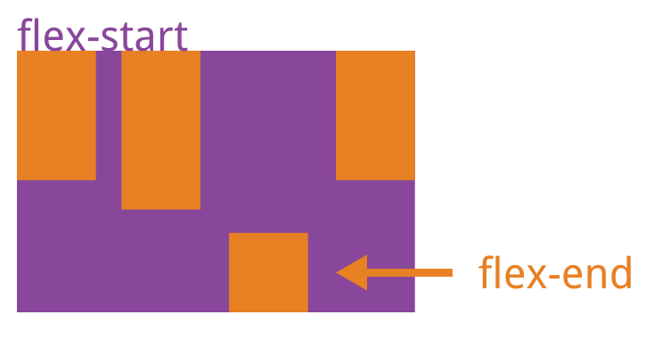

该属性可能取6个值，除了auto，其他都与align-items属性完全一致。

###### 与align-items区别
- align-self只影响单个项目，而align-items影响所有项目。

### 5、骰子的布局
 骰子的一面，最多可以放置6个点。下面，就来看看Flex如何实现，从1个点到6个点的布局。

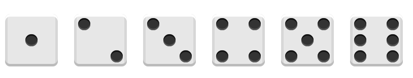

[代码详情](./骰子.html)

### 6、圣杯布局

页面从上到下，分成三个部分：头部（header），躯干（body），尾部（footer）。其中躯干又水平分成三栏，从左到右为：导航、主栏、副栏。

```
  <style>
.HolyGrail-body {
  display: flex;
  flex: 1;
}
nav, aside {
  /* 两个边栏的宽度设为12em */
  flex: 0 0 12em;
  height: 100px;
}

main {
flex: 1;
height: 100px;
 background-color: #3498db;
}
nav {
 background-color: #2ecc71;
}
aside {
 background-color: red;
}
  </style>
```
```
<body >
  <div class="HolyGrail-body">
    <nav >nav</nav>
    <main >main</main>
    <aside>aside</aside>
  </div>
</body>
</html>
```
效果图如下：
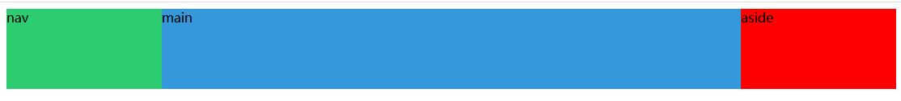
[阮一峰---CSS Flex 布局教程：语法篇](https://www.ruanyifeng.com/blog/2015/07/flex-grammar.html)

[阮一峰---CSS Flex 布局教程：实例篇](https://www.ruanyifeng.com/blog/2015/07/flex-examples.html)