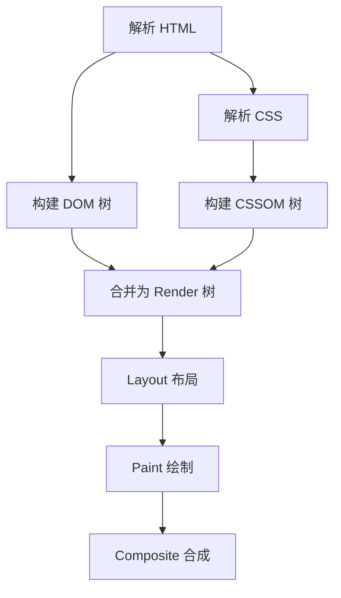

# HTML 高频面试题与详细回答

> 文档定位：系统梳理 HTML 在面试中的高频问题，涵盖文档结构、语义化、表单、多媒体、Canvas/SVG、Web Components、SEO、可访问性、性能优化等核心考点。
>
> 适用人群：前端工程师，尤其是需要深入理解 HTML 语义化、浏览器渲染、SEO 优化的开发者。
>
> 阅读建议：先掌握文档结构与语义化（一至二章），再学习表单与多媒体（三至四章），最后攻克 Canvas/SVG 与性能（五至八章）。重点关注「语义化」「DOCTYPE」「meta viewport」「SEO」「Canvas vs SVG」五大核心模块。

---

## 目录

- [一、文档结构与基础](#一文档结构与基础)
  - [Q1. HTML5 新特性有哪些？](#q1-html5-新特性有哪些)
  - [Q2. DOCTYPE 的作用？](#q2-doctype-的作用)
  - [Q3. 标准模式与怪异模式区别？](#q3-标准模式与怪异模式区别)
  - [Q4. meta viewport 的作用？](#q4-meta-viewport-的作用)
- [二、语义化](#二语义化)
  - [Q5. 什么是语义化？为什么重要？](#q5-什么是语义化为什么重要)
  - [Q6. HTML5 语义化标签有哪些？](#q6-html5-语义化标签有哪些)
  - [Q7. div 和 span 的区别？](#q7-div-和-span-的区别)
- [三、表单](#三表单)
  - [Q8. HTML5 新增 input 类型？](#q8-html5-新增-input-类型)
  - [Q9. 表单验证方式？](#q9-表单验证方式)
  - [Q10. get 和 post 区别？](#q10-get-和-post-区别)
- [四、多媒体与嵌入](#四多媒体与嵌入)
  - [Q11. img 标签的 loading 属性？](#q11-img-标签的-loading-属性)
  - [Q12. src 和 href 的区别？](#q12-src-和-href-的区别)
  - [Q13. link 和 @import 区别？](#q13-link-和-import-区别)
- [五、Canvas 与 SVG](#五canvas-与-svg)
  - [Q14. Canvas 和 SVG 区别？](#q14-canvas-和-svg-区别)
  - [Q15. Canvas 常用 API？](#q15-canvas-常用-api)
- [六、Web Components](#六web-components)
  - [Q16. 什么是 Web Components？](#q16-什么是-web-components)
  - [Q17. Shadow DOM 的作用？](#q17-shadow-dom-的作用)
- [七、SEO 与可访问性](#七seo-与可访问性)
  - [Q18. 如何做 SEO 优化？](#q18-如何做-seo-优化)
  - [Q19. 什么是可访问性（a11y）？](#q19-什么是可访问性a11y)
  - [Q20. alt 属性的作用？](#q20-alt-属性的作用)
- [八、性能优化](#八性能优化)
  - [Q21. 浏览器渲染流程？](#q21-浏览器渲染流程)
  - [Q22. 重排（Reflow）和重绘（Repaint）？](#q22-重排reflow和重绘repaint)
  - [Q23. 如何减少重排重绘？](#q23-如何减少重排重绘)
  - [Q24. 图片懒加载如何实现？](#q24-图片懒加载如何实现)
- [九、综合实战题](#九综合实战题)
  - [Q25. 如何实现一个自定义表单验证？](#q25-如何实现一个自定义表单验证)
  - [Q26. 如何做一个响应式导航栏？](#q26-如何做一个响应式导航栏)
- [十、速答与踩坑总结](#十速答与踩坑总结)
  - [10.1 速答卡片](#101-速答卡片)
  - [10.2 实战踩坑 10 例](#102-实战踩坑-10-例)
  - [10.3 复习优先级表](#103-复习优先级表)

---

## 一、文档结构与基础

### Q1. HTML5 新特性有哪些？

| 类别 | 新特性 |
|------|-------|
| **语义化标签** | header、nav、section、article、aside、footer |
| **表单增强** | 新 input 类型、required、pattern、datalist |
| **多媒体** | video、audio |
| **图形** | canvas、svg |
| **数据存储** | localStorage、sessionStorage、IndexedDB |
| **通信** | WebSocket、SSE |
| **离线** | Service Worker、Cache API |
| **地理定位** | Geolocation API |
| **Web Components** | Custom Elements、Shadow DOM |
| **拖拽** | Drag and Drop API |

---

### Q2. DOCTYPE 的作用？

#### 核心答案

```
DOCTYPE 是文档类型声明，告诉浏览器用哪种规范解析 HTML
必须放在文档第一行
```

```html
<!DOCTYPE html>  <!-- HTML5 声明 -->
```

#### 作用

```
1. 触发浏览器的标准模式（Standards Mode）
2. 没有 DOCTYPE 会进入怪异模式（Quirks Mode）
3. 怪异模式下布局和渲染与标准模式不同
```

#### 历史版本

```html
<!-- HTML4.01 Strict -->
<!DOCTYPE HTML PUBLIC "-//W3C//DTD HTML 4.01//EN"
  "http://www.w3.org/TR/html4/strict.dtd">

<!-- HTML5（简洁） -->
<!DOCTYPE html>
```

---

### Q3. 标准模式与怪异模式区别？

| 维度 | 标准模式 | 怪异模式 |
|------|---------|---------|
| **触发** | 有 DOCTYPE | 无 DOCTYPE 或错误 |
| **盒模型** | content-box | border-box（IE） |
| **行内元素尺寸** | 不支持 width/height | 支持 |
| **图片垂直对齐** | 基线对齐 | 底部对齐 |
| **百分比高度** | 需父元素有高度 | 可用 |

```
如何检测当前模式？
document.compatMode
  - 'CSS1Compat'：标准模式
  - 'BackCompat'：怪异模式
```

---

### Q4. meta viewport 的作用？

```html
<meta name="viewport" content="width=device-width, initial-scale=1.0, maximum-scale=1.0, user-scalable=no">
```

| 属性 | 说明 |
|------|------|
| **width=device-width** | 视口宽度 = 设备宽度 |
| **initial-scale=1.0** | 初始缩放比例 1:1 |
| **maximum-scale=1.0** | 最大缩放 |
| **minimum-scale=1.0** | 最小缩放 |
| **user-scalable=no** | 禁止用户缩放 |

#### 为什么需要 viewport？

```
移动端浏览器默认视口宽度约 980px（为了显示 PC 页面）
需要 viewport 让页面按设备宽度渲染，避免缩放
```

---

## 二、语义化

### Q5. 什么是语义化？为什么重要？

#### 核心答案

```
语义化：用正确的标签表达内容的含义（header 表头部，article 表文章）
而不是用 div + class 实现所有结构
```

#### 重要性

| 方面 | 说明 |
|------|------|
| **可读性** | 代码结构清晰，易于维护 |
| **SEO** | 搜索引擎更好理解内容结构 |
| **可访问性** | 屏幕阅读器正确朗读 |
| **样式分离** | 无 CSS 时仍有合理结构 |

```html
<!-- ❌ 无语义 -->
<div class="header">
  <div class="nav">...</div>
</div>
<div class="article">
  <div class="title">标题</div>
</div>

<!-- ✅ 语义化 -->
<header>
  <nav>...</nav>
</header>
<article>
  <h1>标题</h1>
</article>
```

---

### Q6. HTML5 语义化标签有哪些？

| 标签 | 说明 |
|------|------|
| **header** | 页面或区块的头部 |
| **nav** | 导航链接 |
| **main** | 页面主要内容 |
| **section** | 文档中的区段 |
| **article** | 独立的文章内容 |
| **aside** | 侧边栏/附属内容 |
| **footer** | 页面或区块的底部 |
| **figure** | 独立的流内容（图片+图注） |
| **figcaption** | figure 的标题 |
| **time** | 日期时间 |

```html
<body>
  <header>
    <h1>网站标题</h1>
    <nav>
      <ul>
        <li><a href="/">首页</a></li>
        <li><a href="/about">关于</a></li>
      </ul>
    </nav>
  </header>

  <main>
    <article>
      <h2>文章标题</h2>
      <time datetime="2026-09-06">2026年9月6日</time>
      <p>文章内容...</p>
      <figure>
        
        <figcaption>图注</figcaption>
      </figure>
    </article>
    <aside>
      <h3>相关推荐</h3>
    </aside>
  </main>

  <footer>
    <p>© 2026 版权所有</p>
  </footer>
</body>
```

---

### Q7. div 和 span 的区别？

| 维度 | div | span |
|------|-----|------|
| **类型** | 块级元素 | 行内元素 |
| **默认宽度** | 100% | 内容宽度 |
| **换行** | 前后换行 | 不换行 |
| **可包含** | 块级和行内 | 仅行内 |
| **用途** | 大区块容器 | 小段文本/行内容器 |

```html
<div>这是一个块级元素，独占一行</div>
<span>这是行内元素</span>
<span>和其他内容在同一行</span>
```

---

## 三、表单

### Q8. HTML5 新增 input 类型？

| 类型 | 说明 | 验证 |
|------|------|------|
| **email** | 邮箱 | 自动验证邮箱格式 |
| **url** | URL | 自动验证 URL 格式 |
| **number** | 数字 | 仅数字，可设 min/max/step |
| **tel** | 电话 | 移动端调出数字键盘 |
| **search** | 搜索 | 带清除按钮 |
| **range** | 滑块 | 数值滑块 |
| **date** | 日期 | 日期选择器 |
| **time** | 时间 | 时间选择器 |
| **color** | 颜色 | 颜色选择器 |
| **file** | 文件 | accept 限制类型 |

```html
<form>
  <input type="email" required placeholder="邮箱">
  <input type="number" min="0" max="100" step="1" value="50">
  <input type="date">
  <input type="color">
  <input type="range" min="0" max="100">
</form>
```

---

### Q9. 表单验证方式？

| 方式 | 说明 |
|------|------|
| **required** | 必填 |
| **pattern** | 正则验证 |
| **min/max** | 数值范围 |
| **minlength/maxlength** | 字符串长度 |
| **type** | 类型验证（email/url 等） |

```html
<form>
  <!-- 必填 -->
  <input type="text" required>

  <!-- 正则验证手机号 -->
  <input type="tel" pattern="^1[3-9]\d{9}$" title="请输入手机号">

  <!-- 长度限制 -->
  <input type="text" minlength="2" maxlength="20">

  <!-- 自定义验证 -->
  <input type="password" id="pwd">
  <input type="password" id="pwd2" oninput="checkPwd()">
</form>

<script>
function checkPwd() {
  const pwd = document.getElementById('pwd')
  const pwd2 = document.getElementById('pwd2')
  if (pwd.value !== pwd2.value) {
    pwd2.setCustomValidity('两次密码不一致')
  } else {
    pwd2.setCustomValidity('')
  }
}
</script>
```

---

### Q10. get 和 post 区别？

| 维度 | GET | POST |
|------|-----|------|
| **参数位置** | URL 后 | 请求体 |
| **参数长度** | 有限（URL 限制） | 无限制 |
| **安全性** | 低（参数可见） | 高（不可见） |
| **缓存** | 可缓存 | 不可缓存 |
| **历史** | 保留在历史 | 不保留 |
| **幂等** | 是 | 否 |
| **用途** | 获取数据 | 提交数据 |

```html
<!-- GET：参数在 URL -->
<form action="/search" method="get">
  <input name="q">
</form>
<!-- 提交后：/search?q=xxx -->

<!-- POST：参数在 body -->
<form action="/login" method="post">
  <input name="username">
  <input name="password">
</form>
```

---

## 四、多媒体与嵌入

### Q11. img 标签的 loading 属性？

```html
<!-- 懒加载：图片进入视口时才加载 -->


<!-- 立即加载（默认） -->

```

| 值 | 说明 |
|----|------|
| **lazy** | 懒加载，进入视口才加载 |
| **eager** | 立即加载（默认） |
| **auto** | 浏览器决定 |

> **注意**：原生懒加载无需 JS，但兼容性需关注（Chrome 77+、Safari 15.4+）。

---

### Q12. src 和 href 的区别？

| 属性 | 元素 | 说明 |
|------|------|------|
| **src** | img、script、iframe | 嵌入资源，替换当前元素 |
| **href** | a、link | 超链接，引用资源 |

#### src

```
src 会暂停页面解析，下载并执行资源（如 script）
img 的 src 是图片地址，加载后显示在 img 位置
```

#### href

```
href 是引用，不会阻塞解析（link 预加载）
a 的 href 是跳转地址，link 的 href 是样式表地址
```

```html
<!-- src：嵌入资源 -->

<script src="app.js"></script>

<!-- href：引用资源 -->
<link href="style.css" rel="stylesheet">
<a href="/home">首页</a>
```

---

### Q13. link 和 @import 区别？

| 维度 | link | @import |
|------|------|---------|
| **类型** | HTML 标签 | CSS 语法 |
| **加载** | 并行加载 | 串行加载（等父样式表加载完） |
| **DOM 控制** | ✅ JS 可操作 | ❌ |
| **兼容性** | 全兼容 | IE5+ |
| **优先级** | 高 | 低 |

```html
<!-- link（推荐） -->
<link rel="stylesheet" href="style.css">
```

```css
/* @import */
@import url('style.css');
```

---

## 五、Canvas 与 SVG

### Q14. Canvas 和 SVG 区别？

| 维度 | Canvas | SVG |
|------|--------|-----|
| **类型** | 位图（像素） | 矢量（数学公式） |
| **渲染** | JS 绘制，逐像素 | XML 描述，DOM 元素 |
| **缩放** | 失真 | 不失真 |
| **交互** | 需手动计算坐标 | 每个元素可绑定事件 |
| **性能** | 大量图形快 | 大量图形慢 |
| **适用** | 游戏、大数据可视化 | 图标、地图、可交互图形 |

```html
<!-- Canvas：JS 绘制 -->
<canvas id="c" width="200" height="100"></canvas>
<script>
  const ctx = document.getElementById('c').getContext('2d')
  ctx.fillStyle = 'red'
  ctx.fillRect(10, 10, 50, 50)
</script>

<!-- SVG：XML 描述 -->
<svg width="200" height="100">
  <rect x="10" y="10" width="50" height="50" fill="red" />
</svg>
```

---

### Q15. Canvas 常用 API？

```javascript
const canvas = document.getElementById('c')
const ctx = canvas.getContext('2d')

// 矩形
ctx.fillStyle = 'red'
ctx.fillRect(10, 10, 50, 50)  // 填充矩形
ctx.strokeRect(10, 10, 50, 50) // 描边矩形

// 路径
ctx.beginPath()
ctx.arc(100, 100, 50, 0, Math.PI * 2)  // 圆
ctx.fill()

// 文本
ctx.font = '20px Arial'
ctx.fillText('Hello', 50, 50)

// 图片
const img = new Image()
img.src = 'image.png'
img.onload = () => ctx.drawImage(img, 0, 0)

// 清除
ctx.clearRect(0, 0, canvas.width, canvas.height)
```

---

## 六、Web Components

### Q16. 什么是 Web Components？

```
Web Components 是一套原生组件化技术，由三部分组成：
  1. Custom Elements：自定义元素
  2. Shadow DOM：影子 DOM（样式隔离）
  3. HTML Templates：模板（template/slot）
```

#### 自定义元素

```javascript
class MyButton extends HTMLElement {
  constructor() {
    super()
    // Shadow DOM 样式隔离
    const shadow = this.attachShadow({ mode: 'open' })
    const btn = document.createElement('button')
    btn.textContent = this.getAttribute('text') || '按钮'
    shadow.appendChild(btn)
  }
}

// 注册自定义元素
customElements.define('my-button', MyButton)
```

```html
<!-- 使用 -->
<my-button text="点击我"></my-button>
```

---

### Q17. Shadow DOM 的作用？

```
Shadow DOM 将组件的 DOM 和 CSS 与外部隔离
外部样式不影响内部，内部样式不影响外部
```

```javascript
class MyComponent extends HTMLElement {
  constructor() {
    super()
    const shadow = this.attachShadow({ mode: 'open' })
    shadow.innerHTML = `
      <style>
        p { color: red; }  /* 只在 Shadow DOM 内生效 */
      </style>
      <p>我是 Shadow DOM 内容</p>
    `
  }
}
customElements.define('my-component', MyComponent)
```

#### mode 取值

| 值 | 说明 |
|----|------|
| **open** | 外部可通过 element.shadowRoot 访问 |
| **closed** | 外部无法访问 |

---

## 七、SEO 与可访问性

### Q18. 如何做 SEO 优化？

| 优化项 | 说明 |
|--------|------|
| **语义化标签** | 用 header/article/main 等 |
| **title** | 每页独立 title，含关键词 |
| **meta description** | 页面描述 |
| **h1-h6** | 合理使用标题层级 |
| **img alt** | 图片加 alt |
| **URL 结构** | 简洁、含关键词 |
| **sitemap** | 生成站点地图 |
| **robots.txt** | 控制爬虫 |
| **加载速度** | 压缩、懒加载、CDN |
| **结构化数据** | Schema.org 标记 |

```html
<head>
  <title>关键词 - 网站名称</title>
  <meta name="description" content="页面描述，含关键词">
  <meta name="keywords" content="关键词1,关键词2">
</head>

<body>
  <header>
    <h1>主标题（含关键词）</h1>
  </header>
  <main>
    <article>
      <h2>副标题</h2>
      
    </article>
  </main>
</body>
```

---

### Q19. 什么是可访问性（a11y）？

```
可访问性（Accessibility，a11y）：让残障人士也能使用网站
包括：视觉、听觉、运动、认知障碍
```

#### 常见措施

| 措施 | 说明 |
|------|------|
| **alt** | 图片描述 |
| **label** | 表单 label 关联 input |
| **aria-*** | ARIA 属性增强语义 |
| **键盘导航** | 所有功能可键盘操作 |
| **颜色对比** | 文字与背景对比度 ≥ 4.5:1 |
| **焦点样式** | 不隐藏 outline |

```html
<!-- label 关联 input -->
<label for="name">姓名：</label>
<input id="name" type="text">

<!-- aria-label -->
<button aria-label="关闭">×</button>

<!-- aria-live 动态内容通知 -->
<div aria-live="polite" id="msg"></div>
```

---

### Q20. alt 属性的作用？

```
alt 属性为图片提供文本替代
1. 图片加载失败时显示
2. 屏幕阅读器朗读
3. 搜索引擎理解图片内容
```

```html
<!-- 正确 -->


<!-- 装饰性图片：alt 为空 -->


<!-- ❌ 不要写"图片" -->

```

---

## 八、性能优化

### Q21. 浏览器渲染流程？



```
1. HTML 解析为 DOM 树
2. CSS 解析为 CSSOM 树
3. DOM + CSSOM 合并为 Render 树
4. Layout：计算节点位置和大小
5. Paint：绘制像素
6. Composite：合成层，显示到屏幕
```

---

### Q22. 重排（Reflow）和重绘（Repaint）？

| 概念 | 说明 | 触发条件 |
|------|------|---------|
| **重排** | 重新计算布局 | 改变尺寸、位置、显示 |
| **重绘** | 重新绘制像素 | 改变颜色、背景等外观 |

```
重排一定触发重绘，重绘不一定触发重排
重排性能开销 > 重绘
```

#### 触发重排的操作

```
- 添加/删除 DOM 元素
- 改变元素尺寸（width/height/padding/margin）
- 改变元素位置（top/left）
- 改变窗口大小
- 读取 offsetWidth/offsetHeight 等（强制重排）
```

---

### Q23. 如何减少重排重绘？

| 方法 | 说明 |
|------|------|
| **批量操作 DOM** | DocumentFragment 或先 display:none |
| **使用 transform** | 只触发合成，不重排 |
| **避免频繁读样式** | 缓存 offsetWidth 等 |
| **使用 class 切换样式** | 避免逐条改 style |
| **will-change** | 提前提升合成层 |
| **虚拟列表** | 长列表只渲染可视区 |

```javascript
// ❌ 频繁重排
for (let i = 0; i < 100; i++) {
  el.style.width = i + 'px'
}

// ✅ 批量修改
const fragment = document.createDocumentFragment()
for (let i = 0; i < 100; i++) {
  const div = document.createElement('div')
  fragment.appendChild(div)
}
el.appendChild(fragment)
```

---

### Q24. 图片懒加载如何实现？

#### 方法1：原生 loading="lazy"

```html

```

#### 方法2：IntersectionObserver

```javascript
// 获取所有懒加载图片
const imgs = document.querySelectorAll('img[data-src]')

const observer = new IntersectionObserver((entries) => {
  entries.forEach(entry => {
    if (entry.isIntersecting) {
      const img = entry.target
      img.src = img.dataset.src  // 设置真实地址
      img.removeAttribute('data-src')
      observer.unobserve(img)  // 停止观察
    }
  })
})

imgs.forEach(img => observer.observe(img))
```

```html
<!-- HTML 结构 -->

```

---

## 九、综合实战题

### Q25. 如何实现一个自定义表单验证？

```html
<form id="myForm" novalidate>
  <div>
    <label for="username">用户名：</label>
    <input id="username" name="username" required minlength="2" maxlength="20">
    <span class="error" data-for="username"></span>
  </div>
  <div>
    <label for="email">邮箱：</label>
    <input id="email" name="email" type="email" required>
    <span class="error" data-for="email"></span>
  </div>
  <button type="submit">提交</button>
</form>

<script>
const form = document.getElementById('myForm')

form.addEventListener('submit', (e) => {
  e.preventDefault()
  if (validateForm()) {
    console.log('提交成功')
  }
})

// 失焦时验证
form.querySelectorAll('input').forEach(input => {
  input.addEventListener('blur', () => validateField(input))
})

function validateField(input) {
  const errorEl = document.querySelector(`[data-for="${input.name}"]`)
  if (!input.checkValidity()) {
    errorEl.textContent = input.validationMessage
    return false
  }
  errorEl.textContent = ''
  return true
}

function validateForm() {
  let valid = true
  form.querySelectorAll('input').forEach(input => {
    if (!validateField(input)) valid = false
  })
  return valid
}
</script>
```

---

### Q26. 如何做一个响应式导航栏？

```html
<nav class="navbar">
  <div class="logo">Logo</div>
  <button class="menu-btn" aria-label="菜单">☰</button>
  <ul class="nav-links">
    <li><a href="/">首页</a></li>
    <li><a href="/about">关于</a></li>
    <li><a href="/contact">联系</a></li>
  </ul>
</nav>

<style>
.navbar {
  display: flex;
  align-items: center;
  padding: 1rem;
}
.nav-links {
  display: flex;
  list-style: none;
  gap: 1rem;
  margin-left: auto;
}
.menu-btn {
  display: none;
}

/* 移动端：汉堡菜单 */
@media (max-width: 768px) {
  .menu-btn {
    display: block;
    margin-left: auto;
  }
  .nav-links {
    display: none;
    flex-direction: column;
    position: absolute;
    top: 100%;
    left: 0;
    right: 0;
    background: #fff;
  }
  .nav-links.active {
    display: flex;
  }
}
</style>

<script>
const menuBtn = document.querySelector('.menu-btn')
const navLinks = document.querySelector('.nav-links')

menuBtn.addEventListener('click', () => {
  navLinks.classList.toggle('active')
})
</script>
```

---

## 十、速答与踩坑总结

### 10.1 速答卡片

**Q：DOCTYPE 的作用？**
A：文档类型声明，触发浏览器标准模式，避免怪异模式。

**Q：HTML5 新特性？**
A：语义化标签、新表单类型、video/audio、canvas/svg、localStorage、WebSocket、Web Components。

**Q：什么是语义化？**
A：用正确标签表达内容含义，利于 SEO、可访问性、可读性。

**Q：div 和 span 区别？**
A：div 是块级元素（独占一行），span 是行内元素（不换行）。

**Q：get 和 post 区别？**
A：GET 参数在 URL、可缓存、幂等；POST 参数在 body、不可缓存、不幂等。

**Q：src 和 href 区别？**
A：src 嵌入资源（替换当前元素，会阻塞），href 引用资源（超链接，不阻塞）。

**Q：link 和 @import 区别？**
A：link 并行加载、JS 可控；@import 串行加载、不可控。推荐 link。

**Q：Canvas 和 SVG 区别？**
A：Canvas 是位图（JS 绘制、性能好），SVG 是矢量（DOM 元素、可交互、不失真）。

**Q：什么是 Web Components？**
A：原生组件化：Custom Elements + Shadow DOM + Templates。

**Q：Shadow DOM 作用？**
A：样式和 DOM 隔离，组件内样式不影响外部。

**Q：如何做 SEO？**
A：语义化标签、title/description、h1-h6、img alt、sitemap、加载速度。

**Q：重排和重绘区别？**
A：重排是重新计算布局（开销大），重绘是重新绘制像素；重排一定触发重绘。

**Q：如何减少重排？**
A：批量操作 DOM、用 transform、缓存样式读取、class 切换样式。

**Q：图片懒加载实现？**
A：原生 loading="lazy" 或 IntersectionObserver。

---

### 10.2 实战踩坑 10 例

| # | 场景 | 现象 | 根因 | 解决 |
|---|------|------|------|------|
| 1 | 页面布局错乱 | IE 下布局异常 | 缺少 DOCTYPE 进入怪异模式 | 加 `<!DOCTYPE html>` |
| 2 | 移动端页面缩放 | 页面显示很小 | 缺 viewport | 加 meta viewport |
| 3 | 图片底部空白 | img 下方有间隙 | img 行内元素基线对齐 | vertical-align: top |
| 4 | 表单不能提交 | 提交按钮无效 | 表单无 submit 按钮或 type 错误 | button type="submit" |
| 5 | 图片不显示 | img 显示裂图 | src 路径错误或 alt 为空 | 检查路径，加 alt |
| 6 | SEO 收录差 | 搜索引擎不收录 | 无语义化、无 title | 用语义化标签，加 title |
| 7 | 重排卡顿 | 滚动时掉帧 | 频繁改 top/left | 改用 transform |
| 8 | Canvas 模糊 | 高清屏模糊 | 未处理 DPR | canvas.width *= devicePixelRatio |
| 9 | 表单验证不生效 | required 不提示 | 加了 novalidate | 去掉 novalidate 或手动验证 |
| 10 | a 标签跳转异常 | 新窗口打开无效 | target="_blank" 缺 rel | 加 rel="noopener noreferrer" |

---

### 10.3 复习优先级表

| 优先级 | 主题 | 考察概率 | 建议复习时间 |
|--------|------|---------|-------------|
| **P0** | 语义化 | 95% | 30min |
| **P0** | DOCTYPE 与渲染模式 | 90% | 30min |
| **P0** | meta viewport | 85% | 30min |
| **P0** | 表单与验证 | 85% | 30min |
| **P0** | 浏览器渲染流程 | 90% | 30min |
| **P1** | 重排与重绘 | 85% | 30min |
| **P1** | Canvas vs SVG | 75% | 30min |
| **P1** | SEO 优化 | 80% | 30min |
| **P1** | 性能优化 | 80% | 1h |
| **P2** | Web Components | 65% | 30min |
| **P2** | 可访问性 | 65% | 30min |
| **P2** | 多媒体标签 | 60% | 30min |
| **P3** | 自定义表单验证 | 60% | 30min |
| **P3** | 响应式导航 | 55% | 30min |

```mermaid
flowchart LR
    P0[语义化] --> P0a[DOCTYPE与渲染模式]
    P0a --> P0b[meta viewport]
    P0b --> P0c[表单与验证]
    P0c --> P0d[浏览器渲染流程]
    P0d --> P1a[重排与重绘]
    P1a --> P1b[Canvas vs SVG]
    P1b --> P1c[SEO优化]
    P1c --> P1d[性能优化]
    P1d --> P2a[Web Components]
    P2a --> P2b[可访问性]
    P2b --> P2c[多媒体标签]
    P2c --> P3a[自定义表单验证]
    P3a --> P3b[响应式导航]

    style P0 fill:#f8d7da,stroke-width:3px
    style P0a fill:#f8d7da,stroke-width:3px
    style P0b fill:#f8d7da,stroke-width:3px
    style P0c fill:#f8d7da,stroke-width:3px
    style P0d fill:#f8d7da,stroke-width:3px
```


