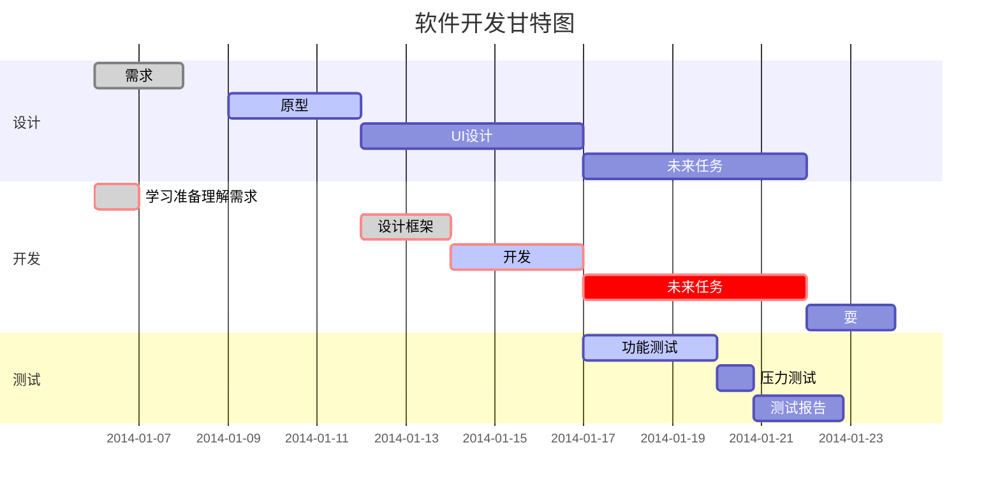

<!-- @import "[TOC]" {cmd="toc" depthFrom=1 depthTo=6 orderedList=false} -->

<!-- code_chunk_output -->

- [语法](#语法)
- [My Great Heading](#custom-id)
- [目录生成](#目录生成)

<!-- /code_chunk_output -->

- [语法](#语法)
- [My Great Heading {#custom-id}](#my-great-heading-custom-id)
- [目录生成](#目录生成)

### 语法
[markdown官网](https://markdown.p2hp.com/getting-started/)
<link id="myCss" rel="stylesheet" type="text/css" href="./style.css">


<div style="background-color: #FFFF00;">
这里的文本将会有黄色背景。
</div>
d
<div></div>

> Dorothy followed her through many of the beautiful rooms in her castle.


```
{
  "firstName": "John",
  "lastName": "Smith",
  "age": 25
}
```

```json
{
  "firstName": "John",
  "lastName": "Smith",
  "age": 25
}
```

### My Great Heading {#custom-id}

<div id="custom-id">wrwe</div>


[甘特图](https://www.runoob.com/markdown/md-advance.html)


### 目录生成

  将光标移至需要插入目录的位置，可以通过Ctrl-Shift-P然后选择Generate Toc for markdown，目录即自动插入。 显示效果如下：