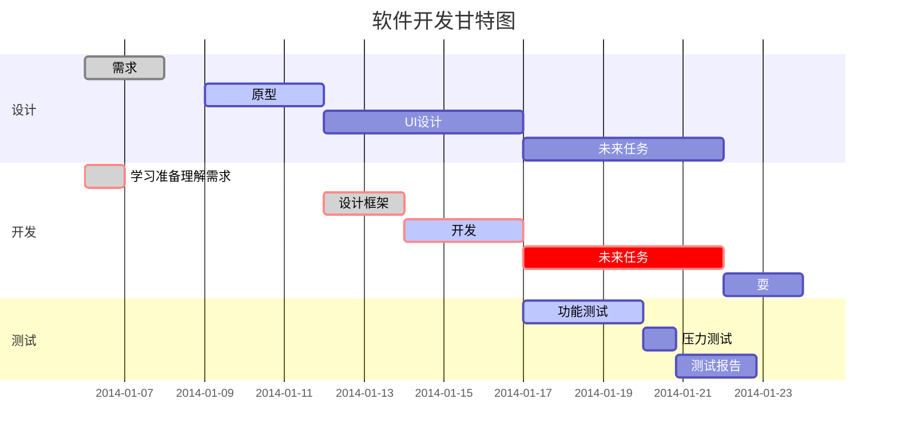
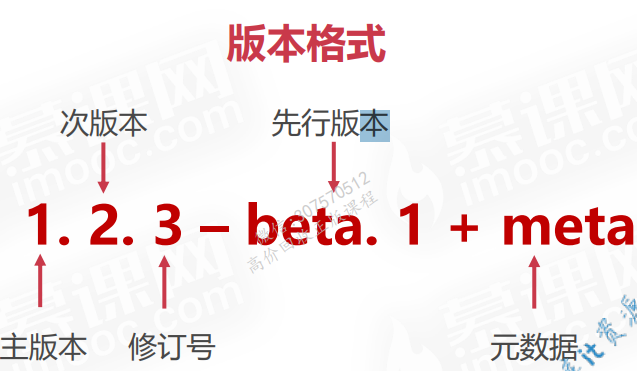

<!-- @import "[TOC]" {cmd="toc" depthFrom=1 depthTo=6 orderedList=false} -->

<!-- code_chunk_output -->

- [语法](#语法)
- [My Great Heading](#custom-id)
- [目录生成](#目录生成)
- [流程图](#流程图)
- [插入图片](#插入图片)

<!-- /code_chunk_output -->

- [语法](#语法)
- [My Great Heading {#custom-id}](#my-great-heading-custom-id)
- [目录生成](#目录生成)
- [生产table](#生产table)
- [流程图](#流程图)
- [插入图片](#插入图片)

### 语法
[markdown官网](https://markdown.p2hp.com/basic-syntax/)
<link id="myCss" rel="stylesheet" type="text/css" href="./style.css">


<div style="background-color: #FFFF00;">
这里的文本将会有黄色背景。
</div>
d
<div></div>

> Dorothy followed her through many of the beautiful rooms in her castle.


```
{
  "firstName": "John",
  "lastName": "Smith",
  "age": 25
}
```

```json
{
  "firstName": "John",
  "lastName": "Smith",
  "age": 25
}
```

### My Great Heading {#custom-id}

<div id="custom-id">wrwe</div>


[甘特图](https://www.runoob.com/markdown/md-advance.html)


### 目录生成
  需要安装Markdown All in One插件
  将光标移至需要插入目录的位置，可以通过Ctrl-Shift-P然后选择输入 `Markdown: Create Table of Contents`，目录即自动插入。
  更新目录：`Markdown: Update Table of Contents`。

  ### 生产table

  | 功能       | 语法          | 效果               |
|:----------|:------------:|------------------:|
| 左对齐      | 居中   | 右对齐   |
| 加粗      | `**文本**`   | **加粗文本**       |
| 链接      | `[标题](URL)` | [示例](https://example.com) |
| 代码块    | \`\`\`代码\`\`\` | 多行代码块         |

### 流程图

需要安装mermaid相关插件
graph TD 和graph LR控制流程图的方向

  ```mermaid
graph TD;
    A-->B;
    A-->C;
    B-->D;
    C-->D;
```

  ```mermaid
graph LR;
A[开始安装] --> B{检查缓存}
B -->|缓存校验失败| C[重新下载包]
B -->|缓存正常| D[使用缓存]
C --> E[覆盖 node_modules]
D --> E
E --> F[写入 package-lock.json]
```

### 插入图片


- [x] Write the press release
- [ ] Update the website
- [ ] Contact the media
- [ ] 

❎✅ ❌

- First item
- Second item
- Third item
    - Indented item
    - Indented item
- Fourth item