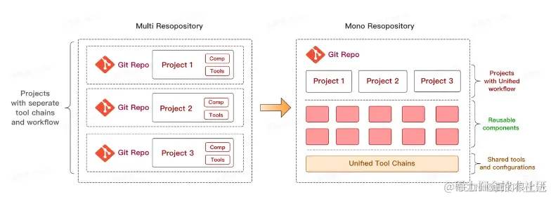

- [趋势](#趋势)
- [痛点](#痛点)
- [一、Monorepo 介绍](#一monorepo-介绍)
- [二、Monorepo 演进](#二monorepo-演进)
- [三、Monorepo 优劣](#三monorepo-优劣)
- [四、Monorepo 场景](#四monorepo-场景)
- [五、Monorepo 踩坑](#五monorepo-踩坑)
- [六、Monorepo 选型 -- Nx](#六monorepo-选型----nx)
      - [构建加速思路](#构建加速思路)
      - [缓存核心机制](#缓存核心机制)
- [七、前端Monorepo子包依赖升级策略](#七前端monorepo子包依赖升级策略)
- [八、结论](#八结论)

### 趋势
现代前端工程开发的已不再是之前的单一静态页面的开发，而是随着业务场景的多样性和复杂性在不断的演进，下面是一张来字节 web infra 团队在知乎分享的前端趋势概览图


- 第一个趋势是现代前端开发不再仅限于网页，而是涉及到的平台越来越多，比如 Web 端、Node、客户端和跨平台等。
- 第二个趋势是业务场景越来越多，复杂性也越来越大，特别是近年来也涌现了很多重前端交互的应用，比如 vscode、Figma。
- 第三个趋势就是随着业务场景的和多平台开发的出现，不可避免的使得前端团队规模在不断增大。
  
### 痛点

**1、代码复用困难** 
在维护多个项目的时候，有一些逻辑很有可能会被多次用到，比如一些基础的组件、工具函数，在 `polyrepo` 中，需要为这些共享的代码单独维护一个仓库，之后会发布为单独的 `npm` 包供各个项目引用。
这样虽然能够解决代码复用的问题，但是之后这些公共依赖的升级会非常的繁琐，比如说现在所有的项目中都使用了 `shared-ui` 包的 `1.1.0` 版本，突然某个 ui 组件想要修改一些样式，就需要走下面的流程：
- 在 shared-ui 中修改样式
- 发布一个 1.1.1版本的包
- 所有的项目都需要将 shared-ui 更新到最新版本
  
如果升级完之后发现有问题，这些步骤还得重复的执行，依赖 shared-ui 的库越多，这个过程花费的时间就越多，同时这个过程也会存在一定的沟通成本。

**2、重复的项目基建**
在 `Polyrepo` 中，各个项目之间是割裂的状态，因此每个项目都需要频繁创建 git 仓库，配置 CI、Lint 规则、构建等，而且为每个项目创建的基建后续都需要有人来维护（依赖升级）
**3、项目构建时间长**
现代的前端项目开发已经离不开打包工具(webpack、rollup)，整体开发形式为项目开发时使用模块化机制开发， 经过构建工具打包形成成品代码， 成品代码最终在不支持模块化的浏览器中执行。虽然构建打包工具为前端开发提供了便利， 但也因为在项目运行之前需要提前将代码构建成一个成品整体，这导致在本地开发时也引入了新问题:
随着项目变得越来越大，全量构建整个项目就需要花费很长的时间，在本地开发时，无论每次修改多少代码都需要重新全量构建，大大降低了整体的开发效率。


### 一、Monorepo 介绍
Monorepo 是一种项目代码管理方式，指单个仓库中管理多个项目，有助于简化代码共享、版本控制、构建和部署等方面的复杂性，并提供更好的可重用性和协作性。Monorepo 提倡了开放、透明、共享的组织文化，这种方法已经被很多大型公司广泛使用，如 Google、Facebook 和 Microsoft 等。

### 二、Monorepo 演进

**阶段一：单仓库巨石应用，** 一个 Git 仓库维护着项目代码，随着迭代业务复杂度的提升，项目代码会变得越来越多，越来越复杂，大量代码构建效率也会降低，最终导致了单体巨石应用，这种代码管理方式称之为 Monolith。

**阶段二：多仓库多模块应用，** 于是将项目拆解成多个业务模块，并在多个 Git 仓库管理，模块解耦，降低了巨石应用的复杂度，每个模块都可以独立编码、测试、发版，代码管理变得简化，构建效率也得以提升，这种代码管理方式称之为 MultiRepo。

**阶段三：单仓库多模块应用，** 随着业务复杂度的提升，模块仓库越来越多，MultiRepo这种方式虽然从业务上解耦了，但增加了项目工程管理的难度，随着模块仓库达到一定数量级，会有几个问题：跨仓库代码难共享；分散在单仓库的模块依赖管理复杂（底层模块升级后，其他上层依赖需要及时更新，否则有问题）；增加了构建耗时。于是将多个项目集成到一个仓库下，共享工程配置，同时又快捷地共享模块代码，成为趋势，这种代码管理方式称之为 MonoRepo。

### 三、Monorepo 优劣


  | 场景       | MultiRepo          | MonoRepo               |
|:----------|:------------|:------------------|
| 代码可见性 |✅ 代码隔离，研发者只需关注自己负责的仓库<br>❌ 包管理按照各自owner划分，当出现问题时，需要到依赖包中进行判断并解决  | ✅ 一个仓库中多个相关项目，很容易看到整个代码库的变化趋势，更好的团队协作。<br> ❌ 增加了非owner改动代码的风险     |
| 依赖管理      | ❌ 多个仓库都有自己的 node_modules，存在依赖重复安装情况，占用磁盘内存大。 | ✅ 多项目代码都在一个仓库中，相同版本依赖提升到顶层只安装一次，节省磁盘内存， |
| 代码权限    | 	✅ 各项目单独仓库，不会出现代码被误改的情况，单个项目出现问题不会影响其他项目。 | ❌ 多个项目代码都在一个仓库中，没有项目粒度的权限管控，一个项目出问题，可能影响所有项目。         |
| 开发迭代    | ✅ 仓库体积小，模块划分清晰，可维护性强。<br> ❌ 多仓库来回切换（编辑器及命令行），项目多的话效率很低。多仓库见存在依赖时，需要手动 npm link，操作繁琐。<br> ❌ 依赖管理不便，多个依赖可能在多个仓库中存在不同版本，重复安装，npm link 时不同项目的依赖会存在冲突。 | ✅ 多个项目都在一个仓库中，可看到相关项目全貌，编码非常方便。<br>✅ 代码复用高，方便进行代码重构。<br>❌ 多项目在一个仓库中，代码体积多大几个 G，git clone时间较长。<br>✅ 依赖调试方便，依赖包迭代场景下，借助工具自动 npm link，直接使用最新版本依赖，简化了操作流程。      |
| 工程配置    | ❌ 各项目构建、打包、代码校验都各自维护，不一致时会导致代码差异或构建差异。 | 	✅ 多项目在一个仓库，工程配置一致，代码质量标准及风格也很容易一致。     |
| 构建部署    | ❌ 多个项目间存在依赖，部署时需要手动到不同的仓库根据先后顺序去修改版本及进行部署，操作繁琐效率低。 | ✅ 构建性 Monorepo 工具可以配置依赖项目的构建优先级，可以实现一次命令完成所有的部署。   |


### 四、Monorepo 场景

**场景一：大型项目与多项目协作**
- 场景：企业或团队维护多个紧密关联的项目（如前端、后端、工具库等）。
- 优势：集中管理代码，方便跨项目修改和协作，避免代码分散导致的重复劳动。

场景二：共享代码与依赖
- 场景：多个项目共用组件库、工具函数或配置（如 UI 组件、通用 SDK）。
- 优势：直接引用内部模块，避免多仓库的版本同步问题，确保依赖一致性。

场景三：统一构建与持续集成（CI/CD）
- 场景：需要标准化构建、测试和部署流程。
- 优势：集中配置 CI/CD，仅针对变更部分触发构建（增量构建），提升效率。

### 五、Monorepo 踩坑

**5.1、幽灵依赖**
**问题**：npm/yarn 安装依赖时，存在依赖提升，某个项目使用的依赖，并没有在其 package.json 中声明，也可以直接使用，这种现象称之为 “幽灵依赖”；随着项目迭代，这个依赖不再被其他项目使用，不再被安装，使用幽灵依赖的项目，会因为无法找到依赖而报错。
**方案**：基于 npm/yarn 的 Monorepo 方案，依然存在 “幽灵依赖” 问题，我们可以通过 pnpm 彻底解决这个问题
著作权归作者所有。商业转载请联系作者获得授权，非商业转载请注明出处。

**5.2、依赖安装耗时长**

**问题**：MonoRepo 中每个项目都有自己的 package.json 依赖列表，随着 MonoRepo 中依赖总数的增长，每次 install 时，耗时会较长。
**方案**：相同版本依赖提升到 Monorepo 根目录下，减少冗余依赖安装；使用 pnpm 按需安装及依赖缓存。

**5.3、构建打包耗时长**

**问题**：多个项目构建任务存在依赖时，往往是串行构建 或 全量构建，导致构建时间较长

**方案**：增量构建，而非全量构建；也可以将串行构建，优化成并行构建。

### 六、Monorepo 选型 -- Nx

###### 构建加速思路
- 缓存：通过缓存 及 远程缓存，减少构建时间（远程缓存：Nx 公开了一个公共 API，它允许您提供自己的远程缓存实现）
- 增量构建： 最小范围构建，非全量构建
- 并行构建： Nx 自动分析项目的关联关系，对这些任务进行排序以最大化并行性
- 分布式构建： 结合 Nx Cloud，您的任务将自动分布在 CI 代理中（多台远程构建机器），同时考虑构建顺序、最大化并行化和代理利用率

用 Nx 强大的任务调度器加速 Lerna：Lerna 擅长管理依赖关系和发布，但扩展基于 Lerna 的 Monorepos 很快就会变得很痛苦，因为 Lerna 很慢。这就是 Nx 的闪光点，也是它可以真正加速你的 monorepo 的地方。

###### 缓存核心机制
1.本地缓存
- 存储位置：./node_modules/.cache/nx/，包含任务哈希、输出文件等
- 触发条件：任务输入（代码、环境变量等）未变化时复用缓存结果。
- 清理方式:
    ```
    rm -rf ./node_modules/.cache/nx  # 手动删除
    nx reset  # 重置远程缓存（同时影响本地）:cite[1]:cite[7]
    ```


2.远程缓存（Nx Cloud）
- 工作原理：
    任务执行后生成哈希值，输出文件上传至云端
    其他开发者或 CI 环境命中缓存时直接下载制品，跳过构建
- 跨平台问题:
    Windows/Linux 路径差异导致缓存失效（已修复于 Nx Powerpack ≥1.2.4）
    解决方案：统一路径处理 + 输出文件标准化

### 七、前端Monorepo子包依赖升级策略

当某个包（假设为`packageA`）被修改后，所有直接或间接依赖它的包都能自动升级到`packageA`的最新版本，而不需要手动修改`package.json`文件。

解决方案的核心是使用**工作空间协议（workspace protocol）**和**自动化版本管理工具**（如Changesets）来实现零手动更新。


 以下是具体步骤：
 **1. 使用工作空间协议（Workspace Protocol）**
 在Monorepo中，我们可以在`package.json`中声明依赖时使用`workspace:*`或`workspace:^`等版本协议，这样就会始终使用工作空间内的最新版本。
  例如，在`packageB`的`package.json`中，依赖`packageA`可以这样写：
 ```json
 {
   "dependencies": {
     "packageA": "workspace:*"
   }
 }
 ```
 
 这样，当`packageA`的版本在本地工作区中提升时，`packageB`在安装依赖时会自动使用最新的`packageA`。

  注意：`workspace:*`表示使用任何版本，但通常我们会使用`workspace:^`或`workspace:~`来匹配主版本或次要版本，但为了总是使用最新版本，`workspace:*`是最直接的。

   支持工作空间协议的包管理器有：Yarn、PNPM、npm(v7+)。

**2. 使用Changesets自动更新依赖版本**

虽然工作空间协议让我们在开发时总是使用最新的代码，但是当我们发布包时，需要将`workspace:*`替换为具体的版本号。同时，当`packageA`的版本更新时，依赖它的包（如`packageB`）的`package.json`中依赖的版本号也需要更新为`packageA`的新版本号。

 Changesets可以自动完成这个工作：
 - 当我们使用`changeset version`命令时，它会：
    1. 根据每个changeset文件来提升相关包的版本号（比如`packageA`从1.0.0提升到1.0.1）。
    2. 然后，它会遍历所有包，将依赖`packageA`的包中的`package.json`里`workspace:*`替换为`1.0.1`（注意：在发布时，Changesets会自动将工作空间协议替换为具体版本号）。
   
 但是，如果我们希望保留`workspace:*`协议（在开发期间），我们可以在发布时让Changesets只更新版本号，而在开发期间我们依赖工作空间协议。然而，在发布到npm时，必须将`workspace:*`替换为具体版本号。Changesets会自动处理这个转换。

 **3. 开发流程（零手动更新）**
  整个流程如下：
    1. **开发阶段**：所有包都使用`workspace:*`（或类似协议）引用其他本地包。
    2. 修改`packageA`的代码。
    3. 使用Changesets添加变更说明：
```bash
npx changeset
```
选择`packageA`以及受影响的包（Changesets会自动检测依赖，但也可以手动选择），并选择版本升级类型（patch、minor、major）。
    4. 提交变更（包括代码和changeset文件）。
    5. 当需要发布时（例如合并到主分支后），运行：
```bash
npx changeset version
```

&nbsp;&nbsp;这个命令会：
- 提升`packageA`的版本号（根据changeset文件中的选择）。
- 提升依赖`packageA`的包的版本吗？默认情况下，Changesets只会提升在changeset文件中指定的包。但是，它也会更新依赖这些包的包中的`package.json`依赖版本（将`workspace:*`替换为新的版本号）。注意：这并不会提升依赖包的版本号，除非它们也被包含在changeset中（因为它们可能没有实质变化，但需要更新依赖）。不过，Changesets默认行为是只更新依赖项版本，而不提升依赖包自身的版本号，除非它们也被选中。
然而，如果我们希望当一个包被更新时，所有直接依赖它的包也自动提升一个补丁版本（即使这些包自身没有代码变化），那么我们需要在Changesets中配置`"bump"`选项为依赖更新而自动提升版本。但默认Changesets不会这样做。

**4. 为了真正实现“零手动更新”，我们可以考虑以下两种做法：**
**方案A（推荐）：** 不自动提升依赖包版本，而是只更新它们的依赖版本。这样，依赖包不需要因为依赖更新而发布新版本，因为它们的代码没有变化，只是`package.json`中的依赖版本更新了。但是，在发布时，这些包会被重新发布吗？实际上，如果包的内容没有变化（除了`package.json`），通常不需要发布。然而，为了确保依赖正确，我们需要更新`package.json`中的依赖版本，并且重新安装依赖（更新lock文件）。但发布时，只有版本提升的包（即`packageA`）会被发布，其他包即使`package.json`中依赖版本更新了，但如果没有被提升版本，则不会被发布。这可能导致问题：因为其他包在本地工作区中依赖已经更新，但发布的包中依赖还是旧的？
实际上，Changesets在运行`version`命令时，会更新所有依赖包的`package.json`（将`workspace:*`替换为具体版本），并更新工作区的lock文件。然后，当运行`changeset publish`时，它会发布所有版本号有更新的包（即`packageA`）。而其他包（如`packageB`）虽然`package.json`中的依赖版本更新了，但`packageB`自身的版本号没有变化，所以不会被发布。这样，在npm上，`packageB`的依赖还是旧的版本？
因此，我们需要确保：如果`packageB`依赖`packageA`，那么当`packageA`更新时，`packageB`也应该更新版本并发布，即使`packageB`的代码没有变化。因为它的依赖项发生了变化，这属于传递性更新。
Changesets默认不会提升`packageB`的版本。为了解决这个问题，我们可以使用Changesets的`bump`配置（在`.changeset/config.json`中）来指定当依赖更新时，自动提升依赖包的最小版本（比如patch版本）。

**方案B：** 配置Changesets的`linked`模式（将一组包链接在一起，当其中任何一个包更新时，所有包都提升到同一个版本）。这种方式适用于紧密耦合的包（比如同一组件的不同部分）。但对于大多数Monorepo，包是独立发布的，所以可能不太合适。
**方案C：** 使用Changesets的`updateDependents`选项。在`config.json`中，我们可以设置：
```json
{
    "updateInternalDependencies": "patch",
    "bumpVersionsWithWorkspaceProtocolOnly": true
}
```
 但是，目前Changesets（截至2023年）还没有内置自动提升依赖包版本的功能。不过，我们可以通过一个脚本或者使用Changesets的插件（比如`@changesets/changelog-git`）来实现。

  实际上，Changesets官方推荐的做法是：在添加changeset时，手动选择所有需要升级版本的包（包括直接依赖包）。但这样就不是零手动了。
**5. 最终推荐方案（平衡）**
 鉴于完全自动化可能带来的版本膨胀，我们可以在开发阶段保持`workspace:*`，这样本地开发总是使用最新代码。在发布时，使用Changesets更新依赖版本（将`workspace:*`替换为具体版本），但只提升有代码变更的包的版本。对于依赖包，如果它们只是更新了依赖项而没有代码变化，我们不提升它们的版本（即不发布）。这样，在npm上，这些包会继续使用它们之前指定的依赖版本（可能是范围版本，比如`^1.0.0`），这样当`packageA`发布新版本后，这些包在下次安装时会自动安装`packageA`的新版本（符合语义版本范围）。但是，如果我们在依赖项中使用了精确版本，那么就需要提升依赖包的版本并发布，以更新它们的依赖版本。
 然而，在Monorepo中，我们通常希望发布的包在构建时使用的是当时工作区内的版本，而不是一个范围版本。因此，在发布时，我们希望将依赖版本固定到具体版本（而不是`^`或`~`）。Changesets在替换`workspace:*`时，默认会使用精确版本（例如`"packageA": "1.0.1"`）。这样，当我们发布`packageB`时，它的`package.json`中依赖`packageA`的版本是精确的`1.0.1`。但是，如果`packageB`在之前没有代码变化，它的版本不会提升，也不会被发布，所以它的依赖更新就不会发布到npm。

  因此，为了确保发布的包中依赖的版本是更新后的，我们需要在`packageA`更新时，同时更新所有直接依赖`packageA`的包的版本（哪怕只是patch版本），并发布它们。

  我们可以通过以下脚本自动为所有直接依赖包生成patch changeset：
   步骤：
  1. 修改`packageA`并生成changeset（只包含`packageA`）。
  2. 运行`changeset version`，这会提升`packageA`的版本，并更新所有包中对`packageA`的引用（将`workspace:*`替换为新的版本号）。
  3. 然后，我们运行一个脚本，检测所有直接依赖`packageA`的包，为它们创建一个patch changeset（如果还没有为它们创建changeset的话）。
  4. 再次运行`changeset version`，提升这些依赖包的版本。
 这个流程可以通过脚本自动化，但Changesets本身不提供。
 有一个Changesets的插件`@changesets/bump`可以用于自动提升依赖包的版本，但需要额外配置。
 考虑到复杂性，很多项目选择手动为直接依赖包添加patch changeset，或者在CI中检测并自动生成。

  ### 八、结论
 目前，最接近零手动更新的方案是：
 1. 在`package.json`中使用`workspace:*`。
 2. 使用Changesets管理版本。
 3. 在发布时，运行`changeset version`会自动更新所有包中对已更新包的引用（替换为具体版本）。
 4. 然后，使用一个自定义脚本（或Changesets插件）来提升所有直接依赖已更新包的包的版本（如果没有被changeset覆盖的话），并再次运行`changeset version`。
 或者，接受一个半自动化的流程：在添加changeset时，手动选择所有需要升级的包（包括直接依赖包）。
 由于这个需求很常见，社区正在积极开发解决方案。例如，Nx和Turborepo团队也在努力优化Monorepo的版本管理。
 因此，如果你追求完全自动化，可能需要自己编写脚本，或者关注Changesets的新特性。
 以下是实现自动提升直接依赖包版本的一个示例脚本（在`changeset version`之后运行）：
 步骤：
  1. 运行`changeset version`（这会更新依赖项，并提升在changeset文件中指定的包的版本）。
  2. 使用工具（如`lerna`或`pnpm`）找出所有直接依赖`packageA`的包（假设`packageA`是刚刚被提升版本的包）。
  3. 检查这些包是否已经被提升版本（在`changeset version`过程中，如果它们被包含在changeset文件中，则已经提升）。如果没有，则创建一个临时的changeset文件（patch类型）。
  4. 再次运行`changeset version`。
 这个脚本可以放在`version`命令之后，在CI中运行。
 由于实现起来较为复杂，这里不展开。
 因此，在现有工具下，我们可以说：
 **在开发期间，通过`workspace:*`协议，我们实现了零手动更新（本地开发总是最新代码）。但在发布时，为了确保依赖包发布时依赖版本正确，我们需要手动或半自动地提升依赖包的版本。**