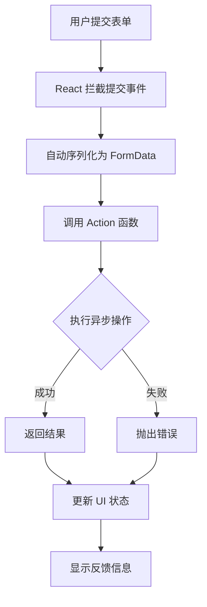

# React Actions：表单交互的革命性解决方案

## 目录

1. [什么是 React Actions？](#什么是-react-actions)
2. [传统表单处理的痛点](#传统表单处理的痛点)
3. [Actions 的核心概念](#actions-的核心概念)
4. [useActionState 深度解析](#useactionstate-深度解析)
5. [useFormStatus 优化用户体验](#useformstatus-优化用户体验)
6. [服务端 Actions](#服务端-actions)
7. [TypeScript 集成](#typescript-集成)
8. [实战案例](#实战案例)
9. [最佳实践](#最佳实践)
10. [总结与展望](#总结与展望)

## 一、什么是 React Actions？

### 1.1 Actions 的定义

React Actions 是 React 19 引入的一种全新的表单处理范式，它将表单的异步交互与状态管理无缝集成到 React 框架底层。Actions 允许开发者直接将异步函数传递给 `<form>` 元素的 `action` 属性，由 React 自动处理表单提交、数据序列化和状态管理。

### 1.2 Actions 的设计理念

Actions 的设计基于以下几个核心理念：

1. **声明式编程**：描述"做什么"而不是"怎么做"
2. **内置状态管理**：自动处理 loading、error、success 状态
3. **简化开发**：减少样板代码，提高开发效率
4. **更好的用户体验**：提供流畅的表单交互体验
5. **类型安全**：与 TypeScript 深度集成

### 1.3 Actions 与传统表单处理的对比

| 方面 | 传统表单处理 | React Actions |
|------|--------------|---------------|
| 代码复杂度 | 高（需要手动管理多个状态） | 低（内置状态管理） |
| 样板代码 | 多（preventDefault、FormData 等） | 少（React 自动处理） |
| 状态管理 | 手动（useState、useEffect） | 自动（useActionState） |
| 用户体验 | 需要手动优化 | 内置优化机制 |
| 类型安全 | 需要额外配置 | 深度 TypeScript 集成 |
| 学习曲线 | 平缓（基于现有知识） | 较陡（新概念） |

## 二、传统表单处理的痛点

### 2.1 手动状态管理的复杂性

```jsx
// 传统表单处理示例
function TraditionalForm() {
  const [formData, setFormData] = useState({ name: '', email: '' });
  const [isSubmitting, setIsSubmitting] = useState(false);
  const [error, setError] = useState(null);
  const [success, setSuccess] = useState(false);
  
  const handleSubmit = async (e) => {
    e.preventDefault(); // 痛点1：必须手动阻止默认行为
    
    setIsSubmitting(true);
    setError(null);
    setSuccess(false);
    
    try {
      // 痛点2：需要手动序列化表单数据
      const data = new FormData(e.target);
      const name = data.get('name');
      const email = data.get('email');
      
      // 模拟 API 调用
      await new Promise(resolve => setTimeout(resolve, 1000));
      
      // 痛点3：需要手动处理成功状态
      setSuccess(true);
      setFormData({ name: '', email: '' });
    } catch (err) {
      // 痛点4：需要手动处理错误状态
      setError(err.message);
    } finally {
      // 痛点5：需要手动重置 loading 状态
      setIsSubmitting(false);
    }
  };
  
  return (
    <form onSubmit={handleSubmit}>
      <div>
        <label>姓名:</label>
        <input
          type="text"
          name="name"
          value={formData.name}
          onChange={(e) => setFormData({ ...formData, name: e.target.value })}
        />
      </div>
      
      <div>
        <label>邮箱:</label>
        <input
          type="email"
          name="email"
          value={formData.email}
          onChange={(e) => setFormData({ ...formData, email: e.target.value })}
        />
      </div>
      
      {error && <div style={{ color: 'red' }}>错误: {error}</div>}
      {success && <div style={{ color: 'green' }}>提交成功!</div>}
      
      <button type="submit" disabled={isSubmitting}>
        {isSubmitting ? '提交中...' : '提交表单'}
      </button>
    </form>
  );
}
```

### 2.2 传统表单处理的主要痛点

#### 2.2.1 样板代码过多

```jsx
// 每个表单都需要重复的代码
const handleSubmit = async (e) => {
  e.preventDefault(); // 必须调用
  setIsLoading(true); // 必须设置
  setError(null); // 必须重置
  
  try {
    // 业务逻辑
  } catch (err) {
    setError(err.message); // 错误处理
  } finally {
    setIsLoading(false); // 清理
  }
};
```

#### 2.2.2 状态管理分散

```jsx
// 多个独立的状态变量
const [isLoading, setIsLoading] = useState(false);
const [error, setError] = useState(null);
const [success, setSuccess] = useState(false);
const [formData, setFormData] = useState(initialData);

// 状态更新逻辑分散
const handleSubmit = async () => {
  setIsLoading(true);
  setError(null);
  setSuccess(false);
  
  // ... 业务逻辑
  
  setIsLoading(false);
  setSuccess(true);
};
```

#### 2.2.3 用户体验优化困难

```jsx
// 需要手动处理各种状态
return (
  <form onSubmit={handleSubmit}>
    {/* 表单字段 */}
    
    {/* 加载状态 */}
    {isLoading && <div>加载中...</div>}
    
    {/* 错误状态 */}
    {error && <div>错误: {error}</div>}
    
    {/* 成功状态 */}
    {success && <div>成功!</div>}
    
    {/* 按钮状态 */}
    <button disabled={isLoading}>
      {isLoading ? '提交中...' : '提交'}
    </button>
  </form>
);
```

#### 2.2.4 类型安全不足

```jsx
// TypeScript 类型定义复杂
interface FormState {
  isLoading: boolean;
  error: string | null;
  success: boolean;
  data: {
    name: string;
    email: string;
  };
}

// 状态更新类型不安全
const handleChange = (field: string, value: any) => {
  setFormData(prev => ({
    ...prev,
    [field]: value // 类型不安全
  }));
};
```

### 2.3 传统解决方案的局限性

#### 2.3.1 自定义 Hook 的局限性

```jsx
// 自定义表单 Hook
const useForm = (initialValues, onSubmit) => {
  const [values, setValues] = useState(initialValues);
  const [isSubmitting, setIsSubmitting] = useState(false);
  const [error, setError] = useState(null);
  
  const handleSubmit = async (e) => {
    e.preventDefault();
    setIsSubmitting(true);
    setError(null);
    
    try {
      await onSubmit(values);
    } catch (err) {
      setError(err.message);
    } finally {
      setIsSubmitting(false);
    }
  };
  
  return { values, setValues, isSubmitting, error, handleSubmit };
};

// 局限性：
// 1. 仍然需要手动调用 preventDefault
// 2. 状态管理逻辑仍然存在
// 3. 类型安全需要额外处理
// 4. 用户体验优化有限
```

#### 2.3.2 第三方表单库的问题

```jsx
// 使用第三方表单库（如 Formik、React Hook Form）
import { useForm } from 'react-hook-form';

function ThirdPartyForm() {
  const { register, handleSubmit, formState: { errors, isSubmitting } } = useForm();
  
  const onSubmit = async (data) => {
    // 仍然需要手动管理 loading/error 状态
    try {
      await api.submit(data);
    } catch (error) {
      // 错误处理
    }
  };
  
  return (
    <form onSubmit={handleSubmit(onSubmit)}>
      <input {...register('name', { required: true })} />
      {errors.name && <span>必填字段</span>}
      
      <button disabled={isSubmitting}>
        {isSubmitting ? '提交中...' : '提交'}
      </button>
    </form>
  );
};

// 问题：
// 1. 额外的学习成本
// 2. 与 React 生态集成度有限
// 3. 版本升级兼容性问题
// 4. 包体积增加
```

## 三、Actions 的核心概念

### 3.1 Action 函数

Action 函数是 React Actions 的核心，它是一个异步函数，接收 `FormData` 作为参数：

```jsx
// 基本的 Action 函数
const submitFormAction = async (formData: FormData) => {
  // 从 FormData 中获取数据
  const name = formData.get('name');
  const email = formData.get('email');
  
  // 执行异步操作
  const response = await fetch('/api/submit', {
    method: 'POST',
    body: JSON.stringify({ name, email }),
    headers: { 'Content-Type': 'application/json' }
  });
  
  if (!response.ok) {
    throw new Error('提交失败');
  }
  
  return await response.json();
};
```

### 3.2 表单的 action 属性

在 React 19 中，可以直接将 Action 函数传递给 `<form>` 的 `action` 属性：

```jsx
function SimpleActionForm() {
  // 定义 Action 函数
  const handleSubmit = async (formData: FormData) => {
    console.log('表单数据:', formData);
    await new Promise(resolve => setTimeout(resolve, 1000));
    return { success: true, message: '提交成功' };
  };
  
  return (
    <form action={handleSubmit}>
      <input type="text" name="username" placeholder="用户名" />
      <input type="password" name="password" placeholder="密码" />
      <button type="submit">登录</button>
    </form>
  );
}
```

### 3.3 Actions 的工作流程



### 3.4 Actions 的优势

#### 3.4.1 代码简化

```jsx
// 传统方式 vs Actions
const TraditionalForm = () => {
  const [isLoading, setIsLoading] = useState(false);
  const [error, setError] = useState(null);
  
  const handleSubmit = async (e) => {
    e.preventDefault();
    setIsLoading(true);
    setError(null);
    
    try {
      const formData = new FormData(e.target);
      await api.submit(formData);
    } catch (err) {
      setError(err.message);
    } finally {
      setIsLoading(false);
    }
  };
  
  return (
    <form onSubmit={handleSubmit}>
      {/* 表单内容 */}
    </form>
  );
};

// 使用 Actions
const ActionForm = () => {
  const submitAction = async (formData: FormData) => {
    await api.submit(formData);
    return { success: true };
  };
  
  return (
    <form action={submitAction}>
      {/* 表单内容 */}
    </form>
  );
};
```

#### 3.4.2 内置状态管理

```jsx
// Actions 自动管理状态
function ActionWithState() {
  const [state, formAction, isPending] = useActionState(
    async (previousState, formData) => {
      // 执行异步操作
      const result = await api.submit(formData);
      return { message: '提交成功', data: result };
    },
    null // 初始状态
  );
  
  return (
    <form action={formAction}>
      <input name="field" />
      <button disabled={isPending}>
        {isPending ? '提交中...' : '提交'}
      </button>
      {state?.message && <p>{state.message}</p>}
    </form>
  );
}
```

#### 3.4.3 更好的用户体验

```jsx
// 内置的优化机制
function OptimizedForm() {
  const [state, action, isPending] = useActionState(
    async (prevState, formData) => {
      // 自动处理 loading 状态
      // 自动处理错误状态
      // 自动处理成功状态
      return await processForm(formData);
    },
    null
  );
  
  return (
    <form action={action}>
      {/* 表单字段会自动优化 */}
      <input name="email" type="email" />
      
      {/* 按钮状态自动管理 */}
      <button type="submit" disabled={isPending}>
        {isPending ? '处理中...' : '提交'}
      </button>
      
      {/* 反馈信息自动显示 */}
      {state?.error && <div className="error">{state.error}</div>}
      {state?.success && <div className="success">成功!</div>}
    </form>
  );
}
```

## 四、useActionState 深度解析

### 4.1 useActionState 的基本用法

```jsx
import { useActionState } from 'react';

function BasicUseActionState() {
  // 定义 Action 函数
  const submitAction = async (previousState, formData) => {
    console.log('Previous state:', previousState);
    console.log('Form data:', formData);
    
    // 模拟异步操作
    await new Promise(resolve => setTimeout(resolve, 1000));
    
    // 返回新的状态
    return {
      message: `提交成功: ${formData.get('name')}`,
      timestamp: new Date().toISOString()
    };
  };
  
  // 使用 useActionState
  const [state, action, isPending] = useActionState(
    submitAction,
    null // 初始状态
  );
  
  return (
    <div>
      <form action={action}>
        <div>
          <label htmlFor="name">姓名:</label>
          <input type="text" id="name" name="name" required />
        </div>
        
        <div>
          <label htmlFor="email">邮箱:</label>
          <input type="email" id="email" name="email" required />
        </div>
        
        <button type="submit" disabled={isPending}>
          {isPending ? '提交中...' : '提交表单'}
        </button>
      </form>
      
      {state && (
        <div style={{ marginTop: '20px', padding: '10px', backgroundColor: '#f0f0f0' }}>
          <h3>提交结果:</h3>
          <pre>{JSON.stringify(state, null, 2)}</pre>
        </div>
      )}
    </div>
  );
}
```

### 4.2 useActionState 的参数详解

#### 4.2.1 Action 函数签名

```typescript
type ActionFunction<State, Payload = FormData> = (
  previousState: State,
  payload: Payload
) => Promise<State> | State;
```

#### 4.2.2 useActionState 的类型定义

```typescript
function useActionState<State>(
  action: (previousState: State, formData: FormData) => Promise<State> | State,
  initialState: State,
  permalink?: string
): [state: State, action: (payload: FormData) => void, isPending: boolean];
```

### 4.3 useActionState 的高级用法

#### 4.3.1 复杂状态管理

```jsx
function ComplexStateManagement() {
  // 定义复杂的初始状态
  const initialState = {
    data: null,
    error: null,
    success: false,
    validationErrors: {},
    submittedAt: null
  };
  
  // 复杂的 Action 函数
  const submitFormAction = async (previousState, formData) => {
    // 验证表单数据
    const validationErrors = validateFormData(formData);
    if (Object.keys(validationErrors).length > 0) {
      return {
        ...previousState,
        validationErrors,
        error: '表单验证失败'
      };
    }
    
    try {
      // 执行提交
      const response = await fetch('/api/submit', {
        method: 'POST',
        body: formData
      });
      
      if (!response.ok) {
        throw new Error(`提交失败: ${response.status}`);
      }
      
      const data = await response.json();
      
      // 返回成功状态
      return {
        data,
        error: null,
        success: true,
        validationErrors: {},
        submittedAt: new Date().toISOString()
      };
    } catch (error) {
      // 返回错误状态
      return {
        ...previousState,
        error: error.message,
        success: false
      };
    }
  };
  
  const [state, action, isPending] = useActionState(
    submitFormAction,
    initialState
  );
  
  return (
    <div>
      <form action={action}>
        <div>
          <label>用户名:</label>
          <input name="username" required />
          {state.validationErrors.username && (
            <span style={{ color: 'red' }}>{state.validationErrors.username}</span>
          )}
        </div>
        
        <div>
          <label>邮箱:</label>
          <input name="email" type="email" required />
          {state.validationErrors.email && (
            <span style={{ color: 'red' }}>{state.validationErrors.email}</span>
          )}
        </div>
        
        <button type="submit" disabled={isPending}>
          {isPending ? '提交中...' : '提交'}
        </button>
      </form>
      
      {state.error && (
        <div style={{ color: 'red', marginTop: '10px' }}>
          错误: {state.error}
        </div>
      )}
      
      {state.success && (
        <div style={{ color: 'green', marginTop: '10px' }}>
          提交成功! 时间: {new Date(state.submittedAt).toLocaleString()}
        </div>
      )}
    </div>
  );
}
```

#### 4.3.2 批量操作处理

```jsx
function BatchOperations() {
  const [selectedItems, setSelectedItems] = useState([]);
  
  // 批量删除 Action
  const batchDeleteAction = async (previousState, formData) => {
    const itemIds = formData.getAll('itemIds');
    
    if (itemIds.length === 0) {
      return {
        ...previousState,
        error: '请选择要删除的项目'
      };
    }
    
    try {
      // 批量删除操作
      await Promise.all(
        itemIds.map(id => 
          fetch(`/api/items/${id}`, { method: 'DELETE' })
        )
      );
      
      return {
        success: true,
        message: `成功删除 ${itemIds.length} 个项目`,
        deletedItems: itemIds
      };
    } catch (error) {
      return {
        ...previousState,
        error: `删除失败: ${error.message}`
      };
    }
  };
  
  const [state, action, isPending] = useActionState(
    batchDeleteAction,
    { success: false, message: null, error: null }
  );
  
  // 模拟数据
  const items = [
    { id: '1', name: '项目1' },
    { id: '2', name: '项目2' },
    { id: '3', name: '项目3' },
    { id: '4', name: '项目4' }
  ];
  
  const handleSelectItem = (itemId) => {
    setSelectedItems(prev => 
      prev.includes(itemId)
        ? prev.filter(id => id !== itemId)
        : [...prev, itemId]
    );
  };
  
  return (
    <div>
      <h3>批量操作示例</h3>
      
      <form action={action}>
        <div style={{ marginBottom: '20px' }}>
          <h4>选择要删除的项目:</h4>
          {items.map(item => (
            <div key={item.id} style={{ marginBottom: '5px' }}>
              <label>
                <input
                  type="checkbox"
                  name="itemIds"
                  value={item.id}
                  checked={selectedItems.includes(item.id)}
                  onChange={() => handleSelectItem(item.id)}
                />
                {item.name}
              </label>
            </div>
          ))}
        </div>
        
        <button 
          type="submit" 
          disabled={isPending || selectedItems.length === 0}
        >
          {isPending ? '删除中...' : `删除选中的 ${selectedItems.length} 个项目`}
        </button>
      </form>
      
      {state.error && (
        <div style={{ color: 'red', marginTop: '10px' }}>
          {state.error}
        </div>
      )}
      
      {state.success && (
        <div style={{ color: 'green', marginTop: '10px' }}>
          {state.message}
        </div>
      )}
    </div>
  );
}
```

### 4.4 useActionState 的内部机制

#### 4.4.1 状态更新流程

```jsx
// useActionState 的简化实现
function useActionStateSimplified(action, initialState) {
  const [state, setState] = useState(initialState);
  const [isPending, setIsPending] = useState(false);
  
  const dispatch = useCallback(async (formData) => {
    setIsPending(true);
    
    try {
      const newState = await action(state, formData);
      setState(newState);
    } catch (error) {
      // 错误处理
      setState(prev => ({ ...prev, error: error.message }));
    } finally {
      setIsPending(false);
    }
  }, [action, state]);
  
  return [state, dispatch, isPending];
}
```

#### 4.4.2 并发处理

```jsx
// useActionState 支持并发处理
function ConcurrentActions() {
  const [state, action, isPending] = useActionState(
    async (previousState, formData) => {
      // 多个并发操作
      const [userData, preferences] = await Promise.all([
        fetchUserData(formData),
        fetchUserPreferences(formData)
      ]);
      
      return {
        ...previousState,
        userData,
        preferences,
        updatedAt: new Date().toISOString()
      };
    },
    { userData: null, preferences: null, updatedAt: null }
  );
  
  return (
    <form action={action}>
      {/* 表单内容 */}
    </form>
  );
}
```

## 五、useFormStatus 优化用户体验

### 5.1 useFormStatus 的基本用法

```jsx
import { useFormStatus } from 'react-dom';

function FormWithStatus() {
  // 定义 Action
  const submitAction = async (formData) => {
    await new Promise(resolve => setTimeout(resolve, 2000));
    return { success: true, message: '处理完成' };
  };
  
  return (
    <form action={submitAction}>
      <div>
        <label htmlFor="inputField">输入字段:</label>
        <input type="text" id="inputField" name="inputField" required />
      </div>
      
      {/* 使用自定义的提交按钮组件 */}
      <EnhancedSubmitButton />
      
      {/* 状态显示组件 */}
      <FormStatusDisplay />
    </form>
  );
}

// 增强的提交按钮组件
function EnhancedSubmitButton() {
  const { pending, data, method, action } = useFormStatus();
  
  return (
    <button 
      type="submit" 
      disabled={pending}
      style={{
        backgroundColor: pending ? '#ccc' : '#007bff',
        color: 'white',
        padding: '10px 20px',
        border: 'none',
        borderRadius: '4px',
        cursor: pending ? 'not-allowed' : 'pointer'
      }}
    >
      {pending ? (
        <>
          <span style={{ marginRight: '8px' }}>⏳</span>
          处理中...
        </>
      ) : (
        '提交表单'
      )}
    </button>
  );
}

// 表单状态显示组件
function FormStatusDisplay() {
  const { pending, data, method, action } = useFormStatus();
  
  return (
    <div style={{ 
      marginTop: '20px',
      padding: '15px',
      backgroundColor: '#f8f9fa',
      border: '1px solid #dee2e6',
      borderRadius: '4px'
    }}>
      <h4>表单状态信息:</h4>
      <ul style={{ listStyle: 'none', padding: 0 }}>
        <li>
          <strong>处理状态:</strong> {pending ? '进行中' : '空闲'}
        </li>
        <li>
          <strong>请求方法:</strong> {method || '未设置'}
        </li>
        <li>
          <strong>Action URL:</strong> {action || '未设置'}
        </li>
        {data && (
          <li>
            <strong>表单数据:</strong>
            <pre style={{ 
              marginTop: '5px',
              fontSize: '12px',
              backgroundColor: '#e9ecef',
              padding: '8px',
              borderRadius: '3px',
              overflow: 'auto'
            }}>
              {JSON.stringify(Object.fromEntries(data), null, 2)}
            </pre>
          </li>
        )}
      </ul>
    </div>
  );
}
```

### 5.2 useFormStatus 的高级应用

#### 5.2.1 实时进度指示器

```jsx
function ProgressIndicatorForm() {
  const submitAction = async (formData) => {
    // 模拟长时间处理
    await new Promise(resolve => setTimeout(resolve, 5000));
    return { success: true };
  };
  
  return (
    <form action={submitAction}>
      <div>
        <label>上传文件:</label>
        <input type="file" name="file" required />
      </div>
      
      {/* 进度指示器组件 */}
      <UploadProgressIndicator />
      
      <button type="submit">开始上传</button>
    </form>
  );
}

function UploadProgressIndicator() {
  const { pending } = useFormStatus();
  const [progress, setProgress] = useState(0);
  
  useEffect(() => {
    if (!pending) {
      setProgress(0);
      return;
    }
    
    // 模拟进度更新
    const interval = setInterval(() => {
      setProgress(prev => {
        if (prev >= 100) {
          clearInterval(interval);
          return 100;
        }
        return prev + 10;
      });
    }, 500);
    
    return () => clearInterval(interval);
  }, [pending]);
  
  if (!pending) return null;
  
  return (
    <div style={{ margin: '20px 0' }}>
      <div style={{ 
        width: '100%',
        height: '20px',
        backgroundColor: '#e9ecef',
        borderRadius: '10px',
        overflow: 'hidden'
      }}>
        <div
          style={{
            width: `${progress}%`,
            height: '100%',
            backgroundColor: '#007bff',
            transition: 'width 0.3s ease'
          }}
        />
      </div>
      <div style={{ 
        textAlign: 'center',
        marginTop: '5px',
        fontSize: '14px',
        color: '#6c757d'
      }}>
        {progress}% 完成
      </div>
    </div>
  );
}
```

#### 5.2.2 智能表单验证

```jsx
function SmartValidationForm() {
  const submitAction = async (formData) => {
    // 验证逻辑
    const errors = validateFormData(formData);
    if (Object.keys(errors).length > 0) {
      return { errors, success: false };
    }
    
    await new Promise(resolve => setTimeout(resolve, 1000));
    return { success: true, message: '验证通过' };
  };
  
  return (
    <form action={submitAction}>
      <SmartInput 
        name="username" 
        label="用户名" 
        rules={{ required: true, minLength: 3 }}
      />
      
      <SmartInput 
        name="email" 
        label="邮箱" 
        rules={{ required: true, pattern: /^[^\s@]+@[^\s@]+\.[^\s@]+$/ }}
      />
      
      <SmartInput 
        name="password" 
        label="密码" 
        type="password"
        rules={{ required: true, minLength: 6 }}
      />
      
      <button type="submit">注册</button>
    </form>
  );
}

function SmartInput({ name, label, type = 'text', rules }) {
  const { pending } = useFormStatus();
  const [value, setValue] = useState('');
  const [error, setError] = useState('');
  const [touched, setTouched] = useState(false);
  
  // 实时验证
  useEffect(() => {
    if (!touched) return;
    
    const validationError = validateField(value, rules);
    setError(validationError);
  }, [value, touched, rules]);
  
  const handleChange = (e) => {
    setValue(e.target.value);
  };
  
  const handleBlur = () => {
    setTouched(true);
  };
  
  return (
    <div style={{ marginBottom: '15px' }}>
      <label style={{ display: 'block', marginBottom: '5px' }}>
        {label}:
      </label>
      
      <input
        type={type}
        name={name}
        value={value}
        onChange={handleChange}
        onBlur={handleBlur}
        disabled={pending}
        style={{
          width: '100%',
          padding: '8px',
          border: `1px solid ${error ? '#dc3545' : '#ced4da'}`,
          borderRadius: '4px',
          backgroundColor: pending ? '#f8f9fa' : 'white'
        }}
      />
      
      {error && (
        <div style={{ 
          color: '#dc3545',
          fontSize: '12px',
          marginTop: '5px'
        }}>
          {error}
        </div>
      )}
      
      {pending && (
        <div style={{ 
          color: '#6c757d',
          fontSize: '12px',
          marginTop: '5px'
        }}>
          正在验证...
        </div>
      )}
    </div>
  );
}

// 验证工具函数
function validateField(value, rules) {
  if (rules.required && !value.trim()) {
    return '此字段为必填项';
  }
  
  if (rules.minLength && value.length < rules.minLength) {
    return `至少需要 ${rules.minLength} 个字符`;
  }
  
  if (rules.pattern && !rules.pattern.test(value)) {
    return '格式不正确';
  }
  
  return '';
}

function validateFormData(formData) {
  const errors = {};
  // 实际验证逻辑
  return errors;
}
```

### 5.3 useFormStatus 的性能优化

#### 5.3.1 条件渲染优化

```jsx
function OptimizedFormWithStatus() {
  const [showAdvanced, setShowAdvanced] = useState(false);
  
  const submitAction = async (formData) => {
    // 处理逻辑
    await new Promise(resolve => setTimeout(resolve, 1000));
    return { success: true };
  };
  
  return (
    <form action={submitAction}>
      {/* 基本字段 */}
      <div>
        <label>基本字段:</label>
        <input name="basicField" />
      </div>
      
      {/* 条件渲染的高级字段 */}
      {showAdvanced && (
        <div>
          <label>高级字段:</label>
          <input name="advancedField" />
        </div>
      )}
      
      <button 
        type="button" 
        onClick={() => setShowAdvanced(!showAdvanced)}
      >
        {showAdvanced ? '隐藏高级选项' : '显示高级选项'}
      </button>
      
      {/* 智能提交按钮 - 只在需要时渲染 */}
      <ConditionalSubmitButton />
    </form>
  );
}

function ConditionalSubmitButton() {
  const { pending } = useFormStatus();
  
  // 只在 pending 状态或特定条件下渲染
  if (!pending) {
    return (
      <button type="submit" style={{ marginTop: '10px' }}>
        提交表单
      </button>
    );
  }
  
  return (
    <div style={{ marginTop: '10px' }}>
      <button type="submit" disabled style={{ opacity: 0.5 }}>
        处理中...
      </button>
      <div style={{ fontSize: '12px', color: '#6c757d', marginTop: '5px' }}>
        请勿关闭页面
      </div>
    </div>
  );
}
```

#### 5.3.2 防抖和节流集成

```jsx
function DebouncedForm() {
  const submitAction = async (formData) => {
    console.log('提交数据:', Object.fromEntries(formData));
    await new Promise(resolve => setTimeout(resolve, 1000));
    return { success: true };
  };
  
  return (
    <form action={submitAction}>
      <DebouncedInput name="search" label="搜索" delay={500} />
      <button type="submit">搜索</button>
    </form>
  );
}

function DebouncedInput({ name, label, delay = 300 }) {
  const { pending } = useFormStatus();
  const [value, setValue] = useState('');
  const [debouncedValue, setDebouncedValue] = useState('');
  
  // 防抖逻辑
  useEffect(() => {
    const timer = setTimeout(() => {
      setDebouncedValue(value);
    }, delay);
    
    return () => clearTimeout(timer);
  }, [value, delay]);
  
  // 当防抖值变化时执行操作
  useEffect(() => {
    if (debouncedValue) {
      console.log('防抖后的值:', debouncedValue);
      // 可以在这里触发搜索等操作
    }
  }, [debouncedValue]);
  
  return (
    <div style={{ marginBottom: '15px' }}>
      <label style={{ display: 'block', marginBottom: '5px' }}>
        {label}:
      </label>
      
      <input
        type="text"
        name={name}
        value={value}
        onChange={(e) => setValue(e.target.value)}
        disabled={pending}
        style={{
          width: '100%',
          padding: '8px',
          border: '1px solid #ced4da',
          borderRadius: '4px'
        }}
      />
      
      <div style={{ 
        fontSize: '12px',
        color: '#6c757d',
        marginTop: '5px'
      }}>
        实时值: {value} | 防抖值: {debouncedValue}
      </div>
    </div>
  );
}
```

## 六、服务端 Actions

### 6.1 服务端 Actions 的概念

服务端 Actions 是 React Server Components 架构的一部分，允许在服务端执行表单处理逻辑：

```jsx
// 服务端 Action 示例（Next.js 环境）
// app/actions.ts
'use server';

export async function createUser(formData: FormData) {
  // 在服务端执行
  const name = formData.get('name');
  const email = formData.get('email');
  
  // 验证数据
  if (!name || !email) {
    return { error: '姓名和邮箱为必填项' };
  }
  
  // 数据库操作
  const user = await db.user.create({
    data: { name, email }
  });
  
  return { success: true, userId: user.id };
}

// 客户端组件
// app/page.tsx
import { createUser } from './actions';

export default function ServerActionForm() {
  return (
    <form action={createUser}>
      <div>
        <label htmlFor="name">姓名:</label>
        <input type="text" id="name" name="name" required />
      </div>
      
      <div>
        <label htmlFor="email">邮箱:</label>
        <input type="email" id="email" name="email" required />
      </div>
      
      <button type="submit">创建用户</button>
    </form>
  );
}
```

### 6.2 服务端 Actions 的优势

#### 6.2.1 安全性

```jsx
// 服务端验证更安全
'use server';

export async function processPayment(formData: FormData) {
  // 服务端验证
  const cardNumber = formData.get('cardNumber');
  const cvv = formData.get('cvv');
  
  // 敏感数据不会暴露在客户端
  if (!isValidCard(cardNumber)) {
    return { error: '无效的信用卡号' };
  }
  
  // 调用支付网关
  const result = await paymentGateway.charge({
    cardNumber,
    cvv,
    amount: formData.get('amount')
  });
  
  return { success: result.success, transactionId: result.id };
}
```

#### 6.2.2 性能优化

```jsx
// 减少客户端 JavaScript 包大小
'use server';

export async function searchProducts(formData: FormData) {
  const query = formData.get('query');
  const filters = Object.fromEntries(formData);
  
  // 服务端处理复杂逻辑
  const products = await db.product.findMany({
    where: {
      name: { contains: query },
      // 复杂的过滤逻辑
      ...buildFilters(filters)
    },
    take: 20
  });
  
  // 只返回必要数据
  return { products };
}

// 客户端组件很小
function SearchForm() {
  return (
    <form action={searchProducts}>
      <input name="query" placeholder="搜索产品..." />
      <button type="submit">搜索</button>
    </form>
  );
}
```

### 6.3 服务端 Actions 的实践

#### 6.3.1 文件上传处理

```jsx
// 服务端文件上传 Action
'use server';

import { writeFile } from 'fs/promises';
import { join } from 'path';

export async function uploadFile(formData: FormData) {
  const file = formData.get('file') as File;
  
  if (!file) {
    return { error: '请选择文件' };
  }
  
  // 验证文件类型和大小
  const allowedTypes = ['image/jpeg', 'image/png', 'application/pdf'];
  const maxSize = 5 * 1024 * 1024; // 5MB
  
  if (!allowedTypes.includes(file.type)) {
    return { error: '不支持的文件类型' };
  }
  
  if (file.size > maxSize) {
    return { error: '文件大小超过限制' };
  }
  
  // 保存文件
  const bytes = await file.arrayBuffer();
  const buffer = Buffer.from(bytes);
  
  const filename = `${Date.now()}-${file.name}`;
  const path = join(process.cwd(), 'uploads', filename);
  
  await writeFile(path, buffer);
  
  return { 
    success: true, 
    filename,
    url: `/uploads/${filename}`,
    size: file.size,
    type: file.type
  };
}

// 客户端上传组件
function FileUploadForm() {
  const [state, action, isPending] = useActionState(uploadFile, null);
  
  return (
    <form action={action}>
      <div>
        <label htmlFor="file">选择文件:</label>
        <input 
          type="file" 
          id="file" 
          name="file" 
          accept=".jpg,.jpeg,.png,.pdf"
          required
        />
      </div>
      
      <button type="submit" disabled={isPending}>
        {isPending ? '上传中...' : '上传文件'}
      </button>
      
      {state?.error && (
        <div style={{ color: 'red', marginTop: '10px' }}>
          {state.error}
        </div>
      )}
      
      {state?.success && (
        <div style={{ marginTop: '10px' }}>
          <p style={{ color: 'green' }}>上传成功!</p>
          <p>文件名: {state.filename}</p>
          <p>大小: {(state.size / 1024).toFixed(2)} KB</p>
          <p>类型: {state.type}</p>
          {state.url.startsWith('/uploads/') && (
            <p>
              <a href={state.url} target="_blank" rel="noopener noreferrer">
                查看文件
              </a>
            </p>
          )}
        </div>
      )}
    </form>
  );
}
```

#### 6.3.2 数据库操作集成

```jsx
// 服务端数据库操作 Action
'use server';

import { db } from '@/lib/db';
import { revalidatePath } from 'next/cache';

export async function createPost(formData: FormData) {
  try {
    const title = formData.get('title');
    const content = formData.get('content');
    const authorId = formData.get('authorId');
    
    // 验证输入
    if (!title || !content || !authorId) {
      return { 
        error: '所有字段都是必填项',
        fieldErrors: {
          title: !title ? '标题不能为空' : null,
          content: !content ? '内容不能为空' : null,
          authorId: !authorId ? '作者不能为空' : null
        }
      };
    }
    
    // 创建帖子
    const post = await db.post.create({
      data: {
        title: title.toString(),
        content: content.toString(),
        authorId: authorId.toString(),
        published: true
      }
    });
    
    // 重新验证页面缓存
    revalidatePath('/posts');
    revalidatePath(`/user/${authorId}/posts`);
    
    return { 
      success: true, 
      postId: post.id,
      message: '帖子创建成功'
    };
    
  } catch (error) {
    console.error('创建帖子失败:', error);
    return { 
      error: '创建帖子失败，请稍后重试',
      details: error instanceof Error ? error.message : '未知错误'
    };
  }
}

// 客户端帖子创建表单
function CreatePostForm({ userId }) {
  const [state, action, isPending] = useActionState(createPost, null);
  
  return (
    <form action={action}>
      <input type="hidden" name="authorId" value={userId} />
      
      <div style={{ marginBottom: '15px' }}>
        <label htmlFor="title">标题:</label>
        <input
          type="text"
          id="title"
          name="title"
          required
          disabled={isPending}
          style={{
            width: '100%',
            padding: '8px',
            border: `1px solid ${state?.fieldErrors?.title ? 'red' : '#ccc'}`,
            borderRadius: '4px'
          }}
        />
        {state?.fieldErrors?.title && (
          <div style={{ color: 'red', fontSize: '12px' }}>
            {state.fieldErrors.title}
          </div>
        )}
      </div>
      
      <div style={{ marginBottom: '15px' }}>
        <label htmlFor="content">内容:</label>
        <textarea
          id="content"
          name="content"
          rows={6}
          required
          disabled={isPending}
          style={{
            width: '100%',
            padding: '8px',
            border: `1px solid ${state?.fieldErrors?.content ? 'red' : '#ccc'}`,
            borderRadius: '4px',
            resize: 'vertical'
          }}
        />
        {state?.fieldErrors?.content && (
          <div style={{ color: 'red', fontSize: '12px' }}>
            {state.fieldErrors.content}
          </div>
        )}
      </div>
      
      <button 
        type="submit" 
        disabled={isPending}
        style={{
          padding: '10px 20px',
          backgroundColor: isPending ? '#ccc' : '#007bff',
          color: 'white',
          border: 'none',
          borderRadius: '4px',
          cursor: isPending ? 'not-allowed' : 'pointer'
        }}
      >
        {isPending ? '创建中...' : '创建帖子'}
      </button>
      
      {state?.error && (
        <div style={{ 
          marginTop: '15px',
          padding: '10px',
          backgroundColor: '#f8d7da',
          border: '1px solid #f5c6cb',
          borderRadius: '4px',
          color: '#721c24'
        }}>
          <strong>错误:</strong> {state.error}
          {state.details && (
            <div style={{ fontSize: '12px', marginTop: '5px' }}>
              详情: {state.details}
            </div>
          )}
        </div>
      )}
      
      {state?.success && (
        <div style={{ 
          marginTop: '15px',
          padding: '10px',
          backgroundColor: '#d4edda',
          border: '1px solid #c3e6cb',
          borderRadius: '4px',
          color: '#155724'
        }}>
          <strong>成功!</strong> {state.message}
          <div style={{ fontSize: '12px', marginTop: '5px' }}>
            帖子ID: {state.postId}
          </div>
        </div>
      )}
    </form>
  );
}
```

## 七、TypeScript 集成

### 7.1 类型安全的 Actions

```typescript
// 定义 Action 状态类型
interface FormState {
  success: boolean;
  message?: string;
  error?: string;
  data?: any;
  fieldErrors?: Record<string, string>;
}

// 类型安全的 Action 函数
type FormAction = (
  previousState: FormState,
  formData: FormData
) => Promise<FormState>;

// 使用泛型增强类型安全
interface TypedFormState<T = any> {
  success: boolean;
  message?: string;
  error?: string;
  data?: T;
  validationErrors?: Partial<Record<keyof T, string>>;
}

type TypedFormAction<T> = (
  previousState: TypedFormState<T>,
  formData: FormData
) => Promise<TypedFormState<T>>;

// 示例：用户注册 Action
interface UserRegistrationData {
  username: string;
  email: string;
  password: string;
  confirmPassword: string;
}

const registerUserAction: TypedFormAction<UserRegistrationData> = async (
  previousState,
  formData
) => {
  // 提取数据（类型安全）
  const username = formData.get('username') as string;
  const email = formData.get('email') as string;
  const password = formData.get('password') as string;
  const confirmPassword = formData.get('confirmPassword') as string;
  
  // 验证数据
  const validationErrors: Partial<Record<keyof UserRegistrationData, string>> = {};
  
  if (!username.trim()) {
    validationErrors.username = '用户名不能为空';
  }
  
  if (!email.trim() || !/^[^\s@]+@[^\s@]+\.[^\s@]+$/.test(email)) {
    validationErrors.email = '邮箱格式不正确';
  }
  
  if (password.length < 6) {
    validationErrors.password = '密码至少6个字符';
  }
  
  if (password !== confirmPassword) {
    validationErrors.confirmPassword = '两次输入的密码不一致';
  }
  
  if (Object.keys(validationErrors).length > 0) {
    return {
      ...previousState,
      success: false,
      validationErrors
    };
  }
  
  try {
    // 调用 API
    const response = await fetch('/api/register', {
      method: 'POST',
      body: JSON.stringify({ username, email, password }),
      headers: { 'Content-Type': 'application/json' }
    });
    
    if (!response.ok) {
      const error = await response.json();
      throw new Error(error.message || '注册失败');
    }
    
    const userData = await response.json();
    
    return {
      success: true,
      message: '注册成功',
      data: userData
    };
    
  } catch (error) {
    return {
      ...previousState,
      success: false,
      error: error instanceof Error ? error.message : '未知错误'
    };
  }
};
```

### 7.2 高级类型工具

#### 7.2.1 使用 Utility Types

```typescript
import { useActionState } from 'react';

// 使用 TypeScript 工具类型
type ActionResponse<T> = 
  | { success: true; data: T; message?: string }
  | { success: false; error: string; details?: any };

// 泛型 Action Hook
function useTypedActionState<T, P = FormData>(
  action: (previousState: T | null, payload: P) => Promise<T>,
  initialState: T | null = null
) {
  return useActionState(action, initialState);
}

// 示例：购物车操作
interface CartItem {
  id: string;
  name: string;
  price: number;
  quantity: number;
}

interface CartState {
  items: CartItem[];
  total: number;
  discount?: number;
}

const updateCartAction = async (
  previousState: CartState | null,
  formData: FormData
): Promise<CartState> => {
  const itemId = formData.get('itemId') as string;
  const quantity = parseInt(formData.get('quantity') as string);
  
  // 模拟 API 调用
  await new Promise(resolve => setTimeout(resolve, 500));
  
  if (!previousState) {
    return {
      items: [{ id: itemId, name: '测试商品', price: 100, quantity }],
      total: 100 * quantity
    };
  }
  
  // 更新购物车
  const updatedItems = previousState.items.map(item =>
    item.id === itemId ? { ...item, quantity } : item
  );
  
  const total = updatedItems.reduce((sum, item) => 
    sum + (item.price * item.quantity), 0
  );
  
  return {
    items: updatedItems,
    total,
    discount: total > 500 ? 50 : undefined
  };
};

// 在组件中使用
function ShoppingCart() {
  const [cartState, updateCart, isPending] = useTypedActionState(
    updateCartAction,
    null
  );
  
  return (
    <form action={updateCart}>
      {/* 表单内容 */}
    </form>
  );
}
```

#### 7.2.2 条件类型和映射类型

```typescript
// 高级类型定义
type ValidationRules<T> = {
  [K in keyof T]?: {
    required?: boolean;
    minLength?: number;
    maxLength?: number;
    pattern?: RegExp;
    custom?: (value: T[K]) => string | null;
  };
};

type ValidationErrors<T> = Partial<Record<keyof T, string>>;

// 通用的表单验证函数
function validateForm<T extends Record<string, any>>(
  data: T,
  rules: ValidationRules<T>
): ValidationErrors<T> {
  const errors: ValidationErrors<T> = {};
  
  for (const key in rules) {
    const rule = rules[key];
    const value = data[key];
    
    if (rule?.required && !value) {
      errors[key] = '此字段为必填项';
      continue;
    }
    
    if (rule?.minLength && value.length < rule.minLength) {
      errors[key] = `至少需要 ${rule.minLength} 个字符`;
      continue;
    }
    
    if (rule?.pattern && !rule.pattern.test(value)) {
      errors[key] = '格式不正确';
      continue;
    }
    
    if (rule?.custom) {
      const customError = rule.custom(value);
      if (customError) {
        errors[key] = customError;
      }
    }
  }
  
  return errors;
}

// 使用示例
interface LoginFormData {
  username: string;
  password: string;
  rememberMe: boolean;
}

const loginValidationRules: ValidationRules<LoginFormData> = {
  username: {
    required: true,
    minLength: 3,
    custom: (value) => {
      if (value.includes('admin')) {
        return '用户名不能包含 "admin"';
      }
      return null;
    }
  },
  password: {
    required: true,
    minLength: 6
  }
};

// 在 Action 中使用
const loginAction = async (
  previousState: any,
  formData: FormData
) => {
  const data: LoginFormData = {
    username: formData.get('username') as string,
    password: formData.get('password') as string,
    rememberMe: formData.get('rememberMe') === 'true'
  };
  
  // 使用验证函数
  const errors = validateForm(data, loginValidationRules);
  
  if (Object.keys(errors).length > 0) {
    return {
      success: false,
      validationErrors: errors
    };
  }
  
  // 继续处理登录逻辑
  // ...
};
```

## 八、实战案例

### 8.1 完整的用户注册系统

```jsx
// 用户注册系统
import { useActionState } from 'react';
import { z } from 'zod';

// 使用 Zod 定义验证模式
const registrationSchema = z.object({
  username: z.string()
    .min(3, '用户名至少3个字符')
    .max(20, '用户名最多20个字符')
    .regex(/^[a-zA-Z0-9_]+$/, '用户名只能包含字母、数字和下划线'),
  
  email: z.string()
    .email('邮箱格式不正确'),
  
  password: z.string()
    .min(6, '密码至少6个字符')
    .regex(/[A-Z]/, '密码必须包含至少一个大写字母')
    .regex(/[0-9]/, '密码必须包含至少一个数字'),
  
  confirmPassword: z.string(),
  
  agreeToTerms: z.boolean()
    .refine(val => val === true, '必须同意服务条款')
})
.refine(data => data.password === data.confirmPassword, {
  message: '两次输入的密码不一致',
  path: ['confirmPassword']
});

// 注册 Action
const registerUser = async (previousState, formData) => {
  // 解析表单数据
  const rawData = {
    username: formData.get('username'),
    email: formData.get('email'),
    password: formData.get('password'),
    confirmPassword: formData.get('confirmPassword'),
    agreeToTerms: formData.get('agreeToTerms') === 'on'
  };
  
  // 验证数据
  const validationResult = registrationSchema.safeParse(rawData);
  
  if (!validationResult.success) {
    // 转换 Zod 错误为字段错误
    const fieldErrors = {};
    validationResult.error.errors.forEach(error => {
      const path = error.path[0];
      if (path) {
        fieldErrors[path] = error.message;
      }
    });
    
    return {
      ...previousState,
      success: false,
      fieldErrors,
      error: '表单验证失败'
    };
  }
  
  const validatedData = validationResult.data;
  
  try {
    // 调用注册 API
    const response = await fetch('/api/register', {
      method: 'POST',
      body: JSON.stringify({
        username: validatedData.username,
        email: validatedData.email,
        password: validatedData.password
      }),
      headers: { 'Content-Type': 'application/json' }
    });
    
    const result = await response.json();
    
    if (!response.ok) {
      return {
        ...previousState,
        success: false,
        error: result.message || '注册失败',
        fieldErrors: result.fieldErrors || {}
      };
    }
    
    return {
      success: true,
      message: '注册成功！请检查您的邮箱以完成验证。',
      data: result.user,
      fieldErrors: {}
    };
    
  } catch (error) {
    console.error('注册失败:', error);
    return {
      ...previousState,
      success: false,
      error: '网络错误，请稍后重试',
      fieldErrors: {}
    };
  }
};

// 注册表单组件
function RegistrationForm() {
  const [state, action, isPending] = useActionState(registerUser, {
    success: false,
    message: null,
    error: null,
    fieldErrors: {}
  });
  
  return (
    <div style={{ maxWidth: '500px', margin: '0 auto', padding: '20px' }}>
      <h2>用户注册</h2>
      
      <form action={action}>
        <div style={{ marginBottom: '20px' }}>
          <label htmlFor="username" style={{ display: 'block', marginBottom: '5px' }}>
            用户名:
          </label>
          <input
            type="text"
            id="username"
            name="username"
            required
            disabled={isPending}
            style={{
              width: '100%',
              padding: '10px',
              border: `1px solid ${state.fieldErrors?.username ? '#dc3545' : '#ced4da'}`,
              borderRadius: '4px',
              fontSize: '16px'
            }}
          />
          {state.fieldErrors?.username && (
            <div style={{ color: '#dc3545', fontSize: '14px', marginTop: '5px' }}>
              {state.fieldErrors.username}
            </div>
          )}
        </div>
        
        <div style={{ marginBottom: '20px' }}>
          <label htmlFor="email" style={{ display: 'block', marginBottom: '5px' }}>
            邮箱:
          </label>
          <input
            type="email"
            id="email"
            name="email"
            required
            disabled={isPending}
            style={{
              width: '100%',
              padding: '10px',
              border: `1px solid ${state.fieldErrors?.email ? '#dc3545' : '#ced4da'}`,
              borderRadius: '4px',
              fontSize: '16px'
            }}
          />
          {state.fieldErrors?.email && (
            <div style={{ color: '#dc3545', fontSize: '14px', marginTop: '5px' }}>
              {state.fieldErrors.email}
            </div>
          )}
        </div>
        
        <div style={{ marginBottom: '20px' }}>
          <label htmlFor="password" style={{ display: 'block', marginBottom: '5px' }}>
            密码:
          </label>
          <input
            type="password"
            id="password"
            name="password"
            required
            disabled={isPending}
            style={{
              width: '100%',
              padding: '10px',
              border: `1px solid ${state.fieldErrors?.password ? '#dc3545' : '#ced4da'}`,
              borderRadius: '4px',
              fontSize: '16px'
            }}
          />
          {state.fieldErrors?.password && (
            <div style={{ color: '#dc3545', fontSize: '14px', marginTop: '5px' }}>
              {state.fieldErrors.password}
            </div>
          )}
          <div style={{ fontSize: '12px', color: '#6c757d', marginTop: '5px' }}>
            密码必须包含至少6个字符，一个大写字母和一个数字
          </div>
        </div>
        
        <div style={{ marginBottom: '20px' }}>
          <label htmlFor="confirmPassword" style={{ display: 'block', marginBottom: '5px' }}>
            确认密码:
          </label>
          <input
            type="password"
            id="confirmPassword"
            name="confirmPassword"
            required
            disabled={isPending}
            style={{
              width: '100%',
              padding: '10px',
              border: `1px solid ${state.fieldErrors?.confirmPassword ? '#dc3545' : '#ced4da'}`,
              borderRadius: '4px',
              fontSize: '16px'
            }}
          />
          {state.fieldErrors?.confirmPassword && (
            <div style={{ color: '#dc3545', fontSize: '14px', marginTop: '5px' }}>
              {state.fieldErrors.confirmPassword}
            </div>
          )}
        </div>
        
        <div style={{ marginBottom: '20px' }}>
          <label style={{ display: 'flex', alignItems: 'center' }}>
            <input
              type="checkbox"
              id="agreeToTerms"
              name="agreeToTerms"
              required
              disabled={isPending}
              style={{ marginRight: '8px' }}
            />
            我同意
            <a href="/terms" style={{ margin: '0 5px', color: '#007bff' }}>
              服务条款
            </a>
            和
            <a href="/privacy" style={{ marginLeft: '5px', color: '#007bff' }}>
              隐私政策
            </a>
          </label>
          {state.fieldErrors?.agreeToTerms && (
            <div style={{ color: '#dc3545', fontSize: '14px', marginTop: '5px' }}>
              {state.fieldErrors.agreeToTerms}
            </div>
          )}
        </div>
        
        <button
          type="submit"
          disabled={isPending}
          style={{
            width: '100%',
            padding: '12px',
            backgroundColor: isPending ? '#6c757d' : '#007bff',
            color: 'white',
            border: 'none',
            borderRadius: '4px',
            fontSize: '16px',
            cursor: isPending ? 'not-allowed' : 'pointer',
            transition: 'background-color 0.3s'
          }}
        >
          {isPending ? '注册中...' : '立即注册'}
        </button>
      </form>
      
      {/* 状态显示 */}
      {state.error && !state.success && (
        <div style={{
          marginTop: '20px',
          padding: '15px',
          backgroundColor: '#f8d7da',
          border: '1px solid #f5c6cb',
          borderRadius: '4px',
          color: '#721c24'
        }}>
          <strong>错误:</strong> {state.error}
        </div>
      )}
      
      {state.success && (
        <div style={{
          marginTop: '20px',
          padding: '15px',
          backgroundColor: '#d4edda',
          border: '1px solid #c3e6cb',
          borderRadius: '4px',
          color: '#155724'
        }}>
          <strong>成功!</strong> {state.message}
          {state.data && (
            <div style={{ marginTop: '10px' }}>
              <p>用户信息:</p>
              <pre style={{
                fontSize: '12px',
                backgroundColor: '#f8f9fa',
                padding: '10px',
                borderRadius: '4px',
                overflow: 'auto'
              }}>
                {JSON.stringify(state.data, null, 2)}
              </pre>
            </div>
          )}
        </div>
      )}
      
      <div style={{ marginTop: '20px', textAlign: 'center' }}>
        <p style={{ fontSize: '14px', color: '#6c757d' }}>
          已有账户？
          <a href="/login" style={{ marginLeft: '5px', color: '#007bff' }}>
            立即登录
          </a>
        </p>
      </div>
    </div>
  );
}
```

### 8.2 电子商务购物车系统

```jsx
// 电子商务购物车系统
import { useActionState, useState } from 'react';

// 购物车状态类型
interface CartItem {
  id: string;
  name: string;
  price: number;
  quantity: number;
  image?: string;
  maxQuantity: number;
}

interface CartState {
  items: CartItem[];
  subtotal: number;
  discount: number;
  shipping: number;
  total: number;
  lastUpdated: string;
}

// 初始购物车状态
const initialCartState: CartState = {
  items: [],
  subtotal: 0,
  discount: 0,
  shipping: 0,
  total: 0,
  lastUpdated: new Date().toISOString()
};

// 购物车 Action
const cartAction = async (previousState: CartState, formData: FormData) => {
  const actionType = formData.get('action') as string;
  const itemId = formData.get('itemId') as string;
  const quantity = parseInt(formData.get('quantity') as string) || 1;
  
  let updatedItems = [...previousState.items];
  
  switch (actionType) {
    case 'add': {
      // 检查商品是否已存在
      const existingItemIndex = updatedItems.findIndex(item => item.id === itemId);
      
      if (existingItemIndex >= 0) {
        // 更新数量
        const existingItem = updatedItems[existingItemIndex];
        const newQuantity = Math.min(existingItem.quantity + quantity, existingItem.maxQuantity);
        
        updatedItems[existingItemIndex] = {
          ...existingItem,
          quantity: newQuantity
        };
      } else {
        // 添加新商品（模拟从数据库获取）
        const newItem: CartItem = {
          id: itemId,
          name: `商品 ${itemId}`,
          price: Math.floor(Math.random() * 100) + 50,
          quantity,
          maxQuantity: 10
        };
        
        updatedItems.push(newItem);
      }
      break;
    }
    
    case 'update': {
      const itemIndex = updatedItems.findIndex(item => item.id === itemId);
      
      if (itemIndex >= 0) {
        if (quantity <= 0) {
          // 删除商品
          updatedItems.splice(itemIndex, 1);
        } else {
          // 更新数量
          const item = updatedItems[itemIndex];
          const newQuantity = Math.min(quantity, item.maxQuantity);
          
          updatedItems[itemIndex] = {
            ...item,
            quantity: newQuantity
          };
        }
      }
      break;
    }
    
    case 'remove': {
      updatedItems = updatedItems.filter(item => item.id !== itemId);
      break;
    }
    
    case 'clear': {
      updatedItems = [];
      break;
    }
  }
  
  // 计算价格
  const subtotal = updatedItems.reduce((sum, item) => 
    sum + (item.price * item.quantity), 0
  );
  
  const discount = subtotal > 200 ? 20 : 0;
  const shipping = subtotal > 100 ? 0 : 10;
  const total = subtotal - discount + shipping;
  
  return {
    items: updatedItems,
    subtotal,
    discount,
    shipping,
    total,
    lastUpdated: new Date().toISOString()
  };
};

// 购物车组件
function ShoppingCart() {
  const [cartState, cartActionDispatch, isPending] = useActionState(
    cartAction,
    initialCartState
  );
  
  const [showCheckout, setShowCheckout] = useState(false);
  
  // 模拟商品数据
  const sampleProducts = [
    { id: '1', name: '智能手机', price: 2999 },
    { id: '2', name: '无线耳机', price: 599 },
    { id: '3', name: '智能手表', price: 1299 },
    { id: '4', name: '笔记本电脑', price: 6999 }
  ];
  
  const handleAddToCart = (productId: string) => {
    const formData = new FormData();
    formData.append('action', 'add');
    formData.append('itemId', productId);
    formData.append('quantity', '1');
    
    cartActionDispatch(formData);
  };
  
  const handleUpdateQuantity = (itemId: string, newQuantity: number) => {
    const formData = new FormData();
    formData.append('action', 'update');
    formData.append('itemId', itemId);
    formData.append('quantity', newQuantity.toString());
    
    cartActionDispatch(formData);
  };
  
  const handleRemoveItem = (itemId: string) => {
    const formData = new FormData();
    formData.append('action', 'remove');
    formData.append('itemId', itemId);
    
    cartActionDispatch(formData);
  };
  
  const handleClearCart = () => {
    const formData = new FormData();
    formData.append('action', 'clear');
    
    cartActionDispatch(formData);
  };
  
  return (
    <div style={{ maxWidth: '1200px', margin: '0 auto', padding: '20px' }}>
      <h1>电子商务购物车</h1>
      
      <div style={{ display: 'flex', gap: '30px', marginTop: '30px' }}>
        {/* 商品列表 */}
        <div style={{ flex: 2 }}>
          <h2>商品列表</h2>
          <div style={{ 
            display: 'grid', 
            gridTemplateColumns: 'repeat(auto-fill, minmax(250px, 1fr))',
            gap: '20px',
            marginTop: '20px'
          }}>
            {sampleProducts.map(product => (
              <div key={product.id} style={{
                border: '1px solid #dee2e6',
                borderRadius: '8px',
                padding: '15px',
                backgroundColor: 'white'
              }}>
                <h3 style={{ marginBottom: '10px' }}>{product.name}</h3>
                <p style={{ 
                  fontSize: '18px', 
                  fontWeight: 'bold',
                  color: '#dc3545',
                  marginBottom: '15px'
                }}>
                  ¥{product.price.toLocaleString()}
                </p>
                <button
                  onClick={() => handleAddToCart(product.id)}
                  disabled={isPending}
                  style={{
                    width: '100%',
                    padding: '10px',
                    backgroundColor: '#28a745',
                    color: 'white',
                    border: 'none',
                    borderRadius: '4px',
                    cursor: isPending ? 'not-allowed' : 'pointer'
                  }}
                >
                  {isPending ? '添加中...' : '加入购物车'}
                </button>
              </div>
            ))}
          </div>
        </div>
        
        {/* 购物车 */}
        <div style={{ flex: 1 }}>
          <div style={{
            border: '1px solid #dee2e6',
            borderRadius: '8px',
            padding: '20px',
            backgroundColor: '#f8f9fa',
            position: 'sticky',
            top: '20px'
          }}>
            <div style={{ display: 'flex', justifyContent: 'space-between', alignItems: 'center' }}>
              <h2>购物车</h2>
              {cartState.items.length > 0 && (
                <button
                  onClick={handleClearCart}
                  disabled={isPending}
                  style={{
                    padding: '5px 10px',
                    backgroundColor: '#dc3545',
                    color: 'white',
                    border: 'none',
                    borderRadius: '4px',
                    fontSize: '12px',
                    cursor: isPending ? 'not-allowed' : 'pointer'
                  }}
                >
                  清空购物车
                </button>
              )}
            </div>
            
            {cartState.items.length === 0 ? (
              <div style={{ textAlign: 'center', padding: '40px 0', color: '#6c757d' }}>
                <div style={{ fontSize: '48px', marginBottom: '10px' }}>🛒</div>
                <p>购物车是空的</p>
                <p style={{ fontSize: '14px' }}>快去添加商品吧！</p>
              </div>
            ) : (
              <>
                {/* 购物车商品列表 */}
                <div style={{ maxHeight: '400px', overflowY: 'auto', marginTop: '20px' }}>
                  {cartState.items.map(item => (
                    <div key={item.id} style={{
                      display: 'flex',
                      alignItems: 'center',
                      padding: '10px 0',
                      borderBottom: '1px solid #dee2e6'
                    }}>
                      <div style={{ flex: 1 }}>
                        <div style={{ fontWeight: 'bold' }}>{item.name}</div>
                        <div style={{ fontSize: '14px', color: '#6c757d' }}>
                          ¥{item.price.toLocaleString()} × {item.quantity}
                        </div>
                      </div>
                      
                      <div style={{ textAlign: 'right', marginRight: '15px' }}>
                        <div style={{ fontWeight: 'bold', color: '#dc3545' }}>
                          ¥{(item.price * item.quantity).toLocaleString()}
                        </div>
                      </div>
                      
                      <div style={{ display: 'flex', alignItems: 'center', gap: '5px' }}>
                        <button
                          onClick={() => handleUpdateQuantity(item.id, item.quantity - 1)}
                          disabled={isPending || item.quantity <= 1}
                          style={{
                            width: '24px',
                            height: '24px',
                            backgroundColor: '#6c757d',
                            color: 'white',
                            border: 'none',
                            borderRadius: '4px',
                            cursor: isPending || item.quantity <= 1 ? 'not-allowed' : 'pointer'
                          }}
                        >
                          -
                        </button>
                        
                        <span style={{ minWidth: '30px', textAlign: 'center' }}>
                          {item.quantity}
                        </span>
                        
                        <button
                          onClick={() => handleUpdateQuantity(item.id, item.quantity + 1)}
                          disabled={isPending || item.quantity >= item.maxQuantity}
                          style={{
                            width: '24px',
                            height: '24px',
                            backgroundColor: '#28a745',
                            color: 'white',
                            border: 'none',
                            borderRadius: '4px',
                            cursor: isPending || item.quantity >= item.maxQuantity ? 'not-allowed' : 'pointer'
                          }}
                        >
                          +
                        </button>
                        
                        <button
                          onClick={() => handleRemoveItem(item.id)}
                          disabled={isPending}
                          style={{
                            marginLeft: '10px',
                            padding: '2px 8px',
                            backgroundColor: 'transparent',
                            color: '#dc3545',
                            border: '1px solid #dc3545',
                            borderRadius: '4px',
                            fontSize: '12px',
                            cursor: isPending ? 'not-allowed' : 'pointer'
                          }}
                        >
                          删除
                        </button>
                      </div>
                    </div>
                  ))}
                </div>
                
                {/* 价格汇总 */}
                <div style={{ marginTop: '20px', paddingTop: '20px', borderTop: '2px solid #dee2e6' }}>
                  <div style={{ display: 'flex', justifyContent: 'space-between', marginBottom: '8px' }}>
                    <span>商品小计:</span>
                    <span>¥{cartState.subtotal.toLocaleString()}</span>
                  </div>
                  
                  {cartState.discount > 0 && (
                    <div style={{ display: 'flex', justifyContent: 'space-between', marginBottom: '8px', color: '#28a745' }}>
                      <span>优惠折扣:</span>
                      <span>-¥{cartState.discount.toLocaleString()}</span>
                    </div>
                  )}
                  
                  <div style={{ display: 'flex', justifyContent: 'space-between', marginBottom: '8px' }}>
                    <span>运费:</span>
                    <span>{cartState.shipping === 0 ? '免运费' : `¥${cartState.shipping.toLocaleString()}`}</span>
                  </div>
                  
                  <div style={{ 
                    display: 'flex', 
                    justifyContent: 'space-between', 
                    marginTop: '15px',
                    paddingTop: '15px',
                    borderTop: '1px solid #dee2e6',
                    fontSize: '18px',
                    fontWeight: 'bold'
                  }}>
                    <span>订单总额:</span>
                    <span style={{ color: '#dc3545' }}>¥{cartState.total.toLocaleString()}</span>
                  </div>
                  
                  <div style={{ fontSize: '12px', color: '#6c757d', marginTop: '5px', textAlign: 'right' }}>
                    最后更新: {new Date(cartState.lastUpdated).toLocaleTimeString()}
                  </div>
                </div>
                
                {/* 操作按钮 */}
                <div style={{ marginTop: '20px' }}>
                  <button
                    onClick={() => setShowCheckout(true)}
                    disabled={isPending}
                    style={{
                      width: '100%',
                      padding: '12px',
                      backgroundColor: '#007bff',
                      color: 'white',
                      border: 'none',
                      borderRadius: '4px',
                      fontSize: '16px',
                      cursor: isPending ? 'not-allowed' : 'pointer',
                      marginBottom: '10px'
                    }}
                  >
                    去结算
                  </button>
                  
                  <div style={{ fontSize: '12px', color: '#6c757d', textAlign: 'center' }}>
                    共 {cartState.items.length} 件商品
                  </div>
                </div>
              </>
            )}
          </div>
        </div>
      </div>
      
      {/* 结算表单 */}
      {showCheckout && (
        <div style={{
          position: 'fixed',
          top: 0,
          left: 0,
          right: 0,
          bottom: 0,
          backgroundColor: 'rgba(0, 0, 0, 0.5)',
          display: 'flex',
          alignItems: 'center',
          justifyContent: 'center',
          zIndex: 1000
        }}>
          <div style={{
            backgroundColor: 'white',
            borderRadius: '8px',
            padding: '30px',
            maxWidth: '500px',
            width: '90%',
            maxHeight: '90vh',
            overflowY: 'auto'
          }}>
            <div style={{ display: 'flex', justifyContent: 'space-between', alignItems: 'center', marginBottom: '20px' }}>
              <h2>结算信息</h2>
              <button
                onClick={() => setShowCheckout(false)}
                style={{
                  background: 'none',
                  border: 'none',
                  fontSize: '24px',
                  cursor: 'pointer',
                  color: '#6c757d'
                }}
              >
                ×
              </button>
            </div>
            
            <form>
              <div style={{ marginBottom: '15px' }}>
                <label style={{ display: 'block', marginBottom: '5px' }}>收货人姓名:</label>
                <input
                  type="text"
                  required
                  style={{
                    width: '100%',
                    padding: '10px',
                    border: '1px solid #ced4da',
                    borderRadius: '4px'
                  }}
                />
              </div>
              
              <div style={{ marginBottom: '15px' }}>
                <label style={{ display: 'block', marginBottom: '5px' }}>联系电话:</label>
                <input
                  type="tel"
                  required
                  style={{
                    width: '100%',
                    padding: '10px',
                    border: '1px solid #ced4da',
                    borderRadius: '4px'
                  }}
                />
              </div>
              
              <div style={{ marginBottom: '15px' }}>
                <label style={{ display: 'block', marginBottom: '5px' }}>收货地址:</label>
                <textarea
                  rows={3}
                  required
                  style={{
                    width: '100%',
                    padding: '10px',
                    border: '1px solid #ced4da',
                    borderRadius: '4px',
                    resize: 'vertical'
                  }}
                />
              </div>
              
              <div style={{ marginBottom: '20px' }}>
                <label style={{ display: 'block', marginBottom: '5px' }}>支付方式:</label>
                <div>
                  <label style={{ display: 'block', marginBottom: '8px' }}>
                    <input type="radio" name="payment" value="alipay" defaultChecked style={{ marginRight: '8px' }} />
                    支付宝
                  </label>
                  <label style={{ display: 'block', marginBottom: '8px' }}>
                    <input type="radio" name="payment" value="wechat" style={{ marginRight: '8px' }} />
                    微信支付
                  </label>
                  <label style={{ display: 'block' }}>
                    <input type="radio" name="payment" value="card" style={{ marginRight: '8px' }} />
                    银行卡
                  </label>
                </div>
              </div>
              
              <div style={{ 
                backgroundColor: '#f8f9fa',
                padding: '15px',
                borderRadius: '4px',
                marginBottom: '20px'
              }}>
                <h4>订单摘要</h4>
                <div style={{ display: 'flex', justifyContent: 'space-between', marginBottom: '5px' }}>
                  <span>商品总额:</span>
                  <span>¥{cartState.subtotal.toLocaleString()}</span>
                </div>
                <div style={{ display: 'flex', justifyContent: 'space-between', marginBottom: '5px' }}>
                  <span>优惠:</span>
                  <span>-¥{cartState.discount.toLocaleString()}</span>
                </div>
                <div style={{ display: 'flex', justifyContent: 'space-between', marginBottom: '5px' }}>
                  <span>运费:</span>
                  <span>{cartState.shipping === 0 ? '免运费' : `¥${cartState.shipping.toLocaleString()}`}</span>
                </div>
                <div style={{ 
                  display: 'flex', 
                  justifyContent: 'space-between',
                  marginTop: '10px',
                  paddingTop: '10px',
                  borderTop: '1px solid #dee2e6',
                  fontWeight: 'bold'
                }}>
                  <span>应付总额:</span>
                  <span style={{ color: '#dc3545' }}>¥{cartState.total.toLocaleString()}</span>
                </div>
              </div>
              
              <div style={{ display: 'flex', gap: '10px' }}>
                <button
                  type="button"
                  onClick={() => setShowCheckout(false)}
                  style={{
                    flex: 1,
                    padding: '12px',
                    backgroundColor: '#6c757d',
                    color: 'white',
                    border: 'none',
                    borderRadius: '4px',
                    cursor: 'pointer'
                  }}
                >
                  返回修改
                </button>
                
                <button
                  type="submit"
                  style={{
                    flex: 2,
                    padding: '12px',
                    backgroundColor: '#28a745',
                    color: 'white',
                    border: 'none',
                    borderRadius: '4px',
                    cursor: 'pointer',
                    fontWeight: 'bold'
                  }}
                >
                  确认支付 ¥{cartState.total.toLocaleString()}
                </button>
              </div>
            </form>
          </div>
        </div>
      )}
    </div>
  );
}

## 九、最佳实践

### 9.1 性能优化建议

#### 9.1.1 避免不必要的重新渲染

```jsx
// 使用 React.memo 优化表单组件
const OptimizedForm = React.memo(function OptimizedForm({ onSubmit }) {
  const [state, action, isPending] = useActionState(onSubmit, null);
  
  return (
    <form action={action}>
      {/* 表单内容 */}
    </form>
  );
});

// 使用 useCallback 记忆化 Action 函数
function ParentComponent() {
  const submitAction = useCallback(async (previousState, formData) => {
    // 复杂的业务逻辑
    return await processFormData(formData);
  }, []); // 依赖数组为空，函数只创建一次
  
  return <OptimizedForm onSubmit={submitAction} />;
}
```

#### 9.1.2 分块加载和懒加载

```jsx
// 懒加载复杂的表单组件
import { lazy, Suspense } from 'react';

const ComplexFormSection = lazy(() => import('./ComplexFormSection'));

function LazyLoadedForm() {
  return (
    <form>
      {/* 基本字段 */}
      <input name="basicField" />
      
      {/* 懒加载复杂部分 */}
      <Suspense fallback={<div>加载中...</div>}>
        <ComplexFormSection />
      </Suspense>
      
      <button type="submit">提交</button>
    </form>
  );
}
```

### 9.2 错误处理策略

#### 9.2.1 统一的错误处理

```jsx
// 创建错误处理工具
class FormErrorHandler {
  static handleValidationError(formData, schema) {
    const errors = {};
    // 验证逻辑
    return errors;
  }
  
  static handleApiError(error) {
    if (error.response) {
      // 服务器返回错误
      return {
        message: error.response.data.message,
        status: error.response.status,
        fieldErrors: error.response.data.fieldErrors
      };
    } else if (error.request) {
      // 请求发送但无响应
      return {
        message: '网络连接失败，请检查网络设置',
        status: 0
      };
    } else {
      // 其他错误
      return {
        message: error.message || '未知错误',
        status: -1
      };
    }
  }
  
  static formatErrorMessage(error, fieldName = null) {
    if (fieldName && error.fieldErrors?.[fieldName]) {
      return error.fieldErrors[fieldName];
    }
    return error.message || '发生错误，请重试';
  }
}

// 在 Action 中使用
const robustAction = async (previousState, formData) => {
  try {
    // 验证
    const validationErrors = FormErrorHandler.handleValidationError(formData, validationSchema);
    if (Object.keys(validationErrors).length > 0) {
      return {
        ...previousState,
        success: false,
        fieldErrors: validationErrors
      };
    }
    
    // 执行
    const result = await apiCall(formData);
    
    return {
      success: true,
      data: result,
      message: '操作成功'
    };
    
  } catch (error) {
    const formattedError = FormErrorHandler.handleApiError(error);
    
    return {
      ...previousState,
      success: false,
      error: formattedError.message,
      fieldErrors: formattedError.fieldErrors || {}
    };
  }
};
```

#### 9.2.2 重试机制

```jsx
// 带重试机制的 Action
const retryAction = async (previousState, formData, retries = 3) => {
  for (let attempt = 1; attempt <= retries; attempt++) {
    try {
      const result = await apiCall(formData);
      return {
        success: true,
        data: result,
        message: `操作成功 (第${attempt}次尝试)`
      };
      
    } catch (error) {
      if (attempt === retries) {
        // 最后一次尝试失败
        return {
          ...previousState,
          success: false,
          error: `操作失败，已重试${retries}次`,
          details: error.message
        };
      }
      
      // 等待后重试
      await new Promise(resolve => setTimeout(resolve, 1000 * attempt));
    }
  }
  
  return {
    ...previousState,
    success: false,
    error: '操作失败'
  };
};

// 在组件中使用
function FormWithRetry() {
  const [state, action, isPending] = useActionState(
    async (prevState, formData) => {
      return await retryAction(prevState, formData, 3);
    },
    null
  );
  
  return (
    <form action={action}>
      {/* 表单内容 */}
    </form>
  );
}
```

### 9.3 可访问性最佳实践

#### 9.3.1 ARIA 属性

```jsx
function AccessibleForm() {
  const [state, action, isPending] = useActionState(
    async (prevState, formData) => {
      // Action 逻辑
      return { success: true, message: '提交成功' };
    },
    null
  );
  
  return (
    <form 
      action={action}
      aria-label="用户注册表单"
      aria-describedby="form-description"
    >
      <div id="form-description" className="sr-only">
        这是一个用户注册表单，请填写所有必填字段
      </div>
      
      <div>
        <label htmlFor="username" id="username-label">
          用户名:
        </label>
        <input
          type="text"
          id="username"
          name="username"
          required
          aria-required="true"
          aria-labelledby="username-label"
          aria-describedby="username-help"
          disabled={isPending}
        />
        <div id="username-help" className="help-text">
          用户名必须为3-20个字符，只能包含字母、数字和下划线
        </div>
      </div>
      
      {/* 错误信息 */}
      {state?.fieldErrors?.username && (
        <div 
          role="alert"
          aria-live="polite"
          style={{ color: 'red' }}
        >
          {state.fieldErrors.username}
        </div>
      )}
      
      {/* 加载状态 */}
      {isPending && (
        <div 
          role="status"
          aria-live="polite"
          aria-label="表单正在提交，请稍候"
        >
          提交中...
        </div>
      )}
      
      {/* 成功消息 */}
      {state?.success && (
        <div 
          role="status"
          aria-live="polite"
          aria-label="表单提交成功"
          style={{ color: 'green' }}
        >
          {state.message}
        </div>
      )}
      
      <button
        type="submit"
        disabled={isPending}
        aria-disabled={isPending}
        aria-label={isPending ? '表单正在提交，请稍候' : '提交表单'}
      >
        {isPending ? '提交中...' : '提交'}
      </button>
    </form>
  );
}
```

#### 9.3.2 键盘导航

```jsx
function KeyboardAccessibleForm() {
  const [state, action, isPending] = useActionState(
    async (prevState, formData) => {
      // Action 逻辑
      return { success: true };
    },
    null
  );
  
  const handleKeyDown = (e) => {
    // 支持键盘快捷键
    if (e.ctrlKey && e.key === 'Enter') {
      e.preventDefault();
      // 触发表单提交
      e.target.form?.requestSubmit();
    }
  };
  
  return (
    <form action={action} onKeyDown={handleKeyDown}>
      <div>
        <label htmlFor="input1">字段1:</label>
        <input
          type="text"
          id="input1"
          name="input1"
          required
          disabled={isPending}
          // 添加键盘导航提示
          title="按 Ctrl+Enter 快速提交"
        />
      </div>
      
      <div>
        <label htmlFor="input2">字段2:</label>
        <input
          type="text"
          id="input2"
          name="input2"
          required
          disabled={isPending}
        />
      </div>
      
      <div style={{ display: 'flex', gap: '10px', marginTop: '20px' }}>
        <button
          type="submit"
          disabled={isPending}
          style={{ order: 2 }} // 视觉顺序
          tabIndex={2} // Tab 键顺序
        >
          提交
        </button>
        
        <button
          type="button"
          onClick={() => {/* 重置逻辑 */}}
          disabled={isPending}
          style={{ order: 1 }} // 视觉顺序
          tabIndex={1} // Tab 键顺序
        >
          重置
        </button>
        
        <button
          type="button"
          onClick={() => {/* 取消逻辑 */}}
          style={{ order: 3 }} // 视觉顺序
          tabIndex={3} // Tab 键顺序
        >
          取消
        </button>
      </div>
      
      <div style={{ fontSize: '12px', color: '#6c757d', marginTop: '10px' }}>
        提示: 在输入框中按 Ctrl+Enter 可以快速提交表单
      </div>
    </form>
  );
}
```

## 十、总结与展望

### 10.1 React Actions 的核心价值

#### 10.1.1 解决的问题

1. **简化开发**：减少样板代码，提高开发效率
2. **内置状态管理**：自动处理 loading、error、success 状态
3. **更好的用户体验**：提供流畅的表单交互体验
4. **类型安全**：深度 TypeScript 集成
5. **性能优化**：减少不必要的重新渲染

#### 10.1.2 与传统方案的对比

| 方面 | 传统方案 | React Actions |
|------|----------|---------------|
| 代码复杂度 | ⭐⭐⭐⭐⭐ (高) | ⭐⭐ (低) |
| 开发效率 | ⭐⭐ (低) | ⭐⭐⭐⭐⭐ (高) |
| 用户体验 | ⭐⭐⭐ (中) | ⭐⭐⭐⭐⭐ (优秀) |
| 类型安全 | ⭐⭐⭐ (需要配置) | ⭐⭐⭐⭐⭐ (内置) |
| 学习曲线 | ⭐ (平缓) | ⭐⭐⭐ (较陡) |
| 生态系统 | ⭐⭐⭐⭐⭐ (成熟) | ⭐⭐⭐ (发展中) |

### 10.2 未来发展趋势

#### 10.2.1 React 生态系统的演进

1. **更智能的编译器**：React Forget 编译器将自动优化 Actions
2. **更好的开发工具**：DevTools 对 Actions 的深度支持
3. **更丰富的生态系统**：第三方库和工具的适配

#### 10.2.2 技术趋势

1. **服务端优先**：更多应用转向服务端渲染和 Server Components
2. **类型安全普及**：TypeScript 成为 React 开发的标准
3. **性能自动化**：编译器自动处理性能优化

### 10.3 采用建议

#### 10.3.1 对于新项目

✅ **强烈推荐使用 React Actions**
- 从项目开始就采用现代开发模式
- 享受更好的开发体验和性能
- 为未来技术升级做好准备

#### 10.3.2 对于现有项目

🔄 **逐步迁移**
1. 在新功能中使用 Actions
2. 逐步重构旧表单
3. 建立混合开发模式

#### 10.3.3 学习路径

📚 **建议的学习顺序**
1. 掌握基本的 Actions 概念
2. 学习 useActionState 和 useFormStatus
3. 实践服务端 Actions
4. 深入 TypeScript 集成
5. 学习高级模式和最佳实践

### 10.4 资源推荐

#### 10.4.1 官方资源

1. **[React 官方文档](https://react.dev/reference/react-dom/components/form)** - 表单和 Actions 文档
2. **[Next.js 文档](https://nextjs.org/docs)** - 服务端 Actions 实践
3. **[React TypeScript Cheatsheet](https://react-typescript-cheatsheet.netlify.app/)** - TypeScript 集成指南

#### 10.4.2 社区资源

1. **[React Patterns](https://reactpatterns.com/)** - React 设计模式
2. **[useHooks](https://usehooks.com/)** - 自定义 Hook 示例
3. **[Awesome React](https://github.com/enaqx/awesome-react)** - React 资源大全

#### 10.4.3 工具和库

1. **Zod** - 类型安全的表单验证
2. **React Hook Form** - 传统表单库（可与 Actions 结合）
3. **TanStack Query** - 服务器状态管理

### 10.5 最后建议

React Actions 代表了 React 表单处理的未来方向。虽然目前仍处于发展阶段，但其设计理念和实际效果已经显示出巨大的潜力。建议开发者：

1. **积极学习**：掌握 Actions 的核心概念
2. **谨慎采用**：根据项目需求选择合适的技术
3. **持续关注**：关注 React 生态的发展动态
4. **参与贡献**：为社区贡献经验和代码

通过合理使用 React Actions，我们可以构建更高效、更可靠、用户体验更好的 Web 应用。

---

© 2026 React Actions 表单处理深度解析指南

*文档最后更新: 2026-03-27*
*React 版本: 19+*
*TypeScript 版本: 5.0+*