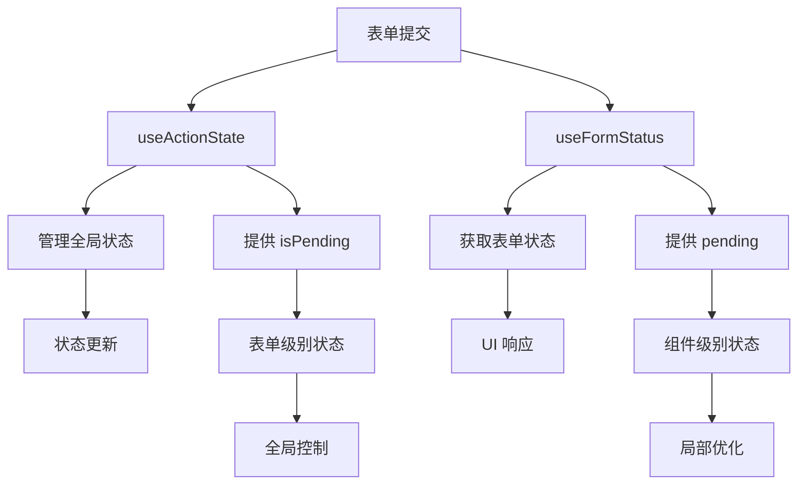
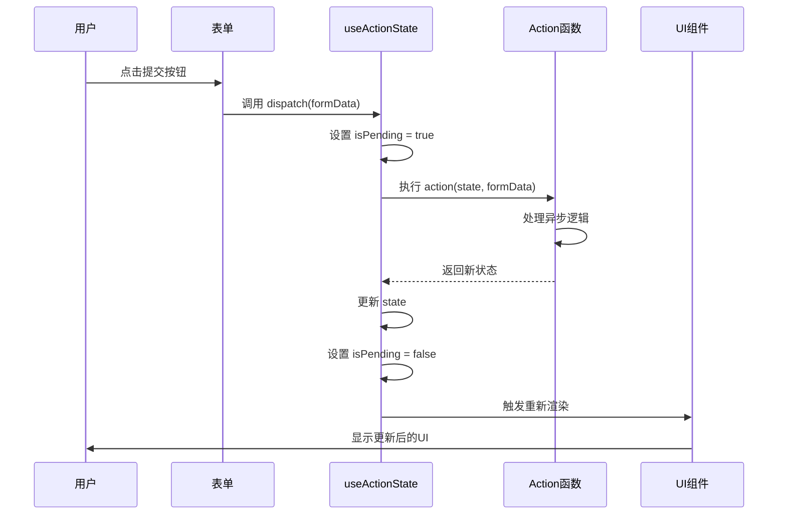
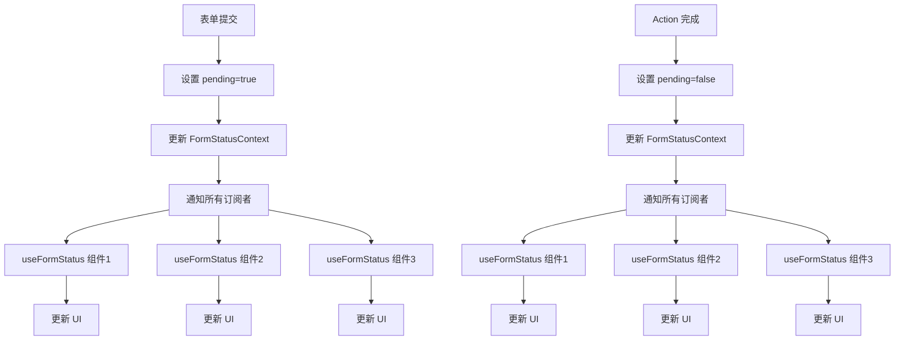

# useActionState 与 useFormStatus：React Actions 状态管理双雄

## 目录

1. [概述：两个 Hook 的定位](#概述两个-hook-的定位)
2. [useActionState 深度解析](#useactionstate-深度解析)
3. [useFormStatus 深度解析](#useformstatus-深度解析)
4. [核心区别对比](#核心区别对比)
5. [协同工作模式](#协同工作模式)
6. [实战应用场景](#实战应用场景)
7. [性能优化策略](#性能优化策略)
8. [TypeScript 集成](#typescript-集成)
9. [常见问题与解决方案](#常见问题与解决方案)
10. [总结与最佳实践](#总结与最佳实践)

## 一、概述：两个 Hook 的定位

### 1.1 React Actions 状态管理架构

在 React 19 的 Actions 系统中，`useActionState` 和 `useFormStatus` 是两个核心的状态管理 Hook，它们分别承担不同的职责：



### 1.2 设计哲学对比

| 方面 | useActionState | useFormStatus |
|------|---------------|---------------|
| **设计目标** | 管理表单的全局状态和异步流程 | 获取表单的当前状态信息 |
| **作用范围** | 表单级别（整个表单） | 组件级别（表单内的子组件） |
| **数据流向** | 自上而下（状态驱动） | 自下而上（状态感知） |
| **使用场景** | 状态管理、错误处理、结果展示 | UI 响应、组件解耦、用户体验优化 |
| **依赖关系** | 独立于组件层级 | 依赖于父级表单 |

### 1.3 基本关系图

```
┌─────────────────────────────────────────┐
│            Form Component               │
│                                         │
│  ┌─────────────────────────────────┐   │
│  │        useActionState           │   │
│  │  - 管理全局状态                │   │
│  │  - 处理异步操作                │   │
│  │  - 返回 action 函数           │   │
│  └─────────────────────────────────┘   │
│                                         │
│  ┌─────────────────────────────────┐   │
│  │      Form Fields & Buttons      │   │
│  │                                 │   │
│  │  ┌─────────────────────────┐   │   │
│  │  │   useFormStatus         │   │   │
│  │  │  - 感知表单状态         │   │   │
│  │  │  - 响应 pending 状态    │   │   │
│  │  └─────────────────────────┘   │   │
│  │                                 │   │
│  └─────────────────────────────────┘   │
└─────────────────────────────────────────┘
```

## 二、useActionState 深度解析

### 2.1 基本定义与签名

```typescript
// useActionState 的类型定义
function useActionState<State>(
  action: (previousState: State, formData: FormData) => Promise<State> | State,
  initialState: State,
  permalink?: string
): [state: State, action: (payload: FormData) => void, isPending: boolean];
```

### 2.2 核心功能

#### 2.2.1 状态管理

```jsx
import { useActionState } from 'react';

function UserRegistrationForm() {
  // 定义 Action 函数
  const registerUser = async (previousState, formData) => {
    const username = formData.get('username');
    const email = formData.get('email');
    
    // 模拟 API 调用
    await new Promise(resolve => setTimeout(resolve, 1000));
    
    // 返回新的状态
    return {
      success: true,
      message: `用户 ${username} 注册成功`,
      userId: Date.now().toString(),
      timestamp: new Date().toISOString()
    };
  };
  
  // 使用 useActionState
  const [state, action, isPending] = useActionState(
    registerUser,
    null // 初始状态
  );
  
  return (
    <div>
      <form action={action}>
        <div>
          <label>用户名:</label>
          <input type="text" name="username" required />
        </div>
        
        <div>
          <label>邮箱:</label>
          <input type="email" name="email" required />
        </div>
        
        <button type="submit" disabled={isPending}>
          {isPending ? '注册中...' : '立即注册'}
        </button>
      </form>
      
      {/* 显示状态结果 */}
      {state && (
        <div style={{ 
          marginTop: '20px',
          padding: '15px',
          backgroundColor: state.success ? '#d4edda' : '#f8d7da',
          border: `1px solid ${state.success ? '#c3e6cb' : '#f5c6cb'}`,
          borderRadius: '4px'
        }}>
          <p><strong>{state.success ? '✅ 成功' : '❌ 失败'}:</strong> {state.message}</p>
          {state.userId && <p>用户ID: {state.userId}</p>}
          {state.timestamp && <p>时间: {new Date(state.timestamp).toLocaleString()}</p>}
        </div>
      )}
    </div>
  );
}
```

#### 2.2.2 错误处理

```jsx
function FormWithErrorHandling() {
  const submitForm = async (previousState, formData) => {
    const value = formData.get('value');
    
    // 模拟验证
    if (!value || value.trim() === '') {
      return {
        ...previousState,
        success: false,
        error: '请输入有效值',
        fieldErrors: { value: '此字段不能为空' }
      };
    }
    
    if (value.length < 3) {
      return {
        ...previousState,
        success: false,
        error: '输入值太短',
        fieldErrors: { value: '至少需要3个字符' }
      };
    }
    
    try {
      // 模拟 API 调用
      await new Promise((resolve, reject) => {
        setTimeout(() => {
          Math.random() > 0.5 ? resolve() : reject(new Error('服务器错误'));
        }, 1000);
      });
      
      return {
        success: true,
        message: '提交成功',
        data: { value },
        fieldErrors: {}
      };
      
    } catch (error) {
      return {
        ...previousState,
        success: false,
        error: error.message,
        fieldErrors: {}
      };
    }
  };
  
  const [state, action, isPending] = useActionState(
    submitForm,
    { success: false, error: null, fieldErrors: {} }
  );
  
  return (
    <form action={action}>
      <div>
        <label>输入值:</label>
        <input 
          type="text" 
          name="value" 
          disabled={isPending}
          style={{
            borderColor: state.fieldErrors?.value ? '#dc3545' : '#ced4da'
          }}
        />
        {state.fieldErrors?.value && (
          <div style={{ color: '#dc3545', fontSize: '12px' }}>
            {state.fieldErrors.value}
          </div>
        )}
      </div>
      
      <button type="submit" disabled={isPending}>
        {isPending ? '提交中...' : '提交'}
      </button>
      
      {state.error && !state.success && (
        <div style={{ color: '#dc3545', marginTop: '10px' }}>
          ❌ {state.error}
        </div>
      )}
      
      {state.success && (
        <div style={{ color: '#28a745', marginTop: '10px' }}>
          ✅ {state.message}
        </div>
      )}
    </form>
  );
}
```

### 2.3 高级特性

#### 2.3.1 状态持久化与恢复

```jsx
function FormWithPersistentState() {
  // 从 localStorage 恢复状态
  const getInitialState = () => {
    const saved = localStorage.getItem('formState');
    if (saved) {
      try {
        return JSON.parse(saved);
      } catch (e) {
        console.error('Failed to parse saved state:', e);
      }
    }
    return {
      submissions: [],
      lastSubmission: null,
      totalSubmissions: 0
    };
  };
  
  const submitAction = async (previousState, formData) => {
    const data = Object.fromEntries(formData);
    
    // 模拟处理延迟
    await new Promise(resolve => setTimeout(resolve, 800));
    
    const newSubmission = {
      id: Date.now(),
      data,
      timestamp: new Date().toISOString(),
      status: 'success'
    };
    
    const updatedState = {
      submissions: [...previousState.submissions, newSubmission],
      lastSubmission: newSubmission,
      totalSubmissions: previousState.totalSubmissions + 1
    };
    
    // 保存到 localStorage
    localStorage.setItem('formState', JSON.stringify(updatedState));
    
    return updatedState;
  };
  
  const [state, action, isPending] = useActionState(
    submitAction,
    getInitialState()
  );
  
  const clearHistory = () => {
    localStorage.removeItem('formState');
    // 重置状态需要重新加载组件
    window.location.reload();
  };
  
  return (
    <div>
      <form action={action}>
        <div>
          <label>名称:</label>
          <input type="text" name="name" required />
        </div>
        
        <div>
          <label>评论:</label>
          <textarea name="comment" rows={3} required />
        </div>
        
        <button type="submit" disabled={isPending}>
          {isPending ? '提交中...' : '提交评论'}
        </button>
      </form>
      
      <div style={{ marginTop: '30px' }}>
        <h3>提交历史</h3>
        <p>总提交次数: {state.totalSubmissions}</p>
        
        {state.lastSubmission && (
          <div style={{ 
            padding: '10px',
            backgroundColor: '#f8f9fa',
            border: '1px solid #dee2e6',
            borderRadius: '4px',
            marginBottom: '10px'
          }}>
            <strong>最近提交:</strong>
            <div>ID: {state.lastSubmission.id}</div>
            <div>时间: {new Date(state.lastSubmission.timestamp).toLocaleString()}</div>
            <div>数据: {JSON.stringify(state.lastSubmission.data)}</div>
          </div>
        )}
        
        <button 
          onClick={clearHistory}
          style={{
            padding: '5px 10px',
            backgroundColor: '#dc3545',
            color: 'white',
            border: 'none',
            borderRadius: '4px',
            fontSize: '12px'
          }}
        >
          清空历史
        </button>
      </div>
    </div>
  );
}
```

#### 2.3.2 并发操作处理

```jsx
function FormWithConcurrentOperations() {
  const processForm = async (previousState, formData) => {
    const operations = formData.getAll('operations');
    
    if (operations.length === 0) {
      return {
        ...previousState,
        error: '请选择至少一个操作'
      };
    }
    
    // 并发执行多个操作
    const results = await Promise.allSettled(
      operations.map(async (operation) => {
        // 模拟不同的操作时间
        const delay = Math.floor(Math.random() * 2000) + 500;
        await new Promise(resolve => setTimeout(resolve, delay));
        
        return {
          operation,
          success: Math.random() > 0.2, // 80% 成功率
          duration: delay,
          timestamp: new Date().toISOString()
        };
      })
    );
    
    const successful = results.filter(r => r.status === 'fulfilled' && r.value.success);
    const failed = results.filter(r => r.status === 'rejected' || (r.status === 'fulfilled' && !r.value.success));
    
    return {
      operations: operations,
      results: results.map(r => r.status === 'fulfilled' ? r.value : { error: r.reason?.message || '未知错误' }),
      successfulCount: successful.length,
      failedCount: failed.length,
      totalCount: operations.length,
      lastRun: new Date().toISOString()
    };
  };
  
  const [state, action, isPending] = useActionState(
    processForm,
    { operations: [], results: [], successfulCount: 0, failedCount: 0, totalCount: 0 }
  );
  
  const operationsList = ['备份数据', '清理缓存', '更新索引', '发送通知', '生成报告'];
  
  return (
    <div>
      <form action={action}>
        <div>
          <h4>选择要执行的操作:</h4>
          {operationsList.map((op, index) => (
            <div key={index} style={{ marginBottom: '5px' }}>
              <label>
                <input 
                  type="checkbox" 
                  name="operations" 
                  value={op}
                  disabled={isPending}
                />
                {op}
              </label>
            </div>
          ))}
        </div>
        
        <button type="submit" disabled={isPending}>
          {isPending ? '执行中...' : '执行选中操作'}
        </button>
      </form>
      
      {state.results.length > 0 && (
        <div style={{ marginTop: '20px' }}>
          <h4>执行结果:</h4>
          <div style={{ 
            display: 'flex',
            justifyContent: 'space-between',
            marginBottom: '10px'
          }}>
            <span style={{ color: '#28a745' }}>
              成功: {state.successfulCount}
            </span>
            <span style={{ color: '#dc3545' }}>
              失败: {state.failedCount}
            </span>
            <span>
              总计: {state.totalCount}
            </span>
          </div>
          
          <div style={{ 
            maxHeight: '200px',
            overflowY: 'auto',
            border: '1px solid #dee2e6',
            borderRadius: '4px',
            padding: '10px'
          }}>
            {state.results.map((result, index) => (
              <div 
                key={index}
                style={{
                  padding: '5px',
                  marginBottom: '5px',
                  backgroundColor: result.success ? '#d4edda' : '#f8d7da',
                  border: `1px solid ${result.success ? '#c3e6cb' : '#f5c6cb'}`,
                  borderRadius: '3px'
                }}
              >
                {result.success ? '✅' : '❌'} 
                {result.operation || '未知操作'} 
                {result.duration && ` (${result.duration}ms)`}
                {result.error && ` - ${result.error}`}
              </div>
            ))}
          </div>
          
          <div style={{ fontSize: '12px', color: '#6c757d', marginTop: '5px' }}>
            最后执行: {state.lastRun ? new Date(state.lastRun).toLocaleString() : '从未执行'}
          </div>
        </div>
      )}
    </div>
  );
}
```

### 2.4 内部机制分析

#### 2.4.1 简化实现原理

```jsx
// useActionState 的简化实现（教育目的）
function useActionStateSimplified(action, initialState) {
  const [state, setState] = useState(initialState);
  const [isPending, setIsPending] = useState(false);
  const mountedRef = useRef(true);
  
  // 清理函数
  useEffect(() => {
    return () => {
      mountedRef.current = false;
    };
  }, []);
  
  const dispatch = useCallback(async (formData) => {
    if (!mountedRef.current) return;
    
    setIsPending(true);
    
    try {
      const newState = await action(state, formData);
      
      if (mountedRef.current) {
        setState(newState);
      }
    } catch (error) {
      if (mountedRef.current) {
        setState(prev => ({ 
          ...prev, 
          error: error.message,
          success: false 
        }));
      }
    } finally {
      if (mountedRef.current) {
        setIsPending(false);
      }
    }
  }, [action, state]);
  
  return [state, dispatch, isPending];
}
```

#### 2.4.2 状态更新流程



## 三、useFormStatus 深度解析

### 3.1 基本定义与签名

```typescript
// useFormStatus 的类型定义
interface FormStatus {
  pending: boolean;
  data: FormData | null;
  method: 'get' | 'post' | null;
  action: string | ((formData: FormData) => void) | null;
}

function useFormStatus(): FormStatus;
```

### 3.2 核心功能

#### 3.2.1 基本用法

```jsx
import { useFormStatus } from 'react-dom';

function SmartSubmitButton() {
  const { pending, data, method, action } = useFormStatus();
  
  return (
    <button
      type="submit"
      disabled={pending}
      style={{
        padding: '12px 24px',
        backgroundColor: pending ? '#6c757d' : '#007bff',
        color: 'white',
        border: 'none',
        borderRadius: '6px',
        fontSize: '16px',
        cursor: pending ? 'not-allowed' : 'pointer',
        transition: 'all 0.3s ease',
        display: 'flex',
        alignItems: 'center',
        justifyContent: 'center',
        gap: '8px',
        minWidth: '120px'
      }}
    >
      {pending ? (
        <>
          <span className="spinner" style={{
            width: '16px',
            height: '16px',
            border: '2px solid rgba(255,255,255,0.3)',
            borderTop: '2px solid white',
            borderRadius: '50%',
            animation: 'spin 1s linear infinite'
          }} />
          处理中...
        </>
      ) : (
        '提交表单'
      )}
    </button>
  );
}

// 在表单中使用
function UserProfileForm() {
  const updateProfile = async (formData) => {
    await new Promise(resolve => setTimeout(resolve, 1500));
    return { success: true, message: '资料更新成功' };
  };
  
  return (
    <form action={updateProfile}>
      <div>
        <label>用户名:</label>
        <input type="text" name="username" />
      </div>
      
      <div>
        <label>邮箱:</label>
        <input type="email" name="email" />
      </div>
      
      <div>
        <label>个人简介:</label>
        <textarea name="bio" rows={4} />
      </div>
      
      {/* 使用智能提交按钮 */}
      <SmartSubmitButton />
    </form>
  );
}

// 添加 CSS 动画
const styles = `
@keyframes spin {
  0% { transform: rotate(0deg); }
  100% { transform: rotate(360deg); }
}
`;
```

#### 3.2.2 表单状态监控组件

```jsx
function FormStatusMonitor() {
  const { pending, data, method, action } = useFormStatus();
  
  return (
    <div style={{
      position: 'fixed',
      bottom: '20px',
      right: '20px',
      padding: '15px',
      backgroundColor: 'white',
      border: '1px solid #dee2e6',
      borderRadius: '8px',
      boxShadow: '0 2px 10px rgba(0,0,0,0.1)',
      minWidth: '250px',
      zIndex: 1000,
      fontSize: '14px'
    }}>
      <h4 style={{ marginTop: 0, marginBottom: '10px' }}>表单状态监控</h4>
      
      <div style={{ marginBottom: '8px' }}>
        <strong>状态:</strong> 
        <span style={{ 
          color: pending ? '#dc3545' : '#28a745',
          marginLeft: '8px',
          fontWeight: 'bold'
        }}>
          {pending ? '🔄 处理中' : '✅ 空闲'}
        </span>
      </div>
      
      <div style={{ marginBottom: '8px' }}>
        <strong>请求方法:</strong> 
        <code style={{ 
          marginLeft: '8px',
          backgroundColor: '#f8f9fa',
          padding: '2px 6px',
          borderRadius: '3px'
        }}>
          {method || '未设置'}
        </code>
      </div>
      
      {data && (
        <div style={{ marginBottom: '8px' }}>
          <strong>表单数据:</strong>
          <div style={{
            marginTop: '5px',
            maxHeight: '100px',
            overflowY: 'auto',
            backgroundColor: '#f8f9fa',
            padding: '8px',
            borderRadius: '4px',
            fontSize: '12px'
          }}>
            {Array.from(data.entries()).map(([key, value], index) => (
              <div key={index}>
                <strong>{key}:</strong> {value.toString()}
              </div>
            ))}
          </div>
        </div>
      )}
      
      {action && (
        <div>
          <strong>Action:</strong>
          <div style={{
            marginTop: '5px',
            fontSize: '12px',
            color: '#6c757d',
            wordBreak: 'break-all'
          }}>
            {typeof action === 'function' ? '函数 Action' : action}
          </div>
        </div>
      )}
    </div>
  );
}

// 使用示例
function MonitoredForm() {
  const submitAction = async (formData) => {
    console.log('表单数据:', Object.fromEntries(formData));
    await new Promise(resolve => setTimeout(resolve, 2000));
    return { success: true };
  };
  
  return (
    <form action={submitAction}>
      <input type="text" name="testField" placeholder="测试字段" />
      <button type="submit">提交</button>
      
      {/* 状态监控组件 */}
      <FormStatusMonitor />
    </form>
  );
}
```

### 3.3 高级特性

#### 3.3.1 条件渲染优化

```jsx
function ConditionalFormElements() {
  const { pending } = useFormStatus();
  
  return (
    <div>
      {/* 主提交按钮 */}
      <button
        type="submit"
        disabled={pending}
        style={{
          padding: '10px 20px',
          backgroundColor: pending ? '#ccc' : '#007bff',
          color: 'white',
          border: 'none',
          borderRadius: '4px',
          marginRight: '10px'
        }}
      >
        {pending ? '提交中...' : '提交订单'}
      </button>
      
      {/* 辅助按钮 - 只在非 pending 状态显示 */}
      {!pending && (
        <button
          type="button"
          onClick={() => alert('保存草稿')}
          style={{
            padding: '10px 20px',
            backgroundColor: '#6c757d',
            color: 'white',
            border: 'none',
            borderRadius: '4px'
          }}
        >
          保存草稿
        </button>
      )}
      
      {/* 取消按钮 - 只在 pending 状态显示 */}
      {pending && (
        <button
          type="button"
          onClick={() => {
            if (window.confirm('确定要取消吗？')) {
              // 取消逻辑
              console.log('取消提交');
            }
          }}
          style={{
            padding: '10px 20px',
            backgroundColor: '#dc3545',
            color: 'white',
            border: 'none',
            borderRadius: '4px',
            marginLeft: '10px'
          }}
        >
          取消提交
        </button>
      )}
      
      {/* 进度指示器 */}
      {pending && (
        <div style={{ marginTop: '10px' }}>
          <div style={{
            width: '100%',
            height: '4px',
            backgroundColor: '#e9ecef',
            borderRadius: '2px',
            overflow: 'hidden'
          }}>
            <div style={{
              width: '100%',
              height: '100%',
              backgroundColor: '#007bff',
              animation: 'progress 2s ease-in-out infinite',
              transformOrigin: 'left center'
            }} />
          </div>
          <div style={{
            fontSize: '12px',
            color: '#6c757d',
            textAlign: 'center',
            marginTop: '5px'
          }}>
            处理中，请稍候...
          </div>
        </div>
      )}
    </div>
  );
}

// 在表单中使用
function OrderForm() {
  const submitOrder = async (formData) => {
    console.log('订单数据:', formData);
    await new Promise(resolve => setTimeout(resolve, 3000));
    return { success: true };
  };
  
  return (
    <form action={submitOrder}>
      <div>
        <label>商品名称:</label>
        <input type="text" name="productName" />
      </div>
      
      <div>
        <label>数量:</label>
        <input type="number" name="quantity" min="1" />
      </div>
      
      {/* 使用条件渲染的按钮组 */}
      <ConditionalFormElements />
    </form>
  );
}
```

#### 3.3.2 表单字段状态联动

```jsx
function SmartFormField({ name, label, type = 'text', validation }) {
  const { pending, data } = useFormStatus();
  const [value, setValue] = useState('');
  const [error, setError] = useState('');
  const [touched, setTouched] = useState(false);
  
  // 从表单数据中获取初始值
  useEffect(() => {
    if (data && data.has(name)) {
      setValue(data.get(name) || '');
    }
  }, [data, name]);
  
  // 实时验证
  useEffect(() => {
    if (!touched) return;
    
    if (validation) {
      const validationError = validation(value);
      setError(validationError);
    }
  }, [value, touched, validation]);
  
  const handleChange = (e) => {
    setValue(e.target.value);
  };
  
  const handleBlur = () => {
    setTouched(true);
  };
  
  // 根据状态决定样式
  const getFieldStyle = () => {
    const baseStyle = {
      width: '100%',
      padding: '10px',
      border: '1px solid',
      borderRadius: '4px',
      fontSize: '16px',
      transition: 'all 0.3s ease'
    };
    
    if (pending) {
      return {
        ...baseStyle,
        borderColor: '#6c757d',
        backgroundColor: '#f8f9fa',
        cursor: 'not-allowed',
        opacity: 0.7
      };
    }
    
    if (error) {
      return {
        ...baseStyle,
        borderColor: '#dc3545',
        backgroundColor: '#fff',
        boxShadow: '0 0 0 0.2rem rgba(220,53,69,0.25)'
      };
    }
    
    if (touched && !error) {
      return {
        ...baseStyle,
        borderColor: '#28a745',
        backgroundColor: '#fff',
        boxShadow: '0 0 0 0.2rem rgba(40,167,69,0.25)'
      };
    }
    
    return {
      ...baseStyle,
      borderColor: '#ced4da',
      backgroundColor: '#fff'
    };
  };
  
  return (
    <div style={{ marginBottom: '20px' }}>
      <label style={{ 
        display: 'block', 
        marginBottom: '8px',
        fontWeight: '500',
        color: pending ? '#6c757d' : '#212529'
      }}>
        {label}:
        {pending && (
          <span style={{ 
            fontSize: '12px',
            color: '#6c757d',
            marginLeft: '8px',
            fontStyle: 'italic'
          }}>
            (不可编辑)
          </span>
        )}
      </label>
      
      <input
        type={type}
        name={name}
        value={value}
        onChange={handleChange}
        onBlur={handleBlur}
        disabled={pending}
        style={getFieldStyle()}
      />
      
      {error && (
        <div style={{ 
          color: '#dc3545',
          fontSize: '14px',
          marginTop: '5px',
          display: 'flex',
          alignItems: 'center',
          gap: '5px'
        }}>
          <span>⚠️</span>
          {error}
        </div>
      )}
      
      {pending && !error && touched && (
        <div style={{ 
          color: '#6c757d',
          fontSize: '12px',
          marginTop: '5px'
        }}>
          ⏳ 验证通过，等待提交...
        </div>
      )}
    </div>
  );
}

// 使用示例
function AdvancedForm() {
  const submitForm = async (formData) => {
    console.log('提交数据:', Object.fromEntries(formData));
    await new Promise(resolve => setTimeout(resolve, 2000));
    return { success: true };
  };
  
  // 验证函数
  const validateEmail = (value) => {
    if (!value) return '邮箱不能为空';
    if (!/^[^\s@]+@[^\s@]+\.[^\s@]+$/.test(value)) {
      return '邮箱格式不正确';
    }
    return '';
  };
  
  const validatePassword = (value) => {
    if (!value) return '密码不能为空';
    if (value.length < 6) return '密码至少6个字符';
    if (!/[A-Z]/.test(value)) return '密码必须包含大写字母';
    if (!/[0-9]/.test(value)) return '密码必须包含数字';
    return '';
  };
  
  return (
    <form action={submitForm}>
      <SmartFormField
        name="username"
        label="用户名"
        validation={(value) => !value ? '用户名不能为空' : ''}
      />
      
      <SmartFormField
        name="email"
        label="邮箱"
        type="email"
        validation={validateEmail}
      />
      
      <SmartFormField
        name="password"
        label="密码"
        type="password"
        validation={validatePassword}
      />
      
      <button type="submit" style={{
        padding: '12px 24px',
        backgroundColor: '#007bff',
        color: 'white',
        border: 'none',
        borderRadius: '4px',
        fontSize: '16px',
        cursor: 'pointer'
      }}>
        注册
      </button>
    </form>
  );
}
```

### 3.4 内部机制分析

#### 3.4.1 简化实现原理

```jsx
// useFormStatus 的简化实现（教育目的）
function useFormStatusSimplified() {
  const [status, setStatus] = useState({
    pending: false,
    data: null,
    method: null,
    action: null
  });
  
  // 通过 Context 获取表单状态
  const formContext = useContext(FormStatusContext);
  
  // 监听表单状态变化
  useEffect(() => {
    if (!formContext) {
      console.warn('useFormStatus must be used within a form element');
      return;
    }
    
    const updateStatus = (newStatus) => {
      setStatus(prev => ({ ...prev, ...newStatus }));
    };
    
    // 订阅表单状态变化
    formContext.subscribe(updateStatus);
    
    return () => {
      formContext.unsubscribe(updateStatus);
    };
  }, [formContext]);
  
  return status;
}

// 模拟 FormStatusContext
const FormStatusContext = React.createContext(null);

// 表单组件提供 Context
function FormWithContext({ action, children }) {
  const [formStatus, setFormStatus] = useState({
    pending: false,
    data: null,
    method: 'post',
    action
  });
  
  const contextValue = useMemo(() => ({
    ...formStatus,
    subscribe: (callback) => {
      // 简化实现
    },
    unsubscribe: (callback) => {
      // 简化实现
    }
  }), [formStatus]);
  
  const handleSubmit = async (e) => {
    e.preventDefault();
    
    const formData = new FormData(e.target);
    
    // 更新状态为 pending
    setFormStatus(prev => ({ ...prev, pending: true, data: formData }));
    
    try {
      await action(formData);
    } finally {
      // 恢复状态
      setFormStatus(prev => ({ ...prev, pending: false }));
    }
  };
  
  return (
    <FormStatusContext.Provider value={contextValue}>
      <form onSubmit={handleSubmit}>
        {children}
      </form>
    </FormStatusContext.Provider>
  );
}
```

#### 3.4.2 状态传播机制



## 四、核心区别对比

### 4.1 功能定位对比

| 特性 | useActionState | useFormStatus |
|------|---------------|---------------|
| **主要用途** | 管理表单的全局状态和异步操作 | 获取表单的当前状态信息 |
| **返回值** | `[state, action, isPending]` | `{ pending, data, method, action }` |
| **状态管理** | 主动管理（创建、更新状态） | 被动感知（读取现有状态） |
| **作用范围** | 表单级别（控制整个表单） | 组件级别（感知父级表单） |
| **依赖关系** | 独立，不依赖父组件 | 必须位于 `<form>` 元素内 |
| **数据流** | 单向（Action → State → UI） | 响应式（表单状态变化 → UI 更新） |
| **错误处理** | 内置错误状态管理 | 不直接处理错误，只提供状态 |
| **类型安全** | 强类型（泛型支持） | 弱类型（固定返回结构） |

### 4.2 代码模式对比

#### 4.2.1 useActionState 模式

```jsx
// 主动管理模式
function ActiveManagementForm() {
  // 1. 定义 Action 和初始状态
  const [state, action, isPending] = useActionState(
    async (prevState, formData) => {
      // 业务逻辑
      return { result: 'success', data: formData };
    },
    { result: null, data: null }
  );
  
  // 2. 控制整个表单
  return (
    <form action={action}>
      {/* 3. 使用 isPending 控制 UI */}
      <input disabled={isPending} />
      <button disabled={isPending}>
        {isPending ? '处理中...' : '提交'}
      </button>
      
      {/* 4. 使用 state 显示结果 */}
      {state.result && <div>结果: {state.result}</div>}
    </form>
  );
}
```

#### 4.2.2 useFormStatus 模式

```jsx
// 被动感知模式
function PassivePerceptionForm() {
  const submitAction = async (formData) => {
    // 业务逻辑
    return { success: true };
  };
  
  return (
    <form action={submitAction}>
      {/* 1. 表单字段 */}
      <input name="field" />
      
      {/* 2. 使用感知组件 */}
      <SmartSubmitButton />
      <FormStatusDisplay />
    </form>
  );
}

// 感知组件
function SmartSubmitButton() {
  // 3. 感知父级表单状态
  const { pending } = useFormStatus();
  
  return (
    <button disabled={pending}>
      {pending ? '提交中...' : '提交'}
    </button>
  );
}

function FormStatusDisplay() {
  // 4. 显示表单状态信息
  const { pending, data } = useFormStatus();
  
  return (
    <div>
      {pending && <div>正在处理...</div>}
      {data && <div>已提交数据</div>}
    </div>
  );
}
```

### 4.3 适用场景对比

#### 4.3.1 useActionState 适用场景

```jsx
// 场景1：需要完整状态管理的复杂表单
function ComplexFormWithState() {
  const [state, action, isPending] = useActionState(
    async (prevState, formData) => {
      // 复杂的业务逻辑
      const validation = validateForm(formData);
      if (!validation.valid) {
        return { ...prevState, errors: validation.errors };
      }
      
      const result = await api.submit(formData);
      return { 
        success: result.success, 
        data: result.data,
        message: result.message 
      };
    },
    { errors: {}, success: false, data: null, message: null }
  );
  
  return (
    <form action={action}>
      {/* 显示错误信息 */}
      {Object.entries(state.errors).map(([field, error]) => (
        <div key={field} className="error">{error}</div>
      ))}
      
      {/* 显示成功信息 */}
      {state.success && (
        <div className="success">{state.message}</div>
      )}
      
      <button disabled={isPending}>
        {isPending ? '提交中...' : '提交'}
      </button>
    </form>
  );
}

// 场景2：需要状态持久化的表单
function FormWithPersistentState() {
  const [state, action, isPending] = useActionState(
    async (prevState, formData) => {
      // 保存到本地存储
      localStorage.setItem('formData', JSON.stringify(Object.fromEntries(formData)));
      
      return {
        ...prevState,
        lastSaved: new Date().toISOString(),
        data: Object.fromEntries(formData)
      };
    },
    { lastSaved: null, data: null }
  );
  
  return (
    <form action={action}>
      <input name="content" />
      <button disabled={isPending}>
        {isPending ? '保存中...' : '保存'}
      </button>
      {state.lastSaved && (
        <div>最后保存: {new Date(state.lastSaved).toLocaleString()}</div>
      )}
    </form>
  );
}
```

#### 4.3.2 useFormStatus 适用场景

```jsx
// 场景1：可复用的表单组件
function ReusableFormButton({ children, ...props }) {
  const { pending } = useFormStatus();
  
  return (
    <button 
      type="submit" 
      disabled={pending}
      {...props}
    >
      {pending ? '处理中...' : children}
    </button>
  );
}

// 在任何表单中都可以使用
function AnyForm() {
  return (
    <form action={someAction}>
      <input name="field" />
      <ReusableFormButton style={{ padding: '10px 20px' }}>
        提交
      </ReusableFormButton>
    </form>
  );
}

// 场景2：表单状态指示器
function FormProgressIndicator() {
  const { pending, data } = useFormStatus();
  
  if (!pending) return null;
  
  return (
    <div style={{
      position: 'fixed',
      top: '20px',
      right: '20px',
      padding: '10px',
      backgroundColor: 'rgba(0,0,0,0.8)',
      color: 'white',
      borderRadius: '4px',
      zIndex: 1000
    }}>
      <div>正在处理表单提交...</div>
      {data && (
        <div style={{ fontSize: '12px', marginTop: '5px' }}>
          字段数: {Array.from(data.entries()).length}
        </div>
      )}
    </div>
  );
}

// 场景3：智能表单字段
function SmartInput({ name, label }) {
  const { pending, data } = useFormStatus();
  const [value, setValue] = useState('');
  
  // 从表单数据中恢复值
  useEffect(() => {
    if (data && data.has(name)) {
      setValue(data.get(name));
    }
  }, [data, name]);
  
  return (
    <div>
      <label>{label}:</label>
      <input
        name={name}
        value={value}
        onChange={(e) => setValue(e.target.value)}
        disabled={pending}
        style={{
          opacity: pending ? 0.6 : 1,
          cursor: pending ? 'not-allowed' : 'text'
        }}
      />
      {pending && (
        <div style={{ fontSize: '12px', color: '#666' }}>
          提交期间不可编辑
        </div>
      )}
    </div>
  );
}
```

### 4.4 性能影响对比

| 性能指标 | useActionState | useFormStatus |
|----------|---------------|---------------|
| **重新渲染** | 状态变化时触发重新渲染 | 表单状态变化时触发重新渲染 |
| **内存使用** | 存储完整的表单状态 | 只存储当前状态信息 |
| **初始化开销** | 中等（需要设置初始状态） | 低（只订阅状态） |
| **更新开销** | 高（可能触发深层更新） | 低（局部更新） |
| **依赖关系** | 依赖 Action 函数和状态 | 依赖父级表单 Context |
| **优化潜力** | 可通过 useMemo/useCallback 优化 | 天然优化（组件级别更新） |

## 五、协同工作模式

### 5.1 基本协同模式

```jsx
function CollaborativeForm() {
  // 使用 useActionState 管理全局状态
  const [state, action, isPending] = useActionState(
    async (previousState, formData) => {
      console.log('表单数据:', Object.fromEntries(formData));
      
      // 模拟 API 调用
      await new Promise(resolve => setTimeout(resolve, 2000));
      
      return {
        success: true,
        message: '提交成功',
        submittedAt: new Date().toISOString(),
        data: Object.fromEntries(formData)
      };
    },
    null
  );
  
  return (
    <div>
      <form action={action}>
        {/* 表单字段 */}
        <div>
          <label>用户名:</label>
          <input type="text" name="username" required />
        </div>
        
        <div>
          <label>邮箱:</label>
          <input type="email" name="email" required />
        </div>
        
        {/* 使用 useFormStatus 的智能按钮 */}
        <EnhancedSubmitButton />
        
        {/* 使用 useFormStatus 的状态显示 */}
        <FormStatusDisplay />
      </form>
      
      {/* 使用 useActionState 的结果显示 */}
      {state && (
        <div style={{
          marginTop: '20px',
          padding: '15px',
          backgroundColor: state.success ? '#d4edda' : '#f8d7da',
          border: `1px solid ${state.success ? '#c3e6cb' : '#f5c6cb'}`,
          borderRadius: '4px'
        }}>
          <h4>提交结果</h4>
          <p>{state.message}</p>
          {state.submittedAt && (
            <p>时间: {new Date(state.submittedAt).toLocaleString()}</p>
          )}
          {state.data && (
            <div>
              <p>提交的数据:</p>
              <pre style={{ fontSize: '12px' }}>
                {JSON.stringify(state.data, null, 2)}
              </pre>
            </div>
          )}
        </div>
      )}
    </div>
  );
}

// 增强的提交按钮（使用 useFormStatus）
function EnhancedSubmitButton() {
  const { pending } = useFormStatus();
  
  return (
    <button
      type="submit"
      disabled={pending}
      style={{
        padding: '12px 24px',
        backgroundColor: pending ? '#6c757d' : '#007bff',
        color: 'white',
        border: 'none',
        borderRadius: '6px',
        fontSize: '16px',
        cursor: pending ? 'not-allowed' : 'pointer',
        display: 'flex',
        alignItems: 'center',
        justifyContent: 'center',
        gap: '8px',
        transition: 'all 0.3s ease'
      }}
    >
      {pending ? (
        <>
          <span style={{
            width: '16px',
            height: '16px',
            border: '2px solid rgba(255,255,255,0.3)',
            borderTop: '2px solid white',
            borderRadius: '50%',
            animation: 'spin 1s linear infinite'
          }} />
          提交中...
        </>
      ) : (
        '提交表单'
      )}
    </button>
  );
}

// 表单状态显示（使用 useFormStatus）
function FormStatusDisplay() {
  const { pending, data } = useFormStatus();
  
  if (!pending) return null;
  
  return (
    <div style={{
      marginTop: '10px',
      padding: '10px',
      backgroundColor: '#e7f3ff',
      border: '1px solid #b3d7ff',
      borderRadius: '4px',
      fontSize: '14px'
    }}>
      <div style={{ display: 'flex', alignItems: 'center', gap: '8px' }}>
        <span style={{ fontSize: '18px' }}>⏳</span>
        <div>
          <strong>正在处理表单提交...</strong>
          <div style={{ fontSize: '12px', color: '#666', marginTop: '4px' }}>
            已提交 {data ? Array.from(data.entries()).length : 0} 个字段
          </div>
        </div>
      </div>
    </div>
  );
}
```

### 5.2 高级协同模式：状态同步

```jsx
function SyncedForm() {
  // useActionState 管理业务状态
  const [businessState, businessAction, isBusinessPending] = useActionState(
    async (prevState, formData) => {
      // 业务逻辑处理
      const result = await processBusinessLogic(formData);
      return {
        ...prevState,
        businessResult: result,
        lastBusinessUpdate: new Date().toISOString()
      };
    },
    { businessResult: null, lastBusinessUpdate: null }
  );
  
  // 另一个 useActionState 管理 UI 状态
  const [uiState, uiAction, isUiPending] = useActionState(
    async (prevState, formData) => {
      // UI 相关处理（如动画、日志等）
      const uiResult = await processUIEffects(formData);
      return {
        ...prevState,
        uiEffects: uiResult,
        lastUIUpdate: new Date().toISOString()
      };
    },
    { uiEffects: null, lastUIUpdate: null }
  );
  
  // 组合 Action
  const combinedAction = async (formData) => {
    // 并行执行两个 Action
    await Promise.all([
      businessAction(formData),
      uiAction(formData)
    ]);
  };
  
  // 计算综合的 pending 状态
  const isPending = isBusinessPending || isUiPending;
  
  return (
    <form action={combinedAction}>
      <div>
        <label>输入数据:</label>
        <input type="text" name="data" />
      </div>
      
      {/* 使用 useFormStatus 的智能组件 */}
      <SmartFormControls isPending={isPending} />
      
      {/* 显示业务状态 */}
      {businessState.businessResult && (
        <div style={{ marginTop: '15px', padding: '10px', backgroundColor: '#f8f9fa' }}>
          <strong>业务结果:</strong>
          <pre style={{ fontSize: '12px' }}>
            {JSON.stringify(businessState.businessResult, null, 2)}
          </pre>
        </div>
      )}
      
      {/* 显示 UI 状态 */}
      {uiState.uiEffects && (
        <div style={{ marginTop: '15px', padding: '10px', backgroundColor: '#fff3cd' }}>
          <strong>UI 效果:</strong>
          <pre style={{ fontSize: '12px' }}>
            {JSON.stringify(uiState.uiEffects, null, 2)}
          </pre>
        </div>
      )}
    </form>
  );
}

// 智能表单控制组件
function SmartFormControls({ isPending }) {
  const { pending: formPending } = useFormStatus();
  
  // 综合判断 pending 状态
  const actualPending = isPending || formPending;
  
  return (
    <div style={{ marginTop: '20px' }}>
      <button
        type="submit"
        disabled={actualPending}
        style={{
          padding: '12px 24px',
          backgroundColor: actualPending ? '#6c757d' : '#28a745',
          color: 'white',
          border: 'none',
          borderRadius: '6px',
          fontSize: '16px',
          marginRight: '10px'
        }}
      >
        {actualPending ? '处理中...' : '提交'}
      </button>
      
      <button
        type="button"
        disabled={actualPending}
        style={{
          padding: '12px 24px',
          backgroundColor: actualPending ? '#6c757d' : '#6c757d',
          color: 'white',
          border: 'none',
          borderRadius: '6px',
          fontSize: '16px'
        }}
      >
        取消
      </button>
      
      {actualPending && (
        <div style={{ marginTop: '10px', fontSize: '14px', color: '#666' }}>
          <div>状态: 处理中...</div>
          <div style={{ fontSize: '12px' }}>
            业务处理: {isPending ? '进行中' : '完成'} | 
            表单状态: {formPending ? '进行中' : '完成'}
          </div>
        </div>
      )}
    </div>
  );
}
```

### 5.3 数据流分析

```mermaid
graph TB
    subgraph "useActionState 数据流"
        A1[用户输入] --> B1[表单数据]
        B1 --> C1[Action 函数]
        C1 --> D1[处理业务逻辑]
        D1 --> E1[返回新状态]
        E1 --> F1[更新 state]
        F1 --> G1[触发重新渲染]
        G1 --> H1[更新 isPending]
    end
    
    subgraph "useFormStatus 数据流"
        A2[表单提交] --> B2[设置 pending=true]
        B2 --> C2[更新 Context]
        C2 --> D2[通知订阅者]
        D2 --> E2[useFormStatus 组件]
        E2 --> F2[读取 pending 状态]
        F2 --> G2[更新 UI]
        
        H2[Action 完成] --> I2[设置 pending=false]
        I2 --> J2[更新 Context]
        J2 --> K2[通知订阅者]
        K2 --> L2[useFormStatus 组件]
        L2 --> M2[读取 pending 状态]
        M2 --> N2[更新 UI]
    end
    
    subgraph "协同工作"
        O[表单组件] --> P[useActionState]
        O --> Q[useFormStatus]
        
        P --> R[管理业务状态]
        Q --> S[响应 UI 状态]
        
        R --> T[显示结果]
        S --> U[优化体验]
        
        T --> V[完整解决方案]
        U --> V
    end
    
    style A1 fill:#e1f5fe
    style A2 fill:#f3e5f5
    style O fill:#f1f8e9
```



## 六、实战应用场景

### 6.1 用户注册系统

```jsx
function UserRegistrationSystem() {
  // useActionState 管理注册状态
  const [registerState, registerAction, isRegistering] = useActionState(
    async (prevState, formData) => {
      const username = formData.get('username');
      const email = formData.get('email');
      const password = formData.get('password');
      
      // 验证数据
      const errors = {};
      if (!username || username.length < 3) {
        errors.username = '用户名至少3个字符';
      }
      
      if (!email || !/^[^\s@]+@[^\s@]+\.[^\s@]+$/.test(email)) {
        errors.email = '邮箱格式不正确';
      }
      
      if (!password || password.length < 6) {
        errors.password = '密码至少6个字符';
      }
      
      if (Object.keys(errors).length > 0) {
        return {
          ...prevState,
          errors,
          success: false,
          message: '表单验证失败'
        };
      }
      
      try {
        // 模拟 API 调用
        await new Promise(resolve => setTimeout(resolve, 1500));
        
        // 模拟成功响应
        return {
          errors: {},
          success: true,
          message: '注册成功！请检查您的邮箱以完成验证。',
          userId: `user_${Date.now()}`,
          registeredAt: new Date().toISOString()
        };
      } catch (error) {
        return {
          ...prevState,
          errors: {},
          success: false,
          message: `注册失败: ${error.message}`
        };
      }
    },
    { errors: {}, success: false, message: null, userId: null, registeredAt: null }
  );
  
  return (
    <div style={{ maxWidth: '500px', margin: '0 auto', padding: '20px' }}>
      <h2>用户注册</h2>
      
      <form action={registerAction}>
        {/* 用户名字段 */}
        <FormField
          name="username"
          label="用户名"
          type="text"
          error={registerState.errors.username}
          placeholder="请输入用户名"
        />
        
        {/* 邮箱字段 */}
        <FormField
          name="email"
          label="邮箱"
          type="email"
          error={registerState.errors.email}
          placeholder="请输入邮箱"
        />
        
        {/* 密码字段 */}
        <FormField
          name="password"
          label="密码"
          type="password"
          error={registerState.errors.password}
          placeholder="请输入密码"
        />
        
        {/* 使用 useFormStatus 的智能提交按钮 */}
        <RegistrationSubmitButton />
        
        {/* 表单状态提示 */}
        <FormStatusHint />
      </form>
      
      {/* 注册结果展示 */}
      {registerState.success && (
        <div style={{
          marginTop: '20px',
          padding: '15px',
          backgroundColor: '#d4edda',
          border: '1px solid #c3e6cb',
          borderRadius: '4px',
          color: '#155724'
        }}>
          <h3>✅ 注册成功</h3>
          <p>{registerState.message}</p>
          <div style={{ marginTop: '10px', fontSize: '14px' }}>
            <div>用户ID: {registerState.userId}</div>
            <div>注册时间: {new Date(registerState.registeredAt).toLocaleString()}</div>
          </div>
        </div>
      )}
      
      {!registerState.success && registerState.message && (
        <div style={{
          marginTop: '20px',
          padding: '15px',
          backgroundColor: '#f8d7da',
          border: '1px solid #f5c6cb',
          borderRadius: '4px',
          color: '#721c24'
        }}>
          <h3>❌ 注册失败</h3>
          <p>{registerState.message}</p>
        </div>
      )}
    </div>
  );
}

// 表单字段组件
function FormField({ name, label, type, error, placeholder }) {
  const { pending } = useFormStatus();
  
  return (
    <div style={{ marginBottom: '20px' }}>
      <label style={{ 
        display: 'block', 
        marginBottom: '8px',
        fontWeight: '500',
        color: pending ? '#6c757d' : '#212529'
      }}>
        {label}:
      </label>
      
      <input
        type={type}
        name={name}
        placeholder={placeholder}
        disabled={pending}
        style={{
          width: '100%',
          padding: '10px',
          border: `1px solid ${error ? '#dc3545' : '#ced4da'}`,
          borderRadius: '4px',
          fontSize: '16px',
          backgroundColor: pending ? '#f8f9fa' : 'white',
          transition: 'all 0.3s ease'
        }}
      />
      
      {error && (
        <div style={{ 
          color: '#dc3545',
          fontSize: '14px',
          marginTop: '5px'
        }}>
          ⚠️ {error}
        </div>
      )}
    </div>
  );
}

// 注册提交按钮
function RegistrationSubmitButton() {
  const { pending } = useFormStatus();
  
  return (
    <button
      type="submit"
      disabled={pending}
      style={{
        width: '100%',
        padding: '14px',
        backgroundColor: pending ? '#6c757d' : '#007bff',
        color: 'white',
        border: 'none',
        borderRadius: '6px',
        fontSize: '16px',
        fontWeight: 'bold',
        cursor: pending ? 'not-allowed' : 'pointer',
        transition: 'all 0.3s ease',
        display: 'flex',
        alignItems: 'center',
        justifyContent: 'center',
        gap: '10px'
      }}
    >
      {pending ? (
        <>
          <span style={{
            width: '18px',
            height: '18px',
            border: '2px solid rgba(255,255,255,0.3)',
            borderTop: '2px solid white',
            borderRadius: '50%',
            animation: 'spin 1s linear infinite'
          }} />
          注册中...
        </>
      ) : (
        '立即注册'
      )}
    </button>
  );
}

// 表单状态提示
function FormStatusHint() {
  const { pending, data } = useFormStatus();
  
  if (!pending) return null;
  
  const fieldCount = data ? Array.from(data.entries()).length : 0;
  
  return (
    <div style={{
      marginTop: '15px',
      padding: '12px',
      backgroundColor: '#e7f3ff',
      border: '1px solid #b3d7ff',
      borderRadius: '4px',
      fontSize: '14px'
    }}>
      <div style={{ display: 'flex', alignItems: 'center', gap: '10px' }}>
        <span style={{ fontSize: '20px' }}>⏳</span>
        <div>
          <strong>正在处理注册请求...</strong>
          <div style={{ 
            fontSize: '13px', 
            color: '#666', 
            marginTop: '5px',
            display: 'flex',
            gap: '15px'
          }}>
            <span>字段数: {fieldCount}</span>
            <span>状态: 验证中</span>
            <span>预计: 2秒</span>
          </div>
        </div>
      </div>
    </div>
  );
}
```

### 6.2 电子商务购物车

```jsx
function ECommerceCart() {
  // useActionState 管理购物车状态
  const [cartState, cartAction, isCartPending] = useActionState(
    async (prevState, formData) => {
      const action = formData.get('action');
      const productId = formData.get('productId');
      const quantity = parseInt(formData.get('quantity') || '1');
      
      let updatedItems = [...(prevState.items || [])];
      
      switch (action) {
        case 'add':
          // 添加商品逻辑
          const existingItem = updatedItems.find(item => item.id === productId);
          if (existingItem) {
            updatedItems = updatedItems.map(item =>
              item.id === productId
                ? { ...item, quantity: item.quantity + quantity }
                : item
            );
          } else {
            updatedItems.push({
              id: productId,
              name: `商品 ${productId}`,
              price: Math.floor(Math.random() * 100) + 50,
              quantity,
              image: `https://picsum.photos/100/100?random=${productId}`
            });
          }
          break;
          
        case 'update':
          // 更新数量逻辑
          if (quantity <= 0) {
            updatedItems = updatedItems.filter(item => item.id !== productId);
          } else {
            updatedItems = updatedItems.map(item =>
              item.id === productId
                ? { ...item, quantity }
                : item
            );
          }
          break;
          
        case 'remove':
          // 移除商品逻辑
          updatedItems = updatedItems.filter(item => item.id !== productId);
          break;
          
        case 'clear':
          // 清空购物车
          updatedItems = [];
          break;
      }
      
      // 计算价格
      const subtotal = updatedItems.reduce((sum, item) => sum + (item.price * item.quantity), 0);
      const discount = subtotal > 200 ? 20 : 0;
      const shipping = subtotal > 100 ? 0 : 10;
      const total = subtotal - discount + shipping;
      
      return {
        items: updatedItems,
        subtotal,
        discount,
        shipping,
        total,
        lastUpdated: new Date().toISOString(),
        message: getActionMessage(action, productId)
      };
    },
    { items: [], subtotal: 0, discount: 0, shipping: 0, total: 0, lastUpdated: null, message: null }
  );
  
  // 模拟商品数据
  const products = [
    { id: '1', name: '智能手机', price: 2999 },
    { id: '2', name: '无线耳机', price: 599 },
    { id: '3', name: '智能手表', price: 1299 },
    { id: '4', name: '笔记本电脑', price: 6999 }
  ];
  
  const handleAddToCart = (productId) => {
    const formData = new FormData();
    formData.append('action', 'add');
    formData.append('productId', productId);
    formData.append('quantity', '1');
    cartAction(formData);
  };
  
  const getActionMessage = (action, productId) => {
    switch (action) {
      case 'add': return `已添加商品 ${productId} 到购物车`;
      case 'update': return `已更新商品 ${productId} 的数量`;
      case 'remove': return `已移除商品 ${productId}`;
      case 'clear': return '已清空购物车';
      default: return null;
    }
  };
  
  return (
    <div style={{ maxWidth: '1200px', margin: '0 auto', padding: '20px' }}>
      <h1>🛒 电子商务购物车</h1>
      
      <div style={{ display: 'flex', gap: '30px', marginTop: '30px' }}>
        {/* 商品列表 */}
        <div style={{ flex: 2 }}>
          <h2>商品列表</h2>
          <div style={{ 
            display: 'grid', 
            gridTemplateColumns: 'repeat(auto-fill, minmax(250px, 1fr))',
            gap: '20px',
            marginTop: '20px'
          }}>
            {products.map(product => (
              <ProductCard 
                key={product.id}
                product={product}
                onAddToCart={handleAddToCart}
                isPending={isCartPending}
              />
            ))}
          </div>
        </div>
        
        {/* 购物车侧边栏 */}
        <div style={{ flex: 1 }}>
          <CartSidebar
            cartState={cartState}
            cartAction={cartAction}
            isCartPending={isCartPending}
          />
        </div>
      </div>
      
      {/* 操作反馈 */}
      {cartState.message && (
        <div style={{
          position: 'fixed',
          bottom: '20px',
          right: '20px',
          padding: '15px',
          backgroundColor: '#155724',
          color: 'white',
          borderRadius: '4px',
          boxShadow: '0 2px 10px rgba(0,0,0,0.2)',
          zIndex: 1000,
          animation: 'slideIn 0.3s ease'
        }}>
          ✅ {cartState.message}
        </div>
      )}
    </div>
  );
}

// 商品卡片组件
function ProductCard({ product, onAddToCart, isPending }) {
  return (
    <div style={{
      border: '1px solid #dee2e6',
      borderRadius: '8px',
      padding: '15px',
      backgroundColor: 'white',
      transition: 'transform 0.2s ease',
      ':hover': {
        transform: 'translateY(-2px)',
        boxShadow: '0 4px 12px rgba(0,0,0,0.1)'
      }
    }}>
      <div style={{ 
        height: '150px',
        backgroundColor: '#f8f9fa',
        borderRadius: '4px',
        display: 'flex',
        alignItems: 'center',
        justifyContent: 'center',
        marginBottom: '15px'
      }}>
        <span style={{ fontSize: '48px' }}>📱</span>
      </div>
      
      <h3 style={{ marginBottom: '10px' }}>{product.name}</h3>
      <p style={{ 
        fontSize: '18px', 
        fontWeight: 'bold',
        color: '#dc3545',
        marginBottom: '15px'
      }}>
        ¥{product.price.toLocaleString()}
      </p>
      
      <button
        onClick={() => onAddToCart(product.id)}
        disabled={isPending}
        style={{
          width: '100%',
          padding: '10px',
          backgroundColor: isPending ? '#6c757d' : '#28a745',
          color: 'white',
          border: 'none',
          borderRadius: '4px',
          cursor: isPending ? 'not-allowed' : 'pointer',
          transition: 'background-color 0.3s ease'
        }}
      >
        {isPending ? '添加中...' : '加入购物车'}
      </button>
    </div>
  );
}

// 购物车侧边栏组件
function CartSidebar({ cartState, cartAction, isCartPending }) {
  const { pending: formPending } = useFormStatus();
  const isPending = isCartPending || formPending;
  
  const handleUpdateQuantity = (itemId, newQuantity) => {
    const formData = new FormData();
    formData.append('action', 'update');
    formData.append('productId', itemId);
    formData.append('quantity', newQuantity.toString());
    cartAction(formData);
  };
  
  const handleRemoveItem = (itemId) => {
    const formData = new FormData();
    formData.append('action', 'remove');
    formData.append('productId', itemId);
    cartAction(formData);
  };
  
  const handleClearCart = () => {
    const formData = new FormData();
    formData.append('action', 'clear');
    cartAction(formData);
  };
  
  return (
    <div style={{
      border: '1px solid #dee2e6',
      borderRadius: '8px',
      padding: '20px',
      backgroundColor: '#f8f9fa',
      position: 'sticky',
      top: '20px'
    }}>
      <div style={{ display: 'flex', justifyContent: 'space-between', alignItems: 'center' }}>
        <h2>购物车</h2>
        {cartState.items.length > 0 && (
          <button
            onClick={handleClearCart}
            disabled={isPending}
            style={{
              padding: '5px 10px',
              backgroundColor: '#dc3545',
              color: 'white',
              border: 'none',
              borderRadius: '4px',
              fontSize: '12px',
              cursor: isPending ? 'not-allowed' : 'pointer'
            }}
          >
            清空购物车
          </button>
        )}
      </div>
      
      {cartState.items.length === 0 ? (
        <div style={{ textAlign: 'center', padding: '40px 0', color: '#6c757d' }}>
          <div style={{ fontSize: '48px', marginBottom: '10px' }}>🛒</div>
          <p>购物车是空的</p>
          <p style={{ fontSize: '14px' }}>快去添加商品吧！</p>
        </div>
      ) : (
        <div>
          <div style={{ marginBottom: '15px' }}>
            <p>共 {cartState.items.length} 件商品</p>
            <p style={{ fontSize: '18px', fontWeight: 'bold', color: '#28a745' }}>
              总计: ¥{cartState.totalPrice.toFixed(2)}
            </p>
          </div>
          
          <div style={{ maxHeight: '300px', overflowY: 'auto', marginBottom: '20px' }}>
            {cartState.items.map(item => (
              <div key={item.id} style={{
                display: 'flex',
                alignItems: 'center',
                padding: '10px',
                borderBottom: '1px solid #e9ecef',
                backgroundColor: 'white',
                borderRadius: '4px',
                marginBottom: '8px'
              }}>
                <div style={{ flex: 1 }}>
                  <p style={{ margin: 0, fontWeight: 'bold' }}>{item.name}</p>
                  <p style={{ margin: 0, fontSize: '12px', color: '#6c757d' }}>
                    ¥{item.price.toFixed(2)} × {item.quantity}
                  </p>
                </div>
                
                <div style={{ display: 'flex', alignItems: 'center', gap: '10px' }}>
                  <button
                    onClick={() => handleUpdateQuantity(item.id, Math.max(1, item.quantity - 1))}
                    disabled={isPending}
                    style={{
                      padding: '2px 8px',
                      backgroundColor: '#6c757d',
                      color: 'white',
                      border: 'none',
                      borderRadius: '4px',
                      cursor: isPending ? 'not-allowed' : 'pointer'
                    }}
                  >
                    -
                  </button>
                  
                  <span>{item.quantity}</span>
                  
                  <button
                    onClick={() => handleUpdateQuantity(item.id, item.quantity + 1)}
                    disabled={isPending}
                    style={{
                      padding: '2px 8px',
                      backgroundColor: '#28a745',
                      color: 'white',
                      border: 'none',
                      borderRadius: '4px',
                      cursor: isPending ? 'not-allowed' : 'pointer'
                    }}
                  >
                    +
                  </button>
                  
                  <button
                    onClick={() => handleRemoveItem(item.id)}
                    disabled={isPending}
                    style={{
                      padding: '2px 8px',
                      backgroundColor: '#dc3545',
                      color: 'white',
                      border: 'none',
                      borderRadius: '4px',
                      cursor: isPending ? 'not-allowed' : 'pointer',
                      marginLeft: '10px'
                    }}
                  >
                    删除
                  </button>
                </div>
              </div>
            ))}
          </div>
          
          <button
            onClick={() => {
              const formData = new FormData();
              formData.append('action', 'checkout');
              cartAction(formData);
            }}
            disabled={isPending}
            style={{
              width: '100%',
              padding: '12px',
              backgroundColor: '#007bff',
              color: 'white',
              border: 'none',
              borderRadius: '6px',
              fontSize: '16px',
              fontWeight: 'bold',
              cursor: isPending ? 'not-allowed' : 'pointer'
            }}
          >
            {isPending ? '结算中...' : '去结算'}
          </button>
        </div>
      )}
    </div>
  );
}

// 样式定义
const styles = `
  @keyframes spin {
    from { transform: rotate(0deg); }
    to { transform: rotate(360deg); }
  }
  
  @keyframes progress {
    0% { transform: translateX(-100%); }
    100% { transform: translateX(100%); }
  }
  
  @keyframes slideIn {
    from { transform: translateY(100%); opacity: 0; }
    to { transform: translateY(0); opacity: 1; }
  }
`;

// 在文档中注入样式
document.head.insertAdjacentHTML('beforeend', `<style>${styles}</style>`);
```

### 6.3 评论系统

```jsx
function CommentSystem() {
  // useActionState 管理评论状态
  const [commentState, commentAction, isCommenting] = useActionState(
    async (prevState, formData) => {
      const content = formData.get('content');
      const author = formData.get('author') || '匿名用户';
      
      if (!content || content.trim().length < 5) {
        return {
          ...prevState,
          error: '评论内容至少5个字符',
          success: false
        };
      }
      
      try {
        // 模拟 API 调用
        await new Promise(resolve => setTimeout(resolve, 1000));
        
        const newComment = {
          id: Date.now(),
          content: content.trim(),
          author,
          timestamp: new Date().toISOString(),
          likes: 0
        };
        
        return {
          comments: [newComment, ...prevState.comments],
          success: true,
          message: '评论发布成功',
          error: null
        };
      } catch (error) {
        return {
          ...prevState,
          error: '发布失败，请稍后重试',
          success: false
        };
      }
    },
    { comments: [], success: false, message: null, error: null }
  );
  
  return (
    <div style={{ maxWidth: '800px', margin: '0 auto' }}>
      <h2>评论系统</h2>
      
      {/* 评论表单 */}
      <div style={{ marginBottom: '30px' }}>
        <form action={commentAction}>
          <div style={{ marginBottom: '15px' }}>
            <label style={{ display: 'block', marginBottom: '5px' }}>
              昵称（可选）:
            </label>
            <input
              type="text"
              name="author"
              placeholder="请输入昵称"
              disabled={isCommenting}
              style={{
                width: '100%',
                padding: '10px',
                border: '1px solid #ced4da',
                borderRadius: '4px'
              }}
            />
          </div>
          
          <div style={{ marginBottom: '15px' }}>
            <label style={{ display: 'block', marginBottom: '5px' }}>
              评论内容:
            </label>
            <textarea
              name="content"
              rows="4"
              placeholder="请输入您的评论..."
              disabled={isCommenting}
              required
              style={{
                width: '100%',
                padding: '10px',
                border: '1px solid #ced4da',
                borderRadius: '4px',
                resize: 'vertical'
              }}
            />
          </div>
          
          {/* 使用 useFormStatus 的智能提交按钮 */}
          <SmartCommentSubmitButton />
          
          {commentState.error && !commentState.success && (
            <div style={{
              marginTop: '10px',
              padding: '10px',
              backgroundColor: '#f8d7da',
              color: '#721c24',
              border: '1px solid #f5c6cb',
              borderRadius: '4px'
            }}>
              ❌ {commentState.error}
            </div>
          )}
          
          {commentState.success && commentState.message && (
            <div style={{
              marginTop: '10px',
              padding: '10px',
              backgroundColor: '#d4edda',
              color: '#155724',
              border: '1px solid #c3e6cb',
              borderRadius: '4px'
            }}>
              ✅ {commentState.message}
            </div>
          )}
        </form>
      </div>
      
      {/* 评论列表 */}
      <div>
        <h3>评论列表 ({commentState.comments.length})</h3>
        
        {commentState.comments.length === 0 ? (
          <div style={{
            textAlign: 'center',
            padding: '40px',
            color: '#6c757d',
            border: '1px dashed #dee2e6',
            borderRadius: '8px'
          }}>
            <div style={{ fontSize: '48px', marginBottom: '10px' }}>💬</div>
            <p>还没有评论，快来发表第一条评论吧！</p>
          </div>
        ) : (
          <div>
            {commentState.comments.map(comment => (
              <div key={comment.id} style={{
                padding: '15px',
                border: '1px solid #e9ecef',
                borderRadius: '8px',
                marginBottom: '15px',
                backgroundColor: 'white'
              }}>
                <div style={{ display: 'flex', justifyContent: 'space-between', marginBottom: '10px' }}>
                  <div style={{ fontWeight: 'bold' }}>{comment.author}</div>
                  <div style={{ fontSize: '12px', color: '#6c757d' }}>
                    {new Date(comment.timestamp).toLocaleString()}
                  </div>
                </div>
                
                <div style={{ marginBottom: '10px' }}>
                  {comment.content}
                </div>
                
                <div style={{ display: 'flex', alignItems: 'center', gap: '10px' }}>
                  <button
                    onClick={() => console.log('点赞:', comment.id)}
                    style={{
                      padding: '5px 10px',
                      backgroundColor: '#f8f9fa',
                      border: '1px solid #dee2e6',
                      borderRadius: '4px',
                      cursor: 'pointer',
                      display: 'flex',
                      alignItems: 'center',
                      gap: '5px'
                    }}
                  >
                    <span>👍</span>
                    <span>{comment.likes}</span>
                  </button>
                  
                  <button
                    onClick={() => console.log('回复:', comment.id)}
                    style={{
                      padding: '5px 10px',
                      backgroundColor: '#f8f9fa',
                      border: '1px solid #dee2e6',
                      borderRadius: '4px',
                      cursor: 'pointer'
                    }}
                  >
                    回复
                  </button>
                </div>
              </div>
            ))}
          </div>
        )}
      </div>
    </div>
  );
}

// 智能评论提交按钮
function SmartCommentSubmitButton() {
  const { pending } = useFormStatus();
  
  return (
    <button
      type="submit"
      disabled={pending}
      style={{
        padding: '12px 24px',
        backgroundColor: pending ? '#6c757d' : '#007bff',
        color: 'white',
        border: 'none',
        borderRadius: '6px',
        fontSize: '16px',
        fontWeight: 'bold',
        cursor: pending ? 'not-allowed' : 'pointer',
        display: 'flex',
        alignItems: 'center',
        justifyContent: 'center',
        gap: '10px',
        width: '100%'
      }}
    >
      {pending ? (
        <>
          <span style={{
            width: '18px',
            height: '18px',
            border: '2px solid rgba(255,255,255,0.3)',
            borderTop: '2px solid white',
            borderRadius: '50%',
            animation: 'spin 1s linear infinite'
          }} />
          发布中...
        </>
      ) : (
        '发布评论'
      )}
    </button>
  );
}
```

## 七、性能优化策略

### 7.1 避免不必要的重渲染

```jsx
// 优化前：整个表单重渲染
function UnoptimizedForm() {
  const [state, action, isPending] = useActionState(
    async (prevState, formData) => {
      // 处理逻辑
      return { result: 'success' };
    },
    null
  );
  
  return (
    <form action={action}>
      {/* 所有字段都会在每次状态更新时重渲染 */}
      <input type="text" name="field1" />
      <input type="text" name="field2" />
      <input type="text" name="field3" />
      <button type="submit">提交</button>
    </form>
  );
}

// 优化后：分离状态管理
function OptimizedForm() {
  const [state, action, isPending] = useActionState(
    async (prevState, formData) => {
      // 处理逻辑
      return { result: 'success' };
    },
    null
  );
  
  return (
    <form action={action}>
      {/* 使用 React.memo 优化子组件 */}
      <MemoizedFormFields />
      <SubmitButton isPending={isPending} />
    </form>
  );
}

// 使用 React.memo 优化表单字段
const MemoizedFormFields = React.memo(function FormFields() {
  return (
    <>
      <input type="text" name="field1" />
      <input type="text" name="field2" />
      <input type="text" name="field3" />
    </>
  );
});

// 独立的提交按钮组件
function SubmitButton({ isPending }) {
  return (
    <button type="submit" disabled={isPending}>
      {isPending ? '提交中...' : '提交'}
    </button>
  );
}
```

### 7.2 使用 useMemo 和 useCallback

```jsx
function OptimizedFormWithMemo() {
  const [state, action, isPending] = useActionState(
    async (prevState, formData) => {
      // 处理逻辑
      return { result: 'success' };
    },
    null
  );
  
  // 使用 useMemo 缓存计算结果
  const computedValue = React.useMemo(() => {
    return state ? state.data?.length * 100 : 0;
  }, [state]);
  
  // 使用 useCallback 缓存事件处理函数
  const handleReset = React.useCallback(() => {
    // 重置逻辑
  }, []);
  
  return (
    <form action={action}>
      <input type="text" name="field1" />
      <button type="submit" disabled={isPending}>
        {isPending ? '提交中...' : '提交'}
      </button>
      <button type="button" onClick={handleReset}>
        重置
      </button>
      <div>计算值: {computedValue}</div>
    </form>
  );
}
```

### 7.3 批量状态更新

```jsx
function BatchUpdateForm() {
  const [state, action, isPending] = useActionState(
    async (prevState, formData) => {
      // 批量处理多个操作
      const operations = [];
      
      // 操作1：验证数据
      operations.push(validateData(formData));
      
      // 操作2：处理业务逻辑
      operations.push(processBusinessLogic(formData));
      
      // 操作3：调用API
      operations.push(callAPI(formData));
      
      // 等待所有操作完成
      const results = await Promise.all(operations);
      
      // 合并结果
      return {
        validation: results[0],
        businessResult: results[1],
        apiResponse: results[2],
        timestamp: new Date().toISOString()
      };
    },
    null
  );
  
  return (
    <form action={action}>
      {/* 表单内容 */}
    </form>
  );
}
```

### 7.4 虚拟列表优化

```jsx
function VirtualListForm() {
  const [state, action, isPending] = useActionState(
    async (prevState, formData) => {
      // 处理大量数据
      const items = Array.from({ length: 1000 }, (_, i) => ({
        id: i,
        value: formData.get(`item_${i}`)
      }));
      
      return { items, processed: true };
    },
    { items: [], processed: false }
  );
  
  return (
    <form action={action}>
      {/* 使用虚拟列表渲染大量输入 */}
      <VirtualInputList items={state.items} />
      <button type="submit" disabled={isPending}>
        批量处理
      </button>
    </form>
  );
}

// 虚拟列表组件
function VirtualInputList({ items }) {
  const [visibleRange, setVisibleRange] = React.useState({ start: 0, end: 20 });
  
  // 监听滚动事件
  const handleScroll = React.useCallback((e) => {
    const scrollTop = e.target.scrollTop;
    const itemHeight = 50;
    const start = Math.floor(scrollTop / itemHeight);
    const end = start + 20;
    
    setVisibleRange({ start, end });
  }, []);
  
  // 只渲染可见区域的项目
  const visibleItems = items.slice(visibleRange.start, visibleRange.end);
  
  return (
    <div 
      style={{ height: '500px', overflowY: 'auto' }}
      onScroll={handleScroll}
    >
      <div style={{ height: `${items.length * 50}px`, position: 'relative' }}>
        {visibleItems.map(item => (
          <div
            key={item.id}
            style={{
              position: 'absolute',
              top: `${item.id * 50}px`,
              height: '50px',
              width: '100%',
              padding: '10px',
              boxSizing: 'border-box'
            }}
          >
            <input
              type="text"
              name={`item_${item.id}`}
              defaultValue={item.value}
              style={{ width: '100%', padding: '8px' }}
            />
          </div>
        ))}
      </div>
    </div>
  );
}
```

## 八、TypeScript 集成

### 8.1 类型定义

```typescript
// useActionState 类型定义
interface ActionState<T, P = FormData> {
  state: T;
  action: (payload: P) => Promise<void> | void;
  isPending: boolean;
}

// useFormStatus 类型定义
interface FormStatus {
  pending: boolean;
  data: FormData | null;
  method: 'get' | 'post' | null;
  action: string | ((formData: FormData) => void) | null;
}

// 泛型 Action 函数类型
type ActionFunction<T, P = FormData> = (
  previousState: T,
  payload: P
) => T | Promise<T>;
```

### 8.2 强类型表单状态

```typescript
// 定义表单状态类型
interface RegistrationState {
  success: boolean;
  error: string | null;
  fieldErrors: Record<string, string>;
  submittedData?: {
    username: string;
    email: string;
    password: string;
  };
}

// 使用强类型的 useActionState
function TypedRegistrationForm() {
  const [state, action, isPending] = useActionState<
    RegistrationState,
    FormData
  >(
    async (previousState: RegistrationState, formData: FormData) => {
      // 类型安全的表单处理
      const username = formData.get('username') as string;
      const email = formData.get('email') as string;
      const password = formData.get('password') as string;
      
      // 验证逻辑
      const errors: Record<string, string> = {};
      
      if (!username || username.length < 3) {
        errors.username = '用户名至少3个字符';
      }
      
      if (!email || !/^[^\s@]+@[^\s@]+\.[^\s@]+$/.test(email)) {
        errors.email = '邮箱格式不正确';
      }
      
      if (Object.keys(errors).length > 0) {
        return {
          ...previousState,
          success: false,
          error: '表单验证失败',
          fieldErrors: errors
        };
      }
      
      try {
        // API 调用
        await registerUser({ username, email, password });
        
        return {
          success: true,
          error: null,
          fieldErrors: {},
          submittedData: { username, email, password }
        };
      } catch (error) {
        return {
          ...previousState,
          success: false,
          error: error instanceof Error ? error.message : '注册失败'
        };
      }
    },
    {
      success: false,
      error: null,
      fieldErrors: {}
    }
  );
  
  // 类型安全的访问
  const hasError = state.error !== null;
  const usernameError = state.fieldErrors.username;
  
  return (
    <form action={action}>
      {/* 表单字段 */}
    </form>
  );
}

// API 调用类型
interface RegisterUserParams {
  username: string;
  email: string;
  password: string;
}

async function registerUser(params: RegisterUserParams): Promise<void> {
  // 实现注册逻辑
}
```

### 8.3 自定义 Hook 类型

```typescript
// 自定义 Hook 类型
function useTypedActionState<T, P = FormData>(
  action: ActionFunction<T, P>,
  initialState: T
): ActionState<T, P> {
  const [state, setState] = React.useState<T>(initialState);
  const [isPending, setIsPending] = React.useState(false);
  
  const typedAction = React.useCallback(async (payload: P) => {
    setIsPending(true);
    try {
      const result = await action(state, payload);
      setState(result);
    } catch (error) {
      console.error('Action failed:', error);
    } finally {
      setIsPending(false);
    }
  }, [action, state]);
  
  return {
    state,
    action: typedAction,
    isPending
  };
}

// 使用自定义 Hook
interface TodoState {
  todos: Array<{ id: number; text: string; completed: boolean }>;
  filter: 'all' | 'active' | 'completed';
}

function TodoApp() {
  const { state, action, isPending } = useTypedActionState<
    TodoState,
    { type: string; payload?: any }
  >(
    async (prevState, actionPayload) => {
      switch (actionPayload.type) {
        case 'ADD_TODO':
          const newTodo = {
            id: Date.now(),
            text: actionPayload.payload.text,
            completed: false
          };
          return {
            ...prevState,
            todos: [...prevState.todos, newTodo]
          };
          
        case 'TOGGLE_TODO':
          return {
            ...prevState,
            todos: prevState.todos.map(todo =>
              todo.id === actionPayload.payload.id
                ? { ...todo, completed: !todo.completed }
                : todo
            )
          };
          
        case 'SET_FILTER':
          return {
            ...prevState,
            filter: actionPayload.payload.filter
          };
          
        default:
          return prevState;
      }
    },
    { todos: [], filter: 'all' }
  );
  
  return (
    <div>
      {/* Todo 应用界面 */}
    </div>
  );
}
```

### 8.4 类型守卫和断言

```typescript
// 类型守卫
function isSuccessState(state: any): state is { success: true; data: any } {
  return state && state.success === true && state.data !== undefined;
}

function isErrorState(state: any): state is { success: false; error: string } {
  return state && state.success === false && typeof state.error === 'string';
}

// 在组件中使用类型守卫
function StateDisplay({ state }: { state: any }) {
  if (isSuccessState(state)) {
    // 这里 state 被推断为 { success: true; data: any }
    return (
      <div style={{ color: 'green' }}>
        成功: {JSON.stringify(state.data)}
      </div>
    );
  }
  
  if (isErrorState(state)) {
    // 这里 state 被推断为 { success: false; error: string }
    return (
      <div style={{ color: 'red' }}>
        错误: {state.error}
      </div>
    );
  }
  
  return <div>等待提交...</div>;
}

// 类型断言
function FormWithAssertion() {
  const [state, action, isPending] = useActionState(
    async (prevState, formData) => {
      const data = Object.fromEntries(formData);
      
      // 类型断言
      const username = data.username as string;
      const age = parseInt(data.age as string, 10);
      
      if (isNaN(age)) {
        throw new Error('年龄必须是数字');
      }
      
      return { username, age, submitted: true };
    },
    null
  );
  
  // 使用非空断言
  const submittedData = state!;
  
  return (
    <form action={action}>
      {/* 表单字段 */}
    </form>
  );
}
```

## 九、常见问题与解决方案

### 9.1 useActionState 常见问题

#### 问题1：状态不更新
```jsx
// ❌ 错误：直接修改状态
const [state, action, isPending] = useActionState(
  async (prevState, formData) => {
    prevState.count += 1; // 直接修改，不会触发更新
    return prevState;
  },
  { count: 0 }
);

// ✅ 正确：返回新状态
const [state, action, isPending] = useActionState(
  async (prevState, formData) => {
    return { count: prevState.count + 1 }; // 返回新对象
  },
  { count: 0 }
);
```

#### 问题2：异步操作竞争条件
```jsx
// ❌ 错误：可能产生竞争条件
const [state, action, isPending] = useActionState(
  async (prevState, formData) => {
    const result = await fetchData(formData);
    return { data: result };
  },
  null
);

// ✅ 正确：使用 AbortController 取消旧请求
const [state, action, isPending] = useActionState(
  async (prevState, formData, signal) => {
    try {
      const response = await fetch('/api/submit', {
        method: 'POST',
        body: formData,
        signal // 传递取消信号
      });
      return await response.json();
    } catch (error) {
      if (error.name === 'AbortError') {
        return prevState; // 请求被取消，返回原状态
      }
      throw error;
    }
  },
  null
);
```

#### 问题3：无限循环
```jsx
// ❌ 错误：在渲染中调用 action
function ProblematicForm() {
  const [state, action, isPending] = useActionState(
    async (prevState, formData) => {
      return { count: prevState.count + 1 };
    },
    { count: 0 }
  );
  
  // 在渲染中调用 action，导致无限循环
  if (state.count < 5) {
    action(new FormData());
  }
  
  return <div>Count: {state.count}</div>;
}

// ✅ 正确：在 useEffect 或事件处理中调用
function CorrectForm() {
  const [state, action, isPending] = useActionState(
    async (prevState, formData) => {
      return { count: prevState.count + 1 };
    },
    { count: 0 }
  );
  
  React.useEffect(() => {
    if (state.count < 5) {
      const timer = setTimeout(() => {
        action(new FormData());
      }, 1000);
      
      return () => clearTimeout(timer);
    }
  }, [state.count, action]);
  
  return <div>Count: {state.count}</div>;
}
```

### 9.2 useFormStatus 常见问题

#### 问题1：不在表单内使用
```jsx
// ❌ 错误：在表单外使用 useFormStatus
function StandaloneButton() {
  const { pending } = useFormStatus(); // 错误：不在表单内
  
  return (
    <button disabled={pending}>
      {pending ? '处理中...' : '提交'}
    </button>
  );
}

// ✅ 正确：在表单内使用
function FormWithStatus() {
  return (
    <form action={submitAction}>
      <input type="text" name="field" />
      <SubmitButton />
    </form>
  );
}

function SubmitButton() {
  const { pending } = useFormStatus(); // 正确：在表单内
  
  return (
    <button type="submit" disabled={pending}>
      {pending ? '处理中...' : '提交'}
    </button>
  );
}
```

#### 问题2：状态感知延迟
```jsx
// ❌ 错误：直接依赖 pending 状态进行关键操作
function CriticalOperation() {
  const { pending } = useFormStatus();
  
  // 在 pending 变化时执行关键操作，可能导致竞态条件
  React.useEffect(() => {
    if (!pending) {
      performCriticalOperation();
    }
  }, [pending]);
  
  return <button>操作</button>;
}

// ✅ 正确：使用状态机或确认机制
function SafeOperation() {
  const { pending } = useFormStatus();
  const [operationConfirmed, setOperationConfirmed] = React.useState(false);
  
  React.useEffect(() => {
    if (!pending && operationConfirmed) {
      performCriticalOperation();
      setOperationConfirmed(false);
    }
  }, [pending, operationConfirmed]);
  
  const handleClick = () => {
    if (confirm('确定要执行此操作吗？')) {
      setOperationConfirmed(true);
    }
  };
  
  return <button onClick={handleClick}>安全操作</button>;
}
```

### 9.3 性能问题解决方案

#### 解决方案1：防抖和节流
```jsx
function DebouncedForm() {
  const [state, action, isPending] = useActionState(
    async (prevState, formData) => {
      // 表单处理逻辑
      return { data: formData };
    },
    null
  );
  
  // 防抖处理
  const debouncedAction = React.useMemo(() => {
    let timeoutId;
    return (formData) => {
      clearTimeout(timeoutId);
      timeoutId = setTimeout(() => {
        action(formData);
      }, 300);
    };
  }, [action]);
  
  return (
    <form onSubmit={(e) => {
      e.preventDefault();
      const formData = new FormData(e.target);
      debouncedAction(formData);
    }}>
      <input type="text" name="search" />
      <button type="submit">搜索</button>
    </form>
  );
}
```

#### 解决方案2：请求去重
```jsx
function DeduplicatedForm() {
  const [state, action, isPending] = useActionState(
    async (prevState, formData, signal) => {
      const requestKey = JSON.stringify(Object.fromEntries(formData));
      
      // 检查是否已有相同请求
      if (pendingRequests.has(requestKey)) {
        return prevState;
      }
      
      pendingRequests.add(requestKey);
      
      try {
        const result = await processRequest(formData, signal);
        return { data: result };
      } finally {
        pendingRequests.delete(requestKey);
      }
    },
    null
  );
  
  return (
    <form action={action}>
      {/* 表单字段 */}
    </form>
  );
}

// 全局请求缓存
const pendingRequests = new Set();
```

### 9.4 调试技巧

#### 调试技巧1：状态日志
```jsx
function DebuggableForm() {
  const [state, action, isPending] = useActionState(
    async (prevState, formData) => {
      console.log('Action called with:', {
        previousState: prevState,
        formData: Object.fromEntries(formData)
      });
      
      const result = await processFormData(formData);
      
      console.log('Action result:', result);
      return result;
    },
    null
  );
  
  // 监听状态变化
  React.useEffect(() => {
    console.log('State updated:', state);
  }, [state]);
  
  // 监听 pending 状态
  React.useEffect(() => {
    console.log('Pending state:', isPending);
  }, [isPending]);
  
  return (
    <form action={action}>
      {/* 表单字段 */}
    </form>
  );
}
```

#### 调试技巧2：性能分析
```jsx
function ProfiledForm() {
  const [state, action, isPending] = useActionState(
    async (prevState, formData) => {
      // 性能标记开始
      performance.mark('action-start');
      
      const result = await processFormData(formData);
      
      // 性能标记结束
      performance.mark('action-end');
      performance.measure('action-duration', 'action-start', 'action-end');
      
      const measures = performance.getEntriesByName('action-duration');
      console.log('Action duration:', measures[0]?.duration, 'ms');
      
      return result;
    },
    null
  );
  
  return (
    <form action={action}>
      {/* 表单字段 */}
    </form>
  );
}
```

## 十、总结与最佳实践

### 10.1 核心总结

#### useActionState 的核心价值：
1. **状态管理**：统一管理表单的提交状态、错误信息和结果数据
2. **异步流程控制**：内置的 pending 状态，简化异步操作的状态管理
3. **错误处理**：集中处理表单验证和 API 错误
4. **数据持久化**：支持状态恢复和持久化存储

#### useFormStatus 的核心价值：
1. **状态感知**：让子组件能够感知父级表单的状态
2. **组件解耦**：表单状态与业务逻辑分离，提高组件复用性
3. **用户体验优化**：基于表单状态提供精细化的 UI 反馈
4. **性能优化**：避免不必要的状态传递和组件重渲染

### 10.2 最佳实践指南

#### 实践1：合理分工
```jsx
// ✅ 最佳实践：明确分工
function WellStructuredForm() {
  // useActionState：管理全局状态和业务逻辑
  const [state, action, isPending] = useActionState(
    handleFormSubmission,
    initialState
  );
  
  return (
    <form action={action}>
      {/* 表单字段 */}
      <FormFields />
      
      {/* useFormStatus：处理 UI 响应 */}
      <SubmitButtonWithStatus />
      
      {/* useActionState：显示结果和错误 */}
      <FormResultDisplay state={state} />
    </form>
  );
}
```

#### 实践2：错误处理策略
```jsx
// ✅ 最佳实践：分层错误处理
function RobustForm() {
  const [state, action, isPending] = useActionState(
    async (prevState, formData) => {
      try {
        // 1. 表单验证错误
        const validationErrors = validateForm(formData);
        if (Object.keys(validationErrors).length > 0) {
          return {
            ...prevState,
            success: false,
            fieldErrors: validationErrors,
            error: '表单验证失败'
          };
        }
        
        // 2. 业务逻辑错误
        const businessResult = await processBusinessLogic(formData);
        if (!businessResult.valid) {
          return {
            ...prevState,
            success: false,
            error: businessResult.message
          };
        }
        
        // 3. API 错误
        const apiResponse = await callAPI(formData);
        if (!apiResponse.success) {
          return {
            ...prevState,
            success: false,
            error: apiResponse.error
          };
        }
        
        // 成功
        return {
          success: true,
          data: apiResponse.data,
          error: null,
          fieldErrors: {}
        };
      } catch (error) {
        // 4. 未捕获错误
        return {
          ...prevState,
          success: false,
          error: '系统错误，请稍后重试'
        };
      }
    },
    initialState
  );
  
  return (
    <form action={action}>
      {/* 表单实现 */}
    </form>
  );
}
```

#### 实践3：性能优化组合
```jsx
// ✅ 最佳实践：综合性能优化
function OptimizedFormSystem() {
  // 1. 使用 useActionState 管理状态
  const [state, action, isPending] = useActionState(
    useCallback(async (prevState, formData) => {
      // 防抖处理
      await new Promise(resolve => setTimeout(resolve, 300));
      
      // 批量处理
      const results = await Promise.all([
        validateData(formData),
        processData(formData),
        saveData(formData)
      ]);
      
      return {
        validation: results[0],
        processed: results[1],
        saved: results[2]
      };
    }, []),
    null
  );
  
  // 2. 使用 React.memo 优化子组件
  const MemoizedFields = React.memo(FormFields);
  const MemoizedButtons = React.memo(SubmitButtons);
  
  // 3. 使用 useFormStatus 优化 UI 响应
  function SmartStatusIndicator() {
    const { pending } = useFormStatus();
    
    return React.useMemo(() => (
      <div style={{
        opacity: pending ? 1 : 0,
        transition: 'opacity 0.3s ease'
      }}>
        {pending ? '处理中...' : '就绪'}
      </div>
    ), [pending]);
  }
  
  return (
    <form action={action}>
      <MemoizedFields />
      <MemoizedButtons />
      <SmartStatusIndicator />
    </form>
  );
}
```

### 10.3 未来发展趋势

#### 趋势1：更智能的状态管理
```jsx
// 未来可能的发展方向
function FutureForm() {
  // 智能状态管理：自动处理缓存、重试、乐观更新
  const { state, action, isPending, retry, cancel } = useSmartActionState({
    action: submitForm,
    initialState,
    cache: {
      enabled: true,
      ttl: 300000 // 5分钟缓存
    },
    retry: {
      maxAttempts: 3,
      backoff: 'exponential'
    },
    optimistic: true // 乐观更新
  });
  
  return (
    <form action={action}>
      {/* 表单内容 */}
    </form>
  );
}
```

#### 趋势2：更紧密的框架集成
```jsx
// 与 Next.js、Remix 等框架的深度集成
function FrameworkIntegratedForm() {
  // 框架原生支持的表单处理
  const { state, action, isPending } = useServerAction({
    action: serverAction,
    onSuccess: (data) => {
      // 自动重定向、刷新数据等
      router.push('/success');
      queryClient.invalidateQueries(['data']);
    },
    onError: (error) => {
      // 统一的错误处理
      toast.error(error.message);
    }
  });
  
  return (
    <form action={action}>
      {/* 表单内容 */}
    </form>
  );
}
```

### 10.4 最终建议

#### 对于新项目：
1. **优先使用函数式组件**和 React Hooks
2. **采用 React 19+** 以获得完整的 Actions 系统支持
3. **使用 TypeScript** 获得更好的类型安全和开发体验
4. **遵循分层架构**：UI 层、状态管理层、业务逻辑层分离

#### 对于现有项目迁移：
1. **渐进式迁移**：从简单的表单开始，逐步替换
2. **保持向后兼容**：提供回退方案
3. **充分测试**：确保迁移过程中功能正常
4. **性能监控**：监控迁移后的性能变化

#### 团队协作建议：
1. **建立编码规范**：统一 useActionState 和 useFormStatus 的使用模式
2. **创建共享组件库**：封装常用的表单模式和组件
3. **文档化最佳实践**：记录团队的经验和教训
4. **定期代码审查**：确保代码质量和一致性

### 10.5 资源推荐

#### 官方资源：
- [React 官方文档 - Actions](https://react.dev/reference/react/useActionState)
- [React 官方文档 - useFormStatus](https://react.dev/reference/react-dom/hooks/useFormStatus)
- [React 官方博客 - React 19 新特性](https://react.dev/blog/2024/04/25/react-19)

#### 学习资源：
- [React 表单最佳实践指南](https://react.dev/learn)
- [TypeScript 与 React 集成指南](https://www.typescriptlang.org/docs/handbook/react.html)
- [现代前端状态管理](https://frontendmasters.com/books/front-end-handbook/2019/#4.10)

#### 工具和库：
- [React Hook Form](https://react-hook-form.com/) - 表单验证库
- [Zod](https://zod.dev/) - TypeScript 优先的验证库
- [TanStack Query](https://tanstack.com/query) - 服务器状态管理
- [React Testing Library](https://testing-library.com/docs/react-testing-library/intro/) - 测试工具

---

通过本文的详细解析，您应该已经全面了解了 `useActionState` 和 `useFormStatus` 这两个 React Hook 的功能、区别和最佳实践。它们共同构成了 React 19 Actions 系统的核心，为现代 Web 应用的表单处理提供了强大而优雅的解决方案。

记住：**`useActionState` 是状态的管理者，`useFormStatus` 是状态的感知者**。合理运用这对黄金组合，将大幅提升您的 React 应用开发效率和用户体验。