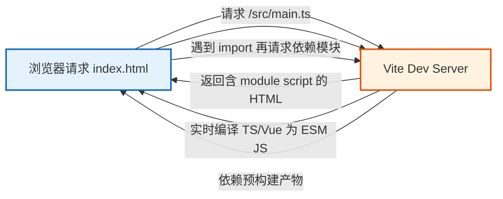
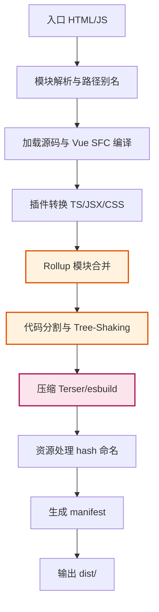
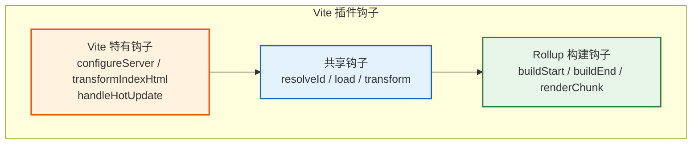

# Vite 打包 Vue3 高级面试题

> 本文档系统梳理 Vite 打包 Vue3 的核心原理、分包策略、构建优化、库模式、插件体系、多页应用与性能调优等高级面试题，专为高级前端工程师面试备考设计，兼顾理论深度与工程实践。

---

## 目录

- [1. Vite 打包原理](#1-vite-打包原理)
  - [1.1 开发环境：基于 ESM 的原生模块服务](#11-开发环境基于-esm-的原生模块服务)
  - [1.2 生产环境：Rollup 打包流程](#12-生产环境rollup-打包流程)
  - [1.3 开发与生产环境差异](#13-开发与生产环境差异)
- [2. 本地开发启动快的原因](#2-本地开发启动快的原因)
- [3. 精细化的分包策略](#3-精细化的分包策略)
- [4. 深度构建优化](#4-深度构建优化)
- [5. 压缩与目标环境](#5-压缩与目标环境)
- [6. Source Map](#6-source-map)
- [7. 库模式（Library Mode）](#7-库模式library-mode)
- [8. 插件开发与使用](#8-插件开发与使用)
- [9. 多页应用（MPA）](#9-多页应用mpa)
- [10. 性能调优](#10-性能调优)
- [11. Vite + Vue3 其他高频面试题](#11-vite--vue3-其他高频面试题)
- [12. 总结与记忆口诀](#12-总结与记忆口诀)

---

## 1. Vite 打包原理

### 1.1 开发环境：基于 ESM 的原生模块服务

**核心机制**：Vite 在开发环境**不打包**，而是利用浏览器原生 ESM（ES Modules）能力，按需加载模块。



**关键工作流程**：

1. **启动 Koa Server**：Vite 启动一个基于原生 Node 的开发服务器（新版基于 Connect）。
2. **拦截请求**：拦截 `.ts`、`.vue`、`.scss` 等非 JS 资源，实时编译为 ESM 格式 JS 返回。
3. **路径重写**：将 `import { ref } from 'vue'` 重写为 `import { ref } from '/node_modules/.vite/deps/vue.js'`，使浏览器能直接定位依赖。
4. **依赖预构建（Dep Pre-Bundling）**：用 esbuild 将 CJS/UMD 依赖转换为 ESM，并将多模块依赖合并为单文件，减少请求数。
5. **HMR 热更新**：通过 WebSocket 通知浏览器精确替换变更模块，保留应用状态。

**示例：浏览器请求链路**

```text
1. GET /                 → 返回 index.html
2. GET /src/main.ts      → 编译为 ESM 返回
3. GET /src/App.vue      → 编译为 ESM（含 template/render/style 三段）
4. GET /node_modules/.vite/deps/vue.js  → 预构建产物
```

### 1.2 生产环境：Rollup 打包流程

生产环境 Vite 使用 **Rollup** 进行打包，流程：



**关键步骤**：

1. **Vue SFC 编译**：`@vitejs/plugin-vue` 将 `.vue` 文件编译为 render 函数 + style 注入。
2. **Tree-Shaking**：Rollup 静态分析，剔除未使用代码。
3. **Code Splitting**：基于动态 `import()` 与 `manualChunks` 拆包。
4. **压缩**：默认 esbuild，可切换 Terser 获得更极致压缩。
5. **资源处理**：图片、字体等通过 `assetsInlineLimit` 决定转 base64 还是独立文件。
6. **hash 命名**：内容哈希命名，支持长期缓存。

### 1.3 开发与生产环境差异

| 维度 | 开发环境 | 生产环境 |
|------|----------|----------|
| **构建工具** | esbuild + 原生 ESM | Rollup |
| **是否打包** | 不打包，按需加载 | 全量打包 |
| **模块格式** | ESM（浏览器原生） | ESM/CJS/UMD/IIFE |
| **依赖处理** | 预构建为单文件 ESM | 打入产物 chunk |
| **HMR** | 启用 | 不适用 |
| **压缩** | 不压缩 | 压缩（esbuild/Terser） |
| **Source Map** | 通常开启 | 按需开启 |
| **Polyfill** | 假设现代浏览器 | 按 build.target 处理 |
| **目标** | 极速启动与 HMR | 极致体积与加载性能 |

> **面试要点**：Vite 的核心创新是"开发用 ESM 不打包，生产用 Rollup 全量打包"，**两者构建工具不同**，因此可能出现"开发能跑、生产报错"的一致性问题，需通过 `vite build` 与预构建调试保证一致性。

---

## 2. 本地开发启动快的原因

### 2.1 传统打包工具的瓶颈

Webpack 等传统打包工具采用**先打包后启动**模式：


**瓶颈**：

1. **冷启动全量构建**：项目越大，启动越慢，与项目规模呈线性关系。
2. **每次请求都加载整个 bundle**：即使只改一个模块，浏览器也需重新解析整个 bundle。
3. **HMR 粒度粗**：修改一个文件可能触发大量模块重新构建。

### 2.2 Vite 的提速原理


**三大提速原理**：

1. **按需编译（On-demand Compilation）**：只编译浏览器实际请求的模块，未访问的模块不编译。启动时间与项目规模解耦，**O(1) 启动**。
2. **原生 ESM 服务**：利用浏览器原生 ESM 解析能力，将"打包"工作转嫁给浏览器，无需在服务端构建依赖图。
3. **esbuild 预构建**：用 Go 编写的 esbuild 速度比 JS 编写的工具快 10-100 倍：
   - 依赖预构建（CJS→ESM、多模块合并）由 esbuild 完成。
   - 单文件编译（TS、JSX）由 esbuild 完成。

### 2.3 与传统工具的本质区别

| 维度 | Webpack | Vite |
|------|---------|------|
| **启动模式** | 先打包后服务 | 先服务后按需编译 |
| **启动时间** | O(项目规模) | O(1)，几乎与项目规模无关 |
| **模块加载** | 浏览器加载打包后 bundle | 浏览器原生 ESM 加载单个模块 |
| **HMR 速度** | 与项目规模相关 | 与修改模块的依赖链相关，通常 < 1s |
| **构建工具** | 自身（JS 实现） | esbuild（Go）+ Rollup（JS） |
| **依赖处理** | 全量打包 | 预构建（仅依赖）+ 按需编译（业务） |

> **一句话总结**：Vite 把"打包"这一步从启动阶段推迟到运行时，并用 esbuild 加速依赖预处理，实现"启动即用"。

---

## 3. 精细化的分包策略

### 3.1 代码分割（Code Splitting）

Vite 基于 Rollup，支持以下分割方式：

#### 3.1.1 动态 import()

```typescript
// 路由懒加载
const routes = [
  {
    path: '/user',
    component: () => import('@/views/User.vue'), // 自动生成独立 chunk
  },
]

// 条件加载
if (needEditor) {
  const { Editor } = await import('@/components/Editor')
}
```

#### 3.1.2 manualChunks 自定义分包

```typescript
// vite.config.ts
export default defineConfig({
  build: {
    rollupOptions: {
      output: {
        manualChunks: {
          // 1. 按依赖分包
          'vue-vendor': ['vue', 'vue-router', 'pinia'],
          'element-vendor': ['element-plus', '@element-plus/icons-vue'],
          // 2. 工具库分包
          'utils-vendor': ['lodash-es', 'dayjs', 'axios'],
          // 3. 图表库分包
          'echarts-vendor': ['echarts'],
        },
        // 4. 函数式动态分包（更灵活）
        // manualChunks(id) {
        //   if (id.includes('node_modules')) {
        //     if (id.includes('vue') || id.includes('pinia')) return 'vue-vendor'
        //     if (id.includes('element-plus')) return 'element-vendor'
        //     return 'vendor'
        //   }
        // }
      },
    },
  },
})
```

#### 3.1.3 分包策略最佳实践

| 包类型 | 内容 | 目的 |
|--------|------|------|
| **vue-vendor** | vue, vue-router, pinia | 框架稳定，长期缓存 |
| **ui-vendor** | element-plus, ant-design-vue | UI 库独立，按需加载 |
| **utils-vendor** | lodash-es, dayjs, axios | 工具独立缓存 |
| **业务页面 chunk** | 每个路由页面 | 路由级懒加载 |
| **公共组件 chunk** | 多页面共享组件 | 复用，避免重复打包 |

### 3.2 依赖预构建（Dependency Pre-Bundling）

**目的**：

1. **格式转换**：将 CJS/UMD 依赖转换为 ESM，供浏览器原生加载。
2. **减少请求数**：将 lodash-es 这种多文件依赖合并为单文件，避免数百个请求。

**示例**：lodash-es 含 600+ 子模块，未预构建时浏览器需发起 600+ 请求；预构建后合并为单文件。

**配置**：

```typescript
export default defineConfig({
  optimizeDeps: {
    include: ['lodash-es', 'axios'], // 强制预构建
    exclude: ['my-local-package'],   // 排除预构建
    esbuildOptions: {
      target: 'esnext',
    },
  },
})
```

**调试**：

```bash
# 清除预构建缓存
rm -rf node_modules/.vite

# 强制重新预构建
npx vite --force
```

### 3.3 动态导入优化

```typescript
// 1. 路由级懒加载
component: () => import('@/views/User.vue')

// 2. 组件级懒加载
const Dialog = defineAsyncComponent(() => import('@/components/Dialog.vue'))

// 3. 配合 Suspense（Vue3）
<template>
  <Suspense>
    <template #default><AsyncComp /></template>
    <template #fallback><Loading /></template>
  </Suspense>
</template>

// 4. 给 chunk 命名（魔法注释）
import(/* @vite-ignore */ '@/views/User.vue')
// Vite 中通过 manualChunks 控制命名，魔法注释支持有限
```

### 3.4 预加载指令

Vite 自动为动态 import 注入 `<link rel="modulepreload">`：

```html
<!-- 自动生成，预加载依赖 chunk -->
<link rel="modulepreload" href="/assets/vue-vendor.hash.js">
```

可通过 `build.modulePreload` 配置：

```typescript
build: {
  modulePreload: {
    polyfill: true,   // 注入 polyfill 兼容非 ESM 浏览器
    resolveDependencies: (filename, deps, { hostId, hostType }) => {
      // 自定义预加载依赖列表
      return deps.filter(dep => !dep.includes('polyfill'))
    },
  },
}
```

---

## 4. 深度构建优化

### 4.1 构建性能优化

#### 4.1.1 减少预构建范围

```typescript
optimizeDeps: {
  include: ['vue', 'vue-router', 'pinia', 'element-plus'],
  // 明确包含高频依赖，避免运行时动态触发预构建
}
```

#### 4.1.2 并行化与缓存

```typescript
build: {
  rollupOptions: {
    output: {
      // 启用实验性 minify 优化
      experimentalMinChunkSize: 20000,
    },
  },
  // 产物缓存
  cacheDir: 'node_modules/.vite',
}
```

#### 4.1.3 使用 unplugin-auto-import 减少手动 import

```typescript
// vite.config.ts
import AutoImport from 'unplugin-auto-import/vite'

export default {
  plugins: [
    AutoImport({
      imports: ['vue', 'vue-router', 'pinia'],
      dts: 'src/auto-imports.d.ts',
    }),
  ],
}
```

### 4.2 产物优化

#### 4.2.1 压缩配置

```typescript
build: {
  minify: 'terser', // 或 'esbuild'（默认，更快但压缩率略低）
  terserOptions: {
    compress: {
      drop_console: true,           // 移除 console
      drop_debugger: true,
      pure_funcs: ['console.log', 'console.info'],
    },
    format: {
      comments: false,              // 移除注释
    },
  },
}
```

#### 4.2.2 资源内联阈值

```typescript
build: {
  assetsInlineLimit: 4096, // < 4kb 转 base64，减少请求数
}
```

#### 4.2.3 CSS 代码分割与提取

```typescript
build: {
  cssCodeSplit: true,    // 默认开启，按 chunk 拆分 CSS
  rollupOptions: {
    output: {
      assetFileNames: 'assets/[name].[hash].[ext]',
      chunkFileNames: 'js/[name].[hash].js',
      entryFileNames: 'js/[name].[hash].js',
    },
  },
}
```

#### 4.2.4 Tree-Shaking 增强

```typescript
// package.json
{
  "sideEffects": ["*.css", "*.vue"] // 告知构建工具哪些文件有副作用
}
```

#### 4.2.5 Gzip/Brotli 预压缩

```typescript
import viteCompression from 'vite-plugin-compression'

export default {
  plugins: [
    viteCompression({
      algorithm: 'gzip',
      threshold: 10240, // > 10kb 才压缩
      ext: '.gz',
    }),
    viteCompression({
      algorithm: 'brotliCompress',
      ext: '.br',
    }),
  ],
}
```

#### 4.2.6 产物分析

```typescript
import { visualizer } from 'rollup-plugin-visualizer'

export default {
  plugins: [
    visualizer({
      filename: 'dist/stats.html',
      gzipSize: true,
      brotliSize: true,
    }),
  ],
}
```

### 4.3 优化清单速查

| 优化项 | 配置 | 收益 |
|--------|------|------|
| 依赖预构建 | `optimizeDeps.include` | 减少运行时编译 |
| 代码分割 | `manualChunks` | 长期缓存 |
| 路由懒加载 | 动态 `import()` | 首屏体积 ↓ |
| 压缩 | `terser / esbuild` | 体积 ↓ 30-60% |
| 资源内联 | `assetsInlineLimit` | 请求数 ↓ |
| Tree-Shaking | `sideEffects` | 死代码 ↓ |
| Gzip/Brotli | `vite-plugin-compression` | 传输体积 ↓ 70% |
| 产物分析 | `rollup-plugin-visualizer` | 可视化排查 |

---

## 5. 压缩与目标环境

### 5.1 压缩策略

#### 5.1.1 esbuild（默认）

```typescript
build: {
  minify: 'esbuild', // 默认值
  esbuildOptions: {
    target: 'es2020',
    legalComments: 'none',
  },
}
```

**特点**：速度极快（Go 实现），压缩率略低于 Terser，不删除 `console`。

#### 5.1.2 Terser

```typescript
build: {
  minify: 'terser',
  terserOptions: {
    compress: {
      drop_console: true,
      drop_debugger: true,
      pure_funcs: ['console.log'],
    },
    mangle: {
      toplevel: true, // 顶层变量混淆
    },
  },
}
```

**特点**：压缩率更高，可精细控制，但速度慢 20-40 倍。

#### 5.1.3 不同环境的压缩策略

```typescript
export default defineConfig(({ mode }) => ({
  build: {
    // 生产用 terser，预发布用 esbuild 加速
    minify: mode === 'production' ? 'terser' : 'esbuild',
    terserOptions: mode === 'production' ? {
      compress: { drop_console: true, drop_debugger: true },
    } : undefined,
  },
}))
```

### 5.2 目标浏览器兼容性

#### 5.2.1 build.target

```typescript
build: {
  target: 'es2015', // 或 ['es2020', 'edge88', 'firefox78', 'chrome87', 'safari14']
}
```

| 取值 | 含义 | 适用场景 |
|------|------|----------|
| `'esnext'` | 不做降级 | 现代浏览器，体积最小 |
| `'es2020'` | 降级到 ES2020 | 主流浏览器 |
| `'es2015'` | 降级到 ES6 | 兼容较老浏览器 |
| 数组 | 多目标交集 | 精确指定浏览器版本 |

#### 5.2.2 Polyfill 处理

Vite 默认**不注入 Polyfill**，需手动配置：

```bash
npm i -D @vitejs/plugin-legacy terser
```

```typescript
import legacy from '@vitejs/plugin-legacy'

export default {
  plugins: [
    legacy({
      targets: ['defaults', 'not IE 11'],
      additionalLegacyPolyfills: ['regenerator-runtime/runtime'],
      renderLegacyChunks: true, // 生成 legacy chunk
      modernPolyfills: true,
    }),
  ],
  build: {
    minify: 'terser', // legacy 插件要求 terser
  },
}
```

**产物**：

```html
<!-- 现代浏览器加载 -->
<script type="module" src="/assets/index.modern.js"></script>
<!-- 老浏览器加载 -->
<script nomodule src="/assets/index.legacy.js"></script>
```

#### 5.2.3 browserslist 配置

```json
// package.json
{
  "browserslist": [
    "> 1%",
    "last 2 versions",
    "not dead",
    "not IE 11"
  ]
}
```

---

## 6. Source Map

### 6.1 配置方式

```typescript
build: {
  sourcemap: true,        // 生成 .map 文件
  // 或
  sourcemap: 'inline',   // 内联到 JS 中（DataURL）
  // 或
  sourcemap: 'hidden',   // 生成 .map 但不在产物中引用（用于错误监控上报）
}
```

### 6.2 不同环境的最佳实践

| 环境 | 配置 | 原因 |
|------|------|------|
| **开发** | `sourcemap: true` | 默认开启，便于调试 |
| **测试/预发** | `sourcemap: true` | 便于定位线上问题 |
| **生产** | `sourcemap: 'hidden'` | 不暴露源码给用户，但上传到错误监控（Sentry） |
| **生产（无监控）** | `sourcemap: false` | 减小体积，保护源码 |

### 6.3 生产 Source Map 上传到错误监控

```typescript
// vite.config.ts
import { defineConfig, loadEnv } from 'vite'

export default defineConfig(({ mode }) => ({
  build: {
    sourcemap: mode === 'production' ? 'hidden' : true,
  },
}))

// package.json
{
  "scripts": {
    "build": "vite build && node scripts/upload-sourcemap.js"
  }
}
```

```javascript
// scripts/upload-sourcemap.js
const Sentry = require('@sentry/cli')
const cli = new Sentry.default()

cli.releases.new('my-project@1.0.0')
  .then(() => cli.releases.uploadSourceMaps('my-project@1.0.0', {
    include: ['dist'],
    rewrite: true,
  }))
  .then(() => cli.releases.finalize('my-project@1.0.0'))
```

### 6.4 Source Map 类型对比

| 类型 | 是否生成 .map | 是否在产物引用 | 适用 |
|------|---------------|----------------|------|
| `true` | 是 | 是 | 开发/测试 |
| `'inline'` | 否（内联） | 是 | 单文件部署 |
| `'hidden'` | 是 | 否 | 生产 + 错误监控 |
| `false` | 否 | 否 | 生产无监控 |

---

## 7. 库模式（Library Mode）

### 7.1 基础配置

```typescript
// vite.config.ts
import { defineConfig } from 'vite'
import vue from '@vitejs/plugin-vue'

export default defineConfig({
  plugins: [vue()],
  build: {
    lib: {
      entry: 'src/index.ts',           // 入口
      name: 'MyLib',                   // 全局变量名（UMD/IIFE）
      formats: ['es', 'cjs', 'umd'],   // 输出格式
      fileName: (format) => `my-lib.${format}.js`,
    },
    rollupOptions: {
      // 不打包依赖，由使用者提供
      external: ['vue'],
      output: {
        globals: {
          vue: 'Vue',
        },
      },
    },
  },
})
```

### 7.2 Vue3 组件库示例

#### 7.2.1 项目结构

```text
my-ui-lib/
├── src/
│   ├── components/
│   │   ├── Button/
│   │   │   ├── index.vue
│   │   │   └── index.ts
│   │   └── Input/
│   │       ├── index.vue
│   │       └── index.ts
│   ├── styles/
│   │   └── index.scss
│   └── index.ts
├── vite.config.ts
└── package.json
```

#### 7.2.2 入口文件

```typescript
// src/index.ts
import type { App } from 'vue'
import Button from './components/Button'
import Input from './components/Input'

const components = [Button, Input]

export const install = (app: App): void => {
  components.forEach((c) => app.component(c.name, c))
}

export { Button, Input }

export default { install }
```

#### 7.2.3 package.json

```json
{
  "name": "my-ui-lib",
  "version": "1.0.0",
  "main": "./dist/my-lib.cjs.js",
  "module": "./dist/my-lib.es.js",
  "types": "./dist/index.d.ts",
  "exports": {
    ".": {
      "import": "./dist/my-lib.es.js",
      "require": "./dist/my-lib.cjs.js",
      "types": "./dist/index.d.ts"
    },
    "./styles": "./dist/style.css"
  },
  "sideEffects": ["**/*.css", "**/*.scss"],
  "peerDependencies": {
    "vue": "^3.3.0"
  },
  "files": ["dist"]
}
```

### 7.3 多入口构建

```typescript
build: {
  lib: {
    entry: {
      button: 'src/components/Button/index.ts',
      input: 'src/components/Input/index.ts',
      index: 'src/index.ts',
    },
    formats: ['es', 'cjs'],
    fileName: (format, entryName) => `${entryName}.${format}.js`,
  },
}
```

### 7.4 类型声明生成

Vite 不生成 `.d.ts`，需借助 `vue-tsc` 或 `vite-plugin-dts`：

```typescript
import dts from 'vite-plugin-dts'

export default {
  plugins: [
    dts({
      entryRoot: 'src',
      outDir: 'dist',
      tsconfigPath: './tsconfig.json',
      include: ['src/**/*.ts', 'src/**/*.vue'],
    }),
  ],
}
```

### 7.5 CSS 处理

```typescript
// 单独抽取 CSS
build: {
  cssCodeSplit: true, // 按组件分割 CSS
  rollupOptions: {
    output: {
      assetFileNames: 'style.[hash].css',
    },
  },
}
```

使用者按需引入：

```typescript
import { Button } from 'my-ui-lib'
import 'my-ui-lib/styles/button.css'
```

### 7.6 库模式最佳实践

| 实践 | 说明 |
|------|------|
| `external: ['vue']` | Vue 作为 peerDependency，避免重复打包 |
| 多格式输出 | ES + CJS + UMD 覆盖所有消费场景 |
| `sideEffects` 配置 | 帮助使用者 Tree-Shaking |
| 类型声明生成 | `vite-plugin-dts` 输出 `.d.ts` |
| CSS 按需 | 按组件拆分 CSS，使用者按需引入 |
| `exports` 字段 | 现代 Node 解析，明确子路径 |

---

## 8. 插件开发与使用

### 8.1 Vite 插件系统架构

Vite 插件**兼容 Rollup 插件接口**，并扩展了 Vite 特有的钩子。



### 8.2 钩子执行顺序

```text
config          解析 vite.config，可修改配置
configResolved  最终配置确定
configureServer 配置 dev server（添加中间件）
buildStart      构建开始
resolveId       解析模块路径
load            加载模块内容
transform       转换模块内容（TS→JS、Vue SFC 编译等）
transformIndexHtml  转换 index.html
buildEnd        构建结束
closeBundle     所有 bundle 关闭
```

### 8.3 常用插件

| 插件 | 作用 |
|------|------|
| `@vitejs/plugin-vue` | Vue3 SFC 编译 |
| `@vitejs/plugin-vue-jsx` | JSX 支持 |
| `unplugin-auto-import` | 自动导入 API |
| `unplugin-vue-components` | 组件自动注册 |
| `vite-plugin-compression` | Gzip/Brotli 压缩 |
| `vite-plugin-pwa` | PWA 支持 |
| `vite-plugin-mock` | Mock 数据 |
| `vite-plugin-svg-icons` | SVG 雪碧图 |
| `rollup-plugin-visualizer` | 产物分析 |
| `@vitejs/plugin-legacy` | 浏览器兼容 |

### 8.4 自定义插件开发

#### 8.4.1 插件基本结构

```typescript
import type { Plugin } from 'vite'

export function myPlugin(options: { msg: string } = { msg: 'hello' }): Plugin {
  return {
    name: 'vite-plugin-my',
    enforce: 'pre', // pre | post | 不设置（normal）
    
    // 1. 修改配置
    config(config, { command }) {
      // 返回部分配置，会与原配置合并
    },
    
    // 2. 配置 dev server
    configureServer(server) {
      server.middlewares.use((req, res, next) => {
        if (req.url === '/api/test') {
          res.end(JSON.stringify({ msg: options.msg }))
          return
        }
        next()
      })
    },
    
    // 3. 解析模块 ID
    resolveId(source, importer) {
      if (source === 'virtual:my-module') {
        return source // 返回 resolved id
      }
      return null
    },
    
    // 4. 加载模块内容
    load(id) {
      if (id === 'virtual:my-module') {
        return `export const msg = "${options.msg}"`
      }
      return null
    },
    
    // 5. 转换模块内容
    transform(code, id) {
      if (id.endsWith('.vue')) {
        // 注入代码
        return { code: code + '\n// injected', map: null }
      }
      return null
    },
    
    // 6. 转换 HTML
    transformIndexHtml(html) {
      return html.replace(
        '</head>',
        `<script>console.log('injected by my plugin')</script></head>`
      )
    },
    
    // 7. HMR 处理
    handleHotUpdate({ file, server }) {
      if (file.endsWith('.md')) {
        server.ws.send({ type: 'full-reload' })
        return [] // 阻止默认 HMR
      }
    },
  }
}
```

#### 8.4.2 虚拟模块示例

```typescript
// 一个生成路由配置的虚拟模块
export function autoRoutesPlugin(): Plugin {
  const virtualId = 'virtual:auto-routes'
  
  return {
    name: 'vite-plugin-auto-routes',
    resolveId(id) {
      return id === virtualId ? virtualId : null
    },
    load(id) {
      if (id !== virtualId) return null
      
      // 扫描 views 目录
      const views = glob.sync('src/views/**/*.vue')
      const routes = views.map((p) => {
        const name = p.replace('src/views/', '').replace('.vue', '')
        return `{
          path: '/${name}',
          name: '${name}',
          component: () => import('${p}')
        }`
      })
      
      return `export default [${routes.join(',')}]`
    },
  }
}
```

使用：

```typescript
import routes from 'virtual:auto-routes'
```

需配合类型声明：

```typescript
// vite-env.d.ts
declare module 'virtual:auto-routes' {
  const routes: import('vue-router').RouteRecordRaw[]
  export default routes
}
```

#### 8.4.3 enforce 与 apply

```typescript
export default {
  plugins: [
    {
      name: 'pre-plugin',
      enforce: 'pre',  // 在 Vite 核心插件前执行
      transform(code, id) { /* ... */ },
    },
    {
      name: 'post-plugin',
      enforce: 'post', // 在 Vite 核心插件后执行
      transform(code, id) { /* ... */ },
    },
    {
      name: 'build-only',
      apply: 'build',  // 仅构建时生效（'serve' 仅开发时）
      transform(code, id) { /* ... */ },
    },
  ],
}
```

执行顺序：`pre → Vite 核心 → normal → post`

---

## 9. 多页应用（MPA）

### 9.1 项目结构

```text
src/
├── pages/
│   ├── index/
│   │   ├── index.html
│   │   ├── main.ts
│   │   └── App.vue
│   ├── about/
│   │   ├── index.html
│   │   ├── main.ts
│   │   └── App.vue
│   └── admin/
│       ├── index.html
│       ├── main.ts
│       └── App.vue
```

### 9.2 配置多入口

```typescript
import { defineConfig } from 'vite'
import { resolve } from 'path'
import { glob } from 'glob'

// 自动扫描所有入口 HTML
const inputs = glob.sync('src/pages/**/index.html').reduce((acc, file) => {
  const name = file.match(/src\/pages\/(.*)\/index\.html/)![1]
  acc[name] = resolve(__dirname, file)
  return acc
}, {} as Record<string, string>)

export default defineConfig({
  build: {
    rollupOptions: {
      input: {
        index: resolve(__dirname, 'index.html'), // 根入口
        ...inputs,
      },
      output: {
        chunkFileNames: 'assets/js/[name]-[hash].js',
        entryFileNames: 'assets/js/[name]-[hash].js',
        assetFileNames: 'assets/[ext]/[name]-[hash].[ext]',
      },
    },
  },
})
```

### 9.3 HTML 处理

每个页面的 `index.html`：

```html
<!-- src/pages/about/index.html -->
<!DOCTYPE html>
<html>
<head>
  <meta charset="UTF-8" />
  <title>About</title>
</head>
<body>
  <div id="app"></div>
  <script type="module" src="./main.ts"></script>
</body>
</html>
```

### 9.4 自动注入页面入口

用 `vite-plugin-html` 或 `vite-plugin-mpa` 简化：

```typescript
import { createMpaPlugin } from 'vite-plugin-mpa'

export default {
  plugins: [
    createMpaPlugin({
      pages: [
        { name: 'index', entry: 'src/pages/index/main.ts' },
        { name: 'about', entry: 'src/pages/about/main.ts' },
        { name: 'admin', entry: 'src/pages/admin/main.ts' },
      ],
    }),
  ],
}
```

### 9.5 MPA 优化策略

| 策略 | 说明 |
|------|------|
| **共享 chunk 提取** | `manualChunks` 提取公共依赖（vue、ui 库） |
| **资源路径** | 使用绝对路径或 `base` 配置避免跨页面路径错误 |
| **预取其他页面** | `<link rel="prefetch">` 预取可能跳转的页面 |
| **独立 manifest** | 每个页面独立 manifest，避免缓存冲突 |
| **CDN 部署** | `base` 配置 CDN 地址 |

```typescript
export default defineConfig({
  base: mode === 'production' ? 'https://cdn.example.com/' : '/',
})
```

---

## 10. 性能调优

### 10.1 性能分析方法

#### 10.1.1 构建产物分析

```bash
# 安装
npm i -D rollup-plugin-visualizer

# 构建后自动打开 stats.html
```

#### 10.1.2 Dev Server 性能

```bash
# 启用调试日志
DEBUG=vite:* vite

# 查看依赖预构建信息
npx vite --debug deps
```

#### 10.1.3 浏览器性能

```text
1. Chrome DevTools → Performance 面板
2. Network 面板分析请求瀑布图
3. Lighthouse 评估性能指标（FCP、LCP、TTI、CLS）
4. Coverage 面板查看代码覆盖率
```

#### 10.1.4 自定义指标

```typescript
// 测量构建时间
const start = Date.now()
// ... 构建逻辑
console.log(`Build time: ${Date.now() - start}ms`)
```

### 10.2 优化策略汇总

#### 10.2.1 启动优化

```typescript
// 1. 减少预构建范围
optimizeDeps: {
  include: ['vue', 'vue-router', 'pinia'],
  exclude: ['large-lib-only-used-in-one-page'],
}

// 2. 禁用不必要的依赖
resolve: {
  alias: {
    // 用轻量替代
    lodash: 'lodash-es',
    moment: 'dayjs',
  },
}

// 3. 使用 unplugin 加速
plugins: [
  AutoImport({ imports: ['vue', 'vue-router'] }),
  Components({ resolvers: [ElementPlusResolver()] }),
]
```

#### 10.2.2 加载性能优化

```typescript
// 1. 路由懒加载
component: () => import('@/views/User.vue')

// 2. 组件异步
const Async = defineAsyncComponent({
  loader: () => import('./Heavy.vue'),
  loadingComponent: Loading,
  delay: 200,
  timeout: 3000,
})

// 3. 图片懒加载
  // 配合 vue-lazyload

// 4. 虚拟列表（大数据量）
<RecycleScroller :items="items" :item-size="50" />
```

#### 10.2.3 运行时优化

```typescript
// 1. 合理使用 v-memo（Vue 3.2+）
<div v-memo="[item.id]">{{ item.name }}</div>

// 2. shallowRef / shallowReactive 处理大对象
const list = shallowRef<Item[]>([])

// 3. computed 缓存
const filtered = computed(() => list.value.filter(...))

// 4. v-once / v-once 静态内容
<header v-once>{{ title }}</header>
```

#### 10.2.4 缓存优化

```typescript
// 1. 文件名 hash 化（默认）
output: {
  chunkFileNames: 'js/[name].[hash].js',
}

// 2. 分离稳定依赖
manualChunks: {
  'vue-vendor': ['vue', 'vue-router', 'pinia'],
}

// 3. Service Worker 缓存
plugins: [VitePWA({
  workbox: {
    runtimeCaching: [{
      urlPattern: /\/api\//,
      handler: 'NetworkFirst',
    }],
  },
})]

// 4. HTTP 缓存头（服务器配置）
// Cache-Control: public, max-age=31536000, immutable
```

### 10.3 性能优化清单

| 类别 | 优化项 | 收益 |
|------|--------|------|
| **构建** | 依赖预构建优化 | 启动 ↓ |
| **构建** | esbuild 替代 Terser（开发） | 速度 ↑ |
| **产物** | 路由懒加载 | 首屏 ↓ |
| **产物** | manualChunks 分包 | 缓存 ↑ |
| **产物** | Tree-Shaking + sideEffects | 体积 ↓ |
| **传输** | Gzip/Brotli | 传输 ↓ 70% |
| **传输** | 资源内联小文件 | 请求 ↓ |
| **运行时** | v-memo / shallowRef | 渲染 ↑ |
| **缓存** | hash 命名 + 长缓存 | 命中率 ↑ |
| **缓存** | Service Worker | 离线可用 |

---

## 11. Vite + Vue3 其他高频面试题

### Q1：Vite 中如何处理 `.vue` 文件的编译？

**参考答案**：
通过 `@vitejs/plugin-vue` 插件。该插件在 `transform` 钩子中拦截 `.vue` 文件，调用 `@vue/compiler-sfc` 将 SFC 编译为：
1. **template** → render 函数
2. **script** → 普通 JS/TS
3. **style** → 单独的虚拟模块（支持 scoped）

编译后返回标准 ESM JS，供浏览器加载。`<style scoped>` 会生成 `data-v-xxxx` 属性和对应的 CSS。

### Q2：Vite 的 HMR 是如何工作的？

**参考答案**：
1. **监听文件变化**：Vite 通过 chokidar 监听文件系统。
2. **通知浏览器**：通过 WebSocket 发送变更模块信息。
3. **模块边界分析**：Vite 找到变更模块的 HMR 边界（接受该模块更新的父模块）。
4. **精确替换**：仅替换边界内模块，保留应用状态。
5. **Vue HMR**：`@vitejs/plugin-vue` 注入了 Vue 专用 HMR，组件修改时保持组件状态。

### Q3：Vite 如何处理 CSS 预处理器？

**参考答案**：
无需额外配置，Vite 内置支持 SCSS、Sass、Less、Stylus。只需安装对应预处理器：

```bash
npm i -D sass
```

```typescript
// 直接 import
import './style.scss'

// 或在 SFC 中
<style lang="scss" scoped>
```

全局变量注入：

```typescript
css: {
  preprocessorOptions: {
    scss: {
      additionalData: `@import "@/styles/variables.scss";`,
    },
  },
},
```

### Q4：Vite 如何处理静态资源？

**参考答案**：

```typescript
// 1. import 引入
import imgUrl from './img.png'
// → 生产环境返回带 hash 的 URL

// 2. URL 字符串

// → 开发直接访问，生产需配置 publicDir

// 3. 内联（< assetsInlineLimit）
// → 转为 base64 DataURL

// 4. 显式引入
import workerUrl from './worker?worker'
new Worker(workerUrl)

import wasmUrl from './file.wasm?url'
```

### Q5：Vite 中 alias 如何配置？

```typescript
resolve: {
  alias: {
    '@': resolve(__dirname, 'src'),
    '@components': resolve(__dirname, 'src/components'),
    // 兼容 CJS 依赖
    'lodash': 'lodash-es',
  },
}
```

### Q6：Vite 如何处理环境变量？

**参考答案**：
仅 `VITE_` 前缀的变量会暴露给客户端：

```bash
# .env
VITE_API_URL=https://api.example.com
SECRET_KEY=xxx  # 不会暴露给客户端
```

```typescript
// 使用
const api = import.meta.env.VITE_API_URL
```

```typescript
// 类型扩展
// vite-env.d.ts
interface ImportMetaEnv {
  readonly VITE_API_URL: string
}
interface ImportMeta {
  readonly env: ImportMetaEnv
}
```

### Q7：Vite 与 Webpack 相比有哪些优劣？

| 维度 | Vite | Webpack |
|------|------|---------|
| **开发启动** | 极快（O(1)） | 慢（O(n)） |
| **HMR** | 快，与规模无关 | 慢，与规模相关 |
| **配置复杂度** | 简单，开箱即用 | 复杂，需大量配置 |
| **生态成熟度** | 快速成长中 | 极成熟 |
| **生产打包** | Rollup，质量高 | 自身，灵活 |
| **代码分割** | Rollup 原生支持 | 需配置 SplitChunksPlugin |
| **兼容性** | 现代浏览器为主 | 兼容老浏览器（IE） |
| **库模式** | 内置支持 | 需配置 |
| **适用项目** | 中小型、现代项目 | 大型、复杂、兼容性要求高 |

### Q8：Vite 中如何做单元测试？

```bash
npm i -D vitest @vue/test-utils jsdom
```

```typescript
// vite.config.ts
export default defineConfig({
  test: {
    environment: 'jsdom',
    globals: true,
    coverage: {
      provider: 'v8',
      reporter: ['text', 'json', 'html'],
    },
  },
})
```

```typescript
// Button.test.ts
import { mount } from '@vue/test-utils'
import Button from './Button.vue'

test('renders text', () => {
  const wrapper = mount(Button, { props: { text: 'Click' } })
  expect(wrapper.text()).toContain('Click')
})
```

### Q9：如何排查 "开发能跑、生产报错" 的问题？

**排查清单**：
1. **依赖预构建差异**：用 `npx vite --force` 重置缓存，检查依赖是否被正确打包。
2. **路径大小写**：开发环境不敏感，生产构建严格。检查 import 路径大小写。
3. **CJS/ESM 混用**：检查依赖是否为 CJS，是否需要在 `optimizeDeps.include` 中预构建。
4. **副作用代码**：检查 `sideEffects` 配置是否误删了必要代码。
5. **条件编译**：检查是否依赖了 `import.meta.env.DEV` 等环境判断。
6. **动态 import**：检查动态 import 路径是否可静态分析。

### Q10：Vite 5 / 6 有哪些重要更新？

**Vite 5**：
- 移除 Node 14/16 支持，最低 Node 18。
- Rollup 4，构建性能提升。
- WebSocket token 安全增强。
- `import.meta.env` 类型化。

**Vite 6**：
- 引入 Environment API，支持多环境构建（如 SSR + CSR）。
- 默认 `modulePreload.polyfill` 关闭。
- 实验性 CSS 增强功能。
- 改进的 HMR 错误恢复机制。

---

## 12. 总结与记忆口诀

### 12.1 核心要点速记

```mermaid
graph TB
    VITE[Vite 打包 Vue3]
    VITE --> PRINCIPLE[原理篇]
    VITE --> STRATEGY[策略篇]
    VITE --> OPT[优化篇]
    VITE --> ADV[进阶篇]
    
    PRINCIPLE --> P1[开发用 ESM 不打包]
    PRINCIPLE --> P2[生产用 Rollup 全量打包]
    PRINCIPLE --> P3[esbuild 加速依赖预构建]
    
    STRATEGY --> S1[manualChunks 精细分包]
    STRATEGY --> S2[动态 import 路由懒加载]
    STRATEGY --> S3[依赖预构建减少请求]
    
    OPT --> O1[压缩 + Tree-Shaking]
    OPT --> O2[资源内联 + Gzip]
    OPT --> O3[hash 命名 + 长缓存]
    
    ADV --> A1[库模式多格式输出]
    ADV --> A2[插件 Rollup 兼容]
    ADV --> A3[MPA 多入口配置]
    ADV --> A4[Source Map 分环境]

    style VITE fill:#f3e5f5,stroke:#6a1b9a,stroke-width:2px
    style PRINCIPLE fill:#fff3e0,stroke:#e65100,stroke-width:2px
    style STRATEGY fill:#e3f2fd,stroke:#1565c0,stroke-width:2px
    style OPT fill:#e8f5e9,stroke:#2e7d32,stroke-width:2px
    style ADV fill:#fce4ec,stroke:#ad1457,stroke-width:2px
```



### 12.2 记忆口诀

> **"开发不打包，生产 Rollup 打；esbuild 预构建，分包靠 manual；压缩看环境，sourcemap 分场景；库模式三格式，插件 Rollup 兼；多页扫入口，性能看分析。"**

### 12.3 一句话总结

**Vite 的核心思想是"开发用原生 ESM 不打包实现 O(1) 启动，生产用 Rollup 全量打包实现极致体积"，通过 esbuild 加速依赖预处理、manualChunks 精细分包、Terser/esbuild 压缩、库模式多格式输出、Rollup 兼容插件系统，构建出从开发到生产、从应用到库的完整工具链。**

---

> **参考资料**：
> - Vite 官方文档：https://vitejs.dev/
> - Rollup 官方文档：https://rollupjs.org/
> - esbuild 官方文档：https://esbuild.github.io/
> - @vitejs/plugin-vue：https://github.com/vitejs/vite-plugin-vue
> - Vite 6 Release Notes
