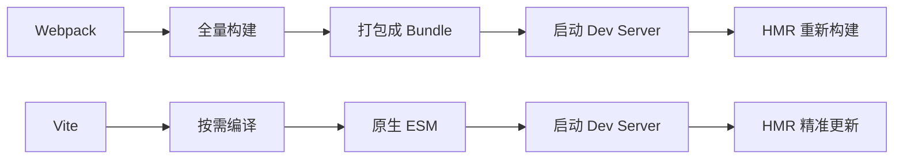
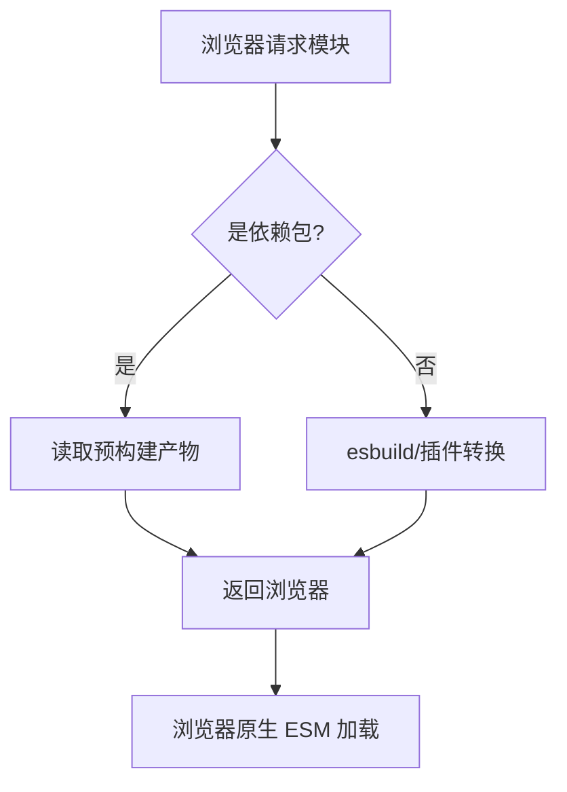
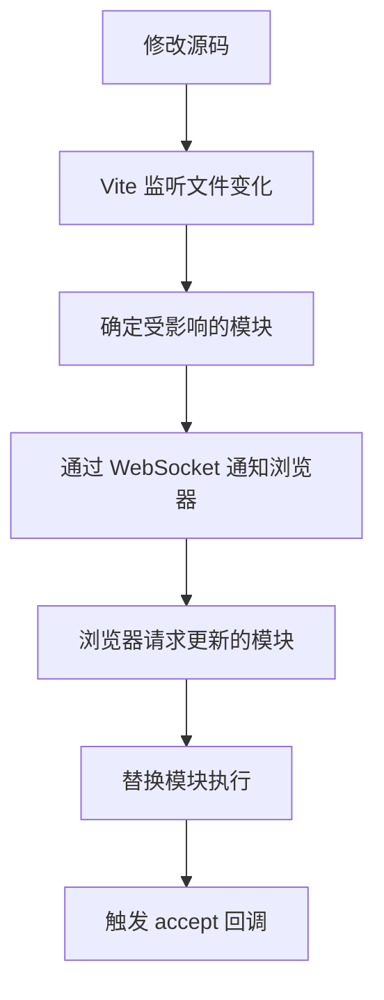
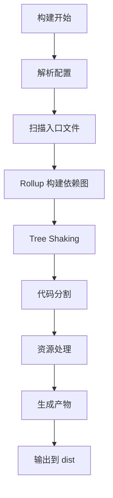
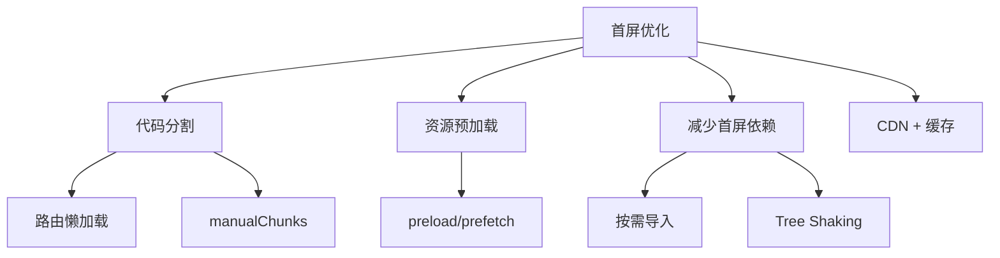

# Vite 高频面试题与详细回答

> 文档定位：系统梳理 Vite 在面试中的高频问题，涵盖 Vite 原理、开发服务器、构建流程、预构建、HMR、插件机制、配置、环境变量、性能优化等核心考点。
>
> 适用人群：前端工程师，尤其是需要理解 Vite 构建原理、优化项目构建速度的开发者。
>
> 阅读建议：先掌握 Vite 核心原理与开发服务器（一至三章），再学习构建与插件（四至五章），最后攻克配置与优化（六至九章）。重点关注「原生 ESM + esbuild 预构建」「HMR 原理」「Rollup 构建」「插件机制」「预构建优化」五大核心模块。

---

## 目录

- [一、Vite 基础](#一vite-基础)
  - [Q1. Vite 是什么？解决了什么问题？](#q1-vite-是什么解决了什么问题)
  - [Q2. Vite 为什么比 Webpack 快？](#q2-vite-为什么比-webpack-快)
  - [Q3. Vite 的工作原理？](#q3-vite-的工作原理)
- [二、开发服务器](#二开发服务器)
  - [Q4. Vite 开发服务器如何工作？](#q4-vite-开发服务器如何工作)
  - [Q5. 什么是原生 ESM？](#q5-什么是原生-esm)
  - [Q6. Vite 如何处理裸模块导入？](#q6-vite-如何处理裸模块导入)
- [三、依赖预构建](#三依赖预构建)
  - [Q7. 什么是依赖预构建？为什么需要？](#q7-什么是依赖预构建为什么需要)
  - [Q8. esbuild 的作用？为什么用 esbuild？](#q8-esbuild-的作用为什么用-esbuild)
  - [Q9. 预构建的缓存策略？](#q9-预构建的缓存策略)
- [四、HMR 热更新](#四hmr-热更新)
  - [Q10. Vite HMR 原理？](#q10-vite-hmr-原理)
  - [Q11. Vite HMR 和 Webpack HMR 区别？](#q11-vite-hmr-和-webpack-hmr-区别)
  - [Q12. HMR 边界是什么？](#q12-hmr-边界是什么)
- [五、构建与 Rollup](#五构建与-rollup)
  - [Q13. Vite 生产构建用什么？为什么不用 esbuild？](#q13-vite-生产构建用什么为什么不用-esbuild)
  - [Q14. Vite 构建流程？](#q14-vite-构建流程)
  - [Q15. 代码分割策略？](#q15-代码分割策略)
- [六、插件机制](#六插件机制)
  - [Q16. Vite 插件机制原理？](#q16-vite-插件机制原理)
  - [Q17. 如何编写一个 Vite 插件？](#q17-如何编写一个-vite-插件)
  - [Q18. Vite 插件和 Rollup 插件的关系？](#q18-vite-插件和-rollup-插件的关系)
- [七、配置与环境](#七配置与环境)
  - [Q19. vite.config.js 常用配置？](#q19-viteconfigjs-常用配置)
  - [Q20. 环境变量和模式？](#q20-环境变量和模式)
  - [Q21. 如何配置多环境？](#q21-如何配置多环境)
- [八、性能优化](#八性能优化)
  - [Q22. Vite 项目性能优化手段？](#q22-vite-项目性能优化手段)
  - [Q23. 如何优化首屏加载？](#q23-如何优化首屏加载)
  - [Q24. 大文件如何处理？](#q24-大文件如何处理)
- [九、综合实战题](#九综合实战题)
  - [Q25. 如何配置路径别名和代理？](#q25-如何配置路径别名和代理)
  - [Q26. 如何实现按需加载和代码分割？](#q26-如何实现按需加载和代码分割)
- [十、速答与踩坑总结](#十速答与踩坑总结)
  - [10.1 速答卡片](#101-速答卡片)
  - [10.2 实战踩坑 10 例](#102-实战踩坑-10-例)
  - [10.3 复习优先级表](#103-复习优先级表)

---

## 一、Vite 基础

### Q1. Vite 是什么？解决了什么问题？

#### 核心答案

```
Vite 是新一代前端构建工具，由两部分组成：
  1. 开发服务器：基于原生 ESM，提供极速冷启动和 HMR
  2. 构建命令：基于 Rollup，打包生产代码

解决了 Webpack 冷启动慢、HMR 慢的问题
```

#### 与 Webpack 对比

| 维度 | Webpack | Vite |
|------|---------|------|
| **冷启动** | 慢（全量构建） | 快（按需编译） |
| **HMR** | 较慢（重新构建） | 快（精准更新） |
| **开发服务器** | 打包后提供 | 原生 ESM 提供 |
| **构建工具** | Webpack | Rollup |
| **依赖处理** | 打包成 bundle | 预构建 + 浏览器 ESM |
| **配置复杂度** | 高 | 低（零配置） |

---

### Q2. Vite 为什么比 Webpack 快？



#### 三大原因

| 原因 | 说明 |
|------|------|
| **1. 按需编译** | 只编译当前页面需要的模块，不全量构建 |
| **2. 原生 ESM** | 利用浏览器原生 ES Module，无需打包 |
| **3. esbuild 预构建** | Go 编写的 esbuild 比 JS 编写的打包器快 10-100 倍 |

```
Webpack：启动时打包所有模块 → 启动慢
Vite：启动时只做依赖预构建，源代码按需编译 → 启动快
```

---

### Q3. Vite 的工作原理？



#### 开发环境

```
1. 启动时：用 esbuild 预构建依赖（node_modules）
2. 请求时：
   - 依赖模块：直接返回预构建产物
   - 源码模块：实时编译（esbuild/插件）后返回
3. 浏览器通过原生 ESM 加载模块
```

#### 生产环境

```
1. 使用 Rollup 打包
2. Tree Shaking 移除无用代码
3. 代码分割（按路由/动态导入）
4. 生成静态资源
```

---

## 二、开发服务器

### Q4. Vite 开发服务器如何工作？

```
Vite Dev Server 是一个 Koa 服务器，中间件管道处理请求：
  1. 接收浏览器请求
  2. 解析模块路径
  3. 判断是否需要预构建
  4. 编译/转换模块
  5. 返回 ESM 格式的模块
```

#### 请求处理流程

```
浏览器请求 /src/main.js
  → Vite 读取 main.js
  → 转换 import 语句（裸模块 → /node_modules/.vite/xxx）
  → 返回浏览器
  → 浏览器解析 import，继续请求依赖模块
```

#### 关键中间件

```
1. alias 中间件：路径别名
2. transform 中间件：编译转换（TS/JSX/Vue）
3. resolve 中间件：模块解析
4. serve 中间件：静态资源服务
```

---

### Q5. 什么是原生 ESM？

```
原生 ESM（ES Modules）是浏览器原生支持的模块系统
通过 <script type="module"> 加载
浏览器直接解析 import/export，无需打包
```

```html
<script type="module">
  import { foo } from './foo.js'
  console.log(foo)
</script>
```

#### 原生 ESM 的优势

| 优势 | 说明 |
|------|------|
| **按需加载** | 只加载需要的模块 |
| **无需打包** | 浏览器直接解析 |
| **精确 HMR** | 只更新变化的模块 |
| **缓存友好** | 每个模块独立缓存 |

---

### Q6. Vite 如何处理裸模块导入？

```
裸模块（bare import）：不带路径的导入，如 import Vue from 'vue'
浏览器原生 ESM 不支持裸模块导入
Vite 通过预构建和路径重写解决
```

```javascript
// 源代码中的裸导入
import Vue from 'vue'

// Vite 转换后
import Vue from '/node_modules/.vite/vue.js?v=xxx'
```

#### 处理步骤

```
1. 扫描代码中的裸导入
2. 用 esbuild 预构建依赖为 ESM 格式
3. 重写 import 路径为预构建产物路径
4. 浏览器加载预构建产物
```

---

## 三、依赖预构建

### Q7. 什么是依赖预构建？为什么需要？

#### 核心答案

```
预构建：用 esbuild 将 CommonJS/UMD 依赖转换为 ESM，打包到 node_modules/.vite 目录
```

#### 为什么需要预构建

| 原因 | 说明 |
|------|------|
| **1. 兼容 CommonJS** | 很多依赖是 CJS 格式，浏览器不支持 |
| **2. 减少请求数** | 一个库有几百个模块，打包成一个减少 HTTP 请求 |
| **3. 提升性能** | esbuild 比浏览器直接加载快 |

#### 示例

```
lodash 有几百个模块
浏览器直接加载 → 几百个 HTTP 请求
预构建后 → 一个 lodash.js，一次请求
```

---

### Q8. esbuild 的作用？为什么用 esbuild？

#### esbuild 是什么

```
esbuild 是用 Go 编写的 JavaScript 打包器/编译器
速度比 Webpack/Rollup 快 10-100 倍
```

#### 为什么快

| 原因 | 说明 |
|------|------|
| **Go 语言** | 原生编译，比 JS 快 |
| **并行** | 多核并行处理 |
| **手写解析器** | 不依赖 JS 生态的慢工具 |
| **最小化工作** | 只做必要的转换 |

#### Vite 中 esbuild 的用途

```
1. 依赖预构建：CJS → ESM
2. TS/JSX 转译：开发环境用 esbuild 转译
3. 单文件转换：.ts/.tsx/.jsx 快速转译
```

---

### Q9. 预构建的缓存策略？

#### 缓存位置

```
node_modules/.vite/deps/
```

#### 缓存触发条件

```
预构建结果会被缓存，以下情况会重新构建：
  1. package.json 的 dependencies 变化
  2. lockfile 变化（package-lock.json/yarn.lock）
  3. optimizeDeps 配置变化
  4. --force 强制重新构建
```

```bash
# 强制重新预构建
npx vite --force
```

#### 配置预构建

```javascript
// vite.config.js
export default {
  optimizeDeps: {
    include: ['lodash'],   // 强制预构建
    exclude: ['vue'],      // 跳过预构建
    entries: ['index.html'] // 扫描入口
  }
}
```

---

## 四、HMR 热更新

### Q10. Vite HMR 原理？



#### 核心原理

```
1. Vite 通过 chokidar 监听文件变化
2. 构建模块依赖图，确定哪些模块受影响
3. 通过 WebSocket 发送热更新消息
4. 浏览器收到消息，请求更新的模块
5. 执行新模块，调用 accept 回调更新应用
```

#### HMR API

```javascript
// main.js
if (import.meta.hot) {
  import.meta.hot.accept('./module.js', (newModule) => {
    // 模块更新时执行
    console.log('module updated', newModule)
  })
}
```

---

### Q11. Vite HMR 和 Webpack HMR 区别？

| 维度 | Webpack HMR | Vite HMR |
|------|------------|----------|
| **更新方式** | 重新打包受影响模块 | 只编译变化的模块 |
| **速度** | 较慢 | 快 |
| **模块边界** | 需要手动 accept | 框架自动处理 |
| **传输** | WebSocket | WebSocket |
| **依赖图** | 全量维护 | 按需维护 |

```
Webpack HMR：修改一个文件 → 重新构建受影响 chunk → 推送
Vite HMR：修改一个文件 → 只编译该文件 → 推送，浏览器直接替换
```

---

### Q12. HMR 边界是什么？

```
HMR 边界：模块更新不会传播到的边界
需要显式调用 import.meta.hot.accept() 定义边界
没有 accept 的模块，更新会冒泡到父模块
如果一直没有 accept，会触发整页刷新
```

```javascript
// child.js
export const value = 1

// parent.js
import { value } from './child.js'

// 定义 HMR 边界
if (import.meta.hot) {
  import.meta.hot.accept('./child.js', (mod) => {
    console.log('child updated', mod.value)
  })
}
```

#### 框架自动处理

```
Vue/React 等框架的插件会自动处理 HMR 边界
如 @vitejs/plugin-vue 自动为 .vue 文件添加 accept
```

---

## 五、构建与 Rollup

### Q13. Vite 生产构建用什么？为什么不用 esbuild？

#### 核心答案

```
生产构建用 Rollup，不用 esbuild
原因：esbuild 功能不够完善，Rollup 生态成熟、功能强大
```

| 维度 | esbuild | Rollup |
|------|---------|--------|
| **速度** | 极快 | 较快 |
| **功能** | 基础 | 强大 |
| **插件生态** | 较少 | 丰富 |
| **Tree Shaking** | 基础 | 完善 |
| **代码分割** | 基础 | 强大 |
| **适用场景** | 开发/预构建 | 生产构建 |

#### 为什么开发用 esbuild，生产用 Rollup？

```
开发：追求速度 → esbuild（只做转译，不打包）
生产：追求质量 → Rollup（Tree Shaking、代码分割、插件生态）
```

---

### Q14. Vite 构建流程？



#### 构建产物

```
dist/
├── index.html
├── assets/
│   ├── index-[hash].js       # 主包
│   ├── vendor-[hash].js      # 第三方依赖
│   ├── [name]-[hash].js      # 路由分包
│   ├── index-[hash].css      # 样式
│   └── [name]-[hash].png     # 图片等资源
```

---

### Q15. 代码分割策略？

| 策略 | 说明 | 配置 |
|------|------|------|
| **手动分包** | 按模块手动拆分 | rollupOptions.output.manualChunks |
| **动态导入** | import() 自动分包 | 代码中使用 |
| **共享分包** | 多入口共享模块 | 自动处理 |

```javascript
// vite.config.js
export default {
  build: {
    rollupOptions: {
      output: {
        manualChunks: {
          vue: ['vue', 'vue-router', 'pinia'],
          utils: ['lodash', 'dayjs']
        }
      }
    }
  }
}

// 动态导入
const component = () => import('./views/Home.vue')
```

---

## 六、插件机制

### Q16. Vite 插件机制原理？

```
Vite 插件基于 Rollup 插件机制，扩展了开发服务器钩子
插件是一个对象，包含 name 和各种钩子函数
```

#### 常用钩子

| 钩子 | 说明 |
|------|------|
| **config** | 修改 Vite 配置 |
| **configResolved** | 配置解析完成 |
| **configureServer** | 配置开发服务器 |
| **transformIndexHtml** | 转换 index.html |
| **resolveId** | 解析模块 ID |
| **load** | 加载模块 |
| **transform** | 转换模块代码 |
| **buildStart/End** | 构建开始/结束 |

---

### Q17. 如何编写一个 Vite 插件？

```javascript
// plugins/my-plugin.js
export default function myPlugin() {
  return {
    name: 'my-plugin',

    // 修改配置
    config(config, { command }) {
      if (command === 'build') {
        config.base = '/production/'
      }
    },

    // 配置开发服务器
    configureServer(server) {
      server.middlewares.use((req, res, next) => {
        console.log('请求：', req.url)
        next()
      })
    },

    // 转换模块
    transform(code, id) {
      if (id.endsWith('.txt')) {
        return `export default ${JSON.stringify(code)}`
      }
    },

    // 转换 index.html
    transformIndexHtml(html) {
      return html.replace(
        '<head>',
        '<head><script>console.log("注入脚本")</script>'
      )
    }
  }
}
```

```javascript
// vite.config.js
import myPlugin from './plugins/my-plugin'

export default {
  plugins: [myPlugin()]
}
```

---

### Q18. Vite 插件和 Rollup 插件的关系？

| 维度 | Vite 插件 | Rollup 插件 |
|------|----------|------------|
| **兼容性** | 兼容 Rollup 插件 | - |
| **额外钩子** | 有（开发服务器相关） | 无 |
| **命令区分** | command: serve/build | 无 |
| **使用场景** | 开发+构建 | 仅构建 |

```
Vite 插件 = Rollup 插件 + 开发服务器钩子
Rollup 插件可以直接在 Vite 中使用
```

---

## 七、配置与环境

### Q19. vite.config.js 常用配置？

```javascript
import { defineConfig } from 'vite'
import vue from '@vitejs/plugin-vue'
import path from 'path'

export default defineConfig({
  // 插件
  plugins: [vue()],

  // 路径别名
  resolve: {
    alias: {
      '@': path.resolve(__dirname, 'src')
    }
  },

  // 开发服务器
  server: {
    port: 3000,
    open: true,
    proxy: {
      '/api': {
        target: 'https://api.example.com',
        changeOrigin: true,
        rewrite: (path) => path.replace(/^\/api/, '')
      }
    }
  },

  // 构建配置
  build: {
    outDir: 'dist',
    sourcemap: false,
    rollupOptions: {
      output: {
        manualChunks: {
          vue: ['vue', 'vue-router']
        }
      }
    }
  }
})
```

---

### Q20. 环境变量和模式？

#### 环境变量文件

```
.env                # 所有模式
.env.local          # 所有模式，本地（gitignore）
.env.[mode]         # 指定模式
.env.[mode].local   # 指定模式，本地
```

```bash
# .env.development
VITE_APP_TITLE=开发环境
VITE_API_BASE=http://localhost:3000

# .env.production
VITE_APP_TITLE=生产环境
VITE_API_BASE=https://api.example.com
```

#### 使用环境变量

```javascript
// 代码中
console.log(import.meta.env.VITE_APP_TITLE)
console.log(import.meta.env.MODE)       // development/production
console.log(import.meta.env.DEV)        // 是否开发环境
console.log(import.meta.env.PROD)       // 是否生产环境
```

```
注意：只有 VITE_ 前缀的变量才会暴露给客户端代码
```

---

### Q21. 如何配置多环境？

```bash
# 开发环境
npm run dev          # mode: development

# 测试环境构建
vite build --mode test

# 预发布环境构建
vite build --mode staging

# 生产环境构建
npm run build        # mode: production
```

```javascript
// package.json
{
  "scripts": {
    "dev": "vite",
    "build:test": "vite build --mode test",
    "build:staging": "vite build --mode staging",
    "build:prod": "vite build --mode production"
  }
}
```

```bash
# .env.test
VITE_API_BASE=https://test-api.example.com

# .env.staging
VITE_API_BASE=https://staging-api.example.com
```

---

## 八、性能优化

### Q22. Vite 项目性能优化手段？

| 优化 | 说明 |
|------|------|
| **依赖预构建** | optimizeDeps.include 预构建常用依赖 |
| **按需导入** | 避免全量导入（如 lodash、antd） |
| **代码分割** | manualChunks 拆分大依赖 |
| **路由懒加载** | 动态 import 拆分路由 |
| **图片优化** | 压缩、WebP、懒加载 |
| **Tree Shaking** | 确保 ESM 格式，移除死代码 |
| **CDN 加速** | 大依赖用 CDN |
| **Gzip/Brotli** | 服务端开启压缩 |

---

### Q23. 如何优化首屏加载？



```javascript
// 1. 路由懒加载
const routes = [
  { path: '/', component: () => import('./views/Home.vue') },
  { path: '/about', component: () => import('./views/About.vue') }
]

// 2. 资源预加载
// index.html
<link rel="modulepreload" href="/src/main.js">

// 3. 按需导入
import { debounce } from 'lodash-es'  // ✅
import _ from 'lodash'                 // ❌ 全量导入
```

---

### Q24. 大文件如何处理？

| 场景 | 方案 |
|------|------|
| **图片** | 压缩 + WebP + 懒加载 + CDN |
| **视频** | CDN + 流媒体 + 懒加载 |
| **大依赖** | CDN 外部引入 + manualChunks 拆分 |
| **代码量大** | 路由分包 + 组件懒加载 |
| **字体** | font-display: swap + 子集化 |

```javascript
// vite.config.js
export default {
  build: {
    // 大文件警告阈值（默认 500KB）
    chunkSizeWarningLimit: 1000,
    rollupOptions: {
      output: {
        // 拆分大依赖
        manualChunks: {
          echarts: ['echarts'],
          'element-plus': ['element-plus']
        }
      }
    }
  }
}
```

---

## 九、综合实战题

### Q25. 如何配置路径别名和代理？

```javascript
// vite.config.js
import { defineConfig } from 'vite'
import path from 'path'

export default defineConfig({
  resolve: {
    alias: {
      '@': path.resolve(__dirname, 'src'),
      '@components': path.resolve(__dirname, 'src/components'),
      '@utils': path.resolve(__dirname, 'src/utils')
    }
  },

  server: {
    port: 3000,
    proxy: {
      // 简单代理
      '/api': {
        target: 'https://api.example.com',
        changeOrigin: true,
        rewrite: (p) => p.replace(/^\/api/, '')
      },
      // WebSocket 代理
      '/ws': {
        target: 'ws://localhost:8080',
        ws: true
      }
    }
  }
})
```

```javascript
// tsconfig.json（TS 路径配置）
{
  "compilerOptions": {
    "baseUrl": ".",
    "paths": {
      "@/*": ["src/*"]
    }
  }
}
```

---

### Q26. 如何实现按需加载和代码分割？

```javascript
// 1. 路由懒加载
const routes = [
  {
    path: '/',
    component: () => import('./views/Home.vue')
  },
  {
    path: '/dashboard',
    component: () => import('./views/Dashboard.vue')
  }
]

// 2. 组件懒加载
const HeavyComponent = defineAsyncComponent(() =>
  import('./components/HeavyComponent.vue')
)

// 3. 工具函数按需导入
import { debounce, throttle } from 'lodash-es'

// 4. 构建分包配置
// vite.config.js
export default {
  build: {
    rollupOptions: {
      output: {
        manualChunks: {
          'vue-vendor': ['vue', 'vue-router', 'pinia'],
          'ui-vendor': ['element-plus', '@element-plus/icons-vue'],
          'utils-vendor': ['lodash-es', 'dayjs', 'axios']
        }
      }
    }
  }
}
```

---

## 十、速答与踩坑总结

### 10.1 速答卡片

**Q：Vite 为什么快？**
A：开发环境用原生 ESM 按需编译，依赖用 esbuild 预构建，比 Webpack 全量构建快。

**Q：Vite 开发和构建分别用什么？**
A：开发用 esbuild + 原生 ESM，构建用 Rollup。

**Q：什么是依赖预构建？**
A：用 esbuild 将 CJS 依赖转 ESM，打包到 .vite/deps，减少请求数。

**Q：Vite HMR 原理？**
A：监听文件变化，通过 WebSocket 通知浏览器，只更新变化的模块。

**Q：Vite 和 Webpack 区别？**
A：Vite 按需编译、原生 ESM、esbuild 预构建；Webpack 全量构建、打包成 bundle。

**Q：esbuild 为什么快？**
A：Go 语言编写、并行处理、手写解析器，比 JS 打包器快 10-100 倍。

**Q：环境变量怎么用？**
A：.env 文件定义 VITE_ 前缀变量，代码中用 import.meta.env.VITE_XXX 访问。

**Q：如何配置代理？**
A：server.proxy 配置 target、changeOrigin、rewrite。

**Q：如何配置路径别名？**
A：resolve.alias 配置，如 '@' 指向 src 目录。

**Q：代码分割怎么实现？**
A：路由动态 import + build.rollupOptions.output.manualChunks。

**Q：HMR 边界是什么？**
A：import.meta.hot.accept() 定义的边界，模块更新不传播超过边界。

**Q：Vite 插件和 Rollup 插件关系？**
A：Vite 插件兼容 Rollup 插件，额外增加开发服务器钩子。

---

### 10.2 实战踩坑 10 例

| # | 场景 | 现象 | 根因 | 解决 |
|---|------|------|------|------|
| 1 | 依赖未预构建 | 启动时报错找不到模块 | 依赖是 CJS 格式 | optimizeDeps.include 强制预构建 |
| 2 | 环境变量不生效 | import.meta.env 为 undefined | 变量没有 VITE_ 前缀 | 变量名加 VITE_ 前缀 |
| 3 | 路径别名无效 | @ 路径解析失败 | 只配了 Vite 没配 TS | tsconfig.json 加 paths |
| 4 | 代理 404 | 接口请求 404 | rewrite 配置错误 | 检查 rewrite 正则 |
| 5 | HMR 不生效 | 修改代码整页刷新 | 没有 HMR 边界或插件问题 | 安装对应框架插件 |
| 6 | 构建产物过大 | chunk 超过 500KB | 未做代码分割 | manualChunks 拆分 |
| 7 | 图片加载失败 | 图片路径 404 | base 路径配置问题 | 配置正确的 base |
| 8 | 预构建缓存问题 | 依赖更新后报错 | 缓存未更新 | vite --force 重新构建 |
| 9 | TS 类型丢失 | 构建后类型错误 | 未做类型检查 | vite-plugin-checker 或 tsc |
| 10 | 开发服务器启动慢 | 冷启动时间长 | 依赖过多/预构建慢 | optimizeDeps 优化依赖 |

---

### 10.3 复习优先级表

| 优先级 | 主题 | 考察概率 | 建议复习时间 |
|--------|------|---------|-------------|
| **P0** | Vite 为什么快 | 95% | 30min |
| **P0** | 原生 ESM + 预构建 | 90% | 30min |
| **P0** | esbuild 原理 | 85% | 30min |
| **P0** | HMR 原理 | 90% | 30min |
| **P0** | Vite vs Webpack | 85% | 30min |
| **P1** | 构建流程（Rollup） | 80% | 30min |
| **P1** | 插件机制 | 75% | 30min |
| **P1** | 环境变量 | 80% | 30min |
| **P1** | 路径别名与代理 | 80% | 30min |
| **P2** | 代码分割 | 70% | 30min |
| **P2** | 性能优化 | 75% | 1h |
| **P2** | 依赖预构建缓存 | 65% | 30min |
| **P3** | 自定义插件 | 60% | 30min |
| **P3** | 多环境配置 | 60% | 30min |


