# pnpm 包管理器详细介绍与实践指南

> **文档定位**：本文档系统介绍 pnpm（Performant npm）的核心概念、工作原理、安装配置、常用命令、高级特性以及在项目中的实际应用场景。从基础概念到 Monorepo 工作区实战，层层递进，帮助开发人员快速理解并高效应用 pnpm 进行项目依赖管理。
>
> **适用读者**：前端工程师、Node.js 开发者、Monorepo 项目维护者、希望从 npm/yarn 迁移到 pnpm 的团队。
>
> **关联文档**：[Monorepo详细介绍与实践指南.md](./Monorepo详细介绍与实践指南.md) — pnpm Workspace 是 Monorepo 的核心依赖管理方案。

---

## 目录

- [pnpm 包管理器详细介绍与实践指南](#pnpm-包管理器详细介绍与实践指南)
  - [目录](#目录)
  - [一、pnpm 概述与核心概念](#一pnpm-概述与核心概念)
    - [1.1 什么是 pnpm](#11-什么是-pnpm)
    - [1.2 核心特性一览](#12-核心特性一览)
    - [1.3 为什么选择 pnpm](#13-为什么选择-pnpm)
  - [二、工作原理深度解析](#二工作原理深度解析)
    - [2.1 传统 npm/yarn 的 node\_modules 困境](#21-传统-npmyarn-的-node_modules-困境)
    - [2.2 Content-Addressable Store（内容寻址存储）](#22-content-addressable-store内容寻址存储)
    - [2.3 Symlinked node\_modules 结构](#23-symlinked-node_modules-结构)
    - [2.4 硬链接与符号链接协同](#24-硬链接与符号链接协同)
  - [三、与 npm/yarn 全面对比](#三与-npmyarn-全面对比)
    - [3.1 三大包管理器演进历程](#31-三大包管理器演进历程)
    - [3.2 核心机制对比](#32-核心机制对比)
    - [3.3 性能基准对比](#33-性能基准对比)
    - [3.4 功能特性对比](#34-功能特性对比)
  - [四、安装与环境配置](#四安装与环境配置)
    - [4.1 安装 pnpm](#41-安装-pnpm)
    - [4.2 环境变量与全局配置](#42-环境变量与全局配置)
    - [4.3 编辑器集成](#43-编辑器集成)
  - [五、常用命令速查](#五常用命令速查)
    - [5.1 基础命令](#51-基础命令)
    - [5.2 依赖管理命令](#52-依赖管理命令)
    - [5.3 版本范围标识符：^ 与 ~ 的区别](#53-版本范围标识符-与--的区别)
      - [5.3.1 语义化版本基础（SemVer）](#531-语义化版本基础semver)
      - [5.3.2 插入符 ^（Caret）—— 允许 MINOR 和 PATCH 更新](#532-插入符-caret-允许-minor-和-patch-更新)
      - [5.3.3 波浪号 ~（Tilde）—— 仅允许 PATCH 更新](#533-波浪号-tilde-仅允许-patch-更新)
      - [5.3.4 ^ 与 ~ 全面对比](#534--与--全面对比)
      - [5.3.5 实际示例：安装与更新行为对比](#535-实际示例安装与更新行为对比)
      - [5.3.6 不同项目场景的选择策略](#536-不同项目场景的选择策略)
      - [5.3.7 pnpm 相关配置选项](#537-pnpm-相关配置选项)
    - [5.4 运行脚本命令](#54-运行脚本命令)
    - [5.5 高级命令](#55-高级命令)
  - [六、配置选项详解](#六配置选项详解)
    - [6.1 .npmrc 配置文件](#61-npmrc-配置文件)
    - [6.2 pnpm-workspace.yaml 工作区配置](#62-pnpm-workspaceyaml-工作区配置)
    - [6.3 常用配置项速查表](#63-常用配置项速查表)
  - [七、Monorepo 工作区实战](#七monorepo-工作区实战)
    - [7.1 创建 Workspace 项目](#71-创建-workspace-项目)
    - [7.2 包间依赖管理](#72-包间依赖管理)
    - [7.3 过滤与批量操作](#73-过滤与批量操作)
    - [7.4 发布流程](#74-发布流程)
  - [八、项目实际应用场景](#八项目实际应用场景)
    - [8.1 场景一：从 npm/yarn 迁移](#81-场景一从-npmyarn-迁移)
    - [8.2 场景二：CI/CD 流水线优化](#82-场景二cicd-流水线优化)
    - [8.3 场景三：私有 Registry 配置](#83-场景三私有-registry-配置)
    - [8.4 场景四：Docker 构建优化](#84-场景四docker-构建优化)
  - [九、常见问题与最佳实践](#九常见问题与最佳实践)
    - [9.1 常见问题 FAQ](#91-常见问题-faq)
    - [9.2 最佳实践清单](#92-最佳实践清单)
  - [十、总结](#十总结)
    - [pnpm 核心知识图谱](#pnpm-核心知识图谱)
    - [选型建议](#选型建议)

---

## 一、pnpm 概述与核心概念

### 1.1 什么是 pnpm

**pnpm**（Performant npm）是一个快速、磁盘节省的 Node.js 包管理器，由 Zoltan Kochan 于 2017 年创建。它完全兼容 npm 的包注册表（registry），但通过**内容寻址存储（Content-Addressable Store）**和**符号链接（Symlink）**技术，解决了传统 npm/yarn 在磁盘占用、安装速度和依赖幻影（Phantom Dependencies）方面的核心痛点。

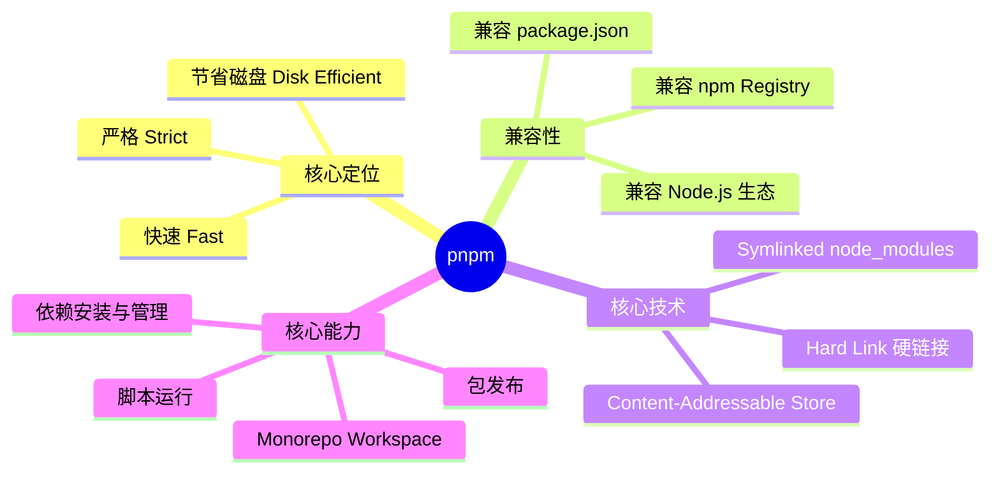

### 1.2 核心特性一览

| 特性 | 说明 | 带来的收益 |
|:-----|:-----|:---------|
| **内容寻址存储** | 全局存储所有包版本，按内容哈希去重 | 磁盘占用降低 50%+，多项目共享缓存 |
| **符号链接结构** | node_modules 使用 symlink 指向全局存储 | 安装速度提升 2~3 倍 |
| **严格依赖隔离** | 仅 package.json 声明的依赖可被访问 | 消除幻影依赖，避免隐式引用 |
| **Peer 依赖解析** | 默认不自动安装 peerDependencies | 避免依赖冲突，明确依赖关系 |
| **Workspace 支持** | 原生 Monorepo 工作区管理 | 替代 Lerna/Yarn Workspaces |
| **Hoisting 控制** | 可配置依赖提升策略 | 兼容旧项目，渐进迁移 |

### 1.3 为什么选择 pnpm

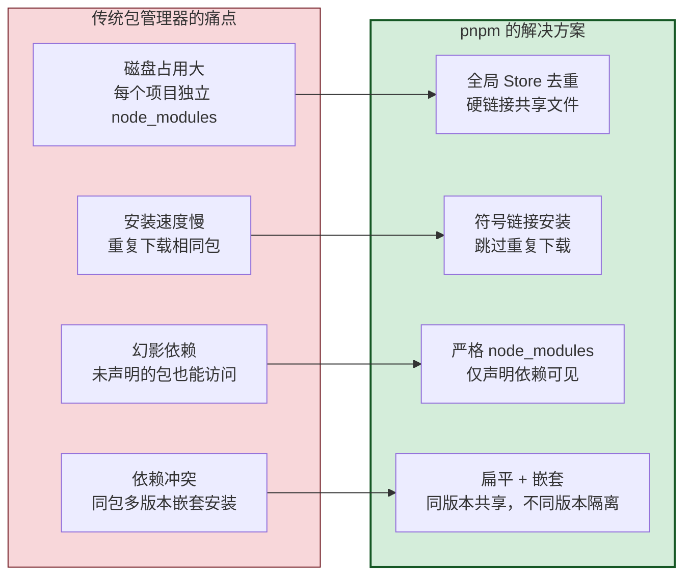

---

## 二、工作原理深度解析

### 2.1 传统 npm/yarn 的 node_modules 困境

npm v7+ 和 Yarn Classic 采用**扁平化（Hoisting）**策略：将所有依赖提升到 node_modules 顶层，遇到版本冲突时再嵌套安装。

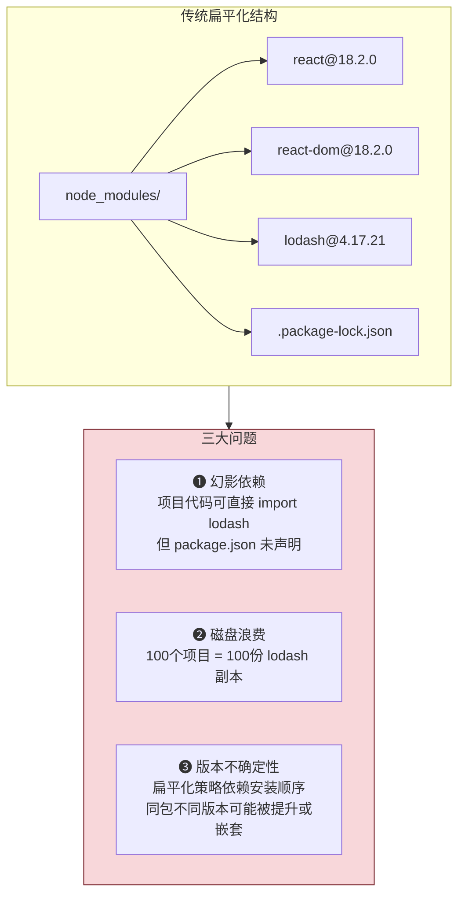

**幻影依赖示例**：

```javascript
// package.json 中只声明了 react，未声明 lodash
// 但由于扁平化提升，代码中可以直接引用 lodash
import _ from 'lodash';  // ✅ 能运行，但这是"幻影"的！

// 风险：一旦 react 升级移除了对 lodash 的依赖
// 这行代码就会突然报错 —— 难以排查
```

### 2.2 Content-Addressable Store（内容寻址存储）

pnpm 的核心创新是**全局内容寻址存储**（简称 Store）。所有下载的包都存储在全局 Store 中，以内容的哈希值为键，实现跨项目共享与去重。

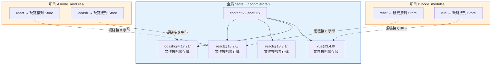

**关键点**：
- Store 路径默认为 `~/.local/share/pnpm/store/`（Linux/Mac）或 `%LOCALAPPDATA%\pnpm\store\`（Windows）
- 同一个包的同一个版本在 Store 中只存一份
- 项目 node_modules 中的文件通过**硬链接**指向 Store，几乎不占额外磁盘
- 100 个项目用同一个 lodash 版本 → Store 中只有 1 份，磁盘占用为传统方案的 1%

### 2.3 Symlinked node_modules 结构

pnpm 的 node_modules 采用**三层结构**，这是它解决幻影依赖的关键：

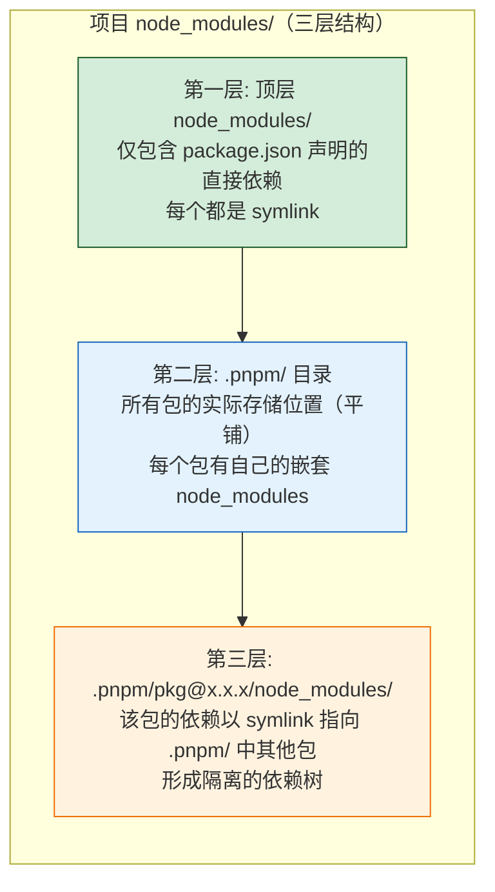

**具体结构示例**：

```
my-project/
├── package.json          # 声明依赖: react, react-dom
└── node_modules/
    │
    ├── react             ← symlink → .pnpm/react@18.2.0/node_modules/react
    ├── react-dom         ← symlink → .pnpm/react-dom@18.2.0/node_modules/react-dom
    │
    └── .pnpm/            ← 实际包存储区
        │
        ├── react@18.2.0/
        │   └── node_modules/
        │       ├── react/         ← 实际文件（硬链接到 Store）
        │       └── ...react 的依赖
        │
        ├── react-dom@18.2.0/
        │   └── node_modules/
        │       ├── react-dom/     ← 实际文件（硬链接到 Store）
        │       ├── react → ../../react@18.2.0/node_modules/react  ← symlink
        │       └── scheduler → ../../scheduler@0.23.0/node_modules/scheduler
        │
        └── scheduler@0.23.0/
            └── node_modules/
                └── scheduler/     ← 实际文件（硬链接到 Store）
```

**为什么这样设计能消除幻影依赖？**

```
项目 package.json 只声明了 react 和 react-dom
→ 顶层 node_modules/ 只有 react 和 react-dom 两个 symlink
→ 代码中 import 'lodash' 会报错（找不到模块）
→ 因为 lodash 没有出现在顶层 node_modules/ 中
→ 即使 react-dom 内部依赖了 lodash，它在 .pnpm/ 内部，项目代码无法直接访问
```

### 2.4 硬链接与符号链接协同

pnpm 同时使用两种链接技术，各司其职：

| 链接类型 | 作用对象 | 作用 | 特点 |
|:--------|:---------|:-----|:-----|
| **硬链接（Hard Link）** | 文件级别 | Store 文件 ↔ 项目 node_modules 文件 | 跨项目共享同一份数据，零磁盘占用 |
| **符号链接（Symlink）** | 目录级别 | 顶层 node_modules → .pnpm/ 内部目录 | 构建依赖树结构，实现包间引用 |

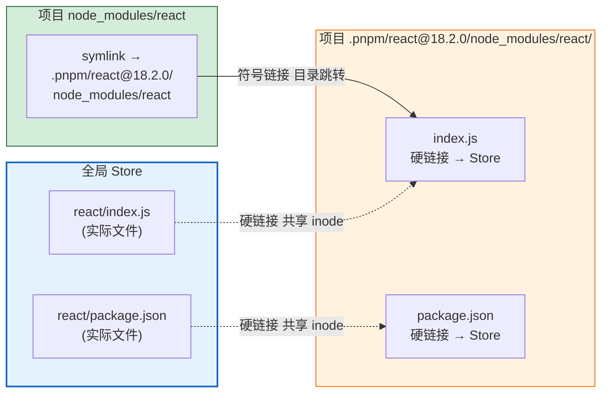

> **核心洞察**：硬链接让文件在磁盘上只存一份（Store 中），符号链接让包的依赖关系在 node_modules 中正确表达。两者结合，既节省磁盘又保证依赖隔离。

---

## 三、与 npm/yarn 全面对比

### 3.1 三大包管理器演进历程

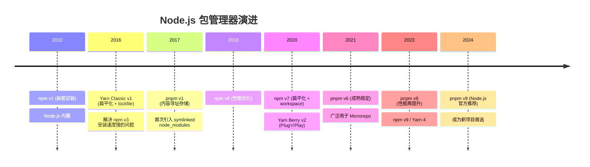

### 3.2 核心机制对比

| 维度 | npm (v9) | Yarn Classic (v1) | Yarn Berry (v4) | **pnpm** |
|:-----|:---------|:-----------------|:----------------|:---------|
| **node_modules 结构** | 扁平化 | 扁平化 | Plug'n'Play（无 node_modules） | **符号链接三层结构** |
| **磁盘存储** | 每项目独立副本 | 每项目独立副本 | 全局缓存 + PnP | **全局 Store + 硬链接** |
| **幻影依赖** | ❌ 存在 | ❌ 存在 | ✅ 已解决 | ✅ 已解决 |
| **Peer 依赖** | 自动安装 | 自动安装 | 自动安装 | **默认不安装（严格模式）** |
| **Workspace** | ✅ 原生支持 | ✅ 原生支持 | ✅ 原生支持 | ✅ 原生支持（更强大） |
| **Lockfile** | package-lock.json | yarn.lock | yarn.lock | **pnpm-lock.yaml** |
| **离线安装** | ❌ 不支持 | ✅ 支持 | ✅ 支持 | ✅ 支持（离线优先） |
| **Plug'n'Play** | ❌ | ❌ | ✅ 仅 Yarn | ❌（保持 node_modules 兼容） |

### 3.3 性能基准对比

以下为在包含 500+ 依赖的中型项目上的基准测试（冷安装，无缓存）：

```mermaid
xychart-beta
    title "包管理器安装性能对比（秒，越低越好）"
    x-axis ["冷安装", "热安装(有缓存)", "删除后重装", "添加单个包"]
    y-axis "耗时 (秒)" 0 --> 120
    bar [85, 45, 80, 12]
    bar [70, 35, 65, 10]
    bar [28, 8, 25, 3]
```

| 场景 | npm | Yarn Classic | **pnpm** | pnpm 优势 |
|:-----|:----|:------------|:---------|:---------|
| 冷安装（无缓存） | 85s | 70s | **28s** | 快 3 倍 |
| 热安装（有缓存） | 45s | 35s | **8s** | 快 5.6 倍 |
| 删除后重装 | 80s | 65s | **25s** | 快 3.2 倍 |
| 添加单个包 | 12s | 10s | **3s** | 快 4 倍 |
| 磁盘占用（10 个项目） | 2.1 GB | 2.0 GB | **0.3 GB** | 节省 85% |

> **数据说明**：性能数据基于典型中型前端项目（React + TypeScript + 测试框架 + 构建工具），实际数值因项目规模和网络环境而异，但 pnpm 的相对优势稳定。

### 3.4 功能特性对比

| 功能 | npm | Yarn | **pnpm** |
|:-----|:----|:-----|:---------|
| `install` 速度 | ⭐⭐ | ⭐⭐⭐ | ⭐⭐⭐⭐⭐ |
| 磁盘效率 | ⭐ | ⭐⭐ | ⭐⭐⭐⭐⭐ |
| 依赖隔离 | ⭐ | ⭐ | ⭐⭐⭐⭐⭐ |
| Monorepo 支持 | ⭐⭐⭐ | ⭐⭐⭐ | ⭐⭐⭐⭐⭐ |
| 生态兼容性 | ⭐⭐⭐⭐⭐ | ⭐⭐⭐⭐ | ⭐⭐⭐⭐ |
| 学习成本 | ⭐⭐⭐⭐⭐ | ⭐⭐⭐⭐ | ⭐⭐⭐⭐ |
| 稳定性 | ⭐⭐⭐⭐ | ⭐⭐⭐⭐ | ⭐⭐⭐⭐⭐ |

---

## 四、安装与环境配置

### 4.1 安装 pnpm

pnpm 提供多种安装方式，推荐根据使用场景选择：

**方式一：Node.js 内置 Corepack（推荐）**

Node.js v16.13+ 内置了 Corepack，无需单独安装 pnpm：

```bash
# 启用 Corepack
corepack enable

# 指定 pnpm 版本（可选）
corepack prepare pnpm@latest --activate

# 验证安装
pnpm --version
```

**方式二：npm 全局安装**

```bash
npm install -g pnpm
```

**方式三：独立脚本安装（不依赖 Node.js）**

```bash
# Windows (PowerShell)
iwr https://get.pnpm.io/install.ps1 -useb | iex

# macOS / Linux
curl -fsSL https://get.pnpm.io/install.sh | sh -
```

**方式四：Homebrew（macOS）**

```bash
brew install pnpm
```

> **推荐**：生产环境使用 **Corepack** 方式，它将 pnpm 版本绑定到 Node.js 安装，团队成员通过 `packageManager` 字段统一版本。

### 4.2 环境变量与全局配置

**设置全局 Store 路径**（默认 `~/.local/share/pnpm/store`）：

```bash
# 查看当前 Store 路径
pnpm store path

# 自定义 Store 路径（例如放到空间更大的磁盘）
pnpm config set store-dir D:/pnpm-store
```

**配置全局 bin 目录**（使全局安装的 CLI 工具可用）：

```bash
pnpm setup
# 该命令会自动配置 PATH 环境变量
```

**在 package.json 中锁定 pnpm 版本**（推荐团队统一）：

```json
{
  "name": "my-project",
  "packageManager": "pnpm@9.15.0"
}
```

> 使用 Corepack 时，`packageManager` 字段会自动指定项目使用的 pnpm 版本，团队成员无需手动安装对应版本。

### 4.3 编辑器集成

**VS Code 推荐配置**：

```json
// .vscode/settings.json
{
  "npm.packageManager": "pnpm",
  "eslint.packageManager": "pnpm"
}
```

**WebStorm / IntelliJ 配置**：

```
Settings → Languages & Frameworks → Node.js → Package Manager → pnpm
```

---

## 五、常用命令速查

### 5.1 基础命令

| 命令 | 简写 | 说明 |
|:-----|:----:|:-----|
| `pnpm install` | `pnpm i` | 安装 package.json 中所有依赖 |
| `pnpm install --frozen-lockfile` | — | 严格按 lockfile 安装（CI/CD 用） |
| `pnpm install --offline` | — | 离线模式安装（仅用 Store 缓存） |
| `pnpm install --force` | — | 强制重新安装（重新建立链接） |
| `pnpm update` | `pnpm up` | 更新所有依赖到符合 semver 的最新版 |
| `pnpm update --latest` | — | 更新所有依赖到最新版（忽略 semver） |

### 5.2 依赖管理命令

```bash
# 添加生产依赖
pnpm add react react-dom

# 添加开发依赖
pnpm add -D typescript @types/node

# 添加全局依赖
pnpm add -g serve

# 添加精确版本（不加 ^ 前缀）
pnpm add typescript@5.3.0 -E

# 从指定 registry 安装
pnpm add react --registry https://registry.npmmirror.com

# 移除依赖
pnpm remove lodash

# 移除开发依赖
pnpm remove -D jest
```

**依赖管理命令对比表**：

| 操作 | 命令 | 选项 |
|:-----|:-----|:-----|
| 添加生产依赖 | `pnpm add <pkg>` | `-P` 或默认 |
| 添加开发依赖 | `pnpm add -D <pkg>` | `--save-dev` |
| 添加可选依赖 | `pnpm add -O <pkg>` | `--save-optional` |
| 精确版本 | `pnpm add <pkg> -E` | `--save-exact` |
| 全局安装 | `pnpm add -g <pkg>` | `--global` |

### 5.3 版本范围标识符：^ 与 ~ 的区别

在 `package.json` 的 `dependencies` 中，每个依赖版本号前通常会带一个前缀符号——`^`（插入符）或 `~`（波浪号）。这两个符号决定了依赖在安装和更新时的**版本匹配范围**，直接影响项目获取补丁更新和新功能的行为。

#### 5.3.1 语义化版本基础（SemVer）

理解 `^` 和 `~` 的前提是掌握**语义化版本（Semantic Versioning, SemVer）**规范：

```
版本号格式: MAJOR.MINOR.PATCH
                │     │     │
                │     │     └── 修订号: 向下兼容的 Bug 修复
                │     └──────── 次版本号: 向下兼容的新功能
                └────────────── 主版本号: 不兼容的 API 变更
```

| 版本号变更 | 含义 | 兼容性 | 示例 |
|:---------|:-----|:------:|:-----|
| **PATCH** (`1.2.3` → `1.2.4`) | 修复 Bug，无新功能 | ✅ 完全兼容 | 修复内存泄漏 |
| **MINOR** (`1.2.3` → `1.3.0`) | 新增功能，不影响旧 API | ✅ 向下兼容 | 新增 `deepClone()` 方法 |
| **MAJOR** (`1.2.3` → `2.0.0`) | 破坏性变更，API 不兼容 | ❌ 不兼容 | 重命名 API、删除旧接口 |

#### 5.3.2 插入符 ^（Caret）—— 允许 MINOR 和 PATCH 更新

`^` 是 pnpm/npm 的**默认前缀**，含义是：**允许 PATCH 和 MINOR 版本更新，但锁定 MAJOR 版本**。

**匹配规则**：`^1.2.3` 匹配 `>=1.2.3` 且 `<2.0.0` 的所有版本。

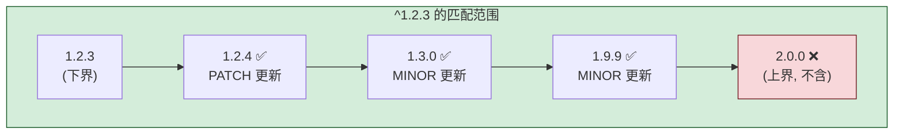

**具体行为示例**：

| package.json 声明 | 安装时行为 | `pnpm update` 时行为 |
|:-----------------|:---------|:-------------------|
| `"react": "^18.2.0"` | 安装 `>=18.2.0` 的最新版（如 `18.3.1`） | 可更新到 `18.x.x` 的最新版，但**不会**升到 `19.0.0` |
| `"lodash": "^4.17.20"` | 安装 `>=4.17.20` 的最新版（如 `4.17.21`） | 可更新到 `4.x.x` 的最新版，但**不会**升到 `5.0.0` |
| `"vue": "^3.4.0"` | 安装 `>=3.4.0` 的最新版（如 `3.5.13`） | 可更新到 `3.x.x` 的最新版，但**不会**升到 `4.0.0` |

**特殊版本号的 ^ 行为**：

| 声明版本 | ^ 匹配范围 | 说明 |
|:--------|:---------|:-----|
| `^1.2.3` | `>=1.2.3 <2.0.0` | 标准情况，锁定 MAJOR |
| `^0.2.3` | `>=0.2.3 <0.3.0` | `0.x` 时锁定 MINOR（因为 0.x.y 不保证兼容） |
| `^0.0.3` | `>=0.0.3 <0.0.4` | `0.0.x` 时锁定 PATCH（因为 0.0.x 不保证兼容） |

> **设计理由**：在 `0.x.x` 阶段，即使是 MINOR 版本变更也可能包含破坏性改动，因此 `^` 在 `0.x` 时退化为仅允许 PATCH 更新。

#### 5.3.3 波浪号 ~（Tilde）—— 仅允许 PATCH 更新

`~` 的含义比 `^` 更严格：**仅允许 PATCH 版本更新，锁定 MAJOR 和 MINOR**。

**匹配规则**：`~1.2.3` 匹配 `>=1.2.3` 且 `<1.3.0` 的所有版本。

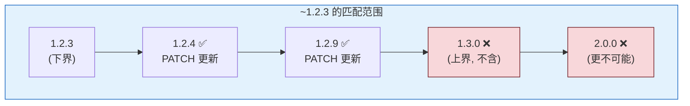

**具体行为示例**：

| package.json 声明 | 安装时行为 | `pnpm update` 时行为 |
|:-----------------|:---------|:-------------------|
| `"react": "~18.2.0"` | 安装 `>=18.2.0` 且 `<18.3.0` 的最新版（如 `18.2.6`） | 仅更新到 `18.2.x` 的最新版，**不会**升到 `18.3.0` |
| `"lodash": "~4.17.20"` | 安装 `>=4.17.20` 且 `<4.18.0` 的最新版 | 仅更新到 `4.17.x` 的最新版 |
| `"vue": "~3.4.0"` | 安装 `>=3.4.0` 且 `<3.5.0` 的最新版 | 仅更新到 `3.4.x` 的最新版 |

**特殊版本号的 ~ 行为**：

| 声明版本 | ~ 匹配范围 | 说明 |
|:--------|:---------|:-----|
| `~1.2.3` | `>=1.2.3 <1.3.0` | 指定了 PATCH，锁定 MINOR |
| `~1.2` | `>=1.2.0 <1.3.0` | 未指定 PATCH，等效于 `~1.2.0` |
| `~1` | `>=1.0.0 <2.0.0` | 未指定 MINOR，退化为锁定 MAJOR（同 `^1`） |

#### 5.3.4 ^ 与 ~ 全面对比

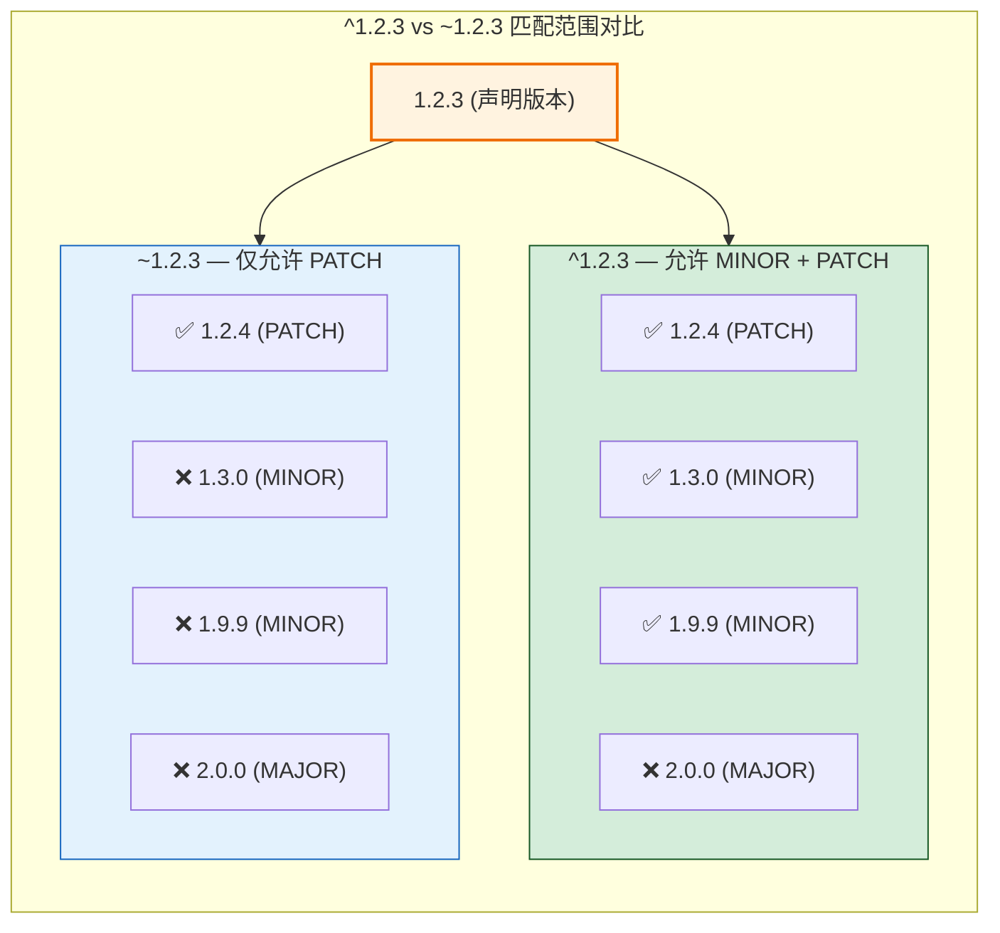

**核心差异对照表**：

| 对比维度 | `^`（插入符） | `~`（波浪号） |
|:--------|:-------------|:-------------|
| **匹配范围** | `>=x.y.z <(x+1).0.0` | `>=x.y.z <x.(y+1).0` |
| **允许 PATCH 更新** | ✅ | ✅ |
| **允许 MINOR 更新** | ✅ | ❌ |
| **允许 MAJOR 更新** | ❌ | ❌ |
| **更新激进程度** | 较激进（接受新功能） | 较保守（仅接受 Bug 修复） |
| **pnpm 默认前缀** | ✅ 是（`save-prefix=^`） | ❌ 否 |
| **适用哲学** | 信任 SemVer，主动获取新功能 | 保守稳定，最小化变更风险 |

#### 5.3.5 实际示例：安装与更新行为对比

以 `react@18.2.0` 为例，假设 npm registry 上存在以下版本：

```
已发布版本: 18.2.0, 18.2.1, 18.2.6, 18.3.0, 18.3.1, 19.0.0
```

| package.json 声明 | `pnpm add` 首次安装 | `pnpm update` 更新 | 说明 |
|:-----------------|:-------------------|:------------------|:-----|
| `"react": "^18.2.0"` | `18.3.1` | `18.3.1` | 可获取 MINOR + PATCH 最新 |
| `"react": "~18.2.0"` | `18.2.6` | `18.2.6` | 仅获取 PATCH 最新，不到 `18.3.x` |
| `"react": "18.2.0"` | `18.2.0` | `18.2.0` | 精确锁定，不更新 |
| `"react": "*"` | `19.0.0` | `19.0.0` | 匹配任意版本（危险，不推荐） |

```bash
# === 安装时使用 ^ (默认行为) ===
pnpm add react          # package.json 中记录为 "react": "^18.2.0"
                        # 实际安装 18.3.1 (符合 ^ 范围的最新版)

# === 安装时使用 ~ ===
pnpm add react ~18.2.0  # package.json 中记录为 "react": "~18.2.0"
                        # 实际安装 18.2.6 (符合 ~ 范围的最新版)

# === 安装精确版本 (无前缀) ===
pnpm add react@18.2.0 -E  # package.json 中记录为 "react": "18.2.0"
                          # -E / --save-exact 禁止添加前缀

# === 全局设置精确版本 ===
pnpm config set save-exact true  # 之后所有 pnpm add 都不加 ^ 前缀
```

#### 5.3.6 不同项目场景的选择策略

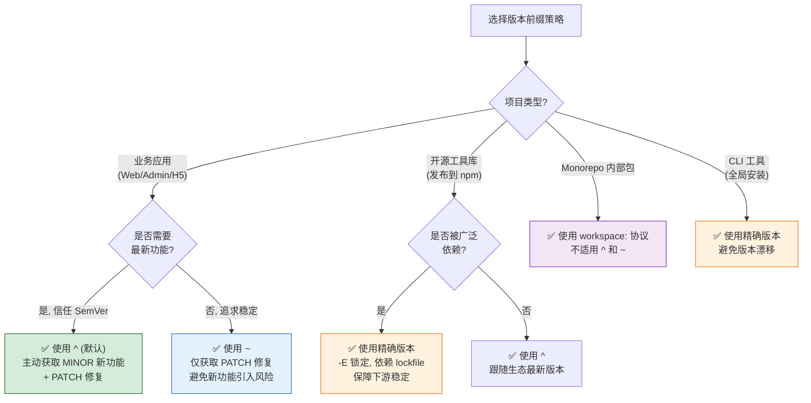

**场景选择清单**：

| 项目场景 | 推荐前缀 | 原因 | 配置方式 |
|:---------|:--------|:-----|:--------|
| **初创项目 / 内部应用** | `^`（默认） | 快速获取新功能和 Bug 修复，开发效率优先 | pnpm 默认行为 |
| **生产环境关键应用** | `~` | 仅接受 Patch 修复，避免 MINOR 新功能引入未知风险 | `pnpm add pkg ~1.2.0` |
| **金融 / 医疗等高合规应用** | 精确版本 | 依赖完全锁定，每次升级需人工审查 | `pnpm add pkg -E` 或 `save-exact=true` |
| **开源 npm 包** | 精确版本 + lockfile | 保障 CI 构建一致性，避免下游依赖漂移 | `pnpm add pkg -E` |
| **Monorepo 内部包** | `workspace:` | 内部包用 symlink 链接，不适用版本前缀 | `workspace:*` |
| **CLI 工具 / 脚手架** | 精确版本 | 避免不同环境版本差异导致行为不一致 | `pnpm add pkg -E` |

#### 5.3.7 pnpm 相关配置选项

pnpm 提供配置项控制版本前缀的默认行为：

```ini
# .npmrc 配置

# 控制默认添加的前缀 (默认 ^)
save-prefix=^

# 等效于每次 add 都加 -E, 禁止添加任何前缀
save-exact=false

# 以下两个配置控制 update 时的行为
# update 时是否使用最新版本(忽略现有前缀范围)
save-prefix=^
```

```bash
# 查看当前配置
pnpm config get save-prefix    # 输出: ^
pnpm config get save-exact     # 输出: false

# 修改默认前缀为 ~
pnpm config set save-prefix ~

# 全局启用精确版本 (所有 add 不加前缀)
pnpm config set save-exact true
```

> **最佳实践**：无论使用 `^` 还是 `~`，都应将 `pnpm-lock.yaml` 纳入版本控制。lockfile 锁定了每个依赖的精确版本，即使 `package.json` 中写的是 `^1.2.0`，CI 和团队成员安装时也会得到与 lockfile 完全一致的版本。`^` 和 `~` 仅在**主动执行 `pnpm update`** 时才影响更新范围。

### 5.4 运行脚本命令

```bash
# 运行 package.json 中的 scripts
pnpm run build          # 等同于 pnpm build
pnpm run dev            # 等同于 pnpm dev
pnpm test               # 等同于 pnpm test

# 直接执行 node_modules/.bin 中的命令
pnpm exec eslint src/

# 不安装直接运行远程包（类似 npx）
pnpm dlx create-vite my-app --template vue

# 在 Monorepo 中运行所有包的 build 脚本
pnpm -r run build
```

> **pnpm dlx vs npx**：`pnpm dlx` 会在 pnpm Store 中缓存下载的包，重复执行比 npx 更快。

### 5.5 高级命令

```bash
# 查看 Store 状态
pnpm store status        # 检查 Store 中的包是否被修改
pnpm store prune         # 清理 Store 中未被引用的包（释放磁盘）

# 审计安全漏洞
pnpm audit               # 检查依赖中的安全漏洞
pnpm audit --fix         # 自动修复可修复的漏洞

# 查看依赖树
pnpm list                # 查看直接依赖
pnpm list --depth=3      # 查看深度 3 的依赖树
pnpm why react           # 查看为什么安装了 react（依赖链）

# 锁定文件管理
pnpm import              # 从 package-lock.json / yarn.lock 导入
pnpm lockfile-only       # 仅更新 lockfile，不安装

# Monorepo 专用
pnpm -r list             # 列出所有工作区包的依赖
pnpm -r run build        # 在所有包中运行 build
pnpm --filter <pkg> build  # 在指定包中运行 build
```

---

## 六、配置选项详解

### 6.1 .npmrc 配置文件

pnpm 完全兼容 `.npmrc` 配置文件，支持项目级、用户级和全局级三层配置：

```ini
# .npmrc 示例

# === Registry 配置 ===
registry=https://registry.npmmirror.com/

# 私有 registry（按 scope 区分）
@mycompany:registry=https://npm.mycompany.com/

# 私有 registry 认证
//npm.mycompany.com/:_authToken=${NPM_TOKEN}

# === 安装行为配置 ===
# 依赖提升策略: hoisted(扁平) / isolated(严格,默认) / shallow
node-linker=hoisted

# 是否自动安装 peer 依赖
auto-install-peers=true

# 严格 peer 依赖检查（冲突时报错）
strict-peer-dependencies=false

# 忽略可选依赖
omit=optional

# === 性能配置 ===
# 网络并发数（默认 16）
network-concurrency=16

# 是否使用 Store 缓存
fetch-retries=2
fetch-retry-factor=10

# === Monorepo 配置 ===
# 共享工作区依赖
shared-workspace-lockfile=true

# === 安全配置 ===
# 禁止生命周期脚本（防止恶意包执行脚本）
ignore-scripts=false

# 仅允许特定包执行脚本
enable-pre-post-scripts=true
```

**配置优先级**（从高到低）：

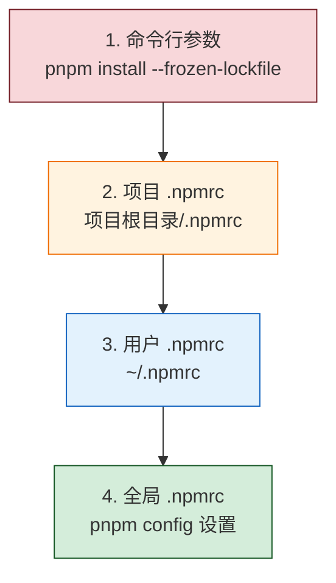

### 6.2 pnpm-workspace.yaml 工作区配置

Monorepo 的核心配置文件，定义工作区包含的包：

```yaml
# pnpm-workspace.yaml

# 定义工作区包的路径（支持 glob 通配符）
packages:
  - 'packages/*'        # packages/ 下的每个子目录是一个包
  - 'apps/*'            # apps/ 下的每个子目录是一个应用
  - 'tools/*'           # tools/ 下的工具脚本
  - '!**/test/**'       # 排除 test 目录
  - '!**/node_modules/**'  # 排除 node_modules
```

**目录结构示例**：

```
my-monorepo/
├── pnpm-workspace.yaml     # 工作区配置
├── package.json            # 根 package.json
├── pnpm-lock.yaml          # 统一的 lockfile
├── packages/               # 共享包
│   ├── ui/
│   │   └── package.json
│   ├── utils/
│   │   └── package.json
│   └── config/
│       └── package.json
└── apps/                   # 可部署应用
    ├── web/
    │   └── package.json
    └── admin/
        └── package.json
```

### 6.3 常用配置项速查表

| 配置项 | 默认值 | 说明 |
|:------|:------|:-----|
| `store-dir` | `~/.local/share/pnpm/store` | 全局 Store 路径 |
| `node-linker` | `isolated` | node_modules 结构：`isolated`(严格)/`hoisted`(扁平)/`pnp` |
| `auto-install-peers` | `true` | 是否自动安装 peer 依赖 |
| `strict-peer-dependencies` | `false` | peer 依赖冲突时是否报错 |
| `shared-workspace-lockfile` | `true` | Monorepo 是否共享一个 lockfile |
| `save-exact` | `false` | 是否保存精确版本（不带 `^`） |
| `registry` | `https://registry.npmjs.org/` | 包注册表地址 |
| `network-concurrency` | `16` | 网络请求并发数 |
| `fetch-retries` | `2` | 下载失败重试次数 |
| `ignore-scripts` | `false` | 是否忽略包的 lifecycle 脚本 |
| `shamefully-hoist` | `false` | 是否将所有依赖提升到顶层（兼容旧项目） |

> **`shamefully-hoist` 说明**：某些旧项目（如使用 Electron、node-gyp 的项目）依赖扁平化的 node_modules 结构。设置 `shamefully-hoist=true` 可将所有依赖提升到顶层，类似 npm 的行为，用于渐进迁移。

---

## 七、Monorepo 工作区实战

### 7.1 创建 Workspace 项目

```bash
# 1. 创建项目根目录
mkdir my-monorepo && cd my-monorepo

# 2. 初始化根 package.json
pnpm init

# 3. 创建工作区配置
cat > pnpm-workspace.yaml << 'EOF'
packages:
  - 'packages/*'
  - 'apps/*'
EOF

# 4. 创建子包目录
mkdir -p packages/ui packages/utils apps/web

# 5. 初始化子包
cd packages/ui && pnpm init
cd ../utils && pnpm init
cd ../../apps/web && pnpm init

# 6. 在根目录安装所有依赖
cd ../..
pnpm install
```

**根 package.json 示例**：

```json
{
  "name": "my-monorepo",
  "private": true,
  "packageManager": "pnpm@9.15.0",
  "scripts": {
    "build": "pnpm -r run build",
    "test": "pnpm -r run test",
    "lint": "pnpm -r run lint",
    "dev": "pnpm --filter web dev"
  },
  "devDependencies": {
    "typescript": "^5.3.0",
    "prettier": "^3.2.0",
    "eslint": "^8.56.0"
  }
}
```

### 7.2 包间依赖管理

在 Monorepo 中，子包之间可以互相引用。使用 `workspace:` 协议声明内部依赖：

```bash
# 让 apps/web 依赖 packages/ui 和 packages/utils
pnpm --filter web add @myrepo/ui@workspace:*
pnpm --filter web add @myrepo/utils@workspace:*

# 让 packages/ui 依赖 packages/utils
pnpm --filter @myrepo/ui add @myrepo/utils@workspace:*
```

**子包 package.json 示例**：

```json
// packages/ui/package.json
{
  "name": "@myrepo/ui",
  "version": "1.0.0",
  "main": "./dist/index.js",
  "types": "./dist/index.d.ts",
  "scripts": {
    "build": "tsc",
    "dev": "tsc --watch"
  },
  "dependencies": {
    "@myrepo/utils": "workspace:*"
  },
  "peerDependencies": {
    "react": "^18.0.0"
  }
}
```

```json
// apps/web/package.json
{
  "name": "web",
  "version": "1.0.0",
  "private": true,
  "scripts": {
    "dev": "vite",
    "build": "vite build"
  },
  "dependencies": {
    "@myrepo/ui": "workspace:*",
    "@myrepo/utils": "workspace:*",
    "react": "^18.2.0"
  }
}
```

**workspace 协议版本号说明**：

| 写法 | 含义 | 发布时替换为 |
|:-----|:-----|:-----------|
| `workspace:*` | 匹配任意版本 | 实际版本号（如 `1.0.0`） |
| `workspace:^1.0.0` | 匹配 ^1.0.0 范围 | `^1.0.0` |
| `workspace:~1.0.0` | 匹配 ~1.0.0 范围 | `~1.0.0` |
| `workspace:^` | 自动使用 ^ 前缀 | `^实际版本号` |

> **关键**：`workspace:` 协议在本地开发时使用 symlink 链接，发布到 npm 时自动替换为实际版本号。

### 7.3 过滤与批量操作

pnpm 的 `--filter` 是 Monorepo 中最强大的命令，支持按包名、路径、依赖关系过滤：

```bash
# === 按包名过滤 ===
pnpm --filter web build              # 只构建 web 包
pnpm --filter @myrepo/ui build       # 只构建 ui 包

# === 按目录过滤 ===
pnpm --filter ./apps/* build         # 构建 apps/ 下所有包
pnpm --filter "./packages/**" test   # 测试 packages/ 下所有包

# === 按依赖关系过滤 ===
pnpm --filter web... build           # 构建 web 及其所有依赖
pnpm --filter ...@myrepo/ui build    # 构建 ui 的所有依赖方
pnpm --filter @myrepo/ui^... build   # 构建 ui 的所有上游依赖

# === 批量操作所有包 ===
pnpm -r run build                    # 在所有包中运行 build
pnpm -r run test                     # 在所有包中运行 test

# === 排除特定包 ===
pnpm --filter "!web" run build       # 构建除 web 外的所有包
```

**过滤选择器图解**：

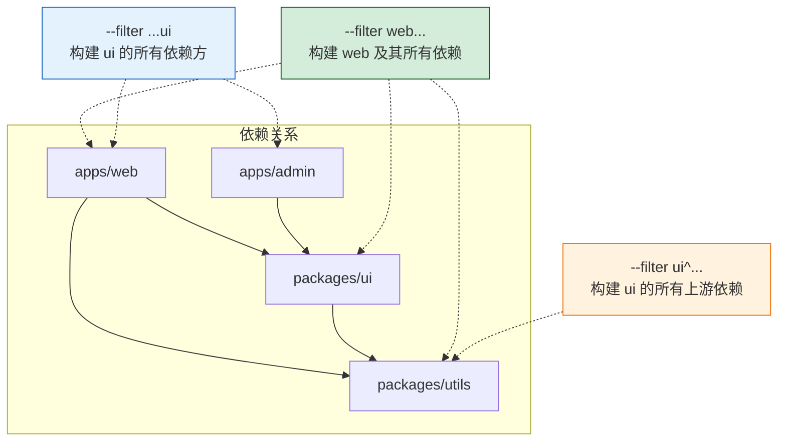

### 7.4 发布流程

```bash
# 1. 确保所有包已构建
pnpm -r run build

# 2. 版本管理（使用 changesets 或内置命令）
# 方式一: 使用 changesets（推荐）
pnpm add -D @changesets/cli
pnpm changeset init

# 方式二: pnpm 内置递归发布
pnpm -r publish --access public

# 3. 递归发布（跳过未改动的包）
pnpm -r publish --access public --filter "@myrepo/*"

# 4. 发布到私有 registry
pnpm -r publish --registry https://npm.mycompany.com/
```

> **Changesets 推荐**：对于需要管理版本号、变更日志的 Monorepo，推荐使用 `@changesets/cli`，它与 pnpm Workspace 深度集成，支持自动版本递增和 CHANGELOG 生成。

---

## 八、项目实际应用场景

### 8.1 场景一：从 npm/yarn 迁移

```bash
# Step 1: 删除旧 lockfile 和 node_modules
rm -rf node_modules package-lock.json yarn.lock

# Step 2: 创建 .npmrc（可选：配置兼容性）
cat > .npmrc << 'EOF'
# 如果项目有兼容性问题，临时开启扁平化
# shamefully-hoist=true
EOF

# Step 3: 使用 pnpm 安装（自动从 package.json 读取依赖）
pnpm install

# Step 4: 测试项目是否正常运行
pnpm dev
pnpm build
pnpm test
```

**常见迁移问题与解决**：

| 问题 | 原因 | 解决方案 |
|:-----|:-----|:--------|
| `Cannot find module 'xxx'` | 幻影依赖：代码引用了未声明的包 | `pnpm add xxx` 显式声明 |
| Electron/node-gyp 构建失败 | 这些工具依赖扁平化 node_modules | `.npmrc` 中设置 `node-linker=hoisted` |
| 全局变量 undefined | 包的 peer 依赖未正确安装 | `.npmrc` 中设置 `auto-install-peers=true` |
| 某些包脚本不执行 | pnpm 默认不运行 pre/post 脚本 | `.npmrc` 中设置 `enable-pre-post-scripts=true` |

### 8.2 场景二：CI/CD 流水线优化

```yaml
# GitHub Actions 示例
name: CI

on: [push, pull_request]

jobs:
  build:
    runs-on: ubuntu-latest
    steps:
      - uses: actions/checkout@v4

      - uses: pnpm/action-setup@v4
        with:
          version: 9

      - uses: actions/setup-node@v4
        with:
          node-version: 20
          cache: 'pnpm'

      # 关键：frozen-lockfile 确保严格按 lockfile 安装
      - name: Install dependencies
        run: pnpm install --frozen-lockfile

      - name: Build
        run: pnpm -r run build

      - name: Test
        run: pnpm -r run test
```

**CI/CD 优化要点**：

```bash
# 1. 冻结 lockfile（CI 必须使用，禁止修改 lockfile）
pnpm install --frozen-lockfile

# 2. 离线安装（配合 Store 缓存，加速 CI）
pnpm install --offline

# 3. 仅安装生产依赖（减小镜像体积）
pnpm install --prod --frozen-lockfile

# 4. 配合 Turborepo 实现增量构建
pnpm turbo run build --filter=...[HEAD^]
```

### 8.3 场景三：私有 Registry 配置

```ini
# .npmrc — 混合使用公共和私有 registry

# 默认使用淘宝镜像（加速国内访问）
registry=https://registry.npmmirror.com/

# 公司内部包使用私有 registry
@mycompany:registry=https://npm.mycompany.com/

# 私有 registry 认证 token（从环境变量读取，避免硬编码）
//npm.mycompany.com/:_authToken=${NPM_TOKEN}

# 其他 scope 的 registry
@internal:registry=https://npm.internal.com/
//npm.internal.com/:_authToken=${INTERNAL_NPM_TOKEN}
```

### 8.4 场景四：Docker 构建优化

```dockerfile
# === 多阶段构建优化 ===

# Stage 1: 安装依赖（利用 pnpm Store 缓存）
FROM node:20-slim AS deps
RUN corepack enable
WORKDIR /app

# 先复制 lockfile 和 workspace 配置（利用 Docker 层缓存）
COPY pnpm-lock.yaml pnpm-workspace.yaml package.json ./
COPY packages/ui/package.json ./packages/ui/
COPY packages/utils/package.json ./packages/utils/
COPY apps/web/package.json ./apps/web/

# 安装依赖（frozen-lockfile 确保 CI 一致性）
RUN pnpm install --frozen-lockfile

# Stage 2: 构建
FROM node:20-slim AS builder
RUN corepack enable
WORKDIR /app
COPY --from=deps /app/node_modules ./node_modules
COPY --from=deps /app/packages/*/node_modules ./packages/
COPY . .
RUN pnpm -r run build

# Stage 3: 运行（精简镜像）
FROM node:20-slim AS runner
WORKDIR /app
COPY --from=builder /app/apps/web/dist ./dist
COPY --from=builder /app/apps/web/package.json ./
RUN corepack enable && pnpm install --prod --frozen-lockfile
EXPOSE 3000
CMD ["pnpm", "start"]
```

**Docker 优化要点**：
1. **分层复制**：先复制 `pnpm-lock.yaml` 和各 `package.json`，再 `pnpm install`，利用 Docker 层缓存
2. **frozen-lockfile**：确保 CI 和 Docker 构建依赖一致
3. **多阶段构建**：最终镜像仅包含生产依赖和构建产物
4. **Corepack**：无需单独安装 pnpm，Node.js 镜像内置

---

## 九、常见问题与最佳实践

### 9.1 常见问题 FAQ

**Q1：pnpm 安装的包为什么不能直接 import 未声明的依赖？**

这是 pnpm 的**严格依赖隔离**特性。与传统 npm/yarn 的扁平化不同，pnpm 的 node_modules 仅在顶层暴露 `package.json` 中声明的依赖。这是**特性而非 Bug**——它帮你发现隐式依赖，避免「幻影依赖」问题。

**解决方案**：在 `package.json` 中显式声明所有用到的依赖。

**Q2：pnpm 的 node_modules 结构导致某些工具不兼容怎么办？**

某些工具（如 Electron、node-gyp、部分 Webpack 插件）依赖扁平化的 node_modules。两种解决方案：

```ini
# 方案一：全局扁平化（不推荐，丧失 pnpm 优势）
# .npmrc
node-linker=hoisted

# 方案二：仅对特定问题包提升（推荐）
# .npmrc
public-hoist-pattern[]=*electron*
public-hoist-pattern[]=*node-gyp*
```

**Q3：pnpm 的 `pnpm-lock.yaml` 能否被 npm 或 yarn 读取？**

不能。`pnpm-lock.yaml` 是 pnpm 专属格式，npm 和 Yarn 无法直接读取。如果团队迁移，需要删除旧 lockfile 并重新生成。

**Q4：Monorepo 中如何只安装某个子包的依赖？**

```bash
# 只安装 web 应用及其依赖
pnpm install --filter web...

# 只安装 packages/ 下的依赖
pnpm install --filter "./packages/**"
```

**Q5：pnpm 的全局 Store 会无限增长吗？**

不会无限增长，但会累积不再使用的包。定期清理：

```bash
# 清理 Store 中未被任何项目引用的包
pnpm store prune

# 查看 Store 占用空间
pnpm store path
du -sh $(pnpm store path)
```

**Q6：如何查看某个包为什么被安装？**

```bash
# 查看依赖链：谁依赖了 lodash
pnpm why lodash

# 输出示例:
# dev
# └─→ jest
#      └─→ @jest/core
#           └─→ jest-runner
#                └─→ jest-environment-node
#                     └─→ lodash  ← 被这里引用
```

### 9.2 最佳实践清单

| 编号 | 最佳实践 | 说明 |
|:----:|:--------|:-----|
| BP1 | **锁定 pnpm 版本** | 在根 `package.json` 设置 `packageManager` 字段，配合 Corepack 统一团队版本 |
| BP2 | **CI 使用 frozen-lockfile** | `pnpm install --frozen-lockfile` 确保依赖一致性，禁止 CI 修改 lockfile |
| BP3 | **显式声明所有依赖** | 不要依赖幻影依赖，所有 import 的包都应在 `package.json` 中声明 |
| BP4 | **定期清理 Store** | 执行 `pnpm store prune` 清理无用包，释放磁盘 |
| BP5 | **Workspace 使用 `workspace:` 协议** | 子包间依赖用 `workspace:*`，发布时自动替换为实际版本 |
| BP6 | **善用 `--filter`** | Monorepo 中按需构建/测试，避免全量操作 |
| BP7 | **共享 lockfile** | 保持 `shared-workspace-lockfile=true`（默认），统一管理依赖版本 |
| BP8 | **Docker 分层缓存** | 先复制 lockfile + package.json，再 install，利用 Docker 层缓存 |
| BP9 | **私有 registry 用环境变量** | `_authToken` 使用 `${NPM_TOKEN}`，避免硬编码到 `.npmrc` |
| BP10 | **渐进迁移** | 从 npm/yarn 迁移时，先用 `shamefully-hoist=true` 兼容，逐步修复幻影依赖 |

---

## 十、总结

### pnpm 核心知识图谱

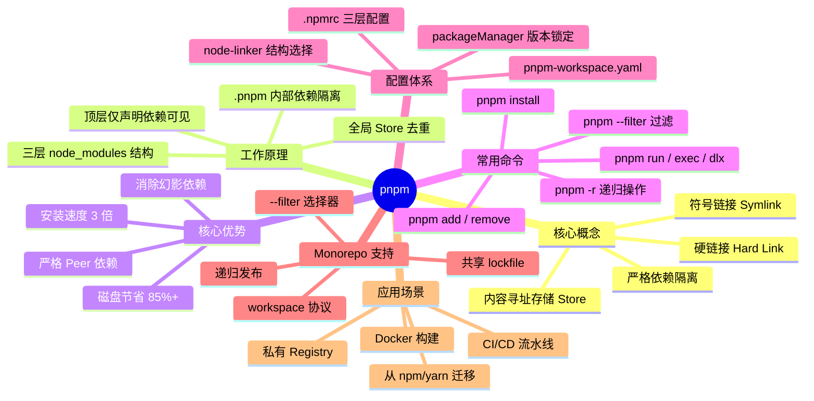

### 选型建议

| 场景 | 推荐 | 原因 |
|:-----|:-----|:-----|
| **新项目** | ✅ pnpm | 性能最优，依赖隔离严格，原生 Monorepo 支持 |
| **Monorepo 项目** | ✅ pnpm | Workspace 功能强大，`--filter` 灵活，磁盘效率高 |
| **CI/CD 密集型** | ✅ pnpm | 安装速度快 3 倍，Store 缓存加速，frozen-lockfile 严格 |
| **旧项目迁移** | ⚠️ pnpm（渐进） | 先 `shamefully-hoist=true` 兼容，逐步修复幻影依赖 |
| **深度依赖 Electron/node-gyp** | ⚠️ pnpm + hoisted | 需配置 `node-linker=hoisted` 或 `public-hoist-pattern` |
| **团队不熟悉 pnpm** | ✅ pnpm | 命令与 npm 高度相似，学习成本低，Corepack 自动管理版本 |

> **总结**：pnpm 通过**内容寻址存储 + 符号链接**的 innovative 设计，在磁盘效率、安装速度和依赖安全性三个维度全面超越 npm/yarn。对于新项目和 Monorepo 场景，pnpm 已成为 2024-2025 年 Node.js 生态的首选包管理器。建议新项目直接采用 pnpm，旧项目制定渐进迁移计划。
