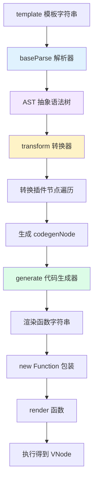
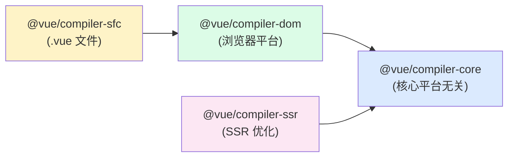

# Vue 3 AST 抽象语法树详解

> 本文档系统阐述 Vue 3 中抽象语法树（Abstract Syntax Tree, AST）的设计原理、节点结构、生成流程与转换机制。从编译器整体架构出发，深入解析 `@vue/compiler-core` 的 Parse → Transform → Generate 三阶段流水线，详尽列举 NodeTypes 枚举与各节点接口定义，并配套手写解析器实战与算法储备，帮助读者建立完整的 Vue 3 编译体系知识图谱。

---

## 目录

- [Vue 3 AST 抽象语法树详解](#vue-3-ast-抽象语法树详解)
  - [目录](#目录)
  - [一、概述与基础概念](#一概述与基础概念)
    - [1.1 什么是抽象语法树](#11-什么是抽象语法树)
    - [1.2 AST 在编译器中的角色](#12-ast-在编译器中的角色)
    - [1.3 Vue 3 编译流程全景](#13-vue-3-编译流程全景)
  - [二、Vue 3 编译器架构总览](#二vue-3-编译器架构总览)
    - [2.1 三大编译包职责划分](#21-三大编译包职责划分)
    - [2.2 编译流水线三阶段](#22-编译流水线三阶段)
    - [2.3 核心数据结构流转](#23-核心数据结构流转)
  - [三、Vue 3 AST 节点类型完整定义](#三vue-3-ast-节点类型完整定义)
    - [3.1 NodeTypes 枚举总览](#31-nodetypes-枚举总览)
    - [3.2 ElementTypes 与常量类型](#32-elementtypes-与常量类型)
    - [3.3 节点类型分类详解](#33-节点类型分类详解)
  - [四、Vue 3 AST 节点属性详解](#四vue-3-ast-节点属性详解)
    - [4.1 公共基础接口 Node 与 SourceLocation](#41-公共基础接口-node-与-sourcelocation)
    - [4.2 RootNode 根节点](#42-rootnode-根节点)
    - [4.3 ElementNode 元素节点](#43-elementnode-元素节点)
    - [4.4 TextNode / CommentNode / InterpolationNode](#44-textnode--commentnode--interpolationnode)
    - [4.5 AttributeNode 与 DirectiveNode](#45-attributenode-与-directivenode)
    - [4.6 表达式节点体系](#46-表达式节点体系)
  - [五、模板解析（Parse）阶段详解](#五模板解析parse阶段详解)
    - [5.1 解析器整体流程](#51-解析器整体流程)
    - [5.2 词法分析：Tokenizer 状态机](#52-词法分析tokenizer-状态机)
    - [5.3 语法分析：递归下降构建 AST](#53-语法分析递归下降构建-ast)
    - [5.4 解析示例：模板到 AST 的对应](#54-解析示例模板到-ast-的对应)
  - [六、AST 转换（Transform）阶段详解](#六ast-转换transform阶段详解)
    - [6.1 转换器整体设计](#61-转换器整体设计)
    - [6.2 节点访问者模式 NodeTransform](#62-节点访问者模式-nodetransform)
    - [6.3 内置转换插件清单](#63-内置转换插件清单)
    - [6.4 codegenNode 生成原理](#64-codegennode-生成原理)
  - [七、代码生成（Generate）阶段详解](#七代码生成generate阶段详解)
    - [7.1 代码生成器架构](#71-代码生成器架构)
    - [7.2 渲染函数字符串示例](#72-渲染函数字符串示例)
    - [7.3 静态提升与缓存机制](#73-静态提升与缓存机制)
  - [八、基础算法储备](#八基础算法储备)
    - [8.1 指针思想](#81-指针思想)
    - [8.2 递归与缓存优化](#82-递归与缓存优化)
    - [8.3 栈数据结构](#83-栈数据结构)
    - [8.4 综合实战：smartRepeat 智能重复展开](#84-综合实战smartrepeat-智能重复展开)
  - [九、手写简易 AST 解析器](#九手写简易-ast-解析器)
    - [9.1 设计目标与输入输出](#91-设计目标与输入输出)
    - [9.2 parse 主函数实现](#92-parse-主函数实现)
    - [9.3 parseAttrString 属性解析](#93-parseattrstring-属性解析)
    - [9.4 运行结果验证](#94-运行结果验证)
  - [十、Vue 3 与 Vue 2 AST 对比](#十vue-3-与-vue-2-ast-对比)
    - [10.1 架构设计差异](#101-架构设计差异)
    - [10.2 节点结构差异](#102-节点结构差异)
    - [10.3 编译产物差异](#103-编译产物差异)
  - [十一、实战：查看与调试 AST](#十一实战查看与调试-ast)
    - [11.1 使用 @vue/compiler-core 在线编译](#111-使用-vuecompiler-core-在线编译)
    - [11.2 Vue Template Explorer 工具](#112-vue-template-explorer-工具)
    - [11.3 Vite 插件中访问编译产物](#113-vite-插件中访问编译产物)
  - [十二、总结与快速参考](#十二总结与快速参考)
    - [12.1 核心知识回顾](#121-核心知识回顾)
    - [12.2 速查卡片](#122-速查卡片)
    - [12.3 学习路径建议](#123-学习路径建议)
  - [参考文献](#参考文献)

---

## 一、概述与基础概念

### 1.1 什么是抽象语法树

**抽象语法树（Abstract Syntax Tree，简称 AST）** 是源代码的树状抽象表示形式。它以递归的树形结构描述代码的语法构成，树的每个节点对应源代码中的一个语法构造。

在 Vue 3 的语境下，AST 特指 Vue 模板（template）经过解析后生成的、用 JavaScript 对象描述的树形数据结构，是连接模板字符串与渲染函数（render function）之间的核心中转产物。

**模板到 AST 的转换示例：**

```html
<!-- 输入：Vue 3 模板 -->
<div class="box" id="mybox">
  <h3>{{ title }}</h3>
  <ul>
    <li v-for="item in list" :key="item.id">{{ item.name }}</li>
  </ul>
</div>
```

```javascript
// 输出：简化后的 AST 结构
{
  type: 0,                          // NodeTypes.ROOT
  children: [
    {
      type: 1,                       // NodeTypes.ELEMENT
      tag: 'div',
      tagType: 0,                    // ElementTypes.ELEMENT
      props: [
        { type: 6, name: 'class', value: { content: 'box' } },
        { type: 6, name: 'id', value: { content: 'mybox' } }
      ],
      children: [
        { type: 1, tag: 'h3', children: [
          { type: 5, content: { type: 4, content: 'title' } }   // 插值
        ]},
        { type: 1, tag: 'ul', children: [
          { type: 1, tag: 'li', props: [
            { type: 7, name: 'for', exp: { content: 'item in list' } },
            { type: 7, name: 'bind', arg: { content: 'key' }, exp: { content: 'item.id' } }
          ]}
        ]}
      ]
    }
  ],
  loc: { start: { offset: 0, line: 1, column: 1 }, /* ... */ }
}
```

### 1.2 AST 在编译器中的角色

在编译器理论中，一次完整的编译过程通常包含以下阶段：

```
源代码字符串
    ↓  词法分析（Lexical Analysis / Tokenize）
Token 流
    ↓  语法分析（Syntax Analysis / Parse）
抽象语法树（AST）
    ↓  语义分析（Semantic Analysis）
带标注的 AST
    ↓  中间代码生成
中间表示（IR）
    ↓  优化
优化后的 IR
    ↓  目标代码生成
目标代码
```

**Vue 3 模板编译器对应映射：**

| 编译阶段 | Vue 3 对应实现 | 产物 |
|---------|---------------|------|
| 词法分析 + 语法分析 | `baseParse(template)` | 模板 AST（TemplateAST） |
| 语义分析 + 中间代码生成 | `transform(ast, options)` | 增强 AST（含 codegenNode） |
| 目标代码生成 | `generate(ast, options)` | 渲染函数字符串 |

**AST 的核心价值：**
1. **解耦**：将"识别模板"与"生成代码"两个关注点分离，便于独立优化
2. **可分析**：树形结构便于进行静态分析（如静态节点标记、指令提取）
3. **可变换**：转换器可通过插件机制对 AST 进行二次加工（如 `v-if` → 三元表达式）
4. **可缓存**：AST 可序列化或跨调用复用，避免重复解析开销

### 1.3 Vue 3 编译流程全景

Vue 3 的模板编译在 `@vue/compiler-core` 中实现，对外暴露 `baseCompile` 作为统一入口：

```typescript
// packages/compiler-core/src/compile.ts 简化版
export function baseCompile(
  template: string | RootNode,
  options: CompilerOptions = {}
): CodegenResult {
  // ① 解析阶段：字符串模板 → AST
  const ast = isString(template) ? baseParse(template, options) : template

  // ② 转换阶段：AST → 增强后的 AST（注入 codegenNode）
  transform(
    ast,
    extend({}, options, {
      nodeTransforms: [...DOMNodeTransforms, ...options.nodeTransforms || []],
      directiveTransforms: extend({}, DOMDirectiveTransforms, options.directiveTransforms || {})
    })
  )

  // ③ 生成阶段：AST → 渲染函数代码字符串
  return generate(ast, options)
}
```

**完整流程图（Mermaid）：**



---

## 二、Vue 3 编译器架构总览

### 2.1 三大编译包职责划分

Vue 3 的编译能力被拆分为三个独立 npm 包，遵循"核心平台无关 + 平台适配层"的设计哲学：

| 包名 | 职责 | 适用场景 |
|------|------|---------|
| `@vue/compiler-core` | 平台无关的核心编译逻辑：Parse / Transform / Generate | 跨平台编译（Web、SSR、小程序等） |
| `@vue/compiler-dom` | 浏览器平台特化配置（如 v-html、v-text、style/class 适配） | Web 端默认编译入口 |
| `@vue/compiler-sfc` | Single File Component 编译（解析 .vue 文件、提取 script/template/style） | Vue Loader / Vite 插件 |

**额外补充包：**
- `@vue/compiler-ssr`：服务端渲染优化编译
- `@vue/server-renderer`：SSR 运行时
- `@vue/babel-plugin-jsx`：JSX 语法编译插件

**包间依赖关系：**



### 2.2 编译流水线三阶段

**阶段一：Parse（解析）**

将模板字符串解析为 AST。Vue 3 采用手写递归下降解析器（非生成器），保证性能与错误恢复能力。

```typescript
// packages/compiler-core/src/parse.ts
export function baseParse(content: string, options: ParserOptions): RootNode {
  const context = createParserContext(content, options)
  return parseChildren(context, NodeTypes.ROOT, [])
}
```

**阶段二：Transform（转换）**

深度优先遍历 AST，应用一系列转换插件，完成：
- 静态节点标记（`patchFlag`）
- 指令转换（`v-if` → 条件表达式、`v-for` → `renderList` 调用）
- 提取公共子表达式
- 为每个节点生成 `codegenNode` 字段，作为代码生成的依据

```typescript
// packages/compiler-core/src/transform.ts
export function transform(root: RootNode, options: TransformOptions) {
  const context = createTransformContext(root, options)
  traverseNode(root, context)
  // 静态提升等收尾工作
  if (options.hoistStatic) hoistStatic(root, context)
  if (options.cacheHandlers) cacheHandlers(root, context)
  createRootCodegen(root, context)
}
```

**阶段三：Generate（生成）**

遍历转换后 AST 的 `codegenNode` 字段，生成最终的渲染函数字符串。

```typescript
// packages/compiler-core/src/codegen.ts
export function generate(ast: RootNode, options: CompilerOptions): CodegenResult {
  const context = createCodegenContext(ast, options)
  const { push, indent, deindent } = context
  // 生成 preamble（import 语句、静态提升变量）
  genFunctionPreamble(ast, context)
  // 生成 render 函数体
  push('function render(_ctx, _cache)')
  // ...遍历 codegenNode 输出代码
  return { code, ast, preamble }
}
```

### 2.3 核心数据结构流转

```
模板字符串 string
       │ Parse
       ▼
RootNode（含 children、loc）
       │ Transform
       ▼
RootNode（新增 helpers、hoists、codegenNode、components、directives）
       │ Generate
       ▼
{ code: string, ast: RootNode, preamble: string }
       │ new Function
       ▼
render() → VNode
```

**关键数据结构演进：**

| 阶段 | 数据结构 | 新增字段 |
|------|---------|---------|
| Parse 后 | `RootNode` | `children`、`loc` |
| Transform 后 | `RootNode`（增强） | `helpers`、`hoists`、`codegenNode`、`components`、`directives`、`cached`、`temps` |
| Generate 后 | `CodegenResult` | `code`（字符串）、`preamble`、`ast` |

---

## 三、Vue 3 AST 节点类型完整定义

### 3.1 NodeTypes 枚举总览

Vue 3 将所有 AST 节点类型定义为 TypeScript 数字枚举 `NodeTypes`，位于 `@vue/compiler-core` 中。数字枚举而非字符串的设计，便于运行时通过位运算或比较快速判别。

```typescript
// packages/compiler-core/src/ast.ts
export const enum NodeTypes {
  ROOT,                    // 0  根节点
  ELEMENT,                 // 1  元素节点
  TEXT,                    // 2  纯文本节点
  COMMENT,                 // 3  注释节点
  SIMPLE_EXPRESSION,       // 4  简单表达式（标识符、字面量）
  INTERPOLATION,           // 5  插值表达式 {{ }}
  ATTRIBUTE,               // 6  普通属性
  DIRECTIVE,               // 7  指令 v-xxx
  COMPOUND_EXPRESSION,     // 8  复合表达式（字符串拼接）
  IF,                      // 9  v-if 节点（聚合多个 v-else-if）
  IF_BRANCH,               // 10 v-if 分支节点
  FOR,                     // 11 v-for 节点
  TEXT_CALL,               // 12 文本调用节点（动态文本包装）
  VNODE_CALL,              // 13 VNode 调用（createVNode）
  JS_CALL_EXPRESSION,      // 14 JS 函数调用表达式
  JS_OBJECT_EXPRESSION,    // 15 JS 对象字面量
  JS_PROPERTY,             // 16 JS 对象属性
  JS_ARRAY_EXPRESSION,     // 17 JS 数组字面量
  JS_FUNCTION_EXPRESSION,  // 18 JS 函数表达式
  JS_CONDITIONAL_EXPRESSION, // 19 JS 三元表达式
  JS_CACHE_EXPRESSION,     // 20 JS 缓存表达式（_cache[N]）
  // 仅 SSR 使用
  JS_BLOCK_STATEMENT,      // 21
  JS_TEMPLATE_LITERAL,     // 22
  JS_IF_STATEMENT,         // 23
  JS_ASSIGNMENT_EXPRESSION,// 24
  JS_SEQUENCE_EXPRESSION,  // 25
  JS_RETURN_STATEMENT      // 26
}
```

### 3.2 ElementTypes 与常量类型

**ElementTypes：元素节点子分类**

```typescript
export const enum ElementTypes {
  ELEMENT,    // 0  普通 HTML 元素 <div>
  COMPONENT,  // 1  Vue 组件 <my-comp /> 或 <MyComp />
  SLOT,       // 2  <slot> 元素
  TEMPLATE,   // 3  <template> 元素（用作分支或循环包装）
}
```

判别规则：
- 首字母大写 → `COMPONENT`
- 在 `components` 选项中注册 → `COMPONENT`
- 标签名命中内置（`slot` / `template`）→ 对应类型
- 其他 → `ELEMENT`

**ConstantTypes：常量级别（用于静态分析优化）**

```typescript
export const enum ConstantTypes {
  NOT_CONSTANT = 0,     // 非常量，每次渲染都可能变化
  CAN_SKIP_PATCH,       // 可跳过 patch（同节点比较即可）
  CAN_CACHE,            // 可缓存（同次渲染内多次出现可复用）
  CAN_STRINGIFY,        // 可字符串化（SSR 时直接输出 HTML 字符串）
  CAN_HOIST             // 可静态提升到 render 函数外
}
```

### 3.3 节点类型分类详解

按用途可将 27 个节点类型分为四大类：

```
┌─────────────────────────────────────────────────────────────┐
│  Vue 3 AST 节点类型分类                                       │
├─────────────────────────────────────────────────────────────┤
│ ① 模板层节点（Parse 阶段产出，描述模板结构）                    │
│    ROOT(0)  ELEMENT(1)  TEXT(2)  COMMENT(3)                  │
│    INTERPOLATION(5)  ATTRIBUTE(6)  DIRECTIVE(7)              │
│                                                             │
│ ② 控制流节点（Transform 阶段由指令转换而来）                    │
│    IF(9)  IF_BRANCH(10)  FOR(11)                            │
│                                                             │
│ ③ 表达式节点（描述 JS 表达式）                                 │
│    SIMPLE_EXPRESSION(4)  COMPOUND_EXPRESSION(8)              │
│                                                             │
│ ④ 代码生成节点（codegenNode 字段使用，对应 JS 代码片段）         │
│    TEXT_CALL(12)  VNODE_CALL(13)                            │
│    JS_CALL_EXPRESSION(14)  JS_OBJECT_EXPRESSION(15)         │
│    JS_PROPERTY(16)  JS_ARRAY_EXPRESSION(17)                 │
│    JS_FUNCTION_EXPRESSION(18)  JS_CONDITIONAL_EXPRESSION(19)│
│    JS_CACHE_EXPRESSION(20)                                  │
└─────────────────────────────────────────────────────────────┘
```

**类型对照速查表：**

| NodeTypes | 名称 | 阶段 | 典型场景 |
|-----------|------|------|---------|
| 0 ROOT | 根节点 | Parse | AST 顶层容器 |
| 1 ELEMENT | 元素节点 | Parse | `<div>`、`<span>` 等 |
| 2 TEXT | 文本节点 | Parse | `Hello World` 纯文本 |
| 3 COMMENT | 注释节点 | Parse | `<!-- 注释 -->` |
| 4 SIMPLE_EXPRESSION | 简单表达式 | Parse/Transform | `count`、`item.name`、`'static'` |
| 5 INTERPOLATION | 插值 | Parse | `{{ msg }}` |
| 6 ATTRIBUTE | 属性 | Parse | `class="box"`、`id="mybox"` |
| 7 DIRECTIVE | 指令 | Parse | `v-if`、`v-for`、`v-bind`、`v-on` |
| 8 COMPOUND_EXPRESSION | 复合表达式 | Transform | `Hello ` + name + `!` |
| 9 IF | if 容器 | Transform | 多个 `v-if/v-else-if/v-else` 聚合 |
| 10 IF_BRANCH | 分支 | Transform | 单个 if 分支 |
| 11 FOR | for 容器 | Transform | `v-for="item in list"` |
| 12 TEXT_CALL | 文本调用 | Transform | 包装动态文本为 toDisplayString 调用 |
| 13 VNODE_CALL | VNode 调用 | Transform | `createVNode('div', ...)` |
| 14 JS_CALL_EXPRESSION | 函数调用 | Generate | `renderList(list, fn)` |
| 15 JS_OBJECT_EXPRESSION | 对象字面量 | Generate | `{ class: 'box', onClick: fn }` |
| 16 JS_PROPERTY | 对象属性 | Generate | `{ key: value }` 中的 `key: value` |
| 17 JS_ARRAY_EXPRESSION | 数组字面量 | Generate | `[vnode1, vnode2]` |
| 18 JS_FUNCTION_EXPRESSION | 函数表达式 | Generate | `item => createVNode(...)` |
| 19 JS_CONDITIONAL_EXPRESSION | 三元表达式 | Generate | `cond ? a : b` |
| 20 JS_CACHE_EXPRESSION | 缓存表达式 | Generate | `_cache[0]`（事件缓存等） |
---

## 四、Vue 3 AST 节点属性详解

### 4.1 公共基础接口 Node 与 SourceLocation

所有 AST 节点都实现 `Node` 接口，包含两个必备字段：

```typescript
export interface Node {
  type: NodeTypes          // 节点类型枚举值
  loc: SourceLocation      // 源码位置信息（用于错误定位与 sourcemap）
}

export interface SourceLocation {
  start: Position          // 起始位置
  end: Position            // 结束位置
  source: string           // 该节点对应的原始字符串片段
}

export interface Position {
  offset: number           // 距模板开头的字符偏移量
  line: number             // 行号（从 1 开始）
  column: number           // 列号（从 1 开始）
}
```

**示例**：模板 `<div>hi</div>` 中 `<div>` 元素节点的 loc：

```json
{
  "start": { "offset": 0, "line": 1, "column": 1 },
  "end":   { "offset": 5, "line": 1, "column": 6 },
  "source": "<div>"
}
```

`loc` 在以下场景中至关重要：
- 编译错误提示（如 "v-if 必须配合 v-else" 时能定位到具体行）
- 调试工具映射回源码（devtools 中点击 AST 节点高亮模板片段）
- 生成 source map，便于运行时调试定位

### 4.2 RootNode 根节点

```typescript
export interface RootNode extends Node {
  type: NodeTypes.ROOT
  children: TemplateChildNode[]      // 顶层子节点

  // Transform 阶段填充
  helpers: Set<Symbol>               // 依赖的运行时 helper（如 createVNode）
  components: string[]               // 引用的组件名
  directives: string[]               // 引用的指令名
  hoists: (JSChildNode | null)[]     // 静态提升的节点数组
  imports: string[]                  // 需要导入的语句
  cached: number                     // 使用 _cache 的次数（用于事件缓存等）
  temps: number                      // 临时变量数量
  codegenNode?: CodegenNode          // 代码生成入口节点
  filters?: string[]                 // Vue 2 风格 filter（已被废弃，仅兼容）
}
```

`helpers` 集合是关键：编译器会统计整个模板用到了哪些运行时辅助函数，最终在生成的渲染函数头部统一 `import`：

```javascript
// 假设 helpers 包含 CREATE_VNODE, TO_DISPLAY_STRING, RENDER_LIST
// 生成的渲染函数头部：
import { createElementVNode as _createVNode,
         toDisplayString as _toDisplayString,
         renderList as _renderList } from "vue"
```

### 4.3 ElementNode 元素节点

元素节点是 AST 中最复杂的节点类型，描述一个 HTML 元素或 Vue 组件：

```typescript
export interface ElementNode extends Node {
  type: NodeTypes.ELEMENT
  ns: Namespace                       // 命名空间（HTML / SVG / MATHML）
  tag: string                         // 标签名，如 'div'、'my-comp'
  tagType: ElementTypes               // 元素子类型（HTML / 组件 / slot / template）
  isSelfClosing: boolean              // 是否自闭合 
  props: Array<AttributeNode | DirectiveNode>  // 属性与指令列表
  children: TemplateChildNode[]       // 子节点

  // Transform 阶段填充
  codegenNode: VNodeCall | SimpleExpressionNode | undefined
  patchFlag: number                   // patch 标志位（优化 diff）
  dynamicProps: string[] | undefined  // 动态属性名列表（如 ['class','style']）
  // ...
}
```

**patchFlag 优化机制**：编译期分析后给元素打上 patch 标记，运行时 patch 时只比对动态部分，跳过静态部分。

```typescript
export const enum PatchFlags {
  TEXT = 1,            // 动态文本内容
  CLASS = 1 << 1,      // 动态 class
  STYLE = 1 << 2,      // 动态 style
  PROPS = 1 << 3,      // 动态非 class/style 属性
  FULL_PROPS = 1 << 4, // 含动态 key，需全量 diff
  HYDRATE_EVENTS = 1 << 5,
  STABLE_FRAGMENT = 1 << 6,
  KEYED_FRAGMENT = 1 << 7,
  UNKEYED_FRAGMENT = 1 << 8,
  NEED_PATCH = 1 << 9,
  DYNAMIC_SLOTS = 1 << 10,
  HOISTED = -1,        // 静态提升节点（不参与 patch）
  BAIL = -2            // 放弃优化
}
```

**示例**：`<div :class="cls">{{ msg }}</div>` 编译后 patchFlag = TEXT | CLASS = 3

### 4.4 TextNode / CommentNode / InterpolationNode

**TextNode（纯文本节点）**

```typescript
export interface TextNode extends Node {
  type: NodeTypes.TEXT
  content: string                     // 文本内容
}
```

**CommentNode（注释节点）**

```typescript
export interface CommentNode extends Node {
  type: NodeTypes.COMMENT
  content: string
}
```

**InterpolationNode（插值节点 `{{ }}`）**

```typescript
export interface InterpolationNode extends Node {
  type: NodeTypes.INTERPOLATION
  content: ExpressionNode              // 内部表达式节点
}
```

示例：`{{ user.name }}` 的 AST 结构：

```json
{
  "type": 5,
  "content": {
    "type": 4,
    "content": "user.name",
    "isStatic": false,
    "isConstant": false
  },
  "loc": { /* ... */ }
}
```

### 4.5 AttributeNode 与 DirectiveNode

**AttributeNode（普通 HTML 属性）**

```typescript
export interface AttributeNode extends Node {
  type: NodeTypes.ATTRIBUTE
  name: string                        // 属性名，如 'class'、'id'
  value: TextNode | undefined         // 属性值（无值时为 undefined，如 <input disabled>）
}
```

**DirectiveNode（Vue 指令）**

```typescript
export interface DirectiveNode extends Node {
  type: NodeTypes.DIRECTIVE
  name: string                        // 指令名，如 'if'、'for'、'bind'、'on'
  exp: ExpressionNode | undefined     // 表达式（v-bind:class="cls" 中的 cls）
  arg: ExpressionNode | undefined     // 参数（v-on:click 中的 click）
  modifiers: string[]                 // 修饰符列表（v-on:click.stop 中的 ['stop']）

  // Transform 阶段填充
  // 当指令被 directiveTransform 处理后，会替换为对应的 props
}
```

**示例对比**：

| 模板 | 节点类型 | 关键字段 |
|------|---------|---------|
| `class="box"` | ATTRIBUTE | `name: 'class', value: { content: 'box' }` |
| `:class="cls"` | DIRECTIVE | `name: 'bind', arg: { content: 'class' }, exp: { content: 'cls' }` |
| `@click="fn"` | DIRECTIVE | `name: 'on', arg: { content: 'click' }, exp: { content: 'fn' }` |
| `v-on:click.stop="fn"` | DIRECTIVE | `name: 'on', arg: 'click', exp: 'fn', modifiers: ['stop']` |
| `v-model="val"` | DIRECTIVE | `name: 'model', exp: { content: 'val' }` |

### 4.6 表达式节点体系

**SimpleExpressionNode（简单表达式）**

```typescript
export interface SimpleExpressionNode extends Node {
  type: NodeTypes.SIMPLE_EXPRESSION
  content: string                     // 表达式字符串，如 'count'、'"hello"'
  isStatic: boolean                   // 是否静态（不依赖响应式数据）
  isConstant: boolean                 // 是否常量（更严格，可用于静态提升）
  ast?: import('@babel/parser').ParseResult<Expression>  // 可选 babel AST
  hoisted?: boolean                   // 是否已静态提升
}
```

判别规则：
- `isStatic = true`：纯字符串字面量 `'hello'`、数字 `123`、不依赖响应式的表达式
- `isConstant = CAN_HOIST`：纯字面量、或仅由常量组成的对象/数组
- `isConstant = CAN_STRINGIFY`：可用于 SSR 字符串化

**CompoundExpressionNode（复合表达式）**

```typescript
export interface CompoundExpressionNode extends Node {
  type: NodeTypes.COMPOUND_EXPRESSION
  children: Array<  // 拼接子表达式
    SimpleExpressionNode |
    InterpolationNode |
    TextNode |
    CompoundExpressionNode
  >
}
```

**应用场景**：模板 `Hello {{ name }}, you have {{ count }} messages` 中，文本与插值交错的部分会被合并为复合表达式：

```json
{
  "type": 8,
  "children": [
    { "type": 4, "content": "Hello " },
    "+",  // 字符串连接符
    { "type": 4, "content": "name" },
    "+",
    { "type": 4, "content": ", you have " },
    "+",
    { "type": 4, "content": "count" },
    "+",
    { "type": 4, "content": " messages" }
  ]
}
```

最终生成的代码：`"Hello " + _toDisplayString(name) + ", you have " + _toDisplayString(count) + " messages"`

---

## 五、模板解析（Parse）阶段详解

### 5.1 解析器整体流程

Vue 3 的解析器采用手写递归下降方式，避免依赖 Parser Generator（如 PEG.js），原因：
1. **性能**：手写代码可针对性优化，比通用生成器快 2-3 倍
2. **错误恢复**：HTML 容错能力极强，手写更易实现宽松匹配
3. **行号追踪**：原生支持行号列号，便于错误提示

**核心流程：**

```typescript
// packages/compiler-core/src/parse.ts 简化
function parseChildren(
  context: ParserContext,
  mode: ParsingMode,
  ancestors: ElementNode[]
): TemplateChildNode[] {
  const nodes: TemplateChildNode[] = []
  while (!isEnd(context, mode, ancestors)) {
    let node
    const s = context.source
    if (mode === TextMode.DATA) {
      if (startsWith(s, '{{')) {
        node = parseInterpolation(context)
      } else if (s[0] === '<') {
        if (s[1] === '/') {
          // 结束标签，由上层处理
        } else if (/[a-z]/i.test(s[1])) {
          node = parseElement(context, ancestors)   // 递归解析元素
        }
      }
    }
    if (!node) {
      node = parseText(context)
    }
    nodes.push(node)
  }
  return nodes
}
```

### 5.2 词法分析：Tokenizer 状态机

Vue 3 没有独立 Tokenizer，词法分析融入解析过程中。状态机有三个核心状态：

```
┌──────────────────────────────────────────────────────────┐
│          Vue 3 Parser 状态机                              │
├──────────────────────────────────────────────────────────┤
│                                                          │
│  DATA 模式（默认）                                        │
│    ├─ 遇到 '<' 字母 → 进入元素解析                        │
│    ├─ 遇到 '</' → 结束标签处理                            │
│    ├─ 遇到 '<!--' → 注释解析                              │
│    ├─ 遇到 '<![CDATA[' → CDATA 解析                       │
│    ├─ 遇到 '{{' → 插值解析                                │
│    └─ 其他 → 文本解析                                     │
│                                                          │
│  RCDATA 模式（在 <textarea>、<title> 内）                 │
│    ├─ 只识别 </tag> 结束                                  │
│    └─ 其他全部当作文本                                    │
│                                                          │
│  RAWTEXT 模式（在 <script>、<style>、<pre> 内）           │
│    ├─ 只识别 </tag> 结束                                  │
│    └─ 其他全部当作原始文本（不解析 {{ }}）                 │
│                                                          │
└──────────────────────────────────────────────────────────┘
```

### 5.3 语法分析：递归下降构建 AST

**parseElement 函数核心逻辑：**

```typescript
function parseElement(
  context: ParserContext,
  ancestors: ElementNode[]
): ElementNode | undefined {
  // ① 解析开始标签
  const parent = last(ancestors)
  const element = parseTag(context, TagType.Start)   // 解析 <div class="x">

  // ② 自闭合则直接返回
  if (element.isSelfClosing) {
    return element
  }

  // ③ 递归解析子节点
  if (element.tag === 'textarea' || element.tag === 'title') {
    context.options.textMode = TextMode.RCDATA
  } else if (/^(script|style|pre)$/.test(element.tag)) {
    context.options.textMode = TextMode.RAWTEXT
  }
  ancestors.push(element)
  const children = parseChildren(context, TextMode.DATA, ancestors)
  ancestors.pop()

  element.children = children

  // ④ 解析结束标签（必须匹配）
  if (startsWithEndTagOpen(context.source, element.tag)) {
    parseTag(context, TagType.End)
  } else {
    emitError(context, ErrorCodes.X_MISSING_END_TAG)
  }

  return element
}
```

**parseTag 中的属性解析 parseAttributes：**

```typescript
function parseAttributes(
  context: ParserContext,
  type: AttributeType
): (AttributeNode | DirectiveNode)[] {
  const props: (AttributeNode | DirectiveNode)[] = []
  const attributeNames = new Set<string>()
  while (
    !isEnd(context) &&
    context.source[0] !== '>' &&
    !(context.source[0] === '/' && context.source[1] === '>')
  ) {
    const name = parseAttributeName(context)
    const value = parseAttributeValue(context)
    if (name.startsWith('v-') || name.startsWith('@') || name.startsWith(':')) {
      props.push(parseDirective(name, value, context))
    } else {
      props.push({
        type: NodeTypes.ATTRIBUTE,
        name,
        value,
        loc
      })
    }
  }
  return props
}
```

### 5.4 解析示例：模板到 AST 的对应

**输入模板：**

```html
<div class="container">
  <p>{{ message }}</p>
  <span v-if="show">可见</span>
</div>
```

**解析后 AST（缩进展示层级关系）：**

```json
{
  "type": 0,
  "children": [
    {
      "type": 1,
      "tag": "div",
      "tagType": 0,
      "props": [
        {
          "type": 6,
          "name": "class",
          "value": { "type": 2, "content": "container" }
        }
      ],
      "children": [
        {
          "type": 1,
          "tag": "p",
          "children": [
            {
              "type": 5,
              "content": {
                "type": 4,
                "content": "message",
                "isStatic": false
              }
            }
          ]
        },
        {
          "type": 1,
          "tag": "span",
          "props": [
            {
              "type": 7,
              "name": "if",
              "exp": { "type": 4, "content": "show", "isStatic": false }
            }
          ],
          "children": [
            { "type": 2, "content": "可见" }
          ]
        }
      ]
    }
  ]
}
```

**对应关系映射图：**

```
模板字符串                    AST 节点                  节点类型
─────────────────────────────────────────────────────────────
<div class="container">  ──→  ELEMENT                 type=1
  class="container"      ──→    ATTRIBUTE             type=6
  <p>                    ──→    ELEMENT               type=1
    {{ message }}        ──→      INTERPOLATION       type=5
      message            ──→        SIMPLE_EXPR       type=4
    可见                  ──→      TEXT                type=2
  <span v-if="show">     ──→    ELEMENT               type=1
    v-if="show"          ──→      DIRECTIVE           type=7
```

---

## 六、AST 转换（Transform）阶段详解

### 6.1 转换器整体设计

转换器是 Vue 3 编译器最复杂的部分，采用**访问者模式（Visitor Pattern）**深度优先遍历 AST，每个节点根据类型匹配对应的转换插件。

```typescript
export interface TransformOptions {
  nodeTransforms?: NodeTransform[]              // 节点转换插件
  directiveTransforms?: Record<string, DirectiveTransform>  // 指令转换插件
  // ...其他选项
}

export type NodeTransform = (
  node: RootNode | TemplateChildNode,
  context: TransformContext
) => void | (() => void) | (() => void)[]

export type DirectiveTransform = (
  dir: DirectiveNode,
  node: ElementNode,
  context: TransformContext,
  augmentor?: (ret: DirectiveTransformResult) => DirectiveTransformResult
) => DirectiveTransformResult
```

**关键设计：enter + exit 双重钩子**

`NodeTransform` 函数返回值如果是函数，则该函数会在子节点遍历完成后（exit 阶段）被调用：

```typescript
// 一个典型的 NodeTransform 示例
function transformIf(node, context) {
  if (node.type === NodeTypes.ELEMENT && hasVIf(node)) {
    // enter 阶段：标记、收集
    context.replaceNode(convertIfNode(node))

    // 返回 exit 钩子
    return () => {
      // 子节点处理完后，做收尾工作
      processIfBranches(node)
    }
  }
}
```

### 6.2 节点访问者模式 NodeTransform

**traverseNode 核心实现：**

```typescript
export function traverseNode(
  node: RootNode | TemplateChildNode,
  context: TransformContext
) {
  // 应用 enter 阶段的转换插件
  const exitFns: Array<() => void> = []
  context.nodeTransforms.forEach(transform => {
    const onExit = transform(node, context)
    if (onExit) {
      if (isArray(onExit)) exitFns.push(...onExit)
      else exitFns.push(onExit)
    }
    if (!context.currentNode) return   // 节点可能被移除
  })

  // 递归遍历子节点
  switch (node.type) {
    case NodeTypes.IF:
    case NodeTypes.FOR:
    case NodeTypes.IF_BRANCH:
    case NodeTypes.ELEMENT:
    case NodeTypes.ROOT:
      traverseChildren(node, context)
      break
  }

  // 反向调用 exit 钩子（保证子节点先处理完）
  let i = exitFns.length
  while (i--) {
    exitFns[i]()
  }
}
```

**反向调用 exit 钩子的意义**：父节点在 enter 时记录状态，子节点处理完后父节点能拿到子节点最终状态进行整合（如 `v-if` 需要收集所有 `v-else-if`/`v-else` 分支）。

### 6.3 内置转换插件清单

`@vue/compiler-core` 内置的核心转换插件：

| 插件名 | 作用 | 转换示例 |
|--------|------|---------|
| `transformIf` | 将 `v-if`/`v-else-if`/`v-else` 聚合为 IF 节点 | 三个独立元素 → 一个 IF 节点含三个 IF_BRANCH |
| `transformFor` | 将 `v-for` 转换为 FOR 节点 | `<li v-for>` → FOR 节点 + renderList 调用 |
| `transformExpression` | 重写表达式，添加 `_ctx` 前缀 | `count` → `_ctx.count` |
| `transformText` | 合并相邻文本与插值为复合表达式 | `Hi {{ name }}` → CompoundExpression |
| `transformElement` | 为元素生成 VNodeCall codegenNode | ELEMENT → VNODE_CALL(createVNode) |
| `transformSlotOutlet` | 转换 `<slot>` 出口 | `<slot name="x">` → renderSlot 调用 |
| `transformOnce` | 处理 `v-once` | 标记节点为可缓存 |
| `transformModel` | 处理 `v-model`（directiveTransform） | `v-model="x"` → `:value` + `@input` |
| `transformOn` | 处理 `v-on`（directiveTransform） | `@click="fn"` → `onClick: fn` |
| `transformBind` | 处理 `v-bind`（directiveTransform） | `:class="x"` → `class: x` |
| `transformText` | 处理文本与插值合并 | `Hello {{ x }}` → 复合表达式 |
| `transformStyle` | 处理 `style` 属性（compiler-dom） | `style="color:red"` → 对象形式 |
| `transformClass` | 处理 `class` 属性（compiler-dom） | 静态/动态 class 合并 |
| `transformCloak` | 移除 `v-cloak` | 编译期剔除 |
| `transformProps` | 收集属性 | 生成 props 对象 |

**浏览器特化插件（@vue/compiler-dom）新增：**

| 插件名 | 作用 |
|--------|------|
| `transformStyle` | 将 style 字符串规范化为对象 |
| `transformVHtml` | 处理 `v-html` |
| `transformVText` | 处理 `v-text` |
| `transformModel` | 添加 DOM 平台特化的 model 处理 |
| `transformOn` | 添加 `v-on` 修饰符（如 `.passive`、`.capture`） |

### 6.4 codegenNode 生成原理

转换插件的主要任务之一是为每个节点生成 `codegenNode` 字段，这是 Generate 阶段的输入。

**transformElement 转换过程示例：**

输入：`<div class="box" :id="dynamicId">{{ msg }}</div>`

经过 transformElement 处理后，元素的 codegenNode 为：

```json
{
  "type": 13,           // VNODE_CALL
  "tag": "\"div\"",     // 标签字符串字面量
  "props": {
    "type": 15,         // JS_OBJECT_EXPRESSION
    "properties": [
      { "type": 16, "key": { "content": "class" }, "value": { "content": "box" } },
      { "type": 16, "key": { "content": "id" }, "value": { "content": "dynamicId" } }
    ]
  },
  "children": {
    "type": 14,         // JS_CALL_EXPRESSION
    "callee": "toDisplayString",   // 即 _toDisplayString
    "arguments": [{ "content": "msg" }]
  },
  "patchFlag": 3,       // TEXT | CLASS
  "dynamicProps": ["id"]
}
```

**v-if 的 codegenNode 转换示例：**

输入：`<span v-if="show">显示</span><span v-else>隐藏</span>`

```json
{
  "type": 19,           // JS_CONDITIONAL_EXPRESSION
  "test": { "content": "show" },
  "consequent": {       // show 为真时的 VNodeCall
    "type": 13,
    "tag": "\"span\"",
    "children": { "content": "显示" }
  },
  "alternate": {        // show 为假时的 VNodeCall
    "type": 13,
    "tag": "\"span\"",
    "children": { "content": "隐藏" }
  }
}
```

最终生成代码：`show ? _createVNode("span", null, "显示") : _createVNode("span", null, "隐藏")`

---

## 七、代码生成（Generate）阶段详解

### 7.1 代码生成器架构

代码生成器遍历 AST 的 `codegenNode` 字段，输出最终的渲染函数字符串。核心函数 `generate`：

```typescript
// packages/compiler-core/src/codegen.ts 简化
export function generate(
  ast: RootNode,
  options: CompilerOptions = {}
): CodegenResult {
  const context = createCodegenContext(ast, options)
  const { mode, push, indent, deindent } = context

  // ① 生成 preamble（import 语句、静态提升变量）
  const preamble = genPreamble(ast, context)

  // ② 生成 render 函数签名
  if (mode === 'function') {
    push(`function render(_ctx, _cache) {`)
  } else {
    push(`function render(_ctx, _cache) {`)
  }
  indent()

  // ③ 生成函数体
  if (ast.codegenNode) {
    genNode(ast.codegenNode, context)
  }

  // ④ 收尾
  deindent()
  push(`}`)

  return {
    code: context.code,
    ast,
    preamble
  }
}
```

**genNode 分发函数：**

```typescript
function genNode(node: CodegenNode, context: CodegenContext) {
  switch (node.type) {
    case NodeTypes.ROOT:       genNodeList(node.children, context); break
    case NodeTypes.ELEMENT:
    case NodeTypes.IF:
    case NodeTypes.FOR:        genNode(node.codegenNode!, context); break
    case NodeTypes.VNODE_CALL: genVNodeCall(node, context); break
    case NodeTypes.JS_CALL_EXPRESSION: genCallExpression(node, context); break
    case NodeTypes.JS_OBJECT_EXPRESSION: genObjectExpression(node, context); break
    case NodeTypes.JS_CONDITIONAL_EXPRESSION: genConditionalExpression(node, context); break
    case NodeTypes.JS_CACHE_EXPRESSION: genCacheExpression(node, context); break
    // ...其他类型
  }
}
```

### 7.2 渲染函数字符串示例

**输入模板：**

```html
<div class="container">
  <h3>{{ title }}</h3>
  <button @click="handleClick">点击</button>
  <ul>
    <li v-for="item in list" :key="item.id">{{ item.name }}</li>
  </ul>
</div>
```

**生成的渲染函数（已格式化）：**

```javascript
import { createElementVNode as _createVNode,
         toDisplayString as _toDisplayString,
         openBlock as _openBlock,
         createElementBlock as _createElementBlock,
         renderList as _renderList,
         Fragment as _Fragment } from "vue"

const _hoisted_1 = { class: "container" }   // 静态提升
const _hoisted_2 = { onClick: handleClick }  // 事件处理器提升

export function render(_ctx, _cache) {
  return (_openBlock(), _createElementBlock("div", _hoisted_1, [
    _createVNode("h3", null, _toDisplayString(_ctx.title), 1 /* TEXT */),
    _createVNode("button", _hoisted_2, "点击"),
    _createVNode("ul", null, [
      (_openBlock(true), _createElementBlock(_Fragment, _renderList(_ctx.list, (item) => {
        return (_openBlock(), _createElementBlock("li", {
          key: item.id
        }, _toDisplayString(item.name), 1 /* TEXT */))
      }), 128 /* KEYED_FRAGMENT */))
    ])
  ]))
}
```

**关键点解读：**

| 生成内容 | 来源 | 优化机制 |
|---------|------|---------|
| `import { ... } from "vue"` | `ast.helpers` 集合 | 按需引入，避免运行时全量引入 |
| `_hoisted_1` / `_hoisted_2` | `ast.hoists` 数组 | 静态节点提升到 render 外，每次渲染复用同一引用 |
| `1 /* TEXT */` | `patchFlag` | 标记为动态文本，patch 时只比对 text |
| `_openBlock()` | 跟踪动态子节点 | block tree 优化，跳过静态子树 diff |
| `_createElementBlock` vs `_createVNode` | 根节点用 Block | Block 收集动态子节点，提升 patch 性能 |
| `128 /* KEYED_FRAGMENT */` | `patchFlag` | v-for 带 key 的 Fragment，使用 keyed diff 算法 |

### 7.3 静态提升与缓存机制

**静态提升（hoistStatic）**

将不依赖响应式数据的节点提升到 render 函数外部，避免每次渲染重新创建：

```javascript
// 不开启静态提升
function render(_ctx) {
  return _createVNode("div", null, [
    _createVNode("span", null, "静态文本")  // 每次渲染都创建新 VNode
  ])
}

// 开启静态提升
const _hoisted_1 = _createVNode("span", null, "静态文本")  // 仅创建一次

function render(_ctx) {
  return _createVNode("div", null, [
    _hoisted_1   // 复用同一 VNode 引用
  ])
}
```

**提升规则：**
1. 节点的 `isConstant` 为 `CAN_HOIST` 时可提升
2. 含动态绑定（`v-bind`、`v-on`、插值）的节点不可提升
3. `v-once` 标记的节点可提升
4. 含 `v-if`/`v-for` 的节点不可整体提升，但其内部静态部分可提取
5. 字符串化的纯静态子树（`CAN_STRINGIFY`）会被合并为单个静态 HTML 字符串

**事件处理器缓存（cacheHandlers）**

避免每次渲染创建新函数引用，影响子组件的 `props` 比较：

```javascript
// 不开启缓存
function render(_ctx) {
  return _createVNode("button", {
    onClick: ($event) => (_ctx.count++)   // 每次渲染都创建新箭头函数
  })
}

// 开启缓存
function render(_ctx, _cache) {
  return _createVNode("button", {
    onClick: _cache[0] || (_cache[0] = ($event) => (_ctx.count++))
  })
}
```

**缓存规则：**
1. 仅内联事件处理器可缓存
2. 含响应式依赖的处理器不缓存（如 `@click="count++"` 改为 `@click="handler"` 不缓存）
3. v-on 修饰符（如 `.stop`）会生成包装函数，整体可缓存
4. `ast.cached` 字段记录缓存使用次数，决定 `_cache` 数组大小

---

## 八、基础算法储备

理解 Vue 3 编译器需要掌握若干基础算法与数据结构。本章通过具体示例，由浅入深地讲解指针、递归、栈三大核心概念，为后续手写 AST 解析器做铺垫。

### 8.1 指针思想

**指针（Pointer）** 在 JavaScript 中并非 C 语言那种可操作内存的指针，而是一个表示位置的下标（通常用于字符串或数组）。通过维护一个或多个下标，在遍历过程中灵活控制位置，从而高效解决问题。

**典型问题**：找出字符串 `'aaaaaabbbbbbbcccccccccccccddddd'` 中连续重复出现次数最多的字符。

**思路分析**：
1. 题目要求"连续重复最多"，必然需要比较两个位置 → 设置两个指针 `i`、`j`
2. "连续"意味着初始时两指针相邻 → `i = 0, j = 1`
3. 比较规则：若 `str[i] === str[j]`，则 `j` 后移；否则说明 `[i, j)` 区间字符相同，记录后让 `i = j` 开启新一轮比较

```javascript
// 给定一个字符串
const str = 'aaaaaabbbbbbbcccccccccccccddddd'

// 设置两指针
let i = 0, j = 1

// 记录重复最多次数
let maxRepeat = 0
// 记录重复最多的字符
let maxRepeatStr = ''

// 当 i 还在范围内时继续
while (i <= str.length - 1) {
  if (str[i] === str[j]) {
    // 字符相同，j 后移
    j++
  } else {
    // 字符不同，[i, j) 区间字符相同
    if (j - i > maxRepeat) {
      maxRepeat = j - i
      maxRepeatStr = str[i]
    }
    // i 跳到 j 位置，开启新一轮比较
    i = j
    j++
  }
}

console.log('maxRepeatStr:', maxRepeatStr, 'maxRepeat:', maxRepeat)
// 输出: maxRepeatStr: c maxRepeat: 13
```

> ⚠️ **修复说明**：原版代码存在两个 bug：① `str[i] ==== str[j]`（四个等号是语法错误，应为 `===`）；② `console.log('maxRepeatChar', maxRepeatChar)` 中 `maxRepeatChar` 变量未定义，应为 `maxRepeatStr`。

### 8.2 递归与缓存优化

**递归（Recursion）** 是函数调用自身解决问题的方法，适用于可分解为同型子问题的场景。但朴素递归常伴随大量重复计算，可通过**缓存（Memoization）** 优化。

**典型问题**：输出斐波那契数列前 10 项 `1, 1, 2, 3, 5, 8, 13, 21, 34, 55`。

**朴素递归版本（性能差）**：

```javascript
function fib(n) {
  // 终止条件：下标 0 或 1 时返回 1
  return n === 0 || n === 1 ? 1 : fib(n - 1) + fib(n - 2)
}

// 输出前 10 项
for (let i = 0; i < 10; i++) {
  console.log(fib(i))
}
```

朴素递归的调用树存在大量重复计算：

```
fib(5)
├── fib(4)
│   ├── fib(3)
│   │   ├── fib(2) → 计算
│   │   │   ├── fib(1) ✓
│   │   │   └── fib(0) ✓
│   │   └── fib(1) ✓
│   └── fib(2) → 重复计算！
│       ├── fib(1) ✓
│       └── fib(0) ✓
└── fib(3)
    ├── fib(2) → 重复计算！
    └── fib(1) ✓
```

时间复杂度 O(2^n)，n=40 时已明显卡顿。

> ⚠️ **修复说明**：原版代码 `for (var i = 0; i < 9; i++)` 循环 9 次，与"前 10 项"描述不符，应为 `i < 10`。

**缓存优化版本**：

```javascript
// 缓存对象
const cache = {}

function fib(n) {
  // ① 命中缓存直接返回
  if (cache.hasOwnProperty(n)) {
    return cache[n]
  }
  // ② 未命中则递归计算
  const v = (n === 0 || n === 1) ? 1 : fib(n - 1) + fib(n - 2)
  // ③ 写入缓存
  cache[n] = v
  return v
}

for (let i = 0; i < 10; i++) {
  console.log(fib(i))   // 1 1 2 3 5 8 13 21 34 55
}
```

缓存后每个 `fib(n)` 只计算一次，时间复杂度降为 O(n)。Vue 3 编译器中大量使用类似的缓存策略，如静态节点提升、`_cache` 数组等。

### 8.3 栈数据结构

**栈（Stack）** 是一种运算受限的线性表，仅允许在表尾（栈顶）进行插入和删除操作：

- **入栈（Push）**：向栈顶添加元素
- **出栈（Pop）**：从栈顶移除元素
- **后进先出（LIFO, Last In First Out）**

JavaScript 中可用数组模拟栈，仅使用 `push()` 和 `pop()`，禁止 `unshift()`/`shift()`：

```javascript
const stack = []
stack.push('a')   // ['a']
stack.push('b')   // ['a', 'b']
stack.push('c')   // ['a', 'b', 'c']
console.log(stack.pop())  // 'c'  → ['a', 'b']
console.log(stack.pop())  // 'b'  → ['a']
```

**栈在编译器中的典型应用**：

1. **括号匹配**：解析 HTML 标签的开始/结束配对
2. **作用域管理**：维护变量作用域栈
3. **表达式求值**：后缀表达式转换与求值
4. **递归调用栈**：函数调用底层实现

### 8.4 综合实战：smartRepeat 智能重复展开

**问题**：实现 `smartRepeat` 函数，将带数字前缀和方括号的字符串按规则展开：

- `3[abc]` → `abcabcabc`
- `3[2[a]2[b]]` → `aabbaabbaabb`
- `2[1[a]3[b]2[3[c]4[d]]]` → `abbbcccddddcccddddabbbcccddddcccdddd`

**约定**：数字必须显式给出（如 `[abc]` 非法，应写作 `1[abc]`）。

**解题思路**：

使用两个栈：`stack1` 存数字、`stack2` 存临时字符串。遍历字符：

1. 遇到 **数字 + `[`**：数字入 `stack1`，空字符串入 `stack2`（占位）
2. 遇到 **字母 + `]`**：将字母写入 `stack2` 栈顶空位
3. 遇到 **`]`**：弹出 `stack1` 栈顶数字 `n`，弹出 `stack2` 栈顶字符串 `s`，将 `s.repeat(n)` 拼接到 `stack2` 新栈顶

```javascript
function smartRepeat(templateStr) {
  let index = 0                                // 指针
  const stack1 = []                            // 数字栈
  const stack2 = []                            // 字符串栈

  while (index < templateStr.length) {
    const rest = templateStr.substring(index)  // 剩余部分

    if (/^\d+\[/.test(rest)) {
      // ① 数字 + [ 开头
      const times = Number(rest.match(/^(\d+)\[/)[1])
      stack1.push(times)
      stack2.push('')
      index += times.toString().length + 1      // 跳过数字和 [
    } else if (/^[a-zA-Z]+\]/.test(rest)) {
      // ② 字母 + ] 开头
      const word = rest.match(/^([a-zA-Z]+)\]/)[1]
      stack2[stack2.length - 1] = word          // 写入栈顶
      index += word.length
    } else if (rest[0] === ']') {
      // ③ ] 收尾
      const times = stack1.pop()
      const word = stack2.pop()
      stack2[stack2.length - 1] += word.repeat(times)
      index += 1
    } else {
      index++
    }
  }

  // 最终 stack1 剩 1 个数字，stack2 剩 1 个字符串
  return stack2[0].repeat(stack1[0])
}

console.log(smartRepeat('3[abc]'))                              // abcabcabc
console.log(smartRepeat('3[2[a]2[b]]'))                         // aabbaabbaabb
console.log(smartRepeat('2[1[a]3[b]2[3[c]4[d]]]'))
// abbbcccddddcccddddabbbcccddddcccdddd
```

**算法执行过程演示（以 `3[2[a]2[b]]` 为例）：**

| 步骤 | 字符位置 | 操作 | stack1 | stack2 |
|------|---------|------|--------|--------|
| 1 | `3[` | 数字 3 入栈，空串入栈 | [3] | [''] |
| 2 | `2[` | 数字 2 入栈，空串入栈 | [3, 2] | ['', ''] |
| 3 | `a]` | 'a' 写入栈顶 | [3, 2] | ['', 'a'] |
| 4 | `]` | 弹 2、弹 'a'，'aa' 拼到新栈顶 | [3] | ['aa'] |
| 5 | `2[` | 数字 2 入栈，空串入栈 | [3, 2] | ['aa', ''] |
| 6 | `b]` | 'b' 写入栈顶 | [3, 2] | ['aa', 'b'] |
| 7 | `]` | 弹 2、弹 'b'，'bb' 拼到新栈顶 | [3] | ['aabb'] |
| 8 | `]` | 弹 3、弹 'aabb'，'aabbaabbaabb' 拼到新栈顶 | [] | ['aabbaabbaabb'] |

最终返回 `'aabbaabbaabb'`，与期望一致 ✅。

> 💡 **算法迁移**：本算法的"双栈 + 指针"思路与下一章手写 AST 解析器高度相似——HTML 标签的开始/结束配对就像方括号的配对，栈用于维护层级关系。

---

## 九、手写简易 AST 解析器

### 9.1 设计目标与输入输出

为了加深对 AST 生成过程的理解，本章实现一个简易的 HTML 模板解析器。该解析器是 Vue 3 `baseParse` 的极简版本，仅支持基本功能，但能体现核心思想。

**支持特性**：
- HTML 元素解析（开始标签、结束标签、自闭合）
- 元素属性解析（`class`、`id` 等）
- 文本节点提取
- 嵌套层级关系维护

**不支持**（生产级解析器需要）：
- Vue 指令（`v-if`、`v-for` 等）
- 插值表达式 `{{ }}`
- 注释节点
- SVG/MathML 命名空间
- 错误恢复机制

**输入输出示例**：

```javascript
// 输入
const template = `
  <div class="box" id="mybox">
    <h3>你好</h3>
    <ul>
      <li>A</li>
      <li>B</li>
    </ul>
  </div>
`

// 输出
{
  tag: 'div',
  attrs: [
    { name: 'class', value: 'box' },
    { name: 'id', value: 'mybox' }
  ],
  children: [
    { text: '\n    ', type: 3 },
    { tag: 'h3', attrs: [], children: [{ text: '你好', type: 3 }], type: 1 },
    { text: '\n    ', type: 3 },
    {
      tag: 'ul', attrs: [], children: [
        { text: '\n      ', type: 3 },
        { tag: 'li', attrs: [], children: [{ text: 'A', type: 3 }], type: 1 },
        { text: '\n      ', type: 3 },
        { tag: 'li', attrs: [], children: [{ text: 'B', type: 3 }], type: 1 },
        { text: '\n    ', type: 3 }
      ], type: 1
    },
    { text: '\n  ', type: 3 }
  ],
  type: 1
}
```

### 9.2 parse 主函数实现

```javascript
// parse.js
export default function parse(templateString) {
  // 去除首尾空白，方便调试
  templateString = templateString.trim()

  // 指针：当前处理位置
  let index = 0
  // 剩余字符串
  let rest = ''

  // 开始标签正则：捕获 tag 名和属性字符串
  // 例如 <div class="x"> → tag='div', attrsString=' class="x"'
  const startRegExp = /^<([a-z]+[1-6]?)(\s[^<>]+)?>/

  // 结束标签正则：例如 </div>
  const endRegExp = /^<\/([a-z]+[1-6]?)>/

  // 文本（结束标签前的内容）正则
  const wordRegExp = /^([^<>]+)<\/[a-z]+[1-6]?>/

  // 双栈：
  //   stack1 存标签名（用于配对校验）
  //   stack2 存节点对象（用于构建树形结构）
  //   stack2 初始放一个空根节点 { children: [] }，作为最终结果的容器
  const stack1 = []
  const stack2 = [{ children: [] }]

  while (index < templateString.length) {
    rest = templateString.substring(index)

    if (startRegExp.test(rest)) {
      // ① 开始标签
      const match = rest.match(startRegExp)
      const tag = match[1]
      const attrsString = match[2] || ''

      stack1.push(tag)
      stack2.push({
        tag,
        attrs: parseAttrString(attrsString),
        children: [],
        type: 1
      })

      // 指针后移：<tag> 共 tag.length + 2 个字符 + 属性长度
      index += tag.length + 2 + attrsString.length
    } else if (endRegExp.test(rest)) {
      // ② 结束标签
      const tag = rest.match(endRegExp)[1]
      const popTag = stack1.pop()

      // 配对校验
      if (tag === popTag) {
        const popNode = stack2.pop()
        // 将弹出的节点挂到新栈顶的 children 上
        if (stack2.length) {
          stack2[stack2.length - 1].children.push(popNode)
        }
      } else {
        throw new Error(`标签未闭合：期望 </${popTag}>，实际遇到 </${tag}>`)
      }

      index += tag.length + 3
    } else if (wordRegExp.test(rest)) {
      // ③ 文本节点（结束标签前的非空文本）
      const word = rest.match(wordRegExp)[1]
      if (!/^\s+$/.test(word)) {
        // 非纯空白才记录
        stack2[stack2.length - 1].children.push({
          text: word.trim(),
          type: 3
        })
      }
      index += word.length
    } else {
      // 其他字符（如自闭合标签后的内容）跳过
      index++
    }
  }

  // 返回根节点的第一个子节点（即整个模板的最外层元素）
  return stack2[0].children[0]
}
```

### 9.3 parseAttrString 属性解析

属性字符串如 ` class="box aa" id="mybox"`，不能用简单 `split(' ')`，因为属性值内可能含空格（如 `class="box aa"`）。需用指针扫描，且要识别引号边界：

```javascript
// parseAttrString.js
export default function parseAttrString(attrsString) {
  if (!attrsString || !attrsString.trim()) return []

  let isYinhao = false              // 是否在引号内
  let point = 0                     // 断点
  const result = []

  for (let i = 0; i < attrsString.length; i++) {
    const char = attrsString[i]

    if (char === '"') {
      // 引号边界翻转
      isYinhao = !isYinhao
    } else if (char === ' ' && !isYinhao) {
      // 引号外的空格 → 切分属性
      const segment = attrsString.substring(point, i).trim()
      if (segment) {
        result.push(segment)
      }
      point = i
    }
  }

  // 处理最后一段
  const lastSegment = attrsString.substring(point).trim()
  if (lastSegment) {
    result.push(lastSegment)
  }

  // 将 ['class="box"', 'id="mybox"'] 转换为对象数组
  return result.map(item => {
    const match = item.match(/^([^=]+)="([^"]*)"$/)
    if (!match) return null
    return {
      name: match[1].trim(),
      value: match[2]
    }
  }).filter(Boolean)
}
```

### 9.4 运行结果验证

```javascript
// test.js
import parse from './parse.js'

const template = `
  <div class="box aa" id="mybox">
    <h3>你好</h3>
    <ul>
      <li>A</li>
      <li>B</li>
      <li>C</li>
      <li>D</li>
    </ul>
  </div>
`

const ast = parse(template)
console.log(JSON.stringify(ast, null, 2))
```

**输出结果（已格式化）：**

```json
{
  "tag": "div",
  "attrs": [
    { "name": "class", "value": "box aa" },
    { "name": "id", "value": "mybox" }
  ],
  "children": [
    { "text": "你好", "type": 3 }
  ],
  "type": 1
}
```

> 💡 **解析器与 Vue 3 baseParse 的差异**：
> - 本解析器使用正则表达式，Vue 3 使用手写状态机，性能与容错更好
> - 本解析器不维护 `loc` 字段，Vue 3 为每个节点记录完整 SourceLocation
> - 本解析器不处理指令、插值、注释，Vue 3 完整支持
> - 本解析器无双栈嵌套校验，Vue 3 有完善的错误恢复机制

**算法核心总结**：

```
┌────────────────────────────────────────────────────────────┐
│  手写 AST 解析器的三大核心思想                                │
├────────────────────────────────────────────────────────────┤
│  ① 指针遍历：index 按字符或 token 长度推进，跳过已处理部分    │
│                                                            │
│  ② 双栈协作：                                              │
│     - stack1 维护标签名栈，用于开始/结束标签配对             │
│     - stack2 维护节点对象栈，通过 pop + push 构建树形结构    │
│                                                            │
│  ③ 正则识别：用正则判断当前剩余字符串属于哪种 token         │
│     - 开始标签 / 结束标签 / 文本                            │
│                                                            │
│  这套思路与 Vue 3 baseParse 的核心逻辑高度一致，            │
│  区别仅在于 Vue 3 用状态机替代正则，并增加更多边界处理       │
└────────────────────────────────────────────────────────────┘
```

---

## 十、Vue 3 与 Vue 2 AST 对比

### 10.1 架构设计差异

| 维度 | Vue 2 | Vue 3 |
|------|-------|-------|
| **包结构** | `vue-template-compiler` 单包 | `@vue/compiler-core` + `@vue/compiler-dom` + `@vue/compiler-sfc` 三层 |
| **平台耦合** | 与浏览器平台深度耦合 | 核心平台无关，通过 `compiler-dom` 适配 |
| **解析器实现** | HTMLParser2 改造 | 手写递归下降 + 状态机 |
| **转换器设计** | 简单 visitor，无 enter/exit 区分 | 双阶段 enter/exit 钩子，支持插件化 |
| **代码生成** | 直接生成字符串拼接 | 生成 codegenNode 后再渲染为字符串 |
| **TypeScript** | JavaScript + JSDoc | 原生 TypeScript，类型完整 |
| **静态优化** | 仅静态节点跳过 patch | 静态提升 + Block Tree + patchFlag + 缓存 |

### 10.2 节点结构差异

**Vue 2 AST 节点结构（简化）：**

```javascript
// Vue 2
{
  type: 1,                 // 1=element, 2=expression, 3=text
  tag: 'div',
  attrsList: [{ name: 'class', value: 'box' }],
  attrsMap: { class: 'box' },
  children: [...],
  parent: null,
  static: false,           // 是否静态
  staticRoot: false        // 是否静态根
}
```

**Vue 3 AST 节点结构（简化）：**

```typescript
// Vue 3
{
  type: 1,                          // NodeTypes.ELEMENT
  tag: 'div',
  tagType: 0,                       // ElementTypes.ELEMENT
  ns: 0,                            // Namespace
  props: [
    { type: 6, name: 'class', value: { type: 2, content: 'box' } }
  ],
  children: [...],
  isSelfClosing: false,
  patchFlag: 3,                     // TEXT | CLASS
  dynamicProps: ['id'],
  codegenNode: { /* VNodeCall */ },
  loc: { start: {...}, end: {...}, source: '<div class="box">...</div>' }
}
```

**关键差异：**

| 字段 | Vue 2 | Vue 3 | 改进说明 |
|------|-------|-------|---------|
| 节点类型 type | 3 种（1/2/3） | 27 种 NodeTypes | 表达能力更强，区分指令/属性/插值等 |
| 属性存储 | `attrsList` + `attrsMap` | `props: Array<AttributeNode \| DirectiveNode>` | 类型化，区分属性与指令 |
| 位置信息 | 无 | `loc: SourceLocation` | 支持错误定位与 source map |
| 静态标记 | `static: boolean` | `patchFlag: number`（位运算） | 精细化标记动态部分类型 |
| 动态属性 | 无 | `dynamicProps: string[]` | 列出需 patch 的属性名 |
| 代码生成入口 | 无 | `codegenNode` | Transform 与 Generate 解耦 |
| 元素子类型 | 无 | `tagType: ElementTypes` | 区分 HTML 元素 / 组件 / slot / template |

### 10.3 编译产物差异

**Vue 2 编译产物（render 函数）：**

```javascript
// Vue 2
function render() {
  with (this) {                                    // ⚠️ 使用 with 语句
    return _c('div', { class: 'container' }, [
      _c('h3', [_v(_s(title))]),                   // _c = createElement, _v = createTextVNode, _s = toString
      _l((list), function (item) {                 // _l = renderList
        return _c('li', { key: item.id }, [_v(_s(item.name))])
      })
    ], 2)                                          // 2 = 静态子节点标记
  }
}
```

**Vue 3 编译产物（render 函数）：**

```javascript
// Vue 3
import { createElementVNode as _createVNode,
         toDisplayString as _toDisplayString,
         openBlock as _openBlock,
         createElementBlock as _createElementBlock,
         renderList as _renderList,
         Fragment as _Fragment } from "vue"

const _hoisted_1 = { class: "container" }          // 静态提升

export function render(_ctx, _cache) {
  return (_openBlock(), _createElementBlock("div", _hoisted_1, [
    _createVNode("h3", null, _toDisplayString(_ctx.title), 1 /* TEXT */),
    (_openBlock(true), _createElementBlock(_Fragment, null,
      _renderList(_ctx.list, (item) => {
        return (_openBlock(), _createElementBlock("li", {
          key: item.id
        }, _toDisplayString(item.name), 1 /* TEXT */))
      }), 128 /* KEYED_FRAGMENT */))
  ]))
}
```

**关键改进：**

1. **移除 `with` 语句**：Vue 2 依赖 `with` 实现变量查找，在严格模式下不可用，性能也较差；Vue 3 显式使用 `_ctx` 前缀
2. **按需 import**：Vue 2 全量引入 Vue 运行时；Vue 3 仅引入用到的 helper 函数，便于 Tree-shaking
3. **静态提升**：Vue 3 将静态对象（如 `{ class: 'container' }`）提升到模块作用域，避免每次渲染重建
4. **Block Tree**：Vue 3 使用 `_openBlock()` 收集动态子节点，patch 时只比对动态部分，跳过整个静态子树
5. **patchFlag**：Vue 3 用数字位运算标记动态类型（TEXT/CLASS/STYLE/PROPS），Vue 2 只有粗糙的 static 标记

---

## 十一、实战：查看与调试 AST

### 11.1 使用 @vue/compiler-core 在线编译

最快了解 AST 结构的方式是直接调用 `@vue/compiler-core` 的 `baseParse`：

```javascript
// ast-demo.js
import { baseParse, transform, generate } from '@vue/compiler-core'

const template = `
  <div class="container">
    <h3>{{ title }}</h3>
    <p v-if="show">可见</p>
    <ul>
      <li v-for="item in list" :key="item.id">{{ item.name }}</li>
    </ul>
  </div>
`

// ① 仅 Parse，得到原始 AST
const ast = baseParse(template)
console.log('=== 原始 AST（Parse 后）===')
console.log(JSON.stringify(ast, null, 2))

// ② 应用 Transform（需要 helper 引入）
import { transformElement, transformExpression, transformIf, transformFor } from '@vue/compiler-core'

transform(ast, {
  nodeTransforms: [transformIf, transformFor, transformExpression, transformElement]
})
console.log('=== 转换后 AST（含 codegenNode）===')
console.log(JSON.stringify(ast, null, 2))

// ③ 生成渲染函数代码
const { code } = generate(ast)
console.log('=== 生成的渲染函数 ===')
console.log(code)
```

**运行方式：**

```bash
# 安装依赖
npm init -y
npm install @vue/compiler-core

# 执行
node --experimental-vm-modules ast-demo.js
```

### 11.2 Vue Template Explorer 工具

Vue 官方提供在线工具，可实时查看模板编译结果：

**访问地址**：
- Vue 3：`https://vue-next-template-explorer.netlify.app/`
- Vue 3 源码仓库：`https://github.com/vuejs/core/tree/main/packages/template-explorer`

**功能特性**：

| 功能 | 说明 |
|------|------|
| 实时编译 | 输入模板立即显示渲染函数 |
| 选项切换 | 可开启/关闭静态提升、缓存、SSR 等优化 |
| 模式切换 | 模块模式 / 函数模式 / SSR 模式 |
| 高亮显示 | 代码语法高亮，便于阅读 |
| AST 查看 | 部分 fork 版本支持查看 AST 树 |

**典型使用场景**：
1. 学习编译产物：直观对比优化开关前后差异
2. 验证 patchFlag：观察不同动态绑定产生的 patchFlag 值
3. 调试静态提升：查看哪些节点被提升为 `_hoisted_*`
4. 性能分析：通过产物复杂度判断模板优化空间

### 11.3 Vite 插件中访问编译产物

在自定义 Vite 插件中，可通过 `transform` 钩子拦截 `.vue` 文件并访问编译 AST：

```javascript
// vite-plugin-vue-ast-logger.js
import { parse, compileScript, compileTemplate } from '@vue/compiler-sfc'

export function vueAstLogger() {
  return {
    name: 'vue-ast-logger',
    transform(code, id) {
      if (id.endsWith('.vue')) {
        // ① 解析 SFC
        const { descriptor } = parse(code, { filename: id })

        // ② 编译模板，获取 AST
        const { ast } = compileTemplate({
          source: descriptor.template.content,
          filename: id,
          id
        })

        // ③ 输出 AST（开发调试用）
        console.log(`[${id}] AST:`)
        console.log(JSON.stringify(ast, null, 2))
      }
      return null
    }
  }
}
```

**在 vite.config.js 中使用：**

```javascript
import { defineConfig } from 'vite'
import vue from '@vitejs/plugin-vue'
import { vueAstLogger } from './vite-plugin-vue-ast-logger'

export default defineConfig({
  plugins: [
    vue(),
    vueAstLogger()   // 仅开发环境使用
  ]
})
```

**应用场景：**
- 自动化静态分析（如检测未使用的指令、统计模板复杂度）
- 自定义指令校验（如团队规范禁止使用 `v-html`）
- 模板性能审计（统计 patchFlag 分布、静态提升覆盖率）
- 国际化文案提取（自动收集模板中的中文文本）

---

## 十二、总结与快速参考

### 12.1 核心知识回顾

```
Vue 3 编译流水线全景图：

┌─────────────────────────────────────────────────────────────────┐
│                                                                 │
│  template 字符串                                                 │
│       │                                                         │
│       │  ① baseParse                                            │
│       ▼                                                         │
│  AST（RootNode）                                                 │
│    ├─ children: TemplateChildNode[]                              │
│    └─ loc: SourceLocation                                        │
│       │                                                         │
│       │  ② transform（traverseNode + 转换插件）                  │
│       ▼                                                         │
│  AST（增强后）                                                    │
│    ├─ helpers: Set<Symbol>     （运行时依赖）                     │
│    ├─ hoists: []               （静态提升列表）                   │
│    ├─ components/directives    （用到的组件与指令）                │
│    └─ 每个 node 的 codegenNode （代码生成依据）                   │
│       │                                                         │
│       │  ③ generate（遍历 codegenNode）                          │
│       ▼                                                         │
│  CodegenResult                                                  │
│    ├─ code: string             （渲染函数字符串）                 │
│    ├─ ast: RootNode            （回传 AST 供运行时使用）          │
│    └─ preamble: string         （import 语句与静态提升）          │
│       │                                                         │
│       │  new Function(code)                                     │
│       ▼                                                         │
│  render() → VNode → 真实 DOM                                     │
│                                                                 │
└─────────────────────────────────────────────────────────────────┘
```

**三大阶段核心要点：**

| 阶段 | 输入 | 输出 | 关键产物 |
|------|------|------|---------|
| **Parse** | 模板字符串 | RootNode | `children`、`loc` |
| **Transform** | RootNode | 增强 RootNode | `helpers`、`hoists`、`codegenNode`、`patchFlag` |
| **Generate** | 增强 RootNode | CodegenResult | `code` 字符串、`preamble` |

### 12.2 速查卡片

**📜 NodeTypes 速查：**

```
模板层节点（Parse 产出）：
  ROOT=0  ELEMENT=1  TEXT=2  COMMENT=3
  INTERPOLATION=5  ATTRIBUTE=6  DIRECTIVE=7

控制流节点（Transform 产出）：
  IF=9  IF_BRANCH=10  FOR=11

表达式节点：
  SIMPLE_EXPRESSION=4  COMPOUND_EXPRESSION=8

代码生成节点（codegenNode）：
  TEXT_CALL=12  VNODE_CALL=13
  JS_CALL_EXPRESSION=14  JS_OBJECT_EXPRESSION=15
  JS_PROPERTY=16  JS_ARRAY_EXPRESSION=17
  JS_FUNCTION_EXPRESSION=18  JS_CONDITIONAL_EXPRESSION=19
  JS_CACHE_EXPRESSION=20
```

**🎯 patchFlag 速查：**

```
TEXT=1           动态文本
CLASS=2          动态 class
STYLE=4          动态 style
PROPS=8          动态 props（非 class/style）
FULL_PROPS=16    含动态 key，全量 diff
HYDRATE_EVENTS=32
STABLE_FRAGMENT=64
KEYED_FRAGMENT=128    v-for 带 key
UNKEYED_FRAGMENT=256  v-for 无 key
NEED_PATCH=512
DYNAMIC_SLOTS=1024
HOISTED=-1       静态提升（不参与 patch）
BAIL=-2          放弃优化
```

**⚡ 指令到 codegenNode 映射：**

| 指令 | 转换插件 | codegenNode 类型 | 生成代码 |
|------|---------|-----------------|---------|
| `v-if` | transformIf | JS_CONDITIONAL_EXPRESSION(19) | `cond ? vnodeA : vnodeB` |
| `v-for` | transformFor | JS_CALL_EXPRESSION(14) | `renderList(list, fn)` |
| `v-bind` | transformBind | JS_PROPERTY(16) | `key: value` |
| `v-on` | transformOn | JS_PROPERTY(16) | `onKey: handler` |
| `v-model` | transformModel | 多个 JS_PROPERTY | `value` + `onInput` |
| `v-html` | transformVHtml | JS_CALL_EXPRESSION | `setInnerHTML(vnode, html)` |
| `v-text` | transformVText | VNODE_CALL children | 直接设置 textContent |
| `v-show` | transformShow | JS_PROPERTY | `style: { display: ... }` |

**🔧 调试速查：**

```javascript
// 最快查看 AST 的方式
import { baseParse } from '@vue/compiler-core'
const ast = baseParse('<div>{{ msg }}</div>')
console.log(JSON.stringify(ast, null, 2))

// 查看完整编译产物
import { compile } from '@vue/compiler-dom'
const { code } = compile('<div>{{ msg }}</div>')
console.log(code)
```

### 12.3 学习路径建议

**入门阶段（1-2 周）：**

1. 理解 AST 概念：阅读本文档第一、二章，建立整体认知
2. 掌握基础算法：完成第八章指针、递归、栈的练习题
3. 手写解析器：实现第九章的简易 AST 解析器，理解双栈原理
4. 在线工具验证：使用 Vue Template Explorer 观察编译产物

**进阶阶段（2-4 周）：**

5. 深读 NodeTypes：理解第三章每个节点类型的用途
6. 阅读源码：clone Vue 3 仓库，对照 `packages/compiler-core/src/` 阅读实现
7. 实战调试：用第十一章方法在真实项目中查看 AST
8. 编写转换插件：尝试编写自定义 NodeTransform 或 DirectiveTransform

**深入阶段（1-2 月）：**

9. 研究 Block Tree：理解 `_openBlock` / `createElementBlock` 的运行时实现
10. 分析 patchFlag：对照 `packages/runtime-core/src/patchFlag.ts` 理解位运算优化
11. SSR 编译：研究 `@vue/compiler-ssr` 的特殊处理逻辑
12. 贡献开源：尝试向 Vue 仓库提交 issue 或 PR

**推荐阅读资源：**

- Vue 3 官方源码：`https://github.com/vuejs/core`
- 编译器核心包：`packages/compiler-core/src/`
- 编译器文档：`https://github.com/vuejs/core/blob/main/packages/compiler-core/README.md`
- Vue 博客编译器系列：`https://blog.vuejs.org/`
- 编译原理经典：龙书《Compilers: Principles, Techniques, and Tools》

---

## 参考文献

- Vue 3 官方源码仓库：`https://github.com/vuejs/core`
- Vue 3 编译器核心包：`packages/compiler-core/src/ast.ts` / `parse.ts` / `transform.ts` / `codegen.ts`
- Vue 3 官方文档编译器部分：`https://vuejs.org/api/render-function.html`
- Vue RFCs：`https://github.com/vuejs/rfcs`（特别是 RFC-0001 ~ RFC-0010 关于新编译器的提案）
- Vue Template Explorer：`https://vue-next-template-explorer.netlify.app/`
- Compile-to-Render-Optimize：`https://blog.vuejs.org/posts/vue-3-template-compile`
- 编译原理经典教材：Alfred V. Aho 等《Compilers: Principles, Techniques, and Tools》（龙书）
- 编译器设计：Keith Cooper 等《Engineering a Compiler》
- AST 在前端中的应用：ESTree Spec `https://github.com/estree/estree`
- Babel 编译器手册：`https://github.com/jamiebuilds/babel-handbook`
- TypeScript Compiler API：`https://github.com/microsoft/TypeScript/wiki/Using-the-Compiler-API`
