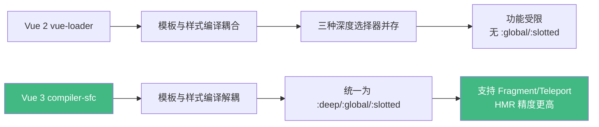
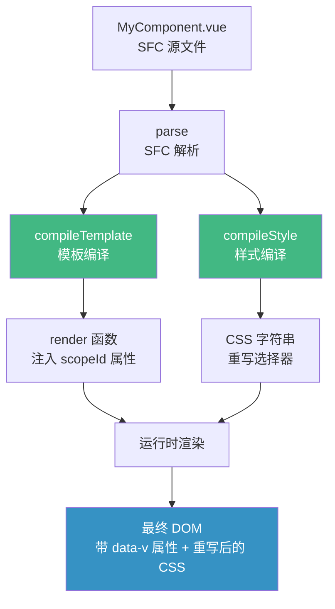
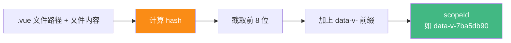
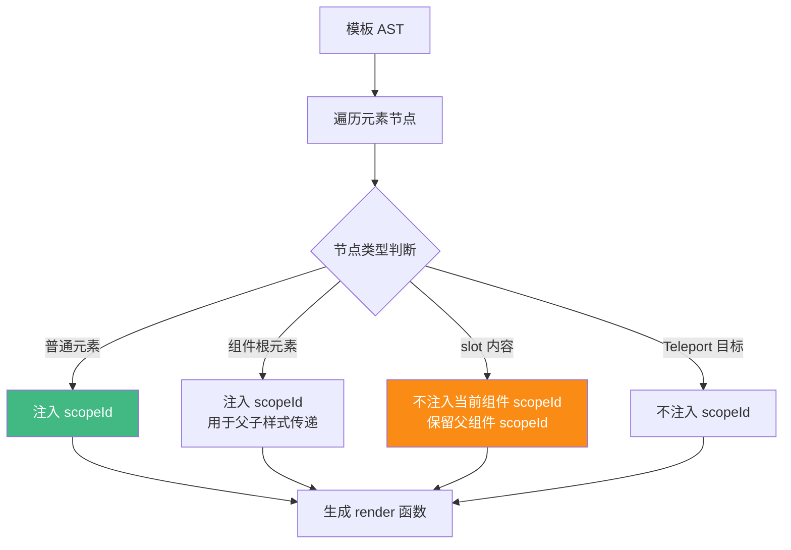
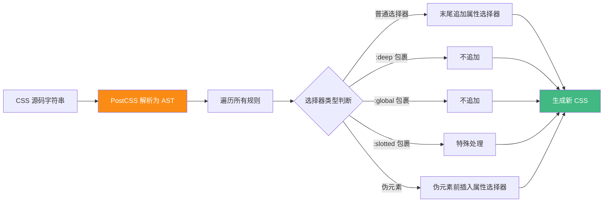
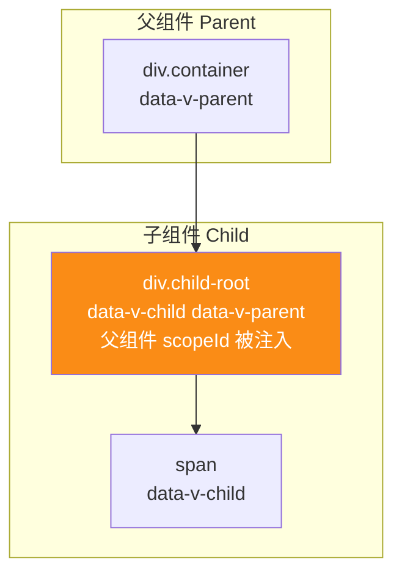
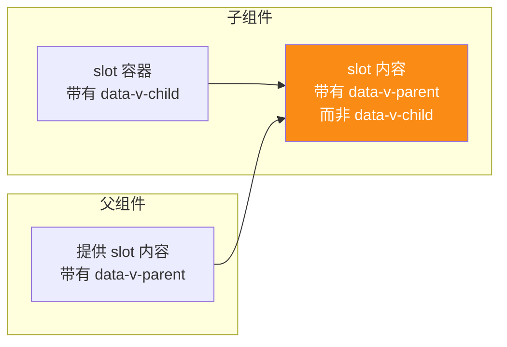
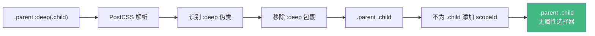
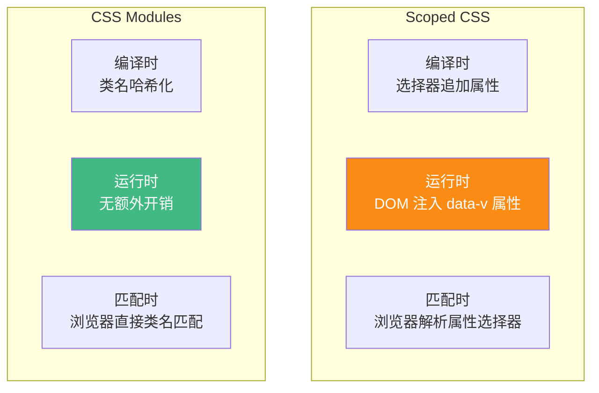

# Vue 3 Style Scoped 实现原理深度解析

> **文档定位**：本文聚焦 Vue 3 中 `<style scoped>` 特性的**实现原理**，从编译器源码层面剖析样式隔离的完整机制。涵盖 scopeId 生成算法、选择器转换规则、Vue 3 新特性边界情况、深度选择器对比、CSS Modules 对比、浏览器兼容性等深度内容。
>
> **适用读者**：Vue 3 开发者、前端架构师、需要深入理解样式隔离机制原理的工程师。
>
> **关联文档**：
> - [Vue组件作用域CSS实现原理](./Vue组件作用域CSS实现原理.md) — 通用作用域 CSS 概念与实践
> - [Vue3响应式原理深度解析](./Vue3响应式原理深度解析.md) — Vue 3 编译体系整体认知
> - [Vue3渲染过程深度解析](./Vue3渲染过程深度解析.md) — 渲染流程中的样式应用
>
> **版本基线**：Vue 3.4+ / @vue/compiler-sfc 3.4+ / Vite 5.x / PostCSS 8.x。

---

## 目录

- [一、概述](#一概述)
  - [1.1 什么是 Style Scoped](#11-什么是-style-scoped)
  - [1.2 Vue 3 相较 Vue 2 的演进](#12-vue-3-相较-vue-2-的演进)
  - [1.3 核心价值与适用场景](#13-核心价值与适用场景)
- [二、核心实现机制](#二核心实现机制)
  - [2.1 整体架构：编译时与运行时协作](#21-整体架构编译时与运行时协作)
  - [2.2 ScopeId 的生成算法](#22-scopeid-的生成算法)
  - [2.3 模板编译：属性注入流程](#23-模板编译属性注入流程)
  - [2.4 样式编译：选择器重写流程](#24-样式编译选择器重写流程)
  - [2.5 @vue/compiler-sfc 源码剖析](#25-vuecompiler-sfc-源码剖析)
- [三、编译过程中选择器转换规则](#三编译过程中选择器转换规则)
  - [3.1 转换规则总览](#31-转换规则总览)
  - [3.2 基础选择器转换](#32-基础选择器转换)
  - [3.3 组合选择器转换](#33-组合选择器转换)
  - [3.4 伪类与伪元素转换](#34-伪类与伪元素转换)
  - [3.5 媒体查询与 @supports](#35-媒体查询与-supports)
  - [3.6 @keyframes 与动画处理](#36-keyframes-与动画处理)
  - [3.7 CSS 变量与自定义属性](#37-css-变量与自定义属性)
  - [3.8 完整转换示例](#38-完整转换示例)
- [四、样式隔离的边界情况](#四样式隔离的边界情况)
  - [4.1 子组件根元素的特殊处理](#41-子组件根元素的特殊处理)
  - [4.2 Slot 内容的作用域归属](#42-slot-内容的作用域归属)
  - [4.3 动态组件与 `<component :is>`](#43-动态组件与-component-is)
  - [4.4 Teleport 传送门](#44-teleport-传送门)
  - [4.5 Suspense 与异步组件](#45-suspense-与异步组件)
  - [4.6 Fragment 多根节点](#46-fragment-多根节点)
  - [4.7 v-html 与动态内容](#47-v-html-与动态内容)
  - [4.8 第三方组件库的样式穿透](#48-第三方组件库的样式穿透)
- [五、深度选择器对比分析](#五深度选择器对比分析)
  - [5.1 `>>>` 组合器](#51--组合器)
  - [5.2 `/deep/` 组合器](#52-deep-组合器)
  - [5.3 `::v-deep` 伪元素](#53-v-deep-伪元素)
  - [5.4 `:deep()` 伪类（Vue 3 推荐）](#54-deep-伪类vue-3-推荐)
  - [5.5 `:global()` 全局选择器](#55-global-全局选择器)
  - [5.6 `:slotted()` 插槽选择器（Vue 3 新增）](#56-slotted-插槽选择器vue-3-新增)
  - [5.7 `:deep()` 与 `:global()` 编译结果对比](#57-deep-与-global-编译结果对比)
- [六、与 CSS Modules 对比分析](#六与-css-modules-对比分析)
  - [6.1 CSS Modules 实现原理](#61-css-modules-实现原理)
  - [6.2 隔离机制对比](#62-隔离机制对比)
  - [6.3 使用方式对比](#63-使用方式对比)
  - [6.4 性能与运行时开销对比](#64-性能与运行时开销对比)
  - [6.5 适用场景与选型建议](#65-适用场景与选型建议)
  - [6.6 混合使用方案](#66-混合使用方案)
- [七、浏览器兼容性考量](#七浏览器兼容性考量)
  - [7.1 属性选择器兼容性](#71-属性选择器兼容性)
  - [7.2 `:deep()` 等伪类兼容性](#72-deep-等伪类兼容性)
  - [7.3 CSS 变量兼容性](#73-css-变量兼容性)
  - [7.4 PostCSS 编译后的产物兼容性](#74-postcss-编译后的产物兼容性)
  - [7.5 兼容性优化建议](#75-兼容性优化建议)
- [八、常见问题与解决方案](#八常见问题与解决方案)
  - [8.1 样式不生效问题](#81-样式不生效问题)
  - [8.2 样式污染问题](#82-样式污染问题)
  - [8.3 性能问题](#83-性能问题)
  - [8.4 调试困难问题](#84-调试困难问题)
  - [8.5 SSR 注意事项](#85-ssr-注意事项)
- [九、最佳实践](#九最佳实践)
  - [9.1 样式组织规范](#91-样式组织规范)
  - [9.2 深度选择器使用原则](#92-深度选择器使用原则)
  - [9.3 与第三方库协作](#93-与第三方库协作)
- [十、总结与速查表](#十总结与速查表)
  - [10.1 核心要点速查](#101-核心要点速查)
  - [10.2 选择器转换速查表](#102-选择器转换速查表)
  - [10.3 深度选择器对比速查表](#103-深度选择器对比速查表)
  - [10.4 常见问题速查表](#104-常见问题速查表)

---

## 一、概述

### 1.1 什么是 Style Scoped

**Style Scoped** 是 Vue 单文件组件（SFC）提供的一种**编译时样式隔离机制**。开发者通过在 `<style>` 标签上添加 `scoped` 属性，声明该样式块仅作用于当前组件模板渲染出的 DOM 元素。

```vue
<template>
  <div class="container">
    <h1 class="title">标题</h1>
  </div>
</template>

<style scoped>
.container { padding: 20px; }
.title { color: red; }
</style>
```

编译后产物：

```html
<div class="container" data-v-7ba5db90>
  <h1 class="title" data-v-7ba5db90>标题</h1>
</div>
```

```css
.container[data-v-7ba5db90] { padding: 20px; }
.title[data-v-7ba5db90] { color: red; }
```

**核心机制三要素**：

1. **ScopeId**：组件级唯一标识（`data-v-xxxx`）
2. **模板注入**：为模板所有元素注入 ScopeId 属性
3. **选择器重写**：为 CSS 选择器追加属性选择器

### 1.2 Vue 3 相较 Vue 2 的演进

Vue 3 在 scoped 实现上做了多处优化与扩展：

| 维度 | Vue 2 | Vue 3 |
|:----|:------|:------|
| **编译器** | `vue-loader` + `vue-template-compiler` | `@vitejs/plugin-vue` / `vue-loader` + `@vue/compiler-sfc` |
| **ScopeId 长度** | 8 位 hash | 8 位 hash（算法优化） |
| **深度选择器** | `>>>`、`/deep/`、`::v-deep` | **推荐 `:deep()`**，旧语法兼容但告警 |
| **全局选择器** | 无原生支持 | **新增 `:global()`** |
| **插槽选择器** | 无 | **新增 `:slotted()`** |
| **多根节点** | 不支持 | 支持 Fragment，每个根节点都注入 ScopeId |
| **Teleport** | 无 | Teleport 内容的 ScopeId 处理 |
| **源码架构** | 模板与样式编译耦合 | 模板编译（`compileTemplate`）与样式编译（`compileStyle`）解耦 |
| **HMR 精度** | 整组件级 | 样式独立 HMR |



### 1.3 核心价值与适用场景

**核心价值**：

| 价值 | 说明 |
|:----|:----|
| **样式隔离** | 组件间样式互不污染，避免命名冲突 |
| **可移植性** | 组件自带样式，可独立迁移复用 |
| **可维护性** | 结构、逻辑、样式三合一，就近维护 |
| **零运行时** | 编译时处理，运行时无额外开销 |
| **渐进式** | 可与全局 CSS、CSS Modules 共存 |

**适用场景**：

- ✅ 业务组件、UI 组件的样式封装
- ✅ 中大型项目的样式隔离
- ✅ 组件库的样式作用域控制
- ✅ 与全局 CSS、CSS Variables 协作

**不适用场景**：

- ❌ 全局 reset/normalize 样式
- ❌ 全局工具类（如 `.text-center`）
- ❌ 需要影响子组件内部深层 DOM 的样式（应使用 `:deep()`）

---

## 二、核心实现机制

### 2.1 整体架构：编译时与运行时协作

Vue 3 的 scoped 机制是**编译时为主、运行时为辅**的协作模式：



| 阶段 | 工具 | 输入 | 输出 |
|:----|:----|:----|:----|
| **SFC 解析** | `@vue/compiler-sfc.parse` | `.vue` 源码 | descriptor 对象（template/style/script 分块） |
| **模板编译** | `@vue/compiler-sfc.compileTemplate` | template 字符串 + scopeId | render 函数（含 scopeId 注入逻辑） |
| **样式编译** | `@vue/compiler-sfc.compileStyle` | style 字符串 + scopeId | 重写后的 CSS 字符串 |
| **运行时** | `@vue/runtime-dom` | render 函数 + CSS | 渲染 DOM 并应用样式 |

### 2.2 ScopeId 的生成算法

ScopeId 是组件的唯一标识，格式为 `data-v-xxxxxxxx`（8 位十六进制）。

**生成流程**：



**实际生成逻辑**（简化版）：

```javascript
// @vue/compiler-sfc 内部简化逻辑
const crypto = require('crypto')

function genScopeId(filename, content) {
  // 1. 组合文件路径与内容
  const source = filename + '\n' + content

  // 2. 使用 md5 计算 hash
  const hash = crypto.createHash('md5').update(source).digest('hex')

  // 3. 截取前 8 位
  const shortHash = hash.slice(0, 8)

  // 4. 返回 scopeId
  return 'data-v-' + shortHash
}

// 示例输出：data-v-7ba5db90
```

**关键特性**：

| 特性 | 说明 |
|:----|:----|
| **稳定性** | 同一文件（路径+内容不变）每次构建生成的 scopeId 相同 |
| **唯一性** | 不同文件生成的 scopeId 不同（hash 碰撞概率极低） |
| **缓存友好** | 文件不变则 hash 不变，利于浏览器缓存 |
| **路径相关** | 即使内容相同，不同路径的文件 scopeId 也不同 |

> 💡 **dev 与 build 差异**：开发模式下 Vite 会在 scopeId 后追加随机后缀避免不同项目冲突；生产构建则使用稳定 hash。

### 2.3 模板编译：属性注入流程

模板编译阶段，`@vue/compiler-sfc` 会将 scopeId 注入到模板的所有元素节点：

**注入规则**：



**编译前后对比**：

```vue
<!-- 源码 -->
<template>
  <div class="container">
    <h1 class="title">标题</h1>
    <ChildComponent />
  </div>
</template>
```

```javascript
// 编译后的 render 函数（简化）
import { createElementVNode as _createElementVNode, resolveComponent as _resolveComponent, createVNode as _createVNode, Fragment as _Fragment, openBlock as _openBlock, createElementBlock as _createElementBlock } from "vue"

const _hoisted_1 = { class: "container" }
const _hoisted_2 = { class: "title" }

export function render(_ctx, _cache, $props, $setup, $data, $options) {
  const _component_ChildComponent = _resolveComponent("ChildComponent")

  return (_openBlock(), _createElementBlock("div", _hoisted_1, [
    _createElementVNode("h1", _hoisted_2, "标题"),
    _createVNode(_component_ChildComponent)
  ], 512 /* NEED_PATCH */))
}

// 关键：__scopeId 在组件选项上声明
render.__scopeId = 'data-v-7ba5db90'
```

**运行时注入原理**：

```javascript
// @vue/runtime-core 中的简化逻辑
function renderComponentRoot(instance) {
  const vnode = instance.subTree
  const { scopeId } = instance

  if (scopeId) {
    // 遍历 vnode 树，为所有元素节点添加 scopeId
    patchScopeId(vnode, scopeId)
  }

  return vnode
}

function patchScopeId(vnode, scopeId) {
  if (vnode.type === 'element' || vnode.type === 'component') {
    // 将 scopeId 合并到元素的 props 中
    vnode.props = vnode.props || {}
    vnode.props[scopeId] = ''
  }

  // 递归处理子节点
  if (vnode.children) {
    vnode.children.forEach(child => {
      if (typeof child === 'object') {
        patchScopeId(child, scopeId)
      }
    })
  }
}
```

### 2.4 样式编译：选择器重写流程

样式编译阶段，`@vue/compiler-sfc` 使用 **PostCSS** 解析 CSS AST，并对每个选择器追加属性选择器：



**简化实现**：

```javascript
const postcss = require('postcss')

function compileStyle(css, scopeId) {
  const plugin = {
    postcssPlugin: 'vue-sfc-scoped',
    Rule(rule) {
      // 跳过 @keyframes 内的规则
      if (rule.parent.type === 'atrule' && rule.parent.name === 'keyframes') {
        return
      }

      // 重写选择器
      rule.selectors = rule.selectors.map(selector => {
        return rewriteSelector(selector, scopeId)
      })
    }
  }

  return postcss([plugin]).process(css).css
}

function rewriteSelector(selector, scopeId) {
  // 解析选择器（简化，实际使用 postcss-selector-parser）
  // 1. 处理 :deep() / :global() / :slotted()
  // 2. 在最后一个复合选择器末尾追加 [scopeId]
  // 3. 伪元素前插入 [scopeId]
  // ...详细逻辑见第三章
}
```

### 2.5 @vue/compiler-sfc 源码剖析

Vue 3 的样式编译核心位于 `@vue/compiler-sfc` 包的 `compileStyle.ts` 文件。以下是关键源码结构（基于 Vue 3.4）：

```typescript
// packages/compiler-sfc/src/compileStyle.ts（简化）

import postcss, { ProcessOptions } from 'postcss'
import selectorParser from 'postcss-selector-parser'

export interface SFCStyleCompileOptions {
  source: string                  // CSS 源码
  filename: string                // 文件名
  id: string                      // scopeId（不含 data-v- 前缀）
  scoped?: boolean                // 是否启用 scoped
  preprocessLang?: string         // 预处理器语言（scss/less/stylus）
  preprocessOptions?: any         // 预处理器选项
  postcssOptions?: ProcessOptions // PostCSS 选项
  postcssPlugins?: any[]          // 额外 PostCSS 插件
}

export function compileStyle(options: SFCStyleCompileOptions) {
  const { source, filename, id, scoped, postcssOptions, postcssPlugins } = options

  // 1. 预处理（scss/less/stylus）
  const preprocessedSource = preprocess(source, options)

  // 2. 构建 PostCSS 插件链
  const plugins = [...(postcssPlugins || [])]
  if (scoped) {
    plugins.push(createScopedPlugin(id))  // 关键：scoped 插件
  }

  // 3. PostCSS 处理
  const result = postcss(plugins).process(preprocessedSource, {
    ...postcssOptions,
    from: filename,
  })

  return {
    code: result.css,
    errors: result.messages
      .filter(m => m.type === 'warning')
      .map(m => m.text),
  }
}

// scoped 插件实现
function createScopedPlugin(id: string) {
  const scopeId = `data-v-${id}`

  return {
    postcssPlugin: 'vue-scoped',
    Rule(rule) {
      const selector = rule.selector

      // 跳过 keyframes 内规则
      if (isInKeyframes(rule)) return

      // 使用 postcss-selector-parser 重写选择器
      const transformed = selectorParser(selectors => {
        selectors.each(selector => {
          rewriteSelector(selector, scopeId)
        })
      }).processSync(selector)

      rule.selector = transformed
    },
  }
}
```

**选择器重写核心逻辑**（简化）：

```typescript
function rewriteSelector(selector: selectorParser.Selector, scopeId: string) {
  selector.each(node => {
    let lastNode = null

    // 遍历选择器节点
    node.each(childNode => {
      // 处理 :deep() / :global() / :slotted()
      if (childNode.type === 'pseudo') {
        const value = childNode.value

        if (value === ':deep') {
          // :deep() 包裹的部分不添加 scopeId
          handleDeep(childNode, scopeId)
          return false  // 停止遍历
        }

        if (value === ':global') {
          // :global() 完全移除，不添加 scopeId
          childNode.remove()
          return
        }

        if (value === ':slotted') {
          // :slotted() 转换为 [scopeId] + 内容
          handleSlotted(childNode, scopeId)
          return
        }
      }

      lastNode = childNode
    })

    // 在最后一个复合选择器后追加 [scopeId]
    if (lastNode && !hasScopeId(lastNode, scopeId)) {
      // 处理伪元素：[scopeId] 必须在伪元素之前
      if (lastNode.type === 'pseudo' && lastNode.value.startsWith('::')) {
        // 伪元素前插入
        node.insertBefore(lastNode, createAttribute(scopeId))
      } else {
        // 末尾追加
        node.append(createAttribute(scopeId))
      }
    }
  })
}

function createAttribute(scopeId: string) {
  return selectorParser.attribute({
    attribute: scopeId,
  })
}
```

> 💡 **源码要点**：Vue 3 使用 `postcss-selector-parser` 处理选择器 AST，比 Vue 2 的正则匹配更精确，能正确处理复杂选择器（如 `:not()`、`:is()`、嵌套等）。

---

## 三、编译过程中选择器转换规则

### 3.1 转换规则总览

```mermaid
flowchart TB
    A[源选择器] --> B{判断类型}
    B -->|基础选择器<br/>class/id/element| C[末尾追加属性]
    B -->|后代选择器<br/>A B| D[最后一个选择器追加属性]
    B -->|伪元素<br/>::before/::after| E[伪元素前插入属性]
    B -->|伪类<br/>:hover/:focus| F[伪类后追加属性]
    B -->|:deep 包裹| G[不追加属性]
    B -->|:global 包裹| H[移除 :global,不追加]
    B -->|:slotted 包裹| I[转换为 slotted 选择器]
    B -->|媒体查询内| J[内部规则正常追加]
    B -->|@keyframes 内| K[不追加属性]

    style C fill:#42b883,color:#fff
    style G fill:#fa8c16,color:#fff
    style K fill:#f5222d,color:#fff
```

### 3.2 基础选择器转换

| 源选择器 | 编译后 | 说明 |
|:--------|:------|:----|
| `.title` | `.title[data-v-xxx]` | 类选择器追加属性 |
| `#app` | `#app[data-v-xxx]` | ID 选择器追加属性 |
| `div` | `div[data-v-xxx]` | 元素选择器追加属性 |
| `[type="text"]` | `[type="text"][data-v-xxx]` | 属性选择器追加属性 |
| `*` | `[data-v-xxx]` | 通配符被替换为属性选择器 |

```css
/* 源码 */
.title { color: red; }
#app { margin: 0; }
div { padding: 10px; }
[type="text"] { border: 1px solid #ccc; }
* { box-sizing: border-box; }

/* 编译后 */
.title[data-v-xxx] { color: red; }
#app[data-v-xxx] { margin: 0; }
div[data-v-xxx] { padding: 10px; }
[type="text"][data-v-xxx] { border: 1px solid #ccc; }
[data-v-xxx] { box-sizing: border-box; }
```

### 3.3 组合选择器转换

| 源选择器 | 编译后 | 说明 |
|:--------|:------|:----|
| `.parent .child` | `.parent .child[data-v-xxx]` | 后代选择器：仅最后一个追加 |
| `.parent > .child` | `.parent > .child[data-v-xxx]` | 子代选择器：仅最后一个追加 |
| `.a + .b` | `.a + .b[data-v-xxx]` | 相邻兄弟：仅最后一个追加 |
| `.a ~ .b` | `.a ~ .b[data-v-xxx]` | 通用兄弟：仅最后一个追加 |
| `.btn.danger` | `.btn.danger[data-v-xxx]` | 复合选择器：末尾追加 |
| `.btn, .link` | `.btn[data-v-xxx], .link[data-v-xxx]` | 选择器组：每个都追加 |

```css
/* 源码 */
.parent .child { color: red; }
.parent > .child { color: blue; }
.a + .b { margin: 5px; }
.a ~ .b { margin: 5px; }
.btn.danger { background: red; }
.btn, .link { padding: 10px; }

/* 编译后 */
.parent .child[data-v-xxx] { color: red; }
.parent > .child[data-v-xxx] { color: blue; }
.a + .b[data-v-xxx] { margin: 5px; }
.a ~ .b[data-v-xxx] { margin: 5px; }
.btn.danger[data-v-xxx] { background: red; }
.btn[data-v-xxx], .link[data-v-xxx] { padding: 10px; }
```

### 3.4 伪类与伪元素转换

**核心规则**：属性选择器必须插入在**伪元素之前**，因为伪元素表示实际渲染的"虚拟元素"，而属性选择器作用于宿主元素。

| 源选择器 | 编译后 | 说明 |
|:--------|:------|:----|
| `.btn:hover` | `.btn[data-v-xxx]:hover` | 伪类后追加 |
| `.btn:focus-visible` | `.btn[data-v-xxx]:focus-visible` | 伪类后追加 |
| `.btn::before` | `.btn[data-v-xxx]::before` | **伪元素前插入** |
| `.btn::after` | `.btn[data-v-xxx]::after` | **伪元素前插入** |
| `.btn:first-child` | `.btn[data-v-xxx]:first-child` | 伪类后追加 |
| `.btn::before:hover` | 不合法（伪元素后不能接伪类） | — |

```css
/* 源码 */
.btn:hover { background: #f5f5f5; }
.btn:focus-visible { outline: 2px solid blue; }
.item::before { content: ''; }
.item::after { content: '★'; }
.btn:first-child { border-left: none; }

/* 编译后 */
.btn[data-v-xxx]:hover { background: #f5f5f5; }
.btn[data-v-xxx]:focus-visible { outline: 2px solid blue; }
.item[data-v-xxx]::before { content: ''; }
.item[data-v-xxx]::after { content: '★'; }
.btn[data-v-xxx]:first-child { border-left: none; }
```

> ⚠️ **关键理解**：`.btn:hover` 编译为 `.btn[data-v-xxx]:hover`，而非 `.btn:hover[data-v-xxx]`。这是因为属性选择器和伪类同优先级，但属性选择器放在伪类前更符合 CSS 规范语义（先匹配元素，再判断伪类状态）。

### 3.5 媒体查询与 @supports

媒体查询和支持查询**不影响内部选择器的转换**，内部规则按正常逻辑处理：

```css
/* 源码 */
@media (max-width: 768px) {
  .container { padding: 10px; }
  .title { font-size: 14px; }
}

@supports (display: grid) {
  .grid { display: grid; }
}

/* 编译后 */
@media (max-width: 768px) {
  .container[data-v-xxx] { padding: 10px; }
  .title[data-v-xxx] { font-size: 14px; }
}

@supports (display: grid) {
  .grid[data-v-xxx] { display: grid; }
}
```

### 3.6 @keyframes 与动画处理

**`@keyframes` 规则本身不被添加属性选择器**（因为 keyframes 是动画定义，不作用于元素），但**使用动画的元素选择器仍会正常处理**。

```css
/* 源码 */
@keyframes fadeIn {
  from { opacity: 0; }
  to { opacity: 1; }
}

.fade-box {
  animation: fadeIn 1s ease;
}

/* 编译后 */
@keyframes fadeIn {
  from { opacity: 0; }
  to { opacity: 1; }
}

.fade-box[data-v-xxx] {
  animation: fadeIn 1s ease;
}
```

**特殊处理：动画名冲突**

如果多个组件都定义了 `@keyframes fadeIn`，由于 keyframes 不被 scoped 隔离，会导致全局冲突。Vue 3 不自动处理此问题，需要开发者手动命名：

```css
/* 推荐：使用组件特定前缀 */
@keyframes my-component-fade-in {
  from { opacity: 0; }
  to { opacity: 1; }
}
```

### 3.7 CSS 变量与自定义属性

CSS 变量（自定义属性）声明在 `:root` 或元素上，作用域机制按普通规则处理：

```css
/* 源码 */
.container {
  --primary-color: #409eff;
  --spacing: 16px;
}

.title {
  color: var(--primary-color);
  padding: var(--spacing);
}

:root {
  --global-color: #333;
}

/* 编译后 */
.container[data-v-xxx] {
  --primary-color: #409eff;
  --spacing: 16px;
}

.title[data-v-xxx] {
  color: var(--primary-color);
  padding: var(--spacing);
}

/* :root 不被添加 scopeId，因为 :root 是全局的 */
:root {
  --global-color: #333;
}
```

> 💡 **关键特性**：CSS 变量可以**穿透作用域边界**。父组件在元素上定义的 CSS 变量，子组件内部可以正常读取。这是实现父子组件样式通信的推荐方式。

### 3.8 完整转换示例

```vue
<!-- MyComponent.vue -->
<template>
  <div class="container">
    <h1 class="title" id="main-title">标题</h1>
    <button class="btn danger">按钮</button>
    <ul class="list">
      <li class="item">项目 1</li>
      <li class="item">项目 2</li>
    </ul>
  </div>
</template>

<style scoped>
/* 基础选择器 */
.container { padding: 20px; }
.title { color: #333; }
#main-title { font-size: 24px; }

/* 组合选择器 */
.list .item { padding: 8px; }
.list > .item:first-child { border-top: none; }

/* 伪类与伪元素 */
.btn:hover { background: #f5f5f5; }
.item::before { content: '•'; margin-right: 8px; }
.btn::after { content: ''; display: block; clear: both; }

/* 复合选择器 */
.btn.danger { background: #ff4d4f; color: white; }

/* 选择器组 */
.btn, .item { font-size: 14px; }

/* 媒体查询 */
@media (max-width: 768px) {
  .container { padding: 10px; }
  .title { font-size: 18px; }
}

/* 动画 */
@keyframes slideIn {
  from { transform: translateX(-100%); }
  to { transform: translateX(0); }
}

.container {
  animation: slideIn 0.3s ease;
}

/* CSS 变量 */
.container {
  --primary: #1890ff;
}
.title {
  color: var(--primary);
}
</style>
```

**编译后产物**（scopeId 假设为 `7ba5db90`）：

```css
.container[data-v-7ba5db90] { padding: 20px; }
.title[data-v-7ba5db90] { color: #333; }
#main-title[data-v-7ba5db90] { font-size: 24px; }

.list .item[data-v-7ba5db90] { padding: 8px; }
.list > .item[data-v-7ba5db90]:first-child { border-top: none; }

.btn[data-v-7ba5db90]:hover { background: #f5f5f5; }
.item[data-v-7ba5db90]::before { content: '•'; margin-right: 8px; }
.btn[data-v-7ba5db90]::after { content: ''; display: block; clear: both; }

.btn.danger[data-v-7ba5db90] { background: #ff4d4f; color: white; }

.btn[data-v-7ba5db90], .item[data-v-7ba5db90] { font-size: 14px; }

@media (max-width: 768px) {
  .container[data-v-7ba5db90] { padding: 10px; }
  .title[data-v-7ba5db90] { font-size: 18px; }
}

@keyframes slideIn {
  from { transform: translateX(-100%); }
  to { transform: translateX(0); }
}

.container[data-v-7ba5db90] {
  animation: slideIn 0.3s ease;
}

.container[data-v-7ba5db90] {
  --primary: #1890ff;
}
.title[data-v-7ba5db90] {
  color: var(--primary);
}
```

```html
<!-- 编译后的 HTML -->
<div class="container" data-v-7ba5db90>
  <h1 class="title" id="main-title" data-v-7ba5db90>标题</h1>
  <button class="btn danger" data-v-7ba5db90>按钮</button>
  <ul class="list" data-v-7ba5db90>
    <li class="item" data-v-7ba5db90>项目 1</li>
    <li class="item" data-v-7ba5db90>项目 2</li>
  </ul>
</div>
```

---

## 四、样式隔离的边界情况

### 4.1 子组件根元素的特殊处理

**核心规则**：子组件的根元素会被**同时注入父组件和自身的 scopeId**，使父组件可以通过普通选择器影响子组件根元素。



```vue
<!-- Parent.vue -->
<template>
  <div class="parent">
    <Child class="child-root" />
  </div>
</template>

<style scoped>
/* 父组件可以影响子组件根元素 */
.child-root {
  margin: 10px;
  /* ✅ 生效：子组件根元素有 data-v-parent */
}

/* 但无法影响子组件内部元素 */
.child-root .inner {
  color: red;
  /* ❌ 不生效：.inner 没有父组件 scopeId */
  /* 编译后：.child-root .inner[data-v-parent] */
  /* .inner 元素只有 data-v-child，没有 data-v-parent */
}
</style>
```

```vue
<!-- Child.vue -->
<template>
  <div class="child-root">
    <span class="inner">内容</span>
  </div>
</template>
```

**编译后的 DOM**：

```html
<div class="parent" data-v-parent>
  <div class="child-root" data-v-child data-v-parent>
    <!-- 根元素同时有两个 scopeId -->
    <span class="inner" data-v-child>内容</span>
    <!-- 内部元素只有子组件 scopeId -->
  </div>
</div>
```

### 4.2 Slot 内容的作用域归属

**核心规则**：slot 内容（由父组件提供）使用**父组件的 scopeId**，而非子组件的 scopeId。



```vue
<!-- Parent.vue -->
<template>
  <Child>
    <div class="slot-content">由父组件提供的内容</div>
  </Child>
</template>

<style scoped>
/* ✅ 生效：slot 内容有父组件 scopeId */
.slot-content {
  color: red;
}
</style>
```

```vue
<!-- Child.vue -->
<template>
  <div class="child-wrapper">
    <slot />
  </div>
</template>

<style scoped>
/* ❌ 不生效：slot 内容没有子组件 scopeId */
.slot-content {
  font-size: 20px;
}
</style>
```

**Vue 3 新增 `:slotted()` 选择器**：子组件可以专门为 slot 内容定义样式：

```vue
<!-- Child.vue -->
<style scoped>
/* ✅ 生效：:slotted() 专门处理 slot 内容 */
:slotted(.slot-content) {
  font-size: 20px;
  color: blue;
}
</style>
```

编译后：

```css
.slot-content[data-v-child] {
  font-size: 20px;
  color: blue;
}
```

### 4.3 动态组件与 `<component :is>`

动态组件切换时，每个组件的 scopeId 独立处理，切换后旧组件的 DOM 被卸载，新组件的 DOM 被挂载并注入新 scopeId：

```vue
<template>
  <component :is="currentComponent" />
</template>
```

**特性**：

- 切换组件时，新组件的 DOM 自动获得其自身的 scopeId
- 样式互不干扰
- 无需特殊处理

### 4.4 Teleport 传送门

`<Teleport>` 将内容渲染到 DOM 树的其他位置，但**样式作用域仍然归属于定义 Teleport 的组件**：

```vue
<!-- MyComponent.vue -->
<template>
  <div class="container">
    <Teleport to="body">
      <div class="modal">模态框</div>
    </Teleport>
  </div>
</template>

<style scoped>
/* ✅ 生效：Teleport 内容仍带有当前组件 scopeId */
.modal {
  position: fixed;
  top: 50%;
  left: 50%;
  transform: translate(-50%, -50%);
  background: white;
  padding: 20px;
}
</style>
```

**编译后的 DOM**：

```html
<!-- body 下 -->
<div class="modal" data-v-xxx>模态框</div>
```

**原理**：Teleport 在虚拟节点层面携带 scopeId，渲染时仍然注入。

### 4.5 Suspense 与异步组件

Suspense 包裹的异步组件，其样式作用域正常工作：

```vue
<template>
  <Suspense>
    <template #default>
      <AsyncComponent />
    </template>
    <template #fallback>
      <div class="loading">加载中...</div>
    </template>
  </Suspense>
</template>

<style scoped>
/* fallback 内容有当前组件 scopeId */
.loading { color: #999; }
</style>
```

异步组件加载完成后，其内部样式正常隔离。

### 4.6 Fragment 多根节点

Vue 3 支持组件有多个根节点。每个根节点都会被注入 scopeId，使父组件可以影响所有根节点：

```vue
<!-- Child.vue (多根节点) -->
<template>
  <header class="header">头部</header>
  <main class="main">主体</main>
  <footer class="footer">尾部</footer>
</template>
```

```vue
<!-- Parent.vue -->
<template>
  <Child class="my-child" />
</template>

<style scoped>
/* ✅ 生效：父组件的 class 会应用到子组件所有根节点 */
:deep(.header) {
  background: #f5f5f5;
}
</style>
```

> ⚠️ **注意**：Vue 3 中，父组件给多根子组件传递 class 时，需使用 `$attrs` 显式接收，或子组件每个根节点都使用 `v-bind="$attrs"`。

### 4.7 v-html 与动态内容

通过 `v-html` 注入的 HTML **不会被注入 scopeId**，因此 scoped 样式无法直接作用于这些内容：

```vue
<template>
  <div class="container" v-html="htmlContent"></div>
</template>

<script setup>
const htmlContent = '<p class="dynamic-text">动态内容</p>'
</script>

<style scoped>
/* ❌ 不生效：v-html 内容没有 scopeId */
.dynamic-text {
  color: red;
}

/* ✅ 生效：容器本身有 scopeId，可影响其样式 */
.container {
  color: red;  /* 继承到动态内容 */
}

/* ✅ 生效：使用 :deep() 穿透 */
:deep(.dynamic-text) {
  color: red;
}
</style>
```

### 4.8 第三方组件库的样式穿透

修改 Element Plus、Ant Design Vue 等组件库样式时，必须使用 `:deep()`：

```vue
<template>
  <div class="page">
    <el-table :data="data">
      <el-table-column prop="name" label="名称" />
    </el-table>
  </div>
</template>

<style scoped>
/* ❌ 不生效：el-table 内部元素没有当前组件 scopeId */
.el-table .el-table__header {
  background: #f5f5f5;
}

/* ✅ 生效：使用 :deep() 穿透 */
:deep(.el-table .el-table__header) {
  background: #f5f5f5;
}

/* ✅ 推荐：更精确的选择器 */
.page :deep(.el-table__header) {
  background: #f5f5f5;
}
</style>
```

---

## 五、深度选择器对比分析

### 5.1 `>>>` 组合器

**历史**：Vue 2 早期提供的深度选择器语法。

```css
/* 语法 */
.parent >>> .child {
  color: red;
}
```

**问题**：

- ❌ Sass/SCSS 预处理器无法识别 `>>>`（被解析为 Sass 操作符）
- ❌ Less 也存在兼容问题
- ❌ 现代 CSS 中 `>>>` 不是合法语法

**编译结果**：

```css
.parent .child {
  color: red;
}
```

### 5.2 `/deep/` 组合器

**历史**：作为 `>>>` 的替代品，兼容预处理器。

```css
.parent /deep/ .child {
  color: red;
}
```

**问题**：

- ❌ `/deep/` 是 Chrome 废弃的语法，浏览器控制台会告警
- ❌ Vue 3 中已标记为废弃，但仍兼容

**编译结果**：

```css
.parent .child {
  color: red;
}
```

### 5.3 `::v-deep` 伪元素

**历史**：Vue 官方推荐的改良语法，兼容所有预处理器。

```css
/* 写法 1：伪元素形式 */
.parent ::v-deep .child {
  color: red;
}

/* 写法 2：伪类形式（Vue 2.7+） */
.parent ::v-deep(.child) {
  color: red;
}
```

**问题**：

- ⚠️ Vue 3 中仍兼容但**已标记为废弃**，控制台会输出告警
- ⚠️ 与 CSS 规范的伪元素语法混淆

**编译结果**：

```css
.parent .child {
  color: red;
}
```

### 5.4 `:deep()` 伪类（Vue 3 推荐）

**现状**：Vue 3 官方推荐的深度选择器语法，使用标准伪类形式。

```css
/* 推荐写法 */
.parent :deep(.child) {
  color: red;
}

/* 也可作用于复合选择器 */
.parent :deep(.child .grandchild) {
  color: red;
}

/* 嵌套写法 */
.parent {
  :deep(.child) {
    color: red;
  }
}
```

**优势**：

- ✅ 使用标准伪类语法，符合 CSS 规范
- ✅ 兼容所有预处理器（Sass/Less/Stylus）
- ✅ 明确的参数包裹，避免歧义
- ✅ Vue 3 官方推荐，无废弃告警

**编译原理**：



**编译结果**：

```css
/* :deep 包裹的部分不添加 scopeId */
.parent .child {
  color: red;
}
```

**`:deep()` 前后选择器的差异**：

```css
/* 源码 */
.parent :deep(.child) .sibling {
  color: red;
}

/* 编译后 */
/* .parent 添加 scopeId，:deep 内的 .child 不添加，
   :deep 之后的 .sibling 又会添加 scopeId */
.parent[data-v-xxx] .child .sibling[data-v-xxx] {
  color: red;
}
```

### 5.5 `:global()` 全局选择器

**作用**：在 scoped 样式块中声明全局样式，选择器完全不添加 scopeId。

```css
/* 源码 */
:global(.global-text) {
  color: red;
}

.parent :global(.child) {
  color: blue;
}
```

```css
/* 编译后 */
.global-text {
  color: red;
}

.parent[data-v-xxx] .child {
  color: blue;
}
```

**与 `:deep()` 的区别**：

| 特性 | `:deep()` | `:global()` |
|:----|:---------|:-----------|
| **作用范围** | 仅 `:deep()` 包裹的部分不添加 scopeId | `:global()` 包裹的部分及**之后的所有选择器**都不添加 scopeId |
| **前置选择器** | 仍添加 scopeId | 仍添加 scopeId（除非也在 `:global()` 内） |
| **后置选择器** | 仍添加 scopeId | **不添加 scopeId** |
| **典型用途** | 父组件影响子组件内部 | 在 scoped 中定义全局样式 |

### 5.6 `:slotted()` 插槽选择器（Vue 3 新增）

**作用**：子组件为父组件提供的 slot 内容定义样式。

```vue
<!-- Child.vue -->
<template>
  <div class="child">
    <slot />
  </div>
</template>

<style scoped>
/* ✅ 生效：为 slot 内容定义样式 */
:slotted(.slot-content) {
  color: red;
  font-size: 16px;
}

/* 也可作用于复合选择器 */
:slotted(.slot-content .inner) {
  color: blue;
}
</style>
```

**编译原理**：

```css
/* 源码 */
:slotted(.slot-content) {
  color: red;
}

/* 编译后 */
.slot-content[data-v-child] {
  color: red;
}
```

> 💡 **关键**：`:slotted()` 编译后给 slot 内容添加的是**子组件的 scopeId**，而非父组件的。这使得子组件可以影响父组件传入的内容。

### 5.7 `:deep()` 与 `:global()` 编译结果对比

```css
/* 假设当前组件 scopeId 为 data-v-xxx */

/* 场景 1：普通 scoped */
.parent .child { color: red; }
/* 编译后 */
.parent .child[data-v-xxx] { color: red; }

/* 场景 2：使用 :deep() */
.parent :deep(.child) { color: red; }
/* 编译后 */
.parent[data-v-xxx] .child { color: red; }

/* 场景 3：使用 :global() */
:global(.parent) .child { color: red; }
/* 编译后 */
.parent .child[data-v-xxx] { color: red; }

/* 场景 4：:global() 包裹全部 */
:global(.parent .child) { color: red; }
/* 编译后 */
.parent .child { color: red; }

/* 场景 5：组合使用 */
.parent :deep(.child) :global(.sibling) {
  color: red;
}
/* 编译后 */
.parent[data-v-xxx] .child .sibling { color: red; }
```

---

## 六、与 CSS Modules 对比分析

### 6.1 CSS Modules 实现原理

CSS Modules 通过**类名哈希化**实现样式隔离：编译时将类名转换为唯一的哈希名。

```vue
<template>
  <div :class="$style.container">
    <h1 :class="$style.title">标题</h1>
  </div>
</template>

<style module>
.container { padding: 20px; }
.title { color: red; }
</style>
```

**编译后**：

```html
<div class="_container_1a2b3_4">
  <h1 class="_title_1a2b3_5">标题</h1>
</div>
```

```css
._container_1a2b3_4 { padding: 20px; }
._title_1a2b3_5 { color: red; }
```

### 6.2 隔离机制对比

| 维度 | Scoped CSS | CSS Modules |
|:----|:----------|:-----------|
| **隔离方式** | 属性选择器 `[data-v-xxx]` | 类名哈希化 |
| **DOM 影响** | 添加 `data-v-xxx` 属性 | 替换类名 |
| **CSS 选择器** | 选择器追加属性选择器 | 类名直接替换 |
| **编译产物体积** | 较大（每个选择器有 `[data-v-xxx]`） | 较小（类名变长但无额外属性） |
| **作用域边界** | 子组件根元素被父组件影响 | 完全隔离，无父子影响 |
| **全局样式** | 通过 `:global()` 声明 | 通过 `:global` 类名声明 |

### 6.3 使用方式对比

**Scoped CSS**：

```vue
<template>
  <!-- 直接使用类名 -->
  <div class="container">
    <h1 class="title">标题</h1>
  </div>
</template>

<style scoped>
.container { padding: 20px; }
.title { color: red; }
</style>
```

**CSS Modules**：

```vue
<template>
  <!-- 必须通过 $style 对象引用 -->
  <div :class="$style.container">
    <h1 :class="$style.title">标题</h1>
  </div>
</template>

<style module>
.container { padding: 20px; }
.title { color: red; }
</style>
```

**CSS Modules 在 `<script setup>` 中的使用**：

```vue
<template>
  <div :class="[styles.container, { [styles.active]: isActive }]">
    内容
  </div>
</template>

<script setup>
import { ref } from 'vue'
const isActive = ref(false)

// 直接访问 useCssModule
import { useCssModule } from 'vue'
const styles = useCssModule()
</script>

<style module>
.container { padding: 20px; }
.active { background: #1890ff; }
</style>
```

### 6.4 性能与运行时开销对比



| 维度 | Scoped CSS | CSS Modules |
|:----|:----------|:-----------|
| **编译开销** | 中（PostCSS 处理选择器） | 低（仅类名替换） |
| **运行时开销** | 有（vnode patch 时注入属性） | 无 |
| **DOM 体积** | 较大（每个元素多一个属性） | 较小（仅类名变长） |
| **CSS 体积** | 较大（每个选择器多 `[data-v-xxx]`） | 较小 |
| **选择器匹配速度** | 稍慢（属性选择器比类选择器慢） | 快（纯类选择器） |
| **HMR 精度** | 整样式块 | 单类名级（更精细） |

### 6.5 适用场景与选型建议

| 场景 | 推荐 | 原因 |
|:----|:----|:----|
| **业务组件开发** | Scoped CSS | 使用简单，无需 `$style` 引用 |
| **UI 组件库** | CSS Modules | 隔离更彻底，避免使用者覆盖 |
| **需要动态类名** | CSS Modules | 通过 JS 引用更灵活 |
| **TypeScript 项目** | CSS Modules | 类型推导更好 |
| **简单业务** | Scoped CSS | 上手成本低 |
| **需要影响子组件根元素** | Scoped CSS | CSS Modules 完全隔离 |

### 6.6 混合使用方案

```vue
<template>
  <!-- 基础布局用 scoped，动态样式用 module -->
  <div class="container" :class="$style.dynamic">
    <h1 class="title">标题</h1>
  </div>
</template>

<style scoped>
/* 静态样式 */
.container { padding: 20px; }
.title { color: #333; }
</style>

<style module>
/* 动态样式：通过 JS 控制 */
.dynamic { transition: all 0.3s; }
</style>

<script setup>
import { useCssModule } from 'vue'
const $style = useCssModule()
</script>
```

---

## 七、浏览器兼容性考量

### 7.1 属性选择器兼容性

Scoped CSS 依赖 `[data-v-xxx]` 属性选择器，兼容性如下：

| 浏览器 | 最低支持版本 | 兼容性 |
|:-------|:----------|:------|
| Chrome | 4+ | ✅ 完全支持 |
| Firefox | 2+ | ✅ 完全支持 |
| Safari | 3.1+ | ✅ 完全支持 |
| Edge | 12+ | ✅ 完全支持 |
| IE | 7+（部分）/ 9+（完整） | ⚠️ IE 7-8 不支持 `[attr^=val]` 等复杂匹配 |
| iOS Safari | 3.2+ | ✅ 完全支持 |
| Android Browser | 2.1+ | ✅ 完全支持 |

> 💡 **结论**：属性选择器兼容性极好，现代浏览器全部支持，Vue 3 本身要求 IE11+，因此无兼容问题。

### 7.2 `:deep()` 等伪类兼容性

**关键理解**：`:deep()`、`:global()`、`:slotted()` 是**编译时伪类**，编译后会被移除，**运行时浏览器看不到这些伪类**，因此**无浏览器兼容性问题**。

```css
/* 源码（Vue 3 语法） */
.parent :deep(.child) { color: red; }

/* 编译后（标准 CSS） */
.parent[data-v-xxx] .child { color: red; }
```

编译后的 CSS 使用标准属性选择器，兼容性与 7.1 相同。

### 7.3 CSS 变量兼容性

CSS 变量（自定义属性）穿透作用域的能力依赖浏览器原生支持：

| 浏览器 | 最低支持版本 |
|:-------|:----------|
| Chrome | 49+ |
| Firefox | 31+ |
| Safari | 9.1+ |
| Edge | 15+ |
| IE | ❌ 不支持 |

> ⚠️ **注意**：Vue 3 已放弃 IE 支持，因此 CSS 变量无兼容问题。但如果项目需要兼容 IE，则不能使用 CSS 变量穿透。

### 7.4 PostCSS 编译后的产物兼容性

Scoped CSS 编译后使用的 CSS 特性：

| 特性 | 编译后是否使用 | 兼容性 |
|:----|:------------|:------|
| 属性选择器 `[attr]` | ✅ | 极好（IE7+） |
| 类选择器 `.class` | ✅ | 极好 |
| ID 选择器 `#id` | ✅ | 极好 |
| 后代选择器 `A B` | ✅ | 极好 |
| 伪类 `:hover` 等 | ✅ | 极好 |
| 伪元素 `::before` | ✅ | IE9+ |
| CSS 变量 `var()` | 视源码而定 | 现代浏览器 |

### 7.5 兼容性优化建议

**1. 避免使用兼容性差的选择器**：

```css
/* ❌ 不推荐：:is() 兼容性较差 */
:is(.a, .b) .c { color: red; }

/* ✅ 推荐：展开为选择器组 */
.a .c, .b .c { color: red; }
```

**2. 使用 PostCSS autoprefixer 自动添加前缀**：

```javascript
// vite.config.js
export default {
  css: {
    postcss: {
      plugins: [
        require('autoprefixer')({
          overrideBrowserslist: ['> 1%', 'last 2 versions'],
        }),
      ],
    },
  },
}
```

**3. 谨慎使用 CSS 变量穿透**：

```vue
<!-- 如果项目需要兼容旧浏览器，避免使用 CSS 变量穿透 -->
<style scoped>
/* ❌ 旧浏览器不支持 */
.child {
  color: var(--parent-color);
}
</style>
```

---

## 八、常见问题与解决方案

### 8.1 样式不生效问题

**问题 1：scoped 样式对子组件不生效**

```vue
<!-- Parent.vue -->
<template>
  <Child class="child" />
</template>

<style scoped>
.child { color: red; }  /* ❌ 不生效 */
</style>
```

**原因**：子组件内部元素没有父组件 scopeId。

**解决**：

```vue
<style scoped>
/* ✅ 方案 1：使用 :deep() */
:deep(.child) { color: red; }

/* ✅ 方案 2：影响子组件根元素（仅根元素生效） */
.child { color: red; }
</style>
```

**问题 2：第三方组件样式修改不生效**

```vue
<style scoped>
.el-table th { background: red; }  /* ❌ 不生效 */
</style>
```

**解决**：

```vue
<style scoped>
:deep(.el-table th) { background: red; }  /* ✅ */
</style>
```

**问题 3：动态生成的 class 不生效**

```vue
<template>
  <div :class="dynamicClass">内容</div>
</template>

<script setup>
const dynamicClass = 'dynamic-text'
</script>

<style scoped>
.dynamic-text { color: red; }  /* ✅ 生效：动态 class 也会注入 scopeId */
</style>
```

### 8.2 样式污染问题

**问题 1：全局样式被 scoped 覆盖**

```css
/* global.css */
.title { color: blue; }

/* MyComponent.vue */
<style scoped>
.title { color: red; }  /* 优先级高于全局 */
</style>
```

**原因**：`.title[data-v-xxx]` 比 `.title` 优先级高（多一个属性选择器）。

**解决**：

```css
/* 方案 1：全局样式提高优先级 */
h1.title { color: blue; }  /* 元素 + 类 > 类 + 属性 */

/* 方案 2：使用 !important（不推荐） */
.title { color: blue !important; }

/* 方案 3：调整加载顺序，让全局样式后加载 */
```

**问题 2：@keyframes 全局污染**

```css
/* ComponentA.vue */
<style scoped>
@keyframes fadeIn { from { opacity: 0; } to { opacity: 1; } }
.box { animation: fadeIn 1s; }
</style>

/* ComponentB.vue（同样定义 fadeIn） */
<style scoped>
@keyframes fadeIn { from { transform: scale(0); } to { transform: scale(1); } }
.box { animation: fadeIn 1s; }
</style>
```

**原因**：`@keyframes` 不被 scoped 隔离，全局生效，后加载的覆盖前者。

**解决**：使用组件特定前缀命名动画。

```css
@keyframes component-a-fade-in { ... }
```

### 8.3 性能问题

**问题 1：选择器过长导致匹配慢**

```css
/* ❌ 不推荐：选择器链过长 */
.page .container .wrapper .content .box .title {
  color: red;
}
```

**解决**：简化选择器，使用 BEM 命名。

```css
.box-title { color: red; }
```

**问题 2：大量使用 `:deep()` 导致样式匹配范围过大**

```css
/* ❌ 不推荐 */
:deep(*) { margin: 0; }
```

**解决**：精确指定穿透元素。

```css
:deep(.specific-element) { margin: 0; }
```

### 8.4 调试困难问题

**问题：scoped 样式难以调试**

**原因**：浏览器开发者工具中看到的是编译后的选择器（`.title[data-v-xxx]`），不易关联源码。

**解决**：

```javascript
// vite.config.js 开启 sourcemap
export default {
  css: {
    devSourcemap: true,  // Vue 3 + Vite 支持 CSS sourcemap
  },
}
```

开启后，开发者工具中可直接定位到 `.vue` 源文件的对应样式行。

### 8.5 SSR 注意事项

**问题：SSR 中 scoped 样式闪烁**

**原因**：SSR 渲染的 HTML 已包含 `data-v-xxx` 属性，但 CSS 在客户端 hydration 前可能未加载完成。

**解决**：

```javascript
// vite.config.js
export default {
  ssr: {
    noExternal: ['vue'],  // 确保 Vue 自身被 SSR 处理
  },
  build: {
    cssCodeSplit: false,  // 关闭 CSS 代码分割，确保样式统一加载
  },
}
```

**或者使用 critical CSS 提取**：

```javascript
// 使用 vite-plugin-critical 提取首屏关键 CSS
import critical from 'rollup-plugin-critical'

export default {
  plugins: [
    critical({
      criticalUrl: 'http://localhost:3000',
      criticalBase: './dist/',
      criticalPages: [{ uri: '/' }],
    }),
  ],
}
```

---

## 九、最佳实践

### 9.1 样式组织规范

**1. 优先使用 BEM 命名规范**：

```vue
<style scoped lang="scss">
.my-component {
  padding: 20px;

  &__header {
    border-bottom: 1px solid #eee;
  }

  &__title {
    font-size: 18px;
    color: #333;

    &--large {
      font-size: 24px;
    }
  }

  &__body {
    padding: 16px 0;
  }
}
</style>
```

**2. CSS 变量实现主题化**：

```vue
<!-- 父组件 -->
<template>
  <div :style="{ '--theme-color': theme }">
    <Child />
  </div>
</template>

<script setup>
import { ref } from 'vue'
const theme = ref('#1890ff')
</script>
```

```vue
<!-- 子组件 -->
<style scoped>
.child {
  color: var(--theme-color);  /* 穿透作用域 */
}
</style>
```

### 9.2 深度选择器使用原则

**原则 1：能不穿透就不穿透**

```css
/* ❌ 优先考虑在子组件内修改样式 */
:deep(.child-button) { padding: 10px; }

/* ✅ 在子组件内直接修改 */
/* Child.vue */
<style scoped>
.button { padding: 10px; }
</style>
```

**原则 2：精确指定穿透范围**

```css
/* ❌ 不推荐：范围过大 */
:deep(.el-table) { ... }

/* ✅ 推荐：精确到具体元素 */
.page :deep(.el-table .el-table__header) { ... }
```

**原则 3：优先使用 CSS 变量替代 `:deep()`**

```css
/* ❌ 不推荐 */
:deep(.el-button) {
  background: var(--primary-color);
}

/* ✅ 推荐（如果第三方组件支持 CSS 变量） */
.parent {
  --el-button-bg: var(--primary-color);
}
```

### 9.3 与第三方库协作

**1. 优先使用组件库提供的 API**：

```vue
<template>
  <!-- ✅ 优先使用 props -->
  <el-button type="primary" size="large">按钮</el-button>
</template>
```

**2. 使用 CSS 变量定制主题**：

```vue
<template>
  <div class="page">
    <el-button>按钮</el-button>
  </div>
</template>

<style scoped>
/* Element Plus 支持 CSS 变量定制 */
.page {
  --el-color-primary: #1890ff;
}
</style>
```

**3. 必要时使用 `:deep()`**：

```vue
<style scoped>
/* 精确穿透 */
.page :deep(.el-button--primary) {
  background: var(--primary-color);
}
</style>
```

---

## 十、总结与速查表

### 10.1 核心要点速查

| 要点 | 说明 |
|:----|:----|
| **实现机制** | 编译时注入 scopeId + 重写 CSS 选择器 |
| **ScopeId 格式** | `data-v-` + 8 位 hash |
| **模板注入** | 所有元素节点注入 scopeId |
| **选择器重写** | 末尾追加 `[data-v-xxx]`，伪元素前插入 |
| **Vue 3 推荐** | `:deep()` / `:global()` / `:slotted()` |
| **运行时开销** | 有（vnode patch 注入属性） |
| **CSS 变量穿透** | 支持，可跨作用域传递 |

### 10.2 选择器转换速查表

| 源选择器 | 编译后 |
|:--------|:------|
| `.title` | `.title[data-v-xxx]` |
| `#app` | `#app[data-v-xxx]` |
| `div` | `div[data-v-xxx]` |
| `.parent .child` | `.parent .child[data-v-xxx]` |
| `.btn:hover` | `.btn[data-v-xxx]:hover` |
| `.item::before` | `.item[data-v-xxx]::before` |
| `.btn.danger` | `.btn.danger[data-v-xxx]` |
| `.a, .b` | `.a[data-v-xxx], .b[data-v-xxx]` |
| `@media (...) { .x }` | `@media (...) { .x[data-v-xxx] }` |
| `@keyframes x` | `@keyframes x`（不变） |
| `:root { --x }` | `:root { --x }`（不变） |

### 10.3 深度选择器对比速查表

| 语法 | Vue 版本 | 兼容预处理器 | 状态 | 推荐 |
|:----|:--------|:-----------|:----|:----|
| `>>>` | Vue 2 | CSS/Less | 废弃 | ❌ |
| `/deep/` | Vue 2/3 | 全部 | 废弃 | ❌ |
| `::v-deep` | Vue 2/3 | 全部 | 废弃 | ❌ |
| `:deep()` | Vue 3 | 全部 | **推荐** | ✅ |
| `:global()` | Vue 3 | 全部 | 推荐 | ✅ |
| `:slotted()` | Vue 3 | 全部 | 推荐 | ✅ |

### 10.4 常见问题速查表

| 问题 | 原因 | 解决方案 |
|:----|:----|:--------|
| 子组件样式不生效 | 子组件元素无父组件 scopeId | 使用 `:deep()` |
| 第三方组件样式不生效 | 同上 | 使用 `:deep()` |
| slot 内容样式不生效 | slot 内容用父组件 scopeId | 子组件用 `:slotted()` |
| v-html 内容样式不生效 | 动态 HTML 无 scopeId | 使用 `:deep()` 或继承样式 |
| @keyframes 冲突 | keyframes 不被 scoped 隔离 | 加组件前缀命名 |
| 全局样式被 scoped 覆盖 | scoped 优先级更高 | 提高全局样式优先级或调整加载顺序 |
| 调试困难 | 看到的是编译后选择器 | 开启 CSS devSourcemap |
| SSR 样式闪烁 | CSS 未及时加载 | 关闭 cssCodeSplit 或提取 critical CSS |

---

> **文档版本**：v1.0
> **适用版本**：Vue 3.4+ / @vue/compiler-sfc 3.4+ / Vite 5.x
> **最后更新**：2026-08
> **参考来源**：
> - [Vue 3 官方文档 - SFC Scoped CSS](https://cn.vuejs.org/api/sfc-css-features.html)
> - [Vue 3 官方文档 - 深度选择器](https://cn.vuejs.org/api/sfc-css-features.html#deep-selectors)
> - [@vue/compiler-sfc 源码](https://github.com/vuejs/core/tree/main/packages/compiler-sfc)
> - [PostCSS 官方文档](https://postcss.org/)
> - [MDN - 属性选择器](https://developer.mozilla.org/zh-CN/docs/Web/CSS/Attribute_selectors)
