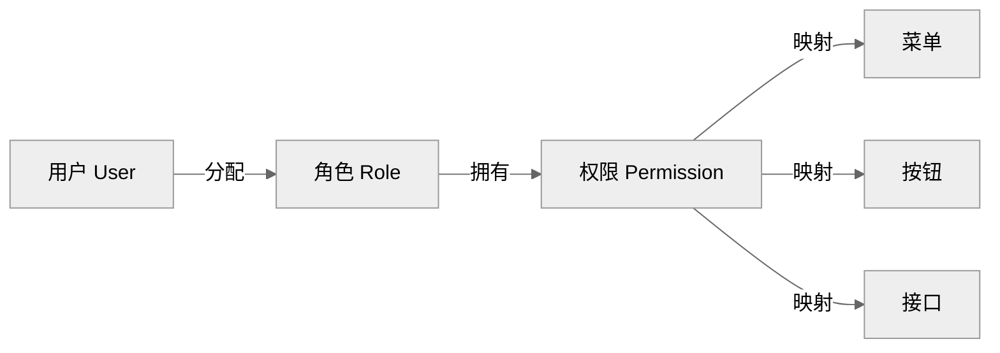
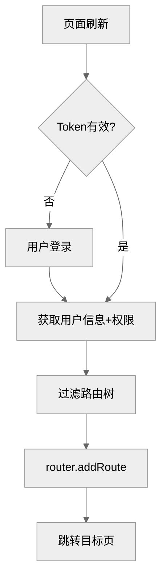
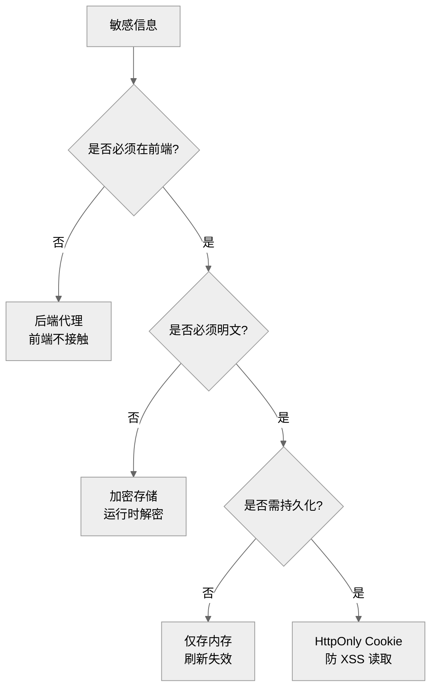
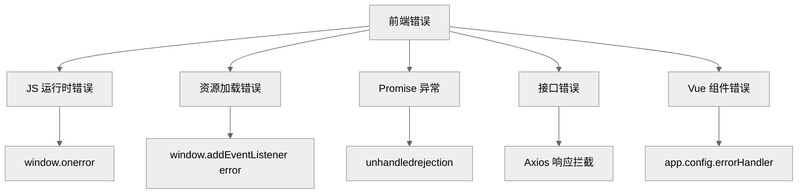
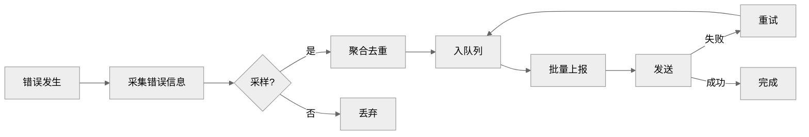
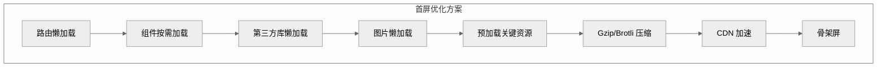

# Vue3 工程化高级面试题集

> 本文档系统梳理 Vue3 工程化实践中的高级面试题，涵盖权限控制、配置脱敏、全局错误处理、组件设计模式、状态管理、性能优化、构建优化、测试等核心模块，每题配详细参考答案与代码案例，难度覆盖中高级工程师岗位。

---

## 目录

- [一、权限控制](#一权限控制)
  - [1.1 RBAC 角色权限模型实现](#11-rbac-角色权限模型实现)
  - [1.2 动态路由权限管理](#12-动态路由权限管理)
  - [1.3 按钮级权限控制](#13-按钮级权限控制)
  - [1.4 菜单级权限控制](#14-菜单级权限控制)
  - [1.5 接口级权限校验](#15-接口级权限校验)
- [二、配置脱敏与安全](#二配置脱敏与安全)
  - [2.1 敏感信息处理策略](#21-敏感信息处理策略)
  - [2.2 环境变量管理](#22-环境变量管理)
  - [2.3 配置文件加密与解密](#23-配置文件加密与解密)
  - [2.4 前端防 XSS 与 CSRF](#24-前端防-xss-与-csrf)
- [三、全局错误处理](#三全局错误处理)
  - [3.1 前端错误捕获机制](#31-前端错误捕获机制)
  - [3.2 异常边界处理](#32-异常边界处理)
  - [3.3 错误上报流程设计](#33-错误上报流程设计)
- [四、组件设计模式](#四组件设计模式)
  - [4.1 组件通信模式](#41-组件通信模式)
  - [4.2 逻辑复用模式](#42-逻辑复用模式)
  - [4.3 高阶组件模式](#43-高阶组件模式)
- [五、状态管理方案](#五状态管理方案)
  - [5.1 Pinia 模块化设计](#51-pinia-模块化设计)
  - [5.2 状态持久化方案](#52-状态持久化方案)
- [六、性能优化策略](#六性能优化策略)
  - [6.1 组件级优化](#61-组件级优化)
  - [6.2 首屏加载优化](#62-首屏加载优化)
- [七、构建优化](#七构建优化)
  - [7.1 Vite 构建优化](#71-vite-构建优化)
  - [7.2 包体积分析](#72-包体积分析)
- [八、测试方案](#八测试方案)
  - [8.1 单元测试](#81-单元测试)
  - [8.2 E2E 测试](#82-e2e-测试)
- [九、考点速查表](#九考点速查表)

---

## 一、权限控制

### 1.1 RBAC 角色权限模型实现

**难度**：高级　**类型**：设计题

**问题描述**：
请设计并实现一套基于 RBAC（Role-Based Access Control）的前端权限模型，要求支持用户-角色-权限三层映射，并能与后端接口协同。

**参考答案**：

**RBAC 模型架构**：



**权限 Store 设计**：

```typescript
// stores/permission.ts
import { defineStore } from 'pinia'
import { ref, computed } from 'vue'

interface UserInfo {
  id: string
  name: string
  roles: string[]        // 角色编码
  permissions: string[]  // 权限编码
}

export const usePermissionStore = defineStore('permission', () => {
  const userInfo = ref<UserInfo | null>(null)
  const dynamicRoutes = ref<RouteRecord[]>([])

  // 是否有某权限
  const hasPermission = (perm: string): boolean => {
    if (!userInfo.value) return false
    // 超级管理员拥有所有权限
    if (userInfo.value.roles.includes('super_admin')) return true
    return userInfo.value.permissions.includes(perm)
  }

  // 是否有任一权限
  const hasAnyPermission = (perms: string[]): boolean => {
    return perms.some(p => hasPermission(p))
  }

  // 是否有所有权限
  const hasAllPermissions = (perms: string[]): boolean => {
    return perms.every(p => hasPermission(p))
  }

  // 是否有某角色
  const hasRole = (role: string): boolean => {
    if (!userInfo.value) return false
    return userInfo.value.roles.includes(role)
  }

  // 设置用户信息(登录后调用)
  const setUserInfo = (info: UserInfo) => {
    userInfo.value = info
  }

  // 清除(登出时调用)
  const reset = () => {
    userInfo.value = null
    dynamicRoutes.value = []
  }

  return {
    userInfo,
    dynamicRoutes,
    hasPermission,
    hasAnyPermission,
    hasAllPermissions,
    hasRole,
    setUserInfo,
    reset,
  }
})
```

**后端返回的权限数据结构**：

```json
{
  "user": {
    "id": "u001",
    "name": "张三",
    "roles": ["editor", "auditor"]
  },
  "permissions": [
    "system:user:list",
    "system:user:add",
    "system:role:list",
    "article:publish",
    "article:audit"
  ]
}
```

**关键点**：
1. **三层映射**：用户 → 角色 → 权限，权限可映射到菜单/按钮/接口。
2. **超级管理员短路**：`super_admin` 角色跳过权限检查，避免逐条配置。
3. **权限编码规范**：`模块:资源:操作`（如 `system:user:add`）。
4. **前后端协同**：前端做体验性拦截，后端做安全性校验，缺一不可。

---

### 1.2 动态路由权限管理

**难度**：高级　**类型**：设计题

**问题描述**：
请实现 Vue3 的动态路由方案：用户登录后根据权限动态加载路由，刷新页面不丢失，无权限路由不可访问。

**参考答案**：

**核心流程**：



**实现代码**：

```typescript
// router/index.ts
import { createRouter, createWebHistory, RouteRecordRaw } from 'vue-router'

// 静态路由(无需权限)
export const constantRoutes: RouteRecordRaw[] = [
  { path: '/login', component: () => import('@/views/login.vue') },
  { path: '/404', component: () => import('@/views/error/404.vue') },
  { path: '/403', component: () => import('@/views/error/403.vue') },
]

// 动态路由(后端返回或前端全量+过滤)
export const asyncRoutes: RouteRecordRaw[] = [
  {
    path: '/system',
    component: () => import('@/layout/index.vue'),
    redirect: '/system/user',
    meta: { title: '系统管理', icon: 'setting', roles: ['admin', 'super_admin'] },
    children: [
      {
        path: 'user',
        component: () => import('@/views/system/user.vue'),
        meta: { title: '用户管理', permissions: ['system:user:list'] },
      },
      {
        path: 'role',
        component: () => import('@/views/system/role.vue'),
        meta: { title: '角色管理', permissions: ['system:role:list'] },
      },
    ],
  },
]

const router = createRouter({
  history: createWebHistory(),
  routes: constantRoutes,
})

export default router
```

**路由守卫**：

```typescript
// router/guard.ts
import router from './index'
import { usePermissionStore } from '@/stores/permission'
import { useUserStore } from '@/stores/user'

// 白名单(无需登录可访问)
const WHITE_LIST = ['/login', '/404', '/403']

router.beforeEach(async (to, from, next) => {
  const userStore = useUserStore()
  const permStore = usePermissionStore()
  const token = userStore.token

  // 1. 已登录
  if (token) {
    if (to.path === '/login') {
      next({ path: '/' })
      return
    }

    // 2. 用户信息未加载(刷新场景)
    if (!permStore.userInfo) {
      try {
        // 拉取用户信息+权限
        const userInfo = await userStore.fetchUserInfo()
        permStore.setUserInfo(userInfo)

        // 过滤动态路由
        const accessRoutes = filterAsyncRoutes(asyncRoutes, userInfo)
        permStore.dynamicRoutes = accessRoutes

        // 动态添加路由
        accessRoutes.forEach(route => router.addRoute(route))

        // 重新跳转(避免 addRoute 后首次匹配不到)
        next({ ...to, replace: true })
        return
      } catch (error) {
        // Token 失效
        userStore.resetToken()
        next(`/login?redirect=${to.path}`)
        return
      }
    }

    // 3. 检查路由权限
    if (to.meta.permissions && to.meta.permissions.length > 0) {
      const hasPerm = permStore.hasAnyPermission(to.meta.permissions as string[])
      if (!hasPerm) {
        next('/403')
        return
      }
    }

    next()
    return
  }

  // 4. 未登录
  if (WHITE_LIST.includes(to.path)) {
    next()
  } else {
    next(`/login?redirect=${to.path}`)
  }
})

// 路由过滤函数
function filterAsyncRoutes(routes: RouteRecordRaw[], userInfo: UserInfo): RouteRecordRaw[] {
  const res: RouteRecordRaw[] = []

  routes.forEach(route => {
    const tmp = { ...route }

    // 角色校验
    if (tmp.meta?.roles) {
      const hasRole = (tmp.meta.roles as string[]).some(r => userInfo.roles.includes(r))
      if (!hasRole) return
    }

    // 权限校验
    if (tmp.meta?.permissions) {
      const hasPerm = (tmp.meta.permissions as string[]).some(p => userInfo.permissions.includes(p))
      if (!hasPerm) return
    }

    // 递归过滤子路由
    if (tmp.children) {
      tmp.children = filterAsyncRoutes(tmp.children, userInfo)
    }

    res.push(tmp)
  })

  return res
}
```

**关键点**：
1. **刷新不丢失**：路由守卫检测 `userInfo` 为空时重新拉取并 `addRoute`。
2. **replace: true**：`addRoute` 后用 `next({ ...to, replace: true })` 重新匹配，避免白屏。
3. **404 兜底**：动态路由添加后再添加 `{ path: '/:pathMatch(.*)*', redirect: '/404' }`，否则刷新 404。
4. **双重过滤**：角色（粗粒度）+ 权限（细粒度）。

---

### 1.3 按钮级权限控制

**难度**：中级　**类型**：实现题

**问题描述**：
请实现按钮级权限控制，要求：①使用自定义指令 `v-permission`；②提供函数式 API `hasPerm`；③无权限时按钮不渲染。

**参考答案**：

**自定义指令实现**：

```typescript
// directives/permission.ts
import { Directive, DirectiveBinding } from 'vue'
import { usePermissionStore } from '@/stores/permission'

/**
 * v-permission="'system:user:add'"
 * v-permission="['system:user:add', 'system:user:edit']"  任一权限即可
 */
export const permission: Directive = {
  mounted(el: HTMLElement, binding: DirectiveBinding) {
    checkPermission(el, binding)
  },
  updated(el: HTMLElement, binding: DirectiveBinding) {
    checkPermission(el, binding)
  },
}

function checkPermission(el: HTMLElement, binding: DirectiveBinding) {
  const { value } = binding
  const permStore = usePermissionStore()

  if (!value) return

  const requiredPerms = Array.isArray(value) ? value : [value]
  const hasPermission = permStore.hasAnyPermission(requiredPerms)

  if (!hasPermission) {
    // 从 DOM 移除(而非 display:none,防止 F12 修改)
    el.parentNode?.removeChild(el)
  }
}

// main.ts 注册
// app.directive('permission', permission)
```

**使用示例**：

```vue
<template>
  <!-- 单个权限 -->
  <el-button v-permission="'system:user:add'" type="primary" @click="handleAdd">
    新增用户
  </el-button>

  <!-- 多个权限(任一即可) -->
  <el-button v-permission="['system:user:edit', 'system:user:delete']" @click="handleEdit">
    编辑
  </el-button>

  <!-- 函数式 API(用于条件渲染) -->
  <el-button v-if="hasPerm('system:user:export')" @click="handleExport">
    导出
  </el-button>
</template>

<script setup lang="ts">
import { usePermission } from '@/composables/usePermission'

const { hasPerm } = usePermission()
</script>
```

**函数式 API**：

```typescript
// composables/usePermission.ts
import { usePermissionStore } from '@/stores/permission'

export function usePermission() {
  const permStore = usePermissionStore()

  const hasPerm = (perm: string) => permStore.hasPermission(perm)
  const hasAnyPerm = (perms: string[]) => permStore.hasAnyPermission(perms)
  const hasAllPerms = (perms: string[]) => permStore.hasAllPermissions(perms)
  const hasRole = (role: string) => permStore.hasRole(role)

  return { hasPerm, hasAnyPerm, hasAllPerms, hasRole }
}
```

**关键点**：
1. **指令移除 DOM**：用 `removeChild` 而非 `display:none`，防止 F12 修改样式绕过。
2. **函数式 API**：`v-if` 场景用函数式 API 更灵活。
3. **安全兜底**：前端隐藏仅是体验，后端必须校验。

---

### 1.4 菜单级权限控制

**难度**：中级　**类型**：实现题

**问题描述**：
请实现基于权限的动态菜单生成方案，要求菜单根据用户权限自动渲染，支持多级嵌套。

**参考答案**：

```vue
<!-- components/SideMenu.vue -->
<template>
  <el-menu :default-active="activeMenu" router>
    <menu-item
      v-for="route in permissionRoutes"
      :key="route.path"
      :item="route"
      :base-path="route.path"
    />
  </el-menu>
</template>

<script setup lang="ts">
import { computed } from 'vue'
import { useRoute } from 'vue-router'
import { usePermissionStore } from '@/stores/permission'

const route = useRoute()
const permStore = usePermissionStore()

const activeMenu = computed(() => route.path)
const permissionRoutes = computed(() => permStore.dynamicRoutes)
</script>
```

**递归菜单组件**：

```vue
<!-- components/MenuItem.vue -->
<template>
  <!-- 有子菜单 -->
  <el-sub-menu v-if="hasChildren" :index="basePath">
    <template #title>
      <el-icon><component :is="item.meta?.icon" /></el-icon>
      <span>{{ item.meta?.title }}</span>
    </template>
    <menu-item
      v-for="child in visibleChildren"
      :key="child.path"
      :item="child"
      :base-path="resolvePath(child.path)"
    />
  </el-sub-menu>

  <!-- 单个菜单项 -->
  <el-menu-item v-else :index="resolvePath(item.path)">
    <el-icon><component :is="item.meta?.icon" /></el-icon>
    <template #title>{{ item.meta?.title }}</template>
  </el-menu-item>
</template>

<script setup lang="ts">
import { computed } from 'vue'
import { usePermissionStore } from '@/stores/permission'

const props = defineProps<{
  item: RouteRecord
  basePath: string
}>()

const permStore = usePermissionStore()

// 过滤有权限的子菜单
const visibleChildren = computed(() => {
  return (props.item.children || []).filter(child => {
    if (child.meta?.permissions) {
      return permStore.hasAnyPermission(child.meta.permissions)
    }
    if (child.meta?.roles) {
      return child.meta.roles.some(r => permStore.hasRole(r))
    }
    return true
  })
})

const hasChildren = computed(() => visibleChildren.value.length > 0)

const resolvePath = (routePath: string) => {
  return `${props.basePath}/${routePath}`.replace(/\/+/g, '/')
}
</script>
```

---

### 1.5 接口级权限校验

**难度**：中级　**类型**：实现题

**问题描述**：
请实现 Axios 请求拦截器的权限校验，确保无权限的接口请求被拦截并友好提示。

**参考答案**：

```typescript
// utils/request.ts
import axios, { AxiosRequestConfig } from 'axios'
import { usePermissionStore } from '@/stores/permission'
import { ElMessage } from 'element-plus'

const service = axios.create({
  baseURL: import.meta.env.VITE_API_BASE_URL,
  timeout: 15000,
})

// 请求拦截:权限校验
service.interceptors.request.use(
  (config) => {
    // 接口权限编码(在 API 定义时声明)
    const requiredPerm = (config as any).permission
    if (requiredPerm) {
      const permStore = usePermissionStore()
      if (!permStore.hasPermission(requiredPerm)) {
        ElMessage.error('无权限访问该资源')
        return Promise.reject(new Error('无权限'))
      }
    }

    // 携带 Token
    const token = localStorage.getItem('token')
    if (token) {
      config.headers.Authorization = `Bearer ${token}`
    }
    return config
  },
  (error) => Promise.reject(error)
)

// 响应拦截:401/403 处理
service.interceptors.response.use(
  (response) => response.data,
  (error) => {
    const { status } = error.response || {}
    if (status === 401) {
      // Token 失效,跳登录
      localStorage.removeItem('token')
      window.location.href = '/login'
    } else if (status === 403) {
      ElMessage.error('权限不足,请联系管理员')
    }
    return Promise.reject(error)
  }
)

export default service
```

**API 定义时声明权限**：

```typescript
// api/user.ts
import request from '@/utils/request'

export function getUserList(params: any) {
  return request({
    url: '/system/user/list',
    method: 'get',
    params,
    permission: 'system:user:list',  // 声明所需权限
  } as any)
}
```

---

## 二、配置脱敏与安全

### 2.1 敏感信息处理策略

**难度**：中级　**类型**：分析题

**问题描述**：
前端项目中有哪些敏感信息？如何分类处理？请给出完整的敏感信息处理策略。

**参考答案**：

**敏感信息分类**：

| 类别 | 示例 | 处理策略 |
|------|------|----------|
| **API Key** | 地图 Key、第三方服务 Key | 后端代理，不暴露到前端 |
| **Token** | JWT、Session ID | 存内存或 HttpOnly Cookie |
| **用户隐私** | 手机号、身份证、银行卡 | 脱敏显示（138****8888） |
| **后端地址** | API Base URL | 环境变量，生产用域名 |
| **内部配置** | 加密密钥、盐值 | 永远不存前端 |

**处理原则**：



**脱敏工具函数**：

```typescript
// utils/desensitize.ts

/** 手机号脱敏:13812345678 → 138****5678 */
export function maskPhone(phone: string): string {
  if (!phone || phone.length !== 11) return phone
  return phone.replace(/(\d{3})\d{4}(\d{4})/, '$1****$2')
}

/** 身份证脱敏:110101199001011234 → 110***********1234 */
export function maskIdCard(id: string): string {
  if (!id || id.length < 10) return id
  return id.replace(/(\d{4})\d+(\d{4})/, '$1**********$2')
}

/** 邮箱脱敏:zhangsan@example.com → z***@example.com */
export function maskEmail(email: string): string {
  if (!email || !email.includes('@')) return email
  const [name, domain] = email.split('@')
  return `${name[0]}***@${domain}`
}

/** 银行卡脱敏:6222021234567890 → 6222********7890 */
export function maskBankCard(card: string): string {
  if (!card || card.length < 8) return card
  return card.replace(/(\d{4})\d+(\d{4})/, '$1********$2')
}

/** 姓名脱敏:张三 → 张*;张三丰 → 张*丰 */
export function maskName(name: string): string {
  if (!name) return name
  if (name.length === 1) return name
  if (name.length === 2) return name[0] + '*'
  return name[0] + '*'.repeat(name.length - 2) + name[name.length - 1]
}
```

**关键点**：
1. **前端不存密钥**：任何加密密钥都不应出现在前端代码或配置中。
2. **后端代理第三方**：地图、短信等第三方 API 由后端代理调用。
3. **展示脱敏**：用户信息展示时脱敏，编辑时才显示明文（需权限）。
4. **日志脱敏**：前端日志上报时脱敏手机号、Token 等。

---

### 2.2 环境变量管理

**难度**：中级　**类型**：实现题

**问题描述**：
请实现 Vue3 + Vite 项目的多环境变量管理方案，支持 dev/test/prod 环境隔离。

**参考答案**：

**环境文件结构**：

```
项目根目录/
├── .env                # 所有环境共享
├── .env.development    # 开发环境
├── .env.staging        # 预发布环境
├── .env.production     # 生产环境
└── .env.example        # 模板(提交 git)
```

**.env.development**：

```bash
# 开发环境
VITE_APP_TITLE=管理系统(开发)
VITE_API_BASE_URL=http://localhost:8080/api
VITE_API_TIMEOUT=15000
VITE_ENABLE_MOCK=true
VITE_LOG_LEVEL=debug
```

**.env.production**：

```bash
# 生产环境
VITE_APP_TITLE=管理系统
VITE_API_BASE_URL=https://api.example.com
VITE_API_TIMEOUT=10000
VITE_ENABLE_MOCK=false
VITE_LOG_LEVEL=error
```

**类型声明**：

```typescript
// env.d.ts
interface ImportMetaEnv {
  readonly VITE_APP_TITLE: string
  readonly VITE_API_BASE_URL: string
  readonly VITE_API_TIMEOUT: number
  readonly VITE_ENABLE_MOCK: boolean
  readonly VITE_LOG_LEVEL: 'debug' | 'info' | 'warn' | 'error'
}

interface ImportMeta {
  readonly env: ImportMetaEnv
}
```

**配置访问封装**：

```typescript
// config/index.ts
export const appConfig = {
  title: import.meta.env.VITE_APP_TITLE,
  api: {
    baseUrl: import.meta.env.VITE_API_BASE_URL,
    timeout: Number(import.meta.env.VITE_API_TIMEOUT),
  },
  mock: {
    enabled: import.meta.env.VITE_ENABLE_MOCK === 'true',
  },
  log: {
    level: import.meta.env.VITE_LOG_LEVEL,
  },
  // 当前环境
  isDev: import.meta.env.DEV,
  isProd: import.meta.env.PROD,
  mode: import.meta.env.MODE,
} as const
```

**关键点**：
1. **VITE_ 前缀**：只有 `VITE_` 开头的变量才会暴露给前端。
2. **类型声明**：`env.d.ts` 提供类型提示，避免拼写错误。
3. **打包时替换**：Vite 在构建时静态替换，运行时不存在环境变量。
4. **敏感信息不入前端**：数据库密码、加密密钥等不通过环境变量暴露给前端。

---

### 2.3 配置文件加密与解密

**难度**：高级　**类型**：设计题

**问题描述**：
某些配置（如第三方 SDK AppSecret）虽不应放在前端，但某些场景必须前端持有。请设计配置加密存储与运行时解密方案。

**参考答案**：

**方案选择**：

| 方案 | 安全性 | 复杂度 | 适用场景 |
|------|--------|--------|----------|
| **明文存储** | 最低 | 低 | 不推荐 |
| **Base64 编码** | 低 | 低 | 防止肉眼可见 |
| **AES 加密** | 中 | 中 | 一般配置 |
| **后端下发** | 高 | 高 | 敏感配置（推荐） |

**AES 加密方案**：

```typescript
// utils/crypto.ts
import CryptoJS from 'crypto-js'

// 密钥(打包时混淆,非绝对安全,但提高门槛)
const SECRET_KEY = 'your-secret-key-2024'

/** AES 加密 */
export function encrypt(plainText: string): string {
  return CryptoJS.AES.encrypt(plainText, SECRET_KEY).toString()
}

/** AES 解密 */
export function decrypt(cipherText: string): string {
  const bytes = CryptoJS.AES.decrypt(cipherText, SECRET_KEY)
  return bytes.toString(CryptoJS.enc.Utf8)
}

/** 加密对象 */
export function encryptConfig(config: object): string {
  return encrypt(JSON.stringify(config))
}

/** 解密配置 */
export function decryptConfig<T>(cipherText: string): T {
  return JSON.parse(decrypt(cipherText)) as T
}
```

**构建时加密**：

```javascript
// vite.config.ts
import { defineConfig } from 'vite'
import { encrypt } from './scripts/crypto'

export default defineConfig(({ mode }) => {
  // 从环境读取敏感配置
  const sensitiveConfig = {
    appSecret: process.env.APP_SECRET,
    apiKey: process.env.API_KEY,
  }

  return {
    define: {
      // 加密后注入,运行时解密
      __ENCRYPTED_CONFIG__: JSON.stringify(encrypt(JSON.stringify(sensitiveConfig))),
    },
  }
})
```

**运行时解密**：

```typescript
// config/secure.ts
declare const __ENCRYPTED_CONFIG__: string

let decryptedConfig: any = null

export function getSecureConfig() {
  if (!decryptedConfig) {
    decryptedConfig = decryptConfig(__ENCRYPTED_CONFIG__)
  }
  return decryptedConfig
}
```

**关键点**：
1. **前端加密非绝对安全**：密钥仍在代码中，只能提高门槛。
2. **推荐后端代理**：最安全的方案是前端不持有密钥，后端代理。
3. **代码混淆**：配合 `vite-plugin-obfuscator` 混淆代码，增加逆向难度。
4. **短期有效**：加密配置应设置有效期，定期轮换。

---

### 2.4 前端防 XSS 与 CSRF

**难度**：高级　**类型**：分析题

**问题描述**：
请说明 Vue3 项目的 XSS 与 CSRF 防护方案。

**参考答案**：

**XSS 防护**：

| 措施 | 做法 | Vue3 支持 |
|------|------|-----------|
| **默认转义** | `{{ }}` 默认 HTML 转义 | ✅ 内置 |
| **避免 v-html** | 不用 `v-html` 渲染用户输入 | 需手动遵守 |
| **DOMPurify** | 必须 `v-html` 时用 DOMPurify 过滤 | 需集成 |
| **CSP** | 设置 Content-Security-Policy 头 | 后端配置 |
| **HttpOnly** | Cookie 设 HttpOnly | 后端配置 |

```typescript
// 安全的 v-html 指令
import DOMPurify from 'dompurify'

export const safeHtml: Directive = {
  mounted(el, binding) {
    el.innerHTML = DOMPurify.sanitize(binding.value)
  },
  updated(el, binding) {
    el.innerHTML = DOMPurify.sanitize(binding.value)
  },
}
```

**CSRF 防护**：

| 措施 | 做法 |
|------|------|
| **Token 不放 Cookie** | Token 存内存，请求头携带 |
| **SameSite Cookie** | Cookie 设 `SameSite=Strict` |
| **CSRF Token** | 后端下发一次性 Token，前端表单携带 |
| **Referer 校验** | 后端校验 Referer |

```typescript
// CSRF Token 注入
service.interceptors.request.use((config) => {
  const csrfToken = document.querySelector('meta[name="csrf-token"]')?.getAttribute('content')
  if (csrfToken) {
    config.headers['X-CSRF-Token'] = csrfToken
  }
  return config
})
```

---

## 三、全局错误处理

### 3.1 前端错误捕获机制

**难度**：高级　**类型**：设计题

**问题描述**：
请设计完整的前端错误捕获方案，覆盖 JS 错误、资源加载错误、Promise 异常、接口错误。

**参考答案**：

**错误分类与捕获**：



**全局错误捕获实现**：

```typescript
// utils/errorHandler.ts
import { ErrorReporter } from './errorReporter'

class GlobalErrorHandler {
  init(app: App) {
    // 1. Vue 组件错误
    app.config.errorHandler = (err, instance, info) => {
      console.error('Vue 错误:', err, info)
      ErrorReporter.report({
        type: 'vue_error',
        message: err instanceof Error ? err.message : String(err),
        stack: err instanceof Error ? err.stack : '',
        info,
        component: instance?.$options.name || 'unknown',
      })
    }

    // 2. JS 运行时错误
    window.onerror = (message, source, lineno, colno, error) => {
      console.error('JS 错误:', message)
      ErrorReporter.report({
        type: 'js_error',
        message: String(message),
        source,
        lineno,
        colno,
        stack: error?.stack || '',
      })
      return true // 阻止默认错误显示
    }

    // 3. 资源加载错误(img/script/css)
    window.addEventListener('error', (event) => {
      const target = event.target as HTMLElement
      if (target && (target.tagName === 'IMG' || target.tagName === 'SCRIPT' || target.tagName === 'LINK')) {
        console.error('资源加载失败:', target.src || target.href)
        ErrorReporter.report({
          type: 'resource_error',
          message: `资源加载失败: ${target.src || target.href}`,
          tagName: target.tagName,
          url: target.src || target.href,
        })
      }
    }, true) // 注意:捕获阶段

    // 4. Promise 未捕获异常
    window.addEventListener('unhandledrejection', (event) => {
      console.error('Promise 异常:', event.reason)
      ErrorReporter.report({
        type: 'promise_error',
        message: event.reason?.message || String(event.reason),
        stack: event.reason?.stack || '',
      })
    })
  }
}

export const globalErrorHandler = new GlobalErrorHandler()
```

**main.ts 初始化**：

```typescript
import { createApp } from 'vue'
import App from './App.vue'
import { globalErrorHandler } from './utils/errorHandler'

const app = createApp(App)
globalErrorHandler.init(app)
app.mount('#app')
```

**关键点**：
1. **资源错误用捕获阶段**：`addEventListener('error', fn, true)`，冒泡阶段捕获不到资源错误。
2. **Vue errorHandler 优先**：Vue 组件内错误优先被 `errorHandler` 捕获，不会冒泡到 `window.onerror`。
3. **返回 true**：`window.onerror` 返回 true 阻止控制台默认错误输出。

---

### 3.2 异常边界处理

**难度**：高级　**类型**：实现题

**问题描述**：
请实现 Vue3 的 ErrorBoundary 组件，捕获子组件树错误并展示降级 UI。

**参考答案**：

```vue
<!-- components/ErrorBoundary.vue -->
<template>
  <slot v-if="!hasError" />
  <div v-else class="error-boundary">
    <el-result icon="warning" :title="errorTitle" :sub-title="errorMsg">
      <template #extra>
        <el-button type="primary" @click="handleReset">重试</el-button>
        <el-button @click="handleReport">上报问题</el-button>
      </template>
    </el-result>
  </div>
</template>

<script setup lang="ts">
import { ref, onErrorCaptured } from 'vue'
import { ErrorReporter } from '@/utils/errorReporter'

const props = defineProps<{
  fallbackTitle?: string
  onError?: (err: Error) => void
}>()

const hasError = ref(false)
const errorTitle = ref('页面出错了')
const errorMsg = ref('')

// 捕获子组件树错误
onErrorCaptured((err, instance, info) => {
  hasError.value = true
  errorMsg.value = err.message
  errorTitle.value = props.fallbackTitle || '页面出错了'

  // 上报错误
  ErrorReporter.report({
    type: 'component_error',
    message: err.message,
    stack: err.stack,
    info,
    component: instance?.type?.name || 'unknown',
  })

  // 回调
  props.onError?.(err)

  // 阻止错误向上冒泡
  return false
})

const handleReset = () => {
  hasError.value = false
  errorMsg.value = ''
}

const handleReport = () => {
  ErrorReporter.reportImmediately()
}
</script>
```

**使用示例**：

```vue
<template>
  <!-- 包裹可能出错的组件 -->
  <ErrorBoundary fallback-title="图表加载失败" @error="handleChartError">
    <ComplexChart :data="chartData" />
  </ErrorBoundary>

  <!-- 全局包裹路由出口 -->
  <ErrorBoundary>
    <router-view />
  </ErrorBoundary>
</template>
```

**关键点**：
1. **onErrorCaptured**：Vue3 Composition API，捕获后代组件错误。
2. **return false**：阻止错误继续向上冒泡。
3. **降级 UI**：展示友好提示而非白屏，提升用户体验。
4. **可重试**：提供重试按钮，重置 `hasError` 即重新渲染。

---

### 3.3 错误上报流程设计

**难度**：高级　**类型**：设计题

**问题描述**：
请设计完整的错误上报流程，包含采集、采样、聚合、上报、重试。

**参考答案**：

**上报流程**：



**错误上报器实现**：

```typescript
// utils/errorReporter.ts
interface ErrorRecord {
  type: string
  message: string
  stack?: string
  source?: string
  lineno?: number
  colno?: number
  info?: string
  component?: string
  url?: string
  userAgent?: string
  timestamp?: number
  userId?: string
  route?: string
}

class ErrorReporterClass {
  private queue: ErrorRecord[] = []
  private flushTimer: number | null = null
  private readonly BATCH_SIZE = 10
  private readonly FLUSH_INTERVAL = 5000
  private readonly SAMPLE_RATE = 1.0  // 采样率

  /** 上报错误(入队列) */
  report(record: ErrorRecord): void {
    // 采样
    if (Math.random() > this.SAMPLE_RATE) return

    // 补充上下文
    record.timestamp = Date.now()
    record.url = window.location.href
    record.userAgent = navigator.userAgent
    record.route = window.location.pathname

    // 去重(相同错误 5 分钟内只报一次)
    const key = `${record.type}:${record.message}`
    if (this.isDuplicate(key)) return

    this.queue.push(record)

    // 达到批量大小立即上报
    if (this.queue.length >= this.BATCH_SIZE) {
      this.flush()
    } else {
      this.scheduleFlush()
    }
  }

  /** 立即上报 */
  async reportImmediately(): Promise<void> {
    await this.flush()
  }

  private isDuplicate(key: string): boolean {
    // 简化:用内存 Set 去重(生产用 Redis/后端去重)
    if (!this._dedupeSet) this._dedupeSet = new Set()
    if (this._dedupeSet.has(key)) return true
    this._dedupeSet.add(key)
    setTimeout(() => this._dedupeSet.delete(key), 5 * 60 * 1000)
    return false
  }
  private _dedupeSet: Set<string> | null = null

  private scheduleFlush(): void {
    if (this.flushTimer) return
    this.flushTimer = window.setTimeout(() => {
      this.flush()
      this.flushTimer = null
    }, this.FLUSH_INTERVAL)
  }

  private async flush(): Promise<void> {
    if (this.queue.length === 0) return

    const batch = this.queue.splice(0, this.BATCH_SIZE)

    try {
      // 使用 sendBeacon(页面卸载时也能发送)
      if (navigator.sendBeacon) {
        const blob = new Blob([JSON.stringify({ errors: batch })], { type: 'application/json' })
        navigator.sendBeacon('/api/error-report', blob)
      } else {
        // 降级 fetch
        await fetch('/api/error-report', {
          method: 'POST',
          headers: { 'Content-Type': 'application/json' },
          body: JSON.stringify({ errors: batch }),
          keepalive: true,
        })
      }
    } catch (error) {
      // 上报失败:重新入队(最多重试 3 次)
      if (this._retryCount < 3) {
        this._retryCount++
        this.queue.unshift(...batch)
        setTimeout(() => this.flush(), 1000 * this._retryCount)
      }
    }
  }
  private _retryCount = 0
}

export const ErrorReporter = new ErrorReporterClass()
```

**关键点**：
1. **批量上报**：累积多条错误一次性上报，减少请求数。
2. **采样率**：高流量场景降低采样率，避免上报服务过载。
3. **去重**：相同错误 5 分钟内只报一次，避免刷屏。
4. **sendBeacon**：页面卸载时也能可靠发送，适合错误上报。
5. **重试**：上报失败重试 3 次，指数退避。

---

## 四、组件设计模式

### 4.1 组件通信模式

**难度**：中级　**类型**：分析题

**问题描述**：
请列举 Vue3 中常见的组件通信模式及适用场景。

**参考答案**：

| 模式 | API | 适用场景 |
|------|-----|----------|
| **Props / Emits** | `defineProps` / `defineEmits` | 父子直接通信 |
| **v-model** | `defineModel` | 双向绑定 |
| **provide / inject** | `provide` / `inject` | 跨层级传递 |
| **EventBus** | mitt | 任意组件通信（不推荐大型项目） |
| **Pinia** | `useStore` | 全局状态共享 |
| **Template Refs** | `ref` / `defineExpose` | 父调用子方法 |
| **Attrs** | `useAttrs` | 透传属性 |

```vue
<!-- 父调用子方法 -->
<template>
  <ChildComp ref="childRef" />
  <el-button @click="childRef?.doSomething()">调用子方法</el-button>
</template>

<script setup lang="ts">
import { ref } from 'vue'
const childRef = ref()
</script>

<!-- 子组件 -->
<script setup lang="ts">
function doSomething() { /* ... */ }
defineExpose({ doSomething })
</script>
```

---

### 4.2 逻辑复用模式

**难度**：中级　**类型**：实现题

**问题描述**：
请用 Composition API 实现一个通用的 `useRequest` Hook，支持自动请求、加载状态、错误处理。

**参考答案**：

```typescript
// composables/useRequest.ts
import { ref, shallowRef, type Ref } from 'vue'

interface UseRequestOptions<T, P extends any[]> {
  immediate?: boolean           // 是否立即执行
  initialData?: T               // 初始数据
  onSuccess?: (data: T) => void
  onError?: (err: Error) => void
  defaultParams?: P             // 默认参数
}

export function useRequest<T, P extends any[] = any[]>(
  fn: (...args: P) => Promise<T>,
  options: UseRequestOptions<T, P> = {}
) {
  const {
    immediate = true,
    initialData,
    onSuccess,
    onError,
    defaultParams,
  } = options

  const data = shallowRef<T | undefined>(initialData) as Ref<T | undefined>
  const loading = ref(false)
  const error = ref<Error | null>(null)

  const run = async (...args: P): Promise<T | undefined> => {
    loading.value = true
    error.value = null
    try {
      const result = await fn(...args)
      data.value = result
      onSuccess?.(result)
      return result
    } catch (err) {
      error.value = err as Error
      onError?.(err as Error)
      throw err
    } finally {
      loading.value = false
    }
  }

  const refresh = () => run(...(defaultParams || ([] as unknown as P)))

  if (immediate) {
    run(...(defaultParams || ([] as unknown as P)))
  }

  return { data, loading, error, run, refresh }
}
```

**使用示例**：

```vue
<script setup lang="ts">
import { useRequest } from '@/composables/useRequest'
import { getUserList } from '@/api/user'

const { data, loading, error, run } = useRequest(getUserList, {
  immediate: true,
  defaultParams: [{ page: 1, size: 10 }],
  onSuccess: (data) => console.log('加载成功', data),
  onError: (err) => console.error('加载失败', err),
})
</script>
```

---

### 4.3 高阶组件模式

**难度**：高级　**类型**：实现题

**问题描述**：
Vue3 推荐用 Composition 函数替代高阶组件，但某些场景仍需 HOC。请实现一个 `withLoading` HOC。

**参考答案**：

```typescript
// hoc/withLoading.ts
import { h, defineComponent, ref, Component } from 'vue'

export function withLoading<T extends Component>(WrappedComponent: T) {
  return defineComponent({
    name: 'WithLoading',
    setup(props, { attrs, slots }) {
      const loading = ref(false)

      const setLoading = (val: boolean) => {
        loading.value = val
      }

      return () => {
        // 暴露 setLoading 给子组件
        return h(WrappedComponent, {
          ...attrs,
          loading: loading.value,
          setLoading,
        }, slots)
      }
    },
  })
}
```

**更推荐:Composition 函数**：

```typescript
// composables/useLoading.ts
export function useLoading() {
  const loading = ref(false)
  const startLoading = () => (loading.value = true)
  const stopLoading = () => (loading.value = false)
  return { loading, startLoading, stopLoading }
}
```

---

## 五、状态管理方案

### 5.1 Pinia 模块化设计

**难度**：中级　**类型**：设计题

**问题描述**：
请设计 Pinia 的模块化方案，支持自动导入、类型推导、持久化。

**参考答案**：

**目录结构**：

```
src/stores/
├── index.ts          # 统一导出
├── user.ts           # 用户状态
├── permission.ts     # 权限状态
├── app.ts            # 应用状态
└── modules/
    ├── cart.ts       # 购物车
    └── order.ts      # 订单
```

**stores/index.ts**：

```typescript
import { createPinia } from 'pinia'

const pinia = createPinia()

// 自动导入所有 store(配合 import.meta.glob)
const modules = import.meta.glob('./modules/*.ts', { eager: true })
Object.values(modules).forEach((mod: any) => {
  if (mod.default) mod.default(pinia)
})

export default pinia
export * from './user'
export * from './permission'
export * from './app'
```

**user.ts（Setup Store 风格）**：

```typescript
import { defineStore } from 'pinia'
import { ref, computed } from 'vue'
import { loginApi, getUserInfoApi } from '@/api/user'

export const useUserStore = defineStore('user', () => {
  // state
  const token = ref<string>(localStorage.getItem('token') || '')
  const userInfo = ref<UserInfo | null>(null)

  // getters
  const isLoggedIn = computed(() => !!token.value)
  const userName = computed(() => userInfo.value?.name || '游客')

  // actions
  async function login(credentials: LoginParams) {
    const { token: newToken } = await loginApi(credentials)
    token.value = newToken
    localStorage.setItem('token', newToken)
  }

  async function fetchUserInfo() {
    const info = await getUserInfoApi()
    userInfo.value = info
    return info
  }

  function logout() {
    token.value = ''
    userInfo.value = null
    localStorage.removeItem('token')
  }

  return {
    token,
    userInfo,
    isLoggedIn,
    userName,
    login,
    fetchUserInfo,
    logout,
  }
})
```

---

### 5.2 状态持久化方案

**难度**：中级　**类型**：实现题

**问题描述**：
请实现 Pinia 状态的持久化方案，支持选择性持久化、加密存储、过期时间。

**参考答案**：

```typescript
// plugins/piniaPersist.ts
import { PiniaPluginContext } from 'pinia'
import CryptoJS from 'crypto-js'

interface PersistOptions {
  key?: string              // 存储 key
  paths?: string[]          // 持久化字段(默认全部)
  encryption?: boolean      // 是否加密
  expire?: number           // 过期时间(ms)
}

declare module 'pinia' {
  export interface DefineStoreOptions {
    persist?: boolean | PersistOptions
  }
}

const SECRET_KEY = 'pinia-persist-key'

export function createPersistPlugin() {
  return ({ store, options }: PiniaPluginContext) => {
    if (!options.persist) return

    const persistOpts: PersistOptions = typeof options.persist === 'boolean'
      ? {}
      : options.persist

    const key = persistOpts.key || `pinia_${store.$id}`

    // 从存储恢复
    const stored = localStorage.getItem(key)
    if (stored) {
      try {
        let data = stored
        if (persistOpts.encryption) {
          data = CryptoJS.AES.decrypt(stored, SECRET_KEY).toString(CryptoJS.enc.Utf8)
        }
        const parsed = JSON.parse(data)

        // 检查过期
        if (parsed.expire && Date.now() > parsed.expire) {
          localStorage.removeItem(key)
        } else {
          // 选择性恢复
          if (persistOpts.paths) {
            persistOpts.paths.forEach(path => {
              if (parsed.data[path] !== undefined) {
                store[path] = parsed.data[path]
              }
            })
          } else {
            store.$patch(parsed.data)
          }
        }
      } catch (e) {
        console.error('Pinia 持久化恢复失败:', e)
      }
    }

    // 订阅变化,自动保存
    store.$subscribe((mutation, state) => {
      try {
        let data = persistOpts.paths
          ? persistOpts.paths.reduce((acc, path) => {
              acc[path] = state[path]
              return acc
            }, {} as any)
          : state

        const payload = {
          data,
          expire: persistOpts.expire ? Date.now() + persistOpts.expire : null,
        }

        let serialized = JSON.stringify(payload)
        if (persistOpts.encryption) {
          serialized = CryptoJS.AES.encrypt(serialized, SECRET_KEY).toString()
        }
        localStorage.setItem(key, serialized)
      } catch (e) {
        console.error('Pinia 持久化保存失败:', e)
      }
    })
  }
}
```

**使用**：

```typescript
// main.ts
const pinia = createPinia()
pinia.use(createPersistPlugin())

// store 定义时启用
defineStore('user', {
  state: () => ({ token: '', userInfo: null, preference: {} }),
  persist: {
    paths: ['token', 'preference'],  // 只持久化 token 和 preference
    expire: 7 * 24 * 60 * 60 * 1000, // 7 天过期
  },
})
```

---

## 六、性能优化策略

### 6.1 组件级优化

**难度**：高级　**类型**：分析题

**问题描述**：
请列举 Vue3 组件级性能优化手段并说明原理。

**参考答案**：

| 手段 | API | 原理 | 适用场景 |
|------|-----|------|----------|
| **shallowRef** | `shallowRef` | 只对 `.value` 响应式，不深度代理 | 大对象、列表 |
| **shallowReactive** | `shallowReactive` | 只对第一层响应式 | 表单、树结构 |
| **markRaw** | `markRaw` | 标记永不响应式 | 第三方实例 |
| **v-once** | `v-once` | 只渲染一次 | 静态内容 |
| **v-memo** | `v-memo` | 依赖不变跳过更新 | 列表项优化 |
| **defineAsyncComponent** | `defineAsyncComponent` | 懒加载 | 大组件 |
| **KeepAlive** | `<KeepAlive>` | 缓存组件实例 | 切换频繁 |

**v-memo 优化列表**：

```vue
<template>
  <!-- 仅当 item.id 或 item.selected 变化时才重新渲染 -->
  <div v-for="item in list" :key="item.id" v-memo="[item.id, item.selected]">
    <ComplexItem :data="item" />
  </div>
</template>
```

**shallowRef 优化大列表**：

```typescript
// 大列表用 shallowRef,避免深度代理开销
const bigList = shallowRef<ListItem[]>([])

async function loadData() {
  const data = await fetchData()
  bigList.value = data  // 触发更新
  // 修改内部属性不触发更新(需整体替换)
}
```

---

### 6.2 首屏加载优化

**难度**：高级　**类型**：设计题

**问题描述**：
请设计 Vue3 项目首屏加载优化方案，目标 FCP < 1.5s。

**参考答案**：



| 优化项 | 方案 | 效果 |
|--------|------|------|
| **路由懒加载** | `() => import()` | 减少首屏 JS |
| **组件懒加载** | `defineAsyncComponent` | 按需加载 |
| **图片懒加载** | `loading="lazy"` | 延迟加载非首屏图 |
| **预加载** | `<link rel="preload">` | 关键资源优先 |
| **压缩** | Gzip/Brotli | 体积降 70% |
| **CDN** | 静态资源上 CDN | 加速下载 |
| **骨架屏** | 首屏占位 | 改善白屏体验 |
| **Tree Shaking** | ESM 按需引入 | 去除无用代码 |

**路由懒加载**：

```typescript
const routes = [
  {
    path: '/dashboard',
    // 懒加载 + 预取提示
    component: () => import(/* webpackPrefetch: true */ '@/views/dashboard.vue'),
  },
]
```

**图片懒加载指令**：

```typescript
// directives/lazy.ts
import { Directive } from 'vue'

export const lazy: Directive<HTMLImageElement> = {
  mounted(el) {
    const src = el.dataset.src
    if (!src) return

    const observer = new IntersectionObserver((entries) => {
      entries.forEach(entry => {
        if (entry.isIntersecting) {
          el.src = src
          observer.unobserve(el)
        }
      })
    })
    observer.observe(el)
  },
}
```

---

## 七、构建优化

### 7.1 Vite 构建优化

**难度**：高级　**类型**：实现题

**问题描述**：
请配置 Vite 构建优化方案，包含分包、压缩、CDN 外链。

**参考答案**：

```typescript
// vite.config.ts
import { defineConfig } from 'vite'
import vue from '@vitejs/plugin-vue'
import { visualizer } from 'rollup-plugin-visualizer'
import viteCompression from 'vite-plugin-compression'

export default defineConfig({
  plugins: [
    vue(),
    // Gzip 压缩
    viteCompression({
      algorithm: 'gzip',
      threshold: 10240, // 10KB 以上才压缩
    }),
    // 包体积分析
    visualizer({
      open: false,
      filename: 'stats.html',
    }),
  ],

  build: {
    // chunk 大小警告阈值
    chunkSizeWarningLimit: 1000,

    rollupOptions: {
      output: {
        // 分包策略
        manualChunks: {
          // Vue 核心单独分包
          vue: ['vue', 'vue-router', 'pinia'],
          // UI 库单独分包
          element: ['element-plus'],
          // 工具库单独分包
          utils: ['lodash-es', 'dayjs', 'axios'],
          // 图表库单独分包
          charts: ['echarts', 'vue-echarts'],
        },

        // 文件名带 hash
        chunkFileNames: 'js/[name]-[hash].js',
        entryFileNames: 'js/[name]-[hash].js',
        assetFileNames: 'assets/[name]-[hash].[ext]',
      },
    },

    // 移除 console.log
    minify: 'terser',
    terserOptions: {
      compress: {
        drop_console: true,
        drop_debugger: true,
      },
    },
  },
})
```

**CDN 外链（生产环境）**：

```typescript
import { cdn } from './vite-cdn'

export default defineConfig({
  plugins: [
    // 生产环境用 CDN
    cdn({
      modules: [
        { name: 'vue', var: 'Vue', path: 'https://unpkg.com/vue@3/dist/vue.global.prod.js' },
        { name: 'pinia', var: 'Pinia', path: 'https://unpkg.com/pinia@2/dist/pinia.iife.prod.js' },
      ],
    }),
  ],
})
```

---

### 7.2 包体积分析

**难度**：中级　**类型**：实现题

**问题描述**：
如何分析 Vue3 项目的包体积并优化？

**参考答案**：

**1. 分析工具**：

```bash
# 安装
npm install rollup-plugin-visualizer -D

# 构建
npm run build
# 打开 stats.html 查看各模块占比
```

**2. 优化手段**：

| 问题 | 优化方案 | 节省 |
|------|----------|------|
| **lodash 全量引入** | 改为 `lodash-es` 按需 | 70KB → 2KB |
| **moment.js** | 改为 `dayjs` | 230KB → 2KB |
| **echarts 全量** | 按需引入 | 800KB → 200KB |
| **element-plus 全量** | 按需引入 | 500KB → 100KB |
| **未使用代码** | Tree Shaking | 视情况 |

**按需引入示例**：

```typescript
// lodash-es 按需
import { debounce, throttle } from 'lodash-es'

// echarts 按需
import * as echarts from 'echarts/core'
import { BarChart, LineChart } from 'echarts/charts'
import { GridComponent, TooltipComponent } from 'echarts/components'
import { CanvasRenderer } from 'echarts/renderers'

echarts.use([BarChart, LineChart, GridComponent, TooltipComponent, CanvasRenderer])
```

---

## 八、测试方案

### 8.1 单元测试

**难度**：中级　**类型**：实现题

**问题描述**：
请用 Vitest + Vue Test Utils 实现组件单元测试。

**参考答案**：

```typescript
// __tests__/Counter.spec.ts
import { describe, it, expect } from 'vitest'
import { mount } from '@vue/test-utils'
import Counter from '@/components/Counter.vue'

describe('Counter.vue', () => {
  it('初始计数为 0', () => {
    const wrapper = mount(Counter)
    expect(wrapper.text()).toContain('0')
  })

  it('点击按钮计数+1', async () => {
    const wrapper = mount(Counter)
    await wrapper.find('button').trigger('click')
    expect(wrapper.text()).toContain('1')
  })

  it('props 正确传递', () => {
    const wrapper = mount(Counter, {
      props: { initial: 10 },
    })
    expect(wrapper.text()).toContain('10')
  })

  it('emit 事件', async () => {
    const wrapper = mount(Counter)
    await wrapper.find('button').trigger('click')
    expect(wrapper.emitted('change')).toBeTruthy()
    expect(wrapper.emitted('change')![0]).toEqual([1])
  })

  it('Pinia store 集成', async () => {
    const wrapper = mount(Counter, {
      global: {
        plugins: [createTestingPinia()],
      },
    })
    await wrapper.find('button').trigger('click')
    // 验证 store 状态
    const store = useCounterStore()
    expect(store.count).toBe(1)
  })
})
```

**测试 Composables**：

```typescript
// __tests__/useCounter.test.ts
import { describe, it, expect } from 'vitest'
import { useCounter } from '@/composables/useCounter'

describe('useCounter', () => {
  it('计数器增减', () => {
    const { count, increment, decrement } = useCounter()
    expect(count.value).toBe(0)
    increment()
    expect(count.value).toBe(1)
    decrement()
    expect(count.value).toBe(0)
  })
})
```

---

### 8.2 E2E 测试

**难度**：高级　**类型**：实现题

**问题描述**：
请用 Playwright 实现 E2E 测试，覆盖登录→操作→登出流程。

**参考答案**：

```typescript
// e2e/login.spec.ts
import { test, expect } from '@playwright/test'

test.describe('登录流程', () => {
  test('正确账号密码登录成功', async ({ page }) => {
    await page.goto('/login')

    // 填写表单
    await page.fill('[data-testid="username"]', 'admin')
    await page.fill('[data-testid="password"]', '123456')

    // 点击登录
    await page.click('[data-testid="login-btn"]')

    // 验证跳转
    await expect(page).toHaveURL('/dashboard')
    await expect(page.locator('.user-name')).toContainText('管理员')
  })

  test('错误密码登录失败', async ({ page }) => {
    await page.goto('/login')
    await page.fill('[data-testid="username"]', 'admin')
    await page.fill('[data-testid="password"]', 'wrong')
    await page.click('[data-testid="login-btn"]')

    // 验证错误提示
    await expect(page.locator('.el-message--error')).toBeVisible()
  })

  test('权限控制:普通用户访问管理页跳转 403', async ({ page }) => {
    // 先登录普通用户
    await loginAsUser(page, 'user')

    // 访问管理页
    await page.goto('/system/user')

    // 验证跳转 403
    await expect(page).toHaveURL('/403')
  })
})

test.describe('权限控制', () => {
  test('无权限按钮不显示', async ({ page }) => {
    await loginAsUser(page, 'user')
    await page.goto('/article/list')

    // 编辑按钮不应存在
    await expect(page.locator('[data-testid="edit-btn"]')).toHaveCount(0)
  })
})
```

**测试配置**：

```typescript
// playwright.config.ts
import { defineConfig } from '@playwright/test'

export default defineConfig({
  testDir: './e2e',
  timeout: 30000,
  retries: 2,
  use: {
    baseURL: 'http://localhost:5173',
    screenshot: 'only-on-failure',
    video: 'retain-on-failure',
  },
  webServer: {
    command: 'npm run dev',
    port: 5173,
    reuseExistingServer: true,
  },
})
```

---

## 九、考点速查表

| 题号 | 模块 | 类型 | 难度 | 核心考点 | 分值 |
|------|------|------|------|----------|------|
| 1.1 | 权限控制 | 设计题 | 高级 | RBAC 模型、Store 设计 | 10 |
| 1.2 | 权限控制 | 设计题 | 高级 | 动态路由、路由守卫、刷新保持 | 10 |
| 1.3 | 权限控制 | 实现题 | 中级 | v-permission 指令、函数式 API | 8 |
| 1.4 | 权限控制 | 实现题 | 中级 | 动态菜单、递归组件 | 8 |
| 1.5 | 权限控制 | 实现题 | 中级 | Axios 拦截、401/403 处理 | 8 |
| 2.1 | 配置脱敏 | 分析题 | 中级 | 敏感信息分类、脱敏函数 | 8 |
| 2.2 | 配置脱敏 | 实现题 | 中级 | Vite 环境变量、类型声明 | 8 |
| 2.3 | 配置脱敏 | 设计题 | 高级 | AES 加密、构建注入、运行时解密 | 10 |
| 2.4 | 配置脱敏 | 分析题 | 高级 | XSS 防护、CSRF 防护 | 10 |
| 3.1 | 错误处理 | 设计题 | 高级 | 五种错误捕获、全局监听 | 10 |
| 3.2 | 错误处理 | 实现题 | 高级 | ErrorBoundary、onErrorCaptured | 10 |
| 3.3 | 错误处理 | 设计题 | 高级 | 上报流程、采样、批量、重试 | 10 |
| 4.1 | 组件设计 | 分析题 | 中级 | 七种通信模式 | 6 |
| 4.2 | 组件设计 | 实现题 | 中级 | useRequest Hook | 8 |
| 4.3 | 组件设计 | 实现题 | 高级 | HOC vs Composition | 8 |
| 5.1 | 状态管理 | 设计题 | 中级 | Pinia 模块化、自动导入 | 8 |
| 5.2 | 状态管理 | 实现题 | 中级 | 持久化插件、加密、过期 | 8 |
| 6.1 | 性能优化 | 分析题 | 高级 | shallowRef、v-memo、v-once | 10 |
| 6.2 | 性能优化 | 设计题 | 高级 | 首屏优化、懒加载、CDN | 10 |
| 7.1 | 构建优化 | 实现题 | 高级 | Vite 分包、压缩、CDN | 10 |
| 7.2 | 构建优化 | 实现题 | 中级 | 包体积分析、按需引入 | 8 |
| 8.1 | 测试 | 实现题 | 中级 | Vitest 组件测试 | 8 |
| 8.2 | 测试 | 实现题 | 高级 | Playwright E2E | 10 |

**面试官建议**：
- **中级岗位**：重点考察 1.3、1.5、2.1、2.2、4.1、4.2、5.1、6.1、7.2、8.1
- **高级岗位**：重点考察 1.1、1.2、2.3、2.4、3.1、3.2、3.3、6.2、7.1、8.2
- **架构岗位**：综合考察权限模型、错误处理、性能优化、构建优化的整体方案设计能力
