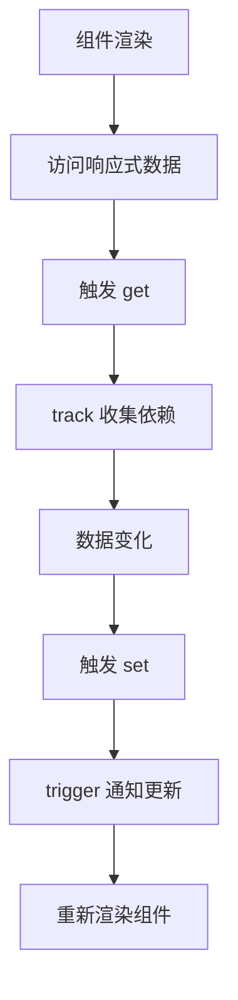
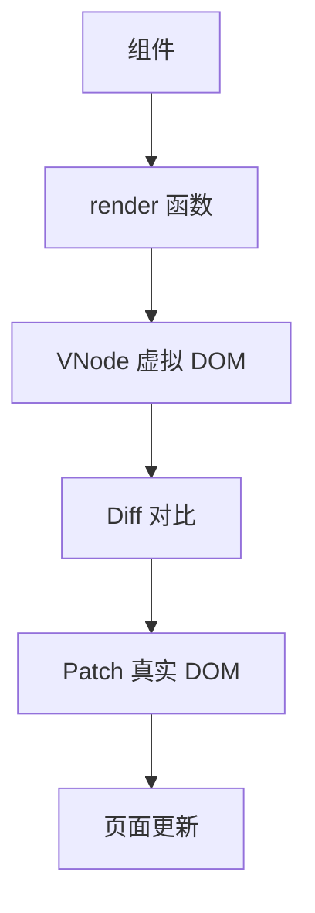
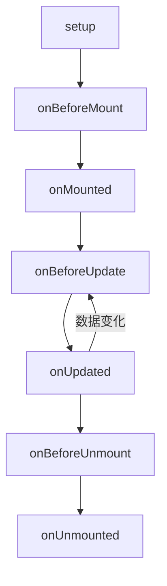

# Vue3 高频面试题与详细回答

> 文档定位：系统梳理 Vue3 在面试中的高频问题，涵盖 Composition API、响应式原理、虚拟 DOM、编译优化、生命周期、组件通信、路由、状态管理、性能优化等核心考点。
>
> 适用人群：前端工程师，尤其是需要深入理解 Vue3 原理、优化 Vue3 项目的开发者。
>
> 阅读建议：先掌握 Composition API 与响应式原理（一至三章），再学习组件与路由（四至六章），最后攻克编译优化与性能（七至九章）。重点关注「Proxy 响应式原理」「虚拟 DOM Diff」「Compiler 编译优化」「生命周期」四大核心模块。

---

## 目录

- [一、Vue3 基础与新特性](#一vue3-基础与新特性)
  - [Q1. Vue3 相比 Vue2 的改进？](#q1-vue3-相比-vue2-的改进)
  - [Q2. Options API 与 Composition API 区别？](#q2-options-api-与-composition-api-区别)
  - [Q3. setup 函数执行时机与注意事项？](#q3-setup-函数执行时机与注意事项)
- [二、响应式原理](#二响应式原理)
  - [Q4. Vue3 响应式原理（Proxy）？](#q4-vue3-响应式原理proxy)
  - [Q5. ref 和 reactive 的区别？](#q5-ref-和-reactive-的区别)
  - [Q6. toRef 和 toRefs 的作用？](#q6-toref-和-torefs-的作用)
  - [Q7. computed 原理？](#q7-computed-原理)
  - [Q8. watch 和 watchEffect 的区别？](#q8-watch-和-watcheffect-的区别)
- [三、虚拟 DOM 与 Diff](#三虚拟-dom-与-diff)
  - [Q9. 虚拟 DOM 的原理？](#q9-虚拟-dom-的原理)
  - [Q10. Vue3 Diff 算法（最长递增子序列）？](#q10-vue3-diff-算法最长递增子序列)
  - [Q11. key 的作用？为什么不能用 index？](#q11-key-的作用为什么不能用-index)
- [四、编译优化](#四编译优化)
  - [Q12. Vue3 的编译优化有哪些？](#q12-vue3-的编译优化有哪些)
  - [Q13. 静态提升、PatchFlags、Block Tree？](#q13-静态提升patchflagsblock-tree)
- [五、生命周期](#五生命周期)
  - [Q14. Vue3 生命周期有哪些？](#q14-vue3-生命周期有哪些)
  - [Q15. onMounted/onUpdated/onUnmounted 使用场景？](#q15-onmountedonupdatedonunmounted-使用场景)
- [六、组件通信](#六组件通信)
  - [Q16. Vue3 组件通信方式？](#q16-vue3-组件通信方式)
  - [Q17. provide/inject 原理？](#q17-provideinject-原理)
  - [Q18. defineExpose 的作用？](#q18-defineexpose-的作用)
- [七、路由与状态管理](#七路由与状态管理)
  - [Q19. Vue Router 4 新特性？](#q19-vue-router-4-新特性)
  - [Q20. Pinia 与 Vuex 区别？](#q20-pinia-与-vuex-区别)
  - [Q21. 路由守卫有哪些？](#q21-路由守卫有哪些)
- [八、性能优化](#八性能优化)
  - [Q22. Vue3 性能优化手段？](#q22-vue3-性能优化手段)
  - [Q23. Suspense 和异步组件？](#q23-suspense-和异步组件)
  - [Q24. v-memo、v-once、keep-alive？](#q24-v-memov-oncekeep-alive)
- [九、综合实战题](#九综合实战题)
  - [Q25. 实现一个自定义 Hook？](#q25-实现一个自定义-hook)
  - [Q26. 如何设计复杂表单？](#q26-如何设计复杂表单)
- [十、速答与踩坑总结](#十速答与踩坑总结)
  - [10.1 速答卡片](#101-速答卡片)
  - [10.2 实战踩坑 10 例](#102-实战踩坑-10-例)
  - [10.3 复习优先级表](#103-复习优先级表)

---

## 一、Vue3 基础与新特性

### Q1. Vue3 相比 Vue2 的改进？

| 维度 | Vue2 | Vue3 |
|------|------|------|
| **响应式** | Object.defineProperty | Proxy |
| **API** | Options API | Composition API（新增） |
| **包体积** | 较大 | Tree Shaking，按需引入更小 |
| **类型** | Flow | TypeScript 重写 |
| **虚拟 DOM** | 全量 Diff | 编译优化 + 精准 Diff |
| **Fragment** | 不支持多根节点 | 支持多根节点（Fragment） |
| **Teleport** | ❌ | ✅ 传送门 |
| **Suspense** | ❌ | ✅ 异步组件 |
| **组合函数** | Mixin（有缺陷） | Composables（更清晰） |

#### Vue3 新增的核心 API

```
- setup()：组合式 API 入口
- ref / reactive：响应式
- computed / watch / watchEffect
- provide / inject
- onMounted 等生命周期钩子
- defineProps / defineEmits / defineExpose（<script setup>）
```

---

### Q2. Options API 与 Composition API 区别？

#### Options API（Vue2 风格）

```js
export default {
  data() { return { count: 0 } },
  computed: { double() { return this.count * 2 } },
  methods: { increment() { this.count++ } },
  mounted() { console.log('mounted') }
}
```

#### Composition API（Vue3 风格）

```js
import { ref, computed, onMounted } from 'vue'

export default {
  setup() {
    const count = ref(0)
    const double = computed(() => count.value * 2)
    const increment = () => count.value++

    onMounted(() => console.log('mounted'))

    return { count, double, increment }
  }
}
```

#### 对比

| 维度 | Options API | Composition API |
|------|------------|-----------------|
| **组织方式** | 按选项（data/methods）组织 | 按逻辑关注点组织 |
| **代码复用** | Mixin（命名冲突） | Composables（无冲突） |
| **类型推断** | 差 | 好（TS 友好） |
| **大型项目** | 选项分散，跳转多 | 逻辑内聚，易维护 |
| **学习成本** | 低 | 稍高 |

---

### Q3. setup 函数执行时机与注意事项？

#### 执行时机

```
setup() 在 beforeCreate 之前执行
此时组件实例尚未创建，this 为 undefined
```

#### 注意事项

```
1. this 不存在（无法访问 data/methods/computed）
2. 只能在 setup 中使用 Composition API
3. 必须返回响应式数据和方法（或渲染函数）
4. 是同步函数（不能用 async，除非用 Suspense）
5. props 和 context 作为参数
```

#### 语法糖 `<script setup>`

```vue
<script setup>
import { ref, computed, onMounted } from 'vue'

const count = ref(0)
const double = computed(() => count.value * 2)

const increment = () => count.value++

onMounted(() => console.log('mounted'))
</script>
```

---

## 二、响应式原理

### Q4. Vue3 响应式原理（Proxy）？

#### 核心答案

Vue3 用 **Proxy** 代替 Vue2 的 Object.defineProperty，对整个对象进行代理拦截。

#### Proxy vs defineProperty

| 维度 | defineProperty | Proxy |
|------|---------------|-------|
| **拦截范围** | 单个属性 | 整个对象 |
| **新属性** | 无法监听（需 $set） | ✅ 自动监听 |
| **数组** | 重写方法 | ✅ 直接拦截 |
| **深度响应** | 递归 | 懒代理（访问时才代理） |
| **性能** | 初始递归开销大 | 按需代理 |

#### Proxy 实现原理

```js
// 简化版 reactive 实现
function reactive(obj) {
  return new Proxy(obj, {
    get(target, key, receiver) {
      const result = Reflect.get(target, key, receiver)
      // 收集依赖
      track(target, key)
      // 懒代理：访问子对象时才转为响应式
      if (result !== null && typeof result === 'object') {
        return reactive(result)
      }
      return result
    },
    set(target, key, value, receiver) {
      const result = Reflect.set(target, key, value, receiver)
      // 触发更新
      trigger(target, key)
      return result
    },
    deleteProperty(target, key) {
      const result = Reflect.deleteProperty(target, key)
      trigger(target, key)
      return result
    }
  })
}
```

#### 响应式流程



---

### Q5. ref 和 reactive 的区别？

| 维度 | ref | reactive |
|------|-----|----------|
| **适用** | 基本类型 + 对象 | 仅对象 |
| **访问** | `.value` | 直接访问属性 |
| **解构** | 保持响应式 | 解构丢失响应式（需 toRefs） |
| **重新赋值** | ✅ 可整体替换 | ❌ 不可整体替换 |
| **实现** | 类实例（getter/setter） | Proxy |

#### ref 原理

```js
// 简化版 ref
function ref(value) {
  return {
    __v_isRef: true,
    get value() {
      track(this, 'value')
      return this._value
    },
    set value(newVal) {
      if (newVal !== this._value) {
        this._value = isObject(newVal) ? reactive(newVal) : newVal
        trigger(this, 'value')
      }
    }
  }
}
```

#### 使用对比

```js
// ref：基本类型
const count = ref(0)
console.log(count.value)  // 0
count.value++

// reactive：对象
const state = reactive({ count: 0 })
console.log(state.count)  // 0
state.count++

// reactive 解构丢失响应式
const { count } = state  // count 不是响应式

// 需用 toRefs
const { count } = toRefs(state)  // count 是 ref，响应式
```

---

### Q6. toRef 和 toRefs 的作用？

#### toRef

```js
// 为响应式对象的某个属性创建 ref
const state = reactive({ count: 0 })
const countRef = toRef(state, 'count')

countRef.value++  // 修改 ref 影响原对象
state.count       // 1
```

#### toRefs

```js
// 将 reactive 对象的所有属性转为 ref
const state = reactive({ count: 0, name: '张三' })
const { count, name } = toRefs(state)

count.value++  // 响应式
state.count    // 1
```

#### 应用场景：解构 props 保持响应式

```js
// 解构 props 会丢失响应式
const props = defineProps({ count: Number })
const { count } = props  // ❌ 非响应式

// 用 toRefs 保持响应式
const { count } = toRefs(props)  // ✅ 响应式
```

---

### Q7. computed 原理？

#### 核心特性

```
1. 缓存：依赖不变时返回缓存值
2. 惰性：不访问不计算
3. 响应式：依赖变化时重新计算
```

#### 实现原理

```js
// 简化版 computed
function computed(getter) {
  let value
  let dirty = true  // 是否需要重新计算

  const runner = effect(getter, {
    lazy: true,  // 不立即执行
    scheduler() {
      dirty = true  // 依赖变化时标记为脏
      trigger(ref, 'value')
    }
  })

  const ref = {
    __v_isRef: true,
    get value() {
      if (dirty) {
        value = runner()  // 执行 getter
        dirty = false
      }
      track(ref, 'value')
      return value
    }
  }
  return ref
}
```

#### 使用

```js
const count = ref(1)
const double = computed(() => count.value * 2)

console.log(double.value)  // 2
count.value = 5
console.log(double.value)  // 10
```

---

### Q8. watch 和 watchEffect 的区别？

| 维度 | watch | watchEffect |
|------|-------|-------------|
| **指定源** | 必须指定监听源 | 自动收集依赖 |
| **获取新老值** | ✅ | ❌ |
| **立即执行** | 可选（immediate） | 默认立即执行 |
| **执行时机** | 默认组件更新前 | 默认组件更新前 |
| **使用场景** | 监听特定数据变化 | 自动追踪依赖副作用 |

#### watch

```js
import { ref, watch } from 'vue'

const count = ref(0)

// 监听 ref
watch(count, (newVal, oldVal) => {
  console.log(`count: ${oldVal} → ${newVal}`)
})

// 监听对象属性
const state = reactive({ name: '张三' })
watch(() => state.name, (newVal) => {
  console.log('name changed:', newVal)
})

// 监听多个源
watch([count, () => state.name], ([newCount, newName]) => {
  console.log(newCount, newName)
}, { deep: true, immediate: true })
```

#### watchEffect

```js
import { ref, watchEffect } from 'vue'

const count = ref(0)

// 自动追踪依赖，立即执行
watchEffect(() => {
  console.log('count:', count.value)  // 自动追踪 count
})

count.value++  // 触发 watchEffect
```

---

## 三、虚拟 DOM 与 Diff

### Q9. 虚拟 DOM 的原理？

#### 核心答案

虚拟 DOM 是用 JS 对象描述真实 DOM，通过 Diff 算法对比新旧虚拟 DOM，最小化操作真实 DOM。

#### 虚拟 DOM 结构

```js
// VNode 示例
{
  type: 'div',
  props: { class: 'container' },
  children: [
    { type: 'span', children: 'Hello' },
    { type: 'button', props: { onClick: handleClick }, children: 'Click' }
  ]
}
```

#### 渲染流程



#### 为什么用虚拟 DOM？

```
1. 跨平台：VNode 不依赖浏览器，可渲染到任意平台
2. 性能优化：Diff 后最小化 DOM 操作
3. 声明式编程：开发者只关心数据，不关心 DOM 操作
```

---

### Q10. Vue3 Diff 算法（最长递增子序列）？

#### 核心思路

```
Vue3 Diff 分两步：
1. 双端对比：从两端开始对比相同的节点
2. 中间乱序：用最长递增子序列（LIS）找最优复用路径
```

#### 双端对比

```
旧：A B C D E
新：A B D C E

从左对比：A = A，B = B → 复用
从右对比：E = E → 复用
中间乱序：C D → D C
  - 找 LIS：D 或 C（长度 1）
  - 移动一个，另一个保持位置
```

#### 最长递增子序列（LIS）

```js
// 简化版 LIS
function getSequence(arr) {
  const result = []
  const indexArr = []
  for (let i = 0; i < arr.length; i++) {
    const val = arr[i]
    if (val === -1) continue
    const last = result[result.length - 1]
    if (last === undefined || last < val) {
      result.push(val)
      indexArr.push(i)
    } else {
      // 二分查找替换
      const pos = binarySearch(result, val)
      result[pos] = val
      indexArr[pos] = i
    }
  }
  return indexArr
}
```

---

### Q11. key 的作用？为什么不能用 index？

#### key 的作用

```
key 是 VNode 的唯一标识，用于 Diff 时识别节点身份
帮助 Diff 算法判断哪些节点可复用、哪些需要移动
```

#### 用 index 的问题

```
列表：[A, B, C]，key = 0,1,2
删除 A 后：[B, C]

用 index 作 key：
  旧：A(0), B(1), C(2)
  新：B(0), C(1)

Diff 结果：
  key=0：旧 A → 新 B（内容变了，更新）
  key=1：旧 B → 新 C（内容变了，更新）
  key=2：旧 C → 删除

→ 本应复用 B 和 C，却触发了更新
```

#### 用唯一 id 的正确做法

```
列表：[A(id=1), B(id=2), C(id=3)]
删除 A 后：[B(id=2), C(id=3)]

Diff 结果：
  key=2：B = B（复用）
  key=3：C = C（复用）
  key=1：A 删除

→ 只删除 A，B 和 C 完全复用，性能最优
```

---

## 四、编译优化

### Q12. Vue3 的编译优化有哪些？

| 优化 | 说明 |
|------|------|
| **静态提升** | 静态节点提到 render 外，只创建一次 |
| **PatchFlags** | 标记动态节点，Diff 时只对比动态部分 |
| **Block Tree** | 只收集动态节点为 Block，跳过静态 |
| **缓存事件** | 事件处理函数缓存，避免重复创建 |
| **静态标记** | hoistStatic 提升静态内容 |

#### 编译前

```vue
<div>
  <span>静态文本</span>
  <span>{{ count }}</span>
</div>
```

#### 编译后（优化）

```js
import { createElementBlock as _createElementBlock,
         createElementVNode as _createElementVNode,
         toDisplayString as _toDisplayString,
         openBlock as _openBlock } from "vue"

// 静态提升：静态节点只创建一次
const _hoisted_1 = /*#__PURE__*/_createElementVNode("span", null, "静态文本", -1 /* HOISTED */)

export function render(_ctx, _cache, $props, $setup, $data, $options) {
  return (_openBlock(), _createElementBlock("div", null, [
    _hoisted_1,
    // PatchFlag=1 表示只有 textContent 是动态的
    _createElementVNode("span", null, _toDisplayString(_ctx.count), 1 /* TEXT */)
  ]))
}
```

---

### Q13. 静态提升、PatchFlags、Block Tree？

#### 静态提升（Static Hoisting）

```
静态节点（无动态绑定）被提升到 render 函数外
只在模块加载时创建一次，渲染时直接复用
```

#### PatchFlags

| 标记值 | 含义 |
|--------|------|
| 1 | 文本动态 |
| 2 | class 动态 |
| 4 | style 动态 |
| 8 | props 动态（不含 class/style） |
| 16 | 全量 props |
| 32 | 有 key |
| 64 | 事件监听 |

```
Diff 时根据 PatchFlag 精准对比：
  - 标记为 1：只对比文本
  - 标记为 2：只对比 class
  - 无标记：跳过该节点
```

#### Block Tree

```
Block 是带有动态节点集合的特殊节点
只收集动态子节点，静态子节点不收集
Diff 时只遍历 Block 的动态节点集合，跳过静态节点
大幅减少 Diff 范围
```

---

## 五、生命周期

### Q14. Vue3 生命周期有哪些？

| Vue2 | Vue3 (setup) | 说明 |
|------|-------------|------|
| beforeCreate | - | setup 替代 |
| created | - | setup 替代 |
| beforeMount | onBeforeMount | 挂载前 |
| mounted | onMounted | 挂载后 |
| beforeUpdate | onBeforeUpdate | 更新前 |
| updated | onUpdated | 更新后 |
| beforeDestroy | onBeforeUnmount | 卸载前 |
| destroyed | onUnmounted | 卸载后 |
| activated | onActivated | keep-alive 激活 |
| deactivated | onDeactivated | keep-alive 失活 |

#### 生命周期流程图



---

### Q15. onMounted/onUpdated/onUnmounted 使用场景？

| 钩子 | 使用场景 |
|------|---------|
| **onMounted** | DOM 操作、第三方库初始化、事件监听、发起请求 |
| **onUpdated** | 数据变化后操作 DOM |
| **onUnmounted** | 清理定时器、移除事件监听、取消请求 |

#### 示例

```js
import { ref, onMounted, onUnmounted } from 'vue'

export default {
  setup() {
    const list = ref([])
    let timer = null

    onMounted(async () => {
      // 发起请求
      list.value = await fetchList()
      // 启动定时器
      timer = setInterval(() => console.log('tick'), 1000)
    })

    onUnmounted(() => {
      // 清理定时器
      if (timer) clearInterval(timer)
    })

    return { list }
  }
}
```

---

## 六、组件通信

### Q16. Vue3 组件通信方式？

| 方式 | 方向 | 适用场景 |
|------|------|---------|
| **props** | 父 → 子 | 父传子数据 |
| **emit** | 子 → 父 | 子触发父事件 |
| **v-model** | 双向 | 表单组件 |
| **provide/inject** | 跨层级 | 祖先 → 后代 |
| **ref/defineExpose** | 父 → 子 | 父调用子方法 |
| **Pinia** | 全局 | 全局状态 |
| **attrs** | 父 → 子 | 透传属性 |

#### props + emit

```vue
<!-- 父组件 -->
<Child :count="count" @update="handleUpdate" />

<!-- 子组件 -->
<script setup>
const props = defineProps({ count: Number })
const emit = defineEmits(['update'])

const increment = () => emit('update', props.count + 1)
</script>
```

---

### Q17. provide/inject 原理？

#### 用法

```js
// 祖先组件
import { provide, ref } from 'vue'

export default {
  setup() {
    const theme = ref('dark')
    provide('theme', theme)
    provide('toggleTheme', () => {
      theme.value = theme.value === 'dark' ? 'light' : 'dark'
    })
  }
}

// 后代组件（任意层级）
import { inject } from 'vue'

export default {
  setup() {
    const theme = inject('theme')
    const toggleTheme = inject('toggleTheme')
    return { theme, toggleTheme }
  }
}
```

#### 原理

```
1. 组件实例有 provides 对象
2. provide 时写入当前实例的 provides
3. inject 时沿组件链向上查找 provides
4. 找到最近的匹配 key 并返回
```

---

### Q18. defineExpose 的作用？

#### 核心答案

在 `<script setup>` 中，组件内部默认是封闭的，父组件无法通过 ref 访问子组件的属性和方法。defineExpose 用于暴露给父组件。

#### 示例

```vue
<!-- 子组件 Child.vue -->
<script setup>
import { ref } from 'vue'

const count = ref(0)
const increment = () => count.value++

// 暴露给父组件
defineExpose({ count, increment })
</script>

<!-- 父组件 -->
<template>
  <Child ref="childRef" />
  <button @click="handleClick">调用子组件方法</button>
</template>

<script setup>
import { ref } from 'vue'
import Child from './Child.vue'

const childRef = ref(null)

const handleClick = () => {
  childRef.value.increment()  // 调用子组件方法
  console.log(childRef.value.count)  // 访问子组件属性
}
</script>
```

---

## 七、路由与状态管理

### Q19. Vue Router 4 新特性？

| 特性 | 说明 |
|------|------|
| **Composition API** | useRoute、useRouter |
| **动态路由** | addRoute/removeRoute |
| **路由懒加载** | 动态 import |
| **滚动行为** | 更灵活的 scrollBehavior |
| **History 模式** | createWebHistory（推荐） |

#### 组合式 API

```js
import { useRoute, useRouter } from 'vue-router'

export default {
  setup() {
    const route = useRoute()    // 当前路由
    const router = useRouter()  // 路由实例

    const goHome = () => router.push('/home')
    const query = route.query   // 获取 query

    return { goHome, query }
  }
}
```

#### 动态路由

```js
router.addRoute({
  path: '/admin',
  component: () => import('./views/Admin.vue')
})

router.removeRoute('admin')
```

---

### Q20. Pinia 与 Vuex 区别？

| 维度 | Vuex | Pinia |
|------|------|-------|
| **API** | state/mutations/actions/getters | state/actions/getters（无 mutations） |
| **模块化** | 嵌套模块 | 扁平 store |
| **TypeScript** | 类型支持差 | 完整 TS 支持 |
| **组合式** | 不支持 | 支持 setup store |
| **devtools** | 支持 | 支持更好 |
| **体积** | 较大 | 更小 |

#### Pinia 使用

```js
// store/index.js
import { defineStore } from 'pinia'
import { ref, computed } from 'vue'

export const useCounterStore = defineStore('counter', () => {
  // state
  const count = ref(0)

  // getters
  const double = computed(() => count.value * 2)

  // actions
  const increment = () => count.value++

  return { count, double, increment }
})

// 组件中使用
import { useCounterStore } from './store'

export default {
  setup() {
    const store = useCounterStore()
    return { store }
  }
}
```

---

### Q21. 路由守卫有哪些？

| 守卫类型 | API | 说明 |
|---------|-----|------|
| **全局前置守卫** | router.beforeEach | 所有路由跳转前 |
| **全局解析守卫** | router.beforeResolve | 解析后、导航确认前 |
| **全局后置钩子** | router.afterEach | 导航完成后 |
| **路由独享守卫** | beforeEnter | 单个路由 |
| **组件内守卫** | onBeforeRouteEnter 等 | 组件内 |

#### 全局前置守卫

```js
router.beforeEach((to, from, next) => {
  const token = localStorage.getItem('token')
  if (to.meta.requiresAuth && !token) {
    next('/login')  // 未登录跳登录
  } else {
    next()  // 放行
  }
})
```

#### 组件内守卫

```js
import { onBeforeRouteLeave } from 'vue-router'

export default {
  setup() {
    onBeforeRouteLeave((to, from, next) => {
      if (confirm('确定离开？未保存内容将丢失')) {
        next()
      } else {
        next(false)
      }
    })
  }
}
```

---

## 八、性能优化

### Q22. Vue3 性能优化手段？

| 手段 | 说明 |
|------|------|
| **虚拟列表** | 长列表只渲染可视区域 |
| **v-memo** | 缓存组件/元素，条件更新 |
| **v-once** | 只渲染一次 |
| **keep-alive** | 缓存组件实例 |
| **异步组件** | 按需加载 |
| **Suspense** | 异步组件加载状态 |
| **computed 缓存** | 避免重复计算 |
| **事件防抖/节流** | 减少频繁触发 |
| **key 优化** | 用唯一 id，不用 index |
| **懒加载** | 图片、路由懒加载 |

#### 虚拟列表（简化）

```vue
<template>
  <div class="list" ref="containerRef">
    <div class="phantom" :style="{ height: totalHeight + 'px' }" />
    <div class="content" :style="{ transform: `translateY(${offset}px)` }">
      <div v-for="item in visibleItems" :key="item.id">
        {{ item.text }}
      </div>
    </div>
  </div>
</template>

<script setup>
import { ref, computed, onMounted } from 'vue'

const containerRef = ref(null)
const scrollTop = ref(0)
const ITEM_HEIGHT = 50
const VISIBLE_COUNT = 10

const totalHeight = computed(() => items.length * ITEM_HEIGHT)
const start = computed(() => Math.floor(scrollTop.value / ITEM_HEIGHT))
const visibleItems = computed(() =>
  items.slice(start.value, start.value + VISIBLE_COUNT)
)
const offset = computed(() => start.value * ITEM_HEIGHT)

onMounted(() => {
  containerRef.value.addEventListener('scroll', (e) => {
    scrollTop.value = e.target.scrollTop
  })
})
</script>
```

---

### Q23. Suspense 和异步组件？

#### 异步组件

```js
import { defineAsyncComponent } from 'vue'

const AsyncComponent = defineAsyncComponent(() =>
  import('./HeavyComponent.vue')
)
```

#### Suspense

```vue
<template>
  <Suspense>
    <template #default>
      <AsyncComponent />  <!-- 异步加载的组件 -->
    </template>
    <template #fallback>
      <div>加载中...</div>  <!-- 加载中显示 -->
    </template>
  </Suspense>
</template>

<script setup>
import { defineAsyncComponent } from 'vue'
const AsyncComponent = defineAsyncComponent(() =>
  import('./HeavyComponent.vue')
)
</script>
```

#### async setup

```vue
<script setup>
// async setup 必须配合 Suspense
const data = await fetchData()
</script>
```

---

### Q24. v-memo、v-once、keep-alive？

#### v-once

```vue
<!-- 只渲染一次，后续更新跳过 -->
<span v-once>{{ msg }}</span>
```

#### v-memo

```vue
<!-- 只有当 count 或 name 变化时才重新渲染 -->
<div v-memo="[count, name]">
  <p>{{ count }}</p>
  <p>{{ name }}</p>
  <p>{{ otherData }}</p>  <!-- otherData 变化不触发渲染 -->
</div>
```

#### keep-alive

```vue
<template>
  <keep-alive :include="['Home', 'List']" :max="10">
    <router-view />
  </keep-alive>
</template>

<!-- 被缓存的组件会触发 activated/deactivated -->
```

| 属性 | 说明 |
|------|------|
| **include** | 缓存的组件名（白名单） |
| **exclude** | 不缓存的组件名（黑名单） |
| **max** | 最大缓存数量（LRU 淘汰） |

---

## 九、综合实战题

### Q25. 实现一个自定义 Hook？

#### useCounter Hook

```js
// composables/useCounter.js
import { ref, computed } from 'vue'

export function useCounter(initialValue = 0) {
  const count = ref(initialValue)
  const double = computed(() => count.value * 2)

  const increment = () => count.value++
  const decrement = () => count.value--
  const reset = () => count.value = initialValue

  return { count, double, increment, decrement, reset }
}
```

#### useFetch Hook

```js
// composables/useFetch.js
import { ref, isRef, unref, watchEffect } from 'vue'

export function useFetch(url) {
  const data = ref(null)
  const error = ref(null)
  const loading = ref(false)

  const fetchData = async () => {
    loading.value = true
    error.value = null
    try {
      const res = await fetch(unref(url))
      data.value = await res.json()
    } catch (e) {
      error.value = e
    } finally {
      loading.value = false
    }
  }

  if (isRef(url)) {
    // url 是响应式，变化时重新请求
    watchEffect(fetchData)
  } else {
    fetchData()
  }

  return { data, error, loading, fetchData }
}
```

#### 使用

```vue
<script setup>
import { useCounter } from './composables/useCounter'
import { useFetch } from './composables/useFetch'

const { count, increment, double } = useCounter(0)
const { data, loading } = useFetch('/api/user')
</script>
```

---

### Q26. 如何设计复杂表单？

#### 设计原则

```
1. 数据驱动：用响应式对象管理表单数据
2. 校验分离：独立的校验逻辑
3. 组件拆分：按字段类型拆分组件
4. 状态管理：loading/error/success 状态
```

#### 实现

```vue
<template>
  <form @submit.prevent="handleSubmit">
    <FormItem label="用户名" :error="errors.name">
      <input v-model="form.name" @blur="validateField('name')" />
    </FormItem>

    <FormItem label="邮箱" :error="errors.email">
      <input v-model="form.email" @blur="validateField('email')" />
    </FormItem>

    <button type="submit" :disabled="loading">
      {{ loading ? '提交中...' : '提交' }}
    </button>
  </form>
</template>

<script setup>
import { reactive, ref } from 'vue'

const form = reactive({ name: '', email: '' })
const errors = reactive({ name: '', email: '' })
const loading = ref(false)

// 校验规则
const rules = {
  name: [(v) => v.trim() || '用户名不能为空'],
  email: [
    (v) => v.trim() || '邮箱不能为空',
    (v) => /^[^\s@]+@[^\s@]+\.[^\s@]+$/.test(v) || '邮箱格式不正确'
  ]
}

const validateField = (field) => {
  const value = form[field]
  const ruleList = rules[field]
  for (const rule of ruleList) {
    const result = rule(value)
    if (result !== true) {
      errors[field] = result
      return false
    }
  }
  errors[field] = ''
  return true
}

const validateAll = () => Object.keys(rules).every(validateField)

const handleSubmit = async () => {
  if (!validateAll()) return
  loading.value = true
  try {
    await submitForm(form)
  } finally {
    loading.value = false
  }
}
</script>
```

---

## 十、速答与踩坑总结

### 10.1 速答卡片

**Q：Vue3 响应式原理？**
A：用 Proxy 代理对象，get 时收集依赖（track），set 时触发更新（trigger）。

**Q：ref 和 reactive 区别？**
A：ref 支持基本类型和对象，需 .value 访问；reactive 只支持对象，直接访问属性。

**Q：Vue3 Diff 算法？**
A：双端对比 + 最长递增子序列（LIS）找最优复用路径。

**Q：key 为什么不能用 index？**
A：列表增删时 index 会变化，导致 Diff 误判，触发不必要的更新。

**Q：编译优化有哪些？**
A：静态提升、PatchFlags、Block Tree、事件缓存。

**Q：computed 原理？**
A：缓存 + 惰性计算，依赖变化时标记 dirty，下次访问重新计算。

**Q：watch 和 watchEffect 区别？**
A：watch 指定源、有新老值；watchEffect 自动收集依赖、立即执行、无新老值。

**Q：Pinia 与 Vuex 区别？**
A：Pinia 无 mutations、扁平 store、完整 TS 支持、支持 setup store。

**Q：v-memo 作用？**
A：缓存组件/元素，只有依赖数组变化时才重新渲染。

**Q：Suspense 作用？**
A：处理异步组件加载，显示 fallback 内容。

**Q：Composition API 优点？**
A：按逻辑关注点组织代码、更好的复用（Composables）、TS 友好。

**Q：toRefs 作用？**
A：将 reactive 对象的所有属性转为 ref，解构后保持响应式。

---

### 10.2 实战踩坑 10 例

| # | 场景 | 现象 | 根因 | 解决 |
|---|------|------|------|------|
| 1 | 解构 reactive | 数据不更新 | 解构丢失响应式 | 用 toRefs |
| 2 | ref 解构 props | props 不响应 | 直接解构丢失响应式 | 用 toRefs(props) |
| 3 | 列表用 index 作 key | 列表更新错乱 | Diff 误判 | 用唯一 id |
| 4 | v-for 没 key | 警告 + 性能差 | 无法复用节点 | 加唯一 key |
| 5 | 定时器未清理 | 内存泄漏 | onUnmounted 未清理 | onUnmounted 中 clearInterval |
| 6 | 异步 setup 报错 | 组件不渲染 | 缺 Suspense | 用 Suspense 包裹 |
| 7 | computed 没 return | 值为 undefined | 忘写 return | 确保 return |
| 8 | watch 监听对象 | 不触发 | 没加 deep | deep: true |
| 9 | ref 在模板用 .value | 报错 | 模板自动解包 | 模板里不用 .value |
| 10 | keep-alive 不生效 | 组件重新创建 | 组件没 name 或 include 不匹配 | 组件加 name，include 匹配 |

---

### 10.3 复习优先级表

| 优先级 | 主题 | 考察概率 | 建议复习时间 |
|--------|------|---------|-------------|
| **P0** | Proxy 响应式原理 | 95% | 30min |
| **P0** | ref vs reactive | 90% | 30min |
| **P0** | 虚拟 DOM Diff 算法 | 90% | 1h |
| **P0** | 编译优化 | 85% | 30min |
| **P0** | 生命周期 | 90% | 30min |
| **P1** | computed/watch/watchEffect | 85% | 30min |
| **P1** | 组件通信 | 85% | 30min |
| **P1** | Pinia | 80% | 30min |
| **P1** | key 的作用 | 85% | 15min |
| **P2** | 自定义 Hook | 70% | 30min |
| **P2** | 性能优化 | 75% | 1h |
| **P2** | 路由守卫 | 70% | 30min |
| **P3** | Suspense/异步组件 | 60% | 30min |
| **P3** | v-memo/v-once | 55% | 15min |

```mermaid
flowchart LR
    P0[Proxy响应式原理] --> P0a[ref vs reactive]
    P0a --> P0b[虚拟DOM Diff算法]
    P0b --> P0c[编译优化]
    P0c --> P0d[生命周期]
    P0d --> P1a[computed/watch/watchEffect]
    P1a --> P1b[组件通信]
    P1b --> P1c[Pinia]
    P1c --> P1d[key的作用]
    P1d --> P2a[自定义Hook]
    P2a --> P2b[性能优化]
    P2b --> P2c[路由守卫]
    P2c --> P3a[Suspense/异步组件]
    P3a --> P3b[v-memo/v-once]

    style P0 fill:#f8d7da,stroke-width:3px
    style P0a fill:#f8d7da,stroke-width:3px
    style P0b fill:#f8d7da,stroke-width:3px
    style P0c fill:#f8d7da,stroke-width:3px
    style P0d fill:#f8d7da,stroke-width:3px
```


