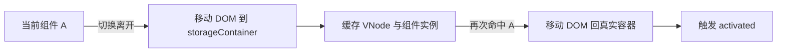

# Vue 3 `<KeepAlive>` 实现原理与实践指南

> `<KeepAlive>` 是 Vue 的内置抽象组件：它会缓存动态组件实例，而不是每次切换都重新创建。它适合“组件切走后还要保留本地状态”的场景，例如多标签页、表单编辑页和列表详情往返。

## 目录

- [一、先理解它解决什么问题](#一先理解它解决什么问题)
- [二、核心机制](#二核心机制)
- [三、生命周期与渲染流程](#三生命周期与渲染流程)
- [四、include、exclude 与 max](#四includeexclude-与-max)
- [五、源码级伪代码](#五源码级伪代码)
- [六、常见用法](#六常见用法)
- [七、常见误区与排查](#七常见误区与排查)
- [八、面试速答](#八面试速答)

---

## 一、先理解它解决什么问题

默认情况下，动态组件切换会卸载旧组件并创建新组件：

```text
A 挂载 → 切到 B → A 卸载 → 再切回 A → A 重新挂载
```

使用 `<KeepAlive>` 后，A 切走时不会卸载，而是进入缓存；再次切回时直接激活原实例：

```text
A 挂载 → 切到 B → A 停用（缓存）→ 再切回 A → A 激活（复用原实例）
```

因此它能保留：

- `ref` / `reactive` 中的本地状态；
- 表单输入、滚动位置、局部 UI 状态；
- 已创建的组件实例与子组件树。

它不会自动解决：请求数据过期、全局状态同步、内存占用和组件副作用清理。这些仍需由业务代码处理。

## 二、核心机制

### 2.1 缓存的对象与键

Vue 内部使用 `Map` 缓存组件的 VNode 子树，并用 `Set` 维护访问顺序。

```text
cache: Map<cacheKey, vnode>
keys:  Set<cacheKey>
```

缓存键的规则是：

```javascript
const cacheKey = vnode.key == null ? vnode.type : vnode.key;
```

也就是说，未显式提供 `key` 时，通常以组件类型作为键；提供 `key` 后，以 `key` 区分实例。**props 不会自动参与缓存键生成。**

```vue
<KeepAlive>
  <!-- 两次切换会复用同一个 UserPanel 实例；userId 变化不会自动创建新缓存 -->
  <UserPanel :user-id="userId" />
</KeepAlive>

<KeepAlive>
  <!-- 每个 userId 拥有独立缓存实例 -->
  <UserPanel :key="userId" :user-id="userId" />
</KeepAlive>
```

### 2.2 停用不是卸载

组件切走时，渲染器不会执行普通卸载，而是将对应 DOM 移到 KeepAlive 创建的隐藏容器 `storageContainer`。实例、响应式状态和 DOM 引用仍然存在。

切回时，渲染器把 DOM 移回页面，并复用之前的组件实例。因此切回不会触发 `onMounted`，而会触发 `onActivated`。



### 2.3 形状标记与渲染器协作

KeepAlive 会在 VNode 上设置内部 `shapeFlag`，告知渲染器：

- `COMPONENT_SHOULD_KEEP_ALIVE`：切走时应停用，而不是普通卸载；
- `COMPONENT_KEPT_ALIVE`：本次 VNode 命中了缓存，应走激活流程并复用实例。

这些是 Vue 内部实现细节，业务代码不应手动设置。

## 三、生命周期与渲染流程

### 3.1 生命周期顺序

首次显示：

```text
setup → onBeforeMount → 渲染 → onMounted → onActivated
```

切换离开：

```text
onDeactivated
```

再次显示：

```text
onActivated
```

真正销毁（父级卸载、被 `exclude` 排除或 LRU 淘汰）时：

```text
onBeforeUnmount → onUnmounted
```

`onActivated` / `onDeactivated` 同样会作用于 KeepAlive 缓存组件的后代组件。

### 3.2 适合放在哪里

| 需求 | 更合适的钩子 |
| --- | --- |
| 首次初始化、创建一次性资源 | `onMounted` |
| 每次回到页面刷新或恢复订阅 | `onActivated` |
| 切走时暂停轮询、视频或监听 | `onDeactivated` |
| 永久释放资源 | `onUnmounted` |

```vue
<script setup>
import { onActivated, onDeactivated, onUnmounted } from 'vue';

let timer;

onActivated(() => {
  timer = window.setInterval(refreshData, 30_000);
});

onDeactivated(() => {
  window.clearInterval(timer);
  timer = undefined;
});

onUnmounted(() => {
  window.clearInterval(timer);
});
</script>
```

## 四、include、exclude 与 max

```vue
<KeepAlive include="UserList,UserDetail" :max="10">
  <component :is="currentView" />
</KeepAlive>
```

| 属性 | 作用 | 注意事项 |
| --- | --- | --- |
| `include` | 只缓存名称匹配的组件 | 支持字符串、正则或数组 |
| `exclude` | 不缓存名称匹配的组件 | 与 `include` 同时命中时，排除优先 |
| `max` | 缓存上限 | 未设置时**不会**自动 LRU 淘汰 |

匹配依赖组件的 `name`。`<script setup>` 在现代 Vue 版本中通常会根据文件名推导名称；为避免路由缓存匹配失效，建议显式指定：

```vue
<script>
export default { name: 'UserDetail' };
</script>

<script setup>
// 组件实现
</script>
```

### LRU 淘汰

当设置了 `max`，并且新条目导致缓存数量超过上限时，Vue 会淘汰最久未使用的条目：

```text
keys = [A, B, C]
访问 B 后：keys = [A, C, B]
加入 D（max = 3）后：淘汰 A，keys = [C, B, D]
```

**淘汰与停用不同**：被淘汰的组件会真正执行卸载流程，DOM 和组件实例都可被回收。

## 五、源码级伪代码

以下是理解流程的简化伪代码，不是 Vue 源码的逐行复制：

```javascript
function setupKeepAlive(props, slots, renderer) {
  const cache = new Map();
  const keys = new Set();
  const storageContainer = renderer.createElement('div');

  function pruneCacheEntry(key) {
    const cachedVNode = cache.get(key);
    if (!cachedVNode) return;

    // 淘汰时是正常卸载，不是移入 storageContainer
    renderer.unmount(cachedVNode);
    cache.delete(key);
    keys.delete(key);
  }

  return () => {
    const vnode = getSingleComponentChild(slots.default?.());
    if (!vnode || !isComponent(vnode)) return vnode;

    const name = getComponentName(vnode.type);
    if (!shouldCache(name, props.include, props.exclude)) return vnode;

    const key = vnode.key ?? vnode.type;
    const cachedVNode = cache.get(key);

    if (cachedVNode) {
      vnode.el = cachedVNode.el;
      vnode.component = cachedVNode.component;
      vnode.shapeFlag |= COMPONENT_KEPT_ALIVE;
      keys.delete(key);
    } else {
      cache.set(key, vnode);
      if (props.max && keys.size >= Number(props.max)) {
        pruneCacheEntry(keys.values().next().value);
      }
    }

    keys.add(key);
    vnode.shapeFlag |= COMPONENT_SHOULD_KEEP_ALIVE;
    return vnode;
  };
}
```

真实实现还处理了异步组件、Suspense、过滤规则变化、缓存时机和渲染器注入等边界情况。

## 六、常见用法

### 6.1 动态组件

```vue
<template>
  <nav>
    <button @click="current = 'ListView'">列表</button>
    <button @click="current = 'ChartView'">图表</button>
  </nav>

  <KeepAlive :max="2">
    <component :is="current" />
  </KeepAlive>
</template>

<script setup>
import { ref } from 'vue';
import ListView from './ListView.vue';
import ChartView from './ChartView.vue';

const current = ref(ListView);
</script>
```

### 6.2 路由组件缓存

```vue
<RouterView v-slot="{ Component, route }">
  <KeepAlive :include="['UserList', 'UserDetail']" :max="10">
    <component :is="Component" :key="route.name" />
  </KeepAlive>
</RouterView>
```

是否使用 `:key="route.name"`、`route.fullPath` 或不传 `key`，取决于是否希望不同参数的路由共享状态。不要机械地使用 `fullPath`，否则可能为每个查询参数创建大量缓存实例。

### 6.3 强制刷新指定缓存

KeepAlive 没有公开的“按 key 删除缓存” API。常用做法是：让组件通过 `v-if` 暂时脱离 KeepAlive，或调整 `include` 使其被排除后再恢复。

```vue
<KeepAlive :include="includeNames">
  <component :is="currentView" />
</KeepAlive>
```

当需要清除 `UserDetail` 时，可先从 `includeNames` 中移除它，等待一次渲染完成后再加回。这样会导致该组件真正卸载，下一次进入时重新创建。

## 七、常见误区与排查

| 现象 | 常见原因 | 处理方式 |
| --- | --- | --- |
| 切回页面数据没有刷新 | 只在 `onMounted` 中请求数据 | 需要时在 `onActivated` 刷新或校验数据版本 |
| 页面切走后轮询仍在运行 | 缓存组件没有被卸载 | 在 `onDeactivated` 暂停轮询、Observer、媒体播放 |
| `include` 不生效 | 组件名称不匹配 | 显式设置组件 `name`，检查异步组件包装层 |
| 不同用户详情串状态 | 未给动态实例提供正确 `key` | 用业务唯一 ID 作为 `key`，并配合 `max` |
| 内存持续升高 | 缓存过多重组件 | 设置合理 `max`，不要缓存大图表、编辑器等重组件 |
| 以为 `v-if` 一定会销毁缓存 | 组件仍处于 KeepAlive 的缓存路径 | 通过 `include/exclude` 或改变缓存键，验证 `onUnmounted` 是否触发 |

## 八、面试速答

**Q：KeepAlive 的原理是什么？**

> KeepAlive 在内部以 `Map` 缓存组件 VNode，以 `Set` 维护访问顺序。组件切走时，渲染器根据内部标记将 DOM 移到隐藏容器并触发 `deactivated`，不执行卸载；再次切回时复用缓存的组件实例和 DOM，并触发 `activated`。设置 `max` 后使用 LRU 淘汰，淘汰时才真正卸载。

**Q：`activated` 和 `mounted` 有什么区别？**

> `mounted` 只在首次创建并挂载时触发；被 KeepAlive 缓存的组件每次重新显示都会触发 `activated`。切离页面时不会触发 `unmounted`，而会触发 `deactivated`。

**Q：什么时候不该使用 KeepAlive？**

> 组件体积大、存在昂贵的图表/编辑器资源、数据必须每次实时重置，或页面数量不可控时不应盲目缓存。KeepAlive 是用内存换切换速度，应配合 `include` 和 `max` 控制范围。
