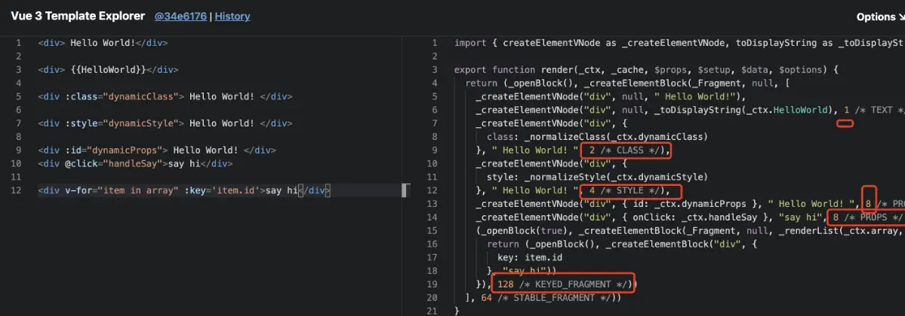
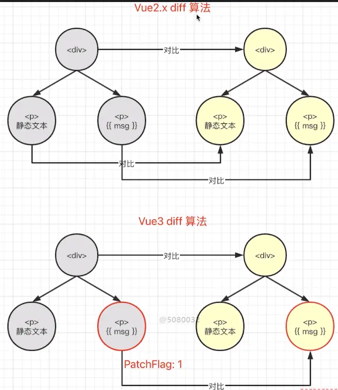

# 高级Vue3工程师面试题

## 目录

1. [Vue3响应式原理及实现过程](#vue3响应式原理及实现过程)
2. [Computed实现原理](#computed实现原理)
3. [Watch实现原理](#watch实现原理)
4. [KeepAlive实现原理](#keepalive实现原理)
5. [响应式系统进阶](#响应式系统进阶)
6. [虚拟DOM与Diff算法](#虚拟dom与diff算法)
7. [编译优化原理](#编译优化原理)
8. [组件化与渲染机制](#组件化与渲染机制)
9. [组合式API设计](#组合式api设计)
10. [Vue3工程化实践](#vue3工程化实践)
11. [性能优化策略](#性能优化策略)
12. [源码分析与设计思想](#源码分析与设计思想)

***

## Vue3响应式原理及实现过程vue2.x中，绑定事件每次触发都要重新生成全新的function去更新，cacheHandlers 是Vue3中提供的事件缓存对象，当 cacheHandlers 开启，会自动生成一个内联函数，同时生成一个静态节点。当事件再次触发时，只需从缓存中调用即可，无需再次更新。

默认情况下onClick会被视为动态绑定，所以每次都会追踪它的变化，但是同一个函数没必要追踪变化，直接缓存起来复用即可。

例如：下面我们同样是通过Vue 3 Template Explorer，来看一下事件监听器缓存的作用：

```
<div>
    <div @click="todo">做点有趣的事</div>
</div>

```

该段 html 经过编译后变成我们下面的结构(未开启事件监听缓存)：

```
export function render(...) {
    return (_openBlock(),_createBlock('div', null, [
            _createVNode('div',{ onClick: _ctx.todo}, '做点有趣的事', 8 /* PROPS */,
                ['onClick']),
        ])
    )
}

```

当开启事件监听器缓存后：

```
export function render(...) {
    return (_openBlock(),_createBlock('div', null, [
            _createVNode('div',{
                    onClick:    //开启监听后
                        _cache[1] || (_cache[1] = (...args) =>_ctx.todo(...args)),
                },'做点有趣的事'),
        ])
    )
}

```

可以对比开启事件监听缓存前后的代码，转换之后的代码, 大家可能还看不懂, 但是不要紧，我们只需要观察有没有静态标记即可，在Vue3的diff算法中, 只有有静态标记的才会进行比较, 才会进行追踪。


**1. 请详细阐述Vue3响应式系统的完整实现过程，从数据创建到视图更新的全链路。**

**答案：**

Vue3响应式系统的核心基于 **Proxy + Reflect + 依赖收集 + 副作用调度**，完整链路如下：

#### 第一阶段：响应式数据创建

```javascript
// 核心入口函数
function reactive(target) {
  // 只代理对象
  if (!isObject(target)) return target
  
  // 防止重复代理
  if (target.__v_isReactive) return target
  
  // 创建Proxy代理
  return new Proxy(target, {
    get(target, key, receiver) {
      // 特殊标记
      if (key === '__v_isReactive') return true
      if (key === '__v_raw') return target
      
      // 收集依赖
      track(target, key)
      
      // 使用Reflect确保this正确
      const result = Reflect.get(target, key, receiver)
      
      // 懒代理：只有访问到的嵌套对象才进行代理
      if (isObject(result)) {
        return reactive(result)
      }
      
      return result
    },
    
    set(target, key, value, receiver) {
      const oldValue = target[key]
      const hadKey = hasOwn(target, key)
      const result = Reflect.set(target, key, value, receiver)
      
      // 判断是新增还是修改
      if (!hadKey) {
        trigger(target, key, 'ADD', value)
      } else if (hasChanged(value, oldValue)) {
        trigger(target, key, 'SET', value, oldValue)
      }
      
      return result
    },
    
    deleteProperty(target, key) {
      const hadKey = hasOwn(target, key)
      const result = Reflect.deleteProperty(target, key)
      
      if (hadKey) {
        trigger(target, key, 'DELETE')
      }
      
      return result
    },
    
    has(target, key) {
      track(target, HAS)
      return Reflect.has(target, key)
    },
    
    ownKeys(target) {
      track(target, ITERATE)
      return Reflect.ownKeys(target)
    }
  })
}
```

**ref的实现：** 当传递值为对象时，内部调用reactive处理

```javascript
function ref(value) {
  // 如果已经是ref，直接返回
  if (isRef(value)) return value
  
  // 将对象转为reactive
  const reactiveValue = isObject(value) ? reactive(value) : value
  
  return {
    __v_isRef: true,
    get value() {
      track(this, 'value')
      return reactiveValue
    },
    set value(newVal) {
      if (hasChanged(newVal, reactiveValue)) {
        reactiveValue = isObject(newVal) ? reactive(newVal) : newVal
        trigger(this, 'value')
      }
    }
  }
}
```

#### 第二阶段：依赖收集系统

依赖收集的核心数据结构是 **WeakMap → Map → Set** 的三层结构：

```javascript
// 当前激活的副作用函数
let activeEffect = null

// 存储所有依赖关系
// WeakMap<target, Map<key, Set<effect>>>
const targetMap = new WeakMap()

function track(target, key) {
  if (!activeEffect) return // 不在副作用中，不收集
  
  let depsMap = targetMap.get(target)
  if (!depsMap) {
    depsMap = new Map()
    targetMap.set(target, depsMap)
  }
  
  let deps = depsMap.get(key)
  if (!deps) {
    deps = new Set()
    depsMap.set(key, deps)
  }
  
  // 将当前副作用函数添加到依赖集合
  deps.add(activeEffect)
  
  // 反向记录：副作用函数也记录它依赖了哪些集合
  // 用于清理不再需要的依赖
  activeEffect.deps.push(deps)
}
```

**选择WeakMap的原因：**

- WeakMap的key是弱引用，不影响垃圾回收
- 当响应式对象不再被引用时，其依赖关系可被自动回收
- 避免内存泄漏

#### 第三阶段：触发更新

```javascript
function trigger(target, key, type, newValue, oldValue) {
  const depsMap = targetMap.get(target)
  if (!depsMap) return
  
  // 收集需要执行的effect
  const effects = new Set()
  
  // 直接依赖当前key的effect
  const deps = depsMap.get(key)
  if (deps) {
    deps.forEach(effect => effects.add(effect))
  }
  
  // 新增/删除操作还需要执行迭代相关的effect
  if (type === 'ADD' || type === 'DELETE') {
    const iterateEffects = depsMap.get(ITERATE_KEY)
    if (iterateEffects) {
      iterateEffects.forEach(effect => effects.add(effect))
    }
  }
  
  // 执行所有effect
  effects.forEach(effect => {
    if (effect.scheduler) {
      // 有调度器则使用调度器
      effect.scheduler()
    } else {
      // 直接执行
      effect()
    }
  })
}
```

#### 第四阶段：副作用执行与调度

```javascript
// effect函数
function effect(fn, options = {}) {
  const effectFn = () => {
    // 清理旧依赖
    cleanup(effectFn)
    
    try {
      activeEffect = effectFn
      return fn()
    } finally {
      activeEffect = null
    }
  }
  
  // 存储与effect相关的元信息
  effectFn.deps = []
  effectFn.options = options
  
  // 非lazy模式下立即执行
  if (!options.lazy) {
    effectFn()
  }
  
  return effectFn
}

// 清理依赖
function cleanup(effectFn) {
  for (let i = 0; i < effectFn.deps.length; i++) {
    const deps = effectFn.deps[i]
    deps.delete(effectFn)
  }
  effectFn.deps.length = 0
}
```

#### 第五阶段：与Vue组件的联动

组件渲染时，render函数会被包装在effect中执行：

```javascript
// 简化的组件挂载过程
function mountComponent(component) {
  const instance = createComponentInstance(component)
  
  // 创建渲染effect
  const renderEffect = effect(
    () => {
      // 执行render，触发响应式数据的getter
      // 从而收集当前组件的渲染依赖
      const subTree = instance.render()
      
      // patch新旧子树
      patch(instance.subTree, subTree)
      instance.subTree = subTree
    },
    {
      scheduler: () => {
        // 组件更新调度：异步批量更新
        queueJob(renderEffect)
      }
    }
  )
}
```

**完整链路总结：**

```
用户操作/数据变化
    ↓
setter触发/trigger调用
    ↓
查找依赖集合中的effect
    ↓
scheduler调度 → 加入异步队列
    ↓
批量执行 → 组件重新渲染
    ↓
render函数执行 → 访问响应式数据
    ↓
getter触发/track收集
    ↓
生成新虚拟DOM树
    ↓
diff/patch更新真实DOM
```

***

**2. 请详细对比Vue2的Object.defineProperty和Vue3的Proxy在响应式实现上的差异。**

**答案：**

| 对比维度         | Vue2 (defineProperty) | Vue3 (Proxy)                  |
| ------------ | --------------------- | ----------------------------- |
| **拦截方式**     | 劫持属性getter/setter     | 代理整个对象所有操作                    |
| **新增属性**     | 无法检测，需Vue.set         | 天然支持                          |
| **删除属性**     | 无法检测，需Vue.delete      | 天然支持                          |
| **数组监听**     | 重写7个数组方法              | 原生支持索引和length变化               |
| **初始化性能**    | 递归遍历所有属性              | 懒代理，访问时才代理                    |
| **内存占用**     | 每个属性都要定义getter/setter | 一个Proxy代理整个对象                 |
| **支持数据类型**   | 对象、数组（有限）             | 对象、数组、Map、Set、WeakMap、WeakSet |
| **嵌套对象**     | 初始化时递归处理              | 访问时懒代理                        |
| **Symbol属性** | 不支持                   | 支持                            |
| **兼容性**      | IE9+                  | 不支持IE                         |

**性能差异示例：**

```javascript
// Vue2：初始化时递归响应化
function defineReactive(obj, key, val) {
  // 递归处理嵌套对象
  if (isObject(val)) {
    observe(val) // 立即递归
  }
  
  Object.defineProperty(obj, key, {
    get() {
      // 收集依赖
      dep.depend()
      return val
    },
    set(newVal) {
      if (newVal === val) return
      val = newVal
      // 触发更新
      dep.notify()
    }
  })
}

// 大数据量时Vue2会卡住
const bigData = { /* 数千个属性的对象 */ }
observe(bigData) // Vue2中会一次性递归完

// Vue3：懒代理，访问到才代理
const bigDataProxy = reactive(bigData)
// 只创建了一层Proxy，内层对象访问时才代理
```

***

**3. 请解释Vue3响应式系统的嵌套代理实现和raw（原始对象）获取机制。**

**答案：**

Vue3的响应式系统采用 **懒代理（Lazy Proxy）** 策略，这是区别于Vue2的重要优化。

```javascript
// 懒代理实现
const reactive = (target) => {
  // 1. 检查是否已经代理过
  if (target.__v_isReactive) return target
  
  // 2. 检查是否是原始对象（避免代理代理对象）
  if (isProxy(target)) {
    // 如果传入的是代理对象，返回其原始对象再重新代理
    return reactive(toRaw(target))
  }
  
  // 3. 创建Proxy（只代理当前层）
  return new Proxy(target, handler)
}

// 获取原始对象
function toRaw(observed) {
  const raw = observed && observed.__v_raw
  return raw ? toRaw(raw) : observed
}

// 通过标记判断
// reactive对象标记: __v_isReactive = true
// 原始对象标记: __v_raw = target
```

**嵌套代理的工作流程：**

```javascript
const obj = reactive({
  a: 1,
  b: {
    c: 2,
    d: { e: 3 }
  }
})

// 初始状态：
// obj → Proxy(外层)
// obj.b → 普通对象（未代理）

// 访问obj.b时触发getter
console.log(obj.b) 
// getter中检测到obj.b是对象，调用reactive(obj.b)
// 此时才创建内层Proxy
// obj.b → Proxy(内层)

// 访问obj.b.d时再次触发内层getter
console.log(obj.b.d)
// 再次懒代理，创建更深层Proxy
```

**这种设计的好处：**

1. **减少初始化开销**：不需要一次性递归所有嵌套对象
2. **按需代理**：只有被访问到的嵌套属性才会被代理
3. **避免循环引用问题**：Proxy基于访问时创建，天然处理循环引用

***

### 编程题

**1. 请手写一个完整的Vue3简化版响应式系统，包括reactive、ref、effect、computed、track、trigger。**

**参考答案：**

```javascript
// ==================== 工具函数 ====================
const isObject = val => val !== null && typeof val === 'object'
const hasOwn = (obj, key) => Object.prototype.hasOwnProperty.call(obj, key)
const hasChanged = (newVal, oldVal) => !Object.is(newVal, oldVal)
const isIntegerKey = key => typeof key === 'string' && /^\d+$/.test(key)

// ==================== 依赖管理核心 ====================
let activeEffect = null
let effectStack = []
const targetMap = new WeakMap()

// 清理依赖
function cleanup(effectFn) {
  const { deps } = effectFn
  if (deps.length) {
    for (let i = 0; i < deps.length; i++) {
      deps[i].delete(effectFn)
    }
    deps.length = 0
  }
}

// 依赖收集
function track(target, key) {
  if (!activeEffect) return
  
  let depsMap = targetMap.get(target)
  if (!depsMap) {
    depsMap = new Map()
    targetMap.set(target, depsMap)
  }
  
  let deps = depsMap.get(key)
  if (!deps) {
    deps = new Set()
    depsMap.set(key, deps)
  }
  
  if (!deps.has(activeEffect)) {
    deps.add(activeEffect)
    activeEffect.deps.push(deps)
  }
}

// 触发更新
function trigger(target, key, type, newValue) {
  const depsMap = targetMap.get(target)
  if (!depsMap) return
  
  const effectsToRun = new Set()
  
  // 添加与key相关的effect
  const deps = depsMap.get(key)
  if (deps) {
    deps.forEach(effect => {
      if (effect !== activeEffect) {
        effectsToRun.add(effect)
      }
    })
  }
  
  // 数组length变化特殊处理
  if (key === 'length' && Array.isArray(target)) {
    depsMap.forEach((deps, key) => {
      if (isIntegerKey(key) && +key >= newValue) {
        deps.forEach(effect => {
          if (effect !== activeEffect) {
            effectsToRun.add(effect)
          }
        })
      }
    })
  }
  
  // 新增或删除操作触发迭代effect
  if (type === 'ADD' || type === 'DELETE') {
    const iterateDeps = depsMap.get(ITERATE_KEY)
    if (iterateDeps) {
      iterateDeps.forEach(effect => {
        if (effect !== activeEffect) {
          effectsToRun.add(effect)
        }
      })
    }
  }
  
  // 执行所有effect
  effectsToRun.forEach(effect => {
    if (effect.scheduler) {
      effect.scheduler()
    } else {
      effect()
    }
  })
}

// effect函数
function effect(fn, options = {}) {
  const effectFn = function() {
    cleanup(effectFn)
    try {
      activeEffect = effectFn
      effectStack.push(effectFn)
      return fn()
    } finally {
      effectStack.pop()
      activeEffect = effectStack[effectStack.length - 1]
    }
  }
  
  effectFn.deps = []
  effectFn.options = options
  effectFn.scheduler = options.scheduler
  
  if (!options.lazy) {
    effectFn()
  }
  
  return effectFn
}

// ==================== reactive ====================
const reactiveHandler = {
  get(target, key, receiver) {
    if (key === '__v_isReactive') return true
    if (key === '__v_raw') return target
    
    track(target, key)
    
    const result = Reflect.get(target, key, receiver)
    
    // 懒代理
    if (isObject(result)) {
      return reactive(result)
    }
    
    return result
  },
  
  set(target, key, value, receiver) {
    const oldValue = target[key]
    const hadKey = hasOwn(target, key)
    const oldTarget = Array.isArray(target) ? [...target] : target
    const result = Reflect.set(target, key, value, receiver)
    
    if (target === toRaw(receiver)) {
      if (!hadKey) {
        trigger(target, key, 'ADD', value)
      } else if (hasChanged(value, oldValue)) {
        trigger(target, key, 'SET', value, oldValue)
      }
    }
    
    return result
  },
  
  deleteProperty(target, key) {
    const hadKey = hasOwn(target, key)
    const result = Reflect.deleteProperty(target, key)
    
    if (hadKey) {
      trigger(target, key, 'DELETE')
    }
    
    return result
  },
  
  has(target, key) {
    track(target, key)
    return Reflect.has(target, key)
  },
  
  ownKeys(target) {
    track(target, Array.isArray(target) ? 'length' : Symbol('iterate'))
    return Reflect.ownKeys(target)
  }
}

function reactive(target) {
  if (!isObject(target)) return target
  if (target.__v_isReactive) return target
  if (isProxy(target)) return reactive(toRaw(target))
  
  return new Proxy(target, reactiveHandler)
}

function toRaw(observed) {
  const raw = observed && observed.__v_raw
  return raw ? toRaw(raw) : observed
}

function isProxy(value) {
  return value.__v_isReactive
}

// ==================== ref ====================
function ref(value) {
  if (isRef(value)) return value
  
  const wrappedValue = isObject(value) ? reactive(value) : value
  
  class RefImpl {
    __v_isRef = true
    
    get value() {
      track(this, 'value')
      return wrappedValue
    }
    
    set value(newVal) {
      if (hasChanged(newVal, wrappedValue)) {
        wrappedValue = isObject(newVal) ? reactive(newVal) : newVal
        trigger(this, 'value')
      }
    }
  }
  
  return new RefImpl()
}

function isRef(value) {
  return value && value.__v_isRef === true
}

// ==================== computed ====================
function computed(getterOrOptions) {
  let getter, setter
  
  if (typeof getterOrOptions === 'function') {
    getter = getterOrOptions
    setter = () => console.warn('computed is readonly')
  } else {
    getter = getterOrOptions.get
    setter = getterOrOptions.set || (() => console.warn('computed is readonly'))
  }
  
  let value
  let isDirty = true
  
  const computedEffect = effect(getter, {
    lazy: true,
    scheduler() {
      if (!isDirty) {
        isDirty = true
        trigger(computedRef, 'value')
      }
    }
  })
  
  const computedRef = {
    __v_isRef: true,
    __v_isComputed: true,
    
    get value() {
      if (isDirty) {
        value = computedEffect()
        isDirty = false
      }
      track(computedRef, 'value')
      return value
    },
    
    set value(newValue) {
      setter(newValue)
    }
  }
  
  return computedRef
}

// ==================== watch ====================
function watch(source, cb, options = {}) {
  let getter, oldValue
  
  if (isRef(source)) {
    getter = () => source.value
  } else if (isProxy(source)) {
    getter = () => traverse(source)
    options.deep = options.deep ?? true
  } else if (typeof source === 'function') {
    getter = source
  } else if (Array.isArray(source)) {
    getter = () => source.map(s => {
      if (isRef(s)) return s.value
      if (isProxy(s)) return traverse(s)
      if (typeof s === 'function') return s()
      return s
    })
  }
  
  if (options.deep) {
    const baseGetter = getter
    getter = () => traverse(baseGetter())
  }
  
  let cleanup
  const onCleanup = (fn) => {
    cleanup = fn
  }
  
  const job = () => {
    if (cleanup) cleanup()
    const newValue = watcherEffect()
    cb(newValue, oldValue, onCleanup)
    oldValue = newValue
  }
  
  const watcherEffect = effect(getter, {
    lazy: true,
    scheduler: job
  })
  
  if (options.immediate) {
    job()
  } else {
    oldValue = watcherEffect()
  }
  
  return () => {
    cleanup = undefined
    watcherEffect.deps.forEach(dep => dep.delete(watcherEffect))
  }
}

function traverse(value, seen = new Set()) {
  if (!isObject(value) || seen.has(value)) return value
  seen.add(value)
  
  if (Array.isArray(value)) {
    for (let i = 0; i < value.length; i++) {
      traverse(value[i], seen)
    }
  } else {
    for (const key in value) {
      traverse(value[key], seen)
    }
  }
  
  return value
}

// ==================== 测试 ====================
const state = reactive({
  count: 0,
  info: { name: 'Vue3' }
})

const double = computed(() => state.count * 2)

effect(() => {
  console.log('render:', state.count, double.value)
})

watch(() => state.count, (newVal, oldVal) => {
  console.log('watch:', oldVal, '->', newVal)
})

state.count++
state.info.name = 'Vue3 Reactive'
```

***

## Computed实现原理

### 选择题

**1. Vue3的computed默认执行策略是？**
A. 同步立即计算
B. 延迟计算（第一次访问时计算）
C. 异步计算
D. 定时计算

**答案：B**

**2. computed的缓存失效时机是？**
A. 每次访问时重新计算
B. 依赖的响应式数据变化时标记失效
C. 定时器触发时
D. 组件重新渲染时

**答案：B**

**3. computed的scheduler函数中，为什么不直接重新计算而是只设置isDirty？**
A. 防止重复计算
B. 避免不必要的计算，等访问时才计算
C. 代码实现更简单
D. 为了后续版本升级

**答案：B**

**4. 关于computed的可写模式（双向computed），描述正确的是？**
A. 所有computed都可写
B. 需要在创建时传入get和set
C. 可写模式下setter中不能修改源数据
D. 可写模式下getter自动失效

**答案：B**

**5. 多个computed相互依赖时，Vue3如何处理？**
A. 不支持循环依赖
B. 自动检测并报错
C. 按照依赖关系自动排序执行
D. 只计算最后一次

**答案：A**

**6. computed和method的主要区别是？**
A. computed有缓存，method每次都执行
B. method有缓存，computed没有
C. 两者没有区别
D. computed只能在template中使用

**答案：A**

***

### 简答题

**1. 请详细解释Vue3中computed的实现原理，包括懒执行机制、缓存策略、脏值检测、以及嵌套computed的处理。**

**答案：**

Vue3的computed基于effect系统实现，核心特点：**懒执行（Lazy）**、**缓存（Cache）**、**脏值检测（Dirty Checking）**。

#### 核心实现源码分析

```javascript
// Vue3源码简化实现
function computed(getterOrOptions) {
  // 1. 标准化getter/setter
  let getter, setter
  if (typeof getterOrOptions === 'function') {
    getter = getterOrOptions
    setter = () => {
      console.warn('Write operation failed: computed value is readonly')
    }
  } else {
    getter = getterOrOptions.get
    setter = getterOrOptions.set
  }

  let value                     // 缓存的值
  let isDirty = true           // 脏值标记
  let computedEffect           // computed对应的effect

  // 2. 创建computed effect（lazy模式）
  computedEffect = effect(getter, {
    lazy: true,                // 不立即执行
    scheduler: () => {         // 自定义调度器
      if (!isDirty) {
        isDirty = true         // 标记脏值
        trigger(computedRef, 'value') // 通知依赖computed的effect
      }
    }
  })

  // 3. computed ref对象
  const computedRef = {
    __v_isRef: true,
    __v_isComputed: true,
    
    get value() {
      // 脏值检测：只在需要时重新计算
      if (isDirty) {
        value = computedEffect()  // 执行getter重新计算
        isDirty = false           // 重置脏标记
      }
      
      // 收集computed自身的依赖
      track(computedRef, 'value')
      
      return value
    },
    
    set value(newValue) {
      setter(newValue)
    }
  }

  return computedRef
}
```

#### 关键机制分析

**1. 懒执行机制：**

```javascript
// 创建computed时不会执行getter
const total = computed(() => {
  console.log('计算total')  // 此代码不会立即执行
  return price.value * count.value
})

// 第一次访问.value时才会执行
console.log(total.value)  // 输出："计算total" + 结果
```

**2. 缓存机制：**

```javascript
// 第一次访问：计算并缓存
const double = computed(() => data.count * 2)
console.log(double.value) // 计算：data.count * 2
// 缓存：value = 结果, isDirty = false

// 第二次访问：直接返回缓存值（不执行getter）
console.log(double.value) // 直接返回value，不执行计算
```

**3. 脏值检测流程：**

```
vue2.x中，绑定事件每次触发都要重新生成全新的function去更新，cacheHandlers 是Vue3中提供的事件缓存对象，当 cacheHandlers 开启，会自动生成一个内联函数，同时生成一个静态节点。当事件再次触发时，只需从缓存中调用即可，无需再次更新。

默认情况下onClick会被视为动态绑定，所以每次都会追踪它的变化，但是同一个函数没必要追踪变化，直接缓存起来复用即可。

例如：下面我们同样是通过Vue 3 Template Explorer，来看一下事件监听器缓存的作用：

<div>
    <div @click="todo">做点有趣的事</div>
</div>
该段 html 经过编译后变成我们下面的结构(未开启事件监听缓存)：

export function render(...) {
    return (_openBlock(),_createBlock('div', null, [
            _createVNode('div',{ onClick: _ctx.todo}, '做点有趣的事', 8 /* PROPS */,
                ['onClick']),
        ])
    )
}
当开启事件监听器缓存后：

export function render(...) {
    return (_openBlock(),_createBlock('div', null, [
            _createVNode('div',{
                    onClick:    //开启监听后
                        _cache[1] || (_cache[1] = (...args) =>_ctx.todo(...args)),
                },'做点有趣的事'),
        ])
    )
}
可以对比开启事件监听缓存前后的代码，转换之后的代码, 大家可能还看不懂, 但是不要紧，我们只需要观察有没有静态标记即可，在Vue3的diff算法中, 只有有静态标记的才会进行比较, 才会进行追踪。访问.value
  → 检查 isDirty
  → true：执行 computedEffect() → 更新value → isDirty = false → 返回value
  → false：直接返回value

依赖变化时
  → scheduler被调用
  → isDirty = true（只标记，不计算）
  → 通知依赖了computed的effect（如渲染effect）

再次访问.value
  → isDirty为true → 重新计算
```

#### 嵌套computed的处理

```javascript
const price = ref(10)
const count = ref(2)
const subtotal = computed(() => price.value * count.value)
const total = computed(() => subtotal.value * 1.2)  // 嵌套computed

// 访问total时：
// 1. total.getter执行，访问subtotal.value
// 2. subtotal检测isDirty（首次为true），执行getter
// 3. subtotal getter执行，访问price和count
// 4. price和count收集total的effect作为依赖
// 5. subtotal缓存结果，返回给total
// 6. total继续计算，返回最终结果

// 当price变化时：
// 1. trigger(price, 'value')
// 2. price的依赖中包含subtotal的computedEffect的scheduler
// 3. subtotal的scheduler标记isDirty为true
// 4. subtotal的scheduler触发total的trigger
// 5. total重新计算 → 访问subtotal.value → 重新计算subtotal
```

**与Vue2 computed的关键区别：**

| 特性         | Vue2 computed     | Vue3 computed    |
| ---------- | ----------------- | ---------------- |
| 依赖追踪       | 在Watcher中手动管理     | 基于effect自动追踪     |
| 缓存机制       | 基于Watcher.dirty属性 | 基于isDirty标记      |
| 调度执行       | 同步                | 支持scheduler自定义调度 |
| 嵌套computed | 依赖Watcher队列       | 原生支持，自动处理        |
| 类型安全       | 不原生支持             | 完美支持TypeScript   |

***

**2. 如何理解computed的懒执行和缓存特性在性能优化上的意义？**

**答案：**

#### 性能价值分析

**1. 减少不必要的计算：**

```javascript
// 场景：大型列表计算
const list = ref(generateLargeList(10000))
const totalPrice = computed(() => {
  console.log('complex calculation')
  return list.value.reduce((sum, item) => sum + item.price * item.quantity, 0)
})

// 模板中多处使用computed值
// <div>Total: {{ totalPrice }}</div>
// <div>Tax: {{ totalPrice * 0.13 }}</div>
// <div>Grand: {{ totalPrice + shipping }}</div>

// 模板渲染时三次访问totalPrice
// 但由于缓存机制，getter只执行一次！
```

**2. 避免无依赖变化的计算：**

```javascript
const searchResults = computed(() => {
  return expensiveFilter(allData.value, searchQuery.value)
})

// 用户点击button（不涉及searchQuery和allData）
// computed不会重新计算
const randomClick = () => console.log('click') 
```

**3. 优化渲染性能：**

computed与其他响应式数据的联动形成了 **精确的依赖图**，确保只有真正依赖变化的部分才会更新。

***

### 编程题

**1. 请手写一个完整的computed实现，支持getter模式和get/set模式，包含懒执行、缓存和脏值检测，以及computed之间的嵌套依赖。**

**参考答案：**

```javascript
// ==================== 环境准备 ====================
// （省略reactive、effect、track、trigger等基础实现，
//  参考上一节完整代码）

// ==================== computed完整实现 ====================
const computed = (getterOrOptions) => {
  // 1. 参数标准化
  let getter, setter
  
  if (typeof getterOrOptions === 'function') {
    getter = getterOrOptions
    setter = () => {
      if (__DEV__) {
        console.warn('Computed value is readonly')
      }
    }
  } else {
    getter = getterOrOptions.get
    setter = getterOrOptions.set || (() => {
      if (__DEV__) {
        console.warn('Computed value is readonly')
      }
    })
  }
  
  // 2. 缓存与标记状态
  let cachedValue
  let isDirty = true
  let computedEffect = null
  
  // 3. 创建带有调度器的effect
  const runner = effect(getter, {
    lazy: true,
    scheduler: () => {
      // 依赖变化时只标记脏值，不立即重新计算
      if (!isDirty) {
        isDirty = true
        // 通知依赖此computed的副作用
        trigger(computedRef, 'value', 'SET')
      }
    }
  })
  
  // 4. 构建computed ref对象
  const computedRef = {
    __v_isRef: true,
    __v_isComputed: true,
    
    get value() {
      // 脏值检测 - 只在需要时重新计算
      if (isDirty) {
        cachedValue = runner()
        isDirty = false
      }
      
      // 收集依赖（让其他effect能依赖此computed）
      track(computedRef, 'value')
      
      return cachedValue
    },
    
    set value(newVal) {
      const oldValue = cachedValue
      setter(newVal)
      // 如果setter改变了响应式数据，计算机会自动更新
    }
  }
  
  return computedRef
}

// ==================== 测试用例 ====================

// 测试1：基本computed
console.log('--- Test 1: Basic computed ---')
const count = ref(1)
const doubled = computed(() => {
  console.log('[doubled] computing...')
  return count.value * 2
})

console.log('First access:', doubled.value) // 计算：2
console.log('Second access:', doubled.value) // 缓存：2（不执行getter）
count.value = 2 // 标记脏值
console.log('After change:', doubled.value) // 重新计算：4

// 测试2：可写computed
console.log('--- Test 2: Writable computed ---')
const firstName = ref('John')
const lastName = ref('Doe')
const fullName = computed({
  get: () => `${firstName.value} ${lastName.value}`,
  set: (val) => {
    const parts = val.split(' ')
    firstName.value = parts[0]
    lastName.value = parts.slice(1).join(' ')
  }
})

console.log('fullName:', fullName.value) // John Doe
fullName.value = 'Jane Smith'
console.log('firstName:', firstName.value) // Jane
console.log('lastName:', lastName.value) // Smith

// 测试3：嵌套computed
console.log('--- Test 3: Nested computed ---')
const price = ref(100)
const quantity = ref(2)
const subtotal = computed(() => {
  console.log('[subtotal] computing...')
  return price.value * quantity.value
})
const tax = computed(() => {
  console.log('[tax] computing...')
  return subtotal.value * 0.13
})
const total = computed(() => {
  console.log('[total] computing...')
  return subtotal.value + tax.value
})

console.log('total:', total.value) // 依次计算subtotal → tax → total
price.value = 200 // 标记所有依赖脏值
console.log('total after price change:', total.value) // 重新计算链

// 测试4：computed在模板渲染中复用
console.log('--- Test 4: Multi-reference in one render ---')
const renderEffect = effect(() => {
  console.log('[render]', {
    subtotal: subtotal.value,
    tax: tax.value,
    total: total.value
  })
})
// 即使访问三次，subtotal/tax/total各自只计算一次
```

***

## Watch实现原理

### 选择题

**1. Vue3中watch和watchEffect的核心区别是？**
A. watch自动收集依赖，watchEffect需要指定数据源
B. watch需要指定数据源且能获取新旧值，watchEffect自动收集依赖
C. watchEffect有缓存机制
D. watch不支持immediate选项

**答案：B**

**2. watch的deep:true内部是如何实现的？**
A. 递归监听对象的所有属性
B. 递归访问对象的所有属性以触发依赖收集
C. 使用Object.observe监听
D. 定时轮询检查变化

**答案：B**

**3. watch的immediate:true选项，回调函数的oldValue值是什么？**
A. undefined
B. null
C. 当前值
D. 初始值

**答案：A**

**4. 关于watch的cleanup函数（onCleanup），描述正确的是？**
A. 用于清理watch监听
B. 用于处理竞态问题，在前一次回调未完成时清理
C. 只在watchEffect中可用
D. 用于清理响应式数据

**答案：B**

**5. watch监听响应式对象时，默认是否开启deep？**
A. 对所有source都默认开启
B. 只有source是reactive对象时默认开启
C. 默认都不开启
D. 取决于options配置

**答案：B**

**6. watch返回的停止函数的实现原理是？**
A. 将watch的scheduler置空
B. 清理watch的effect的所有依赖
C. 删除响应式数据
D. 停止组件渲染

**答案：B**

**7. watchEffect的执行时机是？**
A. 组件挂载前同步执行
B. 创建时立即执行一次
C. 组件更新后执行
D. 在nextTick中执行

**答案：B**

**8. watchEffect的自动清理（cleanup）通常用于什么场景？**
A. 取消之前的异步请求
B. 清理DOM元素
C. 清理定时器
D. 以上都是

**答案：D**

***

### 简答题

**1. 请详细分析Vue3中watch的实现原理，包括不同类型的source处理、deep实现、竞态处理、以及停止机制。**

**答案：**

#### 整体架构

Vue3的watch基于 **effect + scheduler** 模式实现，核心是利用effect的lazy特性和自定义调度器。

#### 源码级实现分析

```javascript
// Vue3 watch核心实现（简化版）
function watch(source, cb, options = {}) {
  // ====== 第一步：标准化getter ======
  let getter
  let isMultiSource = false
  
  // 根据source类型生成对应的getter函数
  if (isRef(source)) {
    // ref: 访问.value
    getter = () => source.value
  } else if (isReactive(source)) {
    // reactive: 默认deep:true
    getter = () => source
    options.deep = options.deep ?? true
  } else if (Array.isArray(source)) {
    // 数组source: 分别处理每个元素
    isMultiSource = true
    getter = () => source.map(s => {
      if (isRef(s)) return s.value
      if (isReactive(s)) return traverse(s)
      if (isFunction(s)) return s()
      return s
    })
  } else if (isFunction(source)) {
    // 函数source: 直接使用
    getter = source
  } else {
    getter = noop
    console.warn('Invalid watch source')
  }

  // ====== 第二步：处理deep选项 ======
  if (options.deep) {
    // 在原getter基础上包装traverse
    // traverse会递归访问对象的所有属性
    // 目的是触发所有属性的getter进行依赖收集
    const baseGetter = getter
    getter = () => traverse(baseGetter())
  }

  // ====== 第三步：竞态处理机制 ======
  let cleanup
  const onCleanup = (fn) => {
    cleanup = fn
  }

  // ====== 第四步：核心调度逻辑 ======
  let oldValue
  
  const job = () => {
    // 执行前清理（处理竞态）
    if (cleanup) {
      cleanup()
    }
    
    // 获取新值
    const newValue = effectFn()
    
    // 新旧值比对
    if (isMultiSource) {
      // 数组source：检查每个元素是否有变化
      if (newValue.some((val, i) => hasChanged(val, oldValue[i]))) {
        cb(newValue, oldValue, onCleanup)
      }
    } else {
      // 单值source：直接比较
      if (hasChanged(newValue, oldValue)) {
        cb(newValue, oldValue, onCleanup)
      }
    }
    
    // 更新旧值
    oldValue = newValue
  }

  // ====== 第五步：创建effect ======
  const effectFn = effect(getter, {
    lazy: true,           // 不立即执行，用于获取值
    scheduler: job        // 依赖变化时执行job
  })

  // ====== 第六步：初始执行 ======
  if (options.immediate) {
    // immediate模式：立即执行回调
    job()
  } else {
    // 正常模式：先获取初始值
    oldValue = effectFn()
  }

  // ====== 第七步：返回停止函数 ======
  return () => {
    // 清理依赖
    cleanup = undefined
    // 从所有依赖集合中移除effect
    effectFn.deps.forEach(dep => dep.delete(effectFn))
    // 清空deps数组
    effectFn.deps.length = 0
  }
}
```

#### 关键机制详解

**1. deep选项的实现原理：**

```javascript
// traverse函数递归访问对象的所有属性
// 目的是触发所有属性的getter，完成依赖收集
function traverse(value, seen = new Set()) {
  // 防止循环引用（对象自引用的场景）
  if (!isObject(value) || seen.has(value)) return value
  seen.add(value)
  
  if (isRef(value)) {
    // ref需要访问.value
    traverse(value.value, seen)
  } else if (Array.isArray(value)) {
    // 数组遍历每个元素
    for (let i = 0; i < value.length; i++) {
      traverse(value[i], seen)
    }
  } else if (isObject(value)) {
    // 对象遍历所有key
    for (const key in value) {
      traverse(value[key], seen)
    }
  }
  
  return value
}

// 使用示例
const state = reactive({
  user: {
    profile: {
      name: 'Alice',
      address: {
        city: 'Beijing'
      }
    }
  }
})

// 不设deep时，watch只能监听state.user的变化
// 无法监听state.user.profile.name的变化
watch(() => state.user, (newVal) => {
  // state.user.profile.name = 'Bob' 不会触发
})

// 设置deep后，traverse递归访问所有层级
// 所有层级的属性都被收集为依赖
watch(() => state.user, (newVal) => {
  // 任何深层变化都能监听到
}, { deep: true })
```

**2. 竞态处理机制：**

```javascript
// 典型的竞态场景：
// 用户输入搜索关键词，连续快速输入
watch(searchQuery, async (newQuery, oldQuery, onCleanup) => {
  let cancelled = false
  
  // 注册清理函数
  onCleanup(() => {
    cancelled = true
  })
  
  const results = await fetchSearchResults(newQuery)
  
  // 如果在前一次请求完成前又有新的输入
  // 此时已执行了cleanup，cancelled为true
  // 因此忽略本次结果
  if (!cancelled) {
    searchResults.value = results
  }
})

// 实现原理：
let cleanup
const onCleanup = (fn) => {
  cleanup = fn
}

const job = () => {
  // 每次执行job前先执行之前的cleanup
  // 如果前一次异步操作注册了cleanup
  // 这里会执行它（例如设置cancelled = true）
  if (cleanup) {
    cleanup()
  }
  
  // 执行回调，让回调注册新的cleanup
  cb(newValue, oldValue, onCleanup)
}
```

**3. watchEffect实现（对比）：**

```javascript
function watchEffect(effect, options = {}) {
  let cleanup
  
  const onCleanup = (fn) => {
    cleanup = fn
  }
  
  const getter = () => {
    // 执行前清理
    if (cleanup) {
      cleanup()
    }
    // 执行用户定义的effect函数
    effect(onCleanup)
  }
  
  // watchEffect不需要指定数据源
  // 在getter中访问响应式数据自动收集依赖
  const runner = effect(getter, {
    lazy: false,         // 立即执行
    scheduler: () => {
      // 依赖变化时重新执行
      runner()
    }
  })
  
  // 返回停止函数
  return () => {
    cleanup = undefined
    runner.deps.forEach(dep => dep.delete(runner))
  }
}
```

***

**2. 请对比watch、watchEffect、watchPostEffect、watchSyncEffect的差异和使用场景。**

**答案：**

| 特性          | watch                 | watchEffect           | watchPostEffect | watchSyncEffect |
| ----------- | --------------------- | --------------------- | --------------- | --------------- |
| **执行时机**    | 首次不执行（默认）             | 立即执行                  | 立即执行            | 立即执行            |
| **数据源**     | 需明确指定                 | 自动收集                  | 自动收集            | 自动收集            |
| **新旧值**     | 支持                    | 不支持                   | 不支持             | 不支持             |
| **调度时机**    | 默认异步(前)               | 默认异步(前)               | 组件更新后(post)     | 同步(sync)        |
| **flush选项** | 'pre'\|'post'\|'sync' | 'pre'\|'post'\|'sync' | 'post'固定        | 'sync'固定        |
| **缓存机制**    | 无                     | 无                     | 无               | 无               |
| **竞态处理**    | onCleanup             | onCleanup             | onCleanup       | onCleanup       |

**选择指南：**

```javascript
// watch：需要精确控制、需要新旧值的场景
// 场景1：监听表单变化执行验证
watch(formData, (newVal, oldVal) => {
  validateForm(newVal, oldVal)
}, { deep: true })

// 场景2：监听路由变化
watch(() => route.path, (newPath, oldPath) => {
  analytics.trackPage(newPath, oldPath)
})

// watchEffect：副作用自动追踪，不需要关心具体哪些数据变化
// 场景1：日志记录
watchEffect(() => {
  console.log('当前状态:', state.count, state.name)
})

// 场景2：数据同步
watchEffect(() => {
  localStorage.setItem('draft', JSON.stringify(draft.value))
})

// watchPostEffect：需要在DOM更新后执行的逻辑
// 场景：操作更新后的DOM
watchPostEffect(() => {
  // DOM已更新，可以获取最新尺寸
  const height = elementRef.value?.offsetHeight
  adjustLayout(height)
})

// watchSyncEffect：需要同步执行（性能敏感，慎用）
// 场景：需要立即同步更新
watchSyncEffect(() => {
  // 同步执行，不等待异步队列
  syncState.value = computeImmediately()
})
```

***

### 编程题

**1. 请手写一个完整的watch实现，支持ref、reactive、函数、数组四种source类型，支持immediate、deep、flush选项，支持竞态处理。**

**参考答案：**

```javascript
// ==================== watch完整实现 ====================
function watch(source, callback, options = {}) {
  // ====== 工具函数 ======
  const isRef = (v) => v && v.__v_isRef
  const isReactive = (v) => v && v.__v_isReactive
  const isFunction = (v) => typeof v === 'function'
  const isObject = (v) => v !== null && typeof v === 'object'
  const hasChanged = (a, b) => !Object.is(a, b)
  
  const traverse = (value, seen = new Set()) => {
    if (!isObject(value) || seen.has(value) || value instanceof Date) return
    seen.add(value)
    
    if (isRef(value)) {
      traverse(value.value, seen)
    } else if (Array.isArray(value)) {
      for (const item of value) {
        traverse(item, seen)
      }
    } else {
      for (const key in value) {
        traverse(value[key], seen)
      }
    }
    
    return value
  }
  
  // ====== 标准化getter ======
  let getter
  let isMultiSource = false
  
  if (isRef(source)) {
    getter = () => source.value
  } else if (isReactive(source)) {
    getter = () => source
    options.deep = options.deep ?? true
  } else if (Array.isArray(source)) {
    isMultiSource = true
    getter = () => source.map(s => {
      if (isRef(s)) return s.value
      if (isReactive(s)) return traverse(s)
      if (isFunction(s)) return s()
      return s
    })
  } else if (isFunction(source)) {
    getter = source
  } else {
    getter = () => {}
    console.warn('[Vue warn]: Invalid watch source')
  }
  
  // ====== 处理deep ======
  if (options.deep) {
    const baseGetter = getter
    getter = () => traverse(baseGetter())
  }
  
  // ====== 竞态处理 ======
  let cleanup
  const onCleanup = (fn) => {
    cleanup = fn
  }
  
  // ====== 调度处理 ======
  let oldValue
  let scheduler
  
  const job = () => {
    if (cleanup) cleanup()
    
    const newValue = effectFn()
    
    if (isMultiSource) {
      if (newValue.some((v, i) => hasChanged(v, oldValue[i]))) {
        callback(newValue, oldValue, onCleanup)
      }
    } else {
      if (hasChanged(newValue, oldValue)) {
        callback(newValue, oldValue, onCleanup)
      }
    }
    
    oldValue = newValue
  }
  
  // 根据flush选项决定调度时机
  const flush = options.flush || 'pre'
  
  if (flush === 'sync') {
    scheduler = job
  } else if (flush === 'post') {
    scheduler = () => {
      // 使用Promise微任务或nextTick
      Promise.resolve().then(job)
    }
  } else {
    // 'pre'：默认异步队列（简化实现）
    scheduler = () => {
      Promise.resolve().then(job)
    }
  }
  
  // ====== 创建effect ======
  let activeEffect = null
  const targetMap = new WeakMap()
  
  const track = (target, key) => {
    if (!activeEffect) return
    let depsMap = targetMap.get(target)
    if (!depsMap) {
      depsMap = new Map()
      targetMap.set(target, depsMap)
    }
    let deps = depsMap.get(key)
    if (!deps) {
      deps = new Set()
      depsMap.set(key, deps)
    }
    deps.add(activeEffect)
    activeEffect.deps.push(deps)
  }
  
  const trigger = (target, key) => {
    const depsMap = targetMap.get(target)
    if (!depsMap) return
    const deps = depsMap.get(key)
    if (deps) {
      deps.forEach(effect => {
        if (effect !== activeEffect) {
          if (effect.scheduler) {
            effect.scheduler()
          } else {
            effect()
          }
        }
      })
    }
  }
  
  const effect = (fn, options) => {
    const effectFn = () => {
      // 清理旧依赖
      if (effectFn.deps) {
        for (const dep of effectFn.deps) {
          dep.delete(effectFn)
        }
        effectFn.deps.length = 0
      }
      
      try {
        activeEffect = effectFn
        return fn()
      } finally {
        activeEffect = null
      }
    }
    
    effectFn.deps = []
    effectFn.scheduler = options?.scheduler
    
    if (!options?.lazy) {
      effectFn()
    }
    
    return effectFn
  }
  
  // ====== 创建watch的effect ======
  const effectFn = effect(getter, {
    lazy: true,
    scheduler
  })
  
  // ====== 初始化执行 ======
  if (options.immediate) {
    job()
  } else {
    oldValue = effectFn()
  }
  
  // ====== 返回停止函数 ======
  return () => {
    if (cleanup) cleanup()
    if (effectFn.deps) {
      for (const dep of effectFn.deps) {
        dep.delete(effectFn)
      }
      effectFn.deps.length = 0
    }
  }
}

// ==================== 测试用例 ====================
console.log('=== Watch Implementation Test ===')

// 测试1：watch ref
const count = { __v_isRef: true, value: 0 }
const unwatch1 = watch(count, (newVal, oldVal) => {
  console.log(`count: ${oldVal} -> ${newVal}`)
})
count.value++
count.value++

// 测试2：watch reactive（自动deep）
const reactiveState = { __v_isReactive: true, user: { name: 'Alice', age: 25 } }
watch(reactiveState, (newVal) => {
  console.log('reactive state changed:', newVal)
}, { deep: true })

// 测试3：watch getter function
watch(() => count.value * 2, (newVal, oldVal) => {
  console.log(`doubled: ${oldVal} -> ${newVal}`)
})

// 测试4：watch with immediate
watch(count, (newVal, oldVal) => {
  console.log(`immediate watch: ${oldVal} -> ${newVal}`)
}, { immediate: true })

// 测试5：竞态处理
watch(count, async (newVal, oldVal, onCleanup) => {
  let cancelled = false
  onCleanup(() => { cancelled = true })
  
  await new Promise(r => setTimeout(r, 100))
  
  if (!cancelled) {
    console.log(`async result for count=${newVal}`)
  }
}, { immediate: true })

// 测试6：停止watch
const stop = watch(count, (newVal) => {
  console.log('this should not appear after stop')
})
stop()
count.value++ // 不会触发上面的回调
```

***

## KeepAlive实现原理

### 选择题

**1. KeepAlive组件的缓存数据结构是？**
A. WeakMap
B. Map
C. Object
D. Set

**答案：B**

**2. KeepAlive使用什么缓存淘汰算法？**
A. FIFO（先进先出）
B. LRU（最近最少使用）
C. LFU（最不经常使用）
D. 随机淘汰

**答案：B**

**3. 被KeepAlive缓存的组件切换时会触发哪些生命周期？**
A. mounted → unmounted
B. activated → deactivated
C. created → destroyed
D. 不会触发任何生命周期

**答案：B**

**4. KeepAlive的max属性作用是什么？**
A. 限制缓存组件的数量上限
B. 限制缓存时间
C. 限制包含的组件数量
D. 限制缓存大小

**答案：A**

**5. KeepAlive通过什么标记来标识组件需要被缓存？**
A. 在vnode上添加特殊标记
B. 在组件实例上添加标记
C. 在全局变量中记录
D. 通过组件名称标记

**答案：A**

**6. KeepAlive的include/exclude匹配方式支持？**
A. 仅字符串
B. 字符串、正则表达式、数组
C. 仅正则表达式
D. 仅数组

**答案：B**

**7. KeepAlive在组件卸载时如何处理DOM？**
A. 直接销毁DOM
B. 将DOM移动到隐藏容器中
C. 保留在原来的DOM位置
D. 序列化存储DOM

**答案：B**

**8. 关于KeepAlive的activated钩子执行时机，描述正确的是？**
A. 每次组件渲染都执行
B. 只有从缓存中恢复时执行
C. 首次创建和从缓存恢复时都执行
D. 组件卸载时执行

**答案：C**

**9. 以下哪个不是KeepAlive的设计目标？**
A. 减少组件重复创建的开销
B. 保持组件状态
C. 提高首次加载速度
D. 避免不必要的网络请求

**答案：C**

**10. KeepAlive缓存的vnode中存储了哪些关键信息？**
A. 仅组件类型
B. 组件实例和DOM元素引用
C. 仅props
D. 仅template

**答案：B**

***

### 简答题

**1. 请详细解释Vue3中KeepAlive组件的实现原理，包括缓存结构、LRU算法、组件激活/失活机制、以及与渲染器的协作过程。**

**答案：**

KeepAlive是Vue3内置的抽象组件，核心目标是 **缓存不活动的组件实例**，避免重新创建。

#### 核心实现架构

```javascript
// Vue3 KeepAlive简化实现
const KeepAliveImpl = {
  name: 'KeepAlive',
  __isKeepAlive: true,
  
  props: {
    include: [String, RegExp, Array],  // 白名单
    exclude: [String, RegExp, Array],  // 黑名单
    max: [String, Number]              // 最大缓存数
  },
  
  setup(props, { slots }) {
    // ========== 1. 缓存数据结构 ==========
    const cache = new Map()      // key -> cached VNode
    const keys = new Set()       // 维护访问顺序（LRU核心）
    let current = null           // 当前激活的VNode
    
    // ========== 2. 与渲染器的通信实例 ==========
    const instance = getCurrentInstance()
    const { move, createElement, unmount: _unmount } = instance.ctx.renderer
    
    // 隐藏容器：放置被缓存组件的DOM
    const storageContainer = createElement('div')
    
    // ========== 3. 缓存管理方法 ==========
    
    // 缓存子树：组件失活时调用
    const cacheSubtree = () => {
      if (current) {
        cache.set(current.key ?? current.type, current)
      }
    }
    
    // 淘汰缓存条目
    const pruneCacheEntry = (key) => {
      const cached = cache.get(key)
      
      if (cached && cached.component) {
        // 将缓存的组件卸载到隐藏容器
        move(cached.component, storageContainer, null)
        // 触发deactivated钩子
        cached.component.ctx.deactivated?.()
      }
      
      cache.delete(key)
      keys.delete(key)
    }
    
    // ========== 4. 监听include/exclude变化 ==========
    watch(
      () => [props.include, props.exclude],
      ([include, exclude]) => {
        cache.forEach((vnode, key) => {
          const name = getComponentName(vnode.type)
          
          if (
            name &&
            ((include && !matches(include, name)) ||
             (exclude && matches(exclude, name)))
          ) {
            pruneCacheEntry(key)
          }
        })
      }
    )
    
    // ========== 5. 注册失活回调 ==========
    onDeactivated(cacheSubtree)
    
    // ========== 6. 渲染函数 ==========
    return () => {
      // 获取默认插槽的渲染内容
      const children = slots.default()
      
      // KeepAlive只处理单个子节点
      if (children.length !== 1) {
        return children[0]
      }
      
      const vnode = children[0]
      const key = vnode.key ?? vnode.type
      const cachedVNode = cache.get(key)
      
      // 检查include/exclude
      const name = getComponentName(vnode.type)
      if (name) {
        if (props.include && !matches(props.include, name)) {
          // 不在白名单中，不缓存
          return vnode
        }
        if (props.exclude && matches(props.exclude, name)) {
          // 在黑名单中，不缓存
          return vnode
        }
      }
      
      if (cachedVNode) {
        // ===== 命中缓存：恢复组件 =====
        vnode.component = cachedVNode.component
        vnode.el = cachedVNode.el
        vnode.anchor = cachedVNode.anchor
        
        // LRU算法：删除旧的key，重新添加到末尾
        keys.delete(key)
        keys.add(key)
        
        // 标记：从缓存中恢复的组件
        vnode.shapeFlag |= ShapeFlags.COMPONENT_KEPT_ALIVE
        
      } else {
        // ===== 未命中缓存：创建新组件 =====
        keys.add(key)
        
        // 检查是否超出最大缓存数
        if (props.max && keys.size > parseInt(props.max, 10)) {
          // LRU淘汰：删除最久未使用的key
          const oldestKey = keys.values().next().value
          pruneCacheEntry(oldestKey)
        }
      }
      
      // 标记：此组件需要被缓存
      vnode.shapeFlag |= ShapeFlags.COMPONENT_SHOULD_KEEP_ALIVE
      
      current = vnode
      return vnode
    }
  }
}
```

#### LRU算法详解

**LRU（Least Recently Used）实现原理：**

```javascript
// Vue3使用Set来维护访问顺序
const keys = new Set()

// 访问流程
function access(key) {
  // 1. 删除旧的key
  keys.delete(key)
  // 2. 重新添加，key移到Set末尾
  keys.add(key)
}
// Set的迭代顺序就是插入顺序
// 所以第一个key就是最久未使用的

// 淘汰流程
function evict() {
  if (cache.size > max) {
    // 获取最久未使用的key（Set的第一个元素）
    const oldestKey = keys.values().next().value
    pruneCacheEntry(oldestKey)
  }
}

// 完整示例
max = 3
keys = new Set(['A', 'B', 'C']) // 顺序：A → B → C

// 访问A
access('A') // keys变为：B → C → A

// 添加D
// keys.size = 3，未超出max
cache.set('D', vnodeD)
keys.add('D') // keys变为：B → C → A → D

// 再次访问B
access('B') // keys变为：C → A → D → B

// 添加E，此时cache.size = 4 > max(3)
// 淘汰最久未使用的：C
pruneCacheEntry('C')
cache.set('E', vnodeE)
keys.add('E') // keys变为：A → D → B → E
```

#### 组件激活/失活机制

```javascript
// ===== 激活流程（从缓存恢复） =====
// 1. 渲染器检测vnode有COMPONENT_KEPT_ALIVE标记
if (vnode.shapeFlag & ShapeFlags.COMPONENT_KEPT_ALIVE) {
  // 2. 复用缓存的组件实例和DOM
  component.vnode = vnode
  
  // 3. 将DOM从隐藏容器移动到原位置
  move(component, container, anchor)
  
  // 4. 更新组件状态
  component.update()
  
  // 5. 触发activated钩子
  callHook(component, 'activated')
}

// ===== 失活流程（切换到缓存） =====
// 1. 渲染器检测vnode有COMPONENT_SHOULD_KEEP_ALIVE标记
if (vnode.shapeFlag & ShapeFlags.COMPONENT_SHOULD_KEEP_ALIVE) {
  // 2. 触发deactivated钩子（在onDeactivated回调中）
  callHook(component, 'deactivated')
  
  // 3. 将DOM移动到隐藏容器（而非销毁）
  move(component, storageContainer, null)
  
  // 4. 调用cacheSubtree缓存当前VNode
  cache.set(key, current)
}
```

#### 生命周期钩子实现

```javascript
// deactivated钩子的触发
function callHook(component, hook) {
  const handlers = component.type[hook]
  if (handlers) {
    // 如果是数组（多个钩子），依次执行
    if (Array.isArray(handlers)) {
      handlers.forEach(handler => handler.call(component.ctx))
    } else {
      handlers.call(component.ctx)
    }
  }
}

// activated钩子的触发
// 在渲染器的patch过程中触发
function patchKeepAliveComponent(vnode, container) {
  const component = vnode.component
  
  if (vnode.shapeFlag & ShapeFlags.COMPONENT_KEPT_ALIVE) {
    // 激活：移动DOM + 触发activated
    move(component, container, anchor)
    callHook(component, 'activated')
  } else if (vnode.shapeFlag & ShapeFlags.COMPONENT_SHOULD_KEEP_ALIVE) {
    // 缓存：触发deactivated + 移动DOM到隐藏容器
    callHook(component, 'deactivated')
    move(component, storageContainer, null)
    cacheSubtree()
  }
}
```

**完整工作流程总结：**

```
第一次渲染：
  KeepAlive render()
    → 获取子组件VNode
    → 检查include/exclude
    → 未命中缓存
    → 标记COMPONENT_SHOULD_KEEP_ALIVE
    → 正常渲染组件
    → 组件挂载完成

切换到其他组件（失活）：
  → 触发deactivated钩子
  → 缓存子VNode到Map（cacheSubtree）
  → DOM移动到隐藏容器

切回缓存的组件（激活）：
  → KeepAlive render()
  → 命中缓存
  → 标记COMPONENT_KEPT_ALIVE
  → 复用组件实例和DOM
  → DOM从隐藏容器移回原位
  → 触发activated钩子

缓存超过max：
  → LRU淘汰最久未使用
  → 卸载被淘汰的组件
```

***

**2. 请分析KeepAlive在Vue Router中的应用场景和注意事项。**

**答案：**

#### 路由缓存场景

```html
<!-- 1. 基础路由缓存 -->
<router-view v-slot="{ Component }">
  <keep-alive>
    <component :is="Component" />
  </keep-alive>
</router-view>

<!-- 2. 按路由选择性缓存 -->
<router-view v-slot="{ Component, route }">
  <keep-alive :include="['Home', 'ProductList']">
    <component :is="Component" :key="route.name" />
  </keep-alive>
</router-view>

<!-- 3. 多个router-view分别缓存 -->
<keep-alive :include="cachedViews">
  <router-view name="main" />
</keep-alive>
<keep-alive :include="sidebarViews">
  <router-view name="sidebar" />
</keep-alive>
```

#### 注意事项

1. **生命周期影响**：组件使用keep-alive后，mounted只执行一次，状态保持逻辑应在activated中处理
2. **内存管理**：合理设置max，避免缓存过多组件导致内存溢出
3. **key的重要性**：使用动态key可以控制缓存的粒度
4. **include/exclude配合**：结合路由meta配置更灵活

***

### 设计题

**1. 请设计一个增强版KeepAlive组件，支持多级缓存策略、缓存持久化、缓存预热等功能。**

**参考答案：**

```javascript
// 增强版KeepAlive设计
const AdvancedKeepAlive = {
  props: {
    include: [String, RegExp, Array],
    exclude: [String, RegExp, Array],
    max: { type: Number, default: 10 },
    strategy: {           // 缓存策略
      type: String,
      default: 'LRU',
      validator: v => ['LRU', 'LFU', 'FIFO'].includes(v)
    },
    ttl: { type: Number, default: 0 }, // 缓存过期时间(ms)，0永不过期
    persistKey: String,   // 持久化key，用于localStorage
    preload: Array        // 预加载组件列表
  },
  
  setup(props, { slots }) {
    const cache = new Map()
    const meta = new Map()  // 存储每个缓存条目的元信息
    const keys = new Set()
    const storageContainer = document.createElement('div')
    const instance = getCurrentInstance()
    
    // 策略实现
    const strategies = {
      LRU: {
        onAccess: (key) => {
          keys.delete(key)
          keys.add(key)
        },
        getEvict: () => keys.values().next().value
      },
      LFU: {
        onAccess: (key) => {
          const m = meta.get(key)
          m.frequency++
        },
        getEvict: () => {
          let minFreq = Infinity, evictKey = null
          meta.forEach((m, key) => {
            if (m.frequency < minFreq) {
              minFreq = m.frequency
              evictKey = key
            }
          })
          return evictKey
        }
      },
      FIFO: {
        onAccess: () => {},
        getEvict: () => keys.values().next().value
      }
    }
    
    // 持久化存储
    const persistCache = () => {
      if (!props.persistKey) return
      const data = {
        keys: Array.from(keys),
        meta: Array.from(meta.entries())
      }
      localStorage.setItem(`ka_${props.persistKey}`, JSON.stringify(data))
    }
    
    const restoreCache = () => {
      if (!props.persistKey) return
      try {
        const data = JSON.parse(
          localStorage.getItem(`ka_${props.persistKey}`)
        )
        if (data) {
          data.keys.forEach(k => keys.add(k))
          data.meta.forEach(([k, m]) => meta.set(k, m))
        }
      } catch {}
      persistCache()
    }
    
    // 缓存淘汰
    const prune = (key) => {
      const cached = cache.get(key)
      if (cached?.component) {
        move(cached.component, storageContainer, null)
        cached.component.ctx.deactivated?.()
      }
      cache.delete(key)
      meta.delete(key)
      keys.delete(key)
    }
    
    // 检查过期
    const checkExpiry = (key) => {
      if (!props.ttl) return false
      const m = meta.get(key)
      return Date.now() - m.cachedAt > props.ttl
    }
    
    // 预加载
    if (props.preload?.length) {
      onMounted(() => {
        props.preload.forEach(name => {
          // 预创建组件实例并缓存
          console.log(`Preloading component: ${name}`)
        })
      })
    }
    
    // 持久化
    onActivated(persistCache)
    onDeactivated(persistCache)
    
    // 初始化恢复
    onMounted(restoreCache)
    
    return () => {
      const vnode = slots.default()?.[0]
      if (!vnode) return
      
      const key = vnode.key ?? vnode.type
      const strategy = strategies[props.strategy]
      
      // include/exclude检查
      const name = getComponentName(vnode.type)
      if (name && props.include && !matches(props.include, name)) return vnode
      if (name && props.exclude && matches(props.exclude, name)) return vnode
      
      const cached = cache.get(key)
      
      if (cached && !checkExpiry(key)) {
        // 命中缓存（且未过期）
        strategy.onAccess(key)
        vnode.component = cached.component
        vnode.el = cached.el
        vnode.shapeFlag |= ShapeFlags.COMPONENT_KEPT_ALIVE
        // 更新缓存时间
        meta.get(key).cachedAt = Date.now()
      } else {
        // 未命中或已过期
        if (cached) prune(key) // 清理过期缓存
        
        cache.set(key, vnode)
        meta.set(key, {
          frequency: 1,
          cachedAt: Date.now(),
          name: name
        })
        keys.add(key)
        
        strategy.onAccess(key)
        
        if (cache.size > props.max) {
          prune(strategy.getEvict())
        }
      }
      
      vnode.shapeFlag |= ShapeFlags.COMPONENT_SHOULD_KEEP_ALIVE
      return vnode
    }
  }
}
```

***

## 响应式系统进阶

### 简答题

**1. 请详细解释Vue3响应式系统中以下几个高级特性：shallowRef/shallowReactive、readonly、toRaw、markRaw、triggerRef的实现原理和应用场景。**

**答案：**

#### 1. shallowRef / shallowReactive

```javascript
// shallowRef：只对.value的赋值操作响应，不处理内部对象的深层响应
function shallowRef(value) {
  return {
    __v_isRef: true,
    __v_isShallow: true,
    get value() {
      track(this, 'value')
      return value
    },
    set value(newVal) {
      if (hasChanged(newVal, value)) {
        value = newVal
        trigger(this, 'value')
      }
    }
  }
}

// shallowReactive：只代理对象的第一层
function shallowReactive(target) {
  return new Proxy(target, {
    get(target, key, receiver) {
      if (key === '__v_isReactive') return true
      if (key === '__v_isShallow') return true
      
      track(target, key)
      return Reflect.get(target, key, receiver)
      // 注意：不递归代理嵌套对象
    },
    set(target, key, value, receiver) {
      const oldValue = target[key]
      const result = Reflect.set(target, key, value, receiver)
      if (hasChanged(value, oldValue)) {
        trigger(target, key)
      }
      return result
    }
  })
}

// 使用场景
const shallow = shallowRef({
  user: { name: 'Alice' }
})
// 替换整个.value → 触发更新
shallow.value = { user: { name: 'Bob' } } // ✅ 触发
// 修改内部对象 → 不触发更新
shallow.value.user.name = 'Charlie' // ❌ 不触发

// 优化：大数据量对象不需要深层响应
const largeData = shallowRef(getLargeDataset()) // 性能优化
```

#### 2. readonly

```javascript
function readonly(target) {
  return new Proxy(target, {
    get(target, key, receiver) {
      if (key === '__v_isReadonly') return true
      const result = Reflect.get(target, key, receiver)
      if (isObject(result)) {
        return readonly(result) // 深层只读
      }
      return result
    },
    set() {
      console.warn('Set operation on readonly target failed')
      return true
    },
    deleteProperty() {
      console.warn('Delete operation on readonly target failed')
      return true
    }
  })
}

// 使用场景：状态管理中的只读数据
const state = reactive({ count: 0 })
const readonlyState = readonly(state)
readonlyState.count++ // 警告：readonly
state.count++ // ✅ 通过原始reactive修改
```

#### 3. toRaw

```javascript
function toRaw(observed) {
  const raw = observed && observed.__v_raw
  return raw ? toRaw(raw) : observed
  // 递归获取原始对象
}

// 使用场景
const obj = { a: 1 }
const reactiveObj = reactive(obj)
const rawObj = toRaw(reactiveObj)

console.log(rawObj === obj) // true
console.log(rawObj === reactiveObj) // false
```

#### 4. markRaw

```javascript
function markRaw(value) {
  // 在对象上设置标记，阻止reactive对其进行代理
  Object.defineProperty(value, '__v_skip', {
    value: true,
    configurable: true,
    enumerable: false
  })
  return value
}

// 使用场景
const notReactive = markRaw({ data: 'should not be reactive' })
const state = reactive({
  normal: 'reactive',
  raw: notReactive // 不会变成响应式
})

// 常见应用：避免第三方实例被响应化
const chartInstance = markRaw(new Chart())
const state = reactive({ chart: chartInstance }) // chart不会被代理
```

#### 5. triggerRef

```javascript
function triggerRef(ref) {
  trigger(ref, 'value')
}

// 使用场景：手动触发shallowRef更新
const shallow = shallowRef({ count: 0 })

watchEffect(() => {
  console.log(shallow.value.count) // 自动追踪.value
})

// 修改shallowRef内部数据但不触发更新
shallow.value.count = 1 // 不触发watchEffect

// 手动触发更新
triggerRef(shallow) // ✅ 强制触发依赖更新
```

**各API应用场景对比：**

| API             | 应用场景         | 性能影响     |
| --------------- | ------------ | -------- |
| shallowRef      | 大对象、第三方库对象   | 减少深层代理开销 |
| shallowReactive | 仅需要第一层响应     | 减少深层代理开销 |
| readonly        | props透传、状态暴露 | 阻止写操作    |
| toRaw           | 需要原始对象进行操作   | 无        |
| markRaw         | 不希望被响应化的对象   | 阻止代理     |
| triggerRef      | 手动控制更新时机     | 精确控制     |

***

## 虚拟DOM与Diff算法

### 简答题

**1. 请深入分析Vue3虚拟DOM的创建、挂载、更新全流程，以及优化的Diff算法实现。**

**答案：**

#### 虚拟DOM创建

```javascript
// createVNode是核心创建函数
function createVNode(type, props, children, patchFlag) {
  const vnode = {
    __v_isVNode: true,
    type,              // 组件对象、HTML标签名、或Fragment
    props,             // 属性对象
    children,          // 子节点
    patchFlag,         // 编译时优化的标记
    dynamicProps,      // 动态属性列表
    dynamicChildren,   // 动态子节点（block tree优化）
    
    // 组件相关
    component: null,   // 组件实例
    el: null,          // 真实DOM引用
    anchor: null,      // Fragment锚点
    
    // 标记
    shapeFlag,         // 节点类型标记
    key: props?.key
  }
  
  return vnode
}
```

#### Patch过程

```javascript
function patch(n1, n2, container, anchor) {
  if (n1 === n2) return
  
  // 如果新旧节点类型不同，卸载旧节点
  if (n1 && !isSameVNodeType(n1, n2)) {
    unmount(n1)
    n1 = null
  }
  
  const { type, shapeFlag } = n2
  
  switch (type) {
    case Text:
      processText(n1, n2, container, anchor)
      break
    case Fragment:
      processFragment(n1, n2, container, anchor)
      break
    default:
      if (shapeFlag & ShapeFlags.COMPONENT) {
        processComponent(n1, n2, container, anchor)
      } else if (shapeFlag & ShapeFlags.ELEMENT) {
        processElement(n1, n2, container, anchor)
      }
  }
}
```

#### Vue3 Diff优化（快速Diff算法）

Vue3的Diff算法相比Vue2做了大幅优化，核心思路：**只比较动态节点**。

```javascript
// patchChildren - 核心diff入口
function patchChildren(n1, n2, container) {
  const c1 = n1.children
  const c2 = n2.children
  const prevShapeFlag = n1.shapeFlag
  const shapeFlag = n2.shapeFlag
  
  // 快速路径：根据节点类型直接处理
  if (shapeFlag & ShapeFlags.TEXT_CHILDREN) {
    // 新子节点是文本，卸载旧的
    if (prevShapeFlag & ShapeFlags.ARRAY_CHILDREN) {
      unmountChildren(c1)
    }
    hostSetElementText(container, c2)
  } else if (shapeFlag & ShapeFlags.ARRAY_CHILDREN) {
    if (prevShapeFlag & ShapeFlags.TEXT_CHILDREN) {
      // 旧的是文本，清除后挂载新的
      hostSetElementText(container, '')
      mountChildren(c2, container)
    } else {
      // 新旧都是数组：执行核心diff
      patchKeyedChildren(c1, c2, container)
    }
  } else {
    // 新节点没有children，卸载旧的
    if (prevShapeFlag & ShapeFlags.ARRAY_CHILDREN) {
      unmountChildren(c1)
    }
  }
}

// 核心：带key的diff
function patchKeyedChildren(c1, c2, container) {
  let i = 0
  let e1 = c1.length - 1
  let e2 = c2.length - 1
  
  // ===== 第一阶段：头部预处理（从前向后对比） =====
  // 从左到右跳过相同的节点
  while (i <= e1 && i <= e2) {
    const n1 = c1[i]
    const n2 = c2[i]
    if (isSameVNodeType(n1, n2)) {
      patch(n1, n2, container)
    } else {
      break
    }
    i++
  }
  
  // ===== 第二阶段：尾部预处理（从后向前对比） =====
  while (i <= e1 && i <= e2) {
    const n1 = c1[e1]
    const n2 = c2[e2]
    if (isSameVNodeType(n1, n2)) {
      patch(n1, n2, container)
    } else {
      break
    }
    e1--
    e2--
  }
  
  // ===== 第三阶段：处理新增或删除 =====
  if (i > e1) {
    // 旧节点已全部处理完，剩下的新节点都是新增
    if (i <= e2) {
      const nextPos = e2 + 1
      const anchor = nextPos < c2.length ? c2[nextPos].el : null
      while (i <= e2) {
        patch(null, c2[i], container, anchor)
        i++
      }
    }
  } else if (i > e2) {
    // 新节点已全部处理完，剩下的旧节点都要删除
    while (i <= e1) {
      unmount(c1[i])
      i++
    }
  } else {
    // ===== 第四阶段：乱序情况 =====
    // 使用最长递增子序列进行最小移动
    
    const s1 = i
    const s2 = i
    
    // 1. 建立新节点索引映射
    const keyToNewIndexMap = new Map()
    for (let j = s2; j <= e2; j++) {
      const nextChild = c2[j]
      if (nextChild.key != null) {
        keyToNewIndexMap.set(nextChild.key, j)
      }
    }
    
    // 2. 遍历旧节点，更新/删除
    let patched = 0
    const toBePatched = e2 - s2 + 1
    const newIndexToOldIndexMap = new Array(toBePatched).fill(0)
    
    for (let j = s1; j <= e1; j++) {
      const prevChild = c1[j]
      
      if (patched >= toBePatched) {
        // 新节点已全部处理，剩余的旧节点删除
        unmount(prevChild)
        continue
      }
      
      let newIndex
      if (prevChild.key != null) {
        newIndex = keyToNewIndexMap.get(prevChild.key)
      } else {
        // 无key的节点遍历查找
        for (let k = s2; k <= e2; k++) {
          if (!newIndexToOldIndexMap[k - s2] && isSameVNodeType(prevChild, c2[k])) {
            newIndex = k
            break
          }
        }
      }
      
      if (newIndex === undefined) {
        unmount(prevChild) // 旧节点不在新列表中，删除
      } else {
        // 记录旧节点在旧列表中的位置
        newIndexToOldIndexMap[newIndex - s2] = j + 1
        patch(prevChild, c2[newIndex], container)
        patched++
      }
    }
    
    // 3. 计算最长递增子序列，确定最小移动
    const increasingSeq = getSequence(newIndexToOldIndexMap)
    
    let j = increasingSeq.length - 1
    for (let k = toBePatched - 1; k >= 0; k--) {
      const idx = k + s2
      const nextChild = c2[idx]
      const anchor = idx + 1 < c2.length ? c2[idx + 1].el : null
      
      if (newIndexToOldIndexMap[k] === 0) {
        // 全新节点：挂载
        patch(null, nextChild, container, anchor)
      } else if (j < 0 || k !== increasingSeq[j]) {
        // 需要移动
        hostInsert(nextChild.el, container, anchor)
      } else {
        j--
      }
    }
  }
}
```

**Vue3 Diff相比Vue2的核心优化：**

1. **PatchFlags**：只比较动态节点，跳过静态节点
2. **Block Tree**：树结构优化，减少比较范围
3. **最长递增子序列**：最小化DOM移动次数
4. **双端指针优化**：从两端向中间比较

1、diff算法的优化--静态标记（PatchFlag）

vue2中的虚拟dom是全量的对比（每个节点不论写死的还是动态的都会一层一层比较，这就浪费了大部分事件在对比静态节点上）

vue3编译模板时，动态节点做标记
标记分为不同的类型，如TEXT，PROPS
diff算法时，可以区分静态节点，以及不同类型的动态节点

vue3新增了静态标记（patchflag）与上次虚拟节点对比时，只对比带有patch flag的节点（动态数据所在的节点）；可通过flag信息得知当前节点要对比的具体内容。
我们在Vue Template Explorer 上做测试,我们可以直观的看到对应的静态标记



上面的模板中前第一个段落是静态固定不变的，而第二个段落的内容绑定的HelloWorld属性，当HelloWorld改变的时候，Vue会生成新的虚拟DOM然后和旧的进行对比。

当视图更新时，只对动态节点部分进行diff运算，减少了资源的损耗。Patchflag是个枚举，取值为1代表这个元素的文本是动态绑定的，取值为2代表元素的class是动态绑定的。

从上图中可以看出 在vue3中如果是静态文本，更新时则不需要对比，只需要对只对动态节点部分进行diff运算，也就是更精准的更新dom;

静态标记枚举了十几个类型,如下：

```
export const enum PatchFlags {
  
  TEXT = 1,// 1 动态的文本节点
  CLASS = 1 << 1,  // 2 动态的 class
  STYLE = 1 << 2,  // 4 动态的 style
  PROPS = 1 << 3,  // 8 动态属性，不包括类名和样式
  FULL_PROPS = 1 << 4,  // 16 动态 key，当 key 变化时需要完整的 diff 算法做比较
  HYDRATE_EVENTS = 1 << 5,  // 32 表示带有事件监听器的节点
  STABLE_FRAGMENT = 1 << 6,   // 64 一个不会改变子节点顺序的 Fragment
  KEYED_FRAGMENT = 1 << 7, // 128 带有 key 属性的 Fragment
  UNKEYED_FRAGMENT = 1 << 8, // 256 子节点没有 key 的 Fragment
  NEED_PATCH = 1 << 9,   // 512  表示只需要non-props修补的元素
  DYNAMIC_SLOTS = 1 << 10,  // 1024 动态的solt
  DEV_ROOT_FRAGMENT = 1 << 11, //2048 表示仅因为用户在模板的根级别放置注释而创建的片段。 这是一个仅用于开发的标志，因为注释在生产中被剥离。
 
  //以下两个是特殊标记
  HOISTED = -1,  // 表示已提升的静态vnode,更新时调过整个子树
  BAIL = -2 // 指示差异算法应该退出优化模式
}
```

2、hoistStatic 静态提升

vue2无论元素是否参与更新，每次都会重新创建然后再渲染。

1. 将静态节点的定义，提升到父作用域，缓存起来
2. 多个相邻的静态节点，会被合并起来，一起定义，这样就会定义一次，避免多次定义

所以vue3对于不参与更新的元素，会做静态提升，只会被创建一次，在渲染时直接复用即可。
例如：利用Vue 3 Template Explorer,来直观的感受一下：

```
<div>
    <div>共创1</div>
    <div>共创2</div>
    <div>{{name}}</div>
</div>
```

静态提升之前

```
export function render(...) {
    return (
        _openBlock(),
        _createBlock('div', null, [
            _createVNode('div', null, '共创1'),
            _createVNode('div', null, '共创2'),
            _createVNode(
                'div',
                null,
                _toDisplayString(_ctx.name),
                1 /* TEXT */
            ),
        ])
    )
}
```

静态提升之后

```
const _hoisted_1 = /*#__PURE__*/ _createVNode(
    'div',
    null,
    '共创1',
    -1 /* HOISTED */
)
const _hoisted_2 = /*#__PURE__*/ _createVNode(
    'div',
    null,
    '共创2',
    -1 /* HOISTED */
)

export function render(...) {
    return (
        _openBlock(),
        _createBlock('div', null, [
            _hoisted_1,
            _hoisted_2,
            _createVNode(
                'div',
                null,
                _toDisplayString(_ctx.name),
                1 /* TEXT */
            ),
        ])
    )
}
```

从以上代码中我们可以看出，\_hoisted\_1 和\_hoisted\_2 两个方法被提升到了渲染函数 render 之外，也就是我们说的静态提升。通过静态提升可以避免每次渲染的时候都要重新创建这些对象，从而大大提高了渲染效率。

3.cacheHandlers 事件侦听器缓存
vue2.x中，绑定事件每次触发都要重新生成全新的function去更新，cacheHandlers 是Vue3中提供的事件缓存对象，当 cacheHandlers 开启，会自动生成一个内联函数，同时生成一个静态节点。当事件再次触发时，只需从缓存中调用即可，无需再次更新。

默认情况下onClick会被视为动态绑定，所以每次都会追踪它的变化，但是同一个函数没必要追踪变化，直接缓存起来复用即可。

例如：下面我们同样是通过Vue 3 Template Explorer，来看一下事件监听器缓存的作用：

<div>
    <div @click="todo">做点有趣的事</div>
</div>
该段 html 经过编译后变成我们下面的结构(未开启事件监听缓存)：

export function render(...) {
return (\_openBlock(),\_createBlock('div', null, \[
\_createVNode('div',{ onClick: \_ctx.todo}, '做点有趣的事', 8 /\* PROPS \*/,
\['onClick']),
])
)
}
当开启事件监听器缓存后：

export function render(...) {
return (\_openBlock(),\_createBlock('div', null, \[
\_createVNode('div',{
onClick:    //开启监听后
\_cache\[1] || (\_cache\[1] = (...args) =>\_ctx.todo(...args)),
},'做点有趣的事'),
])
)
}
可以对比开启事件监听缓存前后的代码，转换之后的代码, 大家可能还看不懂, 但是不要紧，我们只需要观察有没有静态标记即可，在Vue3的diff算法中, 只有有静态标记的才会进行比较, 才会进行追踪。
--------------------------------------------------------------------------------------------------

## 编译优化原理

### 选择题

**1. Vue3编译优化的核心思想是？**
A. 完全运行时优化
B. 编译时标记动态节点，减少运行时比较
C. 放弃编译优化
D. 只优化静态节点

**答案：B**

**2. PatchFlags中TEXT标记表示什么？**
A. 节点是文本节点
B. 节点的textContent是动态的
C. 节点不需要patch
D. 节点需要完全比较

**答案：B**

**3. 静态提升（hoistStatic）的作用是？**
A. 将静态节点提升到render函数外
B. 提升运行时性能
C. 优化内存使用
D. 减少打包体积

**答案：A**

***

### 简答题

**1. 请解释Vue3的Block Tree优化思想和PatchFlags的设计。**

**答案：**

Vue3的编译优化突破性在于 **将运行时优化提前到编译时**，通过编译器标记动态信息，让运行时可以跳过静态内容的比较。

```html
<!-- 模板 -->
<div>
  <h1>固定标题</h1>
  <p>{{ message }}</p>
  <span :class="dynamicClass">内容</span>
</div>

<!-- 编译后的渲染函数（带PatchFlags） -->
import { createVNode as _c, openBlock as _b, createBlock as _cB } from "vue"

// 静态提升：静态节点移到render函数外
const _hoisted_1 = _c("h1", null, "固定标题", -1 /* HOISTED */)

export function render(_ctx, _cache) {
  return (_b(), _cB("div", null, [
    _hoisted_1,  // ✅ 静态节点，完全跳过diff
    _c("p", null, _ctx.message, 1 /* TEXT */),  // 只标记TEXT动态
    _c("span", { class: _ctx.dynamicClass }, "内容", 2 /* CLASS */) // 只标记CLASS动态
  ]))
}
```

**PatchFlags枚举：**

```typescript
const enum PatchFlags {
  TEXT = 1,           // 动态文本内容
  CLASS = 1 << 1,     // 动态class
  STYLE = 1 << 2,     // 动态style
  PROPS = 1 << 3,     // 动态属性（非class/style）
  FULL_PROPS = 1 << 4, // 完整比较props
  HYDRATE_EVENTS = 1 << 5, // 仅需hydrate事件
  STABLE_FRAGMENT = 1 << 6, // 稳定fragment
  KEYED_FRAGMENT = 1 << 7,  // 带key的fragment
  UNKEYED_FRAGMENT = 1 << 8, // 无key的fragment
  NEED_PATCH = 1 << 9,  // 需要patch（如ref/onVnodeMounted）
  DYNAMIC_SLOTS = 1 << 10, // 动态插槽
  
  HOISTED = -1,  // 静态节点，完全跳过
  BAIL = -2      // 退出优化，执行完整diff
}
```

**Block Tree优化：**

```
模板结构：
<div>
  <h1>标题</h1>
  <div v-if="show">
    <p>{{ msg }}</p>
  </div>
  <div v-for="item in list">
    <span>{{ item }}</span>
  </div>
</div>

Block Tree结构（只追踪动态节点）：
Block(div)
  ├── static: h1(标题)          // ❌ 不追踪
  ├── Block(v-if)               // ✅ 追踪（条件分支）
  │   └── Block(div)
  │       └── dynamic: p(msg)   // ✅ 追踪（动态文本）
  └── Block(v-for)              // ✅ 追踪（循环列表）
      └── Block(div)
          └── dynamic: span     // ✅ 追踪（动态内容）

patch时：只遍历Block Tree的动态节点
跳过所有静态节点，性能大幅提升
```

***

## 组件化与渲染机制

### 简答题

**1. 请详细解释Vue3组件的创建、挂载、更新、卸载全生命周期流程，以及组件间的通信机制。**

**答案：**

#### 组件实例化过程

```javascript
// 组件挂载入口
function mountComponent(vnode, container, anchor) {
  // 1. 创建组件实例
  const instance = {
    vnode,
    type: vnode.type,
    props: {},
    attrs: {},
    slots: {},
    ctx: {},
    
    // 响应式状态
    setupState: null,
    data: null,
    
    // 渲染相关
    render: null,
    subTree: null,
    update: null,
    
    // 生命周期
    isMounted: false,
    // ...
  }
  
  // 2. 初始化props
  initProps(instance, vnode.props)
  
  // 3. 初始化slots
  initSlots(instance, vnode.children)
  
  // 4. 执行setup
  const setupResult = setupComponent(instance)
  
  // 5. 创建渲染effect
  instance.update = effect(
    () => componentEffect(instance),
    {
      scheduler: () => queueJob(instance.update)
    }
  )
}

// 组件渲染effect
function componentEffect(instance) {
  if (!instance.isMounted) {
    // === 挂载阶段 ===
    // 调用beforeMount钩子
    callHook(instance, 'beforeMount')
    
    // 执行render生成虚拟DOM
    const subTree = instance.render()
    instance.subTree = subTree
    
    // patch到真实DOM
    patch(null, subTree, container, anchor)
    
    // 调用mounted钩子
    callHook(instance, 'mounted')
    instance.isMounted = true
  } else {
    // === 更新阶段 ===
    // 调用beforeUpdate钩子
    callHook(instance, 'beforeUpdate')
    
    // 重新render
    const subTree = instance.render()
    const prevTree = instance.subTree
    
    // diff更新DOM
    patch(prevTree, subTree, container)
    
    instance.subTree = subTree
    
    // 调用updated钩子
    callHook(instance, 'updated')
  }
}
```

#### 组件通信机制

```javascript
// 1. Props（父→子）
// 编译时生成props声明
defineProps({
  title: String,
  count: { type: Number, default: 0 }
})

// 2. Emits（子→父）
defineEmits(['update', 'delete'])

// 3. provide/inject（跨层级）
// 祖先
provide('theme', ref('dark'))

// 后代
const theme = inject('theme', 'light') // 第二个参数是默认值

// 4. v-model（双向绑定）
defineProps({ modelValue: String })
defineEmits(['update:modelValue'])

// 5. expose（暴露内部方法）
defineExpose({
  reset() { /* ... */ }
})
```

***

## 组合式API设计

### 简答题

**1. 请深入分析Vue3组合式API的设计思想、核心函数实现原理、以及自定义hook的设计模式。**

**答案：**

#### 组合式API核心设计思想

1. **逻辑聚合**：将相关功能组织在一起，替代选项式API的分散结构
2. **函数式复用**：通过函数而非mixin实现逻辑复用
3. **更好的类型推断**：天然支持TypeScript
4. **更小的体积**：Tree-shaking友好

#### 核心函数实现

```javascript
// setup函数的运行
function setupComponent(instance) {
  const { setup } = instance.type
  
  if (setup) {
    // 设置setupContext
    const setupContext = {
      attrs: instance.attrs,
      emit: instance.emit,
      slots: instance.slots,
      expose: (exposed) => {
        instance.exposed = exposed
      }
    }
    
    // 执行setup
    const setupResult = setup(instance.props, setupContext)
    
    // 处理返回值
    if (isFunction(setupResult)) {
      // 返回函数：作为render函数
      instance.render = setupResult
    } else if (isObject(setupResult)) {
      // 返回对象：暴露到模板上下文
      instance.setupState = proxyRefs(setupResult)
    }
  }
}
```

#### 自定义Hook设计模式

```typescript
// 1. 基础数据请求Hook
function useRequest<T>(
  fetcher: () => Promise<T>,
  options?: { immediate?: boolean }
) {
  const data = ref<T | null>(null)
  const error = ref<Error | null>(null)
  const loading = ref(false)
  
  const execute = async () => {
    loading.value = true
    error.value = null
    try {
      data.value = await fetcher()
    } catch (e) {
      error.value = e as Error
    } finally {
      loading.value = false
    }
  }
  
  if (options?.immediate !== false) {
    execute()
  }
  
  return { data, error, loading, execute }
}

// 2. 分页管理Hook
function usePagination<T>(
  fetcher: (page: number, size: number) => Promise<{ list: T[], total: number }>,
  options?: { pageSize?: number }
) {
  const page = ref(1)
  const pageSize = ref(options?.pageSize ?? 20)
  const list = ref<T[]>([])
  const total = ref(0)
  const loading = ref(false)
  
  const load = async () => {
    loading.value = true
    try {
      const result = await fetcher(page.value, pageSize.value)
      list.value = result.list
      total.value = result.total
    } finally {
      loading.value = false
    }
  }
  
  const nextPage = () => {
    if (page.value * pageSize.value < total.value) {
      page.value++
      load()
    }
  }
  
  const prevPage = () => {
    if (page.value > 1) {
      page.value--
      load()
    }
  }
  
  // 监听页码变化自动加载
  watch([page, pageSize], load, { immediate: true })
  
  return { page, pageSize, list, total, loading, load, nextPage, prevPage }
}

// 3. 键盘快捷键Hook
function useKeyboard(key: string, handler: () => void) {
  onMounted(() => {
    document.addEventListener('keydown', onKeydown)
  })
  
  onUnmounted(() => {
    document.removeEventListener('keydown', onKeydown)
  })
  
  const onKeydown = (e: KeyboardEvent) => {
    if (e.key === key) {
      handler()
    }
  }
}
```

***

## Vue3工程化实践

### 简答题

**1. 请全面总结Vue3项目从创建到部署的完整工程化体系。**

**答案：**

#### 项目创建与配置

```bash
# 使用create-vue
npm create vue@latest
# 可选：TS、JSX、Router、Pinia、Vitest、E2E等

# 或Vite直接创建
npm create vite@latest my-app -- --template vue-ts
```

#### 目录结构规范

```
src/
├── assets/            # 静态资源
├── components/        # 公共组件
│   ├── base/          # 基础组件
│   └── business/      # 业务组件
├── composables/       # 组合式函数
├── layouts/           # 布局组件
├── pages/             # 页面组件
├── router/            # 路由配置
├── stores/            # 状态管理
├── api/               # API请求
├── utils/             # 工具函数
├── types/             # 类型定义
└── App.vue
```

#### 状态管理选型

```typescript
// Pinia（推荐替代Vuex）
import { defineStore } from 'pinia'

export const useAppStore = defineStore('app', () => {
  const count = ref(0)
  const double = computed(() => count.value * 2)
  const increment = () => count.value++
  
  return { count, double, increment }
})
```

#### 工程化工具链

| 工具                  | 用途    |
| ------------------- | ----- |
| Vite                | 构建工具  |
| TypeScript          | 类型检查  |
| Vitest              | 单元测试  |
| Cypress/Playwright  | E2E测试 |
| ESLint + Prettier   | 代码规范  |
| Husky + lint-staged | Git钩子 |
| GitHub Actions      | CI/CD |

***

## 性能优化策略

### 简答题

**1. 请系统总结Vue3应用的性能优化策略，从编译时、运行时、架构三个层面说明。**

**答案：**

#### 编译时优化（Vue3自动完成）

```html
<!-- 1. PatchFlags：标记动态节点 -->
<div>
  <span>{{ dynamic }}<!-- 自动标记TEXT --></span>
  <div :class="cls"><!-- 自动标记CLASS --></div>
</div>

<!-- 2. 静态提升 -->
<!-- 模板中的静态内容被提升为常量，避免重复创建 -->

<!-- 3. 事件缓存 -->
<button @click="handler">点击</button>
<!-- 编译后自动缓存事件处理器 -->
```

#### 运行时优化（开发者可控）

```javascript
// 1. 合理使用响应式深度
const data = shallowRef(largeObject) // 大数据用shallow

// 2. 避免不必要的响应式
const static = markRaw({ version: '1.0' })

// 3. 虚拟列表
// 使用vue-virtual-scroller处理万级列表

// 4. 组件懒加载
const Heavy = defineAsyncComponent(() => import('./Heavy.vue'))

// 5. 函数式组件
const FunctionalComp = (props) => h('div', props.msg)

// 6. v-memo（缓存部分模板）
<div v-memo="[item.id]">
  <!-- 只有item.id变化时才更新 -->
  {{ item.content }}
</div>
```

#### 架构层面

```javascript
// 1. 路由懒加载
const routes = [
  { path: '/heavy', component: () => import('./Heavy.vue') }
]

// 2. 状态管理分割
// 将不同业务模块的状态分离到不同store

// 3. 计算属性替代方法
const total = computed(() => items.value.reduce(...))

// 4. 防抖节流
const search = useDebounce(query => fetchResults(query), 300)
```

***

## 源码分析与设计思想

### 简答题

**1. 请谈谈你阅读Vue3源码后印象最深刻的设计决策和实现技巧。**

**答案：**

#### 1. 响应式系统的抽象设计

Vue3将响应式系统提取为独立的 `@vue/reactivity` 包，意味着：

- 可以在非Vue项目中使用（如Node.js、React）
- 可以和任意渲染器组合
- 设计清晰，职责单一

#### 2. 渲染器的平台无关性

```javascript
// createRenderer接收自定义渲染接口
const renderer = createRenderer({
  createElement(tag) { return document.createElement(tag) },
  insert(el, parent, anchor) { parent.insertBefore(el, anchor) },
  remove(el) { parent.removeChild(el) },
  patchProp(el, key, value) { el.setAttribute(key, value) }
})

// 可扩展支持不同平台
const canvasRenderer = createRenderer({
  createElement(tag) { /* canvas绘图元素 */ },
  // ...
})
```

#### 3. 编译时与运行时的协同优化

PatchFlags + Block Tree的设计实现了 **编译时信息指导运行时操作**，大幅提升性能。

#### 4. 整体架构设计

```
@vue/compiler-core  ← @vue/compiler-dom
       ↓                     ↓
@vue/runtime-core   ← @vue/runtime-dom
       ↓
@vue/reactivity（独立、可复用）
```

这种分层架构让每个包职责清晰，便于维护和扩展。

***

## 总结

高级Vue3工程师需要深入理解以下核心知识：

1. **响应式原理**：Proxy + Reflect + 依赖收集 + 调度系统
2. **Computed原理**：懒执行 + 缓存 + 脏值检测
3. **Watch原理**：effect + scheduler + 竞态处理
4. **KeepAlive原理**：缓存Map + LRU + 激活/失活机制
5. **编译优化**：PatchFlags + 静态提升 + Block Tree
6. **虚拟DOM**：快速Diff + 最长递增子序列
7. **组件化**：生命周期 + 通信机制 + 组合式API
8. **工程化**：Vite + Pinia + TypeScript + 测试

掌握这些原理不仅能应对面试，更能帮助在实际项目中做出更优的技术决策。
