# 微信小程序 Top30 常见面试问题详解

> 文档定位：系统整理微信小程序开发中高频面试问题，涵盖基础原理、生命周期、组件 API、性能优化、生态工具与项目实战，适用于初中级前端工程师面试备战与知识体系查漏补缺。
>
> 阅读建议：按章节顺序由浅入深阅读，每道题先思考再对照答案，重点关注「项目实战」与「踩坑经验」部分。

***

## 目录

- [一、基础原理与架构](#一基础原理与架构)

  - [Q1. 小程序双线程架构是什么？为什么采用这种设计？](#q1-小程序双线程架构是什么为什么采用这种设计)

  - [Q2. 小程序的运行环境分为哪几个部分？](#q2-小程序的运行环境分为哪几个部分)

  - [Q3. WXSS 与 CSS 的区别有哪些？rpx 的原理是什么？](#q3-wxss-与-css-的区别有哪些rpx-的原理是什么)

  - [Q4. 小程序的文件目录结构是怎样的？各自作用是什么？](#q4-小程序的文件目录结构是怎样的各自作用是什么)

  - [Q5. 小程序与 H5 的核心区别是什么？](#q5-小程序与-h5-的核心区别是什么)

- [二、生命周期与路由](#二生命周期与路由)

  - [Q6. App、Page、Component 三种生命周期分别是什么？](#q6-apppagecomponent-三种生命周期分别是什么)

  - [Q7. onLoad 与 onShow、onReady 的区别与触发时机？](#q7-onload-与-onshowonready-的区别与触发时机)

  - [Q8. 小程序路由跳转方式有哪些？navigateTo/redirectTo/reLaunch 区别？](#q8-小程序路由跳转方式有哪些navigatetoredirecttorelaunch-区别)

  - [Q9. 页面栈的概念是什么？最多支持多少层？](#q9-页面栈的概念是什么最多支持多少层)

  - [Q10. 组件生命周期与页面生命周期有何不同？](#q10-组件生命周期与页面生命周期有何不同)

- [三、数据绑定与通信](#三数据绑定与通信)

  - [Q11. setData 的工作原理是什么？为什么性能差？](#q11-setdata-的工作原理是什么为什么性能差)

  - [Q12. setData 的性能优化方案有哪些？](#q12-setdata-的性能优化方案有哪些)

  - [Q13. 父子组件如何通信？properties 与 triggerEvent 的使用？](#q13-父子组件如何通信properties-与-triggerevent-的使用)

  - [Q14. 全局数据共享方案有哪些？globalData 与状态管理库对比](#q14-全局数据共享方案有哪些globaldata-与状态管理库对比)

  - [Q15. 事件系统与事件绑定方式的区别？catchtap 与 bindtap 区别？](#q15-事件系统与事件绑定方式的区别catchtap-与-bindtap-区别)

- [四、组件与 API](#四组件与-api)

  - [Q16. 自定义组件的创建与使用流程？](#q16-自定义组件的创建与使用流程)

  - [Q17. 纯数据字段 pureData 的作用是什么？](#q17-纯数据字段-puredata-的作用是什么)

  - [Q18. observers 数据监听器的使用场景？](#q18-observers-数据监听器的使用场景)

  - [Q19. 组件 slot 插槽的分类与使用？](#q19-组件-slot-插槽的分类与使用)

  - [Q20. 常用 API 有哪些？网络请求如何封装？](#q20-常用-api-有哪些网络请求如何封装)

- [五、性能优化](#五性能优化)

  - [Q21. 小程序启动性能如何优化？](#q21-小程序启动性能如何优化)

  - [Q22. 长列表渲染卡顿如何优化？](#q22-长列表渲染卡顿如何优化)

  - [Q23. 图片优化方案有哪些？](#q23-图片优化方案有哪些)

  - [Q24. 分包加载的原理与配置？](#q24-分包加载的原理与配置)

  - [Q25. 小程序内存预警与回收机制？](#q25-小程序内存预警与回收机制)

- [六、生态工具与进阶](#六生态工具与进阶)

  - [Q26. 小程序登录流程与 UnionID 机制？](#q26-小程序登录流程与-unionid-机制)

  - [Q27. 小程序支付流程是怎样的？](#q27-小程序支付流程是怎样的)

  - [Q28. 小程序与 WebView 如何交互？](#q28-小程序与-webview-如何交互)

  - [Q29. 小程序云开发的核心能力？](#q29-小程序云开发的核心能力)

  - [Q30. 多端统一开发框架对比（Taro/uni-app）](#q30-多端统一开发框架对比taro--uniapp)

- [七、高频速答卡片与踩坑总结](#七高频速答卡片与踩坑总结)

***

## 一、基础原理与架构

### Q1. 小程序双线程架构是什么？为什么采用这种设计？

#### 核心答案

微信小程序采用 **双线程架构**：

- **渲染层（WebView 线程）**：由 WebView 负责渲染 WXML/WXSS，多个页面多个 WebView。

- **逻辑层（JsCore 线程）**：运行 JavaScript 逻辑，由 JsCore / V8 引擎执行，不直接操作 DOM。

两个线程通过 **Native 桥（WeixinJSBridge）** 通信。

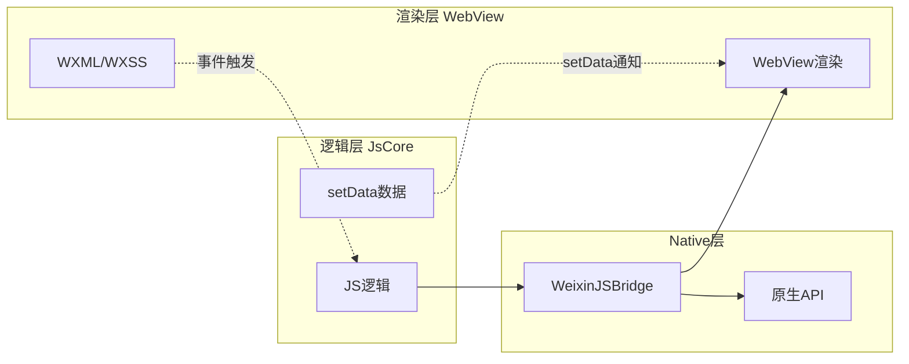

#### 为什么这样设计

| 设计目标 | 双线程方案如何解决                          |
| ---- | ---------------------------------- |
| 安全管控 | 逻辑层无 DOM API，无法动态操作页面，杜绝 XSS 与非法跳转 |
| 性能稳定 | JS 执行不阻塞渲染，滚动流畅，避免单线程卡顿            |
| 审核合规 | 禁止 eval、new Function、动态执行 JS，便于审核  |
| 多端一致 | 渲染层与原生解耦，便于 iOS/Android 一致体验       |

#### 缺点与代价

- **通信延迟**：跨线程通信需序列化，setData 传输有耗时

- **API 异步化**：所有原生能力走 Native 桥，必须异步回调

- **开发限制**：无法使用 DOM API、无法动态插入 script

#### 项目实战踩坑

> **问题**：频繁 setData 大对象，导致列表滚动卡顿。
>
> **根因**：每次 setData 都会将数据序列化 → 跨线程传输 → 反序列化 → 渲染，大对象耗时 100ms+。
>
> **解决**：见 [Q12 setData 性能优化](#q12-setdata-的性能优化方案有哪些)。

***

### Q2. 小程序的运行环境分为哪几个部分？

#### 核心答案

小程序运行环境分为 **三大层**：

```
┌─────────────────────────────────────────┐
│       应用级（App 服务）                │
│   - 全局生命周期、globalData             │
│   - 整个小程序唯一实例                   │
├─────────────────────────────────────────┤
│       页面级（Page 服务）               │
│   - 页面栈管理，最多 10 层              │
│   - 每个页面独立 WebView                 │
│   - 页面数据、生命周期                   │
├─────────────────────────────────────────┤
│       组件级（Component）               │
│   - 自定义组件、原生组件                 │
│   - 独立作用域与生命周期                 │
└─────────────────────────────────────────┘
```

#### 各层职责

| 层级        | 文件                                          | 核心能力             |
| --------- | ------------------------------------------- | ---------------- |
| App       | app.js / app.json / app.wxss                | 全局状态、全局样式、全局生命周期 |
| Page      | page.js / page.json / page.wxml / page.wxss | 页面逻辑、渲染、路由       |
| Component | component.js / .json / .wxml / .wxss        | 可复用组件，独立作用域      |

#### 关键限制

- 一个小程序**只有一个 App 实例**，所有页面共享

- 每个页面有独立 **WebView 实例**，页面间数据不共享

- 组件有自己的 **Component 实例**，通过 properties/triggerEvent 与父级通信

***

### Q3. WXSS 与 CSS 的区别有哪些？rpx 的原理是什么？

#### 核心区别

| 特性   | WXSS                                           | CSS               |
| ---- | ---------------------------------------------- | ----------------- |
| 单位   | rpx、px                                         | px、em、rem、vw 等    |
| 选择器  | 支持 `.class`、`#id`、`element`、`::before/::after` | 全部支持              |
| 局部样式 | 组件 wxss 隔离                                     | 需 BEM/CSS Modules |
| 内联样式 | 支持 style 属性                                    | 支持                |
| 导入   | `@import "common.wxss"`                        | `@import url()`   |
| 响应式  | rpx 自动适配                                       | 需媒体查询             |

#### rpx 原理

**rpx（responsive pixel）**：小程序独有的响应式像素单位。

```
1rpx = (屏幕宽度 / 750) 物理像素
```

设计稿宽度统一为 750px（iPhone 6 物理宽度），按比例换算：

| 设备            | 屏幕宽度  | 1rpx =  | 1px =   |
| ------------- | ----- | ------- | ------- |
| iPhone 5      | 320px | 0.42px  | 2.34rpx |
| iPhone 6      | 375px | 0.5px   | 2rpx    |
| iPhone 6 Plus | 414px | 0.552px | 1.81rpx |

#### 换算公式

```
设计稿 750px 宽：
  - 标注 100px → 写 100rpx（直接 1:1）
设计稿 375px 宽：
  - 标注 100px → 写 200rpx（×2）
```

#### 项目实战配置

```json
// 使用 PostCSS 插件自动转换（uni-app/Taro）
// postcss.config.js
module.exports = {
  plugins: {
    'postcss-pxtorem': { rootVal: 37.5, propList: ['*'] }
  }
};
```

```css
/* 推荐：直接用 rpx */
.card {
  width: 686rpx;  /* 设计稿 686px，相当于左右各留 32rpx 边距 */
  height: 200rpx;
  border-radius: 16rpx;
}
```

#### 常见追问

**Q：1px 边框在小程序中如何处理？**
A：小程序不依赖 DPR，直接写 `1px` 或 `2rpx` 即可，无需考虑 1px 变粗问题。

***

### Q4. 小程序的文件目录结构是怎样的？各自作用是什么？

#### 标准目录结构

```
├── app.js               # 全局逻辑入口
├── app.json             # 全局配置（页面路由、窗口、tabBar）
├── app.wxss             # 全局样式
├── project.config.json  # 项目配置（云开发、ES6、上传设置）
├── sitemap.json         # 搜索索引配置
├── pages/               # 页面目录
│   └── index/
│       ├── index.js
│       ├── index.json
│       ├── index.wxml
│       └── index.wxss
├── components/          # 自定义组件
│   └── card/
│       ├── card.js
│       ├── card.json
│       ├── card.wxml
│       └── card.wxss
├── utils/               # 工具函数
│   └── util.js
├── images/              # 本地图片
└── packageA/            # 分包目录
    └── pages/
```

#### 核心文件说明

| 文件                  | 作用                            | 必需 |
| ------------------- | ----------------------------- | -- |
| app.js              | App 实例，全局生命周期、globalData      | ✅  |
| app.json            | 全局配置，注册页面、tabBar、权限           | ✅  |
| app.wxss            | 全局样式，所有页面共享                   | 可选 |
| project.config.json | 项目开发配置，appid、编译设置             | ✅  |
| sitemap.json        | 小程序搜索索引权限配置                   | 可选 |
| 页面 .js              | Page 实例，页面逻辑                  | ✅  |
| 页面 .json            | 页面配置，navigationBarTitleText 等 | 可选 |
| 页面 .wxml            | 页面结构                          | ✅  |
| 页面 .wxss            | 页面样式                          | 可选 |

#### app.json 配置示例

```json
{
  "pages": [
    "pages/index/index",
    "pages/logs/logs"
  ],
  "window": {
    "navigationBarTitleText": "小程序",
    "navigationBarBackgroundColor": "#ffffff",
    "navigationBarTextStyle": "black",
    "backgroundColor": "#f5f5f5",
    "enablePullDownRefresh": false
  },
  "tabBar": {
    "list": [
      { "pagePath": "pages/index/index", "text": "首页" },
      { "pagePath": "pages/logs/logs", "text": "日志" }
    ]
  },
  "permission": {
    "scope.userLocation": {
      "desc": "你的位置信息将用于展示附近商品"
    }
  },
  "subPackages": [
    {
      "root": "packageA",
      "pages": ["pages/detail/detail"]
    }
  ]
}
```

***

### Q5. 小程序与 H5 的核心区别是什么？

#### 核心对比

| 维度     | 小程序                   | H5          |
| ------ | --------------------- | ----------- |
| 运行环境   | 微信 App 内              | 任意浏览器       |
| 开发框架   | WXML/WXSS/JS          | HTML/CSS/JS |
| 渲染机制   | 双线程（WebView + JsCore） | 单线程（浏览器）    |
| DOM 操作 | 不能直接操作 DOM            | 可直接操作 DOM   |
| API 能力 | 微信原生能力（支付、扫码等）        | 受浏览器限制      |
| 包体积    | 主包 ≤ 2MB，总包 ≤ 20MB    | 无限制         |
| 审核     | 需提交审核发布               | 直接部署上线      |
| 入口     | 微信内打开                 | URL 直接访问    |
| 推广     | 微信生态分享、附近小程序          | 任意分享、SEO    |

#### 性能对比

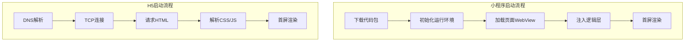

#### 小程序的优势

1. **接近原生体验**：双线程架构、原生组件
2. **能力丰富**：支付、扫码、地理位置等原生 API
3. **分发能力强**：微信群分享、公众号导流
4. **离线缓存**：代码包本地缓存，启动快

#### 小程序的劣势

1. **生态封闭**：只能在微信内运行
2. **包体积限制**：不能承载复杂应用
3. **审核流程**：发布需 1-7 天审核
4. **调试受限**：无法像浏览器直接调试

***

## 二、生命周期与路由

### Q6. App、Page、Component 三种生命周期分别是什么？

#### App 全局生命周期

```javascript
App({
  onLaunch(options) {
    // 小程序初始化完成，全局只触发一次
    // options.scene：场景值（扫码、分享等）
    console.log('场景值:', options.scene);
  },
  onShow(options) {
    // 小程序从后台切回前台
  },
  onHide() {
    // 小程序从前台切到后台
  },
  onError(msg) {
    // 全局 JS 错误监听
    console.error(msg);
  },
  onPageNotFound(res) {
    // 页面不存在时触发
    wx.switchTab({ url: '/pages/index/index' });
  },
  onUnhandledRejection(res) {
    // 未处理的 Promise rejection
  },
  globalData: { userInfo: null }
});
```

#### Page 页面生命周期

```javascript
Page({
  onLoad(options) {
    // 页面加载，只触发一次，可获取参数
  },
  onShow() {
    // 页面显示，每次切到该页面都触发
  },
  onReady() {
    // 页面初次渲染完成，只触发一次
  },
  onHide() {
    // 页面隐藏
  },
  onUnload() {
    // 页面卸载
  },
  onPullDownRefresh() {
    // 下拉刷新
  },
  onReachBottom() {
    // 上拉触底
  },
  onShareAppMessage() {
    // 转发
    return { title: '分享标题', path: '/pages/index/index' };
  },
  onShareTimeline() {
    // 分享朋友圈
    return { title: '分享标题' };
  },
  onPageScroll(options) {
    // 页面滚动
    console.log(options.scrollTop);
  }
});
```

#### Component 组件生命周期

```javascript
Component({
  lifetimes: {
    created() {
      // 组件实例刚创建，不能调用 setData
    },
    attached() {
      // 组件进入页面 DOM，可调用 setData
    },
    ready() {
      // 组件布局完成，可获取节点信息
    },
    moved() {
      // 组件位置移动
    },
    detached() {
      // 组件离开页面 DOM
    }
  },
  pageLifetimes: {
    show() { /* 所在页面显示 */ },
    hide() { /* 所在页面隐藏 */ },
    resize(sizeData) { /* 所在页面尺寸变化 */ }
  }
});
```

#### 生命周期触发顺序

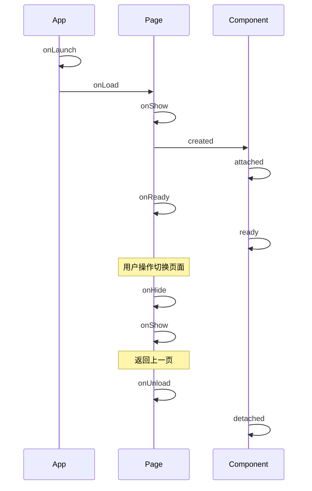

***

### Q7. onLoad 与 onShow、onReady 的区别与触发时机？

#### 核心区别

| 生命周期     | 触发次数 | 触发时机   | 典型用途          |
| -------- | ---- | ------ | ------------- |
| onLoad   | 1 次  | 页面首次加载 | 初始化数据、获取路由参数  |
| onShow   | 多次   | 页面每次显示 | 刷新数据、恢复状态     |
| onReady  | 1 次  | 首次渲染完成 | 操作 DOM、获取节点信息 |
| onHide   | 多次   | 页面隐藏   | 暂停定时器、停止播放    |
| onUnload | 1 次  | 页面卸载   | 清理定时器、解绑事件    |

#### 场景触发示例

```
打开页面A → A.onLoad → A.onShow → A.onReady

跳转页面B → A.onHide → B.onLoad → B.onShow → B.onReady

返回A    → B.onUnload → A.onShow
   （A 不会再次 onLoad，因为页面栈中未销毁）
```

#### 项目实战：数据刷新策略

```javascript
Page({
  data: { list: [] },

  onLoad() {
    // 只在首次加载时执行
    this.fetchList();
  },

  onShow() {
    // 每次显示都执行
    // 适用于：从详情页返回列表页时刷新
    if (this.needRefresh) {
      this.fetchList();
      this.needRefresh = false;
    }
  },

  onPullDownRefresh() {
    // 下拉刷新
    this.fetchList().then(() => wx.stopPullDownRefresh());
  }
});
```

#### 常见追问

**Q：什么时候用 onShow 刷新数据？**
A：场景：

1. 列表页 → 详情页修改 → 返回列表页需更新
2. 跨页面操作后回到原页面需同步状态
3. 从后台切回前台需刷新

**Q：onShow 频繁触发会带来什么问题？**
A：如果每次都请求接口，会导致流量浪费和卡顿。建议用标志位控制（如 `this.needRefresh`）。

***

### Q8. 小程序路由跳转方式有哪些？navigateTo/redirectTo/reLaunch 区别？

#### 路由 API 对比

| API                        | 作用          | 是否保留当前页 | 是否销毁所有页面 | 适用场景   |
| -------------------------- | ----------- | ------- | -------- | ------ |
| wx.navigateTo              | 保留当前页，跳转新页  | ✅       | ❌        | 普通层级跳转 |
| wx.redirectTo              | 关闭当前页，跳转新页  | ❌       | ❌        | 替换当前页  |
| wx.reLaunch                | 关闭所有页面，跳新页  | -       | ✅        | 重启到首页  |
| wx.switchTab               | 跳转 tabBar 页 | -       | -        | 切换 tab |
| wx.navigateBack            | 返回上一页       | ❌       | -        | 返回     |
| wx.navigateBackMiniProgram | 返回其他小程序     | -       | -        | 跨小程序   |

#### 使用示例

```javascript
// 1. navigateTo：进入详情页（带参数）
wx.navigateTo({
  url: '/pages/detail/detail?id=123&name=test'
});

// 2. redirectTo：替换当前页（避免页面栈过深）
wx.redirectTo({ url: '/pages/login/login' });

// 3. reLaunch：重启到首页（清空栈）
wx.reLaunch({ url: '/pages/index/index' });

// 4. switchTab：切换 tab
wx.switchTab({ url: '/pages/index/index' });

// 5. navigateBack：返回上一页
wx.navigateBack({ delta: 1 });

// 接收参数：在 onLoad 中获取
Page({
  onLoad(options) {
    console.log(options.id);      // 123
    console.log(options.name);    // test
  }
});
```

#### 选择策略

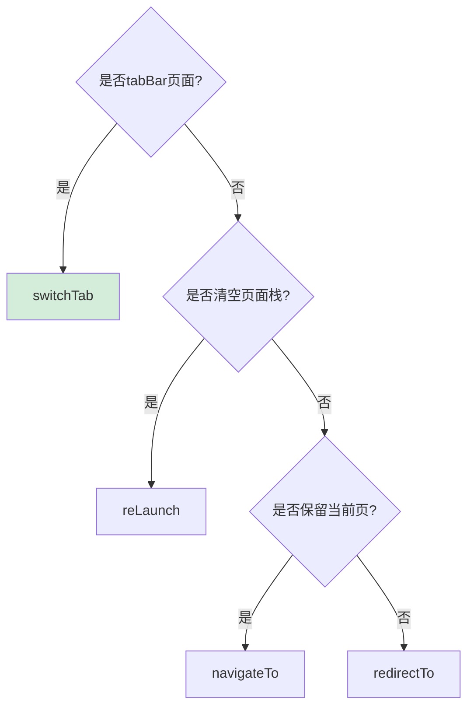

#### 项目实战踩坑

> **问题**：使用 navigateTo 连续跳转 10 次后无法跳转。
>
> **原因**：页面栈最大 10 层。
>
> **解决**：第 5 层后改用 redirectTo，或使用 reLaunch 重置。

```javascript
// 通用跳转封装：自动处理页面栈
function smartNavigate(url) {
  const pages = getCurrentPages();
  if (pages.length >= 5) {
    // 栈过深，使用 redirectTo
    wx.redirectTo({ url });
  } else {
    wx.navigateTo({ url });
  }
}
```

***

### Q9. 页面栈的概念是什么？最多支持多少层？

#### 核心答案

页面栈是小程序管理的页面层级结构，**最多 10 层**。

#### 操作示意

```
navigateTo：栈顶 push 新页面
  栈: [A, B, C] → navigateTo D → [A, B, C, D]

redirectTo：替换栈顶
  栈: [A, B, C] → redirectTo D → [A, B, D]

reLaunch：清空栈，push 新页面
  栈: [A, B, C] → reLaunch D → [D]

navigateBack：弹出栈顶
  栈: [A, B, C] → navigateBack → [A, B]
```

#### 获取页面栈

```javascript
const pages = getCurrentPages();
const currentPage = pages[pages.length - 1];
const route = currentPage.route;  // 'pages/detail/detail'
const options = currentPage.options;  // 路由参数
```

#### 项目实战：跨页面通信

```javascript
// 详情页修改后通知列表页刷新
Page({
  // 列表页
  onShow() {
    const pages = getCurrentPages();
    const prevPage = pages[pages.length - 2];  // 上一个页面
    if (prevPage) prevPage.setData({ needRefresh: true });
  }
});
```

***

### Q10. 组件生命周期与页面生命周期有何不同？

#### 核心区别

| 维度   | 页面（Page）            | 组件（Component）      |
| ---- | ------------------- | ------------------ |
| 声明方式 | `Page({})`          | `Component({})`    |
| 生命周期 | 直接定义在根              | 包在 `lifetimes` 内   |
| 页面状态 | 直接监听 show/hide      | 通过 `pageLifetimes` |
| 数据流  | 路由参数 onLoad options | 父组件 properties     |
| 复用   | 不可复用                | 可复用                |

#### 组件生命周期完整示例

```javascript
Component({
  // 组件自身生命周期
  lifetimes: {
    created() {
      // 实例创建，不能 setData
      console.log('组件 created');
    },
    attached() {
      // 进入 DOM，可 setData
      console.log('组件 attached');
      this.setData({ foo: 'bar' });
    },
    ready() {
      // 布局完成，可获取节点尺寸
      const query = this.createSelectorQuery();
      query.select('.box').boundingClientRect(rect => {
        console.log(rect.width);
      }).exec();
    },
    moved() { /* 位置变化 */ },
    detached() { /* 离开 DOM，清理定时器 */ }
  },

  // 所在页面生命周期
  pageLifetimes: {
    show() { console.log('所在页面显示'); },
    hide() { console.log('所在页面隐藏'); },
    resize(size) { console.log('页面尺寸变化', size); }
  },

  // 组件 properties
  properties: {
    title: { type: String, value: '默认标题' }
  }
});
```

#### 触发顺序

```
页面 onShow 触发 → 组件 pageLifetimes.show
页面 onHide 触发 → 组件 pageLifetimes.hide
组件初次创建：created → attached → ready
组件销毁：detached
```

#### 项目实战：组件内监听页面切换刷新

```javascript
Component({
  pageLifetimes: {
    show() {
      // 所在页面显示时刷新组件数据
      this.refreshData();
    }
  },
  methods: {
    refreshData() {
      this.triggerEvent('refresh');  // 通知父组件
    }
  }
});
```

***

## 三、数据绑定与通信

### Q11. setData 的工作原理是什么？为什么性能差？

#### 核心原理

setData 是逻辑层向渲染层发送数据的 **唯一方式**，流程如下：

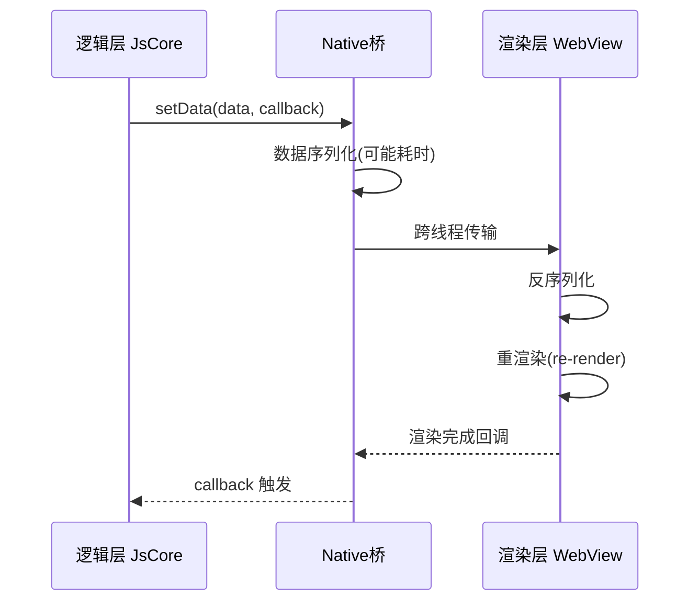

#### 性能瓶颈点

1. **序列化耗时**：data 大、嵌套深时序列化慢
2. **跨线程通信延迟**：iOS \~50ms，Android \~30ms
3. **数据传输**：每次传输整个 setData 对象
4. **重渲染范围**：setData 整个字段触发对应节点重渲染

#### 性能数据对比

| setData 数据量 | 平均耗时      | 用户体验 |
| ----------- | --------- | ---- |
| 1KB         | < 10ms    | 无感   |
| 10KB        | 30-50ms   | 轻微卡顿 |
| 100KB       | 200-500ms | 明显卡顿 |
| 1MB         | 1s+       | 假死   |

#### 项目实战踩坑

> **问题**：列表 1000 条数据，每秒刷新 1 次，FPS 跌至 10。
>
> **根因**：每次 setData 传输整个 list 数组，数据量 200KB+。
>
> **解决**：使用局部更新，只传输变化的项。

```javascript
// ❌ 错误：每次传输整个 list
this.setData({ list: newList });

// ✅ 正确：仅更新变化项
this.setData({
  [`list[${index}].status`]: 'paid'  // 路径更新
});
```

***

### Q12. setData 的性能优化方案有哪些？

#### 核心优化策略

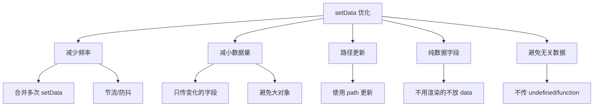

#### 1. 合并多次 setData

```javascript
// ❌ 错误：连续多次 setData
this.setData({ a: 1 });
this.setData({ b: 2 });
this.setData({ c: 3 });

// ✅ 正确：合并为一次
this.setData({ a: 1, b: 2, c: 3 });
```

#### 2. 路径更新（关键技巧）

```javascript
// 场景：更新 list 中第 3 项的 status
data: {
  list: [{status: 'pending'}, {status: 'paid'}, ...]
}

// ❌ 错误：传输整个 list
this.setData({ list: newList });

// ✅ 正确：只更新单个字段
this.setData({
  'list[2].status': 'paid'
});

// ✅ 批量更新多项
const updates = {};
for (let i = 0; i < 10; i++) {
  updates[`list[${i}].status`] = 'paid';
}
this.setData(updates);
```

#### 3. 纯数据字段 pureData

```javascript
// 不需要渲染的数据，用 _ 前缀，不会传输到渲染层
Component({
  options: {
    pureDataPattern: /^_/  // 匹配 _ 开头的字段
  },
  data: {
    _timer: null,      // 不会渲染
    _currentIndex: 0,  // 不会渲染
    visibleList: []    // 会渲染
  }
});
```

#### 4. 节流频繁更新

```javascript
// 场景：搜索框输入实时搜索
Page({
  data: { keyword: '' },

  onInput(e) {
    this.throttleSearch(e.detail.value);
  },

  throttleSearch: _.throttle(function(keyword) {
    this.setData({ keyword });
    this.search(keyword);
  }, 300)
});
```

#### 5. 避免无关字段

```javascript
// ❌ 错误：传了不渲染的字段
this.setData({
  list: res.data,
  total: 100,
  loading: false,
  timestamp: Date.now(),  // 不渲染
  requestId: 'xxx'        // 不渲染
});

// ✅ 正确：只传渲染需要的
this.setData({
  list: res.data,
  total: 100,
  loading: false
});
```

#### 性能对比

| 优化方案     | 优化前                    | 优化后               |
| -------- | ---------------------- | ----------------- |
| 频率优化     | 每次 50ms × 10 次 = 500ms | 合并 1 次 80ms       |
| 路径更新     | 1000 项 × 100B = 100KB  | 1 项 × 100B = 100B |
| pureData | 全部参与 diff              | 仅渲染字段 diff        |

***

### Q13. 父子组件如何通信？properties 与 triggerEvent 的使用？

#### 通信方式总结

| 方向  | 方式              | 说明          |
| --- | --------------- | ----------- |
| 父→子 | properties      | 父通过属性传值     |
| 子→父 | triggerEvent    | 子组件触发事件，父监听 |
| 父→子 | selectComponent | 父获取子实例直接调用  |
| 子→父 | relations       | 祖孙组件关联      |
| 跨组件 | 事件总线            | 全局事件订阅发布    |

#### 父→子：properties

```javascript
// 子组件 child.js
Component({
  properties: {
    title: {
      type: String,
      value: '默认标题',
      observer(newVal, oldVal) {
        // 属性变化时触发
        console.log('title 变化:', newVal);
      }
    },
    list: {
      type: Array,
      value: [],
      observer(newVal) {
        // 深度监听数组变化
      }
    }
  }
});
```

```html
<!-- 父页面 parent.wxml -->
<child title="商品列表" list="{{productList}}" />
```

#### 子→父：triggerEvent

```javascript
// 子组件 child.js
Component({
  methods: {
    onTap() {
      this.triggerEvent('confirm', {
        id: 1,
        name: '商品'
      }, {
        bubbles: true,         // 事件冒泡
        composed: true         // 跨组件边界
      });
    }
  }
});
```

```html
<!-- 子组件 child.wxml -->
<button bindtap="onTap">点击</button>
```

```html
<!-- 父页面 parent.wxml -->
<child bind:confirm="onChildConfirm" />
```

```javascript
// 父页面 parent.js
Page({
  onChildConfirm(e) {
    console.log(e.detail);  // { id: 1, name: '商品' }
  }
});
```

#### 父→子：selectComponent

```javascript
// 父页面
Page({
  onReady() {
    const child = this.selectComponent('#child');
    child.refresh();  // 直接调用子组件方法
  }
});
```

```html
<child id="child" />
```

#### 项目实战：表单组件

```javascript
// form-input.js
Component({
  properties: {
    value: String,
    label: String
  },
  methods: {
    onInput(e) {
      // 双向绑定
      this.triggerEvent('input', { value: e.detail.value });
      // 或使用 modelYield（基础库 2.9.3+）
      this.triggerEvent('update:value', { value: e.detail.value });
    }
  }
});
```

```html
<!-- 父组件使用双向绑定 -->
<form-input model:value="{{formData.name}}" label="姓名" />
```

***

### Q14. 全局数据共享方案有哪些？globalData 与状态管理库对比

#### 共享方案对比

| 方案               | 复杂度  | 适用场景               | 性能    |
| ---------------- | ---- | ------------------ | ----- |
| globalData       | ⭐    | 简单全局数据（用户信息、token） | 一般    |
| Storage          | ⭐⭐   | 持久化数据              | 慢（异步） |
| 事件总线             | ⭐⭐   | 跨页面通知              | 优     |
| MobX             | ⭐⭐⭐  | 中大型应用，响应式数据        | 优     |
| Redux            | ⭐⭐⭐⭐ | 大型应用，可预测状态         | 优     |
| 组件 properties 链式 | ⭐    | 简单父子链              | 一般    |

#### 方案1：globalData

```javascript
// app.js
App({
  globalData: {
    userInfo: null,
    token: '',
    cartList: []
  },
  onLaunch() {
    // 从 storage 恢复
    this.globalData.token = wx.getStorageSync('token');
  }
});

// 任意页面使用
const app = getApp();
console.log(app.globalData.userInfo);

// 修改后需手动通知其他页面
app.globalData.cartList.push(item);
// 其他页面 onShow 中读取最新值
```

#### 方案2：事件总线（推荐）

```javascript
// utils/event-bus.js
class EventBus {
  constructor() { this.events = {}; }

  on(event, handler) {
    (this.events[event] = this.events[event] || []).push(handler);
  }

  off(event, handler) {
    if (!handler) { this.events[event] = []; return; }
    this.events[event] = this.events[event].filter(h => h !== handler);
  }

  emit(event, data) {
    (this.events[event] || []).forEach(h => h(data));
  }
}

module.exports = new EventBus();
```

```javascript
// 页面 A：触发事件
const bus = require('../../utils/event-bus');
bus.emit('cartUpdated', { count: 10 });

// 页面 B：监听
Page({
  onShow() {
    bus.on('cartUpdated', this.onCartUpdate);
  },
  onUnload() {
    bus.off('cartUpdated', this.onCartUpdate);  // 必须解绑
  },
  onCartUpdate(data) {
    this.setData({ cartCount: data.count });
  }
});
```

#### 方案3：MobX（推荐大型应用）

```javascript
// store/user.js
import { observable, action } from 'mobx-miniprogram';

export const userStore = observable({
  userInfo: null,
  token: '',

  get isLogin() { return !!this.token; },

  setUserInfo: action(function(info) {
    this.userInfo = info;
  }),
  setToken: action(function(token) {
    this.token = token;
  })
});
```

```javascript
// 页面绑定
import { createStoreBindings } from 'mobx-miniprogram-bindings';
const { userStore } = require('../../store/user');

Page({
  onLoad() {
    this.storeBindings = createStoreBindings(this, {
      store: userStore,
      fields: ['userInfo', 'isLogin'],
      actions: ['setUserInfo']
    });
  },
  onUnload() {
    this.storeBindings.destroyStoreBindings();
  }
});
```

***

### Q15. 事件系统与事件绑定方式的区别？catchtap 与 bindtap 区别？

#### 事件分类

| 事件类型       | 触发       | 示例             |
| ---------- | -------- | -------------- |
| tap        | 触摸后离开    | bindtap        |
| longpress  | 长按 350ms | bindlongpress  |
| touchstart | 触摸开始     | bindtouchstart |
| touchmove  | 触摸移动     | bindtouchmove  |
| touchend   | 触摸结束     | bindtouchend   |

#### bind 与 catch 区别

- **bind**：不阻止冒泡

- **catch**：阻止冒泡（事件不再向上传递）

- **capture-bind**：捕获阶段触发

- **capture-catch**：捕获阶段触发并阻止

#### 使用示例

```html
<view bindtap="onOuterTap">
  外层（bindtap，会触发）
  <view catchtap="onInnerTap">
    内层（catchtap，阻止冒泡）
  </view>
</view>

<!-- 点击内层时：
  1. 内层 onInnerTap 触发
  2. 事件被 catch 阻止，不再冒泡
  3. 外层 onOuterTap 不触发
-->
```

#### 事件对象详解

```javascript
Page({
  onTap(e) {
    console.log(e.type);           // 'tap'
    console.log(e.target);         // 触发源组件
    console.log(e.currentTarget);  // 事件绑定的组件
    console.log(e.detail);         // 额外信息（如 input 的 value）
    console.log(e.touches);        // 触摸点信息
    console.log(e.timeStamp);      // 时间戳

    // dataset：自定义数据属性
    console.log(e.currentTarget.dataset.id);
  }
});
```

```html
<view bindtap="onTap" data-id="123" data-name="test">点击</view>
```

#### 项目实战踩坑

> **问题**：列表点击 item 时，内部按钮也会触发 item 的点击事件。
>
> **解决**：内部按钮用 catchtap 阻止冒泡。

```html
<view bindtap="onItemClick" wx:for="{{list}}">
  <text>{{item.name}}</text>
  <button catchtap="onDelete" data-id="{{item.id}}">删除</button>
</view>
```

***

## 四、组件与 API

### Q16. 自定义组件的创建与使用流程？

#### 创建组件

**1. 创建组件文件**

```
components/
└── price-button/
    ├── price-button.js
    ├── price-button.json
    ├── price-button.wxml
    └── price-button.wxss
```

**2. 配置组件 json**

```json
{
  "component": true,
  "usingComponents": {}
}
```

**3. 编写组件 js**

```javascript
Component({
  // 组件属性
  properties: {
    price: {
      type: Number,
      value: 0,
      observer(newVal) {
        this.formatPrice(newVal);
      }
    }
  },

  // 组件数据
  data: {
    formattedPrice: ''
  },

  // 生命周期
  lifetimes: {
    attached() {
      this.formatPrice(this.data.price);
    }
  },

  // 组件方法
  methods: {
    formatPrice(price) {
      this.setData({
        formattedPrice: '¥' + price.toFixed(2)
      });
    },
    onTap() {
      this.triggerEvent('click', { price: this.data.price });
    }
  }
});
```

**4. 编写 wxml**

```html
<view class="price-btn" bindtap="onTap">
  {{formattedPrice}}
</view>
```

#### 使用组件

**1. 在页面 json 中引入**

```json
{
  "usingComponents": {
    "price-button": "/components/price-button/price-button"
  }
}
```

**2. 在页面 wxml 中使用**

```html
<price-button price="{{product.price}}" bind:click="onPriceClick" />
```

#### 组件进阶：抽象节点

```javascript
// 使用 abstract 节点，运行时决定渲染哪个组件
Component({
  abstract: true,
  options: {
    multipleSlots: true  // 多插槽
  }
});
```

***

### Q17. 纯数据字段 pureData 的作用是什么？

#### 核心作用

pureData 是不参与渲染的数据字段，**不会传输到渲染层**，避免触发 setData 重渲染。

#### 使用场景

1. **定时器、监听器句柄**
2. **临时变量、计算中间值**
3. **接口请求状态**
4. **不需要响应式的大对象**

#### 配置方式

```javascript
Component({
  options: {
    // 匹配以 _ 开头的字段为 pureData
    pureDataPattern: /^_/
  },
  data: {
    _timer: null,           // pureData
    _currentIndex: 0,       // pureData
    _observer: null,        // pureData
    visibleList: [],        // 普通字段
    userInfo: null          // 普通字段
  },

  methods: {
    startTimer() {
      this.data._timer = setInterval(() => {
        // 注意：this.data._timer 不会触发 setData
        console.log('tick');
      }, 1000);
    },
    clearTimer() {
      clearInterval(this.data._timer);
    }
  },

  detached() {
    clearInterval(this.data._timer);
  }
});
```

#### 性能对比

```
普通字段：
  setData({ userInfo: newInfo }) → 传输到渲染层 → diff → 重渲染

pureData 字段：
  this.data._counter++ → 仅逻辑层 → 不传输 → 不重渲染
```

#### 项目实战

```javascript
// 列表组件：缓存原始数据，仅渲染可见部分
Component({
  options: {
    pureDataPattern: /^_/
  },
  data: {
    _allData: [],         // 完整数据，不渲染
    _startIndex: 0,      // 起始索引，不渲染
    visibleData: []       // 仅渲染可见部分
  },
  methods: {
    loadData(list) {
      this.data._allData = list;  // 不触发 setData
      this.updateVisible();
    },
    updateVisible() {
      const start = this.data._startIndex;
      const visible = this.data._allData.slice(start, start + 20);
      this.setData({ visibleData: visible });  // 仅传 visibleData
    }
  }
});
```

***

### Q18. observers 数据监听器的使用场景？

#### 核心作用

observers 用于监听 properties 或 data 字段变化，类似 Vue 的 watch。

#### 基础用法

```javascript
Component({
  data: {
    firstName: '张',
    lastName: '三'
  },
  observers: {
    'firstName, lastName': function(first, last) {
      this.setData({ fullName: first + last });
    }
  }
});
```

#### 监听 properties

```javascript
Component({
  properties: {
    productId: String
  },
  observers: {
    'productId': function(id) {
      if (id) this.loadDetail(id);
    }
  },
  methods: {
    loadDetail(id) {
      wx.request({
        url: `/api/product/${id}`,
        success: res => this.setData({ detail: res.data })
      });
    }
  }
});
```

#### 监听对象内部字段（关键能力）

```javascript
Component({
  data: {
    user: { name: '张三', age: 18 }
  },
  observers: {
    'user.name': function(name) {
      console.log('user.name 变化:', name);
    },
    'user.**': function(user) {
      // user 对象内任意字段变化都触发
      console.log('user 变化:', user);
    }
  }
});
```

#### 监听数组变化

```javascript
Component({
  data: {
    list: []
  },
  observers: {
    'list': function(newList) {
      // 注意：observers 不会深监听数组项内部变化
      // 需用 'list.**' 监听数组项内部
    },
    'list.**': function() {
      // 数组内任意项变化触发
    }
  }
});
```

#### 替代 properties observer

```javascript
// 老写法
Component({
  properties: {
    price: {
      type: Number,
      observer(newVal) { this.format(newVal); }
    }
  }
});

// 推荐写法
Component({
  properties: { price: Number },
  observers: {
    'price': function(newVal) {
      this.format(newVal);
    }
  }
});
```

***

### Q19. 组件 slot 插槽的分类与使用？

#### 默认插槽

```html
<!-- 组件 wxml -->
<view class="card">
  <slot></slot>
</view>
```

```html
<!-- 使用 -->
<card>
  <text>这是内容</text>
</card>
```

#### 多插槽（需配置 multipleSlots）

```javascript
Component({
  options: {
    multipleSlots: true  // 启用多插槽
  }
});
```

```html
<!-- 组件 wxml -->
<view class="layout">
  <view class="header"><slot name="header"></slot></view>
  <view class="body"><slot name="body"></slot></view>
  <view class="footer"><slot name="footer"></slot></view>
</view>
```

```html
<!-- 使用 -->
<layout>
  <view slot="header">标题</view>
  <view slot="body">内容</view>
  <view slot="footer">底部</view>
</layout>
```

#### 动态插槽（基础库 2.8.3+）

```javascript
Component({
  data: { showHeader: true },
  methods: {
    toggle() {
      this.setData({ showHeader: !this.data.showHeader });
    }
  }
});
```

```html
<view class="card">
  <slot wx:if="{{showHeader}}" name="header"></slot>
  <slot></slot>
</view>
```

#### 项目实战：通用卡片组件

```html
<!-- components/card/card.wxml -->
<view class="card">
  <view class="card-header" wx:if="{{showHeader}}">
    <slot name="header">
      <text>{{title}}</text>
    </slot>
  </view>
  <view class="card-body">
    <slot></slot>
  </view>
  <view class="card-footer" wx:if="{{showFooter}}">
    <slot name="footer"></slot>
  </view>
</view>
```

```javascript
// components/card/card.js
Component({
  options: { multipleSlots: true },
  properties: {
    title: String,
    showHeader: { type: Boolean, value: true },
    showFooter: { type: Boolean, value: false }
  }
});
```

***

### Q20. 常用 API 有哪些？网络请求如何封装？

#### 核心 API 分类

| 分类 | API                                                | 说明      |
| -- | -------------------------------------------------- | ------- |
| 网络 | wx.request, wx.uploadFile, wx.downloadFile         | HTTP 通信 |
| 界面 | wx.showToast, wx.showLoading, wx.showModal         | 提示框     |
| 导航 | wx.navigateTo, wx.redirectTo, wx.switchTab         | 路由跳转    |
| 数据 | wx.setStorage, wx.getStorage, wx.clearStorage      | 本地存储    |
| 媒体 | wx.chooseImage, wx.previewImage, wx.chooseVideo    | 图片视频    |
| 位置 | wx.getLocation, wx.openLocation, wx.chooseLocation | 地理位置    |
| 设备 | wx.getSystemInfo, wx.getNetworkType, wx.scanCode   | 系统信息    |
| 开放 | wx.login, wx.getUserInfo, wx.requestPayment        | 微信能力    |

#### 网络请求封装

```javascript
// utils/request.js
const BASE_URL = 'https://api.example.com';

// 请求队列与重试
let requestQueue = [];
let isRefreshing = false;

function request(options) {
  return new Promise((resolve, reject) => {
    const token = wx.getStorageSync('token');

    wx.request({
      url: BASE_URL + options.url,
      method: options.method || 'GET',
      data: options.data,
      timeout: options.timeout || 10000,
      header: {
        'Content-Type': 'application/json',
        'Authorization': token ? `Bearer ${token}` : '',
        ...options.header
      },
      success(res) {
        // 401 处理：刷新 token 后重试
        if (res.statusCode === 401) {
          if (!isRefreshing) {
            isRefreshing = true;
            refreshToken().then(newToken => {
              isRefreshing = false;
              // 重试队列
              requestQueue.forEach(cb => cb(newToken));
              requestQueue = [];
              request(options).then(resolve).catch(reject);
            });
          } else {
            // 排队等待
            requestQueue.push(newToken => {
              request(options).then(resolve).catch(reject);
            });
          }
          return;
        }

        if (res.statusCode >= 200 && res.statusCode < 300) {
          if (res.data.code === 0) {
            resolve(res.data.data);
          } else {
            wx.showToast({ title: res.data.message, icon: 'none' });
            reject(res.data);
          }
        } else {
          reject(new Error(`HTTP ${res.statusCode}`));
        }
      },
      fail(err) {
        wx.showToast({ title: '网络异常', icon: 'none' });
        reject(err);
      }
    });
  });
}

function refreshToken() {
  return new Promise((resolve) => {
    wx.request({
      url: BASE_URL + '/auth/refresh',
      method: 'POST',
      data: { refreshToken: wx.getStorageSync('refreshToken') },
      success(res) {
        const { token, refreshToken } = res.data.data;
        wx.setStorageSync('token', token);
        wx.setStorageSync('refreshToken', refreshToken);
        resolve(token);
      }
    });
  });
}

module.exports = {
  get: (url, data, opts) => request({ url, method: 'GET', data, ...opts }),
  post: (url, data, opts) => request({ url, method: 'POST', data, ...opts }),
  put: (url, data, opts) => request({ url, method: 'PUT', data, ...opts }),
  delete: (url, data, opts) => request({ url, method: 'DELETE', data, ...opts })
};
```

#### 使用示例

```javascript
const { get, post } = require('../../utils/request');

Page({
  onLoad() {
    this.loadList();
  },
  async loadList() {
    try {
      const list = await get('/api/products', { page: 1 });
      this.setData({ list });
    } catch (err) {
      console.error('加载失败:', err);
    }
  },
  async onPay() {
    const result = await post('/api/order', { productId: 123 });
    wx.requestPayment({
      ...result,
      success: () => wx.showToast({ title: '支付成功' })
    });
  }
});
```

***

## 五、性能优化

### Q21. 小程序启动性能如何优化？

#### 启动流程

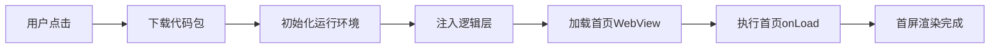

#### 启动性能指标

| 需求   | 总耗时 | 评级   |
| ---- | --- | ---- |
| < 1s | 极速  | 5星   |
| 1-2s | 流畅  | 4星   |
| 2-3s | 可接受 | 3星   |
| > 3s | 慢   | 2星以下 |

#### 优化策略

**1. 减少主包体积**

```json
// app.json：分包加载
{
  "subPackages": [
    {
      "root": "packageA",
      "name": "A",
      "pages": ["pages/detail/detail"],
      "independent": false
    },
    {
      "root": "packageB",
      "pages": ["pages/cart/cart"]
    }
  ],
  "preloadRule": {
    "pages/index/index": {
      "network": "all",
      "packages": ["packageA"]  // 进入首页预加载 A
    }
  }
}
```

**2. 按需注入组件**

```json
// app.json
{
  "lazyCodeLoading": "requiredComponents"  // 按需注入
}
```

**3. 优化首屏数据请求**

```javascript
Page({
  onLoad() {
    // 并行请求关键数据
    Promise.all([
      this.fetchUserInfo(),
      this.fetchBanner(),
      this.fetchList()
    ]);
  }
});
```

**4. 骨架屏**

```html
<view class="skeleton" wx:if="{{loading}}">
  <view class="skeleton-header"></view>
  <view class="skeleton-item" wx:for="{{[1,2,3]}}"></view>
</view>
<view wx:else>
  <!-- 实际内容 -->
</view>
```

**5. 避免同步 API**

```javascript
// ❌ 同步 API 阻塞
const info = wx.getSystemInfoSync();

// ✅ 异步 API
wx.getSystemInfo({
  success: info => this.setData({ statusBarHeight: info.statusBarHeight })
});
```

***

### Q22. 长列表渲染卡顿如何优化？

#### 问题分析

1000+ 数据全量渲染：

- setData 数据量大（200KB+）

- DOM 节点过多（5000+）

- 滚动时频繁 setData 触发重渲染

#### 优化方案1：虚拟列表

```javascript
Component({
  data: {
    _allData: [],
    startIndex: 0,
    visibleData: [],
    itemHeight: 100,
    containerHeight: 600
  },
  properties: {
    list: Array
  },
  observers: {
    'list': function(list) {
      this.data._allData = list;
      this.updateVisible(0);
    }
  },
  methods: {
    onScroll(e) {
      const scrollTop = e.detail.scrollTop;
      const startIndex = Math.floor(scrollTop / this.data.itemHeight);
      if (startIndex !== this.data.startIndex) {
        this.updateVisible(startIndex);
      }
    },
    updateVisible(start) {
      const count = Math.ceil(this.data.containerHeight / this.data.itemHeight) + 5;
      const visibleData = this.data._allData.slice(start, start + count);
      this.setData({
        startIndex: start,
        visibleData
      });
    }
  }
});
```

#### 优化方案2：分页加载

```javascript
Page({
  data: {
    list: [],
    page: 1,
    hasMore: true,
    loading: false
  },
  onLoad() { this.loadList(); },
  onReachBottom() { if (this.data.hasMore && !this.data.loading) this.loadList(); },

  async loadList() {
    this.setData({ loading: true });
    const newList = await fetchList(this.data.page);
    this.setData({
      list: this.data.list.concat(newList),
      page: this.data.page + 1,
      hasMore: newList.length === 20,
      loading: false
    });
  }
});
```

#### 优化方案3：回收不可见区域

```javascript
// 仅保留可视区域 + 上下缓冲 20 条
// 其他用空白占位
Page({
  data: {
    visibleList: [],
    placeholderTop: 0,    // 上方空白高度
    placeholderBottom: 0  // 下方空白高度
  },
  onScroll(e) {
    const scrollTop = e.detail.scrollTop;
    const itemHeight = 80;
    const buffer = 5;
    const startIndex = Math.max(0, Math.floor(scrollTop / itemHeight) - buffer);
    const endIndex = startIndex + 20 + buffer * 2;

    const visibleList = this.allData.slice(startIndex, endIndex);
    const placeholderTop = startIndex * itemHeight;
    const placeholderBottom = (this.allData.length - endIndex) * itemHeight;

    this.setData({ visibleList, placeholderTop, placeholderBottom });
  }
});
```

```html
<scroll-view bindscroll="onScroll" style="height: 100vh">
  <view style="height: {{placeholderTop}}px"></view>
  <view wx:for="{{visibleList}}" class="item" style="height: 80px">{{item.name}}</view>
  <view style="height: {{placeholderBottom}}px"></view>
</scroll-view>
```

#### 官方组件 recycle-view

```html
<!-- 使用官方 recycle-view -->
<recycle-view id="recycleId" batch="{{batchSetRecycleData}}">
  <recycle-item batch="{{batchSetRecycleData}}" height="80">
    <view class="item">{{item.name}}</view>
  </recycle-item>
</recycle-view>
```

***

### Q23. 图片优化方案有哪些？

#### 优化方案全景

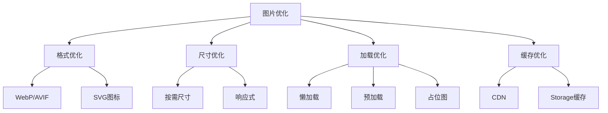

#### 具体策略

**1. 格式选择**

```
照片类：WebP（比 JPEG 小 30%）
图标类：SVG / iconfont
透明图：PNG / WebP
```

**2. 懒加载**

```html
<image
  src="{{item.url}}"
  lazy-load
  mode="aspectFill"
/>
```

**3. 响应式图片**

```html
<!-- 后端按 DPR 返回不同尺寸 -->
<image
  src="{{item.url}}_{{dpr}}x.jpg"
  mode="aspectFill"
/>
```

```javascript
Page({
  onLoad() {
    const sysInfo = wx.getSystemInfoSync();
    this.setData({
      dpr: sysInfo.pixelRatio >= 3 ? 3 : 2
    });
  }
});
```

**4. 长图分段加载**

```javascript
// 大图分段：用 CDN 切片能力
const sliceUrl = (url, index) => `${url}?x-oss-process=image/crop,x_0,y_${index * 200},w_750,h_200`;
```

**5. 占位图**

```html
<view class="img-wrapper">
  <image src="placeholder.png" class="placeholder" />
  <image src="{{realUrl}}" bind:load="onLoad" class="real" />
</view>
```

**6. 雪成图（Sprite）**

```css
.icon {
  background-image: url('sprite.png');
  background-size: 200rpx 200rpx;
}
.icon-home { background-position: 0 0; }
.icon-cart { background-position: -100rpx 0; }
```

#### CDN 配置建议

```
图片后端配置：
1. 通用 WebP 转换：自动根据 UA 返回 WebP
2. 多尺寸生成：原图 + 200w + 400w + 800w
3. CDN 缓存：Cache-Control: max-age=31536000
4. 压缩：质量 85，色卡 256
```

***

### Q24. 分包加载的原理与配置？

#### 分包原理

小程序主包包含启动必需文件，分包按需下载。**主包 ≤ 2MB，总包 ≤ 20MB**。

#### 分包配置

```json
// app.json
{
  "pages": [
    "pages/index/index",
    "pages/logs/logs"
  ],
  "subPackages": [
    {
      "root": "packageA",
      "name": "A",
      "pages": ["pages/detail/detail", "pages/list/list"]
    },
    {
      "root": "packageB",
      "pages": ["pages/cart/cart"]
    },
    {
      "root": "packageC",
      "independent": true,
      "pages": ["pages/author/author"]
    }
  ],
  "preloadRule": {
    "pages/index/index": {
      "network": "all",
      "packages": ["packageA"]
    },
    "pages/detail/detail": {
      "network": "wifi",
      "packages": ["packageB"]
    }
  }
}
```

#### 分包跳转

```javascript
// 跳转分包页面（自动下载分包）
wx.navigateTo({ url: '/packageA/pages/detail/detail?id=123' });
```

#### 独立分包

特点：不依赖主包，可独立运行。常用于活动页、授权页。

```json
{
  "subPackages": [
    {
      "root": "activity",
      "independent": true,
      "pages": ["pages/promo/promo"]
    }
  ]
}
```

#### 分包预下载

```javascript
// 手动预下载分包
wx.preloadSubpackage({
  name: 'packageA',
  success: () => console.log('预下载完成'),
  fail: err => console.error(err)
});
```

#### 项目实战：电商应用分包

```
主包：首页、商品详情、登录（≤ 2MB）
packageA：分类、搜索（≤ 2MB）
packageB：购物车、订单（≤ 2MB）
packageC：个人中心、积分（≤ 2MB）
packageActivity（独立）：大促活动页
```

***

### Q25. 小程序内存预警与回收机制？

#### 内存限制

| 平台      | 限制      |
| ------- | ------- |
| iOS     | \~200MB |
| Android | \~150MB |
| 后台运行    | 5 分钟后回收 |

#### 内存预警 API

```javascript
App({
  onMemoryWarning(res) {
    console.log('内存告警级别:', res.level);
    // level: 5 = TRIM_MEMORY_RUNNING_LOW
    // level: 10 = TRIM_MEMORY_COMPLETE
    // 清理缓存
    this.clearCache();
  },
  clearCache() {
    wx.removeStorage({ key: 'cacheData' });
    // 清理图片缓存
    this.globalData.imageCache = null;
  }
});
```

#### 内存优化策略

**1. 图片缓存限制**

```javascript
const imageCache = new Map();
const MAX_CACHE_SIZE = 50;

function cacheImage(url, data) {
  if (imageCache.size >= MAX_CACHE_SIZE) {
    // LRU：删除最早的
    const firstKey = imageCache.keys().next().value;
    imageCache.delete(firstKey);
  }
  imageCache.set(url, data);
}
```

**2. 页面栈清理**

```javascript
// 页面栈过深时主动清理
function checkPageStack() {
  const pages = getCurrentPages();
  if (pages.length > 5) {
    wx.redirectTo({ url: '/pages/index/index' });
  }
}
```

**3. 定时器清理**

```javascript
Page({
  data: { _timers: [] },
  onLoad() {
    this.data._timers.push(
      setInterval(this.update, 1000)
    );
  },
  onUnload() {
    this.data._timers.forEach(t => clearInterval(t));
  }
});
```

**4. 事件监听解绑**

```javascript
const bus = require('../../utils/event-bus');

Page({
  onLoad() {
    this.handler = data => this.setData(data);
    bus.on('update', this.handler);
  },
  onUnload() {
    bus.off('update', this.handler);  // 必须解绑
  }
});
```

***

## 六、生态工具与进阶

### Q26. 小程序登录流程与 UnionID 机制？

#### 完整登录流程

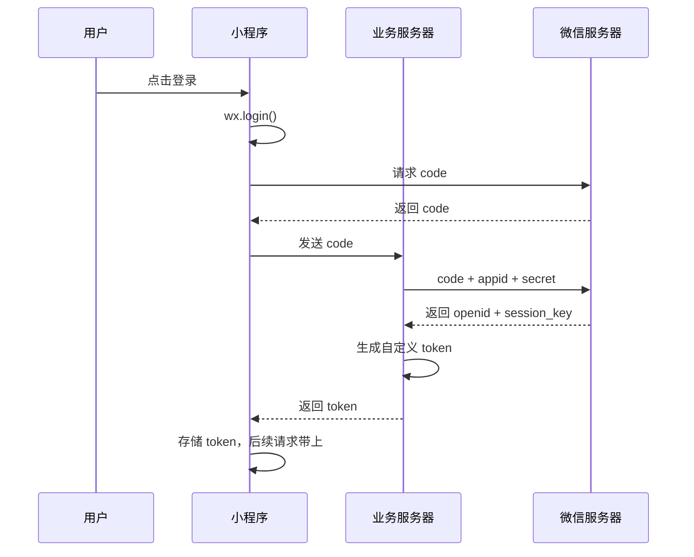

#### 前端实现

```javascript
// 登录流程封装
async function login() {
  // 1. 调用 wx.login 获取 code
  const { code } = await wx.login();

  // 2. 发送 code 到业务服务器
  const result = await post('/api/login', { code });

  // 3. 存储 token
  wx.setStorageSync('token', result.token);

  // 4. 获取用户信息（需用户授权）
  const { userInfo } = await wx.getUserProfile({
    desc: '用于完善用户资料'
  });

  // 5. 更新用户信息到服务器
  await post('/api/user/update', { userInfo });

  return result;
}
```

#### UnionID 与 OpenID

| 标识      | 范围         | 说明         |
| ------- | ---------- | ---------- |
| OpenID  | 单个小程序唯一    | 用户在小程序内的标识 |
| UnionID | 同一开发者账号下唯一 | 跨小程序、公众号标识 |

#### 获取 UnionID

```javascript
// 方式1：登录接口返回（需在开放平台绑定）
const result = await post('/api/login', { code });
// result: { openid, unionid, token }

// 方式2：解密加密数据（需 session_key + encryptedData + iv）
const { encryptedData, iv } = await wx.getUserInfo({ withCredentials: true });
const userInfo = await post('/api/decrypt', {
  encryptedData,
  iv,
  sessionKey: wx.getStorageSync('sessionKey')
});
```

***

### Q27. 小程序支付流程是怎样的？

#### 支付流程

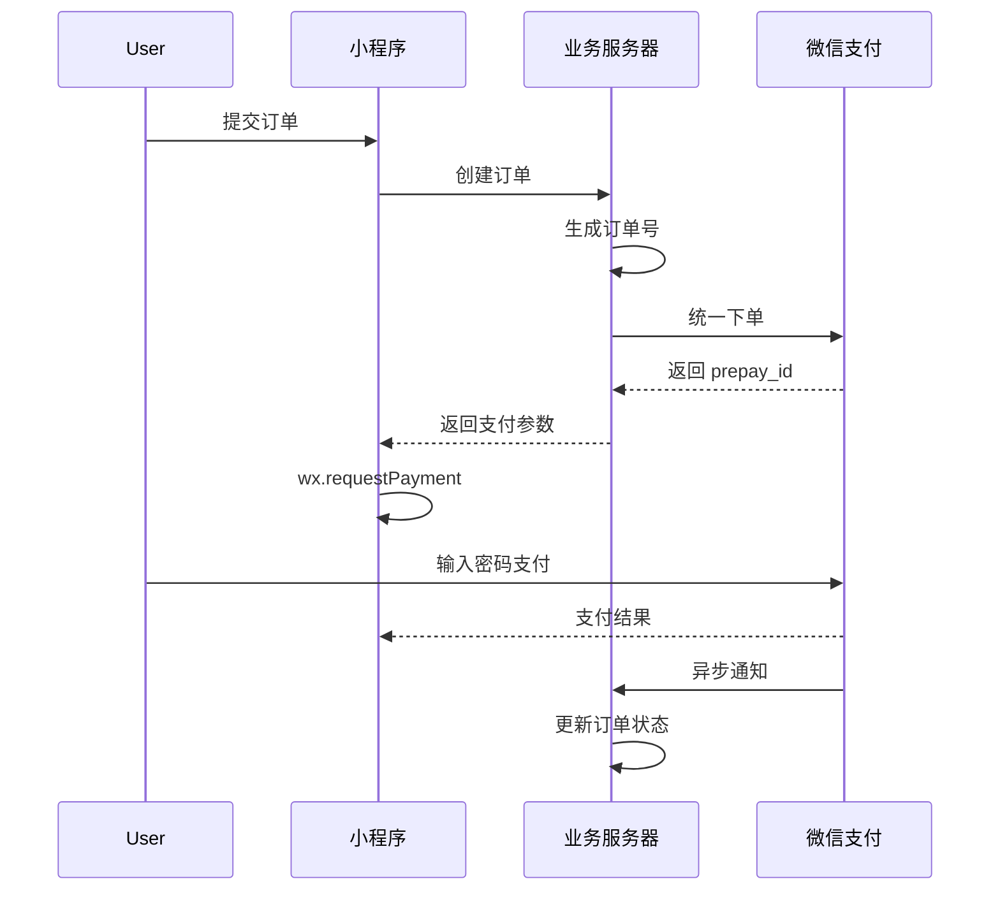

#### 前端实现

```javascript
async function pay(orderId) {
  // 1. 创建订单获取支付参数
  const payParams = await post('/api/order/create', { orderId });

  // 2. 调起微信支付
  return new Promise((resolve, reject) => {
    wx.requestPayment({
      timeStamp: payParams.timeStamp,
      nonceStr: payParams.nonceStr,
      package: payParams.package,        // prepay_id=xxx
      signType: payParams.signType,       // 'RSA'
      paySign: payParams.paySign,
      success: (res) => {
        // 前端通知支付成功（不可靠，需后端确认）
        wx.showToast({ title: '支付成功' });
        resolve(res);
      },
      fail: (err) => {
        if (err.errMsg.includes('cancel')) {
          wx.showToast({ title: '已取消', icon: 'none' });
        } else {
          wx.showToast({ title: '支付失败', icon: 'none' });
        }
        reject(err);
      }
    });
  });
}

// 支付完成后轮询订单状态
async function checkOrderStatus(orderId) {
  let retry = 0;
  while (retry < 5) {
    const order = await get(`/api/order/${orderId}`);
    if (order.status === 'paid') return order;
    await new Promise(r => setTimeout(r, 1000));
    retry++;
  }
  throw new Error('支付状态确认超时');
}
```

#### 服务器异步通知

```javascript
// 后端：微信回调通知
app.post('/api/pay/notify', (req, res) => {
  const { out_trade_no, transaction_id, result_code } = req.body;
  if (result_code === 'SUCCESS') {
    // 更新订单状态
    Order.update(out_trade_no, { status: 'paid', transactionId: transaction_id });
  }
  res.send('<xml><return_code>SUCCESS</return_code></xml>');
});
```

***

### Q28. 小程序与 WebView 如何交互？

#### web-view 嵌入 H5

```html
<!-- 小程序页面 -->
<web-view src="{{url}}"></web-view>
```

```javascript
Page({
  data: { url: 'https://h5.example.com/page' }
});
```

#### 限制条件

- 必须 **配置业务域名**（开发设置中）

- 域名必须 HTTPS

- 必须 ICP 备案

- 不能使用 IP、localhost

#### 小程序 → H5 通信

通过 URL 参数传递：

```javascript
const url = `https://h5.example.com/page?id=${id}&token=${token}`;
this.setData({ url });
```

#### H5 → 小程序通信

通过 SDK 提供的能力：

```javascript
// H5 页面引入 SDK
<script src="https://res.wx.qq.com/open/js/jweixin-1.6.0.js"></script>

<script>
// 返回小程序
wx.miniProgram.navigateBack({ delta: 1 });

// 跳转小程序其他页面
wx.miniProgram.navigateTo({ url: '/pages/index/index' });

// 切换 tab
wx.miniProgram.switchTab({ url: '/pages/index/index' });

// 传参：通过 postMessage（特定时机触发）
wx.miniProgram.postMessage({
  data: { type: 'custom', value: 'xxx' }
});
// 注意：postMessage 在特定时机触发：
// 小程序后退、组件销毁、分享、复制链接
</script>
```

#### 小程序接收 H5 消息

```html
<web-view
  src="{{url}}"
  bind:message="onMessage"
  bind:load="onLoad"
  bind:error="onError"
/>
```

```javascript
Page({
  onMessage(e) {
    // e.detail.data 是数组，包含所有 postMessage 消息
    console.log(e.detail.data);
  }
});
```

#### 项目实战：H5 与小程序混合开发

> **场景**：已有 H5 营销活动页，嵌入小程序。
>
> **方案**：
>
> 1. 域名配置：在小程序后台配置业务域名
> 2. URL 参数：小程序传用户信息给 H5
> 3. postMessage：H5 操作完成通知小程序刷新

```javascript
// 小程序
Page({
  data: {
    url: `https://h5.example.com/activity?token=${wx.getStorageSync('token')}`
  },
  onMessage(e) {
    const data = e.detail.data[e.detail.data.length - 1];
    if (data.type === 'activityComplete') {
      this.refreshUserInfo();
    }
  },
  refreshUserInfo() {
    // 刷新用户信息
  }
});
```

***

### Q29. 小程序云开发的核心能力？

#### 核心能力

| 能力       | 说明            | 对比传统       |
| -------- | ------------- | ---------- |
| 云函数      | Node.js 函数即服务 | 无需自建服务器    |
| 云数据库     | NoSQL 文档数据库   | 类似 MongoDB |
| 云存储      | 文件存储与 CDN     | 替代 OSS     |
| 云调用      | 直接调用微信开放接口    | 免去鉴权       |
| HTTP API | 外部访问云函数       | 支持第三方触发    |

#### 云函数示例

```javascript
// 云函数：获取用户列表
// cloudfunctions/getUsers/index.js
const cloud = require('wx-server-sdk');
cloud.init({ env: cloud.DYNAMIC_CURRENT_ENV });

exports.main = async (event, context) => {
  const { page = 1, size = 20 } = event;
  const db = cloud.database();

  const result = await db.collection('users')
    .skip((page - 1) * size)
    .limit(size)
    .get();

  return {
    data: result.data,
    total: result.data.length
  };
};
```

#### 云数据库操作

```javascript
// 前端直接操作云数据库
const db = wx.cloud.database();
const _ = db.command;

// 查询
const result = await db.collection('products')
  .where({ category: 'phone', price: _.gt(3000) })
  .orderBy('price', 'desc')
  .limit(20)
  .get();

// 新增
await db.collection('orders').add({
  data: { userId, productId, status: 'pending', createdAt: new Date() }
});

// 更新
await db.collection('orders').doc(orderId).update({
  data: { status: 'paid' }
});

// 删除
await db.collection('orders').doc(orderId).remove();
```

#### 云存储

```javascript
// 上传文件
const { fileID } = await wx.cloud.uploadFile({
  cloudPath: 'images/' + Date.now() + '.png',
  filePath: localPath
});

// 下载
const { tempFilePath } = await wx.cloud.downloadFile({ fileID });

// 删除
await wx.cloud.deleteFile({ fileList: [fileID] });
```

#### 云调用：发送模板消息

```javascript
// 云函数中直接调用微信开放接口
const cloud = require('wx-server-sdk');
cloud.init();

exports.main = async (event, context) => {
  // 直接调用，免去 access_token 鉴权
  const result = await cloud.openapi.subscribeMessage.send({
    touser: event.openid,
    templateId: 'template_id',
    page: 'pages/index/index',
    data: {
      thing1: { value: '订单已发货' },
      date2: { value: '2024-09-04 10:00' }
    }
  });
  return result;
};
```

***

### Q30. 多端统一开发框架对比（Taro / uni-app）

#### 主流框架对比

| 框架      | 出品方    | 语法        | 编译方式 | 多端能力            |
| ------- | ------ | --------- | ---- | --------------- |
| Taro    | 京东     | React/Vue | 编译时  | 小程序/H5/RN       |
| uni-app | DCloud | Vue       | 编译时  | 小程序/H5/App/各小程序 |
| mpvue   | 美团     | Vue       | 编译时  | 仅微信小程序（已停止维护）   |
| Remax   | 蚂蚁     | React     | 运行时  | 支付宝小程序为主        |
| kbone   | 腾讯     | 仿 Web     | 运行时  | 微信小程序/H5        |

#### Taro 示例

```javascript
// React 语法
import { View, Text, Button } from '@tarojs/components';
import { useState } from 'react';

export default function Index() {
  const [count, setCount] = useState(0);
  return (
    <View>
      <Text>{count}</Text>
      <Button onClick={() => setCount(count + 1)}>+1</Button>
    </View>
  );
}
```

```json
// 配置多端
{
  "pages": ["pages/index/index"],
  "platforms": ["weapp", "h5", "rn"]
}
```

#### uni-app 示例

```html
<!-- Vue 语法 -->
<template>
  <view>
    <text>{{ count }}</text>
    <button @click="increment">+1</button>
  </view>
</template>

<script>
export default {
  data() {
    return { count: 0 };
  },
  methods: {
    increment() { this.count++; }
  }
};
</script>
```

#### 选型建议

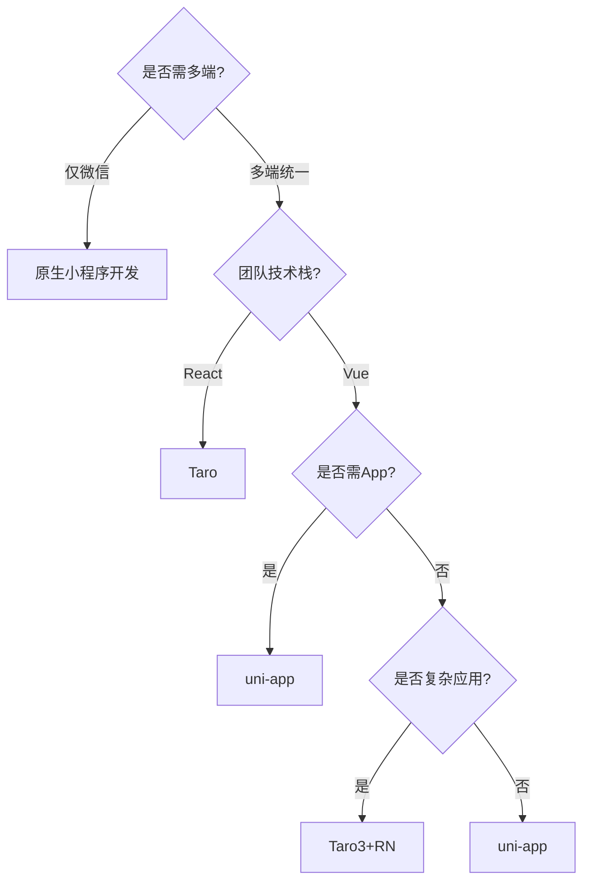

#### 项目实战踩坑

> **Taro 踩坑**：
>
> 1. 微信小程序原生组件不支持自定义事件名转 kebab-case
> 2. RN 端不支持 `children` 嵌套
> 3. CSS 样式不支持后代选择器，需用 BEM
>
> **uni-app 踩坑**：
>
> 1. 条件编译 `#ifdef MP-WEIXIN` 写法繁琐
> 2. App 端原生能力需 nvue
> 3. 部分小程序能力各端不一致，需手动适配

***

## 七、高频速答卡片与踩坑总结

### 7.1 高频速答卡片

#### 基础原理类

**Q：小程序为什么用双线程？**
A：① 安全（逻辑层无 DOM API，防 XSS）；② 性能（JS 不阻塞渲染）；③ 审核合规（禁动态执行 JS）。

**Q：rpx 怎么算？**
A：1rpx = 屏幕宽度 / 750。设计稿 750px 宽时直接 1:1，375px 宽时 ×2。

**Q：小程序与 H5 最大区别？**
A：① 双线程架构；② 不能操作 DOM；③ 原生能力丰富；④ 包体积限制（主包 2MB）。

#### 生命周期类

**Q：onLoad 与 onShow 区别？**
A：onLoad 只触发 1 次（页面加载），onShow 触发多次（每次显示）。

**Q：页面栈最大多少层？**
A：10 层。超过用 redirectTo 或 reLaunch。

**Q：组件 created 与 attached 区别？**
A：created 不能 setData，attached 可以。

#### 数据通信类

**Q：setData 性能差怎么办？**
A：① 合并多次；② 路径更新 `list[0].name`；③ pureData 不渲染的不传；④ 避免大对象。

**Q：父子组件通信方式？**
A：父→子用 properties；子→父用 triggerEvent；父→子直接调用用 selectComponent。

**Q：全局数据共享方案？**
A：globalData（简单）、事件总线（跨页面）、MobX（大型应用）。

#### 性能优化类

**Q：首屏启动慢怎么优化？**
A：① 分包加载；② 按需注入组件；③ 并行请求关键数据；④ 骨架屏；⑤ 避免同步 API。

**Q：长列表卡顿怎么办？**
A：① 虚拟列表（只渲染可见区域）；② 分页加载；③ 回收不可见区域；④ 使用 recycle-view。

**Q：图片优化方案？**
A：① WebP 格式；② 懒加载；③ CDN 多尺寸；④ 占位图；⑤ 雪成图。

#### 生态进阶类

**Q：登录流程？**
A：wx.login 获取 code → 后端用 code + appid + secret 换 openid + session\_key → 后端生成 token 返回前端。

**Q：支付流程？**
A：前端创建订单 → 后端统一下单获得 prepay\_id → 返回支付参数 → 前端 wx.requestPayment → 后端异步通知确认。

**Q：Taro 和 uni-app 选哪个？**
A：React 团队选 Taro，Vue 团队选 uni-app；需 App 端选 uni-app。

### 7.2 高频踩坑总结

#### 踩坑1：setData 频繁触发卡顿

```javascript
// ❌ 错误：循环内 setData
for (let i = 0; i < list.length; i++) {
  this.setData({ [`list[${i}].status`]: 'updated' });
}

// ✅ 正确：批量合并
const updates = {};
list.forEach((item, i) => {
  updates[`list[${i}].status`] = 'updated';
});
this.setData(updates);
```

#### 踩坑2：onShow 频繁请求接口

```javascript
// ❌ 错误：每次 onShow 都请求
onShow() { this.fetchData(); }

// ✅ 正确：条件刷新
onShow() {
  if (this.needRefresh) {
    this.fetchData();
    this.needRefresh = false;
  }
}
```

#### 踩坑3：页面栈溢出

```javascript
// ❌ 错误：连续 navigateTo 10+ 次
wx.navigateTo({ url: '/pages/a/a' });
wx.navigateTo({ url: '/pages/b/b' });
// 第 10 次失败

// ✅ 正确：栈过深用 redirectTo
const pages = getCurrentPages();
if (pages.length >= 5) {
  wx.redirectTo({ url: '/pages/b/b' });
} else {
  wx.navigateTo({ url: '/pages/b/b' });
}
```

#### 踩坑4：事件冒泡意外触发

```html
<!-- ❌ 错误：内部 bindtap 会冒泡到外层 -->
<view bindtap="onOuter">
  <button bindtap="onInner">点击</button>
</view>

<!-- ✅ 正确：用 catchtap 阻止冒泡 -->
<view bindtap="onOuter">
  <button catchtap="onInner">点击</button>
</view>
```

#### 踩坑5：定时器未清理

```javascript
// ❌ 错误：未清理导致内存泄漏
Page({
  onLoad() {
    setInterval(() => console.log('tick'), 1000);
  }
});

// ✅ 正确：onUnload 清理
Page({
  data: { _timer: null },
  onLoad() {
    this.data._timer = setInterval(() => console.log('tick'), 1000);
  },
  onUnload() {
    clearInterval(this.data._timer);
  }
});
```

#### 踩坑6：web-view 域名配置

```
问题：web-view 白屏
原因：域名未配置业务域名
解决：
1. 小程序后台 → 开发管理 → 开发设置 → 业务域名
2. 域名必须 HTTPS
3. 域名必须 ICP 备案
4. 下载校验文件上传到域名根目录
```

### 7.3 面试准备建议

#### 知识体系图

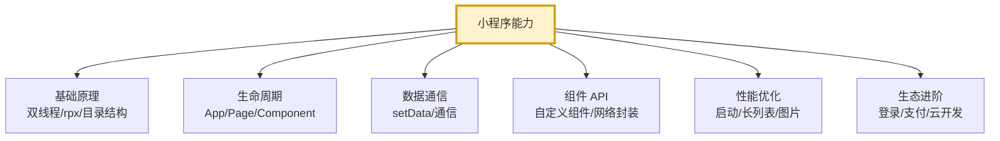

#### 复习重点优先级

| 优先级 | 内容         | 复习建议            |
| --- | ---------- | --------------- |
| P0  | 双线程架构      | 能讲清原理与优缺点       |
| P0  | setData 优化 | 必须能写出路径更新       |
| P0  | 生命周期触发顺序   | 能画时序图           |
| P0  | 登录流程       | 能完整画出流程图        |
| P1  | 路由跳转与页面栈   | 区分四种跳转方式        |
| P1  | 分包加载       | 配置与预下载          |
| P1  | 性能优化方案     | 启动、长列表、图片       |
| P2  | 组件通信       | 三种方式            |
| P2  | 云开发        | 基本概念与 API       |
| P3  | 多端框架       | Taro/uni-app 对比 |

#### 简历加分项

1. **具体数字**：如"将 setData 平均耗时从 80ms 优化至 15ms"
2. **技术方案**：如"设计虚拟列表组件，支撑 10w 条数据流畅滚动"
3. **架构经验**：如"主导 5 个分包拆分，主包体积从 1.8MB 降至 1.2MB"
4. **性能指标**：如"小程序首屏加载从 3s 优化至 1.2s"
5. **工程化**：如"搭建 CI/CD 自动化发布流程，发布效率提升 5 倍"

***

## 参考资料与延伸阅读

- [微信小程序官方文档](https://developers.weixin.qq.com/miniprogram/dev/framework/)

- [小程序性能优化指南](https://developers.weixin.qq.com/miniprogram/dev/framework/performance/)

- [小程序云开发文档](https://developers.weixin.qq.com/miniprogram/dev/wxcloud/)

- [Taro 官方文档](https://docs.taro.zone/)

- [uni-app 官方文档](https://uniapp.dcloud.net.cn/)

***

> 文档总结：本文涵盖微信小程序开发 6 大模块共 30 道高频面试题，从基础原理到生态进阶层层递进，每道题包含原理讲解、代码示例、项目背景与踩坑经验，适合系统化复习与面试备战。建议重点关注 P0 级内容，做到能手写代码、能讲清原理。

