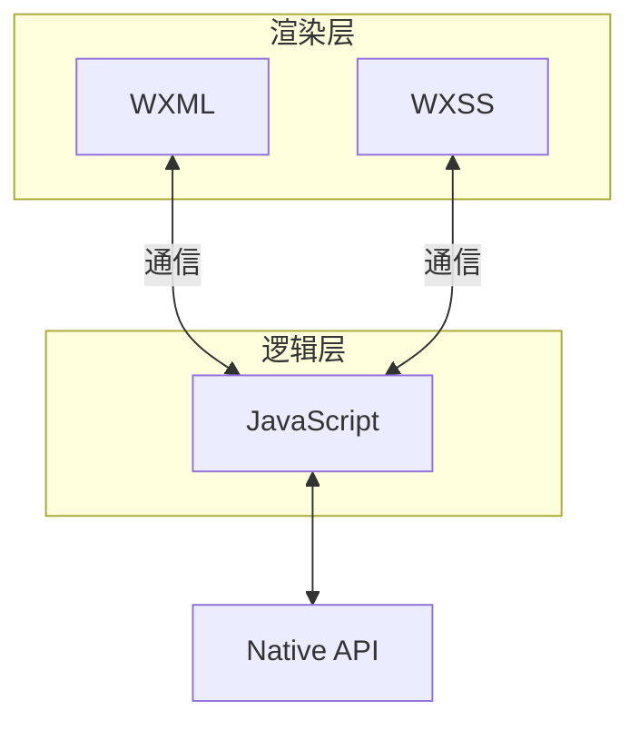
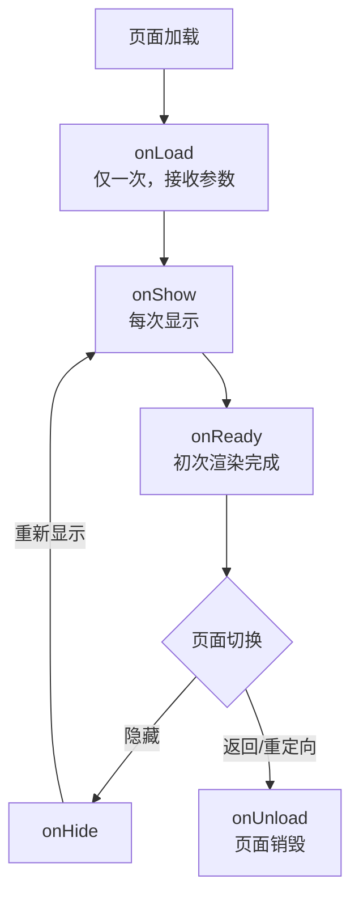
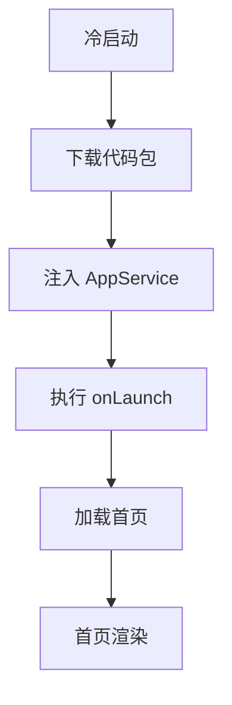
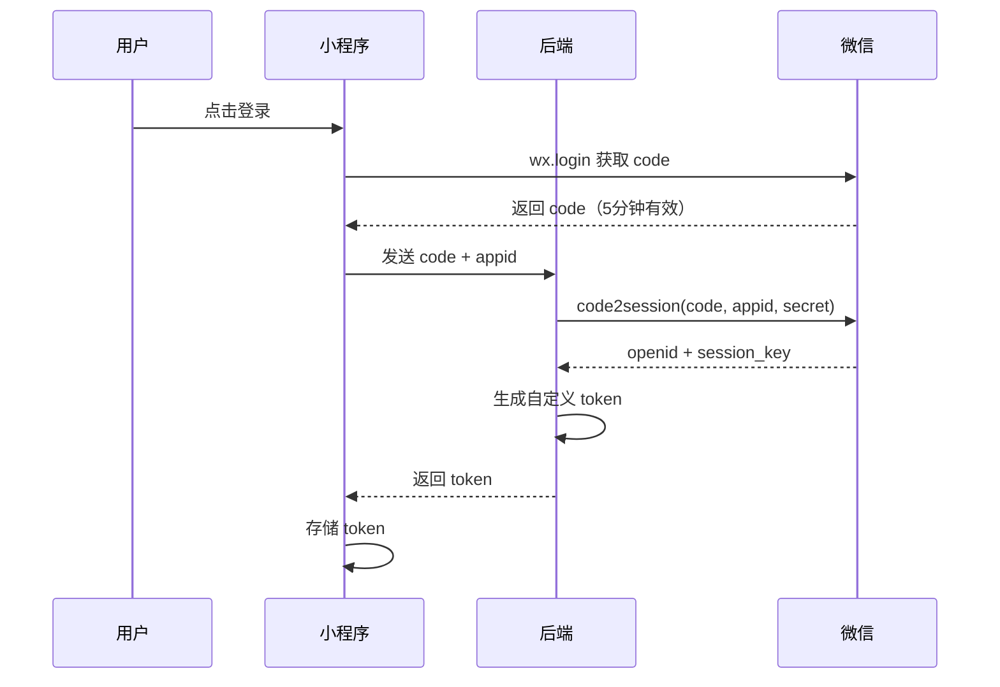
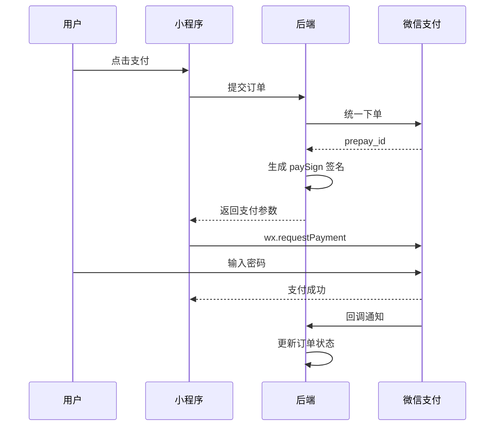

# 微信小程序高频面试题与详细回答

> 文档定位：系统梳理微信小程序在面试中的高频问题，涵盖双线程架构、运行环境、生命周期、路由与页面栈、组件通信、setData、性能优化、分包加载、登录与支付、云开发等核心考点。
>
> 适用人群：前端工程师，尤其是需要开发和优化微信小程序的开发者。
>
> 阅读建议：先掌握双线程架构与运行机制（一至二章），再学习生命周期与组件（三至四章），最后攻克性能优化与工程化（五至八章）。重点关注「双线程模型」「setData 原理」「生命周期」「分包加载」四大核心模块。

***

## 目录

- [微信小程序高频面试题与详细回答](#微信小程序高频面试题与详细回答)
  - [目录](#目录)
  - [一、架构与运行环境](#一架构与运行环境)
    - [Q1. 小程序双线程架构？](#q1-小程序双线程架构)
      - [双线程模型](#双线程模型)
      - [为什么是双线程？](#为什么是双线程)
      - [通信机制](#通信机制)
    - [Q2. 小程序运行环境与浏览器区别？](#q2-小程序运行环境与浏览器区别)
      - [小程序的全局对象](#小程序的全局对象)
    - [Q3. WXSS 与 CSS 的区别？rpx 原理？](#q3-wxss-与-css-的区别rpx-原理)
      - [WXSS 与 CSS 区别](#wxss-与-css-区别)
      - [rpx 原理](#rpx-原理)
  - [二、生命周期](#二生命周期)
    - [Q4. App/Page/Component 生命周期？](#q4-apppagecomponent-生命周期)
      - [App 生命周期](#app-生命周期)
      - [Page 生命周期](#page-生命周期)
      - [Component 生命周期](#component-生命周期)
    - [Q5. onLoad、onShow、onReady、onHide、onUnload 区别？](#q5-onloadonshowonreadyonhideonunload-区别)
    - [Q6. 页面栈与路由跳转方式？](#q6-页面栈与路由跳转方式)
      - [跳转方式](#跳转方式)
      - [页面栈限制](#页面栈限制)
      - [页面栈示例](#页面栈示例)
  - [三、数据绑定与 setData](#三数据绑定与-setdata)
    - [Q7. setData 原理与注意事项？](#q7-setdata-原理与注意事项)
      - [核心原理](#核心原理)
      - [注意事项](#注意事项)
      - [正确用法](#正确用法)
    - [Q8. 小程序如何优化 setData？](#q8-小程序如何优化-setdata)
      - [示例](#示例)
    - [Q9. 双向绑定如何实现？](#q9-双向绑定如何实现)
      - [原生方式](#原生方式)
      - [model: 语法（简易双向绑定）](#model-语法简易双向绑定)
      - [自定义组件双向绑定](#自定义组件双向绑定)
  - [四、组件通信](#四组件通信)
    - [Q10. 父子组件通信方式？](#q10-父子组件通信方式)
      - [properties + triggerEvent](#properties--triggerevent)
    - [Q11. behaviors 的作用？](#q11-behaviors-的作用)
      - [核心答案](#核心答案)
      - [定义 behavior](#定义-behavior)
      - [使用 behavior](#使用-behavior)
      - [冲突处理](#冲突处理)
    - [Q12. 全局数据共享方案？](#q12-全局数据共享方案)
      - [getApp 全局数据](#getapp-全局数据)
      - [事件总线](#事件总线)
  - [五、性能优化](#五性能优化)
    - [Q13. 小程序启动优化？](#q13-小程序启动优化)
      - [启动流程](#启动流程)
      - [优化手段](#优化手段)
      - [按需注入配置](#按需注入配置)
    - [Q14. 长列表优化（虚拟列表）？](#q14-长列表优化虚拟列表)
      - [核心思路](#核心思路)
      - [recycle-view 组件](#recycle-view-组件)
      - [原生虚拟列表实现](#原生虚拟列表实现)
    - [Q15. 分包加载原理与配置？](#q15-分包加载原理与配置)
      - [分包类型](#分包类型)
      - [配置](#配置)
      - [分包限制](#分包限制)
    - [Q16. 图片优化策略？](#q16-图片优化策略)
  - [六、API 与能力](#六api-与能力)
    - [Q17. 小程序网络请求封装？](#q17-小程序网络请求封装)
    - [Q18. 存储方案对比？](#q18-存储方案对比)
    - [Q19. WebView 与小程序通信？](#q19-webview-与小程序通信)
      - [小程序 → WebView](#小程序--webview)
      - [WebView → 小程序](#webview--小程序)
      - [小程序接收 H5 消息](#小程序接收-h5-消息)
  - [七、登录与支付](#七登录与支付)
    - [Q20. 小程序登录流程？](#q20-小程序登录流程)
      - [前端代码](#前端代码)
      - [后端流程](#后端流程)
    - [Q21. openid、unionid、session\_key 区别？](#q21-openidunionidsession_key-区别)
      - [获取条件](#获取条件)
    - [Q22. 小程序支付流程？](#q22-小程序支付流程)
      - [前端支付](#前端支付)
  - [八、云开发与工程化](#八云开发与工程化)
    - [Q23. 云开发能力有哪些？](#q23-云开发能力有哪些)
      - [云函数](#云函数)
      - [调用云函数](#调用云函数)
    - [Q24. Taro / uni-app / 原生开发对比？](#q24-taro--uni-app--原生开发对比)
      - [选型建议](#选型建议)
  - [九、综合实战题](#九综合实战题)
    - [Q25. 如何实现无限滚动列表？](#q25-如何实现无限滚动列表)
      - [优化要点](#优化要点)
    - [Q26. 如何设计一个小程序的架构？](#q26-如何设计一个小程序的架构)
      - [分层设计](#分层设计)
      - [设计原则](#设计原则)
  - [十、速答与踩坑总结](#十速答与踩坑总结)
    - [10.1 速答卡片](#101-速答卡片)
    - [10.2 实战踩坑 10 例](#102-实战踩坑-10-例)
    - [10.3 复习优先级表](#103-复习优先级表)

***

## 一、架构与运行环境

### Q1. 小程序双线程架构？
小程序的双线程架构，指的是渲染层和逻辑层分别运行在两个独立的线程中：


| 线程 | 运行环境 | 负责工作 | 代表技术 |
|-----|---------|---------|---------|
| 渲染层（View Thread） | WebView（浏览器内核） | 解析 WXML/WXSS，渲染页面结构，处理用户交互事件 | WebKit/Blink（iOS/Android 系统 WebView） |
| 逻辑层（App Service Thread） | JavaScript 引擎（独立于 WebView） | 执行业务逻辑、数据处理、调用原生 API、管理生命周期 | iOS: JavaScriptCore / Android: V8 或 JSC |

两个线程不直接通信，而是通过原生层（Native Bridge） 进行异步消息传递。



#### 双线程模型

| 线程      | 运行内容              | 说明                          |
| ------- | ----------------- | --------------------------- |
| **渲染层** | WXML 模板 + WXSS 样式 | 由 WebView 渲染，每个页面一个 WebView |
| **逻辑层** | JS 逻辑             | 单独的 JS 引擎运行（JSCore/V8）      |

#### 为什么是双线程？

```
1. 安全：逻辑层无法直接操作 DOM，防止恶意代码
2. 性能：渲染和逻辑分离，互不阻塞
3. 管控：所有 API 需通过 Native 桥接，可控
```

#### 通信机制

```
渲染层 ↔ 逻辑层 通过 Native 层中转
使用消息队列 + 数据序列化传递
逻辑层 setData → 序列化 → Native → 渲染层渲染
```

***

### Q2. 小程序运行环境与浏览器区别？

| 维度           | 浏览器                  | 小程序                     |
| ------------ | -------------------- | ----------------------- |
| **JS 引擎**    | V8/JavaScriptCore    | JSCore(iOS)/V8(Android) |
| **DOM/BOM**  | ✅                    | ❌ 无 DOM/BOM             |
| **window**   | ✅                    | ❌ 无 window 对象           |
| **document** | ✅                    | ❌ 无 document            |
| **AJAX**     | XMLHttpRequest/fetch | wx.request              |
| **存储**       | localStorage         | wx.setStorage           |
| **跳转**       | location.href        | wx.navigateTo 等         |
| **Canvas**   | ✅                    | wx.createCanvasContext  |

#### 小程序的全局对象

```js
// 小程序的全局对象是 wx，不是 window
wx.request({ url: '...' })
wx.setStorageSync('key', 'value')
wx.navigateTo({ url: '/pages/list/list' })
```

***

### Q3. WXSS 与 CSS 的区别？rpx 原理？

#### WXSS 与 CSS 区别

| 特性         | CSS     | WXSS                  |
| ---------- | ------- | --------------------- |
| **rpx 单位** | ❌       | ✅ 响应式像素               |
| **import** | @import | @import（需用绝对路径）       |
| **选择器**    | 全部      | 部分（不支持通配符 \*）         |
| **全局样式**   | 全局      | app.wxss 全局 + 页面 wxss |

#### rpx 原理

```
rpx（responsive pixel）：响应式像素
规定屏幕宽度为 750rpx
开发时按 750 设计稿写尺寸，自动适配不同屏幕

换算：
  iPhone6：屏幕宽 375px，750rpx = 375px → 1rpx = 0.5px
  公式：1rpx = 屏幕宽度 / 750 px
```

```css
/* 设计稿 750 宽，元素宽 200px */
.box {
  width: 200rpx;  /* 自动适配 */
}
```

***

## 二、生命周期

### Q4. App/Page/Component 生命周期？

#### App 生命周期

| 钩子           | 触发时机        |
| ------------ | ----------- |
| **onLaunch** | 小程序初始化（冷启动） |
| **onShow**   | 小程序从后台进入前台  |
| **onHide**   | 小程序从前台进入后台  |
| **onError**  | 小程序发生错误     |

```js
App({
  onLaunch(options) {
    // 全局初始化：登录、获取系统信息
  },
  onShow(options) {
    // 前台显示
  },
  onHide() {
    // 进入后台
  }
})
```

#### Page 生命周期

| 钩子                    | 触发时机      |
| --------------------- | --------- |
| **onLoad**            | 页面加载（仅一次） |
| **onShow**            | 页面显示      |
| **onReady**           | 页面初次渲染完成  |
| **onHide**            | 页面隐藏      |
| **onUnload**          | 页面卸载      |
| **onPullDownRefresh** | 下拉刷新      |
| **onReachBottom**     | 触底        |
| **onShareAppMessage** | 分享        |

#### Component 生命周期

| 钩子           | 触发时机                 |
| ------------ | -------------------- |
| **created**  | 组件实例创建（不能调用 setData） |
| **attached** | 组件进入页面节点树            |
| **ready**    | 组件布局完成               |
| **moved**    | 组件节点移动               |
| **detached** | 组件从节点树移除             |

***

### Q5. onLoad、onShow、onReady、onHide、onUnload 区别？



| 钩子           | 执行次数 | 场景              |
| ------------ | ---- | --------------- |
| **onLoad**   | 1 次  | 接收页面参数，初始化数据    |
| **onShow**   | 多次   | 每次页面显示，刷新数据     |
| **onReady**  | 1 次  | 操作 DOM（WXML 节点） |
| **onHide**   | 多次   | 页面隐藏，暂停定时器      |
| **onUnload** | 1 次  | 页面销毁，清理资源       |

***

### Q6. 页面栈与路由跳转方式？

#### 跳转方式

| API                 | 说明                 | 页面栈 |
| ------------------- | ------------------ | --- |
| **wx.navigateTo**   | 保留当前页，跳转到新页面       | +1  |
| **wx.redirectTo**   | 关闭当前页，跳转到新页面       | 不变  |
| **wx.switchTab**    | 跳转到 tabBar 页面，关闭其他 | -   |
| **wx.reLaunch**     | 关闭所有页，打开新页面        | 重置  |
| **wx.navigateBack** | 返回上一页              | -1  |

#### 页面栈限制

```
页面栈最多 10 层
超过 10 层后 navigateTo 会失败
需用 redirectTo 或 reLaunch 替代
```

#### 页面栈示例

```
初始：[首页]
navigateTo 列表：[首页, 列表]
navigateTo 详情：[首页, 列表, 详情]
navigateBack：[首页, 列表]
redirectTo 编辑：[首页, 列表, 编辑]（替换详情）
```

***

## 三、数据绑定与 setData

### Q7. setData 原理与注意事项？

#### 核心原理

```
setData 是逻辑层与渲染层通信的唯一方式
过程：
1. 逻辑层 setData(data)
2. 数据序列化，通过 Native 层传输到渲染层
3. 渲染层收到数据，重新渲染 WXML
4. 渲染完成回调
```

#### 注意事项

| 注意点               | 说明                    |
| ----------------- | --------------------- |
| **数据量**           | 单次 setData 不超过 256KB  |
| **频率**            | 避免频繁调用，合并多次更新         |
| **不要传函数**         | 只传可序列化的数据             |
| **路径更新**          | 用 'a.b\[0].c' 路径更新子属性 |
| **不要设 undefined** | 会被忽略，用 null 或删除       |

#### 正确用法

```js
// ✅ 只更新变化的字段
this.setData({
  'user.name': '张三',
  'list[0].count': 5
})

// ❌ 不要每次都传整个大对象
this.setData({ list: newList })  // 数据量大
```

***

### Q8. 小程序如何优化 setData？

| 优化手段        | 说明                    |
| ----------- | --------------------- |
| **减少数据量**   | 只传变化的字段，不传整个对象        |
| **合并调用**    | 多次 setData 合并为一次      |
| **避免循环调用**  | 不要在 for 循环中调用 setData |
| **拆分数据**    | 静态数据不放进 data          |
| **使用自定义组件** | 组件内数据独立 setData，局部更新  |
| **防抖/节流**   | 高频操作（如输入）做防抖          |

#### 示例

```js
// ❌ 循环中多次 setData
for (let i = 0; i < list.length; i++) {
  this.setData({ [`list[${i}].checked`]: true })
}

// ✅ 合并为一次
const updates = {}
for (let i = 0; i < list.length; i++) {
  updates[`list[${i}].checked`] = true
}
this.setData(updates)
```

***

### Q9. 双向绑定如何实现？

#### 原生方式

```xml
<!-- wxml -->
<input value="{{value}}" bindinput="onInput" />
```

```js
// js
Page({
  data: { value: '' },
  onInput(e) {
    this.setData({ value: e.detail.value })
  }
})
```

#### model: 语法（简易双向绑定）

```xml
<!-- wxml：model: 前缀实现双向绑定 -->
<input model:value="{{value}}" />
```

```js
// js
Page({
  data: { value: '' }
  // 无需手动处理 input 事件
})
```

#### 自定义组件双向绑定

```js
// 子组件
Component({
  properties: {
    value: { type: String, value: '' }
  },
  methods: {
    onInput(e) {
      // 触发双向绑定
      this.triggerEvent('input', { value: e.detail.value })
    }
  }
})
```

```xml
<!-- 父组件使用 model:value -->
<custom-input model:value="{{name}}" />
```

***

## 四、组件通信

### Q10. 父子组件通信方式？

| 方式                  | 方向    | 说明       |
| ------------------- | ----- | -------- |
| **properties**      | 父 → 子 | 父传子属性    |
| **triggerEvent**    | 子 → 父 | 子触发事件    |
| **selectComponent** | 父 → 子 | 父获取子组件实例 |
| **relations**       | 父子关联  | 关联组件关系   |
| **behaviors**       | 复用    | 代码复用     |

#### properties + triggerEvent

```js
// 子组件
Component({
  properties: {
    title: { type: String, value: '' }
  },
  methods: {
    onClick() {
      this.triggerEvent('change', { value: '新值' })
    }
  }
})
```

```xml
<!-- 父组件 -->
<child title="{{title}}" bind:change="onChildChange" />
```

```js
// 父组件
Page({
  data: { title: '标题' },
  onChildChange(e) {
    console.log(e.detail.value)
  }
})
```

***

### Q11. behaviors 的作用？

#### 核心答案

behaviors 用于组件间代码复用，类似 Vue 的 mixins，但更强大。

#### 定义 behavior

```js
// behaviors/behavior.js
module.exports = Behavior({
  data: { count: 0 },
  methods: {
    increment() {
      this.setData({ count: this.data.count + 1 })
    }
  },
  lifetimes: {
    attached() {
      console.log('behavior attached')
    }
  }
})
```

#### 使用 behavior

```js
const myBehavior = require('../../behaviors/behavior')

Component({
  behaviors: [myBehavior],  // 引入 behavior
  data: { name: '组件' }
  // 自动拥有 count 和 increment 方法
})
```

#### 冲突处理

```
1. properties：组件和 behavior 有同名属性，组件优先
2. data：同名 data，组件覆盖 behavior
3. methods：同名方法，组件覆盖 behavior
4. lifetimes：都会执行（behavior 先，组件后）
```

***

### Q12. 全局数据共享方案？

| 方案                      | 说明               | 适用    |
| ----------------------- | ---------------- | ----- |
| **getApp().globalData** | 全局对象             | 简单共享  |
| **本地存储**                | wx.setStorage    | 持久化   |
| **事件总线**                | 自定义 EventBus     | 跨页面通信 |
| **MobX/Redux**          | 第三方状态管理          | 复杂应用  |
| **小程序状态管理**             | mobx-miniprogram | 官方推荐  |

#### getApp 全局数据

```js
// app.js
App({
  globalData: {
    userInfo: null,
    token: ''
  }
})

// 页面中使用
const app = getApp()
app.globalData.token = 'xxx'
```

#### 事件总线

```js
// utils/eventBus.js
class EventBus {
  constructor() {
    this.events = {}
  }
  on(name, fn) {
    (this.events[name] ||= []).push(fn)
  }
  emit(name, ...args) {
    (this.events[name] || []).forEach(fn => fn(...args))
  }
  off(name, fn) {
    this.events[name] = (this.events[name] || []).filter(f => f !== fn)
  }
}
module.exports = new EventBus()
```

***

## 五、性能优化

### Q13. 小程序启动优化？

#### 启动流程



#### 优化手段

| 手段         | 说明              |
| ---------- | --------------- |
| **分包加载**   | 主包只放首页，其他页分包    |
| **代码包体积**  | 压缩图片、移除无用代码     |
| **按需注入**   | 非首屏组件按需加载       |
| **数据预拉取**  | 提前请求数据          |
| **骨架屏**    | 减少白屏感知          |
| **减少同步任务** | onLaunch 不做耗时操作 |

#### 按需注入配置

```json
// app.json
{
  "lazyCodeLoading": "requiredComponents"
}
```

***

### Q14. 长列表优化（虚拟列表）？

#### 核心思路

```
只渲染可视区域的节点，非可视区域用占位符代替
滚动时动态计算可视范围，更新渲染内容
```

#### recycle-view 组件

```xml
<recycle-view batch="{{batchSetRecycleData}}" id="recycleId">
  <recycle-item wx:for="{{recycleList}}" wx:key="id">
    <view>{{item.text}}</view>
  </recycle-item>
</recycle-view>
```

#### 原生虚拟列表实现

```js
Page({
  data: {
    visibleList: [],   // 可视列表
    startIndex: 0,
    itemHeight: 50,
    visibleCount: 10,
    scrollTop: 0
  },

  onScroll(e) {
    const scrollTop = e.detail.scrollTop
    const startIndex = Math.floor(scrollTop / this.data.itemHeight)
    const visibleList = this.data.fullList.slice(
      startIndex,
      startIndex + this.data.visibleCount
    )
    this.setData({ startIndex, visibleList, scrollTop })
  }
})
```

***

### Q15. 分包加载原理与配置？

#### 分包类型

| 类型        | 说明          |
| --------- | ----------- |
| **普通分包**  | 按需加载        |
| **独立分包**  | 可独立运行，不依赖主包 |
| **分包预下载** | 提前下载分包      |

#### 配置

```json
// app.json
{
  "pages": ["pages/index/index"],
  "subpackages": [
    {
      "root": "packageA",
      "pages": ["pages/list/list", "pages/detail/detail"]
    },
    {
      "root": "packageB",
      "name": "packB",
      "independent": true,  // 独立分包
      "pages": ["pages/set/set"]
    }
  ],
  "preloadRule": {
    "pages/index/index": {
      "network": "all",
      "packages": ["packageA"]
    }
  }
}
```

#### 分包限制

```
1. 主包大小 ≤ 2MB
2. 单个分包 ≤ 2MB
3. 总包大小 ≤ 20MB（含分包）
4. 分包不能引用主包的资源（除 app.wxss 等全局）
```

***

### Q16. 图片优化策略？

| 策略          | 说明                 |
| ----------- | ------------------ |
| **懒加载**     | image 组件 lazy-load |
| **WebP 格式** | 体积小，加载快            |
| **CDN 加速**  | 图片放 CDN            |
| **缩略图**     | 列表用缩略图，详情用原图       |
| **限制尺寸**    | 按展示尺寸裁剪            |
| **占位图**     | 加载中显示占位            |

```xml
<!-- 懒加载 -->
<image src="{{url}}" lazy-load mode="aspectFill" />
```

***

## 六、API 与能力

### Q17. 小程序网络请求封装？

```js
// utils/request.js
const BASE_URL = 'https://api.example.com'

function request(options) {
  return new Promise((resolve, reject) => {
    const token = wx.getStorageSync('token')
    wx.request({
      url: BASE_URL + options.url,
      method: options.method || 'GET',
      data: options.data,
      header: {
        'Content-Type': 'application/json',
        'Authorization': token ? `Bearer ${token}` : ''
      },
      success(res) {
        if (res.statusCode === 200) {
          if (res.data.code === 0) {
            resolve(res.data.data)
          } else {
            wx.showToast({ title: res.data.message, icon: 'none' })
            reject(res.data)
          }
        } else if (res.statusCode === 401) {
          // 未登录，跳转登录
          wx.navigateTo({ url: '/pages/login/login' })
          reject(res)
        } else {
          reject(res)
        }
      },
      fail(err) {
        wx.showToast({ title: '网络错误', icon: 'none' })
        reject(err)
      }
    })
  })
}

module.exports = {
  get: (url, data) => request({ url, method: 'GET', data }),
  post: (url, data) => request({ url, method: 'POST', data })
}
```

***

### Q18. 存储方案对比？

| 方案                    | 容量            | 同步   | 持久 | 适用     |
| --------------------- | ------------- | ---- | -- | ------ |
| **wx.setStorage**     | 单个 1MB，总 10MB | ❌ 异步 | ✅  | 通用存储   |
| **wx.setStorageSync** | 同上            | ✅ 同步 | ✅  | 需要同步结果 |
| **wx.setStorageSync** | 同上            | ✅    | ✅  | 临时数据   |
| **本地文件**              | 无限制           | -    | ✅  | 大文件    |
| **云开发数据库**            | 云端            | ❌    | ✅  | 云端数据   |

```js
// 异步
wx.setStorage({
  key: 'user',
  data: { name: '张三' },
  success() { console.log('success') }
})

// 同步
wx.setStorageSync('user', { name: '张三' })
const user = wx.getStorageSync('user')
```

***

### Q19. WebView 与小程序通信？

#### 小程序 → WebView

```js
// 小程序通过 URL 传参
<web-view src="https://h5.example.com?token=xxx" />
```

#### WebView → 小程序

```html
<!-- H5 页面引入 JSSDK -->
<script src="https://res.wx.qq.com/open/js/jweixin-1.6.0.js"></script>
<script>
  // H5 调小程序
  wx.miniProgram.navigateTo({ url: '/pages/detail/detail' })
  wx.miniProgram.postMessage({ data: { foo: 'bar' } })
</script>
```

#### 小程序接收 H5 消息

```js
// 小程序 web-view 组件
Page({
  onMessage(e) {
    console.log(e.detail.data)  // H5 发来的消息
  }
})
```

```xml
<web-view src="{{url}}" bindmessage="onMessage" />
```

***

## 七、登录与支付

### Q20. 小程序登录流程？



#### 前端代码

```js
// 1. 调用 wx.login 获取 code
wx.login({
  success(res) {
    if (res.code) {
      // 2. 发送 code 到后端
      request.post('/api/login', { code: res.code }).then(data => {
        // 3. 存储 token
        wx.setStorageSync('token', data.token)
      })
    }
  }
})
```

#### 后端流程

```
1. 接收前端传来的 code
2. 调用微信 code2session 接口：
   GET https://api.weixin.qq.com/sns/jscode2session
   参数：appid + secret + js_code + grant_type
3. 返回 openid + session_key
4. 根据 openid 查找或创建用户
5. 生成自定义 token（JWT）返回前端
```

***

### Q21. openid、unionid、session\_key 区别？

| 标识               | 说明                  |
| ---------------- | ------------------- |
| **openid**       | 用户在当前小程序的唯一标识       |
| **unionid**      | 用户在同一开放平台下所有应用的唯一标识 |
| **session\_key** | 会话密钥，用于解密用户敏感数据     |

#### 获取条件

```
openid：每个用户在每个小程序都有一个
unionid：需绑定微信开放平台，同一用户在同主体下所有小程序/公众号 unionid 相同
session_key：登录时返回，用于解密 wx.getUserProfile 返回的加密数据
```

***

### Q22. 小程序支付流程？



#### 前端支付

```js
wx.requestPayment({
  timeStamp: '1414561699',
  nonceStr: '5K8264ILTKCH16CQ2502SI8ZNMTM67VS',
  package: 'prepay_id=wx201703301024229383072905938325',
  signType: 'RSA',
  paySign: 'oR9d8PuhnIc+YZ8cBHFCwfgpaK9gd7vaRvkYD7r',
  success(res) {
    console.log('支付成功', res)
  },
  fail(res) {
    if (res.errMsg.includes('cancel')) {
      console.log('用户取消')
    }
  }
})
```

***

## 八、云开发与工程化

### Q23. 云开发能力有哪些？

| 能力       | 说明                |
| -------- | ----------------- |
| **云数据库** | NoSQL 数据库，前端直接操作  |
| **云函数**  | 运行在云端的 Node.js 函数 |
| **云存储**  | 文件存储，上传下载         |
| **云调用**  | 免鉴权调用微信开放接口       |

#### 云函数

```js
// 云函数 index.js
const cloud = require('wx-server-sdk')
cloud.init()

exports.main = async (event, context) => {
  const { OPENID } = cloud.getWXContext()
  return { openid: OPENID, data: event.data }
}
```

#### 调用云函数

```js
wx.cloud.callFunction({
  name: 'getData',
  data: { id: 1 },
  success(res) {
    console.log(res.result)
  }
})
```

***

### Q24. Taro / uni-app / 原生开发对比？

| 维度       | 原生           | Taro        | uni-app |
| -------- | ------------ | ----------- | ------- |
| **语法**   | WXML/WXSS/JS | React/Vue   | Vue     |
| **跨端**   | ❌ 仅微信        | ✅ 多端        | ✅ 多端    |
| **性能**   | 最优           | 较好（编译型）     | 较好      |
| **生态**   | 官方最全         | 社区活跃        | 社区活跃    |
| **学习成本** | 学小程序语法       | 学 React/Vue | 学 Vue   |
| **包体积**  | 最小           | 较大（运行时）     | 较大      |

#### 选型建议

```
只做微信小程序 → 原生开发（性能最优，生态最全）
多端（小程序+H5+App）→ Taro 或 uni-app
团队用 React → Taro
团队用 Vue → uni-app
```

***

## 九、综合实战题

### Q25. 如何实现无限滚动列表？

```js
Page({
  data: {
    list: [],
    page: 1,
    pageSize: 20,
    loading: false,
    noMore: false
  },

  onLoad() {
    this.loadData()
  },

  // 触底加载
  onReachBottom() {
    if (this.data.loading || this.data.noMore) return
    this.loadData()
  },

  async loadData() {
    this.setData({ loading: true })
    try {
      const res = await request.get('/api/list', {
        page: this.data.page,
        pageSize: this.data.pageSize
      })
      const newList = res.list
      this.setData({
        list: [...this.data.list, ...newList],
        page: this.data.page + 1,
        noMore: newList.length < this.data.pageSize
      })
    } finally {
      this.setData({ loading: false })
    }
  }
})
```

#### 优化要点

```
1. 节流：防止快速滚动重复请求
2. 合并 setData：一次更新列表和状态
3. 虚拟列表：数据量大时只渲染可视区
4. 分页缓存：已加载数据不重复请求
```

***

### Q26. 如何设计一个小程序的架构？

```
miniprogram/
├── app.js              # 入口
├── app.json            # 全局配置
├── app.wxss            # 全局样式
├── pages/              # 页面
│   ├── index/
│   └── detail/
├── components/         # 自定义组件
├── utils/              # 工具函数
│   ├── request.js      # 网络请求封装
│   ├── auth.js         # 登录鉴权
│   └── util.js
├── config/             # 配置
│   └── api.js
├── services/           # 业务服务层
├── store/              # 状态管理
├── assets/             # 静态资源
└── miniprogram_npm/    # npm 包
```

#### 分层设计

| 层                   | 职责           |
| ------------------- | ------------ |
| **页面层（pages）**      | UI 渲染 + 用户交互 |
| **服务层（services）**   | 业务逻辑，调用 API  |
| **工具层（utils）**      | 通用工具（请求、格式化） |
| **状态层（store）**      | 全局状态管理       |
| **组件层（components）** | 可复用 UI 组件    |

#### 设计原则

```
1. 高内聚低耦合：页面只负责 UI，业务逻辑放 services
2. 复用优先：通用组件和工具抽出
3. 配置统一：API 地址、常量放 config
4. 错误处理：统一拦截请求错误
5. 性能意识：懒加载、分包、虚拟列表
```

***

## 十、速答与踩坑总结

### 10.1 速答卡片

**Q：小程序为什么是双线程？**
A：渲染层和逻辑层分离，安全（不能操作 DOM）、性能（不阻塞）、可控。

**Q：setData 注意事项？**
A：单次不超过 256KB，避免频繁调用，只传变化字段，不传函数。

**Q：onLoad 和 onShow 区别？**
A：onLoad 页面加载仅一次，接收参数；onShow 每次显示都执行。

**Q：页面栈最多几层？**
A：10 层，超过 navigateTo 失败。

**Q：rpx 原理？**
A：屏幕宽度 750rpx，按屏幕宽度自适应。

**Q：父子组件通信？**
A：properties 父传子，triggerEvent 子传父，selectComponent 父调子。

**Q：如何优化 setData？**
A：减少数据量、合并调用、避免循环调用、用自定义组件局部更新。

**Q：分包加载限制？**
A：主包 ≤ 2MB，单分包 ≤ 2MB，总包 ≤ 20MB。

**Q：openid 和 unionid 区别？**
A：openid 是小程序内唯一，unionid 是同主体所有应用唯一。

**Q：小程序登录流程？**
A：wx.login 获取 code → 后端 code2session 换 openid → 生成 token 返回。

**Q：小程序支付流程？**
A：下单 → 后端调统一下单 → 返回 prepay\_id + paySign → wx.requestPayment。

**Q：Taro 和 uni-app 区别？**
A：Taro 用 React/Vue 语法，uni-app 用 Vue 语法，都支持多端。

***

### 10.2 实战踩坑 10 例

| #  | 场景         | 现象            | 根因                   | 解决                       |
| -- | ---------- | ------------- | -------------------- | ------------------------ |
| 1  | setData 白屏 | 页面卡顿白屏        | 单次数据过大               | 拆分数据，只更新变化字段             |
| 2  | 页面栈满       | navigateTo 失败 | 超过 10 层              | 用 redirectTo/reLaunch    |
| 3  | 登录态丢失      | 频繁跳登录         | token 过期未刷新          | 统一请求拦截，自动刷新 token        |
| 4  | 图片加载慢      | 首屏图片卡         | 图片未压缩                | WebP + CDN + 懒加载         |
| 5  | 分包白屏       | 分包页面空白        | 分包未加载完成              | 加 loading，预下载            |
| 6  | iOS 日期 NaN | new Date 报错   | iOS 不支持 'YYYY-MM-DD' | 用 'YYYY/MM/DD' 或时间戳      |
| 7  | 滚动穿透       | 弹层滚动穿透到底层     | 弹层未固定                | catchtouchmove 阻止        |
| 8  | 内存泄漏       | 小程序卡顿         | 定时器未清理               | onUnload 中 clearInterval |
| 9  | 输入框卡顿      | 输入时页面卡        | 频繁 setData           | 用 model:value 或防抖        |
| 10 | 上传失败       | 图片上传报错        | 域名未配置                | 后台配置 uploadFile 合法域名     |

***

### 10.3 复习优先级表

| 优先级    | 主题            | 考察概率 | 建议复习时间 |
| ------ | ------------- | ---- | ------ |
| **P0** | 双线程架构         | 95%  | 30min  |
| **P0** | setData 原理与优化 | 95%  | 30min  |
| **P0** | 生命周期          | 90%  | 30min  |
| **P0** | 路由跳转与页面栈      | 85%  | 30min  |
| **P0** | 分包加载          | 85%  | 30min  |
| **P1** | 组件通信          | 85%  | 30min  |
| **P1** | 登录流程          | 80%  | 30min  |
| **P1** | 支付流程          | 80%  | 30min  |
| **P1** | 性能优化          | 85%  | 1h     |
| **P2** | 自定义组件         | 70%  | 30min  |
| **P2** | 云开发           | 65%  | 30min  |
| **P2** | 存储方案          | 70%  | 15min  |
| **P3** | Taro/uni-app  | 60%  | 30min  |
| **P3** | WebView 通信    | 55%  | 30min  |


