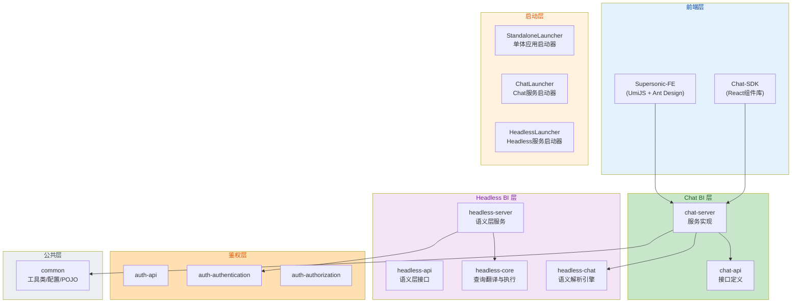
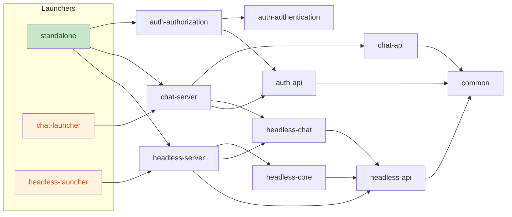
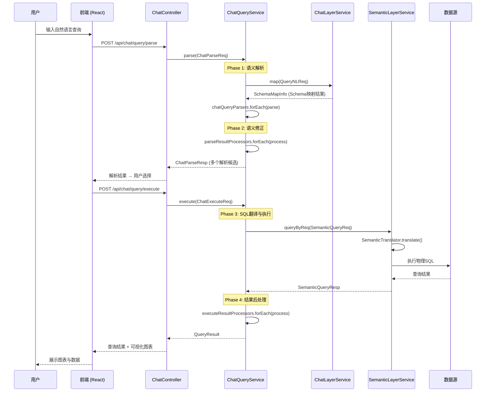
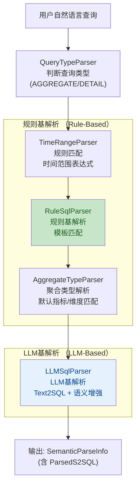
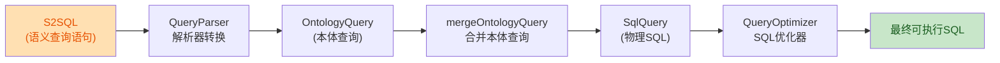
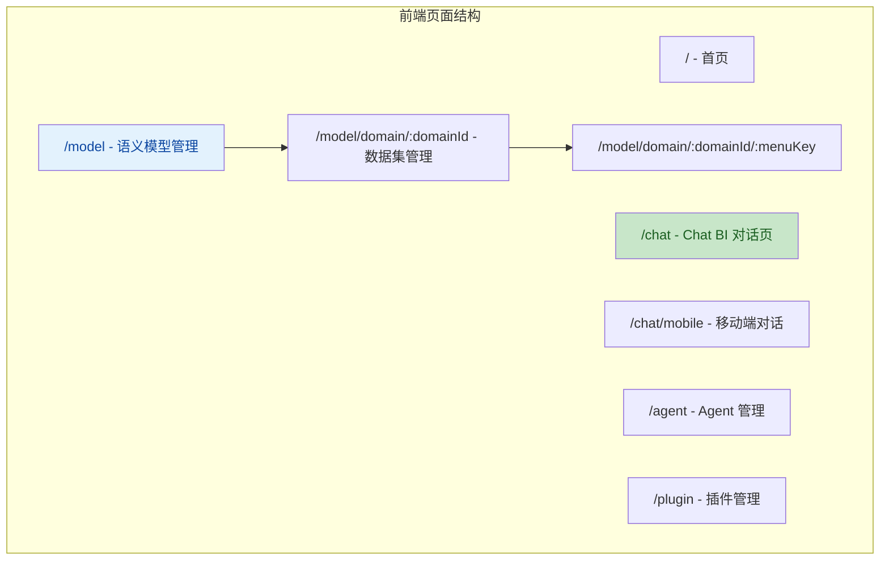
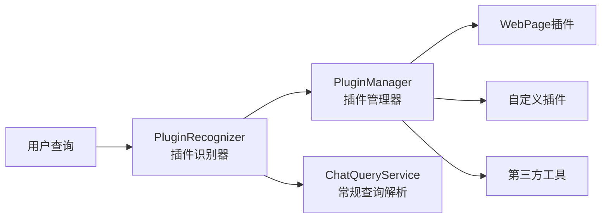
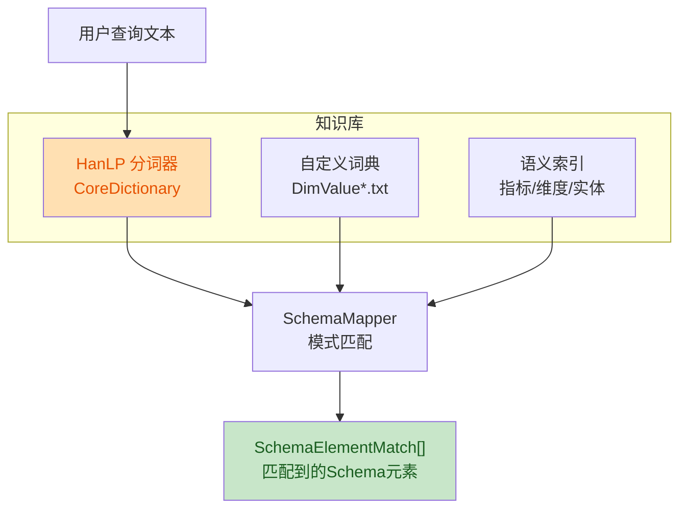

# SuperSonic 项目全面技术分析报告

> **项目名称**：SuperSonic（超音速）
> **版本**：0.9.10
> **组织**：腾讯音乐（Tencent Music）
> **定位**：融合 Chat BI（LLM 驱动）与 Headless BI（语义层驱动）的下一代 AI+BI 平台

---

## 目录

- [1. 项目整体架构概览](#1-项目整体架构概览)
- [2. 模块划分与目录结构](#2-模块划分与目录结构)
- [3. 核心代码逻辑流程](#3-核心代码逻辑流程)
- [4. 组件/模块间交互机制](#4-组件模块间交互机制)
- [5. 技术栈选型分析](#5-技术栈选型分析)
- [6. 代码规范与质量评估](#6-代码规范与质量评估)
- [7. 架构优势总结](#7-架构优势总结)
- [8. 潜在改进建议](#8-潜在改进建议)

---

## 1. 项目整体架构概览

### 1.1 架构理念

SuperSonic 将两种 BI 范式融合为统一平台：

```
                     ┌──────────────────────────────────┐
                     │         SuperSonic Platform       │
                     │                                   │
   ┌──────────┐      │  ┌─────────────┐  ┌───────────┐ │
   │ Business │──────▶  │  Chat BI     │  │ Headless  │ │      ┌──────────┐
   │  Users   │  NL    │  (LLM驱动)   │  │ BI (语义层)│ │─────▶│  Data    │
   │          │  Query │  │  Text2SQL   │  │ 统一语义模型│ │ SQL  │  Sources │
   └──────────┘      │  └─────────────┘  └───────────┘ │      └──────────┘
                     │         │              │          │
                     │         └──────┬───────┘          │
                     │                ▼                  │
                     │     ┌──────────────────┐          │
                     │     │  Semantic Layer  │          │
                     │     │  (Parse→Correct→ │          │
                     │     │  Translate→Exec) │          │
                     │     └──────────────────┘          │
                     └──────────────────────────────────┘
```

### 1.2 整体分层架构



---

## 2. 模块划分与目录结构

### 2.1 Maven 模块全景

```
supersonic (root, version 0.9.10)
├── common/                         # 公共基础模块
│   └── src/main/java/com/tencent/supersonic/common/
│       ├── calcite/                # SQL 解析工具（基于 Apache Calcite）
│       ├── config/                 # 系统配置（ChatModel/SystemConfig）
│       ├── pojo/                   # 通用 POJO（Filter/Criterion/DateConf等）
│       └── util/                   # 工具类（JsonUtil/HttpUtils/DateUtils等）
│
├── auth/                           # 认证鉴权模块
│   ├── api/                        # 认证 API 接口定义
│   ├── authentication/             # 认证实现（Token/User管理）
│   └── authorization/              # 权限控制实现
│
├── headless/                       # Headless BI 语义层模块（核心）
│   ├── api/                        # 语义层接口（SemanticSchema/SemanticParseInfo）
│   ├── chat/                       # 语义解析引擎
│   │   └── src/main/java/.../headless/chat/
│   │       ├── parser/             # 解析器链（LLM + 规则）
│   │       ├── corrector/          # 修正器链（10+ 修正器）
│   │       ├── query/              # 查询模式（LLM/规则/明细/指标）
│   │       ├── mapper/             # Schema 映射器
│   │       └── knowledge/          # 知识库（HanLP 分词 + 词典）
│   ├── core/                       # 核心翻译与执行引擎
│   │   └── src/main/java/.../headless/core/
│   │       ├── translator/         # 语义→SQL 翻译器
│   │       ├── executor/           # SQL 执行器
│   │       ├── parser/             # 查询解析器
│   │       └── optimizer/          # SQL 优化器
│   └── server/                     # 语义层服务接口实现
│
├── chat/                           # Chat BI 对话模块
│   ├── api/                        # Chat API 接口定义
│   └── server/                     # Chat 服务实现
│       └── src/main/java/.../chat/server/
│           ├── service/            # ChatQueryService 核心服务
│           ├── executor/           # 执行器（SqlExecutor）
│           ├── parser/             # Chat 查询解析器
│           ├── processor/          # 结果处理器（解析/执行后处理）
│           ├── plugin/             # 插件系统（PluginRecognizer）
│           └── agent/              # Agent 配置管理
│
├── launchers/                      # 启动器模块
│   ├── common/                     # 通用启动配置
│   ├── standalone/                 # 单体应用启动器（StandaloneLauncher）
│   ├── chat/                       # Chat 独立启动器
│   └── headless/                   # Headless 独立启动器
│
├── webapp/                         # 前端工程
│   └── packages/
│       ├── supersonic-fe/          # 管理后台（UmiJS + Ant Design）
│       └── chat-sdk/               # Chat SDK 组件库（React）
│
├── assembly/                       # 构建打包脚本
├── docker/                         # Docker 部署配置
├── benchmark/                      # 基准测试工具
└── evaluation/                     # Text2SQL 评估工具
```

### 2.2 模块依赖关系



**依赖原则**：上层依赖下层，接口层不依赖实现层，`common` 模块作为最底层被所有模块依赖。

---

## 3. 核心代码逻辑流程

### 3.1 Chat BI 端到端流程

SuperSonic 的 Chat BI 核心流程为：**用户自然语言查询 → 语义解析 → 语义修正 → 语义翻译 → SQL 执行 → 结果返回**



### 3.2 语义解析引擎（Parser Chain）

解析器采用**责任链模式**，按顺序执行多个解析器：



**关键代码示例**（来自 `ChatQueryServiceImpl.parse()`）：

```java
// 关键代码片段：ChatQueryServiceImpl.parse() 方法
public ChatParseResp parse(ChatParseReq chatParseReq) {
    ParseContext parseContext = buildParseContext(chatParseReq, new ChatParseResp(queryId));
    
    // 责任链：依次执行所有解析器
    chatQueryParsers.forEach(p -> p.parse(parseContext));
    
    // 后处理器链：修正、优化解析结果
    for (ParseResultProcessor processor : parseResultProcessors) {
        if (processor.accept(parseContext)) {
            processor.process(parseContext);
        }
    }
    return parseContext.getResponse();
}
```

### 3.3 语义修正器（Corrector Chain）

解析完成后，通过 **10+ 个修正器** 对 S2SQL 进行逐级修正：

| 修正器 | 功能 | 关键代码路径 |
|---|---|---|
| `SchemaCorrector` | Schema 信息补全 | `headless/chat/corrector/SchemaCorrector.java` |
| `GrammarCorrector` | 语法错误修正 | `headless/chat/corrector/GrammarCorrector.java` |
| `SelectCorrector` | SELECT 子句修正 | `headless/chat/corrector/SelectCorrector.java` |
| `WhereCorrector` | WHERE 条件修正 | `headless/chat/corrector/WhereCorrector.java` |
| `GroupByCorrector` | GROUP BY 修正 | `headless/chat/corrector/GroupByCorrector.java` |
| `HavingCorrector` | HAVING 子句修正 | `headless/chat/corrector/HavingCorrector.java` |
| `AggCorrector` | 聚合函数修正 | `headless/chat/corrector/AggCorrector.java` |
| `TimeCorrector` | 时间表达式修正 | `headless/chat/corrector/TimeCorrector.java` |
| `LLMSqlCorrector` | LLM辅助修正 | `headless/chat/corrector/LLMSqlCorrector.java` |
| `RuleSqlCorrector` | 规则基修正 | `headless/chat/corrector/RuleSqlCorrector.java` |

**设计模式**：每个修正器继承 `BaseSemanticCorrector`，实现 `doCorrect()` 方法，通过 Java SPI 机制注册，形成**可插拔的修正器链**。

### 3.4 语义翻译器（SemanticTranslator）

将 S2SQL（语义查询语言）翻译为物理 SQL：



**关键代码**（来自 `DefaultSemanticTranslator.translate()`）：

```java
public void translate(QueryStatement queryStatement) throws Exception {
    // 1. QueryParser 将 S2SQL 解析为 OntologyQuery
    for (QueryParser parser : ComponentFactory.getQueryParsers()) {
        if (parser.accept(queryStatement)) {
            parser.parse(queryStatement);
        }
    }
    // 2. 合并本体查询为物理 SQL
    mergeOntologyQuery(queryStatement);
    // 3. QueryOptimizer 优化 SQL
    for (QueryOptimizer optimizer : ComponentFactory.getQueryOptimizers()) {
        if (optimizer.accept(queryStatement)) {
            optimizer.rewrite(queryStatement);
        }
    }
}
```

### 3.5 查询模式分类

系统支持多种查询模式，通过 `SemanticQuery` 接口的多态实现：

```
SemanticQuery (interface)
├── BaseSemanticQuery (abstract)
│   ├── RuleSemanticQuery (abstract) ─── 规则基查询
│   │   ├── MetricSemanticQuery ─── 指标查询（SUM/AVG/COUNT等）
│   │   │   ├── MetricGroupByQuery
│   │   │   └── MetricFilterQuery
│   │   └── DetailSemanticQuery ─── 明细查询
│   │       └── DetailListQuery
│   └── LLMSemanticQuery (abstract) ─── LLM基查询
│       └── LLMSqlQuery ─── LLM_S2SQL 模式
```

### 3.6 前端路由与页面结构



---

## 4. 组件/模块间交互机制

### 4.1 接口设计模式

```
┌─────────────────────────────────────────────────────────┐
│                    接口设计原则                           │
│                                                         │
│  API 层（*-api 模块）                                    │
│  ├── 定义接口契约（POJO、Request/Response、Service接口） │
│  │                                                       │
│  Server 层（*-server 模块）                               │
│  ├── 实现接口                                            │
│  ├── 通过 Spring @Service 注入                           │
│  │                                                       │
│  跨模块依赖：上层通过 API 接口依赖，不直接依赖实现        │
└─────────────────────────────────────────────────────────┘
```

### 4.2 核心接口定义

| 接口 | 所属模块 | 功能 |
|---|---|---|
| `SemanticParser` | `headless-chat` | 语义解析器 SPI |
| `SemanticCorrector` | `headless-chat` | 语义修正器 SPI |
| `SemanticQuery` | `headless-chat` | 查询模式 SPI |
| `SemanticTranslator` | `headless-core` | 语义翻译器 |
| `SemanticLayerService` | `headless-server` | 语义层服务接口 |
| `ChatQueryService` | `chat-server` | 对话查询服务接口 |
| `ChatQueryExecutor` | `chat-server` | 查询执行器 SPI |
| `ChatQueryParser` | `chat-server` | Chat 查询解析器 SPI |

### 4.3 插件系统（Plugin System）

Chat 模块通过 `PluginRecognizer` 实现**可插拔的工具调用**：



**关键代码**（来自 `PluginRecognizer`）：

```java
public abstract class PluginRecognizer {
    // 判断是否满足插件前置条件
    public abstract boolean checkPreCondition(ParseContext parseContext);
    
    // 召回最匹配的插件
    public abstract PluginRecallResult recallPlugin(ParseContext parseContext);
    
    // 构建插件查询
    public void buildQuery(ParseContext parseContext, ...) {
        // 使用召回结果构建 SemanticParseInfo
    }
}
```

### 4.4 知识库（Knowledge Base）

知识库使用 **HanLP 分词器** + **自定义词典** 实现 Schema 元素的语义匹配：



---

## 5. 技术栈选型分析

### 5.1 后端技术栈

| 技术 | 选型 | 版本 | 合理性分析 |
|---|---|---|---|
| 语言 | Java | 21 | ✅ LTS 版本，虚拟线程支持，当前最优选择 |
| 框架 | Spring Boot | 3.2.4 | ✅ 主流程框架，生态成熟 |
| ORM | MyBatis-Plus | 3.5.7 | ✅ 灵活 SQL 控制，适合复杂查询场景 |
| SQL 解析 | Apache Calcite | 1.37.0 | ✅ 工业级 SQL 解析引擎，支持多方言 |
| SQL 解析 | JSQLParser | 4.7 | ✅ 轻量级 SQL 解析，互补 Calcite |
| LLM | LangChain4j | 0.35.0 | ✅ Java 生态 LLM 集成首选 |
| 分词 | HanLP | portable-1.8.3 | ✅ 中文分词最佳选择 |
| 数据库 | H2/MySQL/PG | 多数据源 | ✅ 支持多种部署模式 |
| 缓存 | Redis | - | ✅ 分布式缓存标准选型 |
| OLAP | ClickHouse/DuckDB | - | ✅ 分析型查询加速 |
| 文档 | Knife4j | 4.5.0 | ✅ 国产 API 文档工具 |

### 5.2 前端技术栈

| 技术 | 选型 | 版本 | 合理性分析 |
|---|---|---|---|
| 框架 | React | >=16.8 | ✅ 主流前端框架，生态丰富 |
| 脚手架 | UmiJS (max) | - | ✅ 阿里系企业级 React 框架 |
| 组件库 | Ant Design | 5.17 | ✅ 企业级 UI 组件库 |
| 图表 | ECharts | 5.4 | ✅ 可视化图表标杆 |
| 构建 | Rollup (SDK) | - | ✅ SDK 打包最佳实践 |
| 语言 | TypeScript | - | ✅ 类型安全 |
| Markdown | react-markdown | 9.0 | ✅ 渲染 AI 回复内容 |

### 5.3 技术选型亮点

1. **LangChain4j**：Java 生态对 LLM 的集成方案，支持 OpenAI / Azure / 智谱 / 千帆 / Ollama / LocalAI 等多种模型提供商
2. **Apache Calcite + JSQLParser 双引擎**：Calcite 负责 SQL 方言翻译与跨引擎适配，JSQLParser 负责轻量级解析与改写
3. **HanLP**：中文自然语言分词，结合自定义词典实现 Schema 元素的精确匹配
4. **SPI 机制**：解析器、修正器、执行器、优化器全部通过 Java SPI 注册，实现高度可扩展

---

## 6. 代码规范与质量评估

### 6.1 代码组织

| 维度 | 评估 | 说明 |
|---|---|---|
| 模块划分 | ⭐⭐⭐⭐⭐ | 清晰的 API/Server 分层，模块职责明确 |
| 接口设计 | ⭐⭐⭐⭐⭐ | 核心组件均通过接口定义，扩展性强 |
| 设计模式 | ⭐⭐⭐⭐⭐ | 合理运用策略模式、责任链模式、模板方法模式 |
| 命名规范 | ⭐⭐⭐⭐ | 遵循 Java 命名约定，部分中文注释混用 |
| 异常处理 | ⭐⭐⭐ | 部分使用 @SneakyThrows 简化，日志记录完善 |
| 代码注释 | ⭐⭐⭐ | 核心接口有清晰 Javadoc，部分实现类注释不足 |

### 6.2 设计模式应用

| 模式 | 应用场景 | 示例 |
|---|---|---|
| 策略模式 | 查询模式切换 | `SemanticQuery` 接口的多种实现 |
| 责任链模式 | 解析器链/修正器链/优化器链 | `SemanticParser` / `SemanticCorrector` / `QueryOptimizer` |
| 模板方法模式 | 修正器基类 | `BaseSemanticCorrector.correct()` + `doCorrect()` |
| 工厂模式 | 组件工厂 | `ComponentFactory` 通过 SPI 加载实现 |
| 观察者模式 | 结果处理器 | `ParseResultProcessor` / `ExecuteResultProcessor` |
| 外观模式 | 语义层服务 | `SemanticLayerService` 封装底层复杂调用 |

### 6.3 测试覆盖

| 模块 | 测试类型 | 评估 |
|---|---|---|
| `common` | 单元测试 | 有 `DateUtilsTest` 等基础测试 |
| `launchers/standalone` | 集成测试 | 有 `BaseTest`、`MetricTest`、`DetailTest` 等 |
| `headless` | 语义层测试 | 有 `TranslatorTest`、`QueryBySqlTest` 等 |
| 前端 | 组件测试 | 配置了 Jest 测试框架 |

---

## 7. 架构优势总结

### 7.1 核心优势

1. **双引擎融合架构**
   - Chat BI（LLM）+ Headless BI（语义层）互补，Text2SQL 生成得到语义模型增强
   - 规则基（Rule-Based）与 LLM 基（LLM-Based）解析器协同工作，兼顾准确性与灵活性

2. **高度可扩展的组件化设计**
   - 解析器/修正器/翻译器/优化器全部通过 SPI 注册
   - 支持自定义 LLM 提供商（OpenAI/Azure/智谱/千帆/Ollama/LocalAI）
   - 插件系统支持第三方工具集成

3. **多层级 SQL 生成管线**
   ```
   NL → S2SQL → corrected S2SQL → OntologySQL → PhysicalSQL → OptimizedSQL
   ```
   逐级转换，每层可独立调试与优化

4. **多数据源/多引擎适配**
   - 支持 H2/MySQL/PostgreSQL/ClickHouse/DuckDB/Presto/Trino 等多种引擎
   - 通过 Apache Calcite 实现 SQL 方言自动翻译

5. **前端架构分层清晰**
   - `supersonic-fe`（管理后台） + `chat-sdk`（可嵌入 SDK）分离
   - Chat SDK 支持 ESM/UMD 多格式输出，可被第三方系统集成

### 7.2 工程化优势

- **Maven 多模块**：依赖管理清晰，版本统一管理
- **Docker 支持**：提供完整 Docker 部署方案
- **CI/CD**：GitHub Actions 多平台构建（Linux/Mac/Windows/CentOS）
- **评估体系**：内置 Text2SQL 评估工具（benchmark + evaluation）

---

## 8. 潜在改进建议

### 8.1 架构层面

| 序号 | 问题 | 建议 |
|---|---|---|
| 1 | 整体架构耦合度较高 | 引入消息队列（如 RabbitMQ）解耦 Chat 与 Headless 的同步调用，实现异步化 |
| 2 | 缺少微服务拆分 | 若需大规模部署，建议将 Chat/Headless/Auth 拆分为独立微服务，通过 Feign/gRPC 通信 |
| 3 | 缺少 API 网关 | 引入 Spring Cloud Gateway 或 Kong 统一鉴权、限流、日志 |
| 4 | 配置管理分散 | 引入 Nacos/Apollo 统一配置中心管理 |

### 8.2 代码层面

| 序号 | 问题 | 建议 |
|---|---|---|
| 1 | `@SneakyThrows` 过度使用 | 在关键业务路径上使用显式异常处理，避免异常被吞没 |
| 2 | 部分类职责过重 | `ChatQueryServiceImpl` 超过 300 行，建议拆分职责 |
| 3 | 硬编码 | 部分魔法值（如 `"LLM_S2SQL"`、`"PLAIN_TEXT"`）应统一为枚举常量 |
| 4 | 前端状态管理 | 建议引入 Zustand/Pinia 风格的轻量状态管理 |

### 8.3 测试层面

| 序号 | 问题 | 建议 |
|---|---|---|
| 1 | 测试覆盖率不足 | 核心解析器/修正器/翻译器应达到 80%+ 单元测试覆盖率 |
| 2 | 缺少 E2E 测试 | 增加端到端测试覆盖关键用户路径 |
| 3 | 缺少性能测试 | 对 Text2SQL 链路增加 JMH 基准测试 |

### 8.4 可观测性

| 序号 | 问题 | 建议 |
|---|---|---|
| 1 | 监控不足 | 集成 Micrometer + Prometheus + Grafana 实现全链路监控 |
| 2 | 链路追踪缺失 | 集成 SkyWalking 或 Jaeger 实现分布式链路追踪 |
| 3 | 日志规范 | 统一日志格式，增加 TraceId 关联（项目中已有 `TraceIdUtil`，需推广使用） |

---

## 附录：关键文件索引

| 文件 | 说明 |
|---|---|
| `pom.xml` | 根 POM，Spring Boot 3.2.4 + Java 21 |
| `common/src/.../calcite/Configuration.java` | Calcite SQL 解析配置 |
| `headless/chat/.../parser/SemanticParser.java` | 语义解析器 SPI 接口 |
| `headless/chat/.../corrector/BaseSemanticCorrector.java` | 修正器基类 |
| `headless/chat/.../query/llm/s2sql/LLMSqlQuery.java` | LLM S2SQL 查询模式 |
| `headless/core/.../translator/DefaultSemanticTranslator.java` | 核心翻译器实现 |
| `chat/server/.../service/impl/ChatQueryServiceImpl.java` | Chat 查询核心服务 |
| `chat/server/.../executor/SqlExecutor.java` | SQL 执行器 |
| `launchers/standalone/.../StandaloneLauncher.java` | 单体应用启动入口 |
| `webapp/packages/chat-sdk/src/Chat/index.tsx` | Chat SDK 入口组件 |
| `webapp/packages/supersonic-fe/config/routes.ts` | 前端路由配置 |