# 基于 pnpm + Monorepo 的项目架构设计与实践

> **文档版本**：v1.0 | **生成日期**：2026-08-08 | **适用场景**：中大型前端项目工程化架构设计
>
> **文档定位**：本文档系统阐述基于 **pnpm Workspace + Monorepo** 的前端项目架构方案，覆盖目录结构设计、工作区配置、依赖管理、共享代码实现、构建打包、开发环境、版本管理等全链路工程实践。所有方案均配套架构图、配置文件示例和可操作步骤，确保工程团队可直接落地实施。

---

## 目录

- [基于 pnpm + Monorepo 的项目架构设计与实践](#基于-pnpm--monorepo-的项目架构设计与实践)
  - [目录](#目录)
  - [一、架构概述与设计目标](#一架构概述与设计目标)
    - [1.1 为什么选择 pnpm + Monorepo](#11-为什么选择-pnpm--monorepo)
    - [1.2 架构设计目标](#12-架构设计目标)
    - [1.3 整体架构全景图](#13-整体架构全景图)
  - [二、项目目录结构设计](#二项目目录结构设计)
    - [2.1 推荐目录结构](#21-推荐目录结构)
    - [2.2 目录职责说明](#22-目录职责说明)
    - [2.3 分层设计原则](#23-分层设计原则)
  - [三、工作区配置方式](#三工作区配置方式)
    - [3.1 pnpm-workspace.yaml 配置](#31-pnpm-workspaceyaml-配置)
    - [3.2 根 package.json 配置](#32-根-packagejson-配置)
    - [3.3 .npmrc 配置](#33-npmrc-配置)
    - [3.4 TypeScript 配置](#34-typescript-配置)
  - [四、包间依赖关系管理](#四包间依赖关系管理)
    - [4.1 workspace 协议](#41-workspace-协议)
    - [4.2 依赖关系设计](#42-依赖关系设计)
    - [4.3 依赖安装与链接机制](#43-依赖安装与链接机制)
    - [4.4 第三方依赖版本统一](#44-第三方依赖版本统一)
  - [五、共享代码的实现方法](#五共享代码的实现方法)
    - [5.1 共享工具库](#51-共享工具库)
    - [5.2 共享 UI 组件库](#52-共享-ui-组件库)
    - [5.3 共享配置与常量](#53-共享配置与常量)
    - [5.4 共享类型定义](#54-共享类型定义)
  - [六、构建与打包流程](#六构建与打包流程)
    - [6.1 构建工具选型](#61-构建工具选型)
    - [6.2 Turborepo 构建编排](#62-turborepo-构建编排)
    - [6.3 包构建配置](#63-包构建配置)
    - [6.4 构建产物与产物分析](#64-构建产物与产物分析)
  - [七、开发环境配置](#七开发环境配置)
    - [7.1 统一开发工具链](#71-统一开发工具链)
    - [7.2 开发服务器与代理](#72-开发服务器与代理)
    - [7.3 热更新与跨包联动](#73-热更新与跨包联动)
    - [7.4 代码规范与 Git Hooks](#74-代码规范与-git-hooks)
  - [八、版本管理策略](#八版本管理策略)
    - [8.1 语义化版本规范](#81-语义化版本规范)
    - [8.2 Changesets 版本管理](#82-changesets-版本管理)
    - [8.3 发布流程](#83-发布流程)
    - [8.4 变更日志管理](#84-变更日志管理)
  - [九、pnpm 在 Monorepo 中的核心优势](#九pnpm-在-monorepo-中的核心优势)
    - [9.1 磁盘与安装效率](#91-磁盘与安装效率)
    - [9.2 严格依赖隔离](#92-严格依赖隔离)
    - [9.3 灵活的过滤机制](#93-灵活的过滤机制)
    - [9.4 与其他方案对比](#94-与其他方案对比)
  - [十、实际应用场景](#十实际应用场景)
    - [10.1 场景一：多端应用共享核心逻辑](#101-场景一多端应用共享核心逻辑)
    - [10.2 场景二：企业级组件库与多应用](#102-场景二企业级组件库与多应用)
    - [10.3 场景三：微前端架构基座](#103-场景三微前端架构基座)
  - [十一、CI/CD 与部署](#十一cicd-与部署)
    - [11.1 CI 流水线设计](#111-ci-流水线设计)
    - [11.2 Docker 多阶段构建](#112-docker-多阶段构建)
    - [11.3 增量构建与缓存策略](#113-增量构建与缓存策略)
  - [十二、总结与最佳实践](#十二总结与最佳实践)
    - [最佳实践清单](#最佳实践清单)
    - [架构知识图谱](#架构知识图谱)

---

## 一、架构概述与设计目标

### 1.1 为什么选择 pnpm + Monorepo

在中大型前端项目中，团队通常面临以下工程化痛点：

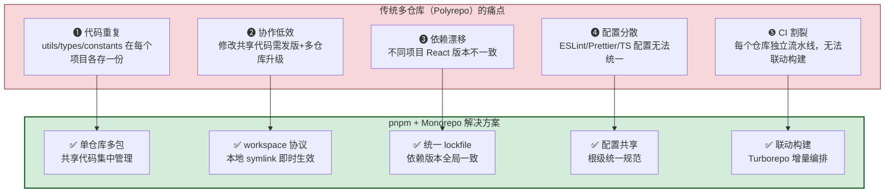

### 1.2 架构设计目标

| 目标维度 | 量化指标 | 实现手段 |
|:---------|:---------|:---------|
| **代码复用率** | 共享代码复用率 ≥ 80% | 抽取 utils/ui/types/config 公共包 |
| **依赖一致性** | 第三方依赖版本偏差 = 0 | 统一 lockfile + catalog 机制 |
| **构建效率** | 增量构建比全量快 ≥ 60% | Turborepo 任务编排 + 缓存 |
| **安装速度** | 冷安装 < 30s / 热安装 < 10s | pnpm Store 硬链接共享 |
| **磁盘占用** | 比传统方案节省 ≥ 70% | pnpm 内容寻址存储 |
| **依赖安全性** | 幻影依赖 = 0 | pnpm 严格 node_modules 结构 |

### 1.3 整体架构全景图

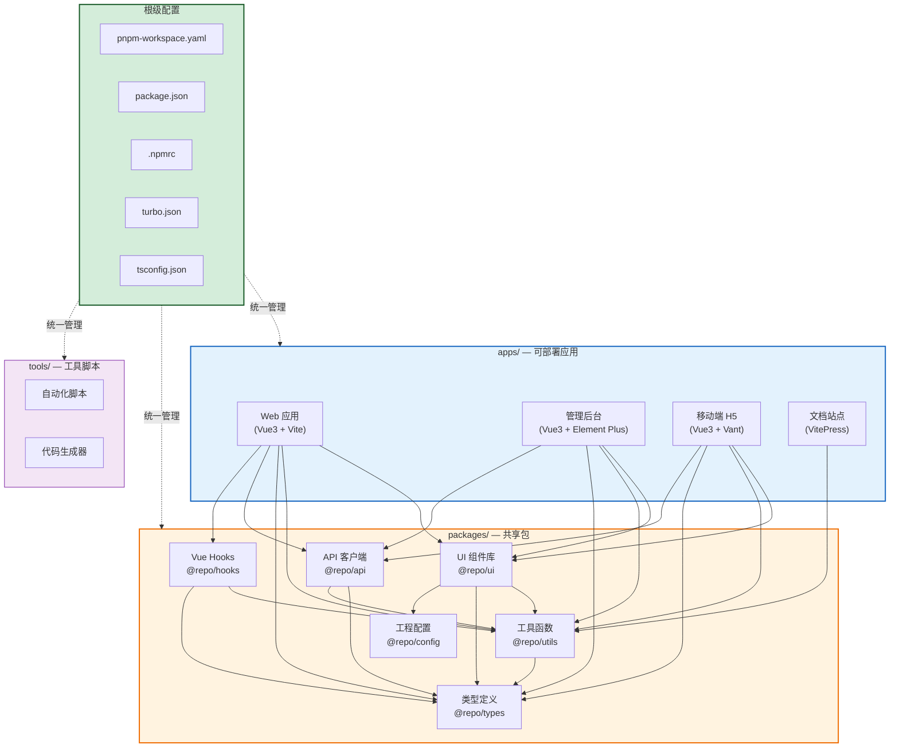

---

## 二、项目目录结构设计

### 2.1 推荐目录结构

```
my-monorepo/
│
├── pnpm-workspace.yaml          # pnpm 工作区配置（核心）
├── package.json                 # 根 package.json（全局脚本与共享 devDeps）
├── pnpm-lock.yaml               # 统一 lockfile（全局锁定依赖版本）
├── .npmrc                       # pnpm 配置
├── turbo.json                   # Turborepo 构建编排配置
├── tsconfig.base.json           # TypeScript 基础配置（各包继承）
├── .changeset/                  # Changesets 版本管理配置
│   └── config.json
├── .husky/                      # Git Hooks
│   ├── pre-commit
│   └── commit-msg
├── .vscode/                     # 编辑器统一配置
│   ├── settings.json
│   └── extensions.json
│
├── apps/                        # ===== 可部署应用 =====
│   ├── web/                     # 用户端 Web 应用
│   │   ├── package.json
│   │   ├── vite.config.ts
│   │   ├── tsconfig.json
│   │   ├── index.html
│   │   └── src/
│   │       ├── main.ts
│   │       ├── App.vue
│   │       ├── router/
│   │       ├── stores/
│   │       ├── views/
│   │       └── components/
│   │
│   ├── admin/                   # 管理后台应用
│   │   ├── package.json
│   │   ├── vite.config.ts
│   │   └── src/
│   │
│   ├── mobile/                  # 移动端 H5 应用
│   │   ├── package.json
│   │   ├── vite.config.ts
│   │   └── src/
│   │
│   └── docs/                    # 文档站点
│       ├── package.json
│       └── .vitepress/
│
├── packages/                    # ===== 共享包 =====
│   ├── ui/                      # UI 组件库
│   │   ├── package.json
│   │   ├── tsconfig.json
│   │   ├── tsup.config.ts       # 构建配置
│   │   └── src/
│   │       ├── index.ts
│   │       ├── components/
│   │       │   ├── Button/
│   │       │   │   ├── Button.vue
│   │       │   │   ├── index.ts
│   │       │   │   └── style.css
│   │       │   └── Input/
│   │       └── styles/
│   │
│   ├── utils/                   # 工具函数库
│   │   ├── package.json
│   │   └── src/
│   │       ├── index.ts
│   │       ├── format/          # 格式化工具
│   │       ├── validate/        # 校验工具
│   │       └── request/         # 请求封装
│   │
│   ├── types/                   # 共享类型定义
│   │   ├── package.json
│   │   └── src/
│   │       ├── index.ts
│   │       ├── api.d.ts         # API 响应类型
│   │       ├── business.d.ts    # 业务领域类型
│   │       └── common.d.ts      # 通用类型
│   │
│   ├── api/                     # API 客户端
│   │   ├── package.json
│   │   └── src/
│   │       ├── index.ts
│   │       ├── modules/         # 按业务模块划分
│   │       │   ├── user.ts
│   │       │   ├── order.ts
│   │       │   └── product.ts
│   │       └── interceptors.ts  # 请求/响应拦截器
│   │
│   ├── hooks/                   # Vue Composables
│   │   ├── package.json
│   │   └── src/
│   │       ├── index.ts
│   │       ├── useAuth.ts
│   │       ├── usePagination.ts
│   │       └── useRequest.ts
│   │
│   └── config/                  # 共享工程配置
│       ├── package.json
│       ├── eslint-config.js     # ESLint 共享配置
│       ├── tsconfig.json        # TS 共享配置
│       └── vite-config.ts       # Vite 共享配置
│
├── tools/                       # ===== 工具脚本 =====
│   ├── scripts/                 # 自动化脚本
│   │   ├── clean.ts             # 清理 dist/node_modules
│   │   └── generate-icon.ts     # 图标生成
│   └── templates/               # 代码模板
│       └── component/
│
└── .github/                     # CI/CD 配置
    └── workflows/
        └── ci.yml
```

### 2.2 目录职责说明

| 目录 | 定位 | 可发布 | 依赖方向 |
|:-----|:-----|:------:|:---------|
| `apps/` | 可独立部署的应用 | ❌ private | 依赖 `packages/` |
| `packages/` | 可复用的共享包 | ✅ 可发布到 npm | 依赖其他 `packages/` |
| `tools/` | 开发辅助脚本与模板 | ❌ private | 依赖 `packages/`（可选） |

### 2.3 分层设计原则

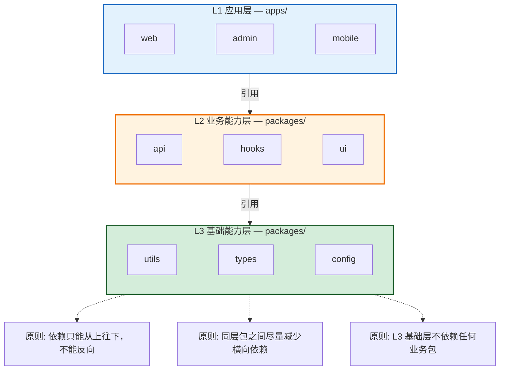

---

## 三、工作区配置方式

### 3.1 pnpm-workspace.yaml 配置

```yaml
# pnpm-workspace.yaml
# 定义 Monorepo 中所有包的路径

packages:
  # 应用
  - 'apps/*'
  # 共享包
  - 'packages/*'
  # 工具脚本
  - 'tools/*'
  # 排除目录（不作为工作区包）
  - '!**/node_modules/**'
  - '!**/dist/**'
  - '!**/.output/**'
```

### 3.2 根 package.json 配置

```json
{
  "name": "my-monorepo",
  "version": "1.0.0",
  "private": true,
  "packageManager": "pnpm@9.15.0",
  "engines": {
    "node": ">=20.0.0",
    "pnpm": ">=9.0.0"
  },
  "scripts": {
    "dev": "turbo run dev",
    "dev:web": "turbo run dev --filter=web",
    "build": "turbo run build",
    "test": "turbo run test",
    "lint": "turbo run lint",
    "format": "prettier --write \"**/*.{ts,tsx,vue,js,json,md}\"",
    "clean": "turbo run clean && rm -rf node_modules",
    "changeset": "changeset",
    "version-packages": "changeset version",
    "release": "turbo run build && changeset publish"
  },
  "devDependencies": {
    "@repo/config": "workspace:*",
    "turbo": "^2.3.0",
    "typescript": "^5.6.0",
    "prettier": "^3.4.0",
    "eslint": "^9.17.0",
    "@changesets/cli": "^2.27.0",
    "husky": "^9.1.0",
    "lint-staged": "^15.2.0"
  },
  "lint-staged": {
    "*.{ts,tsx,vue}": ["eslint --fix", "prettier --write"],
    "*.{json,md}": ["prettier --write"]
  }
}
```

**关键字段说明**：

| 字段 | 作用 | 说明 |
|:-----|:-----|:-----|
| `"private": true` | 禁止根包被发布 | 根包仅作管理用途，不发布到 npm |
| `"packageManager"` | 锁定 pnpm 版本 | 配合 Corepack 自动管理版本 |
| `"engines"` | 锁定 Node.js/pnpm 最低版本 | 保证团队环境一致 |
| `"devDependencies"` | 全局共享开发依赖 | 避免每个子包重复安装 |

### 3.3 .npmrc 配置

```ini
# .npmrc

# === 依赖提升策略 ===
# isolated: 严格隔离（默认，推荐），仅声明依赖可见
node-linker=isolated

# 自动安装 peer 依赖
auto-install-peers=true

# === Monorepo 配置 ===
# 共享 lockfile（推荐，所有包共用一个 pnpm-lock.yaml）
shared-workspace-lockfile=true

# 依赖提升白名单（解决兼容性问题）
public-hoist-pattern[]=*eslint*
public-hoist-pattern[]=*prettier*
public-hoist-pattern[]=*types*

# === Registry 配置 ===
registry=https://registry.npmmirror.com/

# 私有包 registry（按 scope 区分）
@mycompany:registry=https://npm.mycompany.com/
//npm.mycompany.com/:_authToken=${NPM_TOKEN}

# === 安全配置 ===
# 启用 pre/post 脚本
enable-pre-post-scripts=true
```

### 3.4 TypeScript 配置

采用**基础配置 + 继承**策略，避免每个包重复配置：

```json
// tsconfig.base.json（根目录，基础配置）
{
  "compilerOptions": {
    "target": "ES2022",
    "module": "ESNext",
    "moduleResolution": "bundler",
    "lib": ["ES2022", "DOM", "DOM.Iterable"],
    "strict": true,
    "esModuleInterop": true,
    "skipLibCheck": true,
    "forceConsistentCasingInFileNames": true,
    "resolveJsonModule": true,
    "isolatedModules": true,
    "declaration": true,
    "declarationMap": true,
    "sourceMap": true,
    "baseUrl": ".",
    "paths": {
      "@repo/ui": ["packages/ui/src/index.ts"],
      "@repo/utils": ["packages/utils/src/index.ts"],
      "@repo/types": ["packages/types/src/index.ts"],
      "@repo/api": ["packages/api/src/index.ts"],
      "@repo/hooks": ["packages/hooks/src/index.ts"]
    }
  }
}
```

```json
// packages/ui/tsconfig.json（子包继承基础配置）
{
  "extends": "../../tsconfig.base.json",
  "compilerOptions": {
    "outDir": "./dist",
    "rootDir": "./src"
  },
  "include": ["src/**/*"],
  "exclude": ["node_modules", "dist"]
}
```

```json
// apps/web/tsconfig.json（应用继承基础配置）
{
  "extends": "../../tsconfig.base.json",
  "compilerOptions": {
    "jsx": "preserve",
    "types": ["vite/client"]
  },
  "include": ["src/**/*", "vite.config.ts"]
}
```

---

## 四、包间依赖关系管理

### 4.1 workspace 协议

pnpm 使用 `workspace:` 协议声明 Monorepo 内部包依赖，开发时通过 symlink 链接，发布时自动替换为实际版本号。

```json
// apps/web/package.json
{
  "name": "web",
  "version": "1.0.0",
  "private": true,
  "dependencies": {
    "@repo/ui": "workspace:*",
    "@repo/utils": "workspace:*",
    "@repo/api": "workspace:*",
    "@repo/hooks": "workspace:*",
    "@repo/types": "workspace:*",
    "vue": "^3.5.0",
    "vue-router": "^4.4.0",
    "pinia": "^2.2.0"
  }
}
```

**workspace 版本协议说明**：

| 写法 | 含义 | 发布时替换为 | 适用场景 |
|:-----|:-----|:------------|:---------|
| `workspace:*` | 匹配任意版本 | `1.2.3`（实际版本） | 内部包无固定版本要求 |
| `workspace:^` | 自动使用 `^` 前缀 | `^1.2.3` | 允许 minor 更新 |
| `workspace:~` | 自动使用 `~` 前缀 | `~1.2.3` | 仅允许 patch 更新 |
| `workspace:^1.0.0` | 指定范围 | `^1.0.0` | 需要版本约束 |

### 4.2 依赖关系设计

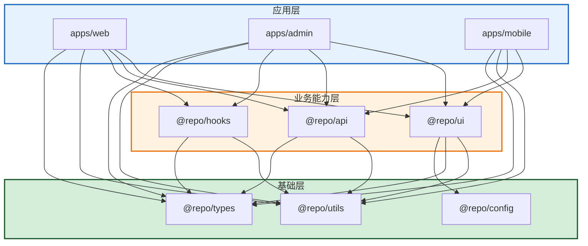

**依赖关系矩阵**：

| 包 ↓ 依赖 → | @repo/ui | @repo/api | @repo/hooks | @repo/utils | @repo/types | @repo/config |
|:------------|:--------:|:---------:|:-----------:|:-----------:|:-----------:|:------------:|
| apps/web | ✅ | ✅ | ✅ | ✅ | ✅ | — |
| apps/admin | ✅ | ✅ | ✅ | ✅ | ✅ | — |
| apps/mobile | ✅ | ✅ | — | ✅ | ✅ | — |
| @repo/ui | — | — | — | ✅ | ✅ | ✅ |
| @repo/api | — | — | — | ✅ | ✅ | — |
| @repo/hooks | — | — | — | ✅ | ✅ | — |

### 4.3 依赖安装与链接机制

```bash
# 安装所有工作区包的依赖（根目录执行）
pnpm install

# 添加子包间依赖
pnpm --filter @repo/ui add @repo/utils@workspace:*
pnpm --filter web add @repo/ui@workspace:* @repo/api@workspace:*

# 添加第三方依赖到特定子包
pnpm --filter web add axios pinia
pnpm --filter @repo/ui add vue

# 添加开发依赖到根 package.json（全局共享）
pnpm add -Dw turbo typescript prettier
```

**安装后的 node_modules 结构**：

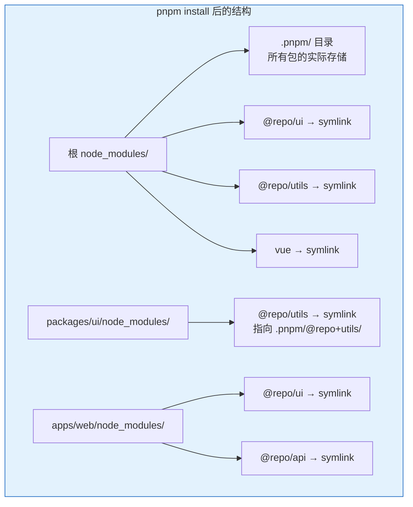

### 4.4 第三方依赖版本统一

**方案一：catalog 机制（pnpm 9.5+）**

```yaml
# pnpm-workspace.yaml
packages:
  - 'apps/*'
  - 'packages/*'

# 统一管理第三方依赖版本
catalog:
  vue: 3.5.13
  vue-router: 4.5.0
  pinia: 2.3.0
  axios: 1.7.9
  typescript: 5.6.3
```

```json
// 各子包 package.json 中引用 catalog
{
  "name": "@repo/ui",
  "dependencies": {
    "vue": "catalog:"
  }
}
```

> **catalog 优势**：所有子包的同一依赖版本统一管理在一处，升级时只需修改 `pnpm-workspace.yaml`，无需逐个包修改。

**方案二：pnpm overrides（覆盖版本）**

```json
// 根 package.json
{
  "pnpm": {
    "overrides": {
      "vue": "^3.5.0",
      "lodash": "^4.17.21"
    }
  }
}
```

---

## 五、共享代码的实现方法

### 5.1 共享工具库

```typescript
// packages/utils/src/index.ts
export * from './format';
export * from './validate';
export * from './request';

// packages/utils/src/format/index.ts
export function formatDate(date: Date | string, format = 'YYYY-MM-DD'): string {
  const d = typeof date === 'string' ? new Date(date) : date;
  const map: Record<string, string> = {
    YYYY: String(d.getFullYear()),
    MM: String(d.getMonth() + 1).padStart(2, '0'),
    DD: String(d.getDate()).padStart(2, '0'),
    HH: String(d.getHours()).padStart(2, '0'),
    mm: String(d.getMinutes()).padStart(2, '0'),
    ss: String(d.getSeconds()).padStart(2, '0'),
  };
  return format.replace(/YYYY|MM|DD|HH|mm|ss/g, (match) => map[match]);
}

export function formatCurrency(amount: number, currency = 'CNY'): string {
  const symbols: Record<string, string> = { CNY: '¥', USD: '$', EUR: '€' };
  return `${symbols[currency] || ''}${amount.toFixed(2)}`;
}

// packages/utils/src/validate/index.ts
export function isEmail(value: string): boolean {
  return /^[\w.-]+@[\w-]+\.[\w.-]+$/.test(value);
}

export function isPhone(value: string): boolean {
  return /^1[3-9]\d{9}$/.test(value);
}

// packages/utils/src/request/index.ts
import axios, { type AxiosInstance } from 'axios';

export function createRequest(config: {
  baseURL: string;
  timeout?: number;
}): AxiosInstance {
  const instance = axios.create({
    baseURL: config.baseURL,
    timeout: config.timeout ?? 15000,
  });
  return instance;
}
```

```json
// packages/utils/package.json
{
  "name": "@repo/utils",
  "version": "1.0.0",
  "main": "./dist/index.js",
  "module": "./dist/index.mjs",
  "types": "./dist/index.d.ts",
  "exports": {
    ".": {
      "types": "./dist/index.d.ts",
      "import": "./dist/index.mjs",
      "require": "./dist/index.js"
    }
  },
  "scripts": {
    "build": "tsup src/index.ts --format esm,cjs --dts",
    "dev": "tsup src/index.ts --format esm,cjs --dts --watch"
  },
  "dependencies": {
    "axios": "catalog:"
  }
}
```

### 5.2 共享 UI 组件库

```vue
<!-- packages/ui/src/components/Button/Button.vue -->
<script setup lang="ts">
import { computed } from 'vue';
import './style.css';

interface ButtonProps {
  type?: 'primary' | 'secondary' | 'danger' | 'default';
  size?: 'small' | 'medium' | 'large';
  disabled?: boolean;
  loading?: boolean;
}

const props = withDefaults(defineProps<ButtonProps>(), {
  type: 'default',
  size: 'medium',
  disabled: false,
  loading: false,
});

const classes = computed(() => [
  'repo-btn',
  `repo-btn--${props.type}`,
  `repo-btn--${props.size}`,
  { 'is-disabled': props.disabled, 'is-loading': props.loading },
]);
</script>

<template>
  <button :class="classes" :disabled="disabled || loading">
    <span v-if="loading" class="repo-btn__loading" />
    <slot />
  </button>
</template>
```

```typescript
// packages/ui/src/components/Button/index.ts
export { default as Button } from './Button.vue';
export type { ButtonProps } from './Button.vue';
```

```typescript
// packages/ui/src/index.ts
export * from './components/Button';
export * from './components/Input';
export * from './components/Table';

// 全局安装
import type { App } from 'vue';
import { Button, Input, Table } from './components';

export function install(app: App): void {
  app.component('RepoButton', Button);
  app.component('RepoInput', Input);
  app.component('RepoTable', Table);
}

export default { install };
```

### 5.3 共享配置与常量

```typescript
// packages/config/src/index.ts
export { default as eslintConfig } from './eslint';
export { default as tsConfig } from './tsconfig.json';
export { defineViteConfig } from './vite';

// packages/config/src/vite.ts
import { defineConfig, type UserConfig } from 'vite';
import vue from '@vitejs/plugin-vue';
import { resolve } from 'path';

interface DefineViteOptions {
  port?: number;
  base?: string;
  proxy?: Record<string, string>;
}

export function defineViteConfig(options: DefineViteOptions = {}): UserConfig {
  return defineConfig({
    base: options.base ?? '/',
    plugins: [vue()],
    resolve: {
      alias: {
        '@': resolve(__dirname, 'src'),
        '@repo/ui': resolve(__dirname, '../../packages/ui/src'),
        '@repo/utils': resolve(__dirname, '../../packages/utils/src'),
      },
    },
    server: {
      port: options.port ?? 3000,
      proxy: Object.entries(options.proxy ?? {}).reduce((acc, [key, target]) => {
        acc[key] = { target, changeOrigin: true };
        return acc;
      }, {} as Record<string, object>),
    },
  });
}
```

### 5.4 共享类型定义

```typescript
// packages/types/src/api.d.ts
export interface ApiResponse<T = unknown> {
  code: number;
  message: string;
  data: T;
  timestamp: number;
}

export interface PaginatedData<T> {
  list: T[];
  total: number;
  page: number;
  pageSize: number;
}

// packages/types/src/business.d.ts
export interface User {
  id: string;
  name: string;
  email: string;
  avatar?: string;
  role: UserRole;
  department: string;
  createdAt: string;
}

export type UserRole = 'admin' | 'manager' | 'employee';

export interface Order {
  id: string;
  orderNo: string;
  status: OrderStatus;
  amount: number;
  userId: string;
  items: OrderItem[];
  createdAt: string;
}

export type OrderStatus = 'pending' | 'paid' | 'shipped' | 'completed' | 'cancelled';

// packages/types/src/index.ts
export * from './api';
export * from './business';
export * from './common';
```

**在应用中使用共享类型**：

```typescript
// apps/web/src/views/UserList.vue
import type { User, ApiResponse, PaginatedData } from '@repo/types';
import { getUserList } from '@repo/api';

const users = ref<User[]>([]);

async function loadUsers() {
  const res: ApiResponse<PaginatedData<User>> = await getUserList({ page: 1 });
  users.value = res.data.list;
}
```

---

## 六、构建与打包流程

### 6.1 构建工具选型

| 工具 | 定位 | 适用场景 | 推荐度 |
|:-----|:-----|:---------|:------:|
| **Turborepo** | Monorepo 构建编排器 | 任务调度、缓存、增量构建 | ⭐⭐⭐⭐⭐ |
| **tsup** | 库打包工具 | 共享包打包（ESM/CJS/DTS） | ⭐⭐⭐⭐⭐ |
| **Vite** | 应用构建工具 | apps/ 下应用的构建 | ⭐⭐⭐⭐⭐ |
| **unbuild** | 库打包工具 | 共享包打包（替代 tsup） | ⭐⭐⭐⭐ |

### 6.2 Turborepo 构建编排

```json
// turbo.json
{
  "$schema": "https://turbo.build/schema.json",
  "globalDependencies": ["tsconfig.base.json", ".env"],
  "globalEnv": ["NODE_ENV", "API_BASE_URL"],
  "tasks": {
    "build": {
      "dependsOn": ["^build"],
      "outputs": ["dist/**", ".output/**"],
      "inputs": ["src/**", "package.json", "tsconfig.json"]
    },
    "dev": {
      "cache": false,
      "persistent": true
    },
    "lint": {
      "dependsOn": ["^build"],
      "outputs": []
    },
    "test": {
      "dependsOn": ["^build"],
      "outputs": ["coverage/**"],
      "inputs": ["src/**", "test/**", "package.json"]
    },
    "clean": {
      "cache": false
    }
  }
}
```

**关键配置说明**：

| 字段 | 作用 |
|:-----|:-----|
| `dependsOn: ["^build"]` | 先构建依赖的包（`^` 表示上游依赖） |
| `outputs` | 构建产物路径，用于缓存判断 |
| `inputs` | 输入文件，变更时触发重新构建 |
| `cache: false` | 不缓存（如 dev/clean 任务） |
| `persistent: true` | 长驻任务（如 dev server） |

**Turborepo 任务调度流程**：

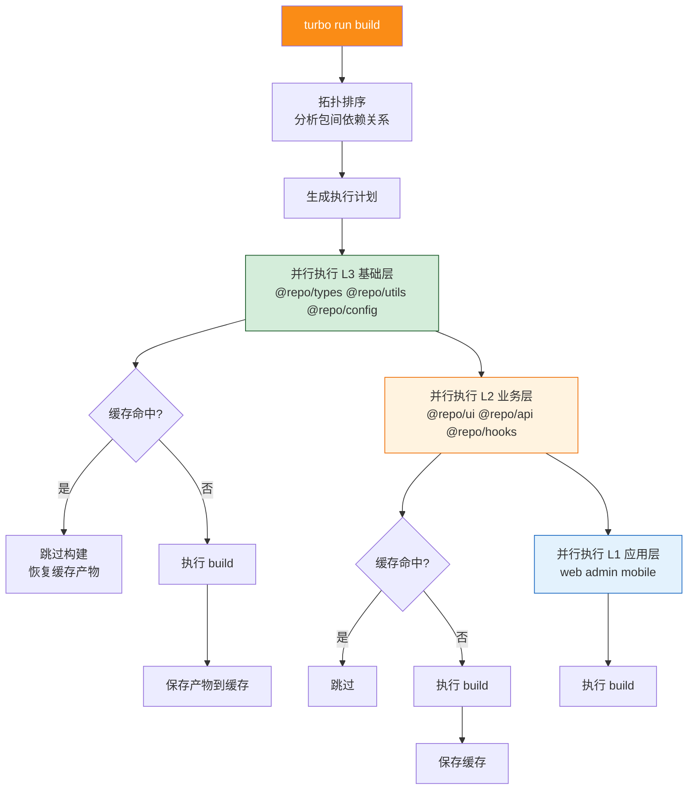

### 6.3 包构建配置

**共享包使用 tsup 构建**：

```typescript
// packages/ui/tsup.config.ts
import { defineConfig } from 'tsup';

export default defineConfig({
  entry: ['src/index.ts'],
  format: ['esm', 'cjs'],
  dts: true,
  splitting: false,
  sourcemap: true,
  clean: true,
  external: ['vue'],
  loader: {
    '.vue': 'copy',
  },
});
```

```json
// packages/ui/package.json
{
  "name": "@repo/ui",
  "version": "1.0.0",
  "main": "./dist/index.js",
  "module": "./dist/index.mjs",
  "types": "./dist/index.d.ts",
  "files": ["dist"],
  "scripts": {
    "build": "tsup",
    "dev": "tsup --watch"
  }
}
```

**应用使用 Vite 构建**：

```typescript
// apps/web/vite.config.ts
import { defineViteConfig } from '@repo/config/vite';

export default defineViteConfig({
  port: 3000,
  base: '/',
  proxy: {
    '/api': 'http://localhost:8080',
  },
});
```

### 6.4 构建产物与产物分析

```bash
# 全量构建（按依赖拓扑排序）
pnpm build

# 增量构建（仅构建变更的包及其依赖方）
pnpm build --filter=...@repo/ui

# 构建并分析产物
pnpm --filter web build --mode analyze

# 查看构建缓存
turbo run build --dry-run=json  # 输出执行计划（JSON）
```

---

## 七、开发环境配置

### 7.1 统一开发工具链

```json
// .vscode/settings.json
{
  "npm.packageManager": "pnpm",
  "editor.formatOnSave": true,
  "editor.defaultFormatter": "esbenp.prettier-vscode",
  "eslint.packageManager": "pnpm",
  "typescript.tsdk": "node_modules/typescript/lib",
  "typescript.enablePromptUseWorkspaceTsdk": true
}
```

```json
// .vscode/extensions.json
{
  "recommendations": [
    "Vue.volar",
    "dbaeumer.vscode-eslint",
    "esbenp.prettier-vscode",
    "editorconfig.editorconfig"
  ]
}
```

### 7.2 开发服务器与代理

```bash
# 启动所有应用的开发服务器
pnpm dev

# 仅启动 web 应用
pnpm dev:web

# 同时启动 web 和 admin
pnpm dev --filter=web --filter=admin
```

### 7.3 热更新与跨包联动

在开发模式下，修改共享包代码时，依赖该包的应用应自动热更新：

```typescript
// apps/web/vite.config.ts
import { defineConfig } from 'vite';
import vue from '@vitejs/plugin-vue';

export default defineConfig({
  plugins: [vue()],
  resolve: {
    alias: {
      // 关键：将 @repo/* 指向源码目录，而非 dist
      '@repo/ui': '../../packages/ui/src/index.ts',
      '@repo/utils': '../../packages/utils/src/index.ts',
      '@repo/api': '../../packages/api/src/index.ts',
      '@repo/hooks': '../../packages/hooks/src/index.ts',
    },
  },
  optimizeDeps: {
    // 排除内部包，让 Vite 直接处理源码
    exclude: ['@repo/ui', '@repo/utils', '@repo/api', '@repo/hooks'],
  },
});
```

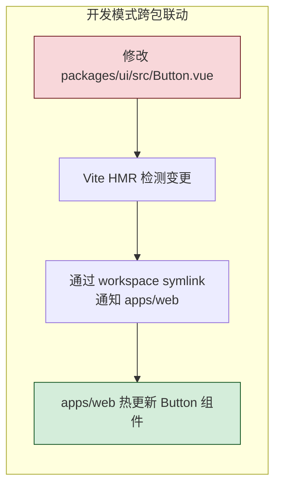

### 7.4 代码规范与 Git Hooks

```javascript
// packages/config/eslint-config.js
module.exports = {
  root: true,
  env: { browser: true, es2022: true, node: true },
  extends: [
    'eslint:recommended',
    '@vue/eslint-config-typescript',
    'prettier',
  ],
  rules: {
    'no-console': ['warn', { allow: ['warn', 'error'] }],
    'no-unused-vars': 'off',
    '@typescript-eslint/no-unused-vars': ['error', { argsIgnorePattern: '^_' }],
    '@typescript-eslint/explicit-function-return-type': 'off',
  },
};
```

```bash
# 配置 Husky Git Hooks
pnpm add -Dw husky lint-staged
pnpm husky init

# .husky/pre-commit
#!/bin/sh
npx lint-staged

# .husky/commit-msg
#!/bin/sh
npx --no-install commitlint --edit "$1"
```

```json
// commitlint.config.js
{
  "extends": ["@commitlint/config-conventional"],
  "rules": {
    "type-enum": [2, "always", [
      "feat", "fix", "docs", "style", "refactor", "test", "chore", "revert"
    ]]
  }
}
```

---

## 八、版本管理策略

### 8.1 语义化版本规范

```
版本号格式: MAJOR.MINOR.PATCH (如 1.4.2)

MAJOR: 不兼容的 API 修改
MINOR: 向下兼容的功能新增
PATCH: 向下兼容的问题修复

预发布: 1.0.0-beta.1 / 1.0.0-rc.1
```

### 8.2 Changesets 版本管理

Changesets 是 Monorepo 版本管理的标准方案，与 pnpm Workspace 深度集成。

```bash
# 安装 Changesets
pnpm add -Dw @changesets/cli

# 初始化
pnpm changeset init
```

```json
// .changeset/config.json
{
  "changelog": "@changesets/cli/changelog",
  "commit": false,
  "fixed": [],
  "linked": [["@repo/ui", "@repo/utils", "@repo/types"]],
  "access": "public",
  "baseBranch": "main",
  "updateInternalDependencies": "patch",
  "ignore": ["web", "admin", "mobile"]
}
```

**配置说明**：

| 字段 | 作用 |
|:-----|:-----|
| `linked` | 联动版本：列出的包保持相同版本号 |
| `access` | 发布可见性：`public`（公开）/ `restricted`（私有） |
| `updateInternalDependencies` | 内部依赖更新策略：`patch` / `minor` / `major` |
| `ignore` | 不发布的包（如 private 应用） |

### 8.3 发布流程

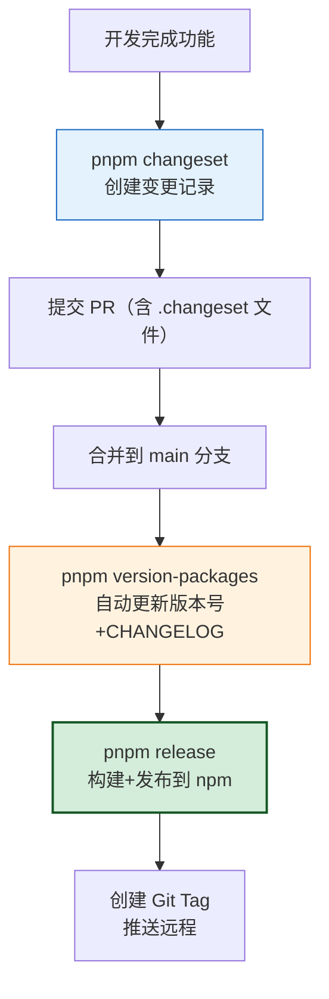

**具体操作步骤**：

```bash
# Step 1: 开发完成后，创建变更记录
pnpm changeset
# 交互式选择:
#   - 哪些包受影响？
#   - 版本变更类型? (major/minor/patch)
#   - 变更说明?

# 生成的文件示例:
# .changeset/happy-dogs-smile.md
# ---
# "@repo/ui": minor
# "@repo/utils": patch
# ---
# Button 组件新增 loading 属性
```

```bash
# Step 2: 提交变更记录并合并到 main
git add .changeset/
git commit -m "feat: add loading prop to Button"
git push

# Step 3: 合并 PR 后，消费变更记录
pnpm version-packages
# 自动执行:
#   - 读取所有 .changeset 文件
#   - 更新受影响包的 package.json 版本号
#   - 更新内部依赖的 workspace: 版本号
#   - 生成/更新 CHANGELOG.md
#   - 删除已消费的 .changeset 文件
#   - 创建版本提交和 git tag

# Step 4: 发布到 npm
pnpm release
# 自动执行:
#   - turbo run build（构建所有包）
#   - changeset publish（发布到 npm registry）
```

### 8.4 变更日志管理

Changesets 自动生成的 `CHANGELOG.md` 示例：

```markdown
# @repo/ui

## 1.1.0

### Minor Changes

- Button 组件新增 loading 属性，支持加载状态展示

### Patch Changes

- Updated dependencies
  - @repo/utils@1.0.1

## 1.0.0

### Major Changes

- 🎉 @repo/ui v1.0.0 正式发布，包含 Button/Input/Table 等核心组件
```

---

## 九、pnpm 在 Monorepo 中的核心优势

### 9.1 磁盘与安装效率

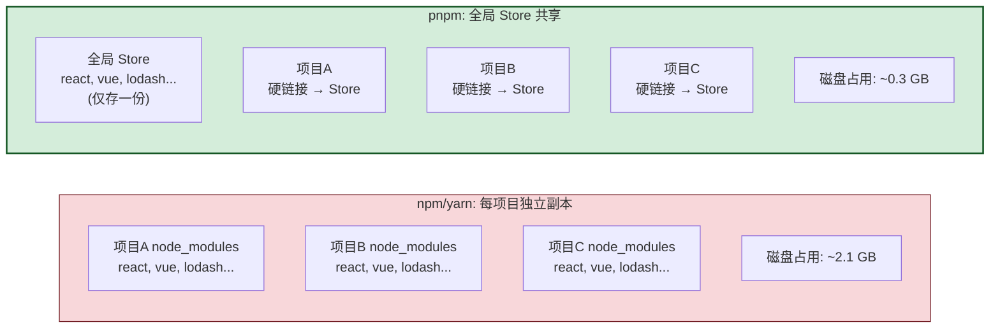

**Monorepo 中的磁盘收益放大**：Monorepo 内 10 个子包共用同一份 Store，依赖安装几乎零冗余。

### 9.2 严格依赖隔离

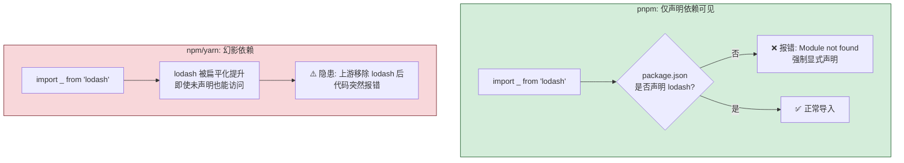

### 9.3 灵活的过滤机制

pnpm 的 `--filter` 是 Monorepo 中最强大的操作工具：

```bash
# 按包名过滤
pnpm --filter web build

# 按目录过滤
pnpm --filter "./apps/*" build

# 构建目标包及其所有依赖（^ 表示上游）
pnpm --filter web... build

# 构建目标包的所有下游依赖方
pnpm --filter ...@repo/ui build

# 排除特定包
pnpm --filter "!web" build

# 递归在所有包中执行
pnpm -r run test
```

**过滤选择器图解**：

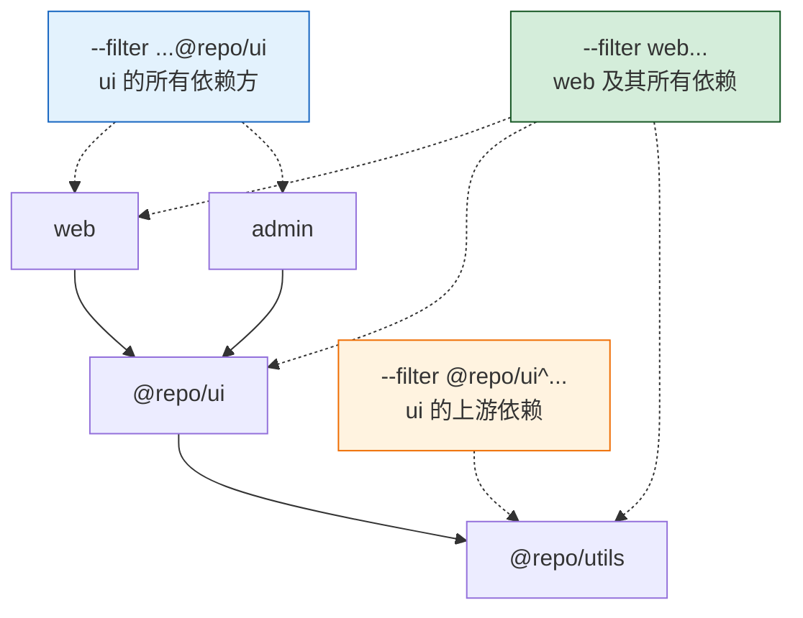

### 9.4 与其他方案对比

| 维度 | pnpm Workspace | Yarn Workspace | npm Workspace | Lerna |
|:-----|:-------------|:--------------|:-------------|:-----|
| **安装速度** | ⭐⭐⭐⭐⭐ | ⭐⭐⭐ | ⭐⭐ | ⭐⭐（依赖 npm/yarn） |
| **磁盘效率** | ⭐⭐⭐⭐⭐ | ⭐⭐ | ⭐ | ⭐ |
| **依赖隔离** | ⭐⭐⭐⭐⭐ | ⭐⭐ | ⭐ | ⭐⭐ |
| **过滤操作** | ⭐⭐⭐⭐⭐ | ⭐⭐⭐ | ⭐⭐ | ⭐⭐⭐⭐ |
| **版本管理** | ⭐⭐⭐⭐（Changesets） | ⭐⭐⭐ | ⭐⭐ | ⭐⭐⭐⭐⭐ |
| **社区生态** | ⭐⭐⭐⭐⭐ | ⭐⭐⭐⭐ | ⭐⭐⭐⭐⭐ | ⭐⭐⭐ |
| **维护状态** | ✅ 活跃 | ✅ 活跃 | ✅ 内置 | ⚠️ 已移交 |

---

## 十、实际应用场景

### 10.1 场景一：多端应用共享核心逻辑

**业务背景**：同一套业务逻辑需要同时在 Web、管理后台、移动端 H5 三个端运行。

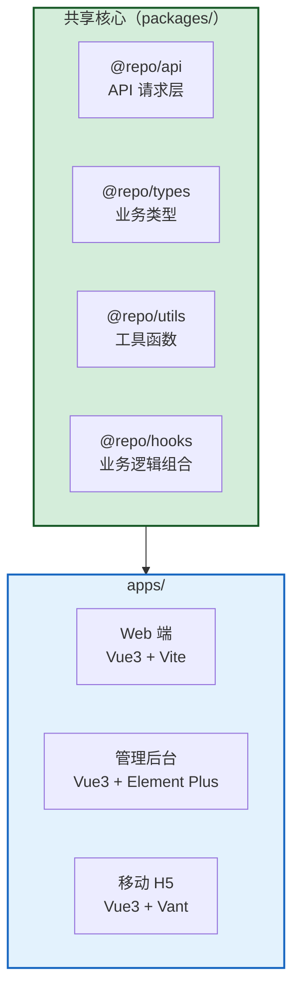

**优势**：业务逻辑（如订单流程、用户认证）只写一份，三端复用，修改即时生效。

### 10.2 场景二：企业级组件库与多应用

**业务背景**：企业内部维护一套 UI 组件库，多个项目共用。

```
my-monorepo/
├── packages/
│   └── ui/                  # 企业 UI 组件库（可发布到私有 npm）
│       ├── src/
│       │   ├── components/   # 50+ 业务组件
│       │   └── styles/       # 设计令牌（主题色/字体/间距）
│       └── package.json
├── apps/
│   ├── portal/              # 门户应用
│   ├── admin/               # 管理后台
│   └── dashboard/           # 数据看板
└── pnpm-workspace.yaml
```

**优势**：组件修改后所有应用即时生效；组件库可独立发布到私有 npm 供其他仓库使用。

### 10.3 场景三：微前端架构基座

**业务背景**：微前端架构中，主应用与子应用共享路由、权限、通信等基础能力。

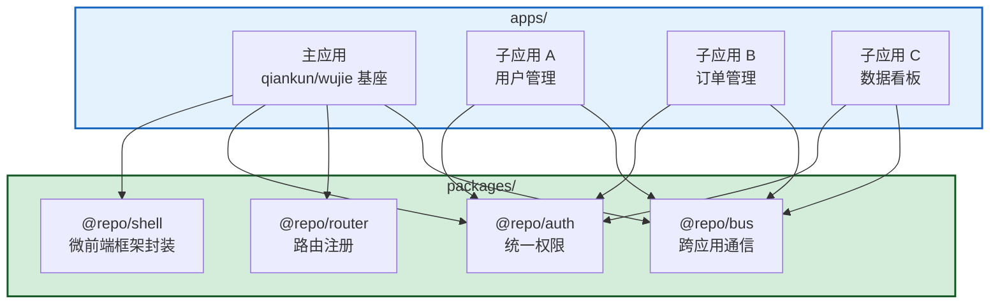

---

## 十一、CI/CD 与部署

### 11.1 CI 流水线设计

```yaml
# .github/workflows/ci.yml
name: CI

on:
  push:
    branches: [main, develop]
  pull_request:
    branches: [main]

jobs:
  ci:
    runs-on: ubuntu-latest
    steps:
      - uses: actions/checkout@v4

      - uses: pnpm/action-setup@v4
        with:
          version: 9

      - uses: actions/setup-node@v4
        with:
          node-version: 20
          cache: 'pnpm'

      # 关键: frozen-lockfile 确保依赖一致性
      - name: Install dependencies
        run: pnpm install --frozen-lockfile

      # 并行执行 lint + type-check
      - name: Lint
        run: pnpm lint

      - name: Type check
        run: pnpm -r exec tsc --noEmit

      # 增量构建（Turborepo 自动缓存）
      - name: Build
        run: pnpm build

      # 测试
      - name: Test
        run: pnpm test

      # Turborepo 远程缓存（可选，加速 CI）
      - name: Configure Turbo Remote Cache
        if: github.ref == 'refs/heads/main'
        env:
          TURBO_TOKEN: ${{ secrets.TURBO_TOKEN }}
          TURBO_TEAM: ${{ vars.TURBO_TEAM }}
        run: echo "Remote cache configured"
```

### 11.2 Docker 多阶段构建

```dockerfile
# apps/web/Dockerfile
FROM node:20-slim AS base
RUN corepack enable
WORKDIR /app

# === Stage 1: 安装依赖 ===
FROM base AS deps
COPY pnpm-lock.yaml pnpm-workspace.yaml package.json ./
COPY apps/web/package.json ./apps/web/
COPY packages/ui/package.json ./packages/ui/
COPY packages/utils/package.json ./packages/utils/
COPY packages/api/package.json ./packages/api/
RUN pnpm install --frozen-lockfile

# === Stage 2: 构建 ===
FROM base AS builder
COPY --from=deps /app/node_modules ./node_modules
COPY --from=deps /app/packages/*/node_modules ./packages/
COPY . .
RUN pnpm --filter web build

# === Stage 3: 运行 ===
FROM nginx:1.25-alpine AS runner
COPY --from=builder /app/apps/web/dist /usr/share/nginx/html
COPY apps/web/nginx.conf /etc/nginx/conf.d/default.conf
EXPOSE 80
CMD ["nginx", "-g", "daemon off;"]
```

### 11.3 增量构建与缓存策略

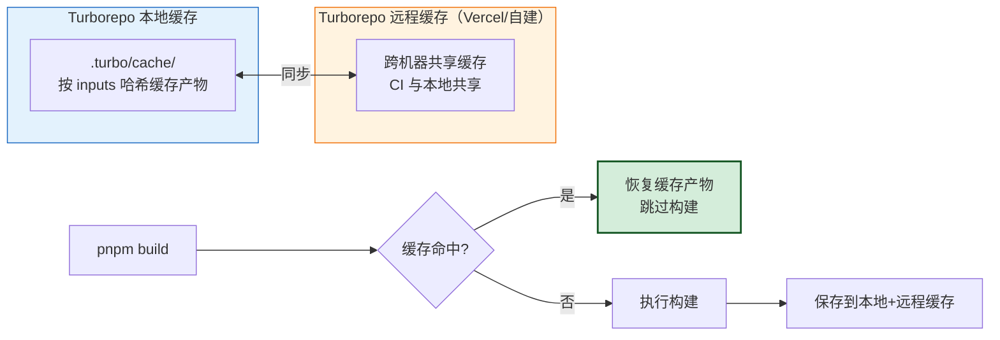

**缓存命中率优化**：
- 精确配置 `inputs`（避免无关文件变更触发重建）
- 将 `turbo.json` 纳入版本控制
- 启用远程缓存，CI 与本地开发共享缓存

---

## 十二、总结与最佳实践

### 最佳实践清单

| 编号 | 实践 | 说明 |
|:----:|:-----|:-----|
| BP1 | **锁定 pnpm 版本** | 根 `package.json` 设置 `packageManager` 字段，配合 Corepack 统一 |
| BP2 | **统一 lockfile** | 保持 `shared-workspace-lockfile=true`，全局依赖版本一致 |
| BP3 | **使用 catalog 管理依赖版本** | pnpm 9.5+ 的 catalog 机制统一第三方依赖版本 |
| BP4 | **分层依赖设计** | L1 应用 → L2 业务能力 → L3 基础能力，依赖只能向下 |
| BP5 | **开发模式用源码 alias** | Vite alias 指向 `src/` 而非 `dist/`，实现跨包 HMR |
| BP6 | **CI 使用 frozen-lockfile** | 禁止 CI 修改 lockfile，保证依赖一致性 |
| BP7 | **Turborepo 增量构建** | 配置 `dependsOn: ["^build"]` 按依赖拓扑构建 |
| BP8 | **Changesets 管理版本** | 变更记录 + 自动版本递增 + CHANGELOG 生成 |
| BP9 | **共享 ESLint/Prettier/TS 配置** | 抽取到 `@repo/config` 包，各子包继承 |
| BP10 | **Docker 分层缓存** | 先复制 lockfile + package.json，再 install，利用层缓存 |

### 架构知识图谱

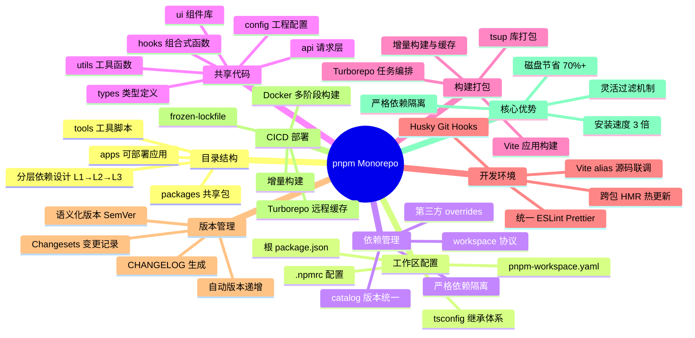

> **总结**：基于 pnpm + Monorepo 的项目架构，通过**全局 Store 硬链接共享**实现磁盘与安装效率，通过**workspace 协议 + symlink**实现包间即时联动，通过**Turborepo**实现增量构建与缓存，通过**Changesets**实现自动化版本管理。该架构特别适合多端应用共享核心逻辑、企业级组件库、微前端基座等场景，是 2024-2025 年中大型前端项目的推荐工程化方案。
